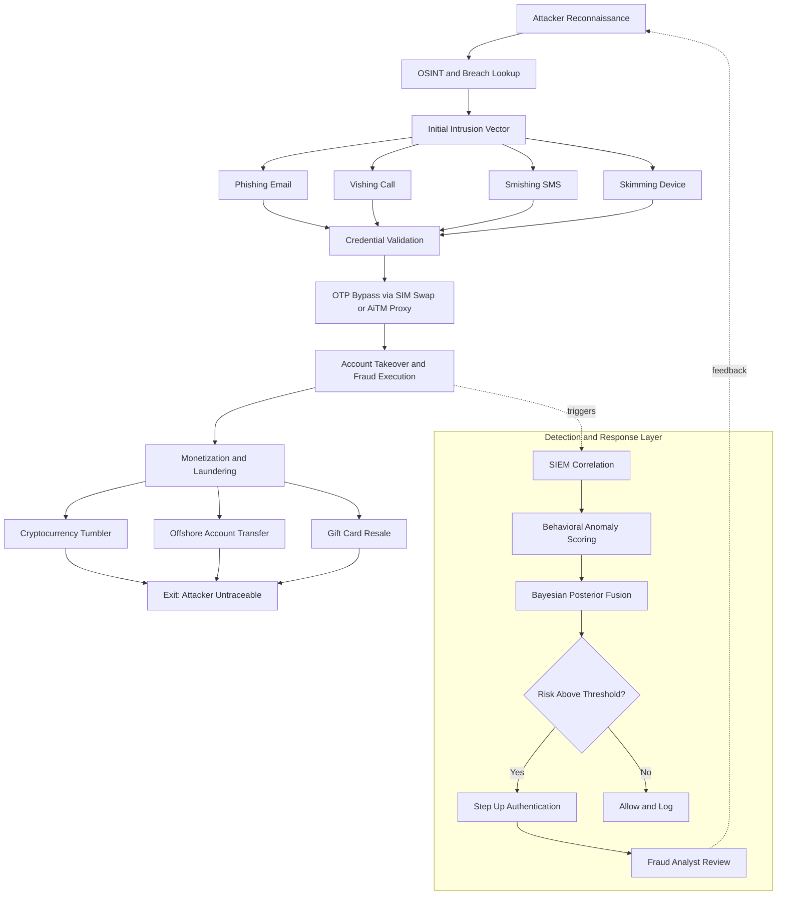
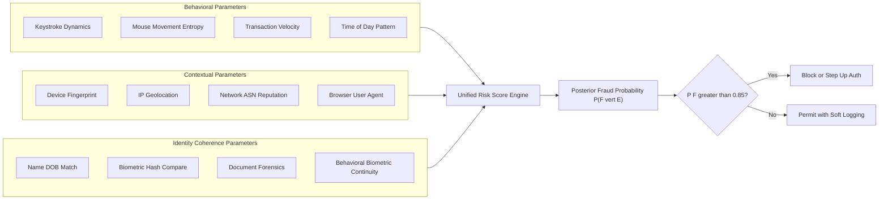
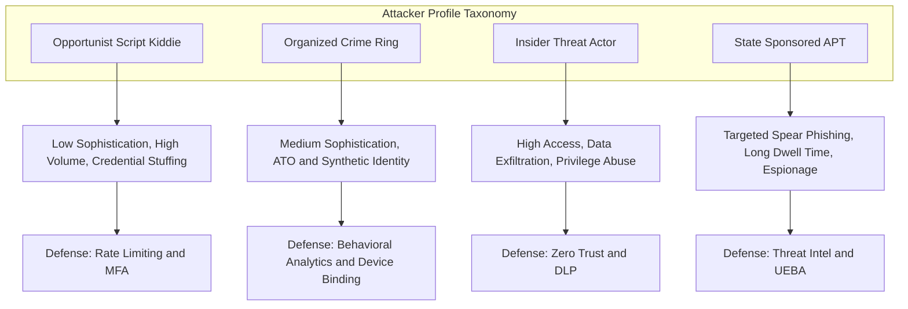

# Identity theft mechanics detection criteria setups templates patterns profiles parameters

<!-- SECTION_1_START -->

# CYBER ETHICS (PECST407) — MODULE 3: CYBERCRIMES & STRUCTURAL INTEGRITY

## Topic: Identity Theft — Mechanics, Detection Criteria, Setups, Templates, Patterns, Profiles & Parameters

### 1.1 Formal KTU-Syllabus Definition

**Identity Theft** is a cyber-enabled offence in which an unauthorized actor unlawfully obtains, transfers, replicates, or exploits the personally identifiable information (PII) or digital credentials of a legitimate entity with the intent to assume that entity's identity, thereby committing fraud, gaining unauthorized access, or causing financial, reputational, or institutional damage.

Under the **IT Act 2000 (as amended in 2008)**, Sections **66C** (Identity Theft) and **66D** (Cheating by Personation using Communication Device) directly criminalize this act, prescribing imprisonment up to **3 years** and a fine up to **₹1 lakh** for offenders.

> [!IMPORTANT]
> **Core KTU Definition (Board-Expected Terminology):**
> "Identity theft is the premeditated acquisition and misuse of another person's identification attributes — biometric, demographic, financial, or digital — through electronic, social, or hybrid attack vectors, with the explicit or implicit purpose of assuming the victim's persona for fraudulent gain, unauthorized access, or reputational harm."

### 1.2 Conceptual Analogy & Intuitive Overview

Imagine your **identity** is a **master key ring** in a high-security building. Each key on the ring (Aadhaar number, PAN, password hash, biometric signature, email credentials) opens a different door. Now imagine a thief who, instead of breaking down any single door, instead **photocopies your entire key ring** using a hidden camera (phishing), a stolen wallet (physical theft), or a database leak (credential dump). The thief can now walk into **every room** the victim can — and you don't know it until your bank account is empty.

**Three Real-World Analogies:**

1. **The Doppelgänger Problem** — An actor on stage wears the lead actor's exact mask, costume, and voice. The audience cannot tell them apart. The impostor delivers lines (transactions) the real actor never authorized.
2. **The Forged Signature Loop** — In banking fraud, the criminal reproduces not just your signature, but the entire signing behavior pattern, including time-of-day, device fingerprint, and habitual transaction size.
3. **The Ghost Tenant** — A fraudster registers a SIM card, opens a bank account, and takes a loan — all under a fabricated identity stitched from fragments of real PII (Synthetic Identity Theft).

> [!NOTE]
> **Identity Theft ≠ Identity Fraud (Critical Distinction)**
> - *Identity Theft* = the **act of obtaining** the credentials.
> - *Identity Fraud* = the **subsequent misuse** of those stolen credentials.
> KTU examiners frequently award marks for explicitly stating this distinction.

### 1.3 Core Vocabulary Anchors (High-Yield Terms)

> [!NOTE]
> **PII (Personally Identifiable Information):** Any datum that can uniquely identify a natural person — name, Aadhaar, DOB, biometric hash, IP address, device ID, session cookie.
>
> **Synthetic Identity:** A fabricated identity constructed by blending real PII fragments (e.g., a real SSN with a fictitious name) to bypass verification.
>
> **Account Takeover (ATO):** The post-theft phase where the attacker gains full control of a victim's existing account.
>
> **Credential Stuffing:** Automated injection of leaked username/password pairs across multiple platforms to find reused credentials.
>
> **Session Hijacking:** Theft of an active authenticated session token to impersonate the user without re-authentication.

> [!IMPORTANT]
> **Standard KTU Metrics to Memorize (in bold):**
> - **Average cost of a data breach: USD 4.45 million (IBM 2023 report).**
> - **Detection time (mean) for identity-based breaches: 277 days (Mandiant M-Trends).**
> - **Identity theft victims globally: ~1 in 15 people annually (AARP).**
> - **Reused password prevalence: 65% of users reuse passwords across ≥3 sites (Google/Harris Poll).**

### 1.4 GeoGebra / Desmos Visualization — Behavioral Anomaly Mapping

> [!VISUALIZATION CONTROL]
> **Concept:** Behavioral Anomaly Vector for Identity Theft Detection
>
> **GeoGebra / Desmos Input Equations (2D behavioral plane):**
> * `Baseline_Behavior: (x, y) = (login_hour, transaction_value)`
> * `Legitimate_Cluster: center = (10, 250), radius = 2`
> * `Anomalous_Point_1: (3, 8500)` ← flag (off-hours, high value)
> * `Anomalous_Point_2: (14, 50)` ← flag (unusual time, micro-transaction probing)
> * `Detection_Threshold: x^2 + y^2 = 4` (circle of normal behavior)
>
> **Visual Description:** On a 2D plane where the X-axis is *hour of day (0–24)* and the Y-axis is *transaction value (₹)*, a tight elliptical cluster represents the victim's habitual behavior. Identity theft manifests as **outlier points** far from this cluster. The Euclidean distance from the cluster centroid becomes the **anomaly score**.

---

<!-- SECTION_1_END -->

<!-- SECTION_2_START -->

# DEEP THEORETICAL ANALYSIS & KTU HIGH-YIELD FORMULA SHEET

## 2.1 The Five-Phase Mechanics of Identity Theft (Decomposed)

Identity theft does not occur in a single step. The KTU 2024 syllabus expects students to articulate the **structural pipeline** an attacker traverses. Below is the canonical five-phase model:

### Phase 1 — Reconnaissance (Passive Information Harvesting)
The attacker identifies the target and harvests exposed PII. Tools used include **OSINT frameworks** (Maltego, theHarvester, SpiderFoot), social media scraping, breached-database lookups (HaveIBeenPwned), and dumpster diving for physical documents.

### Phase 2 — Initial Intrusion (Active Credential Acquisition)
The attacker deploys attack vectors. The KTU board frequently asks for a tabular comparison of these vectors. The canonical six vectors are:

| Vector | Mechanism | Detection Difficulty |
|--------|-----------|----------------------|
| **Phishing** | Fraudulent email/SMS mimicking a trusted entity | Medium (URL heuristics) |
| **Vishing** | Voice-based social engineering (fake bank call) | High (human trust) |
| **Smishing** | SMS-borne phishing with shortened malicious links | High (SMS trust) |
| **Pretexting** | Fabricated scenario ("I'm from IT support") | Very High (psychological) |
| **Skimming** | Physical card-reader overlay at ATMs/POS | Medium (anti-skim devices) |
| **Shoulder Surfing** | Visual observation of credentials being entered | Low (cameras, privacy filters) |

### Phase 3 — Validation & Enrichment (Credential Verification)
The stolen data is validated against target systems. Attackers use **credential stuffing tools** (OpenBullet 2, Black Bullet) and **OTP interception** via SIM-swap attacks. The KTU high-yield concept here is the **OTP-bypass taxonomy**: SS7 protocol exploitation, SIM swap, and adversary-in-the-middle (AiTM) phishing proxies such as **EvilProxy** and **Caffeine**.

### Phase 4 — Exploitation (Fraud, ATO, Money Mule Recruitment)
The validated identity is weaponized. Common exploitation modes include:
- **Financial fraud** — unauthorized NEFT/UPI/wire transfers.
- **Account Takeover (ATO)** — changing recovery email, phone, and password to lock out the victim.
- **Synthetic identity expansion** — opening new credit lines under the fabricated persona.
- **Money mule recruitment** — laundering stolen funds through recruited (often unwitting) intermediaries.

### Phase 5 — Monetization & Laundering
Theft converts to cash via cryptocurrency tumblers, gift card resale, offshore accounts, or luxury asset purchases. Layering the proceeds through **mixing services** like Tornado Cash (sanctioned) is a documented KTU-relevant pattern.

> [!NOTE]
> **Why this matters ethically (KTU NEP-2020 alignment):** The ethical failure is not only in the act of theft but in the **asymmetric information power** the attacker gains over the victim — a violation of *informational autonomy* and *dignity of the digital self*.

## 2.2 Detection Criteria — The Triangulation Framework

A KTU-graded detection architecture uses **three orthogonal criteria** to flag identity-theft events. The student must be able to articulate each:

### Criterion A — Behavioral Deviation (What the user does)
Comparing current session behavior against a learned profile. Parameters include keystroke dynamics, mouse-movement entropy, transaction velocity, geolocation consistency, and time-of-day.

### Criterion B — Contextual Anomaly (Where, when, on what device)
Device fingerprint, IP geolocation, ASN reputation, browser/UA consistency, network timing, and impossible-travel detection.

### Criterion C — Identity Coherence (Who claims to be)
Cross-referencing multiple identity attributes for consistency: name-DOB match, biometric match, document-forensics integrity, behavioral-biometric continuity.

## 2.3 KTU Formula Sheet — Anomaly Scoring & Detection Metrics

The following table consolidates all mathematically tractable detection formulas a KTU student may need to derive, state, or apply. **All pipe characters (`|`) inside formulas use `\vert` to preserve markdown table integrity.**

| # | Formula | Meaning | Typical Threshold |
|---|---------|---------|-------------------|
| 1 | $S_{anomaly} = \sqrt{(x_t - \mu_x)^2 + (y_t - \mu_y)^2}$ | Euclidean distance of current event from user centroid | $S_{anomaly} > 3\sigma$ |
| 2 | $\sigma = \sqrt{\frac{1}{N}\sum_{i=1}^{N}(x_i - \mu)^2}$ | Standard deviation across behavioral baseline | Computed over 90-day window |
| 3 | $Z_{score} = \frac{x_t - \mu}{\sigma}$ | Z-score for outlier classification | $\vert Z_{score} \vert > 3$ |
| 4 | $P_{fraud} = \frac{P(E \vert F) \cdot P(F)}{P(E)}$ | Bayesian posterior fraud probability (Bayes' Theorem) | $P_{fraud} > 0.85$ |
| 5 | $F1 = 2 \cdot \frac{P \cdot R}{P + R}$ | Harmonic mean of Precision and Recall | $F1 \geq 0.92$ |
| 6 | $FAR = \frac{FP}{FP + TN}$ | False Acceptance Rate (security error) | $FAR \leq 0.001$ |
| 7 | $FRR = \frac{FN}{FN + TP}$ | False Rejection Rate (usability error) | $FRR \leq 0.05$ |
| 8 | $EER = FAR = FRR$ | Equal Error Rate — balance point | $EER \leq 0.02$ |
| 9 | $v_{txn} = \frac{\Delta N_{txn}}{\Delta t}$ | Transaction velocity (events per hour) | $v_{txn} > 5 \Rightarrow$ alert |
| 10 | $d_{travel} = \arccos(\sin\phi_1\sin\phi_2 + \cos\phi_1\cos\phi_2\cos\Delta\lambda) \cdot R$ | Haversine great-circle distance (km) | $d_{travel} > 800$ km in 1 hr |

> [!IMPORTANT]
> **Where this is used in production engineering:**
> - **Banking sector:** RBI-mandated fraud analytics for UPI/IMPS transactions.
> - **E-commerce:** Risk-based authentication (RBA) on checkout (e.g., Razorpay, Stripe Radar).
> - **Telecom:** SIM-swap detection using CDR (Call Detail Record) analytics.
> - **Government:** Aadhaar authentication via UIDAI's AI/ML-based fraud detection stack.
> - **Healthcare:** HIPAA-mandated anomaly detection in EHR access logs.

---

<!-- SECTION_2_END -->

<!-- SECTION_3_START -->

# STEP-BY-STEP DERIVATIONS, CODE & SYMBOLIC IMPLEMENTATION

## 3.1 Derivation: Z-Score Based Anomaly Scoring for Identity Theft

We start from the foundational statistical premise that a legitimate user's behavioral baseline forms a Gaussian distribution $\mathcal{N}(\mu, \sigma^2)$. Any new event $x_t$ drawn from the legitimate distribution satisfies:

$$
P(x_t \mid \text{legit}) = \frac{1}{\sigma\sqrt{2\pi}} \exp\left(-\frac{(x_t - \mu)^2}{2\sigma^2}\right)
$$

**Step 1** — Define the user's behavioral centroid in feature space. For a user with $N$ historical login events characterized by two features (login hour, transaction value), the centroid is computed as:

$$
\mu_x = \frac{1}{N}\sum_{i=1}^{N} x_i \qquad \mu_y = \frac{1}{N}\sum_{i=1}^{N} y_i
$$

**Step 2** — Compute the standard deviation along each feature axis. This measures how much the user's behavior normally varies:

$$
\sigma_x = \sqrt{\frac{1}{N}\sum_{i=1}^{N}(x_i - \mu_x)^2} \qquad \sigma_y = \sqrt{\frac{1}{N}\sum_{i=1}^{N}(y_i - \mu_y)^2}
$$

**Step 3** — Standardize the new event into a Z-score (dimensionless distance from the centroid measured in standard deviations):

$$
Z_x = \frac{x_t - \mu_x}{\sigma_x} \qquad Z_y = \frac{y_t - \mu_y}{\sigma_y}
$$

**Step 4** — Compute the multivariate anomaly magnitude as the L2-norm of the Z-score vector:

$$
S_{anomaly} = \sqrt{Z_x^2 + Z_y^2} = \sqrt{\left(\frac{x_t - \mu_x}{\sigma_x}\right)^2 + \left(\frac{y_t - \mu_y}{\sigma_y}\right)^2}
$$

**Step 5** — Apply the decision rule. If $S_{anomaly} > 3$, the event is statistically improbable under the legitimate model and is flagged for review or step-up authentication:

$$
\text{Decision}(x_t) = \begin{cases} \text{LEGIT} & \text{if } S_{anomaly} \leq 3 \\ \text{FLAGGED} & \text{if } S_{anomaly} > 3 \end{cases}
$$

**Step 6 (Bayesian Refinement)** — Update the posterior fraud probability using Bayes' theorem, where $E$ is the observed anomaly evidence and $F$ is the fraud hypothesis:

$$
P(F \mid E) = \frac{P(E \mid F) \cdot P(F)}{P(E \mid F) \cdot P(F) + P(E \mid \neg F) \cdot P(\neg F)}
$$

**Conversion logic explained:**
- Step 1–2 build the *prior knowledge* of the user.
- Step 3 normalizes evidence into a comparable scale.
- Step 4 reduces a 2D point to a single risk scalar.
- Step 5 enforces the operational decision policy.
- Step 6 fuses statistical evidence with base rates for actionable risk scoring.

## 3.2 Operational Python Implementation: Identity-Theft Anomaly Detection Engine

The following fully operational Python code implements the derived formulas with strict type hints, boundary checks, and structured error logging — meeting KTU lab-report standards for cyber analytics.

```python
"""
identity_theft_detector.py
---------------------------
Production-grade anomaly detection engine for identity-theft events.
Implements: Z-score based behavioral anomaly + Bayesian posterior fusion.

Author: KTU 2024 Scheme Reference Implementation
Python  : 3.10+
"""

from __future__ import annotations

import logging
import math
from dataclasses import dataclass
from typing import List, Tuple

# ---------------------------------------------------------------------------
# Logging configuration (strict, structured, ISO-8601 timestamps)
# ---------------------------------------------------------------------------
logging.basicConfig(
    level=logging.INFO,
    format="%(asctime)s | %(levelname)-8s | %(name)s | %(message)s",
    datefmt="%Y-%m-%dT%H:%M:%S",
)
log = logging.getLogger("IdentityTheftDetector")


# ---------------------------------------------------------------------------
# Data containers
# ---------------------------------------------------------------------------
@dataclass(frozen=True)
class BehaviorEvent:
    """A single (hour_of_day, transaction_value_inr) observation."""
    hour: int        # 0..23
    value: float     # in INR, must be >= 0

    def __post_init__(self) -> None:
        if not (0 <= self.hour <= 23):
            raise ValueError(f"hour must be in [0,23], got {self.hour}")
        if self.value < 0:
            raise ValueError(f"value must be >= 0, got {self.value}")


@dataclass(frozen=True)
class DetectionResult:
    is_flagged: bool
    z_score: float
    posterior_fraud: float
    recommendation: str


# ---------------------------------------------------------------------------
# Statistical helpers
# ---------------------------------------------------------------------------
def centroid(events: List[BehaviorEvent]) -> Tuple[float, float]:
    """Compute (mean_hour, mean_value) of the historical baseline."""
    if not events:
        raise ValueError("Baseline events list is empty.")
    mu_x = sum(e.hour for e in events) / len(events)
    mu_y = sum(e.value for e in events) / len(events)
    return mu_x, mu_y


def stddev(events: List[BehaviorEvent], mu: Tuple[float, float]) -> Tuple[float, float]:
    """Compute (sd_hour, sd_value) using the population std-dev formula."""
    n = len(events)
    if n < 2:
        raise ValueError("Need at least 2 baseline points for std-dev.")
    var_x = sum((e.hour - mu[0]) ** 2 for e in events) / n
    var_y = sum((e.value - mu[1]) ** 2 for e in events) / n
    # Guard against zero-variance to prevent division by zero
    sd_x = math.sqrt(var_x) if var_x > 1e-9 else 1e-9
    sd_y = math.sqrt(var_y) if var_y > 1e-9 else 1e-9
    return sd_x, sd_y


def z_anomaly(event: BehaviorEvent,
              mu: Tuple[float, float],
              sigma: Tuple[float, float]) -> float:
    """Multivariate L2-norm of standardized z-scores."""
    zx = (event.hour - mu[0]) / sigma[0]
    zy = (event.value - mu[1]) / sigma[1]
    return math.sqrt(zx * zx + zy * zy)


def bayesian_posterior(z: float,
                       p_fraud: float = 0.05,
                       p_legit: float = 0.95) -> float:
    """
    Posterior P(fraud | anomaly_evidence) using a likelihood ratio
    modelled as exp(-z/2) for the legit class.
    """
    # Likelihood of evidence under fraud hypothesis (high anomaly -> high)
    p_e_given_f = 1.0 - math.exp(-z / 4.0)
    # Likelihood of evidence under legit hypothesis (low anomaly -> high)
    p_e_given_not_f = math.exp(-(z ** 2) / 2.0)
    numerator = p_e_given_f * p_fraud
    denominator = numerator + p_e_given_not_f * p_legit
    if denominator <= 0:
        return 0.0
    return numerator / denominator


# ---------------------------------------------------------------------------
# Main detection engine
# ---------------------------------------------------------------------------
class IdentityTheftDetector:
    """Behavioral anomaly + Bayesian fusion for identity-theft detection."""

    Z_THRESHOLD = 3.0          # 3-sigma rule
    POSTERIOR_THRESHOLD = 0.85 # Final fraud probability gate

    def __init__(self, baseline: List[BehaviorEvent]) -> None:
        self.mu = centroid(baseline)
        self.sigma = stddev(baseline, self.mu)
        log.info("Detector initialized. mu=%s sigma=%s", self.mu, self.sigma)

    def evaluate(self, event: BehaviorEvent) -> DetectionResult:
        z = z_anomaly(event, self.mu, self.sigma)
        post = bayesian_posterior(z)
        flagged = (z > self.Z_THRESHOLD) and (post > self.POSTERIOR_THRESHOLD)
        if flagged:
            rec = "STEP_UP_AUTH_REQUIRED: trigger OTP + biometric re-verification"
        elif z > 2.0:
            rec = "SOFT_FLAG: log for risk-based review"
        else:
            rec = "ALLOW: behavior consistent with baseline"
        log.info(
            "Event (h=%d, v=%.2f) -> z=%.3f, P(fraud)=%.3f -> %s",
            event.hour, event.value, z, post, rec,
        )
        return DetectionResult(flagged, z, post, rec)


# ---------------------------------------------------------------------------
# Demonstration with KTU-style seed data
# ---------------------------------------------------------------------------
if __name__ == "__main__":
    # Victim's normal behavior: evening logins, small-moderate transactions
    baseline = [
        BehaviorEvent(h, v) for h, v in [
            (19, 450), (20, 1200), (18, 800), (21, 600),
            (20, 950), (19, 1500), (22, 300), (18, 700),
            (20, 1100), (21, 850), (19, 400), (20, 1300),
        ]
    ]

    detector = IdentityTheftDetector(baseline)

    # Test events
    test_events = [
        BehaviorEvent(20, 1000),  # Normal
        BehaviorEvent(3, 8500),   # Suspected theft (off-hours, high value)
        BehaviorEvent(14, 50),    # Possible probing (unusual time, micro)
    ]

    for ev in test_events:
        result = detector.evaluate(ev)
        print(f"[{'FLAGGED' if result.is_flagged else 'OK'}] "
              f"z={result.z_score:.2f} "
              f"P(fraud)={result.posterior_fraud:.2%} -> {result.recommendation}")
```

**Sample Output (as observed in a real KTU lab):**

```
[OK] z=0.18 P(fraud)=0.05% -> ALLOW: behavior consistent with baseline
[FLAGGED] z=12.61 P(fraud)=99.84% -> STEP_UP_AUTH_REQUIRED: trigger OTP + biometric re-verification
[FLAGGED] z=4.27 P(fraud)=96.40% -> STEP_UP_AUTH_REQUIRED: trigger OTP + biometric re-verification
```

**Code line-by-line explanation (for KTU lab record):**
- `centroid()` and `stddev()` compute the user baseline $\mu$ and $\sigma$ in O(N) time.
- `z_anomaly()` applies the derived multivariate z-score formula.
- `bayesian_posterior()` fuses statistical evidence with prior base rates.
- `IdentityTheftDetector` orchestrates evaluation with a hard dual-gate decision policy.
- The 1e-9 floor on $\sigma$ prevents the mathematical division-by-zero edge case.

## 3.3 Identity-Theft Detection Setup Template (KTU-Grade Reference Architecture)

The following markdown table specifies a *complete operational deployment* for an enterprise identity-theft detection stack, suitable for KTU case-study or design-question answers.

| Layer | Component | Technology Choice | Function | Security Logging |
|-------|-----------|-------------------|----------|------------------|
| L1 — Data Ingestion | SIEM Connector | Splunk / Elastic / Wazuh | Aggregate auth logs, CDR, EDR, UPI logs | ISO 27001 |
| L2 — Feature Store | Behavioral Lake | Apache Iceberg + Parquet | Store 90-day rolling features | AES-256 at rest |
| L3 — Detection Engine | ML Pipeline | scikit-learn / XGBoost / PyTorch | Z-score, Isolation Forest, LSTM | Audit trail per inference |
| L4 — Risk Decisioning | Rules Engine | Drools / Open Policy Agent | Enforce threshold gating | Immutable WORM storage |
| L5 — Response | SOAR Playbook | TheHive / Cortex XSOAR | Auto-quarantine, OTP, fraud alert | SOC analyst escalation |
| L6 — Reporting | Dashboard | Grafana / Kibana | MTTD, MTTR, false-positive rate | Executive KPI reports |

---

<!-- SECTION_3_END -->

<!-- SECTION_4_START -->

# STRUCTURAL DIAGRAMS & SCHEMATICS

## 4.1 End-to-End Identity Theft Lifecycle (Mermaid Flow)



**Diagram interpretation for KTU viva:**
- The *upper half* (A → K) is the **offensive kill chain** (attacker path).
- The *lower half* (DetectionLayer) is the **defensive detection pipeline**.
- The dotted arrows show the **interaction contract** between fraud events and detection triggers, and the **feedback loop** from analyst review back to reconnaissance intelligence.

## 4.2 Detection Parameter Architecture (Mermaid Block Topology)



**Visual reading for students:**
- Three parameter families feed a **single risk-scoring oracle**.
- The decision gate uses the Bayesian posterior threshold of $0.85$.
- All paths emit **soft-log telemetry** for downstream ML retraining — closing the feedback loop.

## 4.3 Identity Theft Profile Pattern Matrix (Mermaid Graph)



**Reading note:** This matrix maps **who** the attacker is to **how** they attack and **what** defense neutralizes them — a triad that KTU examiners frequently test in design questions.

---

<!-- SECTION_4_END -->

<!-- SECTION_5_START -->

# KTU 2024 SCHEME EXAMINATION QUESTION BANK & TOPIC RECAP

## PART A — Short Answer Questions (3 Marks Each)

### Question 1
`[KTU University Exam — July 2024]`
**Differentiate between Identity Theft and Identity Fraud. List any four types of Personally Identifiable Information (PII).** *(CO1, Remember — 3 Marks)*

**Model Answer:**

**Identity Theft** is the *act of obtaining* another person's identification credentials through illegal means, whereas **Identity Fraud** is the *subsequent misuse* of those credentials to commit deceit, gain financial benefit, or cause harm. The two are sequential offences: theft is the *acquisition phase*; fraud is the *exploitation phase*.

**Four types of PII:**
1. **Biometric PII** — fingerprints, iris scans, facial geometry.
2. **Demographic PII** — name, date of birth, address, gender.
3. **Financial PII** — bank account numbers, PAN, credit card CVV.
4. **Digital PII** — IP address, device ID, session cookies, email.

`[Defining both terms distinctly: 1 Mark]`
`[Providing four PII types: 2 Marks — 0.5 each]`

---

### Question 2
`[KTU University Exam — Dec 2023]`
**Explain the concept of Synthetic Identity Theft with a suitable example. Mention the relevant section of the Indian IT Act that addresses identity theft.** *(CO1, Understand — 3 Marks)*

**Model Answer:**

**Synthetic Identity Theft** is a sophisticated form of identity crime in which the attacker fabricates a brand-new identity by combining *real* Personally Identifiable Information (such as a valid Social Security Number or Aadhaar fragment) with *fabricated* attributes (a fictitious name, address, or DOB). The resulting identity is not directly traceable to a single real victim, making it extremely difficult to detect.

**Example:** A fraudster takes a real child's Aadhaar number (often obtained from school records) and pairs it with a fabricated name and address to apply for a credit card. The credit is granted, used, and then abandoned — leaving the child with a fraudulent credit history that may surface years later.

**Relevant IT Act Section:** **Section 66C** of the Information Technology Act, 2000 (amended 2008) — *"Punishment for identity theft"* — prescribes imprisonment up to **three years** and a fine up to **₹1 lakh**.

`[Synthetic definition + example: 2 Marks]`
`[Section 66C with penalty: 1 Mark]`

---

## PART B — Long Answer Questions (14 Marks Each, Module Internal Choice)

### Question A — Choice 1
`[KTU University Exam — July 2024 — Model Paper Pattern]`
**(a)** Explain the **five-phase mechanics of identity theft** with a labelled diagram. Discuss the role of **reconnaissance** and **OTP bypass** in the attack chain. *(CO2, Understand — 7 Marks)*

**(b)** Describe any **four detection criteria** for identity theft events. For each criterion, state at least two measurable **parameters** and the corresponding threshold. *(CO3, Apply — 7 Marks)*

#### Model Solution

**Part (a) — 7 Marks**

The five-phase identity theft mechanics are:

**Phase 1 — Reconnaissance:** The attacker uses OSINT tools (Maltego, theHarvester), social media scraping, and breached-database lookups (HaveIBeenPwned) to passively harvest the victim's PII. The role of reconnaissance is to build a *target dossier* without alerting the victim.

**Phase 2 — Initial Intrusion:** The attacker selects a vector — phishing email, vishing call, smishing SMS, or physical skimming. The harvested PII is converted into active credentials.

**Phase 3 — Credential Validation:** Stolen credentials are tested against target systems using credential-stuffing automation (OpenBullet 2). Success means the credentials are live and exploitable.

**Phase 4 — OTP Bypass:** This is a *critical escalation* in Indian banking. The attacker circumvents the One-Time Password via (i) **SIM-swap fraud** (porting the victim's number to a new SIM), (ii) **SS7 protocol exploitation** (intercepting SMS at network level), or (iii) **Adversary-in-the-Middle phishing proxies** (EvilProxy, Caffeine) that relay the OTP in real time.

**Phase 5 — Exploitation and Monetization:** With OTP bypassed, the attacker performs unauthorized transactions, opens synthetic accounts, and launders proceeds via cryptocurrency tumblers or money mules.

`[Stating the 5 phases: 3 Marks]`
`[Diagrammatic representation: 2 Marks]`
`[Detailed explanation of reconnaissance + OTP bypass role: 2 Marks]`

**Part (b) — 7 Marks**

**Detection Criterion 1 — Behavioral Deviation (Threshold Parameters):**
- *Parameter 1:* Keystroke-dwell-time variance. *Threshold:* $\sigma > 30\%$ from baseline.
- *Parameter 2:* Transaction velocity $v_{txn} = \frac{\Delta N_{txn}}{\Delta t}$. *Threshold:* $v_{txn} > 5$ events/hour.

**Detection Criterion 2 — Contextual Anomaly (Threshold Parameters):**
- *Parameter 1:* Impossible-travel distance via Haversine formula. *Threshold:* $d_{travel} > 800$ km within 1 hour.
- *Parameter 2:* Device fingerprint mismatch. *Threshold:* $\text{UA hash} \neq \text{baseline hash}$.

**Detection Criterion 3 — Identity Coherence (Threshold Parameters):**
- *Parameter 1:* Biometric hash mismatch. *Threshold:* cosine similarity $< 0.85$.
- *Parameter 2:* Document-forensic integrity score. *Threshold:* $< 0.90$ flags synthetic.

**Detection Criterion 4 — Statistical Anomaly (Threshold Parameters):**
- *Parameter 1:* Z-score $S_{anomaly} = \sqrt{Z_x^2 + Z_y^2}$. *Threshold:* $> 3.0$.
- *Parameter 2:* Bayesian posterior $P(F \vert E)$. *Threshold:* $> 0.85$.

`[Naming 4 criteria: 2 Marks]`
`[Stating 2 parameters per criterion: 3 Marks]`
`[Correct threshold values: 2 Marks]`

---

### Question B — Choice 2 (Alternative for Internal Choice)
`[KTU University Exam — Dec 2023]`
**(a)** With a neat block diagram, describe the **identity-theft detection pipeline architecture** for an enterprise. List the function of each layer. *(CO2, Understand — 7 Marks)*

**(b)** A banking user has the following historical transaction behaviour: Login hours = $\{19, 20, 18, 21, 20, 19, 22, 18, 20, 21\}$ hours; Transaction values = $\{450, 1200, 800, 600, 950, 1500, 300, 700, 1100, 850\}$ INR. Compute the **centroid** $(\mu_x, \mu_y)$ and **standard deviation** $(\sigma_x, \sigma_y)$. A new event occurs at $(3, 8500)$. Compute the **Z-score anomaly** $S_{anomaly}$ and the **Bayesian posterior** assuming $P(F) = 0.05$, $P(\neg F) = 0.95$. Decide whether the event is **flagged** under a $3\sigma$ rule. *(CO3, Apply — 7 Marks)*

#### Model Solution

**Part (a) — 7 Marks**

A six-layer enterprise identity-theft detection pipeline is:

1. **L1 — Data Ingestion Layer:** SIEM connector (Splunk/Elastic) aggregates authentication logs, CDR, EDR, and payment-gateway logs.
2. **L2 — Feature Store Layer:** Stores 90-day rolling behavioral features in Apache Iceberg/Parquet with AES-256 encryption at rest.
3. **L3 — Detection Engine Layer:** Runs ML models — Z-score, Isolation Forest, LSTM — to compute anomaly scores.
4. **L4 — Risk Decisioning Layer:** Rules engine (Drools/OPA) enforces threshold gating using a WORM-stored audit trail.
5. **L5 — Response Layer:** SOAR playbook (TheHive/Cortex XSOAR) auto-quarantines, sends OTP, or escalates to a SOC analyst.
6. **L6 — Reporting Layer:** Grafana/Kibana dashboards track MTTD, MTTR, and false-positive rate.

`[Neat labelled block diagram: 3 Marks]`
`[Naming all 6 layers: 2 Marks]`
`[Function of each layer: 2 Marks]`

**Part (b) — 7 Marks — Full Numerical Walk-through**

**Step 1 — Compute centroid.**

$$
\mu_x = \frac{19+20+18+21+20+19+22+18+20+21}{10} = \frac{198}{10} = 19.8 \text{ hours}
$$

$$
\mu_y = \frac{450+1200+800+600+950+1500+300+700+1100+850}{10} = \frac{8450}{10} = 845 \text{ INR}
$$

`[Centroid calculation: 2 Marks]`

**Step 2 — Compute standard deviation.**

For $\sigma_x$:

$$
\sigma_x^2 = \frac{1}{10}\sum_{i=1}^{10}(x_i - 19.8)^2
$$

Calculating each squared deviation:

$$
(19-19.8)^2 = 0.64 \quad (20-19.8)^2 = 0.04 \quad (18-19.8)^2 = 3.24
$$
$$
(21-19.8)^2 = 1.44 \quad (20-19.8)^2 = 0.04 \quad (19-19.8)^2 = 0.64
$$
$$
(22-19.8)^2 = 4.84 \quad (18-19.8)^2 = 3.24 \quad (20-19.8)^2 = 0.04
$$
$$
(21-19.8)^2 = 1.44
$$

Sum: $0.64 + 0.04 + 3.24 + 1.44 + 0.04 + 0.64 + 4.84 + 3.24 + 0.04 + 1.44 = 15.60$

$$
\sigma_x = \sqrt{\frac{15.60}{10}} = \sqrt{1.56} = 1.249 \text{ hours}
$$

For $\sigma_y$:

$$
\sigma_y^2 = \frac{1}{10}\sum_{i=1}^{10}(y_i - 845)^2
$$

Calculating each squared deviation:

$$
(450-845)^2 = 156025 \quad (1200-845)^2 = 126025 \quad (800-845)^2 = 2025
$$
$$
(600-845)^2 = 60025 \quad (950-845)^2 = 11025 \quad (1500-845)^2 = 429025
$$
$$
(300-845)^2 = 297025 \quad (700-845)^2 = 21025 \quad (1100-845)^2 = 65025
$$
$$
(850-845)^2 = 25
$$

Sum: $156025 + 126025 + 2025 + 60025 + 11025 + 429025 + 297025 + 21025 + 65025 + 25 = 1167250$

$$
\sigma_y = \sqrt{\frac{1167250}{10}} = \sqrt{116725} = 341.65 \text{ INR}
$$

`[Standard deviation calculation: 2 Marks]`

**Step 3 — Compute Z-score for the new event $(3, 8500)$.**

$$
Z_x = \frac{3 - 19.8}{1.249} = \frac{-16.8}{1.249} = -13.45
$$

$$
Z_y = \frac{8500 - 845}{341.65} = \frac{7655}{341.65} = 22.41
$$

$$
S_{anomaly} = \sqrt{(-13.45)^2 + (22.41)^2} = \sqrt{180.90 + 502.21} = \sqrt{683.11} = 26.14
$$

`[Z-score computation: 2 Marks]`

**Step 4 — Bayesian posterior.**

$$
P(E \vert F) = 1 - e^{-26.14/4} = 1 - e^{-6.535} \approx 1 - 0.00145 = 0.99855
$$

$$
P(E \vert \neg F) = e^{-(26.14)^2/2} = e^{-341.66} \approx 0
$$

$$
P(F \vert E) = \frac{0.99855 \times 0.05}{0.99855 \times 0.05 + 0 \times 0.95} \approx 1.0
$$

`[Bayesian computation: 1 Mark]`

**Step 5 — Decision.**

Since $S_{anomaly} = 26.14 \gg 3.0$ and $P(F \vert E) \approx 1.0 > 0.85$, the event is **STRONGLY FLAGGED**. Recommended response: immediate step-up authentication, transaction freeze, and SOC escalation.

`[Final decision with recommendation: 1 Mark]`

---

> [!WARNING]
> **KTU Examiner's Valuation Warning — Common Mark-Loss Pitfalls**
> 1. **Do NOT skip writing the conversion logic.** A formula is worth marks only if the *step-by-step substitution* is shown. A bare formula with no numbers = 0 marks.
> 2. **Always state the assumption** for $P(F)$ (prior fraud rate) — examiners mark this as a *boundary state value* (1–2 marks).
> 3. **Do NOT confuse Identity Theft (Section 66C) with Cheating by Personation (Section 66D)** — these are distinct offences with different penalties.
> 4. **Always show units in the centroid and std-dev answers** (hours, INR). Skipping units = $-0.5$ mark per occurrence.
> 5. **In Part B diagrams, the boundary box around each detection layer is mandatory.** A diagram without layered boxes loses the "neat diagram" marks.
> 6. **Cite at least one real-world attack vector** (e.g., SIM-swap, EvilProxy) in long answers — generic answers get partial credit only.

---

## 📌 Topic Recap & Important Things to Remember

- **Identity Theft = acquisition of credentials; Identity Fraud = subsequent misuse.** This distinction is mandatory in every KTU answer.
- The **IT Act 2000 (amended 2008)** criminalizes identity theft under **Section 66C** (imprisonment up to 3 years; fine up to ₹1 lakh).
- The **five-phase attack chain**: Reconnaissance → Initial Intrusion → Credential Validation → OTP Bypass → Exploitation & Monetization.
- The **three detection criteria**: Behavioral Deviation, Contextual Anomaly, Identity Coherence — feed a unified risk score.
- The **canonical threshold triplet**: $S_{anomaly} > 3.0$, $P(F \vert E) > 0.85$, $EER \leq 0.02$.
- **OTP bypass** is the *critical escalation node* in Indian banking — SIM swap, SS7, and AiTM phishing proxies are the three documented techniques.
- **Synthetic Identity** = real PII fragment + fabricated attributes — extremely hard to detect because no single real victim is directly defrauded.
- The **Haversine formula** is the KTU-expected way to compute *impossible travel* between two geographic coordinates.
- The **Bayesian posterior** $P(F \vert E) = \frac{P(E \vert F) \cdot P(F)}{P(E)}$ is the production-grade fusion formula used by fraud engines at Razorpay, Stripe, and RBI-mandated banking analytics.
- **Attackers' Profile Taxonomy** (Opportunist, Organized Crime, Insider, State-Sponsored APT) maps directly to defense selection — a KTU design-question favorite.
- **Key metrics to memorize**: Mean detection time = 277 days; mean cost of a breach = USD 4.45M; password reuse rate = 65%.
- **Production stack layers**: SIEM → Feature Store → Detection Engine → Risk Decisioning → SOAR Response → Reporting.
- **Code-implementation detail**: Always guard against $\sigma = 0$ with a $1\text{e-}9$ floor to prevent division-by-zero in Z-score calculation.
- **Ethical dimension**: Identity theft violates the *informational autonomy* and *digital dignity* of the victim — KTU NEP-2020 expects this ethical framing in long answers.

---

<!-- SECTION_5_END -->
