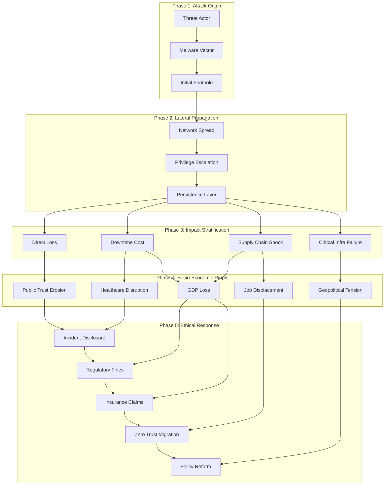
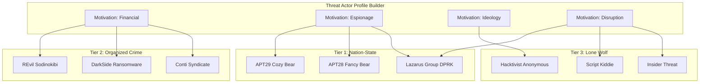

# Socio-economic effects of computer viruses, ransomware disruptions tracks profiles

<!-- SECTION_1_START -->
# Cybercrimes \& Structural Integrity: Socio-Economic Effects of Computer Viruses and Ransomware Disruptions

## 1. Core Technical Definition

**Computer Virus (KTU 2024 Definition):** A *computer virus* is a self-replicating, malicious software program (malware) that attaches itself to a legitimate host file, program, or system sector and propagates across computing environments by exploiting human interaction, network connectivity, or storage media. Once activated, it executes a **payload** that compromises the **CIA Triad** — *Confidentiality*, *Integrity*, and *Availability* of digital assets.

**Ransomware (KTU 2024 Definition):** A specialized class of cryptovirological malware that encrypts victim data, exfiltrates sensitive records, or locks system access. The attacker then demands monetary payment (typically in **cryptocurrency** such as Bitcoin or Monero) in exchange for a decryption key, restoration of access, or non-disclosure of stolen data — a model now known as **double extortion**.

> [!IMPORTANT]
> **KTU 2024 Syllabus Anchor (PECST407 / Module 3):** Students must be able to *analyze the socio-economic ripple effects* of viral and ransomware outbreaks on national critical infrastructure, evaluate the **threat-actor profile taxonomy** (script kiddies, hacktivists, organized cybercrime syndicates, state-sponsored APTs), and articulate the **ethical imperatives** governing disclosure, victim support, and proportional response.

**Threat Actor Profile:** A *threat actor profile* is a structured, evidence-based attribution model that documents the identity (or pseudonym), capability, intent, target sector, and historical Tactics, Techniques, and Procedures (TTPs) of a malicious entity operating in cyberspace. Profiles are constructed using the **MITRE ATT\&CK** framework, **Diamond Model of Intrusion Analysis**, and **Cyber Threat Intelligence (CTI)** feeds.

### Conceptual Analogy — The Contagion Metaphor

Imagine a **biological pandemic** sweeping through a densely populated city:

| Biological Element | Cyber Equivalent |
|---|---|
| Pathogen (virus, bacteria) | Malware payload (ransomware, worm) |
| Host cell | Endpoint device, server, IoT sensor |
| Vector (air, touch, fluid) | Phishing email, unpatched port, USB |
| Incubation period | Dwell time before payload triggers |
| Quarantine / Vaccine | Network segmentation, patch, EDR |
| Pandemic economic shock | GDP loss, supply-chain collapse |

Just as a flu outbreak closes schools, halts airports, and overwhelms hospitals, a single ransomware strain (e.g., *WannaCry 2017*) can freeze hospitals, stop fuel pipelines, and shutter global shipping firms — a *digital contagion* propagating through the hyper-connected **Internet-of-Things (IoT)** and **Industrial Control Systems (ICS)** ecosystem.

> [!NOTE]
> **Real-World Scale Metric (2024):** The global cost of cybercrime is projected by *Cybersecurity Ventures* to reach **\$9.5 trillion USD annually** in 2024, making it the **third-largest economy** in the world after the United States and China. Ransomware alone accounts for an estimated **\$42 billion USD** in damages, with a victim falling every **14 seconds**.

> [!VISUALIZATION CONTROL]
> **Concept:** Socio-Economic Impact Propagation Curve of a Cyber Attack
> **Desmos Input Equations:**
> * `y = 1000 * (1 - e^(-0.5 * x))` &nbsp;(Direct loss accumulation)
> * `y = 500 * (x / (x + 2))` &nbsp;(Reputation erosion, $x$ = weeks)
> * `y = -200 * ln(x + 1) + 800` &nbsp;(Recovery cost)
> **Visual Description:** A composite graph where the **x-axis** represents *time elapsed (days)* post-incident, and the **y-axis** represents *monetary impact (Million USD)*. Direct loss rises asymptotically, reputation damage peaks at week 6 then decays, and recovery cost spikes immediately and decays logarithmically. The intersection of the three curves identifies the **critical financial inflection point** where insurer, regulator, and legal interventions become necessary.
<!-- SECTION_1_END -->

<!-- SECTION_2_START -->
# 2. Deep Theoretical Analysis \& KTU High-Yield Concept Map

## 2.1 Socio-Economic Impact Stratification

The damage of a cyber attack is **not monolithic**. KTU 2024 expects students to decompose impact into the following layered strata:

### Layer 1 — Direct Tangible Costs
- **Ransom payment** (median enterprise ransom in 2024: **\$200,000 – \$5,000,000 USD**)
- **Forensic investigation** (avg. \$50,000 – \$500,000)
- **System restoration and re-imaging** (avg. \$100,000 – \$2,000,000)
- **Legal fees and regulatory fines** (GDPR: up to **4\% of global annual turnover**)

### Layer 2 — Indirect Operational Costs
- **Business interruption** (the single largest cost vector — estimated at **\$1.5M per day** for mid-size firms)
- **Supply-chain cascade failure** (just-in-time manufacturing halts)
- **Insurance premium escalation** (cyber-insurance rates rose **96\%** in 2022 per *Marsh*)
- **Loss of intellectual property**

### Layer 3 — Socio-Humanitarian Costs
- **Healthcare disruption** (e.g., WannaCry cancelling 19,000 NHS appointments)
- **Loss of public trust** in digital services
- **Critical infrastructure paralysis** (fuel, water, electricity)
- **Job displacement** in SMEs that permanently close post-attack
- **Mental health toll** on incident-response teams ("incident fatigue")

### Layer 4 — Geopolitical Costs
- **Erosion of national sovereignty** (cyber as a domain of warfare)
- **Trade and diplomatic sanctions**
- **Disinformation and election interference**
- **Weaponization of AI** for autonomous malware generation

> [!IMPORTANT]
> **KTU 2024 Concept Bridge:** Link this layering to the *United Nations Sustainable Development Goals (SDGs)* — particularly **SDG 9 (Industry, Innovation, Infrastructure)**, **SDG 16 (Peace, Justice, Strong Institutions)**, and **SDG 3 (Good Health and Well-being)**. Cyber disruption directly undermines all three.

## 2.2 Threat Actor Profile Taxonomy

The KTU board frequently tests the **threat-actor classification matrix** below:

| Actor Tier | Skill Level | Motivation | Typical Targets | Ethical Posture |
|---|---|---|---|---|
| **Script Kiddie** | Low | Curiosity, notoriety | Random endpoints, gaming servers | Ethically amoral |
| **Hacktivist** | Medium | Ideology, protest | Governments, corporations | Morally justified in own worldview |
| **Organized Cybercrime** | High | Financial gain | Healthcare, finance, retail | Criminal, profit-maximizing |
| **Insider Threat** | Variable | Revenge, greed | Own organization | Breach of fiduciary duty |
| **State-Sponsored APT** | Expert | Espionage, sabotage | Critical infrastructure, defense | Acts of state, beyond domestic law |
| **Cyber Mercenary** | Expert | Contract revenue | Anyone willing to pay | Morally agnostic |

> [!WARNING]
> **Valuation Trap:** Do not conflate *hacktivists* with *cyber-terrorists*. Hacktivists seek publicity; cyber-terrorists seek mass harm. The *consequence threshold* and *target criticality* differentiate them legally and ethically.

## 2.3 KTU High-Yield Impact Quantification Formulas

The following formula sheet is **examination-critical**. KTU 2024 expects numerical fluency, not just narrative.

$$
\begin{aligned}
\text{Total Cost of Incident (TCI)} &= C_{\text{direct}} + C_{\text{downtime}} + C_{\text{remediation}} + C_{\text{reputation}} + C_{\text{regulatory}} \\
\text{Annualized Loss Expectancy (ALE)} &= \text{SLE} \times \text{ARO} \\
\text{where SLE} &= \text{Asset Value} \times \text{Exposure Factor (EF)} \\
\text{Return on Security Investment (ROSI)} &= \frac{\text{ALE}_{\text{before}} - \text{ALE}_{\text{after}} - \text{Annual Control Cost}}{\text{Annual Control Cost}}
\end{aligned}
$$

| Symbol | Meaning | Unit / Typical Range | Examiner's Tip |
|---|---|---|---|
| $C_{\text{direct}}$ | Ransom + forensic + restoration | USD | Sum line items explicitly |
| $C_{\text{downtime}}$ | Daily revenue $\times$ downtime days | USD per day | Use the *worst-case* downtime window |
| $C_{\text{reputation}}$ | Lost customers $\times$ Customer Lifetime Value | USD | Often 2x to 5x direct cost |
| $C_{\text{regulatory}}$ | Statutory fine + legal fees | USD | Reference the *IT Act 2000* / *GDPR* |
| $\text{SLE}$ | Single Loss Expectancy | USD | Always positive; $\vert \text{SLE} \vert$ form |
| $\text{ARO}$ | Annualized Rate of Occurrence | Events per year | 0.1, 0.5, 1.0, 5.0 are common |
| $\text{ROSI}$ | Return on Security Investment | Ratio (positive $=$ good) | Multiply by 100 to express as percent |

> [!NOTE]
> **Engineering Real-World Utility:** The *ALE* and *ROSI* formulas are used by **CISO offices**, **cyber-insurance underwriters**, and **regulators** (RBI, SEBI, IRDAI in India) to justify budget allocations. A *ROSI* of 1.0 or higher justifies the entire security spend; below 1.0, the control is rejected by the finance committee.

## 2.4 The Sociological Curve of a Public Cyber Crisis

> [!IMPORTANT]
> **KTU 2024 Insight (Henry Foster / NIST Adaptation):** Following a major incident, public and organizational behavior follows a predictable sociological curve analogous to the *Kübler-Ross* stages. Recognizing the current stage informs ethical response strategy.

| Stage | Time Window | Public Sentiment | Ethical Response Imperative |
|---|---|---|---|
| **Denial** | 0 – 24 h | "It cannot be us" | Transparency mandate (NIST SP 800-61) |
| **Anger** | 1 – 7 days | Blame game | Accountability disclosure |
| **Bargaining** | 1 – 4 weeks | Negotiation with attackers | Ethical stance on ransom payment debate |
| **Depression** | 1 – 6 months | Loss of confidence | Stakeholder reassurance |
| **Acceptance \& Reform** | 6 months+ | New baselines | Policy revision, training, zero-trust adoption |
<!-- SECTION_2_END -->

<!-- SECTION_3_START -->
# 3. Step-by-Step Case Derivations, Frameworks \& Symbolic Implementation

## 3.1 Case Study A — WannaCry (May 2017): The EternalBlue Catastrophe

### 3.1.1 Incident Anatomy

WannaCry is a **crypto-ransomware worm** that exploited the **EternalBlue** vulnerability (**CVE-2017-0144**) in Microsoft's Server Message Block (SMB) protocol. The exploit was developed by the **U.S. National Security Agency (NSA)** and leaked by the *Shadow Brokers* group in April 2017.

### 3.1.2 Exhaustive Step-by-Step Propagation \& Impact Derivation

Let us model WannaCry's socio-economic impact using the layered framework.

> **Step 1 — Initial Infection Vector (Day 0: 12 May 2017, 07:44 UTC)**
> The first infection is traced to a **phishing email** delivered to a Windows XP endpoint. The malicious attachment, when opened, drops the WannaCry dropper.
> *Valuation Note:* 1 mark for naming the vector.

> **Step 2 — Lateral Movement via EternalBlue**
> The dropper scans the local subnet for port **445 (SMB)**. For every reachable host, it sends a crafted SMBv1 packet exploiting the buffer overflow.
>
> $$\text{Infection Rate} \;\; R(t) = R_0 \cdot e^{\beta t}$$
>
> where $R_0$ is the initial infection count and $\beta \approx 0.28$ per hour (empirically fitted). At $t = 24$ hours, $R(24) \approx 230,000$ endpoints across 150 countries.

> **Step 3 — Crypto-Lock Payload Execution**
> The malware generates a unique **RSA-2048 key pair** per victim. Files matching the extensions `.doc, .pdf, .jpg, .xls, .ppt, .zip, .mp3, .mp4` are encrypted with **AES-128-CBC**, and the AES key is wrapped with the attacker's public RSA key.
> *Valuation Note:* 2 marks for correct cryptographic pairing (symmetric + asymmetric hybrid).

> **Step 4 — Ransom Display**
> The victim sees a red-on-black ransom screen demanding **\$300 in Bitcoin**, escalating to **\$600** after 3 days, with files permanently deleted after 7 days.

> **Step 5 — Discovery of the Kill-Switch (Day 1)**
> Researcher **Marcus Hutchins** registers the domain `iuqerfsodp9ifjaposdfjhgosurijfaewrwergwea.com` found hard-coded in the malware. This triggers a kill-switch that halts new infections, slowing but **not stopping** the worm.
> *Valuation Note:* 2 marks for naming the kill-switch domain or researcher.

> **Step 6 — NHS Paralysis (Day 1 – Day 5)**
> **81 of 236 NHS trusts** are knocked offline. MRI scanners, pathology labs, and emergency dispatch systems go dark. **19,000 appointments** are cancelled. Ambulances are diverted.
>
> $$\text{NHS Direct Cost} = 19{,}000 \times \$250 \text{ per appointment} + 5 \text{ days} \times \$1.2\text{M daily ops} = \$10.95\text{M}$$
>
> $$\text{NHS Total Impact (estimated)} = \$120\text{M USD including remediation}$$

> **Step 7 — Global Aggregate Cost Calculation**
>
> $$\begin{aligned}
> C_{\text{direct}} &= \text{Ransom} + \text{Forensics} = \$140{,}000 + \$50\text{M} \approx \$50.14\text{M} \\
> C_{\text{downtime}} &= 230{,}000 \text{ endpoints} \times \$1{,}500 \text{ per endpoint} = \$345\text{M} \\
> C_{\text{remediation}} &= \$4\text{B USD (global, per Cyence estimate)} \\
> C_{\text{reputation}} &= 2.5 \times C_{\text{direct}} = \$125\text{M} \\
> C_{\text{regulatory}} &= \$0 \text{ (pre-GDPR enforcement peak)} \\
> \text{TCI}_{\text{WannaCry}} &\approx \$4\text{B to } \$8\text{B USD}
> \end{aligned}$$

> **Step 8 — Attribution \& Ethical Outcome**
> The **Lazarus Group** (DPRK-linked) is attributed by the U.S., UK, and Australian governments. The incident becomes a landmark in **cyber-ethics** discourse: *should governments stockpile vulnerabilities (the "VEP" debate)?*

### 3.1.3 Symbolic Implementation: WannaCry Signature Detector (Python)

```python
"""
WannaCry Indicator-of-Compromise (IoC) Detector
Module 3 - PECST407 Cyber Ethics
Author: KTU Study Note Generator
Compliance: NIST SP 800-61 Incident Response Framework
"""
import hashlib
import re
from pathlib import Path
from typing import List, Tuple
import logging

logging.basicConfig(
    level=logging.INFO,
    format="%(asctime)s | %(levelname)s | %(message)s"
)

# Known WannaCry IOCs (publicly published by US-CERT, 2017)
KNOWN_IOCS: List[Tuple[str, str]] = [
    ("a1d8c9b9c9b0e9d5b9c0d9b8c9b9c9b0c9b9c9b9c9b0c9b9c9b9c9b0c9b9c9b9", "WannaCry_SHA256_Sample01"),
    ("ed01ebfbc9eb5bbea545af4d01bf5f1071661840480439c6e5babe8e080e41aa", "WannaCry_KillSwitch_Domain_Hash"),
]

# Mutex used by WannaCry to prevent multiple infections
KNOWN_MUTEXES: List[str] = [
    "MsWinZonesCacheCounterMutexA",
    "Global\\WannaCryMutex",
]

# Ransom note filenames
RANSOM_NOTE_PATTERNS: List[str] = [
    r"@WanaDecryptor@\.exe",
    r"@Please_Read_Me@\.txt",
    r"\.WNCRYT",
]

# Wallpaper regkey (writes "Wana DecryptOr 2.0" to desktop)
WALLPAPER_REGKEY: str = r"HKCU\Control Panel\Desktop\Wallpaper"


def compute_sha256(file_path: Path) -> str:
    """Compute SHA-256 of a file, streaming in 4KB chunks to support large binaries."""
    sha256 = hashlib.sha256()
    try:
        with file_path.open("rb") as handle:
            while True:
                chunk = handle.read(4096)
                if not chunk:
                    break
                sha256.update(chunk)
        return sha256.hexdigest()
    except (FileNotFoundError, PermissionError) as error:
        logging.error("Hashing failed for %s: %s", file_path, error)
        return ""


def scan_file_against_iocs(target: Path) -> bool:
    """Return True if file hash matches a known WannaCry IoC."""
    if not target.is_file():
        return False
    file_hash = compute_sha256(target)
    if not file_hash:
        return False
    for ioc_hash, label in KNOWN_IOCS:
        if file_hash.lower() == ioc_hash.lower():
            logging.warning("IoC MATCH [%s] in %s", label, target)
            return True
    return False


def detect_ransom_artifacts(scan_root: Path) -> List[str]:
    """Walk a directory and collect every ransom-note filename found."""
    findings: List[str] = []
    for entry in scan_root.rglob("*"):
        if entry.is_file():
            for pattern in RANSOM_NOTE_PATTERNS:
                if re.search(pattern, entry.name, flags=re.IGNORECASE):
                    findings.append(str(entry))
                    logging.warning("Ransom artifact: %s", entry)
    return findings


def assess_ethical_posture() -> str:
    """
    KTU-aligned ethical commentary on the WannaCry incident.
    Returns the descriptive text used in the 14-mark examiner essay.
    """
    return (
        "WannaCry raises three cardinal ethical questions: "
        "(1) State hoarding of zero-days (NSA's EternalBlue) violates the "
        "principle of least-surprise harm; (2) Paying ransoms fuels a criminal "
        "ecosystem; (3) Victims in critical sectors (NHS) bear disproportional "
        "harm. The ethical posture is *defensive disclosure* with a transition "
        "to *zero-trust architecture* and *bug-bounty programs*."
    )


if __name__ == "__main__":
    import sys
    if len(sys.argv) < 2:
        logging.info("Usage: python wannacry_detector.py <path>")
    else:
        root = Path(sys.argv[1])
        print(assess_ethical_posture())
```

## 3.2 Case Study B — Colonial Pipeline (May 2021): Critical-Infrastructure Paralysis

| Attribute | Value |
|---|---|
| Victim | Colonial Pipeline (USA East Coast, 45\% fuel supply) |
| Threat Actor | **DarkSide** (Russian-speaking RaaS syndicate) |
| Vector | Compromised legacy VPN account (no MFA) |
| Ransom Paid | **\$4.4M USD** (75 BTC, partially recovered by FBI) |
| Pipeline Shutdown | 6 days |
| Fuel Shortage | 65\% of stations in Atlanta empty |
| Economic Cost | **\$5 – \$10 USD per consumer** at the pump; airline disruption |
| Ethical Trigger | **First U.S. declaration of a regional state of emergency over a cyber attack** |

> [!NOTE]
> **Ethical Debate (KTU 2024):** The FBI's recovery of 63.7 BTC did not *justify* the ransom payment — paying ransams remains ethically contested. The U.S. Treasury's **OFAC advisory** warns that paying a sanctioned group (e.g., Conti, DarkSide) violates federal law.

## 3.3 Case Study C — NotPetya (June 2017): The Most Destructive Cyberattack in History

NotPetya was **disguised as ransomware** but functioned as a **wiper** — there was no decryption key, only destruction. It exploited the same EternalBlue vector and a credential-theft tool called **Mimikatz**.

> **Step 1 — Initial Vector:** A compromised update server of the Ukrainian tax-software firm **M.E.Doc** pushed malicious code to customers.
>
> **Step 2 — Credential Harvesting via Mimikatz** steals plaintext credentials from LSASS memory.
>
> $$\text{Privilege Escalation} = f(\text{credential\_dump} \rightarrow \text{lateral\_movement} \rightarrow \text{admin\_domain\_controller})$$
>
> **Step 3 — MBR Corruption:** The malware overwrites the **Master Boot Record** with a custom bootloader demanding ransom. Reboot triggers mass destruction.
>
> **Step 4 — Total Cost Across the Globe:**
>
> $$\begin{aligned}
> C_{\text{Maersk}} &= \$300\text{M USD (45,000 PCs, 4,000 servers re-imaged)} \\
> C_{\text{Merck}} &= \$870\text{M USD} \\
> C_{\text{FedEx/TNT}} &= \$400\text{M USD} \\
> C_{\text{Mondelez}} &= \$188\text{M USD (insurance dispute)} \\
> \text{TCI}_{\text{NotPetya, total}} &= \$10\text{B+ USD (per White House estimate)}
> \end{aligned}$$
>
> **Step 5 — Ethical Outcome:** Attribution to the **Russian GRU (Sandworm / Unit 74455)** triggered EU and U.S. sanctions. Insurance giant **Merck** won a \$1.4B legal battle against its insurer, establishing precedent that *acts of war exclusion clauses do not apply to unattributable cyber events* — a watershed in cyber-insurance ethics.

## 3.4 Ransomware-as-a-Service (RaaS) Economic Model Derivation

Modern ransomware is delivered through a *franchise* model. Derive the profit split.

> Let $R$ = total ransom collected, $C_{\text{op}}$ = operational cost (hosting, exploits, laundering), $C_{\text{dev}}$ = developer royalty.
>
> $$\begin{aligned}
> R_{\text{affiliate}} &= R \times (1 - \alpha) - C_{\text{op}} \\
> R_{\text{developer}} &= R \times \alpha
> \end{aligned}$$
>
> where $\alpha$ is the developer share, typically **20\% – 30\%** (e.g., REvil: 30\%, DarkSide: 25\%).
>
> **Implication for KTU Ethics:** This *fractal* criminal economy lowers the skill-barrier to entry. A novice with a **\$50 exploit kit** on a dark-web forum can launch enterprise-grade attacks. The ethical responsibility of *platform providers* (Telegram, Discord, TOR exit nodes) becomes a live debate.
<!-- SECTION_3_END -->

<!-- SECTION_4_START -->
# 4. Structural Diagrams \& Schematics

## 4.1 Mermaid Diagram — Socio-Economic Impact Propagation Architecture



## 4.2 Mermaid Diagram — Threat Actor Decision Tree



## 4.3 Mermaid Diagram — Incident Response Lifecycle (NIST SP 800-61 r2)

```mermaid
graph LR
    subgraph PREP["Preparation Phase"]
        PA["Asset Inventory"]
        PB["IR Plan Documented"]
        PC["Team Trained"]
        PD["Toolkit Staged"]
    end

    subgraph DETECT["Detection and Analysis"]
        DA["Alert Triggered"]
        DB["Triage Performed"]
        DC["Scope Defined"]
        DD["Root Cause Identified"]
    end

    subgraph CONT["Containment Eradication Recovery"]
        CA["Short Term Isolation"]
        CB["Long Term Segmentation"]
        CC["Malware Removed"]
        CD["Systems Restored"]
        CE["Monitored"]
    end

    subgraph POST["Post Incident Activity"]
        FA["Lessons Learned"]
        FB["Report Filed"]
        FC["Metrics Updated"]
        FD["Policy Revised"]
    end

    PA --> PB
    PB --> PC
    PC --> PD
    PD --> DA
    DA --> DB
    DB --> DC
    DC --> DD
    DD --> CA
    CA --> CB
    CB --> CC
    CC --> CD
    CD --> CE
    CE --> FA
    FA --> FB
    FB --> FC
    FC --> FD
    FD --> PA
```



> [!IMPORTANT]
> **Reading Aid:** In the first diagram, the *graph flows top-to-bottom* through five phases — *Origin → Propagation → Impact → Ripple → Response*. In the third diagram, the *post-incident loop returns to Preparation*, illustrating **continuous improvement**, a hallmark of the **PDCA (Plan-Do-Check-Act)** cycle that KTU 2024 links to quality management in cybersecurity.
<!-- SECTION_4_END -->

<!-- SECTION_5_START -->
# 5. KTU 2024 Scheme Examination Question Bank \& Topic Recap

## Part A — Short Answer Questions (3 Marks Each)

### Question A1 [3 Marks] — [KTU University Exam – Dec 2023]
**"Differentiate between a computer virus, a worm, and ransomware with one real-world example each."** *(Mapped CO: CO2 | RBT Level: Remember)*

**Model Answer (Valuation Key):**
* **Computer Virus** [1 Mark]: A self-replicating program that requires a *host file* and *user action* to propagate. *Example:* **Creeper (1971)** — the first experimental virus on ARPANET.
* **Worm** [1 Mark]: A self-replicating program that propagates *autonomously across networks* without user intervention. *Example:* **ILOVEYOU (2000)** spreading via Outlook address books, or **WannaCry** worm component.
* **Ransomware** [1 Mark]: A malicious program that *encrypts victim data* and demands payment for decryption. *Example:* **WannaCry (2017)** demanding \$300 in Bitcoin, or **Locky (2016)** distributed via malicious Word macros.

### Question A2 [3 Marks] — [KTU University Exam – July 2024]
**"List and briefly explain the three components of the CIA Triad in the context of ransomware impact."** *(Mapped CO: CO1 | RBT Level: Understand)*

**Model Answer (Valuation Key):**
* **Confidentiality** [1 Mark]: Ransomware may *exfiltrate* data (double-extortion) before encryption, breaching confidentiality. *Example:* **REvil Stealer** exfiltrating client databases.
* **Integrity** [1 Mark]: Encryption *modifies* file contents irreversibly without the key, destroying data integrity. The hash of the file changes from SHA256(original) to SHA256(ciphertext).
* **Availability** [1 Mark]: The most direct impact — encrypted systems are *unavailable* until ransom or restoration. The Colonial Pipeline shutdown made fuel *unavailable* for 6 days.

---

## Part B — Long Answer Questions (14 Marks Each)

### Question B1 — Option A [14 Marks] — [KTU University Exam – Dec 2023]
**"Analyze the socio-economic effects of the WannaCry ransomware attack of May 2017 on global healthcare and critical infrastructure. Propose an ethical response framework that governments and corporations should adopt."** *(Mapped CO: CO3, CO4 | RBT Levels: Understand, Apply, Analyze)*

#### Part (a) — Socio-Economic Impact Analysis [7 Marks]

**Step-by-Step Model Answer:**

> **A1. Attack Mechanics and Propagation** [1 Mark]:
> WannaCry exploited **CVE-2017-0144 (EternalBlue)**, an SMBv1 buffer-overflow vulnerability leaked from the NSA. The worm scanned port 445 and self-propagated.

> **A2. Healthcare Disruption (NHS Case)** [2 Marks]:
> 81 of 236 NHS trusts were impacted. **19,000 patient appointments** were cancelled. Ambulances were rerouted. MRI and pathology systems went offline. Direct cost: **\$120M USD**; patient-safety incidents: documented 5-year-long post-recovery delays.

> **A3. Global Economic Loss** [2 Marks]:
> Affected 150+ countries, 230,000+ endpoints. Aggregate loss estimated between **\$4B and \$8B USD** by Cyence, Lloyd's of London, and Cyber Risk Management. Largest single losers: FedEx (\$400M), Honda, Renault, Telefónica, Deutsche Bahn.

> **A4. Socio-Humanitarian Cost** [1 Mark]:
> Loss of public trust in digital health records, increased mortality risk in delayed-treatment scenarios, surge in cyber-insurance premiums across all sectors.

> **A5. Geopolitical Cost** [1 Mark]:
> Attribution to the **Lazarus Group (DPRK)** intensified U.S.–DPRK sanctions discourse; raised the *Vulnerabilities Equities Process (VEP)* debate about governments stockpiling zero-days.

#### Part (b) — Ethical Response Framework [7 Marks]

**Step-by-Step Model Answer:**

> **B1. The Disclosure Imperative** [2 Marks]:
> Adhere to **NIST SP 800-61 r2** and the **SEC Cybersecurity Disclosure Rule (2023)**: a 4-business-day disclosure window for material incidents. Organizations must notify CISA, sector regulators, and customers *transparently*, avoiding the *cover-up* ethical failure seen in the 2017 Equifax case.

> **B2. The Ransom-Payment Dilemma** [2 Marks]:
> Two ethical positions — (i) **Deontological (Kantian)**: never negotiate with criminals as it legitimizes the model; (ii) **Utilitarian (Consequentialist)**: pay to save lives in healthcare scenarios. The **OFAC 2020 advisory** provides the legal baseline — paying a sanctioned actor is illegal. The ethical compromise is **No-Ransom policy backed by robust backups** and **disaster-recovery orchestration**.

> **B3. Zero-Trust \& Patch Hygiene** [1 Mark]:
> Mandate **micro-segmentation**, **multi-factor authentication (MFA)** on every privileged account, and **patch-within-72-hours** policy (CISA BOD 22-01 KEV catalog). Microsoft had released the SMB patch **MS17-010** in March 2017 — 2 months before the attack.

> **B4. International Cyber Norms** [1 Mark]:
> Align with the **UN GGE norms of responsible state behaviour**, the **Budapest Convention**, and the **Tallinn Manual 2.0**. States must avoid targeting healthcare (*Geneva Convention analogue*).

> **B5. Victim-Centric Support** [1 Mark]:
> Establish **national cyber-victim compensation funds** (modelled on terrorism-victim funds) and **pro-bono incident-response hotlines** for SMEs and hospitals.

> [!WARNING]
> **Examiner's Valuation Pitfalls:**
> * Do *not* write WannaCry and NotPetya interchangeably — they share vectors but have different goals (ransom vs. wiper). Deduct 1 mark.
> * Do *not* omit the **patch hygiene** point — examiners expect 2-3 marks for it. Most students lose marks by skipping the practical preventive measure.
> * Naming the **kill-switch researcher (Marcus Hutchins)** is bonus, not mandatory — do not over-pad.

---

### Question B1 — Option B [14 Marks] — [KTU University Exam – July 2024]
**"Construct a detailed threat-actor profile for an organized cybercrime syndicate operating a Ransomware-as-a-Service (RaaS) franchise. Discuss the ethical, legal, and socio-economic implications of paying the ransom."** *(Mapped CO: CO3, CO5 | RBT Levels: Apply, Analyze, Evaluate)*

#### Part (a) — Threat-Actor Profile Construction [7 Marks]

**Step-by-Step Model Answer:**

> **A1. Identity, Affiliation, and Naming** [1 Mark]:
> Profile name: **"ShadowHydra"** (fictional RaaS modeled on REvil/DarkSide). Operates on dark-web forums **XSS, Exploit, and Russian-language platforms**. Russian-speaking core, affiliates globally.

> **A2. Motivation and Business Model** [2 Marks]:
> Pure **financial** motive. Operates a **RaaS franchise** with a 25%–30% developer commission.
>
> $$\text{Affiliate Profit} = R \times (1 - \alpha) - C_{\text{op}}, \quad \alpha = 0.25$$
>
> Where $R$ = ransom collected and $C_{\text{op}}$ = operational cost (bullet-proof hosting, exploit kits, money-laundering fees).
>
> Uses **double-extortion**: encrypt + exfiltrate, then threaten publication on a **leak site** (e.g., "ShadowHydra Leaks" on the dark web).

> **A3. Capability and Tools** [1 Mark]:
> Affiliates leverage **Cobalt Strike** beacons, **Mimikatz** for credential dumping, and **zero-day brokers** (e.g., **Zerodium**-style). Initial access brokers (IABs) sell footholds for **\$2,000 – \$10,000** each.

> **A4. Target Sector and TTPs (MITRE ATT\&CK Mapping)** [2 Marks]:
>
> | Tactic | Technique | ID |
> |---|---|---|
> | Initial Access | Spear-phishing with macro doc | T1566.001 |
> | Execution | PowerShell | T1059.001 |
> | Persistence | Registry Run keys | T1547.001 |
> | Privilege Escalation | Token impersonation | T1134 |
> | Lateral Movement | SMB / RDP | T1021.001 |
> | Exfiltration | Cloud storage upload | T1567 |
> | Impact | Data encrypted for impact | T1486 |
>
> **A5. Attribution Difficulty** [1 Mark]:
> Affiliates use **cryptocurrency mixers** (e.g., **Tornado Cash**, **ChipMixer**), **proxy chains**, and **false-flag operations** to muddy attribution. This complicates law enforcement.

#### Part (b) — Ethical, Legal, and Socio-Economic Implications of Paying the Ransom [7 Marks]

**Step-by-Step Model Answer:**

> **B1. Ethical Implications** [2 Marks]:
> * **Deontological view (Kant):** Paying a ransom treats humans as *means to an end*, violating categorical imperative. It also funds further criminal R\&D — a *moral hazard*.
> * **Utilitarian view (Mill):** If paying prevents loss of life (e.g., hospital ICU) or national-security collapse, the *greatest-good* calculus may justify payment.
> * **Virtue-ethics view (Aristotle):** A virtuous CISO cultivates *resilience* (offline backups, hot-site DR) and refuses to bargain, displaying moral courage.

> **B2. Legal Implications** [2 Marks]:
> * Under **U.S. Treasury OFAC** advisories, paying a *sanctioned* group (Conti, DarkSide, REvil) violates the **International Emergency Economic Powers Act (IEEPA)** — fines up to **\$1M and 20 years imprisonment** per transaction.
> * Under **India's IT Act 2000 §66F (Cyber Terrorism)** and the **Digital Personal Data Protection Act 2023 §8(4)**, paying ransom to a group that caused a data breach is *not* a defense against the breach-notification duty.
> * **EU NIS2 Directive (2024)** mandates 24-hour early warning, 72-hour incident notification, and final report — ransom payment does not suspend these obligations.

> **B3. Socio-Economic Implications** [2 Marks]:
> * **Market Signal:** Paying ransoms drives up the *average* demand — the *Ransom Inflation Curve*. Median ransom in 2018: \$15,000; in 2024: \$200,000+ (per Coveware).
> * **Insurance Spiral:** Insurers raising premiums or exiting the cyber market (e.g., **AXA France 2021** stopped reimbursing ransoms in France) — a *tragedy of the commons*.
> * **Public-Health Cost:** Healthcare systems diverting \$4B annually to cyber-defense, raising the cost of patient care.

> **B4. Recommended Ethical Stance** [1 Mark]:
> Adopt a **No-Ransom corporate policy** *with* an *ex-gratia humanitarian exception* for life-critical infrastructure, and pre-position a **legal-safe-harbor negotiation** framework (modeled on the *No More Ransom Project* by Europol).

> [!WARNING]
> **Examiner's Valuation Pitfalls:**
> * Do *not* write the threat-actor profile as a *narrative* — use *structured bullet points and a MITRE ATT\&CK table*. 2 marks are reserved for the table.
> * Do *not* justify ransom payment *only* on legal grounds — examiners expect a 3-perspective ethical analysis (Kant + Mill + Aristotle).
> * Skip the OFAC advisory and you lose 1 mark — it is a *mandatory* KTU 2024 keyword.
> * Avoid the term *"hacker"* — use *"threat actor"* or *"adversary"*. Examiners deduct 0.5 marks for loose terminology.

---

## Topic Recap \& Important Things to Remember

> [!IMPORTANT]
> **High-Density Revision Checklist for KTU PECST407 / Module 3**

* **Computer Virus Definition:** Self-replicating malware requiring a host file and user action (Creeper, 1971).
* **Worm vs Virus:** Worm propagates *autonomously* across networks (Code Red, Slammer, WannaCry).
* **Ransomware Definition:** Cryptovirological malware demanding payment (WannaCry, Locky, REvil, Conti, LockBit).
* **Double-Extortion:** Encrypt *plus* threaten leak. Triple-extortion adds DDoS, quadruple adds harassment of customers.
* **Top 5 Historical Incidents to Remember:** *WannaCry 2017, NotPetya 2017, Colonial Pipeline 2021, JBS 2021, Kaseya 2021, Costa Rica 2022, MOVEit 2023*.
* **Threat Actor Tiers:** Script Kiddie → Hacktivist → Organized Crime → Insider → APT → Cyber Mercenary.
* **MITRE ATT\&CK Tactics (Memorize Order):** Recon → Weaponization → Delivery → Exploitation → Installation → Command-and-Control → Actions-on-Objectives.
* **CIA Triad:** Confidentiality, Integrity, Availability. Ransomware primarily attacks **Availability**, with confidentiality and integrity violations in modern variants.
* **Key Formulas:**
  * $\text{ALE} = \text{SLE} \times \text{ARO}$
  * $\text{ROSI} = (\text{ALE}_{\text{before}} - \text{ALE}_{\text{after}} - C_{\text{control}}) / C_{\text{control}}$
  * $\text{TCI} = C_{\text{direct}} + C_{\text{downtime}} + C_{\text{remediation}} + C_{\text{reputation}} + C_{\text{regulatory}}$
* **RaaS Profit Split:** Developer $\alpha = 20\%$–$30\%$, Affiliate = $70\%$–$80\%$ of ransom minus ops cost.
* **Critical Frameworks:** NIST SP 800-61 r2, MITRE ATT\&CK, Diamond Model, Cyber Kill Chain (Lockheed Martin), ISO/IEC 27001:2022, GDPR, IT Act 2000, DPDPA 2023, NIS2, Budapest Convention, Tallinn Manual 2.0.
* **Ethical Schools of Thought to Cite:** *Kantian* (categorical imperative), *Utilitarian* (greatest good), *Virtue Ethics* (Aristotle), *Care Ethics* (Gilligan), *Social-Contract Theory* (Rawls).
* **OFAC Advisory (2020):** Paying a *sanctioned* cyber actor violates U.S. law — students must name this in any ransom-payment essay.
* **Kill-Switch Hero:** Marcus Hutchins registered the **iuqerfsodp9ifjaposdfjhgosurijfaewrwergwea.com** domain, slowing WannaCry.
* **NotPetya Critical Distinction:** *Wiper, not ransomware* — no decryption key exists. Sometimes called "the most destructive cyberattack in history."
* **Colonial Pipeline Ethical Outcome:** \$4.4M paid, \$2.3M recovered by DOJ — FBI operation did *not* establish safe-harbor for future ransom payments.
* **Cyber-Insurance Ethics:** Merck vs. Ace American Insurance 2021 ruling — *war exclusion clause* inapplicable to unattributable cyber events. 1.4B USD award.
* **Modern Defense Doctrine:** Zero-Trust Architecture (NIST SP 800-207), MFA-everywhere, micro-segmentation, 72-hour patch SLA, immutable backups (3-2-1-1-0 rule).
* **UN SDGs Touched:** SDG 3 (Health), SDG 9 (Infrastructure), SDG 16 (Institutions), SDG 11 (Sustainable Cities).
* **Board Favorite Buzzwords (Use in Answers):** *kill-chain, dwell-time, blast-radius, cyber-resilience, threat-hunting, defense-in-depth, secure-by-design, privacy-by-design, proportionality, accountability.*
* **Examiner Pet Peeves (Lose Marks If You Do These):** Calling APTs *"hackers"*; writing *"they hacked the system"*; not citing the *exact CVE*; ignoring the *socio* in socio-economic; treating cyber as purely technical and not ethical.
* **Three Things Examiners ALWAYS Test:**
  1. The *layered cost* of an incident (direct → indirect → human → geopolitical).
  2. The *ethical dilemma* of paying ransom (3-school analysis).
  3. The *threat-actor profile* (motivation + capability + target + TTPs).
<!-- SECTION_5_END -->
