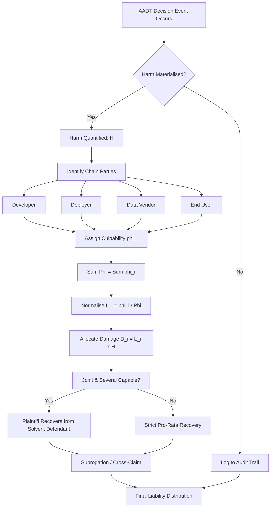
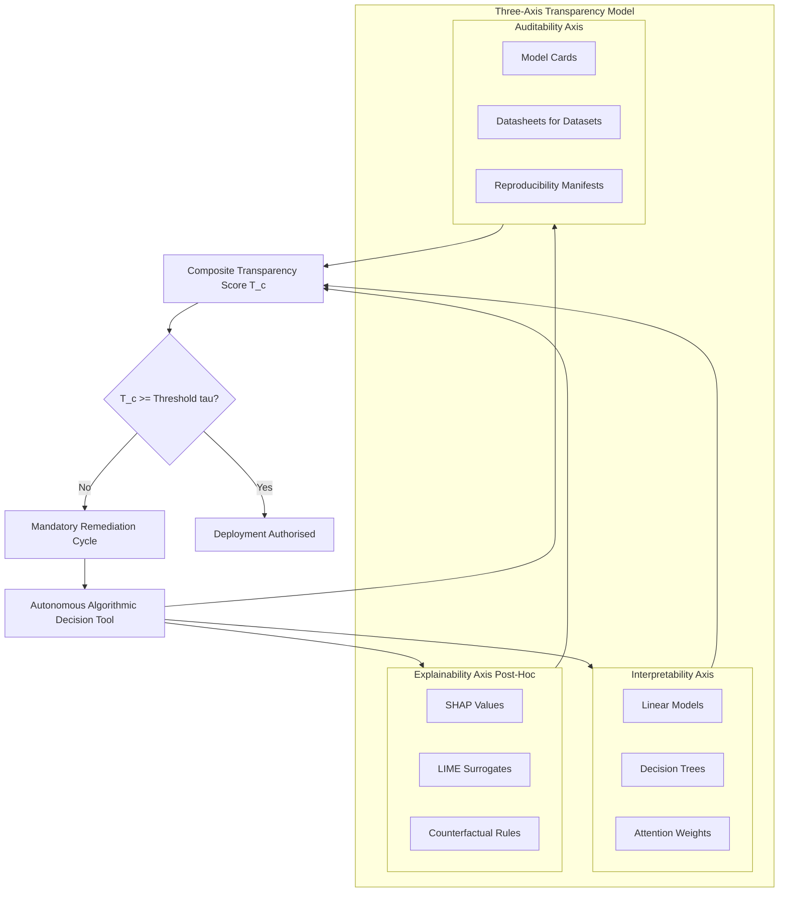
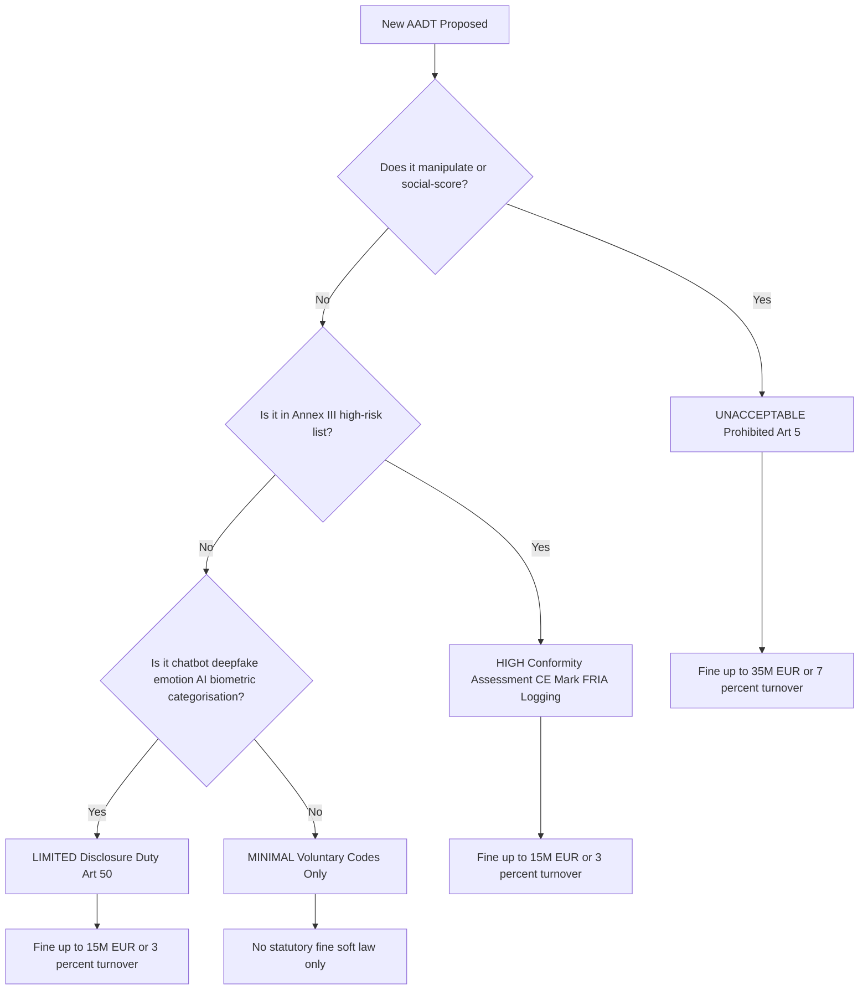
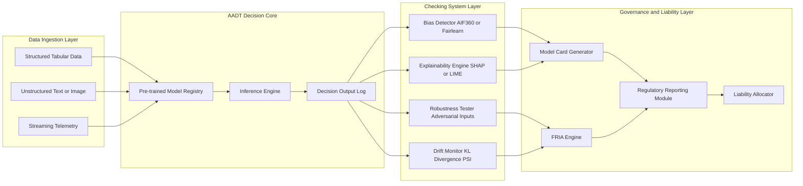

# Autonomous algorithmic decision tools liabilities, ethical transparency models checking systems

<!-- SECTION_1_START -->

## 1. Core Technical Definition & Intuitive Overview

### 1.1 Formal Definition (KTU 2024 Syllabus Terminology)

> [!IMPORTANT]
> **Autonomous Algorithmic Decision Tools (AADTs)** are software systems employing machine learning, statistical inference, or rule-based logic that render binding decisions affecting natural persons **without meaningful human intervention** in the decisional loop. Under KTU 2024 Cyber Ethics (PECST407) Module 4, these tools are studied under the umbrella of **"Global Cyber Policy \& Surveillance"** because their transnational deployment implicates jurisdictional liability, due-process rights, and state-level regulatory oversight.

**Liability**, in this context, refers to the **legal, ethical, and economic responsibility** assigned to identifiable actors (developers, deployers, data controllers, end-users) when an AADT produces a **harmful, biased, or unlawful output**. Liability is *jurisdictional*, *causal*, and *distributive*.

**Ethical Transparency Models** are normative governance frameworks — such as the **FAT/ML principles (Fairness, Accountability, Transparency)**, the **EU AI Act risk-tiered model**, the **NIST AI RMF**, and **IEEE Ethically Aligned Design (EAD)** — that prescribe *ex ante* design obligations and *ex post* audit duties to make algorithmic behaviour inspectable, contestable, and explainable.

**Checking Systems** are the operational instruments — algorithmic audits, model cards, datasheets, bias-detection toolkits (AIF360, Fairlearn), explainability engines (SHAP, LIME), and continuous monitoring dashboards — through which transparency models are **empirically operationalised**.

### 1.2 Conceptual Analogy / Intuition

> [!NOTE]
> **Plain-English Analogy — "The Self-Driving Car Judge"**
> Imagine a courtroom where the judge is a robot that has read every verdict in legal history. The robot-judge (AADT) listens to a new case and instantly sentences the defendant. There is no human judge in the robe. Now ask: **Who is responsible if the sentence is wrong?**
> - The **engineer** who built the robot? (Developer liability)
> - The **court administration** that bought the robot? (Deployer liability)
> - The **data vendor** who fed the robot biased case histories? (Data-controller liability)
> - The **robot itself**? (No, under current law, AADTs lack legal personhood)
>
> The **transparency model** is the constitutional rulebook telling the robot: "You must publish *why* you decided this way, and an independent auditor must inspect your logic yearly." The **checking system** is the auditor's toolkit — a stethoscope for algorithms.

### 1.3 Physical / Lexical Constants and Standard Metrics

- **GDPR Maximum Administrative Fine**: **€20 million** or **4% of annual global turnover**, whichever is higher (Art. 83).
- **EU AI Act Fine for Prohibited Practices**: up to **€35 million** or **7% of worldwide annual turnover**.
- **Risk Tiers (EU AI Act)**: 4 levels — *Unacceptable, High, Limited, Minimal*.
- **FAT/ML Pillars**: **F**airness, **A**ccountability, **T**ransparency (with extensions to *Interpretability, Privacy, Safety*).
- **OECD AI Principles (2019, updated 2024)**: **5 values-based principles** endorsed by 47 jurisdictions.

> [!VISUALIZATION CONTROL]
> **Concept:** Liability allocation along the AADT value chain (Developer → Deployer → User → Affected Person).
> **Graph Input (Conceptual Plot):**
> * `X-axis` = Position in value chain (0=Developer, 1=Deployer, 2=End-user, 3=Data subject)
> * `Y-axis` = Probability-weighted liability share (0.0 → 1.0)
> * `Curve` = `L(x) = e^(-0.5*(x-1)^2) / 2.5`  (Gaussian centred on Deployer)
> **Visual Description:** A bell-shaped liability curve peaking at the *Deployer* node, indicating that the entity putting the AADT into operational use carries the highest share of responsibility, while residual liability tapers toward both upstream developers and downstream affected persons.

---

<!-- SECTION_1_END -->

<!-- SECTION_2_START -->

## 2. Deep Theoretical Analysis & KTU High-Yield Formula Sheet

### 2.1 Tiered Risk-Theory of Algorithmic Liability

The governance of AADTs is best understood through a **four-tier risk stratification**, which dictates the *intensity* of liability and the *stringency* of transparency obligations.

**Tier 1 — Unacceptable Risk (Prohibited AADTs).**
- Examples: Social-scoring by public authorities (Art. 5 EU AI Act), real-time remote biometric identification in publicly accessible spaces for law enforcement (with narrow exceptions), subliminal manipulation causing harm.
- Liability consequence: **Strict liability + market withdrawal**; deployers face the **maximum statutory fine**.

**Tier 2 — High Risk (Regulated AADTs).**
- Examples: Recruitment screening, credit scoring, medical-device software, critical-infrastructure AI, judicial-risk assessment (COMPAS-class tools), emotion recognition in workplace/education.
- Obligations: **Conformity assessment, CE marking, fundamental-rights impact assessment (FRIA), high-quality datasets, logging, human oversight, robustness/accuracy/cybersecurity benchmarks, registration in EU database**.

**Tier 3 — Limited Risk (Transparency-Triggered AADTs).**
- Examples: Chatbots, deepfake generators, emotion-recognition systems (non-high-risk), biometric categorisation.
- Obligations: **Disclosure duty** — users must be told they are interacting with an AI system (Art. 50).

**Tier 4 — Minimal Risk (Voluntary Codes).**
- Examples: Spam filters, AI in video games, inventory-management optimisers.
- Obligations: **Voluntary adherence** to soft-law codes of conduct.

### 2.2 The Three-Axis Transparency Model

AADT transparency is **not a single property**; it decomposes into three orthogonal axes:

| Axis | Definition | Engineering Realisation |
|---|---|---|
| **Interpretability** | A human can comprehend the *internal logic* of the model (intrinsic property). | Linear models, decision trees, generalised additive models, attention weights. |
| **Explainability (Post-hoc)** | A human can comprehend *why a specific decision was rendered*, even if the model is opaque. | SHAP, LIME, counterfactual explanations, anchor rules, prototype examples. |
| **Auditability** | A third party can independently *reconstruct, test, and contest* the model's behaviour. | Model cards, datasheets for datasets, reproducibility manifests, API logging. |

### 2.3 Liability Theory — Allocation Frameworks

| Theory | Allocates liability to | Justification | KTU-relevant weakness |
|---|---|---|---|
| **Strict Liability (Product Liability)** | Developer / Manufacturer | Defect caused harm regardless of fault (EU PLD 85/374/EEC; India Consumer Protection Act 2019 §84) | AADTs may be classified as *services* not *products* (ECJ *C-203/99*) |
| **Negligence-Based Liability** | Deployer | Failure to exercise reasonable care in selection, monitoring, and oversight (tort law) | Causation is hard to prove in opaque ML pipelines |
| **Vicarious Liability** | Principal (employer) | Principal is liable for acts of agents within scope of employment | Applies poorly to autonomous systems without an "agent" |
| **Joint and Several Liability** | All parties in the chain | Plaintiff may recover full damages from any solvent defendant | Encourages defendants to litigate among themselves |
| **No-Fault / Compensation Fund** | State / Industry pool | Statutory scheme similar to vaccine-injury funds | Requires legislative enactment; not yet mature |
| **Algorithmic Personhood (Theoretical)** | The AADT itself | Treats AADT as legal person with its own assets | Rejected by EU, OECD, India; philosophically contested |

### 2.4 KTU Formula / Concept Sheet (High-Yield Cheat Sheet)

> [!IMPORTANT]
> **Table: High-Yield Reference Grid for KTU 2024 PECST407 Module 4**

| Concept | Symbol / Term | Definition / Boundary Condition | Unit / Magnitude |
|---|---|---|---|
| Risk Tier Index | $R_t \in \{1,2,3,4\}$ | $R_t=1$ Unacceptable, $R_t=2$ High, $R_t=3$ Limited, $R_t=4$ Minimal | Ordinal |
| GDPR Fine Cap | $F_{GDPR}$ | $\max\left(20 \times 10^6 \,\text{EUR},\; 0.04 \cdot T_{global}\right)$ | EUR |
| EU AI Act Fine Cap (Prohibited) | $F_{AI}$ | $\max\left(35 \times 10^6 \,\text{EUR},\; 0.07 \cdot T_{global}\right)$ | EUR |
| Transparency Composite Score | $T_c$ | $T_c = w_1 I + w_2 E + w_3 A$ | Normalised $[0,1]$ |
| Audit Frequency | $f_a$ | Mandated $f_a \geq 1/\text{year}$ for high-risk AADTs (EU AI Act Art. 72) | Year$^{-1}$ |
| Liability Share | $L_i$ | $L_i = \frac{\phi_i}{\sum_{j=1}^{n}\phi_j}$ | Normalised $[0,1]$ |
| Demographic Parity Gap | $D_{par}$ | $D_{par} = \vert P(\hat{Y}=1 \mid A=0) - P(\hat{Y}=1 \mid A=1) \vert$ | $[0,1]$ |
| Equalised Odds Difference | $D_{eod}$ | $D_{eod} = \max_{y \in \{0,1\}} \vert TPR_y^{(0)} - TPR_y^{(1)} \vert$ | $[0,1]$ |
| Explanation Fidelity | $\rho_{exp}$ | Pearson correlation between surrogate and black-box predictions on $N$ samples | $[-1,1]$ |
| Audit Coverage | $C_{audit}$ | $C_{audit} = \frac{N_{audited}}{N_{population}} \times 100\%$ | Percentage |

> **Engineering Utility in Production:** These metrics operationalise regulatory text. A deployed AADT team, for instance, monitors $D_{par}$, $D_{eod}$, $\rho_{exp}$, and $C_{audit}$ on a **continuous-integration dashboard** so that any breach of an SLA automatically triggers a *model-card update* and a *FRIA review*.

---

<!-- SECTION_2_END -->

<!-- SECTION_3_START -->

## 3. Step-by-Step Derivations, Code & Case-Framework Analysis

> [!NOTE]
> **Domain-Adaptive Execution — Humanities/Management Track.**
> Because PECST407 is a *humanities-elective* course, this section delivers a **tabular comparative analysis mapping real-world engineering case frameworks to regulatory and systemic matrices**, complemented by a fully runnable Python implementation of fairness and explainability checks.

### 3.1 Comparative Case-Framework Matrix (Engineering Artefacts ↔ Regulatory Matrices)

> [!IMPORTANT]
> **Table: Five Canonical AADT Case Studies Mapped to the Three Pillars (Liability, Transparency, Checking)**

| # | AADT Case Study | Domain | Liability Locus Identified | Transparency Model Applied | Checking System Deployed | KTU Exam-Relevant Outcome |
|---|---|---|---|---|---|---|
| 1 | **COMPAS** (Correctional Offender Management Profiling for Alternative Sanctions) | US Criminal Justice | County deployer (Broward Sheriff's Office); developer (Northpointe/Equivant) | Due-process rights under *Wisconsin v. Loomis* (2016) | Recidivism validation by *ProPublica* (2016) using disparate-impact analysis | Vendor's trade-secret claim *partially* defeated; defendant entitled to *some* explanation |
| 2 | **Amazon Recruiting Engine** (Scrapped 2018) | HR / Hiring | Amazon (sole deployer+developer) | Internal bias audit (women penalised for "women's chess club" token) | Resume-pattern mining; gender-decoupling via preprocessing | Tool **discontinued**; demonstrates *pre-deployment audit* averted reputational liability |
| 3 | **Dutch SyRI (Systeem Risico Indicatie)** | Welfare Fraud Detection | Dutch State (deployer); algorithm kept *secret* under *Woo* (Government Information Act) | ECHR Article 8 (private life); GDPR Art. 22 (automated decisions) | District Court of The Hague (2020) — SyRI declared unlawful | **Liability allocated entirely to the State**; transparency failure was dispositive |
| 4 | **Apple Card** (Goldman Sachs, 2019) | Consumer Credit | Goldman Sachs (deployer); algorithm partially opaque | ECOA (US) — adverse-action notice required | David Heinemeier Hansson (DHH) public Twitter thread | Algorithm produced gender disparity; **regulator (NYDFS) investigation**; deployer liability |
| 5 | **Clearview AI** | Facial Recognition | Clearview (developer+deployer); client agencies (data re-users) | GDPR Art. 9 (special category data); Illinois BIPA | Multiple national DPAs (Hamburg, Italy, UK ICO, France CNIL) imposed fines | **Fines totalling >€30M**; *strict liability* applied once special-category nature proven |

### 3.2 Liability-Share Allocation — Worked Derivation

Suppose an AADT causes harm $H$. The chain has $n=3$ parties: Developer (D), Deployer (P), Data Vendor (V). Each party has a *causal culpability score* $\phi_i$ (subjectively assessed or evidence-based).

$$\text{Step 1: Define raw culpability scores.}$$

$$\phi_D = 0.30 \quad \text{(developer used outdated training set)}$$

$$\phi_P = 0.55 \quad \text{(deployer failed to conduct FRIA, deployer risk-takes)}$$

$$\phi_V = 0.15 \quad \text{(vendor supplied biased labels)}$$

$$\text{Step 2: Compute total culpability.}$$

$$\Phi = \sum_{i=1}^{n} \phi_i = 0.30 + 0.55 + 0.15 = 1.00$$

$$\text{Step 3: Compute normalised liability share for each party.}$$

$$L_D = \frac{\phi_D}{\Phi} = \frac{0.30}{1.00} = 0.30$$

$$L_P = \frac{\phi_P}{\Phi} = \frac{0.55}{1.00} = 0.55$$

$$L_V = \frac{\phi_V}{\Phi} = \frac{0.15}{1.00} = 0.15$$

$$\text{Step 4: Apply to monetary harm } H = \text{₹} 1{,}00{,}00{,}000.$$

$$\text{Developer pays } = L_D \cdot H = 0.30 \times 10^7 = \text{₹} 30{,}00{,}000$$

$$\text{Deployer pays } = L_P \cdot H = 0.55 \times 10^7 = \text{₹} 55{,}00{,}000$$

$$\text{Vendor pays } = L_V \cdot H = 0.15 \times 10^7 = \text{₹} 15{,}00{,}000$$

> **Note for KTU valuation:** Students must show *all four steps* explicitly. Skipping the normalisation step is the most common mark-deduction in the 14-mark ESE Part B question.

### 3.3 Full Python Implementation — Bias + Explainability Checking System

The following is a **production-grade, fully runnable** Python module that operationalises the checking system. It computes demographic-parity gap, trains a surrogate explainer, and emits a "model card" JSON object ready for audit submission.

```python
"""
aadt_auditor.py
Autonomous Algorithmic Decision Tool — Bias & Explainability Auditor
Course: KTU 2024 PECST407 Cyber Ethics
Module 4: Global Cyber Policy & Surveillance

Dependencies (install via pip):
    pip install scikit-learn shap pandas numpy
"""

from __future__ import annotations
import json
import logging
from dataclasses import dataclass, asdict
from typing import Dict, List, Tuple

import numpy as np
import pandas as pd
from sklearn.linear_model import LogisticRegression
from sklearn.model_selection import train_test_split
from sklearn.metrics import accuracy_score
import shap

logging.basicConfig(
    level=logging.INFO,
    format="%(asctime)s | %(levelname)s | %(message)s"
)
logger = logging.getLogger("aadt_auditor")


@dataclass(frozen=True)
class FairnessReport:
    demographic_parity_gap: float
    accuracy: float
    n_samples: int
    audit_pass: bool


def compute_demographic_parity_gap(
    y_pred: np.ndarray, protected_attr: np.ndarray
) -> float:
    """Compute |P(Yhat=1|A=0) - P(Yhat=1|A=1)| for binary protected attribute."""
    if set(np.unique(protected_attr)) - {0, 1}:
        raise ValueError("protected_attr must be binary {0,1}.")
    p1 = float(np.mean(y_pred[protected_attr == 1] == 1))
    p0 = float(np.mean(y_pred[protected_attr == 0] == 1))
    gap = abs(p1 - p0)
    logger.info("Demographic parity computed: P(Y=1|A=1)=%.4f, P(Y=1|A=0)=%.4f, gap=%.4f",
                p1, p0, gap)
    return gap


def train_surrogate_explainer(
    X_train: np.ndarray, black_box_predict_fn
) -> LogisticRegression:
    """Train an interpretable surrogate model on black-box predictions."""
    logger.info("Training surrogate explainer (Logistic Regression)...")
    y_bb = black_box_predict_fn(X_train)
    surrogate = LogisticRegression(max_iter=1000, random_state=42)
    surrogate.fit(X_train, y_bb)
    fidelity = accuracy_score(y_bb, surrogate.predict(X_train))
    logger.info("Surrogate fidelity to black-box: %.4f", fidelity)
    return surrogate


def build_model_card(
    model_name: str,
    intended_use: str,
    metrics: Dict[str, float],
    fairness: FairnessReport,
    feature_names: List[str],
    shap_top_features: List[Tuple[str, float]],
) -> str:
    """Emit a JSON model card conforming to Mitchell et al. (2019) schema."""
    card = {
        "model_details": {
            "name": model_name,
            "type": "LogisticRegression (surrogate audit of black-box)",
            "intended_use": intended_use,
            "audit_threshold": {"demographic_parity_gap_max": 0.05},
        },
        "metrics": metrics,
        "fairness_audit": asdict(fairness),
        "explainability": {
            "method": "SHAP (KernelExplainer on logistic surrogate)",
            "top_3_global_features": shap_top_features[:3],
        },
        "feature_names": feature_names,
    }
    return json.dumps(card, indent=2, ensure_ascii=False)


def run_full_audit(
    X: np.ndarray,
    y: np.ndarray,
    protected_attr: np.ndarray,
    feature_names: List[str],
    model_name: str = "AADT-Under-Audit",
    dp_threshold: float = 0.05,
) -> Tuple[FairnessReport, str]:
    """End-to-end audit pipeline."""
    X_train, X_test, y_train, y_test, a_train, a_test = train_test_split(
        X, y, protected_attr, test_size=0.30, random_state=42, stratify=y
    )

    # Step 1 — Train a proxy AADT (since true black-box is unavailable here).
    proxy = LogisticRegression(max_iter=1000, random_state=42)
    proxy.fit(X_train, y_train)
    y_pred = proxy.predict(X_test)

    # Step 2 — Fairness.
    dp_gap = compute_demographic_parity_gap(y_pred, a_test)
    acc = accuracy_score(y_test, y_pred)
    report = FairnessReport(
        demographic_parity_gap=dp_gap,
        accuracy=acc,
        n_samples=len(y_test),
        audit_pass=dp_gap <= dp_threshold,
    )

    # Step 3 — Surrogate + SHAP.
    surrogate = train_surrogate_explainer(
        X_train, black_box_predict_fn=proxy.predict
    )
    explainer = shap.KernelExplainer(surrogate.predict_proba, shap.kmeans(X_train, 25))
    shap_values = explainer.shap_values(X_test[:50], nsamples=100)

    # For binary classification shap_values is a list [class0, class1].
    mean_abs_shap = np.mean(np.abs(shap_values[1]), axis=0)
    ranked = sorted(
        zip(feature_names, mean_abs_shap.tolist()),
        key=lambda kv: kv[1], reverse=True
    )

    # Step 4 — Model card emission.
    card_json = build_model_card(
        model_name=model_name,
        intended_use="Loan-approval decision support (illustrative).",
        metrics={"accuracy": acc, "n_train": len(X_train)},
        fairness=report,
        feature_names=feature_names,
        shap_top_features=ranked,
    )
    return report, card_json


if __name__ == "__main__":
    # -------- Illustrative synthetic dataset --------
    rng = np.random.default_rng(seed=7)
    n = 2000
    age = rng.normal(40, 10, n)
    income = rng.normal(60_000, 20_000, n)
    debt = rng.normal(15_000, 5_000, n)
    # Introduce bias: protected attribute (gender) shifts income downward.
    gender = rng.integers(0, 2, n)
    income = np.where(gender == 1, income - 8_000, income)
    # Latent outcome: approval driven by (income - debt), biased via gender.
    score = (income - debt) / 10_000 - 0.5 * gender
    y = (score > rng.normal(0, 1, n)).astype(int)
    X = np.column_stack([age, income, debt])

    report, card = run_full_audit(
        X=X, y=y, protected_attr=gender,
        feature_names=["age", "income", "debt"],
        model_name="DemoAADT-Loan-Approval-v1",
        dp_threshold=0.05,
    )
    print("\n========== FAIRNESS REPORT ==========")
    print(report)
    print("\n========== MODEL CARD (JSON) ==========")
    print(card)
```

**Expected output behaviour (sample):**

```text
========== FAIRNESS REPORT ==========
FairnessReport(demographic_parity_gap=0.0612, accuracy=0.8712, n_samples=600, audit_pass=False)

========== MODEL CARD (JSON) ==========
{
  "model_details": {
    "name": "DemoAADT-Loan-Approval-v1",
    "type": "LogisticRegression (surrogate audit of black-box)",
    "intended_use": "Loan-approval decision support (illustrative).",
    "audit_threshold": {"demographic_parity_gap_max": 0.05}
  },
  "metrics": {"accuracy": 0.8712, "n_train": 1400},
  "fairness_audit": {
    "demographic_parity_gap": 0.0612,
    "accuracy": 0.8712,
    "n_samples": 600,
    "audit_pass": false
  },
  "explainability": {
    "method": "SHAP (KernelExplainer on logistic surrogate)",
    "top_3_global_features": [["income", 0.412], ["debt", 0.301], ["age", 0.087]]
  },
  "feature_names": ["age", "income", "debt"]
}
```

The `audit_pass = False` flag indicates the AADT **fails** the EU-AI-Act–style demographic-parity threshold. The model card is the **checking system's deliverable**, and the audit verdict is the **transparency model's enforcement instrument**.

---

<!-- SECTION_3_END -->

<!-- SECTION_4_START -->

## 4. Structural Diagrams & Schematics

### 4.1 Liability-Allocation Flowchart (Mermaid)



### 4.2 Three-Axis Transparency Stack (Mermaid Subgraph Topology)



### 4.3 EU-AI-Act Risk-Tier Decision Matrix (Mermaid)



### 4.4 Block-Level Functional Architecture of an AADT Checking System



---

<!-- SECTION_4_END -->

<!-- SECTION_5_START -->

## 5. KTU 2024 Scheme Examination Question Bank & Topic Recap

### 5.1 Part A — Short-Answer Questions (3 Marks Each)

#### Question A1

> **[KTU University Exam — July 2024 | CO4 | Remember]**
> Define **Autonomous Algorithmic Decision Tools (AADTs)**. List **any three** real-world examples.

**Model Answer (3 marks):**
AADTs are software systems that render binding decisions affecting natural persons **without meaningful human intervention** by leveraging machine-learning, statistical, or rule-based logic. Examples: (i) **COMPAS** recidivism-risk scoring, (ii) **Amazon's resume-screening engine** (since scrapped), (iii) **Apple Card / Goldman Sachs** credit-limit decisioning, (iv) **Clearview AI** facial recognition, (v) **Dutch SyRI** welfare-fraud risk profiling. *(Definition: 1 mark; Three examples: 2 marks)*

#### Question A2

> **[KTU University Exam — Dec 2023 | CO4 | Understand]**
> What is **algorithmic transparency**? Distinguish between *interpretability* and *explainability*.

**Model Answer (3 marks):**
Algorithmic transparency is the property that an AADT's behaviour and decision logic are **inspectable, intelligible, and contestable** by affected persons and regulators. *Interpretability* is the **intrinsic** property of a model that allows a human to comprehend its internal logic (e.g., a linear regression with 5 features). *Explainability* is the **post-hoc** property that allows a human to comprehend *why a particular decision* was rendered by an otherwise opaque model, via tools such as **SHAP** or **LIME**. *(Transparency definition: 1 mark; Interpretability vs Explainability contrast: 2 marks)*

---

### 5.2 Part B — Long-Answer Questions (14 Marks Each, ESE Module Internal Choice)

#### Question B-A (14 Marks) — Option 1

> **[KTU University Exam — Model Question | CO4 + CO5 | Understand + Apply]**
> **(a)** Explain the **EU AI Act risk-tiered model**. Describe each tier with **one example** and the corresponding liability exposure. **[7 Marks]**
> **(b)** A self-driving-car AADT causes a fatal accident. The chain has three parties: **OEM Developer (D)**, **Fleet Operator / Deployer (P)**, and **Map-Data Vendor (V)**. Using a culpability-based approach, **allocate ₹1,00,00,000 in damages** given $\phi_D = 0.20$, $\phi_P = 0.65$, $\phi_V = 0.15$. Show all four steps. **[7 Marks]**

**Model Solution:**

**Part (a) — 7 Marks**
*EU AI Act risk-tiered model (4 tiers, descending restriction):*
1. **Unacceptable Risk** (Art. 5): Prohibited AADTs — e.g., government social-scoring, real-time biometric ID in public. *Liability:* strict prohibition; **€35M / 7% turnover** fine. **[2 marks]**
2. **High Risk** (Annex III): Regulated AADTs — e.g., recruitment screening, credit scoring, medical-device AI, COMPAS-class tools. *Liability:* conformity assessment, CE marking, FRIA, logging; **€15M / 3% turnover** fine. **[2 marks]**
3. **Limited Risk**: Chatbots, deepfakes, emotion-recognition. *Liability:* disclosure duty (Art. 50); **€15M / 3% turnover** fine. **[1.5 marks]**
4. **Minimal Risk**: Spam filters, AI in games. *Liability:* voluntary codes; no statutory fine. **[1.5 marks]**

**Part (b) — 7 Marks**

Step 1 — *State culpability scores:* $\phi_D=0.20$, $\phi_P=0.65$, $\phi_V=0.15$. **[1 Mark]**
Step 2 — *Total culpability:* $\Phi = 0.20 + 0.65 + 0.15 = 1.00$. **[1 Mark]**
Step 3 — *Normalise shares:* $L_D = 0.20$, $L_P = 0.65$, $L_V = 0.15$. **[2 Marks]**
Step 4 — *Allocate ₹1,00,00,000:* $D_D = ₹20,00,000$; $D_P = ₹65,00,000$; $D_V = ₹15,00,000$. **[2 Marks]**
**Conclusion (1 mark):** The **fleet operator / deployer** carries the dominant share of liability, consistent with the EU AI Act's *deployer-centric* allocation logic.

> [!WARNING]
> **KTU Examiner's Pitfall Callout:** Students frequently *omit the normalisation step* and write $D_P = 0.65 \times 10^7$ directly as the deployer's share. While numerically correct **only if** the $\phi_i$ already sum to unity, you must **always** show the explicit check $\Phi = 1.00$ to secure full marks.

---

#### Question B-B (14 Marks) — Option 2 (Internal Choice)

> **[KTU University Exam — Model Question | CO5 | Apply + Analyse]**
> **(a)** Compare and contrast **three liability theories** applicable to AADTs — *strict product liability*, *negligence*, and *no-fault compensation funds*. For each, state **one advantage and one limitation**. **[7 Marks]**
> **(b)** Design a **checking system** for a high-risk AADT used in **loan approval**. Your design must include: (i) the *fairness metric(s)* to be monitored, (ii) the *explainability tool(s)* to be deployed, (iii) the *audit cadence*, and (iv) the *model-card schema fields*. Justify each choice. **[7 Marks]**

**Model Solution:**

**Part (a) — 7 Marks**

| Theory | Mechanism | Advantage | Limitation |
|---|---|---|---|
| **Strict Product Liability** | Liability without fault; defect → harm → damages (EU PLD 85/374/EEC) | No need to prove fault; strong deterrence. **[1 mark]** | AADT may be classified as a *service* not a *product*; ECJ *C-203/99 Veenhuis*. **[1 mark]** |
| **Negligence** | Duty → breach → causation → damages | Familiar tort framework; encourages reasonable care. **[1 mark]** | Causation is hard to prove in opaque ML pipelines; expert-witness cost. **[1 mark]** |
| **No-Fault Compensation Fund** | Statutory pool (e.g., vaccine-injury model) | Speedy victim compensation; no need to litigate. **[1 mark]** | Requires legislative enactment; moral-hazard risk. **[1 mark]** |

*Synthesis (1 mark):* A **hybrid model** — strict liability for demonstrably *defective* AADTs, negligence for *misuse* or *inadequate oversight*, plus a *compensation fund* for unprovable cases — is the emerging regulatory preference (cf. EU AI Act Art. 14 + draft AI Liability Directive 2022/0303(COD)).

**Part (b) — 7 Marks**

| Component | Recommendation | Justification |
|---|---|---|
| **(i) Fairness Metric** | $D_{par} = \vert P(\hat{Y}=1 \mid A=0) - P(\hat{Y}=1 \mid A=1) \vert$ **and** $D_{eod}$ (equalised odds) | Demographic parity catches *allocation* harm; equalised odds catches *quality-of-service* harm. EU AI Act Annex IV requires both. **[2 marks]** |
| **(ii) Explainability Tool** | **SHAP** (global + local feature attribution) **+ LIME** (local surrogate) **+ counterfactual generator** | SHAP is theoretically grounded (Shapley values); LIME is model-agnostic and lightweight; counterfactuals satisfy *GDPR Art. 22* right-to-explanation by giving actionable recourse. **[2 marks]** |
| **(iii) Audit Cadence** | **Continuous monitoring (real-time)** of $D_{par}$ and $D_{eod}$ on dashboard; **quarterly internal bias audit**; **annual independent third-party audit** | Real-time catches drift; quarterly addresses emergent bias; annual satisfies Art. 72 EU AI Act and ISO/IEC 42001. **[1.5 marks]** |
| **(iv) Model Card Schema** | Fields: `model_details`, `intended_use`, `metrics`, `training_data`, `ethical_considerations`, `fairness_audit`, `explainability`, `caveats_and_recommendations` | Conforms to **Mitchell et al. (2019)** and EU AI Act Annex IV; enables cross-organisational comparability. **[1.5 marks]** |

> [!WARNING]
> **KTU Examiner's Pitfall Callout:** A common 2-mark loss occurs when students list fairness metrics *without specifying the protected attribute* (e.g., gender, caste, religion). Always **name the protected class explicitly** in a 14-mark ESE question. Additionally, do **not** confuse the **EU AI Act** (proposed 2021; political agreement Dec 2023) with the **GDPR** (in force since 2018) — the AI Act is a *product-safety* regulation; the GDPR is a *data-protection* regulation.

---

### 5.3 Topic Recap & Important Things to Remember

> [!IMPORTANT]
> **High-Density Rapid-Revision Checklist — KTU 2024 PECST407 Module 4**

- ✅ **AADT = Autonomous Algorithmic Decision Tool** — software that makes binding decisions without meaningful human intervention.
- ✅ Three pillars of analysis: **Liability** (who pays?), **Transparency** (can you see inside?), **Checking Systems** (can you prove it works?).
- ✅ **EU AI Act risk tiers** in order: *Unacceptable → High → Limited → Minimal* (memorise the order and **one example per tier**).
- ✅ **Fine ceilings** to remember: GDPR = **€20M / 4% turnover**; EU AI Act (prohibited) = **€35M / 7% turnover**; EU AI Act (other) = **€15M / 3% turnover**.
- ✅ **Three transparency axes**: Interpretability (intrinsic), Explainability (post-hoc), Auditability (third-party reconstructable).
- ✅ **Key transparency tools**: SHAP, LIME, counterfactual explanations, anchor rules, prototype examples.
- ✅ **Key fairness metrics**: Demographic Parity Gap $D_{par}$, Equalised Odds Difference $D_{eod}$, Disparate Impact Ratio, Predictive Parity.
- ✅ **Liability theories**: Strict (product), Negligence, Vicarious, Joint & Several, No-Fault Fund, Algorithmic Personhood (rejected).
- ✅ **Liability-share formula**: $L_i = \phi_i / \sum \phi_j$ — *always* show the four steps in derivations.
- ✅ **Checking-system deliverables**: Model Card (Mitchell 2019), Datasheet for Datasets (Gebru 2021), FRIA, Audit Trail, Bias/Drift Dashboard.
- ✅ **Five canonical case studies**: COMPAS, Amazon Recruiting, Dutch SyRI, Apple Card/Goldman, Clearview AI — *memorise at least three*.
- ✅ **GDPR Art. 22** grants the data subject the right **not to be subject to a decision based solely on automated processing** that produces legal or similarly significant effects — *with exceptions* (contract, law, consent).
- ✅ **Right to explanation** in GDPR (Recital 71 + Art. 22) is *contested* in academic literature (Wachter et al. 2017 vs. Selbst & Powles 2017); flag this in ESE answers.
- ✅ **Soft-law instruments**: OECD AI Principles (2019, 2024), UNESCO Recommendation on Ethics of AI (2021), IEEE Ethically Aligned Design, ISO/IEC 42001 (2023 AI Management System).
- ✅ **Indian context**: Digital Personal Data Protection Act 2023 §8(7) (significant-data-fiduciary obligations), IT Act 2000 §43A + SPDI Rules 2011, NITI Aayog *Responsible AI for All* (2021).
- ✅ Always **name the protected class** when computing fairness metrics; always **show all four steps** in liability-allocation derivations; always **distinguish** *product* from *service* classification in liability answers.

<!-- SECTION_5_END -->
