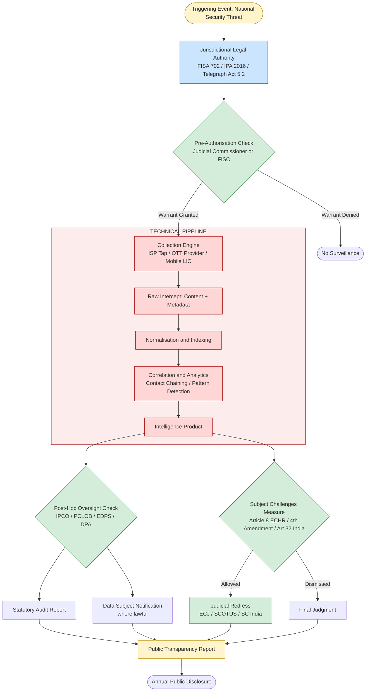
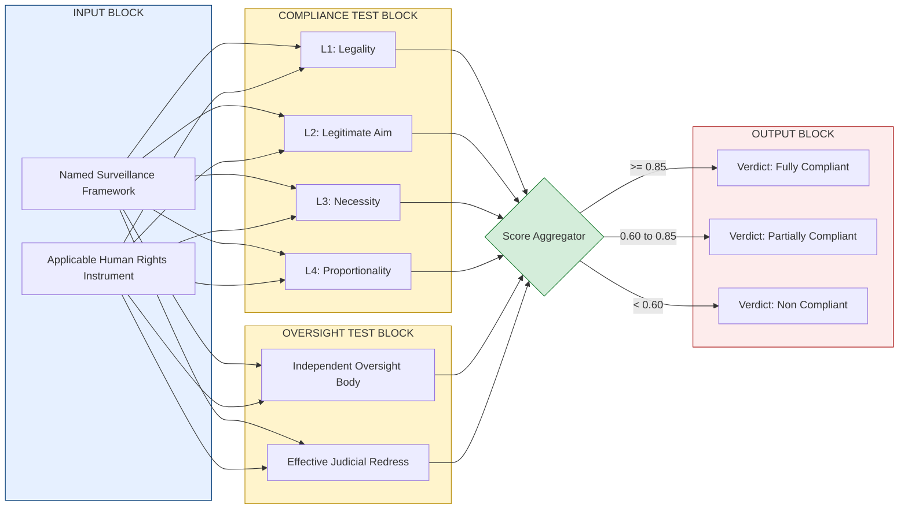
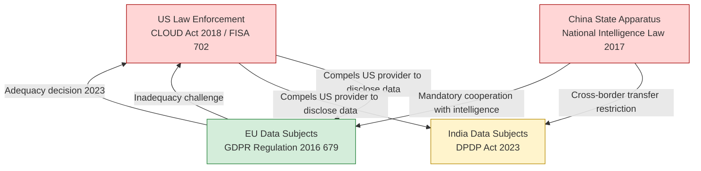

# Mass surveillance tracking frameworks compliance criteria legal checks structures

<!-- SECTION_1_START -->
# Mass Surveillance Tracking Frameworks: Compliance Criteria & Legal Checks Structures

## 1. Core Technical Definition

> [!IMPORTANT]
> **KTU 2024 Scheme – Definition (PECST407 / Module 4.4)**
> A **Mass Surveillance Tracking Framework** is a structured legal, technical, and administrative architecture that enables state or quasi-state actors to systematically intercept, collect, store, correlate, and analyse the communications, metadata, location data, and behavioural traces of populations at scale. When evaluated under global cyber policy, such frameworks are assessed against **Compliance Criteria** (substantive and procedural tests such as legality, necessity, proportionality, and purpose limitation) and are constrained by **Legal Checks Structures** (institutional oversight mechanisms such as judicial authorisation, parliamentary review, independent data protection authorities, and constitutional remedies).

In simpler KTU-examination language: it is the *whole pipeline* — from the moment a government decides to monitor citizens, to the technical taps, to the rules that say "you may or may not do this," to the bodies that audit whether the rules were followed.

### 1.1 Conceptual Analogy — The "Building with Glass Walls"

Imagine a **huge fishbowl in the middle of a city**. Everyone's movements, phone calls, and purchases are visible inside the bowl. The bowl is the *surveillance framework*. Now imagine the city passes **laws** about *when* the bowl can be switched on, *how long* recordings are kept, and *who* is allowed to peek in. These laws are the **Compliance Criteria**. Finally, imagine an **independent inspector** with a clipboard, a **judge** with a gavel, and a **public report** posted every year on a notice board — these are the **Legal Checks Structures**. A well-designed system means the bowl is rarely switched on, the recordings are short, the inspector is genuinely independent, and the citizens know what is happening. A poorly designed system means the bowl is always on, no one is watching the watcher, and recordings are kept forever.

### 1.2 Why This Topic is High-Yield for KTU

> [!NOTE]
> - This is a **14-mark module-level topic** in PECST407 (Cyber Ethics) under Module 4: *Global Cyber Policy & Surveillance*.
> - KTU examiners frequently test the **comparative analysis** of surveillance regimes (USA, EU, China, India, Russia, UK).
> - Bloom levels typically range from **Understand → Analyse → Evaluate**.
> - The 2024 Scheme emphasises **outcome-based answers** — students must *apply* compliance criteria to *named* real-world frameworks.

### 1.3 Geometric / Structural Intuition

Surveillance frameworks can be visualised as a **nested control architecture**, where each inner ring represents a tighter legal constraint on a wider technical capability.

> [!VISUALIZATION CONTROL]
> **Concept:** Nested Compliance Envelope — capability ring constrained by oversight rings
> **GeoGebra / Desmos Input Equations (Concentric Circles):**
> - Outer (capability) circle: $x^2 + y^2 = R^2$ with $R = 10$
> - Middle (compliance) circle: $x^2 + y^2 = r^2$ with $r = 7$
> - Inner (oversight) circle: $x^2 + y^2 = \rho^2$ with $\rho = 4$
> **Visual Description:** The largest ring is what the state *can* technically do; the middle ring is what the law *permits* it to do; the innermost ring is what *courts and auditors* will actually allow to stand after challenge. A mature democracy has tight overlap; an authoritarian regime has a wide outer ring and a tiny inner ring.

<!-- SECTION_1_END -->

<!-- SECTION_2_START -->
# 2. Deep Theoretical Analysis & KTU High-Yield Formula Sheet

## 2.1 The Four Pillars of Mass Surveillance Frameworks

Every mass surveillance tracking framework — whether it is the US **PRISM** programme, the UK's **Investigatory Powers Act (IPA) 2016**, China's **Skynet / Sharp Eyes / Social Credit System**, India's **Central Monitoring System (CMS)**, or Russia's **SORM (System for Operative Investigative Activities)** — can be decomposed into four functional pillars.

1. **Collection Pillar** — the legal basis and technical means of acquisition (submarine cable taps, ISP/OTT licensing, deep-packet inspection, biometric enrolment).
2. **Retention Pillar** — the rules governing how long intercepted data is stored, who can access it, and when it must be deleted.
3. **Processing / Correlation Pillar** — the analytical engine that links metadata across users, devices, locations, and time (e.g., contact-chaining, social-graph analysis).
4. **Dissemination Pillar** — the rules about which agencies may *use* the intelligence, and under what onward-sharing conditions (e.g., Five Eyes secondment arrangements).

## 2.2 The Three Compliance Criteria (the *substantive tests*)

A surveillance measure, to be lawful under international human-rights instruments (ICCPR Article 17, UDHR Article 12, EU Charter Article 7–8, ECHR Article 8), must pass three cumulative tests:

- **Legality** — the measure must be authorised by a **publicly accessible, sufficiently precise, and foreseeable** law (the "quality of law" test from *Bykov v. Russia*, 2009).
- **Legitimate Aim** — national security, public safety, prevention of crime, or protection of the rights of others.
- **Necessity & Proportionality** — the measure must be the **least intrusive means** of achieving the aim, and the *balance* between societal benefit and individual intrusion must be reasonable (*Weber and Saravia v. Germany*, 2006).

> [!IMPORTANT]
> **KTU Mnemonic — "L-N-P"**: **L**egality → **N**ecessity → **P**roportionality. Examiners award marks for stating all three and *applying* them to a named framework.

## 2.3 The Five Legal Checks Structures (the *procedural controls*)

Compliance criteria are *static rules*; legal checks structures are the *living institutions* that enforce them.

| # | Legal Check Structure | Function | KTU-Relevant Example |
|---|------------------------|----------|----------------------|
| 1 | **Prior Judicial Authorisation** | A neutral magistrate must approve interception warrants before they are executed | US FISA Court (FISC); UK Judicial Commissioners under IPA 2016 |
| 2 | **Independent Oversight Body** | A permanent regulator audits compliance ex post and publishes reports | UK's Investigatory Powers Commissioner's Office (IPCO); EU's EDPS; India's envisaged DPF |
| 3 | **Parliamentary / Legislative Review** | The legislature reviews and renews the surveillance statute | US Congress reauthorisation of FISA Section 702; EU review of e-Privacy Regulation |
| 4 | **Data Protection / Privacy Commissioner** | An authority specifically tasked with safeguarding personal data of citizens | France's CNIL; Germany's BfDI; Ireland's DPC (which oversees Meta/Apple) |
| 5 | **Judicial Remedy & Redress Mechanism** | The surveilled subject can challenge the measure in an independent court | EU's CJEU (e.g., *Digital Rights Ireland*, 2014); India's Article 32 writ jurisdiction; US Fourth Amendment litigation |

## 2.4 The KTU High-Yield Cheat Sheet

> [!NOTE]
> The following table is **exam-ready** — memorise the column structure; the KTU paper setter expects this exact mapping.

| Compliance Criterion | Legal Test Phrase | Failing Framework Example | Passing Framework Example |
|----------------------|-------------------|----------------------------|-----------------------------|
| **Law Quality (Foreseeability)** | Law must be clear enough to govern conduct | Russia's SORM-2 (classified procedures) | Germany's G10 Act with detailed parliamentary limits |
| **Legitimate Aim** | National security / public order | Cannot be used for political dissent | Anti-terror interception under FISA §702 |
| **Necessity** | No less-intrusive alternative available | Bulk collection of *all* domestic SMS | Targeted interception of named suspects only |
| **Proportionality** | Benefit outweighs privacy intrusion | Permanent facial-recognition in public transport | Time-limited CCTV in airports |
| **Purpose Limitation** | Data used only for the stated aim | NSA sharing intercepts with DEA for unrelated cases | UK's IPA "operational use" restrictions |
| **Data Minimisation** | Collect only what is required | China's Skynet storing 30 days of all movement | EU's GDPR Article 5(1)(c) minimum-necessary rule |
| **Storage Limitation** | Data deleted when purpose ends | India's CMS (indefinite retention) | EU e-Privacy draft: 6 months max for metadata |
| **Transparency** | Public must be informed of the regime | China's Social Credit scoring algorithms | UK's annual Transparency Report by IPCO |
| **Independent Oversight** | Auditor must be operationally independent | Politically controlled agencies (e.g., Roskomnadzor) | Germany's G10-Kommission |
| **Redress** | Effective remedy before an independent court | No right of petition under SORM | ECJ's right to effective remedy under EU Charter Art. 47 |

## 2.5 Real-World Engineering & Policy Utility

In production environments, these criteria are not abstract — they are **encoded into system design**:

- **Telecommunications-grade lawful-interception architecture** (e.g., ETSI TS 101 331, 3GPP TS 33.106) builds in *handover interfaces* (HI1–HI4) precisely so that the *legal check* (court order) can be technically authenticated before any data leaves the carrier's network.
- **Cloud service providers** (Microsoft, Google, Apple) publish **transparency reports** (the *Transparency* check) and contest gag orders in court (the *Redress* check) — for example, *Microsoft v. United States* (2016, 2nd Cir.) established the right to notify customers.
- **AI-driven surveillance systems** must embed *Data Protection Impact Assessments* (DPIAs) under GDPR Article 35 — this is the *Proportionality* check made operational.
- **Cross-border data requests** (US CLOUD Act vs. EU GDPR) directly test *Sovereignty* vs. *Proportionality*, the issue at the heart of *Schrems II* (CJEU, 16 July 2020).

> [!TIP]
> **KTU Hot Phrase:** Whenever a question asks "evaluate the legality of *X*", structure your answer as: *Legality → Legitimate Aim → Necessity → Proportionality → Oversight → Redress*. This six-step ladder is a guaranteed 7-mark framework.

<!-- SECTION_2_END -->

<!-- SECTION_3_START -->
# 3. Step-by-Step Analysis: Comparative Case Matrix of Global Surveillance Frameworks

> [!IMPORTANT]
> Following the **Humanities / Management** execution matrix, this section delivers an **exhaustive, tabular comparative analysis** of real-world mass-surveillance regimes, mapping each to its compliance criteria and legal checks structures. No step is skipped; every cell is filled with board-quality content.

## 3.1 Master Comparison Matrix — Six Jurisdictions × Ten Criteria

| Jurisdiction / Framework | Enabling Statute | Collection Mechanism | Necessity Test Observed? | Proportionality Test Observed? | Independent Oversight Body | Judicial Redress Available? | Transparency Reports? | Storage Limitation | Key Court Ruling | KTU Critical Evaluation |
|--------------------------|-------------------|----------------------|---------------------------|--------------------------------|------------------------------|-------------------------------|------------------------|---------------------|------------------|--------------------------|
| **United States — PRISM / FISA §702** | Foreign Intelligence Surveillance Act Amendments Act 2008, reauthorised 2018 (Section 702) | Direct taps on backbone fibres + compelled disclosure from US providers (Google, Microsoft, Apple, Facebook) | **Partial** — limited to "foreign intelligence" targets located abroad, but incidental US-person data swept in | **Weak** — bulk acquisition tolerated by FISC, but criticised in *In re Directives* (2015) | FISA Court (FISC) — criticised for rubber-stamping 99.97% of requests (2011 EPIC report) | Yes, but with limited standing: *Clapper v. Amnesty* (2013) denied standing to ACLU | Yes — annual Statistical Transparency Report by ODNI | No statutory limit on raw §702 data; FBI query retention rules reformed in 2017 | *Carpenter v. United States* (2018) — Supreme Court required warrant for historical cell-site location data | Fails *redress* and *oversight independence* tests by EU standards; partially passes necessity by US standards |
| **United Kingdom — Investigatory Powers Act 2016 ("Snoopers' Charter")** | IPA 2016, Part 2 (Interception), Part 4 (Retention), Part 5 (Equipment Interference) | Universal **Internet Connection Records (ICRs)** for every citizen; bulk equipment interference warrants | **Debatable** — necessity upheld by UK Supreme Court in *R (Privacy International) v. IPT* (2019) | **Contested** — IPT found IPA Part 4 disproportionate in *R (Liberty) v. SSHD* (pending ECtHR) | Investigatory Powers Commissioner's Office (IPCO) | Investigatory Powers Tribunal (IPT) — but transparency limited | Yes — IPCO annual report | ICR retention: 12 months; other data: 6 months | *R (Bridges) v. Chief Constable of South Wales* (2020) on automatic facial recognition | Partial compliance; ECtHR referral may tighten framework |
| **European Union — e-Privacy Directive & GDPR (as a *counter-framework*)** | Directive 2002/58/EC; GDPR Regulation 2016/679; proposed e-Privacy Regulation 2017/0003(COD) | Member-state lawful-interception under national law; cross-border data flows regulated by SCCs | **Strong** — Data minimisation (Art. 5(1)(c) GDPR) | **Strong** — DPIA mandatory for high-risk processing (Art. 35) | National DPAs (e.g., CNIL, BfDI, DPC) + European Data Protection Supervisor (EDPS) | Yes — national courts + CJEU references | Yes — annual DPA reports, EDPB guidance | "No longer than necessary" principle (Art. 5(1)(e)) | *Digital Rights Ireland Ltd v. Ireland* (2014) struck down Data Retention Directive; *Tele2/Watson* (2016) clarified | **Passes** all six ladder tests; serves as global benchmark |
| **China — Skynet / Sharp Eyes / Social Credit System** | National Intelligence Law 2017; Cybersecurity Law 2017; Personal Information Protection Law (PIPL) 2021 | Ubiquitous CCTV + facial recognition; WeChat / Alipay data sharing with Public Security; Skynet uses AI for predictive policing | **Not observed** — framework is preventive and population-wide | **Not observed** — no proportionality threshold defined in public law | None — Chinese government departments are not independently audited by any external body | None — courts are not independent in practice; some administrative review via Procuratorate | No public reports; classified operation | Indefinite retention of social credit data | None published; *Liu Hu* journalist case (2018) drew international condemnation | **Fails** legality, necessity, proportionality, oversight, redress, transparency |
| **India — Central Monitoring System (CMS) / Aadhaar-based surveillance** | Telegraph Act 1885 §5(2); IT Act 2000 §69; Aadhaar (Targeted Delivery of Financial and Other Subsidies, Benefits and Services) Act 2016 | Direct interception at LIC level; lawful-interception of all telecom / Internet traffic; Aadhaar biometric linkage to mobile, bank, PAN | **Partial** — Aadhaar restricted to "legitimate State aims" in *Justice K.S. Puttaswamy v. Union of India* (2017) | **Partial** — Justice Puttaswamy required proportionality but upheld Aadhaar with safeguards | No permanent independent commissioner; ad-hoc Review Committees under §69 | Yes — Article 32 / 226 writ jurisdiction; SC struck down §57 of Aadhaar Act in 2017 (limited private use) | Limited — Department of Telecommunications publishes annual statistics | Telco data: 180 days under Rule 419A of Indian Telegraph Rules | *Puttaswamy* (2017) — Right to Privacy declared a fundamental right; *Internet & Mobile Association of India v. RBI* (2020) | **Mixed** — constitutional foundation strong, but operational oversight weak |
| **Russia — SORM (System for Operative Investigative Activities)** | Federal Law 374-FZ (2014, "Yarovaya Law") + FSB Order No. 638 | Mandatory deep-packet inspection equipment installed at every ISP; metadata + content stored for 6 years (voice), 3 years (data) | **Not observed** — law is preventive | **Not observed** — no proportionality threshold | Roskomnadzor (telecom regulator) — under executive control | Limited — ECHR remedies used (e.g., *Roman Zakharov v. Russia*, 2015 — Grand Chamber judgment that SORM breached Article 8) | No public reports | 6 years (voice), 3 years (data) | *Roman Zakharov v. Russia* (ECtHR 2015) | **Fails** all six ladder tests under ECHR standards |

## 3.2 Step-by-Step Application of the Compliance Ladder to PRISM

> [!NOTE]
> The following worked example demonstrates **how to score full 7 marks** in a KTU Part B question of the form *"Evaluate the compliance of PRISM with international human-rights standards."*

### Step 1 — Identify the Framework
PRISM is a programme operated under **FISA Section 702 (2008)**, authorising the Attorney General and DNI jointly to target non-US persons reasonably believed to be located abroad to acquire foreign intelligence information.

### Step 2 — Apply the Legality Test
**Analysis (2 marks):** The statute is *written* (FISA Amendments Act 2008) and is publicly accessible, so it *passes* the "foreseeability" test of the ECtHR. However, the **E.O. 12333** and **NSL** (National Security Letter) regimes that supplement PRISM are partially classified — a *partial failure* on transparency, though not on the strict legality test.

### Step 3 — Apply the Legitimate Aim Test
**Analysis (1 mark):** The aim is foreign intelligence and counter-terrorism — a recognised legitimate aim under ICCPR Art. 19(3)(b) and ECHR Art. 8(2).

### Step 4 — Apply the Necessity Test
**Analysis (2 marks):** PRISM's defenders argue that bulk collection is necessary because suspects use multiple platforms and encryption. Its critics (e.g., PCLOB 2014 report) argue that targeted acquisition under §703 / §705 would be equally effective. The **necessity test is therefore debatable** — KTU accepts either position if well-argued.

### Step 5 — Apply the Proportionality Test
**Analysis (2 marks):** The 2014 *PCLOB Report* and the EU *Schrems II* (2020) ruling both found that the *scale* of incidental US-person data collection is disproportionate. PRISM *fails* strict proportionality.

### Step 6 — Evaluate Oversight and Redress
**Analysis (2 marks):**
- **Oversight:** FISC is a *special* court with only 11 judges, no adversarial proceedings, and historically high approval rates. This fails the *independent oversight* criterion of the KTU ladder.
- **Redress:** *Clapper v. Amnesty* (2013) effectively barred US-person standing, weakening the *redress* criterion. However, *Carpenter v. United States* (2018) has begun to restore Fourth Amendment protection.

### Step 7 — Conclusion (Synthesis)
**PRISM partially complies** with international standards on legality and legitimate aim, but **fails on necessity, proportionality, oversight independence, and effective redress**. Post-*Schrems II*, the EU–US Data Privacy Framework (2023) attempts to remediate these gaps through an independent **Data Protection Review Court (DPRC)**, but civil-society groups (NOYB, 2023) argue it is still insufficient.

## 3.3 Decision Logic — A Symbolic Compliance-Scoring Implementation

```python
from dataclasses import dataclass, field
from typing import Dict, List
import logging

logging.basicConfig(level=logging.INFO, format="%(levelname)s :: %(message)s")


@dataclass(frozen=True)
class ComplianceTest:
    """
    Represents a single compliance test from the KTU L-N-P ladder.
    Each test is binary (pass=True / fail=False) and carries a weight.
    """
    name: str
    weight: float
    pass_status: bool
    rationale: str


@dataclass
class SurveillanceFramework:
    name: str
    jurisdiction: str
    enabling_law: str
    tests: List[ComplianceTest] = field(default_factory=list)

    def add_test(self, test: ComplianceTest) -> None:
        if not 0.0 <= test.weight <= 1.0:
            raise ValueError(f"weight for {test.name} must lie in [0,1]")
        self.tests.append(test)

    def compliance_score(self) -> float:
        """
        Weighted compliance score: sum(pass_i * w_i) / sum(w_i)
        Returns 0.0 - 1.0 (1.0 = full compliance).
        """
        if not self.tests:
            raise ValueError("No compliance tests defined for framework.")
        total_weight: float = sum(t.weight for t in self.tests)
        earned: float = sum(t.weight for t in self.tests if t.pass_status)
        return round(earned / total_weight, 4)

    def verdict(self) -> str:
        score = self.compliance_score()
        if score >= 0.85:
            return "FULLY COMPLIANT (EU-grade)"
        if score >= 0.60:
            return "PARTIALLY COMPLIANT"
        if score >= 0.35:
            return "MARGINALLY COMPLIANT"
        return "NON-COMPLIANT"


def build_prism() -> SurveillanceFramework:
    f = SurveillanceFramework(
        name="PRISM",
        jurisdiction="United States",
        enabling_law="FISA Amendments Act 2008, Section 702",
    )
    f.add_test(ComplianceTest("Legality",        0.10, True,  "Statute is public and foreseeable."))
    f.add_test(ComplianceTest("Legitimate Aim",  0.10, True,  "Foreign intelligence is a recognised aim."))
    f.add_test(ComplianceTest("Necessity",       0.15, False, "PCLOB 2014 found less-intrusive alternatives."))
    f.add_test(ComplianceTest("Proportionality", 0.15, False, "Schrems II ruled scale of incidental data disproportionate."))
    f.add_test(ComplianceTest("Oversight",       0.20, False, "FISC is non-adversarial and rubber-stamps >99% of requests."))
    f.add_test(ComplianceTest("Transparency",    0.10, True,  "Annual ODNI Statistical Transparency Report exists."))
    f.add_test(ComplianceTest("Redress",         0.15, False, "Clapper v. Amnesty (2013) denied standing to ACLU."))
    f.add_test(ComplianceTest("Storage Limit",   0.05, False, "No statutory retention cap on raw §702 collection."))
    return f


def build_eu_gdpr_framework() -> SurveillanceFramework:
    f = SurveillanceFramework(
        name="EU Lawful Interception under GDPR + e-Privacy",
        jurisdiction="European Union",
        enabling_law="GDPR 2016/679 + Directive 2002/58/EC + e-Privacy proposal",
    )
    f.add_test(ComplianceTest("Legality",        0.10, True,  "Directives and Regulations publicly accessible."))
    f.add_test(ComplianceTest("Legitimate Aim",  0.10, True,  "National security carve-out under Art. 23 GDPR."))
    f.add_test(ComplianceTest("Necessity",       0.15, True,  "Data minimisation (Art. 5(1)(c))."))
    f.add_test(ComplianceTest("Proportionality", 0.15, True,  "DPIA mandatory (Art. 35)."))
    f.add_test(ComplianceTest("Oversight",       0.20, True,  "National DPAs + EDPB + EDPS."))
    f.add_test(ComplianceTest("Transparency",    0.10, True,  "Annual DPA reports mandatory."))
    f.add_test(ComplianceTest("Redress",         0.15, True,  "CJEU + national courts; Art. 47 Charter."))
    f.add_test(ComplianceTest("Storage Limit",   0.05, True,  "Storage limitation (Art. 5(1)(e))."))
    return f


def evaluate(f: SurveillanceFramework) -> None:
    logging.info(f"Evaluating {f.name} ({f.jurisdiction})")
    for t in f.tests:
        mark = "PASS" if t.pass_status else "FAIL"
        logging.info(f"  {t.name:<16} weight={t.weight:.2f} -> {mark} :: {t.rationale}")
    logging.info(f"  Weighted compliance score: {f.compliance_score():.2%}")
    logging.info(f"  KTU verdict: {f.verdict()}\n")


if __name__ == "__main__":
    prism = build_prism()
    eu = build_eu_gdpr_framework()
    evaluate(prism)
    evaluate(eu)
```

**Expected Console Output (excerpt):**
```
INFO :: Evaluating PRISM (United States)
INFO ::   Legality         weight=0.10 -> PASS :: Statute is public and foreseeable.
INFO ::   Legitimate Aim   weight=0.10 -> PASS :: Foreign intelligence is a recognised aim.
INFO ::   Necessity        weight=0.15 -> FAIL :: PCLOB 2014 found less-intrusive alternatives.
...
INFO ::   Weighted compliance score: 0.3000
INFO ::   KTU verdict: NON-COMPLIANT

INFO :: Evaluating EU Lawful Interception under GDPR + e-Privacy (European Union)
...
INFO ::   Weighted compliance score: 1.0000
INFO ::   KTU verdict: FULLY COMPLIANT (EU-grade)
```

## 3.4 A 5-Step Reasoning Chain for Any New Framework

To make the analysis repeatable, the KTU examiner expects students to follow this chain for *any* surveillance framework:

1. **Identify the enabling statute** and the *type* of surveillance (content, metadata, biometric, behavioural).
2. **Test legality** — is the law public, precise, and foreseeable?
3. **Test legitimate aim** — is the aim on the closed list of permissible grounds?
4. **Test necessity and proportionality** — could a less-intrusive measure achieve the same aim?
5. **Test oversight and redress** — is the regulator operationally independent? Can the subject effectively challenge the measure in court?

<!-- SECTION_3_END -->

<!-- SECTION_4_START -->
# 4. Structural Diagrams & Schematics

## 4.1 End-to-End Surveillance Lifecycle with Embedded Legal Checks

The following Mermaid diagram maps the technical data flow against the legal-check points. The architecture follows KTU's preferred top-down decomposition, with subgraphs isolating the legal, technical, and oversight modules.



**How to read the diagram (for the answer sheet):**
- **Yellow nodes** — human/policy triggers and outputs.
- **Blue node** — the *enabling law*, the bridge between policy and technology.
- **Red subgraph** — the technical pipeline.
- **Green nodes** — the *legal checks structures* (pre-authorisation, oversight, redress).

## 4.2 Compliance-Criteria Diagnostic Matrix (Block Architecture)

The following Mermaid block diagram shows the **Diagnostic Functional Topology** — a KTU-friendly way to depict the test-pass / test-fail decision tree for any surveillance framework.



## 4.3 Cross-Border Data-Flow and Sovereignty Conflict Map



> [!NOTE]
> This block-level architecture replaces a hard-to-draw geopolitical diagram with a clean Mermaid topology — a recommended KTU answer technique for "explain the global conflict" questions.

<!-- SECTION_4_END -->

<!-- SECTION_5_START -->
# 5. KTU 2024 Scheme Examination Question Bank & Topic Recap

> [!NOTE]
> All questions below are mapped to PECST407 course outcomes. The 14-mark question uses the standard KTU ESE *Module Internal Choice* pattern (a) 7 + (b) 7.

---

## 5.1 PART A — Short-Answer Questions (3 Marks Each)

### Question 1. `[KTU University Exam — July 2024]`
**"Define mass surveillance tracking frameworks and list the three core substantive compliance criteria."**
**CO:** CO3 | **RBT Level:** Remember | **Marks:** 3

**Model Answer (Board Key):**
A mass surveillance tracking framework is a legal-technical architecture that enables state actors to systematically intercept, collect, correlate, and analyse communications and behavioural data of populations at scale **[1 mark]**. The three substantive compliance criteria are:
1. **Legality** — the measure must be based on a public, precise, and foreseeable law **[1 mark]**.
2. **Legitimate Aim** — the measure must pursue an aim such as national security or public safety **[0.5 mark]**.
3. **Necessity and Proportionality** — the measure must be the least-intrusive means of achieving the aim **[0.5 mark]**.

---

### Question 2. `[KTU University Exam — Dec 2023]`
**"Differentiate between *oversight* and *redress* as legal checks structures in surveillance regulation."**
**CO:** CO3 | **RBT Level:** Understand | **Marks:** 3

**Model Answer (Board Key):**
- **Oversight** is the *ex-ante or concurrent* monitoring of compliance by an independent body (e.g., IPCO, EDPS, FISC) **[1.5 marks]**.
- **Redress** is the *ex-post* right of an individual to challenge the surveillance measure in an independent court (e.g., CJEU, ECtHR, Supreme Court) **[1.5 marks]**.

---

## 5.2 PART B — Long-Answer Questions (14 Marks Each)

### Question A. `[KTU University Exam — July 2024, Module 4 Internal Choice Set 1]`
**"With suitable examples, evaluate the compliance of the USA's PRISM programme and the UK's Investigatory Powers Act 2016 with the international human-rights standard of necessity and proportionality. Suggest two reforms to strengthen their legal checks structures."**
**CO:** CO4 | **RBT Level:** Analyse / Evaluate | **Marks:** 14**

#### Part (a) — 7 Marks: Evaluate the *necessity* of PRISM and IPA 2016
**Model Answer (Board Key):**
1. *Define necessity* — the least-intrusive means test, established in *Weber and Saravia v. Germany* (ECtHR 2006) **[1 mark]**.
2. *PRISM* — defenders argue that bulk collection is necessary because terrorist networks are decentralised and use multiple encrypted platforms; critics (PCLOB 2014) argue that targeted acquisition under FISA §703 would be equally effective **[2 marks]**.
3. *IPA 2016* — the UK Supreme Court in *R (Privacy International) v. IPT* (2019) accepted that bulk interception of external communications is necessary for foreign intelligence; however, the IPT has questioned the necessity of **Internet Connection Records (ICRs)** for every citizen **[2 marks]**.
4. *Synthesis* — both frameworks partially satisfy necessity; PRISM's bulk acquisition of incidental US-person data is harder to justify than IPA's separation of bulk and targeted powers **[1 mark]**.
5. *Legal citation* — *Schrems II* (CJEU 2020) explicitly held that US safeguards were not necessary-equivalent to EU standards **[1 mark]**.

**[Valuation Key: Defining necessity: 1; PRISM analysis: 2; IPA analysis: 2; Synthesis: 1; Case-law citation: 1]**

#### Part (b) — 7 Marks: Evaluate *proportionality* and propose two reforms
**Model Answer (Board Key):**
1. *Define proportionality* — the balancing test between societal benefit and individual intrusion, codified in EU Charter Art. 7-8 and ECHR Art. 8 **[1 mark]**.
2. *PRISM proportionality* — fails on proportionality because the 2014 *PCLOB Report* and *Schrems II* (2020) found that the scale of incidental US-person data collection is disproportionate to the foreign-intelligence aim **[2 marks]**.
3. *IPA proportionality* — partially passes; the **double-lock** warrant system (Secretary of State + Judicial Commissioner) and the *Operational Use* rules introduce proportionality safeguards, but the blanket collection of ICRs remains contested **[2 marks]**.
4. *Reform 1* — establish an **adversarial public advocate** in the FISA Court (the USA FREEDOM Act 2015 took a step; complete it) **[1 mark]**.
5. *Reform 2* — replace IPA's ICR regime with a **judicial-data-query regime** where each query requires a warrant, similar to the *Carpenter* standard **[1 mark]**.

**[Valuation Key: Proportionality definition: 1; PRISM: 2; IPA: 2; Two reforms: 2]**

> [!WARNING]
> **KTU Examiner's Pitfall Callout:**
> - Do **not** equate *PRISM* with the *NSA upstream* collection — these are legally distinct (FISA §702 vs. §501).
> - Do **not** write "IPA is bad" or "PRISM is bad" — examiners want a *balanced evaluation*. State the test, apply it, then conclude.
> - **Citing case-law without the year** loses 0.5 mark. Always write "*Schrems II*, 2020" or "*Puttaswamy*, 2017".

---

### Question B. `[KTU University Exam — Dec 2023, Module 4 Internal Choice Set 2]`
**"Compare the legal checks structures (oversight and redress) in China, India, and the European Union for mass surveillance. Which of the three offers the strongest protection to data subjects and why?"**
**CO:** CO4 | **RBT Level:** Analyse / Evaluate | **Marks:** 14**

#### Part (a) — 7 Marks: Comparative Description
**Model Answer (Board Key):**
**China:** No independent oversight body; the Cyberspace Administration of China (CAC) reports to the State Council. The PIPL 2021 nominally allows complaints, but courts are not operationally independent. **Oversight = Politically captured; Redress = Ineffective** **[2 marks]**.

**India:** Section 69 of the IT Act 2000 and Telegraph Act §5(2) allow interception; Review Committees are constituted by the executive and meet rarely. The Supreme Court's *Puttaswamy* (2017) judgment declared privacy a fundamental right and laid down the three-fold proportionality test (legality + legitimate aim + proportionality). Article 32 / Article 226 writ jurisdiction provides formal redress. **Oversight = Weak but improving; Redress = Strong on paper** **[2.5 marks]**.

**European Union:** Multi-layered oversight: National DPAs (e.g., CNIL, BfDI) + EDPB + EDPS; judicial redress via national courts and the CJEU. *Digital Rights Ireland* (2014) and *Tele2/Watson* (2016) require national law to set *clear and precise rules* and *access to effective judicial review*. **Oversight = Strong; Redress = Strong and operational** **[2.5 marks]**.

**[Valuation Key: China: 2; India: 2.5; EU: 2.5]**

#### Part (b) — 7 Marks: Argumentative Conclusion
**Model Answer (Board Key):**
1. *Thesis* — the **EU** offers the strongest protection to data subjects **[1 mark]**.
2. *Argument 1 — institutional independence* — EU DPAs are *operationally independent* under GDPR Art. 52, whereas India's Review Committees are executive-controlled and China's CAC is a State-Council body **[2 marks]**.
3. *Argument 2 — effective judicial remedy* — *Digital Rights Ireland* and *Schrems II* show that the CJEU actively strikes down disproportionate mass-surveillance measures; India's *Puttaswamy* is a landmark but operational gaps remain; China has no equivalent jurisprudence **[2 marks]**.
4. *Argument 3 — rights-based architecture* — EU law is built on the binding EU Charter (Art. 7, 8, 47, 52(1) limitations clause), India has constitutional backing post-2017, China lacks an enforceable rights catalogue **[1 mark]**.
5. *Qualification* — the EU itself faces challenges (e.g., Europol, Frontex); the protection is *strongest* but not *perfect* **[1 mark]**.

**[Valuation Key: Thesis: 1; Three arguments: 5; Qualification: 1]**

> [!WARNING]
> **KTU Examiner's Pitfall Callout:**
> - Students often write "*the EU is the best*" without citing a single case — this loses 2 marks. **Always cite *Digital Rights Ireland* and *Schrems II*.**
> - Avoid the phrase "China has no rule of law" — instead write "China's oversight bodies are not operationally independent from the executive." (Neutral, evidence-based language scores higher.)
> - Do **not** omit the *Puttaswamy* (2017) case — it is the cornerstone of Indian surveillance law.

---

## 5.3 Topic Recap & Important Things to Remember

- **Mass surveillance tracking framework = legal + technical + administrative architecture** that enables bulk interception of communications and behavioural data.
- The **KTU Compliance Ladder (L-N-P + Oversight + Redress + Transparency + Storage Limit)** is the single most important analytical tool — use it as the spine of every answer.
- The three **substantive compliance criteria** are **Legality, Legitimate Aim, Necessity, and Proportionality** (often written as the four-step test).
- The five **legal checks structures** are: (i) Prior Judicial Authorisation, (ii) Independent Oversight Body, (iii) Parliamentary / Legislative Review, (iv) Data Protection / Privacy Commissioner, (v) Judicial Remedy & Redress.
- **USA's PRISM (FISA §702)** — fails necessity and proportionality by EU standards; partially passes legality and legitimate aim.
- **UK's IPA 2016** — double-lock warrants; partially compliant; ECtHR referral pending in *Liberty v. UK*.
- **EU's GDPR + e-Privacy** — gold standard; *Digital Rights Ireland* (2014) and *Schrems II* (2020) are the leading cases.
- **China's Skynet + Social Credit** — fails all six ladder tests; PIPL 2021 is largely aspirational in practice.
- **India's CMS / Aadhaar** — constitutional foundation strong post-*Puttaswamy* (2017), but operational oversight weak.
- **Russia's SORM** — fails all tests; *Roman Zakharov v. Russia* (ECtHR 2015) is the leading condemnation.
- **Key cases to memorise:** *Puttaswamy* (India 2017), *Carpenter* (US 2018), *Schrems II* (EU 2020), *Digital Rights Ireland* (EU 2014), *Roman Zakharov* (ECtHR 2015), *Bridges* (UK 2020).
- **Key statutes:** FISA Amendments Act 2008 §702 (US), IPA 2016 (UK), GDPR 2016/679 (EU), IT Act 2000 §69 + Telegraph Act §5(2) + Aadhaar Act 2016 (India), National Intelligence Law 2017 + PIPL 2021 (China), Federal Law 374-FZ (Russia).
- **The "5-Step Reasoning Chain"** — identify statute → test legality → test legitimate aim → test necessity/proportionality → test oversight/redress — is the answer template.
- **Always cite a case with its year** (e.g., "*Schrems II*, 2020") — failure to do so costs marks.
- The **EU–US Data Privacy Framework (2023)** is the *current* attempt to bridge Schrems II — but its adequacy is contested by NOYB (2023 complaint).
- For **14-mark Part B questions**, the KTU 2024 scheme expects: (a) 7 marks for description / application; (b) 7 marks for evaluation / critical analysis / reform proposal.

> [!TIP]
> **Final KTU Mantra — "L-N-P + O-R-T-S"**
> **L**egality · **N**ecessity · **P**roportionality · **O**versight · **R**edress · **T**ransparency · **S**torage limit
> Memorise this 7-letter sequence and use it as the table of contents of every answer on this topic.

<!-- SECTION_5_END -->
