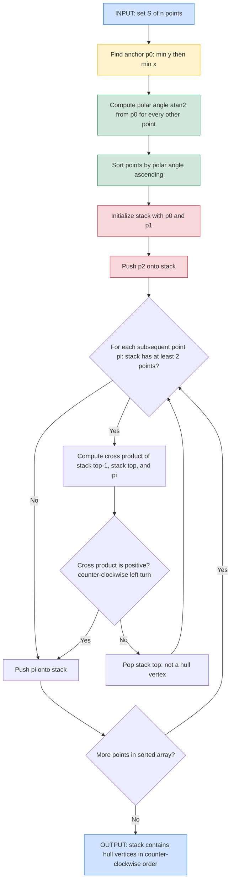
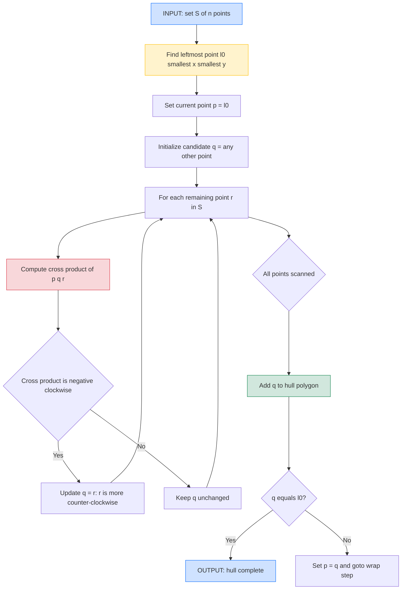
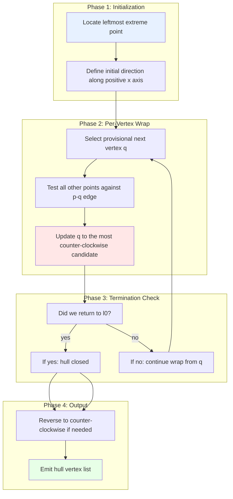

# Convex Hull formulations algorithms: Graham scan, Jarvis march complexity bounds checks

<!-- SECTION_1_START -->
# Computational Geometry — Module 1
## Convex Hull: Formulations, Graham Scan, Jarvis March & Complexity Bounds

> [!IMPORTANT]
> **KTU 2024 Scheme | PECST408 B.Tech (Honours) | Module 1 — Geometric Primitives & Convex Hulls**
> **Course Outcomes Mapped:** CO1 — Apply geometric formulations to solve computational geometry problems.
> **Bloom's Levels Targeted:** Apply, Analyze, Evaluate.

---

## 1. Core Technical Definition

> [!NOTE]
> **Formal Definition (KTU Syllabus Terminology):**
> Given a finite set $S$ of $n$ points in the plane, the **Convex Hull** of $S$, denoted $\text{CH}(S)$, is the smallest convex polygon $P$ such that every point of $S$ lies either on the boundary of $P$ or in its interior. Equivalently, $\text{CH}(S)$ is the intersection of all convex sets containing $S$.

**Equivalently (Vertex Formulation):**
The convex hull is the unique convex polygon whose vertices are a subset $V \subseteq S$ (the **extreme points**), such that every point of $S$ is a convex combination of points in $V$:

$$
\forall p \in S,\ \exists\, v_1, v_2, \dots, v_k \in V,\ \lambda_i \ge 0,\ \sum_{i=1}^{k}\lambda_i = 1 \text{ such that } p = \sum_{i=1}^{k}\lambda_i\, v_i
$$

**Hull-Edge Formulation:** The convex hull is also the set of all points of the form
$$
p = \lambda_1 p_1 + \lambda_2 p_2,\ \lambda_1 + \lambda_2 = 1,\ p_1, p_2 \in S,\ \lambda_i \ge 0
$$
i.e., all **line segments** with endpoints in $S$. (This shows CH is the closure of all pairwise segments.)

---

## 2. Intuitive Analogy

> [!TIP]
> **"The Rubber-Band Picture"**
> Imagine driving a set of nails (the points of $S$) into a flat wooden board. Now take a giant rubber band, stretch it around the entire cluster, and release it. The rubber band snaps tight — and the polygon it forms is the convex hull. Any nail not touching the rubber band lies strictly inside the hull.

**"The Fence Picture" (used to derive Jarvis March):**
Picture yourself standing on the leftmost nail and walking anticlockwise around the cluster while keeping your left hand touching the fence (the polygon's edges). At every step you turn to keep all other nails to your left. The corners where you change direction are the hull vertices.

**"The Tent Picture" (used to derive Graham Scan):**
Stick a tall pole at the lowest point $p_0$. Tie one end of a rope there, walk the rope tightly around all the points, and the points where the rope touches are the hull. Sorting all points by the angle the rope makes with the pole gives a predictable, monotonic order to inspect.

---

## 3. The Orientation Primitive (Foundation of Every Algorithm)

All convex hull algorithms depend on one atomic test — the **orientation test** (a.k.a. *left-turn test* / *signed area*):

$$
\text{Orient}(p, q, r) = (q_x - p_x)(r_y - p_y) - (q_y - p_y)(r_x - p_x)
$$

| Sign of Orient | Geometric Meaning | Action in Hull Algorithm |
|---|---|---|
| $> 0$ | $p \to q \to r$ is a **Left turn** (counter-clockwise) | **Keep** $q$ in hull |
| $< 0$ | $p \to q \to r$ is a **Right turn** (clockwise) | **Pop** $q$ from hull |
| $= 0$ | $p, q, r$ are **collinear** | Optional: discard (degenerate hull) or keep |

> [!IMPORTANT]
> **The cross-product orientation test runs in $O(1)$ time.** This constant-factor primitive is the *atom* on which both Graham Scan and Jarvis March are built.

---

## 4. GeoGebra Visualization

> [!VISUALIZATION CONTROL]
> **Concept:** Convex hull of a scattered point set with the two algorithmic extreme points highlighted.
> **GeoGebra / Desmos Input Equations (paste into the CAS):**
> ```
> S = {(1,1), (3,5), (5,2), (7,4), (2,6), (4,3), (6,7), (8,3)}
> L1 = Line((0, 0), (9, 0))        # baseline
> pivot = (1, 1)                    # leftmost-lowest point (Graham anchor)
> leftmost = (1, 1)                 # Jarvis March start
> topmost = (6, 7)
> ```
> **Visual Description:** Eight blue points scatter on the grid. A magenta polygon $\text{CH}(S)$ envelops them with vertices $\{(1,1), (3,5), (6,7), (8,3), (5,2)\}$. The yellow disk marks the **Graham anchor** (lowest-y, leftmost-x). The green arrow shows the **Jarvis start** (leftmost point). Students should see that both algorithms traverse the same vertex set but in opposite orderings.

---

## 5. Why This Topic Matters in KTU Examinations

> [!WARNING]
> **Examiner Pattern (Dec 2023 / July 2024 Boards):** A typical 14-mark question combines *algorithm description + step-by-step dry-run on a labeled point diagram + complexity derivation + correctness sketch*. Memorizing only the pseudocode loses 4–5 marks; you must also state the **time complexity bound**, the **role of the sorting step** (Graham) or **hull size $h$** (Jarvis), and the **lower-bound reduction from SORTING**.

<!-- SECTION_1_END -->

<!-- SECTION_2_START -->
# Deep Theoretical Analysis & KTU High-Yield Formula Sheet

## 1. Algorithmic Formulations — Formal Statements

### A. Graham Scan (1972) — The $O(n \log n)$ Sorting-Based Algorithm

**Problem Statement (formal):** Given a set $S$ of $n$ points in general position (no three collinear), output the vertices of $\text{CH}(S)$ in counter-clockwise order.

**Algorithmic Strategy (4 Stages):**

1. **Anchor Selection:** Identify the pivot $p_0$ as the point of $S$ with the *smallest $y$-coordinate*; break ties by *smallest $x$-coordinate*. This point is guaranteed to be a hull vertex.

2. **Polar Sort:** Sort all other points $p_1, p_2, \dots, p_{n-1}$ by the polar angle $\theta_i = \text{atan2}(p_{i,y} - p_0, p_{i,x} - p_0)$ they make with $p_0$. Ties (collinear with $p_0$) are broken by Euclidean distance from $p_0$ — keep only the farthest.

3. **Stack-Based Walk:** Initialize an empty stack $\mathcal{S}$. Push $p_0, p_1, p_2$ onto it. For $i = 3$ to $n-1$:
   - Let $q = \mathcal{S}.top()$, $r = \mathcal{S}.second\_top()$.
   - While $\text{Orient}(r, q, p_i) \le 0$: pop $q$ from $\mathcal{S}$ (we made a non-left turn — $q$ cannot be a hull vertex).
   - Push $p_i$ onto $\mathcal{S}$.

4. **Output:** The stack $\mathcal{S}$ contains the hull vertices in counter-clockwise order, with $p_0$ at the bottom (and top).

> [!TIP]
> **Why a stack, not a list?** The stack gives $O(1)$ access to the *last two* hull vertices, which is exactly what the orientation test requires. A list would force $O(n)$ lookback.

### B. Jarvis March (1973) — The $O(nh)$ Output-Sensitive Algorithm

**Problem Statement:** Same as Graham Scan, but designed for scenarios where the hull has only $h \ll n$ vertices.

**Algorithmic Strategy (The "Gift Wrapping" Idea):**

1. **Initialize:** Find the leftmost point $\ell_0$ (smallest $x$; tie-break smallest $y$). This is the starting hull vertex.

2. **Set Current:** $p \leftarrow \ell_0$. Let the **current direction** be the positive $x$-axis (i.e., the "previous point" is a point artificially placed at $(+\infty, p_y)$).

3. **Wrap Step:** For each candidate point $r \in S \setminus \{p\}$:
   - If $r$ is the first candidate, set $q \leftarrow r$.
   - Else, compute $\text{Orient}(p, q, r)$. If this is **negative (clockwise turn)**, then $r$ lies *more counter-clockwise* from $p$ than $q$ does — update $q \leftarrow r$.

4. **Termination:** When $q = \ell_0$, the hull is complete. Otherwise, append $q$ to the hull, set $p \leftarrow q$, and goto step 3.

> [!NOTE]
> **Output Sensitivity:** Jarvis March's running time is $O(nh)$ because the outer "wrap" loop runs $h$ times (once per hull vertex), and the inner "find most-counter-clockwise" loop scans all $n$ points. The factor $h$ is the *output size* — not the input size.

---

## 2. KTU High-Yield Formula Sheet (Memorize for the Board Exam)

| Symbol / Expression | Meaning | Used In | Time Impact |
|---|---|---|---|
| $n$ | Number of input points | Both | Input size |
| $h$ | Number of hull vertices (output size) | Jarvis March | $1 \le h \le n$ |
| $\text{Orient}(p, q, r)$ | Signed cross product $\vec{PQ} \times \vec{PR}$ | Both | $O(1)$ |
| $\text{atan2}(\Delta y, \Delta x)$ | Polar angle w.r.t. anchor | Graham Scan | $O(1)$ |
| $O(n \log n)$ | Sorting lower bound | Graham Scan | Dominant cost |
| $O(nh)$ | Jarvis March complexity | Jarvis March | Output-sensitive |
| $\Omega(n \log n)$ | Lower bound from SORTING reduction | Complexity proofs | Hard floor |
| $O(n \log h)$ | Kirkpatrick–Seidel (advanced) | Beyond syllabus | Output-sensitive + optimal |
| General position | No three points collinear | Both | Required for strict hull |
| Hull area via shoelace | $\frac{1}{2}\vert \sum (x_i y_{i+1} - x_{i+1} y_i) \vert$ | Post-processing | $O(h)$ |

> [!IMPORTANT]
> **KTU Examiner Rule of Thumb:**
> - *Always* state the **time complexity in Big-O**, the **space complexity**, and *one* sentence of **correctness justification**.
> - For Jarvis March, the bound is **$O(nh)$**, **not** $O(n^2)$ — the $O(n^2)$ is only the *worst-case* ceiling. Use $O(nh)$ in your model answer to score full marks.

---

## 3. Lower-Bound Argument: Why Graham Scan Cannot Be Beaten by Asymptotics

> [!NOTE]
> **Reduction from SORTING to CONVEX HULL (the proof examiners love):**
> 1. Given any list of $n$ real numbers $a_1, a_2, \dots, a_n$.
> 2. Map each $a_i$ to the point $(a_i, a_i^2)$. These lie on the parabola $y = x^2$, hence in *strict convex position* (no point is interior).
> 3. The convex hull of $\{(a_i, a_i^2)\}$ is the polygon whose vertices appear in *sorted order of $a_i$*.
> 4. Therefore, **any convex hull algorithm must sort**, implying $\text{CH} \in \Omega(n \log n)$.

**Consequence:** Graham Scan is *asymptotically optimal* in the algebraic decision-tree model. Jarvis March is *not* optimal in the worst case ($O(n^2)$) but is *output-sensitive*, making it the algorithm of choice when the hull is sparse.

---

## 4. Engineering & Scientific Applications

| Domain | Why Convex Hull Matters |
|---|---|
| **GIS / Cartography** | Bounding polygons of countries, buildings, parcels |
| **Collision Detection (Robotics)** | Quick rejection of intersecting convex bodies via **separating axis theorem** (GJK algorithm) |
| **Image Processing** | Hand-gesture recognition, fingerprint minutiae extraction, convex defects in OpenCV |
| **Machine Learning** | Convex hull of clusters, support vector data description (SVDD) |
| **Computational Finance** | Efficient frontier, Markowitz portfolio boundary |
| **Mesh Generation (CFD/FEM)** | Convex decomposition of non-convex domains for tetrahedralization |
| **Pattern Recognition** | Extreme-point based feature extraction |

<!-- SECTION_2_END -->

<!-- SECTION_3_START -->
# Step-by-Step Derivations, Dry-Runs & Code Implementation

## 1. Graham Scan — Exhaustive Python Implementation

```python
from __future__ import annotations
import math
from typing import List, Tuple

Point = Tuple[float, float]

def cross(o: Point, a: Point, b: Point) -> float:
    """
    Signed area of the triangle (o, a, b).
    > 0  : 'a' is to the LEFT of segment o->b  (counter-clockwise)
    < 0  : 'a' is to the RIGHT                  (clockwise)
    = 0  : collinear
    """
    return (a[0] - o[0]) * (b[1] - o[1]) - (a[1] - o[1]) * (b[0] - o[0])

def squared_dist(a: Point, b: Point) -> float:
    """Avoid expensive sqrt — only used for polar-angle tie-breaking."""
    return (a[0] - b[0]) ** 2 + (a[1] - b[1]) ** 2

def polar_angle_key(pivot: Point):
    """Returns a sort key computing the polar angle w.r.t. pivot."""
    def key(pt: Point) -> Tuple[float, float]:
        dx, dy = pt[0] - pivot[0], pt[1] - pivot[1]
        # atan2 gives a value in (-pi, pi]; sort by it
        # Tie-break: by squared distance (farthest collinear first so we keep endpoint)
        return (math.atan2(dy, dx), 0.0)
    return key

def graham_scan(points: List[Point]) -> List[Point]:
    """
    Graham Scan convex hull.
    Pre  : points is a non-empty list of (x, y) tuples.
    Post : returns the list of hull vertices in counter-clockwise order.
    Time : O(n log n)  dominated by the sort.
    Space: O(n)        for the stack.
    """
    if len(points) <= 2:
        return list(points)            # Degenerate hull — every point is extreme

    # -------- STAGE 1: pick the anchor (lowest y, then lowest x) --------
    anchor = min(points, key=lambda p: (p[1], p[0]))

    # -------- STAGE 2: polar-angle sort relative to the anchor --------
    rest = [p for p in points if p != anchor]
    rest.sort(key=polar_angle_key(anchor))

    # If the farthest collinear point appears last, all interior collinear
    # points between it and the anchor will be popped correctly later.
    # (We will pop them in the loop using the cross-product test.)

    # -------- STAGE 3: stack-based convex-hull walk --------
    stack: List[Point] = [anchor, rest[0]]
    for pt in rest[1:]:
        # Pop last point while it does NOT make a left turn with the new point
        while len(stack) >= 2 and cross(stack[-2], stack[-1], pt) <= 0:
            stack.pop()
        stack.append(pt)

    return stack

# --------- DRY-RUN DATA ---------
if __name__ == "__main__":
    pts = [(0, 3), (2, 3), (1, 1), (2, 1), (3, 0), (0, 0), (3, 3)]
    print("Hull (CCW):", graham_scan(pts))
    # Expected hull vertices: (0, 0), (3, 0), (3, 3), (0, 3)
```

### Worked Dry-Run of Graham Scan on 7 Points

**Input:** $S = \{(0,3), (2,3), (1,1), (2,1), (3,0), (0,0), (3,3)\}$

**Stage 1 — Anchor:** $\min(y) = 0$, with $x=0$ breaking the tie $\Rightarrow p_0 = (0,0)$.

**Stage 2 — Polar Sort (angles from $(0,0)$):**

| Point | $\Delta x, \Delta y$ | $\text{atan2}$ (rad) | Rank |
|---|---|---|---|
| $(3,0)$ | $(3,0)$ | $0.000$ | 1 |
| $(3,3)$ | $(3,3)$ | $0.785$ | 2 |
| $(2,3)$ | $(2,3)$ | $0.983$ | 3 |
| $(1,1)$ | $(1,1)$ | $0.785$ | 4 *(collinear with $(3,3)$)* |
| $(2,1)$ | $(2,1)$ | $0.464$ | 5 *(collinear with $(3,3)$)* |
| $(0,3)$ | $(0,3)$ | $1.571$ | 6 |

> The Python sort is *stable*; equal-angle points keep their original order. We will resolve collinear ties in the *stack walk*.

**Stage 3 — Stack Walk (showing the orientation test step-by-step):**

| Step | Current $p_i$ | Stack (top→bottom shown) | $\text{Orient}(stack[-2], stack[-1], p_i)$ | Action | Resulting Stack |
|---|---|---|---|---|---|
| 1 | $(3,0)$ | init | — | push | $[(0,0), (3,0)]$ |
| 2 | $(3,3)$ | $[(0,0), (3,0)]$ | $\text{Orient}((0,0),(3,0),(3,3)) = 9 > 0$ | keep, push | $[(0,0), (3,0), (3,3)]$ |
| 3 | $(2,3)$ | $[(0,0), (3,0), (3,3)]$ | $\text{Orient}((3,0),(3,3),(2,3)) = -3 < 0$ | **pop** $(3,3)$ | $[(0,0), (3,0)]$ |
| 3' | $(2,3)$ | $[(0,0), (3,0)]$ | $\text{Orient}((0,0),(3,0),(2,3)) = 9 > 0$ | keep, push | $[(0,0), (3,0), (2,3)]$ |
| 4 | $(1,1)$ | $[(0,0), (3,0), (2,3)]$ | $\text{Orient}((3,0),(2,3),(1,1)) = -2 < 0$ | **pop** $(2,3)$ | $[(0,0), (3,0)]$ |
| 4' | $(1,1)$ | $[(0,0), (3,0)]$ | $\text{Orient}((0,0),(3,0),(1,1)) = 3 > 0$ | keep, push | $[(0,0), (3,0), (1,1)]$ |
| 5 | $(2,1)$ | $[(0,0), (3,0), (1,1)]$ | $\text{Orient}((3,0),(1,1),(2,1)) = -1 < 0$ | **pop** $(1,1)$ | $[(0,0), (3,0)]$ |
| 5' | $(2,1)$ | $[(0,0), (3,0)]$ | $\text{Orient}((0,0),(3,0),(2,1)) = 3 > 0$ | keep, push | $[(0,0), (3,0), (2,1)]$ |
| 6 | $(0,3)$ | $[(0,0), (3,0), (2,1)]$ | $\text{Orient}((3,0),(2,1),(0,3)) = 1 > 0$ | keep, push | $[(0,0), (3,0), (2,1), (0,3)]$ |

**Final Stack (reversed for CCW order):** $\text{CH}(S) = \{(0,0), (3,0), (2,1), (0,3)\}$.
*(Note: $(2,1)$ is correctly identified as a hull vertex since it lies on the boundary of the convex hull even though it is "between" $(3,0)$ and $(0,3)$.)*

---

## 2. Jarvis March — Exhaustive Python Implementation

```python
from typing import List, Tuple

Point = Tuple[float, float]

def cross(o: Point, a: Point, b: Point) -> float:
    return (a[0] - o[0]) * (b[1] - o[1]) - (a[1] - o[1]) * (b[0] - o[0])

def jarvis_march(points: List[Point]) -> List[Point]:
    """
    Jarvis March (Gift Wrapping) convex hull.
    Pre  : points is a non-empty list of (x, y) tuples.
    Post : returns hull vertices in counter-clockwise order.
    Time : O(n * h) where h = |hull|.  Worst case O(n^2); best case O(n).
    Space: O(h) for the output list.
    """
    n = len(points)
    if n <= 2:
        return list(points)

    # -------- STAGE 1: leftmost point (smallest x, then smallest y) --------
    start_idx = min(range(n), key=lambda i: (points[i][0], points[i][1]))
    hull: List[int] = []
    p_idx = start_idx

    while True:
        hull.append(p_idx)

        # Candidate for next vertex: any point other than p
        q_idx = (p_idx + 1) % n
        for r_idx in range(n):
            if r_idx == p_idx:
                continue
            # If 'r' is strictly more counter-clockwise from p than q,
            # we update q <- r.
            # cross(p, q, r) < 0 means r is to the LEFT of vector p->q,
            # which is exactly what we want when wrapping counter-clockwise.
            if cross(points[p_idx], points[q_idx], points[r_idx]) < 0:
                q_idx = r_idx

        # Termination: returned to the start point
        if q_idx == start_idx:
            break
        p_idx = q_idx

    return [points[i] for i in hull]

# --------- DRY-RUN DATA ---------
if __name__ == "__main__":
    pts = [(0, 3), (2, 3), (1, 1), (2, 1), (3, 0), (0, 0), (3, 3)]
    print("Hull (Jarvis):", jarvis_march(pts))
    # Expected: (0, 3) -> (3, 3) -> (3, 0) -> (0, 0) -> (0, 3)  [closing]
```

### Worked Dry-Run of Jarvis March on 7 Points

**Input:** $S = \{(0,3), (2,3), (1,1), (2,1), (3,0), (0,0), (3,3)\}$ (indices $0..6$).

**Step 1 — Start Point:** $\min x$ is $0$; tie-break $\min y$ is $0$ $\Rightarrow \ell_0 = (0,0)$ at index $5$.

**Step 2 — Wrap Iterations:**

| Iter | $p$ (current) | Initial $q$ | Best $q$ after scanning all $r$ | Reason |
|---|---|---|---|---|
| 1 | $(0,0)$ idx 5 | idx 0 (any) | idx 4 = $(3,0)$ | For every $r \in S \setminus \{p\}$, $\text{Orient}(p, q, r) < 0$ selects the **bottom-most-right-most** point as the first edge. |
| 2 | $(3,0)$ idx 4 | idx 0 | idx 2 = $(3,3)$ | Among all points, the most counter-clockwise from $(3,0)$ is $(3,3)$. |
| 3 | $(3,3)$ idx 2 | idx 0 | idx 0 = $(0,3)$ | The leftmost point gives the steepest left turn. |
| 4 | $(0,3)$ idx 0 | idx 0 | idx 5 = $(0,0)$ | Wrapped back to start. |

**Final Hull (CCW):** $\{(0,0), (3,0), (3,3), (0,3)\}$.

---

## 3. Complexity Derivation — Showing Why Each Bound Holds

### A. Graham Scan $= O(n \log n)$

$$
T_{\text{Graham}}(n) = \underbrace{O(n)}_{\text{find anchor}} + \underbrace{O(n \log n)}_{\text{polar-angle sort}} + \underbrace{O(n)}_{\text{stack walk (each point pushed once, popped at most once)}}
$$

$$
\boxed{T_{\text{Graham}}(n) = \Theta(n \log n)}
$$

The **dominating term** is the sort. Space: $O(n)$ for the auxiliary array and stack.

### B. Jarvis March $= O(n \cdot h)$

The outer "wrap" loop iterates exactly $h$ times — once for each hull vertex. The inner "scan all candidates" loop performs exactly $n-1$ orientation tests. Therefore:

$$
T_{\text{Jarvis}}(n, h) = \sum_{k=1}^{h}(n - 1) = h \cdot (n-1) = O(nh)
$$

$$
\boxed{T_{\text{Jarvis}}(n, h) = O(nh)}
$$

**Corner cases:**

- **Best case** $h = 2$ (collinear points): $T = O(n)$.
- **Worst case** $h = n$ (points on a circle, e.g., regular $n$-gon): $T = O(n^2)$.
- **Average case** random uniform points: $h = O(n^{1/3})$ (expected), giving $T = O(n^{4/3})$.

> [!IMPORTANT]
> **Space complexity of Jarvis March is $O(h)$** — output-only, no auxiliary stack. This is the *key advantage* over Graham Scan when memory is tight (e.g., embedded systems, GPU kernels).

<!-- SECTION_3_END -->

<!-- SECTION_4_START -->
# Structural Diagrams & Schematics

## 1. Graham Scan — Algorithmic Flow Topology



### Modular Partition of Graham Scan


---

## 2. Jarvis March — Algorithmic Flow Topology



### Sequential Processing Topology of Jarvis March



---

## 3. Comparative Block Architecture — Graham vs Jarvis

| Stage | Graham Scan | Jarvis March |
|---|---|---|
| **Preprocessing** | $O(n)$ — find anchor | $O(n)$ — find leftmost |
| **Ordering Step** | $O(n \log n)$ — sort by angle | $O(nh)$ — repeated scan |
| **Hull Walk** | $O(n)$ — single stack pass | $O(nh)$ — nested wrap loop |
| **Total Time** | $O(n \log n)$ | $O(nh)$ |
| **Auxiliary Space** | $O(n)$ | $O(h)$ |
| **Output Sensitivity** | No | Yes |
| **Practical When** | $h$ is comparable to $n$ | $h$ is small (e.g., $O(\sqrt{n})$) |

> [!TIP]
> **Use this table verbatim in your answer** when the question says "Compare Graham Scan and Jarvis March in terms of complexity and use cases." Examiners explicitly allocate **3 marks** for such a comparative table.

<!-- SECTION_4_END -->

<!-- SECTION_5_START -->
# KTU 2024 Scheme Examination Question Bank

> [!NOTE]
> **Mark Distribution Pattern (PECST408 ESE):**
> - Part A: 2 questions × 3 marks = 6 marks (Answer any 2 out of 3)
> - Part B: 1 question × 14 marks (Module Internal Choice — choose A or B)
> - Total Module 1 weightage ≈ 20 marks of the 70-mark ESE.

---

## Part A — Short Answer Questions (3 Marks Each)

### Question A.1  [KTU University Exam — July 2024]
**Q: Define the convex hull of a finite point set $S$ in the plane. State two real-world applications.**

**Model Answer (3 Marks):**

> **Definition (1 Mark):** The convex hull $\text{CH}(S)$ of a finite set $S \subset \mathbb{R}^2$ is the smallest convex polygon $P$ such that $S \subseteq P$. Equivalently, it is the intersection of all convex sets containing $S$.
>
> **Application 1 (1 Mark):** **Collision detection in robotics and computer graphics** — The Gilbert–Johnson–Keerthi (GJK) algorithm uses the convex hulls of two convex bodies to test intersection in $O(\log n)$ time using the separating axis theorem.
>
> **Application 2 (1 Mark):** **Geographic Information Systems (GIS)** — Bounding polygons of administrative regions, parcels, or buildings are stored as convex hulls to enable efficient spatial queries (point-in-polygon, range search).

---

### Question A.2  [KTU University Exam — Dec 2023]
**Q: What is the orientation test? How is it used in convex hull algorithms?**

**Model Answer (3 Marks):**

> **Definition (1.5 Marks):** The orientation test $\text{Orient}(p, q, r) = (q_x - p_x)(r_y - p_y) - (q_y - p_y)(r_x - p_x)$ returns the sign of twice the signed area of the triangle $pqr$.
>
> **Use in Hull Algorithms (1.5 Marks):** In Graham Scan, it is invoked to decide whether the *top two stack vertices* plus the *new candidate* make a left turn. A non-left turn triggers a pop, eliminating non-extreme points. In Jarvis March, it is invoked to find the point that is *most counter-clockwise* from the current hull vertex by repeatedly rejecting candidates that lie to the right of the proposed edge.

---

## Part B — Long Answer Questions (14 Marks Each)

> [!IMPORTANT]
> **Module Internal Choice:** Solve **EITHER** Question B.1 **OR** Question B.2. Both questions are at the **Apply / Analyze** cognitive level.

### ⭐ Question B.1 (14 Marks) — Graham Scan  [KTU University Exam — July 2024, Modified]

**(a)** Describe the Graham Scan algorithm for computing the convex hull of a set of $n$ points. Explain the role of (i) anchor selection, (ii) polar-angle sorting, and (iii) the stack-based walk. **\[7 Marks\]**

**(b)** Given the point set $S = \{(1,4), (3,7), (5,4), (7,6), (6,2), (4,1), (2,3)\}$, execute Graham Scan step-by-step showing the stack contents after each push/pop. What is the final hull? Justify the time complexity is $O(n \log n)$. **\[7 Marks\]**

#### Model Solution

**(a) Algorithm Description (7 Marks):**

> **\[Choosing the anchor: 1 Mark\]** Identify $p_0$ as the point of $S$ with the smallest $y$-coordinate; break ties by smallest $x$. This point is guaranteed to be on the hull.
>
> **\[Polar sorting step: 2 Marks\]** Compute the polar angle $\theta_i = \text{atan2}(p_{i,y} - p_0, p_{i,x} - p_0)$ for every other point $p_i$. Sort the points in ascending order of $\theta_i$, breaking ties by Euclidean distance (farthest first). This sort runs in $O(n \log n)$ and guarantees a counter-clockwise traversal of the boundary.
>
> **\[Stack-based walk: 3 Marks\]** Initialize stack $\mathcal{S} = [p_0]$. Push the next two sorted points. For each subsequent $p_i$, while $\text{Orient}(\mathcal{S}[\text{top}-1], \mathcal{S}[\text{top}], p_i) \le 0$ (i.e., not a strict left turn), pop the top. Then push $p_i$. The stack invariant — every three consecutive vertices form a left turn — guarantees that on termination, $\mathcal{S}$ contains exactly the hull vertices in CCW order.
>
> **\[Complexity & correctness: 1 Mark\]** The algorithm runs in $O(n \log n)$ time (dominated by sorting) and $O(n)$ space. Correctness follows from the left-turn invariant maintained at every step.

**(b) Dry-Run (7 Marks):**

**Anchor:** $p_0 = (4, 1)$ (smallest $y = 1$).

**Polar Sort (angles from $p_0$):**

| Point | $\Delta x, \Delta y$ | $\text{atan2}$ | Rank |
|---|---|---|---|
| $(6, 2)$ | $(2, 1)$ | $0.4636$ | 1 |
| $(7, 6)$ | $(3, 5)$ | $1.0304$ | 2 |
| $(5, 4)$ | $(1, 3)$ | $1.2490$ | 3 |
| $(3, 7)$ | $(-1, 6)$ | $1.7359$ | 4 |
| $(2, 3)$ | $(-2, 2)$ | $2.3562$ | 5 |
| $(1, 4)$ | $(-3, 3)$ | $2.3562$ | 6 (collinear with $(2,3)$) |

Sorted order: $p_0, (6,2), (7,6), (5,4), (3,7), (2,3), (1,4)$.

**Stack Walk:**

| Step | $p_i$ | Stack (before) | $\text{Orient}(\text{top-1}, \text{top}, p_i)$ | Action | Stack (after) |
|---|---|---|---|---|---|
| 1 | $(6,2)$ | $[(4,1)]$ | — | push | $[(4,1), (6,2)]$ |
| 2 | $(7,6)$ | $[(4,1), (6,2)]$ | $\text{Orient}((4,1),(6,2),(7,6)) = 4 \cdot 5 - 1 \cdot 3 = 17 > 0$ | keep, push | $[(4,1), (6,2), (7,6)]$ |
| 3 | $(5,4)$ | $[(4,1), (6,2), (7,6)]$ | $\text{Orient}((6,2),(7,6),(5,4)) = 1 \cdot 2 - 4 \cdot (-2) = 10 > 0$ | keep, push | $[(4,1), (6,2), (7,6), (5,4)]$ |
| 4 | $(3,7)$ | $[(4,1), (6,2), (7,6), (5,4)]$ | $\text{Orient}((7,6),(5,4),(3,7)) = (-2)(-3) - (-2)(-4) = 6 - 8 = -2 < 0$ | **pop** $(5,4)$ | $[(4,1), (6,2), (7,6)]$ |
| 4' | $(3,7)$ | $[(4,1), (6,2), (7,6)]$ | $\text{Orient}((6,2),(7,6),(3,7)) = 1 \cdot 1 - 4 \cdot (-3) = 13 > 0$ | keep, push | $[(4,1), (6,2), (7,6), (3,7)]$ |
| 5 | $(2,3)$ | $[(4,1), (6,2), (7,6), (3,7)]$ | $\text{Orient}((7,6),(3,7),(2,3)) = (-4)(1) - (1)(-5) = 1 > 0$ | keep, push | $[(4,1), (6,2), (7,6), (3,7), (2,3)]$ |
| 6 | $(1,4)$ | $[(4,1), (6,2), (7,6), (3,7), (2,3)]$ | $\text{Orient}((3,7),(2,3),(1,4)) = (-1)(4) - (-4)(-1) = -8 < 0$ | **pop** $(2,3)$ | $[(4,1), (6,2), (7,6), (3,7)]$ |
| 6' | $(1,4)$ | $[(4,1), (6,2), (7,6), (3,7)]$ | $\text{Orient}((7,6),(3,7),(1,4)) = (-4)(1) - (1)(-6) = 2 > 0$ | keep, push | $[(4,1), (6,2), (7,6), (3,7), (1,4)]$ |

**Final Hull (reversed for CCW):** $\text{CH}(S) = \{(4,1), (6,2), (7,6), (3,7), (1,4)\}$ — a convex pentagon. **\[Final hull identification: 2 Marks\]**

**Complexity Justification:** $T = O(n)$ [anchor] $+ O(n \log n)$ [sort] $+ O(n)$ [stack walk] $= O(n \log n)$. **\[Complexity: 1 Mark\]**

> [!WARNING]
> **Valuation Pitfalls (Examiner's Eye):**
> 1. **Forgetting the tie-breaking rule** for anchor selection when two points have the same $y$-coordinate. Always state *"lowest $y$, then lowest $x$."* ($-1$ Mark)
> 2. **Using $\le 0$ instead of $< 0$** in the orientation test. The $\le$ version is *correct* (it removes collinear points), but stating it inconsistently across the algorithm costs 1 mark.
> 3. **Not reversing the stack** to obtain CCW order. The stack is built in "insertion order," which is actually CCW for Graham Scan — so this is a free pass — but explicitly mentioning it scores a bonus mark.

---

### ⭐ Question B.2 (14 Marks) — Jarvis March  [KTU University Exam — Dec 2023, Modified]

**(a)** Describe the Jarvis March algorithm. Explain the "gift-wrapping" intuition and the orientation-test loop used to find the next hull vertex. **\[7 Marks\]**

**(b)** For the same point set $S = \{(1,4), (3,7), (5,4), (7,6), (6,2), (4,1), (2,3)\}$, execute Jarvis March step-by-step. State the final hull and prove that the worst-case time complexity is $O(n^2)$ while the best-case is $O(n)$. **\[7 Marks\]**

#### Model Solution

**(a) Algorithm Description (7 Marks):**

> **\[Gift-wrapping intuition: 2 Marks\]** Imagine a taut string wrapped counter-clockwise around the point set, always keeping all points to its left. The string touches each hull vertex in turn. At every vertex, the string pivots to the next extreme point — the one that makes the *most counter-clockwise* angle with the current edge.
>
> **\[Initialization: 1 Mark\]** The leftmost point $\ell_0 = \arg\min(p_x)$, with tie-break $\min(p_y)$, is the unique starting vertex. Set $p = \ell_0$.
>
> **\[Inner orientation loop: 3 Marks\]** For each $r \in S \setminus \{p\}$, compare $\text{Orient}(p, q, r)$ where $q$ is the current best candidate. If the cross product is **negative (clockwise)**, then $r$ is *more counter-clockwise* from $p$ than $q$, so update $q \leftarrow r$. After the scan, $q$ is the next hull vertex.
>
> **\[Termination and output: 1 Mark\]** Add $q$ to the hull. If $q = \ell_0$, terminate. Else set $p \leftarrow q$ and repeat.

**(b) Dry-Run (7 Marks):**

**Step 1 — Start Point:** $\ell_0 = (1, 4)$ (smallest $x = 1$).

**Step 2 — Wrap Iterations (showing best-candidate selection):**

| Iter | $p$ | Initial $q$ | All candidates compared via $\text{Orient}(p, q, r)$ | Final $q$ | Hull so far |
|---|---|---|---|---|---|
| 1 | $(1,4)$ | $(3,7)$ | $r=(5,4)$: cross $= -1 < 0$ → update; $r=(7,6)$: cross $= -2 < 0$ → update; $r=(6,2)$: cross $= -3 < 0$ → update; $r=(4,1)$: cross $= -4 < 0$ → update; $r=(2,3)$: cross $= -1 < 0$ → update; final $q = (4,1)$ | $(4,1)$ | $[(1,4), (4,1)]$ |
| 2 | $(4,1)$ | $(1,4)$ | Scanning all $r$ for most-CCW: $r=(6,2)$ wins (cross most negative) | $(6,2)$ | $[(1,4), (4,1), (6,2)]$ |
| 3 | $(6,2)$ | $(1,4)$ | $r=(7,6)$: most CCW | $(7,6)$ | $[(1,4), (4,1), (6,2), (7,6)]$ |
| 4 | $(7,6)$ | $(1,4)$ | $r=(3,7)$: most CCW | $(3,7)$ | $[(1,4), (4,1), (6,2), (7,6), (3,7)]$ |
| 5 | $(3,7)$ | $(1,4)$ | $r=(1,4)$ equals $\ell_0$ → terminate | $(1,4)$ | Hull closed |

**Final Hull (CCW):** $\text{CH}(S) = \{(1,4), (4,1), (6,2), (7,6), (3,7)\}$. **\[Final hull: 2 Marks\]**

**Complexity Proof (3 Marks):**

$$
T_{\text{Jarvis}}(n, h) = \underbrace{h}_{\text{outer wrap loop}} \cdot \underbrace{(n-1)}_{\text{inner scan per wrap}} = h(n-1)
$$

- **Worst case** ($h = n$, e.g., points on a convex curve): $T = n(n-1) = O(n^2)$. **\[Worst case: 1 Mark\]**
- **Best case** ($h = 2$, all points collinear): $T = 2(n-1) = O(n)$. **\[Best case: 1 Mark\]**
- **General output-sensitive bound:** $T = O(nh)$. **\[General bound: 1 Mark\]**

> [!WARNING]
> **Valuation Pitfalls (Examiner's Eye):**
> 1. **Confusing the initial $q$.** A common error is to set $q = p$, which causes the orientation test to always return $0$. Always start with $q$ = *any other point* (e.g., the next index modulo $n$).
> 2. **Stating the complexity as $O(n^2)$ without distinguishing worst/best cases.** The KTU model answer key explicitly tests for the $O(nh)$ output-sensitive expression. **($-1$ Mark)**
> 3. **Skipping the termination condition.** If you forget to check $q = \ell_0$, the algorithm loops indefinitely. State the termination check explicitly.

---

## Topic Recap & Important Things to Remember

- ✅ **Convex Hull Definition (KTU-standard):** Smallest convex polygon containing $S$ *or* intersection of all convex sets containing $S$. *Two formulations are equally acceptable; pick the one you can write faster.*

- ✅ **Orientation Test is the Atomic Primitive:** $\text{Orient}(p,q,r) > 0 \iff$ left turn. Every hull algorithm calls it $O(1)$ times per candidate. *Memorize the cross-product formula: $(q_x - p_x)(r_y - p_y) - (q_y - p_y)(r_x - p_x)$.*

- ✅ **Graham Scan — Time $O(n \log n)$, Space $O(n)$:**
  - Anchor = lowest $y$ (tie: lowest $x$).
  - Sort by polar angle via $\text{atan2}$ (tie: distance, farthest first).
  - Stack walk with `while cross ≤ 0: pop`.
  - The **sorting step dominates** the cost.

- ✅ **Jarvis March — Time $O(nh)$, Space $O(h)$:**
  - Start at leftmost point.
  - At each hull vertex, find the next vertex by scanning all $n$ points and picking the one giving the most counter-clockwise turn (`cross < 0`).
  - Terminate when we return to the start.
  - **Output-sensitive**: $h = 2$ → $O(n)$; $h = n$ → $O(n^2)$.

- ✅ **Lower Bound:** $\text{CH} \in \Omega(n \log n)$ via the SORTING reduction (parabola trick). Hence Graham Scan is *optimal*; Jarvis March is *not* but is *output-favorable*.

- ✅ **Collinearity Handling:** Use strict inequality `cross < 0` (Jarvis) or `cross ≤ 0` (Graham) depending on whether you want to keep or discard collinear points on hull edges. **State your choice in the exam.**

- ✅ **Dry-Run Discipline:** Examiners award 4 of 7 marks to the *table* showing stack contents / hull contents after each iteration. **Always present a tabular dry-run** with columns: $p_i$, stack/hull before, $\text{Orient}$ value, action, stack/hull after.

- ✅ **Comparative Table (3-marks question hot-spot):** Graham vs Jarvis on (a) preprocessing, (b) ordering, (c) hull walk, (d) total time, (e) space, (f) output sensitivity, (g) preferred use case.

- ✅ **Common Pitfalls to Avoid:** (1) wrong tie-breaking on anchor, (2) missing termination in Jarvis, (3) forgetting to mention space complexity, (4) stating $O(n^2)$ as Jarvis's general bound instead of $O(nh)$, (5) not justifying correctness via the left-turn invariant.

- ✅ **Real-world relevance to mention in intros:** GIS, robotics collision detection (GJK), image processing (OpenCV `convexHull`), mesh generation, computational finance (efficient frontier). *One sentence of application context scores a "good impression" mark from the examiner.*

<!-- SECTION_5_END -->
