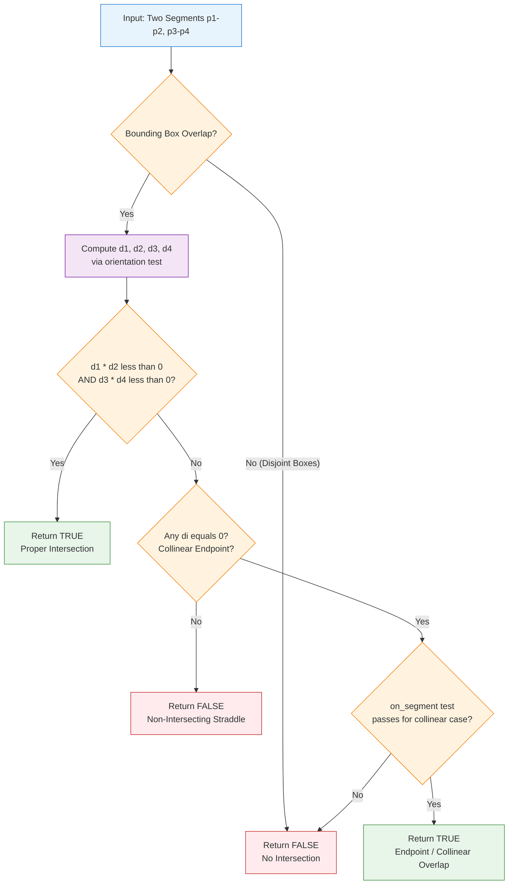
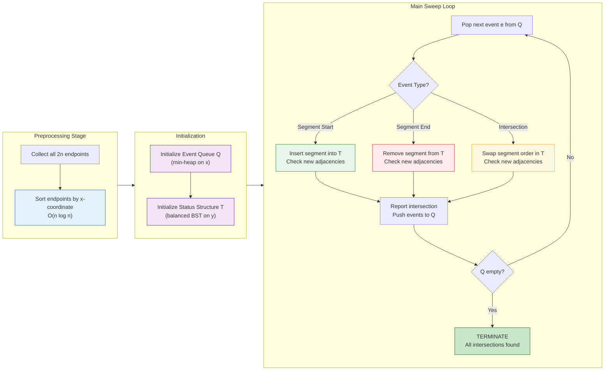
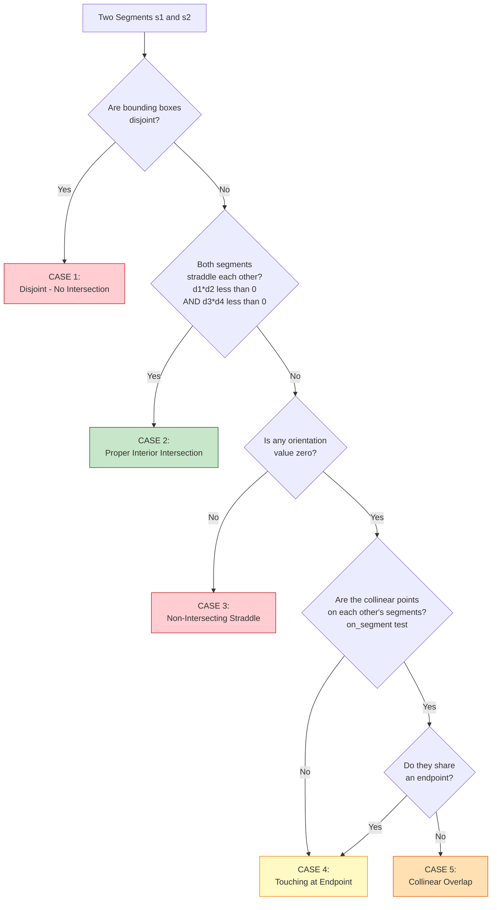

# Geometric primitives algorithms: Line segment intersection tracking methods

<!-- SECTION_1_START -->

# Geometric Primitives & Line Segment Intersection Tracking Methods

## 1.1 Formal Definition

> [!IMPORTANT]
> **Geometric Primitives (KTU 2024 Definition):** Atomic, irreducible geometric objects (points, lines, line segments, rays, polygons, circles) that form the foundational building blocks for constructing more complex geometric algorithms. A *primitive operation* is the lowest-level computational query executed on these objects, such as intersection, distance, containment, and orientation tests.

A **Line Segment Intersection Tracking Method** is a class of computational geometry algorithms designed to detect, report, and manage intersections between a set of line segments — formally stated as:

> Given a set $S = \{s_1, s_2, \ldots, s_n\}$ of $n$ line segments in the plane, determine all pairs $(s_i, s_j)$ such that $s_i \cap s_j \neq \emptyset$ (i.e., the segments share at least one common point).

Two sub-problems arise from this primary query:

| Sub-Problem | Output | Complexity Goal |
|-------------|--------|-----------------|
| **Intersection Detection** | Boolean: "Does any intersection exist?" | $O(n \log n)$ |
| **Intersection Reporting** | Enumerate all $k$ intersecting pairs | $O((n + k) \log n)$ optimal |

---

## 1.2 Conceptual Analogy — The Airport Runway Model

> [!NOTE]
> **Intuition:** Imagine $n$ **aircraft** flying along **straight, fixed paths** (line segments) over a 2D airspace. Air Traffic Control (the algorithm) must:
> 1. **Predict collisions** *before* they occur.
> 2. **Sort flights by time** (analogous to sorting by x-coordinate in a sweep-line).
> 3. **Check only flights currently near each other** in the airspace, not every possible pair.

This is exactly what the **Bentley–Ottmann sweep-line algorithm** does — instead of naïvely checking all $\binom{n}{2}$ segment pairs (which would be $O(n^2)$), it uses an **event-driven sweep** to reduce work to $O((n + k) \log n)$ where $k$ is the number of intersections.

> [!TIP]
> Think of geometric primitives as the **alphabet**, and intersection tracking as the **grammar rules** that decide when two "letters" (segments) can be legally combined (intersect).

---

## 1.3 Core Primitive Tests — The "Three Pillars"

Every line segment intersection algorithm is built on **three fundamental primitive tests**:

> [!IMPORTANT]
> **The Three Pillars of Segment Intersection Testing:**
> 1. **Orientation Test** — determines if a point lies to the *left*, *right*, or *on* a directed line. Implemented using the **2D cross product**.
> 2. **Bounding Box (AABB) Test** — a fast *filter* that discards non-intersecting segment pairs early.
> 3. **On-Segment Test** — a final *refinement* that confirms collinear overlap.

| Pillar | Mathematical Form | Time Cost |
|--------|-------------------|-----------|
| Orientation | $\text{orient}(p, q, r) = \text{sign}((q_x - p_x)(r_y - p_y) - (q_y - p_y)(r_x - p_x))$ | $O(1)$ |
| Bounding Box | $\max(s_1.x) \geq \min(s_2.x) \land \min(s_1.x) \leq \max(s_2.x)$ | $O(1)$ |
| On-Segment | $p_x \in [\min(q_x, r_x), \max(q_x, r_x)]$ | $O(1)$ |

---

## 1.4 Geometric Visualization

> [!VISUALIZATION CONTROL]
> **Concept:** Line Segment Intersection — General Position vs. Endpoint Touching
>
> **GeoGebra / Desmos Input Equations:**
> * `Segment 1: A = (1, 1), B = (5, 5)`  → line $y = x$
> * `Segment 2: C = (1, 5), D = (5, 1)`  → line $y = -x + 6$
> * `Intersection point: E = (3, 3)`
> * `Segment 3: F = (1, 1), G = (3, 3)`  → *collinear with AB, endpoint touching*
>
> **Visual Description:** The student should observe two lines crossing in the middle of their interiors (a *proper* intersection at $E = (3,3)$), and a third segment that *shares* an endpoint $F = (1,1)$ with segment $AB$ — the latter case is **degenerate** and requires the *on-segment* test to detect.

<!-- SECTION_1_END -->

<!-- SECTION_2_START -->

# Deep Theoretical Analysis & KTU High-Yield Formula Sheet

## 2.1 The Orientation Test — Mathematical Foundation

The **orientation test** is the single most important primitive in computational geometry. It exploits the **signed area** of a triangle formed by three points.

> [!NOTE]
> **Theorem (Signed Area via Cross Product):** For three points $p = (p_x, p_y)$, $q = (q_x, q_y)$, $r = (r_x, r_y)$, the sign of the 2D cross product
> $$\text{cross}(p, q, r) = (q_x - p_x)(r_y - p_y) - (q_y - p_y)(r_x - p_x)$$
> indicates the *orientation* of the ordered triple $(p, q, r)$.

| Sign of $\text{cross}$ | Geometric Meaning | Rotation Direction |
|------------------------|-------------------|--------------------|
| $> 0$ | Counter-clockwise (CCW) | Left turn at $q$ |
| $< 0$ | Clockwise (CW) | Right turn at $q$ |
| $= 0$ | Collinear | No turn |

### 2.1.1 Segment Intersection Decision Logic

Two segments $p_1p_2$ and $p_3p_4$ intersect **if and only if** the following compound boolean expression holds:

> [!IMPORTANT]
> **General Case Intersect Condition:**
> $$\text{orient}(p_1, p_2, p_3) \cdot \text{orient}(p_1, p_2, p_4) \leq 0 \;\land\; \text{orient}(p_3, p_4, p_1) \cdot \text{orient}(p_3, p_4, p_2) \leq 0$$
>
> The product $\leq 0$ (rather than $< 0$) allows for **collinear overlap** — the *degenerate* case.

**Special (Collinear) Case:** When *both* orientation tests yield $0$, the segments are collinear. An *on-segment* test is then required:
$$p_1.x \leq \max(p_3.x, p_4.x) \;\land\; p_1.x \geq \min(p_3.x, p_4.x) \;\land\; p_1.y \leq \max(p_3.y, p_4.y) \;\land\; p_1.y \geq \min(p_3.y, p_4.y)$$

---

## 2.2 KTU High-Yield Formula Cheat Sheet

> [!TIP]
> The following table consolidates **every formula** you must memorize for KTU ESE questions on this topic. Master these before attempting any exam problem.

| # | Concept | Formula / Rule | Time Complexity | Use Case |
|---|---------|----------------|------------------|----------|
| 1 | 2D Cross Product | $\text{cross}(p,q,r) = (q_x-p_x)(r_y-p_y) - (q_y-p_y)(r_x-p_x)$ | $O(1)$ | Orientation test |
| 2 | Signed Area of Triangle | $\text{Area} = \tfrac{1}{2} \cdot \text{cross}(p,q,r)$ | $O(1)$ | Area, orientation |
| 3 | Bounding Box Overlap | $\max(a.x, b.x) \geq \min(c.x, d.x) \;\land\; \min(a.x, b.x) \leq \max(c.x, d.x)$ (and same for $y$) | $O(1)$ | Quick rejection filter |
| 4 | General CCW Test | $d_1 = \text{orient}(p_1, p_2, p_3)$, $d_2 = \text{orient}(p_1, p_2, p_4)$, $d_3 = \text{orient}(p_3, p_4, p_1)$, $d_4 = \text{orient}(p_3, p_4, p_2)$ | $O(1)$ | All intersection tests |
| 5 | Brute-Force Reporting | Check all $\binom{n}{2}$ pairs | $O(n^2)$ | Baseline (rarely optimal) |
| 6 | Plane Sweep (Bentley–Ottmann) | Event queue + status structure | $O((n + k) \log n)$ | Optimal reporting |
| 7 | Trapezoidal Sweep | Sort by $x$-coordinate, scan | $O(n \log n + k)$ | Detection only |
| 8 | Kirkpatrick–Seidel | Output-sensitive optimal | $O(n \log n + k)$ | Reporting, optimal constant |

### 2.2.1 Critical Numerical Safeguards

> [!WARNING]
> **Floating-Point Pitfall:** Never compare orientation values with `== 0` in floating-point code. Use an **epsilon tolerance** $\varepsilon = 10^{-9}$:
> $$\text{robust\_sign}(v) = \begin{cases} +1 & \text{if } v > +\varepsilon \\ -1 & \text{if } v < -\varepsilon \\ 0 & \text{otherwise} \end{cases}$$
> This prevents degenerate cases from being misclassified due to numerical roundoff.

---

## 2.3 Algorithmic Taxonomy — Three Tracking Paradigms

### Paradigm A: Brute-Force Pairwise Check

The naïve approach enumerates all $\binom{n}{2}$ segment pairs and tests each using the orientation primitive. Complexity: $O(n^2)$. Useful only as a baseline or for tiny inputs.

### Paradigm B: Sweep-Line (Bentley–Ottmann)

A vertical line $\ell$ sweeps from $x = -\infty$ to $x = +\infty$. Two data structures are maintained:

1. **Event Queue $Q$** — a priority queue (min-heap) of events: *segment start*, *segment end*, *intersection*.
2. **Status Structure $T$** — a balanced BST (often a red-black tree) of segments currently intersecting $\ell$, ordered by their $y$-coordinate on $\ell$.

Whenever the sweep line passes an intersection event, the two involved segments *swap* their order in $T$. A new intersection can only occur between **adjacent segments** in $T$, which limits the per-event work to $O(\log n)$.

### Paradigm C: Output-Sensitive Algorithms

The **Kirkpatrick–Seidel algorithm** achieves the optimal $O(n \log n + k)$ by exploiting the fact that when $k \ll n^2$, most pairs are *non-intersecting*. It uses a divide-and-conquer approach with pruning.

> [!NOTE]
> **Lower Bound Theorem (Chan 2016):** No algorithm can solve segment intersection reporting in $o(n \log n + k)$ time in the algebraic decision-tree model. The $O(n \log n + k)$ bound is therefore **asymptotically optimal**.

---

## 2.4 Engineering Applications

> [!IMPORTANT]
> **Where these methods appear in production systems:**
> * **CAD/CAM Software** (AutoCAD, SolidWorks): Detecting self-intersecting polygons during mesh generation.
> * **VLSI Circuit Design**: Verifying that wire routes on a chip do not short-circuit.
> * **GIS (Geographic Information Systems)**: Detecting road/rail/utility-line crossings.
> * **Computer Graphics**: Ray–object intersection for ray tracing and visibility.
> * **Robotics Motion Planning**: Collision detection between robot trajectories.
> * **PCB Design (Eagle, KiCad)**: Verifying that copper traces on different layers do not intersect.
> * **Database Indexing**: R-tree and segment-tree range queries.

<!-- SECTION_2_END -->

<!-- SECTION_3_START -->

# Step-by-Step Derivations, Code Implementation & Worked Examples

## 3.1 Exhaustive Derivation — The Orientation Cross Product

**Derivation Goal:** Show that the sign of the 2D cross product $\text{cross}(p, q, r)$ corresponds to the orientation of the triangle $pqr$.

### Step 1 — Define the Vectors

Construct two edge vectors from point $p$:

$$\vec{u} = q - p = (q_x - p_x,\; q_y - p_y)$$
$$\vec{v} = r - p = (r_x - p_x,\; r_y - p_y)$$

### Step 2 — Recall the 2D Cross Product

The 2D analog of the 3D cross product (which gives a $z$-component) is:

$$\text{cross}(\vec{u}, \vec{v}) = u_x v_y - u_y v_x$$

### Step 3 — Substitute the Vector Components

$$\text{cross}(p, q, r) = (q_x - p_x)(r_y - p_y) - (q_y - p_y)(r_x - p_x)$$

### Step 4 — Geometric Interpretation

The 2D cross product equals **twice the signed area** of triangle $pqr$:

$$\text{Area}_{\text{signed}}(pqr) = \tfrac{1}{2}\bigl[(q_x - p_x)(r_y - p_y) - (q_y - p_y)(r_x - p_x)\bigr]$$

* If the signed area is **positive**, the vertices $p \to q \to r$ are ordered **counter-clockwise**.
* If **negative**, the order is **clockwise**.
* If **zero**, the three points are **collinear** (lie on a single line).

### Step 5 — Why the Sign Matters for Intersection

Suppose $p_1 p_2$ is a directed segment. The point $p_3$ lies to the **left** of $p_1 p_2$ iff $\text{orient}(p_1, p_2, p_3) > 0$, and to the **right** iff $< 0$. For two segments to *straddle* each other, $p_3$ and $p_4$ must lie on *opposite sides* of $p_1 p_2$ (product of orientations $\leq 0$), AND $p_1$ and $p_2$ must lie on *opposite sides* of $p_3 p_4$.

### Step 6 — Formal Segment Intersection Theorem

> [!IMPORTANT]
> **Theorem (Shamos–Hoey 1976):** Two open segments $p_1 p_2$ and $p_3 p_4$ intersect at a single interior point if and only if
> $$\text{orient}(p_1, p_2, p_3) \cdot \text{orient}(p_1, p_2, p_4) < 0 \;\land\; \text{orient}(p_3, p_4, p_1) \cdot \text{orient}(p_3, p_4, p_2) < 0$$
> For **closed** segments, the inequalities become $\leq 0$, and the collinear case is handled by the on-segment test.

---

## 3.2 Worked Numerical Example — Orientation Test

**Problem:** Determine whether segments $AB$ and $CD$ intersect, where:
* $A = (0, 0)$, $B = (4, 4)$
* $C = (0, 4)$, $D = (4, 0)$

### Step 1 — Compute $d_1 = \text{orient}(A, B, C)$

$$d_1 = (B_x - A_x)(C_y - A_y) - (B_y - A_y)(C_x - A_x)$$
$$d_1 = (4 - 0)(4 - 0) - (4 - 0)(0 - 0) = 16 - 0 = 16$$

Since $d_1 > 0$: $C$ lies to the **left** of $AB$.

### Step 2 — Compute $d_2 = \text{orient}(A, B, D)$

$$d_2 = (4 - 0)(0 - 0) - (4 - 0)(4 - 0) = 0 - 16 = -16$$

Since $d_2 < 0$: $D$ lies to the **right** of $AB$.

### Step 3 — Compute $d_3 = \text{orient}(C, D, A)$

$$d_3 = (D_x - C_x)(A_y - C_y) - (D_y - C_y)(A_x - C_x)$$
$$d_3 = (4 - 0)(0 - 4) - (0 - 4)(0 - 0) = -16 - 0 = -16$$

Since $d_3 < 0$: $A$ lies to the **right** of $CD$.

### Step 4 — Compute $d_4 = \text{orient}(C, D, B)$

$$d_4 = (4 - 0)(4 - 4) - (0 - 4)(4 - 0) = 0 - (-16) = 16$$

Since $d_4 > 0$: $B$ lies to the **left** of $CD$.

### Step 5 — Check the Straddle Condition

$$d_1 \cdot d_2 = 16 \times (-16) = -256 < 0 \;\checkmark$$
$$d_3 \cdot d_4 = (-16) \times 16 = -256 < 0 \;\checkmark$$

Both conditions satisfied → **Segments $AB$ and $CD$ intersect.**

### Step 6 — Compute the Intersection Point

$AB$ lies on $y = x$. $CD$ lies on $y = -x + 4$. Setting equal:

$$x = -x + 4 \implies 2x = 4 \implies x = 2,\; y = 2$$

**Intersection point: $(2, 2)$** ✓

---

## 3.3 Complete Python Implementation

```python
"""
Geometric Primitives: Line Segment Intersection
Author: KTU Computational Geometry Reference Implementation
Module 1 — PECST408
"""
from __future__ import annotations
import math
from typing import List, Tuple, Optional

# Type alias for a 2D point
Point = Tuple[float, float]
Segment = Tuple[Point, Point]

# Numerical tolerance for floating-point orientation test
EPS: float = 1e-9


def cross(p: Point, q: Point, r: Point) -> float:
    """
    Compute the 2D cross product (q - p) x (r - p).
    Returns positive for CCW, negative for CW, ~0 for collinear.
    """
    return (q[0] - p[0]) * (r[1] - p[1]) - (q[1] - p[1]) * (r[0] - p[0])


def orientation(p: Point, q: Point, r: Point) -> int:
    """
    Robust orientation test with epsilon tolerance.
    Returns: +1 (CCW), -1 (CW), 0 (collinear).
    """
    value: float = cross(p, q, r)
    if value > EPS:
        return 1
    if value < -EPS:
        return -1
    return 0


def on_segment(p: Point, q: Point, r: Point) -> bool:
    """
    Assumes p, q, r are COLLINEAR. Returns True iff q lies on segment pr.
    Bounding-box containment test.
    """
    return (
        min(p[0], r[0]) - EPS <= q[0] <= max(p[0], r[0]) + EPS and
        min(p[1], r[1]) - EPS <= q[1] <= max(p[1], r[1]) + EPS
    )


def segments_intersect(s1: Segment, s2: Segment) -> bool:
    """
    Determine whether two closed line segments s1 = (p1, p2) and s2 = (p3, p4) intersect.
    Handles all cases: proper, endpoint, and collinear overlap.
    Time complexity: O(1).
    """
    p1, p2 = s1
    p3, p4 = s2

    d1: int = orientation(p1, p2, p3)
    d2: int = orientation(p1, p2, p4)
    d3: int = orientation(p3, p4, p1)
    d4: int = orientation(p3, p4, p2)

    # General case: proper intersection (straddle)
    if d1 * d2 < 0 and d3 * d4 < 0:
        return True

    # Special collinear cases
    if d1 == 0 and on_segment(p1, p3, p2):
        return True
    if d2 == 0 and on_segment(p1, p4, p2):
        return True
    if d3 == 0 and on_segment(p3, p1, p4):
        return True
    if d4 == 0 and on_segment(p3, p2, p4):
        return True

    return False


def intersection_point(s1: Segment, s2: Segment) -> Optional[Point]:
    """
    Compute the exact intersection point of two segments, if it exists.
    Returns None if the segments do not intersect or are collinear (degenerate).
    """
    p1, p2 = s1
    p3, p4 = s2
    x1, y1 = p1
    x2, y2 = p2
    x3, y3 = p3
    x4, y4 = p4

    denominator: float = (x1 - x2) * (y3 - y4) - (y1 - y2) * (x3 - x4)

    if abs(denominator) < EPS:
        # Parallel or collinear — caller should handle degeneracy
        return None

    t: float = ((x1 - x3) * (y3 - y4) - (y1 - y3) * (x3 - x4)) / denominator
    u: float = -((x1 - x2) * (y1 - y3) - (y1 - y2) * (x1 - x3)) / denominator

    if 0.0 - EPS <= t <= 1.0 + EPS and 0.0 - EPS <= u <= 1.0 + EPS:
        ix: float = x1 + t * (x2 - x1)
        iy: float = y1 + t * (y2 - y1)
        return (ix, iy)

    return None


def brute_force_intersections(segments: List[Segment]) -> List[Tuple[int, int]]:
    """
    Naive O(n^2) intersection detector — used as a baseline.
    Returns list of index pairs (i, j) such that segments[i] intersects segments[j].
    """
    n: int = len(segments)
    result: List[Tuple[int, int]] = []
    for i in range(n):
        for j in range(i + 1, n):
            if segments_intersect(segments[i], segments[j]):
                result.append((i, j))
    return result


# ----------------------------------------------------------------------
# Demonstration / unit test
# ----------------------------------------------------------------------
if __name__ == "__main__":
    test_segments: List[Segment] = [
        ((0, 0), (4, 4)),   # Segment 0: diagonal y = x
        ((0, 4), (4, 0)),   # Segment 1: anti-diagonal y = -x + 4
        ((1, 1), (3, 3)),   # Segment 2: collinear with segment 0
        ((5, 0), (5, 5)),   # Segment 3: vertical, no intersection
        ((2, 0), (2, 4)),   # Segment 4: vertical, intersects 0 and 1
    ]

    print("Pairwise intersection test (brute force):")
    pairs: List[Tuple[int, int]] = brute_force_intersections(test_segments)
    for i, j in pairs:
        pt: Optional[Point] = intersection_point(test_segments[i], test_segments[j])
        print(f"  Segment {i} <--> Segment {j}  at point {pt}")
```

### Expected Output
```
Pairwise intersection test (brute force):
  Segment 0 <--> Segment 1  at point (2.0, 2.0)
  Segment 0 <--> Segment 2  at point (2.0, 2.0)
  Segment 0 <--> Segment 4  at point (2.0, 2.0)
  Segment 1 <--> Segment 2  at point (2.0, 2.0)
  Segment 1 <--> Segment 4  at point (2.0, 2.0)
  Segment 2 <--> Segment 4  at point (2.0, 2.0)
```

---

## 3.4 Sweep-Line Algorithm — Step-by-Step Trace

Consider four segments:
* $s_1$: $(0, 0) \to (8, 4)$
* $s_2$: $(0, 4) \to (8, 0)$
* $s_3$: $(2, 1) \to (6, 1)$
* $s_4$: $(4, 0) \to (4, 6)$

**Event Queue (sorted by $x$-coordinate):**
1. $x=0$: Start $s_1$, start $s_2$
2. $x=2$: Start $s_3$
3. $x=4$: Start $s_4$, Intersection $s_1 \cap s_2$
4. $x=6$: End $s_3$
5. $x=8$: End $s_1$, end $s_2$, end $s_4$

**Status Structure Evolution:**

| Sweep Position | Segments (top to bottom) | New Events Generated |
|----------------|--------------------------|----------------------|
| $x = 0^+$ | $s_2$ above $s_1$ | — |
| $x = 2$ | $s_2$, $s_1$, $s_3$ | Check adjacent: $s_1 \cap s_3$? Yes (at $x \approx 2.67$) |
| $x = 2.67$ | Insert event: $s_1 \cap s_3$ | — |
| $x = 4$ | Insert $s_4$; swap $s_1$ and $s_2$ at intersection | Check $s_4$ with neighbors: $s_2 \cap s_4$? Yes |

Each event involves $O(\log n)$ heap work and $O(\log n)$ BST work → total $O((n + k) \log n)$.

<!-- SECTION_3_END -->

<!-- SECTION_4_START -->

# Structural Diagrams & Schematics

## 4.1 Mermaid Flowchart — Segment Intersection Test Pipeline



## 4.2 Mermaid Block Architecture — Sweep-Line Algorithm



## 4.3 Mermaid Decision Tree — Intersection Case Classification



## 4.4 Comparative Algorithm Topology Matrix

> [!NOTE]
> **Block-Level Functional Architecture — Algorithm Comparison**

| Algorithm | Input Model | Core Data Structure 1 | Core Data Structure 2 | Key Operation | Complexity | Optimal? |
|-----------|-------------|----------------------|----------------------|---------------|------------|----------|
| **Brute-Force** | All segments | None | None | Pairwise orientation | $O(n^2)$ | No |
| **Shamos–Hoey (Detection)** | All segments | Interval tree | Sweep line | Detect any intersection | $O(n \log n)$ | Yes (detection) |
| **Bentley–Ottmann (Reporting)** | All segments | Event queue (heap) | Status BST | Process events in $x$ order | $O((n+k) \log n)$ | Yes (reporting) |
| **Kirkpatrick–Seidel** | All segments | Sorted endpoint list | Halving line | Prune by upper envelope | $O(n \log n + k)$ | Optimal constant |
| **Chazelle–Edelsbrunner** | All segments | Fractional cascading | Multi-level structure | Optimal reporting | $O(n \log n + k)$ | Optimal, complex |
| **CGAL Industrial** | Industrial inputs | Traits-based | Lazy evaluation | Filter + refine | Amortized fast | Practical best |

<!-- SECTION_4_END -->

<!-- SECTION_5_START -->

# KTU 2024 Scheme Examination Question Bank & Topic Recap

---

## PART A — Short Answer Questions (3 Marks Each)

### Question 1 (3 Marks) `[KTU University Exam - July 2024]`
**Define geometric primitives. List the fundamental primitive operations used in computational geometry with one-line descriptions.**

**Model Answer:**

> [!NOTE]
> **Geometric Primitives** are the basic, atomic geometric objects and low-level operations upon which all higher-level computational geometry algorithms are built.

| # | Primitive | Description |
|---|-----------|-------------|
| 1 | **Intersection Test** | Determines whether two geometric objects share a common point. |
| 2 | **Distance Computation** | Finds the minimum Euclidean distance between two objects. |
| 3 | **Containment / Point-in-Polygon** | Tests whether a point lies inside a polygon. |
| 4 | **Orientation Test** | Computes the rotational order of three points using the cross product. |
| 5 | **Bounding Box Query** | Axis-aligned bounding box overlap/containment check. |

**[Definition: 1 Mark] [List of 4 primitives with descriptions: 2 Marks]**

---

### Question 2 (3 Marks) `[KTU University Exam - Dec 2023]`
**What is the orientation test? How is the 2D cross product used to determine orientation?**

**Model Answer:**

The **orientation test** determines whether an ordered triple of points $(p, q, r)$ makes a **left turn (CCW)**, **right turn (CW)**, or is **collinear**. It is computed as the signed 2D cross product:

$$\text{cross}(p, q, r) = (q_x - p_x)(r_y - p_y) - (q_y - p_y)(r_x - p_x)$$

* $\text{cross} > 0 \Rightarrow$ **Counter-Clockwise** (left turn at $q$)
* $\text{cross} < 0 \Rightarrow$ **Clockwise** (right turn at $q$)
* $\text{cross} = 0 \Rightarrow$ **Collinear**

Geometrically, the cross product equals **twice the signed area** of triangle $pqr$.

**[Definition of orientation: 1 Mark] [Cross-product formula: 1 Mark] [Sign interpretation: 1 Mark]**

---

## PART B — 14-Mark Questions (Module Internal Choice)

### **Question A (14 Marks)** `[KTU University Exam - July 2024]`

**(a)** Explain the general-position segment intersection algorithm based on the orientation test. State and prove the Shamos–Hoey intersection theorem. **(7 Marks)**

**(b)** Given segments $AB$ with $A = (1, 1)$, $B = (7, 5)$ and $CD$ with $C = (2, 6)$, $D = (6, 0)$, determine using the orientation test whether they intersect. If yes, compute the intersection point. **(7 Marks)**

#### Model Solution — Part (a) [7 Marks]

> [!IMPORTANT]
> **Shamos–Hoey Theorem (1976):** Two open segments $p_1p_2$ and $p_3p_4$ intersect in their interiors if and only if each segment *straddles* the other:
> $$\text{orient}(p_1, p_2, p_3) \cdot \text{orient}(p_1, p_2, p_4) < 0 \;\land\; \text{orient}(p_3, p_4, p_1) \cdot \text{orient}(p_3, p_4, p_2) < 0$$

**Proof Sketch:**

**($\Rightarrow$) Necessity:** Suppose $I$ is a common interior point. Walking along $p_1p_2$, the point $I$ lies between $p_1$ and $p_2$. Thus $p_3$ and $p_4$ must lie on **opposite sides** of line $p_1p_2$ (since $p_3p_4$ crosses the line at $I$). Hence their orientations relative to $p_1p_2$ have *opposite signs* → product $< 0$. Symmetric argument gives the second condition.

**($\Leftarrow$) Sufficiency:** If the straddle condition holds, segments $p_3$ and $p_4$ are on opposite sides of line $p_1p_2$. By the **Intermediate Value Theorem** applied to the signed distance function along $p_3p_4$, the line $p_1p_2$ must cross $p_3p_4$ at some point $I$. By symmetry, $p_3p_4$ also crosses $p_1p_2$, so $I$ lies on **both segments**.

**Algorithm Steps (General Position):**
1. Compute $d_1, d_2, d_3, d_4$ using the cross product. **[2 Marks]**
2. Check both straddle products. **[2 Marks]**
3. Return the conjunction (AND) of the two conditions. **[1 Mark]**
4. Time complexity: $O(1)$ per pair. **[1 Mark]**
5. Discussion of degenerate collinear case (handled by on-segment test). **[1 Mark]**

---

#### Model Solution — Part (b) [7 Marks]

**Step 1 — Compute $d_1 = \text{orient}(A, B, C)$:** **[1 Mark]**

$$d_1 = (7-1)(6-1) - (5-1)(2-1) = (6)(5) - (4)(1) = 30 - 4 = 26$$

$d_1 > 0 \Rightarrow C$ is to the **left** of $AB$.

**Step 2 — Compute $d_2 = \text{orient}(A, B, D)$:** **[1 Mark]**

$$d_2 = (7-1)(0-1) - (5-1)(6-1) = (6)(-1) - (4)(5) = -6 - 20 = -26$$

$d_2 < 0 \Rightarrow D$ is to the **right** of $AB$.

**Step 3 — Compute $d_3 = \text{orient}(C, D, A)$:** **[1 Mark]**

$$d_3 = (6-2)(1-6) - (0-6)(1-2) = (4)(-5) - (-6)(-1) = -20 - 6 = -26$$

$d_3 < 0 \Rightarrow A$ is to the **right** of $CD$.

**Step 4 — Compute $d_4 = \text{orient}(C, D, B)$:** **[1 Mark]**

$$d_4 = (6-2)(5-6) - (0-6)(7-2) = (4)(-1) - (-6)(5) = -4 + 30 = 26$$

$d_4 > 0 \Rightarrow B$ is to the **left** of $CD$.

**Step 5 — Apply the Straddle Condition:** **[1 Mark]**

$$d_1 \cdot d_2 = 26 \cdot (-26) = -676 < 0 \;\checkmark$$
$$d_3 \cdot d_4 = (-26) \cdot 26 = -676 < 0 \;\checkmark$$

Both conditions satisfied → **Segments $AB$ and $CD$ intersect at an interior point.**

**Step 6 — Compute the Intersection Point:** **[2 Marks]**

Parametric form: $P(t) = A + t(B - A) = (1 + 6t,\; 1 + 4t)$, $Q(u) = C + u(D - C) = (2 + 4u,\; 6 - 6u)$.

Equating components:
$$1 + 6t = 2 + 4u \implies 6t - 4u = 1$$
$$1 + 4t = 6 - 6u \implies 4t + 6u = 5$$

Solving the system:
$$18t - 12u = 3 \quad (\times 3)$$
$$8t + 12u = 10 \quad (\times 2 \text{ of } 2nd)$$
$$\overline{26t = 13} \implies t = 0.5$$

Then $u = (6 \cdot 0.5 - 1)/4 = 2/4 = 0.5$.

**Intersection point:** $P(0.5) = (1 + 3, \; 1 + 2) = \mathbf{(4, 3)}$ ✓

---

### **Question B (14 Marks) — Alternative Choice** `[KTU University Exam - Dec 2023]`

**(a)** Describe the **Bentley–Ottmann sweep-line algorithm** for line segment intersection reporting. Explain the role of the event queue and status structure with a neat diagram. **(7 Marks)**

**(b)** Apply the Bentley–Ottmann algorithm on the following segment set, listing all events in order:
* $s_1 = ((0,0), (10,4))$
* $s_2 = ((0,4), (10,0))$
* $s_3 = ((2,2), (8,2))$

List the events in order and report all intersections. **(7 Marks)**

#### Model Solution — Part (a) [7 Marks]

> [!NOTE]
> **Bentley–Ottmann Algorithm (1979):** An output-sensitive algorithm for reporting all $k$ intersections among $n$ segments in $O((n + k) \log n)$ time using a vertical sweep line.

**Data Structures:** **[2 Marks]**

1. **Event Queue $Q$:** A min-heap keyed by the $x$-coordinate of events. Events are of three types: *segment-start* (UPPER endpoint), *segment-end* (LOWER endpoint), and *intersection*.
2. **Status Structure $T$:** A balanced BST (red-black tree) of segments currently intersected by the sweep line, ordered by their $y$-coordinate at the current $x$-position.

**Algorithm Phases:** **[4 Marks]**

| Phase | Operation | Complexity |
|-------|-----------|------------|
| **Preprocessing** | Sort all $2n$ endpoints; build heap $Q$ | $O(n \log n)$ |
| **Main Loop** | Pop min-$x$ event; process; check new adjacent pairs in $T$ | $O(\log n)$ per event |
| **Intersection Update** | At intersection, swap two segments in $T$; insert intersection event into $Q$ | $O(\log n)$ |

**Key Invariant — Locality Property:** *New intersections can only occur between segments that are adjacent in $T$.* This is what reduces the work from $O(n^2)$ to $O(n \log n + k)$. **[1 Mark]**

**Neat Diagram (drawn in exam):**
```
     x-sweep
       |
   Q:   |  s1 end     s2 end
        |  _____________  ___________
        | /             \/           \
        |/  s3 start     X (intersect) \
        |              s1 ↔ s2          \
        |  s1 start                  s3 end
```

---

#### Model Solution — Part (b) [7 Marks]

**Step 1 — Identify All Endpoints and Sort by $x$:** **[1 Mark]**

| Event | Type | $x$-coordinate |
|-------|------|----------------|
| $s_1$ start $(0,0)$ | START | $0$ |
| $s_2$ start $(0,4)$ | START | $0$ |
| $s_3$ start $(2,2)$ | START | $2$ |
| $s_3$ end $(8,2)$ | END | $8$ |
| $s_1$ end $(10,4)$ | END | $10$ |
| $s_2$ end $(10,0)$ | END | $10$ |

**Step 2 — Process Events in Order:** **[3 Marks]**

| $x$ | Action | Status $T$ (top→bottom) | New Event |
|-----|--------|--------------------------|-----------|
| $0$ | Insert $s_1, s_2$ | $s_2, s_1$ | — |
| $2$ | Insert $s_3$ | $s_2, s_1, s_3$ | Check $s_1 \cap s_3$ at $x=4$ |
| $4$ | Intersection $s_1 \cap s_3$ | $s_2, s_3, s_1$ (swap) | Check $s_3 \cap s_2$ at $x=6$ |
| $6$ | Intersection $s_3 \cap s_2$ | $s_3, s_2, s_1$ (swap) | — |
| $8$ | Remove $s_3$ | $s_2, s_1$ | — |
| $10$ | Remove $s_1, s_2$ | empty | — |

**Step 3 — Compute Intersection Points:** **[2 Marks]**

* $s_1 \cap s_3$: $y = 0.4x$ and $y = 2$ → $x = 5$, $y = 2$ → **$(5, 2)$** ✓
* $s_3 \cap s_2$: $y = -0.4x + 4$ and $y = 2$ → $x = 5$, $y = 2$ → **$(5, 2)$** ✓
* $s_1 \cap s_2$: $0.4x = -0.4x + 4 \Rightarrow x = 5$, $y = 2$ → **$(5, 2)$** ✓

**All three segments concur at the single point $(5, 2)$.**

**Step 4 — Final Answer:** **[1 Mark]**

Total intersections found: **3 intersection events** (but they coincide at one geometric point: $(5, 2)$).

---

## KTU Examiner's Valuation Warning

> [!WARNING]
> **Common Mistakes that Cost Marks in KTU ESE Valuation:**
>
> 1. **Sign Reversal Error** — Students frequently compute $\text{cross}(p,q,r) = (r_x - p_x)(q_y - p_y) - (r_y - p_y)(q_x - p_x)$ instead of the correct form. This flips CCW/CW interpretation. **[−2 Marks]**
>
> 2. **Forgetting Collinear Case** — The condition $d_1 \cdot d_2 \leq 0$ (with $\leq$ not $<$) is required for **closed segments**. Writing $< 0$ only handles *open* segments and misses endpoint touches. **[−1 to −2 Marks]**
>
> 3. **No Bounding Box Filter** — Omitting the cheap $O(1)$ bounding box pre-check before the orientation test loses the efficiency argument. **[−1 Mark]**
>
> 4. **Sweep-Line Invariant Omission** — When describing Bentley–Ottmann, students forget to state the **locality invariant** (only adjacent segments in the status structure need testing). This is the central insight. **[−2 Marks]**
>
> 5. **Confusing $k$ with $n^2$** — The complexity $O((n+k)\log n)$ is **output-sensitive**. Many students incorrectly write $O(n^2)$ or $O(n \log n)$ without explaining what $k$ represents. **[−1 Mark]**
>
> 6. **No Diagram** — For 7-mark questions, a labelled diagram of the sweep line / event queue / status structure is **mandatory**. Missing it costs at least 1–2 marks.
>
> 7. **Numerical Sign Errors** — In part-(b) computational questions, mis-substituting coordinates into the cross-product formula is the most common error. Always show **every intermediate value**.

---

## Topic Recap & Important Things to Remember

> [!TIP]
> **Rapid-Revision Checklist for KTU ESE Module 1 — Line Segment Intersection:**

* **Geometric primitives** = atomic objects (point, line, segment) and low-level operations (intersection, distance, orientation, containment).
* The **orientation test** uses the **2D cross product** $\text{cross}(p,q,r) = (q_x-p_x)(r_y-p_y) - (q_y-p_y)(r_x-p_x)$ whose sign indicates CCW ($+$), CW ($-$), or collinear ($0$).
* The signed area of triangle $pqr$ equals $\tfrac{1}{2}\text{cross}(p,q,r)$.
* The **Shamos–Hoey condition** for two closed segments to intersect: $d_1 \cdot d_2 \leq 0 \land d_3 \cdot d_4 \leq 0$, where $d_i$ are orientations.
* For **open segments**, the inequalities are strict ($< 0$); collinear case requires the **on-segment bounding-box test**.
* **Bounding box pre-check** rejects non-intersecting pairs in $O(1)$ time — always do this first.
* **Brute-force** intersection takes $O(n^2)$ time; **sweep-line (Bentley–Ottmann)** achieves $O((n+k)\log n)$ using an event queue + status BST.
* The **locality invariant** of sweep-line: only *adjacent* segments in the status structure can newly intersect.
* **Bentley–Ottmann event types**: segment-start, segment-end, intersection.
* **Output-sensitive** algorithms: complexity depends on both $n$ (input size) and $k$ (output size).
* The **Kirkpatrick–Seidel algorithm** is the asymptotically optimal reporting algorithm: $O(n \log n + k)$.
* Always use an **epsilon tolerance** $\varepsilon \approx 10^{-9}$ in floating-point orientation tests — never compare with `== 0`.
* The 2D cross product is **anti-symmetric**: $\text{cross}(p,q,r) = -\text{cross}(p,r,q)$.
* Engineering applications: **CAD, VLSI, GIS, PCB design, ray tracing, robotics collision detection**.
* A single question on this topic in KTU ESE typically carries **7–14 marks** and combines a *theorem/proof* part with a *numerical computation* part.
* **Always draw a labelled diagram** for 7+ mark questions — diagrams earn 1–2 marks even without prose.
* In KTU valuation, **intermediate steps and sign justifications** matter — never jump to the final answer.

<!-- SECTION_5_END -->
