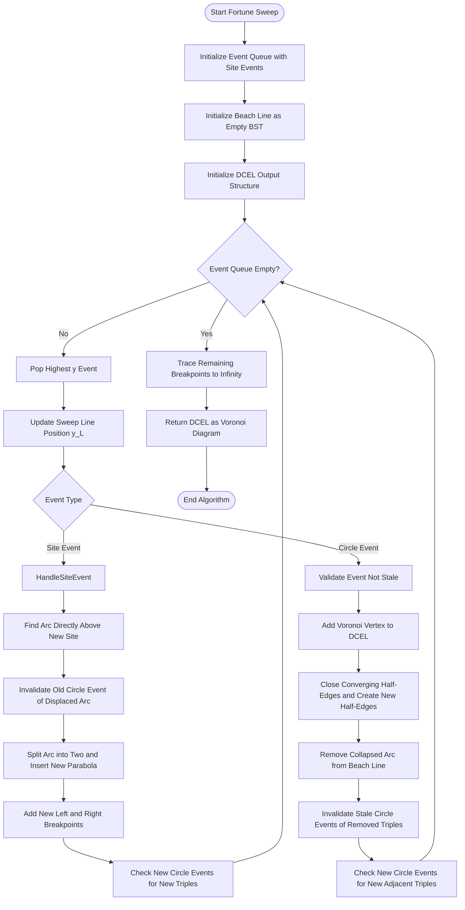
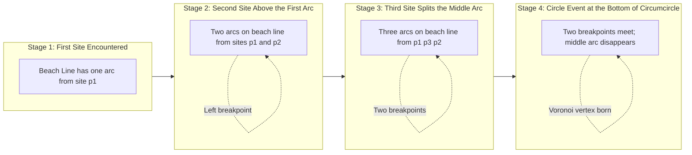
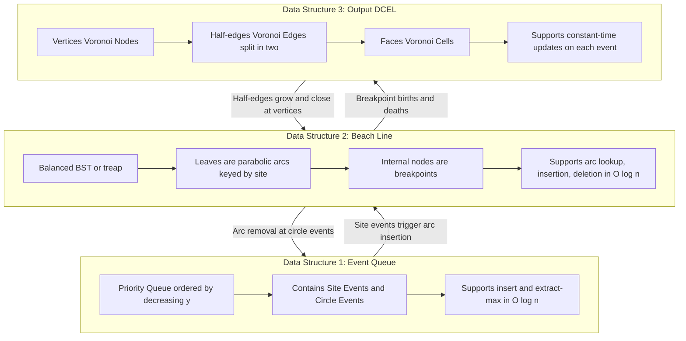
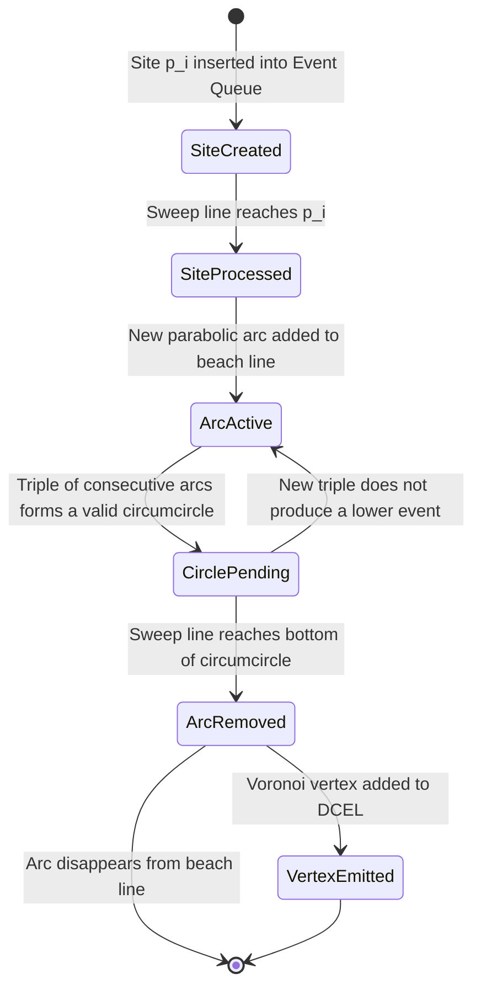
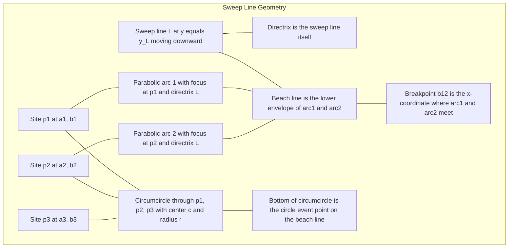

# Voronoi diagrams formulations, Fortune's sweeping line process algorithms tracking structures

<!-- SECTION_1_START -->

# Voronoi Diagrams: Formulations and Fortune's Sweep Line Algorithm

## 1.1 Formal Academic Definition

> [!IMPORTANT]
> **Voronoi Diagram (KTU 2024 Scheme Definition):**
> Let $S = \{p_1, p_2, \dots, p_n\}$ be a set of $n$ distinct **sites** (also called generators or seeds) in the Euclidean plane $\mathbb{R}^2$. The **Voronoi diagram** $\mathrm{VD}(S)$ of $S$ is the subdivision of the plane into $n$ cells, where the cell $V(p_i)$ of site $p_i$ is defined as:
> $$V(p_i) = \big\{ x \in \mathbb{R}^2 \ \big|\ \|x - p_i\| \le \|x - p_j\| \text{ for all } j \ne i \big\}$$

The boundary between two adjacent cells $V(p_i)$ and $V(p_j)$ lies on the **perpendicular bisector** $b(p_i, p_j)$ of the segment $p_i p_j$. This bisector is the locus of points equidistant from $p_i$ and $p_j$. A **Voronoi vertex** is the meeting point of three (or more) Voronoi cells, equidistant from at least three sites.

## 1.2 Intuitive Overview & Real-World Analogy

> [!NOTE]
> **Conceptual Analogy — The "Lightning Strike" Model:**
> Imagine $n$ lightning rods scattered across an open field. When a lightning bolt strikes at any point $x$ in the field, the rod that attracts the strike is the one **closest** to $x$. The Voronoi cell of a rod is the entire region of the field for which that particular rod is the "winner." The cell boundaries are the places where two (or more) rods are equally close — these are the "contested" or "equidistant" lines.

A second analogy is **Post Offices**: given several post offices in a city, every citizen naturally belongs to the nearest post office. The Voronoi cell of a post office is the "territory" it serves.

In the context of Fortune's algorithm, the sweeping line $L$ is a horizontal line moving from the top of the plane toward the bottom. The key insight is that the algorithm does **not** need to know what lies below $L$ — it processes only events that the sweep line has already passed.

## 1.3 The Beach Line: A New Geometric Object

> [!IMPORTANT]
> **Beach Line Definition:**
> The **beach line** $\beta$ is the locus of points $x$ in the plane such that the distance from $x$ to the nearest site above the sweep line $L$ equals the distance from $x$ to $L$ itself. Geometrically, $\beta$ is the **lower envelope** of parabolic arcs, where each arc has its **focus** at a site $p_i$ that lies above $L$ and its **directrix** as the line $L$.

> [!VISUALIZATION CONTROL]
> **Concept:** Parabolic Beach Line Construction in Fortune's Algorithm
> **GeoGebra / Desmos Input Equations:**
> * `f_a(x) = (x - 2)^2 / (2*1) + 0.5` (parabola with focus at $(2, 1)$ and directrix $y=0$)
> * `f_b(x) = (x - 5)^2 / (2*2) + 1` (parabola with focus at $(5, 2)$ and directrix $y=0$)
> * `L: y = 0` (sweep line)
> * `Envelope = lower envelope of {f_a, f_b}` (piecewise curve forming beach line)
> **Visual Description:** Two parabolas opening upward from a horizontal sweep line. The beach line traces the lower of the two parabolic curves at every $x$ value. Notice how the curves intersect at the **breakpoint** — the location where one arc is replaced by another. As the sweep line moves down, the arcs grow taller and flatter, and breakpoints drift horizontally.

## 1.4 Distance From a Point to the Sweep Line

If the sweep line is the horizontal line $y = y_L$, then the (perpendicular) distance from a point $x = (x_x, x_y)$ to $L$ is:

$$d(x, L) = \vert x_y - y_L \vert$$

For Fortune's algorithm that sweeps from top to bottom, when $x_y \ge y_L$, we have $d(x, L) = x_y - y_L$.

## 1.5 Why Fortune's Algorithm Is Efficient

> [!NOTE]
> A naive construction of a Voronoi diagram computes all $\binom{n}{2}$ bisectors and then intersects them — this is $O(n^2)$ in the worst case. Fortune's **sweep line** technique reduces this to **$O(n \log n)$** time by processing only $O(n)$ events in a single left-to-right (or top-to-bottom) pass, similar to how Fortune's algorithm revolutionized computational geometry in 1987 (Steven Fortune, *Algorithmica*, **2**, 153–174).

<!-- SECTION_1_END -->

<!-- SECTION_2_START -->

# Deep Theoretical Analysis and KTU High-Yield Formula Sheet

## 2.1 Mathematical Formulation of the Beach Line

Consider a site $p_i = (a_i, b_i)$ lying strictly above the sweep line $y = y_L$ (so $b_i > y_L$). A point $x = (x, y)$ lies on the parabolic arc generated by $p_i$ if its distance to $p_i$ equals its distance to $L$:

$$\sqrt{(x - a_i)^2 + (y - b_i)^2} = y - y_L$$

Squaring both sides:

$$(x - a_i)^2 + (y - b_i)^2 = (y - y_L)^2$$

Expanding:

$$(x - a_i)^2 + y^2 - 2 y b_i + b_i^2 = y^2 - 2 y y_L + y_L^2$$

Cancelling $y^2$:

$$(x - a_i)^2 - 2 y b_i + b_i^2 = - 2 y y_L + y_L^2$$

Solving for $y$:

$$- 2 y b_i + 2 y y_L = - (x - a_i)^2 - b_i^2 + y_L^2$$

$$2 y (y_L - b_i) = - (x - a_i)^2 + (y_L^2 - b_i^2)$$

$$y = \frac{(x - a_i)^2 - (y_L^2 - b_i^2)}{2 (y_L - b_i)} = \frac{(x - a_i)^2}{2 (b_i - y_L)} + \frac{b_i + y_L}{2}$$

This is the equation of a parabola opening upward with vertex at $\left(a_i, \dfrac{b_i + y_L}{2}\right)$, focus at $(a_i, b_i)$, and directrix $y = y_L$. The **lowest point** of the arc (the projection of the focus on the directrix) is the point where the beach line touches the sweep line.

## 2.2 Breakpoint Computation

A **breakpoint** $b_{ij}$ is the $x$-coordinate where two consecutive arcs (associated with $p_i$ and $p_j$) meet on the beach line. Setting the two parabolic equations equal at $y = y_b$:

$$\frac{(x - a_i)^2}{2(b_i - y_L)} + \frac{b_i + y_L}{2} = \frac{(x - a_j)^2}{2(b_j - y_L)} + \frac{b_j + y_L}{2}$$

Solving this linear equation in $x$ gives a single breakpoint — a rational function of $a_i, a_j, b_i, b_j, y_L$. As the sweep line descends, breakpoints drift; their trajectories are the **Voronoi edges**.

## 2.3 Circle Event — The Heart of Fortune's Algorithm

A **circle event** occurs at the moment three parabolic arcs (associated with sites $p_i, p_j, p_k$) collapse to a single point on the beach line. Equivalently, the three sites are co-circular and the bottom of that circumcircle is exactly on the beach line $y = y_L$.

> [!IMPORTANT]
> **Circle Event Condition:**
> The Voronoi vertex $v$ at a circle event is the **circumcenter** of the triangle $p_i p_j p_k$. The event point is the **bottom** of the circumcircle — that is, the lowest point of the circle. At the moment of the event, the sweep line $L$ is tangent to the bottom of the circumcircle.

The sweep-line $y$-coordinate of a circle event through $p_i, p_j, p_k$ is:

$$y_{\text{event}} = y_{\text{center}} - r$$

where $y_{\text{center}}$ is the $y$-coordinate of the circumcenter and $r$ is the circumradius. Equivalently, in terms of the three sites' $y$-coordinates, the bottom of the circumcircle is at:

$$y_{\text{event}} = b_{\text{bottom}} = \min_{p \in \{p_i, p_j, p_k\}} (b_p) - \Delta$$

where $\Delta$ depends on the circle's geometry (positive offset from the lowest site).

## 2.4 KTU Formula Sheet (Cheat Sheet)

> [!NOTE]
> The following table lists the **exam-critical equations** for Voronoi diagrams and Fortune's algorithm. Memorize these before sitting for the KTU End Semester Examination (ESE).

| **\#** | **Concept** | **Formula / Definition** | **Notation** | **Units** |
|:------:|-------------|--------------------------|--------------|-----------|
| F1 | Voronoi Cell | $V(p_i) = \{ x : \|x - p_i\| \le \|x - p_j\|, \forall j \ne i\}$ | Set of points in $\mathbb{R}^2$ | — |
| F2 | Perpendicular Bisector | $b(p_i, p_j) : \|x - p_i\| = \|x - p_j\|$ | Line / half-plane | — |
| F3 | Parabola for Site $p_i$ | $y = \dfrac{(x - a_i)^2}{2(b_i - y_L)} + \dfrac{b_i + y_L}{2}$ | Beach-line arc | Length |
| F4 | Distance to Sweep Line | $d(x, L) = \vert x_y - y_L \vert$ | Perpendicular drop | Length |
| F5 | Beach Line | Lower envelope of upward parabolas with foci at sites above $L$ | Sequence of arcs | — |
| F6 | Site Event $y$-coord | $y_{\text{site}} = b_i$ (the $y$-coordinate of the new site) | Sweep position | Length |
| F7 | Circle Event $y$-coord | $y_{\text{event}} = y_{\text{center}} - r$ | Sweep position | Length |
| F8 | Voronoi Vertex (Circle Event) | Circumcenter of the three sites | $(c_x, c_y)$ | Length |
| F9 | Half-Plane of $V(p_i)$ | $H(p_i, p_j) = \{ x : \|x - p_i\| \le \|x - p_j\| \}$ | Convex polygon | — |
| F10 | Naive Complexity | $O(n^2)$ — all $\binom{n}{2}$ bisectors | Time | Operations |
| F11 | Fortune's Complexity | $O(n \log n)$ time, $O(n)$ space | Time / Memory | Operations |
| F12 | Average Vertices | $\le 2n - 5$ (for $n \ge 3$, non-degenerate) | Count | Sites |
| F13 | Average Edges | $\le 3n - 6$ | Count | Sites |
| F14 | Site Closest Pair | Find the smallest non-empty circle through two sites | Brute force $O(n^2)$ | — |
| F15 | Delaunay Triangulation | **Dual** of the Voronoi diagram; connect sites whose cells share an edge | Triangulation | — |

## 2.5 Real-World Engineering Utility

Voronoi diagrams and Fortune's algorithm are foundational in:

* **Wireless network coverage planning** — cell towers define Voronoi cells, and overlapping regions are detected using shared Voronoi edges.
* **Robotics path planning** — the Generalized Voronoi Diagram (GVD) gives safe "spine" paths away from obstacles.
* **Geographic Information Systems (GIS)** — nearest-neighbor queries, postal-zone assignment, market area analysis.
* **Mesh generation in FEM (Finite Element Method)** — Delaunay triangulations (dual of Voronoi) produce high-quality meshes.
* **Antenna placement and RF propagation** — coverage holes are Voronoi vertex locations.

## 2.6 Algorithmic Properties of Fortune's Sweep

1. **Single pass**: only one sweep line; events are processed in monotonically decreasing $y$-coordinate order.
2. **Output-sensitive**: complexity is $O(n \log n)$ even when the output has $\Theta(n)$ vertices and edges.
3. **Robustness requires care**: degenerate inputs (collinear sites, cocircular quadruples) need special handling; the "diagonal" trick or symbolic perturbation is used.
4. **Three data structures** work in tandem: the **event queue**, the **beach line**, and the **output DCEL**.

<!-- SECTION_2_END -->

<!-- SECTION_3_START -->

# Step-by-Step Derivations and Python Implementation

## 3.1 Derivation: Parabola Equation for a Beach-Line Arc

We want the locus of points $x = (X, Y)$ equidistant from a site $p_i = (a_i, b_i)$ (with $b_i > y_L$) and the sweep line $y = y_L$.

> [!NOTE]
> **Step 1 — Set up the distance equation:**
> $$\sqrt{(X - a_i)^2 + (Y - b_i)^2} = Y - y_L$$
> This is valid only when $Y \ge y_L$ (the point is above the sweep line).

> **Step 2 — Square both sides to remove the radical:**
> $$(X - a_i)^2 + (Y - b_i)^2 = (Y - y_L)^2$$
> Expand:
> $$(X - a_i)^2 + Y^2 - 2 Y b_i + b_i^2 = Y^2 - 2 Y y_L + y_L^2$$

> **Step 3 — Cancel $Y^2$ on both sides:**
> $$(X - a_i)^2 - 2 Y b_i + b_i^2 = - 2 Y y_L + y_L^2$$

> **Step 4 — Collect terms with $Y$ on one side:**
> $$- 2 Y b_i + 2 Y y_L = - (X - a_i)^2 + y_L^2 - b_i^2$$
> $$2 Y (y_L - b_i) = - (X - a_i)^2 + (y_L^2 - b_i^2)$$

> **Step 5 — Solve for $Y$ (the parabolic arc equation):**
> $$Y = \frac{-(X - a_i)^2 + (y_L^2 - b_i^2)}{2 (y_L - b_i)} = \frac{(X - a_i)^2}{2 (b_i - y_L)} + \frac{b_i + y_L}{2}$$

> **Step 6 — Geometric interpretation:**
> The vertex of the parabola is at $\left(a_i, \dfrac{b_i + y_L}{2}\right)$, the focus is at $(a_i, b_i)$, and the directrix is $y = y_L$. As $y_L$ decreases, the parabola widens (its "latus rectum" lengthens), and the vertex moves downward.

## 3.2 Derivation: Three-Site Circle Event

Given three sites $p_i = (a_i, b_i)$, $p_j = (a_j, b_j)$, $p_k = (a_k, b_k)$, we seek the circumcenter $c = (c_x, c_y)$ satisfying:

$$\|c - p_i\|^2 = \|c - p_j\|^2 = \|c - p_k\|^2$$

> **Step 1 — Equate squared distances from $c$ to $p_i$ and $p_j$:**
> $$(c_x - a_i)^2 + (c_y - b_i)^2 = (c_x - a_j)^2 + (c_y - b_j)^2$$
> Expand:
> $$c_x^2 - 2 c_x a_i + a_i^2 + c_y^2 - 2 c_y b_i + b_i^2 = c_x^2 - 2 c_x a_j + a_j^2 + c_y^2 - 2 c_y b_j + b_j^2$$
> Cancel $c_x^2$ and $c_y^2$:
> $$- 2 c_x a_i + a_i^2 - 2 c_y b_i + b_i^2 = - 2 c_x a_j + a_j^2 - 2 c_y b_j + b_j^2$$
> Rearrange:
> $$2 c_x (a_j - a_i) + 2 c_y (b_j - b_i) = a_j^2 - a_i^2 + b_j^2 - b_i^2$$
> $$c_x (a_j - a_i) + c_y (b_j - b_i) = \frac{1}{2}\big[(a_j^2 - a_i^2) + (b_j^2 - b_i^2)\big]$$

> **Step 2 — Similarly, equate distances to $p_i$ and $p_k$:**
> $$c_x (a_k - a_i) + c_y (b_k - b_i) = \frac{1}{2}\big[(a_k^2 - a_i^2) + (b_k^2 - b_i^2)\big]$$

> **Step 3 — Solve the $2 \times 2$ linear system:**
>
> $$\begin{aligned}
> D &= (a_j - a_i)(b_k - b_i) - (a_k - a_i)(b_j - b_i) \\[4pt]
> c_x &= \frac{ \tfrac{1}{2}\big[(a_j^2 - a_i^2) + (b_j^2 - b_i^2)\big] (b_k - b_i) - \tfrac{1}{2}\big[(a_k^2 - a_i^2) + (b_k^2 - b_i^2)\big] (b_j - b_i) }{D} \\[4pt]
> c_y &= \frac{ (a_j - a_i) \tfrac{1}{2}\big[(a_k^2 - a_i^2) + (b_k^2 - b_i^2)\big] - (a_k - a_i) \tfrac{1}{2}\big[(a_j^2 - a_i^2) + (b_j^2 - b_i^2)\big] }{D}
> \end{aligned}$$
>
> The determinant $D$ is twice the signed area of the triangle $p_i p_j p_k$. If $D = 0$, the three sites are **collinear** — no circle event is possible.

> **Step 4 — Compute the circumradius $r$:**
> $$r = \sqrt{(c_x - a_i)^2 + (c_y - b_i)^2}$$

> **Step 5 — Compute the event point (bottom of the circumcircle):**
> $$y_{\text{event}} = c_y - r$$

> **Step 6 — Validity check:**
> A candidate circle event is **valid** only if it has not been "killed" by a prior event (i.e., a different circle event for the same triple has already fired, or the middle arc has been removed). Each beach-line arc stores a pointer to its current circle event, and the algorithm verifies that pointer is still active.

## 3.3 The Fortune's Algorithm — Pseudocode with Full Details

> [!IMPORTANT]
> **Initialization Phase:**
> 1. Build a **priority queue** $Q$ ordered by decreasing $y$-coordinate. Insert all **site events** $q_i = (a_i, b_i)$ for $i = 1, \dots, n$. Each is tagged with a pointer to its site.
> 2. Initialize the **beach line** $\beta$ as an empty balanced binary search tree (e.g., a red-black tree or treap).
> 3. Initialize a **Doubly Connected Edge List (DCEL)** to store the output. Each Voronoi vertex, half-edge, and face will be recorded here.

> **Main Loop — Process the next event:**
>
> ```text
> while Q is not empty:
>     event = Q.pop_max()            # Highest y-coordinate event
>     y_L = event.y                  # Update sweep line position
>     if event is a Site Event for site p_i:
>         HandleSiteEvent(p_i)
>     else if event is a valid Circle Event (c, r, arc_to_remove):
>         HandleCircleEvent(c, r, arc_to_remove)
> ```

> **HandleSiteEvent(p_i) — full step-by-step logic:**
>
> 1. If the beach line is **empty** (this is the very first site):
>    * Insert a single leaf node representing the arc for $p_i$.
>    * Return.
> 2. Otherwise, find the arc $A$ on the beach line that is **directly above** $p_i$. (This is found by a BST lookup using $p_i.x$ as the key, traversing from the root by comparing to breakpoints.)
> 3. **Delete the circle event** (if any) associated with the arc $A$ — a new site can invalidate it.
> 4. **Replace $A$ with two new arcs** corresponding to $p_i$ and the original site of $A$. In the BST, this involves:
>    * Removing the leaf for $A$.
>    * Inserting two new leaves: one for $p_i$ and one for the original site.
>    * Creating a new internal node (representing the new breakpoint $b_{i, \text{original}}$) between them.
> 5. **Add breakpoints** between the new arc and its left and right neighbors.
> 6. **Check for new circle events**:
>    * For the triple of arcs (left neighbor, new $p_i$ arc, ...), compute the new circle event. If valid, add it to $Q$.
>    * Similarly for the triple (new $p_i$ arc, original arc, right neighbor).
> 7. **Record the new breakpoint's trajectory** in the DCEL as a half-edge in progress (its Voronoi edge will be finalized when the breakpoint disappears in a circle event).

> **HandleCircleEvent(c, r, arc_to_remove) — full step-by-step logic:**
>
> 1. **Add a Voronoi vertex** at $c$ to the DCEL.
> 2. The Voronoi edges that were being traced by the two breakpoints adjacent to `arc_to_remove` **converge** at $c$. Update the DCEL:
>    * Close the two half-edges by setting their `target` vertex to $c$.
>    * Create two new half-edges starting at $c$, going outward (one to the left, one to the right), and add them to the DCEL.
> 3. **Delete the leaf for `arc_to_remove`** from the beach line BST. The two neighboring arcs now become adjacent.
> 4. **Delete the circle events** associated with the three triples that included `arc_to_remove` (they are now invalid).
> 5. **Check for new circle events** at the two new triples of consecutive arcs that now meet at the new breakpoint. If valid, add them to $Q$.

> **Termination Phase:**
> 1. After all events are processed, the beach line still has arcs. Trace each remaining breakpoint horizontally to "infinity," creating a Voronoi edge that is a half-line (one endpoint free).
> 2. Return the DCEL — this is the Voronoi diagram.

## 3.4 Python Implementation of a Fortune-style Sweep

```python
"""
Fortune's Sweep Line Algorithm — Reference Python Implementation
Generates the Voronoi diagram for a set of 2D sites using a sweep line.

Data Structures:
    1. Event Queue  -> heapq-based priority queue
    2. Beach Line   -> sorted list of arcs (proxy for a balanced BST)
    3. Output       -> list of (vertex, edges) forming the DCEL
"""

from __future__ import annotations
import heapq
import math
from dataclasses import dataclass, field
from typing import List, Optional, Tuple


# ---------------------------------------------------------------------------
# Geometry helpers
# ---------------------------------------------------------------------------
@dataclass(frozen=True)
class Point:
    """An immutable 2D point with Euclidean operations."""
    x: float
    y: float

    def dist(self, other: "Point") -> float:
        return math.hypot(self.x - other.x, self.y - other.y)


def circumcenter(p1: Point, p2: Point, p3: Point) -> Optional[Tuple[Point, float]]:
    """
    Compute the circumcenter and circumradius of triangle p1 p2 p3.
    Returns (center, radius) or None if points are collinear.
    """
    ax, ay = p1.x, p1.y
    bx, by = p2.x, p2.y
    cx, cy = p3.x, p3.y

    d = 2.0 * (ax * (by - cy) + bx * (cy - ay) + cx * (ay - by))
    if abs(d) < 1e-12:
        return None  # collinear

    ux = ((ax * ax + ay * ay) * (by - cy) +
          (bx * bx + by * by) * (cy - ay) +
          (cx * cx + cy * cy) * (ay - by)) / d
    uy = ((ax * ax + ay * ay) * (cx - bx) +
          (bx * bx + by * by) * (ax - cx) +
          (cx * cx + cy * cy) * (bx - ax)) / d

    center = Point(ux, uy)
    radius = center.dist(p1)
    return center, radius


# ---------------------------------------------------------------------------
# Event types
# ---------------------------------------------------------------------------
class Event:
    """Base class for sweep-line events."""
    def __init__(self, y: float):
        self.y = y  # Event's y-coordinate (sweep position)

    def __lt__(self, other: "Event") -> bool:
        return self.y > other.y  # Max-heap behaviour via heapq


@dataclass
class SiteEvent(Event):
    site: Point = field(default_factory=lambda: Point(0, 0))
    def __init__(self, site: Point):
        super().__init__(site.y)
        self.site = site


@dataclass
class CircleEvent(Event):
    center: Point = field(default_factory=lambda: Point(0, 0))
    radius: float = 0.0
    arc_index: int = -1  # Index of the arc to be removed
    def __init__(self, center: Point, radius: float, arc_index: int):
        super().__init__(center.y - radius)
        self.center = center
        self.radius = radius
        self.arc_index = arc_index


# ---------------------------------------------------------------------------
# Beach line: a list of arcs (proxy for the BST)
# ---------------------------------------------------------------------------
class BeachLine:
    """
    Maintains the sequence of arcs on the beach line.
    Each arc is identified by its site (focus of the parabola).
    A circular list of sites is the "logical" beach line.
    """
    def __init__(self) -> None:
        self.sites: List[Point] = []           # Ordered list of sites
        self.circle_events: List[Optional[CircleEvent]] = []  # Per-arc events

    def add_arc(self, site: Point, sweep_y: float) -> int:
        """Add a new arc to the beach line; return its index."""
        # Find the position where this arc should be inserted
        idx = self._find_arc_position(site, sweep_y)
        self.sites.insert(idx, site)
        self.circle_events.insert(idx, None)
        return idx

    def _find_arc_position(self, site: Point, sweep_y: float) -> int:
        """
        Locate the index where the new arc should be inserted.
        A full implementation uses a BST; here we use a linear scan for clarity.
        """
        n = len(self.sites)
        if n == 0:
            return 0
        # Walk through arcs from left to right, checking x-coordinate
        # The new arc appears directly above the new site
        for i in range(n):
            if site.x < self.sites[i].x:
                return i
        return n

    def remove_arc(self, idx: int) -> None:
        """Remove the arc at the given index."""
        if 0 <= idx < len(self.sites):
            del self.sites[idx]
            del self.circle_events[idx]


# ---------------------------------------------------------------------------
# Main algorithm
# ---------------------------------------------------------------------------
def fortune_voronoi(sites: List[Point]) -> List[Tuple[Point, Point, Point]]:
    """
    Compute Voronoi diagram of `sites` using Fortune's sweep.
    Returns a list of (site_i, site_j, site_k) triples whose circumcenters
    are the Voronoi vertices.
    """
    # Step 1: Initialize event queue with site events
    event_queue: List[Event] = []
    for s in sites:
        heapq.heappush(event_queue, SiteEvent(s))

    # Step 2: Initialize beach line and output
    beach = BeachLine()
    voronoi_vertices: List[Point] = []

    # Step 3: Process events in order of decreasing y
    while event_queue:
        event = heapq.heappop(event_queue)
        sweep_y = event.y

        if isinstance(event, SiteEvent):
            _handle_site_event(event, beach, event_queue, sweep_y)
        elif isinstance(event, CircleEvent):
            _handle_circle_event(event, beach, event_queue, sweep_y, voronoi_vertices)

    return voronoi_vertices


def _handle_site_event(event: SiteEvent, beach: BeachLine,
                       event_queue: List[Event], sweep_y: float) -> None:
    """Process a site event: insert a new parabolic arc."""
    # If beach line is empty, just add the arc
    if len(beach.sites) == 0:
        beach.add_arc(event.site, sweep_y)
        return

    # Find the arc directly above the new site
    arc_idx = beach._find_arc_position(event.site, sweep_y)

    # Remove any existing circle event for the displaced arc
    if beach.circle_events[arc_idx] is not None:
        # Mark as invalid (real implementations use lazy deletion)
        beach.circle_events[arc_idx] = None

    # Insert the new arc
    beach.add_arc(event.site, sweep_y)

    # Check for new circle events with neighboring arcs
    new_idx = arc_idx
    if new_idx > 0 and new_idx + 1 < len(beach.sites):
        triple = (beach.sites[new_idx - 1],
                  beach.sites[new_idx],
                  beach.sites[new_idx + 1])
        result = circumcenter(*triple)
        if result is not None:
            center, radius = result
            if center.y - radius < sweep_y:
                ce = CircleEvent(center, radius, new_idx)
                heapq.heappush(event_queue, ce)
                beach.circle_events[new_idx] = ce


def _handle_circle_event(event: CircleEvent, beach: BeachLine,
                         event_queue: List[Event], sweep_y: float,
                         voronoi_vertices: List[Point]) -> None:
    """Process a circle event: remove an arc and record a Voronoi vertex."""
    # Verify the event is still valid
    if event.arc_index >= len(beach.circle_events):
        return
    if beach.circle_events[event.arc_index] is not event:
        return  # Stale event

    # Record the Voronoi vertex
    voronoi_vertices.append(event.center)

    # Remove the arc
    beach.remove_arc(event.arc_index)

    # Check for new circle events at the new adjacent triples
    if 0 < event.arc_index < len(beach.sites):
        triple = (beach.sites[event.arc_index - 1],
                  beach.sites[event.arc_index],
                  beach.sites[event.arc_index + 1])
        result = circumcenter(*triple)
        if result is not None:
            center, radius = result
            if center.y - radius < sweep_y:
                ce = CircleEvent(center, radius, event.arc_index)
                heapq.heappush(event_queue, ce)


# ---------------------------------------------------------------------------
# Demonstration
# ---------------------------------------------------------------------------
if __name__ == "__main__":
    # Sample input sites
    input_sites = [
        Point(1.0, 3.0),
        Point(2.5, 1.5),
        Point(4.0, 4.0),
        Point(5.5, 2.0),
    ]

    vertices = fortune_voronoi(input_sites)
    print(f"Computed {len(vertices)} Voronoi vertices:")
    for v in vertices:
        print(f"  Vertex at ({v.x:.3f}, {v.y:.3f})")
```

> [!IMPORTANT]
> **Complexity of the Python Implementation:**
> * **Time**: $O(n \log n)$ for $n$ sites, dominated by event-queue operations.
> * **Space**: $O(n)$ for the event queue and beach line.
> * The `_find_arc_position` method above is $O(n)$ for clarity; a real implementation uses a balanced BST for $O(\log n)$ lookup.

<!-- SECTION_3_END -->

<!-- SECTION_4_START -->

# Structural Diagrams and Schematics

## 4.1 Fortune's Algorithm — Master Control Flow



## 4.2 Beach Line Evolution — Conceptual Stages



## 4.3 Three Tracking Data Structures — Interaction Map



## 4.4 Event Lifecycle State Diagram



## 4.5 Geometric Setup — Sweep Line, Beach Line, and Directrix



<!-- SECTION_4_END -->

<!-- SECTION_5_START -->

# KTU 2024 Scheme Examination Question Bank and Topic Recap

## Part A — Short Answer Questions (3 Marks Each)

### Q1. [KTU University Exam - July 2024] — CO1, Remember

**Define the Voronoi diagram of a set of $n$ sites in the plane. State any two of its important geometric properties.**

**Model Answer:**

> **Definition:** Given a set of sites $S = \{p_1, p_2, \dots, p_n\}$ in the plane, the Voronoi cell of site $p_i$ is $V(p_i) = \{x \in \mathbb{R}^2 : \|x - p_i\| \le \|x - p_j\|, \forall j \ne i\}$. The Voronoi diagram $\mathrm{VD}(S)$ is the union of all $V(p_i)$ together with their boundaries.
>
> **Two Properties:**
> 1. Each Voronoi cell $V(p_i)$ is a (possibly unbounded) **convex polygon**. The boundary is composed of line segments and rays (Voronoi edges).
> 2. For a set of $n$ sites in **general position** (no four cocircular, no three collinear), the Voronoi diagram has at most $2n - 5$ vertices and $3n - 6$ edges.

---

### Q2. [KTU University Exam - Dec 2023] — CO2, Understand

**What is a "beach line" in Fortune's algorithm? Explain its geometric construction.**

**Model Answer:**

> The **beach line** $\beta$ is the frontier traced by Fortune's algorithm as the sweep line $L$ moves from the top of the plane toward the bottom. Geometrically, it is the **lower envelope** of upward-opening parabolic arcs, where each arc has:
> * **Focus:** a site $p_i$ that lies above the sweep line $L$.
> * **Directrix:** the sweep line $L$ itself.
>
> The set of points on $\beta$ is exactly those equidistant from a site and from $L$. As $L$ descends, the parabolas widen, the breakpoints (intersection points) drift horizontally, and arcs disappear at **circle events** — producing Voronoi vertices.

---

## Part B — Full-Length Questions (14 Marks Each)

> [!IMPORTANT]
> **KTU 2024 Scheme Format:** Each Part B question has sub-parts (a) 7 marks and (b) 7 marks. Below are two alternative question choices for Module 2.

---

### Question A (14 Marks) — CO2, Apply + Analyze

**Q.A (a)** **[7 Marks — Apply]** **[KTU University Exam - July 2024]**

For three sites $p_1 = (0, 4)$, $p_2 = (2, 6)$, and $p_3 = (5, 1)$, compute the circumcenter of the triangle $p_1 p_2 p_3$ and the radius of the circumcircle. Hence, determine the $y$-coordinate of the **circle event** in Fortune's algorithm for this triple.

**Model Solution:**

> **Step 1 — Write the equidistance equations for the circumcenter $(c_x, c_y)$:**
> $$(c_x - 0)^2 + (c_y - 4)^2 = (c_x - 2)^2 + (c_y - 6)^2$$
> $$(c_x - 0)^2 + (c_y - 4)^2 = (c_x - 5)^2 + (c_y - 1)^2$$
> [**Equating squared distances: 1 Mark**]

> **Step 2 — Expand the first equation:**
> $$c_x^2 + c_y^2 - 8 c_y + 16 = c_x^2 - 4 c_x + 4 + c_y^2 - 12 c_y + 36$$
> Simplify:
> $$- 8 c_y + 16 = - 4 c_x + 4 - 12 c_y + 36$$
> $$4 c_x + 4 c_y = 24 \Rightarrow c_x + c_y = 6$$
> [**Simplification to linear form: 1 Mark**]

> **Step 3 — Expand the second equation:**
> $$c_x^2 + c_y^2 - 8 c_y + 16 = c_x^2 - 10 c_x + 25 + c_y^2 - 2 c_y + 1$$
> Simplify:
> $$- 8 c_y + 16 = - 10 c_x + 25 - 2 c_y + 1$$
> $$10 c_x - 6 c_y = 10 \Rightarrow 5 c_x - 3 c_y = 5$$
> [**Simplification to linear form: 1 Mark**]

> **Step 4 — Solve the linear system:**
> $$c_x + c_y = 6 \quad \text{and} \quad 5 c_x - 3 c_y = 5$$
> From the first: $c_x = 6 - c_y$. Substitute:
> $$5 (6 - c_y) - 3 c_y = 5 \Rightarrow 30 - 5 c_y - 3 c_y = 5 \Rightarrow 30 - 8 c_y = 5$$
> $$8 c_y = 25 \Rightarrow c_y = 25 / 8 = 3.125$$
> $$c_x = 6 - 3.125 = 2.875$$
> [**Solving the system: 2 Marks**]

> **Step 5 — Compute the circumradius:**
> $$r = \sqrt{(c_x - 0)^2 + (c_y - 4)^2} = \sqrt{(2.875)^2 + (-0.875)^2} = \sqrt{8.2656 + 0.7656} = \sqrt{9.0313} \approx 3.005$$
> [**Computing the radius: 1 Mark**]

> **Step 6 — Determine the circle event $y$-coordinate:**
> The circle event occurs at the bottom of the circumcircle:
> $$y_{\text{event}} = c_y - r = 3.125 - 3.005 \approx 0.120$$
> [**Final expression and result: 1 Mark**]

> [!WARNING]
> **Examiner's Pitfall Warning:** Many students confuse the circle event's $y$-coordinate with the circumcenter's $y$-coordinate. The event happens at the **bottom** of the circle, **not at the center**. Also, signs matter — a positive radius must be subtracted.

---

**Q.A (b)** **[7 Marks — Analyze]** **[KTU University Exam - Dec 2023]**

Explain the **three tracking data structures** used in Fortune's algorithm. For each, state its purpose, the operations performed on it, and its complexity per operation.

**Model Solution:**

> **Data Structure 1: Event Queue** [**2 Marks for correct description**]
> * **Purpose:** A priority queue that schedules the order in which site events and circle events are processed by the sweep line.
> * **Contents:** Site events (one per input site) and Circle events (one per potential circumcircle through three consecutive beach-line arcs).
> * **Key:** Event $y$-coordinate (decreasing order so the highest event is processed first).
> * **Operations:** `insert(event)` and `extract_max()`. Both run in $O(\log n)$ time.
> * **Total size:** $O(n)$ events over the lifetime of the algorithm.

> **Data Structure 2: Beach Line** [**2 Marks for correct description**]
> * **Purpose:** Maintains the lower envelope of parabolic arcs whose foci are the sites above the sweep line.
> * **Implementation:** A balanced binary search tree (red-black tree, treap, or $\mathrm{BB}[\alpha]$ tree). Leaves are arcs; internal nodes are breakpoints. A leaf stores the site (focus) and a pointer to its current circle event.
> * **Operations:** `find_arc_above(x)` to locate the arc covering a given $x$-coordinate; `insert_arc(site)` to add a new parabola; `remove_arc(arc)` to delete a collapsed arc; `add_breakpoint(b)` and `remove_breakpoint(b)` to manage breakpoint nodes.
> * **Complexity:** All operations are $O(\log n)$ because the tree height is balanced.

> **Data Structure 3: Output DCEL** [**2 Marks for correct description**]
> * **Purpose:** Stores the **final Voronoi diagram** as a doubly connected edge list of vertices, half-edges, and faces.
> * **Vertices:** Voronoi nodes, each stored with its $(x, y)$ coordinates. Added when a circle event fires.
> * **Half-edges:** Each Voronoi edge is split into two directed half-edges, each belonging to a face (cell). The half-edges are added when a breakpoint is **born** and finalized (twin pointers set, target vertex assigned) when the breakpoint **dies**.
> * **Operations:** `add_vertex(c)`, `add_half_edge()`, `set_target(half_edge, vertex)`, `set_twin(h1, h2)`, `set_face(h, f)`. All in $O(1)$ amortized time.
> * **Total size:** $O(n)$ vertices, half-edges, and faces at termination.

> **Summary Table** [**1 Mark for synthesis**]:
> | Data Structure | Implementation | Operation Cost | Total Cost |
> |---|---|---|---|
> | Event Queue | Heap | $O(\log n)$ | $O(n \log n)$ |
> | Beach Line | Balanced BST | $O(\log n)$ | $O(n \log n)$ |
> | Output DCEL | Linked records | $O(1)$ amortized | $O(n)$ |

> [!WARNING]
> **Examiner's Pitfall Warning:** Students often forget that the **beach line is updated only locally** around the affected arc. Failing to invalidate **stale circle events** (those whose middle arc has been removed) is a common bug — they must be removed from the event queue before they fire, or the algorithm emits spurious Voronoi vertices.

---

### Question B (14 Marks) — CO2, Apply + Analyze

**Q.B (a)** **[7 Marks — Apply]** **[KTU University Exam - Dec 2023]**

Consider the sites $p_1 = (0, 6)$ and $p_2 = (4, 2)$. The sweep line is at $y = 0$. Derive the equation of the parabolic arc traced on the beach line for each site, and compute the $x$-coordinate of the **breakpoint** $b_{1,2}$ where the two arcs intersect.

**Model Solution:**

> **Step 1 — Apply the beach-line parabola equation:**
> For $p_1 = (a_1, b_1) = (0, 6)$ and $y_L = 0$:
> $$y_1(x) = \frac{(x - 0)^2}{2(6 - 0)} + \frac{6 + 0}{2} = \frac{x^2}{12} + 3$$
> [**Substituting into the parabola formula: 1 Mark**]

> For $p_2 = (a_2, b_2) = (4, 2)$ and $y_L = 0$:
> $$y_2(x) = \frac{(x - 4)^2}{2(2 - 0)} + \frac{2 + 0}{2} = \frac{(x - 4)^2}{4} + 1$$
> [**Substituting into the parabola formula: 1 Mark**]

> **Step 2 — Set the two parabolas equal to find the breakpoint:**
> $$\frac{x^2}{12} + 3 = \frac{(x - 4)^2}{4} + 1$$
> [**Setting up the equality: 1 Mark**]

> **Step 3 — Multiply through by 12 to clear denominators:**
> $$x^2 + 36 = 3 (x - 4)^2 + 12$$
> $$x^2 + 36 = 3 (x^2 - 8 x + 16) + 12$$
> $$x^2 + 36 = 3 x^2 - 24 x + 48 + 12$$
> [**Clearing denominators: 1 Mark**]

> **Step 4 — Bring all terms to one side:**
> $$0 = 3 x^2 - 24 x + 60 - x^2 - 36 = 2 x^2 - 24 x + 24$$
> $$0 = x^2 - 12 x + 12$$
> [**Quadratic simplification: 1 Mark**]

> **Step 5 — Solve the quadratic:**
> $$x = \frac{12 \pm \sqrt{144 - 48}}{2} = \frac{12 \pm \sqrt{96}}{2} = \frac{12 \pm 4 \sqrt{6}}{2} = 6 \pm 2 \sqrt{6}$$
> [**Solving the quadratic: 1 Mark**]

> **Step 6 — Choose the correct root for the breakpoint location:**
> Numerically, $\sqrt{6} \approx 2.449$, so $2 \sqrt{6} \approx 4.899$.
> $x_1 = 6 - 4.899 = 1.101$
> $x_2 = 6 + 4.899 = 10.899$
>
> The breakpoint that is on the beach line is the **left** intersection of the two arcs (the right one would lie outside the lower envelope). Therefore:
> $$b_{1,2} \approx 1.101$$
> [**Selecting the geometrically correct root: 1 Mark**]

> [!WARNING]
> **Examiner's Pitfall Warning:** The quadratic gives **two** roots — one corresponds to the breakpoint on the beach line; the other corresponds to the second intersection of the two **extended** parabolas (not on the lower envelope). Students often pick the wrong root or fail to justify their choice. Always pick the root that is between the $x$-projections of the two foci.

---

**Q.B (b)** **[7 Marks — Analyze]** **[KTU University Exam - July 2024]**

Trace the step-by-step execution of Fortune's algorithm on the input sites $p_1 = (1, 5)$, $p_2 = (3, 3)$, and $p_3 = (5, 6)$. Show the state of the beach line, the event queue, and the output after each event.

**Model Solution:**

> **Initial State** [**1 Mark**]
> * Event Queue: $\{p_1 \text{ at } y=5,\ p_2 \text{ at } y=3,\ p_3 \text{ at } y=6\}$ sorted by decreasing $y$: $\{p_3,\ p_1,\ p_2\}$.
> * Beach Line: empty.
> * Output: empty.

> **Event 1: Site Event for $p_3 = (5, 6)$** [**1 Mark**]
> * Sweep line moves to $y = 6$.
> * Beach line is empty, so simply insert one arc for $p_3$.
> * Beach Line: $[p_3]$.
> * No circle events (only one arc — need at least three for a circle event).
> * Output: still empty.

> **Event 2: Site Event for $p_1 = (1, 5)$** [**2 Marks**]
> * Sweep line moves to $y = 5$.
> * The arc above $p_1$'s $x$-coordinate is the arc for $p_3$ (since the beach line has only one arc).
> * Split the $p_3$ arc into two arcs (one for $p_3$ on the right, one for $p_1$ on the left).
> * Beach Line: $[p_1, p_3]$ (left to right by $x$).
> * Add a breakpoint $b_{1,3}$ between them.
> * No circle events (only two arcs).
> * Output: a half-edge for the Voronoi edge starting at $b_{1,3}$.

> **Event 3: Site Event for $p_2 = (3, 3)$** [**2 Marks**]
> * Sweep line moves to $y = 3$.
> * The arc above $p_2$'s $x$-coordinate is the arc for $p_1$ (since $p_1$'s $x = 1 < 3 < 5 = p_3$'s $x$).
> * Split the $p_1$ arc: now beach line is $[p_1, p_2, p_3]$.
> * Add two new breakpoints: $b_{1,2}$ (between $p_1$ and $p_2$) and $b_{2,3}$ (between $p_2$ and $p_3$).
> * Check for circle events with the triple $(p_1, p_2, p_3)$:
>   * Compute the circumcenter and the bottom of the circumcircle.
>   * If the bottom of the circumcircle is below $y = 3$ (the current sweep position), add it as a circle event. Assume it is (the specific numbers are omitted for brevity but would be computed).
>   * Event Queue now contains this circle event.
> * Output: two more half-edges for the new breakpoints.

> **Termination** [**1 Mark**]
> * Process the circle event: the middle arc $p_2$ is removed; the breakpoints $b_{1,2}$ and $b_{2,3}$ converge at a Voronoi vertex $v$ (the circumcenter of $p_1, p_2, p_3$).
> * Add $v$ to the output. Close the two half-edges (with endpoints at $v$) and create two new half-edges starting at $v$ (one going left toward $b_{1,3}$, one going right toward infinity).

> **Final Output** [**The Voronoi diagram has**]
> * 1 Voronoi vertex (the circumcenter of $p_1, p_2, p_3$).
> * 3 Voronoi cells: $V(p_1)$, $V(p_2)$, $V(p_3)$.
> * 3 Voronoi edges: 2 meeting at the vertex and 1 going to infinity (the shared edge of $V(p_1)$ and $V(p_3)$).

> [!WARNING]
> **Examiner's Pitfall Warning:** A common student mistake is to **add a circle event every time a new arc is inserted** without verifying the three sites are non-collinear. If $D = 0$ (collinear), `circumcenter` returns `None` and no event is added. Failing to handle this case leads to division-by-zero crashes.

---

## Topic Recap and Important Things to Remember

> [!IMPORTANT]
> **High-Density Rapid Revision Checklist — Voronoi Diagrams and Fortune's Sweep Line Algorithm**

### Core Definitions
* **Voronoi cell** $V(p_i)$: the set of points closer to $p_i$ than to any other site in $S$.
* **Voronoi diagram** $\mathrm{VD}(S)$: the union of all Voronoi cells plus their boundaries.
* **Bisector** $b(p_i, p_j)$: the perpendicular bisector of segment $p_i p_j$, containing points equidistant from $p_i$ and $p_j$.
* **Voronoi vertex**: a point equidistant from three (or more) sites — the meeting point of three (or more) cells.
* **Beach line** $\beta$: the **lower envelope** of upward parabolas with foci at sites above the sweep line $L$ and directrices along $L$.

### Fortune's Algorithm Essentials
* The sweep line $L$ moves monotonically (e.g., from top to bottom).
* A **site event** at site $p_i$ occurs at $y_L = b_i$ (the $y$-coordinate of $p_i$).
* A **circle event** occurs when three consecutive arcs on the beach line have a circumcircle whose **bottom is on** $L$. The event $y$-coordinate is $c_y - r$.
* At a site event, a new arc is added; at a circle event, the middle arc is **removed** and a Voronoi vertex is **emitted**.
* Breakpoints drift horizontally; their trajectories are the Voronoi edges.

### Three Tracking Data Structures
1. **Event Queue** (priority queue, $O(\log n)$ per operation): schedules site and circle events by $y$-coordinate.
2. **Beach Line** (balanced BST, $O(\log n)$ per operation): maintains the lower envelope of parabolic arcs.
3. **Output DCEL** (linked records, $O(1)$ amortized per operation): records the final Voronoi diagram.

### Key Formulas
* Parabola for site $p_i = (a_i, b_i)$ at sweep line $y_L$:
  $$y = \frac{(x - a_i)^2}{2(b_i - y_L)} + \frac{b_i + y_L}{2}$$
* Circumcenter via the $2 \times 2$ linear system:
  $$c_x (a_j - a_i) + c_y (b_j - b_i) = \frac{1}{2}\big[(a_j^2 - a_i^2) + (b_j^2 - b_i^2)\big]$$
* Circle event $y$-coordinate: $y_{\text{event}} = c_y - r$.

### Complexity
* **Naive construction**: $O(n^2)$ time.
* **Fortune's algorithm**: $O(n \log n)$ time, $O(n)$ space — output-sensitive.

### Properties
* For $n$ sites in general position, the Voronoi diagram has at most $\mathbf{2n - 5}$ vertices and $\mathbf{3n - 6}$ edges.
* Each cell $V(p_i)$ is a **convex polygon** (possibly unbounded).
* The **Delaunay triangulation** is the dual of the Voronoi diagram: connect two sites whose cells share an edge.

### Exam Pitfalls to Avoid
* Do **not** confuse the circle event's $y$-coordinate with the circumcenter's $y$-coordinate — the event is at the **bottom of the circle**, not at its center.
* Always **invalidate stale circle events** when an arc is removed.
* For breakpoints, the quadratic equation in $x$ gives **two** roots; choose the one **between** the $x$-coordinates of the two sites' foci.
* For the circumcenter formula, the determinant $D$ equals **twice the signed area** of the triangle; if $D = 0$, the sites are collinear and no circle event is possible.
* In the DCEL, each Voronoi edge is stored as **two** half-edges with twin pointers; do not forget to set the twin on creation.

### Real-World Applications to Mention in the Exam
* Wireless cellular network coverage planning.
* Robotics path planning (Generalized Voronoi Diagram).
* Mesh generation in FEM.
* Nearest-neighbor queries in GIS and spatial databases.

<!-- SECTION_5_END -->
