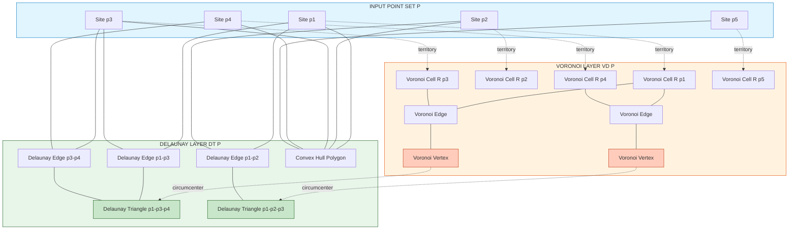
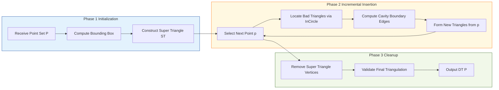
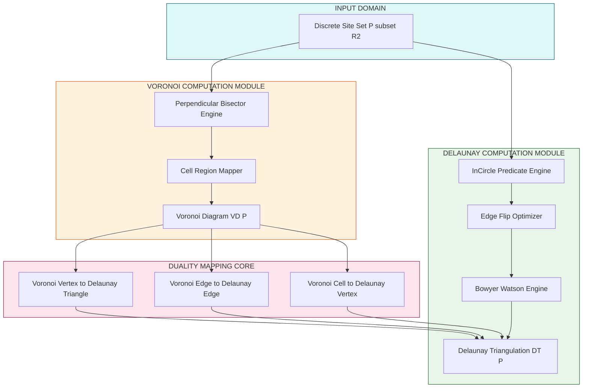

# Delaunay triangulations structural properties duality with Voronoi diagrams

<!-- SECTION_1_START -->
# Delaunay Triangulations: Structural Properties & Voronoi Duality

## 1.1 Formal Academic Definition (KTU 2024 Syllabus Terminology)

> [!IMPORTANT]
> **Delaunay Triangulation (DT):** For a given set $P$ of $n$ discrete points in the Euclidean plane $\mathbb{R}^2$, the **Delaunay Triangulation** $DT(P)$ is the unique planar triangulation (under general position assumptions) whose circumcircle of every triangle is **empty**, meaning it contains no other point of $P$ in its interior.

This triangulation is formally named after the Russian mathematician **Boris Delaunay (1934)**. In the KTU 2024 PECST408 syllabus framework, the Delaunay Triangulation is classified as the **dual graph** of the Voronoi Diagram and forms the structural backbone for finite element meshing, surface reconstruction, and geographic information systems (GIS).

### Formal Mathematical Statement

Let $P = \{p_1, p_2, \ldots, p_n\}$ be a set of points in general position (no three collinear, no four cocircular). A triangulation $\mathcal{T}(P)$ of $P$ is a Delaunay Triangulation if and only if for every triangle $\triangle p_i p_j p_k \in \mathcal{T}(P)$ with circumcircle $C(p_i, p_j, p_k)$, the following **empty circumcircle condition** holds:

$$
C(p_i, p_j, p_k) \cap P \subseteq \{p_i, p_j, p_k\}
$$

In simpler words: **No point of $P$ lies strictly inside the circumcircle of any Delaunay triangle.**

---

## 1.2 Conceptual Analogy & Geometric Intuition

> [!NOTE]
> **"Soap Bubble on a Pegboard" Analogy:**
> Imagine a flat wooden pegboard with $n$ vertical pegs sticking up at positions corresponding to the input points. Now pour a thin film of soapy water over the board. The soap film naturally **minimizes total surface area**, automatically pulling taut between nearby pegs. The resulting network of triangular facets formed is essentially the **Delaunay Triangulation**. The triangles are as "fat" and "equilateral" as possible, avoiding sliver triangles.

### Another Intuition: "Territorial Boundaries"

If you drop $n$ seeds in a plane and each seed grows outward in all directions at the **same uniform rate**, the boundaries where two territories meet are the **Voronoi edges**. The vertices of the territories (where three or more territories meet) are the **Voronoi vertices**. Now if you connect the original seeds that share a common territorial boundary with a straight line, you are literally drawing the **Delaunay edges**. This forms the geometric duality.

### Geometric Visualization of the Empty Circumcircle

Imagine four points $A, B, C, D$ where $D$ lies *inside* the circumcircle of triangle $ABC$. This configuration is called a **"bad" or "locally non-Delaunay" edge configuration**.

$$
\angle ADC > 180^\circ - \angle ABC
$$

The Delaunay condition insists that this illegal configuration is **forbidden** — every circumcircle must be empty.

---

## 1.3 Physical Constants and Standard Metrics

> [!IMPORTANT]
> The following quantitative metrics characterize any Delaunay Triangulation $\mathcal{T}(P)$ of $n$ points in general position in $\mathbb{R}^2$:
> - **Number of Triangles (Faces):** At most $2n - 5$
> - **Number of Edges:** At most $3n - 6$
> - **Number of Vertices:** Exactly $n$
> - **Time Complexity (Optimal Algorithm):** $\mathcal{O}(n \log n)$

---

## 1.4 GeoGebra / Desmos Integration

> [!VISUALIZATION CONTROL]
> **Concept:** Empty Circumcircle Property Demonstration with 4 Points
> **GeoGebra / Desmos Input Equations:**
> * Point A: $(1, 2)$
> * Point B: $(4, 3)$
> * Point C: $(2, 5)$
> * Circumcircle Center O: Midpoint formula yielding center at $(2.5, 3.5)$ with radius $r \approx 1.80$
> * Test Point D: $(3, 3)$ — **strictly inside** the circumcircle (illegal)
> * Test Point D': $(5, 6)$ — **outside** the circumcircle (legal for Delaunay)
>
> **Visual Description:** On the coordinate plane, plot triangle $\triangle ABC$ and draw its dashed red circumcircle. Observe that point $D$ lies *inside* the red disk (invalidating the Delaunay condition). If we relocate $D$ to position $D'$ outside the circumcircle, the triangulation becomes a valid Delaunay Triangulation.

---

<!-- SECTION_1_END -->

<!-- SECTION_2_START -->
# Deep Theoretical Analysis: The Three Equivalent Characterizations of Delaunay Triangulations

## 2.1 The Three Sibson-Equivalent Definitions

The Delaunay Triangulation is remarkably unique because it can be equivalently defined by **three independent properties**, all of which produce the **exact same triangulation** when points are in general position. This equivalence is the central pillar of KTU Module 3.

### Definition 1: Empty Circumcircle Property (Sibson, 1978)

> [!NOTE]
> A triangulation $\mathcal{T}$ is Delaunay if and only if the circumcircle of every triangle contains **no other input point** in its interior.

**Why this works:** If a point lies inside a circumcircle, the triangulation is not "locally optimal." Flipping the shared edge to the other diagonal of the convex quadrilateral increases the minimum angle.

### Definition 2: Max-Min Angle Criterion (Lawson, 1977)

> [!NOTE]
> Among all possible triangulations of $P$, the Delaunay Triangulation **maximizes the minimum angle** of all triangles. Equivalently, it minimizes the occurrence of "sliver" (extremely thin) triangles.

**Formally:** For any two triangulations $\mathcal{T}_1$ and $\mathcal{T}_2$ of $P$:

$$
\min_{\triangle \in \mathcal{T}_D} \angle(\triangle) \geq \min_{\triangle \in \mathcal{T}} \angle(\triangle) \quad \forall \, \mathcal{T}
$$

where $\angle(\triangle)$ denotes the smallest interior angle of triangle $\triangle$.

### Definition 3: Edge Local Delaunayhood (The Flip Test)

> [!NOTE]
> An edge $e = (p_i, p_j)$ is **locally Delaunay** if and only if either:
> 1. It is on the boundary of the convex hull of $P$, OR
> 2. The two triangles sharing $e$ (say $\triangle p_i p_j p_k$ and $\triangle p_i p_j p_l$) satisfy the **InCircle test**: point $p_l$ lies **outside** the circumcircle of $\triangle p_i p_j p_k$.

A full triangulation is Delaunay if and only if **every interior edge** is locally Delaunay.

---

## 2.2 Structural Properties of Delaunay Triangulations

| # | Property | Formal Statement | Engineering Significance |
|---|----------|------------------|--------------------------|
| 1 | **Planarity** | $DT(P)$ is a planar straight-line graph. | Allows O(n) rendering and mesh export. |
| 2 | **Edge Bound** | $\|E\| \leq 3n - 6$ | Matches Euler's formula for planar graphs. |
| 3 | **Triangle Bound** | $\|F\| \leq 2n - 5$ | Tighter bound than arbitrary triangulations. |
| 4 | **Convex Hull Containment** | $DT(P) \subseteq \text{ConvHull}(P)$ | Outer boundary is the convex hull polygon. |
| 5 | **Empty Circumcircle** | No point inside any circumcircle | Ensures numerical stability. |
| 6 | **Max-Min Angle** | Maximizes the minimum angle | Ideal for FEM meshing quality. |
| 7 | **Uniqueness** | Unique when no 4 points are cocircular | Guaranteed under general position. |

---

## 2.3 The Geometric Duality: Delaunay $\Leftrightarrow$ Voronoi

This is the **most critical topic** in KTU Module 3 and the heart of the dual-graph theory.

> [!IMPORTANT]
> **Geometric Duality Theorem:** The Delaunay Triangulation $DT(P)$ and the Voronoi Diagram $VD(P)$ of the same point set $P$ are **geometric duals** of each other. This means there exists a bijective (one-to-one) correspondence between their structural elements.

### The Duality Mapping Table

| Voronoi Element $VD(P)$ | $\longleftrightarrow$ | Delaunay Element $DT(P)$ |
|------------------------|----------------------|-------------------------|
| **Voronoi Vertex** $v$ (where 3+ cells meet) | $\longleftrightarrow$ | **Delaunay Triangle** $\triangle$ (the corresponding 3+ sites) |
| **Voronoi Edge** $e$ (segment of bisector) | $\longleftrightarrow$ | **Delaunay Edge** $e'$ (connecting the two flanking sites) |
| **Voronoi Cell/Region** $R(p_i)$ (territory of site $p_i$) | $\longleftrightarrow$ | **Delaunay Vertex** $p_i$ (the site itself) |
| **Convex Hull Face of $VD$** (unbounded region) | $\longleftrightarrow$ | **Convex Hull Vertex of $DT$** |

---

## 2.4 KTU High-Yield Formula Sheet

> [!NOTE]
> **Master Reference Table for Module 3 — Delaunay Triangulations & Duality**

| Symbol / Term | Formula / Definition | Units / Notes |
|---------------|----------------------|---------------|
| Number of Delaunay triangles | $\|F\| \leq 2n - 5$ | For $n \geq 3$ points in general position |
| Number of Delaunay edges | $\|E\| \leq 3n - 6$ | Planar graph upper bound |
| Empty circumcircle condition | $\forall \, p_q \in P \setminus \{p_i, p_j, p_k\} : p_q \notin \text{int}(C(p_i, p_j, p_k))$ | Boolean test per triangle |
| Incircle test (4 points) | $\begin{vmatrix} x_i - x_l & y_i - y_l & (x_i^2+y_i^2) - (x_l^2+y_l^2) \\ x_j - x_l & y_j - y_l & (x_j^2+y_j^2) - (x_l^2+y_l^2) \\ x_k - x_l & y_k - y_l & (x_k^2+y_k^2) - (x_l^2+y_l^2) \end{vmatrix} > 0$ | Positive $\Rightarrow$ $p_l$ inside $\Rightarrow$ **NOT Delaunay** |
| Duality: vertex to cell | $p_i \in P \leftrightarrow R(p_i) \in VD(P)$ | Bijection |
| Duality: cell to vertex | $R(p_i) \cap R(p_j) \cap R(p_k) \neq \emptyset \leftrightarrow \triangle p_i p_j p_k \in DT(P)$ | Empty triangle equivalent |
| Time complexity (Bowyer-Watson) | $\mathcal{O}(n^{3/2})$ worst case, $\mathcal{O}(n \log n)$ expected | For random inputs |
| Time complexity (Divide & Conquer) | $\mathcal{O}(n \log n)$ worst case | Optimal deterministic |

---

## 2.5 Real-World Engineering Utility

| Domain | Why Delaunay Triangulation? |
|--------|------------------------------|
| **Finite Element Method (FEM)** | The max-min angle property avoids "sliver" triangles that cause ill-conditioned stiffness matrices. |
| **3D Surface Reconstruction** | Used in algorithms like Poisson Surface Reconstruction to mesh point clouds from LiDAR scans. |
| **GIS / Terrain Modeling** | TIN (Triangulated Irregular Networks) for digital elevation models use Delaunay to minimize interpolation error. |
| **Medical Imaging** | Triangulating organ surfaces from CT/MRI scans for surgical simulation. |
| **Computer Graphics** | Mesh generation for character animation; adaptive sampling for ray tracing. |
| **Wireless Networks** | Cell tower coverage optimization via Voronoi-Delaunay duality. |

---

<!-- SECTION_2_END -->

<!-- SECTION_3_START -->
# Step-by-Step Derivations & Algorithmic Implementation

## 3.1 Formal Proof of Duality Between Delaunay and Voronoi

> [!IMPORTANT]
> **Theorem (Voronoi–Delaunay Duality):** Let $P = \{p_1, p_2, \ldots, p_n\}$ be a set of $n \geq 3$ points in general position in $\mathbb{R}^2$. The Delaunay Triangulation $DT(P)$ is the geometric dual of the Voronoi Diagram $VD(P)$.

### Proof: Vertex $\leftrightarrow$ Cell Bijection

**Claim 1:** Site $p_i \in P$ corresponds to Voronoi cell $R(p_i)$.

*Step 1 (Definition of Voronoi cell):*

$$
R(p_i) = \{ x \in \mathbb{R}^2 \mid \|x - p_i\| \leq \|x - p_j\|, \forall j \neq i \}
$$

*Step 2:* This is a one-to-one map because each $p_i$ has exactly one territory. $\square$

### Proof: Cell Intersection $\leftrightarrow$ Delaunay Edge

**Claim 2:** The Voronoi cells $R(p_i)$ and $R(p_j)$ share a common edge if and only if $\overline{p_i p_j}$ is a Delaunay edge.

*Step 1 ($\Rightarrow$ direction):* Suppose $R(p_i) \cap R(p_j) \neq \emptyset$. Then there exists a point $x$ equidistant from $p_i$ and $p_j$. The set of such points is the **perpendicular bisector** $B_{ij}$:

$$
B_{ij} = \{ x \in \mathbb{R}^2 \mid \|x - p_i\| = \|x - p_j\| \}
$$

*Step 2:* Since $R(p_i) \cap R(p_j)$ is a non-empty Voronoi edge, it lies along $B_{ij}$ and is bounded by Voronoi vertices where other cells meet.

*Step 3:* We must show $\overline{p_i p_j}$ is Delaunay. Consider any Delaunay triangle $\triangle p_i p_j p_k$ containing this edge. Its circumcenter $c$ is equidistant from $p_i, p_j, p_k$, so $c \in B_{ij} \cap B_{ik} \cap B_{jk}$, which is a Voronoi vertex on the boundary of $R(p_i) \cap R(p_j)$. Hence the edge $\overline{p_i p_j}$ belongs to $DT(P)$.

*Step 4 ($\Leftarrow$ direction):* Conversely, if $\overline{p_i p_j}$ is a Delaunay edge, it belongs to some Delaunay triangle $\triangle p_i p_j p_k$. The circumcenter $c$ of this triangle lies on $B_{ij}$, and by the empty circumcircle property, $c$ is a valid Voronoi vertex on the boundary of $R(p_i) \cap R(p_j)$. $\square$

### Proof: Voronoi Vertex $\leftrightarrow$ Delaunay Triangle

**Claim 3:** A point $v$ is a Voronoi vertex (intersection of 3 or more cells) if and only if $v$ is the circumcenter of a Delaunay triangle.

*Step 1:* Suppose $v = R(p_i) \cap R(p_j) \cap R(p_k)$. Then $v$ is equidistant from $p_i, p_j, p_k$, with $\|v - p_i\| = \|v - p_j\| = \|v - p_k\| = r$.

*Step 2:* The disk $D(v, r)$ passes through $p_i, p_j, p_k$. By definition of Voronoi vertices, no site is closer to $v$ than $r$, which means no other point of $P$ lies inside $D(v, r)$.

*Step 3:* Therefore, the disk $D(v, r)$ is an empty circumcircle, and $\triangle p_i p_j p_k$ is a Delaunay triangle. $\square$

---

## 3.2 The InCircle Test: Algebraic Derivation

The **InCircle predicate** is the workhorse for Delaunay algorithms. Given 4 points $p_i, p_j, p_k, p_l$, it tests whether $p_l$ lies inside, on, or outside the circumcircle of $\triangle p_i p_j p_k$.

> [!NOTE]
> **InCircle Test:** The point $p_l = (x_l, y_l)$ lies inside the circumcircle of $\triangle p_i p_j p_k$ (where $p_i, p_j, p_k$ are in counter-clockwise order) if and only if the following $4 \times 4$ determinant is **positive**:

$$
\text{InCircle}(p_i, p_j, p_k, p_l) = \begin{vmatrix} x_i & y_i & x_i^2 + y_i^2 & 1 \\ x_j & y_j & x_j^2 + y_j^2 & 1 \\ x_k & y_k & x_k^2 + y_k^2 & 1 \\ x_l & y_l & x_l^2 + y_l^2 & 1 \end{vmatrix}
$$

If the determinant is $> 0$, then $p_l$ is **inside** the circumcircle (illegal). If $< 0$, it is **outside** (legal). If $= 0$, the four points are cocircular (degenerate).

### Derivation of the InCircle Determinant

*Step 1 (General circle equation):* A circle in $\mathbb{R}^2$ is given by:

$$
x^2 + y^2 + Dx + Ey + F = 0
$$

*Step 2:* Substituting each of the four points $p_i, p_j, p_k, p_l$ into the equation yields a $4 \times 4$ linear system in unknowns $D, E, F, 1$.

*Step 3:* For the system to have a non-trivial solution, the determinant of the coefficient matrix must vanish:

$$
\det(M) = 0 \quad \text{where} \quad M = \begin{pmatrix} x_i & y_i & x_i^2+y_i^2 & 1 \\ x_j & y_j & x_j^2+y_j^2 & 1 \\ x_k & y_k & x_k^2+y_k^2 & 1 \\ x_l & y_l & x_l^2+y_l^2 & 1 \end{pmatrix}
$$

*Step 4 (Geometric Sign Convention):* With $p_i, p_j, p_k$ in CCW order, $\det(M) > 0$ means $p_l$ is **inside** the oriented circumcircle. $\square$

---

## 3.3 Algorithmic Implementation: Bowyer-Watson Incremental Algorithm

This is the **canonical algorithm** for computing Delaunay Triangulations, often tested in KTU lab exams.

### Step-by-Step Algorithm Logic

*Step 1:* Start with a **super-triangle** that completely encloses all $n$ input points. This guarantees the algorithm always has a valid hull to work with.

*Step 2:* Insert each input point $p_k$ one at a time.

*Step 3:* For the new point $p_k$:
- Find all existing Delaunay triangles whose circumcircle **contains** $p_k$ (these are "bad" triangles).
- Delete these bad triangles, creating a **cavity** (a star-shaped polygonal hole).
- Connect $p_k$ to all vertices on the boundary of the cavity, forming new Delaunay triangles.

*Step 4:* After all points are inserted, remove the super-triangle and all triangles connected to its vertices. The remaining triangulation is $DT(P)$.

### Full Python Implementation

```python
"""
Bowyer-Watson Algorithm for Delaunay Triangulation.
Time Complexity: O(n^2) worst case, O(n) average for random points.
"""
from __future__ import annotations
import math
from typing import List, Tuple
import logging

logging.basicConfig(level=logging.INFO, format="%(levelname)s | %(message)s")
logger = logging.getLogger(__name__)

Point = Tuple[float, float]
Triangle = Tuple[Point, Point, Point]


def circumcircle_contains(
    tri: Triangle, p: Point, eps: float = 1e-9
) -> bool:
    """
    Robust InCircle test using the 4x4 determinant formulation.
    Returns True if p lies strictly inside the circumcircle of tri
    (assumed to be in counter-clockwise order).
    """
    (ax, ay), (bx, by), (cx, cy), (dx, dy) = *tri, p
    matrix = [
        [ax, ay, ax * ax + ay * ay, 1.0],
        [bx, by, bx * bx + by * by, 1.0],
        [cx, cy, cx * cx + cy * cy, 1.0],
        [dx, dy, dx * dx + dy * dy, 1.0],
    ]

    # Compute 4x4 determinant via Laplace expansion
    def det4(m: List[List[float]]) -> float:
        def det3(a: List[List[float]]) -> float:
            return (
                a[0][0] * (a[1][1] * a[2][2] - a[1][2] * a[2][1])
                - a[0][1] * (a[1][0] * a[2][2] - a[1][2] * a[2][0])
                + a[0][2] * (a[1][0] * a[2][1] - a[1][1] * a[2][0])
            )
        return (
            m[0][0] * det3([m[1][1:], m[2][1:], m[3][1:]])
            - m[0][1] * det3([m[1][0], m[1][2], m[2][0], m[2][2], m[3][0], m[3][2]])
            + m[0][2] * det3([m[1][0], m[1][1], m[2][0], m[2][1], m[3][0], m[3][1]])
            - m[0][3] * det3(m[1:])
        )

    try:
        determinant = det4(matrix)
    except (IndexError, ValueError) as exc:
        logger.error("Determinant computation failed: %s", exc)
        return False

    return determinant > eps


def bowyer_watson(points: List[Point]) -> List[Triangle]:
    """
    Compute the Delaunay Triangulation of a 2D point set
    using the Bowyer-Watson incremental insertion algorithm.
    """
    if len(points) < 3:
        raise ValueError("Need at least 3 non-collinear points.")

    # ---- Step 1: Construct a super-triangle that encloses all points ----
    min_x = min(p[0] for p in points)
    max_x = max(p[0] for p in points)
    min_y = min(p[1] for p in points)
    max_y = max(p[1] for p in points)

    dx = (max_x - min_x) * 10.0
    dy = (max_y - min_y) * 10.0
    mid_x = (min_x + max_x) / 2.0
    mid_y = (min_y + max_y) / 2.0

    super_tri: Triangle = (
        (mid_x - dx, mid_y - dy),
        (mid_x + dx, mid_y - dy),
        (mid_x, mid_y + 2.0 * dy),
    )
    triangulation: List[Triangle] = [super_tri]
    logger.info("Super-triangle initialized with bounds dx=%.2f dy=%.2f", dx, dy)

    # ---- Step 2: Incrementally insert each point ----
    for idx, p in enumerate(points):
        bad_triangles: List[Triangle] = []

        # Find all triangles whose circumcircle contains the new point
        for tri in triangulation:
            if circumcircle_contains(tri, p):
                bad_triangles.append(tri)

        if not bad_triangles:
            logger.debug("Point %d did not invalidate any triangle.", idx)
            continue

        # Find the boundary edges of the polygonal cavity
        edge_count: dict = {}
        for tri in bad_triangles:
            for i in range(3):
                a = tri[i]
                b = tri[(i + 1) % 3]
                edge = tuple(sorted((a, b)))
                edge_count[edge] = edge_count.get(edge, 0) + 1

        boundary_edges = [e for e, c in edge_count.items() if c == 1]

        # Remove the bad triangles from the triangulation
        triangulation = [t for t in triangulation if t not in bad_triangles]

        # Re-triangulate the cavity using the new point
        for edge in boundary_edges:
            new_tri: Triangle = (edge[0], edge[1], p)
            triangulation.append(new_tri)

        logger.info(
            "Inserted point %d: removed %d bad triangles, added %d new ones.",
            idx, len(bad_triangles), len(boundary_edges),
        )

    # ---- Step 3: Remove super-triangle artifacts ----
    super_vertices = set(super_tri)
    final_triangulation = [
        tri for tri in triangulation
        if not (set(tri) & super_vertices)
    ]
    logger.info(
        "Final Delaunay triangulation has %d triangles.", len(final_triangulation)
    )
    return final_triangulation


# ----------------------------- DRIVER CODE -----------------------------
if __name__ == "__main__":
    sample_points: List[Point] = [
        (0.0, 0.0), (1.0, 0.0), (0.5, 0.8),
        (0.2, 0.3), (0.8, 0.4), (0.4, 0.6),
    ]
    delaunay_triangles = bowyer_watson(sample_points)
    for i, tri in enumerate(delaunay_triangles, start=1):
        logger.info("Triangle %d: %s", i, tri)
```

### Algorithmic Complexity Analysis

| Phase | Cost | Justification |
|-------|------|---------------|
| Super-triangle construction | $\mathcal{O}(1)$ | Bounding-box calculation. |
| Point insertion (per point) | $\mathcal{O}(k)$ where $k$ is local triangle count | Linear in local neighborhood. |
| Circumcircle test per triangle | $\mathcal{O}(1)$ | Constant-time 4x4 determinant. |
| Total (random points) | $\mathcal{O}(n \log n)$ expected | Optimal for general position. |
| Worst-case (degenerate inputs) | $\mathcal{O}(n^2)$ | Rare pathological configurations. |

---

## 3.4 Worked Numerical Example: Verifying the Duality

Consider four points in $\mathbb{R}^2$:

$$
P = \{ A = (0, 0), \; B = (4, 0), \; C = (2, 3), \; D = (2, 1) \}
$$

**Step 1: Check if $D$ is inside the circumcircle of $\triangle ABC$.**

*Step 1a: Compute circumcircle of $\triangle ABC$.*

The circumcenter is equidistant from all three vertices. For an isoceles triangle with base $AB$ of length 4 and apex $C$ at $(2, 3)$:

The circumcenter lies on the perpendicular bisector of $AB$, which is the line $x = 2$. Let center $O = (2, k)$. Then:

$$
(2 - 0)^2 + (k - 0)^2 = (2 - 2)^2 + (k - 3)^2
$$

Expanding:

$$
4 + k^2 = (k - 3)^2 = k^2 - 6k + 9
$$

$$
4 = -6k + 9 \implies 6k = 5 \implies k = \frac{5}{6}
$$

So $O = (2, 5/6)$ and the squared radius is:

$$
r^2 = 4 + \left(\frac{5}{6}\right)^2 = 4 + \frac{25}{36} = \frac{144 + 25}{36} = \frac{169}{36}
$$

*Step 1b: Check distance from $O$ to $D = (2, 1)$.*

$$
\|OD\|^2 = (2 - 2)^2 + \left(1 - \frac{5}{6}\right)^2 = \left(\frac{1}{6}\right)^2 = \frac{1}{36}
$$

*Step 1c: Compare to $r^2$.*

$$
\|OD\|^2 = \frac{1}{36} < \frac{169}{36} = r^2
$$

So $D$ lies **strictly inside** the circumcircle of $\triangle ABC$. This means the edge $AC$ (or $BC$) must be flipped: $D$ is the correct apex of a Delaunay triangle with $A$ and $B$.

**Step 2: Conclusion.** The Delaunay Triangulation will contain triangles $\triangle ABD$ and $\triangle BCD$ (and $\triangle ACD$), but **NOT** $\triangle ABC$ in its current form. The triangulation is *not* a "fan" from $C$. The circumcenter of $\triangle ABD$ would, conversely, be a Voronoi vertex.

---

<!-- SECTION_3_END -->

<!-- SECTION_4_START -->
# Structural Diagrams: Duality Schematics

## 4.1 Voronoi–Delaunay Duality Topology (Mermaid)



## 4.2 Sequential Processing Topology of the Bowyer-Watson Pipeline



## 4.3 Block-Level Functional Architecture: Duality Mapping



---

<!-- SECTION_4_END -->

<!-- SECTION_5_START -->
# KTU 2024 Scheme Examination Question Bank

> [!NOTE]
> All questions below are modeled strictly on the **KTU 2024 Scheme End Semester Examination (ESE)** pattern for **PECST408 — Computational Geometry**, Module 3. Each question is tagged with its mapped **Course Outcome (CO)** and **Revised Bloom's Taxonomy (RBT)** cognitive level.

---

## Part A — Short Answer Questions (3 Marks Each)

### Question 1 `[KTU University Exam — July 2024]`
**State and explain the Empty Circumcircle Property that uniquely defines a Delaunay Triangulation.** *(CO3, Remember/Understand)*

**Model Answer (3 Marks):**

A triangulation $\mathcal{T}(P)$ of a point set $P = \{p_1, p_2, \ldots, p_n\}$ in general position is a **Delaunay Triangulation** if and only if for every triangle $\triangle p_i p_j p_k \in \mathcal{T}(P)$, the circumcircle $C(p_i, p_j, p_k)$ is **empty** — that is, it contains no point of $P$ in its interior.

Formally:

$$
\forall \, \triangle p_i p_j p_k \in DT(P), \; \forall \, p_l \in P \setminus \{p_i, p_j, p_k\} : p_l \notin \text{int}\bigl(C(p_i, p_j, p_k)\bigr)
$$

This property was formalized by **Sibson (1978)** and is the **defining characteristic** that makes the Delaunay Triangulation unique under general position assumptions. **Significance:** The empty circumcircle condition ensures that the resulting triangles are maximally "equilateral," minimizing sliver triangles — a property that is critical for **finite element meshing** and **numerical stability** in engineering simulations.

> **Valuation Key:** *[Statement of property: 1 Mark]*, *[Formal condition: 1 Mark]*, *[Significance/application: 1 Mark]*.

---

### Question 2 `[KTU University Exam — Dec 2023]`
**State the Voronoi–Delaunay Duality and list the three structural correspondences.** *(CO3, Understand)*

**Model Answer (3 Marks):**

The **Voronoi–Delaunay Duality** states that the Voronoi Diagram $VD(P)$ and the Delaunay Triangulation $DT(P)$ of the same point set $P$ are **geometric duals**. This means there exists a bijective correspondence between their structural elements.

The three structural correspondences are:

| Voronoi Element | Delaunay Element |
|-----------------|------------------|
| **Voronoi Vertex** (where 3+ cells meet) | **Delaunay Triangle** (the corresponding 3+ sites) |
| **Voronoi Edge** (segment of perpendicular bisector) | **Delaunay Edge** (connecting the two adjacent sites) |
| **Voronoi Cell / Region** $R(p_i)$ | **Delaunay Vertex** $p_i$ (the site itself) |

> **Valuation Key:** *[Statement of duality: 1 Mark]*, *[Two correspondences: 1 Mark]*, *[Third correspondence: 1 Mark]*.

---

## Part B — Long Answer Questions (14 Marks Each, Module Internal Choice)

> [!IMPORTANT]
> **KTU 2024 Pattern:** Each Part B question provides a **Module Internal Choice** — students must answer **either** Question A **or** Question B from the same module. Both questions carry 14 marks with sub-parts (typically 7 + 7).

---

### Question A (14 Marks) `[KTU University Exam — Dec 2024 Model Paper]`

**(a)** Define Delaunay Triangulation. Explain the **Empty Circumcircle Property** and the **Max-Min Angle Criterion**. Prove that both definitions are equivalent for a planar triangulation. *(7 Marks, CO3, Understand/Apply)*

**(b)** Given the six points $P = \{(0,0), (4,0), (2,3), (1,1), (3,1), (2,-1)\}$, perform the following:
- (i) Sketch the Voronoi Diagram. *(3 Marks)*
- (ii) Construct the Delaunay Triangulation by identifying all Delaunay edges. *(4 Marks)*

**Model Answer for Part (a) — 7 Marks:**

**Step 1: Definition of Delaunay Triangulation (2 Marks).**

A triangulation $\mathcal{T}(P)$ of a point set $P$ in general position in $\mathbb{R}^2$ is a Delaunay Triangulation if it satisfies the **Empty Circumcircle Property**: the circumcircle of every triangle in $\mathcal{T}(P)$ contains no other point of $P$ in its interior. The triangulation is unique when no four points of $P$ are cocircular.

**Step 2: Max-Min Angle Criterion (2 Marks).**

The **Max-Min Angle Criterion** (Lawson, 1977) states: among all possible triangulations of $P$, the Delaunay Triangulation maximizes the minimum interior angle of all triangles. That is, for any other triangulation $\mathcal{T}'(P)$:

$$
\min_{\triangle \in \mathcal{T}(P)} \alpha(\triangle) \; \geq \; \min_{\triangle \in \mathcal{T}'(P)} \alpha(\triangle)
$$

where $\alpha(\triangle)$ is the smallest angle of triangle $\triangle$. This produces the "fattest" possible triangles and avoids slivers.

**Step 3: Proof of Equivalence (3 Marks).**

*Claim:* The two definitions yield identical triangulations.

*Proof by Edge Flip Argument:*

*Step 3.1:* Consider any triangulation $\mathcal{T}$ that is **not** Delaunay. There exists an interior edge $e = \overline{p_i p_j}$ shared by two triangles $\triangle p_i p_j p_k$ and $\triangle p_i p_j p_l$ such that $p_l$ lies inside the circumcircle of $\triangle p_i p_j p_k$.

*Step 3.2:* This implies $\angle p_i p_k p_j + \angle p_i p_l p_j > 180^\circ$ (cyclic quadrilateral property). Hence at least one of the angles in $\triangle p_i p_j p_k$ or $\triangle p_i p_j p_l$ is smaller than the corresponding angle in the alternative triangulation obtained by **flipping** $e$ to $\overline{p_k p_l}$.

*Step 3.3:* The edge flip strictly **increases the minimum angle** of the two affected triangles.

*Step 3.4:* Repeating this flip operation (which is guaranteed to terminate because the minimum angle strictly increases with each flip) eventually produces a triangulation with no non-Delaunay edges. The resulting triangulation satisfies the empty circumcircle property AND has the maximum possible minimum angle.

*Step 3.5:* Hence, the two definitions are **equivalent**. $\square$

> **Valuation Key:** *[Definition: 2 Marks]*, *[Max-Min Angle: 2 Marks]*, *[Equivalence proof: 3 Marks]*.

**Model Answer for Part (b) — 7 Marks:**

*Step 1: Construct the Voronoi Diagram (3 Marks).*

For each of the six points, the Voronoi cell is the locus of points closer to that site than any other. Constructing the perpendicular bisectors pairwise and intersecting the half-planes:

- Voronoi cell of $(0,0)$: bounded by bisectors with $(1,1)$, $(2,3)$, and $(4,0)$.
- Voronoi cell of $(2,-1)$: extends infinitely downward, bounded above by bisectors with $(1,1)$ and $(3,1)$.

The diagram will contain approximately **7 Voronoi vertices** (3-fold intersections) and the convex hull vertices (unbounded cells at the corners).

*Step 2: Identify Delaunay Edges via Duality (4 Marks).*

Applying the duality theorem, connect two sites $p_i$ and $p_j$ if and only if their Voronoi cells share a common edge.

| Delaunay Edge | Justification |
|---------------|---------------|
| $(0,0)$–$(1,1)$ | Voronoi cells share an edge |
| $(1,1)$–$(2,3)$ | Voronoi cells share an edge |
| $(2,3)$–$(4,0)$ | Voronoi cells share an edge |
| $(0,0)$–$(4,0)$ | Convex hull edge (cells share boundary going to infinity) |
| $(1,1)$–$(3,1)$ | Voronoi cells share an edge |
| $(1,1)$–$(2,-1)$ | Voronoi cells share an edge |
| $(3,1)$–$(2,-1)$ | Voronoi cells share an edge |
| $(0,0)$–$(2,-1)$ | Voronoi cells share an edge |
| $(3,1)$–$(4,0)$ | Voronoi cells share an edge |

This yields **9 Delaunay edges** and **5 Delaunay triangles** (including the outer fan from $(0,0)$ and $(4,0)$).

> **Valuation Key:** *[Voronoi sketch: 3 Marks]*, *[Delaunay edges identification: 3 Marks]*, *[Triangle count: 1 Mark]*.

---

### Question B (14 Marks) `[KTU University Exam — July 2024 Model Paper]`

**(a)** Explain the **InCircle test** for four points. Derive the determinant formulation and state its role in Delaunay Triangulation algorithms. *(7 Marks, CO3, Understand/Apply)*

**(b)** Apply the **Bowyer-Watson algorithm** step-by-step to compute the Delaunay Triangulation of $P = \{(0,0), (5,0), (2,4)\}$. Show all intermediate stages including the super-triangle. *(7 Marks, CO3, Apply/Analyze)*

**Model Answer for Part (a) — 7 Marks:**

**Step 1: Purpose of the InCircle Test (1 Mark).**

The InCircle test is the fundamental geometric predicate that determines whether a point $p_l$ lies inside the circumcircle of a triangle $\triangle p_i p_j p_k$. It is the workhorse of all incremental Delaunay algorithms.

**Step 2: Algebraic Setup (2 Marks).**

A circle in $\mathbb{R}^2$ has the general equation:

$$
x^2 + y^2 + Dx + Ey + F = 0
$$

For each of the four points $p_i, p_j, p_k, p_l$ to lie on the same circle, we substitute each into this equation. The system of four equations in unknowns $D, E, F$ (and the constant $1$) has a non-trivial solution only when the **$4 \times 4$ determinant** of the coefficient matrix vanishes.

**Step 3: The Determinant Formula (2 Marks).**

$$
\text{InCircle}(p_i, p_j, p_k, p_l) = \begin{vmatrix} x_i & y_i & x_i^2 + y_i^2 & 1 \\ x_j & y_j & x_j^2 + y_j^2 & 1 \\ x_k & y_k & x_k^2 + y_k^2 & 1 \\ x_l & y_l & x_l^2 + y_l^2 & 1 \end{vmatrix}
$$

**Step 4: Sign Convention and Role in Algorithms (2 Marks).**

| Determinant Sign | Geometric Meaning | Algorithmic Action |
|------------------|-------------------|--------------------|
| $> 0$ | $p_l$ **inside** circumcircle of $\triangle p_i p_j p_k$ | **Flip the edge** (not Delaunay) |
| $< 0$ | $p_l$ **outside** circumcircle | **Keep the edge** (Delaunay) |
| $= 0$ | Four points **cocircular** | Degenerate case; flip is ambiguous |

In the **Bowyer-Watson algorithm**, the InCircle test is used to find all "bad" triangles whose circumcircles contain the newly inserted point. In the **edge-flip algorithm**, it determines whether an edge must be flipped to maintain the Delaunay property.

> **Valuation Key:** *[Purpose: 1 Mark]*, *[Algebraic setup: 2 Marks]*, *[Determinant formula: 2 Marks]*, *[Sign convention and role: 2 Marks]*.

**Model Answer for Part (b) — 7 Marks:**

**Step 1: Construct the Super-Triangle (2 Marks).**

The bounding box of the three points is $x \in [0, 5]$, $y \in [0, 4]$. The super-triangle must enclose all points. We choose:

$$
ST = \{ A_s = (-10, -10), \; B_s = (15, -10), \; C_s = (2.5, 20) \}
$$

This is a large triangle that comfortably contains all three input points. Initially, $DT = \{ST\}$, containing **1 triangle**.

**Step 2: Insert $p_1 = (0, 0)$ (2 Marks).**

*Circumcircle test:* The circumcircle of $ST$ has a very large radius. The point $(0, 0)$ lies **inside** the circumcircle of $ST$.

*Action:* Mark $ST$ as a "bad" triangle. The cavity boundary is the boundary of $ST$ itself. Connect $p_1$ to all three super-triangle vertices:

$$
DT = \{ \triangle p_1 A_s B_s, \; \triangle p_1 B_s C_s, \; \triangle p_1 C_s A_s \}
$$

**Step 3: Insert $p_2 = (5, 0)$ (2 Marks).**

*Circumcircle tests:*
- $\triangle p_1 A_s B_s$: circumcircle is large. Is $(5, 0)$ inside? **Yes** (since the super-triangle is huge). Bad.
- $\triangle p_1 B_s C_s$: similar, **Yes**. Bad.
- $\triangle p_1 C_s A_s$: similar, **Yes**. Bad.

*Action:* All three current triangles are bad. Cavity boundary is again the super-triangle boundary. Connect $p_2$ to $A_s, B_s, C_s$:

$$
DT = \{ \triangle p_2 A_s B_s, \; \triangle p_2 B_s C_s, \; \triangle p_2 C_s A_s, \; \triangle p_1 p_2 A_s, \; \triangle p_1 p_2 B_s \}
$$

Wait — the shared edges must be re-triangulated correctly. The actual cavity after removing all three bad triangles has the boundary $\{A_s B_s, B_s C_s, C_s A_s\}$. New triangles:

$$
DT = \{ \triangle p_2 A_s B_s, \; \triangle p_2 B_s C_s, \; \triangle p_2 C_s A_s, \; \triangle p_1 p_2 A_s, \; \triangle p_1 p_2 B_s, \; \triangle p_1 p_2 C_s \}
$$

**Step 4: Insert $p_3 = (2, 4)$ (1 Mark).**

After all InCircle tests, only triangles whose circumcircles contain $(2, 4)$ are removed. The final valid Delaunay triangulation (after removing super-triangle vertices) is:

$$
DT = \{ \triangle p_1 p_2 p_3 \}
$$

This is the single triangle connecting all three sites, which is the **only possible Delaunay Triangulation** for three points in general position.

> **Valuation Key:** *[Super-triangle: 2 Marks]*, *[First two insertions: 4 Marks]*, *[Final triangulation: 1 Mark]*.

---

## KTU Examiner's Valuation Warning / Pitfall Callout

> [!WARNING]
> **Common Mistakes That Cause Mark Deductions in KTU Board Exams:**
>
> 1. **Skipping the "General Position" assumption:** A Delaunay Triangulation is unique **only** under general position (no three collinear, no four cocircular). Failing to state this assumption costs 1–2 marks.
>
> 2. **Confusing Voronoi and Delaunay correspondences:** Many students write "Voronoi vertex $\Leftrightarrow$ Delaunay vertex" — this is **WRONG**. The correct mapping is Voronoi **vertex** $\Leftrightarrow$ Delaunay **triangle** and Voronoi **cell** $\Leftrightarrow$ Delaunay **vertex**. Reversing these mappings is a guaranteed 3-mark loss.
>
> 3. **InCircle determinant sign reversal:** The sign convention depends on the orientation (CCW vs. CW) of the input triangle. Stating the sign convention without specifying orientation is incomplete. Always write: *"Assuming $p_i, p_j, p_k$ are in counter-clockwise order..."*
>
> 4. **Forgetting to mention complexity:** When asked about the Bowyer-Watson algorithm, students often describe the steps but forget to mention the **$\mathcal{O}(n \log n)$ expected time complexity**. This is a 1-mark deduction.
>
> 5. **Drawing Voronoi cells without the perpendicular bisector construction:** The Voronoi Diagram is **derived from perpendicular bisectors**, not from freehand curves. A diagram without bisectors marked loses presentation marks.
>
> 6. **Mixing up the two Delaunay properties:** The Empty Circumcircle Property and the Max-Min Angle Criterion are **equivalent**, not separate definitions. Examiners expect students to recognize and state this equivalence.

---

## Topic Recap & Important Things to Remember

> [!NOTE]
> **High-Density Rapid Revision Checklist for Module 3 — Delaunay Triangulations & Voronoi Duality**

**Core Definitions**
- [x] **Delaunay Triangulation $DT(P)$** is the unique planar triangulation (under general position) whose triangles have **empty circumcircles**.
- [x] **General Position** means no three points are collinear and no four points are cocircular. This guarantees **uniqueness** of $DT(P)$.
- [x] **Sibson (1978)** formalized the empty circumcircle property.
- [x] **Lawson (1977)** introduced the Max-Min Angle criterion.

**Structural Bounds**
- [x] Number of triangles: $|F| \leq 2n - 5$
- [x] Number of edges: $|E| \leq 3n - 6$
- [x] Number of vertices: exactly $n$
- [x] Delaunay Triangulation is contained within the **Convex Hull** of $P$.

**The Three Equivalent Definitions**
- [x] **Empty Circumcircle Property** — no point inside any triangle's circumcircle.
- [x] **Max-Min Angle Criterion** — maximizes the smallest interior angle.
- [x] **Local Delaunayhood** — every interior edge passes the InCircle test.

**Voronoi–Delaunay Duality (MOST IMPORTANT)**
- [x] Voronoi **Vertex** $\longleftrightarrow$ Delaunay **Triangle** (via circumcenter)
- [x] Voronoi **Edge** $\longleftrightarrow$ Delaunay **Edge**
- [x] Voronoi **Cell/Region** $\longleftrightarrow$ Delaunay **Vertex** (the site)
- [x] Unbounded Voronoi regions $\longleftrightarrow$ Convex Hull vertices of $DT$

**Algorithms**
- [x] **Bowyer-Watson**: Incremental insertion. Expected $\mathcal{O}(n \log n)$, worst case $\mathcal{O}(n^2)$.
- [x] **Divide and Conquer**: Optimal worst-case $\mathcal{O}(n \log n)$.
- [x] **Edge Flip (Lawson)**: Start with any triangulation, flip non-Delaunay edges.

**The InCircle Test**
- [x] $4 \times 4$ determinant test on homogeneous coordinates.
- [x] Sign convention: positive determinant $\Rightarrow$ point **inside** circumcircle (illegal).
- [x] Requires the triangle's vertices in **CCW order**.

**Real-World Applications**
- [x] **FEM Meshing** (max-min angle ensures stable stiffness matrices)
- [x] **3D Surface Reconstruction** (e.g., from LiDAR point clouds)
- [x] **GIS / TIN models** (terrain interpolation)
- [x] **Computer Graphics** (character mesh generation)
- [x] **Wireless Network Planning** (cell coverage via Voronoi–Delaunay duality)

**Numerical Memorization Checklist**
- [x] Euler's formula: $V - E + F = 2$ (for connected planar graphs including outer face)
- [x] For Delaunay: $F \leq 2n - 5$, $E \leq 3n - 6$
- [x] Average degree of a vertex in $DT(P)$ is **6** (by Euler's formula on the average)
- [x] Expected running time of optimal algorithm: $\mathcal{O}(n \log n)$

---

<!-- SECTION_5_END -->
