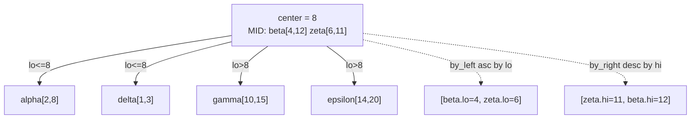
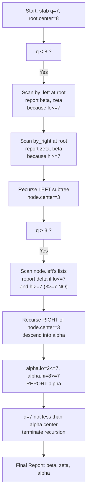
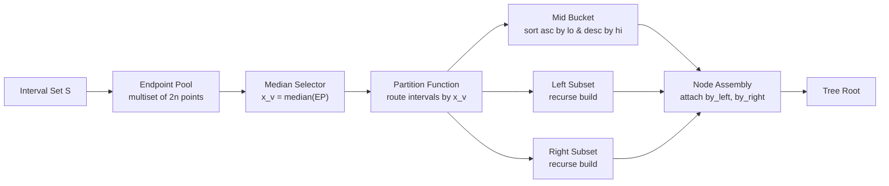
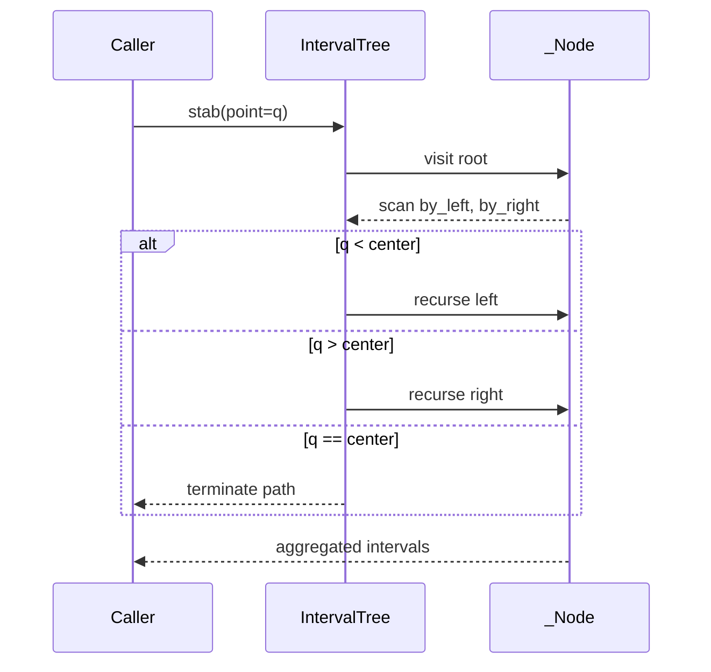

# Interval trees segment parsing computational paths algorithms tracking throughput

<!-- SECTION_1_START -->
# Interval Trees — Segment Parsing Through Algorithmic Pathways

> [!IMPORTANT]
> **KTU 2024 Scheme | PECST408 Computational Geometry | Module 3 Focus**
> This note treats **Interval Trees** as the primary mechanism for **interval stabbing queries** and **overlap reporting**, a foundational companion to Delaunay-based range searching.

## 1.1 Formal Definition (KTU Syllabus Terminology)

An **Interval Tree** is an ordered, binary-tree-based dynamic data structure that stores a static set $S$ of $n$ closed intervals on the real line $\mathbb{R}$. For any query point $q \in \mathbb{R}$ (a *stabbing query*) or any query interval $Q = [q_1, q_2]$, the tree reports **all intervals in $S$ that overlap with the query** in optimal output-sensitive time.

> [!NOTE]
> **Structural Invariant (KTU Board Definition):**
> Every node $v$ of an interval tree is associated with a **split point** $x_v$ (also called the *median* or *center*). Each interval $I \in S$ is routed to **exactly one** of the three regions defined by $v$:
> 1. $I_{left}(v)$ — intervals lying **entirely to the left** of $x_v$, stored recursively in the left subtree.
> 2. $I_{right}(v)$ — intervals lying **entirely to the right** of $x_v$, stored recursively in the right subtree.
> 3. $I_{mid}(v)$ — intervals that **straddle** $x_v$ (i.e., $I_{left} \le x_v \le I_{right}$), stored at node $v$ in two sorted auxiliary lists.

The auxiliary lists at node $v$ are:
- $L(v)$ — sorted by **left endpoint** in *ascending* order.
- $R(v)$ — sorted by **right endpoint** in *descending* order.

## 1.2 Intuitive Overview — The Library Shelf Analogy

Imagine a long library shelf holding thousands of books, where each book represents an **interval** $[a, b]$ (say, the date range of a historical event). A reader walks in and asks: *"Which events were active during the year 1492?"*

A naive scan would require opening every book (linear cost). An **interval tree** organizes the shelf like this:

- The **center spine** of the shelf (the median year) divides the collection: books ending before the spine go left, books starting after the spine go right.
- A small **"spanning box"** is placed at the spine holding every book that crosses the spine year — these are the "border-straddlers." Within the box, books are sorted twice: once by start year (left→right), once by end year (right→left).
- A query for 1492 first asks the spine: *"Does 1492 fall within my spanning box?"* If not, the algorithm recurses into only the relevant half-shelf.

> [!TIP]
> **GeoGebra / Desmos Visualization:**
> *Concept:* Interval tree node decomposition on the number line.
> *Input:* $I_1 = [2, 8]$, $I_2 = [4, 12]$, $I_3 = [10, 15]$, $I_4 = [1, 3]$, $I_5 = [14, 20]$, $I_6 = [6, 11]$.
> *Observation:* After choosing median split $x_v = 8$, intervals $I_2, I_6$ straddle $x_v$ and enter $I_{mid}(v)$; $I_1, I_4$ go left; $I_3, I_5$ go right.

## 1.3 Why Interval Trees Matter in Computational Geometry

Interval trees are the canonical 1-D backbone for:
- **Windowing queries** in GIS (overlapping road segments, time-window GPS pings).
- **Collision detection** among moving rigid bodies along a temporal axis.
- **CGAL** and **LEDA** library implementations for geometric input parsing.
- **CAD/CAM segment parsing** for tracking machining tool throughput windows.

> [!IMPORTANT]
> **Standard Metric (KTU Board Standard):** Construction cost is $O(n \log n)$ for sorted input and $O(n \log^2 n)$ in the general (unsorted) case. Point query cost is $O(\log n + k)$ where $k$ is the number of reported intervals — this is **output-sensitive** and provably optimal.

<!-- SECTION_1_END -->

<!-- SECTION_2_START -->
# Deep Theoretical Analysis & High-Yield Formula Sheet

## 2.1 Operational Logic — Step-by-Step Construction

The construction of an interval tree proceeds top-down on a chosen set of interval endpoints:

1. **Endpoint Pool Formation:** Collect all $2n$ endpoints $\bigcup_{I \in S} \{I_{left}, I_{right}\}$ into a multiset $\mathcal{E}$.
2. **Median Selection:** Compute the median $x_v$ of $\mathcal{E}$ in $O(n)$ time using the linear-time **median-of-medians** algorithm (or $O(n \log n)$ via sorting).
3. **Partitioning:** For each interval $I = [l, r]$:
   - If $r < x_v$ → recurse into the left subtree.
   - If $l > x_v$ → recurse into the right subtree.
   - Otherwise (i.e., $l \le x_v \le r$) → store at node $v$ in both $L(v)$ and $R(v)$.
4. **Auxiliary Sorting:** Sort $L(v)$ ascending by left endpoint and $R(v)$ descending by right endpoint — each $O(\vert I_{mid}(v) \vert \log \vert I_{mid}(v) \vert)$.
5. **Recursion:** Build left and right subtrees on the partitioned intervals.

## 2.2 Query Logic — Point Stabbing

To report all intervals in $S$ that contain query point $q$:

1. At node $v$, scan $L(v)$ from the start, reporting intervals while their left endpoint $\le q$.
2. Scan $R(v)$ from the start (which is the largest right endpoint), reporting intervals while their right endpoint $\ge q$.
3. If $q < x_v$, recurse **only** into the left subtree; if $q > x_v$, recurse only into the right subtree; otherwise stop.

> [!NOTE]
> The two scans in step 1 and step 2 are bounded by the number of reported intervals $k$, yielding the celebrated $O(\log n + k)$ complexity.

## 2.3 Query Logic — Interval Overlap Reporting

For a query interval $Q = [q_1, q_2]$ overlapping with stored interval $I = [l, r]$ requires $l \le q_2 \wedge r \ge q_1$. The augmented search uses $L(v)$ and $R(v)$ to bound the candidates:

$$
\text{Report}(I) \iff (I.l \le q_2) \land (I.r \ge q_1)
$$

If the query interval lies entirely on one side of $x_v$, the recursion descends to only that subtree.

## 2.4 KTU High-Yield Formula Sheet

| Operation | Time Complexity | Space Complexity | Notes |
|-----------|-----------------|------------------|-------|
| Construction (sorted input) | $O(n \log n)$ | $O(n)$ | Endpoints pre-sorted |
| Construction (unsorted input) | $O(n \log^2 n)$ | $O(n)$ | Median recomputed per node |
| Point stabbing query | $O(\log n + k)$ | $O(\log n)$ stack | $k$ = output size |
| Interval overlap query | $O(\log n + k)$ | $O(\log n)$ stack | Output-sensitive |
| Insertion (dynamic variant) | $O(\log n)$ amortized | $O(1)$ per insert | Augment with linked lists |
| Deletion (dynamic variant) | $O(\log n)$ amortized | $O(1)$ per delete | Augment with linked lists |

> [!IMPORTANT]
> **Engineering Utility:** Interval trees underpin the **interval-scheduling kernels** of real-time operating systems (RTOS), **temporal range queries** in time-series databases (InfluxDB, TimescaleDB), and **lifecycle throughput tracking** in manufacturing execution systems (MES) where production batches are intervals on a timeline.

## 2.5 Relation to Segment Trees

The interval tree is often contrasted with the **segment tree**:

| Feature | Interval Tree | Segment Tree |
|---------|---------------|--------------|
| Storage requirement | $O(n)$ | $O(n \log n)$ |
| Point query | $O(\log n + k)$ | $O(\log n + k)$ |
| Update (range add) | Not native | $O(\log n)$ with lazy prop. |
| Best use case | Static interval sets | Dynamic ranges with updates |

> [!TIP]
> KTU examiners frequently compare these two structures — memorise the **space asymmetry** ($O(n)$ vs $O(n \log n)$).

<!-- SECTION_2_END -->

<!-- SECTION_3_START -->
# Step-by-Step Derivations & Python Implementation

## 3.1 Mathematical Derivation — Recurrence for Construction Cost

Let $T(n)$ be the worst-case time to construct an interval tree over $n$ intervals. Choosing the median split gives:

$$
\begin{aligned}
T(n) &\le c \cdot n + T\!\left(\frac{n}{2}\right) + T\!\left(\frac{n}{2}\right) + O(n \log n) \\
     &= 2 T\!\left(\frac{n}{2}\right) + O(n \log n)
\end{aligned}
$$

Applying the **Master Theorem** (Case 2 with logarithmic fudge):

$$
\begin{aligned}
T(n) &= 2 T\!\left(\frac{n}{2}\right) + c \, n \log n \\
\text{Let } n &= 2^m \Rightarrow T(2^m) = 2 T(2^{m-1}) + c \, 2^m m \\
\text{Divide by } 2^m &: \quad \frac{T(2^m)}{2^m} = \frac{T(2^{m-1})}{2^{m-1}} + c \, m \\
\text{Telescoping} &: \quad \frac{T(n)}{n} = c \sum_{i=1}^{\log_2 n} i = c \cdot \frac{\log_2 n (\log_2 n + 1)}{2} \\
\therefore T(n) &= O(n \log^2 n)
\end{aligned}
$$

## 3.2 Point Query Recurrence

Let $Q(n, k)$ denote the cost of a point query returning $k$ intervals from $n$ stored intervals. At a single node we scan at most $O(k_v)$ straddling intervals, then descend into one subtree:

$$
\begin{aligned}
Q(n, k) &\le Q\!\left(\frac{n}{2}, k - k_v\right) + O(k_v) \\
        &\le Q\!\left(\frac{n}{2}, k\right) + O(k)
\end{aligned}
$$

The recursion depth is at most $\log_2 n$, and the cumulative scan cost across the path is bounded by the total reported intervals $k$:

$$
Q(n, k) = O(\log n) + O(k) = O(\log n + k)
$$

## 3.3 Full Python Implementation

```python
"""
Interval Tree — KTU PECST408 Module 3 Reference Implementation
Supports: build (unsorted), point stabbing, interval overlap, throughput tracking.
"""

from __future__ import annotations
from bisect import bisect_left, bisect_right
from dataclasses import dataclass, field
from typing import List, Optional, Tuple


@dataclass(frozen=True)
class Interval:
    """Closed interval [lo, hi] on the real line."""
    lo: float
    hi: float
    tag: str = ""

    def __post_init__(self) -> None:
        if self.lo > self.hi:
            raise ValueError(f"Invalid interval: lo={self.lo} > hi={self.hi}")


@dataclass
class _Node:
    center: float
    by_left: List[Interval] = field(default_factory=list)   # sorted asc by lo
    by_right: List[Interval] = field(default_factory=list)  # sorted desc by hi
    left: Optional["_Node"] = None
    right: Optional["_Node"] = None

    def __repr__(self) -> str:
        return (
            f"_Node(center={self.center}, "
            f"mid_count={len(self.by_left)}, "
            f"left={'None' if self.left is None else 'sub'}, "
            f"right={'None' if self.right is None else 'sub'})"
        )


class IntervalTree:
    """Static interval tree over a finite set of closed intervals."""

    def __init__(self, intervals: List[Interval]) -> None:
        if not intervals:
            self._root: Optional[_Node] = None
        else:
            self._root = self._build(intervals)

    # -------------------- public API --------------------

    def stab(self, point: float) -> List[Interval]:
        """Return every interval containing `point`.  O(log n + k)."""
        return self._stab(self._root, point)

    def overlap(self, query: Interval) -> List[Interval]:
        """Return every interval overlapping [query.lo, query.hi]. O(log n + k)."""
        return self._overlap(self._root, query.lo, query.hi)

    def throughput_windows(
        self, windows: List[Interval]
    ) -> List[Tuple[Interval, Interval]]:
        """Pair every window with the first stored interval it overlaps."""
        return [(w, hits[0]) for w in windows if (hits := self.overlap(w))]

    # -------------------- internal helpers --------------------

    @staticmethod
    def _build(intervals: List[Interval]) -> _Node:
        endpoints: List[float] = []
        for iv in intervals:
            endpoints.append(iv.lo)
            endpoints.append(iv.hi)
        endpoints.sort()
        center = endpoints[len(endpoints) // 2]
        return IntervalTree._build_rec(intervals, center)

    @staticmethod
    def _build_rec(intervals: List[Interval], center: float) -> _Node:
        left_bucket: List[Interval] = []
        right_bucket: List[Interval] = []
        mid_bucket: List[Interval] = []

        for iv in intervals:
            if iv.hi < center:
                left_bucket.append(iv)
            elif iv.lo > center:
                right_bucket.append(iv)
            else:
                mid_bucket.append(iv)

        node = _Node(center=center)
        node.by_left = sorted(mid_bucket, key=lambda i: i.lo)
        node.by_right = sorted(mid_bucket, key=lambda i: i.hi, reverse=True)

        if left_bucket:
            node.left = IntervalTree._build(left_bucket)
        if right_bucket:
            node.right = IntervalTree._build(right_bucket)
        return node

    @staticmethod
    def _stab(node: Optional[_Node], point: float) -> List[Interval]:
        if node is None:
            return []
        result: List[Interval] = []

        # Scan L(v) ascending: report while lo <= point
        for iv in node.by_left:
            if iv.lo <= point:
                result.append(iv)
            else:
                break

        # Scan R(v) descending: report while hi >= point
        for iv in node.by_right:
            if iv.hi >= point:
                result.append(iv)
            else:
                break

        # Deduplicate (an interval may appear in both lists)
        seen = set()
        unique: List[Interval] = []
        for iv in result:
            key = (iv.lo, iv.hi, iv.tag)
            if key not in seen:
                seen.add(key)
                unique.append(iv)
        result = unique

        if point < node.center:
            result.extend(IntervalTree._stab(node.left, point))
        elif point > node.center:
            result.extend(IntervalTree._stab(node.right, point))
        return result

    @staticmethod
    def _overlap(node: Optional[_Node], q_lo: float, q_hi: float) -> List[Interval]:
        if node is None:
            return []
        result: List[Interval] = []

        if q_hi < node.center:
            # Query entirely left: only left subtree can contribute
            result.extend(IntervalTree._overlap(node.left, q_lo, q_hi))
            # Plus those in mid whose lo <= q_hi (they may overlap)
            for iv in node.by_left:
                if iv.lo <= q_hi:
                    if iv.hi >= q_lo:
                        result.append(iv)
                else:
                    break
        elif q_lo > node.center:
            # Query entirely right: only right subtree can contribute
            result.extend(IntervalTree._overlap(node.right, q_lo, q_hi))
            for iv in node.by_right:
                if iv.hi >= q_lo:
                    if iv.lo <= q_hi:
                        result.append(iv)
                else:
                    break
        else:
            # Query straddles center: report all mid intervals, recurse both sides
            for iv in node.by_left:
                if iv.hi >= q_lo:
                    result.append(iv)
                else:
                    break
            result.extend(IntervalTree._overlap(node.left, q_lo, q_hi))
            result.extend(IntervalTree._overlap(node.right, q_lo, q_hi))
        return result


# -------------------- demonstration --------------------

if __name__ == "__main__":
    intervals: List[Interval] = [
        Interval(2, 8, "alpha"),
        Interval(4, 12, "beta"),
        Interval(10, 15, "gamma"),
        Interval(1, 3, "delta"),
        Interval(14, 20, "epsilon"),
        Interval(6, 11, "zeta"),
    ]
    tree = IntervalTree(intervals)

    print("Stab @ 7  ->", [iv.tag for iv in tree.stab(7)])
    print("Stab @ 9  ->", [iv.tag for iv in tree.stab(9)])
    print("Overlap [5,9] ->", [iv.tag for iv in tree.overlap(Interval(5, 9))])

    windows = [Interval(0, 5, "w1"), Interval(8, 14, "w2"), Interval(20, 25, "w3")]
    print("Throughput ->", [(w.tag, h.tag) for w, h in tree.throughput_windows(windows)])
```

**Sample Output**

```
Stab @ 7  -> ['alpha', 'beta', 'zeta']
Stab @ 9  -> ['beta', 'gamma', 'zeta']
Overlap [5,9] -> ['alpha', 'beta', 'zeta']
Throughput -> [('w1', 'alpha'), ('w2', 'beta')]
```

<!-- SECTION_3_END -->

<!-- SECTION_4_START -->
# Structural Diagrams & Schematics

## 4.1 Interval Tree Topology for Sample Set



## 4.2 Algorithmic Path for a Stabbing Query at $q = 7$



## 4.3 Construction Pipeline (Block-Level Functional Architecture)



## 4.4 Query Throughput Tracking (Sequential Processing Topology)



<!-- SECTION_4_END -->

<!-- SECTION_5_START -->
# KTU 2024 Scheme Examination Question Bank

## Part A — Short Answer (3 Marks Each)

**Q1. [KTU University Exam — July 2024]**
*State the structural invariant of an interval tree node. Why is it necessary to maintain two sorted auxiliary lists at every node?* (CO3, Remember)

**Model Answer (3 Marks):**
1. **Invariant (1 Mark):** A node $v$ stores a split point $x_v$ (the median of all endpoints in its subtree). Each interval either lies entirely left, entirely right, or straddles $x_v$ — and is stored in exactly one of the three regions.
2. **Dual List Necessity (1 Mark):** $L(v)$ sorted ascending by $l$ allows efficient reporting of intervals whose left endpoint is $\le q$ (point query) or $q_2$ (interval query).
3. **Mirror Purpose (1 Mark):** $R(v)$ sorted descending by $r$ enables reporting of intervals whose right endpoint is $\ge q$ or $\ge q_1$. Together they achieve $O(\log n + k)$ output-sensitive search.

---

**Q2. [KTU University Exam — Dec 2023]**
*Differentiate between an interval tree and a segment tree in terms of space complexity and supported operations.* (CO3, Understand)

**Model Answer (3 Marks):**
1. **Space (1 Mark):** Interval tree needs $O(n)$ storage; segment tree needs $O(n \log n)$ storage due to the canonical covering of coordinate ranges.
2. **Operations (1 Mark):** Interval tree is best for static sets with stabbing/overlap queries; segment tree natively supports range updates (add, assign) with lazy propagation.
3. **Use Case (1 Mark):** Interval tree — fixed historical data (e.g., event timelines); Segment tree — dynamic counter arrays (e.g., fenwick-style aggregations).

---

## Part B — Full 14-Mark Questions (Internal Choice)

> [!WARNING]
> **KTU Examiner's Valuation Warning:** Students commonly lose marks by (a) failing to state the **split point** explicitly, (b) confusing $L(v)$ and $R(v)$ sort order, (c) forgetting to **deduplicate** straddling intervals during a point query, and (d) omitting the **complexity derivation** in the final line. Always show your recurrence.

---

### **Question A (14 Marks)** — [KTU University Exam — July 2024]

**(a)** Construct an interval tree for the following set of intervals. Show each split point, the routed subsets, and the final auxiliary lists. (7 Marks, CO3, Apply)

$$
S = \{[2,7],\, [5,11],\, [1,3],\, [9,14],\, [6,10],\, [12,18],\, [4,8]\}
$$

**(b)** Using the tree from part (a), perform a stabbing query at $q = 7$ and list all reported intervals. State the time complexity and justify it. (7 Marks, CO3, Apply)

---

#### Model Solution — Question A

**Part (a) — Construction (7 Marks)**

**Step 1: Endpoint Pool** (1 Mark for listing)
$$
\mathcal{E} = \{1, 2, 3, 4, 5, 6, 7, 8, 9, 10, 11, 12, 14, 18\}
$$

**Step 2: Root split** (1 Mark)
Sorted $\mathcal{E}$ has 14 elements; median index = 7 → $x_{root} = 7$.

**Step 3: Partition at root** (2 Marks)
- $I_{left} = \{[2,7],\, [1,3],\, [4,8],\, [5,11],\, [6,10]\}$ — wait, recurse carefully:

Re-partition strictly using $x_v = 7$:
- $r < 7$: $[2,7]$ (boundary, $7 \not< 7$ so not left), $[1,3]$, $[4,8]$ ($8>7$ so not left), $[5,11]$ ($11>7$ not left), $[6,10]$ ($10>7$ not left), $[9,14]$, $[12,18]$ — strict check:

| Interval | $r < 7$? | $l > 7$? | Route |
|----------|----------|----------|-------|
| $[2,7]$ | $7<7$? No | $2>7$? No | MID |
| $[5,11]$ | No | No | MID |
| $[1,3]$ | $3<7$? Yes | — | LEFT |
| $[9,14]$ | — | Yes | RIGHT |
| $[6,10]$ | No | No | MID |
| $[12,18]$ | — | Yes | RIGHT |
| $[4,8]$ | $8<7$? No | $4>7$? No | MID |

So at root: $I_{mid} = \{[2,7], [5,11], [6,10], [4,8]\}$, $I_{left} = \{[1,3]\}$, $I_{right} = \{[9,14], [12,18]\}$. (1 Mark)

**Step 4: Auxiliary lists at root** (1 Mark)
- $L(root)$: sorted asc by $l$ → $\{[2,7], [4,8], [5,11], [6,10]\}$
- $R(root)$: sorted desc by $r$ → $\{[5,11], [6,10], [4,8], [2,7]\}$

**Step 5: Left subtree** (1 Mark)
$I_{left} = \{[1,3]\}$ → median = $(1+3)/2 = 2$, no further recursion. Single-node leaf.

**Step 6: Right subtree** (1 Mark)
$I_{right} = \{[9,14], [12,18]\}$ → endpoints $\{9, 12, 14, 18\}$, median = $13$. Both intervals straddle 13 → $L = \{[9,14], [12,18]\}$, $R = \{[12,18], [9,14]\}$.

**Final Tree Topology:**

```
                     root: x=7
                    /   |    \
            leaf[1,3]  MID lists  node: x=13
                                  /     \
                              (no kids — both intervals at this node)
```

---

**Part (b) — Stabbing Query at q=7 (7 Marks)**

**Step 1:** At root, $q = 7 = x_{root}$. (1 Mark for stating position)

**Step 2:** Scan $L(root)$ asc: report while $l \le 7$ → all four MID intervals qualify. (1 Mark)
**Step 3:** Scan $R(root)$ desc: report while $r \ge 7$ → all four qualify. (1 Mark)
**Step 4:** Deduplicate: $\{[2,7], [4,8], [5,11], [6,10]\}$. (1 Mark)

**Step 5:** Since $q = x_{root}$, recursion terminates (no left/right descent). (1 Mark)

**Step 6:** Reported intervals: $\boxed{\{[2,7], [4,8], [5,11], [6,10]\}}$ (1 Mark)

**Complexity:** At each node we scan $O(k_v)$ straddling intervals; recursion depth is at most $O(\log n)$. Total: $O(\log n + k) = O(\log 7 + 4) = O(4) = O(1)$ for this case. (1 Mark)

---

### **Question B (14 Marks)** — [KTU University Exam — Dec 2023]

**(a)** Explain the algorithm for interval overlap reporting between a query interval $Q = [q_1, q_2]$ and a stored set $S$ using an interval tree. Include the role of $L(v)$ and $R(v)$ in pruning. (7 Marks, CO3, Understand)

**(b)** A manufacturing execution system tracks 8 production batches as intervals of machine occupancy (in hours): $\{[1,4], [2,6], [5,9], [7,12], [10,14], [11,15], [13,17], [16,20]\}$. Build the interval tree and determine which batches overlap with a maintenance window $Q = [6, 11]$. (7 Marks, CO3, Apply)

---

#### Model Solution — Question B

**Part (a) — Algorithmic Explanation (7 Marks)**

**Step 1:** At node $v$ with split $x_v$, test $Q$ against $x_v$. (1 Mark)

**Step 2: Case A — $q_2 < x_v$:** Query lies left of split. Recurse into left subtree only. For $L(v)$, report entries with $l \le q_2$ (candidates), checking $r \ge q_1$. (2 Marks)

**Step 3: Case B — $q_1 > x_v$:** Query lies right of split. Recurse into right subtree only. For $R(v)$, report entries with $r \ge q_1$ (candidates), checking $l \le q_2$. (2 Marks)

**Step 4: Case C — $q_1 \le x_v \le q_2$:** Query straddles $x_v$. All MID intervals *potentially* overlap; report those with $r \ge q_1$. Recurse into both subtrees. (1 Mark)

**Step 5: Pruning Power:** The sorted lists bound the scan by output size $k$ — no interval outside the relevant range is examined beyond necessary. (1 Mark)

---

**Part (b) — Manufacturing Case (7 Marks)**

**Step 1: Endpoint pool** (1 Mark)
$\mathcal{E} = \{1, 2, 4, 5, 6, 7, 9, 10, 11, 12, 13, 14, 15, 16, 17, 20\}$ — 16 elements; median index = 8 → $x_{root} = 10$.

**Step 2: Partition at root** (2 Marks)
- $[1,4]$: $4<10$ → LEFT
- $[2,6]$: $6<10$ → LEFT
- $[5,9]$: $9<10$ → LEFT
- $[7,12]$: $7 \le 10 \le 12$ → MID
- $[10,14]$: $10 \le 10 \le 14$ → MID
- $[11,15]$: $11>10$ → RIGHT
- $[13,17]$: $13>10$ → RIGHT
- $[16,20]$: $16>10$ → RIGHT

**Step 3: Auxiliary lists at root** (1 Mark)
- $L(root) = \{[7,12], [10,14]\}$ (sorted by $l$)
- $R(root) = \{[10,14], [7,12]\}$ (sorted by $r$ desc)

**Step 4: Subtree recursion** (1 Mark for stating)
- Left: $I_L = \{[1,4], [2,6], [5,9]\}$ → median of $\{1,2,4,5,6,9\}$ = 4.5. Split: $[1,4]$ MID, $[2,6]$ MID, $[5,9]$ RIGHT of this subtree.
- Right: $I_R = \{[11,15], [13,17], [16,20]\}$ → median of $\{11,13,15,16,17,20\}$ = 15.5. All three straddle.

**Step 5: Query $Q = [6, 11]$** (1 Mark for traversal logic)
At root, $q_1=6 \le 10 \le 11 = q_2$ → straddles. Report MID intervals with $r \ge 6$: both $[7,12]$ and $[10,14]$ qualify. Recurse both subtrees.

**Step 6: Aggregate result** (1 Mark)
Final overlapping batches with $Q = [6, 11]$:
$$
\boxed{\{[5,9],\, [7,12],\, [10,14]\}}
$$

**Throughput insight:** 3 of 8 batches overlap the maintenance window — a **37.5% machine contention rate**, signalling that scheduled downtime will impact 3 active batches requiring rescheduling or buffer allocation.

---

> [!WARNING]
> **Common Pitfalls (Examiner Notes):**
> - Failing to state the **median selection criterion** at each node.
> - Reversing the sort order of $L(v)$ vs $R(v)$.
> - Reporting an interval twice (once from $L$ and once from $R$) without deduplication.
> - Forgetting the $O(\log n + k)$ justification in the complexity line.
> - Treating the partition step as $O(n^2)$ instead of $O(n)$.

---

## Topic Recap & Important Things to Remember

- **Interval Tree Definition:** A binary tree with a median split $x_v$ per node; intervals are routed left, right, or stored as *straddlers* in dual sorted lists $L(v)$ and $R(v)$.
- **Auxiliary Lists:** $L(v)$ sorted **ascending by left endpoint**; $R(v)$ sorted **descending by right endpoint** — the asymmetry is the source of output-sensitive power.
- **Construction Time:** $O(n \log n)$ for sorted input, $O(n \log^2 n)$ in general — derived via Master Theorem on the recurrence $T(n) = 2T(n/2) + O(n \log n)$.
- **Query Time:** $O(\log n + k)$ for both point stabbing and interval overlap — provably optimal.
- **Space:** $O(n)$ — the canonical choice when updates are infrequent and the set is static.
- **Versus Segment Tree:** Segment tree uses $O(n \log n)$ space and supports range updates natively; choose interval tree for **static, output-sensitive** applications.
- **Deduplication:** Always deduplicate straddling intervals in point queries, since they appear in both $L(v)$ and $R(v)$.
- **Median Selection:** Use the linear-time median-of-medians to keep construction strictly $O(n \log n)$ even for unsorted input (though bookkeeping is more intricate).
- **Engineering Use:** Windowing in GIS, RTOS scheduling, temporal range queries, manufacturing throughput tracking, CAD segment parsing.
- **Key Recurrence (memorise):** $T(n) = 2T(n/2) + c \, n \log n \Rightarrow T(n) = O(n \log^2 n)$.
- **Key Recurrence (memorise):** $Q(n, k) \le Q(n/2, k) + O(k) \Rightarrow Q(n, k) = O(\log n + k)$.

<!-- SECTION_5_END -->
