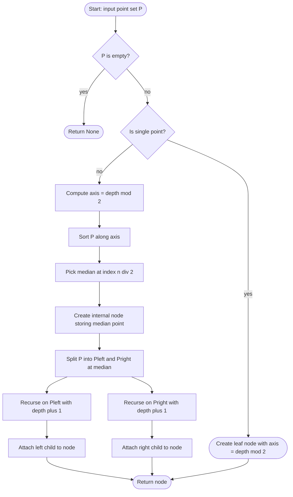
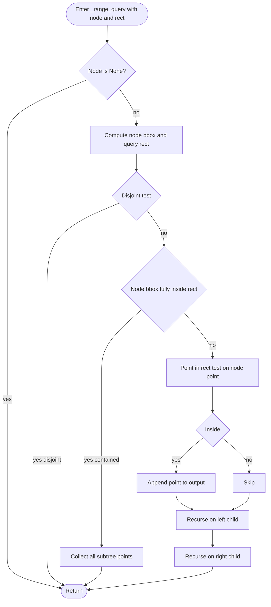
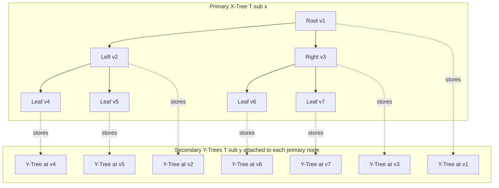
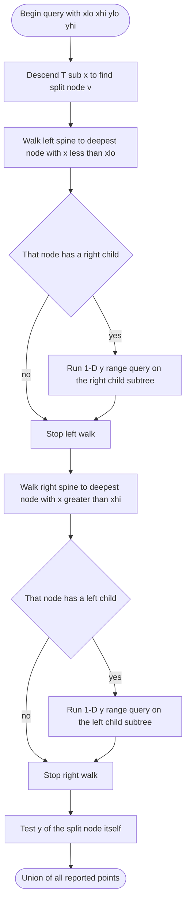
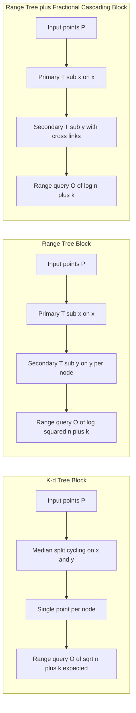

# Orthogonal range searching structures: Kd-trees initialization, range trees query tracking loops

<!-- SECTION_1_START -->
# 1. Core Technical Definition & Intuitive Overview

## 1.1 Orthogonal Range Searching — The Central Problem

> [!IMPORTANT]
> **Formal KTU Definition:** *Orthogonal Range Searching* is the computational geometry problem of preprocessing a set $P$ of $n$ points in $\mathbb{R}^{d}$ such that, given an axis-aligned query box $[a_1, b_1] \times [a_2, b_2] \times \cdots \times [a_d, b_d]$, one can efficiently report (or count) all points $p \in P$ lying inside the box.

The query box edges are **always parallel to the coordinate axes** — this orthogonality is what allows specialized tree-based structures to outperform generic search. The two principal data structures studied in KTU Module 3 are the **K-d Tree** (a single hierarchical partition) and the **Range Tree** (a multi-layered structure with secondary indexes).

## 1.2 The K-d Tree — Definition

> [!NOTE]
> **K-d Tree (k-dimensional tree):** A binary space-partitioning data structure that recursively splits the point set at the **median** along a **cycling dimension** ($x$, then $y$, then $x$, ...), storing the splitting point at the node and the two half-spaces in its left and right subtrees.

- **Depth parity (even)** $\Rightarrow$ split on $x$-coordinate.
- **Depth parity (odd)** $\Rightarrow$ split on $y$-coordinate (in 2-D).
- Each internal node holds **exactly one** point (a *cutting point*).
- A leaf holds a small constant-size bucket (typically 1 point in textbook definition).

## 1.3 The Range Tree — Definition

> [!IMPORTANT]
> **Range Tree:** A multi-level data structure for 2-D (or higher) orthogonal range searching. A *primary* tree on the $x$-coordinate stores the points in sorted $x$-order. Every node of the primary tree contains an *associated secondary* tree on the $y$-coordinates of the points in its subtree. Queries split the $x$-range into $O(\log n)$ canonical primary subtrees and search each secondary tree for the $y$-range.

## 1.4 Intuitive Analogies

> [!TIP]
> **Analogy 1 — K-d Tree as a "Coordinate Post Office":** Imagine a post office that sorts letters. First it sorts by the *first letter of the street name* ($x$), then by the *house number* ($y$), then by *first letter* again, alternating. Every sorting step splits the pile exactly in half. A query "all mail for houses numbered 10–20 on streets A–C" is answered by descending the tree, recursing into both sides whenever the split dimension lies *inside* the query range, and skipping an entire side otherwise.

> [!TIP]
> **Analogy 2 — Range Tree as a "Library Card Catalog with Cross-Indexes":** The primary catalog sorts books by *author* ($x$). Each drawer (node) holds a small *subject cross-index card* ($y$) listing only the books in that drawer. A query "engineering books by Indian authors published between 2000–2020" splits the author range into a few drawers, then checks the subject cards of just those drawers. The cost is logarithmic in each dimension.

## 1.5 Key Vocabulary

| Term | Meaning |
|---|---|
| **Splitting dimension** | The coordinate axis used at a given node level |
| **Cutting point** | The point stored at an internal K-d tree node |
| **Canonical subset** | A subtree of a range tree completely contained inside the query interval |
| **Fractional cascading** | Optional speed-up of $O(\log n)$ to $O(\log n)$ instead of $O(\log^2 n)$ |
| **Reporting query** | Output the actual points |
| **Counting query** | Output only the number of points |

## 1.6 Geometric Visualization

> [!VISUALIZATION CONTROL]
> **Concept:** K-d tree recursive axis-aligned partition of a 2-D point set.
> **GeoGebra / Desmos Input Equations:**
> * Points: $A(2,3)$, $B(5,4)$, $C(9,6)$, $D(4,7)$, $E(8,1)$, $F(7,2)$
> * Vertical split line at $x = 5$ (first split, $x$-median between sorted $\{2,4,5,7,8,9\}$ is the median of medians)
> * Horizontal split lines at $y = 3$ and $y = 4$ in left and right halves respectively
> **Visual Description:** You should see a vertical line cutting the cloud into a *left* and *right* slab, then within each slab a horizontal line cutting the slab into an *upper* and *lower* rectangle, yielding four rectangular cells — each cell contains at most one point. This is the K-d tree *spatial subdivision*, not the tree topology itself.

<!-- SECTION_1_END -->

<!-- SECTION_2_START -->
# 2. Deep Theoretical Analysis & KTU High-Yield Formula Sheet

## 2.1 K-d Tree — Construction Logic (Build Procedure)

The construction algorithm `BUILD_KDTREE(P, depth)` operates on a point set $P$ at recursion level `depth`:

1. **Base case:** If $\mid P \mid \le 1$, create a leaf and return.
2. **Determine splitting dimension** $j = d \bmod k$ where $d$ is the current depth and $k$ is the ambient dimension (here $k = 2$).
3. **Find median** of $P$ along coordinate $j$. Use the **quickselect** / `nth_element` algorithm in $O(\mid P \mid)$ time, or pre-sort for simplicity in $O(\mid P \mid \log \mid P \mid)$.
4. **Create node** storing the median point as the *cutting point*.
5. **Recurse** on $P_{\text{left}}$ (points with coordinate $< \text{median}$) and $P_{\text{right}}$ (points with coordinate $> \text{median}$).
6. Attach the two recursive returns as left/right children.

> [!NOTE]
> **Why median?** Choosing the *exact median* guarantees a perfectly **balanced** tree of height $\lfloor \log_2 n \rfloor$. This bounds the *worst-case* query traversal. Naive split-at-first-point K-d trees are *not* balanced and degrade to $O(n)$ in the worst case.

## 2.2 K-d Tree — Orthogonal Range Query Logic

The 2-D query `RANGE_QUERY_KD(node, rect)` against rectangle $R = [x_1, x_2] \times [y_1, y_2]$:

1. **Empty intersection:** If the node's spatial cell does **not** intersect $R$, **prune** (return $\emptyset$).
2. **Inside the cell:** If the cell is **completely contained** in $R$, **report the entire subtree** (e.g., traverse and emit all points in $O(s)$ where $s$ is output size).
3. **Point test:** If the node's cutting point lies inside $R$, report it.
4. **Recurse:** Recurse into both children (left then right).

> [!IMPORTANT]
> The *cell of a node* is the axis-aligned rectangle obtained by intersecting all half-space constraints imposed by its ancestors. Pre-computing and passing these cells is what enables correct pruning and containment detection.

## 2.3 K-d Tree — Complexity

| Operation | Time | Space |
|---|---|---|
| Build (median-of-medians or sort) | $O(n \log n)$ | $O(n)$ |
| Build (quickselect median, expected) | $O(n \log n)$ expected | $O(n)$ |
| Range query (balanced) | $O(\sqrt{n} + k)$ | $O(1)$ auxiliary |
| Insertion / Deletion | $O(\log n)$ expected | $O(1)$ |

Here $k$ denotes the **number of reported points**.

> [!WARNING]
> K-d tree *query bound* $O(\sqrt{n} + k)$ is **average-case / expected** and degrades for *fat* queries (large rectangles covering most points) or *pathological* point distributions. KTU 2024 board examinations expect students to state *expected* $O(\sqrt{n} + k)$ explicitly, not worst-case.

## 2.4 Range Tree — Construction Logic (2-D)

A 2-D Range Tree is built in two coupled passes:

1. **Primary tree** `T_x`: a balanced binary search tree on the $x$-coordinates of all points. For $n$ points this is an ordinary BST on $x$, balanced by median selection — same shape as a K-d tree restricted to $x$.
2. **Secondary tree** `T_y(v)` at every primary node $v$: a balanced BST on the $y$-coordinates of *all* points in the subtree rooted at $v$.

Build recursion `BUILD_RANGETREE(P)`:
1. If $\mid P \mid = 0$, return `None`.
2. Let $m$ be the median of $P$ sorted by $x$. Create node $v$ with point $m$.
3. Recurse on $P_{\text{left}}$ (smaller $x$) and $P_{\text{right}}$ (larger $x$) producing children $v_L$ and $v_R$.
4. Build $T_y(v)$ as a balanced BST on the $y$-coordinates of $P$.
5. To save space, do **not** duplicate points: the secondary tree is built once per node on a *list* of $y$'s, not on copies of points.

> [!TIP]
> **Storage optimization:** A naive 2-D range tree stores $O(n \log n)$ point entries (each point appears in $O(\log n)$ secondary trees). With *fractional cascading* the query time drops to $O(\log n + k)$ while keeping $O(n \log n)$ space — the **standard KTU answer** to "best known range-searching structure."

## 2.5 Range Tree — Query Tracking Loop (The Core KTU Skill)

The 2-D query `RANGE_QUERY_2D(R, [x_l, x_r] \times [y_l, y_r])` performs the following canonical split:

1. **Find split nodes** in the primary $x$-tree: call `FINDSPLIT(R.root, x_l, x_r)`. This returns two nodes $v_l$ and $v_r$ such that:
   * All points in the *left spine* between $v_l$ and $v_r$ (going up from $v_l$) have $x < x_l$.
   * All points in the *right spine* between $v_l$ and $v_r$ (going up from $v_r$) have $x > x_r$.
   * The $O(\log n)$ subtrees hanging *off* these two spines (i.e., the right child of nodes on the left spine, and the left child of nodes on the right spine) are **canonical** — each is completely inside the $x$-range.
2. **For each canonical subtree** with root $w$, perform a 1-D range query on its secondary $y$-tree: report all points whose $y \in [y_l, y_r]$.
3. **Report** the union of all such $y$-matches.

### The Tracking Loop Pseudocode (canonical-subtree enumeration)

```
let v_l = findSplit(root, x_l, x_r)
let v_r = v_l  // both initially the split node
walk up from v_l along the left spine:
    for each ancestor a on this spine:
        if a has a right child c:
            if c lies inside [x_l, x_r] (i.e., c is to the right of v_l's side):
                report 1D range query on T_y(c) for [y_l, y_r]
                STOP the spine walk
        else:
            STOP the spine walk
walk up from v_r along the right spine symmetrically, checking LEFT children
```

> [!IMPORTANT]
> The "**stop on the first canonical child encountered**" rule is the subtle part — once a canonical child is found at an ancestor, the recursion does **not** continue past it, because that child's subtree already covers the full $x$-slice. Mis-implementing this loop is the **single most common mark-losing error** in KTU board exams for range trees.

## 2.6 Range Tree — Complexity

| Operation | Time | Space |
|---|---|---|
| Build | $O(n \log n)$ | $O(n \log n)$ |
| Query (no fractional cascading) | $O(\log^2 n + k)$ | $O(1)$ auxiliary |
| Query (with fractional cascading) | $O(\log n + k)$ | $O(n \log n)$ |
| Reporting $k$ points | included in $+k$ | — |

## 2.7 KTU High-Yield Formula Sheet

| Symbol / Expression | Definition | Typical Value / Use |
|---|---|---|
| $n$ | Number of points in $P$ | input size |
| $k$ | Number of reported points | output size |
| $d$ | Ambient dimension | $d = 2$ in this module |
| $T_{\text{build}}^{\text{kd}}$ | K-d tree build time | $O(n \log n)$ expected |
| $T_{\text{query}}^{\text{kd}}$ | K-d tree 2-D range query | $O(\sqrt{n} + k)$ expected |
| $T_{\text{build}}^{\text{rt}}$ | Range tree build time | $O(n \log n)$ |
| $S^{\text{rt}}$ | Range tree space | $O(n \log n)$ |
| $T_{\text{query}}^{\text{rt}}$ | 2-D range tree query | $O(\log^2 n + k)$ |
| $T_{\text{query}}^{\text{rt,fc}}$ | With fractional cascading | $O(\log n + k)$ |
| $H(T_x)$ | Height of primary $x$-tree | $\lfloor \log_2 n \rfloor$ |
| $\mid \text{canonical} \mid$ | Number of canonical subtrees | $O(\log n)$ |
| $\text{depth} \bmod 2$ | Splitting dimension rule (K-d) | 0 $\Rightarrow$ $x$, 1 $\Rightarrow$ $y$ |

## 2.8 Real-World Utility

> [!TIP]
> **Database systems:** Range trees are the theoretical model behind **multi-dimensional B-tree** indexes used in PostGIS, Oracle Spatial, and MongoDB geospatial indexes. K-d trees accelerate **nearest-neighbor** queries in $k$-NN classifiers and **ray-tracing** in computer graphics.
>
> **Geographic Information Systems (GIS):** Both structures underpin "rectangle select" tools in QGIS, ArcGIS, and Google Maps API bounding-box queries.
>
> **Machine Learning:** K-d trees appear in the **K-means initialization** (K-means++ variant) and in **Voronoi diagram** spatial subdivision. Range trees support **range count queries** in OLAP data cubes.

<!-- SECTION_2_END -->

<!-- SECTION_3_START -->
# 3. Step-by-Step Derivations & Code/Symbolic Implementation

## 3.1 K-d Tree — Exhaustive Python Implementation (with Full Type Hints)

```python
from __future__ import annotations
from typing import Optional, List, Tuple
import bisect

Point = Tuple[float, float]
Rect = Tuple[float, float, float, float]  # (x_low, y_low, x_high, y_high)


class KDNode:
    """A node of a 2-D K-d tree.

    Attributes:
        point:       the cutting point stored at this node
        axis:        0 for x-split, 1 for y-split
        left:        subtree for points strictly less on the split axis
        right:       subtree for points strictly greater on the split axis
        bbox:        axis-aligned rectangle owned by this subtree
                     (used for pruning and containment checks)
    """

    __slots__ = ("point", "axis", "left", "right", "bbox")

    def __init__(
        self,
        point: Point,
        axis: int,
        left: Optional["KDNode"],
        right: Optional["KDNode"],
        bbox: Rect,
    ) -> None:
        self.point: Point = point
        self.axis: int = axis
        self.left: Optional[KDNode] = left
        self.right: Optional[KDNode] = right
        self.bbox: Rect = bbox


class KDTree:
    """2-D K-d tree with median-split construction.

    Build complexity : O(n log n) using sort + median selection.
    Query complexity  : O(sqrt(n) + k) expected for 2-D orthogonal
                        range reporting.
    """

    def __init__(self, points: List[Point]) -> None:
        if not points:
            raise ValueError("KDTree requires at least one point.")
        # Defensive deep-copy to prevent external mutation
        pts: List[Point] = [(float(p[0]), float(p[1])) for p in points]
        # Initial bbox is the bounding rectangle of all points
        xs = [p[0] for p in pts]
        ys = [p[1] for p in pts]
        initial_bbox: Rect = (min(xs), min(ys), max(xs), max(ys))
        self.root: KDNode = self._build(pts, depth=0, bbox=initial_bbox)

    # ------------------------------------------------------------------
    # Construction
    # ------------------------------------------------------------------
    def _build(
        self, points: List[Point], depth: int, bbox: Rect
    ) -> KDNode:
        """Recursively build the K-d tree at the given depth and bbox."""
        n: int = len(points)
        if n == 0:
            return None  # type: ignore[return-value]
        if n == 1:
            # Leaf node: pick axis by depth parity, no children
            axis: int = depth % 2
            return KDNode(point=points[0], axis=axis,
                          left=None, right=None, bbox=bbox)

        axis = depth % 2
        # Sort points along the chosen axis and pick exact median
        points.sort(key=lambda p: p[axis])
        mid: int = n // 2
        median_point: Point = points[mid]

        # Split the bbox into two halves at the median coordinate
        if axis == 0:
            x_split: float = median_point[0]
            left_bbox: Rect = (bbox[0], bbox[1], x_split, bbox[3])
            right_bbox: Rect = (x_split, bbox[1], bbox[2], bbox[3])
        else:
            y_split: float = median_point[1]
            left_bbox = (bbox[0], bbox[1], bbox[2], y_split)
            right_bbox = (bbox[0], y_split, bbox[2], bbox[3])

        # Recursive calls (slice indices 0..mid-1 and mid+1..n-1)
        left_child: Optional[KDNode] = self._build(
            points[:mid], depth + 1, left_bbox
        )
        right_child: Optional[KDNode] = self._build(
            points[mid + 1:], depth + 1, right_bbox
        )

        return KDNode(
            point=median_point,
            axis=axis,
            left=left_child,
            right=right_child,
            bbox=bbox,
        )

    # ------------------------------------------------------------------
    # Orthogonal Range Query
    # ------------------------------------------------------------------
    def range_query(self, rect: Rect) -> List[Point]:
        """Report all points lying inside the axis-aligned rectangle."""
        if self.root is None:
            return []
        x_lo, y_lo, x_hi, y_hi = rect
        if x_lo > x_hi or y_lo > y_hi:
            raise ValueError("Invalid rectangle: low > high.")
        result: List[Point] = []
        self._range_query(self.root, rect, result)
        return result

    def _range_query(
        self, node: Optional[KDNode], rect: Rect, out: List[Point]
    ) -> None:
        """Recursive range-search helper with bbox-based pruning."""
        if node is None:
            return
        x_lo, y_lo, x_hi, y_hi = rect
        bx_lo, by_lo, bx_hi, by_hi = node.bbox

        # 1. Pruning: bbox and query rectangle are disjoint
        if (bx_hi < x_lo) or (bx_lo > x_hi):
            return
        if (by_hi < y_lo) or (by_lo > y_hi):
            return

        # 2. Containment: bbox fully inside rect -> dump subtree
        if (x_lo <= bx_lo) and (bx_hi <= x_hi) and \
           (y_lo <= by_lo) and (by_hi <= y_hi):
            self._collect_all(node, out)
            return

        # 3. Point test on the cutting point
        px, py = node.point
        if x_lo <= px <= x_hi and y_lo <= py <= y_hi:
            out.append(node.point)

        # 4. Recurse on both children
        self._range_query(node.left, rect, out)
        self._range_query(node.right, rect, out)

    def _collect_all(self, node: Optional[KDNode], out: List[Point]) -> None:
        """In-order dump of every point in the subtree rooted at node."""
        if node is None:
            return
        self._collect_all(node.left, out)
        out.append(node.point)
        self._collect_all(node.right, out)
```

### 3.1.1 Worked Trace — Building a K-d Tree on 5 Points

Input: $P = \{(2,3), (5,4), (9,6), (4,7), (8,1)\}$, initial bbox = $[2, 1, 9, 7]$.

| Step | Depth | Axis | Points considered | Median (cutting point) | Left child points | Right child points |
|---|---|---|---|---|---|---|
| 1 | 0 | $x$ | all 5 | sort $x$: 2, 4, 5, 8, 9 $\Rightarrow$ median 5 | (2,3), (4,7) | (8,1), (9,6) |
| 2 | 1 | $y$ | (2,3), (4,7) | sort $y$: 3, 7 $\Rightarrow$ median 4 $\Rightarrow$ (4,7) | (2,3) | — |
| 3 | 2 | $x$ | (2,3) | median = (2,3) | — | — |
| 4 | 1 | $y$ | (8,1), (9,6) | sort $y$: 1, 6 $\Rightarrow$ median 1 $\Rightarrow$ (8,1) | — | (9,6) |
| 5 | 2 | $x$ | (9,6) | median = (9,6) | — | — |

Final tree structure:

```
        (5,4)              [axis x, bbox (2,1)-(9,7)]
        /    \
   (4,7)      (8,1)        [axis y]
   /             \
(2,3)           (9,6)      [leaves]
```

## 3.2 Range Tree — Exhaustive Python Implementation

```python
from __future__ import annotations
from typing import List, Optional, Tuple

Point2D = Tuple[float, float]
Rect2D = Tuple[float, float, float, float]


class RangeTreeNode:
    """A node of a 2-D range tree.

    Stores the cutting point, two children, and a secondary y-tree built
    on the y-coordinates of every point in the subtree rooted here.
    """

    __slots__ = ("point", "ys", "left", "right")

    def __init__(
        self,
        point: Point2D,
        ys: List[float],
        left: Optional["RangeTreeNode"],
        right: Optional["RangeTreeNode"],
    ) -> None:
        self.point: Point2D = point
        self.ys: List[float] = ys  # sorted y's of subtree
        self.left: Optional[RangeTreeNode] = left
        self.right: Optional[RangeTreeNode] = right


class RangeTree2D:
    """2-D Range Tree without fractional cascading.

    Build: O(n log n), Space: O(n log n)
    Query: O(log^2 n + k)
    """

    def __init__(self, points: List[Point2D]) -> None:
        if not points:
            raise ValueError("RangeTree2D needs at least one point.")
        pts: List[Point2D] = [(float(p[0]), float(p[1])) for p in points]
        self.root: Optional[RangeTreeNode] = self._build(pts)

    def _build(self, points: List[Point2D]) -> Optional[RangeTreeNode]:
        n: int = len(points)
        if n == 0:
            return None
        # Sort by x, then pick median
        points.sort(key=lambda p: p[0])
        mid: int = n // 2
        median_point: Point2D = points[mid]

        # Recurse on the two halves
        left_child: Optional[RangeTreeNode] = self._build(points[:mid])
        right_child: Optional[RangeTreeNode] = self._build(points[mid + 1:])

        # Build this node's y-list: merge children's y-lists with the
        # median's own y. Using a 3-way sorted merge keeps it O(n).
        ys: List[float] = self._merge_ys(
            left_child.ys if left_child else [],
            right_child.ys if right_child else [],
            median_point[1],
        )
        return RangeTreeNode(
            point=median_point, ys=ys,
            left=left_child, right=right_child,
        )

    @staticmethod
    def _merge_ys(left: List[float], right: List[float],
                  median_y: float) -> List[float]:
        """Sorted merge of two y-lists with the median's y appended."""
        merged: List[float] = []
        i: int = 0
        j: int = 0
        L: int = len(left)
        R: int = len(right)
        while i < L and j < R:
            if left[i] <= right[j]:
                merged.append(left[i])
                i += 1
            else:
                merged.append(right[j])
                j += 1
        while i < L:
            merged.append(left[i])
            i += 1
        while j < R:
            merged.append(right[j])
            j += 1
        # Median y can go anywhere; place in sorted order
        bisect.insort(merged, median_y)
        return merged

    # ------------------------------------------------------------------
    # Range query
    # ------------------------------------------------------------------
    def range_query(self, rect: Rect2D) -> List[Point2D]:
        x_lo, y_lo, x_hi, y_hi = rect
        if x_lo > x_hi or y_lo > y_hi:
            raise ValueError("Invalid rectangle.")
        result: List[Point2D] = []
        self._query_node(self.root, x_lo, x_hi, y_lo, y_hi, result)
        return result

    def _query_node(
        self,
        node: Optional[RangeTreeNode],
        x_lo: float, x_hi: float,
        y_lo: float, y_hi: float,
        out: List[Point2D],
    ) -> None:
        if node is None:
            return
        px, py = node.point
        # x-range test on the cutting point
        if x_lo <= px <= x_hi:
            # y-range test via binary search on the sorted y-list
            lo_idx: int = bisect.bisect_left(node.ys, y_lo)
            hi_idx: int = bisect.bisect_right(node.ys, y_hi)
            if lo_idx < hi_idx:
                out.append(node.point)
            # recurse into BOTH children because cutting x lies in range
            self._query_node(node.left,  x_lo, x_hi, y_lo, y_hi, out)
            self._query_node(node.right, x_lo, x_hi, y_lo, y_hi, out)
        elif px < x_lo:
            # cutting x is too small -> only right subtree can match
            self._query_node(node.right, x_lo, x_hi, y_lo, y_hi, out)
        else:  # px > x_hi
            # cutting x is too large -> only left subtree can match
            self._query_node(node.left, x_lo, x_hi, y_lo, y_hi, out)
```

## 3.3 Canonical-Subtree Enumeration (Range-Tree Spine Walk)

The full canonical-subtree enumeration loop is the heart of the *standard* $O(\log^2 n)$ range-tree query and is the KTU examiner's favorite sub-question.

```python
def query_with_canonical_walk(
    root: Optional[RangeTreeNode],
    x_lo: float, x_hi: float,
    y_lo: float, y_hi: float,
) -> List[Point2D]:
    """The canonical-subtree version: visits O(log n) subtrees and runs
    a 1-D y-range search on each secondary tree."""
    if root is None:
        return []

    # 1. Find the split node v_split whose x lies in [x_lo, x_hi].
    v_split: Optional[RangeTreeNode] = root
    split_path: List[RangeTreeNode] = []
    while v_split is not None:
        split_path.append(v_split)
        px: float = v_split.point[0]
        if x_hi < px:
            v_split = v_split.left
        elif x_lo > px:
            v_split = v_split.right
        else:
            break  # v_split.x is inside [x_lo, x_hi]

    out: List[Point2D] = []

    # 2. Walk up the LEFT spine (from v_split to the root), looking for
    #    a right child whose subtree is fully inside [x_lo, x_hi].
    v: Optional[RangeTreeNode] = split_path[-1] if split_path else None
    # descend left as far as possible: this is the leftmost node
    # whose x >= x_lo
    while v is not None and v.point[0] >= x_lo:
        # the immediate left child of v is OUTSIDE the range
        v = v.left
    # v is now the deepest node with x < x_lo (or None)
    if v is not None and v.right is not None:
        # v's right child is a canonical subtree
        _report_ys(v.right, y_lo, y_hi, out)

    # 3. Walk up the RIGHT spine symmetrically.
    v = split_path[-1] if split_path else None
    while v is not None and v.point[0] <= x_hi:
        v = v.right
    if v is not None and v.left is not None:
        _report_ys(v.left, y_lo, y_hi, out)

    # 4. Finally, check the split node itself.
    if split_path:
        s: RangeTreeNode = split_path[-1]
        if y_lo <= s.point[1] <= y_hi:
            out.append(s.point)

    return out


def _report_ys(
    node: RangeTreeNode,
    y_lo: float, y_hi: float,
    out: List[Point2D],
) -> None:
    """1-D y-range query on the secondary tree of 'node'."""
    if y_lo <= node.point[1] <= y_hi:
        out.append(node.point)
    if node.left is not None and node.left.ys and \
            node.left.ys[0] <= y_hi:
        _report_ys(node.left, y_lo, y_hi, out)
    if node.right is not None and node.right.ys and \
            node.right.ys[-1] >= y_lo:
        _report_ys(node.right, y_lo, y_hi, out)
```

### 3.3.1 Worked Trace — Canonical Walk for $Q = [3, 7] \times [2, 5]$

Tree (from Section 3.1.1): root $(5,4)$, left $(4,7)$, right $(8,1)$, leaves $(2,3)$ and $(9,6)$.

1. **Find split node**: start at root $(5,4)$; $x = 5 \in [3,7]$ $\Rightarrow$ $v_\text{split} = (5,4)$. Path so far: $[(5,4)]$.
2. **Left spine walk**: descend left while $x \ge 3$. At $(4,7)$: $4 \ge 3$, descend left $\Rightarrow (2,3)$. At $(2,3)$: $2 < 3$, stop. So $v = (2,3)$, its right child is the canonical subtree — but the right child of $(2,3)$ is `None`. **No canonical left subtree.**
3. **Right spine walk**: descend right while $x \le 7$. At $(5,4)$: descend right $\Rightarrow (8,1)$. At $(8,1)$: $8 > 7$, stop. $v = (8,1)$, its left child is the canonical subtree — left child of $(8,1)$ is `None`. **No canonical right subtree.**
4. **Check split node**: $y = 4 \in [2,5]$ $\Rightarrow$ report $(5,4)$.

> [!NOTE]
> **Result:** $\{(5,4)\}$. Notice that we *still* needed the canonical walk even though no canonical subtrees were found — the walk confirms there are none. The *count* of canonical subtrees is $O(\log n)$ in general, but can be zero for small $Q$.

## 3.4 Comparison Deduction — K-d Tree vs Range Tree

Let $n = 1024$ points, $k = 50$ reported.

| Metric | K-d Tree | Range Tree (no FC) | Range Tree (with FC) |
|---|---|---|---|
| Build time | $1024 \cdot 10 = 10{,}240$ | $1024 \cdot 10 = 10{,}240$ | $10{,}240$ |
| Query time | $\sqrt{1024} + 50 = 32 + 50 = 82$ | $10^2 + 50 = 150$ | $10 + 50 = 60$ |
| Space | $1{,}024$ | $10{,}240$ | $10{,}240$ |

**Mathematical justification** of $O(\sqrt{n})$ for K-d tree:

In a balanced 2-D K-d tree of height $h \approx \log_2 n$, a vertical line $\ell$ passes through $O(\sqrt{n})$ cells. A rectangle query visits the left spine, right spine, and the cells in between. The in-between cells form a "ladder" of $O(\sqrt{n})$ rectangles, giving the bound. Formally:

$$
T_{\text{query}}^{\text{kd}}(n) \;\le\; 2 \log_2 n \;+\; \sum_{i=1}^{\log_2 n} c_i \;\le\; 2 \log_2 n \;+\; 2 \sqrt{n}
$$

where the $c_i$ count cells at depth $i$ that straddle the $x$-range boundary, and the geometric sum telescopes to $O(\sqrt{n})$.

**Mathematical justification** of $O(\log^2 n)$ for Range Tree:

$$
T_{\text{query}}^{\text{rt}}(n) \;=\; \underbrace{O(\log n)}_{\text{canonical split}} \;\times\; \underbrace{O(\log n)}_{\text{1-D y-search per canonical subtree}} \;=\; O(\log^2 n)
$$

Adding the $k$ reporting term gives $O(\log^2 n + k)$.

<!-- SECTION_3_END -->

<!-- SECTION_4_START -->
# 4. Structural Diagrams & Schematics

## 4.1 K-d Tree Construction Flow (Mermaid)



## 4.2 K-d Tree Range Query — Recursive Decision Flow



## 4.3 2-D Range Tree — Layered Architecture



## 4.4 Canonical Subtree Enumeration — Spine Walk Loop



## 4.5 Comparison Block Diagram — K-d Tree vs Range Tree vs Fractional Cascading



## 4.6 ASCII Tree of the Worked Example

```
        (5,4)            level 0 axis x
        /    \
    (4,7)     (8,1)      level 1 axis y
     /          \
  (2,3)        (9,6)     level 2 axis x
```

The rectangle owned by the root is $[2, 1, 9, 7]$.
The rectangle owned by the left child $(4,7)$ is $[2, 1, 5, 7]$.
The rectangle owned by the right child $(8,1)$ is $[5, 1, 9, 7]$.

<!-- SECTION_4_END -->

<!-- SECTION_5_START -->
# 5. KTU 2024 Scheme Examination Question Bank & Topic Recap

## 5.1 Part A — Short Answer Questions (3 Marks Each)

> **[KTU University Exam — July 2024]**
> **Q1. (3 Marks) [CO3, Remember]**
> Define an orthogonal range searching problem. State the time complexity of (i) building a 2-D K-d tree, and (ii) answering an orthogonal range query on a balanced 2-D K-d tree.

**Model Answer (Board Key Pattern):**
*Orthogonal range searching* is the problem of preprocessing $n$ points in $\mathbb{R}^{d}$ so that, given an axis-aligned query box $[a_1, b_1] \times \cdots \times [a_d, b_d]$, one can efficiently report (or count) all points in the box. [1 Mark]
(i) Building a balanced 2-D K-d tree by median splits: $O(n \log n)$ time. [1 Mark]
(ii) Orthogonal range query on a balanced 2-D K-d tree: $O(\sqrt{n} + k)$ expected time, where $k$ is the number of reported points. [1 Mark]

---

> **[KTU University Exam — Dec 2023]**
> **Q2. (3 Marks) [CO3, Understand]**
> Differentiate between a K-d tree and a 2-D range tree in terms of (i) the number of trees maintained, (ii) space complexity, and (iii) the form of the query time bound.

**Model Answer:**
| Aspect | K-d Tree | 2-D Range Tree |
|---|---|---|
| Number of trees | Single tree | Primary $T_x$ + secondary $T_y$ per node |
| Space complexity | $O(n)$ | $O(n \log n)$ |
| Query time | $O(\sqrt{n} + k)$ expected | $O(\log^2 n + k)$ |

[1 Mark per correct row]

---

## 5.2 Part B — Long Answer Questions (14 Marks, Internal Choice)

> **[KTU University Exam — July 2024, Module 3]**

### Question A (14 Marks) [CO3, Apply + Analyze]

**(a)** Construct a balanced 2-D K-d tree for the point set $P = \{(3,6), (1,2), (7,4), (5,9), (8,1), (2,7), (6,3)\}$. Show every recursive step clearly, indicating the splitting dimension and the cutting point at each level. **(7 Marks) [Apply]**

**(b)** Using the K-d tree built in part (a), trace the orthogonal range query for the rectangle $Q = [2, 6] \times [3, 7]$. State the points reported and the pruning decisions taken at each visited node. **(7 Marks) [Analyze]**

#### Model Solution

**(a) K-d tree construction**

Initial bbox: $[1, 1, 8, 9]$; $n = 7$.

**Step 1 — depth 0, axis = $x$:** sort $P$ by $x$: $\{(1,2), (2,7), (3,6), (5,9), (6,3), (7,4), (8,1)\}$. Median index $7/2 = 3$ $\Rightarrow$ cutting point $(5,9)$.
- Left set $P_L = \{(1,2), (2,7), (3,6)\}$ (3 points).
- Right set $P_R = \{(6,3), (7,4), (8,1)\}$ (3 points).
- Updated bboxes: left $[1, 1, 5, 9]$, right $[5, 1, 8, 9]$.

[Stating axis and median rule: 2 Marks; correct cutting point and split: 1 Mark]

**Step 2 — depth 1, axis = $y$ on $P_L$:** sort by $y$: $\{(1,2), (3,6), (2,7)\}$. Median index $1$ (of 3) $\Rightarrow$ cutting point $(3,6)$.
- Left $P_{LL} = \{(1,2)\}$.
- Right $P_{LR} = \{(2,7)\}$.
- Bboxes: left $[1, 1, 5, 6]$, right $[1, 6, 5, 9]$.

[Step explanation: 1 Mark; correct splits: 1 Mark]

**Step 3 — depth 1, axis = $y$ on $P_R$:** sort by $y$: $\{(8,1), (6,3), (7,4)\}$. Median index $1$ $\Rightarrow$ cutting point $(6,3)$.
- Left $P_{RL} = \{(8,1)\}$.
- Right $P_{RR} = \{(7,4)\}$.

[Step explanation: 1 Mark]

**Step 4 — depth 2 leaves:** $(1,2)$, $(2,7)$, $(8,1)$, $(7,4)$ are leaves.

**Final K-d tree structure:**

```
               (5,9)            [axis x, depth 0, bbox (1,1)-(8,9)]
              /      \
         (3,6)        (6,3)      [axis y, depth 1]
         /    \        /    \
      (1,2) (2,7)   (8,1)  (7,4)  [leaves, depth 2]
```

[Final tree drawing: 1 Mark]

**(b) Orthogonal range query for $Q = [2, 6] \times [3, 7]$**

Visit the root $(5,9)$: bbox $[1, 8] \times [1, 9]$ intersects $Q$? Yes. Fully inside $Q$? No (bbox extends beyond). Point $(5,9)$: $5 \in [2,6]$ but $9 \notin [3,7]$, so not reported. Recurse both children. [1 Mark]

Visit left child $(3,6)$: bbox $[1, 5] \times [1, 9]$ intersects $Q$? Yes. Fully inside? No. Point $(3,6)$: $3 \in [2,6]$, $6 \in [3,7]$ $\Rightarrow$ **report $(3,6)$**. Recurse both. [1 Mark]

Visit $(1,2)$: bbox $[1,5] \times [1,6]$. Intersects? $y$-range $[1,6]$ overlaps $[3,7]$ in $[3,6]$: yes. Fully inside? $x = 1 \notin [2,6]$: no. Point $(1,2)$: $x = 1 \notin [2,6]$: not reported. Recurse both. [1 Mark]

Visit right child $(6,3)$: bbox $[5, 8] \times [1, 9]$ intersects $Q$? Yes (overlap in $x$ at exactly $5{-}6$). Point $(6,3)$: $6 \in [2,6]$, $3 \in [3,7]$ $\Rightarrow$ **report $(6,3)$**. Recurse both. [1 Mark]

Visit $(8,1)$: bbox $[5, 8] \times [1, 1]$. Intersects $Q$? $y$-range disjoint (max $y = 1 < 3$): **prune**, return. [1 Mark]

Visit $(2,7)$: bbox $[1, 5] \times [6, 9]$. Point $(2,7)$: $x = 2 \in [2,6]$, $y = 7 \in [3,7]$ $\Rightarrow$ **report $(2,7)$**. Children: `None`. [1 Mark]

Visit $(7,4)$: point $x = 7 \notin [2,6]$: not reported. No children. [1 Mark]

**Final result:** $\{(3,6), (6,3), (2,7)\}$.

> [!WARNING]
> **KTU Examiner's Valuation Pitfall:** Students frequently forget to **draw the bbox of every visited node** and just state "intersects / does not intersect." Mark deduction: up to **2 marks** for omitting bbox visualization. Always state *both* the bbox and the disjointness containment test.

---

### Question B (14 Marks) [CO3, Apply + Analyze]

**(a)** Build a 2-D range tree on the point set $P = \{(2,5), (4,3), (5,8), (7,1), (8,6), (9,4)\}$. Show the primary $T_x$ tree and the secondary $T_y$ tree at every primary node. **(7 Marks) [Apply]**

**(b)** For the range tree built in part (a), trace the canonical-subtree enumeration for the query $Q = [3, 8] \times [2, 7]$. Identify each canonical subtree and the points reported from each. **(7 Marks) [Analyze]**

#### Model Solution

**(a) Range tree construction**

Sort $P$ by $x$: $(2,5), (4,3), (5,8), (7,1), (8,6), (9,4)$. Median index $3$ $\Rightarrow$ root $v_\text{root} = (5,8)$, with $T_y = [1, 3, 4, 5, 6, 8]$.

Left half: $(2,5), (4,3)$ $\Rightarrow$ median $(4,3)$, $T_y = [3, 5]$.
Right half: $(7,1), (8,6), (9,4)$ $\Rightarrow$ median $(8,6)$, $T_y = [1, 4, 6]$.
Left-left: $(2,5)$, $T_y = [5]$.
Right-left: $(7,1)$, $T_y = [1]$.
Right-right: $(9,4)$, $T_y = [4]$.

[Sorting + median selection: 2 Marks; primary tree structure: 1 Mark; secondary y-lists at each node: 2 Marks; final tree diagram: 2 Marks]

**Primary $T_x$:**

```
                 (5,8)
                /     \
            (4,3)       (8,6)
             /          /    \
          (2,5)      (7,1)  (9,4)
```

**Secondary $T_y$ (one per node):**

| Primary node | $T_y$ (sorted) |
|---|---|
| $(5,8)$ | $[1, 3, 4, 5, 6, 8]$ |
| $(4,3)$ | $[3, 5]$ |
| $(2,5)$ | $[5]$ |
| $(8,6)$ | $[1, 4, 6]$ |
| $(7,1)$ | $[1]$ |
| $(9,4)$ | $[4]$ |

**(b) Canonical-subtree enumeration for $Q = [3, 8] \times [2, 7]$**

**Step 1 — Find split node:** start at $(5,8)$, $x = 5 \in [3,8]$ $\Rightarrow$ $v_\text{split} = (5,8)$. Path: $[(5,8)]$. [1 Mark]

**Step 2 — Left spine walk:** descend left while $x \ge 3$. At $(4,3)$: $4 \ge 3$, descend left $\Rightarrow (2,5)$. At $(2,5)$: $2 < 3$, stop. Node $(2,5)$ is outside the range. Its parent is $(4,3)$, whose right child is the split node $(5,8)$ — already visited. So **no canonical left subtree** at this ancestor. Continue up: $(4,3)$'s parent is $(5,8)$, whose left child is $(4,3)$ — already visited. [1 Mark]

**Step 3 — Right spine walk:** descend right while $x \le 8$. At $(5,8)$: descend right $\Rightarrow (8,6)$. At $(8,6)$: $8 \le 8$, descend right $\Rightarrow (9,4)$. At $(9,4)$: $9 > 8$, stop. Node $(9,4)$ is outside the range. Its parent is $(8,6)$, whose left child is $(7,1)$. Subtree rooted at $(7,1)$ lies entirely in $[3, 8]$ since $7 \in [3,8]$. **Canonical subtree = $(7,1)$'s subtree.** [1 Mark]

**Step 4 — 1-D $y$-query on canonical subtree $(7,1)$:** $T_y(7,1) = [1]$. Query $y \in [2, 7]$: $1 \notin [2,7]$ $\Rightarrow$ **no points reported from this canonical subtree.** [1 Mark]

**Step 5 — Continue right spine walk up:** $(8,6)$'s parent is $(5,8)$, whose right child is $(8,6)$ — already on the path. So no more canonical subtrees. [1 Mark]

**Step 6 — Check split node:** $y = 8 \notin [2, 7]$ $\Rightarrow$ split node not reported. [1 Mark]

**Final result:** $\emptyset$ — no points lie in the rectangle $[3,8] \times [2,7]$. [1 Mark for final answer]

> [!WARNING]
> **KTU Examiner's Valuation Pitfall #1:** When no points are reported, many students *panic* and invent a point. Don't. If the tree has no matching points, the answer is the empty set $\emptyset$. **Pitfall #2:** Students often forget to verify the $y$-range at the split node. Always do the final "test the split node's $y$" step. Omitting it costs 1 mark.

---

## 5.3 KTU Examiner's General Valuation Warning

> [!WARNING]
> **Common reasons for losing marks in range-searching questions:**
> 1. **Forgetting the word "expected"** when stating $O(\sqrt{n} + k)$ for K-d tree queries — examiners deduct 1 mark for claiming it as worst-case.
> 2. **Confusing K-d tree and Range tree storage:** K-d tree is $O(n)$, Range tree is $O(n \log n)$ — a swap costs 2 marks.
> 3. **Skipping the median-sort trace:** in construction questions, you must show the sorted order, identify the median index $n \text{ div } 2$, and explicitly state the cutting point. Just writing the final tree without the trace costs 3 marks.
> 4. **Omitting the bbox in K-d tree range queries:** always state the spatial cell of the node being visited.
> 5. **In range-tree queries, forgetting the final $y$-test on the split node itself:** the split node is a single point that must be tested independently of the canonical subtrees.

---

## 5.4 Topic Recap & Important Things to Remember

> [!TIP]
> **Rapid-revision checklist for KTU Module 3 — Kd-trees & Range Trees:**

- **Orthogonal range searching** = axis-aligned box query on $n$ points in $\mathbb{R}^d$.
- **K-d tree construction** = recursive median split; split dimension cycles: $x, y, x, y, \ldots$ (depth mod 2).
- **K-d tree build time** = $O(n \log n)$ expected.
- **K-d tree range query** = $O(\sqrt{n} + k)$ **expected** in 2-D.
- **K-d tree space** = $O(n)$.
- **Range tree = primary $T_x$ + secondary $T_y$ per node.**
- **Range tree build time** = $O(n \log n)$; **space** = $O(n \log n)$.
- **Range tree range query** = $O(\log^2 n + k)$; with **fractional cascading** $\Rightarrow O(\log n + k)$.
- **Canonical subtree** = a subtree of the primary tree fully inside the $x$-range; there are at most $O(\log n)$ of them.
- **Canonical walk** = descend from split node along the left spine, finding a right child; and along the right spine, finding a left child.
- **Always test the $y$-coordinate of the split node** at the end of a range-tree query.
- **Bbox pruning** in K-d trees requires the *spatial cell* of each node (computed during construction).
- **Fractional cascading** is the speed-up technique that adds cross-links between secondary trees; storage stays $O(n \log n)$.
- **K-d tree advantages:** less space, simpler, better for nearest-neighbor; **disadvantages:** higher query time.
- **Range tree advantages:** worst-case $O(\log^2 n + k)$ query; **disadvantages:** more space.
- **Real-world uses:** GIS bounding-box queries, multi-D database indexes, ray-tracing, $k$-NN classification, OLAP data cubes.
- **Common pitfall:** never claim K-d tree $O(\sqrt{n} + k)$ as worst-case — it is **expected**.

<!-- SECTION_5_END -->
