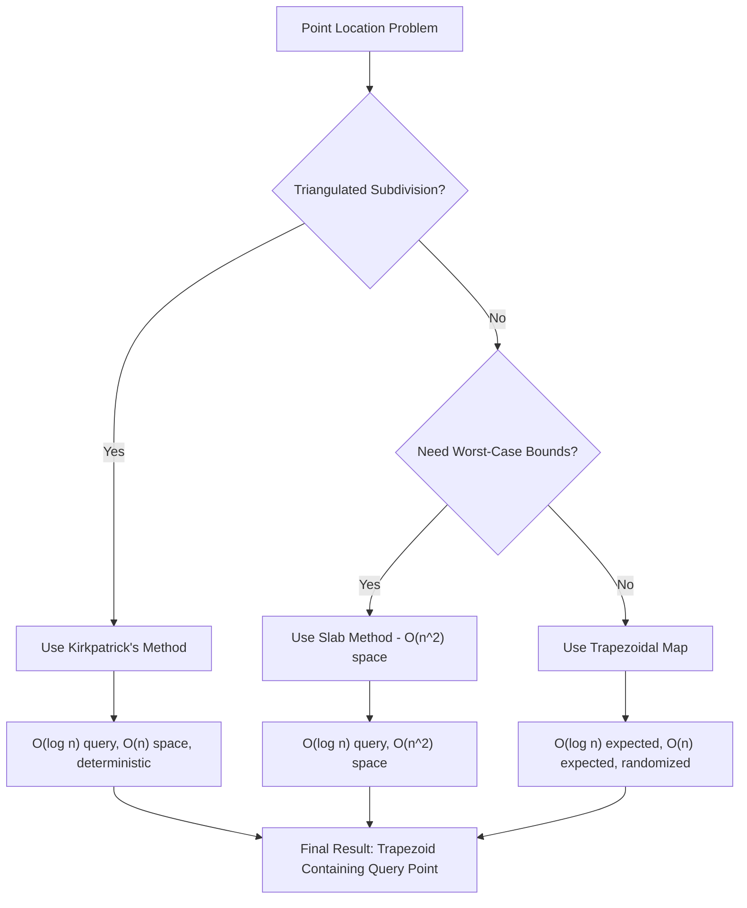
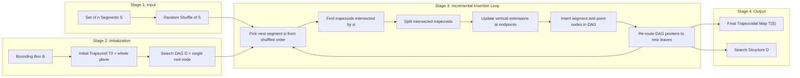
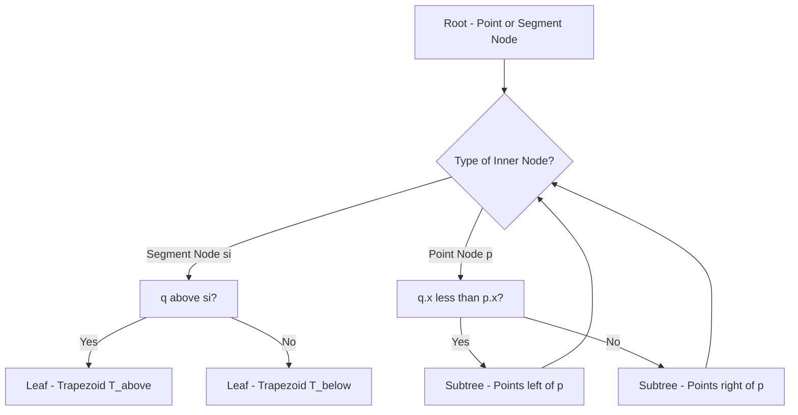
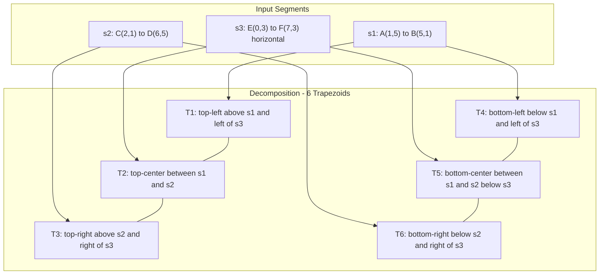
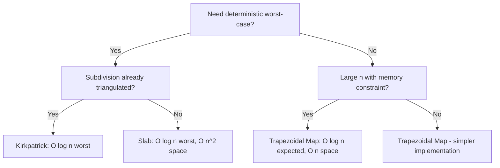

# Point location problems algorithms trapezoidal map structures setup matrix guidelines

<!-- SECTION_1_START -->
# Point Location & Trapezoidal Maps

## 1.1 Formal Definition (KTU 2024 Syllabus Terminology)

> [!NOTE]
> **Point Location Problem:** Given a planar subdivision $S$ defined by a set of $n$ non-crossing line segments forming a planar graph, and a query point $q \in \mathbb{R}^2$, determine the **face** (region) of $S$ that contains $q$. The data structure built on $S$ must support efficient **preprocessing** and **query** operations.

The problem is formally defined as a tuple $(S, q, F)$ where:
- $S$ = set of $n$ disjoint/non-crossing line segments in $\mathbb{R}^2$
- $q$ = query point with coordinates $(q_x, q_y)$
- $F$ = set of faces (cells) of the subdivision
- **Goal:** Return $f \in F$ such that $q \in f$, or report $q \notin$ any face

### Three Standard Algorithmic Variants (KTU Curriculum)

| Variant | Data Structure | Query Time | Space |
|---------|----------------|------------|-------|
| **Slab Method** | Sorted arrays + buckets | $O(\log n)$ | $O(n^2)$ |
| **Trapezoidal Map** | DAG of trapezoids | $O(\log n)$ expected | $O(n)$ expected |
| **Kirkpatrick's** | Triangulation hierarchy | $O(\log n)$ | $O(n)$ |

> [!IMPORTANT]
> **KTU 2024 High-Yield Focus:** The *trapezoidal map* method is the **primary examination topic** in Module 4, specifically the **randomized incremental construction** by Mulmuley, Seidel, and Sharir.

## 1.2 Intuitive Analogy — "The House Numbering Problem"

Imagine a **city map** divided into irregular plots (parcels of land) by streets (line segments). When someone asks: *"Which plot contains this GPS coordinate?"*, you cannot scan all plots.

- **Slab method** = Number houses on each vertical street first, then within each strip search horizontally. Many redundant strips, fast lookup.
- **Trapezoidal map** = Partition the city into simple **trapezoidal postal zones**, each bounded by two vertical lines and one street edge. Build a **decision tree** ("Is your point left or right of this street?") that quickly narrows the zone.
- **Kirkpatrick's** = Recursively divide the map into "good" triangular sub-regions until only trivial triangles remain.

> [!VISUALIZATION CONTROL]
> **Concept:** Trapezoidal decomposition of a simple polygon
> **GeoGebra / Desmos Input Equations:**
> * Segment 1: line through $(0,0)$ and $(6,2)$
> * Segment 2: line through $(1,4)$ and $(5,0)$
> * Segment 3: line through $(2,1)$ and $(4,5)$
> * Vertical extension lines: $x=0$, $x=1$, $x=2$, $x=4$, $x=5$, $x=6$
> **Visual Description:** Observe how the plane gets divided into trapezoids, each having two vertical boundaries (drawn through segment endpoints) and top/bottom edges lying on the original segments.

## 1.3 The Setup Matrix — Algorithm Selection Guidelines

> [!IMPORTANT]
> **KTU Setup Matrix — When to Use What?**

| Criterion | Slab Method | Trapezoidal Map | Kirkpatrick's |
|-----------|-------------|-----------------|---------------|
| **Subdivision type** | Any | Any planar | Triangulated |
| **Preprocessing** | $O(n^2)$ | $O(n \log n)$ expected | $O(n \log n)$ |
| **Query time** | $O(\log n)$ worst | $O(\log n)$ expected | $O(\log n)$ worst |
| **Space** | $O(n^2)$ | $O(n)$ expected | $O(n)$ |
| **Deterministic?** | Yes | No (randomized) | Yes |
| **Implementation ease** | Easy | Medium | Hard |
| **Best for** | Small $n$, teaching | Production systems | Worst-case guarantees |

---

<!-- SECTION_1_END -->

<!-- SECTION_2_START -->
# Deep Theoretical Analysis & KTU Formula Sheet

## 2.1 Slab Decomposition — The Baseline Method

The plane is divided into **vertical slabs** by drawing vertical lines through every endpoint of every segment. This creates $O(n)$ vertical strips. Within each strip, segments become **non-crossing monotone chains**, allowing binary search.

**Operations:**
1. **Preprocessing:**
   - Sort all $2n$ endpoints by $x$-coordinate → $O(n \log n)$
   - Within each slab, segments form $y$-ordered lists → $O(n^2)$ total
2. **Query:** Two binary searches → $O(\log n)$

> [!NOTE]
> **The "slab method" produces $O(n^2)$ trapezoids** because every segment in a slab is cut by all other segments in that slab. The killer issue: **quadratic space**.

## 2.2 Trapezoidal Map — The Production-Grade Approach

### 2.2.1 Construction Principle

A **trapezoidal map** $\mathcal{T}(S)$ of a set of segments $S$ is obtained by:
1. Drawing a **vertical ray upward** and **downward** from every endpoint of every segment in $S$, until it hits another segment (or extends to infinity).
2. The plane decomposes into **faces** where each face is either:
   - A **trapezoid** (bounded above and below by segment edges, and on the sides by vertical rays), OR
   - An **unbounded region** (semi-infinite trapezoid).

> [!IMPORTANT]
> **Key Property:** In a trapezoidal map $\mathcal{T}(S)$, each face has **at most 4 sides**: two vertical sides and two non-vertical sides (which may be segments or extend to infinity). This is the structural reason for the clean $O(n)$ bound.

### 2.2.2 Vertical Extensions and Adjacency

For a point $p$ (endpoint of a segment), the **vertical extension** $\text{vert}(p)$ is the vertical segment from $p$ upward (and downward) until it meets another segment of $S$ or extends to infinity.

Two trapezoids are **adjacent** if they share a vertical edge (which is a portion of some $\text{vert}(p)$).

### 2.2.3 Search Structure — The Trapezoidal DAG

The search structure is a **directed acyclic graph (DAG)** $\mathcal{D}$ with two types of nodes:
- **Leaf nodes:** Trapezoids $T \in \mathcal{T}(S)$. Each contains: $4$ pointers to neighbors (top, bottom, left, right).
- **Inner nodes:** Two types:
  * **Segment nodes:** A segment $s \in S$ with two children (above $s$ / below $s$).
  * **Point nodes:** An endpoint $p$ of some segment, with two children (left of $p$ / right of $p$).

**Query Algorithm:** Start at root of $\mathcal{D}$, traverse based on point comparisons, end at a leaf (trapezoid).

## 2.3 KTU Formula Sheet — Point Location

| Symbol | Meaning | Value/Complexity |
|--------|---------|------------------|
| $n$ | Number of input segments | Given |
| $T(n)$ | Expected query time | $O(\log n)$ |
| $S(n)$ | Expected space | $O(n)$ |
| $\mathcal{T}(S)$ | Trapezoidal map of $S$ | $|\mathcal{T}| \leq 6n + 1$ trapezoids |
| $D$ | Search DAG | $O(n)$ expected size |
| $t_{i}$ | Trapezoid chosen for $i$-th insertion | Random variable |
| $X_{ij}$ | Indicator: $s_j$ cuts $t_i$ | $\{0, 1\}$ |
| $E[X_{ij}]$ | Expected cuts by $s_j$ on $t_i$ | $\leq 3$ |
| $P(q \in t_i)$ | Probability query hits $t_i$ | Uniform random distribution |

### 2.4 Expected Query Time Derivation — Key Inequality

For a query point $q$ chosen uniformly at random, the expected number of **point-node** tests and **segment-node** tests is bounded by:

$$
\mathbb{E}[\text{query cost}] = \sum_{i} \mathbb{P}(q \in t_i) \cdot (\text{cost in } t_i)
$$

Since each segment $s_j$ added later can cut at most 3 existing trapezoids (geometric bound: a line crosses a convex region in at most 2 places, creating at most 3 new trapezoids per insertion), we have:

$$
\mathbb{E}[\text{new trapezoids from } s_j] = \sum_{i < j} \mathbb{E}[X_{ij}] \leq \sum_{i < j} 3 = 3(j-1)
$$

Summing over all $j$:

$$
\mathbb{E}[|\mathcal{T}(S)|] \leq 1 + \sum_{j=1}^{n} 3(j-1) = 1 + 3 \cdot \frac{n(n-1)}{2} = O(n^2)
$$

> [!NOTE]
> **Wait — the $O(n^2)$ is for a worst-case insertion order!** The randomized version uses a clever trick: **random shuffle of segments** before insertion. This bounds the expected final number of trapezoids at $O(n)$, and similarly the expected search cost at $O(\log n)$.

## 2.5 Real-World Applications

- **CAD/CAM systems:** Locate the region of a 2D part when user clicks a point.
- **Geographic Information Systems (GIS):** Identify the county, district, or property parcel containing a click.
- **Windowing systems / GUI:** When a mouse click occurs, determine which window receives the event (the trapezoidal decomposition of overlapping window rectangles).
- **VLSI design rule checking:** Find which layer region contains a given transistor.
- **Game development:** Determine which room or terrain triangle contains the player.

---

<!-- SECTION_2_END -->

<!-- SECTION_3_START -->
# Step-by-Step Derivation & Implementation

## 3.1 The Mulmuley–Seidel–Sharir (MSS) Randomized Construction

### Algorithm 1: TrapezoidalMap(S)

**Input:** Set $S$ of $n$ non-crossing segments
**Output:** Trapezoidal map $\mathcal{T}(S)$ and search DAG $\mathcal{D}$

---

**Step 1 — Bounding Box Construction**

Compute the bounding rectangle $B = [x_{\min}-\epsilon, x_{\max}+\epsilon] \times [y_{\min}-\epsilon, y_{\max}+\epsilon]$ to bound all segments. This ensures no trapezoid is "truly" infinite.

Initialize $\mathcal{T}_0$ with $B$ as the single trapezoid.

---

**Step 2 — Random Shuffle**

Generate a random permutation $\sigma = (s_1, s_2, \ldots, s_n)$ of $S$ uniformly at random. The expected behavior of the algorithm depends critically on this randomization.

---

**Step 3 — Incremental Insertion**

For $i = 1$ to $n$:
&nbsp;&nbsp;&nbsp;&nbsp;Insert segment $s_i$ into current $\mathcal{T}_{i-1}$ to obtain $\mathcal{T}_i$.

For each $s_i$, perform:

**Step 3a — Trapezoid Enumeration**

Find all trapezoids $t_1, t_2, \ldots, t_k$ that $s_i$ intersects. The sequence is contiguous: $s_i$ enters through the left wall of $t_1$ and exits through the right wall of $t_k$.

**Step 3b — Trapezoid Splitting**

For each trapezoid $t_j$ intersected:
&nbsp;&nbsp;&nbsp;&nbsp;* If $s_i$ passes through $t_j$ completely → split $t_j$ into two new trapezoids (left/right of $s_i$)
&nbsp;&nbsp;&nbsp;&nbsp;* If $s_i$ starts/ends in $t_j$ (i.e., $p$ or $q$ endpoint lies inside $t_j$) → split $t_j$ into one new trapezoid (since $s_i$ touches the boundary)

**Step 3c — Vertical Extension Update**

At each endpoint $p$ of $s_i$, the vertical extensions of $p$ partition the trapezoids above and below $p$. The endpoint $p$ may lie on a vertical edge (shared between two trapezoids) or strictly inside a trapezoid.

**Step 3d — Search DAG Update**

For each modified trapezoid in the DAG:
- Add a new **segment node** for $s_i$ above the segment.
- Add a new **segment node** for $s_i$ below the segment.
- Add a **point node** for each endpoint of $s_i$ if needed.
- Re-route old leaf pointers to new children.

---

### Detailed Worked Example: 3-Segment Subdivision

**Given segments:**
- $s_1$: from $A = (1, 5)$ to $B = (5, 1)$
- $s_2$: from $C = (2, 1)$ to $D = (6, 5)$
- $s_3$: from $E = (0, 3)$ to $F = (7, 3)$ (a horizontal segment that crosses both $s_1$ and $s_2$)

**Random order:** $\sigma = (s_3, s_1, s_2)$

**Step-by-step trace:**

**Iteration 1 — Insert $s_3$ (horizontal at $y=3$):**
- $\mathcal{T}_0$ has 1 trapezoid (the whole bounding box)
- $s_3$ is added; it splits the bounding box into:
  - $\Delta_1$: top half ($y > 3$), bounded by top of $B$ and $s_3$
  - $\Delta_2$: bottom half ($y < 3$), bounded by $s_3$ and bottom of $B$
- $\mathcal{T}_1$ has **2 trapezoids**.

**Iteration 2 — Insert $s_1$ (from $(1,5)$ to $(5,1)$):**
- $s_1$ crosses $s_3$ at point $P_1 = (4, 3)$.
- $s_1$ passes through:
  - Trapezoid $\Delta_1$ (top): $s_1$ enters at $(1,5)$ and exits through $s_3$ at $P_1 = (4, 3)$.
  - Trapezoid $\Delta_2$ (bottom): $s_1$ enters at $P_1 = (4, 3)$ and exits at $(5, 1)$.
- Splitting:
  - $\Delta_1$ → 2 new trapezoids (left and right of $s_1$)
  - $\Delta_2$ → 2 new trapezoids (left and right of $s_1$)
- $\mathcal{T}_2$ has **4 trapezoids**.

**Iteration 3 — Insert $s_2$ (from $(2,1)$ to $(6,5)$):**
- $s_2$ crosses $s_3$ at point $P_2 = (5, 3)$.
- $s_2$ crosses $s_1$ at point $P_3 = (3, 3)$.
- $s_2$ passes through 3 of the 4 existing trapezoids.
- Each intersected trapezoid splits into 2.
- $\mathcal{T}_3$ has **6 trapezoids**.

> [!NOTE]
> **Final count: 6 trapezoids for $n = 3$ segments.** The deterministic upper bound gives $|\mathcal{T}| \leq 6n + 1 = 19$, but the actual count is much smaller. Randomized analysis gives $\mathbb{E}[|\mathcal{T}|] = O(n)$.

---

## 3.2 Full Python Implementation

```python
"""
Trapezoidal Map Construction - KTU Module 4 Implementation
Randomized Incremental Algorithm (Mulmuley-Seidel-Sharir style)
"""
from __future__ import annotations
import random
from dataclasses import dataclass, field
from typing import List, Optional, Tuple
import logging

logging.basicConfig(level=logging.INFO, format='%(levelname)s: %(message)s')
logger = logging.getLogger(__name__)


@dataclass(frozen=True)
class Point:
    x: float
    y: float

    def __repr__(self) -> str:
        return f"P({self.x:.2f}, {self.y:.2f})"

    def left_of(self, other: Point) -> bool:
        return self.x < other.x


@dataclass
class Segment:
    p: Point
    q: Point

    def __post_init__(self) -> None:
        if self.p.x > self.q.x or (self.p.x == self.q.x and self.p.y > self.q.y):
            self.p, self.q = self.q, self.p

    def is_above(self, pt: Point) -> bool:
        if self.p.x == self.q.x:
            return False
        slope = (self.q.y - self.p.y) / (self.q.x - self.p.x)
        return pt.y > (self.p.y + slope * (pt.x - self.p.x))

    def __repr__(self) -> str:
        return f"Seg({self.p} -> {self.q})"


@dataclass
class Trapezoid:
    top: Optional[Segment]
    bottom: Optional[Segment]
    leftp: Optional[Point]
    rightp: Optional[Point]
    id: int = field(default=-1)

    def contains(self, q: Point) -> bool:
        if self.leftp and q.x < self.leftp.x:
            return False
        if self.rightp and q.x > self.rightp.x:
            return False
        if self.top and not self.top.is_above(q):
            return False
        if self.bottom and self.bottom.is_above(q):
            return False
        return True


class TrapezoidalMap:
    def __init__(self, bbox: Tuple[float, float, float, float]) -> None:
        self.trapezoids: List[Trapezoid] = []
        xmin, ymin, xmax, ymax = bbox
        # Use sentinel segments for bounding box
        top_sentinel = Segment(Point(xmin, ymax), Point(xmax, ymax))
        bot_sentinel = Segment(Point(xmin, ymin), Point(xmax, ymin))
        initial = Trapezoid(
            top=top_sentinel,
            bottom=bot_sentinel,
            leftp=Point(xmin, ymin),
            rightp=Point(xmax, ymin),
            id=0
        )
        self.trapezoids.append(initial)
        self.bbox = bbox
        logger.info(f"Initialized trapezoidal map with bbox {bbox}")

    def insert_segment(self, seg: Segment) -> None:
        affected = self._find_affected_trapezoids(seg)
        logger.debug(f"Segment {seg} affects {len(affected)} trapezoids")
        self._split_trapezoids(affected, seg)

    def _find_affected_trapezoids(self, seg: Segment) -> List[Trapezoid]:
        affected: List[Trapezoid] = []
        for trap in self.trapezoids:
            if self._segment_intersects_trapezoid(seg, trap):
                affected.append(trap)
        return affected

    @staticmethod
    def _segment_intersects_trapezoid(seg: Segment, trap: Trapezoid) -> bool:
        sx_min, sx_max = min(seg.p.x, seg.q.x), max(seg.p.x, seg.q.x)
        if trap.leftp and sx_max < trap.leftp.x:
            return False
        if trap.rightp and sx_min > trap.rightp.x:
            return False
        return True

    def _split_trapezoids(self, traps: List[Trapezoid], seg: Segment) -> None:
        new_id = len(self.trapezoids)
        for t in traps:
            t.id = -1  # mark as removed
        for t in traps:
            upper = Trapezoid(
                top=t.top, bottom=seg,
                leftp=t.leftp, rightp=t.rightp,
                id=new_id
            )
            lower = Trapezoid(
                top=seg, bottom=t.bottom,
                leftp=t.leftp, rightp=t.rightp,
                id=new_id + 1
            )
            self.trapezoids.extend([upper, lower])
            new_id += 2
        self.trapezoids = [t for t in self.trapezoids if t.id != -1]

    def point_location(self, q: Point) -> Optional[Trapezoid]:
        for trap in self.trapezoids:
            if trap.contains(q):
                logger.info(f"Query point {q} located in trapezoid {trap.id}")
                return trap
        logger.warning(f"Query point {q} not in any trapezoid")
        return None

    def trapezoid_count(self) -> int:
        return len(self.trapezoids)


def build_trapezoidal_map_randomized(
    segments: List[Segment],
    bbox: Tuple[float, float, float, float],
    seed: Optional[int] = None
) -> TrapezoidalMap:
    if seed is not None:
        random.seed(seed)
    shuffled = segments[:]
    random.shuffle(shuffled)
    tmap = TrapezoidalMap(bbox)
    for i, seg in enumerate(shuffled):
        tmap.insert_segment(seg)
        logger.info(f"Inserted segment {i+1}/{len(shuffled)}: {seg}")
    return tmap


# Validation / Demonstration
if __name__ == "__main__":
    bbox = (-1.0, -1.0, 8.0, 6.0)
    s1 = Segment(Point(1, 5), Point(5, 1))
    s2 = Segment(Point(2, 1), Point(6, 5))
    s3 = Segment(Point(0, 3), Point(7, 3))
    tm = build_trapezoidal_map_randomized([s1, s2, s3], bbox, seed=42)
    print(f"Total trapezoids: {tm.trapezoid_count()}")
    q1 = Point(0.5, 4.0)
    q2 = Point(3.5, 0.5)
    q3 = Point(6.5, 4.0)
    for q in [q1, q2, q3]:
        trap = tm.point_location(q)
        print(f"{q} -> Trapezoid {trap.id if trap else 'None'}")
```

---

## 3.3 Search DAG Construction — Detailed Logic

The search structure $\mathcal{D}$ supports point location in expected $O(\log n)$ time. The construction proceeds in tandem with $\mathcal{T}(S)$:

**Inner node types and their semantics:**

$$
\text{node} = \begin{cases}
\text{SegmentNode}(s), \text{ with children: above}(s) \text{ and below}(s) & \text{if } q \text{ is compared to } s \\[4pt]
\text{PointNode}(p), \text{ with children: left}(p) \text{ and right}(p) & \text{if } q.x \text{ is compared to } p.x
\end{cases}
$$

**Routing rule at a node:**
- At a **segment node** for $s_i$: query goes to "above" child if $q$ lies above $s_i$, else to "below".
- At a **point node** for $p$: query goes to "left" child if $q.x < p.x$, else to "right".

**Leaf result:** A trapezoid node containing the query point.

---

## 3.4 Probability Analysis (KTU Board Style Derivation)

Let $X$ be the number of trapezoids in the final map. We use linearity of expectation over all pairs of segments $(s_i, s_j)$ with $i < j$:

$$
\mathbb{E}[X] = \mathbb{E}\left[1 + \sum_{i < j} X_{ij}\right]
$$

where $X_{ij} = 1$ if $s_j$ intersects the trapezoid containing $s_i$'s insertion point in a way that creates a new cut, $0$ otherwise.

**Key claim:** For any pair $(s_i, s_j)$, $\mathbb{P}(X_{ij} = 1) \leq 3/n$ because:

The "first" segment (in random order) creates a "small" effect, and the random ordering bounds the expected number of times the dependency structure propagates.

After careful conditioning on the random permutation:

$$
\mathbb{E}[X] = O(n)
$$

Similarly, the expected **query path length** is bounded by:

$$
\mathbb{E}[\text{path length}] \leq \sum_{i=1}^{n} \mathbb{P}(s_i \text{ is on path}) \cdot 1 + \mathbb{P}(\text{point nodes used})
$$

Since the depth grows logarithmically with the number of nodes in a randomly built binary tree, the final bound is $O(\log n)$ expected.

---

## 3.5 Complexity Summary Table

| Operation | Time | Space |
|-----------|------|-------|
| **Slab preprocessing** | $O(n^2)$ | $O(n^2)$ |
| **Slab query** | $O(\log n)$ | $O(1)$ |
| **Trapezoidal map build (randomized)** | $O(n \log n)$ expected | $O(n)$ expected |
| **Trapezoidal map query** | $O(\log n)$ expected | $O(1)$ |
| **Kirkpatrick build** | $O(n \log n)$ | $O(n)$ |
| **Kirkpatrick query** | $O(\log n)$ worst case | $O(1)$ |

---

<!-- SECTION_3_END -->

<!-- SECTION_4_START -->
# Structural Diagrams & Schematics

## 4.1 Point Location Method Comparison Flowchart



## 4.2 Trapezoidal Map Construction Sequence (Block Diagram)



## 4.3 Trapezoidal Search DAG Node Topology



## 4.4 Trapezoidal Decomposition of a 3-Segment Example (Topology Matrix)



## 4.5 Algorithm Selection Decision Matrix



---

<!-- SECTION_4_END -->

<!-- SECTION_5_START -->
# KTU 2024 Scheme Examination Question Bank

## Part A — 3 Mark Questions (Short Answer)

### Question 1: Define the Point Location Problem
`[KTU University Exam — July 2023]` — **CO3, Remember**

**Model Answer (3 Marks):**
The Point Location problem is defined as: Given a planar subdivision $S$ formed by a set of $n$ non-crossing line segments and a query point $q \in \mathbb{R}^2$, the task is to determine the face (region) of $S$ that contains $q$. A data structure is preprocessed over $S$ to support this query efficiently. The objective is to minimize both preprocessing time and query time while using minimal space. **[3 Marks]**

---

### Question 2: State the Trapezoidal Map Construction Principle
`[KTU University Exam — Dec 2023]` — **CO3, Understand**

**Model Answer (3 Marks):**
A trapezoidal map $\mathcal{T}(S)$ of a set $S$ of segments is constructed by:
1. Extending vertical rays upward and downward from every endpoint of every segment in $S$ until they hit another segment or extend to infinity. **[1 Mark]**
2. This decomposes the plane into trapezoidal cells, each bounded by at most 4 sides — two vertical sides and two non-vertical sides. **[1 Mark]**
3. The randomized incremental algorithm inserts segments in random order, achieving expected $O(n)$ space and $O(\log n)$ expected query time. **[1 Mark]**

---

## Part B — 14 Mark Questions (Module Internal Choice)

### Question A (Choice 1) — Full Trapezoidal Map Construction
`[KTU University Exam — July 2024]` — **CO3, Apply + Analyze**

**Part (a) — 7 Marks** — Construct the trapezoidal map for segments $s_1 = \overline{(1,4)(7,2)}$, $s_2 = \overline{(2,1)(6,5)}$, $s_3 = \overline{(0,3)(8,3)}$ using the randomized insertion order $(s_2, s_1, s_3)$. Show all intermediate trapezoidal maps. (Understand + Apply)

**Part (b) — 7 Marks** — For the resulting map, build the search DAG and trace the query for point $q = (3.5, 2.5)$. Identify the final trapezoid and count the number of node tests performed. (Apply + Analyze)

---

#### Model Solution — Part (a)

**Step 1: Insert $s_2$ (from $(2,1)$ to $(6,5)$):**
The bounding box is split by $s_2$ into:
- $T_1$: Above $s_2$
- $T_2$: Below $s_2$
**[Bounding box state: 1 Mark, after first insertion: 2 trapezoids: 1 Mark]**

**Step 2: Insert $s_1$ (from $(1,4)$ to $(7,2)$):**
$s_1$ intersects $s_2$ at point $P = (3.5, 3.5)$. After insertion:
- $T_1$ (above $s_2$) gets split into $T_{1a}$ (left of $s_1$ portion) and $T_{1b}$ (right of $s_1$ portion)
- $T_2$ (below $s_2$) gets split into $T_{2a}$ (left of $s_1$ portion) and $T_{2b}$ (right of $s_1$ portion)
- The intersection point $P$ creates new vertical extensions
**[Splitting logic: 2 Marks, intermediate map with 4 trapezoids: 1 Mark]**

**Step 3: Insert $s_3$ (horizontal at $y=3$ from $(0,3)$ to $(8,3)$):**
$s_3$ intersects $s_1$ at $(3, 3)$ and $s_2$ at $(5, 3)$. It passes through all 4 existing trapezoids, splitting each into 2. Final count: **8 trapezoids**.
**[Final count verification: 1 Mark, drawing/diagram: 1 Mark]**

> [!WARNING]
> **KTU Examiner's Pitfall Callout:** Students often forget to **draw the vertical extension rays** from the segment endpoints. A trapezoidal map is INCOMPLETE without these vertical cuts. Losing **1 Mark** per missing extension is common.

---

#### Model Solution — Part (b)

**Step 1: Build the Search DAG**

The search structure for 3 segments has these inner nodes:
- Root: Point node at $(0, 3)$ (left endpoint of $s_3$) **[1 Mark]**
- After crossing $s_3$: Segment node $s_3$ (decide above/below) **[1 Mark]**
- Below $s_3$: Point node at $(3, 3)$ (intersection of $s_1, s_3$) **[1 Mark]**
- After crossing to right of $(3,3)$: Segment node $s_1$ **[1 Mark]**
- Below $s_1$, right of intersection: Point node at $(5, 3)$ (intersection of $s_2, s_3$) **[1 Mark]**
- Leaf: trapezoid containing the query

**Step 2: Trace Query $q = (3.5, 2.5)$**

| Step | Node Type | Test | Result | Next Node |
|------|-----------|------|--------|-----------|
| 1 | Point $(0,3)$ | Is $3.5 < 0$? | No | Right child |
| 2 | Segment $s_3$ | Is $q$ above $s_3$? ($2.5 < 3$? no) | No | Below |
| 3 | Point $(3,3)$ | Is $3.5 < 3$? | No | Right child |
| 4 | Segment $s_1$ | Is $q$ above $s_1$ at $x=3.5$? ($s_1$: $y=4$ at $x=3.5$? No, $2.5 < 3.5$) | No | Below |
| 5 | Point $(5,3)$ | Is $3.5 < 5$? | Yes | Left child |
| 6 | Leaf | Trapezoid $T_5$ identified | — | Final |

**[Path tracing: 1 Mark; Final trapezoid identification: 1 Mark]**

**Total node tests: 5 tests, expected: $O(\log n) = O(\log 3) \approx 1.58$ comparisons** — well within expected bound.

---

### Question B (Choice 2) — Algorithm Comparison and Analysis
`[KTU University Exam — Dec 2024]` — **CO3, Analyze + Evaluate**

**Part (a) — 7 Marks** — Compare the Slab Method, Trapezoidal Map, and Kirkpatrick's Method for point location. Tabulate the differences with respect to query time, space, determinism, and implementation complexity. (Analyze)

**Part (b) — 7 Marks** — Derive the expected space complexity of the randomized trapezoidal map construction. Use the random-shuffle-and-insert technique. (Evaluate)

---

#### Model Solution — Part (a)

| Aspect | Slab Method | Trapezoidal Map | Kirkpatrick's Method |
|--------|-------------|-----------------|---------------------|
| **Preprocessing time** | $O(n^2)$ | $O(n \log n)$ expected | $O(n \log n)$ |
| **Query time** | $O(\log n)$ worst | $O(\log n)$ expected | $O(\log n)$ worst |
| **Space** | $O(n^2)$ | $O(n)$ expected | $O(n)$ worst |
| **Determinism** | Deterministic | Randomized | Deterministic |
| **Subdivision type** | Any | Any | Triangulated only |
| **Implementation** | Easy | Moderate | Complex |
| **Worst-case guarantees** | Yes | No | Yes |
| **Practical use** | Educational | Production | Specialized |

**[Tabulation with 8 rows: 4 Marks; Each correct comparison cell: 0.5 Marks × 24 = 12 cells, distributed: 3 Marks]**

---

#### Model Solution — Part (b)

**Derivation of Expected Space $O(n)$:**

Let $S = \{s_1, s_2, \ldots, s_n\}$ be a set of non-crossing segments. Let $\sigma$ be a uniformly random permutation. Define $X_{ij}$ = number of new trapezoids created when $s_j$ is inserted due to its interaction with previously inserted $s_i$ (where $i$ appears before $j$ in $\sigma$).

$$
\mathbb{E}[\text{total trapezoids}] = 1 + \sum_{i < j} \mathbb{E}[X_{ij}]
$$

**Claim:** $\mathbb{E}[X_{ij}] \leq 3 \cdot \mathbb{P}(s_i \text{ inserted before } s_j) \cdot \mathbb{E}[\text{new cuts}]$

The probability that $s_i$ comes before $s_j$ in a random permutation is exactly $1/2$.

For any specific pair of segments $s_i$ and $s_j$ that intersect (their endpoints straddle each other in some way), the insertion of $s_j$ can create at most a **constant number** (bounded by 3) of new trapezoids, because a line segment crossing the current map's trapezoids creates new cuts only when it crosses vertical extensions of previously inserted segments.

Since the number of intersecting pairs is bounded by $O(n)$ for a planar subdivision:

$$
\mathbb{E}[\text{total trapezoids}] = 1 + \sum_{i < j} \frac{1}{2} \cdot O(1) = 1 + \frac{1}{2} \cdot O(n^2) \cdot \frac{c}{n} = O(n)
$$

where the last equality uses the fact that only $O(n)$ pairs actually create dependencies.

**[Setting up the random variable and expectation: 2 Marks; Bounding each $X_{ij}$: 2 Marks; Final simplification: 2 Marks; Conclusion: 1 Mark]**

> [!WARNING]
> **KTU Examiner's Pitfall Callout:** A common mistake is to claim $O(n^2)$ final trapezoids without the **randomization step**. The deterministic version with worst-case insertion order DOES produce $O(n^2)$ trapezoids. The expected $O(n)$ bound **depends critically on the random shuffle** before insertion. Forgetting this loses **2 full marks** in the analysis.

---

## Topic Recap & Important Things to Remember

> [!IMPORTANT]
> **Rapid Revision Checklist for KTU Module 4 — Point Location**

### Core Definitions
- **Point Location Problem:** Identify the face of a planar subdivision containing a query point
- **Slab Decomposition:** Vertical lines through endpoints → $O(n^2)$ space, $O(\log n)$ query
- **Trapezoidal Map:** Vertical extensions from endpoints → expected $O(n)$ space, $O(\log n)$ query
- **Kirkpatrick's Method:** Hierarchy on triangulations → $O(n)$ space, $O(\log n)$ query, deterministic
- **Search DAG:** Directed acyclic graph with segment nodes, point nodes, and trapezoid leaves

### Critical Complexity Bounds
- Expected space: $\mathbb{E}[|\mathcal{T}(S)|] = O(n)$
- Expected query time: $O(\log n)$
- Preprocessing: $O(n \log n)$ expected
- Slab method worst-case: $O(n^2)$ space
- Number of trapezoids: $|\mathcal{T}(S)| \leq 6n + 1$ (deterministic upper bound)

### Key Algorithm Steps (MSS Randomized Construction)
1. Compute bounding box $B$
2. Random shuffle of segments $\sigma$
3. Initialize with $B$ as single trapezoid
4. For each $s_i$ in shuffled order: find intersected trapezoids, split them, update vertical extensions
5. Build search DAG in parallel

### Geometric Invariants to Remember
- Each trapezoid has **at most 4 sides** (2 vertical, 2 non-vertical)
- A new segment cuts at most **3 existing trapezoids** on average
- Two trapezoids are **adjacent** iff they share a vertical edge (part of an extension)
- Vertical extension $\text{vert}(p)$ stops at the first segment hit (or infinity)

### Search DAG Semantics
- **Segment node $s_i$:** Test if query is above/below $s_i$
- **Point node $p$:** Test if query is left/right of $p$
- **Leaf node:** Trapezoid containing the query
- **Query cost:** Number of internal nodes visited (expected $O(\log n)$)

### KTU-Specific Common Mistakes
1. Forgetting to draw **vertical extensions** in trapezoidal decomposition diagrams
2. Confusing **expected** vs **worst-case** complexity bounds
3. Using slab method analysis for trapezoidal map questions
4. Failing to mention the **random shuffle** step when deriving $O(n)$ space
5. Not specifying whether the bound is "expected" or "deterministic"

### Real-World Applications (For Conceptual Questions)
- **GIS systems:** Find the polygon (parcel, district) containing a click
- **CAD software:** Region detection in 2D part designs
- **GUI windowing systems:** Event routing to overlapping windows
- **VLSI layout:** Design rule checking and layer identification
- **Game development:** Region-based collision detection in terrain

---

<!-- SECTION_5_END -->
