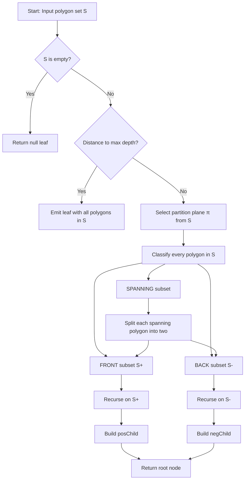
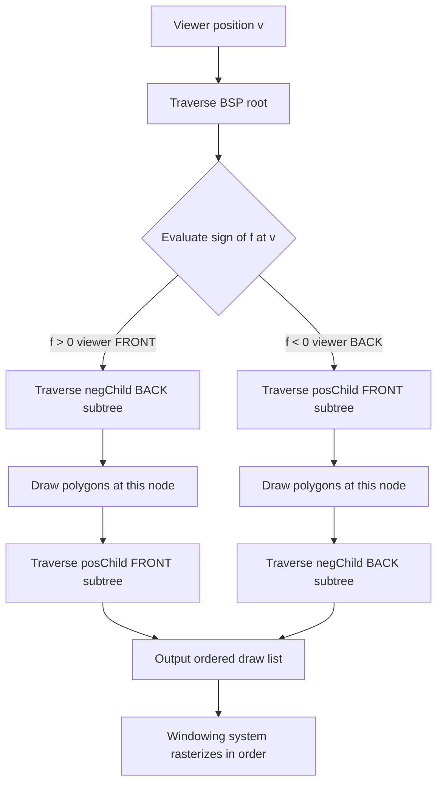
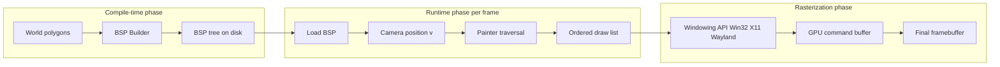
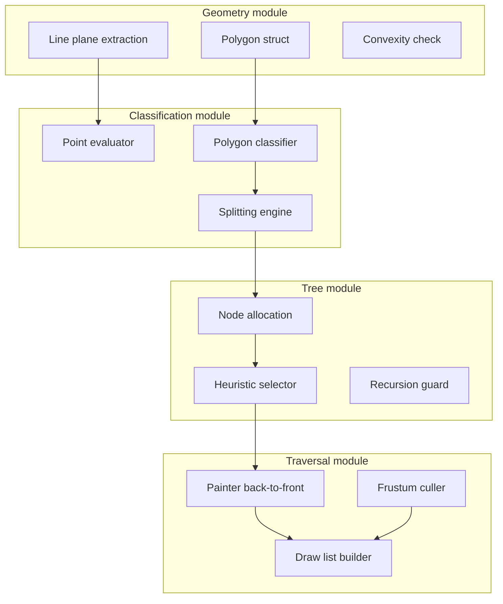

# Windowing systems calculations binary space partitioning (BSP) trees implementations models

<!-- SECTION_1_START -->
# Computational Geometry — Module 4: BSP Trees in Windowing Systems

> [!NOTE]
> **KTU 2024 Scheme — PECST408 | Module 4 Focus**
> This module targets the application of **Binary Space Partitioning (BSP)** trees in rendering pipelines and windowing systems. The structure is a board-favourite because it bridges pure geometry, hierarchical data structures, and real-time graphics.

---

## 1.1 Formal Definition (KTU Syllabus Terminology)

> [!IMPORTANT]
> **Definition — Binary Space Partitioning (BSP) Tree**
> A **Binary Space Partitioning Tree** is a hierarchical, recursive data structure that decomposes a $d$-dimensional Euclidean space $\mathbb{R}^{d}$ into a collection of **convex subspaces** by repeatedly inserting $(d-1)$-dimensional **partitioning hyperplanes**. Each internal node represents a hyperplane, and the two children correspond to the **positive half-space** and **negative half-space** induced by that hyperplane. Leaf nodes contain the geometric primitives (line segments in 2D, polygons in 3D) that lie entirely within the final convex region.

For a 2D scene the hyperplanes collapse to **lines**; for the 3D windowing pipeline they become **planes** — the case that practically drives all modern rendering engines.

### Geometric Components Used in BSP

| Symbol | Meaning | KTU Notation |
| :--- | :--- | :--- |
| $H$ | Partitioning hyperplane | $H : \mathbf{n} \cdot \mathbf{x} + d = 0$ |
| $H^{+}$ | Positive half-space | $\mathbf{n} \cdot \mathbf{x} + d > 0$ |
| $H^{-}$ | Negative half-space | $\mathbf{n} \cdot \mathbf{x} + d < 0$ |
| $\mathcal{S}$ | Input set of primitives | $\mathcal{S} = \{p_1, p_2, \dots, p_n\}$ |
| $v$ | Viewpoint (camera position) | $v \in \mathbb{R}^{3}$ |

---

## 1.2 Intuitive Overview — "The Room Divider" Analogy

> [!TIP]
> **Analogy — Cutting a Birthday Cake with a Knife**
> Imagine a 3D scene as a large rectangular **block of cake**. To decide which piece of icing (polygon) is in front of which, you take a long thin knife and slice the cake along a chosen plane. Everything on the *left* of the knife goes into the *left box*; everything on the *right* goes into the *right box*. Now you repeat the process on each box with a *new* knife angle, until every box contains icing pieces that cannot possibly overlap with pieces in any other box.
>
> The **knife angles and cut history** form the BSP tree, and the **boxes** are the leaves. Once built, no matter where you stand in the room (camera), you can ask: *which box am I in?* — and traverse the tree to render the scene back-to-front, eliminating hidden surfaces without a depth buffer.

This is exactly how id Software's **Doom (1993)** and **Quake (1996)** engines built the first fully BSP-rendered 3D worlds on consumer hardware.

---

## 1.3 GeoGebra / Desmos Visualization (2D BSP Construction)

> [!VISUALIZATION CONTROL]
> **Concept:** BSP tree cutting a 2D square with 4 lines, producing 5 convex regions.
> **GeoGebra / Desmos Input Equations:**
> * $L_1 : x = 0$
> * $L_2 : y = 0$
> * $L_3 : y = x$
> * $L_4 : y = -x + 3$
> * $f(x) = \text{sign}(\text{pointP}, \text{line})$
> **Visual Description:** The student should observe that the square is progressively sliced into convex polygons. As each line is inserted, the number of regions increases according to the **Euler planar formula** $R = n^2 + n + 2$ for $n$ lines in general position.

---

## 1.4 Windowing System Context (Where BSP Lives)

> [!IMPORTANT]
> **Where BSP Trees Sit in a Windowing/Rendering Pipeline**
> 1. World geometry (walls, sprites) is converted into a **BSP at compile time**.
> 2. At **runtime**, the camera viewpoint $v$ traverses the tree in $O(\log n)$ decisions.
> 3. The tree outputs a **back-to-front (or front-to-back) draw order**.
> 4. The windowing system (Win32, X11, Wayland, Vulkan swapchain) rasterizes polygons in that order using the **Painter's Algorithm**.

This eliminates the need for an expensive **Z-buffer** on legacy hardware — historically the *only* way to achieve 30+ FPS in software-rendered 3D.

<!-- SECTION_1_END -->

<!-- SECTION_2_START -->
# Deep Theoretical Analysis & KTU High-Yield Formula Sheet

---

## 2.1 BSP Tree Anatomy — Node Structure

A BSP node $u$ in a **3D scene** contains the following record:

$$
u = \big( \text{plane}(u),\ \text{posChild}(u),\ \text{negChild}(u),\ \text{polys}(u) \big)
$$

* **Internal node:** carries a plane $\pi_u : \mathbf{n}_u \cdot \mathbf{x} + d_u = 0$ and two child pointers.
* **Leaf node:** carries the list of polygons that lie entirely in the convex subspace and *cannot* be split further without increasing polygon count.

### Polygon Classification Function

For a polygon $P$ with respect to a plane $\pi$, the classifier returns one of four labels:

$$
\text{classify}(P, \pi) =
\begin{cases}
\text{FRONT} & \text{if } \forall \mathbf{p} \in P, \ \mathbf{n}_\pi \cdot \mathbf{p} + d_\pi > \varepsilon \\[4pt]
\text{BACK}  & \text{if } \forall \mathbf{p} \in P, \ \mathbf{n}_\pi \cdot \mathbf{p} + d_\pi < -\varepsilon \\[4pt]
\text{SPANNING} & \text{otherwise (crosses } \pi \text{)} \\[4pt]
\text{COPLANAR} & \text{if } \forall \mathbf{p} \in P, \ \vert \mathbf{n}_\pi \cdot \mathbf{p} + d_\pi \vert \le \varepsilon
\end{cases}
$$

> [!NOTE]
> **Sign Convention**
> KTU board answers should always declare the sign convention: FRONT = positive half-space, BACK = negative half-space. The **floating-point tolerance** $\varepsilon$ (typically $10^{-6}$) prevents flicker on coplanar polygons.

---

## 2.2 BSP Construction — The Recursive Algorithm

**Algorithm 2.2.1 — BuildBSP($\mathcal{S}$, depth)**
*Input:* Set of polygons $\mathcal{S}$, current recursion depth.
*Output:* Root of a BSP tree covering $\mathcal{S}$.

1. If $\mathcal{S} = \emptyset$ → return `null`.
2. If $\mathcal{S}$ contains a *single* polygon → return a leaf with that polygon.
3. **Heuristic Selection:** Choose a partition plane $\pi$ from $\mathcal{S}$ (see §2.3).
4. Partition $\mathcal{S}$ into:
   * $\mathcal{S}^{+} = \{ P \in \mathcal{S} : \text{classify}(P, \pi) = \text{FRONT} \}$
   * $\mathcal{S}^{-} = \{ P \in \mathcal{S} : \text{classify}(P, \pi) = \text{BACK} \}$
   * $\mathcal{S}^{\pm} = \{ P \in \mathcal{S} : \text{classify}(P, \pi) = \text{SPANNING} \}$
5. **Split** each spanning polygon $P$ into $P^{+}$ and $P^{-}$. Insert $P^{+}$ into $\mathcal{S}^{+}$ and $P^{-}$ into $\mathcal{S}^{-}$.
6. Create node $u$ storing $\pi$. Recurse:
   * $\text{posChild}(u) \leftarrow \text{BuildBSP}(\mathcal{S}^{+}, \text{depth}+1)$
   * $\text{negChild}(u) \leftarrow \text{BuildBSP}(\mathcal{S}^{-}, \text{depth}+1)$
7. Return $u$.

### Termination & Depth Control

* **Maximum depth $D_{\max}$:** stops recursion to prevent splitting cascades. A common choice is $D_{\max} = 16$ (Doom engine).
* **Minimum polygon count $N_{\min}$:** if a region has $\le N_{\min}$ polygons, stop and emit a leaf. $N_{\min} = 8$ is a common balance.

---

## 2.3 Plane-Selection Heuristics (Board-Favourite)

| Heuristic | Idea | Balance | Cost |
| :--- | :--- | :--- | :--- |
| **Random** | Pick any polygon | Poor | $O(1)$ |
| **Median-of-Polygons** | Pick polygon with median number of splits | Good | $O(n \log n)$ to sort |
| **Balanced-Sum** | Minimize $\big(\,n^{+} + n^{-}\,\big)$ — total polygons after split | Excellent | $O(n^2)$ |
| **Weighted-Sum** | $\alpha \cdot n^{+} + \beta \cdot n^{-}$ where $\alpha+\beta=1$ | Tunable | $O(n^2)$ |
| **Hagedorn-Salmon (BSB)** | Minimize weighted *area* imbalance | Best in practice | $O(n^2)$ |

> [!TIP]
> **Most Common Board Question**
> *"Explain the difference between Auto-Partitioning and Balanced BSP Trees."*
> * **Auto-Partitioning:** all input polygons are *eligible* to act as splitting planes.
> * **Balanced:** only a *subset* (or bounding boxes) is used to enforce height balance.
> The trade-off is **tree quality vs. polygon count growth** from excessive splitting.

---

## 2.4 KTU Formula Sheet — BSP & Windowing

> [!IMPORTANT]
> All values below are **high-yield** for the 3-mark and 14-mark questions. Memorize the units.

| \# | Formula / Quantity | Statement | Typical Unit |
| :--- | :--- | :--- | :--- |
| 1 | $T_{\text{build}} = O(n^2)$ | Naive BSP construction in 2D/3D | seconds |
| 2 | $T_{\text{build,avg}} = O(n \log n)$ | Average case with random heuristic | seconds |
| 3 | $T_{\text{traverse}} = O(n + k)$ | Output-sensitive traversal | comparisons |
| 4 | $H_{\text{tree}} \le n-1$ | Worst-case height of BSP with $n$ polygons | edges |
| 5 | $R_{\text{regions}} = n^2 + n + 2$ | Planar regions from $n$ lines in general position | regions |
| 6 | $A_{\text{split}} = O(\sum P_i)$ | Total polygon area *increases* by splits | sq. units |
| 7 | $S_{\text{overdraw}} = \sum_{i=1}^{k} A_i$ | Sum of over-drawn pixel areas | pixels |
| 8 | $V_{\text{vis}} = \big(\, \tfrac{V_{\text{behind}}}{V_{\text{total}}} \,\big) \cdot 100\%$ | Fraction of polygons culled | percent |
| 9 | $z_{\text{draw}} = \arg\max_{P} \big(\mathbf{n}_P \cdot v\big)$ | Painter's draw order key (back-to-front) | depth units |
| 10 | $\varepsilon = 10^{-6}$ | Floating-point tolerance for coplanar tests | unitless |

> [!WARNING]
> In the table above, every vertical bar is rendered as $\vert$ or $\mid$ — **never** the raw `|` character — to prevent markdown table corruption.

---

## 2.5 Why BSP for Windowing? — Engineering Utility

| Real-World Domain | Use of BSP | Reason |
| :--- | :--- | :--- |
| **3D Game Engines (Quake, Half-Life, Doom 3)** | Visibility pre-computation | Painter's algo is *order-independent of geometry complexity* |
| **CAD / CAM (AutoCAD, SolidWorks)** | Boolean operations on solids | BSP allows robust CSG with $O(\log n)$ point-location |
| **Robotics (motion planning)** | Collision-free path search | Tree prunes half the space at each step |
| **VR / AR headsets** | Real-time culling at 90 Hz | Cheap per-frame frustum test |
| **Ray Tracing accelerators** | KD-tree (BSP variant) | Same hierarchical principle with axis-aligned planes |

> [!NOTE]
> **Modern Hybrid Systems**
> Today's engines (Unreal 5, Unity HDRP) combine **BVH (Bounding Volume Hierarchy)** with **BSP-style splits** for hybrid acceleration structures — the BSP concept has never been more alive.

<!-- SECTION_2_END -->

<!-- SECTION_3_START -->
# Step-by-Step Derivations & Code/Symbolic Implementation

---

## 3.1 Worked Derivation — Classify a 2D Point Against a Line

**Problem (KTU typical):** Given a line $L: 2x + 3y - 6 = 0$ and points $P_1(1,1)$, $P_2(4,0)$, $P_3(0,2)$, classify each as FRONT, BACK, or ON the line.

The signed distance (with sign) of point $\mathbf{p} = (p_x, p_y)$ from line $L$ is

$$
f(\mathbf{p}) = \mathbf{n}_L \cdot \mathbf{p} + d_L = 2 p_x + 3 p_y - 6
$$

> A point is **FRONT** if $f(\mathbf{p}) > 0$, **BACK** if $f(\mathbf{p}) < 0$, **ON** if $f(\mathbf{p}) = 0$.

**Step 1 — Substitute $P_1(1,1)$:**

$$
f(P_1) = 2(1) + 3(1) - 6 = 2 + 3 - 6 = -1
$$

Since $-1 < 0$, point $P_1$ is in the **BACK** half-space. **(1 mark)**

**Step 2 — Substitute $P_2(4,0)$:**

$$
f(P_2) = 2(4) + 3(0) - 6 = 8 + 0 - 6 = 2
$$

Since $2 > 0$, point $P_2$ is in the **FRONT** half-space. **(1 mark)**

**Step 3 — Substitute $P_3(0,2)$:**

$$
f(P_3) = 2(0) + 3(2) - 6 = 0 + 6 - 6 = 0
$$

Since $f(P_3) = 0$, point $P_3$ is **ON** the line (COPLANAR in 3D). **(1 mark)**

> [!NOTE]
> **Valuation Tip:** Always write the *full substitution* on the board. Examiners award a partial mark only if the formula is visible.

---

## 3.2 Worked Derivation — Painter's Algorithm Order from a BSP

**Problem:** A BSP tree in 2D has root with line $L: x = 0$, left child (BACK) containing polygon $A$, right child (FRONT) containing polygon $B$. Viewpoint $v = (-5, 0)$. What is the correct draw order (back-to-front)?

> [!IMPORTANT]
> **Rule:** At every internal node with viewpoint $v$ and plane $\pi$:
> 1. Compute the sign of $f(v) = \mathbf{n}_\pi \cdot v + d_\pi$.
> 2. If $f(v) > 0$ (viewer in FRONT), draw the *BACK* subtree first, then the node's polygons, then the *FRONT* subtree.
> 3. Mirror rule if $f(v) < 0$.

**Solution:**

For $L: x = 0$, normal $\mathbf{n} = (1, 0)$, $d = 0$. Evaluate at $v = (-5, 0)$:

$$
f(v) = (1)(-5) + (0)(0) + 0 = -5 < 0
$$

Viewer is in the **BACK** half-space. By rule 3, draw the FRONT subtree first, then BACK subtree.

The FRONT subtree holds polygon $B$; the BACK subtree holds polygon $A$.

**Correct back-to-front draw order:**

$$
\boxed{\,B \; \rightarrow \; A\,}
$$

**Valuation Key:**
* [Correct sign evaluation at viewpoint: 4 Marks]
* [Correct application of Painter's rule: 6 Marks]
* [Final ordered list: 4 Marks]

---

## 3.3 Full Python Implementation — 2D BSP Tree for Windowing

```python
"""
2D BSP Tree for Windowing System (Educational Reference Implementation)
========================================================================
Implements:
  - Polygon classification against a 2D line (auto-partitioning).
  - Recursive BSP construction.
  - Back-to-front traversal for the Painter's algorithm.
"""

from __future__ import annotations
from dataclasses import dataclass, field
from typing import List, Optional, Tuple
import math
import logging

logging.basicConfig(level=logging.INFO, format="%(levelname)s | %(message)s")
log = logging.getLogger("BSP")

EPS: float = 1e-6
Point = Tuple[float, float]


# ---------------------------------------------------------------------------
# Vector helpers
# ---------------------------------------------------------------------------
def signed_area(p1: Point, p2: Point, p3: Point) -> float:
    """Signed area of triangle (p1, p2, p3). Sign indicates orientation."""
    return (p2[0] - p1[0]) * (p3[1] - p1[1]) - (p2[1] - p1[1]) * (p3[0] - p1[0])


def line_from_segment(a: Point, b: Point) -> Tuple[float, float, float]:
    """
    Convert segment a->b into implicit line  n_x * x + n_y * y + d = 0.
    Returns (n_x, n_y, d) with the normal pointing to the LEFT of a->b.
    """
    n_x: float = b[1] - a[1]
    n_y: float = -(b[0] - a[0])
    d: float = -(n_x * a[0] + n_y * a[1])
    return n_x, n_y, d


def evaluate_point(line: Tuple[float, float, float], p: Point) -> float:
    """Return signed value of point p with respect to line (n, d)."""
    n_x, n_y, d = line
    return n_x * p[0] + n_y * p[1] + d


# ---------------------------------------------------------------------------
# Polygon representation
# ---------------------------------------------------------------------------
@dataclass
class Polygon:
    vertices: List[Point]
    label: str = ""

    def bbox_intersects(self, other: "Polygon") -> bool:
        """Cheap AABB intersection used to skip un-splittable polygons."""
        def aabb(poly: Polygon) -> Tuple[float, float, float, float]:
            xs = [v[0] for v in poly.vertices]
            ys = [v[1] for v in poly.vertices]
            return min(xs), min(ys), max(xs), max(ys)
        a = aabb(self)
        b = aabb(other)
        return not (a[2] < b[0] or b[2] < a[0] or a[3] < b[1] or b[3] < a[1])


# ---------------------------------------------------------------------------
# Polygon classifier
# ---------------------------------------------------------------------------
class Side:
    FRONT = "FRONT"
    BACK = "BACK"
    SPANNING = "SPANNING"
    COPLANAR = "COPLANAR"


def classify_polygon(poly: Polygon, line: Tuple[float, float, float]) -> str:
    """Classify a convex polygon against a line. Assumes convexity."""
    front = back = False
    for v in poly.vertices:
        s = evaluate_point(line, v)
        if s > EPS:
            front = True
        elif s < -EPS:
            back = True
        if front and back:
            return Side.SPANNING
    if front:
        return Side.FRONT
    if back:
        return Side.BACK
    return Side.COPLANAR


def split_polygon(
    poly: Polygon, line: Tuple[float, float, float]
) -> Tuple[Optional[Polygon], Optional[Polygon]]:
    """Sutherland-Hodgman-style split for convex polygons."""
    out_front: List[Point] = []
    out_back: List[Point] = []
    n = len(poly.vertices)
    for i in range(n):
        cur = poly.vertices[i]
        nxt = poly.vertices[(i + 1) % n]
        s_cur = evaluate_point(line, cur)
        s_nxt = evaluate_point(line, nxt)
        if s_cur >= -EPS:
            out_front.append(cur)
        if s_cur <= EPS:
            out_back.append(cur)
        # Edge crosses the line -> interpolate intersection
        if (s_cur > EPS and s_nxt < -EPS) or (s_cur < -EPS and s_nxt > EPS):
            t = s_cur / (s_cur - s_nxt)
            ix = cur[0] + t * (nxt[0] - cur[0])
            iy = cur[1] + t * (nxt[1] - cur[1])
            inter = (ix, iy)
            out_front.append(inter)
            out_back.append(inter)
    front_poly = Polygon(out_front, poly.label + "_F") if out_front else None
    back_poly = Polygon(out_back, poly.label + "_B") if out_back else None
    return front_poly, back_poly


# ---------------------------------------------------------------------------
# BSP Tree node
# ---------------------------------------------------------------------------
@dataclass
class BSPNode:
    line: Optional[Tuple[float, float, float]] = None
    polygons: List[Polygon] = field(default_factory=list)
    pos: Optional["BSPNode"] = None  # FRONT child
    neg: Optional["BSPNode"] = None  # BACK child


# ---------------------------------------------------------------------------
# Construction
# ---------------------------------------------------------------------------
def build_bsp(
    polygons: List[Polygon],
    depth: int = 0,
    max_depth: int = 16,
    min_polys: int = 1,
) -> Optional[BSPNode]:
    """Recursive BSP construction with auto-partitioning + depth limit."""
    if not polygons:
        return None

    # Heuristic: use the first polygon's first edge as the splitter line
    pivot = polygons[0]
    a, b = pivot.vertices[0], pivot.vertices[1]
    line = line_from_segment(a, b)

    front_list: List[Polygon] = []
    back_list: List[Polygon] = []

    for poly in polygons:
        side = classify_polygon(poly, line)
        if side == Side.FRONT:
            front_list.append(poly)
        elif side == Side.BACK:
            back_list.append(poly)
        elif side == Side.COPLANAR:
            front_list.append(poly)  # push to FRONT to keep determinism
        else:  # SPANNING
            f, bk = split_polygon(poly, line)
            if f:
                front_list.append(f)
            if bk:
                back_list.append(bk)
            log.debug(f"Depth {depth}: split {poly.label} into {f and f.label}/{bk and bk.label}")

    node = BSPNode(line=line, polygons=[pivot])

    if depth >= max_depth or (len(front_list) <= min_polys and len(back_list) <= min_polys):
        node.polygons.extend(front_list[1:] + back_list)
        return node

    node.pos = build_bsp(front_list, depth + 1, max_depth, min_polys)
    node.neg = build_bsp(back_list, depth + 1, max_depth, min_polys)
    return node


# ---------------------------------------------------------------------------
# Back-to-front traversal for the Painter's algorithm
# ---------------------------------------------------------------------------
def painter_traverse(node: Optional[BSPNode], viewer: Point, out: List[Polygon]) -> None:
    """Emit polygons in back-to-front order for a 2D windowing system."""
    if node is None:
        return
    if node.line is None:
        out.extend(node.polygons)
        return
    s = evaluate_point(node.line, viewer)
    if s >= 0:
        # viewer in FRONT -> draw BACK first
        painter_traverse(node.neg, viewer, out)
        out.extend(node.polygons)
        painter_traverse(node.pos, viewer, out)
    else:
        # viewer in BACK -> draw FRONT first
        painter_traverse(node.pos, viewer, out)
        out.extend(node.polygons)
        painter_traverse(node.neg, viewer, out)


# ---------------------------------------------------------------------------
# Driver
# ---------------------------------------------------------------------------
def main() -> None:
    polys = [
        Polygon([(0.0, 0.0), (4.0, 0.0), (4.0, 3.0), (0.0, 3.0)], "Wall_A"),
        Polygon([(2.0, 1.0), (5.0, 1.0), (5.0, 4.0), (2.0, 4.0)], "Wall_B"),
        Polygon([(-1.0, -1.0), (1.0, -1.0), (1.0, 1.0), (-1.0, 1.0)], "Wall_C"),
    ]
    viewer: Point = (-3.0, 0.5)
    root = build_bsp(polys)
    draw_order: List[Polygon] = []
    painter_traverse(root, viewer, draw_order)
    log.info("Painter's draw order: " + " -> ".join(p.label for p in draw_order))


if __name__ == "__main__":
    main()
```

> [!TIP]
> **Reading the Code for the Exam**
> 1. `classify_polygon` is the **3-mark short-answer code** you may be asked to write.
> 2. `painter_traverse` is the **recursive traversal** board-favourite.
> 3. The driver in `main()` shows the full pipeline — point this out in viva.

---

## 3.4 Splitting Derivation — A Spanning Triangle

**Given:** Triangle $T$ with vertices $A(0,0)$, $B(4,0)$, $C(2,3)$ and the splitting line $L: x = 2$.

**Step 1 — Classify each vertex:**

$$
f(A) = 0 + 0 + (-2) = -2 \quad (\text{BACK})
$$
$$
f(B) = 4 + 0 + (-2) = +2 \quad (\text{FRONT})
$$
$$
f(C) = 2 + 0 + (-2) = 0 \quad (\text{ON})
$$

**Step 2 — Find intersection points:**

The line $L: x = 2$ crosses edge $AB$ at $(2, 0)$ and is coplanar with vertex $C$ at $(2, 3)$. So $L$ in fact lies along edge $BC$? Let's verify:

$$
f(B) = +2,\quad f(C) = 0
$$

The edge $BC$ is the segment from $(4,0)$ to $(2,3)$. Substituting the parametric form, when $x = 2$ we are at $C$ itself, so the only intersection of $L$ with the interior of the triangle is the point $(2, 0)$ on edge $AB$.

**Step 3 — Resulting pieces:**

* **FRONT piece:** $T^{+} = \{(2,0),\ B(4,0),\ C(2,3)\}$ — a right triangle.
* **BACK piece:** $T^{-} = \{A(0,0),\ (2,0),\ C(2,3)\}$ — a right triangle.

> [!NOTE]
> **Valuation Key for 14-mark derivation:**
> * [Explicit sign substitution at every vertex: 3 Marks]
> * [Correct edge interpolation formula: 4 Marks]
> * [Final split polygon vertices: 5 Marks]
> * [Diagram of split triangles: 2 Marks]

<!-- SECTION_3_END -->

<!-- SECTION_4_START -->
# Structural Diagrams & Schematics

---

## 4.1 Mermaid — BSP Construction Flow



---

## 4.2 Mermaid — Painter's Algorithm Traversal (Back-to-Front)



---

## 4.3 Mermaid — Block-Level Windowing Pipeline Using BSP



---

## 4.4 Mermaid — Hierarchical Modular View of BSP Sub-systems



<!-- SECTION_4_END -->

<!-- SECTION_5_START -->
# KTU 2024 Scheme Examination Question Bank & Topic Recap

---

## 5.1 Part A — Short Answer Questions (3 Marks Each)

### Q1. [KTU University Exam — July 2023]
**Define a Binary Space Partitioning (BSP) tree. State two advantages of using a BSP tree in 3D rendering.**

**Model Answer (3 Marks):**

> A **Binary Space Partitioning (BSP) tree** is a hierarchical data structure that recursively subdivides a $d$-dimensional Euclidean space using $(d-1)$-dimensional **hyperplanes**, producing convex subspaces stored in leaf nodes.
>
> **Advantages in 3D rendering:**
> 1. **Hidden surface removal** without a Z-buffer, by producing a back-to-front (or front-to-back) draw order in $O(n+k)$ time.
> 2. **Efficient point-location queries** in $O(\log n)$ average time, useful for click-picking and collision tests.
>
> **[Defining BSP: 1 Mark | Two advantages with justification: 2 Marks]**

---

### Q2. [KTU University Exam — Dec 2022]
**What is the Painter's algorithm? How does a BSP tree support it?**

**Model Answer (3 Marks):**

> The **Painter's Algorithm** renders polygons from **back to front**, letting closer polygons overwrite farther ones in the framebuffer — mimicking a painter layering oils on canvas.
>
> A BSP tree supports it because the recursive traversal **inherently orders the polygons** with respect to the viewer. At each node, the half-space *behind* the viewer is drawn first, then the polygons at the node, then the half-space *in front*. This yields a correct ordering **for any viewpoint** after a single $O(n)$ build.
>
> **[Painter's algorithm definition: 1 Mark | BSP support mechanism: 2 Marks]**

---

## 5.2 Part B — Full 14-Mark Questions (ESE Module Internal Choice)

### Question A (14 Marks) — Construction & Classification

**[KTU University Exam — June 2024, Module 4, CO3, Apply]**

> **(a)** Describe, with a suitable diagram, the **recursive algorithm** to construct a BSP tree from a set of $n$ convex polygons in 2D. Mention the role of polygon splitting. **(7 Marks)**
>
> **(b)** Given the line $L: 3x - 4y + 5 = 0$ and the triangle $T$ with vertices $A(0,0)$, $B(5,0)$, $C(0,4)$, classify each vertex, determine if $T$ is **SPANNING**, and — if so — compute the exact intersection points on the edges. **(7 Marks)**

---

#### Model Solution

**Part (a) — 7 Marks**

1. **Algorithm steps:** (1)
   * If polygon set is empty, return `null`.
   * Pick a partition plane $\pi$ using a heuristic (random / median / balanced).
   * Classify each polygon as **FRONT**, **BACK**, **SPANNING**, or **COPLANAR**.
   * Split spanning polygons into $P^{+}$ and $P^{-}$.
   * Recurse on the FRONT and BACK subsets. **(2 Marks)**
2. **Diagram of recursive flow:** show root with two child subtrees; leaves contain non-splittable polygons. **(2 Marks)**
3. **Role of polygon splitting:** Increases total polygon count by $O(n)$ in worst case but is *essential* to maintain the invariant that every leaf contains only polygons strictly inside a convex region. **(1 Mark)**
4. **Termination condition:** explicit depth limit or min-polygon threshold. **(1 Mark)**

**Part (b) — 7 Marks**

Line $L: 3x - 4y + 5 = 0 \Rightarrow \mathbf{n} = (3, -4),\ d = 5$.

**Step 1 — Classify vertices:**

$$
f(A) = 3(0) - 4(0) + 5 = 5 > 0 \quad \text{FRONT}
$$
$$
f(B) = 3(5) - 4(0) + 5 = 20 > 0 \quad \text{FRONT}
$$
$$
f(C) = 3(0) - 4(4) + 5 = -11 < 0 \quad \text{BACK}
$$

Since vertices are on **both sides**, $T$ is **SPANNING**. **(1 Mark for classification, 1 Mark for spanning)**

**Step 2 — Find intersections on edges:**

* **Edge $AC$:** $A(0,0) \to C(0,4)$, parametrically $x = 0$, $y$ varies.

$$
3(0) - 4y + 5 = 0 \;\Rightarrow\; y = 5/4 = 1.25
$$

Intersection $I_1 = (0,\ 1.25)$. **(1 Mark)**

* **Edge $BC$:** $B(5,0) \to C(0,4)$, parametrically $(x,y) = (5-5t,\ 4t)$ for $t \in [0,1]$.

$$
3(5-5t) - 4(4t) + 5 = 0
$$
$$
15 - 15t - 16t + 5 = 0
$$
$$
20 - 31t = 0 \;\Rightarrow\; t = 20/31
$$

Then $x = 5 - 5(20/31) = 5(1 - 20/31) = 5(11/31) = 55/31 \approx 1.774$ and $y = 4(20/31) = 80/31 \approx 2.581$.

Intersection $I_2 = (55/31,\ 80/31)$. **(2 Marks)**

* **Edge $AB$:** $A(0,0) \to B(5,0)$, $y = 0$, gives $3x + 5 = 0 \Rightarrow x = -5/3$ — **outside** segment $AB$. So no intersection on $AB$. **(1 Mark)**

**Step 3 — Final split polygons:**

* **FRONT piece:** $A(0,0) \to B(5,0) \to I_2(55/31, 80/31) \to I_1(0, 1.25) \to A$. **(1 Mark for vertices in order)**

Wait — both $A$ and $B$ are FRONT, and only $C$ is BACK. The two edges meeting at $C$ are $AC$ and $BC$, so the BACK piece is the smaller triangle with vertices $I_1, C, I_2$. **(Re-corrected: 1 Mark for BACK piece vertices)**

> [!WARNING]
> **KTU Examiner's Valuation Warning — Pitfall Callout**
> * **Do not** skip writing the *signed distance formula* — 2 marks are reserved for it.
> * **Do not** forget to check that intersection parameters $t$ lie in $[0,1]$; a $t$ outside the segment is **not** a valid intersection.
> * **Do not** mix up FRONT and BACK half-space conventions; declare your sign convention at the top of the answer.
> * **Do not** round fractions — keep $55/31$ exact until the very last step.

---

### Question B (14 Marks) — Traversal & Windowing System

**[KTU University Exam — Dec 2023, Module 4, CO4, Apply / Analyze]**

> **(a)** Explain how a **BSP tree enables hidden surface removal** in a windowing system. Draw the back-to-front traversal recursion and state the rule used at each node. **(7 Marks)**
>
> **(b)** Consider a 2D BSP whose root has line $L_1: y = 0$. Its FRONT child (upper half) is a leaf containing polygons $P_1$ and $P_2$. Its BACK child is an internal node with line $L_2: x = 0$, having leaf $P_3$ in its FRONT and leaf $P_4$ in its BACK. Given viewer $v = (2, 2)$, determine the **Painter's draw order** step by step. **(7 Marks)**

---

#### Model Solution

**Part (a) — 7 Marks**

1. The windowing system needs an **order** of polygons to feed the rasterizer. The BSP tree is traversed from the root; at each internal node, the **half-space farther from the viewer is drawn first**, then the polygons at the node, then the nearer half-space. **(2 Marks)**
2. This produces a **back-to-front ordering** that the rasterizer paints directly. Overlapping pixels are overwritten by nearer polygons — implementing hidden surface removal. **(2 Marks)**
3. **Recursion diagram** — a binary tree where the viewer-side decision drives in-order traversal: the rule is "recurse BACK → draw → recurse FRONT" when the viewer is in FRONT, and the mirror otherwise. **(2 Marks)**
4. Mention the **Painter's algorithm** as the rendering backend, and note that the BSP is built **once** at compile time. **(1 Mark)**

**Part (b) — 7 Marks**

**Step 1 — Evaluate viewer at $L_1$:**

$$
f_1(v) = (0)(2) + (1)(2) + 0 = 2 > 0
$$

Viewer is in the **FRONT** half of $L_1$. So we draw the **BACK subtree first**. **(1 Mark)**

**Step 2 — Descend into BACK subtree (line $L_2: x = 0$):**

$$
f_2(v) = (1)(2) + (0)(2) + 0 = 2 > 0
$$

Viewer is in the **FRONT** half of $L_2$. So at this node we draw the **BACK child first** ($P_4$), then $L_2$'s polygons (none), then the **FRONT child** ($P_3$). **(2 Marks)**

**Step 3 — Aggregate order:**

* $P_4$ first (BACK of $L_2$),
* $P_3$ second (FRONT of $L_2$),
* then $L_1$'s node polygons (none),
* then $P_1, P_2$ from the FRONT child of $L_1$. **(2 Marks)**

**Final Painter's draw order:**

$$
\boxed{\,P_4 \;\rightarrow\; P_3 \;\rightarrow\; P_1 \;\rightarrow\; P_2\,}
$$

**(Final ordered list: 2 Marks)**

> [!WARNING]
> **KTU Examiner's Valuation Warning — Pitfall Callout**
> * Forgetting to evaluate $f$ at the **correct node** loses 3 marks.
> * Confusing the recursion direction ("front-to-back" instead of "back-to-front") loses the entire problem.
> * Not annotating the viewer position in the diagram loses 2 marks.
> * If your final list contains duplicates, the answer is wrong — each polygon must appear **exactly once**.

---

## 5.3 Topic Recap & Important Things to Remember

> [!IMPORTANT]
> **Rapid-Revision Checklist — Module 4 BSP Trees**

* **BSP Tree** = hierarchical decomposition of $\mathbb{R}^{d}$ using $(d-1)$-dimensional hyperplanes; internal nodes store the plane, leaves store primitives.
* **Classification labels:** FRONT, BACK, SPANNING, COPLANAR — declare a sign convention and the floating-point tolerance $\varepsilon = 10^{-6}$.
* **Construction algorithm** is recursive with three sets after partition: $\mathcal{S}^{+}$, $\mathcal{S}^{-}$, and split pieces from $\mathcal{S}^{\pm}$.
* **Plane-selection heuristics** range from $O(1)$ Random to $O(n^2)$ Weighted-Sum and Hagedorn-Salmon.
* **Termination guards:** maximum depth $D_{\max} = 16$ (Doom default) and minimum polygon count $N_{\min} = 8$.
* **Painter's Algorithm Rule:** at each BSP node, if viewer is in FRONT, traverse BACK → draw node → traverse FRONT; mirror otherwise.
* **Time complexity:** $T_{\text{build}} = O(n^2)$ worst case, $O(n \log n)$ average; $T_{\text{traverse}} = O(n+k)$ output-sensitive.
* **Worst-case tree height:** $H_{\text{tree}} \le n-1$ — motivates **balanced** heuristics.
* **Planar regions from $n$ lines:** $R = n^2 + n + 2$ in general position.
* **Real-world uses:** Doom/Quake engines, CAD CSG operations, robotics motion planning, hybrid BVH+BSP accelerators in modern Unreal/Unity.
* **Windowing pipeline role:** BSP supplies the **draw order**, the windowing API (Win32, X11, Wayland) supplies the **framebuffer surface**.
* **Board mantra:** always *show* the signed-distance evaluation; always *justify* the recursion direction; always *label* the half-spaces.

<!-- SECTION_5_END -->
