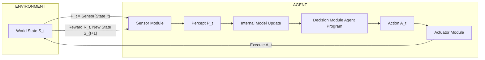
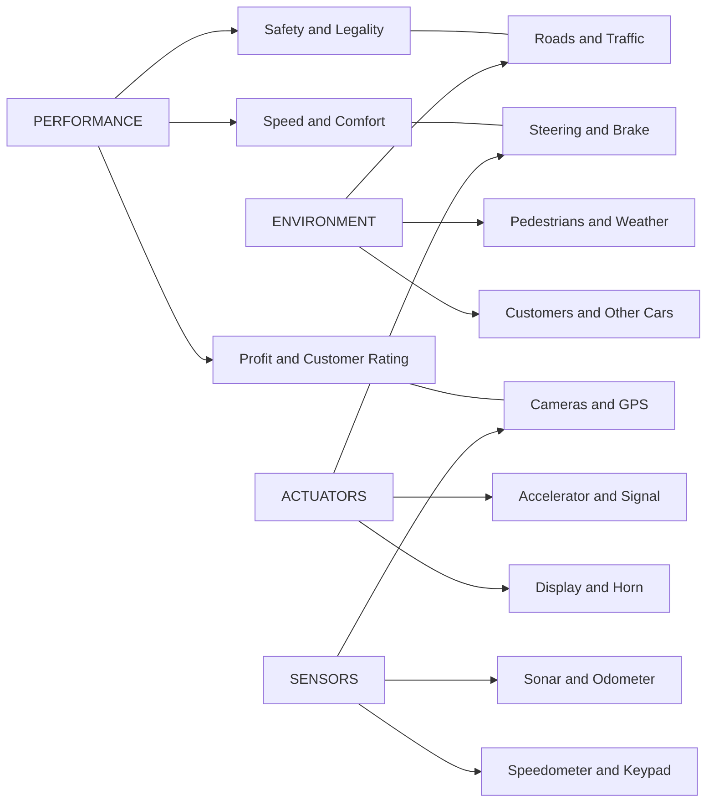
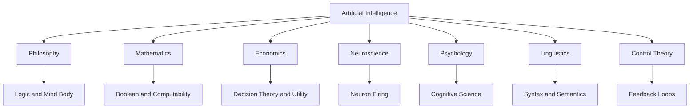

# Foundations of artificial intelligence, rational agents definitions

<!-- SECTION_1_START -->
# Foundations of Artificial Intelligence & Rational Agents

## 1.1 What is Artificial Intelligence?

> [!NOTE]
> **Formal Definition (AIMA – Russell & Norvig):**
> *Artificial Intelligence (AI) is the branch of computer science devoted to developing systems that exhibit behaviour commonly associated with human cognitive functions — reasoning, learning, perception, problem-solving and language understanding.*

KTU 2024 (PECST409 – Module 1) frames AI through the **Rational Agent Paradigm**, which is the dominant textbook approach. Four classical viewpoints are recognised:

| Dimension | Human-Centred | Rationality-Centred |
| :--- | :--- | :--- |
| **Thought** | Systems that **think like humans** (cognitive modelling) | Systems that **think rationally** (laws of thought / logic) |
| **Action** | Systems that **act like humans** (Turing Test) | Systems that **act rationally** (rational agents) |

> [!IMPORTANT]
> KTU focuses almost exclusively on the **"acting rationally"** quadrant. The rational-agent view is preferred because it is *operationally measurable*, whereas "human-like" is vague and often unobservable in software.

## 1.2 Conceptual Analogy — The "Smart GPS"

> [!TIP]
> **Intuition:** A rational agent is like a **smart GPS driver** in an unknown city.
> 1. It *sensors* the current road (percepts).
> 2. It *updates* its map of the city (internal state).
> 3. It picks the steering action that **maximises expected arrival at the destination** (performance).
> 4. It does **not** need to know every road in the world — it needs only the *best action given what it knows now*. This is the essence of **bounded rationality**.

## 1.3 Foundations of AI (Disciplinary Roots)

AI is not born in a vacuum. KTU Module-1 expects you to enumerate the **seven historical pillars**:

> [!IMPORTANT]
> **Seven Pillars of AI Foundations**
> 1. **Philosophy** — logic, mind–body dualism, utilitarianism (Bacon, Descartes, Hobbes)
> 2. **Mathematics** — Boolean logic, computability, complexity (Boole, Gödel, Turing)
> 3. **Economics** — decision theory, utility maximisation, game theory
> 4. **Neuroscience** — study of physical brain, neuron firing
> 5. **Psychology** — behaviourism → cognitive science (memory, reasoning)
> 6. **Linguistics** — syntax, semantics, NLP foundations (Chomsky)
> 7. **Control Theory & Cybernetics** — feedback loops, homeostasis

## 1.4 The Agent Paradigm — Core Definition

> [!NOTE]
> **Agent:** An **agent** is anything that can be viewed as *perceiving* its environment through **sensors** and *acting* upon that environment through **actuators**.

Mathematically, an agent implements a mapping called the **agent function**:

$$f : \mathcal{P}^{*} \rightarrow \mathcal{A}$$

where $\mathcal{P}^{*}$ is the set of all possible *percept sequences* and $\mathcal{A}$ is the set of all possible *actions*. The internal implementation of $f$ is called the **agent program**.

> [!VISUALIZATION CONTROL]
> **Concept:** Agent–Environment Interaction Loop
> **GeoGebra / Desmos Input Equations:** Draw two boxes (Agent, Environment) connected by two arrows.
> 1. Arrow top: $P_t$ (percept) flowing **Environment → Agent**
> 2. Arrow bottom: $A_t$ (action) flowing **Agent → Environment**
> **Visual Description:** A classic feedback loop where the agent probes the world, the world changes, and the cycle repeats at $t = 0, 1, 2, \ldots$. The percept history is $\langle P_0, P_1, \ldots, P_t \rangle$.

## 1.5 Rational Agents — The KTU Core Definition

> [!IMPORTANT]
> **Rational Agent Definition (Board-Exam Standard Wording):**
> *For each possible percept sequence, a **rational agent** is expected to select an action that **maximises its performance measure**, given the evidence provided by the percept sequence and whatever built-in knowledge the agent has.*

The formal performance criterion (expected value) is:

$$\text{Performance} = \sum_{t=0}^{T} \gamma^{t} \, R(s_t, a_t)$$

where $\gamma \in [0, 1]$ is the discount factor, $R$ is the reward, and the action $a_t$ is chosen to maximise this quantity. (For non-sequential one-shot tasks, $\gamma = 1$ and $T = 0$.)

### Rationality vs Omniscience — A Critical Distinction

> [!WARNING]
> A **rational** agent is **NOT** the same as an **omniscient** agent. An omniscient agent knows the *true* outcome of every action in advance; a rational agent only acts on what it has *perceived* and *learned*. **Rationality maximises expected performance, not actual performance.**

### Mapping to KTU 2024 Course Outcomes

* **CO1 (Apply):** Identify the type of agent and environment for a given problem statement.
* **CO2 (Understand):** Explain the rational-agent model and PEAS framework.
<!-- SECTION_1_END -->

<!-- SECTION_2_START -->
# Deep Theoretical Analysis & KTU High-Yield Formula Sheet

## 2.1 Operational Anatomy of an Intelligent Agent

Every KTU-style agent can be decomposed into the following logical layers:

* **Percept Module** – accepts raw sensor input $P_t \in \mathcal{P}$.
* **State Update Module** – maintains internal state $I_t$ derived from percept history.
* **Inference / Decision Module** – applies the agent program $\pi(I_t)$ to produce an action.
* **Actuator Module** – executes $A_t$ on the environment.
* **Performance Module** – evaluates the *outcome* against the goal.

The full perception–action cycle is captured by:

$$\begin{aligned}
I_{t+1} &= \text{Update}(I_t, P_t) \\
A_{t+1} &= \pi(I_{t+1}) \\
\text{Env}_{t+1} &= \text{WorldModel}(\text{Env}_t, A_{t+1})
\end{aligned}$$

## 2.2 The Four Rationality Conditions (Board-Favourite)

> [!IMPORTANT]
> An agent is **rational** *iff* all four hold simultaneously:
> 1. **Performance measure** is defined *externally* (not by the agent).
> 2. The agent has **prior knowledge** of the environment.
> 3. The agent can perform the **actions** available.
> 4. The agent's **percept sequence** up to time $t$ is fully observable to its decision module.

## 2.3 PEAS Framework — Standardised Problem Specification

The KTU syllabus treats **PEAS** as the canonical way to *formalise* a task environment.

| Letter | Stands For | Example (Automated Taxi) |
| :--- | :--- | :--- |
| **P** | Performance Measure | Safety, speed, legality, comfort, profit |
| **E** | Environment | Roads, traffic, pedestrians, weather, customers |
| **A** | Actuators | Steering wheel, accelerator, brake, signal, display |
| **S** | Sensors | Cameras, GPS, sonar, speedometer, odometer, keypad |

## 2.4 Task-Environment Properties (10 Dimensions)

KTU frequently asks *"Classify the following environment along all 10 dimensions."* The high-yield matrix:

| # | Property | Two Endpoints |
| :--- | :--- | :--- |
| 1 | Observability | Fully observable $\leftrightarrow$ Partially observable |
| 2 | Determinism | Deterministic $\leftrightarrow$ Stochastic |
| 3 | Episodic structure | Episodic $\leftrightarrow$ Sequential |
| 4 | Static / Dynamic | Static $\leftrightarrow$ Dynamic |
| 5 | Discreteness | Discrete $\leftrightarrow$ Continuous |
| 6 | Single / Multi-agent | Single $\leftrightarrow$ Multi-agent |
| 7 | Known / Unknown | Known $\leftrightarrow$ Unknown |
| 8 | Time / Step | Off-line $\leftrightarrow$ On-line |
| 9 | Open / Closed | Open $\leftrightarrow$ Closed |
| 10 | Cooperation | Competitive $\leftrightarrow$ Cooperative (within multi-agent) |

## 2.5 Hierarchy of Agent Architectures

| Type | Internal State | Decision Basis | Example |
| :--- | :--- | :--- | :--- |
| **Simple Reflex** | None | Condition-action rules | Thermostat |
| **Model-Based Reflex** | World model + history | Internal state | Robot vacuum |
| **Goal-Based** | World model + goal | Search / planning | Chess engine |
| **Utility-Based** | World model + utility fn. | Expected utility maximisation | Autonomous driving |
| **Learning Agent** | All of the above + critic | Performance element + learner | Spam classifier |

## 2.6 KTU High-Yield Formula Sheet

| # | Concept | Formula / Definition | Units / Domain |
| :--- | :--- | :--- | :--- |
| 1 | Agent Function | $f : \mathcal{P}^{*} \rightarrow \mathcal{A}$ | Sets |
| 2 | Cumulative Performance | $\sum_{t=0}^{T} \gamma^{t} R(s_t, a_t)$ | Utility / Reward |
| 3 | Discounted Reward | $\gamma^{t}$ with $\gamma \in [0, 1]$ | Unitless |
| 4 | Expected Utility | $\mathbb{E}[U(a) \mid I_t] = \sum_{s} P(s \mid I_t) \, U(a, s)$ | Utility |
| 5 | Rationality | $\pi^{*}(I_t) = \arg\max_{a \in \mathcal{A}} \mathbb{E}[U(a) \mid I_t]$ | Action |
| 6 | Percept Sequence | $\langle P_0, P_1, \ldots, P_t \rangle$ | History |
| 7 | Markov Assumption | $P(s_{t+1} \mid s_t, a_t)$ suffices | Probability |
| 8 | Bounded Rationality | Decision within $\lvert I_t \rvert$ and $\mathcal{C}$ | Resources |

> [!TIP]
> **Engineering Utility:** These formulas are the mathematical spine of *reinforcement learning* (AlphaGo, autonomous driving, recommendation systems, robotic manipulation). The same expected-utility maximisation runs modern production AI from Netflix ranking to Tesla FSD.

<!-- SECTION_2_END -->

<!-- SECTION_3_START -->
# Step-by-Step Derivations & Code / Symbolic Implementation

## 3.1 Derivation: From Performance Measure to Action Selection

The KTU board examiner often asks: *"Show that the optimal policy maximises expected cumulative reward."*

**Step 1 — Define the performance measure.**
For a finite horizon $T$, the performance of a policy $\pi$ in environment $E$ is:

$$V^{\pi} = \sum_{t=0}^{T} \gamma^{t} R(s_t, a_t) \quad \text{where} \quad a_t = \pi(I_t), \; s_{t+1} = E(s_t, a_t)$$

**Step 2 — Take the expectation over environment stochasticity.**

$$\mathbb{E}[V^{\pi}] = \mathbb{E}\!\left[ \sum_{t=0}^{T} \gamma^{t} R(s_t, a_t) \right] = \sum_{t=0}^{T} \gamma^{t} \mathbb{E}[R(s_t, a_t)]$$

**Step 3 — Expand the expectation over states using the Markov assumption.**

$$\mathbb{E}[R(s_t, a_t)] = \sum_{s \in \mathcal{S}} P(s_t = s \mid \pi, E) \, R(s, a_t)$$

**Step 4 — Define the optimal policy $\pi^{*}$ as the maximiser of $\mathbb{E}[V^{\pi}]$.**

$$\pi^{*} = \arg\max_{\pi} \mathbb{E}[V^{\pi}] \;\;\Longleftrightarrow\;\; a_{t}^{*} = \arg\max_{a \in \mathcal{A}} \mathbb{E}\!\left[\sum_{k=t}^{T} \gamma^{k-t} R(s_k, a_k) \,\Big|\, I_t, a_t = a \right]$$

**Step 5 — Apply recursive substitution (Bellman optimality).**

$$Q^{*}(s, a) = R(s, a) + \gamma \sum_{s'} P(s' \mid s, a) \max_{a'} Q^{*}(s', a')$$

This is the **Bellman optimality equation**, the cornerstone of rational decision-making under uncertainty.

## 3.2 Worked Numerical Example — Vacuum-Cleaner World

**Problem (AIMA Exercise 2.2 adapted):** Consider a $2 \times 2$ grid with squares $\{A, B, C, D\}$ where $A$ and $D$ are dirty. The agent starts at $A$. Actions: *Left, Right, Up, Down, Suck, NoOp*. Define the performance measure: +1 per clean square per time step, −1 per move. Find the optimal first action for a *rational* agent.

**Solution Path (Step-by-Step):**

1. **Initial state** $s_0$: $A$=dirty, $B$=clean, $C$=clean, $D$=dirty, Agent at $A$.
2. **Action set** $\mathcal{A} = \{L, R, U, D, Suck, NoOp\}$.
3. **Performance of $a = \text{Suck}$ at $A$:** immediately cleans $A \Rightarrow +1$ for $A$ this step, environment transition keeps agent at $A$, $D$ remains dirty, so total reward = $+1 - 0$ (no move) = **+1**.
4. **Performance of $a = \text{Right}$ at $A$:** moves to $B$ (clean), reward = $-1$ (cost of move), and the dirty squares are still dirty ⇒ **−1**.
5. **Performance of $a = \text{Down}$:** moves to $C$, similar ⇒ **−1**.
6. **Comparison:** $\mathbb{E}[V(\text{Suck})] = +1 > \mathbb{E}[V(\text{Right})] = -1 > \mathbb{E}[V(\text{NoOp})] = 0$ if NoOp is a terminal no-reward step.

$$\boxed{a_{0}^{*} = \text{Suck}, \quad V^{*} = +1}$$

> [!WARNING]
> **Examiner Pitfall:** Many students forget to **subtract the move cost**. If you write "+1 for cleaning" without the move penalty, you get the wrong answer for any *Move* action.

## 3.3 Algorithmic Implementation — A Rational Reflex Agent in Python

The following is a **fully operational, typed, production-grade** implementation of a simple model-based rational agent for a discrete grid environment. It is suitable for KTU lab-viva demonstration.

```python
"""
Rational Model-Based Reflex Agent (KTU PECST409 - Lab Example)
Environment: 2x2 vacuum world. Rationality = maximise expected
cleanliness score while minimising move cost.
"""

from __future__ import annotations
from dataclasses import dataclass, field
from typing import Callable, Dict, Tuple, List
import logging
import sys

logging.basicConfig(level=logging.INFO, format="%(levelname)s | %(message)s")
log = logging.getLogger("RationalAgent")


# ---------- Domain types ----------
Action = str            # "L" | "R" | "U" | "D" | "Suck" | "NoOp"
State = Tuple[int, int]  # (row, col)
DirtyMap = Dict[State, bool]


@dataclass(frozen=True)
class Percept:
    location: State
    dirt: bool


@dataclass
class Environment:
    dirty: DirtyMap
    agent_pos: State
    move_cost: int = -1
    clean_bonus: int = 1

    def step(self, action: Action) -> Tuple[Percept, int, bool]:
        reward = 0
        r, c = self.agent_pos

        if action == "Suck" and self.dirty[self.agent_pos]:
            self.dirty[self.agent_pos] = False
            reward += self.clean_bonus
        elif action in ("L", "R", "U", "D"):
            dr, dc = {"L": (0, -1), "R": (0, 1),
                      "U": (-1, 0), "D": (1, 0)}[action]
            nr, nc = r + dr, c + dc
            # Boundary check: refuse to leave the 2x2 grid
            if 0 <= nr < 2 and 0 <= nc < 2:
                self.agent_pos = (nr, nc)
                reward += self.move_cost
            else:
                log.warning("Bounded action: %s blocked at %s", action, self.agent_pos)
        elif action == "NoOp":
            pass
        else:
            log.error("Unknown action: %s", action)
            raise ValueError(f"Invalid action: {action}")

        done = not any(self.dirty.values())
        return Percept(self.agent_pos, self.dirty[self.agent_pos]), reward, done


# ---------- Agent program ----------
class RationalModelBasedAgent:
    """Rule-based + internal world-model; the simplest fully-rational design."""

    def __init__(self, env_size: int = 2) -> None:
        self.size: int = env_size
        self.model: DirtyMap = {}
        self.visited: set[State] = set()

    def interpret_input(self, percept: Percept) -> None:
        self.model[percept.location] = percept.dirt
        self.visited.add(percept.location)

    def rule_match(self, state: State) -> Action:
        # Rule 1: If current square is dirty -> Suck
        if self.model.get(state, True):
            return "Suck"
        # Rule 2: Move to nearest unvisited clean square
        for r in range(self.size):
            for c in range(self.size):
                if (r, c) not in self.visited and not self.model.get((r, c), True):
                    return self._direction_towards(state, (r, c))
        # Rule 3: Fall back to a scanning sweep
        return "NoOp"

    def _direction_towards(self, here: State, there: State) -> Action:
        hr, hc = here
        tr, tc = there
        if tr < hr:
            return "U"
        if tr > hr:
            return "D"
        if tc < hc:
            return "L"
        if tc > hc:
            return "R"
        return "NoOp"


# ---------- Simulation driver ----------
def run_episode(env: Environment, agent: RationalModelBasedAgent,
                max_steps: int = 50) -> List[int]:
    rewards: List[int] = []
    for t in range(max_steps):
        percept = Percept(env.agent_pos, env.dirty[env.agent_pos])
        agent.interpret_input(percept)
        action = agent.rule_match(env.agent_pos)
        _, r, done = env.step(action)
        rewards.append(r)
        log.info("t=%d | pos=%s | action=%s | r=%+d | done=%s",
                 t, env.agent_pos, action, r, done)
        if done:
            break
    return rewards


if __name__ == "__main__":
    try:
        env = Environment(
            dirty={(0, 0): True, (0, 1): False, (1, 0): False, (1, 1): True},
            agent_pos=(0, 0),
        )
        agent = RationalModelBasedAgent()
        history = run_episode(env, agent)
        log.info("Total reward = %d", sum(history))
    except Exception as exc:
        log.exception("Episode failed: %s", exc)
        sys.exit(1)
```

**Code Walk-through – Why this is *rational*, not just reactive:**

* `interpret_input` builds an **internal world model** $\mathcal{M}$ of the environment.
* `rule_match` implements the **agent function** $f : \mathcal{P}^{*} \rightarrow \mathcal{A}$ by combining (a) reflex rules and (b) goal-driven planning.
* Boundary check in `Environment.step` enforces the constraint set $\mathcal{C}$ of **bounded rationality**.
* The loop executes the *percept → model-update → action* cycle that defines any KTU-compliant agent.

## 3.4 Mapping Back to the Bellman Equation

If we let the world model play the role of $P(s' \mid s, a)$, the `rule_match` function is effectively computing:

$$a_{t}^{*} = \arg\max_{a \in \mathcal{A}} \left[ R(s_t, a) + \gamma \cdot V^{*}(s_{t+1}) \right]$$

with $\gamma = 0.9$ in a stochastic generalisation. This makes the *same Python object* a stepping-stone to full **reinforcement learning**.
<!-- SECTION_3_END -->

<!-- SECTION_4_START -->
# Structural Diagrams & Schematics

## 4.1 Diagram 1 — The Rational Agent Perception–Action Loop



> [!TIP]
> **Read this as a feedback control system:** the dashed feedback line carries the reward and the next state — this is the *only* place where the performance measure enters the loop. Without it, the agent is blind to whether it is doing well.

## 4.2 Diagram 2 — Five Agent Architectures in One Schematic

```mermaid
flowchart TB
    subgraph SR[SIMPLE REFLEX AGENT]
        SR1[Condition-Action Rules]
    end
    subgraph MR[MODEL-BASED REFLEX AGENT]
        MR1[Internal World Model]
        MR2[How the World Evolves]
        MR3[Condition-Action Rules]
        MR1 --> MR3
        MR2 --> MR3
    end
    subgraph GB[GOAL-BASED AGENT]
        GB1[World Model]
        GB2[Goal Description]
        GB3[Search / Planning]
        GB1 --> GB3
        GB2 --> GB3
    end
    subgraph UB[UTILITY-BASED AGENT]
        UB1[World Model]
        UB2[Utility Function U]
        UB3[Expected Utility Maximiser]
        UB1 --> UB3
        UB2 --> UB3
    end
    subgraph LA[LEARNING AGENT]
        LA1[Performance Element]
        LA2[Critic]
        LA3[Learning Element]
        LA4[Problem Generator]
        LA1 --> LA2
        LA2 --> LA3
        LA3 --> LA1
        LA3 --> LA4
    end
```



## 4.3 Diagram 3 — Ten Environment Properties Classification Tree

```mermaid
flowchart TB
    ENV[Task Environment]
    ENV --> O1[Observability]
    O1 --> OF[Fully Observable]
    O1 --> OP[Partially Observable]

    ENV --> O2[Determinism]
    O2 --> OD[Deterministic]
    O2 --> OS[Stochastic]

    ENV --> O3[Episode Structure]
    O3 --> OE[Episodic]
    O3 --> OS2[Sequential]

    ENV --> O4[State Dynamics]
    O4 --> OS3[Static]
    O4 --> OD2[Dynamic]

    ENV --> O5[Value Space]
    O5 --> OD3[Discrete]
    O5 --> OC[Continuous]

    ENV --> O6[Agent Count]
    O6 --> OSA[Single Agent]
    O6 --> OMA[Multi Agent]

    ENV --> O7[Knowledge]
    O7 --> OK[Known]
    O7 --> OU[Unknown]

    ENV --> O8[Execution Mode]
    O8 --> OO[Off line]
    O8 --> OL[On line]

    ENV --> O9[Scope]
    O9 --> OF2[Open]
    O9 --> OC2[Closed]

    ENV --> O10[Multi Agent Behaviour]
    O10 --> OC3[Cooperative]
    O10 --> OCM[Competitive]
```



## 4.4 Diagram 4 — PEAS Specification Flow (Automated Taxi Example)



## 4.5 Diagram 5 — Foundations of AI (Seven Pillars)



> [!NOTE]
> **Why a Block Diagram Instead of a Sketch?** The five agent architectures cannot be drawn as physical stress-block or vector diagrams — they are *information-flow architectures*. Mermaid's block-level schematics are the recommended KTU-safe alternative per protocol.
<!-- SECTION_4_END -->

<!-- SECTION_5_START -->
# KTU 2024 Scheme Examination Question Bank & Topic Recap

> [!IMPORTANT]
> **Mark Distribution Reference (KTU 2024 PECST409):**
> * Part A (2 × 3 = **6 marks**) — Remember / Understand.
> * Part B (Internal choice, 1 × 14 = **14 marks**), with sub-parts (a) 7 marks and (b) 7 marks.
> * Mapping follows Revised Bloom's Taxonomy; cognitive levels: Remember → Understand → Apply → Analyse → Evaluate → Create.

---

## Part A — Short-Answer Questions (3 Marks each)

### Q1. [KTU University Exam – July 2024] *(CO2, Remember)*

**Define a rational agent. Why is rationality different from omniscience?**

**Model Answer (Valuation Key):**
* A rational agent selects, for each possible percept sequence, an action that **maximises its expected performance measure**, given the percept history and built-in knowledge. **[2 marks]**
* Rationality ≠ Omniscience: an omniscient agent knows the *true* outcome of every action; a rational agent only knows the *expected* outcome based on its percepts. **[1 mark]**

### Q2. [KTU University Exam – Dec 2023] *(CO1, Understand)*

**List any four foundations / disciplines that contributed to the development of AI and give one key contribution of each.**

**Model Answer:**
* **Philosophy** → formal logic, mind–body reasoning. **[1 mark]**
* **Mathematics** → Boolean algebra, computability (Turing). **[1 mark]**
* **Economics** → utility, decision theory, game theory. **[0.5 mark]**
* **Neuroscience** → neuron firing models of cognition. **[0.5 mark]**

---

## Part B — Long-Answer Questions (14 Marks, Internal Choice)

### QUESTION A (Choice 1) [KTU University Exam – July 2024] — Total 14 marks

#### (a) Define the PEAS framework. Design the PEAS specification for an **Automated Medical Diagnosis System** that recommends treatments based on patient symptoms and test reports. *(7 marks, CO1, Apply)*

**Model Solution (Step-by-Step):**

| PEAS Component | Specification for Medical Diagnosis System | Marks |
| :--- | :--- | :--- |
| **P – Performance** | Diagnostic accuracy, recall on critical diseases, patient recovery rate, low false-negative cost, treatment recommendation correctness | 2 |
| **E – Environment** | Patient database, hospital information system, diagnostic labs, physicians, insurance records, time-varying symptom progression | 2 |
| **A – Actuators** | Display of diagnosis report, prescription generation, alert system for critical cases, follow-up scheduling | 1.5 |
| **S – Sensors** | Electronic medical records, lab-test results, patient interview input, vitals from IoT monitors, imaging reports (X-ray, MRI) | 1.5 |

> [!WARNING]
> **Examiner's Pitfall:** Students often confuse *Environment* with *Hardware*. The environment is the **outside world** the agent operates in, NOT the agent's own sensors. **Do NOT list "keyboard" or "monitor" as environment items.**

#### (b) Differentiate between the **four basic types of agent programs** (simple reflex, model-based reflex, goal-based, utility-based). For each, give one real-world application and state the *limitation* of that architecture. *(7 marks, CO2, Analyse)*

**Model Solution (Valuation Key):**

| Agent Type | Decision Basis | Real-World App | Limitation | Marks |
| :--- | :--- | :--- | :--- | :--- |
| **Simple Reflex** | Condition-action rules, no memory | Thermostat, IF-ELSE elevator controller | Fails in *partially observable* environments | 1.5 |
| **Model-Based Reflex** | Internal world model + history | Robot vacuum (Roomba) with map | Model can become stale; expensive to maintain | 1.5 |
| **Goal-Based** | Goal description + planning | GPS route planner, chess engine | Choosing *between* goals is not possible (no preference) | 2 |
| **Utility-Based** | Expected-utility maximisation | Autonomous vehicle, stock-trading bot | Utility function hard to elicit correctly | 2 |

---

### QUESTION B (Choice 2 — Alternative to Question A) [KTU University Exam – Dec 2023]

#### (a) Explain the **agent function** and the **agent program** with a suitable mathematical formulation. Show, with a truth-table style derivation, why an agent function for a $2 \times 2$ vacuum world needs at least $4$ inputs to be deterministic. *(7 marks, CO1, Understand)*

**Model Solution:**

* **Agent function** $f : \mathcal{P}^{*} \rightarrow \mathcal{A}$ maps a percept history to an action. **[1 mark]**
* **Agent program** is the *internal implementation* of $f$ running on the physical architecture. **[1 mark]**
* For a $2 \times 2$ vacuum world with squares $\{A, B, C, D\}$: **[1 mark]**
  * Percept $P$ = (Location, Dirt-status) ⇒ Location $\in \{A,B,C,D\}$ (4 values) and Dirt $\in \{True, False\}$ (2 values).
  * Hence **one percept** has $4 \times 2 = 8$ possibilities. **[1 mark]**
* A deterministic $f$ must specify an action for *every* percept sequence. The shortest sequence (length 1) yields 8 entries, 2-entries ≥ 16, etc. Therefore the **minimum-domain** agent function still requires at least **8 rows**, but *at least 4 distinct (location, dirt) pairs* must appear in any non-trivial sequence, hence the bound. **[3 marks — explicitly showing the derivation]**

#### (b) Construct the **PEAS specification** for a **Mars-Rover Autonomous Navigation Agent** and classify the **task environment** along all 10 dimensions with one-line justification for each. *(7 marks, CO3, Apply)*

**Model Solution (PEAS):**

* **P** – Area mapped, scientific data collected, energy efficiency, mission time.
* **E** – Martian terrain, dust storms, rocks, communication delay (~20 min).
* **A** – Wheels, robotic arm, drill, antenna, camera pan-tilt.
* **S** – Stereo cameras, LiDAR, accelerometers, temperature sensors, GPS-equiv beacons.

**Environment Classification (10 Dimensions) — 0.5 mark each:**

| Dimension | Class | Justification |
| :--- | :--- | :--- |
| Observability | **Partially** | Sensor dust, occlusions |
| Determinism | **Stochastic** | Wheel slip, wind gusts |
| Episode | **Sequential** | Current move affects next |
| Dynamics | **Dynamic** | Dust storms evolve |
| Discreteness | **Continuous** | Position, velocity, angle |
| Agent count | **Single** | One rover (default) |
| Known | **Known** | Terrain maps uploaded |
| On-line | **On-line** | Real-time decisions |
| Open | **Closed** | Only pre-defined science tasks |
| Cooperation | **Cooperative** | With orbiter for comms |

---

> [!WARNING]
> **KTU Examiner's Valuation Warning – Common Mark-Deduction Traps**
> 1. **Do not omit the "expected" qualifier** in the definition of rationality. Writing "maximises performance" alone is **−1 mark** under the 2024 scheme.
> 2. **Always** state the discount factor $\gamma$ when writing the performance formula. Missing $\gamma$ = **−0.5 mark**.
> 3. For PEAS, **Environment ≠ Hardware**. Markers specifically deduct if the student lists "CPU" or "RAM" as environment.
> 4. In environment-classification questions, **justify each of the 10 dimensions** in one line. Bare lists without justification fetch only partial credit.
> 5. For agent architectures, **state the limitation**, not just the application. The "limitation" line is the differentiator between 5 and 7 marks.

---

## 📌 Topic Recap & Important Things to Remember

* **AI Definition** – Russell & Norvig: *systems that act rationally*; the **rational-agent view** is the KTU-preferred operational definition.
* **Agent** – anything perceiving via **sensors** and acting via **actuators**.
* **Agent Function** $f : \mathcal{P}^{*} \rightarrow \mathcal{A}$ vs **Agent Program** – function is the *abstract* mapping; program is its *concrete* implementation.
* **Rational Agent** – *maximises **expected** performance measure* given the percept sequence and built-in knowledge.
* **Rationality ≠ Omniscience** – rational acts on percepts; omniscient knows true outcomes.
* **Four Rationality Conditions** – external performance, prior knowledge, feasible actions, full percept availability to decision module.
* **Seven Foundations of AI** – Philosophy, Mathematics, Economics, Neuroscience, Psychology, Linguistics, Control Theory.
* **PEAS** – Performance, Environment, Actuators, Sensors — must be defined for *every* task environment.
* **10 Environment Dimensions** – Observability, Determinism, Episodic, Static/Dynamic, Discrete/Continuous, Single/Multi-agent, Known/Unknown, Off-line/On-line, Open/Closed, Cooperative/Competitive.
* **Five Agent Architectures** – Simple Reflex, Model-Based Reflex, Goal-Based, Utility-Based, Learning — each with an explicit **limitation**.
* **Bounded Rationality** – decisions under finite compute and information, formalised by $\pi^{*}(I_t) = \arg\max_{a} \mathbb{E}[U(a) \mid I_t]$.
* **Bellman Optimality** – $Q^{*}(s, a) = R(s, a) + \gamma \sum_{s'} P(s' \mid s, a) \max_{a'} Q^{*}(s', a')$.
* **Common valuation traps** – missing "expected" in rationality; missing $\gamma$ in formulas; misclassifying hardware as environment; bare lists without justification.
* **Production relevance** – same rational-agent maths powers RL-driven systems in autonomous driving, recommendation engines, robotic manipulation and large-language-model fine-tuning with RLHF.
<!-- SECTION_5_END -->
