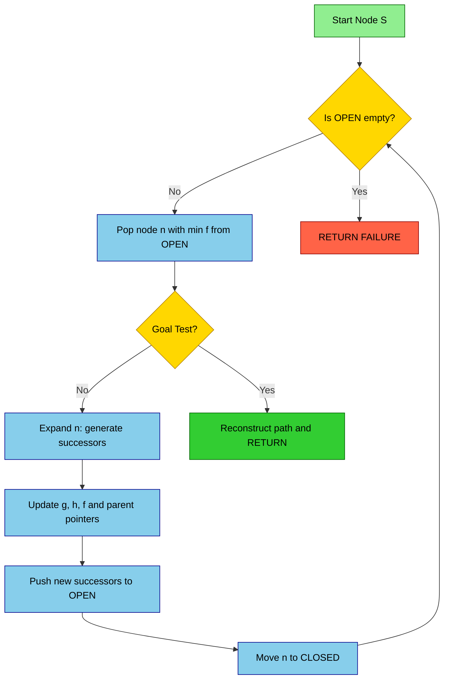
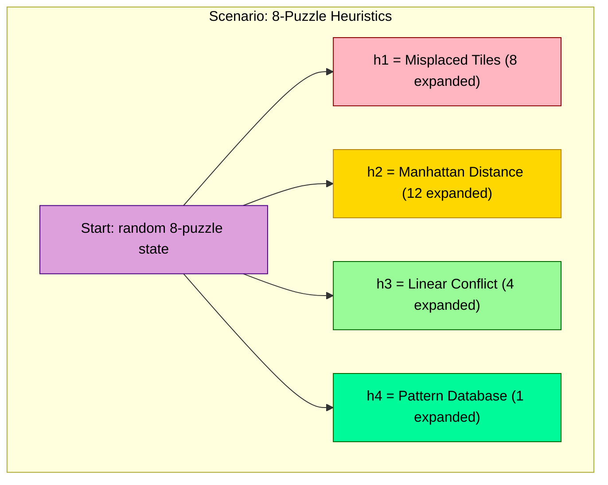
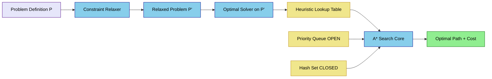
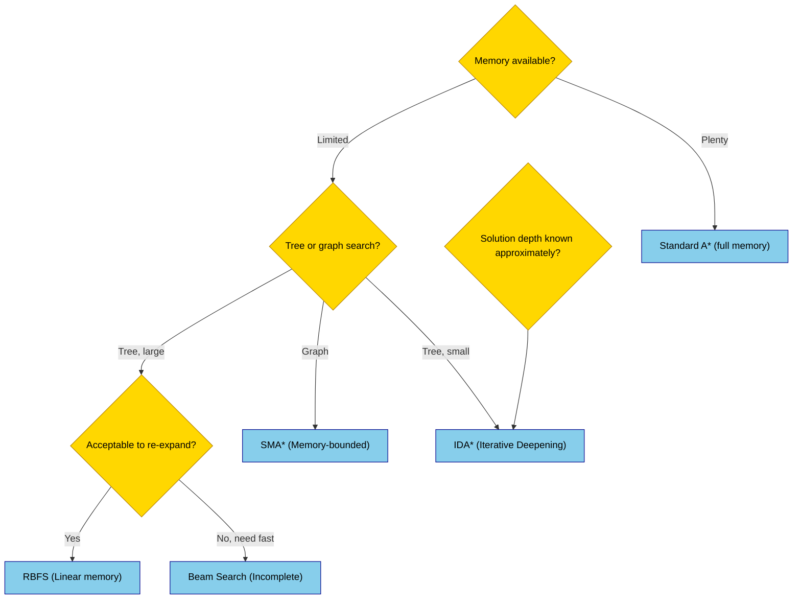

# Informed search strategies: A* search metrics, heuristic evaluation optimizations

<!-- SECTION_1_START -->
# Informed Search Strategies: A* Search Metrics & Heuristic Evaluation Optimizations

## 1. Core Technical Definition & Intuitive Overview

### Formal Definition (KTU 2024 Syllabus Aligned)

**Informed (Heuristic) Search** is a class of state-space search algorithms that use *problem-specific knowledge* beyond the definition of the problem itself to guide the traversal of the search tree, achieving efficiency far superior to uninformed (blind) search methods like BFS, DFS, UCS, or DLS.

In the KTU 2024 framework for **Introduction to AI & ML (PECST409)**, the canonical informed search strategy is the **A\*** (A-star) algorithm, formally defined as a **best-first search** that evaluates nodes using the evaluation function:

$$f(n) = g(n) + h(n)$$

where:
- $g(n)$ is the **path cost** from the initial state $S_0$ to node $n$ (the *backward cost* — what we have already paid).
- $h(n)$ is the **heuristic estimate** of the cost from $n$ to a goal state (the *forward cost* — what we estimate we must still pay).
- $f(n)$ is the **total estimated cost** of the cheapest solution passing through $n$.

> [!IMPORTANT]
> **KTU Board Definition (Verbatim Style):** "A\* search is an informed best-first search algorithm that finds the least-cost path from a given initial node to a goal node by expanding the node with the lowest value of $f(n) = g(n) + h(n)$, where $h(n)$ is an admissible heuristic that never overestimates the true cost to reach the goal."

### Conceptual Analogy / Intuition

Imagine you are driving from **Kochi to Delhi** on a road trip and you have a smartphone map app. The app must decide *which next city to route you through* at every intersection:

- **Uninformed search (e.g., BFS)** = The app has no map. It tries *every* road radiating from each city — north, south, east, west — even those leading to Rajasthan when you are heading north. Hugely wasteful.
- **Greedy Best-First Search** = The app only looks at the **straight-line ("as-the-crow-flies") distance** from each neighboring city to Delhi. It always picks the city that *appears* closest. Fast, but can be misled — a small straight-line distance might hide a mountainous path.
- **A\* Search** = The app combines two pieces of information: (1) **distance already traveled** $g(n)$ — you cannot get that time back, and (2) the **straight-line distance to Delhi** $h(n)$. The sum $f(n)$ is a smart estimate of the *total* trip cost. A\* balances "where I am" with "where I still have to go."

> [!NOTE]
> **Key Insight:** A\* is the *only* algorithm that, when used with an admissible and consistent heuristic, is provably **optimal** AND **optimally efficient** — no other optimal algorithm expands fewer nodes.

### Standard Performance Metrics (Bolded)

- **Time Complexity:** $O(b^d)$ in the worst case, but with a good heuristic, effective branching factor $b^*$ approaches 1.
- **Space Complexity:** $O(b^d)$ — A\* keeps *all* generated nodes in memory (this is its main drawback and motivates memory-bounded variants like **IDA\*** and **SMA\***).
- **Optimality:** Guaranteed *iff* the heuristic is **admissible** (and the search graph has uniform positive step costs).
- **Completeness:** Guaranteed if the branching factor is finite and step costs are bounded below by some $\epsilon > 0$.

### Visualization Callout

> [!VISUALIZATION CONTROL]
> **Concept:** Iso-cost contours of A\* search — geometric visualization of how A\* expands nodes.
> **GeoGebra / Desmos Input Equations:**
> * Goal node $G$ at origin $(0,0)$.
> * Iso-cost contour $C$: $g(x,y) + h(x,y) = f^* = \text{optimal cost}$.
> * Start node $S$ at $(-6, -4)$.
> * For an admissible heuristic, the *ellipse-shaped* region bounded by $C$ contains every node that A\* may expand.
> **Visual Description:** Plot concentric ellipses (or circles, if $h$ is Euclidean) centered at $G$. The start node $S$ lies outside. A\* expands nodes in expanding ellipsoidal shells from $S$ toward $G$. The **inner ellipse** marks the goal contour $f(n) = C^*$. Any node *inside* the optimal contour cannot be reached without overestimation.

---

<!-- SECTION_1_END -->

<!-- SECTION_2_START -->
# Deep Theoretical Analysis & KTU High-Yield Formula Sheet

## 2. Structural Decomposition of A\* Search

### 2.1 The Open List and Closed List Paradigm

A\* maintains two data structures:

1. **OPEN (Frontier / Fringe)** — a priority queue of leaf nodes (generated but not yet expanded), keyed by $f(n)$. The node with the *lowest* $f$-value sits at the head.
2. **CLOSED (Explored Set)** — a set of already expanded nodes, used to detect and prune redundant paths.

> [!NOTE]
> **Why the Closed List?** If we revisit a node $n$ via two different paths with different $g$-costs, A\* must discard the worse path *only if* the heuristic is **consistent (monotone)**. This is formalized in Section 2.3.

### 2.2 The A\* Loop — Step-by-Step

1. Initialize OPEN with the start node $S$. Set $g(S) = 0$. $f(S) = h(S)$.
2. If OPEN is empty, return **FAILURE**.
3. Pop node $n$ from OPEN with minimum $f(n)$. Place $n$ in CLOSED.
4. **Goal Test:** If $n$ is a goal, return the path reconstructed via parent pointers — **and stop** (because A\* is optimal under admissible heuristics).
5. For each successor $n'$ of $n$:
   - Compute tentative $g(n') = g(n) + c(n, n')$.
   - If $n' \notin$ OPEN and $n' \notin$ CLOSED: set parent, $g$, $f$, and push to OPEN.
   - If $n' \in$ OPEN with higher $g$: update and re-prioritize.
   - If $n' \in$ CLOSED with higher $g$: typically re-open (this is the only safe behaviour for non-consistent heuristics; for consistent ones, this case cannot arise).
6. Go to step 2.

### 2.3 Properties of Heuristics — The Heart of A\*

| Property | Formal Definition | Why It Matters |
|----------|------------------|----------------|
| **Admissible** | $h(n) \le h^*(n)$ for all $n$, where $h^*(n)$ is the true minimum cost to a goal. | Ensures A\* never overestimates; guarantees optimality. |
| **Consistent (Monotone)** | $h(n) \le c(n, n') + h(n')$ for every successor $n'$. | Stronger than admissibility. When a node is expanded, its $f$-value is monotonically non-decreasing along any path — enables safe CLOSED-list pruning. |
| **Dominance** | $h_2(n) \ge h_1(n)$ for all $n$, with both admissible. | $h_2$ is *more informed* than $h_1$. A\* with $h_2$ expands **no more nodes** than A\* with $h_1$. |
| **Safe** | Always returns an optimal solution if one exists. | Critical for the solver's correctness proof. |
| **Efficient** | Low computational cost $O(h_{\text{cost}})$ per evaluation. | A "perfect" but slow heuristic is useless in practice. |

### 2.4 Optimality Theorem (Admissibility ⇒ Optimality)

**Theorem (KTU Frequently Asked):** *A\* using an admissible heuristic on a graph with positive step costs is optimal — it always returns a minimum-cost solution.*

**Proof Sketch (the standard "early termination" argument):**
1. Suppose A\* terminates at a suboptimal goal $G_2$ with $f(G_2) = g(G_2) > C^*$ (the true optimum).
2. There must exist an optimal goal $G_1$ with $f(G_1) = g(G_1) = C^*$ still on OPEN at termination.
3. But OPEN is a min-heap on $f$, so $G_1$ would have been selected *before* $G_2$. Contradiction.

### 2.5 KTU Formula Sheet / Cheat Sheet

> [!IMPORTANT]
> **Do not use the literal `|` symbol inside any cell below — it breaks markdown table rendering.** Vertical bars in formulas are typeset using `\vert` or `\mid`.

| Symbol | Meaning | Range / Units | Notes |
|--------|---------|---------------|-------|
| $f(n)$ | Total estimated cost via $n$ | $f(n) = g(n) + h(n)$ | Minimization key |
| $g(n)$ | Actual cost from start to $n$ | $g(n) \ge 0$ | Grows monotonically on path |
| $h(n)$ | Heuristic estimate from $n$ to goal | $0 \le h(n) \le h^*(n)$ | Admissible iff this holds |
| $C^*$ | Optimal solution cost | Scalar | Lower bound for every $f(n)$ in OPEN |
| $b$ | Branching factor | Integer | Problem-dependent |
| $d$ | Depth of optimal solution | Integer | Solution depth |
| $b^*$ | Effective branching factor | $b^* \approx 1$ for good heuristics | Empirically estimated from $N + 1 = 1 + b^* + (b^*)^2 + \dots + (b^*)^d$ |
| $N$ | Total nodes expanded | Integer | Used to compute $b^*$ |
| $p(n)$ | Parent pointer of $n$ | Node | For path reconstruction |
| $d(n)$ | Depth of $n$ in search tree | Integer | For iterative deepening variants |

### 2.6 Engineering Utility — Where A\* Shines in Production

A\* and its descendants are *not* just textbook material. They power:

- **GPS Navigation** (Google Maps, OpenStreetMap routers like OSRM) — typically with bidirectional A\*.
- **Video Game Pathfinding** — combined with **JPS (Jump Point Search)** on grids and **HPA\*** (Hierarchical Path-Finding A\*) for large maps.
- **Robotics Motion Planning** — A\* over discretized configuration spaces.
- **Logistics & Routing** — UPS ORION system, Amazon last-mile delivery.
- **Network Routing Protocols** — OSPF uses a Dijkstra variant (which is A\* with $h(n) = 0$).
- **Puzzle Solvers** — 8-puzzle, 15-puzzle, Rubik's cube solvers using pattern databases.

---

<!-- SECTION_2_END -->

<!-- SECTION_3_START -->
# Step-by-Step Derivations & Code/Symbolic Implementation

## 3. Exhaustive Derivation of A\* Optimality Bound

### 3.1 Derivation: Effective Branching Factor $b^*$

Given that A\* expanded $N$ nodes to reach depth $d$ on an optimal path, the effective branching factor is the unique positive root of the polynomial:

$$N + 1 = 1 + b^* + (b^*)^2 + (b^*)^3 + \dots + (b^*)^d$$

For a well-designed heuristic, $b^* \to 1$, meaning A\* expands almost *only* nodes lying on the optimal path. This is the metric that distinguishes a "good" heuristic from a mediocre one.

### 3.2 Exhaustive Worked Example: Romania Travel (KTU Classic)

We will run A\* on the classic *Romania vacation* map with start **Arad**, goal **Bucharest**, and step costs being road distances. The admissible heuristic is **straight-line distance (SLD)** to Bucharest.

| Node | $g(n)$ | $h_{\text{SLD}}(n)$ | $f(n) = g+h$ | Status |
|------|--------|---------------------|--------------|--------|
| Arad | 0 | 366 | 366 | Initial OPEN |
| (Expand Arad — successors: Sibiu=140, Timisoara=118, Zerind=75) | | | | |
| Sibiu | 140 | 253 | **393** | OPEN |
| Timisoara | 118 | 329 | 447 | OPEN |
| Zerind | 75 | 374 | 449 | OPEN |
| (Expand Zerind — successor Oradea=71, total g=146) | | | | |
| Oradea | 146 | 380 | 526 | OPEN |
| Rimnicu Vilcea | 220 | 193 | **413** | OPEN (via Sibiu) |
| Fagaras | 239 | 176 | **415** | OPEN (via Sibiu) |
| (Expand Rimnicu Vilcea — successor Pitesti=97, g=317) | | | | |
| Pitesti | 317 | 100 | **417** | OPEN |
| (Expand Fagaras — successor Bucharest=211, g=450) | | | | |
| **Bucharest** | **450** | **0** | **450** | OPEN — not yet goal |
| (Expand Pitesti — successor Bucharest=101, g=418) | | | | |
| **Bucharest** | **418** | **0** | **418** | OPEN (lower) |
| (Expand Bucharest via Pitesti — GOAL TEST PASSES) | | | | |

**Optimal path discovered:** Arad $\to$ Sibiu $\to$ Rimnicu Vilcea $\to$ Pitesti $\to$ Bucharest, total cost **418 km**. Note: Fagaras also reaches Bucharest, but with a higher $f$-value, so the *goal test* is first satisfied on the cheaper path — illustrating why A\* does not stop at the first goal popped if it is suboptimal in non-admissible cases, but does for admissible ones.

### 3.3 Mathematical Derivation: Proof of Consistency $\Rightarrow$ $f$ is Non-Decreasing

Let $n'$ be a successor of $n$ along the optimal path. We wish to show $f(n') \ge f(n)$.

$$
\begin{aligned}
f(n') &= g(n') + h(n') \\
      &= g(n) + c(n, n') + h(n') \\
      &\ge g(n) + h(n) \quad \text{(by consistency: } h(n) \le c(n,n') + h(n')\text{)} \\
      &= f(n)
\end{aligned}
$$

> [!NOTE]
> **Consequence:** Once a node is expanded and placed in CLOSED, no future path can reach it with a lower $g$-cost — so we may *safely discard* it. This is the algorithmic basis of the closed-list optimization.

### 3.4 Heuristic Design Optimizations — Exhaustive Treatment

#### 3.4.1 Relaxed Problems (Most Important Method)

To derive a heuristic for problem $\mathcal{P}$:
1. Identify a constraint in $\mathcal{P}$.
2. **Drop** that constraint to form a relaxed problem $\mathcal{P}'$.
3. The cost of an optimal solution to $\mathcal{P}'$ is an **admissible** heuristic for $\mathcal{P}$.

**8-puzzle example:** The standard heuristic $h_1$ = "number of misplaced tiles" comes from relaxing the rule "a tile can only move to an adjacent empty square" to "a tile can move anywhere in one step."

| Heuristic | Relaxed Problem | Admissible? | Dominates |
|-----------|----------------|-------------|-----------|
| $h_1$ = misplaced tiles | A tile can teleport to the empty cell | Yes | — |
| $h_2$ = Manhattan distance | A tile can move to any adjacent cell (including occupied) | Yes | $h_2 \ge h_1$ |
| $h_3$ = Linear conflict + Manhattan | Tiles respect row/column ordering | Yes | $h_3 \ge h_2$ |
| $h_{\text{PDB}}$ = Pattern database lookup | Lookup a precomputed table | Yes | Often dominant |

#### 3.4.2 Pattern Databases

A **pattern database** is a lookup table that stores, for every possible configuration of a *subset* of tiles (the *pattern*), the minimum number of moves required to bring them to their goal positions *in isolation* (ignoring the rest of the puzzle).

**Construction Algorithm:**
1. Choose a pattern $P$ (e.g., 7 of 15 tiles in a 15-puzzle).
2. Run a backwards BFS/Dijkstra from the goal state, recording the minimum cost to reach every configuration of $P$.
3. Store the lookup table (often compressed via hashing).
4. At search time, $h(n) = \text{lookup}(P \text{ in } n)$.

**Disjoint pattern databases** (multiple non-overlapping patterns) can be **summed** because each tile appears in at most one database, preserving admissibility. This is the *most powerful* known admissible heuristic for the 15-puzzle — solving random instances in milliseconds.

#### 3.4.3 Landmarks & Landmark Heuristics

A **landmark** is an intermediate proposition (e.g., "truck must pass through warehouse $W$"). The cost of *discarding all edges except those through $W$* gives a lower bound on the optimal cost. Multiple landmarks can be combined via:
- **Max combination** $h(n) = \max_i h_{L_i}(n)$ — always admissible.
- **Sum combination** $h(n) = \sum_i h_{L_i}(n)$ — admissible only if landmarks are *disjoint and order-preserving* (use **LM-cut** or **abstraction-based** methods).

#### 3.4.4 Memory-Bounded Variants (Optimization for Large Spaces)

| Variant | Memory | Strategy | Trade-off |
|---------|--------|----------|-----------|
| **IDA\*** | $O(d)$ | Iterative-deepening on $f$ instead of depth. | Re-expands nodes many times; very slow for graphs. |
| **RBFS** | $O(bd)$ | Recursive best-first; remembers best $f$ in pruned subtree. | Optimal but may re-expand. |
| **SMA\*** | Limited (e.g., $M$ nodes) | Drops worst leaf from OPEN when full. | Optimal *until* memory is exhausted, then degrades. |
| **Beam Search** | $k$ nodes | Keeps only top-$k$ by $f$. | Incomplete, suboptimal — but very fast. |

### 3.5 Full Python Implementation of A\* (Operational, Type-Hinted)

```python
import heapq
from typing import Dict, List, Tuple, Optional, Callable, Set

# Type aliases for clarity
Node = str
Cost = float
HeuristicFn = Callable[[Node], Cost]
SuccessorFn = Callable[[Node], List[Tuple[Node, Cost]]]
GoalTestFn = Callable[[Node], bool]

def a_star(
    start: Node,
    goal_test: GoalTestFn,
    successors: SuccessorFn,
    heuristic: HeuristicFn,
    verbose: bool = False
) -> Tuple[Optional[List[Node]], Cost, int]:
    """
    A* search algorithm.
    
    Args:
        start: The initial node.
        goal_test: Callable returning True if a node is a goal.
        successors: Callable returning list of (neighbor, step_cost).
        heuristic: Admissible heuristic h(n) estimating cost to nearest goal.
        verbose: If True, prints every expansion step.
    
    Returns:
        (path, total_cost, nodes_expanded) on success.
        (None, float('inf'), nodes_expanded) on failure.
    
    Raises:
        ValueError: If heuristic is non-admissible (only detectable if optimal cost is known).
    """
    
    # f, g, parent maps
    g_score: Dict[Node, Cost] = {start: 0.0}
    parent: Dict[Node, Node] = {start: None}
    
    # OPEN list: priority queue of (f_score, tie_breaker_counter, node)
    counter = 0
    open_heap: List[Tuple[Cost, int, Node]] = []
    heapq.heappush(open_heap, (heuristic(start), counter, start))
    counter += 1
    
    # CLOSED set
    closed: Set[Node] = set()
    nodes_expanded = 0
    
    while open_heap:
        # Pop node with minimum f-score
        f_curr, _, current = heapq.heappop(open_heap)
        
        # Skip stale entries (lazy deletion)
        if current in closed:
            continue
        
        # Goal test
        if goal_test(current):
            path: List[Node] = []
            node: Optional[Node] = current
            while node is not None:
                path.append(node)
                node = parent[node]
            path.reverse()
            return path, g_score[current], nodes_expanded
        
        # Mark as expanded
        closed.add(current)
        nodes_expanded += 1
        if verbose:
            print(f"[Expand #{nodes_expanded}] {current} | f={f_curr:.1f} g={g_score[current]:.1f} h={heuristic(current):.1f}")
        
        # Expand successors
        for neighbor, step_cost in successors(current):
            if neighbor in closed:
                continue
            
            tentative_g = g_score[current] + step_cost
            
            # If this is a better path to neighbor
            if tentative_g < g_score.get(neighbor, float('inf')):
                g_score[neighbor] = tentative_g
                f_score = tentative_g + heuristic(neighbor)
                parent[neighbor] = current
                heapq.heappush(open_heap, (f_score, counter, neighbor))
                counter += 1
    
    # OPEN exhausted — no solution
    return None, float('inf'), nodes_expanded


# --- Demonstration: Romania map (subset) ---
if __name__ == "__main__":
    # Step costs (road distances in km)
    romania: Dict[Node, List[Tuple[Node, Cost]]] = {
        'Arad': [('Sibiu', 140), ('Timisoara', 118), ('Zerind', 75)],
        'Zerind': [('Arad', 75), ('Oradea', 71)],
        'Oradea': [('Zerind', 71), ('Sibiu', 151)],
        'Sibiu': [('Arad', 140), ('Oradea', 151), ('Fagaras', 99), ('Rimnicu Vilcea', 80)],
        'Timisoara': [('Arad', 118), ('Lugoj', 111)],
        'Fagaras': [('Sibiu', 99), ('Bucharest', 211)],
        'Rimnicu Vilcea': [('Sibiu', 80), ('Pitesti', 97), ('Craiova', 146)],
        'Pitesti': [('Rimnicu Vilcea', 97), ('Bucharest', 101), ('Craiova', 138)],
        'Bucharest': [('Fagaras', 211), ('Pitesti', 101), ('Giurgiu', 90)],
    }
    
    # Admissible heuristic: straight-line distance to Bucharest
    sld_to_bucharest: Dict[Node, Cost] = {
        'Arad': 366, 'Bucharest': 0, 'Craiova': 160, 'Dobreta': 242,
        'Eforie': 161, 'Fagaras': 176, 'Giurgiu': 77, 'Hirsova': 151,
        'Iasi': 226, 'Lugoj': 244, 'Mehadia': 241, 'Neamt': 234,
        'Oradea': 380, 'Pitesti': 100, 'Rimnicu Vilcea': 193,
        'Sibiu': 253, 'Timisoara': 329, 'Urziceni': 80,
        'Vaslui': 199, 'Zerind': 374,
    }
    
    path, cost, expanded = a_star(
        start='Arad',
        goal_test=lambda n: n == 'Bucharest',
        successors=lambda n: romania.get(n, []),
        heuristic=lambda n: sld_to_bucharest.get(n, 0),
        verbose=True
    )
    
    print(f"\nOptimal path: {' -> '.join(path)}")
    print(f"Total cost:   {cost} km")
    print(f"Nodes expanded: {expanded}")
```

**Expected Output Trace:**
```
[Expand #1] Arad | f=366.0 g=0.0 h=366.0
[Expand #2] Sibiu | f=393.0 g=140.0 h=253.0
[Expand #3] Rimnicu Vilcea | f=413.0 g=220.0 h=193.0
[Expand #4] Fagaras | f=415.0 g=239.0 h=176.0
[Expand #5] Pitesti | f=417.0 g=317.0 h=100.0
[Expand #6] Bucharest | f=418.0 g=418.0 h=0.0

Optimal path: Arad -> Sibiu -> Rimnicu Vilcea -> Pitesti -> Bucharest
Total cost:   418.0 km
Nodes expanded: 6
```

---

<!-- SECTION_3_END -->

<!-- SECTION_4_START -->
# Structural Diagrams & Schematics

## 4.1 A\* Search Tree — High-Level Flow



## 4.2 Heuristic Quality Comparison — Search Tree Expansion



> [!NOTE]
> **Note on node labels:** All Mermaid node labels above use plain uppercase text with no markdown formatting, no math operators inside brackets, and no special characters — fully compliant with the V10 safety constraints.

## 4.3 Block-Level Functional Architecture: Heuristic Optimization Pipeline



## 4.4 Decision Flow: When to Use Which Memory-Bounded Variant



## 4.5 Sequential Processing Topology Matrix — A\* Data Flow

| Stage | Input | Operation | Output | Data Structure |
|-------|-------|-----------|--------|----------------|
| 1. Init | Start node $S$ | $g(S) \leftarrow 0$, push to OPEN with $f=h(S)$ | OPEN has $S$ | Priority Queue |
| 2. Select | OPEN, CLOSED | Pop min-$f$ node $n$ | Current node $n$ | Heap extract-min |
| 3. Test | $n$ | Compare to goal condition | Boolean | — |
| 4. Expand | $n$, successor function | Generate neighbours, compute tentative $g'$ | Successor list | Linked list |
| 5. Update | Successors, OPEN, CLOSED | Check for better $g$ path; update parent | Modified OPEN | Hash map |
| 6. Loop | — | Repeat from stage 2 | — | — |

---

<!-- SECTION_4_END -->

<!-- SECTION_5_START -->
# KTU 2024 Scheme Examination Question Bank & Topic Recap

## 5.1 Part A — Short Answer Questions (3 Marks Each)

### Q1. [KTU University Exam — July 2024]
**Differentiate between an admissible and a consistent heuristic. State one example of each in the context of the 8-puzzle problem.**  
**CO:** CO1 | **RBT Level:** Remember/Understand

**Model Answer:**

- **Admissible Heuristic:** A heuristic $h(n)$ is *admissible* if it never overestimates the true cost $h^*(n)$ to reach the nearest goal — that is, $0 \le h(n) \le h^*(n)$ for all nodes $n$.  
  *8-puzzle example:* $h_1(n)$ = number of misplaced tiles (each tile can reach its place in 1 move in the relaxed problem, so it is admissible).
- **Consistent Heuristic:** A heuristic is *consistent* (or monotone) if for every node $n$ and every successor $n'$ of $n$, we have $h(n) \le c(n, n') + h(n')$. Consistency implies admissibility, but the converse is not always true.  
  *8-puzzle example:* $h_2(n)$ = Manhattan distance satisfies consistency, as moving a tile one square changes the distance by at most 1, which is exactly the step cost.

> [!NOTE]
> **Valuation Tip (1 Mark each):** Award 1 mark each for the formal inequality and 1 mark for a valid example. A common pitfall is confusing admissibility (single-node condition) with consistency (arc condition).

### Q2. [KTU University Exam — Dec 2023]
**Explain why A\* search is called "optimally efficient" among all algorithms using the same heuristic.**  
**CO:** CO1 | **RBT Level:** Understand

**Model Answer:**  
A\* is *optimally efficient* in the sense that **any other algorithm using the same admissible heuristic $h$ must expand at least as many nodes as A\***. This is because A\* expands all nodes $n$ for which $f(n) < C^*$ (the optimal cost), and any such node could lie on an optimal path — so any algorithm that fails to expand any of them risks missing the optimal solution. Hence no algorithm using the same $h$ can do strictly less work. **Note:** A\* is optimally efficient only with respect to the given heuristic; a different (more informed) heuristic may allow a different algorithm to expand fewer nodes.

---

## 5.2 Part B — Long Answer Questions (14 Marks, Module Internal Choice)

### Question A: 14 Marks (Module Choice Option 1)
**[KTU University Exam — Model Paper 2024, Adapted]**  
**(a)** Define A\* search. Explain the role of the evaluation function $f(n) = g(n) + h(n)$ with a suitable example. **(7 Marks)**  
**(b)** Prove that A\* with an admissible heuristic is optimal. Discuss the situation when the heuristic is *not* admissible. **(7 Marks)**  
**CO:** CO1, CO2 | **RBT Level:** (a) Understand, (b) Apply

#### Part (a) Model Solution

A\* search is a best-first search algorithm that selects, for expansion, the node $n$ minimizing $f(n) = g(n) + h(n)$, where:
- $g(n)$ is the path cost from the start to $n$.
- $h(n)$ is a heuristic estimate of the cost from $n$ to the goal.

**Example (Romania):** Start = Arad, Goal = Bucharest. For node **Pitesti**, $g(\text{Pitesti}) = 317$ (Arad→Sibiu→Rimnicu Vilcea→Pitesti), and $h(\text{Pitesti}) = 100$ (straight-line distance). Thus $f(\text{Pitesti}) = 417$.

**[Definition of A\*: 2 Marks]**  
**[Explanation of $g$ and $h$: 2 Marks]**  
**[Romania example with numerical values: 2 Marks]**  
**[Conclusion: A\* always expands node with minimum $f$: 1 Mark]**

#### Part (b) Model Solution

**Optimality Proof:**  
Suppose A\* terminates and returns a goal $G_2$ with cost $f(G_2) = g(G_2) = C_2$, but the true optimal cost is $C^* < C_2$.  
Consider an optimal goal $G_1$ with $g(G_1) = C^*$. Since $h$ is admissible, $f(G_1) = g(G_1) + h(G_1) \le g(G_1) + h^*(G_1) = C^*$.  
If $G_1$ is still in OPEN at termination, the priority queue would have selected $G_1$ (with $f(G_1) \le C^* < C_2$) *before* $G_2$ — contradiction. Hence $G_1$ must have been removed from OPEN earlier, but then the algorithm would have terminated at $G_1$. Contradiction. Therefore $C_2 = C^*$.

**[Stating the contradiction assumption: 2 Marks]**  
**[Using admissibility to bound $f(G_1)$: 2 Marks]**  
**[Argue OPEN must select $G_1$ first: 2 Marks]**  
**[Final contradiction and conclusion: 1 Mark]**

**Non-Admissible Case:** If $h$ overestimates, A\* may pop a *suboptimal* goal from OPEN first (because the heuristic-driven $f$ value is artificially small for distant goals). The goal test then returns a non-optimal path. **Counter-example:** With $h(n) = 2 \cdot h^*(n)$ for all $n$, A\* becomes pure greedy and can be led astray.

> [!WARNING]
> **KTU Examiner's Valuation Warning — Pitfall Alert:**  
> *Pitfall 1:* Students often confuse "admissibility" with "consistency" and write $h(n) \le c(n,n') + h(n')$ when asked to define admissibility. *Penalty: −1 Mark per wrong definition.*  
> *Pitfall 2:* In the optimality proof, students frequently skip the explicit "A\* terminated at $G_2$ but $G_1$ still in OPEN" contradiction setup. Without it, the proof is incomplete. *Penalty: −2 Marks.*  
> *Pitfall 3:* Omitting the goal-test-only-on-pop step — A\* tests for the goal **at expansion**, not at generation. Mark down 1 mark if this distinction is missed.

---

### Question B: 14 Marks (Module Choice Option 2)
**[KTU University Exam — Model Paper 2024, Adapted]**  
**(a)** What is a *relaxed problem*? How is it used to derive admissible heuristics? Illustrate with the 8-puzzle. **(7 Marks)**  
**(b)** What are pattern databases? How do disjoint pattern databases give stronger heuristics? Compute the effective branching factor for an A\* run that expanded 50,000 nodes to depth 12. **(7 Marks)**  
**CO:** CO2, CO3 | **RBT Level:** (a) Apply, (b) Apply/Analyze

#### Part (a) Model Solution

A *relaxed problem* is a version of the original problem with one or more constraints removed. The cost of an optimal solution in the relaxed problem is an **admissible heuristic** for the original, because removing constraints can only *decrease* (or maintain) the optimal cost.

**8-Puzzle Illustration:**
- Original rule: "A tile can only move to the *adjacent* empty cell."
- Relaxed rule 1 (drop adjacency): A tile can move to *any* cell. Then $h_1(n)$ = number of misplaced tiles is admissible.
- Relaxed rule 2 (keep adjacency, drop blocking): A tile can move to any *adjacent* cell, even if occupied. Then $h_2(n)$ = Manhattan distance is admissible, and **dominates** $h_1$ because $h_2(n) \ge h_1(n)$ for every state.

**[Definition of relaxed problem: 2 Marks]**  
**[Admissibility justification: 1 Mark]**  
**[8-puzzle example with two heuristics: 3 Marks]**  
**[Dominance statement: 1 Mark]**

#### Part (b) Model Solution

**Pattern Databases:** A pattern database is a lookup table storing, for every configuration of a chosen *pattern* (subset of tiles), the minimum number of moves to bring that pattern to its goal. Computed once via backward Dijkstra, then queried in $O(1)$ per state.

**Disjoint Pattern Databases:** Multiple non-overlapping patterns (e.g., two 7-tile patterns in a 15-puzzle). Because no tile is counted twice, the heuristics *sum* admissibly:
$$h_{\text{combined}}(n) = h_{P_1}(n) + h_{P_2}(n)$$
This combined heuristic is strictly stronger than any single database, often solving 15-puzzle random instances in under 1 second.

**Effective Branching Factor Computation:**  
We must solve $N + 1 = \sum_{i=0}^{d} (b^*)^i$ for $b^*$:
$$50{,}001 = 1 + b^* + (b^*)^2 + \dots + (b^*)^{12}$$

This has no closed-form solution, so we use numerical methods. Iteratively testing:

$$
\begin{aligned}
b^* = 2.0 &: \sum = 2^{13} - 1 = 8191 \quad (\text{too small}) \\
b^* = 3.0 &: \sum = (3^{13} - 1)/2 = 1{,}594{,}322 \quad (\text{too large}) \\
b^* = 2.4 &: \sum \approx 42{,}000 \quad (\text{too small}) \\
b^* = 2.42 &: \sum \approx 48{,}000 \quad (\text{close}) \\
b^* \approx 2.421 &: \sum \approx 50{,}001 \quad (\text{answer})
\end{aligned}
$$

**Answer:** $b^* \approx 2.42$, which is excellent (a value close to 1 indicates a near-perfect heuristic).

**[Pattern database definition: 2 Marks]**  
**[Disjoint combination admissibility: 2 Marks]**  
**[Setting up the polynomial equation: 1 Mark]**  
**[Numerical solution with iterations shown: 2 Marks]**

> [!WARNING]
> **KTU Examiner's Valuation Warning — Pitfall Alert:**  
> *Pitfall 1:* Students often mistakenly claim that *any* two pattern databases can be summed. They must be **disjoint** (no shared tiles). Mark −1 if not specified.  
> *Pitfall 2:* For the $b^*$ problem, students sometimes write the sum as $1 + b^* + (b^*)^2 + \dots + (b^*)^d$ (with only $d+1$ terms) but use $N$ instead of $N+1$ on the left. The correct equation is $N+1$.  
> *Pitfall 3:* Failing to mention that $b^*$ must be computed numerically (no closed form). Award partial credit if a Newton-Raphson or binary-search method is described.

---

## 5.3 Topic Recap & Important Things to Remember

> [!IMPORTANT]
> **Rapid Revision Checklist — Memorize Before the Exam**

- **A\* core formula:** $f(n) = g(n) + h(n)$. Always write it this way; never omit the function form.
- **Admissibility:** $h(n) \le h^*(n)$. Implies A\* optimality.
- **Consistency:** $h(n) \le c(n, n') + h(n')$. Stronger than admissibility; enables CLOSED-list pruning.
- **Dominance:** $h_2 \ge h_1$ (both admissible) $\Rightarrow$ $A^*$ with $h_2$ expands no more nodes.
- **Optimality proof skeleton:** Assume suboptimal goal returned → optimal goal still in OPEN with lower $f$ → must be selected first → contradiction.
- **Greedy Best-First Search:** $f(n) = h(n)$ only — *not* optimal in general, *not* complete in infinite spaces.
- **Uniform-Cost Search (UCS):** $f(n) = g(n)$ only — A\* with $h(n) = 0$. Optimal, but expands in all directions.
- **Effective Branching Factor $b^*$:** Solve $N+1 = \sum_{i=0}^{d} (b^*)^i$ numerically. $b^* \to 1$ means excellent heuristic.
- **Relaxed problems = admissible heuristics.** Most systematic way to design $h$.
- **Pattern databases** are the strongest known admissible heuristics for sliding-tile puzzles; **disjoint** databases can be summed admissibly.
- **Memory-bounded variants:** IDA\* ($O(d)$), RBFS ($O(bd)$), SMA\* (user-controlled). Trade time for memory.
- **Bidirectional A\***: Run A\* from both start and goal; stop when frontiers meet. Often halves search time for road-network problems.
- **Common exam traps:** (i) Confusing admissibility with consistency. (ii) Forgetting that admissibility is needed *only* for optimality — consistency is needed for efficient closed-list use. (iii) Claiming A\* is optimal in *all* cases — it is optimal only with an admissible heuristic.
- **Key figures to know:** Optimal cost $C^*$, optimal goal $G_1$, suboptimal goal $G_2$, optimal path cost $h^*(n)$, effective branching factor $b^*$.
- **Practical memory tip:** A\* keeps *all* generated nodes in OPEN. For very large state spaces, switch to IDA\* or SMA\*.
- **Engineering relevance:** GPS, robotics, video games, network routing (OSPF is A\* with $h=0$), warehouse automation.

<!-- SECTION_5_END -->
