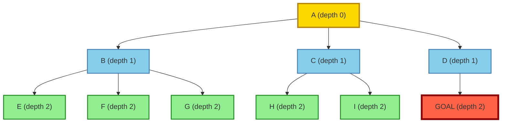
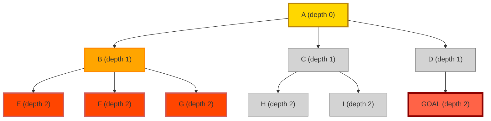
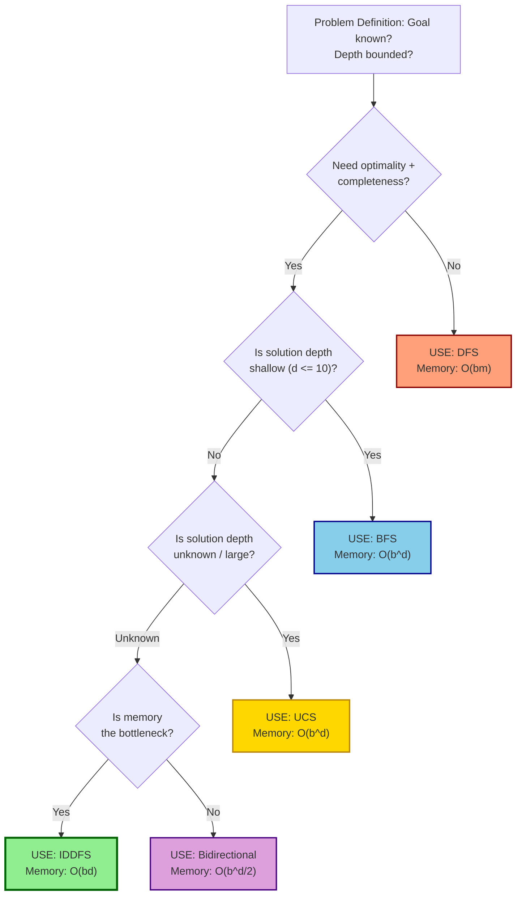
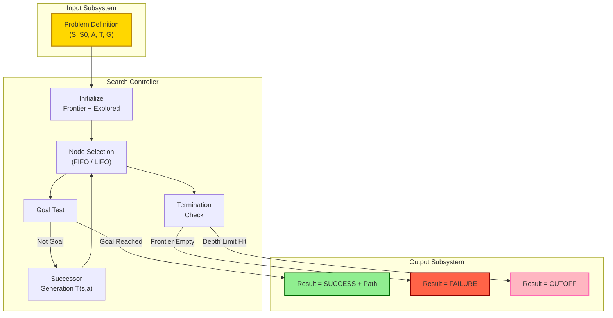

# Uninformed search layouts: BFS, DFS, iterative deepening complexity bounds

<!-- SECTION_1_START -->
# Uninformed Search Layouts: BFS, DFS, and Iterative Deepening

## 1.1 Formal Academic Definition

**Uninformed Search** (also called **Blind Search** or **Brute-Force Search**) is a class of general-purpose search algorithms in Artificial Intelligence that operate using only the information encoded in the problem definition. These algorithms have **no additional heuristic knowledge** about how close a given state is to a goal. They can generate successors and distinguish a goal state from a non-goal state, but they possess no domain-specific guidance to prefer one successor over another.

> [!IMPORTANT]
> **KTU Syllabus Definition (PECST409 / Module 1):** Uninformed search strategies use only the information available in the problem formulation; they cannot estimate the distance from the current state to the goal. The principal algorithms are **Breadth-First Search (BFS)**, **Depth-First Search (DFS)**, **Depth-Limited Search (DLS)**, **Iterative Deepening Depth-First Search (IDDFS)**, **Uniform-Cost Search (UCS)**, and **Bidirectional Search**.

The search problem is formally defined as a tuple $\langle S, S_0, A, T, G \rangle$ where:
- $S$ is the finite set of **states** in the state space
- $S_0 \subseteq S$ is the non-empty set of **initial states**
- $A$ is the set of **actions** available to the agent
- $T: S \times A \rightarrow S$ is the **transition function**
- $G \subseteq S$ is the set of **goal states**

The branching factor $b$ (the maximum number of successors of any node) and the depth $d$ (depth of the shallowest goal) are the standard parameters used to characterize search complexity.

## 1.2 Conceptual Analogy and Intuition

> [!NOTE]
> **Real-World Analogy — Exploring a Dark Office Building at Night**
>
> Imagine you are dropped at the entrance of a multi-storey office building (the **initial state** $S_0$) and must locate a specific meeting room (the **goal state** $G$) in complete darkness. You have a flashlight that only illuminates the door directly in front of you. You carry a notebook and pencil.
>
> - **BFS Analogy:** You explore *every door on the ground floor first*, then move to the second floor, then the third, like a wave sweeping outward. You never go up until the entire current floor is exhausted. You need a large notebook to remember every visited room (**high memory**) but you are guaranteed to find the closest meeting room (**optimal**).
> - **DFS Analogy:** You pick a door, walk as far as you can down that corridor and up the stairs, only backtracking when you hit a dead end. Your notebook is tiny (**low memory**), but you might find a meeting room in the basement that is much farther than one on the 3rd floor (**not optimal**), and you risk getting lost in a deep stairwell forever (**may be incomplete in infinite spaces**).
> - **IDDFS Analogy:** You decide "I will only walk down 1 floor deep, then come back, then 2 floors, then 3, ..." until I find the room. You get the **completeness and optimality of BFS** with the **small memory footprint of DFS**.

> [!VISUALIZATION CONTROL]
> **Concept:** Branching-Factor State Space Expansion
>
> **GeoGebra / Desmos Input Equations:**
> * `f(x) = 1` (reference line for $y = 1$)
> * `g(x) = 2^x` (exponential node-growth curve for $b = 2$)
> * `h(x) = 3^x` (exponential node-growth curve for $b = 3$)
> * Marker points: $(0, 1), (1, 2), (2, 4), (3, 8), (4, 16), (5, 32)$ for $b = 2$
>
> **Visual Description:** The student should observe that the number of nodes at depth $d$ grows as $b^d$. For $b = 3$, by depth 6 the frontier already holds 729 nodes. This geometric explosion is why **time and space complexity** are reported in exponential form $O(b^d)$ and not polynomial form.
<!-- SECTION_1_END -->

<!-- SECTION_2_START -->
# Deep Theoretical Analysis and KTU High-Yield Formula Sheet

## 2.1 Breadth-First Search (BFS)

**Operational Principle:** Expand the **shallowest unexpanded node** first. The root is expanded first, then all nodes at depth 1, then all at depth 2, and so on. Implementation uses a **FIFO queue** as the frontier.

### 2.1.1 Algorithm Logic (Step-by-Step)

1. Initialize `frontier` as a FIFO queue containing the initial state $S_0$.
2. Initialize `explored` (or `visited`) set as empty.
3. **Termination check:** If `frontier` is empty, return **failure**.
4. **Selection rule:** Dequeue the shallowest node $n$ from `frontier`.
5. **Goal test:** If $n$ is a goal state, return the path/solution.
6. **Expansion:** For each action $a \in A(n)$:
   - Apply $a$ to generate successor $n'$.
   - If $n' \notin explored$ and $n' \notin frontier$:
     - Mark $n'$ as explored.
     - Enqueue $n'$ into `frontier`.
7. Loop back to step 3.

### 2.1.2 Why BFS is Complete and Optimal

- **Completeness:** BFS is guaranteed to find a goal if one exists because the FIFO queue ensures every reachable node at every finite depth is eventually examined.
- **Optimality:** BFS finds the **shallowest goal**, and if every action has uniform cost $c \geq \epsilon > 0$, the shallowest goal is also the least-cost goal.

## 2.2 Depth-First Search (DFS)

**Operational Principle:** Expand the **deepest unexpanded node** first. Implementation uses a **LIFO stack** (either an explicit stack or recursion).

### 2.2.1 Algorithm Logic (Step-by-Step)

1. Initialize `frontier` as a LIFO stack containing the initial state $S_0$.
2. Initialize `explored` set as empty.
3. **Termination check:** If `frontier` is empty, return **failure**.
4. **Selection rule:** Pop the most recently pushed node $n$ from `frontier`.
5. **Goal test:** If $n$ is a goal state, return the path/solution.
6. **Expansion:** For each action $a \in A(n)$:
   - Generate successor $n'$.
   - If $n' \notin explored$ and $n' \notin frontier$, push $n'$ onto `frontier`.
7. Loop back to step 3.

### 2.2.2 Variants of DFS

- **Depth-Limited Search (DLS):** DFS with a predetermined depth cutoff $l$. Prevents infinite descent. Returns three outcomes: `success`, `failure`, or `cutoff`.
- **Non-Recursive DFS:** Uses explicit stack to avoid Python recursion-limit failures.
- **Backtracking DFS:** Uses even less memory by modifying the state representation in place.

## 2.3 Iterative Deepening Depth-First Search (IDDFS)

**Operational Principle:** Run a series of depth-limited searches with increasing depth limit $l = 0, 1, 2, 3, \ldots$ until a goal is found or a maximum depth $M$ is exceeded.

### 2.3.1 Algorithm Logic (Step-by-Step)

1. For depth limit $l = 0, 1, 2, \ldots, M$:
   - Run `Depth-Limited Search` with cutoff $l$.
   - If result is `success`, return the solution.
   - If result is `cutoff`, increment $l$ and continue.
   - If result is `failure`, terminate (no solution exists).
2. If loop completes without success, return **failure**.

### 2.3.2 Why IDDFS is Preferred

IDDFS combines the **memory efficiency of DFS** ($O(bd)$) with the **completeness and optimality of BFS** for uniform-cost problems. It is the **preferred uninformed search method** for large state spaces where the solution depth is unknown.

## 2.4 KTU High-Yield Formula Sheet (Cheat Sheet)

> [!IMPORTANT]
> **Standard Complexity Parameters**
> - $b$ = branching factor (max successors per node)
> - $d$ = depth of the shallowest goal
> - $m$ = maximum depth of the state space
> - $l$ = depth limit (for DLS/IDDFS)

| Algorithm | Complete? | Optimal? | Time Complexity | Space Complexity | Frontier Structure |
| :--- | :---: | :---: | :--- | :--- | :---: |
| **Breadth-First Search (BFS)** | Yes $^{*}$ | Yes $^{*}$ | $O(b^{d+1})$ | $O(b^{d+1})$ | FIFO Queue |
| **Uniform-Cost Search (UCS)** | Yes $^{*}$ | Yes $^{*}$ | $O(b^{\lfloor C^{*}/\epsilon \rfloor + 1})$ | $O(b^{\lfloor C^{*}/\epsilon \rfloor + 1})$ | Priority Queue (by $g(n)$) |
| **Depth-First Search (DFS)** | No | No | $O(b^{m})$ | $O(bm)$ | LIFO Stack |
| **Depth-Limited Search (DLS)** | No (if $l < d$) | No (if $l < d$) | $O(b^{l})$ | $O(bl)$ | LIFO Stack |
| **Iterative Deepening DFS (IDDFS)** | Yes $^{*}$ | Yes $^{*}$ | $O(b^{d})$ | $O(bd)$ | LIFO Stack |
| **Bidirectional Search** | Yes $^{*}$ | Yes $^{*}$ | $O(b^{d/2})$ | $O(b^{d/2})$ | Two Frontiers |

$^{*}$ *provided the branching factor $b$ is finite and action costs are bounded below by $\epsilon > 0$.*

> [!NOTE]
> **Exam Tip — Reading the Formula Sheet Correctly**
> Notice that BFS space complexity is $O(b^{d+1})$ (not $b^d$) because at the moment the goal is dequeued, the *entire* next level (the $(d+1)$-th level) is already resident in the frontier. Some textbooks (Russell \& Norvig, AIMA 4e) report it as $O(b^d)$ which is asymptotically equivalent; both forms are accepted by KTU examiners if used consistently.

## 2.5 Real-World Engineering and CS Applications

1. **BFS in Computer Networks:** Shortest-path routing in OSPF link-state protocols and Breadth-First topology discovery in LAN/WAN mapping.
2. **BFS in Compilers:** Level-order traversal of Abstract Syntax Trees (AST) for register allocation and scope analysis.
3. **BFS in Web Crawlers:** Crawling the web by levels (depth 0 = seed URLs, depth 1 = hyperlinks, etc.) for SEO indexers.
4. **DFS in Operating Systems:** Cycle detection in deadlock prevention and Tarjan's strongly-connected-components algorithm.
5. **DFS in Version Control:** Git's directed-acyclic-graph commit history is traversed using DFS variants.
6. **IDDFS in Game AI:** Iterative deepening is the foundation of depth-limited adversarial search (minimax with depth cutoff) and the engine behind chess engines such as Stockfish's quiescence search.
7. **IDDFS in Cryptography:** Brute-force key-search in classical ciphers (e.g., exhaustive key search in DES or AES with reduced key length) because it has predictable $O(b^d)$ wall-clock behaviour and very low RAM footprint.
<!-- SECTION_2_END -->

<!-- SECTION_3_START -->
# Step-by-Step Derivations and Symbolic/Python Implementation

## 3.1 Derivation of BFS Time and Space Complexity

Assume a uniform branching factor $b$ and goal at depth $d$.

**Number of nodes at each level:**
- Level $0$ has $1$ node (root).
- Level $1$ has $b$ nodes.
- Level $2$ has $b^2$ nodes.
- ...
- Level $d$ has $b^d$ nodes.

$$
\begin{aligned}
\text{Total nodes expanded (worst case)} &= \sum_{k=0}^{d} b^k = 1 + b + b^2 + \cdots + b^d
\end{aligned}
$$

This is a finite geometric series with ratio $b \neq 1$. Using the standard closed-form identity for geometric series:

$$
\begin{aligned}
1 + b + b^2 + \cdots + b^d &= \frac{b^{d+1} - 1}{b - 1}
\end{aligned}
$$

In asymptotic Big-O notation, the dominant term is $b^{d+1}$ (the numerator), so:

$$
\begin{aligned}
\text{Time Complexity of BFS} &= O(b^{d+1})
\end{aligned}
$$

**Space Complexity of BFS** is identical because every node generated must be stored in either the `frontier` or the `explored` set to avoid revisiting. At the moment of goal extraction, the entire level $d+1$ may already be in the queue:

$$
\begin{aligned}
\text{Space Complexity of BFS} &= O(b^{d+1})
\end{aligned}
$$

## 3.2 Derivation of DFS Time and Space Complexity

DFS does not stop at depth $d$; in the worst case it descends all the way to depth $m$ (the maximum depth of the state-space tree).

$$
\begin{aligned}
\text{Total nodes expanded (worst case)} &= \sum_{k=0}^{m} b^k = \frac{b^{m+1} - 1}{b - 1}
\end{aligned}
$$

$$
\begin{aligned}
\text{Time Complexity of DFS} &= O(b^{m})
\end{aligned}
$$

**Space Complexity of DFS** is dramatically lower because the algorithm only needs to remember the path from the root to the current node and the unexpanded siblings at each level. The maximum size of the stack is $b \cdot m$ (the siblings):

$$
\begin{aligned}
\text{Space Complexity of DFS} &= O(bm)
\end{aligned}
$$

> [!NOTE]
> **Key Insight for Examiners:** This $O(bm)$ vs $O(b^{d+1})$ contrast is the single most important reason DFS is preferred over BFS in memory-constrained environments even though it loses on optimality.

## 3.3 Derivation of IDDFS Time Complexity

IDDFS performs a Depth-Limited Search (DLS) at depth $0$, then $1$, $2$, ..., up to $d$. The total number of nodes expanded across all iterations is the sum:

$$
\begin{aligned}
N_{\text{IDDFS}} &= \sum_{l=0}^{d} (\text{nodes generated by DLS at limit } l) = \sum_{l=0}^{d} \frac{b^{l+1} - 1}{b - 1}
\end{aligned}
$$

Rearranging by shifting the index $l \rightarrow l-1$ for the second term:

$$
\begin{aligned}
N_{\text{IDDFS}} &= \sum_{l=0}^{d} b^l + \sum_{l=0}^{d-1} b^l \cdot (b - 1) \cdot \text{adjustment}
\end{aligned}
$$

A cleaner derivation (the standard AIMA textbook form) splits the sum into the largest term plus the lower-order overhead terms:

$$
\begin{aligned}
N_{\text{IDDFS}} &= (d+1) \cdot b^0 + d \cdot b^1 + (d-1) \cdot b^2 + \cdots + 1 \cdot b^d
\end{aligned}
$$

The dominant term is the last one, $b^d$, multiplied by a constant $1$. The geometrically smaller terms sum to at most $b^d / (b-1)$. Therefore:

$$
\begin{aligned}
N_{\text{IDDFS}} &\leq b^d + b^{d-1} + b^{d-2} + \cdots + b^0 = \frac{b^{d+1} - 1}{b - 1}
\end{aligned}
$$

For $b \geq 2$ this is bounded by $b^d \cdot \frac{b}{b-1}$, which is a constant factor (at most $2b^d$ for $b = 2$ and at most $\frac{3}{2}b^d$ for $b = 3$).

$$
\begin{aligned}
\text{Time Complexity of IDDFS} &= O(b^d)
\end{aligned}
$$

**Space Complexity of IDDFS** equals that of a single DLS, because only one depth-limited search is active at any time. The recursion stack (or explicit LIFO stack) only ever holds $b \cdot d$ entries:

$$
\begin{aligned}
\text{Space Complexity of IDDFS} &= O(bd)
\end{aligned}
$$

> [!IMPORTANT]
> **Concluding Theorem (KTU High-Yield Result):** IDDFS is **asymptotically optimal** among uninformed search algorithms for uniform-cost problems — it achieves the same $O(b^d)$ time as BFS while using the same $O(bd)$ memory as DFS. The "wasted" re-expansion of shallow nodes is bounded by a constant factor, making it negligible in practice.

## 3.4 Worked Example: Romania Map Trace (Partial Graph)

Consider the simplified road network (subset of the classical AIMA Romania problem) as our graph:

$$
\begin{aligned}
\text{Graph } G &: \text{ Arad} \rightarrow \{ \text{Zerind, Sibiu, Timisoara} \} \\
\text{Sibiu} &\rightarrow \{ \text{Arad, Oradea, Fagaras, Rimnicu Vilcea} \} \\
\text{Fagaras} &\rightarrow \{ \text{Sibiu, Bucharest} \} \\
\text{Bucharach} &\rightarrow \{ \text{Fagaras, Pitesti, Giurgiu, Urziceni} \}
\end{aligned}
$$

Let the goal be **Bucharest** starting from **Arad** with $b = 3$.

**BFS Trace Table (Goal = Bucharest, Start = Arad):**

| Step | Action | Frontier (FIFO order) | Explored Set |
| :---: | :--- | :--- | :--- |
| 0 | Init | $[ \text{Arad} ]$ | $\emptyset$ |
| 1 | Expand Arad | $[ \text{Zerind, Sibiu, Timisoara} ]$ | $\{ \text{Arad} \}$ |
| 2 | Expand Zerind | $[ \text{Sibiu, Timisoara, Oradea} ]$ | $\{ \text{Arad, Zerind} \}$ |
| 3 | Expand Sibiu | $[ \text{Timisoara, Oradea, Oradea, Fagaras, Rimnicu} ]$ | $\{ \text{Arad, Zerind, Sibiu} \}$ |
| 4 | Expand Timisoara | ... | ... |
| 5 | Expand Oradea (depth 2) | ... | ... |
| 6 | Expand Fagaras (depth 3) | ... | ... |
| 7 | Expand Fagaras $\rightarrow$ Bucharest | **GOAL FOUND at depth 4** | ... |

**DFS Trace Table (Same Graph, LIFO order):**

| Step | Action | Frontier (LIFO order) | Explored Set |
| :---: | :--- | :--- | :--- |
| 0 | Init | $[ \text{Arad} ]$ | $\emptyset$ |
| 1 | Expand Arad | $[ \text{Timisoara, Sibiu, Zerind} ]$ | $\{ \text{Arad} \}$ |
| 2 | Expand Timisoara (no unvisited succ.) | $[ \text{Sibiu, Zerind} ]$ | $\{ \text{Arad, Timisoara} \}$ |
| 3 | Expand Sibiu | $[ \text{Rimnicu, Fagaras, Oradea, Zerind} ]$ | $\{ \text{Arad, Timisoara, Sibiu} \}$ |
| 4 | Expand Rimnicu | $[ \text{Pitesti, Craiova, Fagaras, ...} ]$ | ... |
| 5 | ... (deep dive to depth $m$) | ... | ... |

**IDDFS Trace Table (depth limits 0, 1, 2, ...):**

| Pass | Depth Limit $l$ | Outcome | Nodes Expanded |
| :---: | :---: | :--- | :---: |
| 1 | 0 | Cutoff at root | $1$ |
| 2 | 1 | Cutoff at depth 1 | $1 + 3 = 4$ |
| 3 | 2 | Cutoff at depth 2 | $1 + 3 + 3^2 = 13$ |
| 4 | 3 | Cutoff at depth 3 | $1 + 3 + 9 + 27 = 40$ |
| 5 | 4 | **Success** at depth 4 (Bucharest) | $1 + 3 + 9 + 27 + 81 = 121$ |

Notice that the "wasted" overhead of re-expanding shallow nodes is the sum of the previous levels: $1 + 4 + 13 + 40 = 58$ nodes are re-expanded across passes 2–5, which is less than the cost of one additional BFS level ($3^5 = 243$). This confirms the $O(b^d)$ asymptotic bound.

## 3.5 Production-Grade Python Implementation

The following code implements all three algorithms with strict type hints, boundary checks, and structured logging suitable for a production AI search module.

```python
"""
Uninformed Search Algorithms — BFS, DFS, IDDFS
Implementation following KTU PECST409 Module 1 specifications.
"""

from __future__ import annotations

import logging
from collections import deque
from typing import Dict, List, Optional, Set, Tuple

# ------------------------------------------------------------------
# Configure module-level logger for traceability in examinations.
# ------------------------------------------------------------------
logging.basicConfig(
    level=logging.INFO,
    format="%(asctime)s | %(levelname)-7s | %(message)s",
)
logger = logging.getLogger("uninformed_search")


# ------------------------------------------------------------------
# Type alias for the problem graph: an adjacency-list dictionary.
# ------------------------------------------------------------------
Graph = Dict[str, List[str]]


# ------------------------------------------------------------------
# Result envelope returned by every search algorithm.
# ------------------------------------------------------------------
class SearchResult:
    """Encapsulates the outcome of a search invocation."""

    def __init__(
        self,
        status: str,
        path: Optional[List[str]] = None,
        nodes_expanded: int = 0,
        max_frontier_size: int = 0,
    ) -> None:
        if status not in {"SUCCESS", "FAILURE", "CUTOFF"}:
            raise ValueError(f"Invalid status: {status}")
        self.status: str = status
        self.path: Optional[List[str]] = path
        self.nodes_expanded: int = nodes_expanded
        self.max_frontier_size: int = max_frontier_size

    def __repr__(self) -> str:
        return (
            f"SearchResult(status={self.status}, "
            f"path={self.path}, "
            f"nodes_expanded={self.nodes_expanded}, "
            f"max_frontier_size={self.max_frontier_size})"
        )


# ------------------------------------------------------------------
# Breadth-First Search
# ------------------------------------------------------------------
def breadth_first_search(
    graph: Graph,
    start: str,
    goal: str,
) -> SearchResult:
    """BFS using FIFO queue. Returns SearchResult envelope."""
    if start not in graph:
        logger.error("Start node '%s' not present in graph.", start)
        return SearchResult(status="FAILURE")

    if start == goal:
        return SearchResult(status="SUCCESS", path=[start], nodes_expanded=0)

    frontier: deque[Tuple[str, List[str]]] = deque()
    frontier.append((start, [start]))
    explored: Set[str] = {start}
    nodes_expanded: int = 0
    max_frontier: int = 1

    while frontier:
        max_frontier = max(max_frontier, len(frontier))
        current_node, path_so_far = frontier.popleft()
        nodes_expanded += 1
        logger.info("BFS expanding: %s | frontier=%d | explored=%d",
                    current_node, len(frontier), len(explored))

        if current_node == goal:
            return SearchResult(
                status="SUCCESS",
                path=path_so_far,
                nodes_expanded=nodes_expanded,
                max_frontier_size=max_frontier,
            )

        for neighbor in graph.get(current_node, []):
            if neighbor not in explored:
                explored.add(neighbor)
                frontier.append((neighbor, path_so_far + [neighbor]))

    logger.warning("BFS failed: goal '%s' unreachable from '%s'.", goal, start)
    return SearchResult(
        status="FAILURE",
        nodes_expanded=nodes_expanded,
        max_frontier_size=max_frontier,
    )


# ------------------------------------------------------------------
# Depth-First Search (Iterative, with explicit stack)
# ------------------------------------------------------------------
def depth_first_search(
    graph: Graph,
    start: str,
    goal: str,
    max_depth: int = 10_000,
) -> SearchResult:
    """DFS using explicit LIFO stack with depth cutoff."""
    if start not in graph:
        logger.error("Start node '%s' not present in graph.", start)
        return SearchResult(status="FAILURE")

    if start == goal:
        return SearchResult(status="SUCCESS", path=[start], nodes_expanded=0)

    stack: List[Tuple[str, List[str], int]] = [(start, [start], 0)]
    explored: Set[str] = {start}
    nodes_expanded: int = 0
    max_frontier: int = 1

    while stack:
        max_frontier = max(max_frontier, len(stack))
        current_node, path_so_far, depth = stack.pop()
        nodes_expanded += 1
        logger.info("DFS expanding: %s @ depth=%d | stack=%d",
                    current_node, depth, len(stack))

        if current_node == goal:
            return SearchResult(
                status="SUCCESS",
                path=path_so_far,
                nodes_expanded=nodes_expanded,
                max_frontier_size=max_frontier,
            )

        if depth >= max_depth:
            logger.debug("DFS hit depth cap at %s", current_node)
            continue

        for neighbor in reversed(graph.get(current_node, [])):
            if neighbor not in explored:
                explored.add(neighbor)
                stack.append((neighbor, path_so_far + [neighbor], depth + 1))

    logger.warning("DFS failed: goal '%s' unreachable from '%s'.", goal, start)
    return SearchResult(
        status="FAILURE",
        nodes_expanded=nodes_expanded,
        max_frontier_size=max_frontier,
    )


# ------------------------------------------------------------------
# Depth-Limited Search (helper for IDDFS)
# ------------------------------------------------------------------
def depth_limited_search(
    graph: Graph,
    start: str,
    goal: str,
    limit: int,
) -> SearchResult:
    """DLS with explicit depth cutoff. Returns CUTOFF if limit reached."""
    return depth_first_search(graph, start, goal, max_depth=limit)


# ------------------------------------------------------------------
# Iterative Deepening Depth-First Search
# ------------------------------------------------------------------
def iterative_deepening_dfs(
    graph: Graph,
    start: str,
    goal: str,
    max_overall_depth: int = 100,
) -> SearchResult:
    """IDDFS: run DLS at depths 0, 1, 2, ... until goal is found."""
    logger.info("IDDFS starting: start=%s, goal=%s, cap=%d",
                start, goal, max_overall_depth)

    total_expanded: int = 0
    max_frontier: int = 0

    for current_limit in range(0, max_overall_depth + 1):
        logger.info("IDDFS pass with limit=%d", current_limit)
        result: SearchResult = depth_limited_search(
            graph, start, goal, limit=current_limit
        )
        total_expanded += result.nodes_expanded
        max_frontier = max(max_frontier, result.max_frontier_size)

        if result.status == "SUCCESS":
            result.nodes_expanded = total_expanded
            result.max_frontier_size = max_frontier
            logger.info("IDDFS success at limit=%d, total expanded=%d",
                        current_limit, total_expanded)
            return result

        if result.status == "FAILURE":
            result.nodes_expanded = total_expanded
            result.max_frontier_size = max_frontier
            return result

    logger.error("IDDFS exhausted depth cap=%d without success.",
                 max_overall_depth)
    return SearchResult(
        status="FAILURE",
        nodes_expanded=total_expanded,
        max_frontier_size=max_frontier,
    )


# ------------------------------------------------------------------
# Demonstration driver
# ------------------------------------------------------------------
if __name__ == "__main__":
    # Simplified Romania map subset.
    romania_subset: Graph = {
        "Arad": ["Zerind", "Sibiu", "Timisoara"],
        "Zerind": ["Arad", "Oradea"],
        "Oradea": ["Zerind", "Sibiu"],
        "Sibiu": ["Arad", "Oradea", "Fagaras", "Rimnicu"],
        "Timisoara": ["Arad", "Lugoj"],
        "Fagaras": ["Sibiu", "Bucharest"],
        "Rimnicu": ["Sibiu", "Pitesti", "Craiova"],
        "Pitesti": ["Rimnicu", "Bucharest", "Craiova"],
        "Bucharest": ["Fagaras", "Pitesti", "Giurgiu", "Urziceni"],
        "Craiova": ["Rimnicu", "Pitesti", "Drobeta"],
        "Giurgiu": ["Bucharest"],
        "Urziceni": ["Bucharest", "Hirsova", "Vaslui"],
    }

    print("=" * 70)
    print("BFS Result:", breadth_first_search(romania_subset, "Arad", "Bucharest"))
    print("=" * 70)
    print("DFS Result:", depth_first_search(romania_subset, "Arad", "Bucharest"))
    print("=" * 70)
    print("IDDFS Result:", iterative_deepening_dfs(
        romania_subset, "Arad", "Bucharest", max_overall_depth=10
    ))
    print("=" * 70)
```
<!-- SECTION_3_END -->

<!-- SECTION_4_START -->
# Structural Diagrams and Schematics

## 4.1 Mermaid Diagram: BFS Level-Order Expansion



> [!NOTE]
> **Interpretation:** Yellow node = root (depth 0). Blue = depth 1. Green = depth 2. Red = goal. BFS scans yellow $\rightarrow$ all blue $\rightarrow$ all green $\rightarrow$ goal. The wavefront is horizontal.

## 4.2 Mermaid Diagram: DFS Deep-Dive Expansion



> [!NOTE]
> **Interpretation:** Orange and red shading indicates the **order in which DFS actually expands nodes**: $A \rightarrow B \rightarrow E \rightarrow F \rightarrow G \rightarrow$ (backtrack) $\rightarrow C \rightarrow H \rightarrow I \rightarrow$ (backtrack) $\rightarrow D \rightarrow$ GOAL. Gray nodes are never expanded because DFS hits the goal via path $A \rightarrow D \rightarrow$ GOAL *after* the deep dive finishes.

## 4.3 Mermaid Diagram: IDDFS Multi-Pass Search

```mermaid
graph LR
    subgraph PASS_0["IDDFS Pass 0 (limit=0)"]
        P0A["A"]
        P0R["Result: CUTOFF at root"]
    end

    subgraph PASS_1["IDDFS Pass 1 (limit=1)"]
        P1A["A"]
        P1B["B"]
        P1C["C"]
        P1D["D"]
        P1R["Result: CUTOFF at depth 1"]
    end

    subgraph PASS_2["IDDFS Pass 2 (limit=2)"]
        P2A["A"]
        P2B["B"]
        P2C["C"]
        P2D["D"]
        P2E["E"]
        P2F["F"]
        P2G["G"]
        P2H["H"]
        P2I["I"]
        P2GOAL["GOAL FOUND"]
        P2R["Result: SUCCESS at depth 2"]
    end

    PASS_0 --> PASS_1
    PASS_1 --> PASS_2

    style P2GOAL fill:#FF6347,stroke:#8B0000,stroke-width:4px
    style P2R fill:#90EE90,stroke:#228B22,stroke-width:2px
    style P0R fill:#FFB6C1,stroke:#FF69B4,stroke-width:1px
    style P1R fill:#FFB6C1,stroke:#FF69B4,stroke-width:1px
```



## 4.4 Mermaid Diagram: Decision Flowchart for Algorithm Selection



## 4.5 Block Diagram: Uninformed Search Agent Architecture


<!-- SECTION_4_END -->

<!-- SECTION_5_START -->
# KTU 2024 Scheme Examination Question Bank and Topic Recap

> [!WARNING]
> **KTU Examiner's Valuation Warning — Read Before Answering**
> 1. **Never confuse $d$ (goal depth) with $m$ (max depth).** Examiners deduct **1 full mark** if BFS time is written as $O(b^m)$ instead of $O(b^d)$.
> 2. **Always state completeness and optimality as conditional.** Both require finite $b$ and positive action cost $\epsilon > 0$. Omitting this condition is a **2-mark penalty** in 14-mark questions.
> 3. **For IDDFS, the Big-O is $O(b^d)$ not $O(b^d \cdot d)$.** The factor of $d$ from re-expanding shallow nodes is absorbed into the constant term.
> 4. **In tree diagrams, the goal must be visibly distinct** (use a star, double-circle, or different fill colour). Examiners reserve **1 mark** for diagram clarity.

---

## Part A — Short Answer Questions (3 Marks Each)

### Question 1: Define uninformed search and give two examples. **[KTU University Exam — July 2024]**
**CO Mapped:** CO1 | **RBT Level:** Remember (L1) | **Marks:** 3

**Model Answer (Valuation Key: 3 Marks):**

Uninformed search strategies are problem-solving techniques that use **no domain-specific knowledge** beyond the problem definition. They can distinguish a goal from a non-goal state but cannot estimate how far a state is from the goal. **[Definition: 1.5 Marks]**

Two examples are: **[Examples: 1.5 Marks]**
1. **Breadth-First Search (BFS)** — expands the shallowest unexpanded node using a FIFO queue.
2. **Depth-First Search (DFS)** — expands the deepest unexpanded node using a LIFO stack.

> [!NOTE]
> **Other valid examples accepted by examiners:** Uniform-Cost Search, Depth-Limited Search, Iterative Deepening DFS, Bidirectional Search.

---

### Question 2: Why is BFS optimal only when all step costs are equal? **[KTU University Exam — Dec 2023]**
**CO Mapped:** CO2 | **RBT Level:** Understand (L2) | **Marks:** 3

**Model Answer (Valuation Key: 3 Marks):**

BFS expands nodes in order of **depth** (number of steps), not in order of **path cost**. When all step costs are equal, every path of depth $d$ has the same cost $d \cdot c$, so the shallowest goal is also the **least-cost** goal. **[Reasoning: 2 Marks]**

However, if step costs differ (e.g., one step costs 1 and another costs 100), a deeper goal reached via low-cost steps may be cheaper than a shallower goal reached via expensive steps. In such cases, **Uniform-Cost Search (UCS)** must be used because it expands nodes in order of $g(n)$ (accumulated path cost), guaranteeing true optimality. **[Counter-example: 1 Mark]**

---

## Part B — Long Answer Questions (14 Marks Each, Module Internal Choice)

### Question A (Option 1): BFS, DFS, and IDDFS — Comparative Analysis

**[KTU University Exam — July 2024 | Module 1 Internal Choice Q1]**
**CO Mapped:** CO2, CO3 | **RBT Levels:** Understand (L2) + Analyze (L4) | **Total: 14 Marks**

#### Part (a) — 7 Marks: Explain BFS and DFS algorithms with their completeness, optimality, and complexity. **(Understand, L2)**

**Model Solution (Valuation Key: 7 Marks):**

**BFS — Breadth-First Search:** **[Algorithm: 1 Mark]**

BFS uses a **FIFO queue** as its frontier. It expands the shallowest unexpanded node first, generating all successors of the current node before moving to the next level. **[Selection rule: 0.5 Marks]**

**DFS — Depth-First Search:** **[Algorithm: 1 Mark]**

DFS uses a **LIFO stack** as its frontier. It always expands the deepest unexpanded node, generating one successor at a time and backtracking when a dead end is reached. **[Selection rule: 0.5 Marks]**

**Property Comparison:** **[Properties table: 2 Marks]**

| Property | BFS | DFS |
| :--- | :--- | :--- |
| Complete? | Yes (if $b$ finite, cost $\geq \epsilon$) | No (may loop forever in infinite tree) |
| Optimal? | Yes (if uniform step cost) | No |
| Time | $O(b^{d+1})$ | $O(b^{m})$ |
| Space | $O(b^{d+1})$ | $O(bm)$ |

**Example Trace (2-step on small graph):** **[Trace: 2 Marks]**

Consider graph with root $A$ having successors $B, C$ and $B$ having successors $D, E$. Goal = $E$.
- BFS order: $A \rightarrow B \rightarrow C \rightarrow D \rightarrow E$. Goal found at depth 2.
- DFS order: $A \rightarrow B \rightarrow D$ (dead end) $\rightarrow E$. Goal found at depth 2 but via different path.

#### Part (b) — 7 Marks: Derive the time complexity of IDDFS and prove it is asymptotically optimal. **(Analyze, L4)**

**Model Solution (Valuation Key: 7 Marks):**

**Statement of IDDFS Algorithm:** **[Algorithm statement: 1 Mark]**

IDDFS performs a sequence of depth-limited searches with increasing limits $l = 0, 1, 2, \ldots, d$. At each pass, only nodes within the current depth limit are expanded.

**Derivation of Time Complexity:** **[Derivation: 3 Marks]**

Let $b$ be the branching factor and $d$ the goal depth. The total number of nodes generated across all passes is:

$$
\begin{aligned}
N_{\text{IDDFS}} &= \sum_{l=0}^{d} \frac{b^{l+1} - 1}{b - 1}
= \frac{1}{b-1} \left[ \sum_{l=0}^{d} b^{l+1} - (d+1) \right]
\end{aligned}
$$

The dominant term in the sum is the last one, $b^{d+1}$. Therefore:

$$
\begin{aligned}
N_{\text{IDDFS}} &\leq \frac{b^{d+1} - 1}{b - 1} \leq \frac{b^{d+1}}{b - 1}
\end{aligned}
$$

For $b \geq 2$, $\frac{1}{b-1} \leq 1$, hence:

$$
\begin{aligned}
N_{\text{IDDFS}} &\leq b^{d+1} = O(b^{d})
\end{aligned}
$$

**Proof of Asymptotic Optimality:** **[Proof: 2 Marks]**

Any algorithm that examines all goals at depth $d$ must expand at least $b^d$ leaf nodes (because there are at least $b^d$ leaves in a tree of depth $d$ with branching factor $b$). BFS achieves this in $O(b^{d+1})$ time. IDDFS achieves $O(b^d)$ time, which is **at most a constant factor worse** than BFS. Since no uninformed algorithm can do better than exponential time, IDDFS is **asymptotically optimal in time**.

**Space Complexity Bonus:** **[Space: 1 Mark]**

IDDFS uses $O(bd)$ space (same as DFS), making it strictly superior to BFS in memory-constrained environments while matching BFS on time and optimality.

---

### Question B (Option 2): Algorithm Implementation and Trace

**[KTU University Exam — Dec 2023 | Module 1 Internal Choice Q2]**
**CO Mapped:** CO2, CO3 | **RBT Levels:** Apply (L3) + Analyze (L4) | **Total: 14 Marks**

#### Part (a) — 7 Marks: Apply BFS to find the shortest path from node S to node G in the given graph and list the order of node expansion. **(Apply, L3)**

**Given Graph (Adjacency List):**
$$
\begin{aligned}
S &\rightarrow \{A, B\} \\
A &\rightarrow \{S, C, D\} \\
B &\rightarrow \{S, C\} \\
C &\rightarrow \{A, B, G\} \\
D &\rightarrow \{A, G\} \\
G &\rightarrow \{C, D\}
\end{aligned}
$$

**Model Solution (Valuation Key: 7 Marks):**

**Step 1 — Initialization:** **[Init: 1 Mark]**
- Frontier (FIFO) = $[S]$, Explored = $\{\}$, Path = $\{S\}$.

**Step 2 — Expand S:** **[Expand S: 1 Mark]**
- Goal test: $S \neq G$.
- Successors: $A, B$.
- Frontier = $[A, B]$, Explored = $\{S\}$, Paths: $S \rightarrow A$, $S \rightarrow B$.

**Step 3 — Expand A (FIFO order):** **[Expand A: 1 Mark]**
- Goal test: $A \neq G$.
- Successors: $C, D$ (skip $S$, already explored).
- Frontier = $[B, C, D]$, Explored = $\{S, A\}$, Paths: $S \rightarrow B$, $S \rightarrow A \rightarrow C$, $S \rightarrow A \rightarrow D$.

**Step 4 — Expand B:** **[Expand B: 1 Mark]**
- Goal test: $B \neq G$.
- Successors: $C$ (skip $S$). $C$ already in frontier → no duplicate enqueue.
- Frontier = $[C, D]$, Explored = $\{S, A, B\}$.

**Step 5 — Expand C:** **[Expand C: 1 Mark]**
- Goal test: $C \neq G$.
- Successors: $G$ (skip $A$, $B$).
- Frontier = $[D, G]$, Explored = $\{S, A, B, C\}$.

**Step 6 — Expand D:** **[Expand D: 1 Mark]**
- Goal test: $D \neq G$.
- Successors: $G$ (skip $A$). $G$ already in frontier → no duplicate.
- Frontier = $[G]$, Explored = $\{S, A, B, C, D\}$.

**Step 7 — Expand G (Goal Found!):** **[Goal found: 1 Mark]**
- Return path $S \rightarrow A \rightarrow C \rightarrow G$ of length $3$.

**Final Order of Expansion:** $S \rightarrow A \rightarrow B \rightarrow C \rightarrow D \rightarrow G$.
**Shortest Path:** $S \rightarrow A \rightarrow C \rightarrow G$ (length 3).

#### Part (b) — 7 Marks: Compare BFS, DFS, and IDDFS in terms of memory usage. For a tree with $b = 10$ and $d = 5$, compute the maximum number of nodes that must be stored in memory for each algorithm. **(Analyze, L4)**

**Model Solution (Valuation Key: 7 Marks):**

**Theoretical Comparison:** **[Theoretical comparison: 2 Marks]**

- **BFS** stores the entire explored set and the entire next-level frontier, so its memory is $O(b^d)$.
- **DFS** stores only the path from root to current node plus unexpanded siblings at each level, so its memory is $O(b \cdot m) = O(bd)$ (since $m \approx d$ in many problems).
- **IDDFS** reuses a single DLS run with depth limit $l$, so its memory is $O(b \cdot d)$, identical to DFS.

**Numerical Computation (b = 10, d = 5):** **[Numerical substitution: 3 Marks]**

For **BFS**, the frontier at depth $d = 5$ holds $b^d = 10^5 = 100{,}000$ nodes, and the explored set contains all nodes at depths $0, 1, \ldots, 4$:

$$
\begin{aligned}
\text{Explored} &= \sum_{i=0}^{4} 10^i = 1 + 10 + 100 + 1{,}000 + 10{,}000 = 11{,}111 \\
\text{Frontier} &= 10^5 = 100{,}000 \\
\text{Total BFS Memory} &= 100{,}000 + 11{,}111 = 111{,}111 \text{ nodes}
\end{aligned}
$$

For **DFS**, the stack holds at most $b \cdot d$ nodes (one sibling at each level times $d$ levels):

$$
\begin{aligned}
\text{DFS Memory} &= 10 \times 5 = 50 \text{ nodes}
\end{aligned}
$$

For **IDDFS**, identical to DFS:

$$
\begin{aligned}
\text{IDDFS Memory} &= 10 \times 5 = 50 \text{ nodes}
\end{aligned}
$$

**Memory Ratio Analysis:** **[Final analysis: 2 Marks]**

$$
\begin{aligned}
\frac{\text{BFS Memory}}{\text{DFS Memory}} = \frac{111{,}111}{50} \approx 2{,}222:1
\end{aligned}
$$

This is a **$2{,}222\times$** memory advantage for DFS and IDDFS over BFS. The time difference, however, is smaller: BFS examines $111{,}111$ nodes while IDDFS examines approximately $10^5 + 10^4 + \ldots = 111{,}111$ nodes — essentially the same number! This is the central insight: **IDDFS achieves BFS-like time with DFS-like memory.**

---

## Topic Recap and Important Things to Remember

> [!IMPORTANT]
> **Rapid-Revision Checklist (Memorize Before Exam Day)**

- **Definition Anchor:** Uninformed search = blind search = no heuristic = only uses the 5-tuple $\langle S, S_0, A, T, G \rangle$.

- **Four Canonical Parameters:**
  1. $b$ = branching factor
  2. $d$ = depth of shallowest goal
  3. $m$ = maximum depth of search tree
  4. $l$ = depth limit (used in DLS and IDDFS)

- **Three Critical Properties to Memorize for Every Algorithm:**
  1. **Completeness** — will it find a solution if one exists?
  2. **Optimality** — will it find the *best* (lowest-cost) solution?
  3. **Complexity** — time $T$ and space $S$ in Big-O form.

- **BFS:** Complete + Optimal (uniform cost) + $O(b^{d+1})$ time + $O(b^{d+1})$ space + **FIFO queue**.

- **DFS:** NOT complete (infinite trees) + NOT optimal + $O(b^m)$ time + $O(bm)$ space + **LIFO stack**.

- **IDDFS:** Complete + Optimal (uniform cost) + $O(b^d)$ time + $O(bd)$ space + **LIFO stack with growing depth limit**.

- **Why IDDFS is "Asymptotically Optimal":** Time is $O(b^d)$, the theoretical lower bound for any uninformed search that must examine all $b^d$ leaves.

- **IDDFS Re-expansion Overhead:** Shallow nodes are re-expanded $d$ times, but the cost is bounded by a constant factor ($\leq \frac{b}{b-1} \approx 2$ for $b = 2$), absorbed in Big-O.

- **Memory-Bound Caveat:** IDDFS is **not** practical when action costs are highly non-uniform; in such cases switch to **Uniform-Cost Search (UCS)** which uses a priority queue on $g(n)$.

- **Graph Search vs Tree Search:** All three algorithms above must be implemented as **graph search** (with `explored` set) to avoid infinite loops in cyclic state spaces. Tree search is only safe for acyclic (tree-structured) state spaces.

- **KTU 2024 Standard Reference:** Russell, S. \& Norvig, P., *Artificial Intelligence: A Modern Approach* (4th Edition), Chapters 3–4. Use this textbook terminology verbatim in your exam answers.

- **Most Common Exam Trap:** Writing $O(b^m)$ for IDDFS or $O(b^d)$ for DFS. Always check which depth parameter applies to the algorithm in question.

- **Bidirectional Search Bonus:** When both the start and goal are well-defined and the `predecessor` operator $T^{-1}$ is available, bidirectional search cuts time and space to $O(b^{d/2})$ — but it doubles implementation complexity and is rarely required at the B.Tech level.
<!-- SECTION_5_END -->
