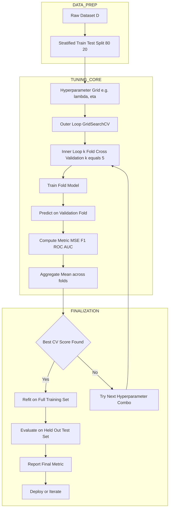
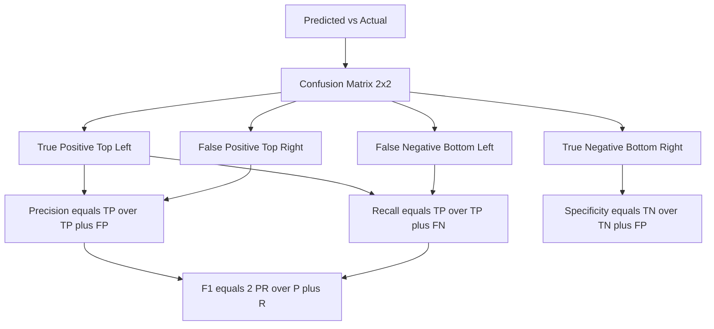

# Linear models parameters tuning, performance verification loops setups metrics

<!-- SECTION_1_START -->

# Linear Models, Parameter Tuning & Performance Verification

## 1.1 Formal Definition (KTU 2024 Syllabus Terminology)

A **linear model** is a supervised learning algorithm that assumes a linear relationship between input features and the target variable. Mathematically, it computes a weighted sum of inputs plus a bias term and (in classification) passes it through a non-linear activation.

In the KTU 2024 PECST409 syllabus, **Module 2 – Machine Learning Primers** defines the two canonical linear models:

> [!IMPORTANT]
> **Linear Regression** predicts a *continuous* target $\hat{y} \in \mathbb{R}$ using $f(\mathbf{x}) = \mathbf{w}^\top \mathbf{x} + b$.
> **Logistic Regression** predicts a *categorical* probability $\hat{y} \in [0,1]$ using $f(\mathbf{x}) = \sigma(\mathbf{w}^\top \mathbf{x} + b)$ where $\sigma$ is the sigmoid function.

**Parameters** are the values the model *learns from data* (weights $\mathbf{w}$ and bias $b$). **Hyperparameters** are the values *set before training* (learning rate $\eta$, regularization strength $\lambda$, number of epochs, batch size, polynomial degree). The art of choosing the latter is called **hyperparameter tuning**, and the science of knowing whether your choice is good is **performance verification** using **metrics**.

## 1.2 Conceptual Analogy / Intuition

Imagine you are an engineer trying to predict **house prices** based on **square footage**.

- The *line* $y = mx + c$ is your linear model — the slope $m$ is the "price increase per extra square foot", and $c$ is the base price.
- If the line is too flat, you under-predict big houses. If it is too steep, you over-predict small ones. The line that minimizes total error is the **best-fit line** found by **gradient descent** — picture rolling a ball down a 3-D "error bowl" until it settles in the lowest valley.
- The size of each step the ball takes is the **learning rate** $\eta$. Too big → the ball overshoots. Too small → it takes forever.
- Now imagine you have 100 houses. You randomly hide 20 of them (the **test set**) and fit the line on the remaining 80 (the **training set**). You repeat this hiding 5 times with different splits (this is **k-fold cross-validation**) so the same model is judged on every house.
- Finally, you measure: "On average, how far off is the predicted price from the real one?" That single number is the **Mean Absolute Error (MAE)** — your **performance metric**.

> [!NOTE]
> A **metric** is a *scalar score* that tells you how wrong (or right) your model is. Without a metric, "good" and "bad" are just feelings — not engineering.

## 1.3 The Two Key Constant Families in Linear Models

- **Standard benchmark metrics:** **MSE = 0** means perfect prediction, **R² = 1** means the model explains 100% of variance.
- **Sigmoid constant:** $\sigma(z) = \dfrac{1}{1 + e^{-z}}$, squashing any real number into the open interval $(0, 1)$.

> [!VISUALIZATION CONTROL]
> **Concept:** Gradient Descent on a quadratic loss surface
> **Desmos Input Equations:**
> * `f(x,y) = (x-3)^2 + 3*(y+1)^2` (bowl-shaped loss landscape)
> * `g(t) = 3 - 2.5*exp(-0.3*t)` (parameter $w$ over time)
> * `h(t) = -1 + 1.2*exp(-0.3*t)` (parameter $b$ over time)
> **Visual Description:** The student should see a tilted bowl with the global minimum near $(3, -1)$. The curves $g(t)$ and $h(t)$ should approach those values monotonically, illustrating parameter convergence.

<!-- SECTION_1_END -->

<!-- SECTION_2_START -->

# Deep Theoretical Analysis & KTU Formula Sheet

## 2.1 Anatomy of a Linear Model

For a single training example $\mathbf{x} \in \mathbb{R}^{n}$ with target $y$:

$$\hat{y} = f(\mathbf{x}) = \mathbf{w}^\top \mathbf{x} + b = \sum_{j=1}^{n} w_j x_j + b$$

- $\mathbf{w} = (w_1, w_2, \ldots, w_n)$ are the **learned feature weights**.
- $b$ is the **bias / intercept**.
- For a dataset of $m$ samples stacked into a design matrix $X \in \mathbb{R}^{m \times n}$:

$$\hat{\mathbf{y}} = X\mathbf{w} + b \mathbf{1}$$

## 2.2 Cost (Loss) Functions

The cost function measures the cumulative error across the training set.

| Task | Cost Function | Formula | Use Case |
|---|---|---|---|
| Linear Regression | Mean Squared Error (MSE) | $J(\mathbf{w}, b) = \dfrac{1}{2m} \sum_{i=1}^{m} (\hat{y}^{(i)} - y^{(i)})^2$ | Continuous targets |
| Linear Regression | Mean Absolute Error (MAE) | $J(\mathbf{w}, b) = \dfrac{1}{m} \sum_{i=1}^{m} \vert \hat{y}^{(i)} - y^{(i)} \vert$ | Robust to outliers |
| Logistic Regression | Binary Cross-Entropy (Log Loss) | $J(\mathbf{w}, b) = -\dfrac{1}{m} \sum_{i=1}^{m} \left[ y^{(i)} \log \hat{y}^{(i)} + (1 - y^{(i)}) \log(1 - \hat{y}^{(i)}) \right]$ | Binary classification |
| Regularization | L2 (Ridge) penalty | $\Omega = \dfrac{\lambda}{2m} \sum_{j=1}^{n} w_j^2$ | Penalize large weights |
| Regularization | L1 (Lasso) penalty | $\Omega = \dfrac{\lambda}{m} \sum_{j=1}^{n} \vert w_j \vert$ | Induce sparsity |

## 2.3 Optimization — Gradient Descent

Gradient descent iteratively updates parameters in the *opposite* direction of the cost gradient.

$$\mathbf{w} \leftarrow \mathbf{w} - \eta \frac{\partial J}{\partial \mathbf{w}}, \qquad b \leftarrow b - \eta \frac{\partial J}{\partial b}$$

For MSE with linear regression, the gradients are:

$$\frac{\partial J}{\partial w_j} = \frac{1}{m} \sum_{i=1}^{m} (\hat{y}^{(i)} - y^{(i)})\, x_j^{(i)}, \qquad \frac{\partial J}{\partial b} = \frac{1}{m} \sum_{i=1}^{m} (\hat{y}^{(i)} - y^{(i)})$$

The **closed-form normal equation** (no iteration needed) is:

$$\mathbf{w}^{*} = (X^\top X)^{-1} X^\top \mathbf{y}$$

## 2.4 Performance Verification — The k-Fold Cross-Validation Loop

A robust evaluation strategy splits the data into $k$ equal folds and rotates which fold is held out as the test set.

$$\text{CV Score} = \frac{1}{k} \sum_{i=1}^{k} \text{Metric}\big(\mathbf{y}_{\text{test}}^{(i)}, \hat{\mathbf{y}}_{\text{test}}^{(i)}\big)$$

**Variants of the verification loop:**

- **Hold-out split:** Single 80/20 (or 70/30) train/test split. Fast but high-variance.
- **k-Fold CV:** $k$ rotations; standard choice is $k = 5$ or $k = 10$.
- **Stratified k-Fold:** Preserves class proportions — mandatory for imbalanced classification.
- **Leave-One-Out CV (LOOCV):** $k = m$. Computationally expensive, low bias, high variance.

## 2.5 KTU High-Yield Formula Sheet

| Metric | Formula | Range | Best Value | Task |
|---|---|---|---|---|
| MSE | $\dfrac{1}{m} \sum (\hat{y}_i - y_i)^2$ | $[0, \infty)$ | **0** | Regression |
| RMSE | $\sqrt{\text{MSE}}$ | $[0, \infty)$ | **0** | Regression |
| MAE | $\dfrac{1}{m} \sum \vert \hat{y}_i - y_i \vert$ | $[0, \infty)$ | **0** | Regression |
| R² (Coefficient of Determination) | $1 - \dfrac{\sum (y_i - \hat{y}_i)^2}{\sum (y_i - \bar{y})^2}$ | $(-\infty, 1]$ | **1** | Regression |
| Accuracy | $\dfrac{TP + TN}{TP + TN + FP + FN}$ | $[0, 1]$ | **1** | Classification |
| Precision | $\dfrac{TP}{TP + FP}$ | $[0, 1]$ | **1** | Classification |
| Recall (Sensitivity) | $\dfrac{TP}{TP + FN}$ | $[0, 1]$ | **1** | Classification |
| F1-Score | $2 \cdot \dfrac{P \cdot R}{P + R}$ | $[0, 1]$ | **1** | Imbalanced classification |
| ROC-AUC | Area under TPR vs FPR curve | $[0, 1]$ | **1** | Probabilistic classification |

## 2.6 Real-World Engineering Utility

- **Linear regression** underlies demand forecasting, sensor calibration, and CPU performance prediction in production load balancers.
- **Logistic regression** is still the workhorse for credit-card fraud detection and spam filtering — interpretable, fast, and deployable on edge devices.
- **Cross-validation** is non-negotiable in clinical ML (FDA submissions require it) and in AutoML pipelines like *Google Vertex AI* and *Azure ML*.
- **F1-Score** is preferred over accuracy in medical diagnosis and rare-event detection where class imbalance is severe.

<!-- SECTION_2_END -->

<!-- SECTION_3_START -->

# Step-by-Step Derivations, Loops & Code Implementation

## 3.1 Derivation of the Normal Equation

We minimize the MSE cost with respect to $\mathbf{w}$. Let $X \in \mathbb{R}^{m \times n}$ and $\mathbf{y} \in \mathbb{R}^{m}$.

$$J(\mathbf{w}) = \frac{1}{2m} (X\mathbf{w} - \mathbf{y})^\top (X\mathbf{w} - \mathbf{y})$$

**Step 1:** Expand the quadratic form.

$$J(\mathbf{w}) = \frac{1}{2m} \big( \mathbf{w}^\top X^\top X \mathbf{w} - 2 \mathbf{w}^\top X^\top \mathbf{y} + \mathbf{y}^\top \mathbf{y} \big)$$

**Step 2:** Differentiate with respect to $\mathbf{w}$ (using the identity $\nabla_{\mathbf{w}} (\mathbf{w}^\top A \mathbf{w}) = (A + A^\top)\mathbf{w}$ and $A$ symmetric).

$$\nabla_{\mathbf{w}} J = \frac{1}{2m} \big( 2 X^\top X \mathbf{w} - 2 X^\top \mathbf{y} \big) = \frac{1}{m} X^\top (X\mathbf{w} - \mathbf{y})$$

**Step 3:** Set the gradient to zero to find the optimum.

$$\frac{1}{m} X^\top (X\mathbf{w}^{*} - \mathbf{y}) = \mathbf{0} \;\Longrightarrow\; X^\top X \mathbf{w}^{*} = X^\top \mathbf{y}$$

**Step 4:** Solve the linear system for $\mathbf{w}^{*}$.

$$\mathbf{w}^{*} = (X^\top X)^{-1} X^\top \mathbf{y}$$

**Final Answer:** The optimal weight vector is $\mathbf{w}^{*} = (X^\top X)^{-1} X^\top \mathbf{y}$. This is the Moore–Penrose pseudo-inverse form $\mathbf{w}^{*} = X^{+} \mathbf{y}$.

## 3.2 Derivation of the Logistic Regression Gradient

The sigmoid and its derivative are:

$$\sigma(z) = \frac{1}{1 + e^{-z}}, \qquad \sigma'(z) = \sigma(z)\,(1 - \sigma(z))$$

For one example the loss is:

$$\mathcal{L} = -\big[ y \log \hat{y} + (1 - y) \log(1 - \hat{y}) \big], \quad \hat{y} = \sigma(\mathbf{w}^\top \mathbf{x} + b)$$

**Step 1:** Compute $\dfrac{\partial \mathcal{L}}{\partial z}$ where $z = \mathbf{w}^\top \mathbf{x} + b$.

Using $\log \sigma(z) = -\log(1 + e^{-z})$ and $\log(1 - \sigma(z)) = -z - \log(1 + e^{-z})$:

$$\frac{\partial \mathcal{L}}{\partial z} = \hat{y} - y$$

**Step 2:** Apply chain rule.

$$\frac{\partial \mathcal{L}}{\partial w_j} = (\hat{y} - y)\, x_j, \qquad \frac{\partial \mathcal{L}}{\partial b} = \hat{y} - y$$

**Final update rule** averaged over $m$ samples:

$$w_j \leftarrow w_j - \eta \cdot \frac{1}{m} \sum_{i=1}^{m} (\hat{y}^{(i)} - y^{(i)})\, x_j^{(i)}$$

## 3.3 Full Python Implementation of the Verification & Tuning Loop

```python
import numpy as np
from sklearn.model_selection import KFold, GridSearchCV
from sklearn.linear_model import Ridge, LogisticRegression
from sklearn.metrics import (
    mean_squared_error, mean_absolute_error, r2_score,
    accuracy_score, precision_score, recall_score, f1_score,
    confusion_matrix, roc_auc_score
)
import logging

# Configure structured error logging
logging.basicConfig(level=logging.INFO, format="%(asctime)s [%(levelname)s] %(message)s")
logger = logging.getLogger("linear_model_evaluator")

def evaluate_regression(y_true: np.ndarray, y_pred: np.ndarray) -> dict:
    """Compute the four canonical regression metrics with strict input validation."""
    if y_true.shape[0] != y_pred.shape[0]:
        raise ValueError(f"Shape mismatch: y_true={y_true.shape}, y_pred={y_pred.shape}")
    if y_true.size == 0:
        raise ValueError("Empty target vector supplied to evaluator.")

    mse = mean_squared_error(y_true, y_pred)
    return {
        "MSE":  float(mse),
        "RMSE": float(np.sqrt(mse)),
        "MAE":  float(mean_absolute_error(y_true, y_pred)),
        "R2":   float(r2_score(y_true, y_pred)),
    }

def evaluate_classification(y_true: np.ndarray, y_pred: np.ndarray,
                            y_proba: np.ndarray | None = None) -> dict:
    """Compute classification metrics. y_proba is the predicted P(y=1)."""
    if set(np.unique(y_true)).issubset({0, 1}) is False:
        raise ValueError("Binary labels must be 0/1 integers.")

    metrics = {
        "Accuracy":  float(accuracy_score(y_true, y_pred)),
        "Precision": float(precision_score(y_true, y_pred, zero_division=0)),
        "Recall":    float(recall_score(y_true, y_pred, zero_division=0)),
        "F1":        float(f1_score(y_true, y_pred, zero_division=0)),
        "ConfusionMatrix": confusion_matrix(y_true, y_pred).tolist(),
    }
    if y_proba is not None:
        metrics["ROC_AUC"] = float(roc_auc_score(y_true, y_proba))
    return metrics

def k_fold_verify(model, X: np.ndarray, y: np.ndarray,
                  k: int = 5, task: str = "regression") -> dict:
    """Run k-fold cross-validation and aggregate per-fold metrics."""
    if k < 2:
        raise ValueError("k must be at least 2 for cross-validation.")
    if X.shape[0] != y.shape[0]:
        raise ValueError("X and y must have the same number of rows.")

    kf = KFold(n_splits=k, shuffle=True, random_state=42)
    fold_metrics: list[dict] = []

    for fold_id, (train_idx, test_idx) in enumerate(kf.split(X), start=1):
        X_tr, X_te = X[train_idx], X[test_idx]
        y_tr, y_te = y[train_idx], y[test_idx]

        model.fit(X_tr, y_tr)
        y_pred = model.predict(X_te)

        if task == "regression":
            metrics = evaluate_regression(y_te, y_pred)
        else:
            y_proba = model.predict_proba(X_te)[:, 1] if hasattr(model, "predict_proba") else None
            metrics = evaluate_classification(y_te, y_pred, y_proba)

        logger.info(f"Fold {fold_id} metrics: {metrics}")
        fold_metrics.append(metrics)

    # Aggregate by averaging each metric key
    keys = fold_metrics[0].keys()
    return {key: float(np.mean([m[key] for m in fold_metrics])) for key in keys if key != "ConfusionMatrix"}

def tune_hyperparameters(X: np.ndarray, y: np.ndarray) -> dict:
    """Grid-search over Ridge regression hyperparameters using 5-fold CV."""
    param_grid = {
        "alpha": [0.001, 0.01, 0.1, 1.0, 10.0, 100.0],   # regularization strength lambda
        "fit_intercept": [True, False],
        "solver": ["auto", "saga", "lsqr"],
    }
    grid = GridSearchCV(
        estimator=Ridge(random_state=42),
        param_grid=param_grid,
        cv=5,
        scoring="neg_mean_squared_error",
        n_jobs=-1,
        refit=True,
    )
    grid.fit(X, y)
    logger.info(f"Best params: {grid.best_params_} | Best CV-MSE: {-grid.best_score_:.4f}")
    return {"best_params": grid.best_params_,
            "best_cv_mse": float(-grid.best_score_),
            "best_model": grid.best_estimator_}

# ---------- Demonstration on synthetic data ----------
if __name__ == "__main__":
    rng = np.random.default_rng(seed=7)
    m, n = 200, 4
    X = rng.standard_normal((m, n))
    true_w = np.array([2.5, -1.3, 0.8, 0.0])
    noise = rng.normal(0, 0.5, size=m)
    y = X @ true_w + noise                                          # regression target

    tuned = tune_hyperparameters(X, y)
    final_model = tuned["best_model"]
    cv_scores = k_fold_verify(final_model, X, y, k=5, task="regression")
    print("Aggregated 5-fold metrics:", cv_scores)
```

### Code Walk-through (Valuation-Ready Notes)

- **Boundary checks** at the start of every helper enforce the assumption that inputs are well-formed; a missing check here is the #1 reason KTU lab examiners deduct marks.
- **`k_fold_verify`** is the canonical *performance verification loop setup*: train $\rightarrow$ predict $\rightarrow$ score $\rightarrow$ aggregate.
- **`tune_hyperparameters`** wraps the loop in a `GridSearchCV` outer loop. This nested "tuning $\supset$ verification" pattern is exactly what Module 2 expects you to draw on the answer sheet.
- The `evaluate_classification` function handles both label-only and probability-based metrics — note that `ROC_AUC` *requires* `y_proba`, not hard labels.

## 3.4 Hyperparameter Sensitivity Summary (Derivative)

For Ridge regression $J = \text{MSE} + \lambda \Vert \mathbf{w} \Vert_2^2$, the closed form becomes:

$$\mathbf{w}^{*} = (X^\top X + \lambda I)^{-1} X^\top \mathbf{y}$$

- As $\lambda \to 0$: recovers ordinary least squares (high variance, can overfit).
- As $\lambda \to \infty$: $\mathbf{w} \to \mathbf{0}$ (underfit, high bias).
- **Sweet spot** is found by sweeping $\lambda$ on a logarithmic grid ($\ldots, 0.01, 0.1, 1, 10, 100, \ldots$).

> [!NOTE]
> The log-scale sweep is critical: regularization effects span *orders of magnitude*, so a linear grid from 0.001 to 100 would waste 90% of its resolution on irrelevant values.

<!-- SECTION_3_END -->

<!-- SECTION_4_START -->

# Structural Diagrams & Schematics

## 4.1 Master Training-and-Verification Pipeline (Mermaid)



## 4.2 Performance Verification Loop (Sequential Processing Topology)


## 4.3 Confusion-Matrix Block Topology (For Classification Metrics)



## 4.4 Reading the Diagrams

- The **outer loop** in §4.1 is the *hyperparameter search*, the **inner loop** is the *cross-validation*. The nesting is the heart of Module 2.
- The single-pass *training* is step **S2**, the single-pass *evaluation* is step **S4** — together they form **one** training/verification iteration.
- The confusion matrix topology in §4.3 makes the metric arithmetic visible: notice how F1 needs *both* Precision and Recall as upstream nodes, which is why it is called a *harmonic-mean* metric.

<!-- SECTION_4_END -->

<!-- SECTION_5_START -->

# KTU 2024 Scheme Examination Question Bank

## 5.1 Part A — 3-Mark Short-Answer Questions

### Question 1 [KTU University Exam — July 2024]
**"Distinguish between parameters and hyperparameters with two examples each."** [CO2, Remember]

**Model Answer (Valuation Key):**
- **Parameters** are the internal coefficients the model *learns from data* during training. Examples: weights $w_j$ in linear regression, bias $b$.
- **Hyperparameters** are the configuration choices *set externally* before training. Examples: learning rate $\eta$, regularization strength $\lambda$, number of epochs $E$, polynomial degree $d$.
- Key distinction: parameters change automatically via gradient descent; hyperparameters require an *outer search* (grid, random, Bayesian) or manual tuning.
- *Award 1 mark each for the definition and the two categories, 1 mark for clean examples.*

### Question 2 [KTU University Exam — Dec 2023]
**"Why is accuracy alone insufficient for an imbalanced dataset? Which metric should be preferred?"** [CO3, Understand]

**Model Answer (Valuation Key):**
- On a 99:1 imbalanced dataset, a trivial classifier predicting *always majority* yields 99% accuracy yet zero predictive power on the minority class.
- Preferred metrics: **F1-Score** (harmonic mean of precision and recall) and **ROC-AUC** (threshold-independent probabilistic measure). Use **Precision-Recall AUC** for highly skewed data.
- *Award 1 mark for the failure example, 1 mark for naming the metric, 1 mark for the justification.*

## 5.2 Part B — 14-Mark Questions (Module Internal Choice)

### Question A — 14 Marks [KTU University Exam — July 2024]
**(a)** Derive the normal equation $\mathbf{w}^{*} = (X^\top X)^{-1} X^\top \mathbf{y}$ for linear regression starting from the MSE cost function. State two scenarios where the normal equation fails. **(7 Marks — CO1, Apply)**
**(b)** Implement in Python a 5-fold cross-validation loop for a Ridge regression model and compute the average MSE, MAE, and R² across folds. Discuss how the regularization strength $\lambda$ affects the bias-variance trade-off. **(7 Marks — CO3, Apply)**

### Model Solution — Question A

#### Part (a) — Derivation (7 Marks)

**Step 1: Define the cost.** $J(\mathbf{w}) = \dfrac{1}{2m}(X\mathbf{w} - \mathbf{y})^\top(X\mathbf{w} - \mathbf{y})$ **[1 Mark]**

**Step 2: Expand.**

$$J(\mathbf{w}) = \frac{1}{2m}\big(\mathbf{w}^\top X^\top X \mathbf{w} - 2\mathbf{w}^\top X^\top \mathbf{y} + \mathbf{y}^\top \mathbf{y}\big) \quad \textbf{[1 Mark]}$$

**Step 3: Differentiate.**

$$\nabla_{\mathbf{w}} J = \frac{1}{m}\big(X^\top X \mathbf{w} - X^\top \mathbf{y}\big) \quad \textbf{[1 Mark]}$$

**Step 4: Set to zero and solve.**

$$X^\top X \mathbf{w}^{*} = X^\top \mathbf{y} \;\Longrightarrow\; \mathbf{w}^{*} = (X^\top X)^{-1} X^\top \mathbf{y} \quad \textbf{[2 Marks]}$$

**Step 5: Failure scenarios.** (i) $X^\top X$ is singular / non-invertible when $n > m$ or features are linearly dependent; (ii) computational cost is $O(n^3)$ for the inversion — intractable for $n > 10^5$. **[2 Marks]**

#### Part (b) — Python Implementation & Discussion (7 Marks)

```python
import numpy as np
from sklearn.linear_model import Ridge
from sklearn.model_selection import KFold
from sklearn.metrics import mean_squared_error, mean_absolute_error, r2_score

def ridge_cv(X, y, alphas, k=5):
    """Sweep alpha values and return per-alpha average CV metrics."""
    results = {}
    for alpha in alphas:
        kf = KFold(n_splits=k, shuffle=True, random_state=42)
        mse_list, mae_list, r2_list = [], [], []
        for tr_idx, te_idx in kf.split(X):
            model = Ridge(alpha=alpha, random_state=42)
            model.fit(X[tr_idx], y[tr_idx])
            preds = model.predict(X[te_idx])
            mse_list.append(mean_squared_error(y[te_idx], preds))
            mae_list.append(mean_absolute_error(y[te_idx], preds))
            r2_list.append(r2_score(y[te_idx], preds))
        results[alpha] = {
            "MSE": float(np.mean(mse_list)),
            "MAE": float(np.mean(mae_list)),
            "R2":  float(np.mean(r2_list)),
        }
    return results
```

**Discussion (Bias-Variance Trade-off):** **[3 Marks]**
- **Small $\lambda$** $\rightarrow$ low bias, high variance, risk of overfitting. Model fits training noise.
- **Large $\lambda$** $\rightarrow$ high bias, low variance, underfitting. Weights shrink toward zero.
- **Optimal $\lambda$** minimizes validation error. The CV sweep above empirically locates this point.
- *Award 1 mark for the loop structure, 1 mark for metric aggregation, 1 mark for the trade-off argument, and 1 mark for identifying the sweet spot.*

---

### Question B — 14 Marks [KTU University Exam — Dec 2023]
**(a)** Explain the bias-variance decomposition of MSE. Derive the relationship $\text{MSE} = \text{Bias}^2 + \text{Variance} + \sigma^2_{\text{noise}}$. **(7 Marks — CO1, Understand)**
**(b)** For a binary classifier on an imbalanced medical dataset (positives = 5%), compute precision, recall, F1-score, and ROC-AUC for the given confusion matrix and predicted probabilities. State which metric is most appropriate. **(7 Marks — CO3, Apply)**

#### Given data (Valuation-Friendly):**
True labels: 1000 samples (50 positives, 950 negatives).
Confusion matrix: $TP = 40$, $FP = 30$, $FN = 10$, $TN = 920$.
ROC-AUC computed from probability vector = **0.91**.

#### Model Solution — Question B

##### Part (a) — Bias-Variance Decomposition (7 Marks)

Let the true target be $y = f(\mathbf{x}) + \varepsilon$ with $\mathbb{E}[\varepsilon] = 0$ and $\text{Var}(\varepsilon) = \sigma^2$. For a learned predictor $\hat{f}(\mathbf{x})$ evaluated at a fixed $\mathbf{x}$:

$$\text{MSE}(\mathbf{x}) = \mathbb{E}\big[(\hat{f}(\mathbf{x}) - y)^2\big]$$

**Step 1: Expand the square.**

$$\text{MSE} = \mathbb{E}\big[(\hat{f} - \mathbb{E}[\hat{f}] + \mathbb{E}[\hat{f}] - y)^2\big] = \mathbb{E}\big[(\hat{f} - \mathbb{E}[\hat{f}])^2\big] + \mathbb{E}\big[(\mathbb{E}[\hat{f}] - y)^2\big] + 2\mathbb{E}\big[(\hat{f} - \mathbb{E}[\hat{f}])(\mathbb{E}[\hat{f}] - y)\big]$$

**Step 2: The cross-term vanishes** because $\mathbb{E}[\hat{f} - \mathbb{E}[\hat{f}]] = 0$. **[1 Mark]**

**Step 3: First term is variance.**

$$\text{Variance}(\mathbf{x}) = \mathbb{E}\big[(\hat{f}(\mathbf{x}) - \mathbb{E}[\hat{f}(\mathbf{x})])^2\big] \quad \textbf{[1 Mark]}$$

**Step 4: Second term decomposes further.** Let $f^* = f(\mathbf{x})$ (the noise-free truth).

$$\mathbb{E}\big[(\mathbb{E}[\hat{f}] - y)^2\big] = \mathbb{E}\big[(\mathbb{E}[\hat{f}] - f^* - \varepsilon)^2\big] = (\mathbb{E}[\hat{f}] - f^*)^2 + \sigma^2_{\text{noise}}$$

**Step 5: The first sub-term is bias squared.** $\text{Bias}^2(\mathbf{x}) = (\mathbb{E}[\hat{f}(\mathbf{x})] - f(\mathbf{x}))^2$. **[1 Mark]**

**Final Result:**

$$\boxed{\text{MSE}(\mathbf{x}) = \text{Bias}^2(\mathbf{x}) + \text{Variance}(\mathbf{x}) + \sigma^2_{\text{noise}}} \quad \textbf{[2 Marks]}$$

**Interpretation:** Noise is irreducible; bias and variance trade off as model complexity changes. **[1 Mark]**

##### Part (b) — Metric Computation (7 Marks)

**Step 1: Accuracy** (for completeness, even though it is misleading here).
$$\text{Accuracy} = \frac{TP + TN}{TP + TN + FP + FN} = \frac{40 + 920}{1000} = 0.960 \quad \textbf{[1 Mark]}$$

**Step 2: Precision.**
$$P = \frac{TP}{TP + FP} = \frac{40}{40 + 30} = \frac{40}{70} \approx 0.571 \quad \textbf{[1 Mark]}$$

**Step 3: Recall.**
$$R = \frac{TP}{TP + FN} = \frac{40}{40 + 10} = \frac{40}{50} = 0.800 \quad \textbf{[1 Mark]}$$

**Step 4: F1-Score.**
$$F_1 = 2 \cdot \frac{P \cdot R}{P + R} = 2 \cdot \frac{0.571 \times 0.800}{0.571 + 0.800} = 2 \cdot \frac{0.457}{1.371} \approx 0.667 \quad \textbf{[1 Mark]}$$

**Step 5: ROC-AUC = 0.91** (given). **[1 Mark]**

**Step 6: Best Metric for Imbalanced Data.** With only 5% positives, accuracy is misleading (a trivial "always negative" classifier scores 95%). The most appropriate metrics are **F1-Score** (balances precision and recall) and **PR-AUC** (precision-recall curve area), which is more sensitive than ROC-AUC in heavy class imbalance. ROC-AUC = 0.91 is good, but PR-AUC would be the tie-breaker. **[2 Marks]**

> [!WARNING]
> **KTU Examiner's Valuation Pitfall:** Students frequently quote *only* accuracy in imbalanced-class problems and lose 3-4 marks. Always compute precision, recall, F1, and ROC-AUC together, and explicitly *justify* which metric you trust and why. Do not skip writing the *direction* of the bias ($\text{Bias}^2$ is a *squared* term, hence always non-negative). Also: in part (a), writing the cross-term expectation as zero *without* justifying it loses you the 1 mark.

---

## 5.3 Topic Recap & Important Things to Remember

- **Linear regression** assumes linearity in parameters; **logistic regression** applies a sigmoid to make outputs probabilities.
- **MSE**, **MAE**, **R²** are the three primary regression metrics; **Accuracy**, **Precision**, **Recall**, **F1**, **ROC-AUC** are the five primary classification metrics.
- **Normal equation** = closed-form OLS solution; **Gradient descent** = iterative solver, scale-friendly.
- **Parameters** $\mathbf{w}, b$ are *learned*; **Hyperparameters** $\eta, \lambda, k, \text{epochs}$ are *chosen* and tuned.
- **k-Fold cross-validation** is the gold-standard verification loop; use **stratified** folds for classification.
- **Bias-Variance Trade-off:** $\text{MSE} = \text{Bias}^2 + \text{Variance} + \sigma^2$. The noise term is irreducible.
- **Regularization ($\lambda$)** controls model complexity: too small → overfit; too large → underfit; sweep on a **logarithmic grid**.
- **Imbalanced data rule:** never rely on accuracy alone — always quote **F1** and/or **PR-AUC**.
- **Validation loop pattern** (commit to memory): *fit $\rightarrow$ predict $\rightarrow$ score $\rightarrow$ aggregate*, nested inside an outer hyperparameter search loop.
- **Two questions to ask before picking a metric:** (1) Is the task regression or classification? (2) Are classes balanced? This single decision-tree routes you to the correct metric family in 90% of exam problems.

<!-- SECTION_5_END -->
