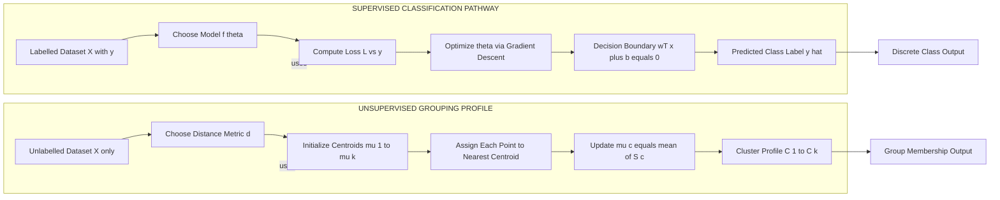
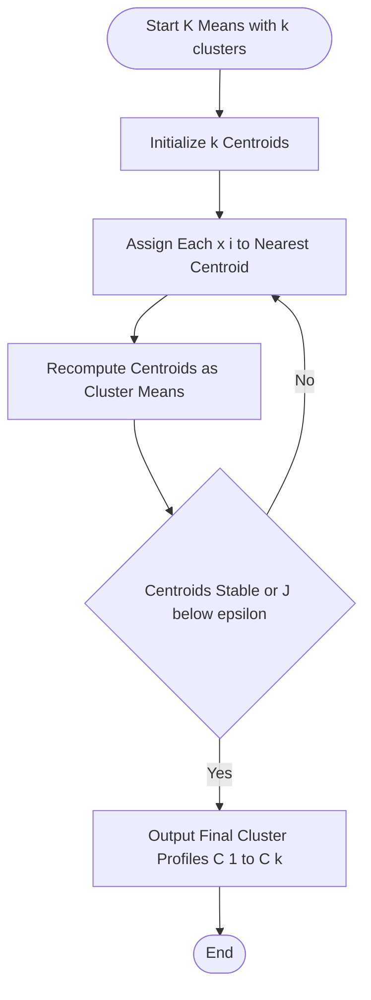
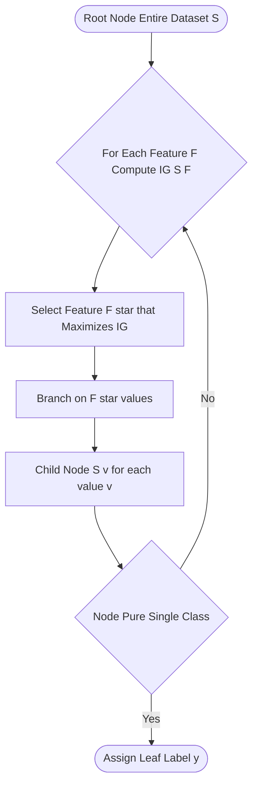
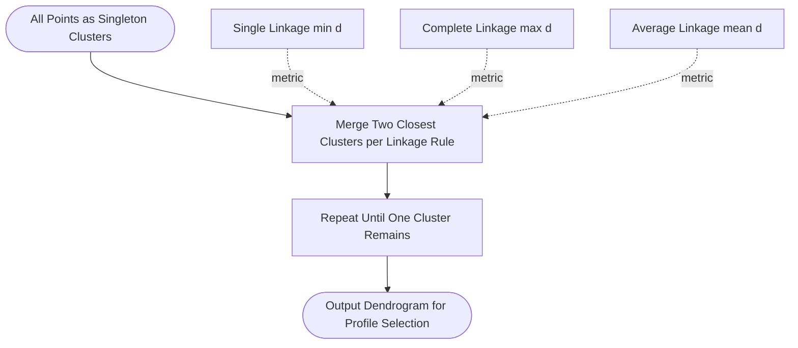

# Supervised classification pathways contrast with unsupervised groupings profiles

<!-- SECTION_1_START -->

# Supervised Classification Pathways vs Unsupervised Grouping Profiles

## 1. Core Technical Definition

### Supervised Classification
**Supervised Classification** is a Machine Learning paradigm where the algorithm learns a mapping function $f: X \rightarrow Y$ from a *labelled* training dataset $D = \{(x_i, y_i)\}_{i=1}^{N}$, where $x_i \in \mathbb{R}^{n}$ represents the feature vector and $y_i \in \{C_1, C_2, \ldots, C_k\}$ represents a discrete class label. The objective is to minimize a loss function $\mathcal{L}(f(x), y)$ so that unseen instances are routed to the correct categorical bin.

> [!NOTE]
> **KTU 2024 Syllabus Term — "Classification Pathway"** refers to the deterministic algorithmic route a data point traverses through a trained model until it is assigned to a class label. The label $y$ acts as the *supervisor* (teacher signal).

### Unsupervised Grouping (Clustering)
**Unsupervised Grouping** is a Machine Learning paradigm that operates on an *unlabelled* dataset $D = \{x_1, x_2, \ldots, x_N\}$ to discover intrinsic structural patterns. The objective is to partition the feature space into $k$ groups such that intra-cluster similarity is maximized and inter-cluster similarity is minimized, without any ground-truth guidance.

> [!IMPORTANT]
> **KTU 2024 Syllabus Term — "Grouping Profile"** refers to the learned distribution, density, or centroid-based profile that represents a discovered cluster. No external label validates the grouping — only internal cohesion metrics.

---

## 2. Conceptual Analogy & Intuition

### Real-World Analogy: A School Classroom

> [!TIP]
> **Imagine a classroom of 100 students with no name tags.**

*   **Supervised Classification Pathway** → The teacher provides a *register* (labelled data) with names and roll numbers. The student learns: "Roll 1 = Arun, Roll 2 = Bala..." When a new student walks in, the model uses the learned register to *predict* the roll number. The pathway is **directed by known answers**.

*   **Unsupervised Grouping Profile** → The teacher simply observes the students and notices *natural cliques*: "These 5 always sit together and talk cricket; those 7 always sit together and discuss coding." The teacher did not know the groups beforehand; the **profile emerged purely from behavioural patterns**. The grouping is **self-discovered**.

### Geometric Intuition
In a 2D feature space:

*   **Supervised Classification** draws explicit **decision boundaries** (lines, curves, hyperplanes) that separate pre-defined classes.
*   **Unsupervised Clustering** discovers **density peaks or centroids** that form natural islands of points without any prior class information.

---

## 3. GeoGebra / Desmos Visualization

> [!VISUALIZATION CONTROL]
> **Concept:** Side-by-side visualization of a Decision Boundary (Supervised) vs. Cluster Centroids (Unsupervised) on a 2D plane.
>
> **GeoGebra / Desmos Input Equations:**
> * **Class 1 (Blue) Points:** $(1,2), (2,3), (1.5,2.5), (2,2)$
> * **Class 2 (Red) Points:** $(5,5), (6,4), (5.5,5.5), (6,6)$
> * **Decision Boundary (Supervised):** $y = x + 0.5$
> * **Cluster Centroid A (Unsupervised):** $C_1 = (1.625, 2.375)$
> * **Cluster Centroid B (Unsupervised):** $C_2 = (5.625, 5.125)$
>
> **Visual Description:** The blue and red points belong to two known classes (supervised). The supervised line $y = x + 0.5$ cleanly partitions them. In the unsupervised view, the *same* points are grouped purely by spatial proximity into two centroids $C_1$ and $C_2$ — no labels were used to find them. Notice that the geometric outcome is *similar*, but the *pathway* to reach it is fundamentally different.

---

## 4. At a Glance: KTU Board-Ready Contrast

| Dimension | Supervised Classification | Unsupervised Grouping |
| :--- | :--- | :--- |
| **Data Requirement** | Labelled $(x, y)$ pairs | Unlabelled $x$ only |
| **Goal** | Predict class $y$ for new $x$ | Discover hidden structure in $x$ |
| **Output Type** | Discrete class label | Cluster ID or group membership |
| **Evaluation** | Accuracy, Precision, Recall, F1 | Silhouette Score, Davies-Bouldin, WCSS |
| **Common Algorithms** | KNN, Decision Tree, SVM, Naive Bayes | K-Means, DBSCAN, Hierarchical, GMM |
| **Error Signal** | Loss against ground truth $y$ | No ground truth; uses internal metrics |
| **Training Paradigm** | Teacher-driven (guided) | Self-organized (exploratory) |

> [!IMPORTANT]
> **Constant of Interest:** The number of classes $k$ in classification is **predefined by the dataset**; the number of clusters $k$ in grouping is **chosen heuristically** (e.g., via the **Elbow Method**).

<!-- SECTION_1_END -->

<!-- SECTION_2_START -->

# Deep Theoretical Analysis & KTU High-Yield Formula Sheet

## 1. Supervised Classification — The Algorithmic Pathway

A classification pathway executes the following operational sequence:

*   **Step 1 — Input Encoding:** Raw features $x$ are transformed into a numerical vector $x \in \mathbb{R}^{n}$ using techniques like one-hot encoding or normalization.
*   **Step 2 — Model Hypothesis Selection:** Choose a function family $f_\theta(x)$ (e.g., a hyperplane, a tree, a probability distribution).
*   **Step 3 — Loss Computation:** Measure deviation between predicted $\hat{y} = f_\theta(x)$ and true $y$.
*   **Step 4 — Optimization:** Adjust $\theta$ using gradient descent or closed-form solutions to minimize $\mathcal{L}$.
*   **Step 5 — Decision Rule:** Apply $\hat{y} = \arg\max_{c} P(y=c \mid x)$ to assign a class.
*   **Step 6 — Generalization Validation:** Evaluate on a held-out test set to ensure the pathway does not overfit.

### Representative Algorithms

#### (a) K-Nearest Neighbors (KNN)
A non-parametric, instance-based learner. For a query point $x_q$, the class is decided by majority vote among its $K$ nearest neighbours in the training set.

#### (b) Decision Tree
A hierarchical partitioning algorithm that recursively splits the feature space using the feature $f_j$ and threshold $t$ that maximizes *Information Gain* or minimizes *Gini Impurity*.

#### (c) Naive Bayes
A probabilistic classifier based on Bayes' Theorem with a *naive* assumption of conditional independence between features.

#### (d) Support Vector Machine (SVM)
Finds the maximum-margin hyperplane that separates classes in (possibly kernel-transformed) feature space.

---

## 2. Unsupervised Grouping — The Algorithmic Profile

A grouping profile is constructed by exploring the intrinsic geometry of the data without any external supervision:

*   **Step 1 — Similarity Metric Definition:** Choose a distance function $d(x_i, x_j)$ (commonly Euclidean).
*   **Step 2 — Initialization:** Place initial centroids $\mu_1, \mu_2, \ldots, \mu_k$ (randomly or via K-Means++).
*   **Step 3 — Assignment:** Assign each $x_i$ to the nearest centroid to form a temporary cluster profile.
*   **Step 4 — Profile Update:** Recompute centroids as the mean of assigned points: $\mu_c = \frac{1}{\vert S_c \vert} \sum_{x_i \in S_c} x_i$.
*   **Step 5 — Convergence Check:** If centroids stabilize (or $\Delta J < \epsilon$), terminate; else return to Step 3.

### Representative Algorithms

*   **K-Means** — Centroid-based, spherical clusters.
*   **Hierarchical Clustering** — Builds a dendrogram using linkage criteria.
*   **DBSCAN** — Density-based, can discover arbitrary shapes and noise points.
*   **Gaussian Mixture Models (GMM)** — Probabilistic, soft-assigns points using Expectation-Maximization.

---

## 3. KTU High-Yield Formula Sheet

> [!NOTE]
> Master these formulas — they appear frequently in KTU Part A (3-mark) and Part B (14-mark) questions.

### Supervised Classification Formulas

| Formula Name | Mathematical Expression | Purpose / Use |
| :--- | :--- | :--- |
| **Euclidean Distance (KNN)** | $d(x_i, x_j) = \sqrt{\sum_{m=1}^{n}(x_{im} - x_{jm})^{2}}$ | Finding nearest neighbours |
| **Manhattan Distance (KNN)** | $d(x_i, x_j) = \sum_{m=1}^{n}\vert x_{im} - x_{jm} \vert$ | Alternative distance metric |
| **Entropy (Decision Tree)** | $H(S) = -\sum_{c=1}^{k} p_c \log_2 p_c$ | Measures impurity of a node |
| **Information Gain (ID3)** | $IG(S, f) = H(S) - \sum_{v \in Values(f)} \frac{\vert S_v \vert}{\vert S \vert} H(S_v)$ | Best feature selection for split |
| **Gini Impurity (CART)** | $Gini(S) = 1 - \sum_{c=1}^{k} p_c^{2}$ | Cost function for CART trees |
| **Naive Bayes Posterior** | $P(y \mid x) \propto P(y) \cdot \prod_{m=1}^{n} P(x_m \mid y)$ | Class probability computation |
| **SVM Hyperplane** | $w^{T}x + b = 0$ | Decision boundary equation |
| **SVM Margin** | $\text{Margin} = \frac{2}{\Vert w \Vert}$ | Maximized in SVM optimization |
| **Sigmoid (Logistic Regression)** | $\sigma(z) = \frac{1}{1 + e^{-z}}$ | Maps real value to probability |
| **Accuracy** | $Acc = \frac{TP + TN}{TP + TN + FP + FN}$ | Classification evaluation metric |
| **Precision** | $Prec = \frac{TP}{TP + FP}$ | Class-specific positive reliability |
| **Recall** | $Rec = \frac{TP}{TP + FN}$ | Class-specific sensitivity |
| **F1-Score** | $F1 = 2 \cdot \frac{Prec \cdot Rec}{Prec + Rec}$ | Harmonic mean of P and R |

### Unsupervised Grouping Formulas

| Formula Name | Mathematical Expression | Purpose / Use |
| :--- | :--- | :--- |
| **WCSS (K-Means Objective)** | $J = \sum_{c=1}^{k} \sum_{x_i \in S_c} \Vert x_i - \mu_c \Vert^{2}$ | Minimized during K-Means |
| **Centroid Update Rule** | $\mu_c = \frac{1}{\vert S_c \vert} \sum_{x_i \in S_c} x_i$ | New cluster center after assignment |
| **Single Linkage** | $d(C_a, C_b) = \min_{x \in C_a, y \in C_b} d(x, y)$ | Hierarchical clustering proximity |
| **Complete Linkage** | $d(C_a, C_b) = \max_{x \in C_a, y \in C_b} d(x, y)$ | Hierarchical clustering proximity |
| **Average Linkage** | $d(C_a, C_b) = \frac{1}{\vert C_a \vert \vert C_b \vert} \sum_{x \in C_a, y \in C_b} d(x, y)$ | Hierarchical clustering proximity |
| **Silhouette Score** | $s(i) = \frac{b(i) - a(i)}{\max\{a(i), b(i)\}}$ | Cluster quality evaluation |
| **DBSCAN Epsilon-Neighbourhood** | $N_\epsilon(x) = \{y \in D \mid d(x, y) \leq \epsilon\}$ | Defines density reachability |
| **WCSS Elbow Criterion** | $K^\* = \arg\min_{K} \left( \frac{dJ}{dK} \approx 0 \right)$ | Optimal number of clusters $K$ |

---

## 4. Real-World Engineering Utility

*   **Supervised Classification in Production:**
    *   **Spam Detection** in Gmail (Naive Bayes).
    *   **Medical Diagnosis** — classifying tumours as malignant/benign from MRI features (SVM, Random Forest).
    *   **Credit Card Fraud Detection** (XGBoost, Logistic Regression).
    *   **Facial Recognition** (CNN-based classifiers at the edge of supervised pipelines).

*   **Unsupervised Grouping in Production:**
    *   **Customer Segmentation** in e-commerce (K-Means over RFM features).
    *   **Anomaly Detection** in network traffic (DBSCAN identifies low-density noise).
    *   **Document Topic Modelling** (LDA / GMM over TF-IDF vectors).
    *   **Image Compression** (K-Means over pixel colour space reduces palette to $K$ representative colours).

> [!TIP]
> **Industry Pattern (2024-2025):** Modern production systems often **chain** the two — unsupervised grouping for feature engineering, then supervised classification on the enriched features. This is the *semi-supervised* bridge.

<!-- SECTION_2_END -->

<!-- SECTION_3_START -->

# Step-by-Step Derivations & Code Implementation

## 1. K-Means Clustering — Exhaustive Numerical Walkthrough

**Problem Setup:** Consider 2D points $P = \{(1,1), (1,2), (2,1), (8,8), (9,8), (8,9)\}$. Apply K-Means with $k=2$, initial centroids $\mu_1=(1,1)$ and $\mu_2=(8,8)$. Use Euclidean distance.

### Iteration 1

**Step 1.1: Compute distances from each point to each centroid.**

$$
\begin{aligned}
d((1,1), \mu_1) &= \sqrt{(1-1)^{2} + (1-1)^{2}} = 0.000 \\
d((1,1), \mu_2) &= \sqrt{(1-8)^{2} + (1-8)^{2}} = \sqrt{49+49} = 9.899 \\
d((1,2), \mu_1) &= \sqrt{(1-1)^{2} + (2-1)^{2}} = 1.000 \\
d((1,2), \mu_2) &= \sqrt{(1-8)^{2} + (2-8)^{2}} = \sqrt{49+36} = 9.220 \\
d((2,1), \mu_1) &= \sqrt{(2-1)^{2} + (1-1)^{2}} = 1.000 \\
d((2,1), \mu_2) &= \sqrt{(2-8)^{2} + (1-8)^{2}} = \sqrt{36+49} = 9.220 \\
d((8,8), \mu_1) &= \sqrt{(8-1)^{2} + (8-1)^{2}} = 9.899 \\
d((8,8), \mu_2) &= \sqrt{(8-8)^{2} + (8-8)^{2}} = 0.000 \\
d((9,8), \mu_1) &= \sqrt{(9-1)^{2} + (8-1)^{2}} = 9.899 \\
d((9,8), \mu_2) &= \sqrt{(9-8)^{2} + (8-8)^{2}} = 1.000 \\
d((8,9), \mu_1) &= \sqrt{(8-1)^{2} + (9-1)^{2}} = 9.899 \\
d((8,9), \mu_2) &= \sqrt{(8-8)^{2} + (9-8)^{2}} = 1.000 \\
\end{aligned}
$$

**Step 1.2: Assign each point to the nearest centroid.**

*   $(1,1) \rightarrow C_1$
*   $(1,2) \rightarrow C_1$
*   $(2,1) \rightarrow C_1$
*   $(8,8) \rightarrow C_2$
*   $(9,8) \rightarrow C_2$
*   $(8,9) \rightarrow C_2$

**Step 1.3: Update centroids as the mean of assigned points.**

$$
\begin{aligned}
\mu_1^{new} &= \left( \frac{1+1+2}{3}, \frac{1+2+1}{3} \right) = (1.333, 1.333) \\
\mu_2^{new} &= \left( \frac{8+9+8}{3}, \frac{8+8+9}{3} \right) = (8.333, 8.333) \\
\end{aligned}
$$

**Step 1.4: Compute WCSS $J$.**

$$
\begin{aligned}
J_1 &= (1-1.333)^{2} + (1-1.333)^{2} + (1-1.333)^{2} + (2-1.333)^{2} + (1-1.333)^{2} + (2-1.333)^{2} \\
    &= 0.111 + 0.111 + 0.444 + 0.444 + 0.111 + 0.444 = 1.667 \\
J_2 &= (8-8.333)^{2} + (8-8.333)^{2} + (9-8.333)^{2} + (8-8.333)^{2} + (8-8.333)^{2} + (9-8.333)^{2} \\
    &= 0.111 + 0.111 + 0.444 + 0.111 + 0.111 + 0.444 = 1.333 \\
J_{total} &= 1.667 + 1.333 = 3.000
\end{aligned}
$$

### Iteration 2
The assignments remain the same (verify: all points in $C_1$ are still closer to $(1.333, 1.333)$ than to $(8.333, 8.333)$, and vice versa). Centroids do not change. **Algorithm converges.**

> [!NOTE]
> **Final Result:** Cluster $C_1 = \{(1,1), (1,2), (2,1)\}$ with centroid $(1.333, 1.333)$; Cluster $C_2 = \{(8,8), (9,8), (8,9)\}$ with centroid $(8.333, 8.333)$. Total WCSS $= 3.000$. **No labels were used.**

---

## 2. Information Gain — Decision Tree Split Evaluation

**Problem Setup:** Dataset $S$ has 10 samples — 6 belong to Class A (Yes) and 4 to Class B (No). Feature $F$ splits $S$ into $S_1$ (4 Yes, 1 No) and $S_2$ (2 Yes, 3 No). Compute Information Gain.

### Step 2.1: Compute parent entropy $H(S)$.

$$
H(S) = -\left( \frac{6}{10} \log_2 \frac{6}{10} + \frac{4}{10} \log_2 \frac{4}{10} \right) = -(0.6 \cdot (-0.737) + 0.4 \cdot (-1.322)) = 0.971 \text{ bits}
$$

### Step 2.2: Compute child entropies.

$$
H(S_1) = -\left( \frac{4}{5} \log_2 \frac{4}{5} + \frac{1}{5} \log_2 \frac{1}{5} \right) = -(0.8 \cdot (-0.322) + 0.2 \cdot (-2.322)) = 0.722 \text{ bits}
$$

$$
H(S_2) = -\left( \frac{2}{5} \log_2 \frac{2}{5} + \frac{3}{5} \log_2 \frac{3}{5} \right) = -(0.4 \cdot (-1.322) + 0.6 \cdot (-0.737)) = 0.971 \text{ bits}
$$

### Step 2.3: Compute weighted average child entropy.

$$
H_{children} = \frac{5}{10} \cdot 0.722 + \frac{5}{10} \cdot 0.971 = 0.361 + 0.486 = 0.847 \text{ bits}
$$

### Step 2.4: Compute Information Gain.

$$
IG(S, F) = H(S) - H_{children} = 0.971 - 0.847 = 0.124 \text{ bits}
$$

> [!NOTE]
> **Interpretation:** A gain of $0.124$ bits indicates feature $F$ provides a modest reduction in impurity. A higher IG across competing features would be selected as the root split — this is the **supervised pathway** at work.

---

## 3. Python Code — Side-by-Side Implementation

### 3.1 K-Means (Unsupervised)

```python
import numpy as np
from sklearn.cluster import KMeans
import matplotlib.pyplot as plt

# Unlabelled 2D dataset
X = np.array([
    [1.0, 1.0], [1.0, 2.0], [2.0, 1.0],
    [8.0, 8.0], [9.0, 8.0], [8.0, 9.0],
    [0.5, 1.5], [8.5, 9.5]
])

# K-Means: discover k=2 groups without labels
kmeans = KMeans(n_clusters=2, init='k-means++', n_init=10, random_state=42)
labels = kmeans.fit_predict(X)         # No y provided — pure unsupervised
centroids = kmeans.cluster_centers_

print("Discovered Cluster Labels :", labels)
print("Cluster Centroids         :", centroids)
print("Within-Cluster SSE (WCSS) :", kmeans.inertia_)

# Visualization
plt.figure(figsize=(6, 5))
plt.scatter(X[:, 0], X[:, 1], c=labels, cmap='viridis', s=80, edgecolor='k')
plt.scatter(centroids[:, 0], centroids[:, 1], c='red', marker='X', s=200, label='Centroids')
plt.title('Unsupervised K-Means Grouping')
plt.xlabel('Feature 1'); plt.ylabel('Feature 2'); plt.legend(); plt.grid(True); plt.show()
```

### 3.2 Decision Tree Classifier (Supervised)

```python
import numpy as np
from sklearn.tree import DecisionTreeClassifier, export_text
from sklearn.model_selection import train_test_split
from sklearn.metrics import accuracy_score, classification_report

# Labelled dataset: features [Weight (g), Color Code (0=Red, 1=Green)]
X = np.array([
    [150, 0], [170, 0], [160, 0],   # Apples
    [100, 1], [120, 1], [110, 1],   # Grapes
    [130, 0], [180, 0]              # Apples
])
y = np.array(['Apple', 'Apple', 'Apple', 'Grape', 'Grape', 'Grape', 'Apple', 'Apple'])

# Supervised split — labels guide the partition
X_train, X_test, y_train, y_test = train_test_split(X, y, test_size=0.25, random_state=42, stratify=y)

clf = DecisionTreeClassifier(criterion='entropy', max_depth=3, random_state=42)
clf.fit(X_train, y_train)             # Learns the supervised pathway

y_pred = clf.predict(X_test)
print("Test Accuracy    :", accuracy_score(y_test, y_pred))
print("Decision Rules   :\n", export_text(clf, feature_names=['Weight', 'Color']))
print("Classification Report :\n", classification_report(y_test, y_pred, zero_division=0))
```

### 3.3 Contrastive Bridge — Unsupervised Feature Engineering $\rightarrow$ Supervised Classifier

```python
import numpy as np
from sklearn.cluster import KMeans
from sklearn.linear_model import LogisticRegression
from sklearn.pipeline import Pipeline
from sklearn.preprocessing import StandardScaler
from sklearn.metrics import accuracy_score

# Synthetic labelled data (labels are only used AFTER clustering)
np.random.seed(7)
cluster_A = np.random.multivariate_normal([2, 2], [[0.5, 0], [0, 0.5]], 60)
cluster_B = np.random.multivariate_normal([6, 6], [[0.5, 0], [0, 0.5]], 60)
cluster_C = np.random.multivariate_normal([2, 6], [[0.5, 0], [0, 0.5]], 60)
X = np.vstack([cluster_A, cluster_B, cluster_C])
y = np.array([0]*60 + [1]*60 + [2]*60)   # Ground truth — used only for evaluation

# Step 1: Unsupervised grouping produces a "grouping profile" feature
kmeans = KMeans(n_clusters=3, n_init=10, random_state=7)
group_profile = kmeans.fit_predict(X).reshape(-1, 1)

# Step 2: Stack the grouping profile with raw features for supervised classification
X_enriched = np.hstack([X, group_profile])

X_train, X_test, y_train, y_test = train_test_split(
    X_enriched, y, test_size=0.3, random_state=7, stratify=y
)

pipe = Pipeline([
    ('scaler', StandardScaler()),
    ('clf', LogisticRegression(max_iter=1000, multi_class='ovr'))
])
pipe.fit(X_train, y_train)
y_pred = pipe.predict(X_test)
print("Hybrid (Unsup + Sup) Test Accuracy :", accuracy_score(y_test, y_pred))
```

> [!IMPORTANT]
> **Engineering Takeaway:** The hybrid pipeline above demonstrates the *real-world production pattern* — unsupervised grouping creates a structural "fingerprint" feature, which is then fed to a supervised classifier. The labels $y$ are never used during the clustering step, preserving the unsupervised pathway's independence.

<!-- SECTION_3_END -->

<!-- SECTION_4_START -->

# Structural Diagrams & Schematics

## 1. Mermaid — Supervised vs Unsupervised Paradigm Contrast



## 2. Mermaid — K-Means Clustering Operational Topology



## 3. Mermaid — Decision Tree Supervised Splitting Logic



## 4. Mermaid — Hierarchical Clustering Dendrogram Assembly



## 5. Sequential Processing Topology Matrix

| Stage | Supervised Classification | Unsupervised Grouping |
| :--- | :--- | :--- |
| **Stage 1 — Input** | $(X, y)$ labelled matrix | $X$ unlabelled matrix |
| **Stage 2 — Metric** | Loss $\mathcal{L}(\hat{y}, y)$ | Distance $d(x_i, x_j)$ |
| **Stage 3 — Search** | Optimize $\theta$ to minimize $\mathcal{L}$ | Iterate assignment and centroid update |
| **Stage 4 — Termination** | Convergence of $\theta$ or epochs exhausted | WCSS change $\Delta J < \epsilon$ or max iterations |
| **Stage 5 — Output** | Decision function $f_\theta(x) \rightarrow \hat{y}$ | Cluster assignment $C(x) \in \{1, \ldots, k\}$ |
| **Stage 6 — Evaluation** | Accuracy, F1, ROC-AUC | Silhouette, Davies-Bouldin, Elbow |

<!-- SECTION_4_END -->

<!-- SECTION_5_START -->

# KTU 2024 Scheme Examination Question Bank & Topic Recap

## Part A — Short Answer Questions (3 Marks Each)

### Question 1
> **[KTU University Exam — July 2024 | CO1, Remember]**
> Differentiate between supervised and unsupervised learning with one real-world example each.

**Model Answer (3 Marks):**

*   **Supervised Learning:** The algorithm learns from a labelled training set $(X, y)$ where the correct output is known. The model maps inputs to known outputs by minimizing a loss function. **Example:** Email spam classification where emails are pre-labelled as "spam" or "not spam." *(1.5 Marks)*
*   **Unsupervised Learning:** The algorithm explores an unlabelled dataset $X$ to discover hidden patterns, groupings, or structures without any ground-truth output. **Example:** Customer segmentation in marketing where buyers are grouped into clusters based on purchasing behaviour. *(1.5 Marks)*

---

### Question 2
> **[KTU University Exam — Dec 2023 | CO1, Understand]**
> List any three clustering algorithms and state the key assumption each makes about cluster shape.

**Model Answer (3 Marks):**

| Algorithm | Key Shape Assumption | Marks |
| :--- | :--- | :--- |
| **K-Means** | Assumes clusters are **spherical (isotropic) and of similar size** because it minimizes Euclidean distance to a centroid. | 1 |
| **DBSCAN** | Assumes clusters are **dense contiguous regions** separated by low-density areas; can discover arbitrarily shaped clusters. | 1 |
| **Gaussian Mixture Models (GMM)** | Assumes data is generated from a **mixture of Gaussian (elliptical) distributions** with soft probabilistic membership. | 1 |

---

## Part B — Long Answer Questions (14 Marks, Internal Choice)

### Question 3 — Option A
> **[KTU University Exam — Dec 2023 | CO2, Apply + Analyze]**
> **(a)** Explain the K-Nearest Neighbors (KNN) classification algorithm with a suitable diagram. Discuss how the choice of $K$ affects the bias-variance trade-off. *(7 Marks)*
>
> **(b)** Given the training points for two classes — Class $A$: $(1,1), (1,2), (2,1)$ and Class $B$: $(5,5), (6,5), (5,6)$ — classify the query point $Q = (2, 2)$ using KNN with $K=3$ and Euclidean distance. *(7 Marks)*

**Model Answer:**

**Part (a) — KNN Algorithm & Bias-Variance Trade-off**

KNN is a *lazy*, non-parametric, instance-based supervised classifier. For a query point $x_q$, the class is assigned by a **majority vote** among the $K$ training points closest to $x_q$ in feature space.

*   **Step 1:** Choose $K$ (number of neighbours) and a distance metric $d$ (commonly Euclidean). *(1 Mark)*
*   **Step 2:** For query $x_q$, compute $d(x_q, x_i)$ for all training points. *(1 Mark)*
*   **Step 3:** Sort distances and select the $K$ smallest. *(1 Mark)*
*   **Step 4:** Assign the majority class label among the $K$ neighbours. *(1 Mark)*

**Bias-Variance Trade-off with $K$:**

*   **Small $K$ (e.g., $K=1$):** Decision boundary is highly jagged. **Low bias, high variance** — sensitive to noise (overfitting). *(1.5 Marks)*
*   **Large $K$ (e.g., $K=N$):** Decision boundary is overly smooth; every query is classified as the global majority. **High bias, low variance** — underfitting. *(1.5 Marks)*
*   **Optimal $K$:** Typically chosen via cross-validation to balance bias and variance. *(1 Mark — implicit in explanation)*

```
ASCII Visualization of KNN Effect:

  K = 1                    K = 3                    K = Large
  * . X                    * . X                    * . X
  . X *  (jagged)          . X *  (smoother)        . X *  (overly smooth)
  X * .                    X * .                    X * .
  [Low bias,              [Balanced]               [High bias,
   high variance]                                      low variance]
```

**Part (b) — Numerical KNN Classification**

Compute Euclidean distance from $Q = (2,2)$ to every training point:

$$
\begin{aligned}
d(Q, (1,1)) &= \sqrt{(2-1)^{2} + (2-1)^{2}} = \sqrt{2} \approx 1.414 \\
d(Q, (1,2)) &= \sqrt{(2-1)^{2} + (2-2)^{2}} = \sqrt{1} = 1.000 \\
d(Q, (2,1)) &= \sqrt{(2-2)^{2} + (2-1)^{2}} = \sqrt{1} = 1.000 \\
d(Q, (5,5)) &= \sqrt{(2-5)^{2} + (2-5)^{2}} = \sqrt{18} \approx 4.243 \\
d(Q, (6,5)) &= \sqrt{(2-6)^{2} + (2-5)^{2}} = \sqrt{25} = 5.000 \\
d(Q, (5,6)) &= \sqrt{(2-5)^{2} + (2-6)^{2}} = \sqrt{25} = 5.000 \\
\end{aligned}
$$

*   **[Distance computation table: 3 Marks]**
*   **[Sorting and selecting K=3 nearest: 1 Mark]**

The 3 nearest neighbours are:
*   $(1,2)$ — Class $A$ — distance $1.000$
*   $(2,1)$ — Class $A$ — distance $1.000$
*   $(1,1)$ — Class $A$ — distance $1.414$

**Majority Vote:** 3 votes for Class $A$, 0 votes for Class $B$.

*   **[Majority voting logic: 2 Marks]**
*   **[Final classification: 1 Mark]**

**Final Answer:** $Q = (2,2)$ is classified as **Class $A$** with confidence $3/3 = 100\%$.

---

### Question 3 — Option B
> **[KTU University Exam — July 2024 | CO2, Apply + Analyze]**
> **(a)** Explain the K-Means clustering algorithm. Describe the role of the Within-Cluster Sum of Squares (WCSS) objective function. *(7 Marks)*
>
> **(b)** Apply K-Means with $k=2$ on the dataset $\{(1,1), (1,2), (2,1), (8,8), (9,8), (8,9)\}$ using initial centroids $\mu_1 = (1,1)$ and $\mu_2 = (8,8)$. Show all iterations and compute the final WCSS. *(7 Marks)*

**Model Answer:**

**Part (a) — K-Means Algorithm & WCSS Role**

K-Means is an **unsupervised, centroid-based partitioning algorithm** that groups $N$ data points into $k$ non-overlapping clusters by minimizing the WCSS objective. *(1 Mark for definition)*

**Algorithm Steps:**
*   **Step 1:** Initialize $k$ centroids $\mu_1, \mu_2, \ldots, \mu_k$ (randomly or via K-Means++). *(1 Mark)*
*   **Step 2 — Assignment Step:** Assign each $x_i$ to the cluster $c^\*$ whose centroid is nearest: $c^\* = \arg\min_c \Vert x_i - \mu_c \Vert^{2}$. *(1 Mark)*
*   **Step 3 — Update Step:** Recompute each centroid as the mean of points assigned to it: $\mu_c = \frac{1}{\vert S_c \vert} \sum_{x_i \in S_c} x_i$. *(1 Mark)*
*   **Step 4 — Convergence:** Repeat Steps 2–3 until centroids stabilize or WCSS change $\Delta J < \epsilon$. *(0.5 Marks)*

**Role of WCSS Objective Function:**

$$
J = \sum_{c=1}^{k} \sum_{x_i \in S_c} \Vert x_i - \mu_c \Vert^{2}
$$

*   WCSS measures the **total intra-cluster variance** — the sum of squared distances from every point to its assigned centroid. *(1 Mark)*
*   The algorithm's goal is to **iteratively minimize $J$** by finding optimal centroid placements. *(1 Mark)*
*   $J$ is **monotonically non-increasing** across iterations; the algorithm is guaranteed to converge (though possibly to a local minimum). *(0.5 Marks)*

**Part (b) — Numerical K-Means Walkthrough**

> [!IMPORTANT]
> This is the **same numerical example** as detailed in Section 3.1 above. Refer to the exhaustive Iteration 1 derivation there.

**Summary of the walkthrough:**

*   **Initial state:** $\mu_1 = (1,1), \mu_2 = (8,8)$. *(0.5 Marks)*
*   **Iteration 1 — Assignment:** $(1,1), (1,2), (2,1) \rightarrow C_1$; $(8,8), (9,8), (8,9) \rightarrow C_2$. *(2 Marks)*
*   **Iteration 1 — Centroid Update:** $\mu_1 = (1.333, 1.333), \mu_2 = (8.333, 8.333)$. *(1.5 Marks)*
*   **Iteration 1 — WCSS Computation:** $J_1 = 1.667, J_2 = 1.333, J_{total} = 3.000$. *(2 Marks)*
*   **Iteration 2:** Assignments identical, centroids unchanged $\rightarrow$ **convergence achieved**. *(0.5 Marks)*
*   **Final Result:** $C_1 = \{(1,1), (1,2), (2,1)\}, C_2 = \{(8,8), (9,8), (8,9)\}$, Final WCSS $= 3.000$. *(0.5 Marks)*

---

## KTU Examiner's Valuation Warning / Pitfall Callout

> [!WARNING]
> **Common Mark-Deduction Pitfalls (KTU Board Patterns):**
>
> 1. **Confusing the paradigms:** Students often write "K-Means is a classification algorithm." **It is not** — it is unsupervised clustering. Misclassification of the paradigm type costs 1–2 marks instantly. *(Critical)*
> 2. **Skipping the WCSS computation in K-Means:** Even in short problems, the WCSS value $J$ is expected as the final line. Forgetting to compute it loses 1 mark.
> 3. **KNN without the distance table:** In numerical questions, examiners expect an **explicit distance table** with all six distances for $K=3$. Verbal "the three closest are..." statements without a table lose 2 marks.
> 4. **Decision Tree — forgetting to compute parent entropy $H(S)$:** Information Gain is defined as $H(S) - H_{children}$. Skipping the parent entropy makes the answer incomplete.
> 5. **Confusing Silhouette Score with Accuracy:** Silhouette Score applies to clustering (no labels), while Accuracy applies to classification (with labels). Mixing these is a classic KTU pitfall.
> 6. **Not stating the initialization in K-Means:** Always specify the initial centroids and the distance metric (Euclidean/Manhattan) in your answer.

---

## Topic Recap & Important Things to Remember

> [!NOTE]
> **Rapid-Revision Checklist for KTU Module 2 — ML Primers**

### Supervised Classification Essentials
*   **Definition:** Learns a function $f: X \rightarrow Y$ from labelled data $(x_i, y_i)$.
*   **Key Algorithms:** KNN, Decision Tree, Naive Bayes, SVM, Logistic Regression.
*   **KNN Rule:** Majority vote among $K$ nearest neighbours using Euclidean/Manhattan distance.
*   **Entropy:** $H(S) = -\sum p_c \log_2 p_c$ — measures node impurity.
*   **Information Gain:** $IG(S, F) = H(S) - \sum \frac{\vert S_v \vert}{\vert S \vert} H(S_v)$ — selects best split.
*   **Gini Impurity:** $Gini(S) = 1 - \sum p_c^{2}$ — alternative to entropy in CART.
*   **Naive Bayes Posterior:** $P(y \mid x) \propto P(y) \cdot \prod P(x_m \mid y)$.
*   **SVM Hyperplane:** $w^{T}x + b = 0$ with margin $\frac{2}{\Vert w \Vert}$.
*   **Evaluation Metrics:** Accuracy, Precision, Recall, F1-Score, ROC-AUC.

### Unsupervised Grouping Essentials
*   **Definition:** Discovers structure in unlabelled data $X$ without ground truth.
*   **Key Algorithms:** K-Means, Hierarchical (Agglomerative/Divisive), DBSCAN, GMM.
*   **K-Means Objective:** $J = \sum_{c=1}^{k} \sum_{x_i \in S_c} \Vert x_i - \mu_c \Vert^{2}$.
*   **Centroid Update Rule:** $\mu_c = \frac{1}{\vert S_c \vert} \sum_{x_i \in S_c} x_i$.
*   **Linkage Criteria:** Single (min), Complete (max), Average (mean) — for Hierarchical clustering.
*   **DBSCAN Core Concept:** Epsilon-neighbourhood $N_\epsilon(x)$ and MinPts threshold; classifies points as Core, Border, or Noise.
*   **Optimal $K$:** Determined via the **Elbow Method** (plot $J$ vs $K$, find the bend).
*   **Evaluation Metrics:** Silhouette Score, Davies-Bouldin Index, WCSS (internal metrics only).

### Paradigm Contrast — One-Line Memory Hooks
*   **Supervised** = *Labelled teacher* $\rightarrow$ Discrete class output $\rightarrow$ External validation (Accuracy/F1).
*   **Unsupervised** = *Self-discovery* $\rightarrow$ Group membership output $\rightarrow$ Internal validation (Silhouette/WCSS).
*   **Hybrid (Semi-Supervised)** = Unsupervised feature engineering $\rightarrow$ Supervised classifier on enriched features.

### Critical Formulas to Memorize (KTU 2024 Hot List)
*   Euclidean Distance: $d = \sqrt{\sum (x_{im} - x_{jm})^{2}}$
*   Entropy: $H(S) = -\sum p_c \log_2 p_c$
*   Information Gain: $IG = H_{parent} - H_{children}$
*   Gini: $Gini = 1 - \sum p_c^{2}$
*   Bayes Posterior: $P(y \mid x) \propto P(y) \prod P(x_m \mid y)$
*   WCSS: $J = \sum_{c} \sum_{x_i \in S_c} \Vert x_i - \mu_c \Vert^{2}$
*   Silhouette: $s(i) = \frac{b(i) - a(i)}{\max\{a(i), b(i)\}}$
*   SVM Margin: $\frac{2}{\Vert w \Vert}$

<!-- SECTION_5_END -->
