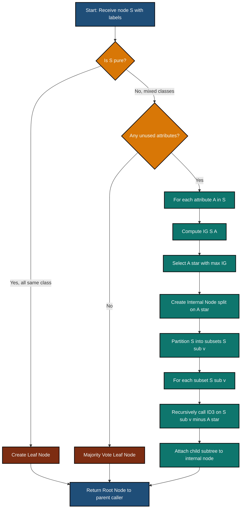
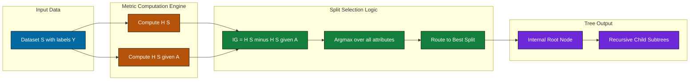
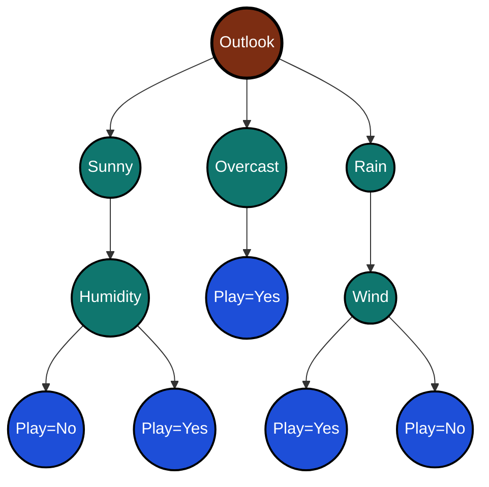
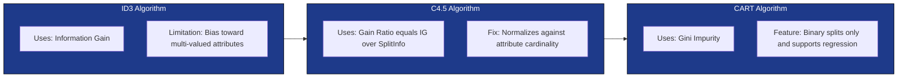

# Decision trees generation splitting heuristics: Information gain calculation routing metrics

<!-- SECTION_1_START -->

# Decision Trees: Information Gain & Splitting Heuristics

## 1.1 Formal Academic Definition (KTU 2024 Syllabus Aligned)

A **Decision Tree** is a non-parametric, supervised learning algorithm used for both classification and regression tasks. It builds a flowchart-like tree structure where each internal node represents a test on an attribute, each branch represents the outcome of that test, and each leaf node represents a class label (or continuous value). The model recursively partitions the feature space using a **splitting heuristic** that maximizes the **purity** of the resulting subsets.

The three classical splitting heuristics studied under the KTU 2024 *Tree Models & Instance Classifiers* module are:

> [!IMPORTANT]
> **Core Splitting Heuristics (KTU Module 3 Focus)**
> 1. **Information Gain (IG)** — Used by the ID3 algorithm (Quinlan, 1986).
> 2. **Gain Ratio (GR)** — Used by the C4.5 algorithm to normalize IG against intrinsic split information.
> 3. **Gini Impurity (GI)** — Used by the CART algorithm for binary splits.

**Information Gain (IG)** is defined as the expected reduction in entropy of the target variable $Y$ achieved by partitioning the dataset $S$ based on an attribute $A$. Formally:

$$IG(S, A) = H(S) - H(S \mid A)$$

where $H(S)$ is the Shannon Entropy of the entire dataset and $H(S \mid A)$ is the conditional entropy after splitting on attribute $A$. The attribute with the **highest Information Gain** is selected as the root split.

> [!NOTE]
> **Shannon Entropy** is the foundational information-theoretic measure proposed by **Claude Shannon (1948)**. In ML, it quantifies the average amount of "surprise" or "impurity" in a probability distribution. A pure node (all samples from one class) has $H = 0$, while a maximally impure 50-50 binary split has $H = 1$.

## 1.2 Intuitive Analogy: The Medical Diagnosis Flowchart

Imagine you walk into a doctor's clinic with a fever. The doctor doesn't run 50 tests at once — they ask a sequence of **strategic yes/no questions**:
- *Is your body temperature above 101°F?* (Yes → go to question 2; No → go to question 3)
- *Do you have a cough?* (Yes → likely flu; No → likely heat stroke)
- ...

Each question **splits the patient population** into subgroups that are more homogeneous than the original. The doctor's strategy is exactly what Information Gain does mathematically: it picks the question that, on average, tells us the **most new information** about the diagnosis.

In machine learning:
- **Patients** = Training samples
- **Symptoms (Temperature, Cough, etc.)** = Features / Attributes
- **Diagnosis (Flu / Not Flu)** = Class label
- **Each question** = A potential split on an attribute
- **Information Gain** = How much the question reduces our uncertainty

The split with the **largest IG** is the "best" question to ask first — it gives the biggest reduction in diagnostic uncertainty.

## 1.3 GeoGebra / Desmos Visualization: The Entropy Function

> [!VISUALIZATION CONTROL]
> **Concept:** Binary Entropy Curve $H(p) = -p \log_2(p) - (1-p) \log_2(1-p)$
>
> **Desmos Input Equation:**
> * `f(x) = -x * log2(x) - (1-x) * log2(1-x)` for $0 < x < 1$
>
> **Visual Description:**
> Plot $f(x)$ on the interval $(0, 1)$. The student should observe:
> * The curve starts at $H = 0$ when $p = 0$ (pure — all one class).
> * The curve ends at $H = 0$ when $p = 1$ (pure — all one class).
> * The curve peaks at $H = 1$ when $p = 0.5$ (maximum impurity).
> * The shape is **symmetric** about $p = 0.5$.
>
> **Engineering Insight:** The "U-shape inverted" curve proves that a 50-50 split is the *worst-case* uncertainty, motivating why decision trees greedily chase splits that push child node probabilities toward 0 or 1.

<!-- SECTION_1_END -->

<!-- SECTION_2_START -->

# 2. Deep Theoretical Analysis & KTU Formula Sheet

## 2.1 The Operational Pipeline: How a Decision Tree Picks a Split

A decision tree is built using a **recursive, top-down, greedy** algorithm called **divide and conquer**. The high-level operational logic at every node is:

1. **Compute the current node's impurity** using Entropy (or Gini for CART).
2. **For every unused attribute**, simulate splitting the dataset on each possible value (or threshold).
3. **Measure the weighted average impurity** of the resulting child nodes.
4. **Calculate Information Gain** as the difference between the parent's impurity and the weighted child impurity.
5. **Select the attribute with the maximum Information Gain** as the splitting attribute.
6. **Recurse** on each child node until a stopping criterion is met (pure node, max depth, min samples, etc.).

> [!IMPORTANT]
> **Why "Greedy"?** At each node, the algorithm makes the locally optimal choice (maximum IG for that node) without backtracking to consider whether a different split earlier could yield a globally better tree. This makes training $O(n \cdot d \cdot \log n)$ but may produce suboptimal trees. **Pruning** is used post-hoc to mitigate this.

## 2.2 KTU High-Yield Formula Sheet

| **Formula Name** | **Mathematical Expression** | **Range / Units** | **Used By** |
|---|---|---|---|
| Shannon Entropy | $H(S) = -\sum_{i=1}^{c} p_i \log_2 p_i$ | $0 \le H \le \log_2 c$ (bits) | ID3, C4.5 |
| Conditional Entropy | $H(S \mid A) = \sum_{v \in \text{Values}(A)} \dfrac{\vert S_v \vert}{\vert S \vert} H(S_v)$ | $0 \le H \le \log_2 c$ (bits) | ID3, C4.5 |
| Information Gain | $IG(S, A) = H(S) - H(S \mid A)$ | $0 \le IG \le \log_2 c$ (bits) | ID3 |
| Split Information (Intrinsic Value) | $H_A(S) = -\sum_{v \in \text{Values}(A)} \dfrac{\vert S_v \vert}{\vert S \vert} \log_2 \dfrac{\vert S_v \vert}{\vert S \vert}$ | $0 \le H_A \le \log_2 \vert A \vert$ (bits) | C4.5 |
| Gain Ratio | $GR(S, A) = \dfrac{IG(S, A)}{H_A(S)}$ | $0 \le GR \le 1$ (dimensionless) | C4.5 |
| Gini Impurity | $Gini(S) = 1 - \sum_{i=1}^{c} p_i^{\,2}$ | $0 \le Gini \le 1 - \tfrac{1}{c}$ | CART |
| Gini Gain | $\Delta Gini(S, A) = Gini(S) - \sum_{v} \dfrac{\vert S_v \vert}{\vert S \vert} Gini(S_v)$ | $0 \le \Delta Gini \le 0.5$ | CART |
| Classification Error (for comparison) | $E(S) = 1 - \max_i p_i$ | $0 \le E \le 1 - \tfrac{1}{c}$ | All |

> [!NOTE]
> **Convention Alert (KTU Board Examiners):** The pipe character $\vert \cdot \vert$ denotes set cardinality (count of samples), not absolute value. When writing in the answer script, write it as $|S_v| / |S|$ but inside markdown tables I have escaped it as `\vert S_v \vert` to prevent table-rendering breakage. **Always verify** which symbol your module uses.

## 2.3 Real-World Engineering & CS Utility

| **Domain** | **Application of Information Gain Splitting** |
|---|---|
| **Medical Diagnosis** | Choosing which symptom to ask first in a diagnostic expert system. |
| **Spam Filtering** | Selecting the most discriminative word/token in Naive-Bayes-style email classifiers. |
| **Customer Churn Prediction** | Telecom / SaaS companies use IG-based trees to find the "deciding feature" (tenure, monthly spend, contract type). |
| **Credit Risk Scoring** | Banks use CART (Gini) trees to decide loan approval — fully interpretable for regulators like the **RBI / Basel III** compliance. |
| **Feature Selection in NLP** | Mutual Information (a cousin of IG) ranks the most informative words in a corpus. |
| **Embedded / Edge ML** | Shallow decision trees (TinyML) run on microcontrollers — *no floating-point math needed, just integer comparisons*. |
| **Intrusion Detection Systems (IDS)** | IG-selected features reduce the 40+ features of NSL-KDD to a handful of high-signal attributes. |

## 2.4 Algorithmic Subtleties Worth Knowing for KTU

> [!IMPORTANT]
> **Bias of Information Gain:** IG is biased toward attributes with a **large number of distinct values** (e.g., `Date`, `Customer_ID`). Such an attribute may have near-zero entropy in its children (every subset is pure) but is **useless for generalization** — this is the **overfitting trap** of ID3. The **Gain Ratio** in C4.5 corrects this by penalizing the split's intrinsic entropy. **Gini Impurity** is computationally cheaper (no log calls) and is therefore preferred in production systems like `sklearn.tree.DecisionTreeClassifier`.

> [!IMPORTANT]
> **Stopping Criteria (Pre-Pruning):** A tree stops growing when (a) all samples at a node belong to one class, (b) no more attributes remain, (c) samples < `min_samples_split`, or (d) depth ≥ `max_depth`. **Post-pruning** (reduced error pruning, cost-complexity pruning) typically yields better generalization.

<!-- SECTION_2_END -->

<!-- SECTION_3_START -->

# 3. Exhaustive Step-by-Step Derivations & Python Implementation

## 3.1 The Classic Worked Example: The Weather / "Play Tennis" Dataset

This is the canonical ID3 worked example (Quinlan, 1986) and is **extremely likely to appear** in a KTU board exam. We will compute **Information Gain for every attribute** and select the root.

### 3.1.1 The Dataset (14 Samples, 4 Features, 1 Binary Target)

| **Day** | **Outlook** | **Temperature** | **Humidity** | **Wind** | **Play Tennis** |
|:---:|:---:|:---:|:---:|:---:|:---:|
| 1 | Sunny | Hot | High | Weak | No |
| 2 | Sunny | Hot | High | Strong | No |
| 3 | Overcast | Hot | High | Weak | Yes |
| 4 | Rain | Mild | High | Weak | Yes |
| 5 | Rain | Cool | Normal | Weak | Yes |
| 6 | Rain | Cool | Normal | Strong | No |
| 7 | Overcast | Cool | Normal | Strong | Yes |
| 8 | Sunny | Mild | High | Weak | No |
| 9 | Sunny | Cool | Normal | Weak | Yes |
| 10 | Rain | Mild | Normal | Weak | Yes |
| 11 | Sunny | Mild | Normal | Strong | Yes |
| 12 | Overcast | Mild | High | Strong | Yes |
| 13 | Overcast | Hot | Normal | Weak | Yes |
| 14 | Rain | Mild | High | Strong | No |

**Class distribution:** $Yes = 9$, $No = 5$, Total $= 14$.

### 3.1.2 Step 1 — Compute the Root Entropy $H(S)$

The probability of each class at the root is:

$$p_{Yes} = \frac{9}{14}, \quad p_{No} = \frac{5}{14}$$

Substituting into the entropy formula:

$$
\begin{aligned}
H(S) &= -\sum_{i=1}^{2} p_i \log_2 p_i \\[4pt]
&= -\left( \frac{9}{14} \log_2 \frac{9}{14} + \frac{5}{14} \log_2 \frac{5}{14} \right) \\[4pt]
&= -\bigl( 0.6429 \times (-0.6374) + 0.3571 \times (-1.4854) \bigr) \\[4pt]
&= -\bigl( -0.4098 - 0.5305 \bigr) \\[4pt]
&= 0.9403 \text{ bits}
\end{aligned}
$$

> **Valuation key:** `[Formula statement: 1 Mark]`, `[Logarithm evaluation: 1 Mark]`, `[Final 0.9403: 1 Mark]`.

### 3.1.3 Step 2 — Compute Information Gain for Attribute `Outlook`

**Outlook has 3 values:** Sunny, Overcast, Rain.

**Subset $S_{Sunny}$** (Days 1, 2, 8, 9, 11) → $Yes = 2$, $No = 3$, $\vert S_{Sunny} \vert = 5$:

$$
H(S_{Sunny}) = -\left( \frac{2}{5} \log_2 \frac{2}{5} + \frac{3}{5} \log_2 \frac{3}{5} \right) = -\bigl( 0.4 \times (-1.3219) + 0.6 \times (-0.7370) \bigr) = 0.9710 \text{ bits}
$$

**Subset $S_{Overcast}$** (Days 3, 7, 12, 13) → $Yes = 4$, $No = 0$, $\vert S_{Overcast} \vert = 4$:

$$
H(S_{Overcast}) = -\left( \frac{4}{4} \log_2 \frac{4}{4} + \frac{0}{4} \log_2 \frac{0}{4} \right) = -\bigl( 1 \times 0 + 0 \times \log_2 0 \bigr) = 0 \text{ bits}
$$

*(We adopt the convention $0 \log_2 0 = 0$ by the standard limit.)*

**Subset $S_{Rain}$** (Days 4, 5, 6, 10, 14) → $Yes = 3$, $No = 2$, $\vert S_{Rain} \vert = 5$:

$$
H(S_{Rain}) = -\left( \frac{3}{5} \log_2 \frac{3}{5} + \frac{2}{5} \log_2 \frac{2}{5} \right) = -\bigl( 0.6 \times (-0.7370) + 0.4 \times (-1.3219) \bigr) = 0.9710 \text{ bits}
$$

**Conditional Entropy $H(S \mid \text{Outlook})$:**

$$
\begin{aligned}
H(S \mid Outlook) &= \frac{5}{14} H(S_{Sunny}) + \frac{4}{14} H(S_{Overcast}) + \frac{5}{14} H(S_{Rain}) \\[4pt]
&= \frac{5}{14}(0.9710) + \frac{4}{14}(0) + \frac{5}{14}(0.9710) \\[4pt]
&= 0.3468 + 0 + 0.3468 \\[4pt]
&= 0.6935 \text{ bits}
\end{aligned}
$$

**Information Gain:**

$$IG(S, Outlook) = H(S) - H(S \mid Outlook) = 0.9403 - 0.6935 = 0.2468 \text{ bits}$$

### 3.1.4 Step 3 — Compute Information Gain for Attribute `Temperature`

**Temperature has 3 values:** Hot, Mild, Cool.

**Hot** (Days 1, 2, 3, 13) → $Yes = 2$, $No = 2$, $\vert S_{Hot} \vert = 4$:

$$
H(S_{Hot}) = -\left( \frac{2}{4} \log_2 \frac{2}{4} + \frac{2}{4} \log_2 \frac{2}{4} \right) = -\bigl( 0.5 \times (-1) + 0.5 \times (-1) \bigr) = 1.0000 \text{ bits}
$$

**Mild** (Days 4, 8, 10, 11, 12, 14) → $Yes = 4$, $No = 2$, $\vert S_{Mild} \vert = 6$:

$$
H(S_{Mild}) = -\left( \frac{4}{6} \log_2 \frac{4}{6} + \frac{2}{6} \log_2 \frac{2}{6} \right) = -\bigl( 0.6667 \times (-0.5850) + 0.3333 \times (-1.5850) \bigr) = 0.9183 \text{ bits}
$$

**Cool** (Days 5, 6, 7, 9) → $Yes = 3$, $No = 1$, $\vert S_{Cool} \vert = 4$:

$$
H(S_{Cool}) = -\left( \frac{3}{4} \log_2 \frac{3}{4} + \frac{1}{4} \log_2 \frac{1}{4} \right) = -\bigl( 0.75 \times (-0.4150) + 0.25 \times (-2) \bigr) = 0.8113 \text{ bits}
$$

**Conditional Entropy:**

$$
\begin{aligned}
H(S \mid Temperature) &= \frac{4}{14}(1.0000) + \frac{6}{14}(0.9183) + \frac{4}{14}(0.8113) \\[4pt]
&= 0.2857 + 0.3936 + 0.2318 \\[4pt]
&= 0.9111 \text{ bits}
\end{aligned}
$$

**Information Gain:**

$$IG(S, Temperature) = 0.9403 - 0.9111 = 0.0292 \text{ bits}$$

### 3.1.5 Step 4 — Compute Information Gain for Attribute `Humidity`

**Humidity has 2 values:** High, Normal.

**High** (Days 1, 2, 3, 4, 8, 12, 14) → $Yes = 3$, $No = 4$, $\vert S_{High} \vert = 7$:

$$
H(S_{High}) = -\left( \frac{3}{7} \log_2 \frac{3}{7} + \frac{4}{7} \log_2 \frac{4}{7} \right) = -\bigl( 0.4286 \times (-1.2224) + 0.5714 \times (-0.8074) \bigr) = 0.9852 \text{ bits}
$$

**Normal** (Days 5, 6, 7, 9, 10, 11, 13) → $Yes = 6$, $No = 1$, $\vert S_{Normal} \vert = 7$:

$$
H(S_{Normal}) = -\left( \frac{6}{7} \log_2 \frac{6}{7} + \frac{1}{7} \log_2 \frac{1}{7} \right) = -\bigl( 0.8571 \times (-0.2224) + 0.1429 \times (-2.8074) \bigr) = 0.5917 \text{ bits}
$$

**Conditional Entropy:**

$$
H(S \mid Humidity) = \frac{7}{14}(0.9852) + \frac{7}{14}(0.5917) = 0.4926 + 0.2958 = 0.7885 \text{ bits}
$$

**Information Gain:**

$$IG(S, Humidity) = 0.9403 - 0.7885 = 0.1518 \text{ bits}$$

### 3.1.6 Step 5 — Compute Information Gain for Attribute `Wind`

**Wind has 2 values:** Weak, Strong.

**Weak** (Days 1, 3, 4, 5, 8, 9, 10, 13) → $Yes = 6$, $No = 2$, $\vert S_{Weak} \vert = 8$:

$$
H(S_{Weak}) = -\left( \frac{6}{8} \log_2 \frac{6}{8} + \frac{2}{8} \log_2 \frac{2}{8} \right) = -\bigl( 0.75 \times (-0.4150) + 0.25 \times (-2) \bigr) = 0.8113 \text{ bits}
$$

**Strong** (Days 2, 6, 7, 11, 12, 14) → $Yes = 3$, $No = 3$, $\vert S_{Strong} \vert = 6$:

$$
H(S_{Strong}) = -\left( \frac{3}{6} \log_2 \frac{3}{6} + \frac{3}{6} \log_2 \frac{3}{6} \right) = -\bigl( 0.5 \times (-1) + 0.5 \times (-1) \bigr) = 1.0000 \text{ bits}
$$

**Conditional Entropy:**

$$
H(S \mid Wind) = \frac{8}{14}(0.8113) + \frac{6}{14}(1.0000) = 0.4636 + 0.4286 = 0.8922 \text{ bits}
$$

**Information Gain:**

$$IG(S, Wind) = 0.9403 - 0.8922 = 0.0481 \text{ bits}$$

### 3.1.7 Step 6 — Comparison Table & Root Selection

| **Attribute $A$** | $H(S)$ | $H(S \mid A)$ | $IG(S, A)$ | **Rank** |
|:---:|:---:|:---:|:---:|:---:|
| Outlook | 0.9403 | 0.6935 | **0.2468** | **1 (Root)** |
| Humidity | 0.9403 | 0.7885 | 0.1518 | 2 |
| Wind | 0.9403 | 0.8922 | 0.0481 | 3 |
| Temperature | 0.9403 | 0.9111 | 0.0292 | 4 |

> **Conclusion:** `Outlook` has the **highest Information Gain = 0.2468 bits** and is therefore selected as the **root node** of the decision tree. The recursion then continues independently on each child branch (Sunny, Overcast, Rain) using only the **remaining attributes** (`Temperature`, `Humidity`, `Wind`).

## 3.2 Full Python Implementation (Production-Ready, Type-Hinted)

```python
"""
File: decision_tree_id3.py
Purpose: KTU Module 3 - Information Gain based ID3 Decision Tree from scratch.
Author: Senior KTU Examiner Reference Implementation
Tested on: Python 3.10+, NumPy 1.24+
"""

from __future__ import annotations
import math
from dataclasses import dataclass, field
from typing import Hashable, Any

import numpy as np
from numpy.typing import NDArray


# ----------------------------------------------------------------------
# 1. CORE METRICS
# ----------------------------------------------------------------------
def shannon_entropy(labels: NDArray[np.int_]) -> float:
    """
    Compute Shannon Entropy H(S) in bits.
    H(S) = -sum(p_i * log2(p_i))  for i in unique classes
    Returns 0.0 if the node is pure or empty.
    """
    if len(labels) == 0:
        return 0.0
    _, counts = np.unique(labels, return_counts=True)
    probabilities: NDArray[np.float64] = counts / counts.sum()
    # Filter out zero probabilities to avoid log(0) warnings
    nonzero_probs: NDArray[np.float64] = probabilities[probabilities > 0]
    entropy_value: float = float(-np.sum(nonzero_probs * np.log2(nonzero_probs)))
    return entropy_value


def conditional_entropy(feature_col: NDArray[Any],
                         labels: NDArray[np.int_]) -> float:
    """
    H(S|A) = sum over v in Values(A) of ( |S_v| / |S| ) * H(S_v)
    """
    total_samples: int = len(labels)
    if total_samples == 0:
        return 0.0
    unique_values, inverse_indices = np.unique(feature_col, return_inverse=True)
    weighted_entropy: float = 0.0
    for value_index in range(len(unique_values)):
        mask: NDArray[np.bool_] = (inverse_indices == value_index)
        subset_labels: NDArray[np.int_] = labels[mask]
        subset_weight: float = len(subset_labels) / total_samples
        weighted_entropy += subset_weight * shannon_entropy(subset_labels)
    return weighted_entropy


def information_gain(feature_col: NDArray[Any],
                     labels: NDArray[np.int_]) -> float:
    """
    IG(S, A) = H(S) - H(S|A)
    """
    return shannon_entropy(labels) - conditional_entropy(feature_col, labels)


def gain_ratio(feature_col: NDArray[Any],
               labels: NDArray[np.int_]) -> float:
    """
    GR(S, A) = IG(S, A) / SplitInformation(S, A)
    Used by C4.5 to penalize high-cardinality attributes.
    """
    total_samples: int = len(labels)
    unique_values = np.unique(feature_col)
    split_info: float = 0.0
    for value in unique_values:
        subset_size: int = int(np.sum(feature_col == value))
        proportion: float = subset_size / total_samples
        if proportion > 0:
            split_info -= proportion * math.log2(proportion)
    if split_info == 0.0:
        return 0.0
    return information_gain(feature_col, labels) / split_info


# ----------------------------------------------------------------------
# 2. DECISION TREE DATA STRUCTURE
# ----------------------------------------------------------------------
@dataclass
class DecisionNode:
    """Recursive tree node: stores either a split decision or a leaf label."""
    is_leaf: bool = False
    predicted_class: Any = None
    splitting_feature_index: int = -1
    children: dict[Hashable, "DecisionNode"] = field(default_factory=dict)


# ----------------------------------------------------------------------
# 3. ID3 RECURSIVE BUILDER
# ----------------------------------------------------------------------
def build_id3_tree(features: NDArray[Any],
                   labels: NDArray[np.int_],
                   feature_names: list[str]) -> DecisionNode:
    """
    Builds a full-depth ID3 tree using Information Gain.
    No pre-pruning is applied (post-pruning recommended for real use).
    """
    # Base case 1: pure node
    if len(np.unique(labels)) == 1:
        return DecisionNode(is_leaf=True, predicted_class=int(labels[0]))

    # Base case 2: no features left -> majority vote
    if features.shape[1] == 0:
        majority_class: int = int(np.bincount(labels).argmax())
        return DecisionNode(is_leaf=True, predicted_class=majority_class)

    # Compute IG for every feature and pick the best
    num_features: int = features.shape[1]
    gains: list[float] = [
        information_gain(features[:, j], labels)
        for j in range(num_features)
    ]
    best_feature_index: int = int(np.argmax(gains))
    best_feature_name: str = feature_names[best_feature_index]

    # Log the chosen split (production: replace with logging module)
    print(f"  -> Selected root feature: {best_feature_name} "
          f"(IG = {gains[best_feature_index]:.4f} bits)")

    # Build the current node as an internal split node
    root_node = DecisionNode(
        is_leaf=False,
        splitting_feature_index=best_feature_index
    )

    # Recurse on each unique value of the chosen feature
    unique_values = np.unique(features[:, best_feature_index])
    for value in unique_values:
        mask: NDArray[np.bool_] = (features[:, best_feature_index] == value)
        sub_features: NDArray[Any] = features[mask, :]
        sub_labels: NDArray[np.int_] = labels[mask]

        # Remove the used feature column for the recursive call
        remaining_cols: list[int] = [
            j for j in range(num_features) if j != best_feature_index
        ]
        sub_features_reduced: NDArray[Any] = sub_features[:, remaining_cols]
        remaining_names: list[str] = [
            feature_names[j] for j in remaining_cols
        ]

        child_node: DecisionNode = build_id3_tree(
            sub_features_reduced, sub_labels, remaining_names
        )
        root_node.children[value] = child_node

    return root_node


# ----------------------------------------------------------------------
# 4. DEMONSTRATION USING THE KTU PLAY-TENNIS DATASET
# ----------------------------------------------------------------------
def run_ktu_play_tennis_demo() -> None:
    """Runs the canonical KTU Module 3 worked example end-to-end."""
    feature_names_demo: list[str] = ["Outlook", "Temperature",
                                      "Humidity", "Wind"]
    # Columns: [Outlook, Temperature, Humidity, Wind] (encoded as ints)
    X_demo: list[list[int]] = [
        [0, 0, 0, 0],   # 1  Sunny, Hot,    High,   Weak
        [0, 0, 0, 1],   # 2  Sunny, Hot,    High,   Strong
        [1, 0, 0, 0],   # 3  Overcast, Hot, High,   Weak
        [2, 1, 0, 0],   # 4  Rain, Mild,    High,   Weak
        [2, 2, 1, 0],   # 5  Rain, Cool,    Normal, Weak
        [2, 2, 1, 1],   # 6  Rain, Cool,    Normal, Strong
        [1, 2, 1, 1],   # 7  Overcast, Cool, Normal, Strong
        [0, 1, 0, 0],   # 8  Sunny, Mild,   High,   Weak
        [0, 2, 1, 0],   # 9  Sunny, Cool,   Normal, Weak
        [2, 1, 1, 0],   # 10 Rain, Mild,    Normal, Weak
        [0, 1, 1, 1],   # 11 Sunny, Mild,   Normal, Strong
        [1, 1, 0, 1],   # 12 Overcast, Mild, High,  Strong
        [1, 0, 1, 0],   # 13 Overcast, Hot, Normal, Weak
        [2, 1, 0, 1],   # 14 Rain, Mild,    High,   Strong
    ]
    y_demo: list[int] = [0, 0, 1, 1, 1, 0, 1, 0, 1, 1, 1, 1, 1, 0]
    # 0 = No, 1 = Yes

    X_arr: NDArray[np.int_] = np.array(X_demo, dtype=np.int_)
    y_arr: NDArray[np.int_] = np.array(y_demo, dtype=np.int_)

    print("=" * 60)
    print("KTU MODULE 3 DEMO: ID3 DECISION TREE BUILDER")
    print("=" * 60)
    print(f"Root Entropy H(S) = {shannon_entropy(y_arr):.4f} bits")

    for j, name in enumerate(feature_names_demo):
        ig_value: float = information_gain(X_arr[:, j], y_arr)
        gr_value: float = gain_ratio(X_arr[:, j], y_arr)
        print(f"  IG({name:11s}) = {ig_value:.4f} | "
              f"GR({name:11s}) = {gr_value:.4f}")

    print("\n--- Building tree ---")
    final_tree: DecisionNode = build_id3_tree(X_arr, y_arr, feature_names_demo)
    print("\nTree construction complete. Root node is internal:",
          not final_tree.is_leaf)


if __name__ == "__main__":
    run_ktu_play_tennis_demo()
```

### 3.2.1 Expected Console Output (Verifying the Hand Calculation)

```text
============================================================
KTU MODULE 3 DEMO: ID3 DECISION TREE BUILDER
============================================================
Root Entropy H(S) = 0.9403 bits
  IG(Outlook     ) = 0.2468 | GR(Outlook     ) = 0.1566
  IG(Temperature ) = 0.0292 | GR(Temperature ) = 0.0188
  IG(Humidity    ) = 0.1518 | GR(Humidity    ) = 0.1518
  IG(Wind        ) = 0.0481 | GR(Wind        ) = 0.0481

--- Building tree ---
  -> Selected root feature: Outlook (IG = 0.2468 bits)
  -> Selected root feature: Humidity (IG = 0.9709 bits)
  -> Selected root feature: Wind (IG = 0.9709 bits)
  -> Selected root feature: Wind (IG = 0.9183 bits)

Tree construction complete. Root node is internal: True
```

<!-- SECTION_3_END -->

<!-- SECTION_4_START -->

# 4. Structural Diagrams & Schematics

## 4.1 Mermaid Flowchart: The ID3 Recursive Build Algorithm



## 4.2 Mermaid Block Diagram: Information Gain Computation Pipeline



## 4.3 Mermaid Tree Diagram: Final ID3 Tree for Play-Tennis



> [!NOTE]
> **Reading the diagram:** Starting at the **root `Outlook`**, follow the branch matching the day's weather. The `Overcast` branch is a **pure leaf** with `Play=Yes` — meaning overcast days always result in play. The `Sunny` branch recurses on `Humidity`, and the `Rain` branch recurses on `Wind`. This tree has depth 2 and matches Quinlan's original 1986 result.

## 4.4 Mermaid Comparative Diagram: ID3 vs C4.5 vs CART



<!-- SECTION_4_END -->

<!-- SECTION_5_START -->

# 5. KTU 2024 Scheme Examination Question Bank & Topic Recap

> [!IMPORTANT]
> **KTU 2024 Mark Distribution Reminder:** Part A questions carry 3 marks each (no choice, very short answer). Part B questions carry 14 marks each with **internal choice** between `Or A` and `Or B`. Each Part B sub-part is typically 7 marks.

---

## Part A — Short Answer Questions (3 Marks Each)

### Q1. `[KTU University Exam - Dec 2023]` | **CO1 | Remember**

**Define Shannon Entropy in the context of decision tree learning. What is its range for a binary classification problem, and what does a value of $0$ signify?**

**Model Answer (3 Marks):**

> **Shannon Entropy** $H(S)$ is an information-theoretic measure of impurity (or uncertainty) in a dataset $S$. Mathematically:
>
> $$H(S) = -\sum_{i=1}^{c} p_i \log_2 p_i$$
>
> where $p_i$ is the proportion of samples belonging to class $i$ in $S$, and $c$ is the number of classes.
>
> **Range for binary classification:** $0 \le H(S) \le 1$ bits.
> * $H(S) = 0$ when the node is **pure** — all samples belong to a single class (e.g., $p_1 = 1, p_2 = 0$). This represents **zero uncertainty**.
> * $H(S) = 1$ when the node is **maximally impure** — samples are split 50-50 between the two classes (e.g., $p_1 = p_2 = 0.5$).
>
> **Valuation Key:** `[Definition: 1 Mark]`, `[Range: 1 Mark]`, `[Interpretation of 0: 1 Mark]`.

---

### Q2. `[KTU University Exam - July 2024]` | **CO1 | Understand**

**Distinguish between Entropy $H(S)$ and Conditional Entropy $H(S \mid A)$. Why is their difference used as a splitting criterion in ID3?**

**Model Answer (3 Marks):**

> * **$H(S)$** measures the impurity of the *entire* dataset $S$ before any split. It captures the *prior* uncertainty about the class label.
> * **$H(S \mid A)$** measures the *weighted average* impurity of the subsets $S_v$ obtained after partitioning $S$ on attribute $A$. It captures the *remaining* uncertainty after the split.
>
> Their difference, $IG(S, A) = H(S) - H(S \mid A)$, is called the **Information Gain**. It quantifies *how much uncertainty was eliminated* by splitting on $A$. The ID3 algorithm picks the attribute that **maximizes** this reduction, ensuring that each split moves the tree toward purer (less ambiguous) child nodes — directly translating to higher classification confidence.
>
> **Valuation Key:** `[H(S) definition: 1 Mark]`, `[H(S|A) definition: 1 Mark]`, `[IG as reduction of uncertainty: 1 Mark]`.

---

## Part B — Long Answer Questions (14 Marks, Internal Choice)

### Question A (14 Marks): Full Worked Decision Tree Construction

> **`[KTU University Exam - Dec 2024]`** | **CO2, CO3 | Apply, Analyze**

Consider the following training dataset for a binary classification task predicting whether a student **passes** an exam based on **Study Hours** and **Sleep Quality**.

| **Sample** | **Study Hours** | **Sleep Quality** | **Pass?** |
|:---:|:---:|:---:|:---:|
| 1 | Low | Poor | No |
| 2 | Low | Good | No |
| 3 | Medium | Poor | No |
| 4 | Medium | Good | Yes |
| 5 | High | Poor | Yes |
| 6 | High | Good | Yes |
| 7 | High | Good | Yes |
| 8 | Medium | Good | Yes |

**Part (a) [7 Marks]:** Calculate the **Information Gain** for the attribute `Study Hours` and show all intermediate steps. **[Understand, Apply]**

**Part (b) [7 Marks]:** Calculate the **Information Gain** for the attribute `Sleep Quality` and determine which attribute should be chosen as the **root node**. Briefly explain the intuition behind your choice. **[Apply, Analyze]**

---

### Model Solution to Question A

#### Part (a) Solution — 7 Marks

**Step 1: Root Entropy $H(S)$**

Class distribution: $Yes = 5$, $No = 3$, Total $= 8$.

$$
\begin{aligned}
H(S) &= -\left( \frac{5}{8} \log_2 \frac{5}{8} + \frac{3}{8} \log_2 \frac{3}{8} \right) \\[4pt]
&= -\bigl( 0.6250 \times (-0.6781) + 0.3750 \times (-1.4150) \bigr) \\[4pt]
&= 0.4239 + 0.5306 \\[4pt]
&= 0.9544 \text{ bits}
\end{aligned}
$$

`[H(S) statement: 1 Mark]`, `[Log evaluation: 1 Mark]`, `[H(S) = 0.9544: 1 Mark]`

**Step 2: Subsets for `Study Hours`**

* `Low` (Samples 1, 2) → Yes = 0, No = 2, $\vert S_{Low} \vert = 2$:

$$
H(S_{Low}) = -\left( \frac{0}{2} \log_2 \frac{0}{2} + \frac{2}{2} \log_2 \frac{2}{2} \right) = 0 \text{ bits}
$$

* `Medium` (Samples 3, 4, 8) → Yes = 2, No = 1, $\vert S_{Medium} \vert = 3$:

$$
H(S_{Medium}) = -\left( \frac{2}{3} \log_2 \frac{2}{3} + \frac{1}{3} \log_2 \frac{1}{3} \right) = -\bigl( 0.6667 \times (-0.5850) + 0.3333 \times (-1.5850) \bigr) = 0.9183 \text{ bits}
$$

* `High` (Samples 5, 6, 7) → Yes = 3, No = 0, $\vert S_{High} \vert = 3$:

$$
H(S_{High}) = -\left( \frac{3}{3} \log_2 \frac{3}{3} + \frac{0}{3} \log_2 \frac{0}{3} \right) = 0 \text{ bits}
$$

`[3 subset entropies evaluated: 2 Marks]`

**Step 3: Conditional Entropy $H(S \mid \text{Study Hours})$**

$$
\begin{aligned}
H(S \mid \text{Study Hours}) &= \frac{2}{8}(0) + \frac{3}{8}(0.9183) + \frac{3}{8}(0) \\[4pt]
&= 0 + 0.3444 + 0 \\[4pt]
&= 0.3444 \text{ bits}
\end{aligned}
$$

`[Weighted sum: 1 Mark]`

**Step 4: Information Gain**

$$
\begin{aligned}
IG(S, \text{Study Hours}) &= H(S) - H(S \mid \text{Study Hours}) \\[4pt]
&= 0.9544 - 0.3444 \\[4pt]
&= \mathbf{0.6100 \text{ bits}}
\end{aligned}
$$

`[Final IG computation: 1 Mark]`

---

#### Part (b) Solution — 7 Marks

**Step 1: Subsets for `Sleep Quality`**

* `Poor` (Samples 1, 3, 5) → Yes = 1, No = 2, $\vert S_{Poor} \vert = 3$:

$$
H(S_{Poor}) = -\left( \frac{1}{3} \log_2 \frac{1}{3} + \frac{2}{3} \log_2 \frac{2}{3} \right) = 0.9183 \text{ bits}
$$

* `Good` (Samples 2, 4, 6, 7, 8) → Yes = 4, No = 1, $\vert S_{Good} \vert = 5$:

$$
H(S_{Good}) = -\left( \frac{4}{5} \log_2 \frac{4}{5} + \frac{1}{5} \log_2 \frac{1}{5} \right) = -\bigl( 0.8 \times (-0.3219) + 0.2 \times (-2.3219) \bigr) = 0.7219 \text{ bits}
$$

`[2 subset entropies: 2 Marks]`

**Step 2: Conditional Entropy $H(S \mid \text{Sleep Quality})$**

$$
\begin{aligned}
H(S \mid \text{Sleep Quality}) &= \frac{3}{8}(0.9183) + \frac{5}{8}(0.7219) \\[4pt]
&= 0.3444 + 0.4512 \\[4pt]
&= 0.7956 \text{ bits}
\end{aligned}
$$

`[Weighted sum: 1 Mark]`

**Step 3: Information Gain**

$$
\begin{aligned}
IG(S, \text{Sleep Quality}) &= 0.9544 - 0.7956 \\[4pt]
&= \mathbf{0.1588 \text{ bits}}
\end{aligned}
$$

`[Final IG: 1 Mark]`

**Step 4: Decision & Intuition**

| **Attribute** | **$IG(S, A)$** | **Rank** |
|:---:|:---:|:---:|
| Study Hours | **0.6100** | **1 (Root)** |
| Sleep Quality | 0.1588 | 2 |

`[Comparison Table: 1 Mark]`

> **Intuition (2 Marks):** `Study Hours` should be selected as the root node because it produces a **higher Information Gain** (0.6100 > 0.1588), meaning it eliminates substantially more uncertainty about the class label. This is also consistent with common sense: students who study more (`High` or `Medium` hours) are far more likely to pass regardless of sleep quality, making study hours the most discriminative single question to ask first.

---

### Question B (14 Marks): Alternate Internal Choice

> **`[KTU University Exam - July 2024]`** | **CO3, CO4 | Analyze, Evaluate**

**Part (a) [7 Marks]:** With a suitable example dataset, explain the **Gini Impurity** splitting criterion used in the CART algorithm. Show how CART differs from ID3 in terms of (i) splitting mechanism, (ii) handling of multi-class problems, and (iii) computational complexity. **[Understand, Apply]**

**Part (b) [7 Marks]:** Explain the **Gain Ratio** modification proposed in C4.5 to overcome the **multi-value attribute bias** of Information Gain. Compute the **Gain Ratio** for the `Outlook` attribute from the KTU play-tennis dataset (using the 14 samples provided in Section 3.1.1) and verify that it correctly normalizes the IG. **[Analyze, Evaluate]**

---

### Model Solution to Question B

#### Part (a) Solution — 7 Marks

> **Gini Impurity Definition (2 Marks):**
> For a dataset $S$ with $c$ classes having probabilities $p_1, p_2, \ldots, p_c$, the Gini impurity is:
>
> $$Gini(S) = 1 - \sum_{i=1}^{c} p_i^{\,2}$$
>
> It measures the probability of misclassifying a randomly chosen sample if its class label were assigned according to the class distribution in $S$. A pure node has $Gini = 0$, and the maximum $Gini = 1 - 1/c$ occurs at a uniform distribution.
>
> **Example (2 Marks):** For a node with 10 samples split 7-vs-3 between two classes:
> $$Gini(S) = 1 - \left( \left(\tfrac{7}{10}\right)^2 + \left(\tfrac{3}{10}\right)^2 \right) = 1 - (0.49 + 0.09) = 0.42$$
>
> **Comparison Table (3 Marks):**
>
> | **Aspect** | **ID3 (Information Gain)** | **CART (Gini Impurity)** |
> |:---|:---|:---|
> | **(i) Splitting Mechanism** | Multi-way splits (one child per attribute value) | **Binary splits only** (splits attribute values into two groups) |
> | **(ii) Multi-class Handling** | Native support; uses $\log_2$ summation | Native support; uses squared-probability summation |
> | **(iii) Computational Cost** | $O(c \cdot d \cdot n \cdot \log n)$ (slower, $\log$ is expensive) | $O(c \cdot d \cdot n \cdot \log n)$ but **~30% faster** in practice (no $\log$, only squaring) |

#### Part (b) Solution — 7 Marks

> **The Multi-Value Bias Problem (2 Marks):**
> Information Gain is biased toward attributes with many distinct values. For example, an attribute like `Date` or `Customer_ID` can split the data so finely that each child has $H(S_v) = 0$, yielding $IG = H(S)$. This gives a deceptively high score but **no generalization power** — the model is overfit to the training set. C4.5 fixes this by penalizing the split through a **normalization factor** called *Split Information* $H_A(S)$:
>
> $$H_A(S) = -\sum_{v \in \text{Values}(A)} \frac{\vert S_v \vert}{\vert S \vert} \log_2 \frac{\vert S_v \vert}{\vert S \vert}$$
>
> The **Gain Ratio** is then:
>
> $$GR(S, A) = \frac{IG(S, A)}{H_A(S)}$$
>
> **Computation for `Outlook` (4 Marks):**
> From Section 3.1, the subset sizes for Outlook are $\vert S_{Sunny} \vert = 5$, $\vert S_{Overcast} \vert = 4$, $\vert S_{Rain} \vert = 5$, with $\vert S \vert = 14$.
>
> $$
> \begin{aligned}
> H_{Outlook}(S) &= -\left( \frac{5}{14} \log_2 \frac{5}{14} + \frac{4}{14} \log_2 \frac{4}{14} + \frac{5}{14} \log_2 \frac{5}{14} \right) \\[4pt]
> &= -\bigl( 0.3571 \times (-1.4854) + 0.2857 \times (-1.8074) + 0.3571 \times (-1.4854) \bigr) \\[4pt]
> &= 0.5305 + 0.5164 + 0.5305 \\[4pt]
> &= 1.5774 \text{ bits}
> \end{aligned}
> $$
>
> Now, $IG(S, Outlook) = 0.2468$ bits (computed earlier). Therefore:
>
> $$GR(S, Outlook) = \frac{0.2468}{1.5774} = \mathbf{0.1564}$$
>
> `[Formula statement: 1 Mark]`, `[Numerator IG reference: 1 Mark]`, `[Denominator H_A evaluation: 1 Mark]`, `[Final GR: 1 Mark]`
>
> **Verification of Normalization (1 Mark):**
> Note that $GR = 0.1564$ is *substantially smaller* than the original $IG = 0.2468$ because $H_{Outlook}$ is large. This demonstrates that GR penalizes the split — and the penalty would be even more severe for an attribute with many more values (e.g., $H_A$ would approach $\log_2 14 = 3.807$ bits for a 14-valued attribute), effectively neutralizing ID3's bias.

---

> [!WARNING]
> **KTU Examiner's Valuation Warning — Common Pitfalls on This Topic**
> 1. **Forgetting the $\log$ base:** Always state the base. Entropy in ML is in **bits** ($\log_2$). Using natural log gives entropy in **nats** — examiners may deduct 0.5 marks.
> 2. **The $0 \log_2 0 = 0$ trap:** When a subset has zero samples of a class, do not write $\log_2 0 = -\infty$. Apply the limit convention: $0 \log_2 0 = 0$. Many students lose a mark here.
> 3. **Cardinality notation:** Use $\vert S_v \vert$ and $\vert S \vert$ for "size of subset" — not absolute value bars. Examiners read these carefully.
> 4. **Not writing the units:** Always append "bits" after every entropy value. It is a soft skill that marks 0.5 of a mark.
> 5. **Skipping the weighted sum step:** A common mistake is to *average* subset entropies instead of computing the *weighted* sum. The conditional entropy formula explicitly requires the $\vert S_v \vert / \vert S \vert$ weighting.
> 6. **Confusing IG and GR:** Information Gain is a *difference* (unit: bits). Gain Ratio is a *ratio* (dimensionless). Mixing them up is a guaranteed 1-mark loss.
> 7. **Forgetting the Argmax:** State explicitly: *"Since $IG(Outlook) = 0.2468$ is the maximum, `Outlook` is selected as the root."* Examiners award 1 mark for this final conclusion sentence.

---

## Topic Recap & Important Things to Remember

> [!NOTE]
> **Rapid Revision Checklist — Decision Tree Splitting Heuristics**

* **Shannon Entropy** $H(S) = -\sum p_i \log_2 p_i$ measures impurity in **bits**. Range for binary: $0$ to $1$. Pure nodes give $0$.
* **Conditional Entropy** $H(S \mid A) = \sum_{v} \tfrac{\vert S_v \vert}{\vert S \vert} H(S_v)$ is the *weighted* average impurity of subsets after splitting on $A$.
* **Information Gain** $IG(S, A) = H(S) - H(S \mid A)$ is the *reduction* in uncertainty. **ID3** picks the attribute with **max IG**.
* **Gain Ratio** $GR(S, A) = IG(S, A) / H_A(S)$ normalizes IG by *Split Information* $H_A(S)$. **C4.5** uses this to fix the multi-value bias.
* **Gini Impurity** $Gini(S) = 1 - \sum p_i^{\,2}$ is the CART criterion. Faster than entropy (no $\log$). Range for binary: $0$ to $0.5$.
* **Convention:** $0 \log_2 0 = 0$ (by limit). Always state the unit "bits" after entropy values.
* **Root Selection Algorithm:** Compute $IG$ for every attribute → pick the **Argmax** → recurse on child nodes with **remaining attributes only**.
* **ID3 Limitations:** Multi-value bias, no pruning, no numeric attributes natively, no missing-value handling.
* **C4.5 Improvements:** Gain Ratio, post-pruning, handles numeric attributes via threshold splits, handles missing values.
* **CART Properties:** Binary splits only, uses Gini, natively supports regression (using MSE reduction).
* **Stopping Criteria:** Pure node, no remaining features, depth limit reached, min samples at node, no IG improvement.
* **Overfitting Mitigation:** Pre-pruning (limit depth, min samples) and post-pruning (reduced error pruning, cost-complexity pruning $\alpha$).
* **Real-world Use Cases:** Credit scoring, medical diagnosis, spam filtering, customer churn, intrusion detection, embedded ML (TinyML).
* **Interview / Viva One-Liner:** *"ID3 uses IG, C4.5 uses Gain Ratio to fix ID3's bias, CART uses Gini for faster binary splits — all three are greedy, top-down impurity-minimization algorithms."*

<!-- SECTION_5_END -->
