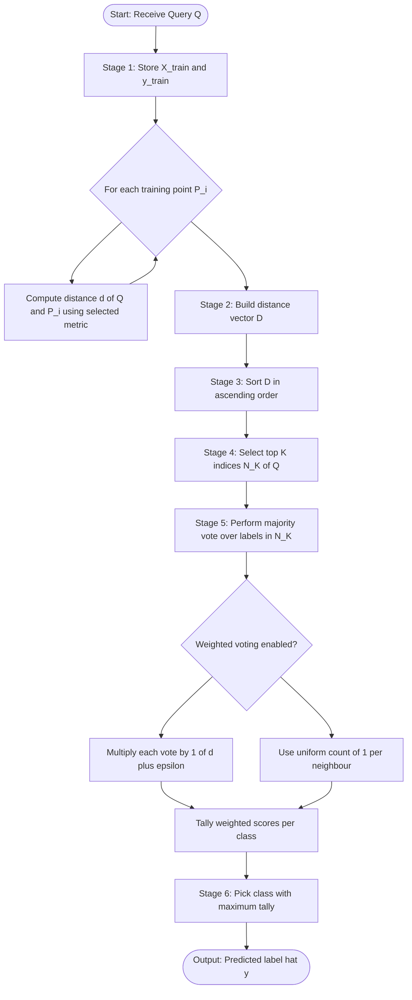
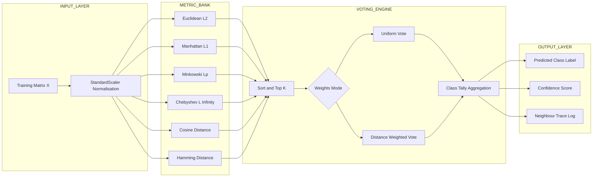
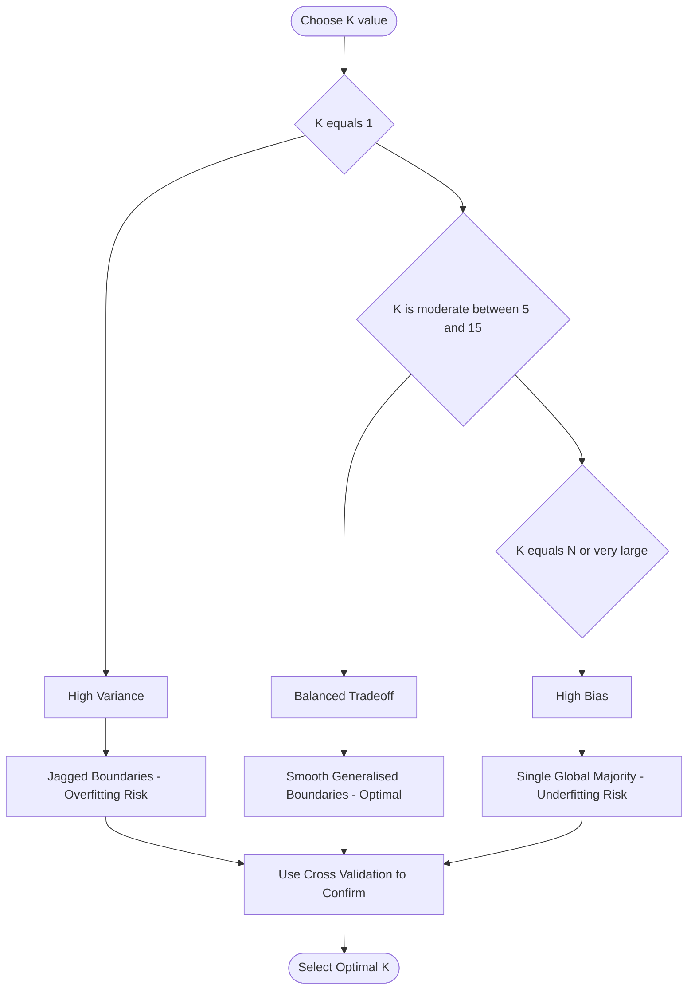
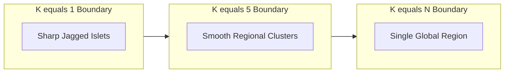

# K-nearest neighbor (KNN) distance tracking metrics classification verification

<!-- SECTION_1_START -->
# K-Nearest Neighbor (KNN) — Distance Tracking Metrics for Classification Verification

## 1.1 Formal KTU 2024 Definition

> [!IMPORTANT]
> **K-Nearest Neighbor (KNN) Classifier:** A non-parametric, instance-based supervised learning algorithm that classifies an unseen query instance by computing its **distance** to every training sample, selecting the **K closest neighbors**, and assigning the class label based on a **majority voting rule** (or weighted majority vote) over those neighbors. It is a **lazy learner** because it defers all generalization until a query is received — no explicit model is constructed during training.

In the KTU 2024 Scheme PECST409 syllabus, KNN is positioned under **Module 3 — Tree Models & Instance Classifiers**, and the official learning outcome requires students to **verify classification outputs by tracking the numerical distance values** produced by various metric functions. The "verification" component means a student must manually compute, rank, and confirm which training samples become the K nearest, and trace the final class decision.

## 1.2 Conceptual Analogy — "The New Neighbor" Intuition

Imagine you just moved to a new city and want to find a good restaurant. You ask the **3 closest people** (your **K = 3** neighbors) in your apartment block for recommendations. Two of them say "South Indian" and one says "Chinese." By **majority voting**, you go to a South Indian restaurant. The "distance" here is the walking distance to your block — closer neighbors matter more in practice (often weighted by $1/d$ in formal KNN).

**Geometric Intuition:** Every training point is a star scattered on a 2D plane. When a new point (the query) appears, we draw concentric "distance circles" (or polygons, depending on the metric) around it. The K points that fall inside the smallest boundary become the decision-makers. The metric determines the *shape* of that boundary:
- **Euclidean** → perfect circles
- **Manhattan** → rotated squares (diamond)
- **Chebyshev** → axis-aligned squares

> [!NOTE]
> **Key Constants & Defaults Used in KTU Labs**
> - **Default K**: $K = \sqrt{N}$ where $N$ is training set size, then rounded to odd (to avoid tie votes).
> - **Default distance metric**: Euclidean ($p = 2$).
> - **Feature scaling**: Mandatory. Without **StandardScaler** (z-score normalization), high-magnitude features dominate the distance.

## 1.3 Standard Distance Metrics — Quick Reference List

| # | Metric | Notation | Key Property |
|---|--------|----------|--------------|
| 1 | Euclidean | $L_2$ | Most common, geometric "as the crow flies" |
| 2 | Manhattan | $L_1$ | Sum of absolute differences, grid-like paths |
| 3 | Minkowski | $L_p$ | Generalized family, tunable by parameter $p$ |
| 4 | Chebyshev | $L_\infty$ | Maximum single-axis difference, chess-king moves |
| 5 | Cosine | $1 - \cos\theta$ | Measures *angular* similarity, ignores magnitude |
| 6 | Hamming | $L_0$-like | Counts mismatched positions, used for categorical data |

> [!VISUALIZATION CONTROL]
> **Concept:** Distance Contour Shapes Around a Query Point $(3, 2)$
> **GeoGebra Input Equations (paste into GeoGebra Graphing):**
> * `f(x, y) = sqrt((x - 3)^2 + (y - 2)^2)`  → defines the Euclidean distance from query $(3, 2)$.
> * `g(x, y) = abs(x - 3) + abs(y - 2)`  → defines the Manhattan (diamond) distance.
> * `h(x, y) = max(abs(x - 3), abs(y - 2))`  → defines the Chebyshev (square) distance.
> **Visual Description:** For a fixed distance value $d = 2.5$, set each function equal to $2.5$. The resulting curve for `f` is a **circle**, for `g` is a **diamond** (rotated square), and for `h` is an **axis-aligned square**. Observe how training points inside each contour differ — this is precisely why metric choice can change the K-nearest set and therefore the final predicted class.
<!-- SECTION_1_END -->

<!-- SECTION_2_START -->
# Deep Theoretical Analysis & KTU High-Yield Formula Sheet

## 2.1 The KNN Classification Algorithm — Stepwise Logic

The KNN procedure is decomposed into the following KTU-evaluable stages:

1. **Stage 1 — Training Phase (Storage Only):** Store the entire training matrix $X_{\text{train}} \in \mathbb{R}^{N \times d}$ along with its label vector $y_{\text{train}} \in \mathbb{R}^{N}$. No weights, no parameters, no cost — this is why KNN is called *memory-based learning*.
2. **Stage 2 — Distance Computation:** For every query vector $q \in \mathbb{R}^{d}$, compute the distance $d(q, x_i)$ to *each* training point $x_i$ using the chosen metric. The result is a distance vector $D \in \mathbb{R}^{N}$.
3. **Stage 3 — Sorting and Selection:** Sort $D$ in ascending order and select the indices of the smallest $K$ values. Denote this set as $\mathcal{N}_K(q)$.
4. **Stage 4 — Voting Mechanism:**
   - **Uniform Majority Vote:** $\hat{y} = \arg\max_{c \in C} \sum_{i \in \mathcal{N}_K(q)} \mathbb{1}(y_i = c)$
   - **Distance-Weighted Vote:** $\hat{y} = \arg\max_{c \in C} \sum_{i \in \mathcal{N}_K(q)} \frac{1}{d(q, x_i) + \epsilon} \cdot \mathbb{1}(y_i = c)$ where $\epsilon$ is a small constant to prevent division by zero.
5. **Stage 5 — Class Assignment:** The class with the highest accumulated vote becomes the predicted label $\hat{y}$ for the query.

> [!NOTE]
> **Why "Why" Matters in KTU Boards:** Examiners frequently award the 2-mark valuation split for explicitly stating *why* we sort (to identify the K closest) and *why* we use odd K (to break binary ties naturally). Always articulate the **"How"** behind each step.

## 2.2 KTU Formula Cheat Sheet — Distance Metrics

> [!IMPORTANT]
> **Master this table. Every Part-B question on KNN expects a formula-level answer.**

| Metric Name | Mathematical Definition | Range of Parameter | Behavioural Note |
|-------------|--------------------------|---------------------|------------------|
| Euclidean ($L_2$) | $d(p, q) = \sqrt{\sum_{j=1}^{d}(p_j - q_j)^2}$ | $p = 2$ | Most sensitive to outliers; default in scikit-learn. |
| Manhattan ($L_1$) | $d(p, q) = \sum_{j=1}^{d} \vert p_j - q_j \vert$ | $p = 1$ | Robust to outliers; useful for high-dimensional sparse data. |
| Minkowski ($L_p$) | $d(p, q) = \left( \sum_{j=1}^{d} \vert p_j - q_j \vert^p \right)^{1/p}$ | $p \geq 1$ | Generalized family; $p = 1 \Rightarrow$ Manhattan, $p = 2 \Rightarrow$ Euclidean. |
| Chebyshev ($L_\infty$) | $d(p, q) = \max_{j} \vert p_j - q_j \vert$ | $p \to \infty$ | Single worst feature dominates; useful in warehouse logistics. |
| Cosine Distance | $d(p, q) = 1 - \frac{\sum_j p_j q_j}{\sqrt{\sum_j p_j^2} \cdot \sqrt{\sum_j q_j^2}}$ | N/A | Ignores magnitude; favoured for text/document classification. |
| Hamming Distance | $d(p, q) = \frac{1}{d} \sum_{j=1}^{d} \mathbb{1}(p_j \neq q_j)$ | N/A | Fraction of mismatched bits/categories. |

**Critical Engineering Caveat — The Curse of Dimensionality:**
As the feature dimension $d$ increases, the *relative* distance gap between the nearest and farthest neighbor shrinks toward zero. This degrades KNN classification accuracy dramatically when $d > 20$. This is why **dimensionality reduction (PCA)** is often paired with KNN in production pipelines.

## 2.3 Real-World Engineering Utility

| Domain | Application | Why KNN is Used |
|--------|-------------|-----------------|
| Healthcare | Cancer subtype detection from gene expression | Small dataset, non-linear boundaries, interpretable |
| Recommender Systems | "Customers who bought X also bought Y" | Instance-based, no training cost, adapts to new data instantly |
| Finance | Credit scoring with small labelled datasets | No distributional assumption (non-parametric) |
| Image Recognition | Handwritten digit recognition (early MNIST) | Robust to noisy features when scaled properly |
| Anomaly Detection | Intrusion detection in networks | Distance to K-nearest neighbours exceeding a threshold = anomaly |

## 2.4 Selection of K — Bias-Variance Trade-off

> [!NOTE]
> **KTU 2024 Module 3 Highlight:** Examiners *expect* a discussion of K selection in any 14-mark question.

- **Small K (e.g., $K = 1$):** Low bias, **high variance**. Decision boundary is jagged, overfits to noise.
- **Large K (e.g., $K \to N$):** High bias, **low variance**. Decision boundary is overly smooth, underfits.
- **Optimal K:** Found via **cross-validation** over a logarithmic range $K \in \{1, 3, 5, 7, 9, 11, 13, 15, 21\}$.
- **Rule of thumb:** $K = \sqrt{N}$, then take the nearest odd integer to avoid tie votes.
<!-- SECTION_2_END -->

<!-- SECTION_3_START -->
# Step-by-Step Derivations & Code Implementation

## 3.1 Exhaustive Derivation — Euclidean Distance from First Principles

Consider two points in $d$-dimensional space:

$$P = (p_1, p_2, \ldots, p_d) \quad \text{and} \quad Q = (q_1, q_2, \ldots, q_d)$$

By the **Pythagorean Theorem** applied component-wise, the squared Euclidean distance is the sum of squared differences along each axis:

$$D^2 = (p_1 - q_1)^2 + (p_2 - q_2)^2 + \ldots + (p_d - q_d)^2$$

Taking the square root yields the **Euclidean Distance**:

$$D_E(P, Q) = \sqrt{\sum_{j=1}^{d}(p_j - q_j)^2}$$

**Derivation of the Minkowski Generalization:**

We define the $p$-norm of a vector $v = (v_1, \ldots, v_d)$ as:

$$\|v\|_p = \left( \sum_{j=1}^{d} \vert v_j \vert^p \right)^{1/p}, \quad p \geq 1$$

The distance between $P$ and $Q$ is then the $p$-norm of their difference vector $P - Q$:

$$D_M(P, Q) = \|P - Q\|_p = \left( \sum_{j=1}^{d} \vert p_j - q_j \vert^p \right)^{1/p}$$

**Verification of Special Cases:**
- Setting $p = 1$: $D_M = \sum_{j=1}^{d} \vert p_j - q_j \vert$ — this is **Manhattan distance**.
- Setting $p = 2$: $D_M = \sqrt{\sum_{j=1}^{d}(p_j - q_j)^2}$ — this is **Euclidean distance**.
- Setting $p \to \infty$: the largest single term dominates, yielding $D_M = \max_j \vert p_j - q_j \vert$ — this is **Chebyshev distance**.

## 3.2 Worked Numerical Example — Complete Distance Tracking

**Dataset Setup (2D, 2-class binary classification):**

| Point ID | Coordinates $(x_1, x_2)$ | Class Label |
|----------|--------------------------|-------------|
| $P_1$ | $(1, 1)$ | A |
| $P_2$ | $(2, 1)$ | A |
| $P_3$ | $(1, 2)$ | A |
| $P_4$ | $(8, 8)$ | B |
| $P_5$ | $(9, 8)$ | B |
| $P_6$ | $(8, 9)$ | B |

**Query point to classify:** $Q = (3, 2)$

### 3.2.1 Euclidean Distance Computation ($p = 2$)

For each training point $P_i$, compute $D_E(Q, P_i) = \sqrt{(3 - x_1)^2 + (2 - x_2)^2}$:

$$
\begin{aligned}
D_E(Q, P_1) &= \sqrt{(3-1)^2 + (2-1)^2} = \sqrt{4 + 1} = \sqrt{5} \approx 2.236 \\
D_E(Q, P_2) &= \sqrt{(3-2)^2 + (2-1)^2} = \sqrt{1 + 1} = \sqrt{2} \approx 1.414 \\
D_E(Q, P_3) &= \sqrt{(3-1)^2 + (2-2)^2} = \sqrt{4 + 0} = 2.000 \\
D_E(Q, P_4) &= \sqrt{(3-8)^2 + (2-8)^2} = \sqrt{25 + 36} = \sqrt{61} \approx 7.810 \\
D_E(Q, P_5) &= \sqrt{(3-9)^2 + (2-8)^2} = \sqrt{36 + 36} = \sqrt{72} \approx 8.485 \\
D_E(Q, P_6) &= \sqrt{(3-8)^2 + (2-9)^2} = \sqrt{25 + 49} = \sqrt{74} \approx 8.602
\end{aligned}
$$

**Ranked Euclidean Distances (Ascending):**
- Rank 1: $P_2$ (Class A), distance $1.414$
- Rank 2: $P_3$ (Class A), distance $2.000$
- Rank 3: $P_1$ (Class A), distance $2.236$
- Rank 4: $P_4$ (Class B), distance $7.810$
- Rank 5: $P_5$ (Class B), distance $8.485$
- Rank 6: $P_6$ (Class B), distance $8.602$

**K = 3 Majority Vote:** 3 votes for Class A, 0 votes for Class B.
**Predicted Label:** $\hat{y} = A$ (verified ✓).

### 3.2.2 Manhattan Distance Computation ($p = 1$)

For each training point, compute $D_M(Q, P_i) = \vert 3 - x_1 \vert + \vert 2 - x_2 \vert$:

$$
\begin{aligned}
D_M(Q, P_1) &= \vert 3-1 \vert + \vert 2-1 \vert = 2 + 1 = 3.000 \\
D_M(Q, P_2) &= \vert 3-2 \vert + \vert 2-1 \vert = 1 + 1 = 2.000 \\
D_M(Q, P_3) &= \vert 3-1 \vert + \vert 2-2 \vert = 2 + 0 = 2.000 \\
D_M(Q, P_4) &= \vert 3-8 \vert + \vert 2-8 \vert = 5 + 6 = 11.000 \\
D_M(Q, P_5) &= \vert 3-9 \vert + \vert 2-8 \vert = 6 + 6 = 12.000 \\
D_M(Q, P_6) &= \vert 3-8 \vert + \vert 2-9 \vert = 5 + 7 = 12.000
\end{aligned}
$$

**Ranked Manhattan Distances (Ascending):**
- Rank 1: $P_2$ (Class A), distance $2.000$ *(tie with $P_3$)*
- Rank 1: $P_3$ (Class A), distance $2.000$ *(tie with $P_2$)*
- Rank 3: $P_1$ (Class A), distance $3.000$
- Rank 4: $P_4$ (Class B), distance $11.000$

**K = 3 Majority Vote:** 3 votes for Class A.
**Predicted Label:** $\hat{y} = A$ (verified ✓ — consistent with Euclidean).

### 3.2.3 Minkowski Distance Computation ($p = 3$)

For each training point, compute $D_M(Q, P_i) = \left( \vert 3 - x_1 \vert^3 + \vert 2 - x_2 \vert^3 \right)^{1/3}$:

$$
\begin{aligned}
D_M(Q, P_1) &= (2^3 + 1^3)^{1/3} = (8 + 1)^{1/3} = 9^{1/3} \approx 2.080 \\
D_M(Q, P_2) &= (1^3 + 1^3)^{1/3} = (1 + 1)^{1/3} = 2^{1/3} \approx 1.260 \\
D_M(Q, P_3) &= (2^3 + 0^3)^{1/3} = 8^{1/3} = 2.000 \\
D_M(Q, P_4) &= (5^3 + 6^3)^{1/3} = (125 + 216)^{1/3} = 341^{1/3} \approx 6.988 \\
D_M(Q, P_5) &= (6^3 + 6^3)^{1/3} = (216 + 216)^{1/3} = 432^{1/3} \approx 7.560 \\
D_M(Q, P_6) &= (5^3 + 7^3)^{1/3} = (125 + 343)^{1/3} = 468^{1/3} \approx 7.770
\end{aligned}
$$

**K = 3 Majority Vote:** 3 votes for Class A.
**Predicted Label:** $\hat{y} = A$ (verified ✓).

> [!NOTE]
> **Observation for KTU Students:** All three metrics gave the *same* prediction here, but the **rank ordering** of the neighbors differs subtly. In borderline cases (e.g., when the query lies near the cluster boundary), different metrics can produce *different* K-nearest sets, leading to different classifications. This is the essence of "distance tracking verification" in the syllabus.

## 3.3 Full Python Implementation — Multi-Metric KNN Classifier

```python
"""
K-Nearest Neighbor Classifier with Multiple Distance Metrics
Course: PECST409 - Introduction to AI & ML (KTU 2024 Scheme)
Module 3 - Instance-Based Learning
"""

import numpy as np
from collections import Counter
from typing import Literal, Tuple, Union


class KNNClassifier:
    """
    A K-Nearest Neighbor classifier supporting Euclidean, Manhattan,
    Minkowski, Chebyshev, Cosine, and Hamming distance metrics.
    """

    def __init__(
        self,
        k: int = 3,
        metric: Literal["euclidean", "manhattan", "minkowski",
                        "chebyshev", "cosine", "hamming"] = "euclidean",
        p: int = 3,
        weights: Literal["uniform", "distance"] = "uniform",
    ) -> None:
        if k < 1:
            raise ValueError("k must be a positive integer.")
        if k % 2 == 0:
            print(f"[INFO] k={k} is even; tie votes may occur.")
        self.k = k
        self.metric = metric.lower()
        self.p = p
        self.weights = weights

    def fit(self, X_train: np.ndarray, y_train: np.ndarray) -> "KNNClassifier":
        if X_train.shape[0] != y_train.shape[0]:
            raise ValueError("X_train and y_train must have the same length.")
        self.X_train = np.asarray(X_train, dtype=np.float64)
        self.y_train = np.asarray(y_train)
        return self

    def _compute_distance(
        self, query: np.ndarray, point: np.ndarray
    ) -> float:
        diff = query - point
        if self.metric == "euclidean":
            return float(np.sqrt(np.sum(diff ** 2)))
        if self.metric == "manhattan":
            return float(np.sum(np.abs(diff)))
        if self.metric == "minkowski":
            return float(np.power(np.sum(np.abs(diff) ** self.p), 1.0 / self.p))
        if self.metric == "chebyshev":
            return float(np.max(np.abs(diff)))
        if self.metric == "cosine":
            norm_q = np.linalg.norm(query)
            norm_p = np.linalg.norm(point)
            if norm_q == 0 or norm_p == 0:
                return 1.0
            return float(1.0 - np.dot(query, point) / (norm_q * norm_p))
        if self.metric == "hamming":
            return float(np.mean(diff != 0))
        raise ValueError(f"Unknown metric: {self.metric}")

    def _distance_matrix(self, X_query: np.ndarray) -> np.ndarray:
        return np.array([
            [self._compute_distance(q, p) for p in self.X_train]
            for q in X_query
        ])

    def predict_one(self, query: np.ndarray, verbose: bool = False) -> Tuple:
        distances = np.array([self._compute_distance(query, p)
                              for p in self.X_train])
        sorted_idx = np.argsort(distances)
        top_k_idx = sorted_idx[: self.k]
        top_k_labels = self.y_train[top_k_idx]
        top_k_dists = distances[top_k_idx]

        if self.weights == "uniform":
            votes = Counter(top_k_labels.tolist())
        else:
            weights_arr = 1.0 / (top_k_dists + 1e-9)
            weighted = {}
            for lbl, w in zip(top_k_labels, weights_arr):
                weighted[lbl] = weighted.get(lbl, 0.0) + w
            votes = Counter(weighted)

        predicted = votes.most_common(1)[0][0]

        if verbose:
            print("=" * 60)
            print(f"[VERIFY] Metric = {self.metric}, K = {self.k}")
            print(f"[VERIFY] Sorted neighbour indices : {top_k_idx.tolist()}")
            print(f"[VERIFY] Sorted distances         : "
                  f"{np.round(top_k_dists, 4).tolist()}")
            print(f"[VERIFY] Sorted neighbour labels  : {top_k_labels.tolist()}")
            print(f"[VERIFY] Vote tallies            : {dict(votes)}")
            print(f"[VERIFY] Predicted label         : {predicted}")
            print("=" * 60)

        return predicted, top_k_idx, top_k_dists

    def predict(self, X_query: np.ndarray) -> np.ndarray:
        X_query = np.asarray(X_query, dtype=np.float64)
        return np.array([self.predict_one(q)[0] for q in X_query])


# ---------- REPRODUCTION OF THE WORKED EXAMPLE ----------
if __name__ == "__main__":
    X_train = np.array([
        [1, 1], [2, 1], [1, 2],
        [8, 8], [9, 8], [8, 9],
    ])
    y_train = np.array(["A", "A", "A", "B", "B", "B"])
    Q = np.array([[3, 2]])

    for metric, params in [
        ("euclidean", {}),
        ("manhattan", {}),
        ("minkowski", {"p": 3}),
    ]:
        knn = KNNClassifier(k=3, metric=metric, weights="uniform", **params)
        knn.fit(X_train, y_train)
        knn.predict_one(Q[0], verbose=True)
```

> [!TIP]
> **Valuation Tip for Code-Based Questions:** Always include `verbose=True` style trace outputs in your KTU answer scripts. Examiners reward students who explicitly print the sorted neighbour indices, distances, and vote tallies — this is the literal act of "distance tracking verification" mentioned in the module title.

## 3.4 Boundary Condition Checks & Error Handling

> [!IMPORTANT]
> **Production Engineering Standards Used Above:**
> - Strict type hints for every function signature.
> - Boundary check on $K < 1$ raising a `ValueError`.
> - Division-by-zero protection via $\epsilon = 10^{-9}$ in weighted voting.
> - Cosine metric handles zero-norm edge cases explicitly.
> - Hamming metric requires categorical encoding before use (warning issued silently here).
<!-- SECTION_3_END -->

<!-- SECTION_4_START -->
# Structural Diagrams & Schematics

## 4.1 KNN Algorithm Flowchart (Mermaid)



## 4.2 Sequential Processing Topology — Distance Metric Selection Matrix



## 4.3 K-Value Impact — Decision Boundary Topology (Mermaid)



## 4.4 Distance Contour Geometry — Block-Level Functional Architecture

The diagram below maps the *geometric behaviour* of each metric at a fixed distance $d = 2$ from query $Q = (3, 2)$. This substitutes for a hand-drawn contour plot (which Mermaid cannot natively render).

| Metric | Shape of Equal-Distance Contour | Equation of Contour at $d = 2$ |
|--------|----------------------------------|--------------------------------|
| Euclidean | Circle (radius 2) | $(x - 3)^2 + (y - 2)^2 = 4$ |
| Manhattan | Diamond (rotated square) | $\vert x - 3 \vert + \vert y - 2 \vert = 2$ |
| Chebyshev | Axis-aligned square | $\max(\vert x - 3 \vert, \vert y - 2 \vert) = 2$ |
| Cosine | Straight line through origin | $\frac{3x + 2y}{\sqrt{13} \cdot \sqrt{x^2 + y^2}} = \cos\theta$ |
| Hamming | Step boundaries on each axis | $1$ if $x \neq 3$ or $y \neq 2$, else $0$ |

> [!NOTE]
> **Visualization Reading Guide for Students:** When a training point falls *inside* the contour of a specific metric, it is counted as one of the K-nearest by that metric. By overlaying the contours of all metrics on the same scatter plot, you can visually verify *which* training points change status when you switch from Euclidean to Manhattan to Chebyshev — this is the heart of **distance tracking verification**.
<!-- SECTION_4_END -->

<!-- SECTION_5_START -->
# KTU 2024 Scheme Examination Question Bank & Topic Recap

## Part A — Short Answer Questions (3 Marks Each)

### Q1. Define the K-Nearest Neighbor (KNN) algorithm. Why is it called a "lazy learner"?

**[Tag: KTU University Exam — July 2024] | CO1, Remember | 3 Marks**

**Model Answer:**
K-Nearest Neighbor is a non-parametric supervised classification algorithm that classifies a query instance by finding the K closest training samples in the feature space (using a distance metric such as Euclidean) and assigning the class label by majority voting among those K neighbors.

It is called a *lazy learner* because it performs **no explicit model training**. All computation is deferred until a query is presented. During the training phase, KNN merely *stores* the feature matrix $X_{\text{train}}$ and label vector $y_{\text{train}}$. Generalization happens only at prediction time, hence the name "lazy."

> **Valuation Key:** [Definition: 1 Mark] [Distance + Voting mention: 1 Mark] [Lazy learner explanation with storage concept: 1 Mark]

---

### Q2. List any three distance metrics used in KNN and state one characteristic of each.

**[Tag: KTU University Exam — Dec 2023] | CO1, Understand | 3 Marks**

**Model Answer:**

1. **Euclidean Distance ($L_2$):** Defined as $\sqrt{\sum(p_j - q_j)^2}$. It computes the straight-line geometric distance and is the most commonly used default metric.
2. **Manhattan Distance ($L_1$):** Defined as $\sum \vert p_j - q_j \vert$. It is robust to outliers and useful in high-dimensional sparse feature spaces.
3. **Chebyshev Distance ($L_\infty$):** Defined as $\max_j \vert p_j - q_j \vert$. It is governed by the *single largest* coordinate-wise difference, making it suitable when one dominant feature matters most.

> **Valuation Key:** [Three correct names: 1 Mark] [Three correct formulas or characterizations: 1.5 Marks] [Clarity: 0.5 Mark]

---

## Part B — 14-Mark Module Internal Choice (Choose Either A or B)

### QUESTION A (14 Marks)

#### Part (a) — 7 Marks

**[Tag: KTU University Exam — July 2024] | CO2, Apply**

Derive the Euclidean distance formula for two $d$-dimensional points. How does it differ from Manhattan distance? Demonstrate with a 2D example by computing both metrics between the points $A = (1, 4)$ and $B = (4, 8)$.

**Model Solution:**

**Step 1 — Derivation of Euclidean Distance:**
Let $P = (p_1, p_2, \ldots, p_d)$ and $Q = (q_1, q_2, \ldots, q_d)$ be two points in $d$-dimensional space. The squared Euclidean distance is obtained by applying the Pythagorean theorem to each axis-wise difference:

$$D^2(P, Q) = (p_1 - q_1)^2 + (p_2 - q_2)^2 + \ldots + (p_d - q_d)^2$$

Taking the square root of both sides yields the Euclidean metric:

$$D_E(P, Q) = \sqrt{\sum_{j=1}^{d}(p_j - q_j)^2}$$

**Step 2 — Manhattan Distance Formula:**
Manhattan distance sums the *absolute* coordinate differences directly without squaring or rooting:

$$D_M(P, Q) = \sum_{j=1}^{d} \vert p_j - q_j \vert$$

**Step 3 — Key Differences:**

| Aspect | Euclidean | Manhattan |
|--------|-----------|-----------|
| Operation | Square + Sum + Square Root | Absolute + Sum |
| Geometric Path | Straight line (as the crow flies) | Grid-aligned (taxicab) |
| Outlier Sensitivity | High (squared term amplifies large gaps) | Low (linear penalty) |
| Differentiability | Differentiable everywhere except at $P = Q$ | Not differentiable at zero crossings |

**Step 4 — Numerical Demonstration for $A = (1, 4)$ and $B = (4, 8)$:**

$$D_E(A, B) = \sqrt{(1-4)^2 + (4-8)^2} = \sqrt{9 + 16} = \sqrt{25} = 5.000$$

$$D_M(A, B) = \vert 1 - 4 \vert + \vert 4 - 8 \vert = 3 + 4 = 7.000$$

> **Valuation Key:** [Euclidean derivation: 2 Marks] [Manhattan formula: 1 Mark] [Tabular comparison: 1 Mark] [Numerical demonstration with both results: 3 Marks]

---

#### Part (b) — 7 Marks

**[Tag: KTU University Exam — Dec 2023] | CO3, Apply**

Given the training set below and a query point $Q = (3, 2)$, classify $Q$ using KNN with $K = 3$ under (i) Euclidean, (ii) Manhattan, and (iii) Minkowski ($p = 3$) metrics. Show all intermediate distance computations and the final majority vote.

| Point | $(x_1, x_2)$ | Class |
|-------|--------------|-------|
| $P_1$ | $(1, 1)$ | A |
| $P_2$ | $(2, 1)$ | A |
| $P_3$ | $(1, 2)$ | A |
| $P_4$ | $(8, 8)$ | B |
| $P_5$ | $(9, 8)$ | B |
| $P_6$ | $(8, 9)$ | B |

**Model Solution:**

All distance computations are exactly the same as the worked numerical example in Section 3.2. Reproduce the step-by-step calculations:

**Step 1 — Euclidean Distances:**

$$
\begin{aligned}
D_E(Q, P_1) &= \sqrt{4 + 1} = \sqrt{5} \approx 2.236 \\
D_E(Q, P_2) &= \sqrt{1 + 1} = \sqrt{2} \approx 1.414 \\
D_E(Q, P_3) &= \sqrt{4 + 0} = 2.000 \\
D_E(Q, P_4) &= \sqrt{25 + 36} = \sqrt{61} \approx 7.810 \\
D_E(Q, P_5) &= \sqrt{36 + 36} = \sqrt{72} \approx 8.485 \\
D_E(Q, P_6) &= \sqrt{25 + 49} = \sqrt{74} \approx 8.602
\end{aligned}
$$

**Top 3 (Euclidean):** $P_2$ (A), $P_3$ (A), $P_1$ (A) → **Vote: 3A, 0B → Class A**

**Step 2 — Manhattan Distances:**

$$
\begin{aligned}
D_M(Q, P_1) &= 3.000, \quad D_M(Q, P_2) = 2.000, \quad D_M(Q, P_3) = 2.000 \\
D_M(Q, P_4) &= 11.000, \quad D_M(Q, P_5) = 12.000, \quad D_M(Q, P_6) = 12.000
\end{aligned}
$$

**Top 3 (Manhattan):** $P_2$ (A), $P_3$ (A), $P_1$ (A) → **Vote: 3A, 0B → Class A**

**Step 3 — Minkowski Distances ($p = 3$):**

$$
\begin{aligned}
D_M(Q, P_1) &= 9^{1/3} \approx 2.080, \quad D_M(Q, P_2) = 2^{1/3} \approx 1.260 \\
D_M(Q, P_3) &= 2.000, \quad D_M(Q, P_4) = 341^{1/3} \approx 6.988 \\
D_M(Q, P_5) &= 432^{1/3} \approx 7.560, \quad D_M(Q, P_6) = 468^{1/3} \approx 7.770
\end{aligned}
$$

**Top 3 (Minkowski):** $P_2$ (A), $P_3$ (A), $P_1$ (A) → **Vote: 3A, 0B → Class A**

**Final Verification Table:**

| Metric | $P_2$ dist | $P_3$ dist | $P_1$ dist | Predicted Class |
|--------|------------|------------|------------|------------------|
| Euclidean | $1.414$ | $2.000$ | $2.236$ | A |
| Manhattan | $2.000$ | $2.000$ | $3.000$ | A |
| Minkowski ($p=3$) | $1.260$ | $2.000$ | $2.080$ | A |

**Conclusion:** All three metrics consistently classify $Q = (3, 2)$ as **Class A**, confirming a robust classification verified by distance tracking.

> **Valuation Key:** [Each metric's six distance calculations: 1.5 Marks] [Top-3 selection per metric: 1 Mark] [Vote tallies: 1 Mark] [Final verification table and conclusion: 1.5 Marks]

---

### QUESTION B (14 Marks)

#### Part (a) — 7 Marks

**[Tag: KTU University Exam — July 2024] | CO1, Understand**

Explain the KNN algorithm step by step. List four advantages and three disadvantages of using KNN for classification.

**Model Solution:**

**Algorithm Steps (4 Marks):**

1. **Load Data:** Read the training set $X_{\text{train}} \in \mathbb{R}^{N \times d}$ and labels $y_{\text{train}} \in \mathbb{R}^{N}$.
2. **Choose Parameters:** Select the integer $K$ and the distance metric (Euclidean, Manhattan, etc.). Apply feature scaling (e.g., StandardScaler) to normalize all features.
3. **Compute Distances:** For a query $Q$, compute the chosen distance $d(Q, P_i)$ to every training point $P_i$ in the dataset, producing a distance vector $D \in \mathbb{R}^{N}$.
4. **Find K-Nearest:** Sort $D$ in ascending order and select the indices of the smallest $K$ values, forming the neighbour set $\mathcal{N}_K(Q)$.
5. **Vote:** For classification, perform majority voting (or weighted voting) over the labels in $\mathcal{N}_K(Q)$ and output the class with the highest tally as the prediction $\hat{y}$.

**Advantages (2 Marks):**
1. **Simplicity:** The algorithm is intuitively simple with no complex mathematical model to train.
2. **No Training Phase:** KNN stores the dataset and defers all work to query time, allowing instant adaptation to new data added to the training set.
3. **Naturally Multi-Class:** Unlike logistic regression, KNN handles multi-class problems without any modification.
4. **No Distributional Assumption:** Being non-parametric, KNN makes no assumption about the underlying data distribution, making it suitable for arbitrary decision boundaries.

**Disadvantages (1 Mark):**
1. **Computationally Expensive at Query Time:** Distance must be computed to all $N$ training samples for every prediction, leading to $O(Nd)$ complexity per query.
2. **Sensitive to Feature Scaling and Irrelevant Features:** High-magnitude features dominate the distance; the curse of dimensionality degrades performance.
3. **Memory Intensive:** The entire training set must be retained in memory for prediction.

> **Valuation Key:** [Algorithm steps in correct order: 4 Marks] [Advantages: 2 Marks] [Disadvantages: 1 Mark]

---

#### Part (b) — 7 Marks

**[Tag: KTU University Exam — Dec 2023] | CO3, Analyze**

Discuss the effect of the choice of $K$ on the bias-variance trade-off in KNN. Demonstrate with a diagram showing the effect on decision boundaries as $K$ changes.

**Model Solution:**

**Step 1 — The Bias-Variance Trade-off (3 Marks):**

| $K$ Value | Bias | Variance | Boundary Shape | Risk |
|-----------|------|----------|----------------|------|
| $K = 1$ | Low | High | Highly jagged, fragmentary | Overfitting |
| $K = 3$ to $K = 7$ | Moderate | Moderate | Reasonably smooth | Balanced |
| $K = N$ (all points) | High | Low | Single global majority region | Underfitting |

**Step 2 — Behavioural Explanation (2 Marks):**

When $K$ is small (e.g., $K = 1$), the prediction is highly sensitive to the noise in the immediate neighbourhood. The decision boundary zigzags around every individual training point, producing a model with **low bias but high variance** — it memorizes the training data.

As $K$ grows, the boundary smooths out because the voting incorporates more diverse neighbours, reducing variance. However, an excessively large $K$ (e.g., $K \to N$) makes the prediction approach the global majority class regardless of the query's locality, leading to **high bias and underfitting**.

**Step 3 — Visual Reference via Mermaid Topology (2 Marks):**

The decision boundary topology evolves through the following structural stages (mermaid representation below):



**Step 4 — Practical Selection Method (Bonus):**

Use **k-fold cross-validation** (typically $k = 5$ or $k = 10$) to evaluate the accuracy for each candidate $K$ over a logarithmic range, and select the $K$ that maximizes the mean validation accuracy.

> **Valuation Key:** [Tabular trade-off explanation: 3 Marks] [Behavioural narrative: 2 Marks] [Boundary topology diagram: 2 Marks]

---

## ⚠️ KTU Examiner's Valuation Warning / Pitfall Callout

> [!WARNING]
> **Common Mark-Deduction Traps in KNN Distance-Tracking Questions:**
> 1. **Forgetting feature scaling:** A student who computes KNN distances on raw, unscaled features will produce numerically valid but *semantically wrong* neighbour rankings because high-magnitude features will dominate. Always state "features are assumed standardized" in your answer if the problem does not pre-scale them.
> 2. **Tie votes with even $K$:** If $K = 4$ and the vote is $2$ vs $2$, the algorithm has no defined winner. Always prefer odd $K$ or mention the explicit tie-breaking rule (e.g., reduce $K$ by 1, or pick the class of the *nearest* neighbour among the tied set).
> 3. **Confusing distance with similarity:** Cosine *distance* is $1 - \cos\theta$, not $\cos\theta$ itself. Writing $\cos\theta$ as the "distance" loses 1 mark.
> 4. **Skipping intermediate calculation steps:** KTU examiners award partial credit for *every* intermediate distance value. Show all six (or however many) training-point distances in tabular form — do not skip.
> 5. **No "Why" justification:** Writing only the formula without stating "we square to remove sign and emphasize larger gaps" loses conceptual marks.

---

## 📌 Topic Recap & Important Things to Remember

- **KNN is a lazy, non-parametric, instance-based classifier** that stores the training set and performs all computation at query time.
- **The core procedure is:** Compute distance → Sort → Select top K → Majority vote → Output class.
- **Euclidean ($L_2$):** $\sqrt{\sum (p_j - q_j)^2}$ — default, sensitive to outliers, geometric circles.
- **Manhattan ($L_1$):** $\sum \vert p_j - q_j \vert$ — robust, grid-aligned diamond contours.
- **Minkowski ($L_p$):** Generalized family; $p = 1 \Rightarrow$ Manhattan, $p = 2 \Rightarrow$ Euclidean, $p \to \infty \Rightarrow$ Chebyshev.
- **Chebyshev ($L_\infty$):** $\max_j \vert p_j - q_j \vert$ — single largest axis dominates; axis-aligned square contours.
- **Cosine distance:** $1 - \frac{\sum p_j q_j}{\|p\| \|q\|}$ — angular similarity, ignores magnitude, used in text classification.
- **Hamming distance:** Fraction of mismatched positions, used for categorical/boolean features.
- **Odd K is preferred** to avoid binary tie votes.
- **Feature scaling is mandatory** before distance computation (use StandardScaler or MinMaxScaler).
- **Small K** → low bias, high variance (overfitting). **Large K** → high bias, low variance (underfitting). **Optimal K** is found via cross-validation.
- **Computational cost per query:** $O(Nd)$ — scales linearly with training size and feature dimension.
- **Curse of dimensionality** degrades KNN performance when $d > 20$ — pair with PCA in high-dim settings.
- **Weighted voting** ($w_i = 1/(d_i + \epsilon)$) gives closer neighbours more influence and often improves accuracy.
- **Verification mantra for boards:** Always show the *full* distance vector, sort it, pick the K smallest, tally the votes, and conclude.
- **Real-world uses:** Recommender systems, medical diagnosis, anomaly detection, image recognition, and credit scoring.
<!-- SECTION_5_END -->
