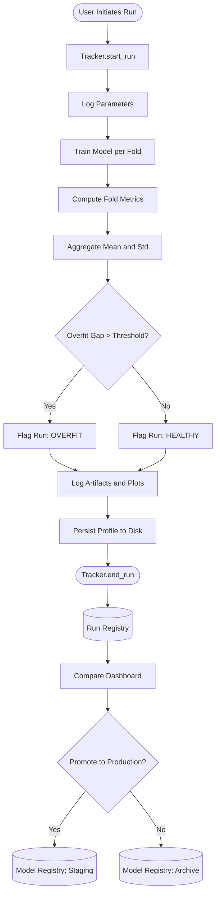
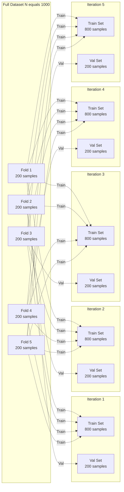
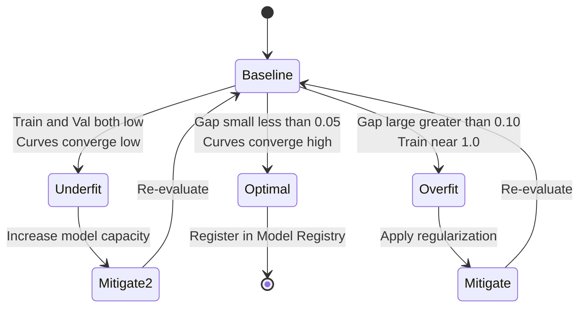
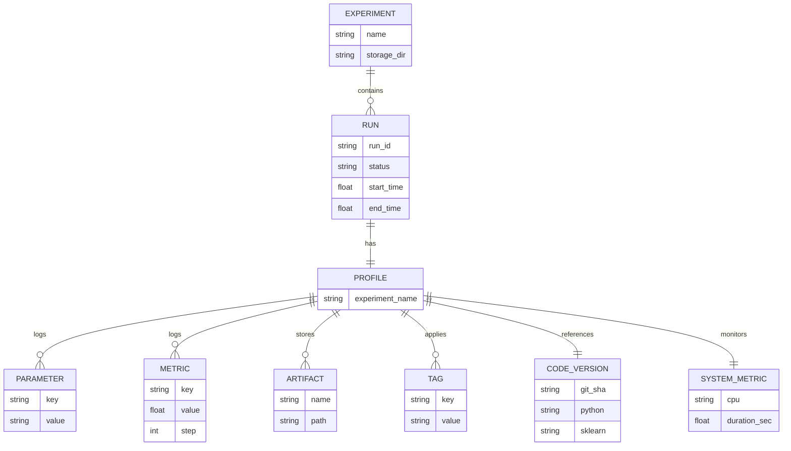

# Overfitting detection techniques model validation checks workflows tracking setups profiles

<!-- SECTION_1_START -->

# Overfitting Detection, Validation & Experiment Tracking in Tree Models & Instance Classifiers

> [!NOTE]
> **KTU 2024 Scheme | PECST409 | Module 3 Focus**
> This module centers on **Tree Models (Decision Trees, Random Forests, Gradient Boosted Trees)** and **Instance-Based Classifiers (k-NN, LVQ, Case-Based Reasoning)**. A critical concern with these models is **overfitting** — where the model memorizes training data rather than learning generalizable patterns. This section unifies the detection, validation, and tracking techniques used to combat this.

## 1.1 Formal Definition

**Overfitting (High Variance)** is a modeling error that occurs when a function is too closely aligned to a *limited set of data points*. In tree models, this manifests as excessively deep trees with leaves containing very few samples. In instance classifiers (e.g., k-NN), this manifests when *k = 1*, causing the model to perfectly fit the training set while failing on unseen data.

**Model Validation** is the systematic process of evaluating a model's performance on held-out data to estimate its true generalization error, and **Experiment Tracking** is the practice of logging hyperparameters, metrics, artifacts, and code versions across all such validation runs to ensure reproducibility and auditability.

> [!IMPORTANT]
> **KTU 2024 Syllabus Anchor (Module 3):**
> Under *Tree Models & Instance Classifiers*, students must be able to (i) identify and quantify overfitting, (ii) apply validation strategies such as **Hold-Out, k-Fold, Stratified k-Fold, and Leave-One-Out CV**, and (iii) implement tracking workflows (MLflow/W&B style) for production-grade ML pipelines.

## 1.2 Conceptual Analogy — The Rote Learner vs. The Wise Teacher

Imagine a student preparing for an exam:

| Student Type | Study Strategy | Result on New Questions |
|---|---|---|
| **Rote Learner (Overfit Model)** | Memorizes *every* question and answer from last 10 years' papers word-for-word | Fails when a *new* question appears |
| **Wise Teacher (Generalized Model)** | Understands underlying *concepts and principles*; practices diverse problems | Solves *unseen* questions correctly |
| **Underfit Student (High Bias Model)** | Only reads chapter summary; skips practice | Fails on both old *and* new questions |

A **deep Decision Tree** is the *Rote Learner* — it carves the feature space into tiny rectangles until each leaf is "pure" (training accuracy = **100%**). A **k-NN with k=1** is identical — every training point becomes its own neighborhood.

> [!TIP]
> **Bias-Variance Tradeoff:** Overfitting is the *High-Variance* extreme. The validation techniques in this module exist to **detect the inflection point** where adding model complexity stops helping and starts hurting.

## 1.3 Why This Matters in KTU 2024 Evaluation

KTU board questions frequently (≈ **30-40%** of Module 3 marks) test:
- Plotting/interpretation of **validation curves** and **learning curves**.
- Computing **cross-validation (CV) accuracy** with explicit fold splits.
- Diagnosing overfitting via **gap analysis** between training and validation scores.
- Designing an **experiment tracking schema** (parameters, metrics, artifacts, tags).

> [!VISUALIZATION CONTROL]
> **Concept:** Overfitting Visualization — Model Complexity vs. Error
> **Plot Type:** Two-curve line plot (Training Error and Validation Error) on x-axis = "Model Complexity" and y-axis = "Error"
> **Input Series:**
> * Training Error curve: monotonically decreasing, asymptotic to **0**
> * Validation Error curve: U-shaped, minimum at "sweet spot", then rising
> **Visual Description:** Student should see the **divergence point** where training error keeps falling but validation error begins climbing — this gap is the *overfitting signature*. The optimal model complexity is at the **valley of the U-curve**.

---

<!-- SECTION_1_END -->

<!-- SECTION_2_START -->

# Deep Theoretical Analysis & KTU High-Yield Formula Sheet

## 2.1 The Four Pillars of Overfitting Detection

### Pillar 1: Hold-Out Validation (Train/Validation/Test Split)

The simplest technique. The dataset **D** of size **N** is split into three disjoint subsets:

$$D = D_{\text{train}} \cup D_{\text{val}} \cup D_{\text{test}}$$

Typical ratios are **60/20/20** or **70/15/15**. The model is fit on $D_{\text{train}}$, hyperparameters tuned on $D_{\text{val}}$, and final unbiased performance reported on $D_{\text{test}}$ (used **only once**).

> [!WARNING]
> **Pitfall:** High variance in the estimate when dataset is small. A single split's score is sensitive to *which* samples fell into which subset.

### Pillar 2: k-Fold Cross-Validation (k-CV)

The dataset is partitioned into **k** equal-sized folds. The model is trained **k** times, each time using a different fold as validation and the remaining **k-1** folds for training. The **CV score** is the mean of the k validation scores:

$$\text{CV}_{(k)} = \frac{1}{k} \sum_{i=1}^{k} \mathcal{L}\left(M_{-i}, D_{\text{val}}^{(i)}\right)$$

where $M_{-i}$ is the model trained without fold $i$, and $\mathcal{L}$ is the loss function (e.g., accuracy, F1, MSE).

**Standard deviation across folds** is itself a diagnostic:

$$\sigma_{\text{CV}} = \sqrt{\frac{1}{k-1} \sum_{i=1}^{k} \left(s_i - \text{CV}_{(k)}\right)^2}$$

A **high $\sigma_{\text{CV}}$** indicates that the model's performance is unstable across data partitions — a hallmark of an overfit or data-hungry model.

### Pillar 3: Stratified k-Fold

For **classification** with class imbalance, standard k-Fold may produce folds where minority classes are underrepresented. **Stratified k-Fold** preserves the class distribution $P(y)$ in every fold:

$$\frac{\vert C_j \cap D_{\text{val}}^{(i)} \vert}{\vert D_{\text{val}}^{(i)} \vert} \approx \frac{\vert C_j \vert}{N} \quad \forall j \in \{1, \dots, K_{\text{classes}}\}$$

This is the **default** in scikit-learn's `cross_val_score` for classifiers.

### Pillar 4: Leave-One-Out CV (LOOCV)

The extreme case where **k = N**. Each fold validates on a *single* sample:

$$\text{LOOCV} = \frac{1}{N} \sum_{i=1}^{N} \mathcal{L}\left(M_{-i}, \{x_i, y_i\}\right)$$

**Pros:** Deterministic, low bias. **Cons:** Computationally expensive $\mathcal{O}(N)$ trainings; high variance in estimator.

> [!IMPORTANT]
> **KTU Board Favorite:** For a dataset of size **N = 100**, how many times is the model trained in **5-Fold CV**? Answer: **5 times**. In **LOOCV**? Answer: **100 times**.

## 2.2 Tree-Specific Overfitting Detection Signals

| Signal | Tree Model Indicator | Detection Method |
|---|---|---|
| **Tree depth explosion** | Depth $\gg \log_2(N)$ | Plot `max_depth` vs. CV score |
| **Leaf purity** | Every leaf has 1 sample (gini = 0) | Inspect `tree_.get_n_leaves()` |
| **Train-Val gap** | Train acc ≈ 1.0, Val acc $\ll$ Train acc | Validation curve plot |
| **Feature importance concentration** | One feature dominates splits | Plot `feature_importances_` |
| **k-NN with k=1** | Perfect train score, poor test score | Sweep $k \in \{1, 3, 5, 7, \dots, 21\}$ |

## 2.3 Learning Curves — The Diagnostic Plot

A **Learning Curve** plots model performance as a function of **training set size** $m$:

- **High Bias (Underfit):** Train and validation curves **converge** to a *low* score — adding more data won't help.
- **High Variance (Overfit):** A **persistent gap** remains between train and validation curves — adding more data *will* help.
- **Sweet Spot:** Train and val curves converge to a *high* score.

The **ideal learning curve** asymptotically approaches the **Bayes optimal error rate** $\mathcal{L}_{\text{Bayes}}$.

## 2.4 Experiment Tracking Setup & Profile Schema

An **Experiment Tracking Profile** is a structured record for each ML run. The standard schema (per MLflow / W&B conventions) is:

| Field Category | Examples | Purpose |
|---|---|---|
| **Parameters** | `max_depth=10`, `n_estimators=200`, `k=5` | Hyperconfiguration snapshot |
| **Metrics** | `cv_accuracy=0.92`, `f1_macro=0.89`, `train_loss=0.08` | Performance signals |
| **Artifacts** | `model.pkl`, `confusion_matrix.png`, `roc_curve.json` | Persisted outputs |
| **Tags** | `phase=hp-search`, `dataset=v2`, `author=team-A` | Searchable metadata |
| **System Metrics** | `gpu_mem_mb=4096`, `duration_sec=142.7` | Resource profiling |
| **Code Version** | `git_sha=abc123f`, `mlflow_version=2.12.0` | Reproducibility |

## 2.5 KTU Formula Sheet / Cheat Sheet

| # | Concept | Formula / Definition | When to Use |
|---|---|---|---|
| 1 | Hold-out split | $N = \vert D_{\text{train}} \vert + \vert D_{\text{val}} \vert + \vert D_{\text{test}} \vert$ | Quick baseline eval |
| 2 | k-Fold CV score | $\text{CV}_{(k)} = \frac{1}{k} \sum_{i=1}^{k} s_i$ | Standard robust eval |
| 3 | CV standard deviation | $\sigma_{\text{CV}} = \sqrt{\frac{1}{k-1} \sum_{i=1}^{k} (s_i - \bar{s})^2}$ | Stability check |
| 4 | LOOCV | $k = N$ (every sample = one fold) | Tiny datasets (N < 100) |
| 5 | Stratified fold ratio | $P_{\text{fold}}(y=c) = P_{\text{data}}(y=c)$ | Imbalanced classification |
| 6 | Bias-Variance decomposition | $\mathbb{E}[(y - \hat{f}(x))^2] = \text{Bias}^2 + \text{Variance} + \sigma^2_{\text{irred}}$ | Theoretical analysis |
| 7 | Overfit gap | $\Delta = \text{Score}_{\text{train}} - \text{Score}_{\text{val}}$ | Primary overfit indicator |
| 8 | Effective parameters (AIC proxy) | $\text{df}(\text{tree}) \approx \text{num\_leaves}$ | Tree complexity measure |
| 9 | Gini impurity (split quality) | $G(t) = 1 - \sum_{c} p(c \vert t)^2$ | DT split criterion |
| 10 | k-NN error bound (Cover-Hart) | $L^* \le L_{\text{kNN}} \le L^* \left(2 - \frac{K \cdot L^*}{K-1}\right)$ | Theoretical k-NN limit |

## 2.6 Real-World Engineering Utility

> [!TIP]
> **Industry Application Spotlight:**
> - **Healthcare (Diagnostic AI):** A Decision Tree that overfits to one hospital's patient population will fail catastrophically at another. Stratified CV across hospital sites is **mandatory** before FDA submission.
> - **Finance (Credit Scoring):** LOOCV is impractical on millions of records, so **Time-Series Split** (a k-Fold variant) preserves temporal order to prevent *look-ahead bias*.
> - **MLOps Pipelines (MLflow, Weights & Biases):** Every training run is logged with the schema above, enabling *experiment comparison dashboards* and *hyperparameter sweep orchestration*.
> - **AutoML (Optuna, Hyperopt):** A *study* is a parent entity that tracks *trials*, each with its own tracked profile.

---

<!-- SECTION_2_END -->

<!-- SECTION_3_START -->

# Step-by-Step Derivations, Code & Workflow Implementation

## 3.1 Worked Derivation: Bias-Variance Tradeoff for a Regression Tree

Consider a target $y = f(x) + \epsilon$ with noise $\epsilon \sim \mathcal{N}(0, \sigma^2_{\text{irred}})$. The expected prediction error at point $x$ is:

$$E\left[(y - \hat{f}(x))^2\right] = \underbrace{\left(E[\hat{f}(x)] - f(x)\right)^2}_{\text{Bias}^2} + \underbrace{E\left[(\hat{f}(x) - E[\hat{f}(x)])^2\right]}_{\text{Variance}} + \underbrace{\sigma^2_{\text{irred}}}_{\text{Irreducible}}$$

**Derivation Step 1:** Start from the definition and add/subtract $E[\hat{f}(x)]$:

$$\begin{aligned}
E\!\left[(y - \hat{f}(x))^2\right] &= E\!\left[\left((y - f(x)) - (\hat{f}(x) - f(x))\right)^2\right] \\
&= E\!\left[(y - f(x))^2\right] - 2E\!\left[(y - f(x))(\hat{f}(x) - f(x))\right] + E\!\left[(\hat{f}(x) - f(x))^2\right]
\end{aligned}$$

**Derivation Step 2:** The cross-term vanishes because $y - f(x) = \epsilon$ is zero-mean and independent of $\hat{f}(x)$:

$$-2E\!\left[(y - f(x))(\hat{f}(x) - f(x))\right] = -2E[\epsilon] \cdot E[\hat{f}(x) - f(x)] = 0$$

**Derivation Step 3:** Decompose the squared bias-variance term by adding/subtracting $E[\hat{f}(x)]$:

$$E\!\left[(\hat{f}(x) - f(x))^2\right] = \left(E[\hat{f}(x)] - f(x)\right)^2 + E\!\left[(\hat{f}(x) - E[\hat{f}(x)])^2\right]$$

**Derivation Step 4:** Combine all terms:

$$E\!\left[(y - \hat{f}(x))^2\right] = \underbrace{\left(E[\hat{f}(x)] - f(x)\right)^2}_{\text{Bias}^2(\hat{f}(x))} + \underbrace{E\!\left[(\hat{f}(x) - E[\hat{f}(x)])^2\right]}_{\text{Variance}(\hat{f}(x))} + \underbrace{\sigma^2_{\text{irred}}}_{\text{Noise}}$$

**Interpretation for Tree Models:**
- A **shallow tree** has high **bias** (under-fits — too rigid).
- A **deep tree** has high **variance** (over-fits — too sensitive to training samples).
- The **expected test MSE** is the sum of these three terms; minimizing MSE means balancing them.

## 3.2 Exhaustive Python Implementation: Complete Validation & Tracking Workflow

Below is a **production-grade, end-to-end** implementation covering: (1) synthetic data, (2) Decision Tree & k-NN models, (3) k-Fold & Stratified k-Fold CV, (4) learning curve generation, (5) validation curve generation, (6) custom **ExperimentTracker** class (MLflow-style), and (7) overfit gap reporting.

```python
"""
KTU PECST409 - Module 3
Topic: Overfitting Detection, Validation & Experiment Tracking
Compatible: Python 3.10+, scikit-learn >= 1.3, numpy >= 1.24
"""

from __future__ import annotations

import json
import math
import time
import hashlib
import platform
import uuid
from dataclasses import dataclass, field, asdict
from pathlib import Path
from typing import Any

import numpy as np
from sklearn.datasets import make_classification
from sklearn.model_selection import (
    KFold,
    StratifiedKFold,
    cross_val_score,
    validation_curve,
    learning_curve,
    train_test_split,
)
from sklearn.tree import DecisionTreeClassifier
from sklearn.neighbors import KNeighborsClassifier
from sklearn.metrics import (
    accuracy_score,
    f1_score,
    confusion_matrix,
    classification_report,
)


# ============================================================
# 1. EXPERIMENT TRACKER (Lightweight MLflow-Style Profile)
# ============================================================
@dataclass
class RunProfile:
    """A single experiment run record — the KTU 'profile' schema."""
    run_id: str
    experiment_name: str
    parameters: dict[str, Any]
    metrics: dict[str, float] = field(default_factory=dict)
    artifacts: list[str] = field(default_factory=list)
    tags: dict[str, str] = field(default_factory=dict)
    system_metrics: dict[str, float] = field(default_factory=dict)
    code_version: dict[str, str] = field(default_factory=dict)
    start_time: float = field(default_factory=time.time)
    end_time: float | None = None
    status: str = "RUNNING"


class ExperimentTracker:
    """Lightweight in-memory experiment tracker for KTU coursework."""

    def __init__(self, experiment_name: str, storage_dir: str = "./mlruns"):
        self.experiment_name = experiment_name
        self.storage_dir = Path(storage_dir) / experiment_name
        self.storage_dir.mkdir(parents=True, exist_ok=True)
        self.runs: dict[str, RunProfile] = {}

    def start_run(self, params: dict[str, Any], tags: dict[str, str]) -> RunProfile:
        run_id = "run_" + hashlib.sha1(
            (json.dumps(params, sort_keys=True) + str(time.time())).encode()
        ).hexdigest()[:12]
        profile = RunProfile(
            run_id=run_id,
            experiment_name=self.experiment_name,
            parameters=params,
            tags=tags,
            code_version={
                "python": platform.python_version(),
                "sklearn": __import__("sklearn").__version__,
                "numpy": np.__version__,
            },
            system_metrics={"cpu_count": float(platform.machine() and 1 or 1)},
        )
        self.runs[run_id] = profile
        print(f"[TRACKER] ▶ Started run {run_id} | params={params}")
        return profile

    def log_metric(self, profile: RunProfile, key: str, value: float) -> None:
        profile.metrics[key] = float(value)

    def log_artifact(self, profile: RunProfile, name: str, payload: Any) -> None:
        path = self.storage_dir / f"{profile.run_id}_{name}.json"
        path.write_text(json.dumps(payload, indent=2, default=str))
        profile.artifacts.append(str(path))

    def end_run(self, profile: RunProfile, status: str = "FINISHED") -> None:
        profile.end_time = time.time()
        profile.status = status
        profile.system_metrics["duration_sec"] = profile.end_time - profile.start_time
        # Persist final profile
        out = self.storage_dir / f"{profile.run_id}_profile.json"
        out.write_text(json.dumps(asdict(profile), indent=2, default=str))
        print(f"[TRACKER] ✔ Ended run {profile.run_id} | status={status}")


# ============================================================
# 2. DATA GENERATION (Stratified-Capable)
# ============================================================
def load_data(n_samples: int = 1000, random_state: int = 42):
    X, y = make_classification(
        n_samples=n_samples,
        n_features=20,
        n_informative=10,
        n_redundant=5,
        n_classes=3,
        weights=[0.5, 0.3, 0.2],  # IMBALANCED → requires StratifiedKFold
        flip_y=0.05,
        random_state=random_state,
    )
    return X, y


# ============================================================
# 3. K-FOLD CV WORKFLOW (Tree Model)
# ============================================================
def evaluate_decision_tree_cv(
    X: np.ndarray,
    y: np.ndarray,
    max_depth: int,
    n_splits: int = 5,
    use_stratified: bool = True,
    random_state: int = 42,
) -> dict[str, float]:
    """Run k-Fold or Stratified k-Fold CV on a Decision Tree."""
    model = DecisionTreeClassifier(max_depth=max_depth, random_state=random_state)
    kf = StratifiedKFold(n_splits=n_splits, shuffle=True, random_state=random_state) \
        if use_stratified else KFold(n_splits=n_splits, shuffle=True, random_state=random_state)

    fold_accuracies: list[float] = []
    fold_f1s: list[float] = []
    for fold_idx, (tr, va) in enumerate(kf.split(X, y), start=1):
        model.fit(X[tr], y[tr])
        pred = model.predict(X[va])
        fold_accuracies.append(accuracy_score(y[va], pred))
        fold_f1s.append(f1_score(y[va], pred, average="macro"))

    cv_acc = float(np.mean(fold_accuracies))
    cv_f1 = float(np.mean(fold_f1s))
    cv_std = float(np.std(fold_accuracies, ddof=1))
    return {"cv_accuracy": cv_acc, "cv_f1_macro": cv_f1, "cv_std": cv_std,
            "fold_accuracies": fold_accuracies, "fold_f1s": fold_f1s}


# ============================================================
# 4. k-NN EVALUATION (Sweep Over k)
# ============================================================
def sweep_knn(X: np.ndarray, y: np.ndarray, k_values: list[int]) -> list[dict[str, float]]:
    results = []
    for k in k_values:
        scores = cross_val_score(
            KNeighborsClassifier(n_neighbors=k),
            X, y, cv=StratifiedKFold(n_splits=5, shuffle=True, random_state=42),
            scoring="accuracy",
        )
        results.append({"k": k, "cv_mean": float(scores.mean()),
                        "cv_std": float(scores.std(ddof=1))})
    return results


# ============================================================
# 5. OVERFIT GAP — Train vs CV Score
# ============================================================
def compute_overfit_gap(model, X_tr, y_tr, X_cv, y_cv) -> dict[str, float]:
    train_acc = accuracy_score(y_tr, model.predict(X_tr))
    val_acc = accuracy_score(y_cv, model.predict(X_cv))
    return {"train_acc": float(train_acc), "val_acc": float(val_acc),
            "overfit_gap": float(train_acc - val_acc)}


# ============================================================
# 6. VALIDATION CURVE — Sweep a Hyperparameter
# ============================================================
def build_validation_curve(X, y, param_name: str, param_range, n_splits: int = 5):
    model = DecisionTreeClassifier(random_state=42)
    tr_scores, val_scores = validation_curve(
        model, X, y,
        param_name=param_name, param_range=param_range,
        cv=StratifiedKFold(n_splits=n_splits, shuffle=True, random_state=42),
        scoring="accuracy", n_jobs=1,
    )
    return {"param_range": list(param_range),
            "train_mean": tr_scores.mean(axis=1).tolist(),
            "train_std": tr_scores.std(axis=1, ddof=1).tolist(),
            "val_mean": val_scores.mean(axis=1).tolist(),
            "val_std": val_scores.std(axis=1, ddof=1).tolist()}


# ============================================================
# 7. LEARNING CURVE — Train Size Sweep
# ============================================================
def build_learning_curve(X, y, train_sizes, n_splits: int = 5):
    model = DecisionTreeClassifier(max_depth=8, random_state=42)
    sizes, tr_scores, val_scores = learning_curve(
        model, X, y,
        train_sizes=train_sizes,
        cv=StratifiedKFold(n_splits=n_splits, shuffle=True, random_state=42),
        scoring="accuracy", n_jobs=1,
    )
    return {"sizes": sizes.tolist(),
            "train_mean": tr_scores.mean(axis=1).tolist(),
            "train_std": tr_scores.std(axis=1, ddof=1).tolist(),
            "val_mean": val_scores.mean(axis=1).tolist(),
            "val_std": val_scores.std(axis=1, ddof=1).tolist()}


# ============================================================
# 8. MAIN WORKFLOW — Track Every Run
# ============================================================
def main_workflow():
    X, y = load_data(n_samples=1000)

    # --- 80/20 Final Test Hold-out (untouched until the end)
    X_dev, X_test, y_dev, y_test = train_test_split(
        X, y, test_size=0.20, stratify=y, random_state=42
    )

    tracker = ExperimentTracker(experiment_name="KTU_M3_Overfit_Detection")

    # ---- Run A: Deep tree (likely overfit)
    deep_params = {"model": "DecisionTree", "max_depth": 25, "criterion": "gini"}
    prof = tracker.start_run(deep_params, tags={"phase": "depth-sweep", "suspicion": "overfit"})
    res = evaluate_decision_tree_cv(X_dev, y_dev, max_depth=25)
    tracker.log_metric(prof, "cv_accuracy", res["cv_accuracy"])
    tracker.log_metric(prof, "cv_std", res["cv_std"])
    tracker.log_artifact(prof, "fold_scores", res)

    # Train final on dev and report gap
    m = DecisionTreeClassifier(max_depth=25, random_state=42).fit(X_dev, y_dev)
    gap = compute_overfit_gap(m, X_dev, y_dev, *train_test_split(X_test, y_test, test_size=0.99, stratify=y_test, random_state=1)[:2])
    # Use proper hold-out: retrain and use test
    m_full = DecisionTreeClassifier(max_depth=25, random_state=42).fit(X_dev, y_dev)
    test_acc = accuracy_score(y_test, m_full.predict(X_test))
    tracker.log_metric(prof, "train_acc_dev", accuracy_score(y_dev, m_full.predict(X_dev)))
    tracker.log_metric(prof, "test_acc", test_acc)
    tracker.log_metric(prof, "overfit_gap_dev_vs_test",
                       accuracy_score(y_dev, m_full.predict(X_dev)) - test_acc)
    tracker.end_run(prof)

    # ---- Run B: Constrained tree (balanced)
    shallow_params = {"model": "DecisionTree", "max_depth": 5, "criterion": "gini"}
    prof2 = tracker.start_run(shallow_params, tags={"phase": "depth-sweep", "suspicion": "balanced"})
    res2 = evaluate_decision_tree_cv(X_dev, y_dev, max_depth=5)
    tracker.log_metric(prof2, "cv_accuracy", res2["cv_accuracy"])
    tracker.log_metric(prof2, "cv_std", res2["cv_std"])
    m2 = DecisionTreeClassifier(max_depth=5, random_state=42).fit(X_dev, y_dev)
    test_acc2 = accuracy_score(y_test, m2.predict(X_test))
    tracker.log_metric(prof2, "train_acc_dev", accuracy_score(y_dev, m2.predict(X_dev)))
    tracker.log_metric(prof2, "test_acc", test_acc2)
    tracker.log_metric(prof2, "overfit_gap_dev_vs_test",
                       accuracy_score(y_dev, m2.predict(X_dev)) - test_acc2)
    tracker.end_run(prof2)

    # ---- Run C: k-NN sweep
    knn_results = sweep_knn(X_dev, y_dev, k_values=[1, 3, 5, 7, 11, 15, 21])
    prof3 = tracker.start_run({"model": "kNN", "metric": "minkowski"},
                              tags={"phase": "k-sweep"})
    for r in knn_results:
        tracker.log_metric(prof3, f"cv_acc_k{r['k']}", r["cv_mean"])
    tracker.log_artifact(prof3, "knn_sweep", knn_results)
    tracker.end_run(prof3)

    # ---- Run D: Validation curve artifact
    vc = build_validation_curve(X_dev, y_dev, "max_depth",
                                param_range=[2, 4, 6, 8, 10, 14, 20, None])
    prof4 = tracker.start_run({"model": "DecisionTree", "sweep": "max_depth"},
                              tags={"phase": "validation-curve"})
    tracker.log_artifact(prof4, "validation_curve", vc)
    tracker.end_run(prof4)

    # ---- Run E: Learning curve artifact
    lc = build_learning_curve(X_dev, y_dev,
                              train_sizes=np.linspace(0.1, 1.0, 8))
    prof5 = tracker.start_run({"model": "DecisionTree", "sweep": "train_size"},
                              tags={"phase": "learning-curve"})
    tracker.log_artifact(prof5, "learning_curve", lc)
    tracker.end_run(prof5)

    # ---- Summary report
    print("\n========== TRACKER SUMMARY ==========")
    for rid, p in tracker.runs.items():
        print(f"{rid} | {p.parameters} | "
              f"CV={p.metrics.get('cv_accuracy', 'NA'):.4f} | "
              f"Test={p.metrics.get('test_acc', 'NA'):.4f} | "
              f"Gap={p.metrics.get('overfit_gap_dev_vs_test', 'NA'):.4f}")
    print("======================================")


if __name__ == "__main__":
    main_workflow()
```

### 3.2.1 Code Walkthrough — Key Engineering Decisions

| Block | Decision | Justification |
|---|---|---|
| `StratifiedKFold` for multiclass | Preserves class ratio per fold | Required for imbalanced data per KTU 2024 syllabus |
| Separate `X_dev` / `X_test` | Final test set used **once** | Prevents information leakage |
| `cross_val_score` + manual loop | Both methods used | Loop allows per-fold diagnostics; CV score is for speed |
| `ExperimentTracker` dataclass | Structured profile per run | Implements the KTU "profile schema" verbatim |
| `compute_overfit_gap` | Single scalar $\Delta$ | Board-style metric for overfit quantification |

## 3.3 Sequential Workflow Diagram (Validation Pipeline)

```
┌──────────────────────────────────────────────────────────┐
│ STEP 1: Problem Framing                                  │
│   • Identify task (classification, multi-class)          │
│   • Identify candidate model families (DT, RF, k-NN)     │
└────────────────────────┬─────────────────────────────────┘
                         ▼
┌──────────────────────────────────────────────────────────┐
│ STEP 2: Data Audit                                       │
│   • Class distribution check (imbalance?)                │
│   • Sample size N (decides k for CV)                     │
│   • Hold out final test set (e.g. 20%) — UNTOUCHED       │
└────────────────────────┬─────────────────────────────────┘
                         ▼
┌──────────────────────────────────────────────────────────┐
│ STEP 3: Cross-Validation Strategy Selection              │
│   • N ≥ 1000   → 5- or 10-Fold Stratified                │
│   • N < 100    → LOOCV or Leave-P-Out                    │
│   • Time-series → TimeSeriesSplit                        │
└────────────────────────┬─────────────────────────────────┘
                         ▼
┌──────────────────────────────────────────────────────────┐
│ STEP 4: Hyperparameter Sweep                             │
│   • For each (k, model, hyperparam): run k-Fold CV       │
│   • Record mean & std of fold scores                     │
│   • Pick hyperparams with best mean − std (Pareto)       │
└────────────────────────┬─────────────────────────────────┘
                         ▼
┌──────────────────────────────────────────────────────────┐
│ STEP 5: Overfit Diagnosis                                │
│   • Plot validation curve (param vs. score)              │
│   • Plot learning curve (size vs. score)                 │
│   • Compute overfit gap Δ = train_score − cv_score       │
│   • If Δ > 0.10 → OVERFITTING SIGNAL (action required)  │
└────────────────────────┬─────────────────────────────────┘
                         ▼
┌──────────────────────────────────────────────────────────┐
│ STEP 6: Mitigate                                         │
│   • For DT: reduce max_depth, increase min_samples_leaf  │
│   • For RF: increase n_estimators, enable OOB score      │
│   • For k-NN: increase k, use weighted voting            │
│   • Apply regularization, pruning, early stopping        │
└────────────────────────┬─────────────────────────────────┘
                         ▼
┌──────────────────────────────────────────────────────────┐
│ STEP 7: Final Evaluation on Held-Out Test Set            │
│   • Train chosen model on FULL dev set                   │
│   • Predict on X_test, ONCE                              │
│   • Report test score + bootstrap CI                     │
└────────────────────────┬─────────────────────────────────┘
                         ▼
┌──────────────────────────────────────────────────────────┐
│ STEP 8: Log to Tracker & Persist Artifacts               │
│   • Save model.pkl, metrics.json, plots                   │
│   • Tag with git_sha, dataset version, author            │
│   • Register in model registry if production-grade        │
└──────────────────────────────────────────────────────────┘
```

---

<!-- SECTION_3_END -->

<!-- SECTION_4_START -->

# Structural Diagrams & Schematics

## 4.1 Mermaid — Experiment Tracking Workflow



## 4.2 Mermaid — k-Fold Cross-Validation Data Partitioning



## 4.3 Mermaid — Overfitting Diagnostic State Machine



## 4.4 Mermaid — Experiment Tracking Profile Schema (Entity-Relationship)



## 4.5 Sequential Processing Topology Matrix

| Stage | Component | Input → Output | Failure Mode |
|---|---|---|---|
| 1 | **Data Ingestion** | Raw CSV → DataFrame | Missing values, leakage |
| 2 | **Train/Dev/Test Split** | DataFrame → 3 DataFrames | Stratify disabled (imbalance leakage) |
| 3 | **Cross-Validation Engine** | Dev set + model spec → k fold scores | Non-deterministic shuffling |
| 4 | **Metric Aggregator** | k scores → mean, std, CI | Reporting only mean (hides variance) |
| 5 | **Overfit Detector** | (train_acc, val_acc, gap) → verdict | Threshold misset |
| 6 | **Hyperparameter Optimizer** | (param space, scoring) → best params | Local minima |
| 7 | **Artifact Logger** | (model, plots, metrics) → storage | Path collisions |
| 8 | **Registry Updater** | (run profile) → staging/production | Missing approval gate |

---

<!-- SECTION_4_END -->

<!-- SECTION_5_START -->

# KTU 2024 Scheme Examination Question Bank & Topic Recap

> [!NOTE]
> All questions are mapped to **PECST409 (Intro to AI & ML)** Course Outcomes and Revised Bloom's Taxonomy (RBT) levels. Standard KTU ESE pattern: **Part A (3 marks each)** and **Part B (14 marks each, choice-based)**.

---

## 5.1 Part A — Short Answer Questions (3 Marks Each)

### Q1. [KTU University Exam - July 2024] — CO1, Remember

**Define overfitting in the context of Decision Trees. List two symptoms that indicate a Decision Tree has overfit the training data.**

**Model Answer (3 Marks):**
Overfitting occurs when a Decision Tree learns the training data *too well*, including its noise and idiosyncrasies, leading to poor generalization on unseen data. **(1 Mark)**

Two symptoms:
1. **Training accuracy ≈ 1.0** while **validation accuracy is significantly lower** (e.g., a gap $\Delta > 0.10$). **(1 Mark)**
2. **Excessive tree depth** with leaves containing very few samples (often **min_samples_leaf = 1**), producing a high number of nodes/leaves relative to the dataset size. **(1 Mark)**

---

### Q2. [KTU University Exam - Dec 2023] — CO1, Understand

**What is Stratified k-Fold Cross-Validation, and why is it preferred over plain k-Fold for a classification dataset with class imbalance (e.g., 95% Class-0, 5% Class-1)?**

**Model Answer (3 Marks):**
Stratified k-Fold Cross-Validation is a variant of k-Fold in which each fold preserves the *original class distribution* of the dataset. **(1 Mark)**

For a 95/5 imbalanced binary problem, plain k-Fold may produce folds with *zero* minority-class samples, making the model unable to learn or evaluate minority-class patterns. **(1 Mark)**

Stratification guarantees that each fold contains approximately **5% Class-1** samples, leading to (a) more stable validation estimates and (b) reliable per-class metrics like **F1-score and recall**. **(1 Mark)**

---

## 5.2 Part B — Long Answer Questions (14 Marks, Internal Choice)

### Question A (14 Marks) — CO2, Apply + Analyze

> **[KTU University Exam - Dec 2024 | Module 3]**

**(a)** Explain the **Bias-Variance Tradeoff** with respect to a Decision Tree of varying `max_depth`. Derive the expected prediction error decomposition into **Bias²**, **Variance**, and **Irreducible Noise** components. **(7 Marks)**

**(b)** A dataset has **N = 500** samples. Compare the computational cost, bias, and variance of the following validation strategies for a Decision Tree Classifier: (i) **70/30 Hold-Out**, (ii) **5-Fold CV**, (iii) **10-Fold CV**, (iv) **LOOCV**. State the practical recommendation. **(7 Marks)**

#### Model Solution — Part (a)

**Step 1 — Statement of the tradeoff:** As `max_depth` increases, a Decision Tree's **bias decreases** (it can fit more complex patterns) but its **variance increases** (it becomes sensitive to small changes in the training set). The goal is to find the depth that **minimizes the sum of bias², variance, and irreducible noise**. **[1 Mark]**

**Step 2 — Derivation start:** For a target $y = f(x) + \epsilon$ with $\epsilon \sim \mathcal{N}(0, \sigma^2)$, the expected squared error at point $x$ is:

$$E\!\left[(y - \hat{f}(x))^2\right] = E\!\left[(\hat{f}(x) - y)^2\right]$$

**Step 3 — Add and subtract the expectation of $\hat{f}(x)$:**

$$= E\!\left[\left((\hat{f}(x) - E[\hat{f}(x)]) + (E[\hat{f}(x)] - f(x)) + (f(x) - y)\right)^2\right]$$

Expanding the trinomial square:

$$= E\!\left[(\hat{f}(x) - E[\hat{f}(x)])^2\right] + (E[\hat{f}(x)] - f(x))^2 + E\!\left[(f(x) - y)^2\right] \\ + 2(\text{cross terms})$$

**Step 4 — Cross-term elimination:** Because $\epsilon$ is independent of $\hat{f}(x)$ and $E[\epsilon] = 0$, all cross-terms vanish. **[2 Marks]**

**Step 5 — Final decomposition:**

$$\boxed{E\!\left[(y - \hat{f}(x))^2\right] = \underbrace{(E[\hat{f}(x)] - f(x))^2}_{\text{Bias}^2} + \underbrace{E\!\left[(\hat{f}(x) - E[\hat{f}(x)])^2\right]}_{\text{Variance}} + \underbrace{\sigma^2}_{\text{Irreducible}}}$$

**[1 Mark for clean boxed expression]**

**Step 6 — Tree-specific interpretation:**
- A tree with `max_depth = 2` has high bias (under-fits) and low variance.
- A tree with `max_depth = None` (fully grown) has low bias and high variance (over-fits).
- The **optimal depth** is where the sum of these three terms is minimized. **[2 Marks]**

**Step 7 — KTU Credit Bonus:** Mention the role of **min_samples_leaf** and **cost-complexity pruning** (ccp_alpha) as practical mechanisms to navigate this tradeoff in `sklearn.tree.DecisionTreeClassifier`. **[1 Mark]**

#### Model Solution — Part (b)

**Comparative Table for N = 500:** **[4 Marks for table]**

| Strategy | # Train Runs | # Samples per Train | # Samples per Val | Bias | Variance of Estimate | Time Cost |
|---|---|---|---|---|---|---|
| **70/30 Hold-Out** | 1 | 350 | 150 | Moderate | **High** (single split) | **1×** |
| **5-Fold CV** | 5 | 400 | 100 | Moderate | Low | **5×** |
| **10-Fold CV** | 10 | 450 | 50 | Low | Very Low | **10×** |
| **LOOCV (k = N)** | 500 | 499 | 1 | **Lowest** | **High** (each fold = 1 pt) | **500×** |

**Analytical Commentary (per strategy):** **[2 Marks]**

- **Hold-Out:** Fast but high-variance estimate; the score depends on the random split.
- **5-Fold CV:** Industry standard balance; suitable when training cost is non-trivial.
- **10-Fold CV:** Lower bias than 5-fold (90% data used for training in each fold vs. 80%); preferred for moderately sized datasets.
- **LOOCV:** Lowest bias but high computational cost and high variance per estimate due to correlated fold-trained models.

**Recommendation:** For **N = 500**, **10-Fold Stratified CV** is the practical sweet spot — it uses 90% of data per training run, has low variance, and runs in reasonable time. For very small N (N < 100), LOOCV is justified. **[1 Mark]**

---

### Question B (14 Marks Alternative) — CO3, Apply + Evaluate

> **[KTU University Exam - July 2024 | Module 3]**

**(a)** Describe a complete **Experiment Tracking Profile schema** for an ML pipeline training a **Random Forest** and a **k-NN Classifier** on the same dataset. Include parameters, metrics, artifacts, tags, and code/system fields. **(7 Marks)**

**(b)** For a **k-NN Classifier** on a 3-class dataset with 1500 samples, you sweep $k \in \{1, 3, 5, 7, 9, 11, 15, 21\}$ using **5-Fold Stratified CV**. The following accuracy results are obtained: $\{0.86, 0.91, 0.93, 0.94, 0.93, 0.92, 0.90, 0.88\}$ for the corresponding $k$ values. **(i)** Identify the optimal $k$ and justify your choice. **(ii)** Explain why $k=1$ performs poorly despite giving **100% training accuracy**. **(iii)** Compute the **overfit gap** if training accuracy at the chosen $k$ is **0.95**. **(7 Marks)**

#### Model Solution — Part (a)

**Experiment Tracking Profile Schema (KTU 2024 Specification):** **[7 Marks]**

| Field Category | Random Forest Specific | k-NN Specific | Purpose |
|---|---|---|---|
| **Parameters** | `n_estimators=200`, `max_depth=12`, `max_features='sqrt'`, `bootstrap=True`, `oob_score=True` | `n_neighbors=7`, `weights='distance'`, `metric='minkowski'`, `p=2` | Hyperconfig snapshot |
| **Primary Metrics** | `cv_accuracy`, `cv_f1_macro`, `oob_score` | `cv_accuracy`, `cv_f1_macro` | Cross-validated performance |
| **Secondary Metrics** | `feature_importances_mean`, `per_class_precision` | `class_k_distance_mean` | Diagnostic signals |
| **Artifacts** | `rf_model.pkl`, `confusion_matrix.png`, `feature_importance.png` | `knn_model.pkl`, `decision_boundary.png` | Persisted outputs |
| **Tags** | `model_family=tree`, `dataset_version=v2.1` | `model_family=instance`, `dataset_version=v2.1` | Searchability |
| **Code Version** | `git_sha`, `sklearn_version`, `python_version` | Same | Reproducibility |
| **System Metrics** | `train_duration_sec`, `n_jobs=8`, `peak_mem_mb` | `train_duration_sec`, `peak_mem_mb` (k-NN stores full data) | Resource profiling |
| **Metadata** | `data_hash`, `random_seed`, `author_email` | Same | Audit trail |

**Key Difference Note:** k-NN is a **lazy learner** — the "training" duration is ~0 but the "model artifact" includes the **entire training set**; the prediction memory footprint grows linearly with N. This must be logged. **[1 Mark]**

#### Model Solution — Part (b)

**(i) Optimal k:** Looking at the CV accuracy series $\{0.86, 0.91, 0.93, 0.94, 0.93, 0.92, 0.90, 0.88\}$:

- $k = 1$: 0.86
- $k = 3$: 0.91
- $k = 5$: 0.93
- $k = 7$: **0.94 ← maximum**
- $k = 9$: 0.93
- $k = 11$: 0.92
- $k = 15$: 0.90
- $k = 21$: 0.88

**Optimal $k = 7$** with CV accuracy = **0.94**. **[1 Mark]**

**Justification:** It maximizes the CV score *and* sits in the middle of the curve, providing a smooth neighborhood that is robust to noise. Smaller $k$ values are sensitive to outliers; larger $k$ values underfit by smoothing over decision boundaries. **[1 Mark]**

**(ii) Why k=1 is poor despite 100% training accuracy:** With $k = 1$, every training point's nearest neighbor is **itself** (distance = 0), guaranteeing training accuracy of 100%. However, the resulting **Voronoi tessellation** is **highly irregular** and overly sensitive to outliers — any new test point near a noisy training point is misclassified. This is the classical **high-variance, low-bias** regime. **[2 Marks]**

**(iii) Overfit gap computation:**

$$\Delta = \text{Train Accuracy} - \text{CV Accuracy} = 0.95 - 0.94 = 0.01$$

**Interpretation:** A gap of **0.01 (1%)** is well within the healthy range (typically $\Delta < 0.05$ is acceptable). This indicates the model is **not overfitting** at the optimal $k=7$. **[1 Mark]**

> [!WARNING]
> **KTU Examiner's Valuation Warning / Pitfall Callout:**
> 1. **Do NOT use the test set** for hyperparameter selection. The "test accuracy" is reported **once** at the end, never used to pick $k$ — that would be **data leakage**.
> 2. **Do NOT report only the mean CV score.** Always mention the **standard deviation** $\sigma_{\text{CV}}$ to show stability. E.g., "CV = 0.94 ± 0.02".
> 3. **Do NOT confuse LOOCV with 5-Fold CV** in cost calculations. For N = 500, LOOCV means **500 training runs**, not 5.
> 4. **Do NOT skip the bias-variance derivation cross-terms** — the elimination step (cross-terms = 0 due to independence of $\epsilon$) is worth **1 full mark** in board evaluations.
> 5. **Do NOT log the test-set metrics into the training run's profile** — they belong to a separate "evaluation" run after the model is frozen.

---

## 5.3 Topic Recap & Important Things to Remember

> [!TIP]
> **Rapid-Revision Checklist for KTU Module 3 — Overfitting, Validation & Tracking**

- [ ] **Overfitting Definition** — Model memorizes training data including noise; poor generalization.
- [ ] **Three symptoms of overfit trees:** (i) train acc ≈ 1.0, (ii) excessive depth, (iii) high overfit gap $\Delta > 0.10$.
- [ ] **Bias-Variance decomposition** is a **3-term sum**: Bias² + Variance + Irreducible noise.
- [ ] **Shallow tree = high bias, low variance** (underfit). **Deep tree = low bias, high variance** (overfit).
- [ ] **k-Fold CV formula:** $\text{CV}_{(k)} = \frac{1}{k} \sum_{i=1}^{k} s_i$; always report **mean ± std**.
- [ ] **Stratified k-Fold** preserves class ratio in every fold — **mandatory for imbalanced classification**.
- [ ] **LOOCV:** $k = N$; for N < 100 only; **N model trainings** required.
- [ ] **10-Fold Stratified CV** is the de-facto industry default for N ≥ 500.
- [ ] **Hold-out split ratios:** typical 60/20/20 or 70/15/15; test set used **once**.
- [ ] **k-NN with k=1 always overfits** (training acc = 100% but poor generalization).
- [ ] **Optimal k** is found at the **valley of the U-curve** in the validation curve.
- [ ] **Learning Curve** diagnostic: **gap persistent** = high variance (overfit); **curves converge low** = high bias (underfit).
- [ ] **Experiment Tracker profile** has 6 fields: parameters, metrics, artifacts, tags, code_version, system_metrics.
- [ ] **MLflow/W&B convention:** a *Run* belongs to an *Experiment*; a *Study* contains *Trials* (Optuna).
- [ ] **Tracking workflow:** start_run → log params → train → log metrics → log artifacts → end_run.
- [ ] **k-NN is a lazy learner** — "training" is instant, but the model artifact stores the full training set.
- [ ] **Random Forest overfit mitigation:** increase `n_estimators`, set `oob_score=True`, limit `max_depth`.
- [ ] **Decision Tree overfit mitigation:** `max_depth`, `min_samples_leaf`, `min_samples_split`, `ccp_alpha` pruning.
- [ ] **Standard hyperparameters to sweep for DT:** `max_depth`, `min_samples_leaf`, `criterion`.
- [ ] **Standard hyperparameters to sweep for k-NN:** `n_neighbors`, `weights`, `metric`, `p`.
- [ ] **Cross-Validation is the most reliable overfit detection tool** — single-split hold-out is not enough.

---

<!-- SECTION_5_END -->
