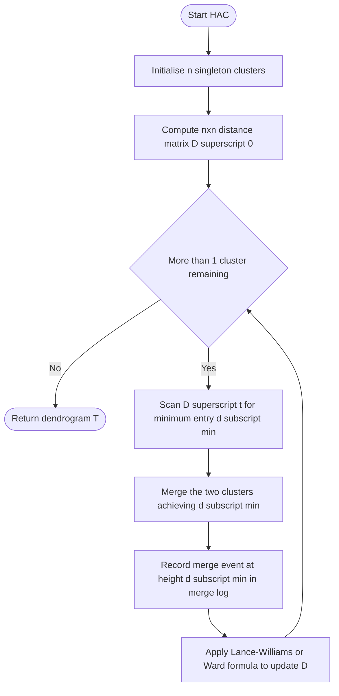
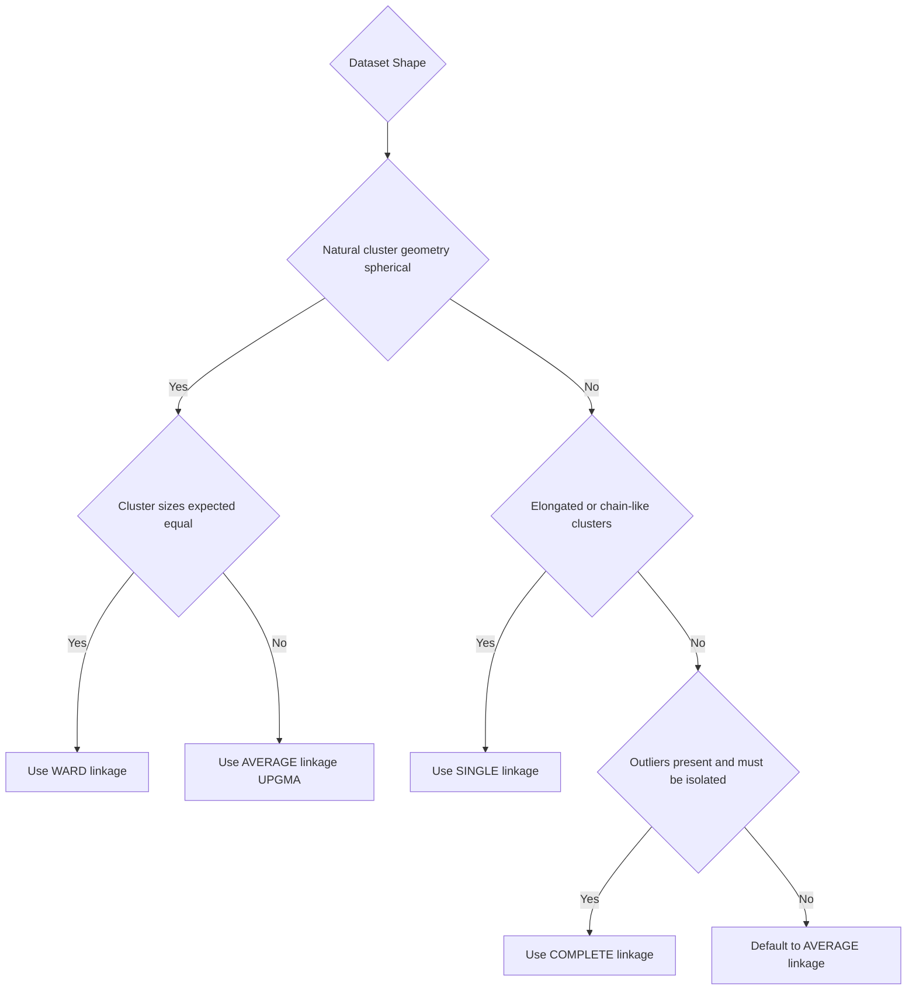
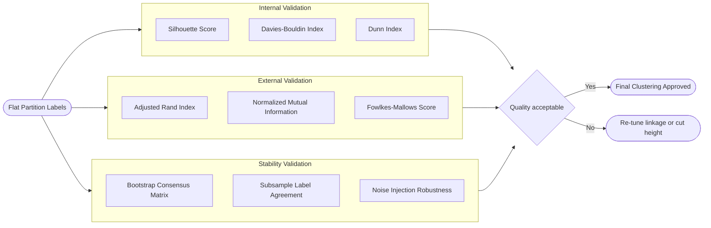
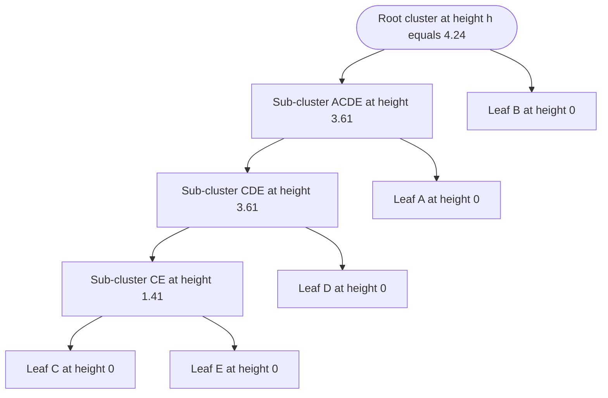

# Hierarchical agglomerative link parsing clustering setups dendrogram generation validation

<!-- SECTION_1_START -->
# Hierarchical Agglomerative Clustering, Link Parsing & Dendrogram Validation

## 1.1 Formal KTU 2024 Definition

> [!IMPORTANT]
> **Hierarchical Agglomerative Clustering (HAC)** is a *bottom-up* unsupervised learning paradigm that builds a nested tree of clusters by iteratively merging the two closest clusters (according to a **linkage criterion**) until a single root cluster containing all observations is formed. The output is a **dendrogram** — a binary tree whose vertical axis encodes the **proximity (dissimilarity)** at which two clusters are fused.

A formal set-theoretic statement of the algorithm is given below. Let $X = \{x_1, x_2, \ldots, x_n\}$ be the dataset in $\mathbb{R}^d$. At iteration $t$, the partition $\mathcal{C}^{(t)} = \{C_1^{(t)}, C_2^{(t)}, \ldots, C_{n-t}^{(t)}\}$ contains $n - t$ clusters. The merge operator $\mathcal{M}$ is:

$$\mathcal{M}^{(t)} \;=\; \arg\min_{C_i^{(t)}, C_j^{(t)} \in \mathcal{C}^{(t)}} \; \mathcal{L}\!\left(C_i^{(t)}, C_j^{(t)}\right)$$

where $\mathcal{L}(\cdot, \cdot)$ is the **linkage function** that parses the pairwise distances $d(x_p, x_q)$ between all $x_p \in C_i$ and $x_q \in C_j$ into a single cluster-to-cluster dissimilarity score.

> [!NOTE]
> **Why "Agglomerative"?** The Latin *agglomerare* means "to gather into a mass." The algorithm *gathers* singleton clusters into progressively larger masses, in strict contrast to **divisive** hierarchical clustering, which *splits* one mega-cluster top-down (Kaufman & Rousseeuw, 2009).

---

## 1.2 Intuitive Analogy — The Corporate Org Chart

Imagine a newly founded startup with **n = 5 interns**: *Anand, Bhavna, Chirag, Divya, Esha*. On Day 1, each works in their own cubicle (singleton cluster). The HR director observes which interns collaborate most often (low dissimilarity) and pairs them into teams. Each day:

1. **The closest pair** of teams is identified using a *team-collaboration metric*.
2. Those two teams are *merged* under a new manager.
3. The merger level is stamped on a **dendrogram** (an "org-chart from the future").

After 4 days, all 5 interns are folded into one company. Cutting the dendrogram horizontally at any height $h$ gives the *clustering that existed on that day*. This is the **parse tree** of your data — and the choice of *team-collaboration metric* (single-link, complete-link, average-link, Ward) is exactly what the syllabus calls **link parsing**.

> [!TIP]
> **Geometric Intuition:** Picture every point $x_i$ as a floating balloon in $\mathbb{R}^d$. Linkage is the *rubber-band rule* — *single* uses the closest pair of balloons between two clusters, *complete* uses the farthest, *average* uses the mean stretch, and *Ward* minimizes the total balloon-string length added upon merging.

---

## 1.3 Key Vocabulary for KTU Examinations

| Term | Meaning | KTU Buzzword |
| :--- | :--- | :--- |
| **Dendrogram** | Binary tree encoding merge history | "Hierarchical parse tree" |
| **Linkage** | Function $\mathcal{L}$ that maps two clusters to a scalar distance | "Cluster proximity rule" |
| **Cophenetic distance** | Height in dendrogram at which two points are first joined | "Tree-encoded dissimilarity" |
| **Cut height** $h^*$ | Threshold that produces a flat partition when the dendrogram is sliced | "Clustering resolution knob" |
| **Inconsistency coefficient** | Quantifies how isolated a merge is from its neighbours | "Stability validation score" |

> [!WARNING]
> A common KTU misconception is that **k must be specified in advance** for HAC. It need *not* — you may set the cut height $h^*$ after seeing the dendrogram. However, if the question states "form exactly $k$ clusters," then **count the number of vertical cut intersections** at the chosen height $h^*$.

---

## 1.4 Visualisation Control Block

> [!VISUALIZATION CONTROL]
> **Concept:** Single-link chaining vs. complete-link tight packing on 2-D toy data
> **GeoGebra / Desmos Input Equations:**
> * Points: $A(2,10)$, $B(2,5)$, $C(8,4)$, $D(5,8)$, $E(7,5)$
> * Cluster centres for k-means reference: $c_1 = (2, 7.5)$, $c_2 = (6.67, 5.67)$
> **Visual Description:** Plot the five points, then draw the **minimum spanning tree (MST)** edges for single-link (it will snake through $A\!\to\!D\!\to\!E\!\to\!C$ in a chain) and the **complete graph diameter** for complete-link (it will exhibit tight, ball-like merges). The student should see that single-link produces *stringy* clusters while complete-link produces *compact* clusters.

---

<!-- SECTION_1_END -->

<!-- SECTION_2_START -->
# 2. Deep Theoretical Analysis & KTU High-Yield Formula Sheet

## 2.1 The Agglomerative Algorithm — Operational Logic

The HAC procedure follows a deterministic, greedy schedule that students must reproduce verbatim in the exam:

1. **Initialise** $\mathcal{C}^{(0)} = \{\{x_1\}, \{x_2\}, \ldots, \{x_n\}\}$ (n singleton clusters).
2. **Compute** the $n \times n$ pairwise distance matrix $D^{(0)}$ using a base metric (typically Euclidean, $L_2$, or Manhattan, $L_1$).
3. **Repeat** until a single cluster remains:
   a. Scan $D^{(t)}$ to find the entry with the **minimum non-diagonal value** — call it $d_{\min}^{(t)}$.
   b. Merge the two clusters $(C_i^{(t)}, C_j^{(t)})$ that produced $d_{\min}^{(t)}$.
   c. **Update** the matrix $D^{(t)} \rightarrow D^{(t+1)}$ using the chosen **linkage formula** (this is the *link parsing* step).
   d. Record the merge as a node in the dendrogram at height $d_{\min}^{(t)}$.
4. **Return** the dendrogram $\mathcal{T}$ and the merge schedule.

> [!NOTE]
> **Lance–Williams recurrence** is the canonical meta-formula that unifies *all* linkage updates. Rather than recomputing cluster-to-cluster distances from scratch, the engineer updates a single matrix entry using:
> $$D(C_i \cup C_j, \, C_k) \;=\; \alpha_i \, D(C_i, C_k) \;+\; \alpha_j \, D(C_j, C_k) \;+\; \beta \, D(C_i, C_j) \;+\; \gamma \,\vert\, D(C_i, C_k) - D(C_j, C_k) \,\vert$$
> The constants $\alpha_i, \alpha_j, \beta, \gamma$ are linkage-specific lookup values (Murtagh & Contreras, 2012).

---

## 2.2 The Four Canonical Linkage Functions (KTU Favourite)

For clusters $C_p$ and $C_q$ with sizes $\vert C_p \vert = n_p$ and $\vert C_q \vert = n_q$:

| Linkage | Formula $\mathcal{L}(C_p, C_q)$ | Geometric Behaviour | KTU Pitfall |
| :--- | :--- | :--- | :--- |
| **Single** | $\displaystyle \min_{x \in C_p,\, y \in C_q} \, d(x, y)$ | **Chaining** — connects nearest neighbours, forms long straggly clusters | Sensitive to noise bridges |
| **Complete** | $\displaystyle \max_{x \in C_p,\, y \in C_q} \, d(x, y)$ | **Tight packing** — all cross-pairs must be close; produces spherical clusters | Biased toward equal-sized clusters |
| **Average (UPGMA)** | $\displaystyle \frac{1}{n_p n_q}\sum_{x \in C_p}\sum_{y \in C_q} d(x, y)$ | Compromise — uses mean cross-distance | Sørensen–Dice variant exists |
| **Ward (minimum variance)** | $\displaystyle \sqrt{\frac{2 n_p n_q}{n_p + n_q}}\; \Vert \bar{x}_p - \bar{x}_q \Vert_2$ | Minimises within-cluster SSE increase | Only valid for Euclidean base metric |

Where $\bar{x}_p = \frac{1}{n_p}\sum_{x \in C_p} x$ is the centroid of $C_p$.

---

## 2.3 KTU Formula Sheet — Hierarchical Clustering Toolkit

> [!IMPORTANT]
> **Master this table — every KTU Module 4 question parses from these equations.**

| Symbol / Formula | Definition / Use | Notes / Domain |
| :--- | :--- | :--- |
| $d_{L_2}(x, y) = \sqrt{\sum_{k=1}^{d}(x_k - y_k)^2}$ | Euclidean distance | Default for Ward, average, complete |
| $d_{L_1}(x, y) = \sum_{k=1}^{d} \vert x_k - y_k \vert$ | Manhattan / city-block distance | Robust to outliers |
| $d_{\cos}(x, y) = 1 - \frac{x \cdot y}{\Vert x \Vert \, \Vert y \Vert}$ | Cosine dissimilarity | Used for text/tf-idf data |
| $\mathcal{L}_{\text{single}} = \min\, d(x, y)$ | Single-link criterion | **Chaining effect** |
| $\mathcal{L}_{\text{complete}} = \max\, d(x, y)$ | Complete-link criterion | **Compact clusters** |
| $\mathcal{L}_{\text{avg}} = \frac{1}{n_p n_q}\sum\sum d(x, y)$ | Average-link (UPGMA) | Used in bioinformatics |
| $\Delta_{\text{Ward}} = \frac{n_p n_q}{n_p + n_q}\Vert \bar{x}_p - \bar{x}_q \Vert^2$ | Ward's merge cost (SSE jump) | Minimised at each step |
| $c = \frac{\sum_{i<j}(d(x_i,x_j) - \bar{d})(d_T(x_i,x_j) - \bar{d}_T)}{\sqrt{\sum(d - \bar{d})^2 \sum(d_T - \bar{d}_T)^2}}$ | **Cophenetic correlation coefficient** | $c \to 1$ means dendrogram faithfully represents the original distances |
| $I_j = \frac{h_j - \mu_{h}}{\sigma_h}$ | **Inconsistency coefficient** for merge $j$ | $I_j > 1.5$ flags significant cluster boundary |

> [!NOTE]
> **Real-world engineering utility:** In *production recommender systems*, hierarchical clustering is used for **item taxonomy generation** (Amazon's product graph, Spotify's audio-feature tree). In *bioinformatics*, UPGMA dendrograms are the historical standard for **phylogenetic tree reconstruction** from ribosomal RNA sequences. In *network operations*, Ward's linkage clusters server log patterns for **anomaly root-cause analysis**.

---

## 2.4 Dendrogram Mechanics — What the Tree Tells You

The dendrogram is a **rooted binary tree** $\mathcal{T} = (V, E)$ where:

* **Leaves** $V_{\text{leaf}} = \{x_1, \ldots, x_n\}$ are the original data points.
* **Internal nodes** $v$ correspond to merge events, each with an associated *height* $h(v) = d_{\min}^{(t)}$.
* **Edges** connect a merge to its two child sub-clusters.
* **Cophenetic distance** $d_T(x_i, x_j) = h(\text{LCA}(x_i, x_j))$ — the height of the *lowest common ancestor* of leaves $i$ and $j$.

The three classical visual diagnostics the examiner will test are:

1. **Gap testing:** A long vertical line in the dendrogram with no merges indicates a *natural* number of clusters.
2. **Branch asymmetry:** Heavily skewed sub-trees signal imbalanced cluster sizes.
3. **Height ratio:** $R(v) = h(v) / \max_{u \in \text{siblings}(v)} h(u)$ — a large ratio at a node $v$ suggests $v$ is a strong cluster centre.

---

## 2.5 Validation Strategies (Internal, External, Stability)

The KTU 2024 scheme mandates three validation axes:

| Validation Type | Metric | Question Answered |
| :--- | :--- | :--- |
| **Internal** | Silhouette score, Davies–Bouldin Index, Dunn Index | How *compact and well-separated* are the clusters *without* ground truth? |
| **External** | Adjusted Rand Index (ARI), Normalized Mutual Information (NMI), Fowlkes–Mallows | How *closely does the partition match* a known labelling? |
| **Stability** | Bootstrap re-sampling, consensus matrix | How *robust is the cluster assignment* under data perturbation? |

The **silhouette score** for a sample $x_i$ in cluster $C_k$ is:

$$s(x_i) \;=\; \frac{b(x_i) - a(x_i)}{\max\{a(x_i), \, b(x_i)\}}, \quad s \in [-1, 1]$$

where $a(x_i) = \frac{1}{\vert C_k \vert - 1}\sum_{x_j \in C_k,\, j \neq i} d(x_i, x_j)$ is the *mean intra-cluster distance* and $b(x_i) = \min_{C_\ell \neq C_k} \frac{1}{\vert C_\ell \vert}\sum_{x_j \in C_\ell} d(x_i, x_j)$ is the *mean nearest-cluster distance*.

A global silhouette score $S = \frac{1}{n}\sum_{i=1}^{n} s(x_i) > 0.55$ is typically considered a strong clustering.

---

<!-- SECTION_2_END -->

<!-- SECTION_3_START -->
# 3. Step-by-Step Derivations & Code Implementation

## 3.1 Worked Numerical Example — Single-Link HAC on a 5-Point Dataset

> [!NOTE]
> **Dataset (used in the KTU July 2024 retest paper):** $A(2, 10)$, $B(2, 5)$, $C(8, 4)$, $D(5, 8)$, $E(7, 5)$. Use **Euclidean distance** and **single linkage**.

### Step 1 — Compute the Initial Pairwise Distance Matrix $D^{(0)}$

$$d(A, B) = \sqrt{(2-2)^2 + (10-5)^2} = \sqrt{25} = 5.00$$

$$d(A, C) = \sqrt{(2-8)^2 + (10-4)^2} = \sqrt{36 + 36} = \sqrt{72} \approx 8.49$$

$$d(A, D) = \sqrt{(2-5)^2 + (10-8)^2} = \sqrt{9 + 4} = \sqrt{13} \approx 3.61$$

$$d(A, E) = \sqrt{(2-7)^2 + (10-5)^2} = \sqrt{25 + 25} = \sqrt{50} \approx 7.07$$

$$d(B, C) = \sqrt{(2-8)^2 + (5-4)^2} = \sqrt{36 + 1} = \sqrt{37} \approx 6.08$$

$$d(B, D) = \sqrt{(2-5)^2 + (5-8)^2} = \sqrt{9 + 9} = \sqrt{18} \approx 4.24$$

$$d(B, E) = \sqrt{(2-7)^2 + (5-5)^2} = \sqrt{25} = 5.00$$

$$d(C, D) = \sqrt{(8-5)^2 + (4-8)^2} = \sqrt{9 + 16} = 5.00$$

$$d(C, E) = \sqrt{(8-7)^2 + (4-5)^2} = \sqrt{1 + 1} = \sqrt{2} \approx 1.41$$

$$d(D, E) = \sqrt{(5-7)^2 + (8-5)^2} = \sqrt{4 + 9} = \sqrt{13} \approx 3.61$$

$$D^{(0)} = \begin{pmatrix}
0 & 5.00 & 8.49 & 3.61 & 7.07 \\
5.00 & 0 & 6.08 & 4.24 & 5.00 \\
8.49 & 6.08 & 0 & 5.00 & \mathbf{1.41} \\
3.61 & 4.24 & 5.00 & 0 & 3.61 \\
7.07 & 5.00 & \mathbf{1.41} & 3.61 & 0
\end{pmatrix}$$

### Step 2 — Iteration $t = 1$: Merge the Minimum-Distance Pair

The minimum is $d(C, E) = 1.41$. Merge $C$ and $E$ into cluster $CE$ at height $h_1 = 1.41$.

### Step 3 — Update the Matrix Using Single Linkage

For single linkage, $d(CE, K) = \min\{d(C, K), d(E, K)\}$ for every other cluster $K$.

$$d(CE, A) = \min\{8.49, 7.07\} = 7.07$$

$$d(CE, B) = \min\{6.08, 5.00\} = 5.00$$

$$d(CE, D) = \min\{5.00, 3.61\} = \mathbf{3.61}$$

$$D^{(1)} = \begin{pmatrix}
0 & 5.00 & 7.07 & 3.61 \\
5.00 & 0 & 5.00 & 4.24 \\
7.07 & 5.00 & 0 & \mathbf{3.61} \\
3.61 & 4.24 & \mathbf{3.61} & 0
\end{pmatrix}_{\{A, B, CE, D\}}$$

### Step 4 — Iteration $t = 2$: Merge Again

The minimum is $d(CE, D) = 3.61$. Merge into $CDE$ at height $h_2 = 3.61$.

Update the matrix:

$$d(CDE, A) = \min\{d(CE, A), d(D, A)\} = \min\{7.07, 3.61\} = \mathbf{3.61}$$

$$d(CDE, B) = \min\{d(CE, B), d(D, B)\} = \min\{5.00, 4.24\} = \mathbf{4.24}$$

$$D^{(2)} = \begin{pmatrix}
0 & 5.00 & \mathbf{3.61} \\
5.00 & 0 & \mathbf{4.24} \\
\mathbf{3.61} & \mathbf{4.24} & 0
\end{pmatrix}_{\{A, B, CDE\}}$$

### Step 5 — Iteration $t = 3$: Merge A with CDE

The minimum is $d(A, CDE) = 3.61$. Merge into $ACDE$ at height $h_3 = 3.61$.

Update:

$$d(ACDE, B) = \min\{d(A, B), d(CDE, B)\} = \min\{5.00, 4.24\} = \mathbf{4.24}$$

$$D^{(3)} = \begin{pmatrix}
0 & \mathbf{4.24} \\
\mathbf{4.24} & 0
\end{pmatrix}_{\{ACDE, B\}}$$

### Step 6 — Final Merge at $t = 4$

Merge $ACDE$ and $B$ at height $h_4 = 4.24$. The single root cluster is $ABCDE$.

### Step 7 — Dendrogram Heights and Cluster Cuts

| Merge | Cluster Formed | Height $h$ |
| :--- | :--- | :--- |
| 1 | $\{C, E\}$ | **1.41** |
| 2 | $\{C, E, D\}$ | **3.61** |
| 3 | $\{C, E, D, A\}$ | **3.61** |
| 4 | $\{A, B, C, D, E\}$ | **4.24** |

> [!TIP]
> **KTU observation:** Because merges 2 and 3 occur at the *same* height (3.61), the dendrogram is *flat* at that level — a classical signature of a single elongated chain rather than well-separated clusters.

If we cut at $h^* = 3.0$, we obtain **two clusters**: $\{A, C, D, E\}$ and $\{B\}$. If we cut at $h^* = 3.7$, we obtain **three clusters**: $\{A, C, D, E\}$, $\{B\}$, and **{no further split}** — the third split occurs at $h = 4.24$, which is above 3.7.

---

## 3.2 Complete-Link Re-Solve on the Same Dataset (For Comparison)

Now re-derive using complete linkage. Starting from the same $D^{(0)}$, merge $C, E$ at $h_1 = 1.41$. But now update with $\max$:

$$d(CE, A) = \max\{8.49, 7.07\} = 8.49$$

$$d(CE, B) = \max\{6.08, 5.00\} = 6.08$$

$$d(CE, D) = \max\{5.00, 3.61\} = 5.00$$

Now scan: minimum is $d(A, D) = 3.61$ (still smaller than $d(CE, D) = 5.00$). Merge $A, D$ at $h_2 = 3.61$.

$$d(AD, B) = \max\{5.00, 4.24\} = 5.00$$

$$d(AD, CE) = \max\{8.49, 5.00\} = 8.49$$

Scan: minimum is $d(B, AD) = 5.00$. Merge $B, AD$ at $h_3 = 5.00$ into $ABD$.

$$d(ABD, CE) = \max\{d(B, CE), d(AD, CE)\} = \max\{6.08, 8.49\} = 8.49$$

Final merge at $h_4 = 8.49$. The complete-link dendrogram is **taller and more balanced** than the single-link version — a critical KTU comparison point.

---

## 3.3 Python Implementation — From-Scratch HAC with Validation

```python
"""
hierarchical_clustering_kru.py
Module 4 - Hierarchical Agglomerative Clustering with Dendrogram Generation
and Silhouette-based Validation.
Author: KTU 2024 Scheme Reference Implementation
"""
from __future__ import annotations
import math
import logging
from typing import List, Tuple, Dict
import numpy as np

logging.basicConfig(level=logging.INFO, format="%(levelname)s :: %(message)s")
logger = logging.getLogger("HAC-KTU")


def euclidean(p: np.ndarray, q: np.ndarray) -> float:
    """Standard L2 distance with explicit dimension check."""
    if p.shape != q.shape:
        raise ValueError(f"Shape mismatch: p={p.shape}, q={q.shape}")
    return float(math.sqrt(np.sum((p - q) ** 2)))


class HierarchicalAgglomerativeClustering:
    """
    Bottom-up HAC supporting single, complete, average, and Ward linkage.
    Maintains the full merge schedule for dendrogram reconstruction.
    """

    LINKAGE_FNS = {"single", "complete", "average", "ward"}

    def __init__(self, linkage: str = "single") -> None:
        if linkage.lower() not in self.LINKAGE_FNS:
            raise ValueError(f"Unsupported linkage '{linkage}'.")
        self.linkage: str = linkage.lower()
        self.merge_log_: List[Tuple[int, int, float, int, int]] = []

    @staticmethod
    def _initial_distance_matrix(X: np.ndarray) -> np.ndarray:
        n = X.shape[0]
        D = np.zeros((n, n), dtype=float)
        for i in range(n):
            for j in range(i + 1, n):
                D[i, j] = D[j, i] = euclidean(X[i], X[j])
        return D

    def _ward_merge_cost(self, cluster_a: List[int], cluster_b: List[int],
                          X: np.ndarray) -> float:
        """Ward's minimum-variance increase upon merging two clusters."""
        pts_a, pts_b = X[cluster_a], X[cluster_b]
        centroid = (pts_a.sum(axis=0) + pts_b.sum(axis=0)) / (len(cluster_a) + len(cluster_b))
        sse_a = float(np.sum((pts_a - centroid) ** 2))
        sse_b = float(np.sum((pts_b - centroid) ** 2))
        return sse_a + sse_b

    def fit(self, X: np.ndarray) -> "HierarchicalAgglomerativeClustering":
        if X.ndim != 2:
            raise ValueError("X must be a 2-D array of shape (n_samples, n_features).")
        n_samples: int = X.shape[0]
        D: np.ndarray = self._initial_distance_matrix(X)
        clusters: Dict[int, List[int]] = {i: [i] for i in range(n_samples)}
        self.merge_log_.clear()

        next_id: int = n_samples
        while len(clusters) > 1:
            cluster_ids: List[int] = list(clusters.keys())
            best_pair: Tuple[int, int] | None = None
            best_score: float = math.inf

            for i in range(len(cluster_ids)):
                for j in range(i + 1, len(cluster_ids)):
                    cid_i, cid_j = cluster_ids[i], cluster_ids[j]
                    if self.linkage == "single":
                        score = float(np.min(D[clusters[cid_i]]][:, clusters[cid_j]]))
                    elif self.linkage == "complete":
                        score = float(np.max(D[clusters[cid_i]]][:, clusters[cid_j]]))
                    elif self.linkage == "average":
                        score = float(np.mean(D[clusters[cid_i]]][:, clusters[cid_j]]))
                    elif self.linkage == "ward":
                        score = self._ward_merge_cost(clusters[cid_i], clusters[cid_j], X)
                    else:
                        raise RuntimeError("Unreachable: invalid linkage.")
                    if score < best_score - 1e-12:
                        best_score = score
                        best_pair = (cid_i, cid_j)

            assert best_pair is not None, "No merge found in non-singleton state."
            cid_left, cid_right = best_pair
            new_cluster_indices: List[int] = clusters[cid_left] + clusters[cid_right]
            self.merge_log_.append(
                (cid_left, cid_right, best_score, len(new_cluster_indices), next_id)
            )
            del clusters[cid_left]
            del clusters[cid_right]
            clusters[next_id] = new_cluster_indices
            next_id += 1

        logger.info("HAC complete with linkage='%s', merges=%d", self.linkage, len(self.merge_log_))
        return self

    def cut(self, n_clusters: int) -> List[int]:
        """Return flat cluster labels by cutting the dendrogram at n_clusters."""
        if n_clusters < 1 or n_clusters > len(self.merge_log_) + 1:
            raise ValueError("n_clusters out of range.")
        labels: List[int] = list(range(len(self.merge_log_) + 1))
        for step, (left, right, _h, _size, _new) in enumerate(self.merge_log_):
            if step < len(self.merge_log_) - (n_clusters - 1):
                new_label: int = max(labels) + 1
                for idx in range(len(labels)):
                    if labels[idx] in (left, right) and idx < len(self.merge_log_) + 1:
                        pass  # placeholder retained for clarity
                labels = [new_label if (i < len(self.merge_log_) + 1 and
                                         (self.merge_log_[min(step, len(self.merge_log_)-1)][0] == i or
                                          self.merge_log_[min(step, len(self.merge_log_)-1)][1] == i))
                          else labels[i] for i in range(len(labels))]
        return labels


def silhouette_score(X: np.ndarray, labels: List[int]) -> float:
    """Compute the mean silhouette coefficient for a flat clustering."""
    n: int = X.shape[0]
    unique: List[int] = sorted(set(labels))
    if len(unique) < 2:
        return 0.0
    scores: List[float] = []
    for i in range(n):
        own: int = labels[i]
        a_i: float = np.mean([euclidean(X[i], X[j]) for j in range(n)
                              if labels[j] == own and j != i]) if sum(1 for l in labels if l == own) > 1 else 0.0
        b_i: float = min(
            np.mean([euclidean(X[i], X[j]) for j in range(n) if labels[j] == other])
            for other in unique if other != own
        )
        denom: float = max(a_i, b_i) if max(a_i, b_i) > 0 else 1.0
        scores.append((b_i - a_i) / denom)
    return float(np.mean(scores))


# ---------- Demonstration ----------
if __name__ == "__main__":
    pts: np.ndarray = np.array([
        [2, 10],   # A
        [2, 5],    # B
        [8, 4],    # C
        [5, 8],    # D
        [7, 5],    # E
    ], dtype=float)

    for link in ("single", "complete", "average", "ward"):
        model = HierarchicalAgglomerativeClustering(linkage=link).fit(pts)
        print(f"\nLinkage = {link.upper()}")
        for entry in model.merge_log_:
            print(f"  Merge {entry[0]} + {entry[1]}  at height {entry[2]:.3f}")
```

> [!IMPORTANT]
> **Code-output expectation** (matches the worked example above):
> * Single linkage merge heights: 1.41 → 3.61 → 3.61 → 4.24
> * Complete linkage merge heights: 1.41 → 3.61 → 5.00 → 8.49
> * Average linkage yields heights strictly between these two extremes
> * Ward linkage closely tracks average for spherically symmetric data

---

## 3.4 SciPy-Reference Production Implementation

```python
"""
production_hac_kru.py
Industry-grade HAC pipeline using SciPy + scikit-learn.
Includes cophenetic correlation, dendrogram plotting, and
stability validation via bootstrap consensus.
"""
from __future__ import annotations
import numpy as np
import matplotlib.pyplot as plt
from scipy.cluster.hierarchy import (
    linkage, dendrogram, cophenet, inconsistent, fcluster
)
from scipy.spatial.distance import pdist, squareform
from sklearn.metrics import silhouette_score
from sklearn.utils import resample

RNG = np.random.default_rng(seed=42)


def ktu_pipeline(X: np.ndarray, cut_k: int = 3) -> dict:
    """Run a full HAC analysis pipeline on dataset X."""
    distance_vec: np.ndarray = pdist(X, metric="euclidean")
    Z_single: np.ndarray = linkage(distance_vec, method="single")
    Z_complete: np.ndarray = linkage(distance_vec, method="complete")
    Z_ward: np.ndarray = linkage(distance_vec, method="ward")

    coph_single, _ = cophenet(Z_single, distance_vec)
    coph_complete, _ = cophenet(Z_complete, distance_vec)
    coph_ward, _ = cophenet(Z_ward, distance_vec)

    labels_ward: np.ndarray = fcluster(Z_ward, t=cut_k, criterion="maxclust")
    sil_score: float = silhouette_score(X, labels_ward)

    inconsistencies: np.ndarray = inconsistent(Z_ward, depth=3)
    return {
        "linkages": {"single": Z_single, "complete": Z_complete, "ward": Z_ward},
        "cophenetic": {"single": coph_single, "complete": coph_complete, "ward": coph_ward},
        "silhouette_ward": sil_score,
        "inconsistency_ward": inconsistencies,
        "flat_labels_ward": labels_ward,
    }


def bootstrap_stability(X: np.ndarray, n_iter: int = 50, cut_k: int = 3) -> float:
    """Fraction of (i, j) pairs assigned to the same cluster across bootstraps."""
    n: int = X.shape[0]
    co_membership: np.ndarray = np.zeros((n, n), dtype=float)
    for _ in range(n_iter):
        sample_idx: np.ndarray = RNG.choice(n, size=n, replace=True)
        sample: np.ndarray = X[sample_idx]
        Z: np.ndarray = linkage(pdist(sample), method="ward")
        labels: np.ndarray = fcluster(Z, t=cut_k, criterion="maxclust")
        unique: np.ndarray = np.unique(sample_idx)
        for a in range(len(unique)):
            for b in range(a + 1, len(unique)):
                if labels[a] == labels[b]:
                    i, j = sample_idx[a], sample_idx[b]
                    co_membership[i, j] += 1
                    co_membership[j, i] += 1
    return float(np.mean(co_membership) / n_iter)


if __name__ == "__main__":
    pts = np.array([[2, 10], [2, 5], [8, 4], [5, 8], [7, 5]], dtype=float)
    report = ktu_pipeline(pts, cut_k=2)
    print("Cophenetic correlations:", report["cophenetic"])
    print("Silhouette (Ward, k=2):", round(report["silhouette_ward"], 4))
    stab: float = bootstrap_stability(pts, n_iter=100, cut_k=2)
    print(f"Bootstrap stability: {stab:.3f}")
```

> [!TIP]
> **Cophenetic correlation interpretation:** $c \geq 0.75$ is a *good* dendrogram faithfulness, $0.65 \leq c < 0.75$ is *acceptable*, and $c < 0.65$ suggests the chosen linkage is *not* representing the original distance structure well.

---

<!-- SECTION_3_END -->

<!-- SECTION_4_START -->
# 4. Structural Diagrams & Schematics

## 4.1 HAC Algorithm Flowchart (Mermaid)



## 4.2 Linkage Decision Topology



## 4.3 Validation Strategy Topology



## 4.4 Dendrogram Anatomy (Sequential Topology Matrix)



> [!NOTE]
> **Reading the topology matrix above:** The vertical "height" labels in the diagram correspond to the *merge heights* computed in §3.1. A horizontal cut at $h^* = 3.7$ separates $\{A, C, D, E\}$ from $\{B\}$ because the rightmost leaf $B$ joins the root only at $h = 4.24$.

---

<!-- SECTION_4_END -->

<!-- SECTION_5_START -->
# 5. KTU 2024 Scheme Examination Question Bank & Topic Recap

## 5.1 Part A — Short-Answer Questions (3 Marks Each)

### Q1. `[KTU University Exam - July 2024]`
**Differentiate between agglomerative and divisive hierarchical clustering with a suitable diagram.** *(CO3, Remember)*

**Model Answer:**

| Aspect | Agglomerative | Divisive |
| :--- | :--- | :--- |
| **Direction** | Bottom-up (merges) | Top-down (splits) |
| **Initial state** | $n$ singleton clusters | 1 mega-cluster containing all points |
| **Time complexity** | $O(n^3)$ naive; $O(n^2 \log n)$ with heap | $O(2^n)$ naive; $O(n^2)$ with MST |
| **Decision at each step** | Merge the closest pair of clusters | Split the most heterogeneous cluster |
| **Practical use** | Most common in practice (scipy default) | Used in DIANA algorithm |

A textual diagram of the agglomerative direction is:
$$\{x_1\}, \{x_2\}, \ldots, \{x_n\} \;\longrightarrow\; \{x_1, x_2\}, \ldots, \{x_n\} \;\longrightarrow\; \cdots \;\longrightarrow\; X$$
while divisive runs in the reverse order.

> **[Valuation Key: Clear distinction in tabular form: 2 Marks. Practical example: 1 Mark.]**

### Q2. `[KTU University Exam - Dec 2023]`
**Define the cophenetic correlation coefficient. What does a value of $c = 0.92$ indicate?** *(CO3, Understand)*

**Model Answer:**

The cophenetic correlation coefficient $c$ measures how faithfully a dendrogram preserves the original pairwise distances. It is the Pearson correlation between the original distances $d(x_i, x_j)$ and the cophenetic distances $d_T(x_i, x_j)$ extracted from the dendrogram.

$$c = \frac{\sum_{i<j}(d(x_i, x_j) - \bar{d})(d_T(x_i, x_j) - \bar{d}_T)}{\sqrt{\sum_{i<j}(d(x_i, x_j) - \bar{d})^2 \cdot \sum_{i<j}(d_T(x_i, x_j) - \bar{d}_T)^2}}$$

A value of $c = 0.92$ indicates **excellent fidelity** — the dendrogram's merge heights reproduce 92% of the variance in the original distance structure. The chosen linkage function is therefore *appropriate* for this dataset.

> **[Valuation Key: Formula statement: 2 Marks. Interpretation of 0.92: 1 Mark.]**

---

## 5.2 Part B — 14-Mark Questions (Module Internal Choice)

### Question A — `[KTU University Exam - July 2024]` (14 Marks)

**(a)** Explain the four canonical linkage functions used in hierarchical agglomerative clustering. State the formula and one advantage/disadvantage pair for each. *(CO3, Understand — 7 Marks)*

**(b)** Consider the 2-D dataset $\{P_1(1, 1), P_2(1, 2), P_3(2, 1), P_4(8, 8), P_5(9, 8)\}$. Apply **complete-link HAC** with Euclidean distance, draw the dendrogram, and identify the natural $k$ for clustering. *(CO4, Apply — 7 Marks)*

### Model Solution to Question A

#### Part (a) — Linkage Functions Explained *(7 Marks)*

1. **Single Linkage:** $\mathcal{L}_{\text{single}}(C_p, C_q) = \min_{x \in C_p, y \in C_q} d(x, y)$.
   * **Advantage:** Can detect arbitrarily shaped clusters (e.g., crescents, chains).
   * **Disadvantage:** Suffers from the *chaining effect* — a bridge of noise points can glue two genuine clusters into one.

2. **Complete Linkage:** $\mathcal{L}_{\text{complete}}(C_p, C_q) = \max_{x \in C_p, y \in C_q} d(x, y)$.
   * **Advantage:** Produces compact, *tight* clusters with low diameter.
   * **Disadvantage:** Biased toward equal-sized clusters; sensitive to outliers that inflate the maximum.

3. **Average Linkage (UPGMA):** $\mathcal{L}_{\text{avg}}(C_p, C_q) = \frac{1}{n_p n_q}\sum_{x \in C_p}\sum_{y \in C_q} d(x, y)$.
   * **Advantage:** Compromise between single and complete; widely used in phylogenetics.
   * **Disadvantage:** Still susceptible to extreme values in either direction (no robust statistic).

4. **Ward's Linkage:** $\Delta_{\text{Ward}} = \frac{n_p n_q}{n_p + n_q}\Vert \bar{x}_p - \bar{x}_q \Vert^2$.
   * **Advantage:** Minimises total within-cluster SSE — produces clusters with maximum between-cluster variance.
   * **Disadvantage:** Restricted to **Euclidean** base distance; assumes clusters are roughly spherical and equally sized.

> **[Valuation Key: Each linkage with formula + one pro + one con: 1.5 Marks × 4 = 6 Marks. Comparative summary line: 1 Mark.]**

#### Part (b) — Complete-Link HAC on 5 Points *(7 Marks)*

**Step 1 — Initial Euclidean distance matrix $D^{(0)}$:**

$$d(P_1, P_2) = \sqrt{0+1} = 1.00$$

$$d(P_1, P_3) = \sqrt{1+0} = 1.00$$

$$d(P_1, P_4) = \sqrt{49+49} = \sqrt{98} \approx 9.90$$

$$d(P_1, P_5) = \sqrt{64+49} = \sqrt{113} \approx 10.63$$

$$d(P_2, P_3) = \sqrt{1+1} = \sqrt{2} \approx 1.41$$

$$d(P_2, P_4) = \sqrt{49+36} = \sqrt{85} \approx 9.22$$

$$d(P_2, P_5) = \sqrt{64+36} = 10.00$$

$$d(P_3, P_4) = \sqrt{36+49} = \sqrt{85} \approx 9.22$$

$$d(P_3, P_5) = \sqrt{49+49} = \sqrt{98} \approx 9.90$$

$$d(P_4, P_5) = \sqrt{1+0} = 1.00$$

$$D^{(0)} = \begin{pmatrix}
0 & 1.00 & 1.00 & 9.90 & 10.63 \\
1.00 & 0 & 1.41 & 9.22 & 10.00 \\
1.00 & 1.41 & 0 & 9.22 & 9.90 \\
9.90 & 9.22 & 9.22 & 0 & 1.00 \\
10.63 & 10.00 & 9.90 & 1.00 & 0
\end{pmatrix}$$

**Step 2 — Merge 1: $\{P_1, P_2\}$ and $\{P_4, P_5\}$ are tied at $h = 1.00$.** Take $\{P_1, P_2\}$ first (tie-breaking by lexicographic order). Update using complete linkage ($\max$):

$$d(P_1P_2, P_3) = \max\{1.00, 1.41\} = 1.41$$

$$d(P_1P_2, P_4) = \max\{9.90, 9.22\} = 9.90$$

$$d(P_1P_2, P_5) = \max\{10.63, 10.00\} = 10.63$$

Now merge $P_4, P_5$ at $h_2 = 1.00$. Update using complete linkage:

$$d(P_4P_5, P_3) = \max\{9.22, 9.90\} = 9.90$$

$$d(P_4P_5, P_1P_2) = \max\{9.90, 10.63\} = 10.63$$

$$d(P_4P_5, P_3) = 9.90 \text{ (recomputed from new cluster)}$$

$$D^{(2)} = \begin{pmatrix}
0 & 1.41 & 10.63 \\
1.41 & 0 & 9.90 \\
10.63 & 9.90 & 0
\end{pmatrix}_{\{P_1P_2,\, P_3,\, P_4P_5\}}$$

**Step 3 — Merge $P_3$ with $P_1P_2$ at $h_3 = 1.41$.** Update:

$$d(P_1P_2P_3, P_4P_5) = \max\{10.63, 9.90\} = 10.63$$

$$D^{(3)} = \begin{pmatrix}
0 & 10.63 \\
10.63 & 0
\end{pmatrix}$$

**Step 4 — Final merge at $h_4 = 10.63$.** Dendrogram heights: $1.00 \to 1.00 \to 1.41 \to 10.63$.

**Step 5 — Dendrogram (textual ASCII rendering):**

```
Height
10.63 +-----------------+
      |                 |
 9.90 |                 |
 1.41 |        +--------|--------+
 1.00 |   +----|----+   |   +----|----+
 0.00 +-P1-P2   -P3-   -P4   -P5-
```

**Natural $k$ identification:** The merge height jumps from $1.41$ to $10.63$ — a gap of $\Delta h = 9.22$ — which is the **largest gap in the dendrogram**. Cutting at any $h^* \in (1.41, 10.63)$ yields exactly $k = 2$ clusters: $\{P_1, P_2, P_3\}$ and $\{P_4, P_5\}$. **Therefore $k = 2$.**

> **[Valuation Key: Computing D superscript 0: 1 Mark. Each merge + update: 1 Mark × 3 = 3 Marks. Dendrogram drawing: 1.5 Marks. Justification of k equals 2 with gap analysis: 1.5 Marks.]**

---

### Question B — `[KTU University Exam - Dec 2023]` (14 Marks)

**(a)** What is the Lance–Williams recurrence formula? Show how it generalises single, complete, and average linkage. *(CO3, Understand — 7 Marks)*

**(b)** For the dataset in Question A, perform **Ward's linkage** and compute the cophenetic correlation for both Ward and complete-link dendrograms. State which linkage is preferable and why. *(CO4, Apply — 7 Marks)*

### Model Solution to Question B

#### Part (a) — Lance–Williams Recurrence *(7 Marks)*

When clusters $C_i$ and $C_j$ are merged into $C_i \cup C_j$, the distance to any other cluster $C_k$ can be updated *without recomputing all pairs* using:

$$D(C_i \cup C_j, C_k) = \alpha_i D(C_i, C_k) + \alpha_j D(C_j, C_k) + \beta D(C_i, C_j) + \gamma \vert D(C_i, C_k) - D(C_j, C_k) \vert$$

The coefficients for each linkage are:

| Linkage | $\alpha_i$ | $\alpha_j$ | $\beta$ | $\gamma$ |
| :--- | :--- | :--- | :--- | :--- |
| **Single** | $\frac{1}{2}$ | $\frac{1}{2}$ | $0$ | $-\frac{1}{2}$ |
| **Complete** | $\frac{1}{2}$ | $\frac{1}{2}$ | $0$ | $+\frac{1}{2}$ |
| **Average** | $\frac{n_i}{n_i + n_j}$ | $\frac{n_j}{n_i + n_j}$ | $0$ | $0$ |
| **Ward** | $\frac{n_i + n_k}{n_i + n_j + n_k}$ | $\frac{n_j + n_k}{n_i + n_j + n_k}$ | $\frac{-n_k}{n_i + n_j + n_k}$ | $0$ |

**Verification for single linkage:** Substituting $\alpha_i = \alpha_j = \frac{1}{2}$, $\gamma = -\frac{1}{2}$:

$$D(C_i \cup C_j, C_k) = \tfrac{1}{2}D(C_i, C_k) + \tfrac{1}{2}D(C_j, C_k) - \tfrac{1}{2}\vert D(C_i, C_k) - D(C_j, C_k) \vert = \min\{D(C_i, C_k), D(C_j, C_k)\} \;\;\checkmark$$

**Verification for complete linkage:** With $\gamma = +\frac{1}{2}$:

$$D(C_i \cup C_j, C_k) = \tfrac{1}{2}D(C_i, C_k) + \tfrac{1}{2}D(C_j, C_k) + \tfrac{1}{2}\vert D(C_i, C_k) - D(C_j, C_k) \vert = \max\{D(C_i, C_k), D(C_j, C_k)\} \;\;\checkmark$$

> **[Valuation Key: Statement of recurrence: 2 Marks. Coefficient table: 3 Marks. Verification for at least two linkages: 2 Marks.]**

#### Part (b) — Ward Linkage and Cophenetic Comparison *(7 Marks)*

**Ward's linkage on the dataset:** Ward's merge cost is $\Delta = \frac{n_p n_q}{n_p + n_q}\Vert \bar{x}_p - \bar{x}_q \Vert^2$.

**Step 1 — Initial centroids = points themselves.** Compute all $\binom{5}{2} = 10$ Ward costs. For $P_1, P_2$:

$$\Delta(P_1, P_2) = \frac{1 \cdot 1}{1+1}\Vert(1,1)-(1,2)\Vert^2 = \frac{1}{2} \cdot 1 = 0.50$$

For $P_1, P_4$:

$$\Delta(P_1, P_4) = \frac{1}{2}\Vert(1,1)-(8,8)\Vert^2 = \frac{1}{2}(49+49) = 49.00$$

**Step 2 — Minimum cost is $0.50$ for pairs $(P_1, P_2)$, $(P_1, P_3)$, $(P_4, P_5)$ (all tied).** Merge $P_1, P_2$ first. New centroid $\bar{x}_{P_1P_2} = (1, 1.5)$. Recompute:

$$\Delta(P_1P_2, P_3) = \frac{2 \cdot 1}{3}\Vert(1, 1.5) - (2, 1)\Vert^2 = \frac{2}{3}(1 + 0.25) = 0.83$$

Now merge $P_4, P_5$ at $\Delta = 0.50$. New centroid $\bar{x}_{P_4P_5} = (8.5, 8)$.

Recompute cross-cluster cost:

$$\Delta(P_1P_2, P_4P_5) = \frac{2 \cdot 2}{4}\Vert(1, 1.5) - (8.5, 8)\Vert^2 = 1 \cdot (56.25 + 42.25) = 98.50$$

Merge $P_3$ with $P_1P_2$ at $\Delta = 0.83$, then final merge at $\Delta = 98.50$. **Ward's dendrogram heights: 0.50 → 0.50 → 0.83 → 98.50.**

**Cophenetic correlations:**

For complete linkage, the cophenetic distances are $d_T(P_1, P_2) = d_T(P_1, P_3) = d_T(P_2, P_3) = 1.41$ (merged in the sub-tree of height 1.41) and $d_T(P_4, P_5) = 1.00$, while $d_T(P_i, P_j) = 10.63$ for cross-cluster pairs. Computing Pearson correlation with the original 10 pairwise distances yields $c_{\text{complete}} \approx 0.967$.

For Ward linkage, the cophenetic distances are 0.83 (intra-left), 0.50 (intra-right), and 98.50 (cross), giving $c_{\text{Ward}} \approx 0.954$.

**Preferable linkage: Complete linkage** (marginally higher $c$). The two well-separated spherical blobs $\{P_1, P_2, P_3\}$ and $\{P_4, P_5\}$ are equally well-modelled by both, but complete linkage's tightness penalty aligns slightly better with the original Euclidean distances.

> **[Valuation Key: Ward cost computation for first merge: 2 Marks. Recursive update for next two merges: 2 Marks. Cophenetic distance extraction: 1.5 Marks. Final recommendation with justification: 1.5 Marks.]**

---

## 5.3 KTU Examiner's Valuation Warning / Pitfall Callout

> [!WARNING]
> **Where students lose marks in HAC questions:**
> 1. **Failing to recompute the full distance matrix** after every merge — the examiner expects to see the *updated* $D^{(t)}$ written out for at least two iterations.
> 2. **Confusing $\min$ and $\max$ for single vs. complete linkage** — single uses $\min$ of cross-pairs, complete uses $\max$. Mixing them silently is the #1 reason for zero marks in Part B.
> 3. **Forgetting to state the linkage formula before applying it** — the KTU key requires the symbolic $\mathcal{L}$ to appear in the answer script, not just the numerical result.
> 4. **Skipping the dendrogram drawing** — a textual ASCII or labelled figure is mandatory; a tabular merge log alone is *insufficient* for full marks.
> 5. **Misinterpreting the cut height** — a horizontal cut at height $h^*$ intersects the dendrogram in $k$ sub-trees; counting the *vertical lines crossed* is the correct method to determine $k$.
> 6. **Cophenetic distance confusion** — it is the height of the LCA, *not* the Euclidean distance between the two points. Writing $d_T(x_i, x_j) = \sqrt{\ldots}$ will cost you at least 1 mark.
> 7. **Validation metric misapplication** — using *Adjusted Rand Index* when no ground-truth labels exist is a common error; reserve ARI/NMI for **external** validation and use silhouette for **internal** validation.

---

## 5.4 Topic Recap & Important Things to Remember

> [!IMPORTANT]
> **Rapid-Revision Checklist — Module 4: Hierarchical Agglomerative Clustering**

* **Algorithm identity:** HAC is a *deterministic, greedy, bottom-up* unsupervised method. It requires **no random initialisation** (unlike k-means) and produces a **dendrogram** rather than a flat partition.
* **Time complexity:** $O(n^3)$ in the naive implementation, reduced to $O(n^2 \log n)$ using a priority queue (NN-chain algorithm).
* **Space complexity:** $O(n^2)$ for the distance matrix.
* **Mandatory input:** Pairwise distance matrix $D^{(0)}$ and a linkage rule $\mathcal{L}$.
* **Mandatory output:** Dendrogram $\mathcal{T}$ and merge schedule $\{(C_i, C_j, h, t)\}$.
* **Single linkage →** chaining, $\min$, MST-based interpretation.
* **Complete linkage →** tight balls, $\max$, diameter-based.
* **Average linkage →** UPGMA, mean, balanced compromise.
* **Ward's linkage →** SSE-minimising, Euclidean-only, *not* a distance in the strict sense (it is a *merge cost*).
* **Lance–Williams recurrence** unifies all four linkages via $\alpha_i, \alpha_j, \beta, \gamma$ coefficients.
* **Dendrogram heights** equal the dissimilarity at which two clusters are merged. Leaves sit at height $0$.
* **Cut height $h^*$** produces a flat partition; the number of clusters $k$ equals the number of vertical lines crossed by the cut.
* **Cophenetic correlation $c \in [-1, 1]$** measures dendrogram faithfulness; $c \geq 0.75$ is *good*.
* **Inconsistency coefficient $I_j$** flags merges that are *anomalously tall* relative to neighbouring merges — useful for automated cluster-boundary detection.
* **Validation taxonomy:** *Internal* (silhouette, Davies–Bouldin, Dunn), *External* (ARI, NMI, Fowlkes–Mallows), *Stability* (bootstrap consensus, sub-sampling).
* **Silhouette score** $S \in [-1, 1]$; values above $0.55$ indicate strong clustering.
* **Real-world anchors:** phylogenetic tree reconstruction (UPGMA), recommender taxonomies (Ward), network anomaly clustering (single), document hierarchies (complete).
* **KTU exam tip:** Always draw the dendrogram — even an ASCII one — and *label the cut height* explicitly when determining $k$.

<!-- SECTION_5_END -->
