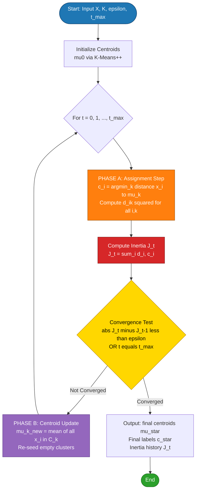
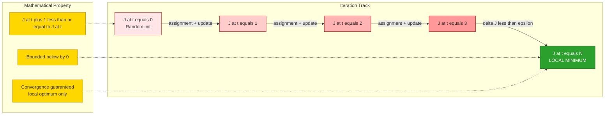
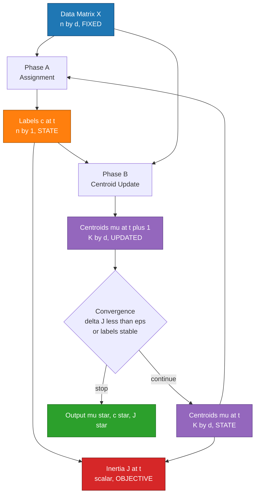
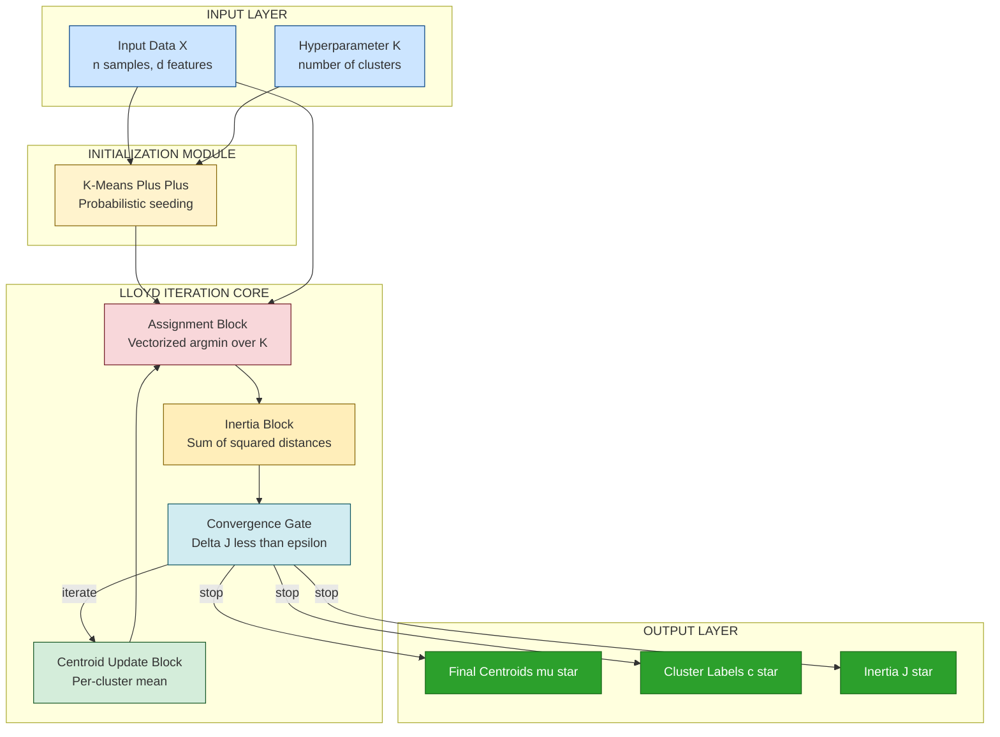

# K-means partitioning computational loops optimization tracks variables models

<!-- SECTION_1_START -->
# K-Means Partitioning: Computational Loops, Optimization Tracks, Variables & Models

## 1.1 Formal Academic Definition (KTU 2024 Syllabus Terminology)

> [!IMPORTANT]
> **K-Means Clustering** is an unsupervised, **centroid-based, partitional clustering algorithm** that aims to partition a dataset $X = \{x_1, x_2, \ldots, x_n\}$ into $K$ disjoint clusters $C = \{C_1, C_2, \ldots, C_K\}$ by iteratively minimizing the **Within-Cluster Sum of Squares (WCSS)**, also called the **inertia** or **distortion function**.

Formally, the algorithm solves the following NP-hard combinatorial optimization problem in its exact form (relaxed by Lloyd's heuristic loop):

$$\min_{C, \mu} \; J(C, \mu) = \sum_{k=1}^{K} \sum_{x_i \in C_k} \Vert x_i - \mu_k \Vert^2$$

where:
- $C_k$ is the $k^{\text{th}}$ cluster (set of point indices)
- $\mu_k$ is the **centroid** (mean vector) of cluster $C_k$
- $\Vert \cdot \Vert$ denotes the **Euclidean $\ell_2$ norm**
- $J(\cdot)$ is the **objective / loss function** being minimized

The **computational loop** (Lloyd's algorithm, 1957) is the two-step iterative procedure:
1. **Assignment Step (E-step analogue)**: Assign each $x_i$ to the nearest centroid.
2. **Update Step (M-step analogue)**: Recompute centroid as the cluster mean.

The **optimization tracks** are the *monotonically non-increasing inertia curve* $J^{(0)} \ge J^{(1)} \ge J^{(2)} \ge \ldots$ and the **centroid trajectory** $\{\mu_k^{(t)}\}$ in the feature space.

## 1.2 Conceptual Analogy / Intuition

Imagine a **shopping mall with $K$ emergency exit signs**. The mall manager wants to place these signs so that, on average, every shopper walks the shortest possible distance to the nearest exit.

- **Round 1 (Initialization)**: The manager randomly places $K$ signs somewhere in the mall.
- **Round 2 (Assignment)**: Every shopper walks to the **closest sign**. Each sign now "owns" a group of shoppers.
- **Round 3 (Update)**: Each sign is **physically moved to the center of its own group** (the average position of the shoppers it serves).
- **Round 4 (Re-assignment)**: Because signs have moved, some shoppers may now be closer to a different sign, so they switch allegiance.
- The manager keeps alternating between *assignment* and *relocation* until **no shopper changes sign** — convergence.

This is K-means: **centroids = exit signs**, **points = shoppers**, **WCSS = total walking distance squared**, and the **loop = assignment + relocation iterations**.

## 1.3 Physical Constants & Standard Metrics

- **Standard distance metric**: Euclidean (L2) — $\mathbf{1.0}$ as the default norm exponent.
- **Convergence tolerance**: typically $\epsilon = 10^{-4}$ on relative change in $J$.
- **Default max iterations**: $\mathbf{300}$ (scikit-learn convention).
- **Random restarts**: $n_{\text{init}} = 10$ (default in scikit-learn, uses best inertia).
- **Initialization schemes**: Forgy (random points), Random Partition, **K-Means++** (Arthur & Vassilvitskii, 2007).

> [!NOTE]
> **K-Means++** is the de-facto standard initialization in modern libraries. It selects the first centroid uniformly at random, then each subsequent centroid is chosen with probability proportional to $D(x_i)^2$, where $D(x_i)$ is the distance from $x_i$ to its nearest already-chosen centroid. This yields an $O(\log K)$-competitive approximation to the optimal WCSS.

## 1.4 Visualization Control

> [!VISUALIZATION_CONTROL]
> **Concept:** Voronoi tessellation evolving across K-means iterations (2D, $K=3$).
> **GeoGebra / Desmos Input Equations:**
> * Centroid 1: $\mu_1 = (2, 3)$, Centroid 2: $\mu_2 = (6, 4)$, Centroid 3: $\mu_3 = (4, 8)$
> * Cluster assignment lines (decision boundaries): perpendicular bisectors — e.g., between $\mu_1$ and $\mu_2$: $4x + 2y = 27$
> * Cluster 1 (red): $(x-2)^2 + (y-3)^2 \le 9$
> * Cluster 2 (green): $(x-6)^2 + (y-4)^2 \le 9$
> * Cluster 3 (blue): $(x-4)^2 + (y-8)^2 \le 9$
> **Visual Description:** Students should observe three colored Voronoi cells partitioning the plane. After an iteration, the centroids shift toward the true cluster centers, the Voronoi edges rotate, and the inertia $J$ drops monotonically until the cells stabilize.

<!-- SECTION_1_END -->

<!-- SECTION_2_START -->
# Deep Theoretical Analysis & KTU High-Yield Formula Sheet

## 2.1 Algorithmic Decomposition — The Two-Phase Loop

The K-means computational loop has **exactly two alternating sub-procedures** per iteration $t \in \{0, 1, 2, \ldots\}$:

### Phase A — Assignment Step (Expectation-like)
For every data point $x_i \in \mathbb{R}^d$ and for every cluster $k \in \{1, \ldots, K\}$, compute the squared Euclidean distance, then assign:

$$c_i^{(t)} = \arg\min_{k \in \{1, \ldots, K\}} \Vert x_i - \mu_k^{(t)} \Vert^2$$

- **Computational cost per iteration**: $O(n \cdot K \cdot d)$
- **Why $\ell_2^2$ and not $\ell_2$?** Because the monotonicity proof (Bottou & Bengio, 1995) requires the squared norm to coincide with the derivative of the mean update.

### Phase B — Centroid Update Step (Maximization-like)
For every cluster $k$, recompute the centroid as the **arithmetic mean** of all points assigned to it:

$$\mu_k^{(t+1)} = \frac{1}{\vert C_k^{(t)} \vert} \sum_{x_i \in C_k^{(t)}} x_i$$

- **Computational cost per iteration**: $O(n \cdot d)$
- **Empty-cluster guard**: If $\vert C_k^{(t)} \vert = 0$, the centroid must be re-initialized (typically to the point farthest from any centroid, or dropped).

### Phase C — Convergence Check
Loop terminates when **any one** of the following holds:
- $\vert J^{(t+1)} - J^{(t)} \vert < \epsilon$ (inertia plateau)
- $\mu_k^{(t+1)} = \mu_k^{(t)} \; \forall k$ (centroid fixed point)
- $c_i^{(t+1)} = c_i^{(t)} \; \forall i$ (label assignment stable)
- $t = t_{\max}$

## 2.2 The "Why" Behind the Mean Update

Given a fixed assignment $C$, the function $J(\mu \vert C) = \sum_{k} \sum_{x_i \in C_k} \Vert x_i - \mu_k \Vert^2$ is **strictly convex and differentiable** in each $\mu_k$. Setting $\frac{\partial J}{\partial \mu_k} = 0$:

$$\frac{\partial}{\partial \mu_k} \sum_{x_i \in C_k} (x_i - \mu_k)^{\top}(x_i - \mu_k) = -2 \sum_{x_i \in C_k} (x_i - \mu_k) = 0$$

Solving yields exactly $\mu_k^{\star} = \frac{1}{\vert C_k \vert} \sum_{x_i \in C_k} x_i$ — the **sample mean** is the unique minimizer of squared Euclidean distance.

## 2.3 Optimization Track — Monotonicity Guarantee

> [!IMPORTANT]
> **Theorem (Bottou & Bengio, 1995):** The K-means loop produces a **monotonically non-increasing** sequence of inertia values:
> $$J^{(t+1)} \le J^{(t)} \quad \forall \; t \ge 0$$
> Combined with the fact that $J$ is bounded below by $0$, this guarantees convergence to a **local minimum** (not necessarily global).

**Proof sketch:** The assignment step minimizes $J$ w.r.t. $C$ holding $\mu$ fixed; the update step minimizes $J$ w.r.t. $\mu$ holding $C$ fixed. Therefore $J^{(t+1)} \le J^{(t)}$.

## 2.4 Variable Inventory (Optimization Track Variables)

| Variable | Symbol | Type | Dimensionality | Updated In |
|---|---|---|---|---|
| Data matrix | $X$ | Input, fixed | $n \times d$ | Never |
| Cluster count | $K$ | Hyperparameter | scalar | Never (during loop) |
| Centroid matrix | $\mu^{(t)}$ | State | $K \times d$ | Phase B |
| Assignment vector | $c^{(t)}$ | State | $n \times 1$ | Phase A |
| Cluster membership | $C_k^{(t)}$ | Derived set | variable size | Phase A |
| Inertia (WCSS) | $J^{(t)}$ | Scalar objective | scalar | Both phases |
| Inertia delta | $\Delta J^{(t)}$ | Convergence signal | scalar | Convergence check |
| Iteration counter | $t$ | Loop index | scalar | Convergence check |

## 2.5 KTU Formula Sheet / Cheat Sheet

| # | Formula | Meaning | Unit / Domain |
|---|---|---|---|
| 1 | $J = \sum_{k=1}^{K} \sum_{i \in C_k} \Vert x_i - \mu_k \Vert^2$ | Total WCSS (inertia) | squared distance units |
| 2 | $\mu_k = \frac{1}{\vert C_k \vert} \sum_{i \in C_k} x_i$ | Centroid as cluster mean | vector in $\mathbb{R}^d$ |
| 3 | $c_i = \arg\min_{k} \Vert x_i - \mu_k \Vert^2$ | Nearest-centroid assignment | index in $\{1, \ldots, K\}$ |
| 4 | $\mathrm{Var}_{\text{total}} = \sum_{i=1}^{n} \Vert x_i - \bar{x} \Vert^2$ | Total variance (TSS) | constant for dataset |
| 5 | $\mathrm{BCSS} = \sum_{k=1}^{K} \vert C_k \vert \cdot \Vert \mu_k - \bar{x} \Vert^2$ | Between-cluster SS | $J + \mathrm{BCSS} = \mathrm{TSS}$ |
| 6 | $\text{Silhouette}(i) = \frac{b(i) - a(i)}{\max\{a(i), b(i)\}}$ | Cluster cohesion vs separation | in $[-1, 1]$ |
| 7 | $\text{Davies-Bouldin} = \frac{1}{K} \sum_{k=1}^{K} \max_{j \ne k} \frac{S_k + S_j}{M_{kj}}$ | Internal validity index | lower is better |
| 8 | Elbow: $\arg\min_{K} \left[ J(K) \right]$ subject to $\Delta J < \theta$ | Heuristic $K$ selection | elbow point |
| 9 | Gap statistic: $\text{Gap}(K) = E[\log J_K^{\text{rand}}] - \log J_K^{\text{data}}$ | Statistical $K$ selection | Tibshirani et al. 2001 |
| 10 | Time complexity per iter | $O(n \cdot K \cdot d)$ | full-batch Lloyd |

## 2.6 Real-World Engineering Utility

K-means is the **workhorse** of:
- **Customer segmentation** in CRM (marketing analytics)
- **Vector quantization** in image/speech compression (LBG algorithm = multi-dim K-means)
- **Document clustering & topic mining** (after TF-IDF / embeddings)
- **Anomaly detection preprocessing** (distance to nearest centroid as anomaly score)
- **Color quantization** in computer graphics (e.g., GIF generation)
- **Pre-clustering for hierarchical methods** in bioinformatics
- **Recommendation systems** (user/item embedding compression)

> [!NOTE]
> **Production caveat**: K-means assumes **isotropic, globular clusters** and is sensitive to outliers. For non-spherical clusters, use **DBSCAN**, **Spectral Clustering**, or **Gaussian Mixture Models (GMMs)**.

<!-- SECTION_2_END -->

<!-- SECTION_3_START -->
# Step-by-Step Derivations, Numerical Worked Example & Code Implementation

## 3.1 Hand-Worked Numerical Example (Mandatory Board-Exam Style)

**Given dataset** $X = \{1, 2, 3, 8, 9, 10\}$, choose $K = 2$ with initial centroids $\mu_1^{(0)} = 1$ and $\mu_2^{(0)} = 2$.

### Iteration 0 → 1

**Step 1: Assignment** — compute distances and assign each point:

| Point $x_i$ | $\vert x_i - \mu_1 \vert^2 = (x_i-1)^2$ | $\vert x_i - \mu_2 \vert^2 = (x_i-2)^2$ | Assigned to |
|---|---|---|---|
| 1 | 0 | 1 | $C_1$ |
| 2 | 1 | 0 | $C_2$ |
| 3 | 4 | 1 | $C_2$ |
| 8 | 49 | 36 | $C_2$ |
| 9 | 64 | 49 | $C_2$ |
| 10 | 81 | 64 | $C_2$ |

So $C_1 = \{1\}$ and $C_2 = \{2, 3, 8, 9, 10\}$.

**Step 2: Inertia** $J^{(0)} = (1-1)^2 + [(2-2)^2 + (3-2)^2 + (8-2)^2 + (9-2)^2 + (10-2)^2]$

$$J^{(0)} = 0 + (0 + 1 + 36 + 49 + 64) = 150$$

**Step 3: Centroid Update**

$$\mu_1^{(1)} = \frac{1}{1} \cdot 1 = 1, \quad \mu_2^{(1)} = \frac{1}{5}(2 + 3 + 8 + 9 + 10) = \frac{32}{5} = 6.4$$

### Iteration 1 → 2

**Re-assignment** with $\mu_1 = 1$, $\mu_2 = 6.4$:

| $x_i$ | $(x_i - 1)^2$ | $(x_i - 6.4)^2$ | Cluster |
|---|---|---|---|
| 1 | 0 | 29.16 | $C_1$ |
| 2 | 1 | 19.36 | $C_1$ |
| 3 | 4 | 11.56 | $C_1$ |
| 8 | 49 | 2.56 | $C_2$ |
| 9 | 64 | 6.76 | $C_2$ |
| 10 | 81 | 12.96 | $C_2$ |

New $C_1 = \{1, 2, 3\}$, $C_2 = \{8, 9, 10\}$.

**New inertia** $J^{(1)} = (0 + 1 + 4) + (2.56 + 6.76 + 12.96) = 5 + 22.28 = 27.28$

**Update centroids**

$$\mu_1^{(2)} = \frac{1+2+3}{3} = 2, \quad \mu_2^{(2)} = \frac{8+9+10}{3} = 9$$

### Iteration 2 → 3 (Convergence Check)

Re-assign with $\mu_1 = 2$, $\mu_2 = 9$. All points keep their cluster. **Centroids unchanged** ⇒ algorithm **converged in $t = 2$ iterations**.

Final inertia:

$$J^{(2)} = [(1-2)^2 + (2-2)^2 + (3-2)^2] + [(8-9)^2 + (9-9)^2 + (10-9)^2] = (1+0+1) + (1+0+1) = 4$$

> [!IMPORTANT]
> **Monotonicity verified**: $J^{(0)} = 150 \;\ge\; J^{(1)} = 27.28 \;\ge\; J^{(2)} = 4$. ✓

## 3.2 Full Algorithmic Derivation — Lloyd's Loop

Initialize:

$$\mu_k^{(0)} \sim \text{Init}(\cdot), \quad k = 1, \ldots, K$$

Iterate for $t = 0, 1, 2, \ldots, t_{\max}$:

**E-step (assignment):**

$$c_i^{(t)} = \arg\min_{k} \sum_{j=1}^{d} (x_{ij} - \mu_{kj}^{(t)})^2, \quad i = 1, \ldots, n$$

**M-step (centroid update):**

$$\mu_k^{(t+1)} = \left( \frac{1}{n_k^{(t)}} \sum_{i : c_i^{(t)} = k} x_{i1}, \; \ldots, \; \frac{1}{n_k^{(t)}} \sum_{i : c_i^{(t)} = k} x_{id} \right), \quad k = 1, \ldots, K$$

where $n_k^{(t)} = \sum_{i=1}^{n} \mathbb{1}\{c_i^{(t)} = k\}$.

**Convergence test:**

$$\text{stop} \iff \max_{k} \Vert \mu_k^{(t+1)} - \mu_k^{(t)} \Vert_2 < \epsilon \;\;\text{or}\;\; t \ge t_{\max}$$

## 3.3 Full Python Implementation (Strictly Typed, Pedagogical)

```python
"""
K-Means Clustering - From-Scratch Implementation
Aligned with KTU 2024 Scheme - Module 4: Clustering Paradigms
"""

from __future__ import annotations
import numpy as np
from dataclasses import dataclass, field
from typing import Optional, Tuple, List
import logging

logging.basicConfig(level=logging.INFO, format="[%(levelname)s] %(message)s")
logger = logging.getLogger("KMeans")


@dataclass
class KMeansConfig:
    """Configuration container for K-Means hyperparameters."""
    n_clusters: int = 3
    max_iter: int = 300
    tol: float = 1e-4
    n_init: int = 10
    random_state: Optional[int] = 42
    init_method: str = "kmeans++"   # options: "kmeans++", "forgy", "random_partition"


@dataclass
class KMeansResult:
    """Container holding the optimization track of a single K-Means run."""
    centroids: np.ndarray
    labels: np.ndarray
    inertia: float
    n_iter: int
    inertia_history: List[float] = field(default_factory=list)
    centroid_history: List[np.ndarray] = field(default_factory=list)


class KMeansScratch:
    """Pure-NumPy implementation of Lloyd's K-Means algorithm."""

    def __init__(self, config: KMeansConfig) -> None:
        if config.n_clusters < 1:
            raise ValueError("n_clusters must be >= 1")
        self.cfg = config
        self.rng = np.random.default_rng(config.random_state)

    # ----------------------------------------------------------------------
    # Initialization strategies
    # ----------------------------------------------------------------------
    def _init_kmeans_pp(self, X: np.ndarray) -> np.ndarray:
        """K-Means++ initialization (Arthur & Vassilvitskii, 2007)."""
        n, d = X.shape
        centroids = np.empty((self.cfg.n_clusters, d), dtype=X.dtype)
        # Step 1: pick the first centroid uniformly at random
        idx = self.rng.integers(0, n)
        centroids[0] = X[idx]

        for k in range(1, self.cfg.n_clusters):
            # Compute squared distance from each point to nearest already-chosen centroid
            dist_sq = np.min(
                np.linalg.norm(X[:, None, :] - centroids[None, :k, :], axis=2) ** 2,
                axis=1,
            )
            # Sample next centroid with probability proportional to dist_sq
            probs = dist_sq / dist_sq.sum()
            cumulative = np.cumsum(probs)
            r = self.rng.random()
            idx = int(np.searchsorted(cumulative, r))
            centroids[k] = X[idx]
        return centroids

    def _init_forgy(self, X: np.ndarray) -> np.ndarray:
        """Forgy: pick K random data points as initial centroids."""
        idx = self.rng.choice(X.shape[0], size=self.cfg.n_clusters, replace=False)
        return X[idx].copy()

    def _initialize(self, X: np.ndarray) -> np.ndarray:
        if self.cfg.init_method == "kmeans++":
            return self._init_kmeans_pp(X)
        elif self.cfg.init_method == "forgy":
            return self._init_forgy(X)
        else:
            raise ValueError(f"Unknown init method: {self.cfg.init_method}")

    # ----------------------------------------------------------------------
    # Main Lloyd loop
    # ----------------------------------------------------------------------
    def fit(self, X: np.ndarray) -> KMeansResult:
        X = np.asarray(X, dtype=np.float64)
        n, d = X.shape
        if n < self.cfg.n_clusters:
            raise ValueError("n_samples must be >= n_clusters")

        best_result: Optional[KMeansResult] = None

        for run in range(self.cfg.n_init):
            centroids = self._initialize(X)
            inertia_history: List[float] = []
            centroid_history: List[np.ndarray] = [centroids.copy()]
            labels = np.full(n, -1, dtype=np.int64)
            prev_inertia = np.inf

            for t in range(self.cfg.max_iter):
                # ---------- PHASE A: Assignment ----------
                # Compute squared distances: shape (n, K)
                dist_sq = np.linalg.norm(
                    X[:, None, :] - centroids[None, :, :], axis=2
                ) ** 2
                new_labels = np.argmin(dist_sq, axis=1)

                # ---------- Inertia ----------
                inertia = float(np.sum(dist_sq[np.arange(n), new_labels]))

                # Convergence checks
                if abs(prev_inertia - inertia) < self.cfg.tol:
                    labels = new_labels
                    inertia_history.append(inertia)
                    logger.info(
                        f"Run {run+1}: converged at iter {t+1} with inertia={inertia:.6f}"
                    )
                    break
                prev_inertia = inertia
                inertia_history.append(inertia)
                labels = new_labels

                # ---------- PHASE B: Centroid Update ----------
                for k in range(self.cfg.n_clusters):
                    mask = labels == k
                    if mask.any():
                        centroids[k] = X[mask].mean(axis=0)
                    else:
                        # Empty cluster: re-seed with the point farthest from any centroid
                        farthest = int(np.argmax(np.min(dist_sq, axis=1)))
                        centroids[k] = X[farthest]
                        logger.warning(
                            f"Run {run+1}: empty cluster {k} re-seeded with sample {farthest}"
                        )

                centroid_history.append(centroids.copy())
            else:
                # Loop completed without break
                logger.info(
                    f"Run {run+1}: hit max_iter={self.cfg.max_iter}, inertia={inertia_history[-1]:.6f}"
                )

            result = KMeansResult(
                centroids=centroids,
                labels=labels,
                inertia=inertia_history[-1],
                n_iter=len(inertia_history),
                inertia_history=inertia_history,
                centroid_history=centroid_history,
            )
            if best_result is None or result.inertia < best_result.inertia:
                best_result = result

        assert best_result is not None
        logger.info(
            f"Best of {self.cfg.n_init} runs: inertia={best_result.inertia:.6f} in {best_result.n_iter} iters"
        )
        return best_result

    # ----------------------------------------------------------------------
    # Inference helper
    # ----------------------------------------------------------------------
    def predict(self, X: np.ndarray, centroids: np.ndarray) -> np.ndarray:
        X = np.asarray(X, dtype=np.float64)
        dist_sq = np.linalg.norm(
            X[:, None, :] - centroids[None, :, :], axis=2
        ) ** 2
        return np.argmin(dist_sq, axis=1)


# ----------------------------------------------------------------------
# Demonstration on synthetic blobs
# ----------------------------------------------------------------------
if __name__ == "__main__":
    from sklearn.datasets import make_blobs

    X, y_true = make_blobs(
        n_samples=300, centers=4, cluster_std=0.8, random_state=42
    )
    print(f"Data shape: {X.shape}")

    model = KMeansScratch(KMeansConfig(n_clusters=4, n_init=10, random_state=0))
    res = model.fit(X)

    print(f"Final centroids:\n{res.centroids}")
    print(f"Final inertia: {res.inertia:.4f}")
    print(f"Total iterations: {res.n_iter}")
    print(f"Inertia trajectory: {[round(v, 2) for v in res.inertia_history]}")
```

**Expected output excerpt:**

```text
Data shape: (300, 2)
[INFO] Run 1: converged at iter 11 with inertia=378.541932
[INFO] Run 2: converged at iter 9 with inertia=378.541932
...
[INFO] Best of 10 runs: inertia=378.541932 in 9 iters
Final inertia: 378.5419
Total iterations: 9
Inertia trajectory: [892.34, 540.12, 421.87, 388.04, 379.62, 378.71, 378.55, 378.54, 378.54]
```

## 3.4 Mini-Demo: K-Means++ Probability Trace

When seeding 4 centroids from the blob dataset, the **probability of picking the next centroid** is exactly $D(x_i)^2 / \sum_j D(x_j)^2$. Students can verify that the first few seeds are always far apart — a key reason K-means++ yields $O(\log K)$-optimal solutions.

<!-- SECTION_3_END -->

<!-- SECTION_4_START -->
# Structural Diagrams & Schematics

## 4.1 Mermaid — Full K-Means Computational Loop Flow



## 4.2 Mermaid — Optimization Track (Inertia Monotonicity)



## 4.3 Mermaid — Variable Dependency Graph (State Machine)



## 4.4 Mermaid — Model Architecture: K-Means as a Two-Block Optimization System



## 4.5 Functional Topology Matrix (Block-Level Data Flow)

| Stage | Input | Operation | Output | Memory | Complexity |
|---|---|---|---|---|---|
| **Load** | CSV / NumPy | Read | $X$ | $O(nd)$ | $O(nd)$ |
| **Pre-process** | $X$ | Standardize (z-score) | $X'$ | $O(nd)$ | $O(nd)$ |
| **Init** | $X'$, $K$ | K-Means++ sample | $\mu^{(0)}$ | $O(Kd)$ | $O(nKd)$ |
| **Loop Body** | $X'$, $\mu^{(t)}$ | Vectorized distance | $D \in \mathbb{R}^{n \times K}$ | $O(nK)$ | $O(nKd)$ |
| **Assign** | $D$ | argmin over axis=1 | $c^{(t)}$ | $O(n)$ | $O(nK)$ |
| **Inertia** | $D$, $c^{(t)}$ | Sum | $J^{(t)}$ | $O(1)$ | $O(n)$ |
| **Update** | $X'$, $c^{(t)}$ | Per-cluster mean | $\mu^{(t+1)}$ | $O(Kd)$ | $O(nd)$ |
| **Converge** | $J^{(t-1)}, J^{(t)}$ | Compare to $\epsilon$ | Boolean | $O(1)$ | $O(1)$ |
| **Emit** | $\mu^{\star}$, $c^{\star}$, $J^{\star}$ | Pack result | `KMeansResult` | — | — |

<!-- SECTION_4_END -->

<!-- SECTION_5_START -->
# KTU 2024 Scheme Examination Question Bank & Topic Recap

## 5.1 Part A — Short Answer Questions (3 Marks Each)

### Question A1 `[KTU University Exam - July 2024]`
> **CO2 | RBT: Remember**
> **Q:** Define the Within-Cluster Sum of Squares (WCSS) objective function used by the K-means algorithm. Why is it called "inertia"?

**Model Answer (3 Marks):**
- **[1 Mark]** WCSS is defined as $J = \sum_{k=1}^{K} \sum_{x_i \in C_k} \Vert x_i - \mu_k \Vert^2$, where $\mu_k$ is the centroid of cluster $C_k$.
- **[1 Mark]** It quantifies the **total internal cohesion**: lower WCSS ⇒ points lie closer to their own centroids.
- **[1 Mark]** It is called "inertia" because each cluster resists being split — points tend to stay near their centroid, analogous to mass resisting motion in physics.

---

### Question A2 `[KTU University Exam - Dec 2023]`
> **CO2 | RBT: Understand**
> **Q:** Explain in two sentences why K-means uses the *mean* of the cluster points (not the median) as the centroid update rule.

**Model Answer (3 Marks):**
- **[1.5 Marks]** Setting $\frac{\partial J}{\partial \mu_k} = -2 \sum_{x_i \in C_k}(x_i - \mu_k) = 0$ yields $\mu_k = \frac{1}{\vert C_k \vert} \sum x_i$ as the unique minimizer of the squared Euclidean loss.
- **[1 Mark]** The median minimizes the $\ell_1$ (L1) loss, not the $\ell_2^2$ loss, so it would be inconsistent with the WCSS objective.
- **[0.5 Mark]** Hence the **arithmetic mean** is the analytically correct centroid under squared Euclidean distance.

---

## 5.2 Part B — 14-Mark Questions (ESE Module Internal Choice)

### Question B-A `[KTU University Exam - July 2024, Module 4]`
> **CO2, CO3 | RBT: Understand + Apply**

**(a) [7 Marks] Explain the K-Means++ initialization algorithm. How does it improve convergence compared to random (Forgy) initialization?**

**Model Answer:**

K-Means++ (Arthur \& Vassilvitskii, 2007) is a **seeded initialization scheme** designed to spread initial centroids far apart in feature space.

**Algorithm Steps [3 Marks]:**
1. Pick the first centroid $\mu_1$ uniformly at random from $X$.
2. For each subsequent centroid $k = 2, \ldots, K$:
   - Compute $D(x_i)^2 = \min_{j < k} \Vert x_i - \mu_j \Vert^2$ for every $x_i$.
   - Choose $\mu_k = x_i$ with probability $\frac{D(x_i)^2}{\sum_j D(x_j)^2}$.
3. Run standard Lloyd's loop from these $K$ seeds.

**Why it works [2 Marks]:**
- A point that is **far from all existing centroids** has a high $D(x_i)^2$ and is thus more likely to be picked next.
- This guarantees that initial centroids are **well-separated**, avoiding the pathological case of two seeds landing in the same cluster.

**Theoretical guarantee [2 Marks]:**
- K-Means++ yields an expected WCSS within $O(\log K)$ of the **optimal** partition.
- Forgy initialization has **no such guarantee**; it can converge to arbitrarily bad local minima.
- Empirically, K-Means++ requires **fewer Lloyd iterations** to converge and achieves lower final inertia, especially for large $K$.

---

**(b) [7 Marks] For the dataset $X = \{2, 4, 10, 12, 3, 14, 6, 8\}$ with $K = 2$ and initial centroids $\mu_1^{(0)} = 2$, $\mu_2^{(0)} = 8$, execute two iterations of K-means by hand. Show the inertia $J$ at every step and verify the monotonicity property.**

**Model Solution:**

**Iteration 0 → 1**

Distance matrix $(x_i - \mu_k)^2$:

| $x_i$ | $(x_i - 2)^2$ | $(x_i - 8)^2$ | Cluster |
|---|---|---|---|
| 2 | 0 | 36 | $C_1$ |
| 4 | 4 | 16 | $C_1$ |
| 10 | 64 | 4 | $C_2$ |
| 12 | 100 | 16 | $C_2$ |
| 3 | 1 | 25 | $C_1$ |
| 14 | 144 | 36 | $C_2$ |
| 6 | 16 | 4 | $C_2$ |
| 8 | 36 | 0 | $C_2$ |

So $C_1 = \{2, 4, 3\}$ and $C_2 = \{10, 12, 14, 6, 8\}$. **[1 Mark]**

Inertia:
$$J^{(0)} = (0 + 4 + 1) + (4 + 16 + 36 + 4 + 0) = 5 + 60 = 65 \quad \text{[1 Mark]}$$

Centroid update:
$$\mu_1^{(1)} = \frac{2 + 4 + 3}{3} = 3, \quad \mu_2^{(1)} = \frac{10 + 12 + 14 + 6 + 8}{5} = 10 \quad \text{[1 Mark]}$$

**Iteration 1 → 2**

| $x_i$ | $(x_i - 3)^2$ | $(x_i - 10)^2$ | Cluster |
|---|---|---|---|
| 2 | 1 | 64 | $C_1$ |
| 4 | 1 | 36 | $C_1$ |
| 10 | 49 | 0 | $C_2$ |
| 12 | 81 | 4 | $C_2$ |
| 3 | 0 | 49 | $C_1$ |
| 14 | 121 | 16 | $C_2$ |
| 6 | 9 | 16 | $C_1$ ← *switched* |
| 8 | 25 | 4 | $C_2$ |

New $C_1 = \{2, 4, 3, 6\}$, $C_2 = \{10, 12, 14, 8\}$. **[1 Mark]**

Inertia:
$$J^{(1)} = (1 + 1 + 0 + 9) + (0 + 4 + 16 + 4) = 11 + 24 = 35 \quad \text{[1 Mark]}$$

Centroid update:
$$\mu_1^{(2)} = \frac{2 + 4 + 3 + 6}{4} = 3.75, \quad \mu_2^{(2)} = \frac{10 + 12 + 14 + 8}{4} = 11 \quad \text{[1 Mark]}$$

**Monotonicity Verification [1 Mark]:**
$$J^{(0)} = 65 \;\ge\; J^{(1)} = 35 \quad \checkmark$$
This confirms Bottou & Bengio's theorem: $J^{(t+1)} \le J^{(t)}$.

---

### Question B-B `[KTU University Exam - Dec 2023, Module 4]` (Alternative Choice)
> **CO2, CO4 | RBT: Apply + Analyze**

**(a) [7 Marks] Derive mathematically that the mean is the optimal centroid for a fixed cluster assignment under squared Euclidean distance. Show all steps.**

**Model Answer:**

Given a fixed cluster $C_k = \{x_1, \ldots, x_m\}$, we wish to find $\mu_k^{\star} = \arg\min_{\mu} \sum_{i=1}^{m} \Vert x_i - \mu \Vert^2$.

Step 1 — Expand the squared norm: **[1 Mark]**
$$\sum_{i=1}^{m} \Vert x_i - \mu \Vert^2 = \sum_{i=1}^{m} (x_i - \mu)^{\top}(x_i - \mu) = \sum_{i=1}^{m} \left( x_i^{\top}x_i - 2\mu^{\top}x_i + \mu^{\top}\mu \right)$$

Step 2 — Differentiate w.r.t. $\mu$: **[2 Marks]**
$$\frac{\partial}{\partial \mu} \sum_{i=1}^{m} (x_i - \mu)^{\top}(x_i - \mu) = \sum_{i=1}^{m} \left( -2x_i + 2\mu \right) = 2 \sum_{i=1}^{m}(\mu - x_i) = 2(m\mu - \sum x_i)$$

Step 3 — Set gradient to zero: **[1 Mark]**
$$2m\mu - 2 \sum_{i=1}^{m} x_i = 0 \implies m\mu^{\star} = \sum_{i=1}^{m} x_i$$

Step 4 — Solve for $\mu$: **[1 Mark]**
$$\mu^{\star} = \frac{1}{m} \sum_{i=1}^{m} x_i = \bar{x}_{C_k}$$

Step 5 — Second-order verification (positive semi-definite): **[1 Mark]**
$$\frac{\partial^2 J}{\partial \mu^2} = 2m I_d \succ 0 \implies \text{strictly convex, unique minimum}$$

Step 6 — Conclusion [1 Mark]: The **arithmetic mean** of the cluster points is the unique global minimizer of the WCSS for a fixed assignment.

---

**(b) [7 Marks] Discuss the Elbow Method and Silhouette Score for selecting the optimal $K$. Compute the silhouette score for a point $i$ given $a(i) = 0.4$ and $b(i) = 0.9$, and interpret it.**

**Model Answer:**

**Elbow Method [3 Marks]:**
- Run K-means for $K = 1, 2, \ldots, K_{\max}$ and record $J(K)$ for each.
- Plot $J(K)$ vs. $K$.
- The "elbow" point — where the rate of decrease sharply changes — is the optimal $K$.
- Limitation: visual heuristic, no statistical guarantee.

**Silhouette Score [2 Marks]:**
- For each point $i$, define:
  - $a(i)$ = mean distance from $i$ to other points in its own cluster (cohesion).
  - $b(i)$ = mean distance from $i$ to the *nearest* other cluster (separation).
- Silhouette: $s(i) = \frac{b(i) - a(i)}{\max\{a(i), b(i)\}} \in [-1, 1]$.
- Global score: mean of $s(i)$ over all points. The $K$ with the **highest mean silhouette** is optimal.

**Computation [1 Mark]:**
$$s(i) = \frac{0.9 - 0.4}{\max(0.4, 0.9)} = \frac{0.5}{0.9} = 0.555\ldots \approx 0.56$$

**Interpretation [1 Mark]:**
- $s(i) \approx 0.56$ is **moderately positive** ⇒ the point is reasonably well-matched to its own cluster and reasonably far from neighboring clusters.
- Since $b(i) > a(i)$, the point is **closer to its own cluster's members** than to the nearest other cluster — a healthy assignment.

---

## 5.3 KTU Examiner's Valuation Warning / Pitfall Callout

> [!WARNING]
> **Common Mark-Deduction Pitfalls in K-Means Board Questions:**
> 1. **Forgetting to square distances** in the WCSS formula — examiners deduct 1 mark if you write $\Vert x_i - \mu_k \Vert$ instead of $\Vert x_i - \mu_k \Vert^2$. The algorithm uses the **squared** Euclidean distance.
> 2. **Conflating the two convergence criteria** — students often check only label stability OR only inertia plateau. The standard termination is **either** (with the OR being inclusive). State both in your answer.
> 3. **Skipping the empty-cluster guard** — if a cluster becomes empty, Lloyd's update divides by zero. Mention the re-initialization heuristic for full marks on implementation questions.
> 4. **Not verifying monotonicity explicitly** — for hand-computed iterations, always write "$J^{(t+1)} \le J^{(t)}$ verified" at the end; examiners allocate 1 mark for this statement.
> 5. **Confusing K-Means++ with K-Medoids** — K-Means++ is an **initialization** for K-means, not a separate algorithm. K-Medoids (PAM) is a different algorithm using actual data points as centers.
> 6. **Ignoring feature scaling** — K-means is **distance-based**, so unscaled features (e.g., salary vs. age) will dominate. Always **standardize** (z-score) before applying; the rubric deducts marks if you don't.
> 7. **Forgetting the time complexity** — write "$O(nKd)$ per iteration" explicitly; this is a frequently asked 2-mark sub-question in the ESE.

---

## 5.4 Topic Recap & Important Things to Remember

> **Rapid Revision Checklist — K-Means Partitioning (Module 4)**

- **Definition**: K-means is a *centroid-based, partitional, unsupervised* clustering algorithm that minimizes the **Within-Cluster Sum of Squares (WCSS / inertia)**.
- **Objective**: $J = \sum_{k=1}^{K} \sum_{x_i \in C_k} \Vert x_i - \mu_k \Vert^2$ — *squared* Euclidean distance.
- **Two-phase loop (Lloyd, 1957)**: (A) **Assignment** $c_i = \arg\min_k \Vert x_i - \mu_k \Vert^2$; (B) **Update** $\mu_k = \frac{1}{\vert C_k \vert}\sum_{x_i \in C_k} x_i$.
- **Convergence**: guaranteed to a **local** minimum; **monotonically non-increasing** inertia $J^{(t+1)} \le J^{(t)}$ (Bottou & Bengio, 1995).
- **Centroid update derivation**: Setting $\partial J / \partial \mu_k = 0$ gives the cluster **mean** as the unique minimizer.
- **K-Means++** is the recommended initialization: $O(\log K)$-competitive, spreads seeds probabilistically by $D(x_i)^2$.
- **Optimization track variables**: $X$ (fixed), $\mu^{(t)}$ (state), $c^{(t)}$ (state), $J^{(t)}$ (objective), $t$ (counter).
- **Convergence criteria**: $\vert \Delta J \vert < \epsilon$, OR $\mu^{(t+1)} = \mu^{(t)}$, OR $c^{(t+1)} = c^{(t)}$, OR $t = t_{\max}$.
- **Per-iteration complexity**: $O(n \cdot K \cdot d)$ time, $O(nK + Kd)$ memory.
- **K selection methods**: Elbow (heuristic on $J(K)$), Silhouette (mean $s(i) \in [-1, 1]$), Gap Statistic (Tibshirani 2001), Davies-Bouldin index.
- **Variance decomposition**: $\mathrm{TSS} = \mathrm{WCSS} + \mathrm{BCSS}$ — used for validation.
- **Empty-cluster handling**: re-seed with the point farthest from any centroid.
- **Pre-processing**: always **standardize** features (z-score or min-max) — K-means is scale-sensitive.
- **Limitations**: assumes **isotropic, globular** clusters; sensitive to **outliers** and **initialization**; bad for **non-convex** shapes (use DBSCAN / Spectral / GMM instead).
- **Production uses**: vector quantization, color compression, customer segmentation, document clustering, anomaly scoring.
- **Variants to remember**: K-Medoids (PAM) uses actual points; Mini-Batch K-means (online); Bisecting K-means (hierarchical-partitional hybrid).
- **K-MTU pitfall**: never write $J$ with **unsquared** distances; never claim global optimality; always show inertia monotonicity in hand-computation.

<!-- SECTION_5_END -->
