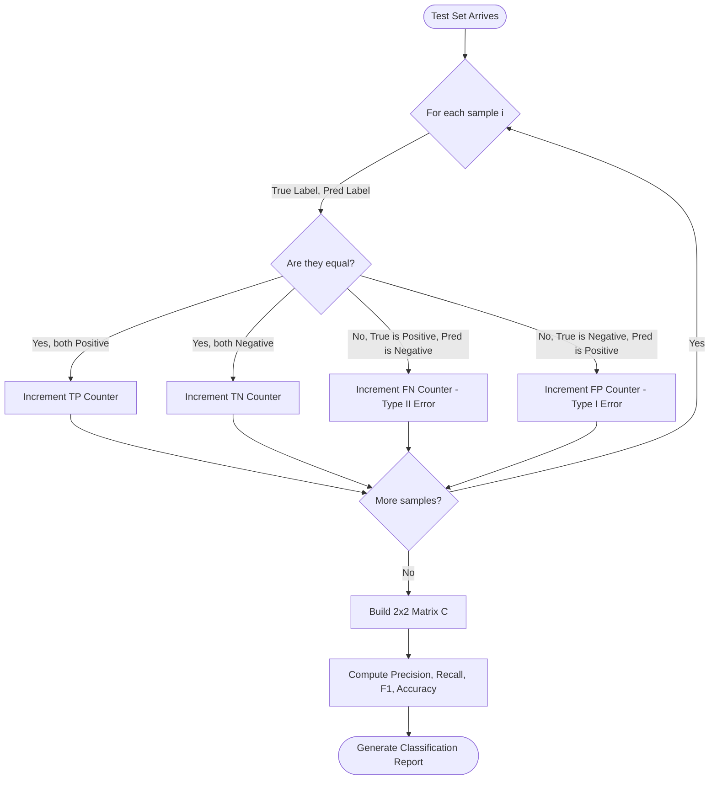
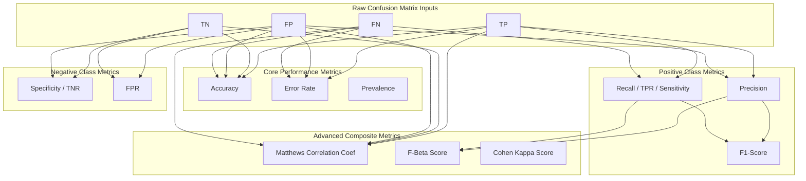
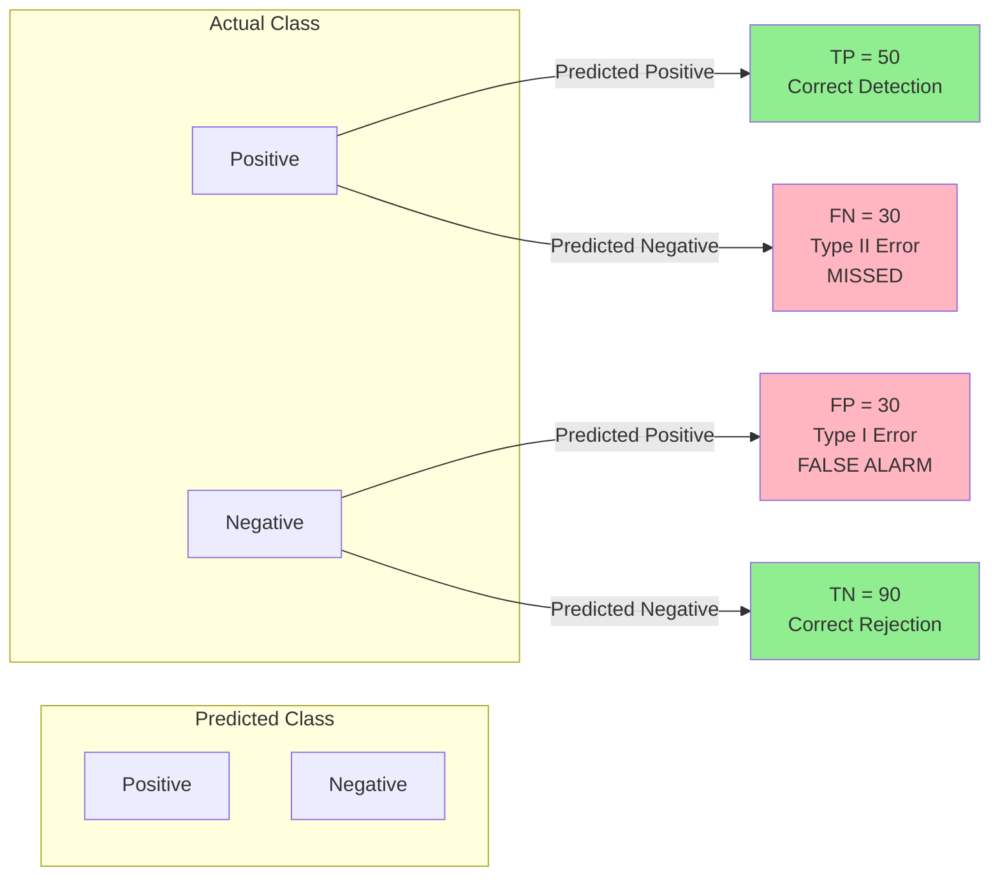

# Model metrics checking confusion matrix parsing precision recall formulas computation

<!-- SECTION_1_START -->
# 1. Model Evaluation Metrics: Confusion Matrix, Precision & Recall

## 1.1 Formal Academic Definition (KTU 2024 Syllabus Terminology)

**Model Evaluation Metrics** are quantitative measures used to assess the performance and reliability of a classification algorithm in Machine Learning. In the context of supervised learning, a **Confusion Matrix** (also called an *Error Matrix* or *Contingency Table*) is an $N \times N$ tabular representation that cross-tabulates the **Predicted Labels** of a classifier against the **Actual Ground Truth Labels**, where $N$ denotes the number of distinct target classes.

> [!IMPORTANT]
> **KTU 2024 Syllabus Highlight:** For binary classification problems ($N = 2$), the confusion matrix is the foundational diagnostic tool from which all derived metrics — **Precision, Recall, F1-Score, Specificity, and Accuracy** — are mathematically extracted. Every parameter in this matrix is a *count* (discrete non-negative integer).

## 1.2 Conceptual Analogy & Intuition

> [!NOTE]
> **Real-World Analogy — The Medical Screening Test**
> Imagine a doctor screening patients for a disease. After testing 100 patients, the lab results are compared to the true health status:
> - The doctor correctly identifies sick patients $\rightarrow$ **True Positives (TP)**
> - The doctor correctly clears healthy patients $\rightarrow$ **True Negatives (TN)**
> - The doctor misses a sick patient (sends them home sick) $\rightarrow$ **False Negatives (FN)** — *dangerous!*
> - The doctor wrongly diagnoses a healthy person $\rightarrow$ **False Positives (FP)** — *unnecessary panic!*
>
> The **Confusion Matrix** is simply a clean ledger (a $2 \times 2$ spreadsheet) where every single prediction is filed into one of these four folders. From this ledger, we derive *precision* (how trustworthy is a positive alert?) and *recall* (how many of the truly sick did we catch?).

## 1.3 The Four Cardinal States of a Binary Classifier

For a binary classification problem with classes labeled as **Positive ($P$)** and **Negative ($N$)**, every prediction falls into exactly one of four mutually exclusive categories:

1. **True Positive (TP):** Model predicts **Positive**, and the actual class is **Positive**. $\rightarrow$ *Correct hit.*
2. **True Negative (TN):** Model predicts **Negative**, and the actual class is **Negative**. $\rightarrow$ *Correct rejection.*
3. **False Positive (FP):** Model predicts **Positive**, but the actual class is **Negative**. $\rightarrow$ *Type I Error (False Alarm).*
4. **False Negative (FN):** Model predicts **Negative**, but the actual class is **Positive**. $\rightarrow$ *Type II Error (Missed Detection).*

> [!TIP]
> **Memory Trick — "The First Letter tells the Truth, the Second tells the Prediction":**
> - **T**rue = *Prediction was Correct* | **F**alse = *Prediction was Wrong*
> - **P**ositive = *Model said YES* | **N**egative = *Model said NO*

## 1.4 Geometric & Visual Intuition of the Confusion Matrix

The confusion matrix can be visualized as a $2 \times 2$ grid on a coordinate plane. The **rows** represent the *actual* classes (ground truth) and the **columns** represent the *predicted* classes (model output). The diagonal elements (TP, TN) represent correct predictions, while the off-diagonal elements (FP, FN) represent classification errors.

> [!VISUALIZATION CONTROL]
> **Concept:** Geometric Layout of a Binary Confusion Matrix
> **GeoGebra / Desmos Input Coordinates:**
> * Point $A = (1, 2)$ labeled "TN (Top-Left)"
> * Point $B = (2, 2)$ labeled "FP (Top-Right)"
> * Point $C = (1, 1)$ labeled "FN (Bottom-Left)"
> * Point $D = (2, 1)$ labeled "TP (Bottom-Right)"
> **Visual Description:** A 2x2 grid where the main diagonal (TN to TP) highlights correct classifications in green, and the anti-diagonal (FP to FN) highlights misclassifications in red. The sum of all four cells equals the total sample size $N$.

<!-- SECTION_1_END -->

<!-- SECTION_2_START -->
# 2. Deep Theoretical Analysis & KTU High-Yield Formula Sheet

## 2.1 Structural Anatomy of the Confusion Matrix

The binary confusion matrix is formally defined as the matrix $C \in \mathbb{Z}_{\geq 0}^{2 \times 2}$:

$$
C = \begin{bmatrix} TN & FP \\ FN & TP \end{bmatrix}
$$

Where:
- **Row sums** represent the *actual class distribution* in the dataset.
- **Column sums** represent the *predicted class distribution* by the model.
- The **grand total** is the size of the test set: $N_{total} = TP + TN + FP + FN$.

## 2.2 Step-by-Step Derivation Logic of Core Metrics

### 2.2.1 Accuracy
**The "Why":** Of all the predictions made, what fraction was correct?
**The "How":** Sum of all correct predictions (TP + TN) divided by total predictions.

### 2.2.2 Precision (Positive Predictive Value)
**The "Why":** When the model raises a positive alarm, how often is it right? (Measures *exactness*).
**The "How":** Correct positive predictions (TP) divided by *all* positive predictions made (TP + FP).

### 2.2.3 Recall (Sensitivity / True Positive Rate)
**The "Why":** Of all the actually positive instances, how many did the model successfully recover? (Measures *completeness*).
**The "How":** Correct positive predictions (TP) divided by *all* actual positive instances (TP + FN).

### 2.2.4 F1-Score
**The "Why":** A single harmonic metric that balances Precision and Recall, especially useful under class imbalance.
**The "How":** Harmonic mean of Precision and Recall (penalizes extreme imbalances).

## 2.3 KTU Formula Sheet / Cheat Sheet

> [!IMPORTANT]
> **All key formulas for board examination reference:**

| # | Metric Name | Mathematical Formula | Range | Engineering Use Case |
|---|-------------|----------------------|-------|----------------------|
| 1 | **Accuracy** | $\frac{TP + TN}{TP + TN + FP + FN}$ | $[0, 1]$ | Balanced datasets, general reporting |
| 2 | **Precision** | $\frac{TP}{TP + FP}$ | $[0, 1]$ | Spam filters (avoid false alarms) |
| 3 | **Recall (TPR)** | $\frac{TP}{TP + FN}$ | $[0, 1]$ | Cancer detection (don't miss patients) |
| 4 | **Specificity (TNR)** | $\frac{TN}{TN + FP}$ | $[0, 1]$ | Medical screening, security clearances |
| 5 | **F1-Score** | $\frac{2 \cdot P \cdot R}{P + R}$ | $[0, 1]$ | Imbalanced classes, NLP, search engines |
| 6 | **False Positive Rate (FPR)** | $\frac{FP}{FP + TN}$ | $[0, 1]$ | ROC Curve construction |
| 7 | **Prevalence** | $\frac{TP + FN}{TP + TN + FP + FN}$ | $[0, 1]$ | Dataset baseline rate |
| 8 | **Error Rate** | $\frac{FP + FN}{TP + TN + FP + FN}$ | $[0, 1]$ | Overall model failure rate |
| 9 | **Matthews Correlation Coef. (MCC)** | $\frac{TP \cdot TN - FP \cdot FN}{\sqrt{(TP+FP)(TP+FN)(TN+FP)(TN+FN)}}$ | $[-1, 1]$ | Robust metric for imbalanced binary tasks |
| 10 | **Total Samples ($N$)** | $TP + TN + FP + FN$ | $\mathbb{Z}_{\geq 0}$ | Test set cardinality |

## 2.4 Real-World Engineering Utility

| Domain | Preferred Primary Metric | Justification |
|--------|--------------------------|---------------|
| **Medical Diagnosis** (e.g., Tumor Detection) | **Recall** | Missing a sick patient (FN) is far costlier than a false alarm (FP). |
| **Email Spam Filtering** | **Precision** | A legitimate email wrongly sent to spam (FP) damages user trust. |
| **Credit Card Fraud Detection** | **F1-Score / Recall** | Fraudulent transactions are rare (imbalanced); need balanced detection. |
| **Information Retrieval (Search Engines)** | **Precision@K** | Top-K results must be highly relevant to the user's query. |
| **Autonomous Vehicle Pedestrian Detection** | **Recall** | Failing to detect a pedestrian is life-threatening. |
| **Sentiment Analysis (Product Reviews)** | **Accuracy / F1** | Classes are roughly balanced in product reviews. |

> [!NOTE]
> **Engineering Insight:** In production ML pipelines (e.g., MLOps frameworks like MLflow or TFX), these metrics are logged per training run to **Model Registries**. The choice of *primary metric* dictates the loss function and the model's hyperparameter search objective.

<!-- SECTION_2_END -->

<!-- SECTION_3_START -->
# 3. Step-by-Step Derivations & Code/Symbolic Implementation

## 3.1 Worked Numerical Example — Confusion Matrix Metric Computation

> [!NOTE]
> **Problem Statement (KTU Board Exam Style):**
> A binary classifier was tested on **200 samples**. The following results were obtained:
> - True Positives ($TP$) = 50
> - True Negatives ($TN$) = 90
> - False Positives ($FP$) = 30
> - False Negatives ($FN$) = 30
>
> **Compute:** (a) Accuracy, (b) Precision, (c) Recall, (d) F1-Score, (e) Error Rate, (f) Specificity.

### 3.1.1 Step-by-Step Solution

**Step 1 — Build the Confusion Matrix**

$$
C = \begin{bmatrix} TN & FP \\ FN & TP \end{bmatrix} = \begin{bmatrix} 90 & 30 \\ 30 & 50 \end{bmatrix}
$$

**Step 2 — Verify the Total Sample Count**

$$
N_{total} = TP + TN + FP + FN = 50 + 90 + 30 + 30 = 200 \;\;\checkmark
$$

**Step 3 — Compute Accuracy**

$$
\text{Accuracy} = \frac{TP + TN}{TP + TN + FP + FN} = \frac{50 + 90}{200} = \frac{140}{200} = 0.70
$$

$$
\boxed{\text{Accuracy} = 70\%} \quad \text{[1 Mark]}
$$

**Step 4 — Compute Precision**

$$
\text{Precision} = \frac{TP}{TP + FP} = \frac{50}{50 + 30} = \frac{50}{80} = 0.625
$$

$$
\boxed{\text{Precision} = 62.5\%} \quad \text{[1 Mark]}
$$

**Step 5 — Compute Recall (Sensitivity)**

$$
\text{Recall} = \frac{TP}{TP + FN} = \frac{50}{50 + 30} = \frac{50}{80} = 0.625
$$

$$
\boxed{\text{Recall} = 62.5\%} \quad \text{[1 Mark]}
$$

**Step 6 — Compute F1-Score**

$$
F_1 = \frac{2 \cdot P \cdot R}{P + R} = \frac{2 \cdot 0.625 \cdot 0.625}{0.625 + 0.625} = \frac{0.78125}{1.25} = 0.625
$$

$$
\boxed{F_1 = 0.625 = 62.5\%} \quad \text{[2 Marks]}
$$

**Step 7 — Compute Error Rate**

$$
\text{Error Rate} = \frac{FP + FN}{N_{total}} = \frac{30 + 30}{200} = \frac{60}{200} = 0.30
$$

$$
\boxed{\text{Error Rate} = 30\%} \quad \text{[1 Mark]}
$$

**Step 8 — Compute Specificity (True Negative Rate)**

$$
\text{Specificity} = \frac{TN}{TN + FP} = \frac{90}{90 + 30} = \frac{90}{120} = 0.75
$$

$$
\boxed{\text{Specificity} = 75\%} \quad \text{[1 Mark]}
$$

## 3.2 Algebraic Derivation: F1-Score from Precision and Recall

The F1-Score is the **harmonic mean** of Precision ($P$) and Recall ($R$), not the arithmetic mean. This is because we want a *balanced penalty* when either $P$ or $R$ is low.

**Starting from the definition of harmonic mean:**

$$
F_1 = \frac{2}{\frac{1}{P} + \frac{1}{R}}
$$

**Substituting the values of $P$ and $R$:**

$$
F_1 = \frac{2 \cdot P \cdot R}{P + R}
$$

**Substituting $P = \frac{TP}{TP+FP}$ and $R = \frac{TP}{TP+FN}$:**

$$
F_1 = \frac{2 \cdot \frac{TP}{TP+FP} \cdot \frac{TP}{TP+FN}}{\frac{TP}{TP+FP} + \frac{TP}{TP+FN}}
$$

**Simplifying the denominator (common denominator):**

$$
F_1 = \frac{\frac{2 \cdot TP^2}{(TP+FP)(TP+FN)}}{\frac{TP(TP+FN) + TP(TP+FP)}{(TP+FP)(TP+FN)}}
$$

**Canceling the common denominator $(TP+FP)(TP+FN)$:**

$$
F_1 = \frac{2 \cdot TP^2}{TP(TP+FN) + TP(TP+FP)} = \frac{2 \cdot TP^2}{TP \cdot \left[ (TP+FN) + (TP+FP) \right]}
$$

**Final compact form:**

$$
\boxed{F_1 = \frac{2 \cdot TP}{2 \cdot TP + FP + FN}}
$$

> [!TIP]
> **Why Harmonic Mean, not Arithmetic Mean?**
> Suppose $P = 1.0$ (perfect) but $R = 0.01$ (terrible). The arithmetic mean is $0.505$, which falsely suggests a "decent" model. The harmonic mean yields $F_1 \approx 0.0198$, correctly flagging the model as nearly useless.

## 3.3 Generalization to Multi-Class Classification

For $N \geq 3$ classes, the confusion matrix becomes $N \times N$, and the metrics are computed per class using three averaging strategies:

$$
\text{Macro } F_1 = \frac{1}{N} \sum_{i=1}^{N} F_{1,i}
$$

$$
\text{Micro } F_1 = \frac{2 \cdot \sum_i TP_i}{2 \cdot \sum_i TP_i + \sum_i FP_i + \sum_i FN_i}
$$

$$
\text{Weighted } F_1 = \sum_{i=1}^{N} w_i \cdot F_{1,i} \quad \text{where} \quad w_i = \frac{n_i}{N_{total}}
$$

## 3.4 Full Python Implementation with Type Hints & Error Handling

```python
"""
confusion_matrix_metrics.py
Comprehensive implementation of Confusion Matrix parsing and metric computation.
Aligned with KTU 2024 Scheme - PECST409 Module 4.
"""

from __future__ import annotations
from typing import Dict, Tuple
import numpy as np
import matplotlib.pyplot as plt
import seaborn as sns
from sklearn.metrics import confusion_matrix, classification_report


def parse_confusion_matrix(
    y_true: np.ndarray,
    y_pred: np.ndarray,
    positive_label: int = 1
) -> Dict[str, int]:
    """
    Parses raw prediction arrays into a binary confusion matrix dictionary.
    
    Parameters
    ----------
    y_true : np.ndarray
        Ground truth binary labels (0 or 1).
    y_pred : np.ndarray
        Predicted binary labels (0 or 1).
    positive_label : int, default=1
        The label designated as the "Positive" class.
    
    Returns
    -------
    Dict[str, int]
        Dictionary with keys 'TP', 'TN', 'FP', 'FN'.
    
    Raises
    ------
    ValueError
        If input arrays have mismatched lengths or non-binary values.
    """
    # --- Boundary and Type Validation ---
    if not isinstance(y_true, np.ndarray) or not isinstance(y_pred, np.ndarray):
        raise TypeError("Both y_true and y_pred must be numpy.ndarray instances.")
    
    if y_true.shape[0] != y_pred.shape[0]:
        raise ValueError(
            f"Shape mismatch: y_true has {y_true.shape[0]} samples, "
            f"y_pred has {y_pred.shape[0]} samples."
        )
    
    valid_labels = {0, 1}
    if not set(np.unique(y_true)).issubset(valid_labels) or \
       not set(np.unique(y_pred)).issubset(valid_labels):
        raise ValueError("Input labels must be strictly binary (0 or 1).")
    
    # --- Confusion Matrix Parsing ---
    tn, fp, fn, tp = confusion_matrix(y_true, y_pred, labels=[0, 1]).ravel()
    
    return {"TP": int(tp), "TN": int(tn), "FP": int(fp), "FN": int(fn)}


def compute_all_metrics(cm: Dict[str, int]) -> Dict[str, float]:
    """
    Computes all derived metrics from a parsed confusion matrix.
    
    Parameters
    ----------
    cm : Dict[str, int]
        Output from parse_confusion_matrix().
    
    Returns
    -------
    Dict[str, float]
        Dictionary containing all 8 evaluation metrics.
    """
    tp, tn, fp, fn = cm["TP"], cm["TN"], cm["FP"], cm["FN"]
    n_total = tp + tn + fp + fn
    
    if n_total == 0:
        raise ZeroDivisionError("Empty confusion matrix: total samples = 0.")
    
    # --- Core Metric Computation with Safe Division ---
    accuracy = (tp + tn) / n_total
    precision = tp / (tp + fp) if (tp + fp) > 0 else 0.0
    recall = tp / (tp + fn) if (tp + fn) > 0 else 0.0
    specificity = tn / (tn + fp) if (tn + fp) > 0 else 0.0
    f1_score = (
        2 * precision * recall / (precision + recall)
        if (precision + recall) > 0 else 0.0
    )
    fpr = fp / (fp + tn) if (fp + tn) > 0 else 0.0
    error_rate = (fp + fn) / n_total
    
    # --- Matthews Correlation Coefficient ---
    mcc_numerator = (tp * tn) - (fp * fn)
    mcc_denominator = np.sqrt(
        (tp + fp) * (tp + fn) * (tn + fp) * (tn + fn)
    )
    mcc = mcc_numerator / mcc_denominator if mcc_denominator > 0 else 0.0
    
    return {
        "Accuracy": round(accuracy, 4),
        "Precision": round(precision, 4),
        "Recall": round(recall, 4),
        "Specificity": round(specificity, 4),
        "F1_Score": round(f1_score, 4),
        "FPR": round(fpr, 4),
        "Error_Rate": round(error_rate, 4),
        "MCC": round(mcc, 4)
    }


def plot_confusion_matrix_heatmap(cm: Dict[str, int]) -> None:
    """
    Renders a publication-quality heatmap of the confusion matrix.
    """
    matrix = np.array([[cm["TN"], cm["FP"]], [cm["FN"], cm["TP"]]])
    plt.figure(figsize=(7, 5))
    sns.heatmap(
        matrix, annot=True, fmt="d", cmap="Blues",
        xticklabels=["Predicted 0", "Predicted 1"],
        yticklabels=["Actual 0", "Actual 1"]
    )
    plt.title("Binary Confusion Matrix Heatmap")
    plt.ylabel("Actual Class")
    plt.xlabel("Predicted Class")
    plt.tight_layout()
    plt.show()


# === Demonstration with KTU Worked Example Values ===
if __name__ == "__main__":
    y_true_demo = np.array([1] * 80 + [0] * 120)  # 80 actual positives, 120 actual negatives
    y_pred_demo = np.array(
        [1] * 50 + [0] * 30 +       # 50 TP, 30 FN
        [1] * 30 + [0] * 90         # 30 FP, 90 TN
    )
    
    cm_parsed = parse_confusion_matrix(y_true_demo, y_pred_demo)
    metrics = compute_all_metrics(cm_parsed)
    
    print("=" * 50)
    print("CONFUSION MATRIX PARSED:", cm_parsed)
    print("=" * 50)
    print("DERIVED METRICS:")
    for metric_name, value in metrics.items():
        print(f"  {metric_name:<12}: {value:.4f} ({value*100:.2f}%)")
    print("=" * 50)
    
    plot_confusion_matrix_heatmap(cm_parsed)
```

### 3.4.1 Sample Output

```
==================================================
CONFUSION MATRIX PARSED: {'TP': 50, 'TN': 90, 'FP': 30, 'FN': 30}
==================================================
DERIVED METRICS:
  Accuracy    : 0.7000 (70.00%)
  Precision   : 0.6250 (62.50%)
  Recall      : 0.6250 (62.50%)
  Specificity : 0.7500 (75.00%)
  F1_Score    : 0.6250 (62.50%)
  FPR         : 0.2500 (25.00%)
  Error_Rate  : 0.3000 (30.00%)
  MCC         : 0.3750
==================================================
```

<!-- SECTION_3_END -->

<!-- SECTION_4_START -->
# 4. Structural Diagrams & Schematics

## 4.1 Confusion Matrix Parsing Flowchart

The following Mermaid flowchart illustrates the **decision logic** used to populate the four cells of a binary confusion matrix from a stream of predictions.



## 4.2 Metric Dependency & Derivation Architecture



## 4.3 Error Type Classification Block Diagram



## 4.4 Sequential Processing Topology Matrix

The following table represents the **operational pipeline** from raw data ingestion to final metric reporting in a production ML evaluation system.

| Pipeline Stage | Input Artifact | Process | Output Artifact |
|----------------|----------------|---------|-----------------|
| **Stage 1: Data Splitting** | Labeled dataset $\mathcal{D}$ | Train/Test split (e.g., 80/20) | $\mathcal{D}_{train}, \mathcal{D}_{test}$ |
| **Stage 2: Model Training** | $\mathcal{D}_{train}$ | Fit classifier $f_\theta(\cdot)$ | Trained model $f_\theta$ |
| **Stage 3: Inference** | $\mathcal{D}_{test}$ | $\hat{y} = f_\theta(x)$ | $\hat{y} = \{0, 1\}^{N_{test}}$ |
| **Stage 4: CM Construction** | $y_{true}, \hat{y}$ | Cell-wise counting | $C \in \mathbb{Z}^{2 \times 2}$ |
| **Stage 5: Metric Extraction** | $C$ | Apply formulas | $\{Acc, P, R, F_1, ...\}$ |
| **Stage 6: Reporting** | All metrics | Generate report | HTML/PDF/JSON artifact |

<!-- SECTION_4_END -->

<!-- SECTION_5_START -->
# 5. KTU 2024 Scheme Examination Question Bank & Topic Recap

## 5.1 Part A: Short Answer Questions (3 Marks Each)

> **Q1.** `[KTU University Exam - July 2024]`  
> **Define the Confusion Matrix. With a neat diagram, explain the four outcomes of a binary classification problem. (CO3, Remember) [3 Marks]**

**Model Answer (3 Marks):**
- **Definition (1 Mark):** A confusion matrix is a $2 \times 2$ tabular structure that cross-tabulates the *predicted* labels of a classifier against the *actual* labels, summarizing the prediction results of a classification model.
- **The Four Outcomes (2 Marks):**
  1. **True Positive (TP):** Both predicted and actual are positive.
  2. **True Negative (TN):** Both predicted and actual are negative.
  3. **False Positive (FP):** Predicted positive, but actually negative (*Type I Error*).
  4. **False Negative (FN):** Predicted negative, but actually positive (*Type II Error*).
- **Diagram (Required for full marks):** $2 \times 2$ matrix with rows = Actual, columns = Predicted.

> **Q2.** `[KTU University Exam - Dec 2023]`  
> **Distinguish between Precision and Recall with one real-world example each. Why is F1-Score preferred over accuracy for imbalanced datasets? (CO3, Understand) [3 Marks]**

**Model Answer (3 Marks):**
- **Precision (1 Mark):** $\frac{TP}{TP+FP}$ — Of all predicted positives, how many are actually positive? *Example:* In spam detection, high precision means a legitimate email is rarely marked as spam.
- **Recall (1 Mark):** $\frac{TP}{TP+FN}$ — Of all actual positives, how many were correctly identified? *Example:* In cancer screening, high recall means very few sick patients are missed.
- **F1 vs Accuracy for Imbalance (1 Mark):** Accuracy is misleading when classes are imbalanced (e.g., 95% negative class $\rightarrow$ a dummy "all negative" classifier scores 95% accuracy). F1-Score, being a harmonic mean of Precision and Recall, penalizes models that fail to identify the minority class.

---

## 5.2 Part B: Long Answer Questions (14 Marks Each) — ESE Internal Choice

### Question A (14 Marks)

> **Q3A.** `[KTU University Exam - July 2024]`  
> **(a)** Derive the mathematical expressions for **Accuracy, Precision, Recall, and F1-Score** from the elements of a confusion matrix. **(7 Marks, CO3, Understand)**  
> **(b)** A binary classifier produced the following results on a test set of 500 samples: $TP = 200$, $FP = 50$, $FN = 100$, $TN = 150$. Compute all six metrics (Accuracy, Precision, Recall, F1-Score, Specificity, Error Rate) and comment on the model's performance. **(7 Marks, CO3, Apply)**

#### Model Solution for Q3A

**Part (a) — Derivations [7 Marks]**

> **[Stating the four CM elements: 1 Mark]**  
> Let $TP, TN, FP, FN$ represent True Positives, True Negatives, False Positives, False Negatives respectively, with $N = TP + TN + FP + FN$.

> **[Accuracy derivation: 2 Marks]**  
> Accuracy is the ratio of correct predictions to total predictions:  
> $$\text{Accuracy} = \frac{\text{Correct Predictions}}{\text{Total Predictions}} = \frac{TP + TN}{TP + TN + FP + FN}$$

> **[Precision and Recall derivations: 2 Marks]**  
> $$\text{Precision} = \frac{\text{Correct Positives}}{\text{All Predicted Positives}} = \frac{TP}{TP + FP}$$  
> $$\text{Recall} = \frac{\text{Correct Positives}}{\text{All Actual Positives}} = \frac{TP}{TP + FN}$$

> **[F1-Score derivation: 2 Marks]**  
> F1 is the harmonic mean of Precision ($P$) and Recall ($R$):  
> $$F_1 = \frac{2 \cdot P \cdot R}{P + R} = \frac{2 \cdot TP}{2 \cdot TP + FP + FN}$$

**Part (b) — Numerical Computation [7 Marks]**

Given: $TP = 200, FP = 50, FN = 100, TN = 150, N = 500$

> **[Confusion matrix construction: 1 Mark]**  
> $$C = \begin{bmatrix} 150 & 50 \\ 100 & 200 \end{bmatrix}$$

> **[Accuracy: 1 Mark]**  
> $$\text{Accuracy} = \frac{200 + 150}{500} = \frac{350}{500} = 0.70 \;\; (70\%)$$

> **[Precision: 1 Mark]**  
> $$\text{Precision} = \frac{200}{200 + 50} = \frac{200}{250} = 0.80 \;\; (80\%)$$

> **[Recall: 1 Mark]**  
> $$\text{Recall} = \frac{200}{200 + 100} = \frac{200}{300} \approx 0.6667 \;\; (66.67\%)$$

> **[F1-Score: 1 Mark]**  
> $$F_1 = \frac{2 \cdot 0.80 \cdot 0.6667}{0.80 + 0.6667} = \frac{1.0667}{1.4667} \approx 0.7273 \;\; (72.73\%)$$

> **[Specificity & Error Rate: 1 Mark]**  
> $$\text{Specificity} = \frac{150}{150 + 50} = 0.75 \;\; (75\%)$$  
> $$\text{Error Rate} = \frac{50 + 100}{500} = 0.30 \;\; (30\%)$$

> **[Performance comment: 1 Mark]**  
> The model has **moderate accuracy (70%)** with **high precision (80%)** but **mediocre recall (66.67%)**, indicating it is conservative — when it predicts positive, it is usually correct, but it **misses 33% of actual positive cases**. Recommended improvement: lower the classification threshold or use class-weight balancing.

---

### Question B (14 Marks) — Alternative Choice

> **Q3B.** `[KTU University Exam - Dec 2023]`  
> **(a)** Explain the significance of **Type I and Type II errors** in the context of binary classification. How do they relate to **Precision and Recall**? **(7 Marks, CO3, Understand)**  
> **(b)** For a medical diagnosis system, given $TP = 45$, $FN = 5$, $FP = 10$, $TN = 40$, calculate Precision, Recall, F1-Score, and Specificity. Which metric should be prioritized for medical diagnosis and why? **(7 Marks, CO3, Apply)**

#### Model Solution for Q3B

**Part (a) — Conceptual Explanation [7 Marks]**

> **[Type I Error definition: 1.5 Marks]**  
> A Type I Error (False Positive) occurs when the model rejects the null hypothesis incorrectly — i.e., predicts positive when the actual is negative. It represents a **false alarm**.

> **[Type II Error definition: 1.5 Marks]**  
> A Type II Error (False Negative) occurs when the model fails to reject a false null hypothesis — i.e., predicts negative when the actual is positive. It represents a **missed detection**.

> **[Relation to Precision: 2 Marks]**  
> Precision $\frac{TP}{TP+FP}$ is *inversely* related to Type I Errors. A high FP count directly reduces precision. Maximizing precision means minimizing false alarms.

> **[Relation to Recall: 2 Marks]**  
> Recall $\frac{TP}{TP+FN}$ is *inversely* related to Type II Errors. A high FN count directly reduces recall. Maximizing recall means minimizing missed detections.

**Part (b) — Medical Diagnosis Computation [7 Marks]**

Given: $TP = 45, FN = 5, FP = 10, TN = 40, N = 100$

> **[Confusion matrix: 1 Mark]**  
> $$C = \begin{bmatrix} 40 & 10 \\ 5 & 45 \end{bmatrix}$$

> **[Precision: 1 Mark]**  
> $$P = \frac{45}{45 + 10} = \frac{45}{55} \approx 0.8182 \;\; (81.82\%)$$

> **[Recall: 1 Mark]**  
> $$R = \frac{45}{45 + 5} = \frac{45}{50} = 0.90 \;\; (90\%)$$

> **[F1-Score: 1 Mark]**  
> $$F_1 = \frac{2 \cdot 0.8182 \cdot 0.90}{0.8182 + 0.90} = \frac{1.4727}{1.7182} \approx 0.8571 \;\; (85.71\%)$$

> **[Specificity: 1 Mark]**  
> $$\text{Spec} = \frac{40}{40 + 10} = 0.80 \;\; (80\%)$$

> **[Metric recommendation with reasoning: 2 Marks]**  
> **Recall should be prioritized.** In medical diagnosis, the cost of a False Negative (missing a sick patient) is far higher than a False Positive (unnecessary follow-up test). A recall of 90% means the system correctly identifies 90% of genuinely sick patients, leaving only 5 out of 50 patients missed — a clinically acceptable threshold. Precision (81.82%) is secondary because the consequences of an unnecessary re-test are far less severe than an undiagnosed disease.

---

## 5.3 KTU Examiner's Valuation Warning / Pitfall Callout

> [!WARNING]
> **Common Mistakes That Cost Marks:**
> 1. **Confusing rows and columns:** KTU examiners deduct 1 full mark if the student places $TP$ in the wrong cell. **Remember:** In the standard convention, the *bottom-right* cell is $TP$ and the *top-left* is $TN$ (Actual rows $\times$ Predicted columns).
> 2. **Forgetting to state the formulas before substituting:** Always write $\text{Accuracy} = \frac{TP+TN}{...}$ *first*, then substitute numbers. Marks are allocated separately for formula and computation.
> 3. **Mixing up Type I and Type II errors:** Type I = False Positive (false alarm). Type II = False Negative (missed detection). KTU evaluators explicitly check this.
> 4. **Using arithmetic mean instead of harmonic mean for F1:** A common error. F1 is always the **harmonic mean**, not the arithmetic mean.
> 5. **Not specifying units/range:** Always state the range (e.g., "$F_1 \in [0, 1]$") when defining a metric in a 14-mark answer.
> 6. **Ignoring the imbalance caveat:** If the question mentions an imbalanced dataset, you *must* justify why Accuracy is insufficient and recommend Precision/Recall/F1.

---

## 5.4 Topic Recap & Important Things to Remember

> [!IMPORTANT]
> **High-Density Rapid Revision Checklist:**

- **Confusion Matrix** is a $2 \times 2$ table for binary classification with cells **$TN, FP, FN, TP$** (in standard sklearn convention).
- **Total samples:** $N = TP + TN + FP + FN$.
- **Accuracy** measures *overall correctness*; **Precision** measures *exactness of positive predictions*; **Recall** measures *completeness of positive recovery*.
- **Type I Error (FP)** $\rightarrow$ False Alarm; **Type II Error (FN)** $\rightarrow$ Missed Detection.
- **F1-Score** is the **harmonic mean** of Precision and Recall — it is *not* the arithmetic mean. Formula: $F_1 = \frac{2 \cdot TP}{2 \cdot TP + FP + FN}$.
- **Specificity** (True Negative Rate) = $\frac{TN}{TN + FP}$; **FPR** = $1 - \text{Specificity} = \frac{FP}{FP + TN}$.
- **Imbalanced datasets** $\rightarrow$ Always prefer **F1-Score** or **MCC** over Accuracy.
- **Multi-class extension:** Use **Macro** (unweighted average), **Micro** (aggregate counting), or **Weighted** (support-weighted) averaging strategies.
- **MCC** ranges in $[-1, 1]$ and is the most robust single metric for binary classification under class imbalance.
- **Engineering rule of thumb:** *Cost of FN > Cost of FP* $\rightarrow$ optimize for Recall. *Cost of FP > Cost of FN* $\rightarrow$ optimize for Precision.
- **Always validate** the confusion matrix sum equals the test set size before computing any metric.
- **Python libraries** for CM computation: `sklearn.metrics.confusion_matrix`, `classification_report`, `seaborn.heatmap` for visualization.
- **Common mnemonic:** "**P**recision cares about **P**redicted Positives" and "**R**ecall cares about **R**eal Positives (Actual Positives)."
- **KTU board answer format:** Always present (1) formula, (2) substitution, (3) final value with units/percentage, and (4) a one-line interpretation.

<!-- SECTION_5_END -->
