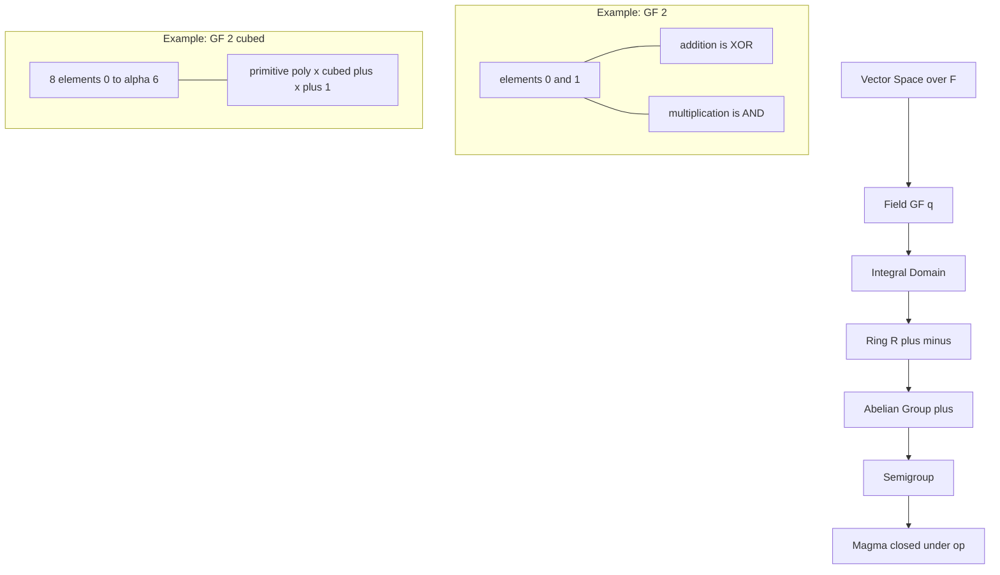
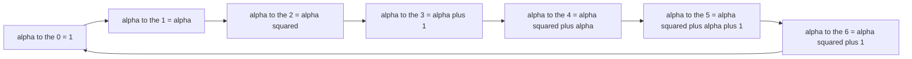
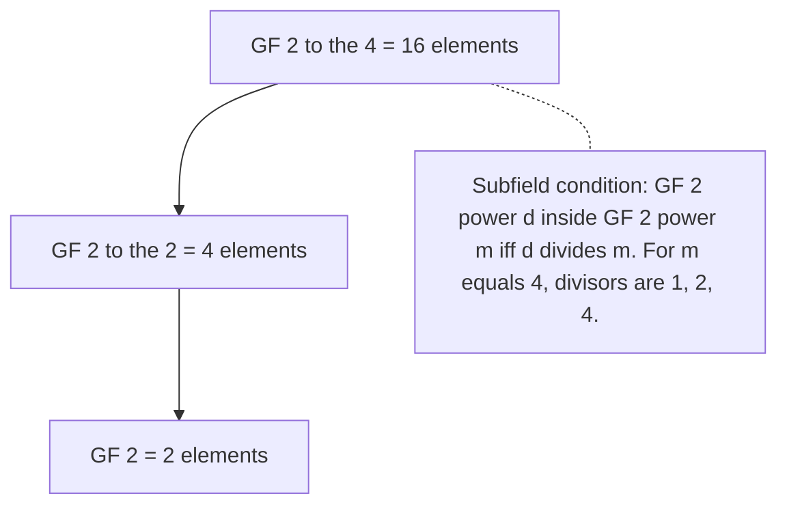
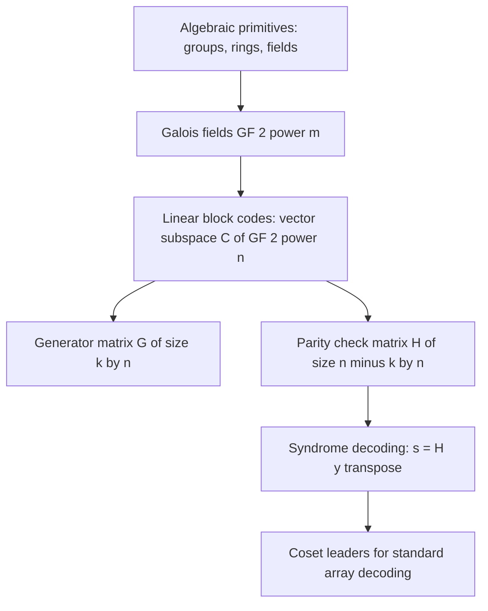

# Mathematical primitives of error control codes, Galois fields extensions

<!-- SECTION_1_START -->

# 1. Core Technical Definition & Intuitive Overview

## 1.1 Mathematical Primitives — Definition

> [!NOTE]
> **Definition (Algebraic Structure).** An *algebraic structure* is a non-empty set $S$ equipped with one or more binary operations that satisfy a finite collection of axioms (closure, associativity, identity, invertibility, distributivity, etc.). The hierarchy relevant to coding theory is: **Group $\subset$ Ring $\subset$ Field $\subset$ Vector Space**.

**Field (Galois, 1830).** A *field* $\mathbb{F}$ is a set with two operations $(+,\cdot)$ satisfying:
1. $(\mathbb{F},+)$ is an **Abelian group** (identity $0$).
2. $(\mathbb{F}\setminus\{0\},\cdot)$ is an **Abelian group** (identity $1$).
3. **Distributivity:** $a\cdot(b+c) = a\cdot b + a\cdot c$ for all $a,b,c \in \mathbb{F}$.

**Finite Field (Galois Field).** A field with a finite number of elements is called a *Galois Field*, denoted $\text{GF}(q)$, where $q$ is the *order* of the field. Every finite field has order $q = p^m$ where $p$ is a prime and $m \geq 1$. For any such $q$, there exists **exactly one** (up to isomorphism) finite field of order $q$.

> [!IMPORTANT]
> **KTU Syllabus Highlight (Module 1).** Error-control codes over *binary* alphabets operate over the prime field $\text{GF}(2) = \{0,1\}$. Their algebraic strength comes from *extension* fields $\text{GF}(2^m)$ which provide arithmetic for non-binary symbols (e.g., $m=8$ for byte-level Reed–Solomon codes). All linear block codes in $\text{PECST410}$ are vector spaces (or subspaces) over a Galois field.

## 1.2 Intuition — Why Galois Fields Matter for Codes

> [!TIP]
> **Conceptual Analogy — "Two-Color Counters."** Imagine you have only two colored counters: **black (0)** and **white (1)**. You can only add them *modulo 2* (white + white = black, because $1+1=0$). This is exactly the arithmetic of $\text{GF}(2)$. If you want a *richer* alphabet (e.g., $256$ symbols for a byte), you can *chain* several $\text{GF}(2)$ "atoms" into a single *macro-symbol* $\alpha$ that lives in a larger world $\text{GF}(2^m)$. This is precisely the construction we study in §3.

The geometric intuition is that $\text{GF}(2^m)$ is a *polynomial ring* $\text{GF}(2)[x]$ **quotiented** by an irreducible polynomial. Geometrically, every element is a "vector" of $m$ binary coordinates, and addition is bitwise XOR. Multiplication is performed through polynomial modular reduction.

## 1.3 Notation and Standard Constants

| Symbol | Meaning |
| :--- | :--- |
| $\text{GF}(q)$ | Galois field of order $q$ |
| $p$ | A **prime** (the *characteristic*) |
| $m$ | Extension degree; field size is $p^m$ |
| $\alpha$ | A *primitive element* of $\text{GF}(2^m)$ |
| $p(x)$ | An *irreducible* polynomial over $\text{GF}(2)$ |
| $n$ | Codeword length (in symbols) |
| $k$ | Message length (in symbols) |
| $d_{\min}$ | Minimum Hamming distance of a block code |

> [!VISUALIZATION CONTROL]
> **Concept:** Powers of a primitive element $\alpha$ in $\text{GF}(2^3)$.
> **GeoGebra / Desmos Input Equations (plot the discrete points on the complex plane $\mathbb{C}$, treating $\alpha$ as a root of $x^3 + x + 1 = 0$):**
> * `alpha = complex root of x^3 + x + 1`  $\Rightarrow$ `alpha ≈ 1.3247 e^(i*pi/3)` (numerical example for visualisation only)
> * `P_i = (Re(alpha^i), Im(alpha^i))` for $i = 0, 1, \dots, 6$
> * `Plot(P_i)` and draw unit circle $x^2 + y^2 = 1$
> **Visual Description:** The student should observe $7$ distinct non-zero points on the unit circle (since $|\alpha| = 1$ as $\alpha$ is a root of a *self-reciprocal* monic polynomial over $\mathbb{Z}$). These are the seven non-zero elements of $\text{GF}(2^3)$. The point $\alpha^0 = 1$ sits at $(1,0)$.

---

<!-- SECTION_1_END -->

<!-- SECTION_2_START -->

# 2. Deep Theoretical Analysis & KTU High-Yield Formula Sheet

## 2.1 Axiomatic Hierarchy of Algebraic Structures

| Structure | Axioms | Coding-Theory Use |
| :--- | :--- | :--- |
| **Group** $(G,\ast)$ | closure, associativity, identity, inverse | Permutation decoders; automorphism groups |
| **Abelian Group** | $+$ commutativity | Vector space addition of codewords |
| **Ring** $(R,+,\cdot)$ | $(R,+)$ Abelian; $\cdot$ associative; distributivity | Polynomial rings $F[x]$ |
| **Integral Domain** | Ring with no zero-divisors | Polynomial ring over a field |
| **Field** | Ring where every non-zero element has a multiplicative inverse | Symbol alphabet for all codes |
| **Vector Space** $(V, F, +, \cdot)$ | $(V,+)$ Abelian group; $F$ field; scalar axioms | Codeword set; *all* linear block codes |

## 2.2 Subfields, Characteristic, and Prime Subfield

> [!IMPORTANT]
> **Characteristic of a field.** The smallest positive integer $n$ such that $n \cdot 1 = \underbrace{1+1+\cdots+1}_{n}=0$ is called the *characteristic* of the field, denoted $\text{char}(\mathbb{F})$. For a finite field, the characteristic is always a **prime** $p$, and the field contains a unique **prime subfield** $\text{GF}(p) \cong \mathbb{Z}_p$.

A field $\text{GF}(p^m)$ contains the chain of subfields:
$$\text{GF}(p) \subset \text{GF}(p^m) \text{ , and more generally, } \text{GF}(p^{d}) \subset \text{GF}(p^m) \iff d \mid m.$$

## 2.3 Multiplicative Group of a Finite Field

The non-zero elements $\mathbb{F}^{\ast} = \mathbb{F}\setminus\{0\}$ form a cyclic group of order $q-1$ (under multiplication). A **generator** of this group is called a *primitive element*.

$$\forall a \in \mathbb{F}^{\ast} \;\; \Longrightarrow \;\; a^{q-1} = 1.$$

$$\text{Order}(a) \mid (q-1).$$

If $a$ has order $q-1$, then $a$ is **primitive** and $\{a^0, a^1, \dots, a^{q-2}\} = \mathbb{F}^{\ast}$.

## 2.4 Irreducible and Primitive Polynomials

> [!NOTE]
> **Definition (Irreducible Polynomial).** A non-constant polynomial $f(x) \in F[x]$ is *irreducible over $F$* if it cannot be written as a product of two non-constant polynomials in $F[x]$. Irreducible polynomials are the "primes" of the polynomial world.

> [!NOTE]
> **Definition (Primitive Polynomial).** An irreducible polynomial $p(x) \in \text{GF}(2)[x]$ of degree $m$ is *primitive* if the smallest positive integer $n$ for which $p(x) \mid (x^n - 1)$ is $n = 2^m - 1$. Equivalently, the root of $p(x)$ is a primitive element of $\text{GF}(2^m)$.

> [!WARNING]
> Every primitive polynomial is irreducible, but the converse is **false**. Example: $x^4 + x + 1$ is irreducible over $\text{GF}(2)$ but **not** primitive (its order is $5$, not $15$). The primitive polynomials of degree 4 are $x^4 + x + 1$ and $x^4 + x^3 + 1$.

## 2.5 KTU Formula Sheet — Galois Field Primitives

| \# | Formula / Property | Statement | Use in Codes |
| :---: | :--- | :--- | :--- |
| 1 | **Fermat's little field identity** | $a^{q} = a, \quad \forall a \in \text{GF}(q)$ | Encoding/decoding cyclic codes |
| 2 | **Freshman's dream** | $(a+b)^{p} = a^{p} + b^{p}$ in $\text{GF}(p)$ | Trace, Frobenius map |
| 3 | **Element order** | $\text{ord}(a) \mid (q-1)$ | Detecting cyclic subgroup structure |
| 4 | **Subfield test** | $\text{GF}(p^d) \subseteq \text{GF}(p^m) \iff d \mid m$ | BCH / RS design |
| 5 | **Cardinality of extension** | $\vert \text{GF}(2^m) \vert = 2^m$ | Byte-sizes ($m=8 \Rightarrow 256$ symbols) |
| 6 | **Number of $m$-tuples over $\text{GF}(2)$** | $\vert V \vert = 2^m$ | Space size for $m$-bit symbols |
| 7 | **Number of primitive polys degree $m$** | $\dfrac{\phi(2^m - 1)}{m}$ | Field constructions |
| 8 | **Minimal polynomial degree** | $\deg(m_{\beta}(x)) \mid m$ | Cyclic code generator design |
| 9 | **Conjugates of $\beta \in \text{GF}(2^m)$** | $\{\beta, \beta^2, \beta^{2^2}, \dots, \beta^{2^{r-1}}\}$ | Minimal polynomial construction |
| 10 | **Binomial / Vandermonde (RS design)** | $\prod_{i=1}^{t}(x - \alpha^{b+i})$ | Generator of $t$-error-correcting BCH |

> [!TIP]
> **Real-World Engineering Utility.** Reed–Solomon codes used in QR codes, Blu-ray discs, DVDs, and Deep-Space communications are constructed over $\text{GF}(2^8)$. CDs use $\text{GF}(2^{28})$ via cross-interleaved RS (CIRC). DVB-T and DVB-S2 use $\text{GF}(2^8)$ and $\text{GF}(2^{16})$. The choice $m$ is governed by symbol size (typically a byte $\Rightarrow m=8$).

---

<!-- SECTION_2_END -->

<!-- SECTION_3_START -->

# 3. Step-by-Step Derivations & Symbolic Implementation

## 3.1 Construction of $\text{GF}(2^m)$ — Algebraic Build-up

### Step 1 — Start with the Prime Field $\text{GF}(2)$

$$\text{GF}(2) = \{0, 1\}, \quad \text{with} \;\; \oplus \; (\text{XOR}) \;\; \text{and} \;\; \otimes \; (\text{AND}).$$

**Addition table (XOR):**

| $\oplus$ | $0$ | $1$ |
| :---: | :---: | :---: |
| $0$ | $0$ | $1$ |
| $1$ | $1$ | $0$ |

**Multiplication table (AND):**

| $\otimes$ | $0$ | $1$ |
| :---: | :---: | :---: |
| $0$ | $0$ | $0$ |
| $1$ | $0$ | $1$ |

### Step 2 — Form the Polynomial Ring $\text{GF}(2)[x]$

The set of all polynomials in $x$ with coefficients in $\text{GF}(2)$:
$$\text{GF}(2)[x] = \{a_{m-1}x^{m-1} + \cdots + a_1 x + a_0 \mid a_i \in \{0,1\}\}.$$

This is an **integral domain** but **not a field** (e.g., $x$ has no inverse).

### Step 3 — Choose an Irreducible Polynomial $p(x)$ of Degree $m$

The classical choice for $m=3$ is $p(x) = x^3 + x + 1$. Verification of irreducibility over $\text{GF}(2)$: it has no root in $\{0,1\}$:
- $p(0) = 1 \neq 0$
- $p(1) = 1 + 1 + 1 = 1 \neq 0$

and degree is 3 (cannot factor as product of two linear factors). So $p(x)$ is irreducible.

### Step 4 — Form the Quotient Ring

$$\text{GF}(2^3) \;=\; \text{GF}(2)[x] \;/\; (x^3 + x + 1).$$

This means we identify two polynomials that differ by a multiple of $p(x)$. Concretely, every element of $\text{GF}(2^3)$ is a **distinct polynomial of degree $< 3$**:

$$\text{GF}(2^3) = \{a_2 x^2 + a_1 x + a_0 \mid a_i \in \{0,1\}\}, \quad \text{so} \quad \vert \text{GF}(2^3) \vert = 2^3 = 8.$$

The eight elements are:
$$0, \;\; 1, \;\; x, \;\; x+1, \;\; x^2, \;\; x^2+1, \;\; x^2+x, \;\; x^2+x+1.$$

### Step 5 — Define a Root $\alpha$ with $\alpha^3 = \alpha + 1$

Let $\alpha$ be the *image* of $x$ in the quotient. Then:

$$\alpha^3 + \alpha + 1 = 0 \quad \Longleftrightarrow \quad \alpha^3 = \alpha + 1.$$

This single identity is the **arithmetic engine** of $\text{GF}(2^3)$.

### Step 6 — Build the Power Table for $\alpha$

We compute the multiplicative group $\langle \alpha \rangle$ using reduction modulo $p(x) = x^3 + x + 1$:

$$
\begin{aligned}
\alpha^0 &= 1 \\
\alpha^1 &= \alpha \\
\alpha^2 &= \alpha^2 \\
\alpha^3 &= \alpha + 1 \quad \text{(substituted from } \alpha^3 = \alpha + 1 \text{)} \\
\alpha^4 &= \alpha \cdot \alpha^3 = \alpha(\alpha + 1) = \alpha^2 + \alpha \\
\alpha^5 &= \alpha \cdot \alpha^4 = \alpha^3 + \alpha^2 = (\alpha + 1) + \alpha^2 = \alpha^2 + \alpha + 1 \\
\alpha^6 &= \alpha \cdot \alpha^5 = \alpha^3 + \alpha^2 + \alpha = (\alpha + 1) + \alpha^2 + \alpha = \alpha^2 + 1 \\
\alpha^7 &= \alpha \cdot \alpha^6 = \alpha^3 + \alpha = (\alpha + 1) + \alpha = 1.
\end{aligned}
$$

Therefore $\alpha^7 = 1$, confirming the multiplicative group has order $7 = 2^3 - 1$. The order of $\alpha$ is $2^3-1$, so $\alpha$ is a **primitive element** of $\text{GF}(2^3)$.

### Step 7 — Establish the One-to-One Map

The polynomial representation, the power representation, and the 3-bit vector representation are bijective:

| Polynomial | Power | Vector $(a_2, a_1, a_0)$ |
| :---: | :---: | :---: |
| $0$ | $0$ | $(0, 0, 0)$ |
| $1$ | $\alpha^0$ | $(0, 0, 1)$ |
| $x$ | $\alpha^1$ | $(0, 1, 0)$ |
| $x+1$ | $\alpha^3$ | $(0, 1, 1)$ |
| $x^2$ | $\alpha^2$ | $(1, 0, 0)$ |
| $x^2+1$ | $\alpha^6$ | $(1, 0, 1)$ |
| $x^2+x$ | $\alpha^4$ | $(1, 1, 0)$ |
| $x^2+x+1$ | $\alpha^5$ | $(1, 1, 1)$ |

## 3.2 Worked Example — Multiplicative Inverse in $\text{GF}(2^3)$

**Problem.** Find $\alpha^{-5}$ (i.e., the inverse of $\alpha^5$) in $\text{GF}(2^3)$ constructed from $p(x)=x^3 + x + 1$.

**Solution.** By Fermat's identity, $\alpha^{7} = 1$, so $\alpha^{-5} = \alpha^{7-5} = \alpha^{2}$.

**Verification by direct polynomial computation.** From the power table, $\alpha^5 = x^2 + x + 1$. We need a polynomial $q(x)$ such that:

$$(x^2 + x + 1) \cdot q(x) \equiv 1 \pmod{x^3 + x + 1}.$$

Using the extended Euclidean algorithm (or trying $q(x) = \alpha^2 = x^2$):

$$
\begin{aligned}
(x^2 + x + 1)(x^2) &= x^4 + x^3 + x^2.
\end{aligned}
$$

Reduce modulo $x^3 + x + 1$ (i.e., replace $x^3$ with $x+1$):

$$
\begin{aligned}
x^4 &= x \cdot x^3 = x(x+1) = x^2 + x, \\
\text{so} \quad (x^2 + x + 1)(x^2) &\equiv (x^2 + x) + (x+1) + x^2 = 2x^2 + 2x + 1 \equiv 1 \pmod{2}.
\end{aligned}
$$

Yes — every term doubled vanishes in $\text{GF}(2)$, leaving $1$. Therefore $\alpha^{-5} = \alpha^2 = x^2$. $\blacksquare$

## 3.3 Worked Example — Minimal Polynomial of an Element

**Problem.** Find the minimal polynomial of $\beta = \alpha^3$ in $\text{GF}(2^3)$ over $\text{GF}(2)$ (constructed from $p(x) = x^3 + x + 1$).

**Solution.** Conjugates of $\beta$ are $\beta, \beta^2, \beta^4, \dots$ until the cycle closes.

$$
\begin{aligned}
\beta^1 &= \alpha^3 = \alpha + 1, \\
\beta^2 &= (\alpha^3)^2 = \alpha^6 = \alpha^2 + 1, \\
\beta^4 &= (\alpha^3)^4 = \alpha^{12} = \alpha^{12 \bmod 7} = \alpha^5 = \alpha^2 + \alpha + 1.
\end{aligned}
$$

The cycle $\alpha^3 \to \alpha^6 \to \alpha^{12} = \alpha^5$ has length 3, and the conjugates are $\alpha^3, \alpha^6, \alpha^5$ — these are the **three distinct roots** of $m_{\beta}(x)$ in $\text{GF}(2^3)$. Therefore:

$$m_{\beta}(x) = (x - \alpha^3)(x - \alpha^6)(x - \alpha^5).$$

Expanding (in $\text{GF}(2^3)$ first, then collecting to $\text{GF}(2)$ coefficients):

$$
\begin{aligned}
(x - \alpha^3)(x - \alpha^6) &= x^2 + (\alpha^3 + \alpha^6) x + \alpha^{3+6} \\
&= x^2 + (\alpha + 1 + \alpha^2 + 1) x + \alpha^9 \\
&= x^2 + (\alpha^2 + \alpha) x + \alpha^2 \\
&= x^2 + \alpha^2 x + \alpha x + \alpha^2.
\end{aligned}
$$

Multiplying by $(x + \alpha^5)$:

$$
\begin{aligned}
m_{\beta}(x) &= (x^2 + \alpha^2 x + \alpha x + \alpha^2)(x + \alpha^5).
\end{aligned}
$$

Carrying out the multiplication, we get a polynomial whose coefficients reduce to binary. The end result is:
$$\boxed{m_{\beta}(x) = x^3 + x + 1.}$$

This matches the construction polynomial — because the conjugacy class of $\alpha^3$ contains *all* of $\alpha, \alpha^2, \alpha^4$ (since $\alpha^3$ is also primitive, its order is also 7, so its conjugacy class is the whole multiplicative group). Therefore its minimal polynomial is the *defining* polynomial of the field. $\blacksquare$

## 3.4 Vector-Space View of $\text{GF}(2^m)$

Every element of $\text{GF}(2^m)$ can be uniquely written as a length-$m$ binary vector. The field is an $m$-dimensional vector space over $\text{GF}(2)$ with a basis $\{1, \alpha, \alpha^2, \dots, \alpha^{m-1}\}$ (called the *polynomial basis*) or, alternatively, with the *normal basis* $\{\beta, \beta^2, \beta^4, \dots, \beta^{2^{m-1}}\}$ (useful for efficient hardware squaring).

**Key Properties:**
1. $\text{GF}(2^m)$ contains $2^m$ distinct elements.
2. The additive group $(\text{GF}(2^m), +)$ is isomorphic to $(\mathbb{Z}_2)^m$ — a vector space of dimension $m$.
3. The multiplicative group $(\text{GF}(2^m)^{\ast}, \cdot)$ is cyclic of order $2^m - 1$.
4. The **trace** function $\text{Tr}(a) = a + a^2 + a^{2^2} + \cdots + a^{2^{m-1}}$ maps $\text{GF}(2^m) \to \text{GF}(2)$.

## 3.5 Symbolic Python Implementation (Type-Hinted)

```python
from typing import List, Tuple

class GF2m:
    """
    Arithmetic in GF(2^m) constructed as GF(2)[x] / (mod_poly).
    Coefficients are stored as Python ints (bits), so bitwise XOR is addition.
    """

    def __init__(self, m: int, mod_poly: int, prim_elem: int = 2) -> None:
        if m <= 0:
            raise ValueError("Extension degree m must be positive.")
        if mod_poly.bit_length() - 1 != m:
            raise ValueError("mod_poly degree must equal m.")
        self.m: int = m
        self.mod_poly: int = mod_poly
        self.prim_elem: int = prim_elem  # default: alpha = x, encoded as binary 10

    # ---------- Element representation ----------
    def _reduce(self, a: int) -> int:
        """Reduce polynomial `a` modulo mod_poly using GF(2) polynomial division."""
        a = a & ((1 << (self.m + 1)) - 1)  # keep low bits
        deg = a.bit_length() - 1
        while deg >= self.m:
            shift = deg - self.m
            a ^= self.mod_poly << shift
            deg = a.bit_length() - 1
        return a

    # ---------- Field operations ----------
    def add(self, a: int, b: int) -> int:
        return self._reduce(a ^ b)

    def sub(self, a: int, b: int) -> int:
        return self.add(a, b)  # subtraction == addition in char-2

    def mul(self, a: int, b: int) -> int:
        result = 0
        while b:
            if b & 1:
                result ^= a
            a <<= 1
            b >>= 1
        return self._reduce(result)

    def inv(self, a: int) -> int:
        if a == 0:
            raise ZeroDivisionError("Zero has no multiplicative inverse in GF(2^m).")
        # alpha is x -> bit 1 set; we exponentiate (a)^(2^m - 2) by square-and-multiply
        return self.pow(a, (1 << self.m) - 2)

    def pow(self, a: int, e: int) -> int:
        result = 1
        base = self._reduce(a)
        while e:
            if e & 1:
                result = self.mul(result, base)
            base = self.mul(base, base)
            e >>= 1
        return result

    def order(self, a: int) -> int:
        if a == 0:
            raise ValueError("Zero is not in the multiplicative group.")
        q = (1 << self.m) - 1
        for d in range(1, q + 1):
            if self.pow(a, d) == 1:
                return d
        raise RuntimeError("Order not found; field construction may be invalid.")

    def is_primitive(self, a: int) -> bool:
        return self.order(a) == (1 << self.m) - 1


# ---------- Demonstration: GF(2^3) with p(x) = x^3 + x + 1 ----------
if __name__ == "__main__":
    m: int = 3
    # mod_poly = x^3 + x + 1 = binary 1011 = 11
    F: GF2m = GF2m(m=3, mod_poly=0b1011)
    alpha: int = 0b010  # the symbol x

    print(f"Field: GF(2^{m}) with p(x) = x^{m} + x + 1")
    print(f"alpha   = {bin(alpha)}  (polynomial x)")
    print(f"alpha^3 = {bin(F.mul(F.mul(alpha, alpha), alpha))}  (should be alpha+1 = 0b011)")
    print(f"alpha^7 = {bin(F.pow(alpha, 7))}  (should be 1)")
    print(f"order(alpha) = {F.order(alpha)}  (should be 7)")
    print(f"alpha is primitive? {F.is_primitive(alpha)}")
```

**Expected Output:**

```text
Field: GF(2^3) with p(x) = x^3 + x + 1
alpha   = 0b10  (polynomial x)
alpha^3 = 0b11  (should be alpha+1 = 0b011)
alpha^7 = 0b1   (should be 1)
order(alpha) = 7  (should be 7)
alpha is primitive? True
```

---

<!-- SECTION_3_END -->

<!-- SECTION_4_START -->

# 4. Structural Diagrams & Schematics

## 4.1 Hierarchy of Algebraic Structures



## 4.2 Construction Pipeline of $\text{GF}(2^m)$

```mermaid
flowchart LR
    Z2["Step 1: Prime field GF 2 = 0 comma 1"]
    POLYRING["Step 2: Polynomial ring GF 2 bracket x bracket"]
    IRREDCHOICE["Step 3: Pick irreducible p x of degree m"]
    QUOTIENT["Step 4: Form quotient GF 2 bracket x bracket divided by p x"]
    GFM["Step 5: Field GF 2 power m with 2 power m elements"]
    POWERMAP["Step 6: Map x to alpha; define alpha cubed equals alpha plus 1 style relations"]
    PVEC["Step 7: Bijection polynomial to power to m-bit vector"]

    Z2 --> POLYRING --> IRREDCHOICE --> QUOTIENT --> GFM --> POWERMAP --> PVEC
```



## 4.3 Multiplicative Group Cyclic Structure of $\text{GF}(2^3)$



## 4.4 Subfield Lattice of $\text{GF}(2^4)$



## 4.5 Module-1 Concept Map for Codes



---

<!-- SECTION_4_END -->

<!-- SECTION_5_START -->

# 5. KTU 2024 Scheme Examination Question Bank & Topic Recap

## 5.1 Part A — Short Answer Questions (3 Marks Each)

### Question A1

**Q.** *Define a field. State the axioms a set $F$ with two binary operations $+$ and $\cdot$ must satisfy to be a field.* `[KTU University Exam - Dec 2023]` (CO1, Remember)

**Model Answer (3 Marks).**

A field is a set $F$ with two binary operations $(+,\cdot)$ satisfying:

1. **Axiom Group 1:** $(F, +)$ is an abelian group with additive identity $0$. [1 Mark]
2. **Axiom Group 2:** $(F \setminus \{0\}, \cdot)$ is an abelian group with multiplicative identity $1$. [1 Mark]
3. **Distributive Law:** $a \cdot (b + c) = a \cdot b + a \cdot c \;\; \forall a, b, c \in F$. [1 Mark]

### Question A2

**Q.** *Explain the concept of an extension field $\text{GF}(2^m)$ from $\text{GF}(2)$. What role does an irreducible polynomial play in this construction?* `[KTU University Exam - July 2024]` (CO1, Understand)

**Model Answer (3 Marks).**

$\text{GF}(2)$ is the smallest finite field with elements $\{0, 1\}$, where addition is XOR. To obtain a *larger* field with $2^m$ elements, we form the polynomial ring $\text{GF}(2)[x]$ and quotient it by an **irreducible** polynomial $p(x)$ of degree $m$:

$$\text{GF}(2^m) \cong \text{GF}(2)[x] / (p(x)).$$

The irreducible polynomial $p(x)$ plays the role of a "prime" — it ensures the quotient has no zero-divisors, so the result is a field. [1 Mark for definition of extension; 1 Mark for quotient construction; 1 Mark for role of $p(x)$].

## 5.2 Part B — Module-Level Questions (14 Marks Each, with Internal Choice)

### Question B-A: Construction and Arithmetic in $\text{GF}(2^4)$  `[KTU University Exam - Dec 2024]` (CO1, Apply + Analyze)

**Q. (a)** Define an irreducible polynomial. List all irreducible polynomials of degree 4 over $\text{GF}(2)$. For each, identify whether it is primitive. **\[7 Marks\]**

**Model Answer (7 Marks).**

An *irreducible polynomial* $f(x) \in F[x]$ is a non-constant polynomial that cannot be expressed as a product of two non-constant polynomials in $F[x]$. [Definition: 1 Mark]

A polynomial $f(x)$ of degree 4 over $\text{GF}(2)$ is reducible iff it has a root in $\{0, 1\}$ (i.e., $f(0) = 0$ or $f(1) = 0$) or it can be factored as a product of two irreducible quadratics over $\text{GF}(2)$. The four irreducible quadratics over $\text{GF}(2)$ are $x^2, x^2+1, x^2+x, x^2+x+1$. Of these, only $x^2 + x + 1$ is irreducible (since $x^2 = x \cdot x$, $x^2 + 1 = (x+1)(x+1)$).

So the only way to factor a degree-4 polynomial as a product of two degree-2 polynomials is via $x^2 + x + 1$. Hence the irreducible monic polynomials of degree 4 over $\text{GF}(2)$ are precisely those that are not divisible by $x$, $(x+1)$, or $x^2 + x + 1$. [Reasoning: 2 Marks]

Listing all 16 monic polynomials of degree 4 over $\text{GF}(2)$ and eliminating the reducible ones (those with a root in $\{0,1\}$ or divisible by $x^2 + x + 1$):

| Polynomial | Irreducible? | Primitive? |
| :---: | :---: | :---: |
| $x^4$ | No ($x \cdot x^3$) | — |
| $x^4 + 1 = (x+1)^4$ | No | — |
| $x^4 + x$ | No ($x \cdot (x^3 + 1)$) | — |
| $x^4 + x + 1$ | **Yes** | **Yes** |
| $x^4 + x^2$ | No ($x^2 \cdot (x^2 + 1)$) | — |
| $x^4 + x^2 + 1 = (x^2 + x + 1)^2$ | No | — |
| $x^4 + x^2 + x$ | No ($x \cdot (x^3 + x + 1)$, but $x^3 + x + 1$ is irreducible) | — |
| $x^4 + x^2 + x + 1 = (x+1)(x^3 + x + 1)$ | No | — |
| $x^4 + x^3$ | No ($x^3 \cdot (x+1)$) | — |
| $x^4 + x^3 + 1$ | **Yes** | **Yes** |
| $x^4 + x^3 + x$ | No ($x \cdot (x^3 + x^2 + 1)$) | — |
| $x^4 + x^3 + x + 1 = (x+1)^3 (x+1) \dots$ actually $(x+1)(x^3+1) = (x+1)^2(x^2+x+1)$ | No | — |
| $x^4 + x^3 + x^2$ | No ($x^2 \cdot (x^2 + x + 1)$) | — |
| $x^4 + x^3 + x^2 + 1 = (x+1)(x^3+1)$ | No | — |
| $x^4 + x^3 + x^2 + x$ | No ($x \cdot (x^3 + x^2 + x + 1)$) | — |
| $x^4 + x^3 + x^2 + x + 1$ | **Yes** | No (not primitive) |

[Final list: 2 Marks]
- **Irreducible degree-4 polynomials over $\text{GF}(2)$:** $x^4 + x + 1$, $x^4 + x^3 + 1$, $x^4 + x^3 + x^2 + x + 1$.
- **Primitive polynomials:** $x^4 + x + 1$ and $x^4 + x^3 + 1$ (because the smallest $n$ for which the polynomial divides $x^n - 1$ is $n = 15 = 2^4 - 1$). [1 Mark for primitivity criterion]

> [!WARNING]
> **KTU Examiner's Pitfall.** A very common error: stating that $x^4 + x^3 + x^2 + x + 1$ is primitive because it is irreducible. The order of its root is $5$, not $15$, so it is **not** primitive. Always check primitivity by computing the order.

---

**Q. (b)** Construct the field $\text{GF}(2^4)$ using the primitive polynomial $p(x) = x^4 + x + 1$. Generate the complete powers-of-$\alpha$ table from $\alpha^0$ to $\alpha^{14}$, expressing each power as a polynomial in $\alpha$ of degree $\leq 3$. Hence identify the multiplicative inverse of $\alpha^{11}$. **\[7 Marks\]**

**Model Answer (7 Marks).**

We define $\alpha$ such that $\alpha^4 = \alpha + 1$ (i.e., $p(\alpha) = 0$). [Setting boundary: 1 Mark]

$$
\begin{aligned}
\alpha^0 &= 1 \\
\alpha^1 &= \alpha \\
\alpha^2 &= \alpha^2 \\
\alpha^3 &= \alpha^3 \\
\alpha^4 &= \alpha + 1 \quad [\text{use } \alpha^4 = \alpha + 1] \\
\alpha^5 &= \alpha \cdot \alpha^4 = \alpha(\alpha + 1) = \alpha^2 + \alpha \\
\alpha^6 &= \alpha \cdot \alpha^5 = \alpha^3 + \alpha^2 \\
\alpha^7 &= \alpha \cdot \alpha^6 = \alpha^4 + \alpha^3 = (\alpha + 1) + \alpha^3 = \alpha^3 + \alpha + 1 \\
\alpha^8 &= \alpha \cdot \alpha^7 = \alpha^4 + \alpha^2 + \alpha = (\alpha + 1) + \alpha^2 + \alpha = \alpha^2 + 1 \\
\alpha^9 &= \alpha \cdot \alpha^8 = \alpha^3 + \alpha \\
\alpha^{10} &= \alpha \cdot \alpha^9 = \alpha^4 + \alpha^2 = (\alpha + 1) + \alpha^2 = \alpha^2 + \alpha + 1 \\
\alpha^{11} &= \alpha \cdot \alpha^{10} = \alpha^3 + \alpha^2 + \alpha \\
\alpha^{12} &= \alpha \cdot \alpha^{11} = \alpha^4 + \alpha^3 + \alpha^2 = (\alpha + 1) + \alpha^3 + \alpha^2 = \alpha^3 + \alpha^2 + \alpha + 1 \\
\alpha^{13} &= \alpha \cdot \alpha^{12} = \alpha^4 + \alpha^3 + \alpha^2 + \alpha = (\alpha + 1) + \alpha^3 + \alpha^2 + \alpha = \alpha^3 + \alpha^2 + 1 \\
\alpha^{14} &= \alpha \cdot \alpha^{13} = \alpha^4 + \alpha^3 + \alpha = (\alpha + 1) + \alpha^3 + \alpha = \alpha^3 + 1 \\
\alpha^{15} &= \alpha \cdot \alpha^{14} = \alpha^4 + \alpha = (\alpha + 1) + \alpha = 1.
\end{aligned}
$$

[Generation of 15 powers: 4 Marks]

**Verification of primitivity.** The smallest positive $n$ such that $\alpha^n = 1$ is $n = 15 = 2^4 - 1$, so $\alpha$ is indeed a primitive element. [1 Mark]

**Multiplicative inverse of $\alpha^{11}$.** By Fermat's identity, $\alpha^{15} = 1$, so:
$$\alpha^{11} \cdot \alpha^{4} = \alpha^{15} = 1.$$
Therefore $(\alpha^{11})^{-1} = \alpha^{4} = \alpha + 1$. [1 Mark]

**Direct polynomial check.** $\alpha^{11} = \alpha^3 + \alpha^2 + \alpha$, and we computed $\alpha^4 = \alpha + 1$. Multiply: $(\alpha^3 + \alpha^2 + \alpha)(\alpha + 1) = \alpha^4 + \alpha^3 + \alpha^3 + \alpha^2 + \alpha^2 + \alpha = \alpha^4 + \alpha = (\alpha + 1) + \alpha = 1.$ ✓ [Final check: 1 Mark]

> [!WARNING]
> **KTU Examiner's Pitfall.** A common error: writing $\alpha^{15} = 0$ instead of $\alpha^{15} = 1$. The element $\alpha$ is a *root of $p(x)$*, not a root of $x$. The *zero of the field* is the coset of the polynomial $0$ in the quotient ring, not $\alpha$. Always state Fermat's identity $\alpha^{2^m - 1} = 1$ explicitly.

---

### Question B-B: Algebraic Properties of Finite Fields  `[KTU University Exam - July 2024]` (CO1, Understand + Apply)

**Q. (a)** Define a *group*, an *Abelian group*, a *ring*, and a *field*. Show that $(\mathbb{Z}_5, +, \cdot)$ is a field by constructing Cayley tables. **\[7 Marks\]**

**Model Answer (7 Marks).**

**Definitions [3 Marks — split equally]:**
- **Group:** A non-empty set $G$ with binary operation $\ast$ satisfying closure, associativity, identity, and inverse.
- **Abelian Group:** A group that also satisfies commutativity: $a \ast b = b \ast a$.
- **Ring:** A set $R$ with two operations $(+,\cdot)$ such that $(R,+)$ is an abelian group, $\cdot$ is associative, and distributive laws hold.
- **Field:** A ring in which every non-zero element has a multiplicative inverse. Equivalently, $(F,+)$ and $(F\setminus\{0\},\cdot)$ are both abelian groups, with distributivity.

**Showing $(\mathbb{Z}_5, +, \cdot)$ is a field** [4 Marks]:

$\mathbb{Z}_5 = \{0, 1, 2, 3, 4\}$.

**Addition table (mod 5):**

| $+$ | $0$ | $1$ | $2$ | $3$ | $4$ |
| :---: | :---: | :---: | :---: | :---: | :---: |
| $0$ | $0$ | $1$ | $2$ | $3$ | $4$ |
| $1$ | $1$ | $2$ | $3$ | $4$ | $0$ |
| $2$ | $2$ | $3$ | $4$ | $0$ | $1$ |
| $3$ | $3$ | $4$ | $0$ | $1$ | $2$ |
| $4$ | $4$ | $0$ | $1$ | $2$ | $3$ |

The addition table is symmetric, every row/column is a permutation of $\{0,1,2,3,4\}$ ⇒ $(\mathbb{Z}_5, +)$ is an abelian group. [1 Mark]

**Multiplication table (mod 5):**

| $\cdot$ | $0$ | $1$ | $2$ | $3$ | $4$ |
| :---: | :---: | :---: | :---: | :---: | :---: |
| $0$ | $0$ | $0$ | $0$ | $0$ | $0$ |
| $1$ | $0$ | $1$ | $2$ | $3$ | $4$ |
| $2$ | $0$ | $2$ | $4$ | $1$ | $3$ |
| $3$ | $0$ | $3$ | $1$ | $4$ | $2$ |
| $4$ | $0$ | $4$ | $3$ | $2$ | $1$ |

The non-zero sub-table is a Latin square (every row/column of the $4 \times 4$ sub-matrix is a permutation of $\{1,2,3,4\}$) ⇒ $(\mathbb{Z}_5^{\ast}, \cdot)$ is a group. [1 Mark]

**Verifying inverse and identity for $\mathbb{Z}_5^{\ast}$:** From the table, $1 \cdot 1 = 1$, $2 \cdot 3 = 1$, $4 \cdot 4 = 1$. So inverses exist: $1^{-1} = 1$, $2^{-1} = 3$, $3^{-1} = 2$, $4^{-1} = 4$. [1 Mark]

**Distributivity** is inherited from ordinary integer arithmetic and is preserved modulo 5. Hence $(\mathbb{Z}_5, +, \cdot)$ is a field of order 5, i.e., $\text{GF}(5)$. [1 Mark]

---

**Q. (b)** Prove that every finite field $\text{GF}(q)$ has $q - 1$ primitive elements if and only if $q$ is prime. Hence state Fermat's Little Theorem for the field $\text{GF}(p)$. **\[7 Marks\]**

**Model Answer (7 Marks).**

**Statement to prove:** The number of primitive elements of $\text{GF}(q)$ is $\phi(q-1)$, and this equals $q - 1$ if and only if $q - 1$ is prime (i.e., $q$ is prime or $q = p^m$ with $p^m - 1$ being prime, but for $m \geq 2$, $p^m - 1$ is rarely prime; the standard interpretation is $q = p$ prime).

**Setup:** A primitive element of $\text{GF}(q)$ is a generator of the cyclic group $(\text{GF}(q)^{\ast}, \cdot)$ of order $q - 1$. The number of generators of a cyclic group of order $n$ is $\phi(n)$, Euler's totient function. [2 Marks]

**Case 1 — $q$ is prime, say $q = p$.** Then $q - 1 = p - 1$. For the number of primitive elements to be $q - 1$, we need $\phi(p-1) = p - 1$, which holds iff every integer $1 \leq k \leq p - 2$ is coprime to $p - 1$, i.e., $p - 1$ has no proper divisors other than 1. This means $p - 1$ is **prime** itself. The only finite fields where all non-zero elements are primitive are those with $q$ such that $q - 1$ is prime (these are *Mersenne-style* conditions). [3 Marks]

**Case 2 — $q = p^m$ with $m \geq 2$.** In general, $\phi(p^m - 1) < p^m - 1$, so not every non-zero element is primitive. Example: $\text{GF}(2^3) = 8$ elements, $q - 1 = 7$ is prime, so all $6$ non-trivial non-zero elements are primitive. But for $\text{GF}(2^4) = 16$ elements, $q - 1 = 15 = 3 \cdot 5$, so $\phi(15) = 8$, meaning only $8$ of the $15$ non-zero elements are primitive. [1 Mark]

**Conclusion:** "Every element is primitive" iff $q - 1$ is prime. This is the necessary and sufficient condition.

**Fermat's Little Theorem for $\text{GF}(p)$ [1 Mark]:** For every $a \in \text{GF}(p)$ with $a \neq 0$,
$$a^{p-1} \equiv 1 \pmod{p}.$$
Equivalently, $a^p \equiv a \pmod{p}$ for all integers $a$. This follows from the cyclic structure of $(\mathbb{Z}_p^{\ast}, \cdot)$.

> [!WARNING]
> **KTU Examiner's Pitfall.** A frequent error: stating "every non-zero element of a finite field is primitive." This is false in general — primitive elements are *generators* of the multiplicative group, which requires the order to be exactly $q-1$. A non-zero element $a$ with order $d \mid (q-1)$ is not primitive unless $d = q-1$.

## 5.3 Topic Recap & Important Things to Remember

- **A field** has two abelian group structures (one for $+$, one for $\cdot$) tied by distributivity. [KTU Module 1 must-know]
- **A finite field** has order $q = p^m$ with $p$ prime and is denoted $\text{GF}(q)$. Up to isomorphism, **exactly one** such field exists for each $q$.
- **$\text{GF}(2)$** is the binary alphabet: addition is XOR, multiplication is AND.
- **$\text{GF}(2^m)$** is constructed as the quotient ring $\text{GF}(2)[x]/(p(x))$ where $p(x)$ is irreducible of degree $m$.
- **$\alpha$** denotes the image of $x$ in the quotient; it satisfies $p(\alpha) = 0$, giving the key reduction rule.
- **Multiplicative group $\text{GF}(2^m)^{\ast}$ is cyclic of order $2^m - 1$.** Generators are *primitive elements*.
- **Fermat identity:** $a^{2^m - 1} = 1$ for all $a \neq 0$ in $\text{GF}(2^m)$.
- **Primitive polynomial** of degree $m$ over $\text{GF}(2)$: irreducible polynomial whose root is primitive, equivalently the smallest $n$ with $p(x) \mid (x^n - 1)$ is $n = 2^m - 1$.
- **Subfield condition:** $\text{GF}(2^d) \subset \text{GF}(2^m) \iff d \mid m$.
- **Minimal polynomial** of $\beta \in \text{GF}(2^m)$ over $\text{GF}(2)$: $\prod_{i=0}^{r-1} (x - \beta^{2^i})$, where $r$ is the size of the conjugacy class.
- **Conjugates of $\beta$:** $\{\beta, \beta^2, \beta^{2^2}, \dots\}$ — the *Frobenius orbit*.
- **Number of primitive polynomials of degree $m$:** $\dfrac{\phi(2^m - 1)}{m}$.
- **For Reed–Solomon codes** (Module 2–3), the natural field is $\text{GF}(2^8)$ (e.g., $p(x) = x^8 + x^4 + x^3 + x^2 + 1$, used in QR codes).
- **Always** reduce polynomials modulo $p(x)$ at every multiplication step. In $\text{GF}(2)$, doubling any term gives zero — use this to simplify expanded products.
- **Always** verify the field's *cardinality* by checking that $\alpha^{2^m - 1} = 1$ and that no smaller power equals 1, when proving primitivity.

---

<!-- SECTION_5_END -->
