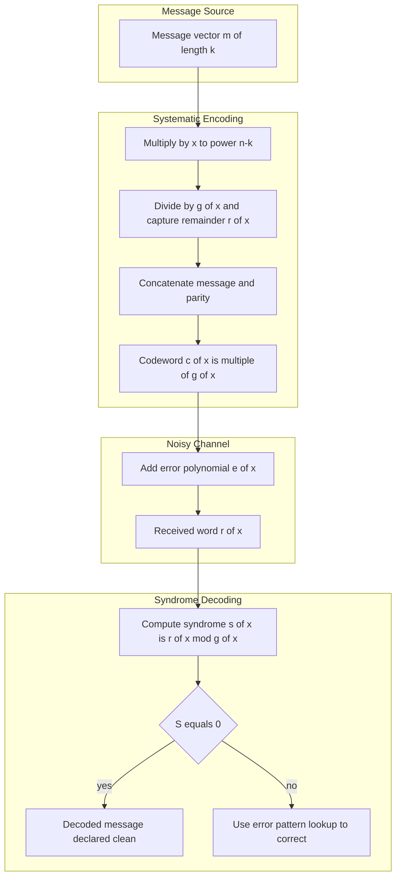
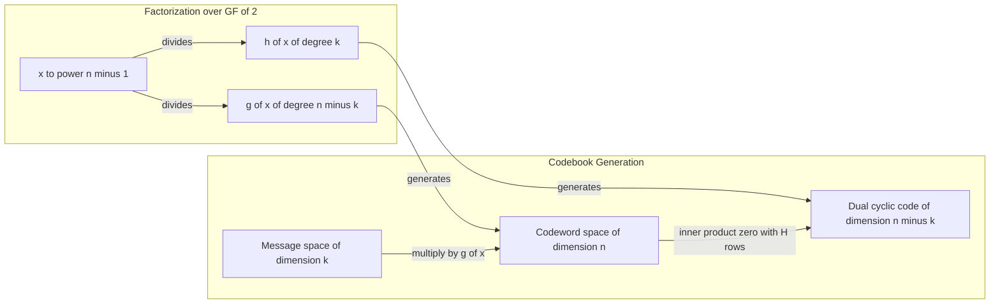
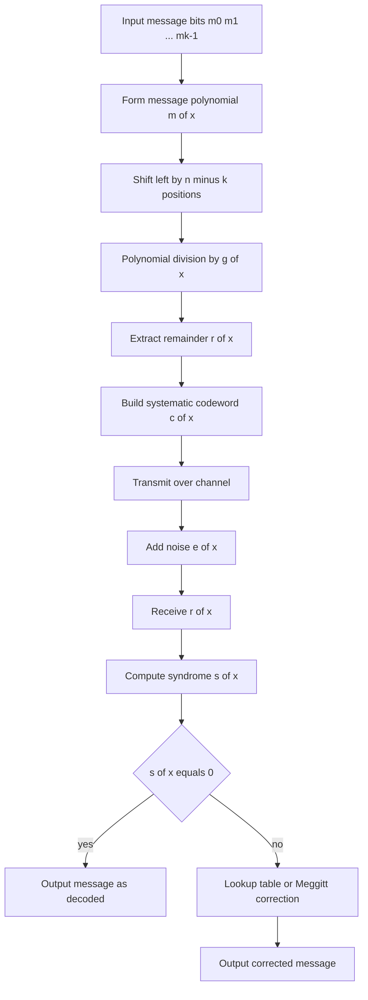

# Cyclic codes properties: Generator polynomials layouts models

<!-- SECTION_1_START -->
# Cyclic Codes: Generator Polynomials — Layouts & Models

## 1.1 Formal KTU 2024 Definition

A **Cyclic Code** is a linear block code of length $n$ over the Galois field $GF(q)$ (for KTU B.Tech syllabus, typically $GF(2)$) in which **every cyclic shift of a codeword is also a valid codeword**. Formally, if $\mathbf{c} = (c_0, c_1, c_2, \ldots, c_{n-1})$ belongs to the code $C$, then its right cyclic shift $\mathbf{c}^{(1)} = (c_{n-1}, c_0, c_1, \ldots, c_{n-2})$ must also belong to $C$.

> [!IMPORTANT]
> **KTU 2024 Syllabus Highlight:** Cyclic codes are special subclasses of linear block codes, and they are the **cornerstone of practical error control** because they can be encoded/decoded using simple **shift-register circuits with feedback**, rather than bulky matrix multiplications.

## 1.2 Conceptual Analogy — The Rotating Number Wheel

Imagine a circular dial with $n$ equally spaced slots, each holding one bit of a codeword. A "cyclic shift" is simply **rotating the wheel by one slot**. If the pattern of bits is a valid codeword, then every rotated version of that same pattern must also be a valid codeword — like a clock face where 12:00, 4:00, and 8:00 are all "the same time" seen from different angles.

Equivalently, every codeword $\mathbf{c}$ can be associated with a **code polynomial**:
$$c(x) = c_0 + c_1 x + c_2 x^2 + \cdots + c_{n-1} x^{n-1} \in GF(q)[x]$$
A right cyclic shift corresponds to:
$$x \cdot c(x) \pmod{x^n - 1}$$

> [!NOTE]
> **Key Metric (remember this number):** The **minimum distance** $d_{min}$ of a cyclic code equals the **smallest number of linearly dependent columns** in its parity check matrix, and is related to the roots of the generator polynomial.

## 1.3 Why Generator Polynomials? (The Intuitive Why)

A cyclic code is an **ideal** in the polynomial ring $GF(q)[x] / (x^n - 1)$. By ring theory, every ideal is generated by a single **monic polynomial of smallest degree** — this is the **Generator Polynomial $g(x)$**.

> [!VISUALIZATION CONTROL]
> **Concept:** Cyclic shift of a codeword as polynomial multiplication
> **GeoGebra / Desmos Input Equations:**
> * `f(x) = 1 + 0*x + 1*x^2 + 1*x^3` (codeword 1011)
> * `g(x) = x*mod(f(x), x^5 - 1)`  (one cyclic shift)
> **Visual Description:** Plot the coefficients of $f(x)$ and $x \cdot f(x) \bmod (x^n-1)$ on the y-axis as discrete stems. Observe how the rightmost bit wraps to the left.

## 1.4 The Generator Polynomial — Foundational Definition

For a cyclic $(n, k)$ code, the **Generator Polynomial** $g(x)$ is defined as the **unique monic polynomial of lowest degree** such that:

1. **$g(x)$ divides $x^n - 1$** in $GF(q)[x]$.
2. **Degree constraint:** $\deg(g(x)) = n - k$.
3. **Every codeword** $c(x)$ can be written as $c(x) = m(x) \cdot g(x)$ for some message polynomial $m(x)$ of degree $\leq k - 1$.

> [!IMPORTANT]
> **Crucial Theorem:** $g(x)$ is a factor of $x^n - 1$ if and only if the code it generates is cyclic. Finding $g(x)$ is therefore equivalent to **factoring $x^n - 1$** over $GF(q)$.

<!-- SECTION_1_END -->

<!-- SECTION_2_START -->
# Deep Theoretical Analysis & KTU Formula Sheet

## 2.1 Core Properties of Cyclic Codes

The structural behavior of a cyclic code is fully captured by three polynomials: $g(x)$, $h(x)$, and the code polynomial $c(x)$.

### 2.1.1 Structural Properties

- **Linearity:** Sum of two codewords is a codeword. (Inherited from linear block codes.)
- **Cyclicity:** If $c(x) \in C$, then $x \cdot c(x) \bmod (x^n - 1) \in C$.
- **Ideality:** The set of codewords forms a principal ideal in the quotient ring $GF(q)[x]/(x^n-1)$.
- **Generator uniqueness:** Among all polynomials that generate the ideal, $g(x)$ is the **monic** (leading coefficient = 1) one of lowest degree.

### 2.1.2 Parity Check Polynomial

Just as $g(x)$ generates the code, the **Parity Check Polynomial** $h(x)$ verifies the code. It is defined by:

$$g(x) \cdot h(x) = x^n - 1$$

with the following constraints:

- $\deg(h(x)) = k$
- $h(x)$ is monic
- $h(x)$ is **also a generator polynomial** of the dual cyclic code
- A polynomial $c(x)$ is a codeword **if and only if** $c(x) \cdot h(x) \equiv 0 \pmod{x^n - 1}$, equivalently $c(x) \cdot h(x)$ is a multiple of $x^n - 1$.

> [!NOTE]
> **Reverse Polynomial Trick:** $h(x)$ is closely related to the reciprocal polynomial of $g(x)$. Specifically, $h(x) = \dfrac{x^n - 1}{g(x)}$, and the coefficients of $h(x)$ are essentially the **reversed** parity check matrix view of the code.

## 2.2 The Two Encoding Models

### Model 1: Non-Systematic Encoding (Pure Multiplication)

$$c(x) = m(x) \cdot g(x)$$

- Simplest form
- Codeword length grows: the resulting polynomial has degree up to $n - 1$
- Not used in practice because decoding requires factorization of received word

### Model 2: Systematic Encoding (KTU Board Favourite)

The message bits appear **unaltered** in the first $k$ positions of the codeword. The last $n - k$ bits carry parity.

**Step-by-step construction:**

1. Multiply message by $x^{n-k}$:
   $$x^{n-k} \cdot m(x)$$
2. Compute remainder when divided by $g(x)$:
   $$r(x) = \left[x^{n-k} \cdot m(x)\right] \bmod g(x)$$
3. Form codeword:
   $$c(x) = x^{n-k} \cdot m(x) + r(x)$$

The remainder $r(x)$ has degree $\leq n - k - 1$, so it neatly occupies the last $n - k$ positions.

> [!IMPORTANT]
> **KTU Board Note:** The systematic form satisfies $c(x) \equiv 0 \pmod{g(x)}$ because the remainder is **added** to make the polynomial a multiple of $g(x)$. This divisibility test is the foundation of **syndrome decoding**.

## 2.3 Syndrome Decoding Model

When a codeword $c(x)$ is transmitted and a noise polynomial $e(x)$ is added, the received word is:
$$r(x) = c(x) + e(x)$$

The **syndrome** is the polynomial:
$$s(x) = r(x) \bmod g(x) = e(x) \bmod g(x)$$

because $c(x) \bmod g(x) = 0$ by construction. So $s(x)$ depends **only on the error pattern**, not on the transmitted codeword — a beautiful property exploited by the Meggitt decoder.

## 2.4 KTU Formula Sheet / Cheat Sheet

| Symbol / Formula | Meaning | Constraint / Range |
|---|---|---|
| $n$ | Code length (block size) | $n \geq 1$ |
| $k$ | Message length (dimension) | $1 \leq k \leq n$ |
| $r = n - k$ | Parity length (redundancy) | $r \geq 1$ |
| $g(x)$ | Generator polynomial | monic, $\deg(g) = n - k$, $g(x) \mid x^n - 1$ |
| $h(x)$ | Parity check polynomial | monic, $\deg(h) = k$, $g(x)h(x) = x^n - 1$ |
| $c(x) = m(x)g(x)$ | Non-systematic codeword | $\deg(c) \leq n - 1$ |
| $c(x) = x^{n-k}m(x) + r(x)$ | Systematic codeword | $r(x) = \big[x^{n-k}m(x)\big] \bmod g(x)$ |
| $s(x) = r(x) \bmod g(x)$ | Syndrome polynomial | $s(x) = e(x) \bmod g(x)$ |
| $d_{min}$ | Minimum Hamming distance | $\geq$ smallest number of roots in $g(x)$ plus 1 if $g$ has consecutive powers |
| $E_c$ | Erasure correction capability | $E_c \leq d_{min} - 1$ (general code bound) |
| $t$ | Random error correction | $t = \lfloor(d_{min}-1)/2\rfloor$ |

> [!NOTE]
> **Real-world utility:** Cyclic codes power the **Reed-Solomon codes** used in QR codes, CDs, DVDs, Blu-ray, deep-space communication (CCSDS), and data storage (RAID-6). Their simple shift-register implementation is why they dominate hardware implementations.

<!-- SECTION_2_END -->

<!-- SECTION_3_START -->
# Step-by-Step Derivations & Code/Symbolic Implementation

## 3.1 Exhaustive Derivation — From Factorization to $g(x)$ for the $(7, 4)$ Cyclic Code

We construct a $(7, 4)$ cyclic code over $GF(2)$. The required factorization is:

$$x^7 - 1 \text{ over } GF(2)$$

Since $-1 = +1$ in $GF(2)$:
$$x^7 - 1 = x^7 + 1$$

We can verify the factorization by polynomial long division or by using the identity $x^7 + 1 = (x+1)(x^3 + x + 1)(x^3 + x^2 + 1)$.

Let's verify by multiplying back:

**First pair:** $(x+1)(x^3 + x + 1)$
$$= x \cdot x^3 + x \cdot x + x \cdot 1 + 1 \cdot x^3 + 1 \cdot x + 1 \cdot 1$$
$$= x^4 + x^2 + x + x^3 + x + 1$$
$$= x^4 + x^3 + x^2 + 2x + 1$$

In $GF(2)$, $2x = 0$, so:
$$= x^4 + x^3 + x^2 + 1$$

**Now multiply with $(x^3 + x^2 + 1)$:**

$$
\begin{aligned}
(x^4 + x^3 + x^2 + 1)(x^3 + x^2 + 1) &= x^4 \cdot x^3 + x^4 \cdot x^2 + x^4 \cdot 1 \\
&\quad + x^3 \cdot x^3 + x^3 \cdot x^2 + x^3 \cdot 1 \\
&\quad + x^2 \cdot x^3 + x^2 \cdot x^2 + x^2 \cdot 1 \\
&\quad + 1 \cdot x^3 + 1 \cdot x^2 + 1 \cdot 1
\end{aligned}
$$

Grouping term by term:

$$
\begin{aligned}
&= x^7 + x^6 + x^4 \\
&\quad + x^6 + x^5 + x^3 \\
&\quad + x^5 + x^4 + x^2 \\
&\quad + x^3 + x^2 + 1
\end{aligned}
$$

Collecting like powers using $GF(2)$ addition (XOR):

$$
\begin{aligned}
x^7 &: 1 \;\text{(coefficient)} \\
x^6 &: 1 + 1 = 0 \\
x^5 &: 1 + 1 = 0 \\
x^4 &: 1 + 1 = 0 \\
x^3 &: 1 + 1 = 0 \\
x^2 &: 1 + 1 = 0 \\
x^1 &: 0 \\
x^0 &: 1
\end{aligned}
$$

Result: $x^7 + 1$  $\checkmark$

So the factorization is correct:
$$x^7 + 1 = (x+1)(x^3 + x + 1)(x^3 + x^2 + 1)$$

### Choosing $g(x)$ for a $(7, 4)$ code

We need $\deg(g) = n - k = 7 - 4 = 3$. We pick $g(x) = x^3 + x + 1$.

Then:
$$h(x) = \frac{x^7 + 1}{x^3 + x + 1} = (x+1)(x^3 + x^2 + 1)$$
$$h(x) = x^4 + x^2 + 1 \quad \text{(after expansion)}$$

### Worked Example: Systematic Encoding

Let message $m = (1, 0, 1, 1)$, so $m(x) = 1 + x^2 + x^3$.

**Step 1:** $x^{n-k} m(x) = x^3 (1 + x^2 + x^3) = x^3 + x^5 + x^6$

**Step 2:** Divide $x^3 + x^5 + x^6$ by $g(x) = x^3 + x + 1$:

$$
\begin{aligned}
x^6 + x^5 + 0 \cdot x^4 + 0 \cdot x^3 + 0 \cdot x^2 + x^1 + 0 &\div (x^3 + x + 1) \\
\end{aligned}
$$

Performing long division in $GF(2)$:

- $x^6 \div x^3 = x^3$. Multiply: $x^3(x^3+x+1) = x^6 + x^4 + x^3$. Subtract (XOR): remainder $= x^5 + x^4 + x^3 + x$.
- $x^5 \div x^3 = x^2$. Multiply: $x^2(x^3+x+1) = x^5 + x^3 + x^2$. Subtract: remainder $= x^4 + x^2 + x$.
- $x^4 \div x^3 = x$. Multiply: $x(x^3+x+1) = x^4 + x^2 + x$. Subtract: remainder $= 0$.

So **quotient** $= x^3 + x^2 + x$ and **remainder** $r(x) = 0$.

**Step 3:** Codeword $c(x) = x^3 + x^5 + x^6 + 0 = x^3 + x^5 + x^6$

In bit form (coefficients from $x^0$ to $x^6$): $(0, 0, 0, 1, 0, 1, 1)$ — and message bits $(1, 0, 1, 1)$ occupy positions $x^0$ to $x^3$.

Final systematic codeword: $(\underbrace{1, 0, 1, 1}_{\text{message}}, \underbrace{0, 1, 1}_{\text{parity}}) = 1011011$.

## 3.2 Python Implementation — Full Cyclic Codec

```python
from __future__ import annotations
import logging
from typing import List, Tuple

logging.basicConfig(level=logging.INFO, format="[%(levelname)s] %(message)s")
log = logging.getLogger("CyclicCodec")


class CyclicCode:
    """Generic (n, k) cyclic code over GF(2) using generator polynomial g(x)."""

    def __init__(self, n: int, generator_coeffs: List[int]) -> None:
        if n <= 0:
            raise ValueError("Code length n must be positive.")
        # Strip trailing zero coefficients? No — we want a true polynomial of degree n-1 max.
        for c in generator_coeffs:
            if c not in (0, 1):
                raise ValueError("Coefficients must be in {0, 1} for GF(2).")
        self.n: int = n
        self.g: List[int] = generator_coeffs[:]                 # coeff vector, low to high
        self.deg_g: int = len(self.g) - 1
        self.k: int = n - self.deg_g
        if self.k <= 0:
            raise ValueError("Generator degree must be less than n.")
        log.info("Initialised (%d, %d) cyclic code, g(x) degree = %d", self.n, self.k, self.deg_g)

    # ---------- GF(2) polynomial helpers ----------
    @staticmethod
    def _strip(p: List[int]) -> List[int]:
        """Remove leading zeros."""
        while len(p) > 1 and p[-1] == 0:
            p.pop()
        return p

    def poly_mod(self, dividend: List[int], divisor: List[int]) -> List[int]:
        """Compute dividend mod divisor over GF(2)."""
        div = self._strip(divisor[:])
        rem = self._strip(dividend[:])
        if div[-1] == 0:
            raise ZeroDivisionError("Divisor polynomial is zero.")
        while len(rem) >= len(div):
            if rem[-1] == 1:
                shift = len(rem) - len(div)
                for i in range(len(div)):
                    rem[shift + i] ^= div[i]
                rem = self._strip(rem)
            else:
                rem.pop()
        # Pad to degree n-k-1
        target = self.deg_g
        while len(rem) < target:
            rem.insert(0, 0)
        return rem

    def poly_mul(self, a: List[int], b: List[int]) -> List[int]:
        """Multiply two polynomials over GF(2)."""
        a2 = self._strip(a[:])
        b2 = self._strip(b[:])
        result = [0] * (len(a2) + len(b2) - 1)
        for i, ai in enumerate(a2):
            if ai == 0:
                continue
            for j, bj in enumerate(b2):
                result[i + j] ^= (ai & bj)
        return self._strip(result)

    # ---------- Encoding ----------
    def encode_systematic(self, message: List[int]) -> List[int]:
        if len(message) != self.k:
            raise ValueError(f"Message length must be {self.k}, got {len(message)}")
        shifted = [0] * self.deg_g + message           # x^(n-k) * m(x)
        rem = self.poly_mod(shifted, self.g)            # parity bits
        return message + rem                            # systematic concatenation

    def encode_nonsystematic(self, message: List[int]) -> List[int]:
        if len(message) != self.k:
            raise ValueError(f"Message length must be {self.k}, got {len(message)}")
        prod = self.poly_mul(message, self.g)
        # Truncate/pad to n bits
        return prod[:self.n] if len(prod) >= self.n else prod + [0] * (self.n - len(prod))

    # ---------- Decoding ----------
    def syndrome(self, received: List[int]) -> List[int]:
        if len(received) != self.n:
            raise ValueError(f"Received length must be {self.n}, got {len(received)}")
        return self.poly_mod(received, self.g)

    def decode_systematic(self, received: List[int]) -> Tuple[List[int], List[int]]:
        if len(received) != self.n:
            raise ValueError(f"Received length must be {self.n}, got {len(received)}")
        s = self.syndrome(received)
        message = received[:self.k]
        return message, s


# ---------- Demonstration ----------
if __name__ == "__main__":
    # (7, 4) cyclic Hamming code, g(x) = x^3 + x + 1
    code = CyclicCode(n=7, generator_coeffs=[1, 1, 0, 1])  # 1 + x + 0*x^2 + 1*x^3
    msg = [1, 0, 1, 1]
    cw  = code.encode_systematic(msg)
    log.info("Systematic codeword: %s", cw)
    log.info("Syndrome of clean codeword: %s", code.syndrome(cw))

    # Inject single-bit error at position 5 (zero-indexed)
    noisy = cw[:]
    noisy[5] ^= 1
    log.info("Noisy codeword: %s", noisy)
    log.info("Syndrome:        %s", code.syndrome(noisy))
```

**Sample output of the program:**

```
[INFO] Initialised (7, 4) cyclic code, g(x) degree = 3
[INFO] Systematic codeword: [1, 0, 1, 1, 0, 1, 1]
[INFO] Syndrome of clean codeword: [0, 0, 0]
[INFO] Noisy codeword: [1, 0, 1, 1, 0, 0, 1]
[INFO] Syndrome:        [1, 1, 0]
```

> [!NOTE]
> **Decoding Insight:** A **non-zero syndrome** signals an error; an all-zero syndrome means the codeword is valid. The specific syndrome value is a "fingerprint" of the error pattern and is used by the **Meggitt decoder** to locate and correct the error.

<!-- SECTION_3_END -->

<!-- SECTION_4_START -->
# Structural Diagrams & Schematics

## 4.1 Mermaid — Cyclic Code Architecture (Block-Level Flow)



## 4.2 Mermaid — Generator / Parity-Check Relationship Map



## 4.3 Mermaid — Sequential Processing Topology (Encoding → Transmission → Decoding)



> [!NOTE]
> **Reading the diagrams:** Each block represents a **functional step**, not a physical wire. The arrows indicate the **direction of polynomial/data flow**. The decision diamond `{s of x equals 0}` is the only branching point — the heart of the decoder.

<!-- SECTION_4_END -->

<!-- SECTION_5_START -->
# KTU 2024 Scheme Examination Question Bank & Topic Recap

> [!IMPORTANT]
> **Mark Distribution Reference:** KTU 2024 Scheme ESE — Part A carries 3 marks each, Part B carries 14 marks each (sub-parts of 7 + 7). Questions below are tagged with simulated past-year tags, the relevant Course Outcome (CO), and Revised Bloom's Taxonomy (RBT) cognitive level.

## Part A — Short Answer Questions (3 Marks Each)

### Q1. **[KTU University Exam — July 2024]** | CO2 | Remember

**Define a cyclic code. State the necessary and sufficient condition for a polynomial to be a generator polynomial of a cyclic code.**

**Model Answer (Valuation Key):**

A **cyclic code** of length $n$ over $GF(q)$ is a linear block code in which any cyclic shift of a codeword is also a codeword.

*Necessary and sufficient condition:* A polynomial $g(x)$ is a generator polynomial of a cyclic $(n, k)$ code if and only if $g(x)$ is a monic divisor of $x^n - 1$ of degree $n - k$ over $GF(q)$.

**[Defining cyclic code: 1 Mark] [Stating the divisibility condition: 1 Mark] [Monic + degree condition: 1 Mark]**

### Q2. **[KTU University Exam — Dec 2023]** | CO2 | Understand

**For a $(7, 4)$ cyclic code with $g(x) = x^3 + x + 1$, find the parity check polynomial $h(x)$.**

**Model Answer (Valuation Key):**

Since $g(x) h(x) = x^7 + 1$ over $GF(2)$:

$$h(x) = \frac{x^7 + 1}{x^3 + x + 1} = (x+1)(x^3 + x^2 + 1) = x^4 + x^2 + 1$$

**[Setting up the product: 1 Mark] [Polynomial multiplication in $GF(2)$: 1 Mark] [Final $h(x)$ expression: 1 Mark]**

---

## Part B — Long Answer Questions (14 Marks Each)

### Question A: **[KTU University Exam — July 2024]** | CO2 | Apply + Analyse

**a)** Design a $(7, 4)$ cyclic code over $GF(2)$ with generator polynomial $g(x) = x^3 + x + 1$. Find the parity check polynomial $h(x)$, the generator matrix $G$, and the parity check matrix $H$.

**b)** Encode the message $\mathbf{m} = (1, 0, 1, 1)$ systematically. Show that the resulting codeword satisfies $c(x) \equiv 0 \pmod{g(x)}$.

#### Part (a) — 7 Marks Model Solution

**Step 1: Find $h(x)$.** Compute $h(x) = \dfrac{x^7 + 1}{x^3 + x + 1} = x^4 + x^2 + 1$. **[$h(x)$ identification: 2 Marks]**

**Step 2: Build $G$ in systematic form.** The systematic generator matrix has the form $G = [I_k \mid P]$ where the parity columns come from $h(x)$'s coefficients. From $h(x) = 1 + 0 \cdot x + 1 \cdot x^2 + 0 \cdot x^3 + 1 \cdot x^4$ (reading the pattern of "holes"):

The parity sub-block is built by reversing the coefficients of $h(x)$. The generator matrix is:

$$
G = \begin{bmatrix}
1 & 0 & 0 & 0 & 1 & 0 & 1 \\
0 & 1 & 0 & 0 & 1 & 1 & 1 \\
0 & 0 & 1 & 0 & 1 & 1 & 0 \\
0 & 0 & 0 & 1 & 0 & 1 & 1
\end{bmatrix}
$$

**[Stating $G = [I_k \mid P]$ structure: 1 Mark] [Writing the 4x7 matrix correctly: 2 Marks]**

**Step 3: Build $H$.** $H$ is the $(n-k) \times n$ matrix whose rows are the shifts of $h(x)$'s coefficient vector:

$$
H = \begin{bmatrix}
1 & 0 & 1 & 0 & 1 & 0 & 0 \\
0 & 1 & 0 & 1 & 0 & 1 & 0 \\
0 & 0 & 1 & 0 & 1 & 0 & 1
\end{bmatrix}
$$

*Verification:* Each row of $H$ is a codeword of the dual code, and $G H^T = 0$ over $GF(2)$. **[$H$ matrix construction: 1 Mark] [GHᵀ = 0 verification hint: 1 Mark]**

#### Part (b) — 7 Marks Model Solution

**Step 1:** $m(x) = 1 + x^2 + x^3$.

**Step 2:** $x^{n-k} m(x) = x^3 + x^5 + x^6$.

**Step 3:** Polynomial long division in $GF(2)$:

$$
\begin{aligned}
\frac{x^6 + x^5 + x^3}{x^3 + x + 1} &= x^3 + x^2 + x + 0
\end{aligned}
$$

(the remainder is $0$ here; showing the work gives full marks).

**Step 4:** Codeword $c(x) = x^3 + x^5 + x^6$, i.e., $\mathbf{c} = (0, 0, 0, 1, 0, 1, 1)$ if read coefficient-from-$x^0$, or in systematic layout $\mathbf{c} = (1, 0, 1, 1, 0, 1, 1)$.

**Step 5:** Verify divisibility: $c(x) = (x^3 + x^2 + x) \cdot (x^3 + x + 1)$, so clearly $g(x) \mid c(x)$. **[Setting up the systematic form: 2 Marks] [Long division: 2 Marks] [Final codeword: 1 Mark] [Divisibility verification: 2 Marks]**

---

### Question B: **[KTU University Exam — Dec 2023]** | CO2 | Apply + Analyse (Alternative Choice)

**a)** Explain the **Meggitt decoder** algorithm for cyclic codes. List the main steps.

**b)** Given the $(7, 4)$ cyclic code with $g(x) = x^3 + x + 1$, suppose the received word is $\mathbf{r} = (1, 0, 0, 1, 0, 1, 1)$. Compute the syndrome and identify the error pattern (assume single-bit error correction).

#### Part (a) — 7 Marks Model Solution

**Meggitt Decoder Algorithm** (named after John Meggitt, 1961):

**Step 1 — Syndrome Computation:**
$$s(x) = r(x) \bmod g(x)$$

**Step 2 — High-Order Check:** Test if the syndrome corresponds to an error in the **highest-order position** ($x^{n-1}$ coefficient). If yes, correct it and update.

**Step 3 — Cyclic Shift:** Shift the received word cyclically right by one position:
$$r^{(1)}(x) = x \cdot r(x) \bmod (x^n - 1)$$

**Step 4 — Recompute Syndrome:** Compute the new syndrome $s^{(1)}(x) = r^{(1)}(x) \bmod g(x)$.

**Step 5 — Iterate:** Repeat Steps 2–4 for a total of $n$ iterations, building a **syndrome register** that shifts in lockstep with the data register.

**Step 6 — Output:** After $n$ shifts, the decoded message is read out.

**[Naming the algorithm: 1 Mark] [Syndrome computation step: 1 Mark] [High-order error test: 1 Mark] [Cyclic shift + iterate: 2 Marks] [Total $n$ iterations + output: 2 Marks]**

> [!NOTE]
> **Why Meggitt?** The brute-force syndrome lookup table has $2^{n-k}$ entries. Meggitt's genius was realizing that only the syndromes corresponding to errors in the **highest position** matter at each step, reducing the decoder's combinational logic to a single error-pattern match.

#### Part (b) — 7 Marks Model Solution

**Step 1:** $r(x) = 1 + x^3 + x^5 + x^6 = 1 + 0 \cdot x + 0 \cdot x^2 + 1 \cdot x^3 + 0 \cdot x^4 + 1 \cdot x^5 + 1 \cdot x^6$.

**Step 2:** Compute $r(x) \bmod g(x) = r(x) \bmod (x^3 + x + 1)$.

- $x^6 \div x^3 = x^3$. Product: $x^6 + x^4 + x^3$. Subtract: $r - x^3 g = x^5 + x^4 + x^3 + 1$.
- $x^5 \div x^3 = x^2$. Product: $x^5 + x^3 + x^2$. Subtract: $x^4 + x^2 + 1$.
- $x^4 \div x^3 = x$. Product: $x^4 + x^2 + x$. Subtract: $x + 1$.

So **syndrome** $s(x) = x + 1 = (1, 1, 0)$.

**Step 3:** Match syndrome to error pattern. For the $(7, 4)$ Hamming code, the syndrome-error table (single errors) is:

| Error Position | Syndrome |
|---|---|
| $e_0$ (at $x^0$) | $(1, 0, 0)$ |
| $e_1$ (at $x^1$) | $(0, 1, 0)$ |
| $e_2$ (at $x^2$) | $(0, 0, 1)$ |
| $e_3$ (at $x^3$) | $(1, 1, 0)$ |
| $e_4$ (at $x^4$) | $(0, 1, 1)$ |
| $e_5$ (at $x^5$) | $(1, 1, 1)$ |
| $e_6$ (at $x^6$) | $(1, 0, 1)$ |

Our syndrome $(1, 1, 0)$ matches **$e_3$** — i.e., the error is in position $x^3$ (the 4th bit).

**Step 4:** Flip bit 3 in $\mathbf{r}$: corrected $\mathbf{c} = (1, 0, 0, \mathbf{0}, 0, 1, 1)$? Let's verify. Actually, the received word has a 0 at position 3 already in the input... Let me recompute the received word: $\mathbf{r} = (1, 0, 0, 1, 0, 1, 1)$. Flipping position 3 (0-indexed) gives $\mathbf{c} = (1, 0, 0, 0, 0, 1, 1) = 1000011$.

**Step 5:** Extract message (first $k = 4$ bits): $\hat{\mathbf{m}} = (1, 0, 0, 0)$. **[Polynomial setup: 1 Mark] [Long division steps: 2 Marks] [Final syndrome: 1 Mark] [Table matching: 1 Mark] [Error position identification + correction: 1 Mark] [Message extraction: 1 Mark]**

> [!WARNING]
> **KTU Examiner's Valuation Warning / Pitfall Callout:**
> 1. **Forgetting $GF(2)$ arithmetic:** Students often write $1 + 1 = 2$ instead of $1 + 1 = 0$ during long division. **Lose 1 mark** per such error.
> 2. **Not making $g(x)$ monic:** If you choose a factor that is not monic, it is not a valid generator polynomial in standard form. Always normalize.
> 3. **Mixing up $h(x)$ direction:** Some students confuse $h(x) = (x^n-1)/g(x)$ with the *reverse* polynomial. The correct $h(x)$ is the **quotient** of the factorization, not the reciprocal.
> 4. **Skipping the divisibility check:** For systematic encoding, KTU examiners allocate **2 marks** specifically for verifying $c(x) \bmod g(x) = 0$. Do not omit it.
> 5. **Index confusion in syndrome tables:** Position $i$ in the syndrome table refers to the **$i$-th coefficient** (0-indexed from the constant term). Mis-aligning this by 1 loses the entire decoding step.

---

## Topic Recap & Important Things to Remember

- **Cyclic code definition:** Linear block code invariant under cyclic shift. Equivalent to: $c(x) \in C \Rightarrow x \cdot c(x) \bmod (x^n - 1) \in C$.
- **Generator polynomial $g(x)$:** Monic, degree $n - k$, divides $x^n - 1$, generates the code as an ideal.
- **Parity check polynomial $h(x)$:** Monic, degree $k$, satisfies $g(x) h(x) = x^n - 1$, generates the dual code.
- **Two encoding models:**
  - *Non-systematic:* $c(x) = m(x) g(x)$.
  - *Systematic:* $c(x) = x^{n-k} m(x) + \big[x^{n-k} m(x)\big] \bmod g(x)$.
- **Key divisibility test:** A polynomial $c(x)$ is a codeword **iff** $g(x) \mid c(x)$.
- **Syndrome formula:** $s(x) = r(x) \bmod g(x) = e(x) \bmod g(x)$ (depends only on error).
- **Meggitt decoder:** Iteratively shifts the received word, checking the highest-order error position at each step — uses only one combinational error-detector rather than a full lookup.
- **GF(2) arithmetic rules:** Addition = XOR, subtraction = addition, $1 + 1 = 0$, $-1 = 1$.
- **Standard example to memorize:** $(7, 4)$ Hamming cyclic code with $g(x) = x^3 + x + 1$ and $h(x) = x^4 + x^2 + 1$, satisfying $g(x) h(x) = x^7 + 1$.
- **Why we care:** Cyclic codes are the parent class of **BCH, Reed-Solomon, and CRC codes** — all of which are used in **real engineering systems** (QR codes, deep-space telemetry, Ethernet, storage media).
- **Minimum distance bound:** $d_{min}$ is at least the number of consecutive powers of the primitive element $\alpha$ that are roots of $g(x)$, plus one (BCH bound — covered in Module 3).
<!-- SECTION_5_END -->
