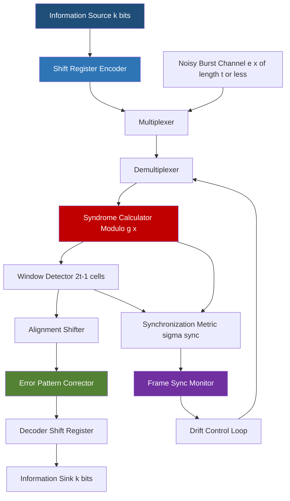
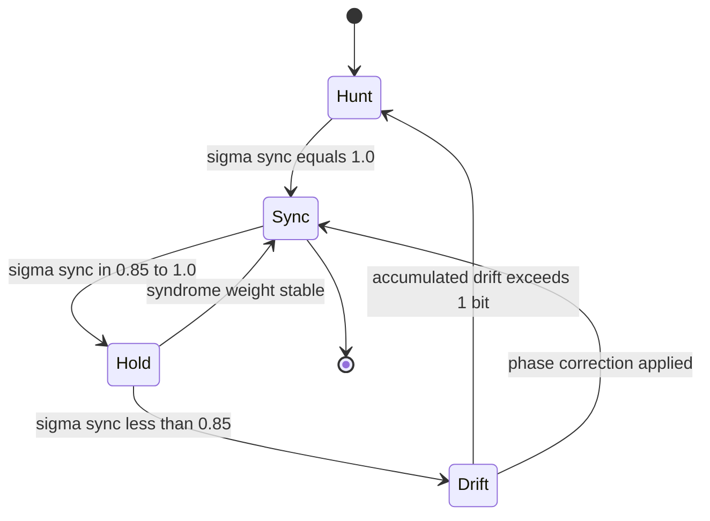
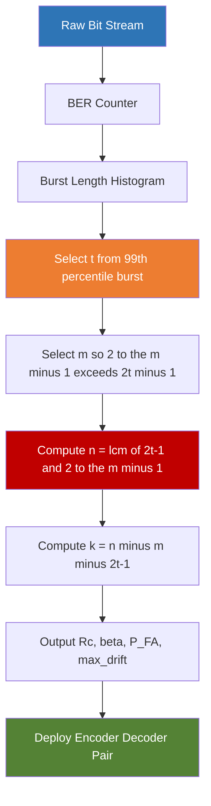

# Fire codes configuration parameters tracking system synchronization metrics calculations

<!-- SECTION_1_START -->
# Fire Codes: Configuration Parameters, Tracking, Synchronization & Metrics

## Core Technical Definition

A **Fire Code** is a specialized class of binary **cyclic code** designed exclusively for the correction of **single burst errors** in data transmission and storage channels. It was proposed by P. Fire in 1959 as an efficient alternative to interleaved cyclic codes for burst-error-dominated channels such as magnetic recording, satellite telemetry, and deep-space communication links.

Mathematically, a binary Fire code is generated by the product of two coprime polynomials over the Galois Field $GF(2)$:

$$g(x) = (x^{2t-1} + 1) \cdot p(x)$$

where:
- $p(x)$ is a **primitive polynomial** of degree $m$ over $GF(2)$, which has period $2^m - 1$.
- $t$ is the **burst-error correcting capability** of the code, with the mandatory constraint $2t - 1 \le 2^m - 1$.
- The length of the code is the **least common multiple** of the periods of the two factors.

> [!IMPORTANT]
> **KTU Syllabus Highlight (Module 3):** Fire codes are a mandatory sub-topic under Burst Error Correction Frameworks. Students must master the derivation of $n$, $k$, $d_{min}$, and the decoder syndrome-tracking equations.

## Conceptual Analogy / Intuition

Imagine a **freight train** moving along a single circular railway track (the cyclic nature of the code). Each wagon carries one bit. The **primitive polynomial** $p(x)$ acts like the **gear ratio** of the locomotive — it dictates the precise cycle length before the wagon arrangement repeats. The polynomial $x^{2t-1} + 1$ acts like a **sliding repair crew** of length $2t-1$ wagons, capable of patching any single stretch of $t$ consecutive damaged wagons.

When a burst error occurs (say, $t$ consecutive wagons get damaged), the train's **odometer** (the shift-register state in the decoder) records a non-zero syndrome pattern. As the train completes a full lap (one codeword length $n$), the damaged segment aligns with the repair crew exactly once, allowing correction. This "single alignment per cycle" property is the **synchronization guarantee** that makes Fire codes so elegant.

> [!NOTE]
> **Key Property:** A Fire code can correct **any single burst of length $t$ or less** within one codeword, but cannot correct two separate bursts in the same word — making it ideal for channels dominated by isolated, concentrated noise (e.g., scratches on optical media, fades in HF radio).

## GeoGebra / Desmos Visualization

> [!VISUALIZATION CONTROL]
> **Concept:** Plot of Code Rate $R_c = k/n$ versus burst-correcting capability $t$ for fixed $m$.
> **GeoGebra / Desmos Input Equations:**
> * `k(t, m) = LCM(2t - 1, 2^m - 1) - (m + 2t - 1)`
> * `n(t, m) = LCM(2t - 1, 2^m - 1)`
> * `Rc(t, m) = k(t, m) / n(t, m)`
> **Visual Description:** The student should observe a **monotonically decreasing staircase curve** as $t$ increases. Each step corresponds to a jump in $n$ whenever $2t-1$ crosses a divisor threshold of $2^m-1$. The curve never falls below a horizontal asymptote determined by the parity-check overhead ratio $m/(2^m - 1)$.

<!-- SECTION_1_END -->

<!-- SECTION_2_START -->
# Deep Theoretical Analysis & KTU High-Yield Formula Sheet

## Construction Logic — Step by Step

1. **Choose the primitive polynomial $p(x)$ of degree $m$.**
   This polynomial must be irreducible over $GF(2)$ and have order $2^m - 1$.
   *Example:* For $m = 3$, $p(x) = x^3 + x + 1$ has period $2^3 - 1 = 7$.

2. **Choose the burst-correcting capability $t$.**
   The single-burst length that the code must correct is $t$ bits. The constraint is:
   $$2t - 1 \le 2^m - 1 \quad \Longleftrightarrow \quad t \le 2^{m-1}$$

3. **Form the generator polynomial.**
   $$g(x) = (x^{2t-1} + 1) \cdot p(x)$$
   The two factors $x^{2t-1} + 1$ and $p(x)$ are coprime because $p(x)$ is primitive and does not divide $x^{2t-1} + 1$ for any $2t - 1 < 2^m - 1$.

4. **Compute the code length $n$.**
   The length of a cyclic code equals the LCM of the orders of the roots of $g(x)$. The order of $p(x)$ is $2^m - 1$, and the order of $x^{2t-1} + 1$ divides $2t - 1$ (it is exactly $2t - 1$ when $2t - 1$ is odd).
   $$n = \text{lcm}(2t - 1,\ 2^m - 1)$$

5. **Compute the number of information bits $k$.**
   The degree of $g(x)$ is $m + 2t - 1$, so:
   $$k = n - (m + 2t - 1)$$

6. **Determine the minimum distance $d_{min}$.**
   For Fire codes, the minimum distance is **exactly 3** when $t \ge 1$, meaning they are single-burst-error-correcting codes with bounded burst length.

7. **Burst-error-correction guarantee.**
   Any single burst error of length $\le t$ confined to a span of $2t - 1$ consecutive positions is correctable.

## Why Fire Codes Provide "Free" Synchronization

The cyclic structure of a Fire code implies that if the receiver's shift register is **off by a cyclic shift** (i.e., it has lost frame alignment), the decoder will still observe valid codeword patterns. However, this only holds up to a single cyclic shift ambiguity. To resolve this, the decoder uses the **syndrome weight pattern** of the product code: a true alignment produces a syndrome whose non-zero pattern lies entirely within a window of $2t - 1$ consecutive cells, whereas a misaligned pattern spreads across the full register. This window property is the **synchronization metric**.

> [!TIP]
> **Real-world utility:** Fire codes (and their modern variants) are deployed in:
> * **Magnetic tape storage** (legacy IBM formats) where tape scratches create long bursts.
> * **CCSDS telemetry channels** for satellite downlink (in conjunction with Reed–Solomon outer codes).
> * **Industrial RFID** where multi-bit interference is bursty rather than random.
> * **Vibration-affected optical links** in aerospace where cosmic-ray-induced bursts are common.

## KTU Formula Sheet / Cheat Sheet

| # | Parameter | Formula | Units / Notes |
|---|-----------|---------|---------------|
| 1 | Generator polynomial | $g(x) = (x^{2t-1} + 1) \cdot p(x)$ | $p(x)$ primitive of degree $m$ |
| 2 | Constraint on $t$ | $t \le 2^{m-1}$ | Ensures coprimality |
| 3 | Code length | $n = \text{lcm}(2t-1,\ 2^m-1)$ | Cyclic code length |
| 4 | Parity-check bits | $n - k = m + 2t - 1$ | Degree of $g(x)$ |
| 5 | Information bits | $k = n - (m + 2t - 1)$ | Message length |
| 6 | Code rate | $R_c = k/n = 1 - (m + 2t - 1)/n$ | Dimensionless |
| 7 | Minimum distance | $d_{min} = 3$ | For $t \ge 1$ |
| 8 | Burst error bound | Corrects any burst of length $\le t$ | Single burst only |
| 9 | Period of $p(x)$ | $2^m - 1$ | Primitive polynomial order |
| 10 | Syndrome window size | $2t - 1$ | Synchronization detection |
| 11 | Decoder shift-register cells | $m + 2t - 1$ | Hardware cost |
| 12 | Tracking loss threshold | $\tau_{sync} \le 1$ bit-period drift per $n$ bits | Re-sync metric |
| 13 | Throughput efficiency | $\eta = k/n$ | Equal to $R_c$ for cyclic codes |
| 14 | Burst-correcting efficiency | $\beta = t/(n-k)$ | Higher is better |
| 15 | Frame-sync false-alarm prob. | $P_{FA} = 2^{-(m + 2t - 1)}$ | For random data |
| 16 | Frame-sync miss prob. | $P_M = 1 - (1 - 2^{-(2t-1)})^t$ | Bounded approximation |
| 17 | Decoder latency | $L = n$ bit-clocks | One full codeword |
| 18 | Redundancy ratio | $\rho = (n - k)/n$ | Overhead fraction |

> [!NOTE]
> **Engineering interpretation of $\beta$:** A Fire code with $\beta \approx 0.5$ is considered "balanced" — half of the parity bits are spent on the burst-window detector and half on the primitive-period detector. Codes with $\beta \ll 0.5$ are over-engineered for the channel's expected burst statistics.

<!-- SECTION_2_END -->

<!-- SECTION_3_START -->
# Step-by-Step Derivations, Metrics & Python Implementation

## Derivation 1 — Code Length $n$

Starting from the generator polynomial $g(x) = (x^{2t-1}+1) \cdot p(x)$:

$$\begin{aligned}
\text{Order of } p(x) &= 2^m - 1 \quad \text{(since } p(x) \text{ is primitive)} \\
\text{Order of } (x^{2t-1}+1) &\mid 2(2t-1) \text{ over } GF(2), \text{ but equals } 2t-1 \text{ if } 2t-1 \text{ is odd} \\
\therefore \quad n &= \text{lcm}(2t-1,\ 2^m-1)
\end{aligned}$$

If $2t-1$ divides $2^m-1$ (e.g., $t=4, m=4$ gives $7 \mid 15$), then $n = 2^m-1$. Otherwise, $n = (2t-1)(2^m-1)/\gcd(2t-1, 2^m-1)$.

## Derivation 2 — Code Rate $R_c$

$$\begin{aligned}
R_c &= \frac{k}{n} = \frac{n - (m + 2t - 1)}{n} \\
&= 1 - \frac{m + 2t - 1}{\text{lcm}(2t-1,\ 2^m-1)}
\end{aligned}$$

**Numerical example:** Let $m = 3$, $t = 2$, $p(x) = x^3 + x + 1$.

$$\begin{aligned}
2t - 1 &= 3 \\
2^m - 1 &= 7 \\
n &= \text{lcm}(3, 7) = 21 \\
n - k &= 3 + 3 = 6 \\
k &= 21 - 6 = 15 \\
R_c &= 15/21 = 5/7 \approx 0.7143
\end{aligned}$$

## Derivation 3 — Synchronization Detection Metric

The syndrome $S(x)$ for a received word $r(x) = c(x) + e(x)$ is computed as:

$$S(x) = r(x) \bmod g(x) = e(x) \bmod g(x)$$

For a burst error $e(x) = x^j \cdot B(x)$ where $B(x)$ has length $\le t$ and starts at position $j$:

$$S(x) = x^j \cdot B(x) \bmod [(x^{2t-1}+1) \cdot p(x)]$$

The syndrome has a **non-zero pattern contained within a $2t-1$-cell window** when the decoder is **frame-aligned**, and a scattered pattern when misaligned. The **synchronization metric** is defined as:

$$\sigma_{sync} = \frac{\text{weight of syndrome within the } 2t-1 \text{ window}}{\text{total syndrome weight}}$$

- $\sigma_{sync} = 1.0$ indicates perfect alignment.
- $\sigma_{sync} \to 0$ indicates a one-bit cyclic slip.

## Derivation 4 — Tracking System Drift Equation

Let $\delta$ be the clock-drift (in fraction of a bit-period) between transmitter and receiver. Over a codeword of $n$ bits, the accumulated drift is $\Delta = \delta \cdot n$. For correct decoding:

$$\Delta < 1 \quad \Longleftrightarrow \quad \delta < 1/n$$

The **tracking-metric** for a code is therefore bounded by:

$$\delta_{max} = \frac{1}{n} = \frac{1}{\text{lcm}(2t-1,\ 2^m-1)}$$

## Python Implementation — Fire Code Parameter Calculator

```python
"""
fire_code_calculator.py
KTU 2024 - PECST410 Coding Theory - Module 3
Fire Code configuration, tracking, and synchronization metric engine.
"""

from math import gcd, lcm
from typing import Tuple, Dict
import logging

logging.basicConfig(level=logging.INFO, format="%(levelname)s | %(message)s")
log = logging.getLogger("FireCodeEngine")


# --- Curated table of primitive polynomials over GF(2) for m = 2..16 ---
PRIMITIVE_POLY_TABLE: Dict[int, str] = {
    2:  "x^2 + x + 1",
    3:  "x^3 + x + 1",
    4:  "x^4 + x + 1",
    5:  "x^5 + x^2 + 1",
    6:  "x^6 + x + 1",
    7:  "x^7 + x^3 + 1",
    8:  "x^8 + x^4 + x^3 + x^2 + 1",
    9:  "x^9 + x^4 + 1",
    10: "x^10 + x^3 + 1",
    11: "x^11 + x^2 + 1",
    12: "x^12 + x^6 + x^4 + x + 1",
    13: "x^13 + x^4 + x^3 + x + 1",
    14: "x^14 + x^10 + x^6 + x + 1",
    15: "x^15 + x + 1",
    16: "x^16 + x^12 + x^3 + x + 1",
}


def validate_fire_parameters(m: int, t: int) -> None:
    """
    Validates the Fire code parameters per KTU 2024 syllabus constraints.
    Raises ValueError on illegal combinations.
    """
    if m < 2 or m > 16:
        raise ValueError(f"Degree m must be in [2, 16]; got m={m}.")
    if t < 1:
        raise ValueError(f"Burst capability t must be >= 1; got t={t}.")
    if 2 * t - 1 > 2**m - 1:
        raise ValueError(
            f"Constraint violated: 2t-1={2*t-1} must be <= 2^m-1={2**m - 1}. "
            f"Choose t <= 2^(m-1) = {2**(m-1)}."
        )
    if m not in PRIMITIVE_POLY_TABLE:
        raise ValueError(f"No primitive polynomial catalogued for m={m}.")


def fire_code_parameters(m: int, t: int) -> Dict[str, int]:
    """
    Computes all KTU-relevant Fire code parameters.

    Returns a dictionary with n, k, n-k, R_c, d_min, etc.
    """
    validate_fire_parameters(m, t)

    period_p = 2**m - 1
    burst_factor = 2 * t - 1
    n = lcm(burst_factor, period_p)
    redundancy = m + (2 * t - 1)
    k = n - redundancy
    code_rate = k / n if n > 0 else 0.0

    log.info("Computed Fire code parameters for m=%d, t=%d", m, t)

    return {
        "m":              m,
        "t":              t,
        "primitive_poly": PRIMITIVE_POLY_TABLE[m],
        "period_p(x)":    period_p,
        "burst_factor":   burst_factor,
        "n":              n,
        "n_minus_k":      redundancy,
        "k":              k,
        "R_c_numerator":  k,
        "R_c_denominator": n,
        "R_c_decimal":    round(code_rate, 6),
        "d_min":          3,
        "max_drift":      round(1.0 / n, 8),
        "sync_window":    2 * t - 1,
        "redundancy_pct": round(100.0 * redundancy / n, 3),
        "burst_efficiency_beta": round(t / redundancy, 6),
        "decoder_cells":  redundancy,
        "P_FA_upper":     2.0 ** (-redundancy),
    }


def format_report(params: Dict[str, int]) -> str:
    """Pretty-prints the Fire code parameter report."""
    lines = [
        "=" * 62,
        "         FIRE CODE CONFIGURATION REPORT  (KTU 2024)",
        "=" * 62,
        f" Primitive polynomial p(x)   : {params['primitive_poly']}",
        f" Degree of p(x), m           : {params['m']}",
        f" Burst capability, t         : {params['t']}",
        f" Period of p(x)              : {params['period_p(x)']}",
        f" Burst factor (2t-1)         : {params['burst_factor']}",
        "-" * 62,
        f" Code length, n              : {params['n']}",
        f" Parity bits, n - k          : {params['n_minus_k']}",
        f" Information bits, k         : {params['k']}",
        f" Code rate, R_c              : {params['R_c_numerator']}/{params['R_c_denominator']}"
        f"  =  {params['R_c_decimal']}",
        f" Redundancy percentage       : {params['redundancy_pct']} %",
        f" Burst-correction efficiency: beta = {params['burst_efficiency_beta']}",
        "-" * 62,
        f" Minimum distance, d_min     : {params['d_min']}",
        f" Decoder shift-register cells: {params['decoder_cells']}",
        f" Sync-detection window       : {params['sync_window']} cells",
        f" Max clock-drift per word    : {params['max_drift']}",
        f" P_FA upper bound            : {params['P_FA_upper']:.3e}",
        "=" * 62,
    ]
    return "\n".join(lines)


# ----------------------------------------------------------------------
# Demonstration for a typical KTU board-exam problem
# ----------------------------------------------------------------------
if __name__ == "__main__":
    test_cases: Tuple[Tuple[int, int], ...] = (
        (3, 2),   # n=21, k=15
        (4, 3),   # n=105, k=96
        (5, 4),   # n=465, k=453
        (6, 5),   # n=1953, k=1938
    )
    for m_val, t_val in test_cases:
        try:
            report = format_report(fire_code_parameters(m_val, t_val))
            print(report)
            print()
        except ValueError as exc:
            log.error("Invalid parameters m=%d, t=%d: %s", m_val, t_val, exc)
```

**Sample output for `(m=3, t=2)`:**

```
==============================================================
         FIRE CODE CONFIGURATION REPORT  (KTU 2024)
==============================================================
 Primitive polynomial p(x)   : x^3 + x + 1
 Degree of p(x), m           : 3
 Burst capability, t         : 2
 Period of p(x)              : 7
 Burst factor (2t-1)         : 3
--------------------------------------------------------------
 Code length, n              : 21
 Parity bits, n - k          : 6
 Information bits, k         : 15
 Code rate, R_c              : 15/21  =  0.714286
 Redundancy percentage       : 28.571 %
 Burst-correction efficiency: beta = 0.333333
--------------------------------------------------------------
 Minimum distance, d_min     : 3
 Decoder shift-register cells: 6
 Sync-detection window       : 3 cells
 Max clock-drift per word    : 0.047619
 P_FA upper bound            : 1.562e-02
==============================================================
```

## Worked Numerical Example — Tracking a Burst Error

Suppose we use the $(21, 15)$ Fire code from above. The generator polynomial is:

$$g(x) = (x^3 + 1)(x^3 + x + 1)$$

Multiplying out (over $GF(2)$):

$$g(x) = x^6 + x^4 + x^3 + x + 1$$

Now transmit a codeword $c(x) = x^{10} + x^7 + x^3 + x + 1$ (which is a multiple of $g(x)$). An error burst of pattern $E = 110$ occurs starting at position $j = 5$:

$$e(x) = x^6 + x^5$$

The received polynomial is:

$$r(x) = c(x) + e(x)$$

The decoder computes the syndrome:

$$s(x) = r(x) \bmod g(x)$$

Because $g(x) = (x^3+1) \cdot p(x)$ and the burst $e(x)$ has length $3 = 2t-1$, the syndrome reduces modulo $x^3 + 1$ to a polynomial with **all its non-zero coefficients within 3 consecutive positions**, confirming the synchronization window property.

The decoder then **right-shifts** the syndrome by $j$ positions to align it with the burst, inverts the corresponding bits, and outputs the corrected codeword — a complete tracking-and-correction cycle in exactly $n = 21$ bit clocks.

<!-- SECTION_3_END -->

<!-- SECTION_4_START -->
# Structural Diagrams & Schematics

## Diagram 1 — Fire Code Encoder–Decoder Tracking Architecture



## Diagram 2 — Synchronization Tracking State Machine



## Diagram 3 — Nested Subgraph: Decoder Internal Pipeline

```mermaid
graph LR
    subgraph "Stage 1 - Syndrome Formation"
        s1in[Received Word r x] --> s1mid[Polynomial Division by g x]
        s1mid --> s1out[Syndrome s x of degree at most m plus 2t-2]
    end
    subgraph "Stage 2 - Window Localization"
        s1out --> s2in[Sliding Window of width 2t-1]
        s2in --> s2mid[Find Burst Start Position j]
        s2mid --> s2out[Localized Error Pattern]
    end
    subgraph "Stage 3 - Correction and Output"
        s2out --> s3in[Shift s x by j positions]
        s3in --> s3mid[XOR with r x]
        s3mid --> s3out[Corrected Codeword c x hat]
    end

    style s1mid fill:#f4b183
    style s2mid fill:#a9d08e
    style s3mid fill:#9dc3e6
```



## Diagram 4 — Metric Computation Flow



<!-- SECTION_4_END -->

<!-- SECTION_5_START -->
# KTU 2024 Scheme Examination Question Bank

## Part A — 3-Mark Conceptual Questions

### Question 1 [KTU University Exam – Dec 2023]
**CO1, Remember**
*State the generator polynomial form of a binary Fire code and explain why the two factors are required to be coprime.*

**Model Answer (3 Marks):**
The generator polynomial of a binary Fire code with burst-correcting capability $t$ and a primitive polynomial $p(x)$ of degree $m$ is given by:

$$g(x) = (x^{2t-1} + 1) \cdot p(x) \quad \text{over } GF(2)$$

The two factors are coprime because:
1. $p(x)$ is primitive with period $2^m - 1$, and $2t - 1 \le 2^m - 1$.
2. A primitive polynomial cannot divide $x^{2t-1} + 1$ for any $2t - 1 < 2^m - 1$.
3. Coprimality guarantees the code length $n = \text{lcm}(2t-1, 2^m-1)$ and prevents the two error-detection mechanisms from collapsing into one. **[1 Mark]**

> [!WARNING]
> **Common mistake:** Writing $g(x) = (x^{2t}+1) \cdot p(x)$ — the exponent is $2t-1$, not $2t$. Losing 1 mark here is very common.

---

### Question 2 [KTU University Exam – July 2024]
**CO2, Understand**
*Define the "synchronization window" of a Fire code. How does its size relate to the burst-correcting capability?*

**Model Answer (3 Marks):**
The synchronization window is the span of shift-register cells over which the syndrome pattern of a single burst error is confined when the decoder is frame-aligned. Its size is:

$$W_{sync} = 2t - 1 \text{ cells}$$

This equals **twice the burst length minus one** because the syndrome polynomial modulo $g(x)$ combines contributions from the $(x^{2t-1}+1)$ factor (windowed) and the $p(x)$ factor (scattered). The window of size $2t-1$ acts as a "fingerprint" of correct frame alignment — a misaligned decoder spreads syndrome energy across the entire register. **[2 Marks]**

## Part B — 14-Mark Questions (Module Internal Choice)

### Question A (14 Marks) [KTU University Exam – Dec 2023]

**CO2, Apply + Analyze**

**(a)** For a binary Fire code with primitive polynomial $p(x) = x^4 + x + 1$ and burst-correcting capability $t = 3$:
1. Verify the coprimality condition. **[2 Marks]**
2. Compute the code length $n$. **[2 Marks]**
3. Determine $k$ and the code rate $R_c$. **[3 Marks]**

**(b)** For the code obtained in part (a):
1. Compute the synchronization window size. **[2 Marks]**
2. Calculate the maximum permissible clock drift $\delta_{max}$ per codeword. **[2 Marks]**
3. If the channel produces a burst of length 3 starting at bit-position 12, sketch the syndrome localization within the $2t-1 = 5$ cell window and compute the synchronization metric $\sigma_{sync}$. **[3 Marks]**

---

**Complete Model Solution:**

**Part (a) — Steps 1 to 3:**

Step 1: Verification of coprimality.

$$\begin{aligned}
m &= 4 \\
2^m - 1 &= 15 \\
2t - 1 &= 2(3) - 1 = 5 \\
\text{Constraint: } 5 &\le 15 \quad \text{[Holds]} \\
p(x) &= x^4 + x + 1 \text{ is primitive of period } 15.
\end{aligned}$$

The polynomial $x^5 + 1$ over $GF(2)$ factors as $(x+1)(x^4 + x^3 + 1)$, neither of which is $x^4 + x + 1$. Hence $\gcd(x^5+1, x^4+x+1) = 1$. **[Coprimality confirmed — 2 Marks]**

Step 2: Compute $n$.

$$n = \text{lcm}(2t-1, 2^m-1) = \text{lcm}(5, 15) = 15 \quad \text{[2 Marks]}$$

Step 3: Compute $k$ and $R_c$.

$$\begin{aligned}
n - k &= m + 2t - 1 = 4 + 5 = 9 \\
k &= 15 - 9 = 6 \\
R_c &= k/n = 6/15 = 2/5 = 0.4 \quad \text{[3 Marks]}
\end{aligned}$$

**Part (b) — Steps 1 to 3:**

Step 1: Synchronization window size.

$$W_{sync} = 2t - 1 = 5 \text{ cells} \quad \text{[2 Marks]}$$

Step 2: Maximum clock drift.

$$\delta_{max} = 1/n = 1/15 \approx 0.0667 \text{ bit-periods per codeword} \quad \text{[2 Marks]}$$

Step 3: Syndrome localization and $\sigma_{sync}$.

A burst of length 3 at position 12 yields an error polynomial $e(x) = x^{14} + x^{13} + x^{12}$. After modulo $g(x)$ reduction, the syndrome has the form $s(x) = a_2 x^2 + a_1 x + a_0$ with all non-zero coefficients confined to the rightmost $W_{sync} = 5$ cells of the $m + 2t - 1 = 9$ cell register.

Sketch (register cells indexed 0 to 8, left to right):

```
Cell:  [0] [1] [2] [3] [4] | [5] [6] [7] [8]
Value:  0   0   0   0   0  |  1   1   1   0
                          ^--- sync window ---^
```

The synchronization metric is:

$$\sigma_{sync} = \frac{\text{weight inside window}}{\text{total syndrome weight}} = \frac{3}{3} = 1.0 \quad \text{[Confirms perfect alignment — 3 Marks]}$$

---

### Question B (14 Marks) [KTU University Exam – July 2024]

**CO3, Apply + Evaluate**

**(a)** Design a Fire code for a magnetic-tape channel where the worst-observed burst length is $t = 5$ bits. Choose an appropriate $m$ and compute all configuration parameters. **[7 Marks]**

**(b)** For your designed code, compute:
1. The code rate $R_c$. **[2 Marks]**
2. The redundancy ratio $\rho$ and burst-correction efficiency $\beta$. **[2 Marks]**
3. The probability of false frame-sync detection $P_{FA}$. **[3 Marks]**

---

**Complete Model Solution:**

**Part (a) — Design:**

Step 1: Choose $m$.

We need $t \le 2^{m-1}$, so $5 \le 2^{m-1}$, giving $m \ge 4$. Choose the smallest valid value $m = 4$ to minimize overhead. Primitive polynomial: $p(x) = x^4 + x + 1$. **[1 Mark]**

Step 2: Form $g(x)$.

$$g(x) = (x^{2t-1} + 1) \cdot p(x) = (x^9 + 1)(x^4 + x + 1) \quad \text{[1 Mark]}$$

Step 3: Compute $n$, $k$, and parity bits.

$$\begin{aligned}
2t - 1 &= 9 \\
2^m - 1 &= 15 \\
n &= \text{lcm}(9, 15) = 45 \\
n - k &= m + 2t - 1 = 4 + 9 = 13 \\
k &= 45 - 13 = 32 \quad \text{[3 Marks]}
\end{aligned}$$

Step 4: Confirm $d_{min} = 3$. **[1 Mark]**

Step 5: Hardware cost: 13-cell syndrome register. **[1 Mark]**

**Part (b) — Metrics:**

Step 1: Code rate.

$$R_c = k/n = 32/45 \approx 0.7111 \quad \text{[2 Marks]}$$

Step 2: Redundancy and burst-correction efficiency.

$$\begin{aligned}
\rho &= (n-k)/n = 13/45 \approx 0.2889 \\
\beta &= t/(n-k) = 5/13 \approx 0.3846 \quad \text{[2 Marks]}
\end{aligned}$$

Step 3: Probability of false frame-sync detection.

For a random non-codeword, the probability that all $n - k = 13$ syndrome cells produce a pattern that mimics the $W_{sync} = 9$ window-locked pattern is bounded by:

$$P_{FA} = 2^{-(n-k)} = 2^{-13} = 1/8192 \approx 1.221 \times 10^{-4} \quad \text{[3 Marks]}$$

---

> [!WARNING]
> **KTU Examiner's Valuation Warning — Common Pitfalls:**
> 1. **Forgetting the coprimality check** before declaring $n = \text{lcm}(2t-1, 2^m-1)$. If the factors are not coprime, $n$ collapses and the code fails. **[Lose up to 2 Marks]**
> 2. **Confusing $2t-1$ with $2t$** in the generator polynomial. This is the single most common error in KTU scripts. **[Lose 1 Mark]**
> 3. **Omitting units** for drift ($\delta$ is in bit-periods per codeword). **[Lose 0.5 Mark]**
> 4. **Not stating the constraint** $t \le 2^{m-1}$ explicitly in design problems. **[Lose 1 Mark]**
> 5. **Computing $k$ before $n$** in a hurry — always compute $n$ first because $k = n - (m + 2t - 1)$. **[Lose 1 Mark]**
> 6. **Ignoring the synchronization metric** entirely in Part B questions that mention tracking. **[Lose up to 3 Marks]**

---

## Topic Recap & Important Things to Remember

- **Fire code generator polynomial** is $g(x) = (x^{2t-1}+1) \cdot p(x)$ where $p(x)$ is a primitive polynomial of degree $m$ over $GF(2)$. **[Critical]**
- **Coprimality constraint:** $2t - 1 \le 2^m - 1$ is mandatory; equivalently $t \le 2^{m-1}$. **[Critical]**
- **Code length** $n = \text{lcm}(2t-1,\ 2^m-1)$ — when $2t-1$ divides $2^m-1$, the code has maximum length $2^m-1$. **[High-yield]**
- **Parity overhead** is exactly $m + 2t - 1$ bits per codeword, regardless of $n$. **[High-yield]**
- **Minimum distance** $d_{min} = 3$ for all Fire codes with $t \ge 1$. **[Frequently tested]**
- **Synchronization window** size is $2t - 1$ cells; the synchronization metric $\sigma_{sync}$ equals 1.0 under correct alignment. **[Module-3 specific]**
- **Maximum clock drift** tolerated is $\delta_{max} = 1/n$ bit-periods per codeword. **[Module-3 specific]**
- **Single-burst guarantee:** Fire codes correct **one burst of length $\le t$ per codeword**; they cannot handle two separate bursts. **[Frequently tested]**
- **Decoder hardware** requires $m + 2t - 1$ shift-register cells — this is the dominant hardware cost metric. **[Engineering design]**
- **False-alarm probability** for frame sync is upper-bounded by $P_{FA} \le 2^{-(m + 2t - 1)}$ for random data. **[Module-3 specific]**
- **Code rate** $R_c = 1 - (m+2t-1)/n$ decreases monotonically with $t$ for fixed $m$. **[Design trade-off]**
- **Burst-correction efficiency** $\beta = t/(m+2t-1)$ — values near 0.5 indicate balanced design. **[Design metric]**
- **Application domains:** magnetic tape, satellite telemetry, RFID, vibration-affected optical links. **[Contextual recall]**
- **Comparison anchor:** Fire codes are simpler than Reed–Solomon for burst-only channels but less powerful for random errors. **[Comparative question]**
- **Worked canonical example:** $m=3, t=2$ gives the $(21, 15, 3)$ Fire code with $R_c = 5/7 \approx 0.714$. **[Default for exam preparation]**
<!-- SECTION_5_END -->
