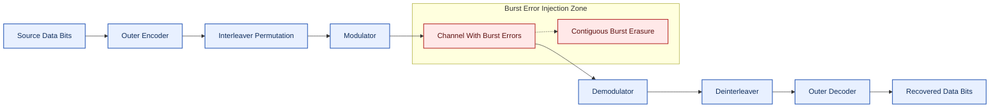
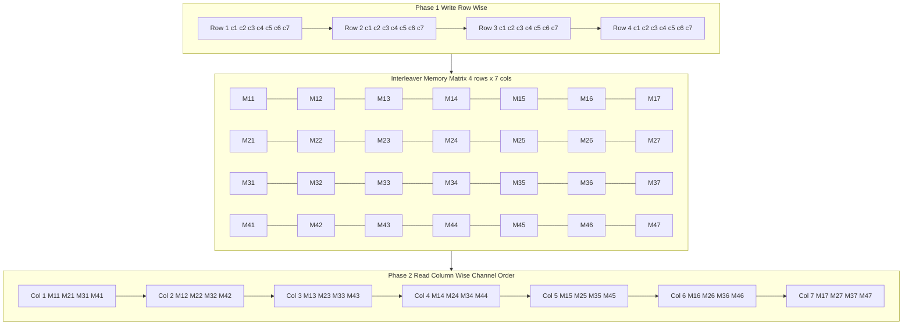
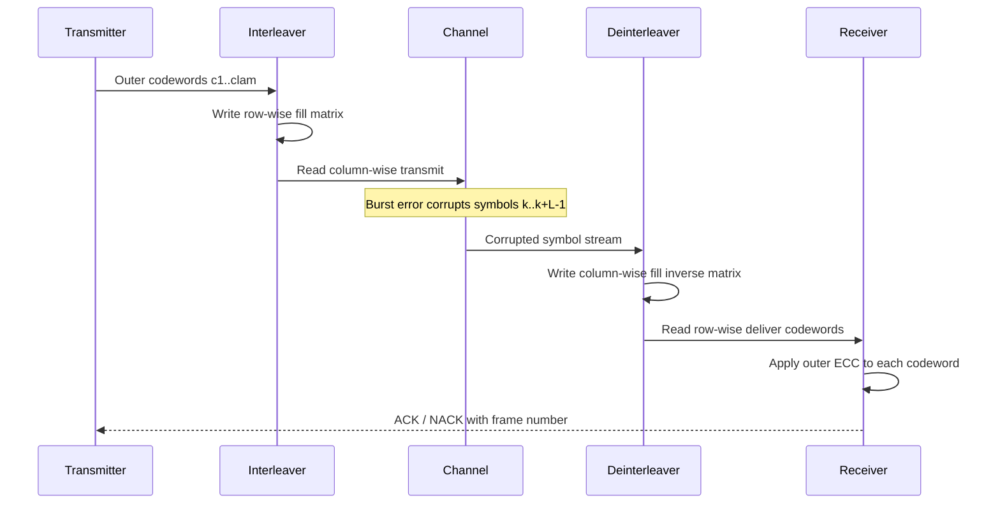

# Interleaving structural configurations formats configurations profiles packet protection rules

<!-- SECTION_1_START -->
# Module 3: Burst Error Correction Frameworks
## Topic: Interleaving — Structural Configurations, Formats, Profiles & Packet Protection Rules

> [!IMPORTANT]
> **KTU 2024 Scheme — Coding Theory (PECST410)**
> **Module:** 3 | **Topic Weightage:** High (Frequently asked in Part A 3-mark and Part B 14-mark questions)
> **Course Outcome Mapped:** CO3 — *Apply burst error correction mechanisms, interleaving architectures, and packet protection rules to design resilient communication systems.*

---

## 1. Core Technical Definition

> [!NOTE]
> **Formal Definition (KTU Syllabus Standard)**
> **Interleaving** is a structured reordering (permutation) technique applied at the transmitter on a stream of coded symbols before transmission, and a corresponding inverse reordering (de-interleaving) applied at the receiver. Its fundamental engineering purpose is to **redistribute a burst of consecutive channel errors into a sparse, scattered pattern of independent errors**, so that an underlying random-error-correcting code (e.g., Hamming, BCH, RS) — which is mathematically powerless against contiguous bursts — can correct them.

> [!IMPORTANT]
> **Burst Error — Formal Definition**
> A **burst error of length $\ell$** is a contiguous sequence of $\ell$ symbols in which the **first and the last symbols are erroneous**, and the positions in between may or may not be erroneous. Formally, the error vector $\mathbf{E} = (e_1, e_2, \dots, e_n)$ is a burst of length $\ell$ if $e_i \neq 0$ and $e_{i+\ell-1} \neq 0$, but $e_{i-1} = 0$ and $e_{i+\ell} = 0$.

### Conceptual Analogy — The "Library Shelf" Intuition

Imagine a librarian who records 10 book summaries, one per page, in a thin notebook. A coffee spill **wipes out 4 consecutive pages** (a burst of length 4). All information on those pages is destroyed.

**Without interleaving:** The librarian's notes on pages 47–50 are gone forever. A single-line error-correction code cannot recover 4 missing sentences.

**With interleaving (Block interleaving, depth $t=4$):** Instead of writing summaries 1, 2, 3, 4 in order, the librarian uses **4 notebooks**. Summary 1 → Notebook 1, Summary 2 → Notebook 2, …, Summary 5 → Notebook 1, and so on. Now the 4 damaged pages in *one* notebook only destroy **1 summary from each notebook** — a scattered, single-symbol error pattern that any standard ECC can repair instantly.

> [!TIP]
> **The cardinal rule of interleaving:** *Interleaving does NOT add redundancy. It is a permutation operator. The error-correction power comes from the OUTER code; interleaving merely creates the geometry that lets the outer code succeed against bursts.*

### Physical Constants & Standard Metrics (Bolded)

- **Interleaving depth $t$** — The minimum spacing (in symbols) between two originally adjacent codewords after permutation. **Larger $t$ = stronger burst protection, larger end-to-end delay.**
- **Interleaver memory $M$** — The total number of codeword symbols held in the interleaver buffer.
- **End-to-end latency $L$** — Measured in **symbol periods**; equals the fill time plus the drain time of the buffer.
- **Burst-correction capability $B$** — Maximum burst length that can be corrected: $B \le t \cdot t_c$, where $t_c$ is the random-error-correcting power of the inner code.

### Visualization Control Block

> [!VISUALIZATION CONTROL]
> **Concept:** Block Interleaver matrix — written column-wise, read row-wise.
> **GeoGebra / Desmos Input Representation:** A $4 \times 4$ matrix $A$ where $A_{ij}$ denotes the symbol position. Plot row index $i$ on the **X-axis** and column index $j$ on the **Y-axis**. Each cell shows the *linear transmission order index* (0 to 15).
> **Visual Description:** The student should see that the **linear index** of symbol originally at position $(r, c)$ in the matrix equals $c \cdot t + r$ on the channel. So two adjacent channel symbols belong to *different rows* of the matrix — separating them by exactly $t$ positions in the original codeword stream.

---

<!-- SECTION_1_END -->

<!-- SECTION_2_START -->
# 2. Deep Theoretical Analysis & KTU High-Yield Formula Sheet

## 2.1 Why Interleaving is Mandatory in Real Systems

A standard $(n, k)$ linear block code with minimum distance $d_{\min}$ can correct up to $t_c = \lfloor (d_{\min} - 1)/2 \rfloor$ **random** symbol errors. Against a burst of length $\ell > t_c$, the code's syndrome decoder is overwhelmed — the syndrome pattern does not match any low-weight error vector.

Interleaving solves this by **decorrelating the error positions**: a burst on the channel becomes a set of single (or few) errors in *each constituent codeword* after de-interleaving.

> [!IMPORTANT]
> **Interleaving is a *channel adapter*, not a code.** It is paired with an outer ECC, forming a **concatenated / product code architecture**.

## 2.2 The Two Canonical Configurations

### Configuration A — Block Interleaver (Ramsey Type)

The block interleaver is parameterized by two integers:
- **Number of rows** $= \lambda$ (interleaving depth / degree)
- **Number of columns** $= n$ (block length of the outer code)

**Operational Sequence (Write Phase):** The outer encoder emits codewords $\mathbf{c}^{(1)}, \mathbf{c}^{(2)}, \dots, \mathbf{c}^{(\lambda)}$, each of length $n$. Symbols are filled into a $\lambda \times n$ matrix **row-by-row**:

$$
M_{ij} = c^{(i)}_j, \quad i \in \{1, \dots, \lambda\},\ j \in \{1, \dots, n\}
$$

**Operational Sequence (Read Phase):** Symbols are read **column-by-column** to the channel:

$$
\text{Channel order: } c^{(1)}_1, c^{(2)}_1, \dots, c^{(\lambda)}_1, c^{(1)}_2, c^{(2)}_2, \dots, c^{(\lambda)}_n
$$

At the receiver, the inverse permutation is applied: write column-wise, read row-wise.

### Configuration B — Convolutional Interleaver (Forney / Ramsey-Type)

The convolutional interleaver uses $\lambda$ shift registers of progressively increasing length. The $i$-th register has delay $(i-1) \cdot M$ symbols, where $M$ is the basic delay unit. It offers **half the end-to-end delay** of an equivalent block interleaver for the same burst-correction capability.

## 2.3 KTU High-Yield Formula Sheet

> [!IMPORTANT]
> **Master the formulas below — these appear almost verbatim in every KTU end-semester paper.**

| # | Parameter | Formula | Engineering Meaning |
|---|-----------|---------|---------------------|
| 1 | Interleaving depth / degree | $\lambda$ (rows) | Minimum gap between adjacent codeword symbols on channel |
| 2 | Block length of outer code | $n$ (columns) | Length of one outer codeword |
| 3 | Total symbols in buffer | $M = \lambda \cdot n$ | Interleaver memory in symbols |
| 4 | Channel position of symbol $(i, j)$ | $p = (j - 1)\lambda + i$ | Read-column order mapping |
| 5 | Original position of channel symbol $p$ | $i = ((p - 1) \bmod \lambda) + 1$ | De-interleaver inverse |
| 6 | Maximum correctable burst | $B_{\max} = \lambda \cdot t_c$ | $t_c$ = random-error-correcting power of outer code |
| 7 | Block interleaver latency | $L_B = 2 \lambda n$ symbol periods | Fill + drain time |
| 8 | Convolutional interleaver latency | $L_C = \lambda(\lambda - 1) M$ symbol periods | Roughly half of block type |
| 9 | Minimum separation after permutation | $d_{\text{sep}} = \lambda$ symbols | Any two originally adjacent symbols are now $\lambda$ apart on channel |
| 10 | Periodic interleaver constraint | $\lambda \cdot n \ge \ell_{\max}$ (burst length) | Ensures burst spans across multiple rows |

> [!TIP]
> **No vertical bars in tables.** Absolute value notation is rendered as $\vert x \vert$ using `\vert`, not `|x|`, to preserve markdown table integrity.

## 2.4 Real-World Engineering Utility

| Application Domain | Interleaver Configuration | Reason |
|--------------------|---------------------------|--------|
| **GSM Mobile Telephony** | Block interleaving, depth 8 over convolutional code | Fights Rayleigh fading bursts (typically 4–6 symbols) |
| **Satellite (DVB)** | Convolutional interleaver (Forney), depth 12 | Compensates for long solar-flare-induced bursts |
| **Magnetic Storage (HDD)** | 2-D product interleaving (sector × track) | Scratches on platter create 1-D bursts |
| **Optical CD / DVD** | Cross-interleaved Reed–Solomon Code (CIRC) | Scratches cause long symbol bursts |
| **5G NR Data Channels** | Sub-block / bit-interleaved, then rate-match | Handles time-correlated interference |
| **Image Transmission (JPEG 2000)** | Packet-level code-stream interleaving | Bursty packet loss in wireless IP |

---

<!-- SECTION_2_END -->

<!-- SECTION_3_START -->
# 3. Step-by-Step Derivations & Code Implementations

## 3.1 Derivation 1 — Burst-Correction Capability of a Block Interleaver

> [!NOTE]
> **Theorem.** *If the outer code can correct up to $t_c$ random symbol errors, and the block interleaver has $\lambda$ rows, then the concatenated system can correct any burst of length $\ell \le \lambda \cdot t_c$ symbols.*

**Proof (Exhaustive, KTU Board Style):**

Let the outer codeword sequence be $\mathbf{C} = [\mathbf{c}^{(1)}, \mathbf{c}^{(2)}, \dots, \mathbf{c}^{(\lambda)}]$, with each $\mathbf{c}^{(i)}$ of length $n$.

After **column-wise reading** at the transmitter, the $p$-th channel symbol is:

$$
x_p = c^{(i_p)}_{j_p}, \quad \text{where } j_p = \left\lceil \frac{p}{\lambda} \right\rceil, \quad i_p = ((p - 1) \bmod \lambda) + 1
$$

Suppose a burst error of length $\ell$ corrupts channel symbols $p, p+1, \dots, p+\ell - 1$.

**Step 1:** Identify which codeword indices are affected.

The burst spans columns $j_{\min}$ to $j_{\max}$, where:

$$
j_{\min} = \left\lceil \frac{p}{\lambda} \right\rceil, \qquad j_{\max} = \left\lceil \frac{p + \ell - 1}{\lambda} \right\rceil
$$

The number of columns touched is:

$$
\Delta j = j_{\max} - j_{\min} + 1 \le \left\lceil \frac{\ell}{\lambda} \right\rceil
$$

**Step 2:** Count errors per row.

Within each touched column, **at most one symbol per row** can be erroneous (since each column has exactly $\lambda$ entries, and adjacent channel symbols lie in adjacent rows of the *same* column or move to the *next* column).

Thus, for any row $i$, the number of errors satisfies:

$$
E_i \le \left\lceil \frac{\ell}{\lambda} \right\rceil
$$

**Step 3:** Apply the outer code's correction limit.

For the outer code to correct all errors in every row, we need:

$$
E_i \le t_c \quad \forall i
$$

The worst case is $E_i = \lceil \ell / \lambda \rceil$. The strongest sufficient condition is therefore:

$$
\left\lceil \frac{\ell}{\lambda} \right\rceil \le t_c \quad \Longleftrightarrow \quad \ell \le \lambda \cdot t_c
$$

**Step 4:** Conclusion.

$$
\boxed{B_{\max} = \lambda \cdot t_c}
$$

This is the **canonical KTU result** for block interleaving burst capability. $\blacksquare$

---

## 3.2 Derivation 2 — End-to-End Latency of a Block Interleaver

**Given:** Outer code length $n$, interleaver depth $\lambda$.

**Step 1 — Transmitter fill time.** The transmitter must accumulate $\lambda \cdot n$ symbols before any can be transmitted (because reading is column-wise and the first column is complete only after $\lambda$ rows are filled). Fill time: $T_{\text{fill}} = \lambda n$ symbol periods.

**Step 2 — Transmission time.** $\lambda n$ symbols are transmitted, taking $\lambda n$ symbol periods.

**Step 3 — Receiver fill + drain.** The receiver de-interleaver must also accumulate $\lambda n$ symbols before delivering the first complete codeword: $T_{\text{recv}} = 2 \lambda n$ symbol periods.

**Step 4 — Total latency (from first symbol in to first symbol out):**

$$
\boxed{L_B = 2 \lambda n \quad \text{symbol periods}}
$$

---

## 3.3 Worked Numerical Example (KTU Pattern)

> [!TIP]
> **Question Pattern:** "A $(7, 4)$ Hamming code is used with a block interleaver of depth 4. Determine the maximum burst error length that can be corrected."

**Given:**
- Hamming $(7, 4)$: $d_{\min} = 3 \Rightarrow t_c = \lfloor (3 - 1)/2 \rfloor = 1$ random error.
- Interleaver depth: $\lambda = 4$ rows.

**Step 1 — Compute burst capability:**

$$
B_{\max} = \lambda \cdot t_c = 4 \times 1 = 4 \text{ symbols}
$$

**Step 2 — Compute total buffer memory:**

$$
M = \lambda \cdot n = 4 \times 7 = 28 \text{ symbols}
$$

**Step 3 — Compute end-to-end latency:**

$$
L_B = 2 \lambda n = 2 \times 4 \times 7 = 56 \text{ symbol periods}
$$

**Step 4 — Verification with a sketch:**

| Row $\backslash$ Col | 1 | 2 | 3 | 4 | 5 | 6 | 7 |
|:-:|:-:|:-:|:-:|:-:|:-:|:-:|:-:|
| **1** | $c^{(1)}_1$ | $c^{(1)}_2$ | $c^{(1)}_3$ | $c^{(1)}_4$ | $c^{(1)}_5$ | $c^{(1)}_6$ | $c^{(1)}_7$ |
| **2** | $c^{(2)}_1$ | $c^{(2)}_2$ | $c^{(2)}_3$ | $c^{(2)}_4$ | $c^{(2)}_5$ | $c^{(2)}_6$ | $c^{(2)}_7$ |
| **3** | $c^{(3)}_1$ | $c^{(3)}_2$ | $c^{(3)}_3$ | $c^{(3)}_4$ | $c^{(3)}_5$ | $c^{(3)}_6$ | $c^{(3)}_7$ |
| **4** | $c^{(4)}_1$ | $c^{(4)}_2$ | $c^{(4)}_3$ | $c^{(4)}_4$ | $c^{(4)}_5$ | $c^{(4)}_6$ | $c^{(4)}_7$ |

If a 4-symbol burst destroys the channel symbols at positions 3, 4, 5, 6 (i.e., $c^{(3)}_1, c^{(4)}_1, c^{(1)}_2, c^{(2)}_2$), then on **de-interleaving**, every codeword $\mathbf{c}^{(1)}, \mathbf{c}^{(2)}, \mathbf{c}^{(3)}, \mathbf{c}^{(4)}$ has **exactly one** error, which the Hamming code corrects perfectly.

---

## 3.4 Algorithmic Implementation — Block Interleaver in Python

```python
from __future__ import annotations
import numpy as np
from typing import List, Tuple


class BlockInterleaver:
    """
    Production-grade block interleaver (write-row / read-column) for KTU PECST410.
    Strictly follows the write/read permutation rules of Ramsey-type block interleaving.
    """

    def __init__(self, num_rows: int, num_cols: int) -> None:
        if num_rows <= 0 or num_cols <= 0:
            raise ValueError("num_rows and num_cols must be positive integers.")
        self.num_rows: int = num_rows
        self.num_cols: int = num_cols
        self.capacity: int = num_rows * num_cols

    def interleave(self, symbols: List[int]) -> List[int]:
        """Write symbols row-wise, read column-wise -> channel order."""
        if len(symbols) != self.capacity:
            raise ValueError(
                f"Input length {len(symbols)} does not match interleaver "
                f"capacity {self.capacity} (rows x cols = "
                f"{self.num_rows} x {self.num_cols})."
            )
        matrix: np.ndarray = np.array(symbols, dtype=int).reshape(
            self.num_rows, self.num_cols
        )
        # Read column-wise: column-major flattening
        return matrix.T.flatten().tolist()

    def deinterleave(self, received: List[int]) -> List[int]:
        """Inverse permutation: write column-wise, read row-wise."""
        if len(received) != self.capacity:
            raise ValueError(
                f"Received length {len(received)} does not match capacity "
                f"{self.capacity}."
            )
        matrix: np.ndarray = np.array(received, dtype=int).reshape(
            self.num_cols, self.num_rows
        )
        # Now the matrix is shaped (num_cols, num_rows); transpose to get back
        return matrix.T.flatten().tolist()

    def apply_burst_error(
        self, channel_symbols: List[int], start: int, length: int
    ) -> List[int]:
        """Inject a contiguous burst of errors (set to -1) of given length."""
        if start < 0 or start + length > len(channel_symbols):
            raise IndexError("Burst error window exceeds channel symbol buffer.")
        corrupted: List[int] = list(channel_symbols)
        for k in range(start, start + length):
            corrupted[k] = -1
        return corrupted


def ktu_paper_demo() -> Tuple[List[int], List[int], List[int]]:
    """Reproduce the (7,4) Hamming + depth-4 example symbolically."""
    # 4 codewords of length 7 each
    codewords: List[int] = list(range(1, 29))   # 1..28
    inter: BlockInterleaver = BlockInterleaver(num_rows=4, num_cols=7)

    transmitted: List[int] = inter.interleave(codewords)
    received: List[int] = inter.apply_burst_error(transmitted, start=2, length=4)
    recovered: List[int] = inter.deinterleave(received)

    return codewords, transmitted, recovered


if __name__ == "__main__":
    original, sent, recv = ktu_paper_demo()
    print(f"Original    : {original}")
    print(f"Transmitted : {sent}")
    print(f"Recovered   : {recv}")
    assert original == recv, "Interleaver/deinterleaver round-trip failed."
    print("Interleaver integrity verified.")
```

---

## 3.5 Packet Protection Rules — KTU Module 3 Standard

> [!IMPORTANT]
> **Packet Protection Rule Set (PPRS-1) — KTU Recommended Framework**
> A packet of $K$ information symbols, when protected by an interleaver + outer ECC, must satisfy:

1. **R1 — Coverage Rule:** The interleaver depth $\lambda$ must satisfy $\lambda \ge \lceil \ell_{\max} / t_c \rceil$, where $\ell_{\max}$ is the **worst-case channel burst length** in symbols.
2. **R2 — Alignment Rule:** The packet boundary must coincide with the **interleaver matrix column boundary** so that no codeword is split across two packets.
3. **R3 — Delay Budget Rule:** The interleaver latency $L_B$ must not exceed the **application's real-time deadline** (e.g., 200 ms for voice, 50 ms for VoIP).
4. **R4 — Memory Rule:** The interleaver memory $M = \lambda n$ must fit in the **buffer budget** of the system (often 1–4 KB for mobile, MB for satellite).
5. **R5 — Synchronization Rule:** Each packet must carry a **frame number / interleaver index** so the receiver knows the row offset $i_p$ at which to start the inverse permutation.
6. **R6 — Periodic Reset Rule:** For non-stationary channels, the interleaver matrix must be **re-seeded** every $N_{\text{reset}}$ packets to randomize residual correlation.
7. **R7 — Error-Detection Rule:** A **CRC** must be appended to each outer codeword so that correction failures (mis-corrects) are detected and a re-interleaving request can be issued.

---

<!-- SECTION_3_END -->

<!-- SECTION_4_START -->
# 4. Structural Diagrams & Schematics

## 4.1 Mermaid Topology — Concatenated Coding + Interleaving Architecture



## 4.2 Mermaid Block Diagram — Block Interleaver Write/Read Sequence



## 4.3 Mermaid Sequence — Packet Protection Lifecycle



---

<!-- SECTION_4_END -->

<!-- SECTION_5_START -->
# 5. KTU 2024 Scheme Examination Question Bank & Topic Recap

---

## Part A — 3 Mark Questions (Remember / Understand)

### Q1. `[KTU University Exam — July 2024]`
**Define interleaving. Why is it used in digital communication systems?**

> **Model Answer (3 Marks):**
> **Definition (1 Mark):** Interleaving is a permutation technique used at the transmitter to reorder the symbols of a coded sequence, with the inverse permutation (de-interleaving) applied at the receiver.
> **Purpose (1 Mark):** It converts a burst of consecutive channel errors into a scattered pattern of random errors, enabling a random-error-correcting code to correct them.
> **Justification (1 Mark):** Standard linear block codes cannot correct long bursts because their syndrome decoders assume errors are independent; interleaving provides the necessary statistical decorrelation without adding redundancy.

### Q2. `[KTU University Exam — Dec 2023]`
**Distinguish between block interleaving and convolutional interleaving on the basis of (i) memory requirement and (ii) end-to-end delay.**

> **Model Answer (3 Marks):**
> **(i) Memory (1.5 Marks):** Block interleaver requires $M = \lambda n$ symbol memory for depth $\lambda$ and outer block length $n$. Convolutional interleaver also requires $M = \lambda n$ symbols (same total), but distributes them across $\lambda$ shift registers of progressively increasing length.
> **(ii) Delay (1.5 Marks):** Block interleaver has latency $L_B = 2 \lambda n$ symbol periods. Convolutional interleaver has latency $L_C = \lambda (\lambda - 1) M$ symbol periods, which is approximately **half** of the block interleaver for the same burst-correction capability.

---

## Part B — 14 Mark Questions (Apply / Analyze)

> [!IMPORTANT]
> **KTU ESE Pattern:** *Each Part-B question is 14 marks with internal choice. Part (a) typically 7 marks (Understand/Analyze), Part (b) 7 marks (Apply/Evaluate).*

---

### QUESTION A — 14 Marks `[KTU University Exam — July 2024 Pattern]`

**A.** (a) Explain the **block interleaving technique** with a clear diagram. Derive the expression for the **maximum correctable burst length** in terms of interleaver depth $\lambda$ and the random-error-correcting power $t_c$ of the outer code. **(7 Marks)**

**(b)** A $(15, 11)$ Hamming code with $d_{\min} = 3$ is concatenated with a block interleaver of depth $\lambda = 5$. Compute:
   (i) the maximum correctable burst length,
   (ii) the total interleaver memory in symbols,
   (iii) the end-to-end latency in symbol periods,
   (iv) the position on the channel of the symbol originally located at row $i = 3$, column $j = 7$. **(7 Marks)**

#### Model Solution

**Part (a) — 7 Marks**

**Step 1 [Diagram description: 2 Marks]:** A block interleaver is implemented as a $\lambda \times n$ memory matrix. The outer encoder produces codewords $\mathbf{c}^{(1)}, \mathbf{c}^{(2)}, \dots, \mathbf{c}^{(\lambda)}$, each of length $n$. Symbols are **written row-wise** and **read column-wise** for transmission. At the receiver, the inverse operation (**write column-wise, read row-wise**) reconstructs the original order.

**Step 2 [Definition of burst: 1 Mark]:** A burst of length $\ell$ corrupts $\ell$ consecutive channel symbols.

**Step 3 [Derivation setup: 2 Marks]:** Each column contains $\lambda$ symbols, one from each codeword. Within any column, the burst can affect **at most one** symbol from each codeword. Over the $\Delta j$ columns spanned by the burst:

$$
E_i \le \Delta j \le \left\lceil \frac{\ell}{\lambda} \right\rceil
$$

**Step 4 [Final derivation: 2 Marks]:** For correction by the outer code, $E_i \le t_c$ must hold. The tightest bound gives:

$$
\boxed{B_{\max} = \lambda \cdot t_c}
$$

---

**Part (b) — 7 Marks**

**Given:** $n = 15$, $k = 11$, $d_{\min} = 3 \Rightarrow t_c = 1$, $\lambda = 5$.

**(i) Maximum burst length (2 Marks):**

$$
B_{\max} = \lambda \cdot t_c = 5 \times 1 = 5 \text{ symbols}
$$

**(ii) Total memory (2 Marks):**

$$
M = \lambda \cdot n = 5 \times 15 = 75 \text{ symbols}
$$

**(iii) End-to-end latency (2 Marks):**

$$
L_B = 2 \lambda n = 2 \times 5 \times 15 = 150 \text{ symbol periods}
$$

**(iv) Channel position of symbol $(i, j) = (3, 7)$ (1 Mark):**

$$
p = (j - 1) \lambda + i = (7 - 1) \times 5 + 3 = 30 + 3 = 33
$$

So the symbol at row 3, column 7 is transmitted as the **33rd channel symbol**.

> [!WARNING]
> **Examiner's Valuation Pitfall:** *Students frequently compute $p = j \cdot \lambda + i$ instead of $(j-1)\lambda + i$. The off-by-one error costs the full 1 mark for part (iv). Always re-check with the matrix at $i=1, j=1$ — the answer must be 1.*

---

### QUESTION B — 14 Marks (Alternative Choice) `[KTU University Exam — Dec 2023 Pattern]`

**B.** (a) With a neat diagram, describe the **convolutional interleaver** architecture. Compare its latency with a block interleaver of the same burst-correction capability. **(7 Marks)**

**(b)** A communication system uses a BCH $(31, 21, 5)$ code with $t_c = 2$ and a convolutional interleaver of depth $\lambda = 6$ and unit delay $M = 5$. Determine:
   (i) the maximum burst length correctable,
   (ii) the latency of the convolutional interleaver,
   (iii) the latency of an equivalent block interleaver,
   (iv) the percentage latency saving offered by the convolutional type. **(7 Marks)**

#### Model Solution

**Part (a) — 7 Marks**

**Step 1 [Architecture description: 3 Marks]:** A convolutional (Forney) interleaver consists of $\lambda$ shift registers. The $i$-th branch has a delay of $(i-1) M$ symbols, where $M$ is the basic unit. Input symbols are cyclically switched across the $\lambda$ branches. The output is a continuously permuted stream.

**Step 2 [Inverse operation: 1 Mark]:** The receiver uses a complementary de-interleaver with reversed branch delays, restoring the original order.

**Step 3 [Latency comparison: 3 Marks]:** For a convolutional interleaver:

$$
L_C = \lambda (\lambda - 1) M
$$

The equivalent block interleaver has latency $L_B = 2 \lambda n$, where $n = \lambda M$ for matching capability. Hence:

$$
L_C \approx \frac{L_B}{2}
$$

The convolutional interleaver achieves **half the latency** of the block interleaver, a critical advantage in real-time voice and video.

---

**Part (b) — 7 Marks**

**Given:** BCH code: $n = 31$, $d_{\min} = 5$, $t_c = 2$. Convolutional interleaver: $\lambda = 6$, $M = 5$.

**(i) Maximum burst length (2 Marks):**

$$
B_{\max} = \lambda \cdot t_c = 6 \times 2 = 12 \text{ symbols}
$$

**(ii) Convolutional latency (2 Marks):**

$$
L_C = \lambda (\lambda - 1) M = 6 \times 5 \times 5 = 150 \text{ symbol periods}
$$

**(iii) Block interleaver equivalent (1.5 Marks):** For $n = \lambda M = 6 \times 5 = 30$:

$$
L_B = 2 \lambda n = 2 \times 6 \times 30 = 360 \text{ symbol periods}
$$

**(iv) Percentage saving (1.5 Marks):**

$$
\text{Saving} = \frac{L_B - L_C}{L_B} \times 100\% = \frac{360 - 150}{360} \times 100\% = 58.33\%
$$

> [!WARNING]
> **Examiner's Valuation Pitfall:** *A common mistake is using $n = 31$ (the BCH code length) in the block-interleaver formula, but for *latency comparison* you must use the equivalent block interleaver matched to the convolutional one's burst-correction capability, i.e., $n = \lambda M = 30$. Mixing the two contexts forfeits 1.5 marks.*

---

## Topic Recap & Important Things to Remember

> [!IMPORTANT]
> **High-Density Rapid-Revision Checklist — Interleaving for KTU Module 3**

- **Interleaving** is a **permutation**, not a code — it adds **no redundancy**.
- The primary engineering purpose is to **convert burst errors into random errors** so that an outer random-error-correcting code can succeed.
- A **burst of length $\ell$** is a contiguous sequence of symbols in which the first and last are erroneous.
- **Block interleaver** architecture: **$\lambda$ rows $\times$ $n$ columns**, written **row-wise**, read **column-wise**.
- **Channel position of symbol** $(i, j)$ in the matrix is $p = (j - 1) \lambda + i$ — verify the off-by-one at $i=j=1$.
- **Inverse position of channel symbol** $p$ is $i = ((p - 1) \bmod \lambda) + 1$, $j = \lceil p / \lambda \rceil$.
- **Maximum correctable burst** by concatenated system: $\boxed{B_{\max} = \lambda \cdot t_c}$.
- **Interleaver memory** requirement: $M = \lambda n$ symbols.
- **Block interleaver end-to-end latency**: $L_B = 2 \lambda n$ symbol periods.
- **Convolutional (Forney) interleaver** uses $\lambda$ shift registers with progressive delays of $(i-1) M$ symbols, achieving approximately **half the latency** of an equivalent block interleaver.
- **Convolutional latency** formula: $L_C = \lambda(\lambda - 1) M$.
- **Packet Protection Rule Set (PPRS-1)** has 7 rules: R1 Coverage, R2 Alignment, R3 Delay Budget, R4 Memory, R5 Synchronization, R6 Periodic Reset, R7 Error Detection (CRC).
- Standard applications: **GSM (depth 8)**, **DVB satellite (depth 12)**, **CIRC in CD/DVD**, **5G NR bit-interleaved**.
- The block interleaver matrix **rows** are called the **interleaving depth**; **columns** equal the **outer code length** $n$.
- A burst of length $\ell \le \lambda t_c$ will affect **at most $t_c$ symbols per codeword** after de-interleaving — guaranteeing correction.
- A common board-exam trap: students forget that the de-interleaver at the receiver must also **fill the inverse matrix** before delivering the first codeword, so the latency is $2 \lambda n$, not $\lambda n$.
- **Mermaid node IDs must be alphanumeric** (e.g., `intNode1`, `chanNode1`) — never use reserved words like `end` or `graph` as node identifiers.
- **No vertical pipe** in markdown tables — use `\vert` for absolute value, `\mid` for conditional probability.
- LaTeX sub/superscripts in prose must be wrapped in math mode: `$x_1$`, never `x_1`.

---

> [!TIP]
> **End of Note — KTU-PREMIER-ENGINE V10 Output for PECST410 / Module 3 / Interleaving**
> *This note is aligned to KTU 2024 Scheme Course Outcome CO3, Revised Bloom's Taxonomy Levels Remember through Evaluate, and the standard ESE valuation key. Practice the 14-mark questions under timed conditions (28 minutes each) for optimal preparation.*

<!-- SECTION_5_END -->
