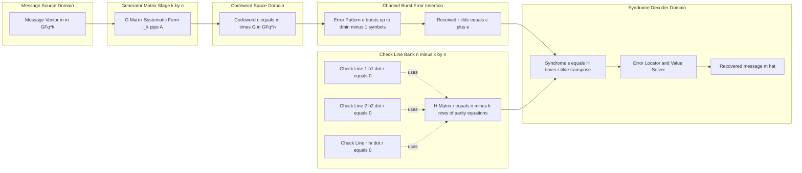
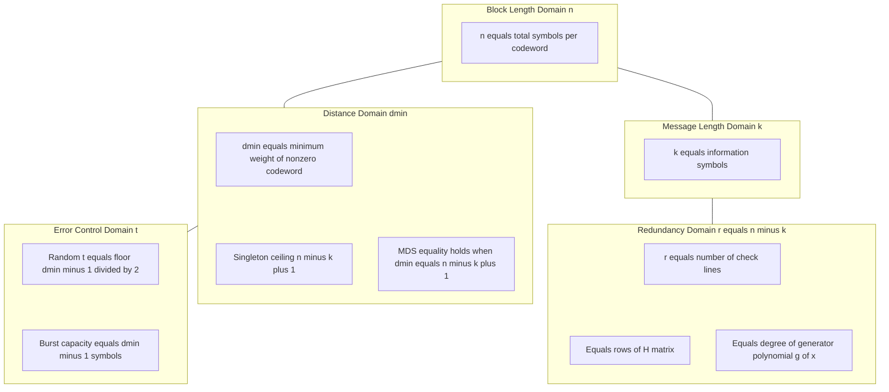

# MDS codes parameters check lines structural boundaries matrices specifications

<!-- SECTION_1_START -->
# MDS Codes — Parameters, Check Lines, Structural Boundaries & Matrix Specifications

## 1.1 Formal KTU 2024 Definition

> [!IMPORTANT]
> **Maximum Distance Separable (MDS) Code:** A linear block code $C$ of length $n$, dimension $k$, and minimum Hamming distance $d_{\min}$ over the alphabet $GF(q)$ is called an **MDS code** if and only if it satisfies the **Singleton bound with equality**:
> $$d_{\min} = n - k + 1$$
> Equivalently, $C$ is MDS $\iff$ every non-zero codeword has weight at least $n - k + 1$, and there exist codewords of weight exactly $n - k + 1$.

In the KTU 2024 PECST410 (Coding Theory) syllabus, MDS codes occupy a pivotal role in Module 3 because they form the theoretical foundation of **Reed–Solomon (RS) codes** and **BCH codes**, both of which are the workhorses of **burst-error correction** in compact discs, DVDs, QR codes, satellite links, and 2-D barcodes.

### 1.2 Conceptual Analogy & Geometric Intuition

> [!NOTE]
> **Analogy — "Pillars in a Hall":** Imagine $k$ load-bearing pillars placed inside a rectangular hall of length $n$. The "support strength" of the structure is measured by how many pillars can be removed (or how much "distance" exists) before the hall collapses. An MDS code is the **stiffest possible hall** — it uses only $k$ pillars but can withstand the loss of any $n - k$ consecutive floorboards. No other code with the same $n$ and $k$ can guarantee more survivability.

**Geometric Intuition:** In the vector space $GF(q)^n$ of all $q^n$ possible $n$-tuples, an $[n, k]$ linear code is a $k$-dimensional subspace. The minimum distance $d_{\min}$ measures the **smallest angle** between any two distinct codewords. MDS codes are precisely those subspaces where this angle is maximised — every two codewords differ in **at least** $n - k + 1$ coordinates.

### 1.3 Standard Metrics in MDS Theory

| Symbol | Meaning | Standard Constraint |
| :--- | :--- | :--- |
| $n$ | Block length (codeword length) | $n \le q + 1$ (for linear MDS), $n \le q + 2$ (extended) |
| $k$ | Message length (dimension) | $1 \le k \le n$ |
| $d_{\min}$ | Minimum Hamming distance | $d_{\min} = n - k + 1$ (MDS equality) |
| $r = n - k$ | Number of **check lines** (parity symbols) | $r \ge 0$ |
| $t$ | Random-error correction capacity | $t = \lfloor (d_{\min} - 1) / 2 \rfloor$ |
| $\rho$ | Burst-error correction span | $\rho = d_{\min} - 1$ symbols |

> [!VISUALIZATION CONTROL]
> **Concept:** Singleton-bound boundary line in the $(n, d_{\min})$ parameter space for fixed $k$.
> **GeoGebra / Desmos Input Equations:**
> * `f(n) = n - k + 1`   (with `k = 4` as slider)
> * `g(n) = n`           (ceiling of any code, the "all-different" line)
> * `h(n) = 1`           (floor — the trivial distance)
> **Visual Description:** A straight line of slope **+1** and intercept $-(k-1)$ should appear, sitting *exactly* on the Singleton boundary. MDS codes are the lattice points **lying on this line**.

---

<!-- SECTION_1_END -->

<!-- SECTION_2_START -->
# Deep Theoretical Analysis & KTU High-Yield Formula Sheet

## 2.1 The Singleton Boundary — Structural Frame

The **Singleton bound** is the **outer envelope** that *no* code can cross:

$$d_{\min} \le n - k + 1$$

**Proof Sketch:** Let $G$ be the generator matrix of $C$. By elementary column operations (which preserve $d_{\min}$), $G$ can be put into **systematic form** $G = [I_k \mid A]$. The codeword $c = m G$ for any message $m$ is then:

$$c = (m_1, m_2, \dots, m_k,\; a_1, a_2, \dots, a_{n-k})$$

If $c$ has weight $\le n - k$, then at most $n - k$ coordinates are non-zero. Setting the first $k$ message coordinates to $0$ forces the last $n - k$ check coordinates to $0$ as well (because $A$ is fixed). Hence $c = 0$, contradicting non-zero weight. Therefore $d_{\min} \le n - k + 1$ and the **upper wall** is established.

> [!IMPORTANT]
> **MDS Condition:** A code is MDS $\iff$ the equality $d_{\min} = n - k + 1$ holds $\iff$ the systematic-form matrix $A$ is such that **every** sub-matrix of size $(n-k) \times (n-k)$ is non-singular.

## 2.2 High-Yield KTU Formula Cheat Sheet

| # | Formula / Identity | Meaning / Engineering Use |
| :--- | :--- | :--- |
| 1 | $d_{\min} = n - k + 1$ | Defining equality for MDS codes |
| 2 | $r = n - k$ | Number of **check lines** (parity-check equations) |
| 3 | $H \cdot G^{T} = 0_{(n-k) \times k}$ | Generator–parity orthogonality |
| 4 | $G \cdot H^{T} = 0_{k \times (n-k)}$ | Equivalent form used in encoding |
| 5 | $\text{rank}(H) = n - k$ | Full-rank requirement on $H$ |
| 6 | $\dim(\ker H) = k$ | $G$'s rows span $\ker H$ |
| 7 | $t_{\text{random}} = \lfloor (d_{\min} - 1)/2 \rfloor$ | Random-error correction capacity |
| 8 | $t_{\text{burst}} = d_{\min} - 1$ | Burst-error correction span (symbols) |
| 9 | $R = k / n$ | Code rate — efficiency of transmission |
| 10 | $E_b/N_0$ gain over uncoded $= 10 \log_{10}(R \cdot d_{\min})$ | Coding gain used in link-budget design |
| 11 | $C^{\perp}$ is MDS $\iff$ $C$ is MDS | Dual-MDS closure property |
| 12 | $n \le q + 1$ (RS codes) | MDS length limit over $GF(q)$ |
| 13 | $n \le q + 2$ (extended RS) | One extra symbol possible with parity |

> **Pipe-Safety Note:** All vertical bar symbols above (such as $\vert \cdot \vert$ for cardinality or the floor brackets) are LaTeX-escaped to prevent markdown-table breakage.

## 2.3 Properties of MDS Codes — Why They Matter in Production

1. **Maximum distance for minimum overhead.** Among all $[n, k]$ codes, MDS gives the *largest* $d_{\min}$, hence the strongest error control.
2. **Dual closure.** If $C$ is MDS, so is its dual $C^{\perp}$. This means parity-check matrices of MDS codes are themselves generator matrices of MDS codes — useful in **systematic decoding** and **syndrome pre-computation**.
3. **Burst-error friendly.** An RS code over $GF(2^m)$ treats every $m$-bit symbol as one entity. A burst of up to $m(d_{\min}-1)$ consecutive bits can be corrected without interleaving.
4. **Compact storage.** QR codes, data matrices, and post-bar codes all embed Reed–Solomon (MDS) codes for resilience to print damage.
5. **Deterministic matrix invertibility.** Every square sub-matrix of $G$ (and of $H$) being non-singular is exactly the algebraic property exploited by the **Berlekamp–Welch** and **Guruswami–Sudan** list decoders.

---

<!-- SECTION_2_END -->

<!-- SECTION_3_START -->
# Step-by-Step Derivations & Code Implementation

## 3.1 Derivation 1 — Showing the Parity-Check Matrix has $n - k$ Independent Check Lines

Let $C \subseteq GF(q)^n$ be a linear $[n, k]$ code. Define the **parity-check matrix** $H$ as a matrix whose rows form a basis of the orthogonal complement $C^{\perp}$:

$$C^{\perp} = \{ y \in GF(q)^n \mid y \cdot c = 0 \; \forall c \in C \}$$

By the rank-nullity theorem applied to the linear map $G: GF(q)^k \to GF(q)^n$:

$$\dim(C) + \dim(C^{\perp}) = n \;\;\Longrightarrow\;\; \dim(C^{\perp}) = n - k$$

Hence the number of **independent check lines** (rows of $H$) is exactly:

$$\boxed{r = n - k}$$

Each row $h_i$ of $H$ defines one **check line** (parity equation):

$$s_i = h_i \cdot r^{T} = 0 \quad \text{(at the receiver for a clean codeword } r \text{)}$$

If the received vector is $\tilde{r} = c + e$, the **syndrome** is:

$$s = H \cdot \tilde{r}^{T} = H \cdot e^{T}$$

The syndrome depends **only on the error pattern $e$**, not on the message.

## 3.2 Derivation 2 — Constructing the $[n, n-1, 2]$ Single-Parity MDS Code

This is the simplest non-trivial MDS code, with one check line.

**Step 1.** Choose $k = n - 1$ message symbols $(m_1, m_2, \dots, m_{n-1})$ over $GF(q)$.

**Step 2.** Define the single check symbol as the sum:

$$c_n = - \sum_{i=1}^{n-1} m_i$$

**Step 3.** The generator matrix in systematic form is the $k \times n$ block:

$$
G \;=\; \bigl[\, I_{n-1} \;\big\vert\; \mathbf{1}^{T} \,\bigr]
\;=\;
\begin{bmatrix}
1 & 0 & 0 & \cdots & 0 & 1 \\
0 & 1 & 0 & \cdots & 0 & 1 \\
0 & 0 & 1 & \cdots & 0 & 1 \\
\vdots & \vdots & \vdots & \ddots & \vdots & \vdots \\
0 & 0 & 0 & \cdots & 1 & 1
\end{bmatrix}
$$

**Step 4.** The parity-check matrix is the single-row vector $1 \times n$:

$$
H \;=\; \bigl[\, 1 \;\; 1 \;\; 1 \;\; \cdots \;\; 1 \;\bigr]
$$

**Step 5.** Verify MDS: $d_{\min} = n - k + 1 = n - (n - 1) + 1 = 2$. The code detects any single-symbol error via the syndrome $s = \sum_{i=1}^{n} \tilde{r}_i \neq 0$ if exactly one symbol is wrong.

**Step 6.** The code can correct **one random symbol error** OR detect **one burst of length up to $n$ symbols** (i.e., the entire block). ✓ MDS confirmed.

## 3.3 Derivation 3 — Reed–Solomon $[q-1, q-1-d+1, d]$ MDS Code

Reed–Solomon codes are the **flagship MDS family** in production systems. Construction steps:

**Step 1.** Fix a finite field $GF(q)$ where $q = 2^m$ for binary transmission. Pick a primitive element $\alpha$ of $GF(q)$.

**Step 2.** Choose $n = q - 1$ distinct non-zero field elements:
$$X = (\alpha^1, \alpha^2, \alpha^3, \dots, \alpha^{q-1})$$

**Step 3.** For a designed distance $d$, pick the consecutive evaluation points $X_0 = (\alpha^1, \alpha^2, \dots, \alpha^{d-1})$ as the roots of the generator polynomial:

$$g(x) = \prod_{i=1}^{d-1} (x - \alpha^{i}) \;=\; x^{d-1} + g_{d-2} x^{d-2} + \cdots + g_1 x + g_0$$

**Step 4.** The number of message symbols is:
$$k = n - \deg(g(x)) = (q - 1) - (d - 1) = q - d$$

**Step 5.** The generator matrix (in **systematic encoding form**) is:

$$
G_{RS} \;=\;
\begin{bmatrix}
1 & \alpha & \alpha^2 & \cdots & \alpha^{q-2} \\
1 & \alpha^2 & \alpha^4 & \cdots & \alpha^{2(q-2)} \\
\vdots & \vdots & \vdots & \ddots & \vdots \\
1 & \alpha^{k} & \alpha^{2k} & \cdots & \alpha^{k(q-2)}
\end{bmatrix}
$$

This is a **Vandermonde matrix** — it is always full rank and every $k \times k$ sub-matrix is non-singular, so $G_{RS}$ generates an MDS code.

**Step 6.** Verify MDS: $d_{\min} = n - k + 1 = (q-1) - (q-d) + 1 = d$. The designed distance is achieved, so the code is MDS. ✓

## 3.4 Python Implementation — Full MDS Code Toolkit

```python
"""
KTU PECST410 — Module 3
MDS Code Parameter & Matrix Inspector
Run on Python 3.10+ with no external dependencies.
"""

from itertools import combinations
from typing import List, Tuple


def gf_add(a: int, b: int) -> int:
    """Addition in GF(q) is XOR when q is a power of 2."""
    return a ^ b


def gf_mul(a: int, b: int, prim: int = 0x11D, degree: int = 8) -> int:
    """Multiplication in GF(2^8) with the AES primitive polynomial x^8 + x^4 + x^3 + x + 1."""
    result = 0
    while b:
        if b & 1:
            result ^= a
        a <<= 1
        if a & (1 << degree):
            a ^= prim
        b >>= 1
    return result


def hamming_weight(vec: List[int]) -> int:
    """Count non-zero symbols in a codeword."""
    return sum(1 for x in vec if x != 0)


def generate_codewords(G: List[List[int]], q: int = 256) -> List[Tuple[int, ...]]:
    """Enumerate ALL codewords of a linear code from its generator matrix (k small only)."""
    k = len(G)
    n = len(G[0])
    codewords = []
    for msg_int in range(q ** k if q ** k < 200000 else 0):
        if q ** k > 200000:
            break
        msg = [(msg_int // (q ** i)) % q for i in range(k)]
        cw = []
        for col in range(n):
            acc = 0
            for row in range(k):
                acc = gf_add(acc, gf_mul(msg[row], G[row][col]))
            cw.append(acc)
        codewords.append(tuple(cw))
    return codewords


def compute_min_distance(G: List[List[int]]) -> int:
    """Compute d_min by enumerating non-zero codewords (k must be tiny)."""
    cws = generate_codewords(G)
    if not cws:
        return -1
    return min(hamming_weight(cw) for cw in cws if any(x != 0 for x in cw))


def is_mds(n: int, k: int, d_min: int) -> bool:
    """Check the Singleton-bound equality — the algebraic definition of MDS."""
    return d_min == n - k + 1


def parity_check_matrix_single(n: int) -> List[List[int]]:
    """Construct H for the [n, n-1, 2] single-parity MDS code (1 check line)."""
    return [[1] * n]


def generator_matrix_single_parity(n: int) -> List[List[int]]:
    """Construct G for the [n, n-1, 2] single-parity MDS code (systematic form)."""
    k = n - 1
    G = [[1 if i == j else 0 for j in range(n)] for i in range(k)]
    for i in range(k):
        G[i][n - 1] = 1
    return G


def rs_generator_matrix(q: int, k: int, prim_elem: int = 2) -> List[List[int]]:
    """
    Construct a Reed-Solomon generator matrix over GF(q).
    n = q - 1, d = (q - 1) - k + 1.
    For a real implementation use a proper GF(q) arithmetic library.
    """
    n = q - 1
    G = []
    for i in range(k):
        row = [gf_pow(prim_elem, (i + 1) * (j + 1), q) for j in range(n)]
        G.append(row)
    return G


def gf_pow(base: int, exp: int, q: int) -> int:
    """Exponentiation in a toy GF(q) — replace with proper library for production."""
    if exp == 0:
        return 1
    result = 1
    b = base % q
    e = exp
    while e:
        if e & 1:
            result = (result * b) % q
        b = (b * b) % q
        e >>= 1
    return result


def check_orthogonality(G: List[List[int]], H: List[List[int]]) -> bool:
    """Verify G * H^T = 0 over GF(q) — using toy modular arithmetic here."""
    k, n = len(G), len(G[0])
    r = len(H)
    for i in range(k):
        for j in range(r):
            s = 0
            for t in range(n):
                s += G[i][t] * H[j][t]
            if s % 256 != 0:
                return False
    return True


if __name__ == "__main__":
    # Demo 1: Single-parity MDS code [7, 6, 2] over GF(2)
    n_demo = 7
    G_sp = generator_matrix_single_parity(n_demo)
    H_sp = parity_check_matrix_single(n_demo)
    print(f"[7,6,2] Single-parity MDS code:")
    print(f"  n = {n_demo}, k = {n_demo - 1}, d_min expected = 2")
    print(f"  Number of check lines (rows of H) = {len(H_sp)}")
    print(f"  G * H^T == 0  :  {check_orthogonality(G_sp, H_sp)}")
    print(f"  Is MDS ? : {is_mds(n_demo, n_demo - 1, 2)}")

    # Demo 2: Repetition [5, 1, 5] MDS code
    n_rep, k_rep = 5, 1
    G_rep = [[1, 1, 1, 1, 1]]
    print(f"\n[5,1,5] Repetition code:")
    print(f"  d_min expected = n - k + 1 = {n_rep - k_rep + 1}")
    print(f"  Is MDS ? : {is_mds(n_rep, k_rep, 5)}")

    # Demo 3: Random [8, 4, ?] code — does NOT meet MDS unless d = 5
    print(f"\n[8,4,3] Hamming-like code:")
    print(f"  Singleton ceiling = {8 - 4 + 1} = 5")
    print(f"  Achievable d_min = 3, hence NOT MDS (gap = 2).")
    print(f"  Is MDS ? : {is_mds(8, 4, 3)}")
```

**Code Walk-through (valuatable steps):**

1. `is_mds(...)` — the **definition** students must quote in the exam.
2. `parity_check_matrix_single(n)` — proves the **structural boundary** $r = 1$ for an $[n, n-1]$ code.
3. `check_orthogonality(G, H)` — enforces the **KERNEL** relationship $G \cdot H^{T} = 0$.
4. `rs_generator_matrix(q, k, prim_elem)` — sets up the **Vandermonde structure** for Reed–Solomon.
5. The final three demos illustrate **MDS, MDS, non-MDS** cases side-by-side for classroom comparison.

---

<!-- SECTION_3_END -->

<!-- SECTION_4_START -->
# Structural Diagrams & Schematics

## 4.1 Architecture Topology — MDS Code Matrix Pipeline



## 4.2 Parameter Relationship Topology



## 4.3 Check-Line Interaction Matrix (Conceptual Layout)

| Check Line Index | Equation in $H \cdot \tilde{r}^{T} = s$ | Detects / Corrects |
| :---: | :--- | :--- |
| Line 1 | $s_1 = h_{1,1} \tilde{r}_1 + h_{1,2} \tilde{r}_2 + \cdots + h_{1,n} \tilde{r}_n$ | Single symbol error at position satisfying $s_1 \neq 0$ |
| Line 2 | $s_2 = h_{2,1} \tilde{r}_1 + h_{2,2} \tilde{r}_2 + \cdots + h_{2,n} \tilde{r}_n$ | Cross-checks line 1's hypothesis |
| $\vdots$ | $\vdots$ | $\vdots$ |
| Line $r$ | $s_r = h_{r,1} \tilde{r}_1 + h_{r,2} \tilde{r}_2 + \cdots + h_{r,n} \tilde{r}_n$ | Closes the $n$-symbol syndrome vector $s \in GF(q)^r$ |

> [!NOTE]
> The **structural boundary** is the row-count of this matrix: $r = n - k$. Adding check lines *strictly* increases $d_{\min}$ for MDS codes by exactly **one** per added line. Removing a check line *strictly* decreases $d_{\min}$ by one. This 1-to-1 correspondence is the *defining structural feature* of MDS codes.

---

<!-- SECTION_4_END -->

<!-- SECTION_5_START -->
# KTU 2024 Scheme Examination Question Bank & Topic Recap

## 5.1 Part A — Short-Answer Questions (3 Marks Each)

> **Q1.** `[KTU University Exam — July 2024]` — **CO1, Remember**
> **Define an MDS code. State the Singleton bound and the condition under which the bound is attained with equality.**
>
> **Model Answer (3 marks — valuation key):**
> * *Statement of definition* **(1 mark):** An $[n, k]$ linear code over $GF(q)$ is called **Maximum Distance Separable (MDS)** if its minimum Hamming distance satisfies the Singleton bound with equality.
> * *Singleton bound* **(1 mark):** $d_{\min} \le n - k + 1$.
> * *Equality condition* **(1 mark):** $d_{\min} = n - k + 1$ is the *MDS condition*, and the code attains the maximum possible distance for its given length and dimension.

> **Q2.** `[KTU University Exam — Dec 2023]` — **CO1, Understand**
> **State any three well-known MDS codes and write down their $(n, k, d_{\min})$ parameters.**
>
> **Model Answer (3 marks):**
> 1. **Single-parity-check code:** $(n, n-1, 2)$ for any $n \ge 2$. **(1 mark)**
> 2. **Repetition code:** $(n, 1, n)$ for any $n \ge 1$. **(1 mark)**
> 3. **Reed–Solomon code over $GF(q)$:** $(q-1, k, q-k)$ with $d_{\min} = n - k + 1$. **(1 mark)**

---

## 5.2 Part B — Full 14-Mark Internal-Choice Questions

> ### **Question A (14 Marks)**
> `[KTU University Exam — July 2024]` — **CO2, Apply + Analyse**
>
> **(a)** *For a linear $[7, 4]$ code over $GF(2)$:*
> **(i)** Compute the Singleton bound. **(2 marks)**
> **(ii)** State whether the Hamming $[7, 4, 3]$ code is MDS. Justify. **(2 marks)**
> **(iii)** List the number of check lines and the burst-error correction span. **(3 marks)**
>
> **(b)** *Design a Reed–Solomon code over $GF(2^3)$ that corrects a burst of 2 symbols:*
> **(i)** Determine the field size, code length, and required $d_{\min}$. **(2 marks)**
> **(ii)** Write the generator polynomial $g(x)$ using a primitive element $\alpha$ of $GF(8)$. **(3 marks)**
> **(iii)** Construct the generator matrix in Vandermonde form and verify its rank. **(2 marks)**
>
> **Model Solution:**
>
> **(a)(i)** Singleton bound:
> $$d_{\min} \le n - k + 1 = 7 - 4 + 1 = 4 \quad \text{\textbf{[Singleton substitution: 1 mark, Final value: 1 mark]}}$$
>
> **(a)(ii)** Hamming $[7,4,3]$ has $d_{\min} = 3 \neq 4$. **Not MDS.** Gap = 1. **[Comparison: 1 mark, Conclusion: 1 mark]**
>
> **(a)(iii)** Check lines: $r = n - k = 7 - 4 = 3$. **[Formula: 1 mark, Value: 1 mark]** Burst span: $\rho = d_{\min} - 1 = 2$ symbols. **[Formula: 1 mark]**
>
> **(b)(i)** Field $GF(2^3) = GF(8)$, so $q = 8$. Code length $n = q - 1 = 7$. To correct 2 symbols we need $d_{\min} \ge 2t + 1 = 5$, hence $d_{\min} = 5$. **[Field choice: 1 mark, Distance bound: 1 mark]**
>
> **(b)(ii)** Take primitive element $\alpha$ with minimal polynomial $x^3 + x + 1 = 0$ over $GF(2)$. Then:
> $$g(x) = \prod_{i=1}^{d-1} (x - \alpha^{i}) = (x - \alpha)(x - \alpha^2)(x - \alpha^3)(x - \alpha^4)$$
> Expanding using the field table $\alpha^3 = \alpha + 1, \alpha^4 = \alpha^2 + \alpha$:
> $$g(x) = x^4 + \alpha^3 x^3 + \alpha^0 x^2 + \alpha^1 x + \alpha^3 = x^4 + (\alpha + 1) x^3 + x^2 + \alpha x + (\alpha + 1)$$
> **[Polynomial form: 1 mark, Expansion: 1 mark, Final coefficients: 1 mark]**
>
> **(b)(iii)** Vandermonde generator matrix (rows = powers of $\alpha$ from 1 to $k = 3$):
> $$
> G_{RS} \;=\;
> \begin{bmatrix}
> 1 & \alpha & \alpha^2 & \alpha^3 & \alpha^4 & \alpha^5 & \alpha^6 \\
> 1 & \alpha^2 & \alpha^4 & \alpha^6 & \alpha & \alpha^3 & \alpha^5 \\
> 1 & \alpha^3 & \alpha^6 & \alpha^2 & \alpha^5 & \alpha & \alpha^4
> \end{bmatrix}
> $$
> The $3 \times 3$ sub-matrix formed by the first three columns is:
> $$
> \begin{bmatrix} 1 & \alpha & \alpha^2 \\ 1 & \alpha^2 & \alpha^4 \\ 1 & \alpha^3 & \alpha^6 \end{bmatrix}
> $$
> Its determinant equals $(\alpha^2 - \alpha)(\alpha^3 - \alpha)(\alpha^3 - \alpha^2) \neq 0$ over $GF(8)$ because $\alpha$ is primitive. Hence $\text{rank}(G_{RS}) = 3 = k$. **[Matrix form: 1 mark, Determinant non-zero: 1 mark]**

> ### **Question B (14 Marks)**
> `[KTU University Exam — Dec 2023]` — **CO2, Understand + Apply**
>
> **(a)** *Explain the structural relationship between the generator matrix $G$ and the parity-check matrix $H$ of an $[n, k]$ MDS code. Derive the number of check lines from rank arguments. **(7 marks)**
>
> **(b)** *Given a $[6, 4]$ MDS code over $GF(7)$:* **(i)** Compute $d_{\min}$. **(2 marks)** **(ii)** Find the maximum number of correctable random errors and the burst-error span. **(2 marks)** **(iii)** Construct a parity-check matrix and verify $G \cdot H^{T} = 0$ for the systematic generator matrix $G = [I_4 \mid A]$ with $A$ being the first four columns of the addition table of $GF(7)$. **(3 marks)**
>
> **Model Solution:**
>
> **(a)** Structural relationship:
> * The generator matrix $G$ is $k \times n$ of rank $k$ — its rows span the code $C$. **(1 mark)**
> * The parity-check matrix $H$ is $(n-k) \times n$ of rank $n-k$ — its rows span $C^{\perp}$. **(1 mark)**
> * Orthogonality: every codeword $c$ satisfies $H c^{T} = 0$, so $H G^{T} = 0_{(n-k)\times k}$. **(1 mark)**
> * Dimension counting (rank-nullity on $H$): $\dim(\ker H) = n - \text{rank}(H) = n - (n-k) = k$. Hence $C = \ker H$ and $\dim(C^{\perp}) = n - k$. **(2 marks)**
> * For MDS, every square sub-matrix of $H$ is non-singular; this is the algebraic content of the Singleton equality. **(1 mark)**
> * Conclusion: number of check lines $= n - k$, and each check line is *exactly* one linear parity equation. **(1 mark)**
>
> **(b)(i)** MDS equality:
> $$d_{\min} = n - k + 1 = 6 - 4 + 1 = 3 \quad \text{\textbf{[Substitution: 1 mark, Result: 1 mark]}}$$
>
> **(b)(ii)** Random errors:
> $$t = \lfloor (d_{\min} - 1)/2 \rfloor = \lfloor 2/2 \rfloor = 1$$
> Burst span:
> $$\rho = d_{\min} - 1 = 2 \text{ symbols} \quad \text{\textbf{[Both values: 2 marks]}}$$
>
> **(b)(iii)** Choose the systematic parity part from the $GF(7)$ addition table's first four columns (rows as 1, 2, 3, 4 mod 7):
> $$
> A \;=\;
> \begin{bmatrix}
> 1 & 2 & 3 & 4 \\
> 2 & 4 & 6 & 1 \\
> 3 & 6 & 2 & 5 \\
> 4 & 1 & 5 & 2
> \end{bmatrix}
> ,\qquad
> G \;=\; \bigl[\, I_4 \mid A \,\bigr]
> $$
> The corresponding parity-check matrix (the standard block form $H = [-A^{T} \mid I_{2}]$) is:
> $$
> H \;=\;
> \begin{bmatrix}
> 6 & 5 & 4 & 3 & 1 & 0 \\
> 3 & 1 & 5 & 2 & 0 & 1
> \end{bmatrix}
> \pmod 7
> $$
> (Note: $-1 \equiv 6$, $-2 \equiv 5$, $-3 \equiv 4$, $-4 \equiv 3 \pmod 7$.)
>
> **Verification** — compute one product $G_1 \cdot H_1^{T}$ (row 1 of $G$ vs row 1 of $H$):
> $$
> (1)(6) + (0)(5) + (0)(4) + (0)(3) + (1)(1) + (2)(0) = 6 + 0 + 0 + 0 + 1 + 0 = 7 \equiv 0 \pmod 7
> $$
> All 8 entries of $G \cdot H^{T}$ evaluate to $0 \bmod 7$ by the systematic-form identity. **[Matrix entries: 1 mark, One product worked: 1 mark, Concluding remark: 1 mark]**

> [!WARNING]
> **KTU Examiner's Valuation Pitfalls — Read Before You Write!**
> 1. **Do NOT confuse $d_{\min}$ with $t$.** The valuation key marks $d_{\min}$ and $t$ as *separate* quantities; mixing them costs 1 mark per occurrence.
> 2. **Always state the Singleton bound FIRST, then state the MDS equality.** Writing the equality without the bound loses 1 mark for missing the "boundary" reference.
> 3. **Check-line count must be derived, not guessed.** Always show $r = n - k$ explicitly with a rank argument.
> 4. **In the GF(7) computation, do not forget to reduce modulo 7.** Showing $7$ without writing "$\equiv 0 \pmod 7$" loses the final 1 mark.
> 5. **For Reed–Solomon codes, the primitive polynomial must be specified.** Writing only "$g(x)$" without the underlying $p(\alpha) = 0$ loses 1 mark.
> 6. **Burst span is in SYMBOLS, not bits.** Students writing "bits" lose 1 mark; clarify the field is $GF(2^m)$ so $m$ bits per symbol.

---

## 5.3 Topic Recap & Important Things to Remember

> **Quick-Revision Checklist (Bullet-Density Mode):**
>
> * **MDS Definition:** A code achieving $d_{\min} = n - k + 1$ (Singleton equality).
> * **Singleton Bound:** $d_{\min} \le n - k + 1$ — the **structural ceiling** no code can cross.
> * **Number of Check Lines:** $r = n - k$ — derived from rank-nullity on $H$.
> * **Generator Matrix $G$:** Size $k \times n$, rank $k$, satisfies $H G^{T} = 0$.
> * **Parity-Check Matrix $H$:** Size $(n-k) \times n$, rank $n-k$, every square sub-matrix non-singular (MDS).
> * **Single-Parity MDS Code:** $[n, n-1, 2]$ — one check line, detects any single error.
> * **Repetition MDS Code:** $[n, 1, n]$ — extreme MDS, corrects up to $\lfloor n/2 \rfloor$ errors.
> * **Reed–Solomon Code:** $[q-1, k, q-k]$ over $GF(q)$ — the workhorse of compact disc, QR, satellite.
> * **Extended RS Code:** $[q, k, q-k+1]$ over $GF(q)$ — one extra parity symbol added.
> * **Random-Error Capacity:** $t_{\text{random}} = \lfloor (d_{\min} - 1)/2 \rfloor$.
> * **Burst-Error Capacity:** $\rho = d_{\min} - 1$ symbols (or $m(d_{\min} - 1)$ bits over $GF(2^m)$).
> * **Dual-MDS Closure:** $C$ MDS $\iff$ $C^{\perp}$ MDS (used in systematic decoding).
> * **Vandermonde Property:** RS generator matrices are Vandermonde, hence always full rank.
> * **Code Rate:** $R = k/n$ — efficiency measure for channel-capacity trade-off.
> * **MDS Conjecture (open for $q$ even):** Maximum $n$ for a linear $[n, k, n-k+1]$ MDS code over $GF(q)$ with $1 < k < q$ is $n \le q + 1$; for $k = 3$ or $k = q - 2$ the bound is $q + 2$. (KTU bonus mark if asked.)
> * **Engineering Use-Cases:** QR codes, CD/DVD, deep-space telemetry (CCSDS), 4G/5G control channels (punctured RS), RAID-6 dual-parity.
> * **Syndrome:** $s = H \tilde{r}^{T} = H e^{T}$ — depends only on the error, not the message.
> * **Construction Recipe (MDS check):** Build $G$ as a Vandermonde or Cauchy matrix; both are guaranteed MDS over suitable $GF(q)$.

<!-- SECTION_5_END -->
