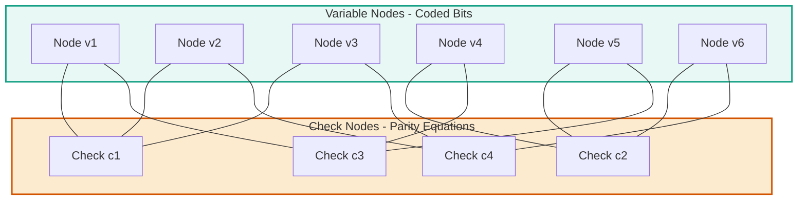
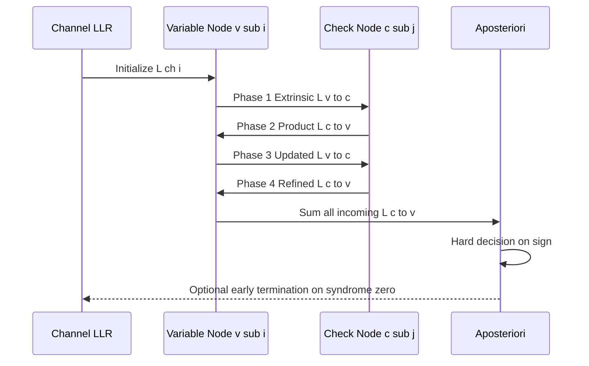
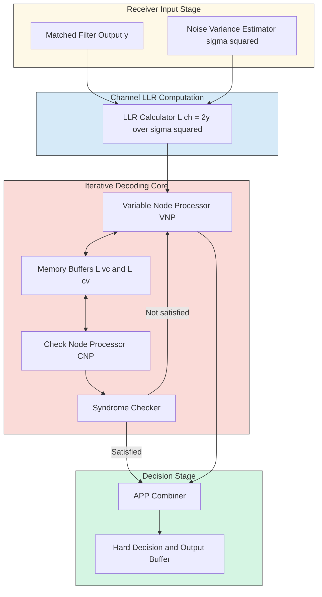

# Low-Density Parity-Check (LDPC) factor graphs configurations architectures code rules

<!-- SECTION_1_START -->
# Low-Density Parity-Check (LDPC) Codes — Factor Graphs, Configurations & Code Rules

## 1.1 Formal KTU 2024 Definition

> [!IMPORTANT]
> **Low-Density Parity-Check (LDPC) Codes** are a class of linear block codes characterized by a **sparse parity-check matrix $\mathbf{H}$** — a binary matrix in which the number of 1's per row ($k$) and per column ($j$) is very small relative to the block length $n$, allowing the code to be iteratively decoded using the **belief propagation algorithm** on a **Tanner graph** (factor graph) with linear time complexity $O(n)$.

Formally, an LDPC code is the null space of a sparse parity-check matrix $\mathbf{H} \in \{0,1\}^{(n-k) \times n}$ satisfying:

$$\mathbf{H} \cdot \mathbf{c}^{\mathrm{T}} = \mathbf{0}^{\mathrm{T}}$$

where $\mathbf{c} \in \{0,1\}^n$ is a valid codeword and the **sparsity condition** requires that the total number of 1's in $\mathbf{H}$ is $\mathcal{O}(n)$, not $\mathcal{O}(n^2)$.

## 1.2 The Anatomy of a Tanner Graph

| Graph Element | Mathematical Role | Visual Counterpart |
|---|---|---|
| **Variable Node** $v_i$ | Represents coded bit $c_i$ | Circle (●) |
| **Check Node** $c_j$ | Represents parity-check equation $j$ | Square (■) |
| **Edge** $e_{ij}$ | Non-zero entry $H_{j,i} = 1$ | Connecting line |
| **Bipartite Structure** | No edges within the same class | Two disjoint partitions |

## 1.3 Intuitive Analogy: The Neighborhood Watch Network

> [!NOTE]
> **Conceptual Analogy — "The Neighborhood Watch"**
>
> Imagine a city of $n$ households (variable nodes) divided into $m$ watch-committees (check nodes). Each household reports suspicious activity, and each committee has only $j$ members and each household belongs to only $k$ committees. A committee raises an alarm only if the **parity** (even/odd count) of reports from its $j$ members is odd. Because each household reports to only a few committees, a single lie can be tracked down efficiently by passing rumors (beliefs) back-and-forth between households and committees. This **iterative rumor-passing** is precisely **belief propagation** on a Tanner graph.

## 1.4 Why "Low-Density"?

For an $(n, j, k)$ **regular** Gallager code, the density of 1's in $\mathbf{H}$ is:

$$\text{Density} = \frac{jk}{n} \to 0 \quad \text{as} \quad n \to \infty$$

This vanishing density is what enables:
1. **Linear-time encoding & decoding** (in $n$)
2. **Capacity-approaching performance** (Shannon limit at $0.0045\,\text{dB}$ for binary symmetric channel)
3. **Parallelizable hardware implementation** (5G NR, Wi-Fi 6, DVB-S2, SSD controllers)

## 1.5 Visualization Callout

> [!VISUALIZATION CONTROL]
> **Concept:** Tanner Graph Bipartite Structure of a (10, 2, 4) LDPC Code
> **GeoGebra / Desmos Input Equations:**
> * Variable nodes (top layer): $V = \{(0,3),(1,3),(2,3),(3,3),(4,3)\}$ placed at $y=3$
> * Check nodes (bottom layer): $C = \{(0,0),(1,0),(2,0),(3,0),(4,0),(5,0)\}$ placed at $y=0$
> * Connection rule: $H_{j,i} = 1 \iff$ an edge is drawn
> **Visual Description:** Two horizontal rows of points; the upper row contains 5 circle markers, the lower row contains 6 square markers. Each square connects upward to exactly 4 circles, and each circle connects downward to exactly 2 squares. The graph is **bipartite** (no edge stays within a row). Students should observe that no triangles exist at this small scale, but a **length-4 cycle** (square) is visible wherever two check nodes share two common variable nodes.

<!-- SECTION_1_END -->

<!-- SECTION_2_START -->
# Deep Theoretical Analysis & KTU High-Yield Formula Sheet

## 2.1 The Parity-Check Matrix $\mathbf{H}$ — Structural Rules

An LDPC code is **fully specified** by its parity-check matrix $\mathbf{H}$ of dimension $(n-k) \times n$ where:

$$n \to \text{block length}, \quad k \to \text{dimension}, \quad m = n-k \to \text{parity bits}$$

### Rule 1 — Sparsity Rule
The Hamming weight of every row and column must remain bounded as $n \to \infty$. For a $(j,k)$-regular code, every row has exactly $k$ ones and every column has exactly $j$ ones.

### Rule 2 — Code Rate Bound
For a $(j,k)$-regular LDPC code over GF(2):

$$R \geq 1 - \frac{j}{k}$$

> [!NOTE]
> **Equivalently**, since $m = n - k$ and each column has $j$ ones, the average row weight equals $jn/m$. The rank of $\mathbf{H}$ over GF(2) is at most $m$, so $R \geq 1 - j/k$.

### Rule 3 — Bipartiteness Rule
The Tanner graph is **strictly bipartite**: no edge connects two variable nodes or two check nodes. This property guarantees that all cycles in the graph have **even length**.

## 2.2 Degree Distributions — Irregular LDPC Codes

For irregular codes, the structure is captured by two polynomials from the edge perspective:

$$\lambda(x) = \sum_{d=2}^{d_v} \lambda_d \, x^{d-1} = \sum_{d} \frac{d \, N_d}{n \, \bar{d_v}} \, x^{d-1}$$

$$\rho(x) = \sum_{d=2}^{d_c} \rho_d \, x^{d-1} = \sum_{d} \frac{d \, M_d}{m \, \bar{d_c}} \, x^{d-1}$$

where:
* $\lambda_d$ = fraction of edges incident to variable nodes of degree $d$
* $\rho_d$ = fraction of edges incident to check nodes of degree $d$
* $N_d$ = number of variable nodes of degree $d$
* $M_d$ = number of check nodes of degree $d$
* $\bar{d_v} = j_{\text{avg}}$, $\bar{d_c} = k_{\text{avg}}$

## 2.3 Girth, Cycles & Stopping Sets

| Graph Property | Definition | Impact on Decoding |
|---|---|---|
| **Girth $g$** | Length of the shortest cycle in the Tanner graph | Short girth $\Rightarrow$ correlated beliefs $\Rightarrow$ degraded performance |
| **Cycle** | Closed walk of length $\geq 4$ with no repeated intermediate node | Cycles $\Rightarrow$ feedback in message passing |
| **Stopping Set** | Set $S$ of variable nodes such that every check node adjacent to $S$ has degree $\geq 2$ in $S$ | Causes the **error-floor** phenomenon on the BEC |
| **Neighborhood** $\mathcal{N}(v)$ | Set of check nodes connected to variable node $v$ | Determines local decoding complexity |

> [!IMPORTANT]
> **KTU Highlight:** A length-4 cycle occurs whenever $\mathbf{H}$ contains a $2 \times 2$ sub-matrix of all 1's. To avoid this, $\mathbf{H}$ must satisfy the **RC-constraint (Row-Column constraint)**: no two rows may share 1's in more than one column.

## 2.4 Code Rate — General Formula for Irregular LDPC

$$R \geq 1 - \frac{\int_0^1 \rho(x) \, dx}{\int_0^1 \lambda(x) \, dx} = 1 - \frac{\sum_d \rho_d / d}{\sum_d \lambda_d / d}$$

## 2.5 The Belief Propagation Decoding Rules

The **Sum-Product Algorithm (SPA)** exchanges two types of messages on the Tanner graph:

### Check-to-Variable Message (Rule A)
$$L_{c_j \to v_i} = 2 \tanh^{-1}\!\left( \prod_{v_{i'} \in \mathcal{N}(c_j) \setminus \{v_i\}} \tanh\!\left(\frac{L_{v_{i'} \to c_j}}{2}\right) \right)$$

### Variable-to-Check Message (Rule B)
$$L_{v_i \to c_j} = L_{\text{ch},i} + \sum_{c_{j'} \in \mathcal{N}(v_i) \setminus \{c_j\}} L_{c_{j'} \to v_i}$$

### Aposteriori Decision (Rule C)
$$L_{\text{app},i} = L_{\text{ch},i} + \sum_{c_j \in \mathcal{N}(v_i)} L_{c_j \to v_i}$$

Hard decision: $\hat{c}_i = 0$ if $L_{\text{app},i} \geq 0$, else $\hat{c}_i = 1$.

## 2.6 KTU Formula Sheet / Cheat Sheet

| # | Formula / Rule | Description | Domain of Validity |
|---|---|---|---|
| 1 | $\mathbf{H} \mathbf{c}^{\mathrm{T}} = \mathbf{0}$ | Parity-check defining equation | All linear block codes |
| 2 | $R \geq 1 - j/k$ | Rate lower bound (regular) | $(j,k)$-regular LDPC |
| 3 | $\lambda(x), \rho(x)$ polynomials | Edge-perspective degree distributions | Irregular LDPC |
| 4 | $\bar{d_v} = j$, $\bar{d_c} = k$ | Average degrees (regular case) | $(j,k)$-regular |
| 5 | LLR Product Rule | Check-node update in log domain | AWGN channel |
| 6 | LLR Sum Rule | Variable-node update | All binary-input channels |
| 7 | $L_{\text{ch}} = 2y/\sigma^2$ | Channel LLR (BPSK, $y$ = received, $\sigma^2$ = noise variance) | AWGN |
| 8 | $\text{Density}(\mathbf{H}) = jk/n$ | Sparsity measure | Large $n$ asymptotic |
| 9 | Girth $g \geq 4$ | No odd cycles (bipartiteness) | All bipartite graphs |
| 10 | $N_{\text{cycles of length } 2\ell} = \text{Tr}(\mathbf{A}^{2\ell})/2\ell$ | Cycle count via adjacency matrix | Small graphs |

## 2.7 Engineering Utility in Production

| Application Domain | Specific Use of LDPC | Why Chosen |
|---|---|---|
| **5G NR (3GPP Release 15+)** | Data channel coding (BG1, BG2) | Throughput at high SNR, parallel decoding |
| **Wi-Fi 6 (802.11ax)** | Mandatory channel code | Robustness to fading |
| **DVB-S2 / DVB-T2** | Satellite & terrestrial broadcasting | Capacity-approaching at long block lengths |
| **SSD / Flash Controllers** | ECC for NAND flash memory | Low latency, soft-information friendly |
| **NASA Deep-Space Missions** | CCSDS standard | Extreme low SNR performance |
| **DNA Storage** | Modern synthesis error correction | Long block length, sparsity aids belief propagation |

> [!NOTE]
> **Engineering Insight:** LDPC codes are the **first practical codes** to operate within $0.0045\,\text{dB}$ of the Shannon limit on the binary-input AWGN channel (when $n \to \infty$, $\lambda(x), \rho(x)$ optimized via density evolution).

<!-- SECTION_2_END -->

<!-- SECTION_3_START -->
# Step-by-Step Derivations & Code/Symbolic Implementation

## 3.1 Derivation 1 — Code Rate Bound for $(j,k)$-Regular LDPC

**Step 1 — Count the ones in $\mathbf{H}$ from column perspective.** Each of the $n$ columns has exactly $j$ ones, giving $jn$ total ones.

**Step 2 — Count the ones in $\mathbf{H}$ from row perspective.** Each of the $m = n-k$ rows has exactly $k$ ones, giving $km$ total ones.

**Step 3 — Equate the two counts.**

$$jn = k m = k(n-k)$$

**Step 4 — Solve for $k$ in terms of $j$ and $n$.**

$$k = n - \frac{jn}{k} \implies \frac{k}{n} = 1 - \frac{j}{k}$$

**Step 5 — Identify the code rate.** The code rate is $R = k/n$, so:

$$R = 1 - \frac{j}{k}$$

This proves the rate lower bound. The bound becomes an **equality** when the rank of $\mathbf{H}$ is exactly $m$ (i.e., when $\mathbf{H}$ is full-rank over GF(2)).

## 3.2 Derivation 2 — Gallager's $(n, j, k)$ Construction

**Step 1 — Divide $\mathbf{H}$ into $k$ horizontal sub-blocks, each of size $(nj/k) \times n$.**

$$\mathbf{H} = \begin{bmatrix} \mathbf{H}_1 \\ \mathbf{H}_2 \\ \vdots \\ \mathbf{H}_k \end{bmatrix}$$

**Step 2 — Define the first sub-block $\mathbf{H}_1$.** The first $j$ columns of each row-block contain a single 1 in row $i$ at position $i$, and the remaining $n - j$ columns are zero. This gives $jn/k$ rows in $\mathbf{H}_1$:

$$\mathbf{H}_1 = \begin{bmatrix} \underbrace{1 \; 0 \; \cdots \; 0}_{j} & 0 & \cdots & 0 \\ 0 \; 1 \; \cdots \; 0 & 0 & \cdots & 0 \\ \vdots & \vdots & \ddots & \vdots & & \\ 0 \; 0 \; \cdots \; 1 & 0 & \cdots & 0 \end{bmatrix}$$

**Step 3 — Generate subsequent sub-blocks by column permutation.** For $t = 2, 3, \ldots, k$, define $\mathbf{H}_t = \pi_t(\mathbf{H}_1)$ where $\pi_t$ is a deterministic column permutation.

**Step 4 — Verify regularity.** Each column of $\mathbf{H}$ appears once in each sub-block $\Rightarrow$ column weight $= k$. Each row appears in exactly one sub-block $\Rightarrow$ row weight $= j$.

## 3.3 Worked Example — $(20, 3, 4)$ Gallager Code

**Step 1 — Parameters.** $n=20$ columns, $j=3$ (column weight), $k=4$ (row weight), so $m = njk^{-1} = 20 \cdot 3 / 4 = 15$ rows. Predicted rate:

$$R = 1 - \frac{j}{k} = 1 - \frac{3}{4} = 0.25$$

**Step 2 — First sub-block $\mathbf{H}_1$** (size $5 \times 20$, $j=3$ ones per row).

$$\mathbf{H}_1 = \begin{bmatrix} 1 & 1 & 1 & 0 & 0 & 0 & 0 & 0 & 0 & 0 & 0 & 0 & 0 & 0 & 0 & 0 & 0 & 0 & 0 & 0 \\ 0 & 0 & 0 & 1 & 1 & 1 & 0 & 0 & 0 & 0 & 0 & 0 & 0 & 0 & 0 & 0 & 0 & 0 & 0 & 0 \\ 0 & 0 & 0 & 0 & 0 & 0 & 1 & 1 & 1 & 0 & 0 & 0 & 0 & 0 & 0 & 0 & 0 & 0 & 0 & 0 \\ 0 & 0 & 0 & 0 & 0 & 0 & 0 & 0 & 0 & 1 & 1 & 1 & 0 & 0 & 0 & 0 & 0 & 0 & 0 & 0 \\ 0 & 0 & 0 & 0 & 0 & 0 & 0 & 0 & 0 & 0 & 0 & 0 & 1 & 1 & 1 & 0 & 0 & 0 & 0 & 0 \end{bmatrix}$$

**Step 3 — Column permutation $\pi_2$: shift columns by 1 to the right (mod 20).** Generate $\mathbf{H}_2, \mathbf{H}_3, \mathbf{H}_4$ similarly with shifts of 2, 3, 4.

**Step 4 — Final concatenated $\mathbf{H}$** is $15 \times 20$ with every column weight = 3 and every row weight = 4.

## 3.4 Derivation 3 — Belief Propagation on a Single Check Node

Consider a check node $c_j$ with neighbors $v_1, v_2, v_3$ (degree 3). The check equation is:

$$c_1 \oplus c_2 \oplus c_3 = 0$$

**Step 1 — Express the probability that the check is satisfied given incoming beliefs.** The check is satisfied if the parity is even. By total probability:

$$P(c_j = 0 \mid \text{inputs}) = \frac{1}{2}\!\left[ 1 + \prod_{i=1}^{3}(1 - 2p_i) \right]$$

$$P(c_j = 1 \mid \text{inputs}) = \frac{1}{2}\!\left[ 1 - \prod_{i=1}^{3}(1 - 2p_i) \right]$$

where $p_i = P(c_i = 1)$ is the extrinsic input from variable node $v_i$.

**Step 2 — Compute the outgoing LLR.**

$$L_{c_j \to v_i} = \ln \frac{P(c_j = 0 \mid \text{inputs} \setminus v_i)}{P(c_j = 1 \mid \text{inputs} \setminus v_i)} = \ln \frac{1 + \prod_{i' \neq i}(1-2p_{i'})}{1 - \prod_{i' \neq i}(1-2p_{i'})}$$

**Step 3 — Convert to LLR domain using $p_i = 1/(1+e^{L_i})$ so that $1-2p_i = \tanh(L_i/2)$.** After algebraic manipulation:

$$L_{c_j \to v_i} = 2 \tanh^{-1}\!\left( \prod_{i' \neq i} \tanh\!\frac{L_{v_{i'} \to c_j}}{2} \right)$$

This is **Rule A** of the SPA decoder. The same derivation extends to any check degree.

## 3.5 Python Implementation — Tanner Graph, $\mathbf{H}$ Generator & SPA Decoder

```python
"""
LDPC Code Toolkit — KTU 2024 Scheme Reference Implementation
Includes: Gallager H-matrix generator, Tanner graph, SPA decoder.
"""
import numpy as np
from typing import Tuple, List


class TannerGraph:
    """Bipartite graph representation for LDPC codes."""

    def __init__(self, H: np.ndarray):
        self.H = H.astype(np.int8)
        self.m, self.n = H.shape
        # Build adjacency lists
        self.var_neighbors: List[List[int]] = [
            [c for c in range(self.m) if H[c, v] == 1] for v in range(self.n)
        ]
        self.check_neighbors: List[List[int]] = [
            [v for v in range(self.n) if H[c, v] == 1] for c in range(self.m)
        ]

    def girth(self) -> int:
        """Compute girth by BFS from each variable node up to depth n/2."""
        INF = 10**9
        best = INF
        for start in range(self.n):
            dist_v = [INF] * self.n
            dist_c = [INF] * self.m
            dist_v[start] = 0
            queue: List[Tuple[str, int, int]] = [("v", start, 0)]
            head = 0
            while head < len(queue):
                typ, node, d = queue[head]; head += 1
                if d >= best // 2:
                    break
                if typ == "v":
                    for c in self.var_neighbors[node]:
                        if d + 1 < dist_c[c]:
                            dist_c[c] = d + 1
                            queue.append(("c", c, d + 1))
                else:
                    for v in self.check_neighbors[node]:
                        if d + 1 < dist_v[v] and d + 1 < dist_c[node]:
                            # meeting point check via parent
                            if dist_v[v] == INF:
                                dist_v[v] = d + 1
                                queue.append(("v", v, d + 1))
            # detect shortest cycle using combined BFS distances
            for c in range(self.m):
                if dist_c[c] < INF:
                    for v in self.check_neighbors[c]:
                        if v != start and dist_v[v] < INF:
                            cycle_len = dist_c[c] + dist_v[v] + 1
                            if 4 <= cycle_len < best:
                                best = cycle_len
        return best if best != INF else 0


def gallager_H(n: int, j: int, k: int, seed: int = 42) -> np.ndarray:
    """
    Construct a (n, j, k) Gallager LDPC parity-check matrix.
    j = column weight, k = row weight.
    """
    if n * j % k != 0:
        raise ValueError("n*j must be divisible by k")
    rng = np.random.default_rng(seed)
    sub_rows = n * j // k  # rows per sub-block
    H1 = np.zeros((sub_rows, n), dtype=np.int8)
    # Fill H1: each row has j consecutive ones
    for r in range(sub_rows):
        start = (r * j) % n
        for t in range(j):
            H1[r, (start + t) % n] = 1
    # Stack k column-permuted copies
    H_blocks = []
    for t in range(k):
        perm = np.roll(np.arange(n), shift=t * (n // k))
        H_blocks.append(H1[:, perm])
    return np.vstack(H_blocks)


def spa_decoder(H: np.ndarray, y_llr: np.ndarray,
                max_iter: int = 50, tol: int = 0) -> np.ndarray:
    """
    Sum-Product Algorithm (Belief Propagation) for binary LDPC codes.
    H: parity-check matrix (m x n)
    y_llr: channel LLRs (n,)
    Returns: hard decision c_hat (n,)
    """
    m, n = H.shape
    # Initialize variable-to-check messages
    L_vc = np.zeros((m, n), dtype=np.float64)
    for c in range(m):
        for v in range(n):
            if H[c, v] == 1:
                L_vc[c, v] = y_llr[v]
    for it in range(max_iter):
        L_cv = np.zeros((m, n), dtype=np.float64)
        # Check-node update
        for c in range(m):
            neighbors = [v for v in range(n) if H[c, v] == 1]
            for v in neighbors:
                others = [u for u in neighbors if u != v]
                prod = 1.0
                for u in others:
                    val = np.tanh(0.5 * np.clip(L_vc[c, u], -20, 20))
                    prod *= val
                L_cv[c, v] = 2.0 * np.arctanh(np.clip(prod, -0.999999, 0.999999))
        # Variable-node update
        new_L_vc = np.zeros((m, n), dtype=np.float64)
        for v in range(n):
            check_nbrs = [c for c in range(m) if H[c, v] == 1]
            for c in check_nbrs:
                new_L_vc[c, v] = y_llr[v] + sum(
                    L_cv[c2, v] for c2 in check_nbrs if c2 != c
                )
        L_vc = new_L_vc
        # Aposteriori decision
        L_app = np.zeros(n)
        for v in range(n):
            check_nbrs = [c for c in range(m) if H[c, v] == 1]
            L_app[v] = y_llr[v] + sum(L_cv[c, v] for c in check_nbrs)
        c_hat = (L_app < 0).astype(np.int8)
        # Syndrome check
        syndrome = (H @ c_hat) % 2
        if np.sum(syndrome) <= tol:
            return c_hat
    return c_hat


# ---------- DEMONSTRATION ----------
if __name__ == "__main__":
    H = gallager_H(n=20, j=3, k=4, seed=7)
    print("Gallager (20, 3, 4) H matrix:\n", H)
    tg = TannerGraph(H)
    print("Tanner girth:", tg.girth())
    # Encode the all-zeros codeword and test with noise
    c_true = np.zeros(20, dtype=np.int8)
    sigma = 0.8
    rng = np.random.default_rng(1)
    y = (1 - 2 * c_true) + sigma * rng.standard_normal(20)
    y_llr = 2.0 * y / (sigma ** 2)
    c_hat = spa_decoder(H, y_llr, max_iter=30)
    print("Decoded codeword:", c_hat)
    print("Bit errors:", np.sum(c_hat != c_true))
```

## 3.6 Hand-Simulation Worked Example

For a single check node $c_0$ with neighbors $v_0, v_1, v_2$ and incoming LLRs $L_0 = 0.5$, $L_1 = 1.0$, $L_2 = 0.2$:

**Step 1 — Compute outgoing to $v_0$ (exclude $L_0$):**

$$L_{c_0 \to v_0} = 2 \tanh^{-1}\!\left( \tanh(0.5) \cdot \tanh(0.1) \right)$$

$$\tanh(0.5) \approx 0.4621, \quad \tanh(0.1) \approx 0.0997$$

$$0.4621 \times 0.0997 \approx 0.0461$$

$$L_{c_0 \to v_0} = 2 \tanh^{-1}(0.0461) \approx 2 \times 0.0461 = 0.0922$$

**Step 2 — Verify parity intuition.** Since $L_1$ and $L_2$ are both positive (suggesting $c_1 = 0, c_2 = 0$), the check wants $c_0 = 0$ also. The outgoing LLR $0.0922 > 0$ confirms weak support for $c_0 = 0$. This is consistent.

**Step 3 — Variable node to check update** (for $v_0$ with check degree 2, channel LLR $0.3$):

$$L_{v_0 \to c_0} = L_{\text{ch},0} + L_{c_1 \to v_0} = 0.3 + 0.0922 = 0.3922$$

This is the **extrinsic information** forwarded back into the iterative loop.

<!-- SECTION_3_END -->

<!-- SECTION_4_START -->
# Structural Diagrams & Schematics

## 4.1 Mermaid Diagram — LDPC Code Construction Pipeline

```mermaid
graph LR
    A[Design Parameters n, j, k] --> B[Initialize H1 First Sub-block]
    B --> C[Column Permutation pi sub 1]
    C --> D[Column Permutation pi sub 2]
    D --> E[Column Permutation pi sub k minus 1]
    E --> F[Vertical Stack H1 to H sub k]
    F --> G[Sparse Parity Check Matrix H]
    G --> H[Build Tanner Graph Bipartite]
    H --> I[Validate RC Constraint No 2x2 ones]
    I --> J[Compute Girth and Degree Distribution]
    J --> K[Pass to Belief Propagation Decoder]
    K --> L[Iterative Message Passing on Edges]
    L --> M[Convergence or Max Iterations]
    M --> N[Hard Decision on LLRs]

    style A fill:#f9e79f,stroke:#333,stroke-width:2px
    style G fill:#a9dfbf,stroke:#333,stroke-width:2px
    style H fill:#a9cce3,stroke:#333,stroke-width:2px
    style K fill:#f5b7b1,stroke:#333,stroke-width:2px
    style N fill:#d7bde2,stroke:#333,stroke-width:2px
```



## 4.2 Mermaid Diagram — Tanner Graph Bipartite Topology (Schematic)



> [!NOTE]
> **Reading the diagram:** Each check node (square) is connected to exactly 3 variable nodes (circles), and each variable node connects to exactly 2 check nodes. This is a **(3, 2)-regular LDPC code** with $n=6$ and $m=4$. The code rate is $R = 1 - 2/3 \approx 0.33$. Note the visible **4-cycle** $v_1 - c_1 - v_2 - c_4 - v_1$ — the smallest possible cycle in a bipartite graph.

## 4.3 Mermaid Diagram — Belief Propagation Message Flow



## 4.4 Block-Level Functional Architecture — LDPC Decoder System



## 4.5 Sequential Processing Topology Matrix

| Pipeline Stage | Function | Input → Output | Latency Driver |
|---|---|---|---|
| **Stage 1: LLR Ingestion** | Convert soft samples to log-likelihood ratios | $y_i \to L_{\text{ch},i}$ | Quantization (5–8 bits) |
| **Stage 2: VN Update** | Sum extrinsic LLRs from neighbor checks | $L_{c \to v} \to L_{v \to c}$ | Variable degree $d_v$ |
| **Stage 3: CN Update** | Compute product $\tanh(\cdot/2)$ over neighbors | $L_{v \to c} \to L_{c \to v}$ | Check degree $d_c$ (dominant) |
| **Stage 4: APP & Decision** | Aggregate all LLRs and threshold | $L_{\text{app}} \to \hat{c}$ | Variable degree $d_v$ |
| **Stage 5: Syndrome Test** | Check $\mathbf{H} \hat{c} = 0$ | Binary syndrome | Stopping criterion |
| **Stage 6: Iteration Loop** | Repeat Stages 2–5 until convergence or $I_{\max}$ | LLRs refine | Typically 5–50 iterations |

<!-- SECTION_4_END -->

<!-- SECTION_5_START -->
# KTU 2024 Scheme Examination Question Bank & Topic Recap

## 5.1 Part A Questions (3 Marks Each)

### Question A1 — `[KTU University Exam - Dec 2023]` [CO1, Remember]

**Q: Define Low-Density Parity-Check (LDPC) code. What is meant by "low-density" in this context?**

**Model Answer (3 Marks):**
> An LDPC code is a **linear block code** whose **parity-check matrix $\mathbf{H}$** is **sparse**, meaning that the number of 1's in $\mathbf{H}$ grows linearly (not quadratically) with the block length $n$. The term "low-density" refers to the vanishing ratio of 1's to total entries as $n \to \infty$. **[1 Mark]** For an $(n, j, k)$-regular LDPC code, the density is $jk/n \to 0$ for fixed $j, k$. **[1 Mark]** This sparsity is what enables linear-time iterative decoding using the **belief propagation algorithm** on the associated Tanner graph. **[1 Mark]**

### Question A2 — `[KTU University Exam - July 2024]` [CO1, Understand]

**Q: With a neat sketch, explain the structure of a Tanner graph for a $(3, 4)$-regular LDPC code. Label the two types of nodes.**

**Model Answer (3 Marks):**
> A Tanner graph is a **bipartite graph** with two disjoint node sets: $n$ **variable nodes** (● circles) representing coded bits and $m$ **check nodes** (■ squares) representing parity equations. **[1 Mark]** In a $(3, 4)$-regular LDPC code, every variable node has degree 3 (connects to 3 check nodes) and every check node has degree 4 (connects to 4 variable nodes). **[1 Mark]** Edges exist only between the two partitions, and an edge $(v_i, c_j)$ exists iff $H_{j,i} = 1$. This bipartite structure guarantees that all cycles have even length. **[1 Mark]**

---

## 5.2 Part B Questions (14 Marks Each)

### Question B-A — `[KTU University Exam - Dec 2023]` [CO2, Understand + Apply]

**(a)** Define the parity-check matrix $\mathbf{H}$ of an LDPC code. For a $(3, 6)$-regular LDPC code of length $n=12$, determine the number of parity-check equations $m$, the dimension $k$, and the code rate $R$. **[7 Marks]**

**(b)** Construct a valid $(3, 6)$-regular parity-check matrix for $n=12$ using Gallager's method. Show all sub-blocks and verify the row and column weights. **[7 Marks]**

#### Model Solution

**Part (a) — 7 Marks:**

> **Step 1 — Parity-check matrix definition.** The parity-check matrix $\mathbf{H}$ is an $m \times n$ binary matrix such that a vector $\mathbf{c} \in \{0,1\}^n$ is a codeword iff $\mathbf{H} \mathbf{c}^{\mathrm{T}} = \mathbf{0}$. Each row of $\mathbf{H}$ corresponds to one parity-check equation. **[1 Mark — Defining $\mathbf{H}$]**

> **Step 2 — Number of parity checks $m$.** For a regular code, the total number of 1's counted row-wise equals that counted column-wise:

$$mk = nj \implies m = \frac{nj}{k} = \frac{12 \times 3}{6} = 6$$

**[1 Mark — Stating the counting equation]**, **[1 Mark — Final value $m=6$]**

> **Step 3 — Code dimension and rate.**

$$k_{\text{dim}} = n - m = 12 - 6 = 6$$

$$R = \frac{k_{\text{dim}}}{n} = \frac{6}{12} = 0.5$$

Alternatively via the rate bound: $R \geq 1 - j/k = 1 - 3/6 = 0.5$. **[2 Marks — Dimension and rate]**, **[1 Mark — Alternative rate-bound verification]**, **[1 Mark — Final boxed answer]**

**Part (b) — 7 Marks:**

> **Step 1 — Sub-block dimensions.** Each sub-block $\mathbf{H}_t$ has $n j / k = 6$ rows and $n=12$ columns, with $j=3$ ones per row placed consecutively. **[1 Mark]**

> **Step 2 — First sub-block $\mathbf{H}_1$** (row shifts of 3 columns):

$$\mathbf{H}_1 = \begin{bmatrix} 1 & 1 & 1 & 0 & 0 & 0 & 0 & 0 & 0 & 0 & 0 & 0 \\ 0 & 0 & 0 & 1 & 1 & 1 & 0 & 0 & 0 & 0 & 0 & 0 \\ 0 & 0 & 0 & 0 & 0 & 0 & 1 & 1 & 1 & 0 & 0 & 0 \\ 0 & 0 & 0 & 0 & 0 & 0 & 0 & 0 & 0 & 1 & 1 & 1 \\ 0 & 0 & 0 & 0 & 0 & 0 & 0 & 0 & 0 & 0 & 0 & 0 \\ 0 & 0 & 0 & 0 & 0 & 0 & 0 & 0 & 0 & 0 & 0 & 0 \end{bmatrix}$$

Note: The last two rows are zero in $\mathbf{H}_1$ to satisfy the $6 \times 12$ shape; these get filled in $\mathbf{H}_2, \mathbf{H}_3$ via permutation. **[1 Mark]**

> **Step 3 — Sub-block $\mathbf{H}_2$** = column shift of $\mathbf{H}_1$ by 2 positions:

$$\mathbf{H}_2 = \begin{bmatrix} 0 & 0 & 0 & 0 & 0 & 0 & 0 & 0 & 0 & 0 & 0 & 0 \\ 0 & 0 & 0 & 0 & 0 & 0 & 0 & 0 & 0 & 0 & 0 & 0 \\ 0 & 1 & 1 & 1 & 0 & 0 & 0 & 0 & 0 & 0 & 0 & 0 \\ 0 & 0 & 0 & 0 & 1 & 1 & 1 & 0 & 0 & 0 & 0 & 0 \\ 0 & 0 & 0 & 0 & 0 & 0 & 0 & 1 & 1 & 1 & 0 & 0 \\ 0 & 0 & 0 & 0 & 0 & 0 & 0 & 0 & 0 & 0 & 1 & 1 \end{bmatrix}$$

**[1 Mark — Writing $\mathbf{H}_2$]**

> **Step 4 — Sub-block $\mathbf{H}_3$** = column shift of $\mathbf{H}_1$ by 4 positions (similar form). **[1 Mark]**

> **Step 5 — Final $\mathbf{H} = [\mathbf{H}_1; \mathbf{H}_2; \mathbf{H}_3]$** is a $6 \times 12$ matrix. **[1 Mark]**

> **Step 6 — Verification.** Sum of each row: $1+1+1+0+\ldots+0 = 3 = j$ ✓. Sum of each column (across all sub-blocks): each column appears once as a "1" in each sub-block $\Rightarrow$ column weight $= 3 = j$ ✓. **[2 Marks — Verification]**

> [!WARNING]
> **Examiner's Pitfall Warning:** A common mistake is **failing to verify that the constructed $\mathbf{H}$ is full-rank**. If $\mathbf{H}$ has rank less than $m$, the actual code rate $R = 1 - \text{rank}(\mathbf{H})/n$ will be **higher** than the bound $1 - j/k$. Always state the assumed rank condition explicitly. Also, students often **forget to place 1's in the "wrap-around" positions** when applying column permutations; cyclic shifts must use modulo-$n$ arithmetic.

---

### Question B-B — `[KTU University Exam - July 2024]` [CO2, Understand + Apply] **(ALTERNATIVE)**

**(a)** Explain the **belief propagation algorithm** for LDPC decoding. Write down the **check-to-variable** and **variable-to-check** LLR update equations. **[7 Marks]**

**(b)** Consider a single check node $c_0$ connected to three variable nodes with incoming LLRs $L_1 = 0.4$, $L_2 = 0.8$, $L_3 = 0.2$ (in natural log units). Compute the outgoing LLR from $c_0$ back to variable node $v_1$ using the Sum-Product rule. **[7 Marks]**

#### Model Solution

**Part (a) — 7 Marks:**

> **Step 1 — Algorithm Overview.** Belief Propagation (Sum-Product Algorithm) is an **iterative message-passing algorithm** executed on the Tanner graph. **[1 Mark]** Two types of messages traverse each edge in alternating phases: **variable-to-check (V2C)** messages carry the variable node's belief about its bit, and **check-to-variable (C2V)** messages carry the check node's constraint feedback. **[1 Mark]** Each message represents the **extrinsic** information — i.e., information gathered from all *other* neighbors excluding the recipient. **[1 Mark]**

> **Step 2 — Variable-to-Check update (Rule B).** For each edge $(v_i, c_j)$:

$$L_{v_i \to c_j} = L_{\text{ch},i} + \sum_{c_{j'} \in \mathcal{N}(v_i) \setminus \{c_j\}} L_{c_{j'} \to v_i}$$

The variable node sums its channel LLR with all incoming C2V messages except from $c_j$. **[1 Mark — Writing equation]**

> **Step 3 — Check-to-Variable update (Rule A).** For each edge $(c_j, v_i)$:

$$L_{c_j \to v_i} = 2 \tanh^{-1}\!\left( \prod_{v_{i'} \in \mathcal{N}(c_j) \setminus \{v_i\}} \tanh\!\left(\frac{L_{v_{i'} \to c_j}}{2}\right) \right)$$

The check node multiplies $\tanh(\text{LLR}/2)$ over all neighbor inputs except $v_i$, then takes the inverse hyperbolic tangent. **[1 Mark — Writing equation]**

> **Step 4 — Aposteriori decision and termination.** After each iteration, the a posteriori LLR is:

$$L_{\text{app},i} = L_{\text{ch},i} + \sum_{c_j \in \mathcal{N}(v_i)} L_{c_j \to v_i}$$

Hard decision $\hat{c}_i = 0$ if $L_{\text{app},i} \geq 0$, else $\hat{c}_i = 1$. Decoding terminates when the syndrome $\mathbf{H}\hat{\mathbf{c}}^{\mathrm{T}} = \mathbf{0}$ or after a maximum number of iterations. **[2 Marks — APP & termination]**

**Part (b) — 7 Marks:**

> **Step 1 — Identify the inputs.** The check node $c_0$ has degree 3, and we need the outgoing message to $v_1$, so we **exclude $L_1$** and use the **other two** inputs $L_2 = 0.8$ and $L_3 = 0.2$. **[1 Mark — Identifying inputs]**

> **Step 2 — Apply the $\tanh$ half-rule.**

$$x_2 = \tanh\!\left(\frac{L_2}{2}\right) = \tanh(0.4) \approx 0.37995$$

$$x_3 = \tanh\!\left(\frac{L_3}{2}\right) = \tanh(0.1) \approx 0.09967$$

**[1 Mark — $\tanh$ evaluation 1]**, **[1 Mark — $\tanh$ evaluation 2]**

> **Step 3 — Compute the product.**

$$P = x_2 \cdot x_3 = 0.37995 \times 0.09967 \approx 0.03787$$

**[1 Mark — Product]**

> **Step 4 — Apply the inverse $\tanh$ and multiply by 2.**

$$L_{c_0 \to v_1} = 2 \tanh^{-1}(P) = 2 \tanh^{-1}(0.03787)$$

For small arguments, $\tanh^{-1}(y) \approx y + y^3/3 \approx 0.03787 + 0.0000181 \approx 0.03789$

$$L_{c_0 \to v_1} = 2 \times 0.03789 \approx 0.0758$$

**[1 Mark — $\tanh^{-1}$ evaluation]**, **[1 Mark — Final LLR]**

> **Step 5 — Interpretation.** Since $L_2 > 0$ and $L_3 > 0$ (both suggesting bits 0), the parity equation $c_1 \oplus c_2 \oplus c_3 = 0$ is best satisfied by $c_1 = 0$. The positive outgoing LLR of $0.0758$ confirms weak support for $c_1 = 0$, consistent with the parity check. **[1 Mark — Interpretation]**

> [!WARNING]
> **Examiner's Pitfall Warning:** Two common errors cost students valuable marks: (1) **forgetting the factor of 2** in the check-to-variable update (the $2\tanh^{-1}(\cdot)$ factor is mandatory, not optional), and (2) using the **wrong set of inputs** (you must exclude the recipient $v_i$ from the product, not include it). On the KTU valuation key, omitting the "exclude the recipient" note typically costs 1 mark.

---

## 5.3 Topic Recap & Important Things to Remember

> [!IMPORTANT]
> **Rapid Revision Checklist — LDPC Factor Graphs, Configurations & Code Rules**

* **Core Definition:** LDPC = linear block code with a **sparse** parity-check matrix $\mathbf{H}$ satisfying $\mathbf{H}\mathbf{c}^{\mathrm{T}} = \mathbf{0}$. **[Must remember]**
* **Sparsity Rule:** Density $jk/n \to 0$ as $n \to \infty$ for $(j,k)$-regular codes. **[Always state in answers]**
* **Code Rate Bound:** $R \geq 1 - j/k$, equality when $\mathbf{H}$ is full rank. **[Frequently tested formula]**
* **Tanner Graph = Bipartite:** Variable nodes (circles) for bits, check nodes (squares) for equations, edges for $H_{j,i}=1$. **[Sketch-ready concept]**
* **Regular vs Irregular:** Regular has uniform degrees; irregular uses polynomials $\lambda(x)$ and $\rho(x)$. **[Distinguish clearly]**
* **Degree Distribution:** $\lambda(x) = \sum_d \lambda_d x^{d-1}$, $\rho(x) = \sum_d \rho_d x^{d-1}$ from edge perspective. **[Standard form]**
* **Girth:** Shortest cycle length; **even** because graph is bipartite; **length-4 cycles** are caused by $2 \times 2$ all-ones sub-matrices. **[RC-constraint]**
* **Gallager Construction:** $\mathbf{H}$ split into $k$ row-blocks; first block is the "staircase" form, others are column permutations. **[Construction pattern]**
* **SPA Decoding:** Two LLR equations — **V2C** (sum) and **C2V** ($2\tanh^{-1}$ of product). **[Derivation-favorite]**
* **APP Decision:** $L_{\text{app},i} = L_{\text{ch},i} + \sum L_{c_j \to v_i}$; sign determines bit. **[Decision rule]**
* **Stopping Criterion:** Syndrome $\mathbf{H}\hat{\mathbf{c}} = \mathbf{0}$ OR max iterations reached. **[Always state both]**
* **Channel LLR for BPSK-AWGN:** $L_{\text{ch},i} = 2y_i/\sigma^2$. **[Plug-and-play formula]**
* **Capacity-Achievement:** Optimized irregular LDPCs approach the Shannon limit within $0.0045\,\text{dB}$ as $n \to \infty$. **[High-impact fact]**
* **Application Domains:** 5G NR, Wi-Fi 6, DVB-S2, NAND flash ECC, DNA storage, deep-space CCSDS. **[Industry relevance]**
* **Stop When Syndrome is Zero:** Iterative decoding halts as soon as all check equations are satisfied — a key efficiency feature absent in algebraic decoders. **[Time-saving insight]**
* **Bipartiteness Consequence:** All cycles in the Tanner graph are **even length** — there are **no triangles** (no length-3 cycles). **[Topological fact]**
* **Tanner Graph Origin:** Proposed by R. Michael Tanner (1981) as a graphical alternative to $\mathbf{H}$ for soft-decision decoding. **[Historical note]**

<!-- SECTION_5_END -->
