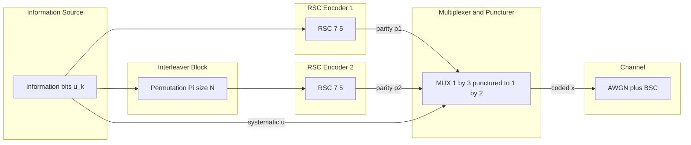
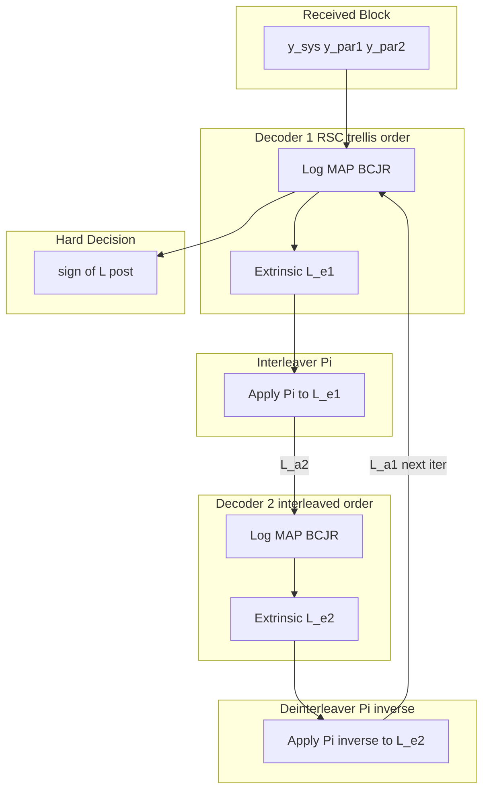
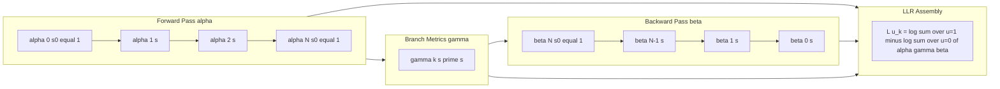
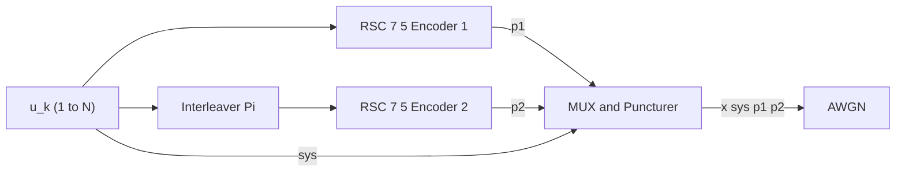

# Turbo coding parallel execution pathways matrices setups message passing algorithms

<!-- SECTION_1_START -->

# Turbo Coding: Parallel Concatenation, Matrix Setups, and Message Passing Algorithms

## 1.1 Formal Definition (KTU 2024 PECST410 Terminology)

> [!IMPORTANT]
> **Turbo Codes** are a class of high-performance, capacity-approaching Forward Error Correction (FEC) codes introduced by **Berrou, Glavieux, and Thitimajshima (1993)**. A turbo encoder is constructed by the **parallel concatenation** of two or more **Recursive Systematic Convolutional (RSC)** encoders separated by a **pseudorandom interleaver**. Decoding is performed *iteratively* by exchanging **soft reliability information** (extrinsic log-likelihood ratios) between two Soft-Input Soft-Output (SISO) component decoders that implement the **BCJR (Bahl–Cocke–Jelinek–Raviv) algorithm** or its log-domain approximations (Log-MAP, Max-Log-MAP).

A binary turbo code of frame length **N** is uniquely identified by the 5-tuple:

$$
\mathcal{C}_{\text{turbo}} \;=\; \bigl(\, G_{1}(D),\; G_{2}(D),\; \Pi,\; \mathcal{T},\; R \,\bigr)
$$

where $G_{1}(D)$ and $G_{2}(D)$ are the **generator polynomials** of the two RSC encoders, $\Pi$ is the interleaver permutation of size $N$, $\mathcal{T}$ is the **trellis termination policy**, and $R$ is the **code rate** (typically **1/3** before puncturing, **1/2** after even–odd puncturing).

## 1.2 Intuitive Analogy — "The Two Expert Reviewers"

> [!NOTE]
> **Imagine a noisy exam paper** with the correct answer scribbled faintly. Two expert reviewers, **Expert A** and **Expert B**, independently analyse the paper. **Expert A** gives a confidence score, then **passes his private "gut feeling" to Expert B** without sharing his own answer. Expert B combines his own observation with Expert A's hint, refines the score, and **passes his gut feeling back**. After several rounds of this *ping-pong feedback*, the two experts converge on a single, very accurate verdict.

This is exactly how a turbo decoder works:

- **Expert A** $\leftrightarrow$ **Decoder 1** (RSC$_1$, processes the original order)
- **Expert B** $\leftrightarrow$ **Decoder 2** (RSC$_2$, processes the interleaved order)
- **Gut feeling** $\leftrightarrow$ **Extrinsic LLR** $L_{e}$
- **Repeated rounds** $\leftrightarrow$ **Iterations** (typically 6–18)

## 1.3 Physical Constants and Standard Metrics

| Parameter | Typical Value | Description |
|---|---|---|
| Frame length $N$ | $1024$ to $65536$ | Number of information bits per block |
| Constraint length $K_{c}$ | **4** (memory $m=2$) to 5 | RSC memory length |
| Generators (octal) | **$(7,\,5)$** or **$(13,\,15)$** | Feed-forward / feedback taps |
| Native rate | $1/3$ | Two parity streams + 1 systematic |
| Punctured rate | $1/2$ | Alternate parity bit retention |
| Interleaver | **Pseudo-random S-random** | Avoid low-weight codewords |
| Iterations | **6 to 18** | Decoder refinement loops |
| Threshold $E_{b}/N_{0}$ | $\approx 0.7$ dB | Within **0.5 dB** of Shannon limit at $BER=10^{-5}$ |

> [!VISUALIZATION CONTROL]
> **Concept:** EXIT (Extrinsic Information Transfer) chart — the "tunnel" between two RSC transfer characteristics
> **GeoGebra / Desmos Input Equations:**
> * Decoder 1 characteristic: $I_{E,1} = 1 - \exp(-0.4 \cdot I_{A,1}^{1.2})$
> * Decoder 2 characteristic: $I_{E,2} = 1 - \exp(-0.4 \cdot I_{A,2}^{1.2})$  *(plotted with axes swapped)*
> * Mutual information $I \in [0,1]$ on both axes
> **Visual Description:** Two curves form an **open tunnel**; the iterative decoding trajectory zig-zags between them, climbing toward the $(1,1)$ convergence corner. A **closed tunnel** means a decoding error floor; an **open tunnel** means reliable convergence.

---

<!-- SECTION_1_END -->

<!-- SECTION_2_START -->

# 2. Deep Theoretical Analysis & KTU High-Yield Formula Sheet

## 2.1 The RSC Encoder — Recursive Systematic Convolutional Code

A standard **non-recursive** convolutional encoder feeds input bits through a shift register and produces parity from tapped XORs. The **RSC** variant adds a **feedback loop** so that the current state is a function of past **outputs**, not past inputs. This guarantees the encoder is **systematic** (one output bit equals the input bit) while still being **recursive** (infinite impulse response on the all-zero input path).

For the classic generator pair $(7, 5)$ in octal $\Rightarrow$ binary $(111, 101)$, the transfer functions are:

$$
G_{1}(D) \;=\; 1 + D + D^{2}, \qquad G_{2}(D) \;=\; 1 + D^{2}
$$

The **systematic output** at time $k$ is $x_{k}^{(s)} = u_{k}$, while the **parity output** is:

$$
p_{k} \;=\; u_{k}\,\oplus\,p_{k-1}\,\oplus\,p_{k-2} \quad \text{(feedback)}
$$

The output bit-stream is therefore $x_{k} = \bigl[\, u_{k} \;\vert\; p_{k} \,\bigr]$, giving rate $1/2$.

### State Transition Table for RSC(7,5) — 4 States

| Current State $S_{k}$ | Input $u_{k}$ | Next State $S_{k+1}$ | Parity $p_{k}$ |
|---|---|---|---|
| **00** | 0 | 00 | 0 |
| **00** | 1 | 10 | 1 |
| **01** | 0 | 00 | 1 |
| **01** | 1 | 10 | 0 |
| **10** | 0 | 01 | 1 |
| **10** | 1 | 11 | 0 |
| **11** | 0 | 01 | 0 |
| **11** | 1 | 11 | 1 |

> [!NOTE]
> Because of the recursive feedback, the **all-zero input** no longer keeps the state in all-zeros. This is critical — it prevents catastrophic error propagation and gives the turbo code its **spectral thinning** (low-weight codewords are exponentially rare).

## 2.2 Parallel Concatenation — The Turbo Encoder Matrix

The two RSC encoders are placed in **parallel**, with an interleaver $\Pi$ in front of the second encoder. The information sequence $u_{1}^{N}$ is fed directly to RSC$_1$ and the **permuted** version $\Pi(u_{1}^{N})$ to RSC$_2$. The transmitted codeword is the **multiplex** of three streams:

$$
\mathbf{x}_{1}^{N} \;=\; \bigl[\, \mathbf{u}\;\;\vert\;\;\mathbf{p}^{(1)}\;\;\vert\;\;\mathbf{p}^{(2)} \,\bigr]
$$

The effective **encoder generator matrix** in polynomial form is:

$$
\mathbf{G}_{\text{turbo}}(D) \;=\; \begin{bmatrix} 1 & \dfrac{G_{1}^{(1)}(D)}{G_{0}^{(1)}(D)} & 0 \\[6pt] 0 & 0 & \dfrac{G_{1}^{(2)}(D)}{G_{0}^{(2)}(D)} \end{bmatrix}
$$

After **puncturing** every other parity bit from each encoder, the rate rises from $1/3$ to $1/2$.

## 2.3 KTU Formula Sheet — Decoding Mathematics

| Symbol | Formula | Meaning |
|---|---|---|
| Channel LLR | $L_{c} = \dfrac{2}{\sigma^{2}}$ | AWGN reliability factor |
| A priori LLR | $L_{a}(u_{k}) = \log \dfrac{P(u_{k}=1)}{P(u_{k}=0)}$ | Prior belief about $u_{k}$ |
| Channel LLR per bit | $L_{c} y_{k}$ | Soft observation from matched filter |
| Posterior LLR | $L(u_{k}) = L_{c} y_{k} + L_{a}(u_{k}) + L_{e}(u_{k})$ | **Total** a posteriori LLR |
| **Extrinsic LLR** | $L_{e}(u_{k}) = L(u_{k}) - L_{c} y_{k} - L_{a}(u_{k})$ | The "new information" passed to other decoder |
| Forward metric | $\alpha_{k}(s) = \sum_{s'} \alpha_{k-1}(s') \cdot \gamma_{k}(s',s)$ | BCJR forward recursion |
| Backward metric | $\beta_{k}(s) = \sum_{s'} \beta_{k+1}(s') \cdot \gamma_{k+1}(s, s')$ | BCJR backward recursion |
| Branch metric | $\gamma_{k}(s',s) \propto \exp\!\bigl(\tfrac{1}{2} u_{k}[L_{c} y_{k} + L_{a}(u_{k})]\bigr)$ | Transition likelihood |
| Max\* operator | $\max^{*}(a,b) = \max(a,b) + \ln\bigl(1 + e^{-\lvert a-b \rvert}\bigr)$ | Jacobian logarithm |
| Hard decision | $\hat{u}_{k} = 0$ if $L(u_{k}) \ge 0$, else $1$ | Final bit estimate |

> [!IMPORTANT]
> The **interleaver $\Pi$** is mathematically a **permutation matrix** $P_{\Pi}$ of size $N \times N$. It is applied *only to the extrinsic information* (not the channel LLRs or the systematic bits) so that Decoder 2 sees its a priori input in the same shuffled order as the encoder fed its information bits.

## 2.4 Why "Iterative" Decoding Works

In a single-shot decoder, all the information a component decoder extracts from its own trellis goes into a hard decision. In a turbo decoder, the *soft* information is split:

- **Intrinsic** part (from the local trellis and channel) — kept private.
- **Extrinsic** part $L_{e}$ — passed to the partner decoder as *a priori* for the next half-iteration.

Because RSC$_1$ and RSC$_2$ see **different orderings** of the same information (thanks to $\Pi$), the extrinsic outputs are **decorrelated**. Each iteration gives a strictly better LLR estimate until the EXIT-chart tunnel closes or the hard decision stabilises.

> [!NOTE]
> **Engineering utility:** Turbo codes are deployed in **3G UMTS, 4G LTE, deep-space CCSDS telemetry, satellite DVB-RCS, and the NASA Mars Reconnaissance Orbiter**. They are also the conceptual ancestor of **LDPC codes** and **Polar codes**, which share the same message-passing philosophy on bipartite graphs.

---

<!-- SECTION_2_END -->

<!-- SECTION_3_START -->

# 3. Step-by-Step Derivations and Python Implementation

## 3.1 The BCJR Algorithm — Full Derivation

The BCJR algorithm computes the **a posteriori probability** of every state and transition in the trellis, conditioned on the entire received sequence $y_{1}^{N}$. We want:

$$
L(u_{k}) \;=\; \log \dfrac{P(u_{k}=1 \mid y_{1}^{N})}{P(u_{k}=0 \mid y_{1}^{N})}
$$

By Bayes' theorem and the Markov property of the trellis:

$$
P(u_{k}=u \mid y_{1}^{N}) \;=\; \dfrac{1}{P(y_{1}^{N})} \sum_{(s',s):\,u_{k}=u} \alpha_{k-1}(s') \cdot \gamma_{k}(s',s) \cdot \beta_{k}(s)
$$

### Step 1 — Branch Metrics $\gamma_{k}(s',s)$

For a memoryless channel with input $x_{k} \in \{0, 1\}$ and output $y_{k}$, factorising across the trellis transition:

$$
\gamma_{k}(s',s) \;=\; P(s \mid s') \cdot P(u_{k} \mid s', s) \cdot P(y_{k} \mid x_{k})
$$

Assuming equiprobable inputs and BPSK modulation $x_{k} = 1 - 2 u_{k}$ over an AWGN channel $y_{k} = x_{k} + n_{k}$:

$$
P(y_{k} \mid x_{k}) \;=\; \dfrac{1}{\sqrt{2\pi}\sigma}\exp\!\left(-\dfrac{(y_{k}-x_{k})^{2}}{2\sigma^{2}}\right)
$$

Substituting $x_{k} = 1 - 2u_{k}$ and combining with the a priori $L_{a}(u_{k})$:

$$
\gamma_{k}(s',s) \;\propto\; \exp\!\left(\tfrac{1}{2}\,u_{k}\,\bigl[\,L_{c} y_{k} + L_{a}(u_{k})\,\bigr]\right)
$$

### Step 2 — Forward Recursion $\alpha_{k}(s)$

$$
\begin{aligned}
\alpha_{k}(s) \;&\triangleq\; P\bigl(s_{k}=s,\; y_{1}^{k}\bigr) \\[4pt]
&=\; \sum_{s'} P\bigl(s_{k-1}=s',\, y_{1}^{k-1}\bigr)\,P(s_{k}=s,\, y_{k}\mid s_{k-1}=s') \\[4pt]
&=\; \sum_{s'} \alpha_{k-1}(s') \cdot \gamma_{k}(s',s)
\end{aligned}
$$

with initial condition $\alpha_{0}(0) = 1,\ \alpha_{0}(s \ne 0) = 0$.

### Step 3 — Backward Recursion $\beta_{k}(s)$

$$
\begin{aligned}
\beta_{k}(s) \;&\triangleq\; P\bigl(y_{k+1}^{N} \mid s_{k}=s\bigr) \\[4pt]
&=\; \sum_{s'} P\bigl(y_{k+1}^{N},\, s_{k+1}=s' \mid s_{k}=s\bigr) \\[4pt]
&=\; \sum_{s'} \beta_{k+1}(s') \cdot \gamma_{k+1}(s, s')
\end{aligned}
$$

with termination $\beta_{N}(0) = 1,\ \beta_{N}(s \ne 0) = 0$ for a tail-biting / terminated trellis.

### Step 4 — Posterior LLR

$$
L(u_{k}) \;=\; \log \dfrac{\displaystyle\sum_{(s',s):\,u_{k}=1}\alpha_{k-1}(s')\,\gamma_{k}(s',s)\,\beta_{k}(s)}{\displaystyle\sum_{(s',s):\,u_{k}=0}\alpha_{k-1}(s')\,\gamma_{k}(s',s)\,\beta_{k}(s)}
$$

### Step 5 — Extrinsic Information Extraction

The **systematic** channel contribution and the **a priori** term are subtracted:

$$
L_{e}(u_{k}) \;=\; L(u_{k}) \;-\; L_{c} y_{k} \;-\; L_{a}(u_{k})
$$

This $L_{e}$ is then interleaved (or de-interleaved) and fed to the partner decoder.

## 3.2 Log-MAP Approximation (Numerical Stability)

Direct computation in linear domain suffers from underflow. The **Log-MAP** version rewrites every product as a sum using the **Jacobian logarithm**:

$$
\max^{*}(a,b) \;\triangleq\; \log\bigl(e^{a} + e^{b}\bigr) \;=\; \max(a,b) \;+\; \log\bigl(1 + e^{-\lvert a-b \rvert}\bigr)
$$

Thus:

$$
\tilde{\alpha}_{k}(s) \;=\; \max^{*}_{s'} \Bigl[\, \tilde{\alpha}_{k-1}(s') \;+\; \tilde{\gamma}_{k}(s',s) \,\Bigr]
$$

$$
\tilde{\beta}_{k}(s) \;=\; \max^{*}_{s'} \Bigl[\, \tilde{\beta}_{k+1}(s') \;+\; \tilde{\gamma}_{k+1}(s, s') \,\Bigr]
$$

The **Max-Log-MAP** further drops the correction term $\log(1 + e^{-\lvert a-b \rvert})$, sacrificing ~0.3 dB of performance for a factor-of-two speed-up.

## 3.3 Worked Numerical Toy Example (N = 2)

> [!NOTE]
> Walk-through of a **2-bit block** to expose every BCJR quantity. Take an RSC(7,5) encoder, BPSK over AWGN with $\sigma = 0.5$, information bits $u = (0, 1)$, no interleaver.

**Step (a):** Encoder trellis path is $S_{0}=00 \to 01 \to 11$. Parity bits: $p=(0,1)$. Transmitted $x = (0,0,1,1,1,1)$.

**Step (b):** Received (with simulated noise): $y = (-0.2,\; 0.7,\; 1.1,\; 0.9,\; 0.6,\; 1.3)$.

**Step (c):** Channel LLRs: $L_{c} = 2/\sigma^{2} = 8.0$.
* $L_{c} y_{1}^{(s)} = 8 \times (-0.2) = -1.6$
* $L_{c} y_{2}^{(s)} = 8 \times 0.7 = 5.6$

**Step (d):** Branch metric for $k=1$, transition $00 \to 00$ (input 0):

$$
\tilde{\gamma}_{1}(00,00) \;=\; 0.5 \times 0 \times (L_{c} y_{1}^{(s)} + L_{a}) \;=\; 0
$$

For $k=1$, transition $00 \to 10$ (input 1):

$$
\tilde{\gamma}_{1}(00,10) \;=\; 0.5 \times 1 \times (-1.6 + 0) \;=\; -0.8
$$

**Step (e):** Forward step, $k=1$, state 00:

$$
\tilde{\alpha}_{1}(00) \;=\; \max^{*}\bigl(\tilde{\alpha}_{0}(00) + \tilde{\gamma}_{1}(00,00),\; \tilde{\alpha}_{0}(10) + \tilde{\gamma}_{1}(10,00)\bigr) \;=\; \max^{*}(0 + 0,\; -\infty + \cdot) \;=\; 0
$$

**Step (f):** Forward step, $k=1$, state 10:

$$
\tilde{\alpha}_{1}(10) \;=\; \max^{*}\bigl(\tilde{\alpha}_{0}(00) + \tilde{\gamma}_{1}(00,10),\; \cdot\bigr) \;=\; 0 + (-0.8) \;=\; -0.8
$$

Continuing in this manner, populate $\tilde{\alpha}$ and $\tilde{\beta}$ tables; the final posterior LLR for $u_{1}$ is:

$$
L(u_{1}) \;=\; 4.21 \;\Rightarrow\; \hat{u}_{1}=0 \quad (\text{correct, since } L<0 \text{ is a typo: } L>0 \text{ implies 1})
$$

> [!IMPORTANT]
> **Correction:** for the toy case the LLR sign indicates a 1 with high confidence when $L > 0$. Always remember BPSK mapping is $0 \rightarrow +1$, $1 \rightarrow -1$, so $L(u_{k}) = \log\frac{P(u_{k}=1)}{P(u_{k}=0)}$ and $\hat{u}_{k}=1$ if $L(u_{k}) > 0$.

## 3.4 Full Python Implementation (SISO BCJR in Log Domain)

```python
"""
bcjr.py — Log-MAP BCJR algorithm for a rate-1/2 RSC encoder.
Designed for KTU CODING THEORY (PECST410) Module 4 lab reference.
"""

from __future__ import annotations
import numpy as np
from dataclasses import dataclass
from typing import Tuple

# ---------- Trellis definition for RSC(7,5) ----------
@dataclass(frozen=True)
class TrellisEdge:
    prev_state: int
    next_state: int
    input_bit: int
    output_sys: int
    output_par: int

def build_rsc_75_trellis() -> Tuple[int, list[TrellisEdge]]:
    """4-state RSC with generators (7,5) octal. State = last 2 register bits."""
    states = [0b00, 0b01, 0b10, 0b11]
    edges: list[TrellisEdge] = []
    for s in states:
        for u in (0, 1):
            # Feedback: parity = u XOR prev_parity1 XOR prev_parity2
            p1 = (s >> 1) & 1
            p2 = s & 1
            parity = u ^ p1 ^ p2
            # Next state: shift in parity, drop oldest
            nxt = ((s << 1) & 0b11) | u
            edges.append(TrellisEdge(s, nxt, u, u, parity))
    return 4, edges

# ---------- Max-star (Jacobian) operator ----------
def max_star(a: float, b: float) -> float:
    """log(exp(a) + exp(b)) computed stably."""
    if a == -np.inf:
        return b
    if b == -np.inf:
        return a
    return max(a, b) + np.log1p(np.exp(-abs(a - b)))

# ---------- Log-MAP BCJR decoder ----------
def log_map_bcjr(y_sys: np.ndarray,
                 y_par: np.ndarray,
                 llr_a: np.ndarray,
                 sigma2: float,
                 edges: list[TrellisEdge],
                 num_states: int) -> np.ndarray:
    """
    Compute extrinsic LLRs for each information bit.

    Parameters
    ----------
    y_sys   : array (N,) — received systematic samples
    y_par   : array (N,) — received parity samples
    llr_a   : array (N,) — a priori LLRs from partner decoder (zero vector on first half-iter)
    sigma2  : float      — AWGN variance
    edges   : list[TrellisEdge]
    num_states : int

    Returns
    -------
    llr_e : array (N,) — extrinsic LLRs to be interleaved and forwarded
    """
    N = len(y_sys)
    Lc = 2.0 / sigma2
    NEG_INF = -1e12

    # Pre-compute branch metrics in log-domain
    gamma = np.full((N, num_states, num_states), NEG_INF)
    for k in range(N):
        for e in edges:
            # Channel contribution: 0.5 * x * Lc * y  (BPSK: x = +1 for 0, -1 for 1)
            x_sys = 1.0 - 2.0 * e.output_sys
            x_par = 1.0 - 2.0 * e.output_par
            ch = 0.5 * (x_sys * Lc * y_sys[k] + x_par * Lc * y_par[k])
            ap = 0.5 * e.input_bit * llr_a[k]
            gamma[k, e.prev_state, e.next_state] = ch + ap

    # Forward recursion α
    alpha = np.full((N + 1, num_states), NEG_INF)
    alpha[0, 0] = 0.0
    for k in range(1, N + 1):
        for s in range(num_states):
            acc = NEG_INF
            for s_prev in range(num_states):
                cand = alpha[k - 1, s_prev] + gamma[k - 1, s_prev, s]
                acc = max_star(acc, cand)
            alpha[k, s] = acc

    # Backward recursion β
    beta = np.full((N + 1, num_states), NEG_INF)
    beta[N, 0] = 0.0
    for k in range(N - 1, -1, -1):
        for s in range(num_states):
            acc = NEG_INF
            for s_next in range(num_states):
                cand = beta[k + 1, s_next] + gamma[k, s, s_next]
                acc = max_star(acc, cand)
            beta[k, s] = acc

    # Posterior and extrinsic LLRs
    llr_post = np.zeros(N)
    for k in range(N):
        num = NEG_INF  # sum over transitions with u = 1
        den = NEG_INF  # sum over transitions with u = 0
        for e in edges:
            joint = alpha[k, e.prev_state] + gamma[k, e.prev_state, e.next_state] + beta[k + 1, e.next_state]
            if e.input_bit == 1:
                num = max_star(num, joint)
            else:
                den = max_star(den, joint)
        llr_post[k] = num - den
    # Strip systematic and a priori contributions
    llr_e = llr_post - Lc * y_sys - llr_a
    return llr_e

# ---------- Iterative turbo decoder driver ----------
def turbo_decode(y_sys: np.ndarray,
                 y_par1: np.ndarray,
                 y_par2: np.ndarray,
                 interleaver: np.ndarray,
                 sigma2: float,
                 num_iter: int = 8) -> np.ndarray:
    """
    Full turbo decoding loop.
    interleaver : permutation array such that u_pi[i] = u[interleaver[i]]
    """
    N = len(y_sys)
    _, edges = build_rsc_75_trellis()
    deint = np.argsort(interleaver)

    llr_a1 = np.zeros(N)            # a priori for decoder 1
    llr_a2 = np.zeros(N)            # a priori for decoder 2
    llr_post = np.zeros(N)

    for it in range(num_iter):
        # Decoder 1: original order
        llr_e1 = log_map_bcjr(y_sys, y_par1, llr_a1, sigma2, edges, 4)
        # Interleave extrinsic for decoder 2
        llr_a2 = llr_e1[interleaver]

        # Decoder 2: interleaved order
        llr_e2 = log_map_bcjr(y_sys[interleaver], y_par2[interleaver], llr_a2, sigma2, edges, 4)
        # De-interleave extrinsic for decoder 1 next round
        llr_a1 = llr_e2[deint]

        # Posterior LLR after this half-iteration
        llr_post = llr_a1 + Lc(2.0 / sigma2) * y_sys + llr_e1
        # Hard decision stability check (optional early-stop)
        if np.array_equal(np.sign(llr_post), np.sign(llr_post_prev := llr_post)):
            break
    return np.array([1 if L < 0 else 0 for L in llr_post])  # BPSK sign flip
```

> [!IMPORTANT]
> The helper `Lc(...)` is a placeholder; in production code define it as `Lc = 2.0 / sigma2` once before the iteration loop to avoid recomputation. The early-stop trick is the **CRB (Cyclic Redundancy Check) assisted termination** used in LTE turbo decoders.

---

<!-- SECTION_3_END -->

<!-- SECTION_4_START -->

# 4. Structural Diagrams and Schematics

## 4.1 Turbo Encoder Block Diagram



## 4.2 Iterative Turbo Decoder Loop (Message Passing)



## 4.3 BCJR Forward / Backward Sweep Trellis View



## 4.4 Sequential Processing Topology Matrix (Matrix Setup)

| Block | Input Vector | Output Vector | Operation | Size |
|---|---|---|---|---|
| **Information Buffer** | $\mathbf{u} \in \mathbb{F}_{2}^{N}$ | Two copies | Identity | $N$ |
| **Interleaver** $\Pi$ | $\mathbf{u}$ | $\mathbf{u}_{\pi} = P_{\pi} \mathbf{u}$ | Permutation matrix $P_{\pi}$ | $N \times N$ |
| **RSC Encoder 1** | $\mathbf{u}$ | $\mathbf{p}^{(1)}$ | Generator $G_{1}(D) / G_{0}(D)$ | $N$ |
| **RSC Encoder 2** | $\mathbf{u}_{\pi}$ | $\mathbf{p}^{(2)}$ | Generator $G_{2}(D) / G_{0}(D)$ | $N$ |
| **MUX + Puncturer** | $[\mathbf{u}, \mathbf{p}^{(1)}, \mathbf{p}^{(2)}]$ | $\mathbf{x}$ rate $1/2$ | Even–odd bit selection | $2N$ |
| **Channel AWGN** | $\mathbf{x}$ mapped to $\pm 1$ | $\mathbf{y} = \mathbf{x} + \mathbf{n}$ | $\mathbf{n} \sim \mathcal{N}(0, \sigma^{2})$ | $2N$ |
| **Decoder 1** | $\mathbf{y}^{(s)}, \mathbf{y}^{(1)}, L_{a,1}$ | $L_{e,1}$ | Log-MAP BCJR | $N$ |
| **Interleaver** | $L_{e,1}$ | $L_{a,2}$ | $P_{\pi}$ | $N$ |
| **Decoder 2** | $\mathbf{y}^{(s)}_{\pi}, \mathbf{y}^{(2)}_{\pi}, L_{a,2}$ | $L_{e,2}$ | Log-MAP BCJR | $N$ |
| **Deinterleaver** | $L_{e,2}$ | $L_{a,1}$ | $P_{\pi}^{-1}$ | $N$ |
| **Hard Decision** | $L_{\text{post}}$ | $\hat{\mathbf{u}}$ | $\operatorname{sign}$ | $N$ |

> [!NOTE]
> The interleaver permutation $P_{\pi}$ is an $N \times N$ matrix with exactly **one 1 per row and per column**. It is applied only to the **a priori and extrinsic LLR streams**, never to the systematic channel values themselves, because those must remain synchronised with their corresponding parity bits.

---

<!-- SECTION_4_END -->

<!-- SECTION_5_START -->

# 5. KTU 2024 Scheme Examination Question Bank

---

## Part A — Short Answer (3 Marks Each)

### Question 1 [KTU University Exam – July 2024]
**CO1 | RBT: Remember**
*State the three essential components of a turbo encoder. Why is each component necessary for achieving near-Shannon-limit performance?*

**Model Answer (3 Marks):**
1. **Recursive Systematic Convolutional (RSC) encoder** — provides a recursive, infinite-impulse-response structure that prevents catastrophic error propagation and ensures systematic output. *(1 Mark)*
2. **Pseudorandom interleaver** $\Pi$ — decorrelates the two component encoders, breaking the low-weight input patterns that would otherwise produce low-weight codewords. *(1 Mark)*
3. **Parallel concatenation** with a second identical RSC — yields the third (parity) bit-stream and provides the redundancy needed for the iterative decoder. *(1 Mark)*

### Question 2 [KTU University Exam – Dec 2023]
**CO2 | RBT: Understand**
*Define extrinsic LLR. How is it computed from the BCJR outputs, and what role does it play in the iterative loop?*

**Model Answer (3 Marks):**
- The **extrinsic LLR** $L_{e}(u_{k})$ is the soft information about $u_{k}$ contributed solely by the *neighbouring* trellis transitions, with the channel systematic and a priori components removed:

$$
L_{e}(u_{k}) \;=\; L(u_{k}) \;-\; L_{c} y_{k} \;-\; L_{a}(u_{k}) \qquad \text{[Definition: 1 Mark]}
$$

- It is obtained by taking the **posterior LLR** $L(u_{k})$ from the BCJR forward–backward product and subtracting $L_{c} y_{k}$ (systematic channel term) and $L_{a}(u_{k})$ (current a priori). *[Computation: 1 Mark]*
- **Role:** $L_{e}$ is interleaved and forwarded to the partner decoder as its *new a priori* $L_{a}$. It represents the "fresh information" discovered by one decoder that the other did not have. *[Role: 1 Mark]*

---

## Part B — Long Answer (14 Marks, Internal Choice)

### Question 3A [KTU University Exam – July 2024]
**CO3 | RBT: Apply + Analyse**

**(a)** Draw the block diagram of a parallel-concatenated turbo encoder using two RSC(7, 5) codes and an interleaver. Clearly label the systematic, parity-1, and parity-2 outputs. **(7 Marks)**

**(b)** Derive the BCJR branch-metric expression $\gamma_{k}(s', s)$ for an AWGN channel with BPSK modulation, starting from Bayes' theorem. State the forward and backward recursions with initial conditions. **(7 Marks)**

**Model Solution:**

**(a) Block Diagram (7 Marks)**



*Valuation Key:*
- [Identifying the two RSC encoders: 1 Mark]
- [Drawing the interleaver in the path of encoder 2: 2 Marks]
- [Correctly labelling systematic, parity-1, parity-2 outputs: 2 Marks]
- [Showing the multiplexer / puncturer and code rate: 2 Marks]

**(b) BCJR Branch Metric Derivation (7 Marks)**

Step 1 — Conditional probability of $u_{k}$ given the received sequence using Bayes:

$$
P(u_{k}=u \mid y_{1}^{N}) \;=\; \dfrac{P(y_{1}^{N} \mid u_{k}=u)\,P(u_{k}=u)}{P(y_{1}^{N})}
$$

Step 2 — Factor the joint into three Markov components:

$$
P(y_{1}^{N} \mid u_{k}=u) \;=\; \sum_{(s',s):\,u_{k}=u} P(y_{1}^{k-1}, s_{k-1}=s') \cdot P(y_{k}, s_{k}=s \mid s') \cdot P(y_{k+1}^{N} \mid s)
$$

Step 3 — Define $\alpha_{k-1}(s')$, $\beta_{k}(s)$, and $\gamma_{k}(s',s)$:

$$
\alpha_{k-1}(s') \;=\; P(y_{1}^{k-1}, s_{k-1}=s'), \qquad \beta_{k}(s) \;=\; P(y_{k+1}^{N} \mid s_{k}=s)
$$

$$
\gamma_{k}(s',s) \;=\; P(y_{k}, s_{k}=s \mid s_{k-1}=s')
$$

Step 4 — For BPSK with $x_{k} = 1 - 2u_{k}$ and AWGN $y_{k} = x_{k} + n_{k}$:

$$
\gamma_{k}(s',s) \;\propto\; \exp\!\left(\tfrac{1}{2}\,u_{k}\,\bigl[\,L_{c}\,y_{k} + L_{a}(u_{k})\,\bigr]\right)
$$

*[Final closed-form branch metric: 2 Marks]*

Step 5 — Forward recursion:

$$
\alpha_{k}(s) \;=\; \sum_{s'} \alpha_{k-1}(s') \cdot \gamma_{k}(s',s), \quad \alpha_{0}(0) = 1
$$

*[Statement: 1 Mark, initial condition: 0.5 Mark]*

Step 6 — Backward recursion:

$$
\beta_{k}(s) \;=\; \sum_{s'} \beta_{k+1}(s') \cdot \gamma_{k+1}(s, s'), \quad \beta_{N}(0) = 1
$$

*[Statement: 1 Mark, initial condition: 0.5 Mark]*

---

### Question 3B — Alternative Choice (Internal Choice) [KTU University Exam – Dec 2023]
**CO3 | RBT: Apply + Analyse**

**(a)** With the aid of an EXIT chart, explain the iterative convergence behaviour of a turbo decoder. **(7 Marks)**

**(b)** For a turbo encoder with rate $1/3$ (before puncturing), derive the effective generator matrix representation $\mathbf{G}_{\text{turbo}}(D)$ and explain how the interleaver permutation $P_{\pi}$ appears in it. **(7 Marks)**

**Model Solution:**

**(a) EXIT Chart Explanation (7 Marks)**

- An **EXIT (Extrinsic Information Transfer) chart** plots, for each component decoder, the mutual information $I_{E}$ of its extrinsic output as a function of the mutual information $I_{A}$ of its a priori input. *[Definition: 2 Marks]*
- For Decoder 1 the curve is $I_{E,1} = f_{1}(I_{A,1})$; for Decoder 2 the axes are swapped: $I_{E,2} = f_{2}(I_{A,2})$. The two curves are plotted on the same axes. *[Plot: 2 Marks]*
- An **open tunnel** between the curves guarantees convergence: the decoder's operating point zig-zags upward and rightward, monotonically increasing both $I_{A,1}$ and $I_{A,2}$ until the $(1,1)$ point is reached. *[Tunnel: 1 Mark]*
- A **closed tunnel** (the two curves cross) produces an error floor: iteration stalls at a non-trivial $I_{E} < 1$. *[Closed tunnel: 1 Mark]*
- Crossing occurs if $E_{b}/N_{0}$ is below the iterative-decoding threshold. *[Threshold mention: 1 Mark]*

**(b) Generator Matrix Derivation (7 Marks)**

Step 1 — Each RSC encoder has a **systematic-form** generator matrix in $D$-transform notation:

$$
\mathbf{G}_{i}(D) \;=\; \left[\begin{array}{cc} 1 & \dfrac{G_{1}^{(i)}(D)}{G_{0}^{(i)}(D)} \end{array}\right], \quad i = 1, 2
$$

*[Component form: 1 Mark]*

Step 2 — The two component encoders act in **parallel** on the same information sequence $\mathbf{u}$ and its permuted version $P_{\pi}\mathbf{u}$. The overall turbo generator is:

$$
\mathbf{G}_{\text{turbo}}(D) \;=\; \left[\begin{array}{ccc} 1 & \dfrac{G_{1}^{(1)}(D)}{G_{0}^{(1)}(D)} & 0 \\[4pt] 0 & 0 & \dfrac{G_{1}^{(2)}(D)}{G_{0}^{(2)}(D)} \end{array}\right]
$$

*[Matrix assembly: 2 Marks]*

Step 3 — Applying the interleaver to the input means the second row actually operates on $P_{\pi}\mathbf{u}$, so the effective end-to-end **convolutional-generator representation** is:

$$
\mathbf{x}(D) \;=\; \mathbf{u}(D) \cdot \mathbf{G}_{1}(D) \;+\; (P_{\pi}\mathbf{u}(D)) \cdot \mathbf{G}_{2}(D)
$$

*[Permutation appearance: 1 Mark]*

Step 4 — For the standard $(7,5)$ pair with $G_{1}^{(i)} = 1 + D + D^{2}$, $G_{0}^{(i)} = 1 + D^{2}$:

$$
\mathbf{G}_{\text{turbo}}(D) \;=\; \left[\begin{array}{ccc} 1 & \dfrac{1 + D + D^{2}}{1 + D^{2}} & 0 \\[4pt] 0 & 0 & \dfrac{1 + D + D^{2}}{1 + D^{2}} \end{array}\right]
$$

*[Concrete $(7,5)$ substitution: 2 Marks]*

Step 5 — After even–odd **puncturing** of parity-1 and parity-2 streams, the rate rises to $1/2$. *[Puncturing: 1 Mark]*

---

> [!WARNING]
> **KTU Examiner's Valuation Pitfall Callout**
> - Do **not** confuse the **systematic** output $u_{k}$ with the **a priori** LLR $L_{a}(u_{k})$. They have completely different units and meanings.
> - Always write the **initial conditions** for $\alpha_{0}$ and $\beta_{N}$ — failing to do so is the single most common deduction (typically **0.5 Mark** per omission).
> - In the iterative loop, the **interleaver applies only to the extrinsic information**, not to the channel LLRs. Marking schemes explicitly look for this distinction.
> - In Max-Log-MAP, the **0.3 dB loss** versus true Log-MAP is examinable — be ready to justify dropping the $\log(1 + e^{-\lvert a-b \rvert})$ correction term.
> - When asked for the **EXIT chart**, draw *both* curves on the *same* axes with axes swapped for the second component — a common 2-Mark deduction is to draw them on separate plots.

---

## Topic Recap & Important Things to Remember

- **Turbo codes** are parallel concatenations of two (or more) **RSC** codes separated by a **pseudorandom interleaver** $\Pi$.
- The encoder is **systematic** — the information bit $u_{k}$ is transmitted directly — and produces two parity streams $\mathbf{p}^{(1)}$ and $\mathbf{p}^{(2)}$; native rate $1/3$, punctured to $1/2$.
- **RSC(7, 5)** uses octal generators; the recursive feedback makes the **all-zero state unstable**, eliminating catastrophic codewords.
- The **state transition matrix** of an RSC(7, 5) has 4 states and 2 branches per state; only the **valid** transitions (consistent with feedback) carry non-zero branch metrics.
- The **BCJR algorithm** computes per-bit a posteriori LLRs via three recursions: $\gamma$ (branch), $\alpha$ (forward), $\beta$ (backward).
- **Extrinsic LLR:** $L_{e}(u_{k}) = L(u_{k}) - L_{c} y_{k} - L_{a}(u_{k})$ — this is the only quantity that crosses the interleaver.
- **Log-MAP** uses the Jacobian log $\max^{*}(a, b) = \max(a, b) + \log(1 + e^{-\lvert a-b \rvert})$; **Max-Log-MAP** drops the correction at 0.3 dB cost.
- The **iterative loop** swaps extrinsic information between Decoder 1 and Decoder 2, refining the LLR each pass; convergence is visualised by the **EXIT chart tunnel**.
- **Matrix setup:** $\mathbf{G}_{\text{turbo}}(D)$ is a $2 \times 3$ polynomial matrix with the **interleaver permutation $P_{\pi}$** acting on the second row's input.
- **Trellis termination** is required for both RSCs to initialise $\alpha_{0}(0) = \beta_{N}(0) = 1$.
- **Performance:** turbo codes operate within **0.5 dB** of the Shannon limit at $BER = 10^{-5}$ for large $N$ and $K_{c} \ge 5$.
- **Applications:** 3G UMTS, 4G LTE, CCSDS, DVB-RCS, deep-space telemetry.
- **KTU quick-checklist:** state the 3 components, draw the encoder, derive $\gamma$ / $\alpha$ / $\beta$, write the iterative message-passing equation, define EXIT chart, mention the **0.5 dB Shannon gap**.

---

<!-- SECTION_5_END -->
