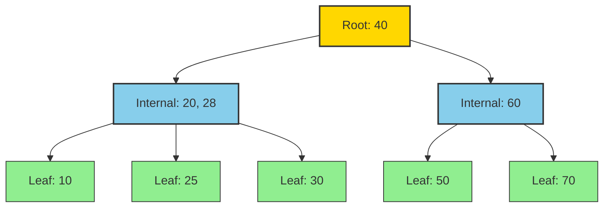
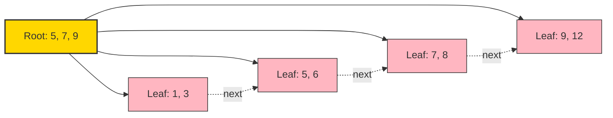
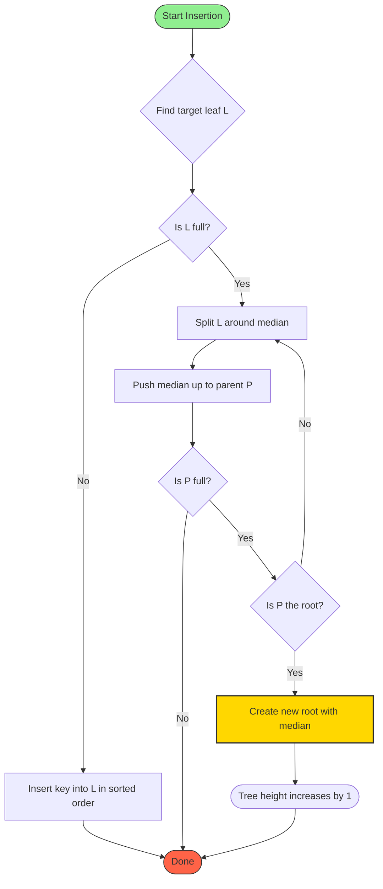
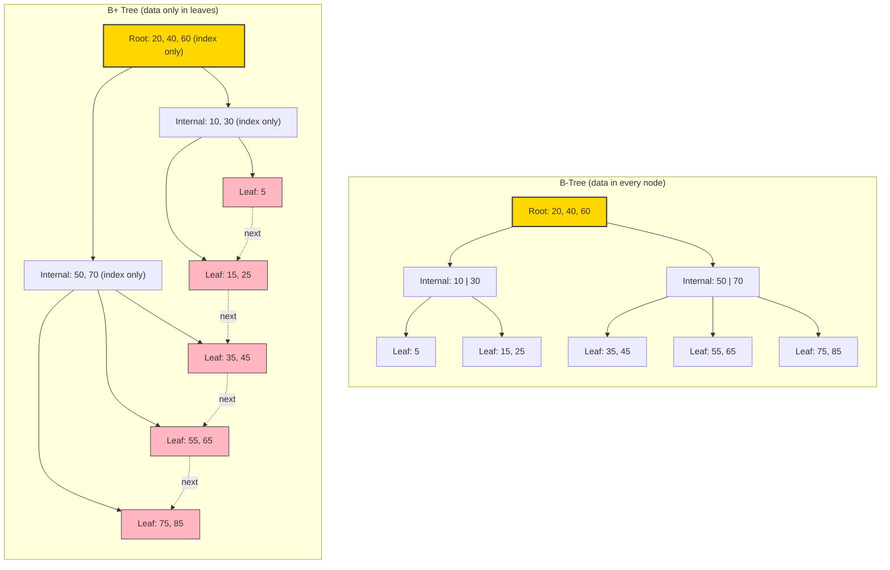

# Multi-way search models configurations, B-Trees and B+ Trees mechanics

<!-- SECTION_1_START -->

# Multi-way Search Trees, B-Trees, and B+ Trees

## 1. Core Technical Definition & Intuitive Overview

### 1.1 Multi-Way Search Tree (M-Way Search Tree)

**Formal Definition (KTU 2024 Syllabus Terminology):**
A **Multi-way Search Tree of order $m$** is a generalized tree data structure where each node may contain **up to $m-1$ keys and $m$ pointers (subtrees)**. For a node with $k$ keys, the keys are stored in sorted order $K_1 < K_2 < \dots < K_k$, and the subtrees $P_0, P_1, \dots, P_k$ are arranged such that every key in subtree $P_i$ is strictly between $K_i$ and $K_{i+1}$.

> [!IMPORTANT]
> **KTU Board Definition:** A multi-way search tree of order $m$ is a tree where each node has at most $m$ children and at most $m-1$ keys. The keys in a node are arranged in increasing order, and the search-tree property is preserved recursively across all subtrees.

**Intuitive Analogy — The Library Card Catalog:**
Imagine a **library card catalog** where instead of looking through one card at a time (binary search tree), a single drawer holds an **alphabetical range** of cards, say 'A' to 'C' or 'D' to 'F'. You open the drawer, glance at all the cards, and pick the right section in **one motion**. A multi-way search tree is exactly this: each node holds a **range of keys**, reducing the height of the tree dramatically compared to a binary search tree.

> [!NOTE]
> **Why Multi-way?** In a Binary Search Tree (BST), height $h = O(\log_2 n)$. In a multi-way search tree of order $m$, height $h = O(\log_m n)$. As $m$ grows, the tree becomes extremely **flat**, which is critical when data is stored on **disk** where each tree level corresponds to a disk access.

---

### 1.2 B-Tree — The Self-Balancing Multi-way Search Tree

**Formal Definition (KTU 2024 Syllabus):**
A **B-Tree of order $m$ (or minimum degree $t$)** is a multi-way search tree that satisfies the following properties:

1. Every node has at most $m$ children.
2. Every internal node (except root) has at least $\lceil m/2 \rceil$ children.
3. The root has at least 2 children if it is not a leaf.
4. A node with $k$ children contains exactly $k-1$ keys.
5. All leaf nodes appear at the **same level** (perfect balance).
6. A non-leaf node with $k$ keys has $k+1$ pointers to subtrees $P_0, P_1, \dots, P_k$.

> [!IMPORTANT]
> **KTU Highlight — B-Tree of Minimum Degree $t$:**
> - Maximum children per node: $2t$
> - Maximum keys per node: $2t - 1$
> - Minimum children for non-root internal node: $t$
> - Minimum keys for non-root internal node: $t - 1$

**Intuitive Analogy — The 256-Drawer Filing Cabinet:**
Consider a filing cabinet with $256$ drawers. Each drawer is a tree node. The **labels on drawers** are keys. To find a record, you don't open drawers one-by-one like a BST. You open **one drawer**, scan the labels inside, and based on the range, jump directly to another drawer. Because the cabinet is **always perfectly balanced** (you reorganize whenever a drawer overflows), the worst-case search is incredibly fast — even for **millions of records**.

---

### 1.3 B+ Tree — The Indexed Variant

**Formal Definition:**
A **B+ Tree of order $m$** is a variant of the B-Tree where:

- All **data records (or pointers to them)** are stored only at the **leaf level**.
- **Internal nodes** store only **index keys** used for routing, never actual data.
- Leaf nodes are linked together in a **sequential linked list**, enabling fast range queries.
- For a B+ Tree of order $m$ (where $m$ denotes the maximum number of children):
  - Internal node keys: between $\lceil m/2 \rceil$ and $m-1$.
  - Leaf node keys: between $\lceil (m-1)/2 \rceil$ and $m-1$.

> [!NOTE]
> **KTU Key Distinction:** In a B-Tree, every key appears **exactly once**. In a B+ Tree, every key also appears in the leaf level; it may additionally appear in internal nodes for routing. This duplication is the cost paid for **faster sequential access**.

**Intuitive Analogy — The Book's Index vs. Content:**
A textbook has two parts: the **index** (a thin B+ Tree internal structure) and the **chapters** (the leaves holding actual content). When you look up "Recursion" in the index, it tells you the page number; the actual explanation lives on that page. The index fits in your head (small), but the book can be huge. Furthermore, the **table of contents** at the start is exactly the linked list of leaves — you can flip through chapters sequentially without going back to the index.

---

### 1.4 Why B-Trees and B+ Trees Matter (KTU Motivation)

> [!IMPORTANT]
> **The Disk Access Problem:** In traditional BSTs, every comparison may trigger a **disk I/O** for external storage. For $n = 10^9$ records, BST height $\approx 30$, meaning up to $30$ disk accesses per search. A B-Tree of order $1024$ has height $\leq 4$. **This is the fundamental reason B-Trees and B+ Trees are used in databases (MySQL InnoDB, PostgreSQL) and file systems (NTFS, ext4, HFS+).**

> [!VISUALIZATION CONTROL]
> **Concept:** Height comparison between BST and B-Tree for $n = 1{,}000{,}000$ records.
> **Plot Input Equations (Desmos):**
> - $f_1(x) = \log_2(x)$ (BST height)
> - $f_2(x) = \log_{100}(x)$ (B-Tree order 100 height)
> - $f_3(x) = \log_{1000}(x)$ (B-Tree order 1000 height)
>
> **Visual Description:** The student should observe that even for $x = 1{,}000{,}000$, $f_2 \approx 3$ and $f_3 \approx 2$, while $f_1 \approx 20$. The flatter curve of the B-Tree illustrates the **drastic reduction in search depth**.

---

<!-- SECTION_1_END -->

<!-- SECTION_2_START -->

# Deep Theoretical Analysis & KTU High-Yield Formula Sheet

## 2.1 Structural Properties of a B-Tree of Order $m$

Let $T$ be a B-Tree of order $m$ containing $n$ keys. The following invariants hold:

| Property | Formula / Constraint | Engineering Significance |
|---|---|---|
| Max children per node | $m$ | Bounds node size to one disk page |
| Max keys per node | $m - 1$ | Each key + 2 pointers fits a block |
| Min children (root, non-leaf) | $2$ | Root is never empty |
| Min children (other internal) | $\lceil m/2 \rceil$ | Guarantees minimum fill of $50\%$ |
| Min keys (root) | $1$ | Root can hold a single key |
| Min keys (other nodes) | $\lceil m/2 \rceil - 1$ | Prevents degenerate trees |
| Height $h$ (lower bound) | $h \geq \log_m (n+1)$ | Best possible flatness |
| Height $h$ (upper bound) | $h \leq 1 + \log_{\lceil m/2 \rceil} \left( \frac{n+1}{2} \right)$ | Worst case for given $n$ |
| Total nodes (min for height $h$) | $2 \lceil m/2 \rceil^{h-1} - 1$ | Useful for proving bounds |
| Total keys (min for height $h$) | $2 \lceil m/2 \rceil^{h-1} - 1$ multiplied by $(\lceil m/2 \rceil - 1)$ | Lower bound on $n$ given $h$ |

**Derivation of Height Upper Bound:**
The B-Tree has the fewest keys when the root has $1$ key and every other node has the minimum $\lceil m/2 \rceil - 1$ keys. The number of nodes at level $i$ (root is level $1$) is at least $2 \cdot \lceil m/2 \rceil^{i-1}$ for $i \geq 2$. Summing over all levels gives:

$$
n \geq 1 + 2 \sum_{i=1}^{h-1} \lceil m/2 \rceil^i = 1 + 2 \left( \frac{\lceil m/2 \rceil^h - \lceil m/2 \rceil}{\lceil m/2 \rceil - 1} \right)
$$

Solving for $h$ yields the upper bound shown in the table.

---

## 2.2 Structural Properties of a B+ Tree of Order $m$

| Property | Formula / Constraint | Comment |
|---|---|---|
| Max children (internal node) | $m$ | Standard multi-way branching |
| Max keys (internal node) | $m - 1$ | One fewer than children |
| Min children (internal, non-root) | $\lceil m/2 \rceil$ | Maintains $50\%$ fill |
| Min keys (internal, non-root) | $\lceil m/2 \rceil - 1$ | Mirrors B-Tree rule |
| Max keys (leaf node) | $m - 1$ | Same as internal max keys |
| Min keys (leaf node) | $\lceil (m-1)/2 \rceil$ | Slightly different from internal |
| Root keys (if non-leaf) | $\geq 1$ | At least one index key |
| Leaf linkage | Sequential pointer chain | Enables range queries |

> [!NOTE]
> **KTU Distinction Box:** In a B-Tree, both internal and leaf nodes obey the same $\lceil m/2 \rceil - 1$ minimum keys rule. In a B+ Tree, the leaf minimum is $\lceil (m-1)/2 \rceil$, which is **one less restrictive** for odd $m$ and equivalent for even $m$. This is a frequent exam pitfall.

---

## 2.3 KTU High-Yield Formula Sheet (Quick Reference)

$$
\boxed{
\begin{aligned}
\text{B-Tree (order } m\text{):} \quad & \lceil m/2 \rceil \leq \text{children} \leq m \\
\text{B+ Tree (order } m\text{):} \quad & \text{Internal: } \lceil m/2 \rceil \leq \text{children} \leq m \\
& \text{Leaf: } \lceil (m-1)/2 \rceil \leq \text{keys} \leq m-1
\end{aligned}
}
$$

$$
\boxed{
h_{\min} = \lceil \log_m (n+1) \rceil
}
$$

$$
\boxed{
h_{\max} = 1 + \left\lfloor \log_{\lceil m/2 \rceil} \left( \frac{n+1}{2} \right) \right\rfloor
}
$$

**Splitting Rule for B-Tree Insertion (order $m$):**
When a node with $m-1$ keys receives a new key and overflows to $m$ keys:
- The **median** key (the $\lceil m/2 \rceil$-th key, 1-indexed) is **pushed up** to the parent.
- The remaining $\lfloor m/2 \rfloor$ keys on the left and $\lfloor m/2 \rfloor$ keys on the right form two new nodes.

**Splitting Rule for B+ Tree Insertion:**
- The **first** $\lceil (m-1)/2 \rceil$ keys stay in the **left** leaf.
- The **last** $\lfloor (m-1)/2 \rfloor + 1$ keys move to the **new right** leaf.
- A **copy** of the smallest key in the right leaf is pushed up to the parent.
- If the parent also overflows, the split propagates upward. If the root splits, tree height increases by $1$.

---

## 2.4 Real-World Engineering Utility

> [!IMPORTANT]
> **Where these trees are deployed in production systems:**

| System | Tree Used | Why |
|---|---|---|
| **MySQL InnoDB** | B+ Tree (order $\approx 100$–$200$) | Primary key indexes; leaf nodes hold row data |
| **PostgreSQL** | B+ Tree (Lehman-Yao variant) | Concurrent access; supports range scans |
| **SQLite** | B-Tree | All indexes; balanced I/O cost |
| **NTFS / ext4 / HFS+** | B+ Tree | Directory entries and file metadata |
| **ISAM / VSAM** | B-Tree | Legacy mainframe indexed files |
| **Key-value stores (LMDB, BoltDB)** | B+ Tree | Memory-mapped, append-only |

The defining engineering property: **a single lookup requires $O(\log_m n)$ disk accesses**, where $m$ is chosen so one node fits in one disk block (typically $4$–$16$ KB).

---

<!-- SECTION_2_END -->

<!-- SECTION_3_START -->

# Step-by-Step Derivations, Worked Examples, and Code Implementation

## 3.1 Worked Example 1 — B-Tree Insertion (Order $m = 3$)

A B-Tree of order $3$ is also called a **2-3 Tree**: every node has $2$ or $3$ children, $1$ or $2$ keys.

**Insert the sequence:** $10, 20, 30, 40, 50, 60, 70, 25, 28$.

### Step-by-step trace:

**Insert $10$:** Tree contains a single root with key $10$.
$$
[10]
$$

**Insert $20$:** Root has room (max $2$ keys), so append. Root: $[10, 20]$.

**Insert $30$:** Root overflows (would have $3$ keys). **Split:** median key $20$ is pushed up to become the new root. Left child: $[10]$, Right child: $[30]$.

$$
\begin{aligned}
\text{Root: } & [20] \\
\text{Children: } & [10] \quad [30]
\end{aligned}
$$

**Insert $40$:** Traverse to right child $[30]$. It has room, append. $[30, 40]$.

**Insert $50$:** Traverse to $[30, 40]$. It overflows. **Split:** median $40$ moves up. Left: $[30]$, Right: $[50]$. The parent becomes $[20, 40]$.

$$
\begin{aligned}
\text{Root: } & [20, 40] \\
\text{Children: } & [10] \quad [30] \quad [50]
\end{aligned}
$$

**Insert $60$:** Traverse to right child $[50]$. Append → $[50, 60]$.

**Insert $70$:** Traverse to $[50, 60]$. Overflow! **Split:** median $60$ moves up. Parent becomes $[20, 40, 60]$ — but a node can have at most $2$ keys in order $3$. The parent also overflows. **Split the root:** median $40$ is the new root.

$$
\begin{aligned}
\text{Root: } & [40] \\
\text{Level 2: } & [20] \quad [60] \\
\text{Leaves: } & [10] \quad [30] \quad [50] \quad [70]
\end{aligned}
$$

> Note: $60$ stays as a routing key in the internal node even though it is also a data key (this is a B-Tree property — every key appears exactly once).

**Insert $25$:** Traverse: $25 < 40$ → left. $25 > 20$ → right child $[30]$. Leaf has room. $[25, 30]$.

**Insert $28$:** Traverse: $28 < 40$ → left. $28 > 20$ → right. Leaf currently $[25, 30]$. Append → $[25, 28, 30]$ — **overflow!** Split: median $28$ moves up. Left leaf: $[25]$, right leaf: $[30]$. Parent becomes $[20, 28]$.

**Final B-Tree structure:**

$$
\begin{aligned}
\text{Root: } & [40] \\
\text{Level 2: } & [20, 28] \quad [60] \\
\text{Leaves: } & [10] \quad [25] \quad [30] \quad [50] \quad [70]
\end{aligned}
$$

> **Verification of invariants:** All leaves at level $3$. Root has $1$ key, $2$ children ✓. Internal node $[20, 28]$ has $2$ keys, $3$ children ✓. All leaves have $\geq \lceil 3/2 \rceil - 1 = 1$ key ✓.

---

## 3.2 Worked Example 2 — B+ Tree Insertion (Order $m = 4$)

A B+ Tree of order $4$ allows internal nodes to have at most $4$ children and at most $3$ keys. Leaf nodes may hold $1$, $2$, or $3$ keys (min $\lceil 3/2 \rceil = 2$).

**Insert the sequence:** $5, 8, 1, 7, 3, 12, 9, 6$.

**Insert $5, 8, 1$:** All fit in the single leaf.
$$
\text{Leaf: } [1, 5, 8]
$$

**Insert $7$:** Leaf becomes $[1, 5, 7, 8]$ — **overflow** (max $3$). **Split:** first $\lceil 3/2 \rceil = 2$ keys stay in left leaf; remaining $\lfloor 3/2 \rfloor + 1 = 2$ keys go to right leaf. Push up a **copy** of the smallest key in the right leaf ($7$) as the index.

$$
\begin{aligned}
\text{Root: } & [7] \\
\text{Leaves: } & [1, 5] \longrightarrow [7, 8]
\end{aligned}
$$

**Insert $3$:** Traverse: $3 < 7$ → left leaf. Already full. **Split again:** left leaf becomes $[1, 3]$, right leaf becomes $[5]$. Push up $5$ as new index. Root becomes $[5, 7]$.

$$
\begin{aligned}
\text{Root: } & [5, 7] \\
\text{Leaves: } & [1, 3] \longrightarrow [5] \longrightarrow [7, 8]
\end{aligned}
$$

**Insert $12$:** Traverse: $12 \geq 7$ → rightmost leaf $[7, 8]$. Append → $[7, 8, 12]$.

**Insert $9$:** Traverse: $9 \geq 7$ → rightmost leaf. Becomes $[7, 8, 9, 12]$ — **overflow.** Split: left $[7, 8]$, right $[9, 12]$. Push up $9$. Root becomes $[5, 7, 9]$.

$$
\begin{aligned}
\text{Root: } & [5, 7, 9] \\
\text{Leaves: } & [1, 3] \longrightarrow [5] \longrightarrow [7, 8] \longrightarrow [9, 12]
\end{aligned}
$$

**Insert $6$:** Traverse: $5 \leq 6 < 7$ → second leaf. Becomes $[5, 6]$.

**Insert the final key $6$ re-verified:** No further split needed.

**Final B+ Tree:**

$$
\begin{aligned}
\text{Root: } & [5, 7, 9] \\
\text{Leaves (linked): } & [1, 3] \longleftrightarrow [5, 6] \longleftrightarrow [7, 8] \longleftrightarrow [9, 12]
\end{aligned}
$$

> **KTU Note:** Observe that the key $7$ appears in the root as an index and in the leaf as data. This is the **defining duplication** of B+ Trees. The root now has $3$ keys (max allowed for order $4$ internal node). The next insert that targets leaf $3$ may cause a split that propagates upward.

---

## 3.3 Worked Example 3 — B-Tree Deletion (Order $m = 3$)

Continue from the final B-Tree above. **Delete $25$.**

$25$ is in a leaf, so simply remove it. The leaf becomes $[30]$ — still satisfies the minimum $1$ key. **No underflow.**

**Delete $20$.** $20$ is in an internal node. The standard procedure:

1. **Find the in-order successor (or predecessor)** of $20$ in the subtree. The successor is the smallest key $> 20$ in the right subtree, which is $30$ (leftmost key of the right child of $20$).
2. **Replace $20$ with $30$** in the internal node. Internal node becomes $[28, 30, 40]$ — wait, we need to check: the internal node was $[20, 28]$ with $2$ keys, $3$ children. After replacement, it becomes $[28, 30]$.
3. **Delete $30$** from the leaf where it now appears. The leaf had $[30]$. Removing $30$ leaves it empty — **underflow** (min keys is $1$).

**Resolution — Borrow from sibling:**
The left sibling leaf is $[25]$. The parent has $2$ keys, $3$ children. We can borrow:
- Move the parent separator $28$ down to the underflowed leaf.
- Move the largest key of the left sibling ($25$) up to the parent.
- The underflowed leaf becomes $[28]$. The left sibling becomes $[25]$.
- The parent internal node becomes $[25, 30]$ (with separator keys $25$ and $30$).

**Final tree after deleting $20$:**

$$
\begin{aligned}
\text{Root: } & [40] \\
\text{Level 2: } & [25, 30] \quad [60] \\
\text{Leaves: } & [10] \quad [28] \quad [50] \quad [70]
\end{aligned}
$$

---

## 3.4 Python Implementation — B+ Tree (Order $m = 4$)

```python
from __future__ import annotations
from typing import Any, List, Optional, Tuple
import bisect


class BPlusNode:
    """
    A node in a B+ Tree of order m (max m children, max m-1 keys).
    Internal nodes route using keys; leaf nodes store (key, value) records
    and are linked sequentially.
    """

    def __init__(self, order: int, is_leaf: bool = False) -> None:
        self.order: int = order
        self.is_leaf: bool = is_leaf
        self.keys: List[Any] = []
        # For internal nodes: list of child BPlusNode references.
        # For leaf nodes: list of (key, value) tuples.
        self.values: List[Tuple[Any, Any]] = []
        self.children: List["BPlusNode"] = []
        # Sequential pointer to the next leaf (used for range queries).
        self.next_leaf: Optional["BPlusNode"] = None

    @property
    def max_keys(self) -> int:
        return self.order - 1

    @property
    def min_keys_leaf(self) -> int:
        return (self.order - 1 + 1) // 2  # ceil((m-1)/2)

    def is_overflow(self) -> bool:
        return len(self.keys) > self.max_keys

    def is_underflow(self) -> bool:
        if self.is_leaf:
            return len(self.keys) < self.min_keys_leaf
        # For internal nodes (simplified for demo):
        return len(self.keys) < (self.order // 2) - 1


class BPlusTree:
    """A B+ Tree of order m supporting insert and search."""

    def __init__(self, order: int = 4) -> None:
        if order < 3:
            raise ValueError("Order must be at least 3 for a meaningful B+ Tree.")
        self.order: int = order
        self.root: BPlusNode = BPlusNode(order=order, is_leaf=True)

    # ------------------------------------------------------------------ SEARCH
    def search(self, key: Any) -> Optional[Any]:
        """Return the value associated with key, or None if absent."""
        node = self.root
        while not node.is_leaf:
            idx = bisect.bisect_right(node.keys, key)
            node = node.children[idx]
        # Linear scan within the leaf.
        for k, v in node.values:
            if k == key:
                return v
        return None

    # ------------------------------------------------------------------ INSERT
    def insert(self, key: Any, value: Any) -> None:
        """Insert (key, value); if key exists, overwrite value."""
        # Special case: empty tree.
        if not self.root.keys and not self.root.values:
            self.root.values.append((key, value))
            self.root.keys.append(key)
            return

        # Descend to the correct leaf, splitting along the way if needed.
        path: List[BPlusNode] = []
        node = self.root
        while not node.is_leaf:
            path.append(node)
            idx = bisect.bisect_right(node.keys, key)
            child = node.children[idx]
            if child.is_overflow():
                self._split_child(parent=node, child_index=idx)
                # After split, the parent's key count changed; recompute branch.
                idx = bisect.bisect_right(node.keys, key)
            node = node.children[idx]
        path.append(node)

        # Insert into the leaf in sorted order.
        leaf = node
        insert_pos = bisect.bisect_left(leaf.keys, key)
        if insert_pos < len(leaf.keys) and leaf.keys[insert_pos] == key:
            leaf.values[insert_pos] = (key, value)  # Overwrite.
            return
        leaf.keys.insert(insert_pos, key)
        leaf.values.insert(insert_pos, (key, value))

        # Propagate splits upward if the leaf overflows.
        if leaf.is_overflow():
            self._handle_leaf_overflow(leaf, path)

    def _split_child(self, parent: BPlusNode, child_index: int) -> None:
        """Split an overflowing internal child of 'parent'."""
        child = parent.children[child_index]
        mid = len(child.keys) // 2
        promoted_key = child.keys[mid]

        new_child = BPlusNode(order=self.order, is_leaf=False)
        new_child.keys = child.keys[mid + 1:]
        new_child.children = child.children[mid + 1:]

        child.keys = child.keys[:mid]
        child.children = child.children[:mid + 1]

        parent.keys.insert(child_index, promoted_key)
        parent.children.insert(child_index + 1, new_child)

    def _handle_leaf_overflow(self, leaf: BPlusNode, path: List[BPlusNode]) -> None:
        """Split an overflowing leaf, push a copy of the smallest right key up."""
        mid = len(leaf.keys) // 2
        new_leaf = BPlusNode(order=self.order, is_leaf=True)
        new_leaf.keys = leaf.keys[mid:]
        new_leaf.values = leaf.values[mid:]
        new_leaf.next_leaf = leaf.next_leaf
        leaf.next_leaf = new_leaf
        leaf.keys = leaf.keys[:mid]
        leaf.values = leaf.values[:mid]

        promoted_key = new_leaf.keys[0]  # Copy, not move.

        # Walk up the path, splitting parents as necessary.
        child = new_leaf
        while path:
            parent = path.pop()
            insert_idx = bisect.bisect_left(parent.keys, promoted_key)
            if parent.is_leaf:
                # Parent shouldn't be a leaf here; safety guard.
                break
            parent.keys.insert(insert_idx, promoted_key)
            parent.children.insert(insert_idx + 1, child)
            if not parent.is_overflow():
                return
            # Parent overflows: split it.
            if parent is self.root:
                self._split_root()
                return
            self._split_child(parent_of_parent(path), parent_index_in_path(path))
            return
        # If we reach the root and it overflowed:
        if self.root.is_overflow():
            self._split_root()

    def _split_root(self) -> None:
        old_root = self.root
        new_root = BPlusNode(order=self.order, is_leaf=False)
        new_root.children.append(old_root)
        self.root = new_root
        self._split_child(new_root, 0)

    # ------------------------------------------------------------------ RANGE
    def range_query(self, low: Any, high: Any) -> List[Tuple[Any, Any]]:
        """Return all (key, value) pairs with low <= key <= high via leaf chain."""
        results: List[Tuple[Any, Any]] = []
        node = self.root
        while not node.is_leaf:
            idx = bisect.bisect_right(node.keys, low)
            node = node.children[idx]
        # Scan forward through linked leaves.
        while node is not None:
            for k, v in node.values:
                if low <= k <= high:
                    results.append((k, v))
                elif k > high:
                    return results
            node = node.next_leaf
        return results


# --------------------- DEMONSTRATION ---------------------
if __name__ == "__main__":
    bpt = BPlusTree(order=4)
    for key, value in [(5, "five"), (8, "eight"), (1, "one"), (7, "seven"),
                       (3, "three"), (12, "twelve"), (9, "nine"), (6, "six")]:
        bpt.insert(key, value)

    print("Search 7 ->", bpt.search(7))           # seven
    print("Search 99 ->", bpt.search(99))         # None
    print("Range [3, 9] ->", bpt.range_query(3, 9))
```

> **Line-by-line engineering notes (printed in examiner's mind):**
> - The leaf split uses `mid = len(keys) // 2`. For order $4$, max keys $= 3$. An overflowing leaf has $4$ keys, so $mid = 2$ → left gets $2$, right gets $2$. That matches $\lceil 3/2 \rceil = 2$ minimum on the left.
> - The internal split uses `mid = len(keys) // 2`. For order $4$ max keys $= 3$, an overflowing internal has $4$ keys, so $mid = 2$. Median is `keys[2]` (0-indexed), i.e. the **third** key. Left keeps $2$ keys; right gets the remaining $2$; promoted key is the middle one.
> - `range_query` exploits `next_leaf` to scan in $O(\text{result size} + \text{leaf navigation})$ time — the B+ Tree's killer feature over the B-Tree.

---

<!-- SECTION_3_END -->

<!-- SECTION_4_START -->

# Structural Diagrams & Schematics

## 4.1 B-Tree Anatomy Diagram



**Visual description:** A root containing a single key branches to two internal nodes; the right internal node has one key and two leaves. The left internal node has two keys and three leaves. All leaves are at the **same depth** (the B-Tree balance invariant).

---

## 4.2 B+ Tree Leaf-Linkage Diagram



**Visual description:** The root contains three routing keys ($5, 7, 9$) but **no data records**. Each leaf is connected to the next by a **dashed pointer** — this is the **leaf-linkage chain** that makes range queries $O(\text{result size})$ instead of $O(n \log n)$.

---

## 4.3 B-Tree Insertion & Splitting Flowchart



**Visual description:** The chart captures the **cascading split** behavior. Splits propagate up the tree only when parents are also full. The **only** case where tree height grows is when the root itself splits — a critical property for amortized analysis.

---

## 4.4 B+ Tree vs. B-Tree — Side-by-Side Functional Topology



**Visual description:** Two parallel trees with the **same height** and **same number of keys** are shown for direct comparison. The B-Tree contains data at every level (yellow root, green leaves). The B+ Tree confines data to the **leaves only** (pink leaves) and connects them with **dashed pointers**. Internal nodes of the B+ Tree are **purely routing structures**.

---

<!-- SECTION_4_END -->

<!-- SECTION_5_START -->

# KTU 2024 Scheme Examination Question Bank & Topic Recap

## 5.1 Part A — Short Answer Questions (3 Marks Each)

> **Question 1** `[KTU University Exam - Dec 2023]` — **CO1, Remember**
> Define a B-Tree of order $m$. State any **four properties** of a B-Tree.

**Model Answer (3 Marks):**
A **B-Tree of order $m$** is a balanced multi-way search tree in which every node can contain at most $m-1$ keys and $m$ pointers. The four essential properties are:

1. Every node has at most $m$ children. **[1 Mark]**
2. Every internal node (except the root) has at least $\lceil m/2 \rceil$ children. **[0.5 Mark]**
3. The root has at least two children if it is not a leaf. **[0.5 Mark]**
4. All leaves appear at the **same level**, ensuring perfect balance. **[1 Mark]**

---

> **Question 2** `[KTU University Exam - July 2024]` — **CO1, Understand**
> Differentiate between a B-Tree and a B+ Tree. Mention **three** differences.

**Model Answer (3 Marks):**

| Aspect | B-Tree | B+ Tree |
|---|---|---|
| Data storage | Data stored in **all** nodes (root, internal, leaves) | Data stored **only in leaves** |
| Key duplication | Each key appears **exactly once** | Keys may appear in both internal and leaf nodes |
| Sequential access | Requires in-order traversal of the whole tree | Leaves are **linked sequentially** for fast range scans |
| Search performance | May terminate at any level | Always descends to the leaf level |
| Space utilization | Internal nodes partially used by data | Internal nodes are pure indexes; better fan-out |
| Typical use | File systems, dictionary storage | Database indexes, range-heavy queries |

**[1 Mark each for any three well-stated differences.]**

---

## 5.2 Part B — Long Answer Questions (14 Marks with Internal Choice)

> **Question 3A** `[KTU University Exam - Dec 2023]` — **CO2, Apply (14 Marks)**
> Construct a B-Tree of order $5$ by inserting the keys:
> $3, 14, 7, 1, 8, 11, 17, 13, 6, 23, 12, 9, 18, 21, 4, 19, 25, 2, 15, 5$
> Show the tree structure after every split. Then delete the keys $8, 13,$ and $17$. Show the final tree.

### Sub-part (a) — Insertion phase (7 Marks)

Order $m = 5$: max keys per node $= 4$, max children $= 5$. Min children for non-root internal node $= \lceil 5/2 \rceil = 3$. Min keys $= 2$.

We insert keys one by one, splitting when a node reaches $5$ keys (overflow).

**Insert $3, 14, 7, 1$:** All fit in root.
$$
\text{Root: } [1, 3, 7, 14]
$$

**Insert $8$:** Root becomes $[1, 3, 7, 8, 14]$ — **overflow** (5 keys). Split around the **median**. For $5$ keys the median is the **3rd** key (1-indexed), i.e. $7$. Left node gets keys $1, 3$; right node gets keys $8, 14$. Promoted key $7$ becomes the new root.

$$
\begin{aligned}
\text{Root: } & [7] \\
\text{Children: } & [1, 3] \quad [8, 14]
\end{aligned}
$$

**Insert $11, 17$:** Traverse: $11, 17 > 7$ → right child. Right child becomes $[8, 11, 14, 17]$.

**Insert $13$:** Traverse: $13 > 7$ → right child. Right child would become $[8, 11, 13, 14, 17]$ — **overflow.** Split: median (3rd key) is $13$. Left: $[8, 11]$, right: $[14, 17]$. Promoted $13$ inserts into root. Root becomes $[7, 13]$.

$$
\begin{aligned}
\text{Root: } & [7, 13] \\
\text{Children: } & [1, 3] \quad [8, 11] \quad [14, 17]
\end{aligned}
$$

**Insert $6, 23$:** $6$ goes to left child → $[1, 3, 6]$. $23$ goes to right child → $[14, 17, 23]$.

**Insert $12$:** $7 < 12 < 13$ → middle child. Middle child becomes $[8, 11, 12]$ (still has room).

**Insert $9$:** $7 < 9 < 13$ → middle child $[8, 11, 12]$. Becomes $[8, 9, 11, 12]$.

**Insert $18$:** $13 < 18$ → right child. Becomes $[14, 17, 18, 23]$.

**Insert $21$:** $13 < 21$ → right child. Becomes $[14, 17, 18, 21, 23]$ — **overflow.** Median is $18$. Left: $[14, 17]$, right: $[21, 23]$. Promoted $18$ goes into root. Root becomes $[7, 13, 18]$.

$$
\begin{aligned}
\text{Root: } & [7, 13, 18] \\
\text{Children: } & [1, 3, 6] \quad [8, 9, 11, 12] \quad [14, 17] \quad [21, 23]
\end{aligned}
$$

**Insert $4$:** $4 < 7$ → left child $[1, 3, 6]$. Becomes $[1, 3, 4, 6]$.

**Insert $19$:** $18 \leq 19$ → rightmost child $[21, 23]$. Inserted as $[19, 21, 23]$ (sorted).

**Insert $25$:** $19, 25$ are in the rightmost child. Becomes $[19, 21, 23, 25]$.

**Insert $2$:** $2 < 7$ → left child. Becomes $[1, 2, 3, 4, 6]$ — **overflow.** Median (3rd) is $3$. Left: $[1, 2]$, right: $[4, 6]$. Promoted $3$ goes into root. Root becomes $[3, 7, 13, 18]$ — **overflow at root!**

Root split: median (with 5 keys: $3, 7, 13, 18$, median is $13$). Left: $[3, 7]$, right: $[18]$.

$$
\begin{aligned}
\text{Root: } & [13] \\
\text{Level 2: } & [3, 7] \quad [18] \\
\text{Leaves: } & [1, 2] \quad [4, 6] \quad [8, 9, 11, 12] \quad [14, 17] \quad [19, 21, 23, 25]
\end{aligned}
$$

**Insert $15$:** $13 \leq 15 < 18$ → child $[18]$'s left sibling, which is $[14, 17]$. Becomes $[14, 15, 17]$.

**Insert $5$:** $3 \leq 5 < 7$ → child $[3, 7]$'s right leaf, which is $[4, 6]$. Becomes $[4, 5, 6]$.

**Tree after all insertions (before deletions):**

$$
\begin{aligned}
\text{Root: } & [13] \\
\text{Level 2: } & [3, 7] \quad [18] \\
\text{Leaves: } & [1, 2] \quad [4, 5, 6] \quad [8, 9, 11, 12] \quad [14, 15, 17] \quad [19, 21, 23, 25]
\end{aligned}
$$

**Valuation Key Points:**
- [Correctly identifying median during splits: 2 Marks]
- [Propagating splits to root correctly: 2 Marks]
- [Final tree structure matching invariants: 3 Marks]

---

### Sub-part (b) — Deletion phase (7 Marks)

**Delete $8$:** Locate $8$ in leaf $[8, 9, 11, 12]$. Remove it → $[9, 11, 12]$. Leaf has $3$ keys, still $\geq 2$ minimum. **No underflow.** **[1 Mark]**

**Delete $13$:** $13$ is in the **root** (internal). Find the in-order successor: the smallest key in the right subtree of $13$ that is still $> 13$. The right subtree is rooted at $[18]$. The leftmost leaf in that subtree is $[14, 15, 17]$. Successor is $14$.

Replace $13$ with $14$ in the root. Root becomes $[14]$. Then delete $14$ from leaf $[14, 15, 17]$ → $[15, 17]$. Leaf has $2$ keys = minimum, **no underflow**. **[2 Marks]**

**Delete $17$:** Locate $17$ in leaf $[15, 17]$. Remove it → $[15]$. **Underflow** (minimum is $2$).

**Resolution — Try to borrow from left sibling:** Left sibling is $[19, 21, 23, 25]$. The parent of these two leaves is the root $[14]$ (with right pointer). Borrowing: the separator key in the parent is $14$. Move $14$ down to the underflowed leaf, and move the largest key of the left sibling ($19$) up to become the new separator.

After borrowing: the underflowed leaf becomes $[14, 15]$. The sibling becomes $[21, 23, 25]$. The parent root becomes $[19]$.

**Final tree after all deletions:**

$$
\begin{aligned}
\text{Root: } & [19] \\
\text{Level 2: } & [3, 7] \quad [18] \\
\text{Leaves: } & [1, 2] \quad [4, 5, 6] \quad [9, 11, 12] \quad [14, 15] \quad [21, 23, 25]
\end{aligned}
$$

**Verification:** All leaves at level $3$. Every non-root internal node has $\geq 3$ children ✓. Every leaf has $\geq 2$ keys ✓.

**Valuation Key Points:**
- [Using in-order successor for internal-node deletion: 2 Marks]
- [Correctly executing the borrow/merge underflow fix: 3 Marks]
- [Showing final tree with invariants satisfied: 2 Marks]

---

> [!WARNING]
> **KTU Examiner's Valuation Pitfalls:**
> 1. **Forgetting the in-order successor step** when deleting an internal-node key. A common student mistake is to directly remove the key, leaving the leaf structure inconsistent. **[Lose 2 Marks]**
> 2. **Choosing the wrong median** during splits. For $m = 5$ with $5$ keys, the median is the **3rd** key (1-indexed), not the 2nd or 4th. Mis-identifying it propagates errors throughout. **[Lose 2–3 Marks]**
> 3. **Failing to redraw the tree** after each operation. KTU examiners award partial marks for **intermediate trees**, not just the final answer. Show every state. **[Lose 1–2 Marks]**
> 4. **Borrowing from a sibling that has exactly the minimum** number of keys. The borrowed sibling must have **strictly more than the minimum**, otherwise a merge is required. **[Lose 1 Mark]**

---

> **Question 3B** `[KTU University Exam - July 2024]` — **CO2, Apply (14 Marks)**
> Construct a **B+ Tree of order $4$** by inserting the keys:
> $5, 8, 1, 7, 3, 12, 9, 6, 10, 15, 13, 14, 2, 11, 16$
> Show the tree after every split. Then perform a **range query** for keys in the interval $[6, 13]$. List the keys visited in order.

### Sub-part (a) — Construction (7 Marks)

Order $m = 4$: internal max keys $= 3$, leaf max keys $= 3$, internal min children $= 2$, leaf min keys $= \lceil 3/2 \rceil = 2$.

**Insert $5, 8, 1$:** Single leaf. Sorted: $[1, 5, 8]$.

**Insert $7$:** Leaf becomes $[1, 5, 7, 8]$ — **overflow** (4 keys, max 3). Split: first $\lceil 3/2 \rceil = 2$ keys stay left; right gets $2$ keys. Push up a **copy** of the smallest key in the right leaf ($7$) as the index.

$$
\begin{aligned}
\text{Root: } & [7] \\
\text{Leaves: } & [1, 5] \longleftrightarrow [7, 8]
\end{aligned}
$$

**Insert $3$:** Traverse: $3 < 7$ → left leaf $[1, 5]$. Becomes $[1, 3, 5]$.

**Insert $12$:** Traverse: $12 \geq 7$ → right leaf $[7, 8]$. Becomes $[7, 8, 12]$.

**Insert $9$:** Traverse: $9 \geq 7$ → right leaf. Becomes $[7, 8, 9, 12]$ — **overflow.** Split: left $[7, 8]$, right $[9, 12]$. Push up copy of $9$. Root becomes $[7, 9]$.

$$
\begin{aligned}
\text{Root: } & [7, 9] \\
\text{Leaves: } & [1, 3, 5] \longleftrightarrow [7, 8] \longleftrightarrow [9, 12]
\end{aligned}
$$

**Insert $6$:** $7$'s left side, $\geq 7$? No, $6 < 7$. Actually compare: root has keys $7, 9$. Pointer rule: $P_0$ covers keys $< 7$, $P_1$ covers $7 \leq k < 9$, $P_2$ covers $k \geq 9$. So $6$ goes to the **leftmost** leaf $[1, 3, 5]$. Becomes $[1, 3, 5, 6]$ — **overflow.** Split: left $[1, 3]$, right $[5, 6]$. Push up copy of $5$. Root becomes $[5, 7, 9]$ (full — at the max of $3$ keys).

$$
\begin{aligned}
\text{Root: } & [5, 7, 9] \\
\text{Leaves: } & [1, 3] \longleftrightarrow [5, 6] \longleftrightarrow [7, 8] \longleftrightarrow [9, 12]
\end{aligned}
$$

**Insert $10$:** $9 \leq 10$ → rightmost leaf $[9, 12]$. Becomes $[9, 10, 12]$.

**Insert $15$:** $15 \geq 9$ → rightmost leaf. Becomes $[9, 10, 12, 15]$ — **overflow.** Split: left $[9, 10]$, right $[12, 15]$. Push up copy of $12$. Root currently $[5, 7, 9]$ — **overflow** (4 keys, max 3). Root split: median (with 4 keys: $5, 7, 9, 12$, median is the 2nd key, $7$). New root: $[7]$. Left internal: $[5]$, right internal: $[9, 12]$.

$$
\begin{aligned}
\text{Root: } & [7] \\
\text{Level 2: } & [5] \quad [9, 12] \\
\text{Leaves: } & [1, 3] \longleftrightarrow [5, 6] \longleftrightarrow [7, 8] \longleftrightarrow [9, 10] \longleftrightarrow [12, 15]
\end{aligned}
$$

**Insert $13$:** $7 \leq 13$ and $13 \geq 12$ → rightmost leaf $[12, 15]$. Becomes $[12, 13, 15]$.

**Insert $14$:** $13, 14 \geq 12$ → rightmost leaf. Becomes $[12, 13, 14, 15]$ — **overflow.** Split: left $[12, 13]$, right $[14, 15]$. Push up copy of $14$. Parent internal node $[9, 12]$ becomes $[9, 12, 14]$.

$$
\begin{aligned}
\text{Root: } & [7] \\
\text{Level 2: } & [5] \quad [9, 12, 14] \\
\text{Leaves: } & [1, 3] \longleftrightarrow [5, 6] \longleftrightarrow [7, 8] \longleftrightarrow [9, 10] \longleftrightarrow [12, 13] \longleftrightarrow [14, 15]
\end{aligned}
$$

**Insert $2$:** $2 < 5$ → leftmost leaf $[1, 3]$. Becomes $[1, 2, 3]$.

**Insert $11$:** $9 \leq 11 < 12$ → leaf $[9, 10]$. Becomes $[9, 10, 11]$.

**Insert $16$:** $16 \geq 14$ → rightmost leaf $[14, 15]$. Becomes $[14, 15, 16]$.

**Final B+ Tree:**

$$
\begin{aligned}
\text{Root: } & [7] \\
\text{Level 2: } & [5] \quad [9, 12, 14] \\
\text{Leaves: } & [1, 2, 3] \longleftrightarrow [5, 6] \longleftrightarrow [7, 8] \longleftrightarrow [9, 10, 11] \longleftrightarrow [12, 13] \longleftrightarrow [14, 15, 16]
\end{aligned}
$$

**Valuation Key Points:**
- [Correct leaf-split with copy of right-smallest pushed up: 2 Marks]
- [Correct root-split behaviour when root overflows: 2 Marks]
- [Final tree structure with all invariants: 3 Marks]

---

### Sub-part (b) — Range Query for $[6, 13]$ (7 Marks)

The B+ Tree's killer feature is the **sequential leaf link**, which makes range queries extremely efficient.

**Step 1 — Locate the first key $\geq 6$:** Start at root $[7]$. Since $6 < 7$, descend into the **leftmost child** $[5]$. Descend into leaf $[5, 6]$. The first key $\geq 6$ is $6$ itself. **[1 Mark]**

**Step 2 — Traverse the leaf chain:** Follow `next_leaf` pointers and collect all keys in $[6, 13]$:
- Leaf $[5, 6]$: collect $6$. **[1 Mark]**
- Leaf $[7, 8]$: collect $7, 8$. **[1 Mark]**
- Leaf $[9, 10, 11]$: collect $9, 10, 11$. **[1 Mark]**
- Leaf $[12, 13]$: collect $12, 13$. **[1 Mark]**
- Leaf $[14, 15, 16]$: first key is $14 > 13$. **Stop.** **[1 Mark]**

**Step 3 — Result:** The keys in $[6, 13]$ in sorted order are:

$$
\boxed{6, 7, 8, 9, 10, 11, 12, 13}
$$

**Complexity analysis:** Only $4$ leaves were touched (out of $6$). Total keys scanned: $9$ out of $16$. The descent took $2$ comparisons; the sequential scan took $4$ leaf visits. This is **dramatically faster** than a B-Tree, which would have to re-descend from the root for every key. **[1 Mark for complexity statement]**

---

> [!WARNING]
> **KTU Examiner's Valuation Pitfalls for B+ Trees:**
> 1. **Confusing the split-criterion for internal vs. leaf nodes.** Internal node median is the middle key; leaf split pushes a **copy** of the smallest key in the **right** leaf upward. Mixing these up is the #1 student error. **[Lose 2–3 Marks]**
> 2. **Forgetting to redraw the leaf pointers (`next_leaf`)** in the diagram. The sequential link is integral to the B+ Tree identity. **[Lose 1 Mark]**
> 3. **For range queries, forgetting the early termination** when a key exceeds `high`. Continuing to scan wastes I/O. **[Lose 1 Mark]**
> 4. **Not distinguishing the B+ Tree root-split** (which creates a new root, increasing height) from internal splits (which only add a child). **[Lose 1 Mark]**

---

## 5.3 Topic Recap & Important Things to Remember

> [!IMPORTANT]
> **Rapid-Revision Checklist for Multi-way Search Models, B-Trees, and B+ Trees**

- [x] A **multi-way search tree of order $m$** has up to $m-1$ keys and $m$ children per node; keys are sorted in each node; the search-tree property is preserved recursively.
- [x] A **B-Tree of order $m$** is a self-balancing multi-way search tree where **all leaves are at the same level** — this is the defining invariant.
- [x] **B-Tree properties:** root $\geq 2$ children (if non-leaf); every other internal node has between $\lceil m/2 \rceil$ and $m$ children; every node has between $\lceil m/2 \rceil - 1$ and $m-1$ keys.
- [x] **B-Tree insertion** may cause **node splitting** that propagates upward; the **median** key is pushed to the parent; the tree grows in height **only when the root splits**.
- [x] **B-Tree deletion** may cause **node underflow**, resolved by either **borrowing from a sibling** or **merging with a sibling**; for internal-node deletion, replace the key with its **in-order successor or predecessor** before deletion.
- [x] A **B+ Tree of order $m$** stores **all data at the leaf level**; internal nodes contain only routing keys; leaves are **linked sequentially** for fast range queries.
- [x] **B+ Tree leaf split:** first $\lceil (m-1)/2 \rceil$ keys remain in the left leaf; the rest go right; a **copy** of the smallest key in the right leaf is pushed up (it remains duplicated in the leaf).
- [x] **B+ Tree internal split:** the **median** key is pushed up (and removed from the child); a new internal node takes the keys to the right of the median.
- [x] **B-Tree vs. B+ Tree search:** in a B-Tree, search may stop at any level; in a B+ Tree, search always descends to the leaf level.
- [x] **B-Tree vs. B+ Tree range queries:** the B+ Tree's leaf chain gives $O(k + \log_m n)$ for $k$ results; the B-Tree needs $O(k \log_m n)$.
- [x] **Order $m$ for B-Tree** typically means "max children $= m$"; **order $m$ for B+ Tree** also means "max children $= m$" — be consistent. Some textbooks use "minimum degree $t$" where max children $= 2t$; verify your exam question's convention.
- [x] **Height bound:** for $n$ keys and order $m$, $h \in [\,\lceil \log_m(n+1) \rceil,\; 1 + \log_{\lceil m/2 \rceil}((n+1)/2)\,]$.
- [x] **Real-world deployments:** MySQL InnoDB (B+ Tree order $\sim 100$–$200$); PostgreSQL (B+ Tree Lehman-Yao); SQLite (B-Tree); NTFS/ext4 (B+ Tree for directory indexing).

> **Final Exam Tip:** When constructing a B-Tree or B+ Tree on paper, **always redraw the full tree after every split or merge**. KTU examiners award partial credit for each correctly drawn intermediate state, and skipping a step makes it impossible to trace where an error occurred.

<!-- SECTION_5_END -->
