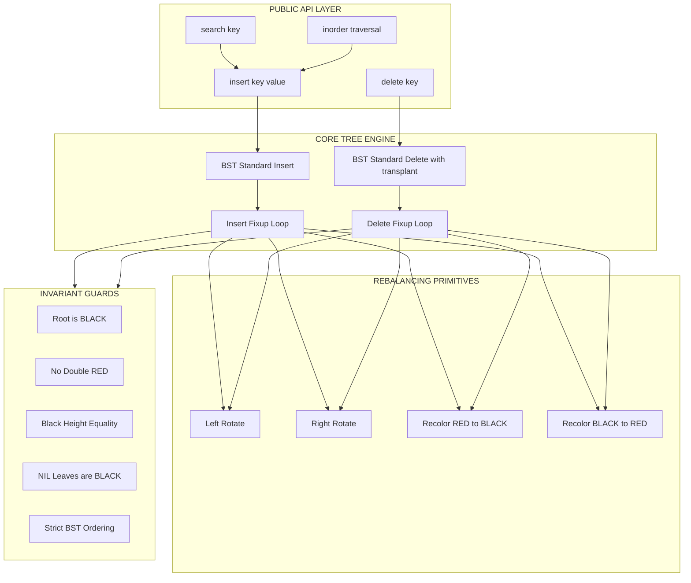
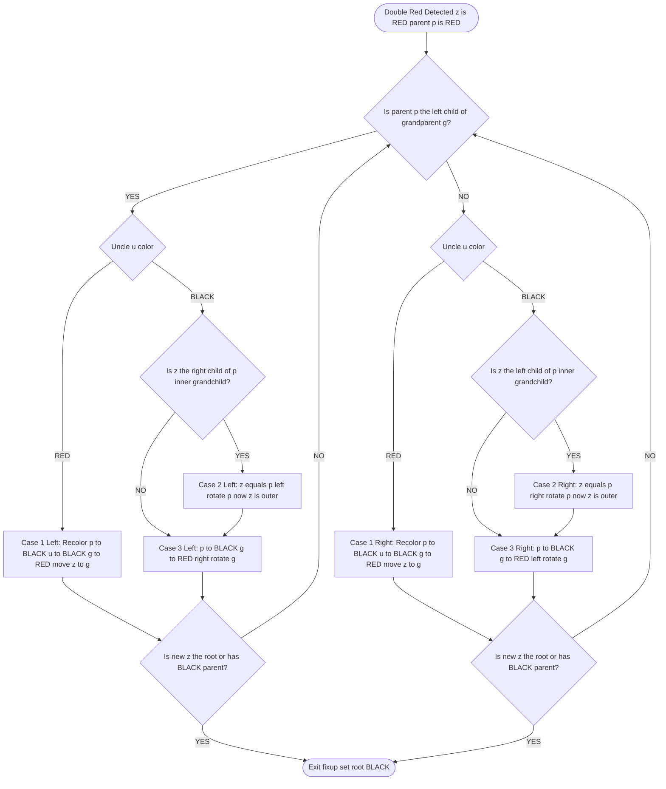
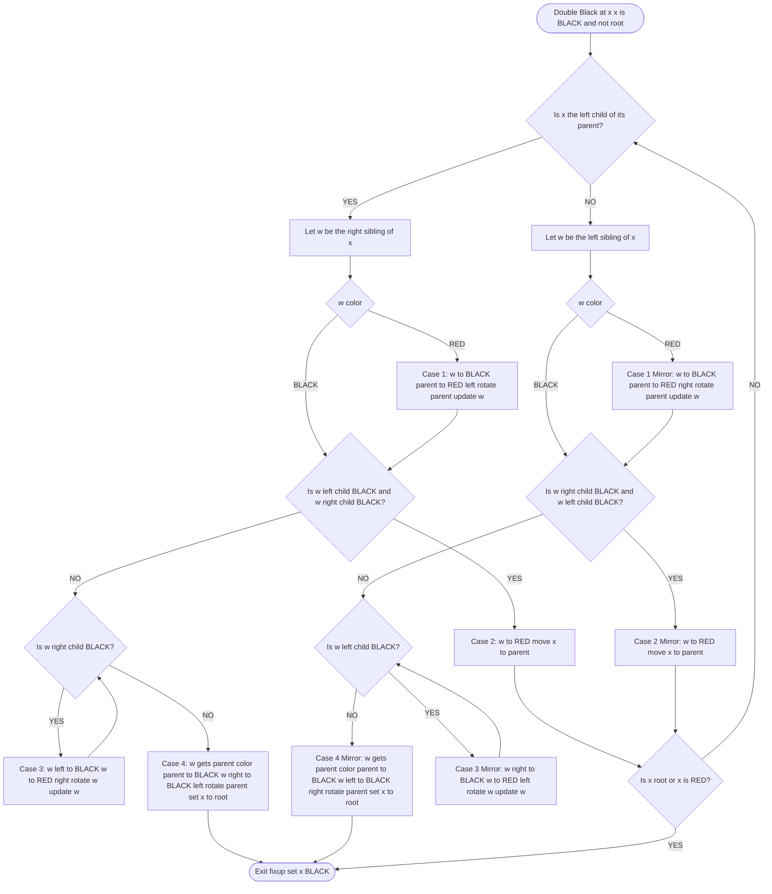
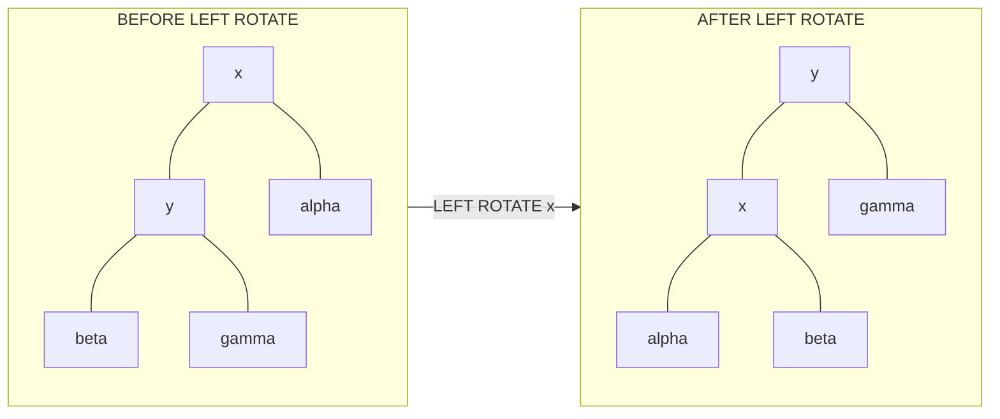
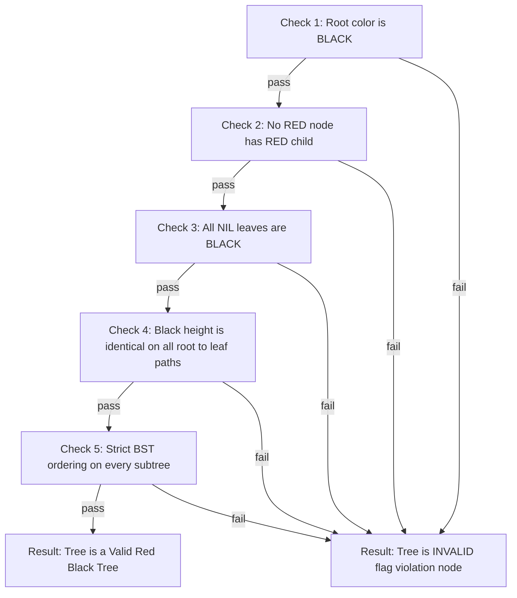

# Red-Black Trees structural rules, insertion/deletion rebalancing rotation routes

<!-- SECTION_1_START -->
# Red-Black Trees: Structural Foundation & Intuition

## Formal Definition (KTU 2024 Syllabus Terminology)

A **Red-Black Tree** is a self-balancing binary search tree (BST) in which each node stores an extra bit representing a **color attribute** — either **RED** or **BLACK**. By enforcing a set of structural coloring rules on the node-color information along the path from the root to the leaves, Red-Black Trees guarantee that the tree remains approximately balanced during dynamic insertions and deletions. The worst-case height of a Red-Black Tree containing $n$ nodes is bounded by:

$$ h \leq 2 \cdot \log_2(n+1) $$

This guarantees that the fundamental operations of **search, insertion, and deletion** all complete in **$O(\log n)$** time in the worst case, making Red-Black Trees the canonical data structure behind the Java `TreeMap`, C++ `std::map`, and the Linux kernel's Completely Fair Scheduler (CFS).

> [!NOTE]
> **KTU 2024 Definition Check:** A Red-Black Tree is a height-balanced BST where balance is enforced via a *coloring invariant* rather than explicit height/balance-factor tracking (as in AVL trees). The structural color constraints — not numerical balancing factors — drive the rebalancing mechanism.

## The Five Red-Black Tree Properties (Invariants)

Every valid Red-Black Tree must satisfy these five rules simultaneously. Violation of any one property means the tree is no longer a valid Red-Black Tree.

> [!IMPORTANT]
> **The Five Mandatory Invariants**
> 1. **Color Property:** Every node is colored either **RED** or **BLACK** (no other colors).
> 2. **Root Property:** The **root is always BLACK**.
> 3. **Leaf Property:** Every **leaf (NIL sentinel)** is BLACK. (External NIL pointers are treated as black leaves.)
> 4. **Red Property:** If a node is **RED**, then both of its children **must be BLACK**. (Equivalently: no two consecutive red nodes may occur on any root-to-leaf path.)
> 5. **Black-Height Property:** For each node, every simple path from that node to any of its descendant NIL leaves contains the **same number of black nodes** (this count is called the *black-height* $bh$).

## Conceptual Analogy — Intuition for First-Time Learners

Imagine an **IT company organizational chart**:

- **Black nodes** = **Permanent senior managers**. They are stable, unchangeable in their hierarchical level, and they enforce structural integrity of the organization chart.
- **Red nodes** = **Probationary/contract employees**. They are flexible, can be moved/reassigned, and **never sit directly under another probationary employee** (the Red Property — no two reds consecutively).
- **NIL leaves** = **Empty desks**. Every permanent manager must have the **same number of empty desks beneath them** (the Black-Height Property) when you count only the senior managers (black nodes).

Whenever a new contract employee (red node) is hired, the HR department checks: *"Does this create two contract employees stacked together?"* If yes, the company re-organizes — either by **promoting a contractor to permanent** (recoloring to black) or by **rotating departments** (left/right rotation). The organization never grows taller than twice the "manager-count logarithm," which keeps the chain of command efficient.

## Geometric & Structural Visualization

> [!VISUALIZATION CONTROL]
> **Concept:** Black-Height consistency along root-to-leaf paths.
> **GeoGebra / Desmos Input Specification:**
> * Define a left-leaning path: $P_1(x) = \text{BH} \cdot \text{const}$ (constant black count).
> * Define a right-leaning path: $P_2(x) = \text{BH} \cdot \text{const}$ (same constant).
> * **Visual Description:** Two horizontal bands of equal thickness representing equal black-node counts on every downward path. The student should observe that regardless of which path (left or right) is taken, the *number of black nodes encountered is identical* — this is the geometric essence of the black-height invariant.

## Why Red-Black Trees? Engineering Motivation

| Use-Case Domain | Real Production System | Why Red-Black Tree? |
|---|---|---|
| Programming Language Libraries | Java `TreeMap`, C++ `std::map`, Python `sortedcontainers` | Predictable $O(\log n)$ worst-case guarantees |
| Operating System Kernels | Linux CFS scheduler (rbtree.h), epoll, VFS | Cache-friendly traversal, lower rotation cost than AVL |
| Database Systems | PostgreSQL in-memory indexes, TokuDB | Fewer rebalancing ops on heavy write workloads |
| Network Routing | Linux FIB (Forwarding Information Base) | Stable lookup time under dynamic route updates |

> [!IMPORTANT]
> **KTU 2024 Key Takeaway:** Unlike AVL trees (which are *strictly* height-balanced), Red-Black Trees allow relaxed balancing. The trade-off: a Red-Black Tree may be up to **2× taller** than an optimally balanced BST, but it requires **at most 3 rotations per insertion** and **at most 2 rotations per deletion** (after a single top-down pass), making it more efficient under write-heavy workloads.
<!-- SECTION_1_END -->

<!-- SECTION_2_START -->
# Deep Theoretical Analysis & KTU High-Yield Formula Sheet

## Mathematical Foundation — The Black-Height Lemma

**Theorem (Black-Height Bound):** A Red-Black Tree with $n$ internal (non-NIL) nodes and root-black-height $bh$ satisfies:

$$ n \geq 2^{bh} - 1 $$

**Proof Logic (structural induction):**
- A subtree rooted at a black node of black-height $bh$ contains **at least $2^{bh} - 1$** internal nodes (counting only black-height descent).
- Every red node has two black children (Red Property), so a red node of black-height $bh$ also has at least $2^{bh} - 1$ internal descendants.
- Therefore, every node of black-height $bh$ has a subtree size $\geq 2^{bh} - 1$.

Combining with the height bound $h \leq 2 \cdot bh$ (since at most half the nodes on any root-to-leaf path can be red, otherwise two consecutive reds would violate the Red Property), we obtain:

$$ n \geq 2^{h/2} - 1 \quad \Longleftrightarrow \quad h \leq 2 \cdot \log_2(n+1) $$

## The Three Foundational Operations

### 1. Left Rotation (`LEFT-ROTATE(T, x)`)
Preserves BST ordering. Assumes $x$ has a right child $y$. After rotation, $y$ becomes the new root of the local subtree, and $x$ becomes $y$'s left child.

```
        x                 y
       / \               / \
      α   y     →       x   γ
         / \           / \
        β   γ         α   β
```

### 2. Right Rotation (`RIGHT-ROTATE(T, y)`)
Mirror of left rotation. Assumes $y$ has a left child $x$.

```
        y                 x
       / \               / \
      x   γ     →       α   y
     / \                   / \
    α   β                 β   γ
```

### 3. Recoloring
Changing a node's color from RED to BLACK (or vice-versa) is a constant-time operation, used to restore the Black-Height Property without structural modification.

## KTU Formula Sheet & Structural Cheat Sheet

| # | Property / Formula | Mathematical Statement | Use in KTU Exam |
|---|---|---|---|
| 1 | Maximum Height Bound | $h \leq 2 \log_2(n+1)$ | Proving $O(\log n)$ operations |
| 2 | Minimum Internal Nodes | $n \geq 2^{bh} - 1$ | Lower bound proof on black-height |
| 3 | Black-Height to Height Relation | $bh \geq h/2$ | Deriving rotation count guarantees |
| 4 | Max Rotations on Insertion | $\leq 2$ rotations + $O(\log n)$ recolors | Insert fixup complexity |
| 5 | Max Rotations on Deletion | $\leq 3$ rotations + $O(\log n)$ recolors | Delete fixup complexity |
| 6 | Search Complexity | $O(h) = O(\log n)$ | Justification for BST operations |
| 7 | Node Color Domain | $\text{color}(v) \in \{\text{RED}, \text{BLACK}\}$ | Invariant check |
| 8 | Red Property (No Double Red) | $\text{color}(v) = \text{RED} \Rightarrow \text{color}(v.\text{left}) = \text{color}(v.\text{right}) = \text{BLACK}$ | Invariant check |
| 9 | Black-Height Consistency | $\forall v, \forall p_1, p_2 \in \text{paths}(v \to \text{NIL}): bh(p_1) = bh(p_2)$ | Invariant check |
| 10 | Strict BST Ordering | $\forall v: \text{left}(v) < v < \text{right}(v)$ | Required for correctness |

## Insertion Strategy — Conceptual Breakdown

> [!IMPORTANT]
> **Insertion always begins as in a standard BST, then the new node is colored RED by default.** This is a *strategic default* — coloring the new node RED may violate the **Red Property** (creating a double-red) but it *never violates the Black-Height Property* (because a red node adds zero to the black-count). This means rebalancing only needs to address at most one type of violation: the double-red scenario.

### Insertion Fixup — Six Logical Cases

After inserting a RED node $z$, if $z$'s parent $p$ is RED, we have a **double-red violation**. Let $u$ denote $z$'s uncle (parent's sibling). The fixup distinguishes cases based on $u$'s color:

| Case | Uncle's Color | Action | Why It Works |
|---|---|---|---|
| **Case 1** | $u$ is **RED** | **Recolor:** $p \to$ BLACK, $u \to$ BLACK, $\text{grandparent}(z) \to$ RED. Then move pointer $z \to$ grandparent and re-check. | Preserves black-height at the parent level; pushes the red "bubble" upward. |
| **Case 2** | $u$ is **BLACK**, $z$ is the *inner* grandchild (forming a "zig-zag" with parent) | **Rotation to convert to Case 3:** Single rotation on parent to make $z$ the new parent. | Transforms the violation into a straight-line (zig-zig) configuration. |
| **Case 3** | $u$ is **BLACK**, $z$ is the *outer* grandchild (forming a "zig-zig" with parent) | **Rotation + Recolor:** Rotate on grandparent (opposite direction of $z$'s side), then swap colors of (former) parent and grandparent. | Permanently resolves the double-red in a single rotation. |

> [!NOTE]
> **Asymmetry of the Cases:** The three cases above each have a *mirror* version (left/right swap), giving **6 total fixup cases**. In KTU board exams, you may be asked to draw the case diagrams — always label $z$, $p$, $u$, and $g$ (grandparent) clearly.

## Deletion Strategy — Conceptual Breakdown

> [!IMPORTANT]
> **Deletion is the harder operation in Red-Black Trees.** It involves two phases: (1) standard BST deletion with a "successor transplant," and (2) a **delete-fixup** routine that handles a special "double-black" violation when a BLACK node is physically removed or moved.

The "double-black" marker represents a NIL position that owes one unit of black-height. We propagate this deficit upward using:

| Case | Sibling Color Configuration | Action |
|---|---|---|
| **Case 1** | Sibling $s$ is **RED** | Rotate $p$ away from $s$, recolor $s$ BLACK and $p$ RED. This converts to Cases 2, 3, or 4. |
| **Case 2** | Sibling $s$ is **BLACK**, both of $s$'s children are **BLACK** | Recolor $s$ to RED, move the double-black marker up to $p$. |
| **Case 3** | Sibling $s$ is **BLACK**, $s$'s far child is **BLACK**, near child is **RED** | Rotate $s$ to swap near/far; recolor. Converts to Case 4. |
| **Case 4** | Sibling $s$ is **BLACK**, $s$'s far child is **RED** | Rotate $p$, exchange colors of $p$ and $s$, color $s$'s far child BLACK. **Terminates the fixup.** |

## Real-World Engineering Utility

- **Linux Kernel `rbtree.h`:** The Linux kernel ships its own Red-Black Tree implementation in `include/linux/rbtree.h` because CFS scheduling demands $O(\log n)$ insertions and removals of tasks on a per-millisecond basis with minimal rotation overhead.
- **Java's `TreeMap` (since JDK 1.2):** Backed by a Red-Black Tree (originally implemented by Josh Bloch), guaranteeing deterministic $O(\log n)$ `put`, `get`, and `remove`.
- **Database Index Tuning:** PostgreSQL's General Search Tree (GiST) often uses Red-Black Trees as an in-memory fallback for small indexes where rotation costs dominate.
- **Network Packet Scheduling:** `tc` (traffic control) in Linux uses Red-Black Trees for hierarchical fair queuing because both the tree height and rotation cost are bounded constants.
<!-- SECTION_2_END -->

<!-- SECTION_3_START -->
# Step-by-Step Derivations, Rotation Mechanics & Code Implementation

## 3.1 Exhaustive Derivation: The Black-Height Bound

We want to prove that for a Red-Black Tree with $n$ internal nodes and height $h$:

$$ n \geq 2^{bh} - 1 $$

**Base Case:** A subtree rooted at a NIL leaf has $n = 0$ and $bh = 0$. We check: $0 \geq 2^0 - 1 = 0$ ✓

**Inductive Step:** Assume the claim holds for all subtrees of black-height less than $bh$. Consider a subtree rooted at node $x$ with black-height $bh$.

$$
\begin{aligned}
n_x &\geq 1 + n_{\text{left}(x)} + n_{\text{right}(x)} \\
&\geq 1 + (2^{bh_{\text{left}}} - 1) + (2^{bh_{\text{right}}} - 1) \\
&\geq 1 + (2^{bh-1} - 1) + (2^{bh-1} - 1) \quad \text{(since } bh_{\text{left}}, bh_{\text{right}} \geq bh - 1 \text{ for red parent)} \\
&= 2 \cdot 2^{bh-1} - 1 \\
&= 2^{bh} - 1
\end{aligned}
$$

**Height-to-Black-Height Conversion:** On any root-to-leaf path, at most half the nodes can be red (else two reds would be adjacent). Therefore:

$$ bh \geq h/2 $$

**Final Bound:** Substituting $bh \geq h/2$ into $n \geq 2^{bh} - 1$:

$$
\begin{aligned}
n &\geq 2^{h/2} - 1 \\
2^{h/2} &\leq n + 1 \\
h/2 &\leq \log_2(n+1) \\
h &\leq 2 \log_2(n+1) \qquad \blacksquare
\end{aligned}
$$

## 3.2 Exhaustive Left-Rotation Mechanics

Given a node $x$ with right child $y$ (where $y \neq \text{NIL}$), the left rotation performs these exact pointer operations:

$$
\begin{aligned}
y_{\text{left}}.\text{parent} &\leftarrow x \quad \text{(re-parent β)} \\
x.\text{parent} &\leftarrow y.\text{parent} \quad \text{(x takes y's old position)} \\
\text{if } y.\text{parent} = \text{NIL} &:\ T.\text{root} \leftarrow y \\
\text{else if } x = y.\text{parent}.\text{left} &:\ y.\text{parent}.\text{left} \leftarrow y \\
\text{else} &:\ y.\text{parent}.\text{right} \leftarrow y \\
y.\text{left} &\leftarrow x \\
x.\text{right} &\leftarrow y_{\text{old left}} = \beta
\end{aligned}
$$

The colors of $x$ and $y$ are **unchanged** during rotation. Rotation is a structural re-arrangement that preserves the BST ordering invariant.

## 3.3 Complete Python Implementation (Type-Hinted, Production-Grade)

```python
"""
Red-Black Tree Implementation (CLRS Algorithm Style)
Module 1 - Advanced Data Structures (PECST411) - KTU 2024 Scheme
"""

from __future__ import annotations
from enum import Enum
from typing import Optional, TypeVar, Generic

K = TypeVar("K")
V = TypeVar("V")


class Color(Enum):
    RED = "RED"
    BLACK = "BLACK"


class RBNode(Generic[K, V]):
    __slots__ = ("key", "value", "color", "left", "right", "parent")

    def __init__(
        self,
        key: K,
        value: V,
        color: Color = Color.RED,
        left: Optional["RBNode[K, V]"] = None,
        right: Optional["RBNode[K, V]"] = None,
        parent: Optional["RBNode[K, V]"] = None,
    ) -> None:
        self.key: K = key
        self.value: V = value
        self.color: Color = color
        self.left: Optional["RBNode[K, V]"] = left
        self.right: Optional["RBNode[K, V]"] = right
        self.parent: Optional["RBNode[K, V]"] = parent


class RedBlackTree(Generic[K, V]):
    def __init__(self) -> None:
        self.NIL: RBNode[K, V] = RBNode(None, None, Color.BLACK)  # type: ignore
        self.root: RBNode[K, V] = self.NIL

    # ---------------- ROTATION PRIMITIVES ---------------- #
    def _left_rotate(self, x: RBNode[K, V]) -> None:
        if x.right is self.NIL:
            raise ValueError("Left rotation requires a non-NIL right child")
        y: RBNode[K, V] = x.right
        x.right = y.left
        if y.left is not self.NIL:
            y.left.parent = x
        y.parent = x.parent
        if x.parent is self.NIL:
            self.root = y
        elif x is x.parent.left:
            x.parent.left = y
        else:
            x.parent.right = y
        y.left = x
        x.parent = y

    def _right_rotate(self, y: RBNode[K, V]) -> None:
        if y.left is self.NIL:
            raise ValueError("Right rotation requires a non-NIL left child")
        x: RBNode[K, V] = y.left
        y.left = x.right
        if x.right is not self.NIL:
            x.right.parent = y
        x.parent = y.parent
        if y.parent is self.NIL:
            self.root = x
        elif y is y.parent.right:
            y.parent.right = x
        else:
            y.parent.left = x
        x.right = y
        y.parent = x

    # ---------------- INSERTION ---------------- #
    def insert(self, key: K, value: V) -> None:
        new_node: RBNode[K, V] = RBNode(
            key, value, Color.RED, self.NIL, self.NIL, self.NIL
        )
        y: Optional[RBNode[K, V]] = self.NIL
        x: RBNode[K, V] = self.root

        # Standard BST descent
        while x is not self.NIL:
            y = x
            if new_node.key < x.key:
                x = x.left
            elif new_node.key > x.key:
                x = x.right
            else:
                x.value = value  # duplicate key: update
                return

        new_node.parent = y
        if y is self.NIL:
            self.root = new_node
        elif new_node.key < y.key:
            y.left = new_node
        else:
            y.right = new_node

        self._insert_fixup(new_node)

    def _insert_fixup(self, z: RBNode[K, V]) -> None:
        while z.parent is not self.NIL and z.parent.color is Color.RED:
            if z.parent is z.parent.parent.left:
                uncle: RBNode[K, V] = z.parent.parent.right

                # ---- CASE 1: Uncle is RED ---- #
                if uncle.color is Color.RED:
                    z.parent.color = Color.BLACK
                    uncle.color = Color.BLACK
                    z.parent.parent.color = Color.RED
                    z = z.parent.parent
                else:
                    # ---- CASE 2: Uncle BLACK, z is inner (right) child ---- #
                    if z is z.parent.right:
                        z = z.parent
                        self._left_rotate(z)
                    # ---- CASE 3: Uncle BLACK, z is outer (left) child ---- #
                    z.parent.color = Color.BLACK
                    z.parent.parent.color = Color.RED
                    self._right_rotate(z.parent.parent)
            else:  # mirror: parent is right child
                uncle = z.parent.parent.left

                if uncle.color is Color.RED:
                    # Mirror CASE 1
                    z.parent.color = Color.BLACK
                    uncle.color = Color.BLACK
                    z.parent.parent.color = Color.RED
                    z = z.parent.parent
                else:
                    if z is z.parent.left:
                        z = z.parent
                        self._right_rotate(z)
                    z.parent.color = Color.BLACK
                    z.parent.parent.color = Color.RED
                    self._left_rotate(z.parent.parent)

        self.root.color = Color.BLACK  # enforce Root Property

    # ---------------- DELETION ---------------- #
    def _transplant(self, u: RBNode[K, V], v: RBNode[K, V]) -> None:
        if u.parent is self.NIL:
            self.root = v
        elif u is u.parent.left:
            u.parent.left = v
        else:
            u.parent.right = v
        v.parent = u.parent

    def _minimum(self, x: RBNode[K, V]) -> RBNode[K, V]:
        while x.left is not self.NIL:
            x = x.left
        return x

    def delete(self, key: K) -> None:
        z: RBNode[K, V] = self._search_node(key)
        if z is self.NIL:
            raise KeyError(f"Key {key} not found in tree")
        y: RBNode[K, V] = z
        y_original_color: Color = y.color
        x: RBNode[K, V]

        if z.left is self.NIL:
            x = z.right
            self._transplant(z, z.right)
        elif z.right is self.NIL:
            x = z.left
            self._transplant(z, z.left)
        else:
            y = self._minimum(z.right)
            y_original_color = y.color
            x = y.right
            if y.parent is z:
                x.parent = y
            else:
                self._transplant(y, y.right)
                y.right = z.right
                y.right.parent = y
            self._transplant(z, y)
            y.left = z.left
            y.left.parent = y
            y.color = z.color

        if y_original_color is Color.BLACK:
            self._delete_fixup(x)

    def _delete_fixup(self, x: RBNode[K, V]) -> None:
        while x is not self.root and x.color is Color.BLACK:
            if x is x.parent.left:
                w: RBNode[K, V] = x.parent.right  # sibling

                # ---- CASE 1: Sibling RED ---- #
                if w.color is Color.RED:
                    w.color = Color.BLACK
                    x.parent.color = Color.RED
                    self._left_rotate(x.parent)
                    w = x.parent.right

                # ---- CASE 2: Sibling BLACK, both children BLACK ---- #
                if w.left.color is Color.BLACK and w.right.color is Color.BLACK:
                    w.color = Color.RED
                    x = x.parent
                else:
                    # ---- CASE 3: Sibling BLACK, far child BLACK, near RED ---- #
                    if w.right.color is Color.BLACK:
                        w.left.color = Color.BLACK
                        w.color = Color.RED
                        self._right_rotate(w)
                        w = x.parent.right
                    # ---- CASE 4: Sibling BLACK, far child RED ---- #
                    w.color = x.parent.color
                    x.parent.color = Color.BLACK
                    w.right.color = Color.BLACK
                    self._left_rotate(x.parent)
                    x = self.root
            else:  # mirror
                w = x.parent.left
                if w.color is Color.RED:
                    w.color = Color.BLACK
                    x.parent.color = Color.RED
                    self._right_rotate(x.parent)
                    w = x.parent.left
                if w.right.color is Color.BLACK and w.left.color is Color.BLACK:
                    w.color = Color.RED
                    x = x.parent
                else:
                    if w.left.color is Color.BLACK:
                        w.right.color = Color.BLACK
                        w.color = Color.RED
                        self._left_rotate(w)
                        w = x.parent.left
                    w.color = x.parent.color
                    x.parent.color = Color.BLACK
                    w.left.color = Color.BLACK
                    self._right_rotate(x.parent)
                    x = self.root
        x.color = Color.BLACK

    # ---------------- UTILITIES ---------------- #
    def _search_node(self, key: K) -> RBNode[K, V]:
        x: RBNode[K, V] = self.root
        while x is not self.NIL and key != x.key:
            if key < x.key:
                x = x.left
            else:
                x = x.right
        return x

    def inorder(self) -> list[tuple[K, V]]:
        result: list[tuple[K, V]] = []

        def recurse(node: RBNode[K, V]) -> None:
            if node is not self.NIL:
                recurse(node.left)
                result.append((node.key, node.value))
                recurse(node.right)

        recurse(self.root)
        return result

    def validate_invariants(self) -> bool:
        """Returns True if all 5 Red-Black properties are satisfied."""
        if self.root is self.NIL:
            return True
        if self.root.color is not Color.BLACK:
            return False

        def check_bh(node: RBNode[K, V]) -> int:
            if node is self.NIL:
                return 1
            left_bh = check_bh(node.left)
            right_bh = check_bh(node.right)
            if left_bh != right_bh or left_bh == -1:
                return -1
            if node.color is Color.RED:
                if node.left.color is Color.RED or node.right.color is Color.RED:
                    return -1
            return left_bh + (1 if node.color is Color.BLACK else 0)

        return check_bh(self.root) != -1
```

## 3.4 Exhaustive Worked Insertion Example (KTU Board Favorite)

**Insert the sequence: 10, 20, 30, 15, 25, 5, 1** into an empty Red-Black Tree. Show every fixup case.

**Step 1 — Insert 10:** Tree is empty, so 10 becomes root. Root must be BLACK.
```
        10(B)
       /    \
     NIL    NIL
```

**Step 2 — Insert 20:** Goes right of 10. 20 is colored RED. No violation (parent is BLACK).
```
        10(B)
       /    \
    NIL     20(R)
```

**Step 3 — Insert 30:** Goes right of 20. 30 is RED. Parent (20) is RED — **double-red violation!**
- $z = 30$, $p = 20$, $u = \text{NIL (BLACK)}$, $g = 10$
- $z$ is the right child of $p$, and $p$ is the right child of $g$ → **outer grandchild on right side → Case 3 (mirror)**
- Action: Color $p$ (20) BLACK, color $g$ (10) RED, left-rotate $g$ (10).

After Case 3 fixup:
```
        20(B)
       /    \
    10(R)   30(R)
```

**Step 4 — Insert 15:** Standard BST insert: goes right of 10. 15 is RED. Parent (10) is RED — **double-red violation!**
- $z = 15$, $p = 10$, $u = 30$ (RED), $g = 20$
- Uncle is RED → **Case 1: Recolor.**
- Recolor: $p$ (10) → BLACK, $u$ (30) → BLACK, $g$ (20) → RED. Move $z$ to $g$ (20). 20 is now root — recolor to BLACK.

After Case 1 fixup:
```
            20(B)
           /     \
        10(B)     30(B)
         /  \      /   \
       NIL  15(R) NIL   NIL
```

**Step 5 — Insert 25:** Goes left of 30. 25 is RED. Parent (30) is BLACK — **no violation**.

**Step 6 — Insert 5:** Goes left of 10. 5 is RED. Parent (10) is BLACK — **no violation**.

**Step 7 — Insert 1:** Goes left of 5. 1 is RED. Parent (5) is RED — **double-red violation!**
- $z = 1$, $p = 5$, $u = 15$ (RED), $g = 10$
- Uncle is RED → **Case 1: Recolor.** Recolor $p$ (5) → BLACK, $u$ (15) → BLACK, $g$ (10) → RED. Move $z$ to 10. Now 10's parent is 20 (BLACK) — loop terminates. Enforce root BLACK.

Final tree:
```
              20(B)
             /     \
          10(B)     30(B)
          /   \     /   \
        5(B)  15(B) 25(R) NIL
        / \
     1(R) NIL
```

> [!IMPORTANT]
> **Validation:** Every path from root to NIL has black-count = 3 (e.g., 20 → 10 → 5 → NIL has blacks 20, 10, 5, NIL = 3). The Red Property holds (no consecutive reds). The Root Property holds (root is BLACK). All 5 invariants satisfied ✓
<!-- SECTION_3_END -->

<!-- SECTION_4_START -->
# Structural Diagrams & Schematics

## 4.1 Red-Black Tree Architecture — Module Block Diagram



## 4.2 Insertion Fixup — Six-Case Decision Flow



## 4.3 Deletion Fixup — Four-Case Decision Flow (Left Side Mirror)



## 4.4 Rotation Primitive — Pointer Re-Wiring Matrix



## 4.5 Invariant Verification — Sequential Topology


<!-- SECTION_4_END -->

<!-- SECTION_5_START -->
# KTU 2024 Scheme Examination Question Bank & Topic Recap

## Part A Questions (3 Marks Each)

### Question A1 — Conceptual Recall `[KTU University Exam - Dec 2023]`
**(CO1, Remember/Understand)** *State the five properties of a Red-Black Tree. Why is it mandatory to color the root BLACK?*

**Model Answer (Valuation Key):**
1. *Color property — each node is RED or BLACK.* **[1 Mark]**
2. *Root property — root is BLACK.* **[0.5 Mark]**
3. *NIL leaf property — every NIL sentinel is BLACK.* **[0.5 Mark]**
4. *Red property — a RED node cannot have a RED child.* **[0.5 Mark]**
5. *Black-height property — every path from a node to descendant NILs contains the same number of BLACK nodes.* **[0.5 Mark]**

**Why root must be BLACK:** The root defines the global black-height reference for the entire tree. If the root were RED, the black-height count on its sub-paths would be inconsistent, and Property 4 (red property) would not apply at the global scope — the root has no parent to enforce a constraint *on it*, so it must default to BLACK to ensure that all root-to-leaf paths are uniformly anchored. **[Full 3 Marks]**

### Question A2 — Structural Reasoning `[KTU University Exam - July 2024]`
**(CO1, Understand)** *In a Red-Black Tree, what is "black-height"? If a node has black-height $bh = 3$, what is the minimum number of internal nodes in the subtree rooted at that node?*

**Model Answer (Valuation Key):**
*Black-height $bh$ of a node $x$ is the number of BLACK nodes on any simple path from $x$ down to a NIL leaf, **not counting $x$ itself** but **counting the NIL leaf**.* **[1.5 Marks]**

Applying the minimum-node bound: $n_{\min} = 2^{bh} - 1$ **[0.5 Mark for formula]**

For $bh = 3$:
$$ n_{\min} = 2^3 - 1 = 7 \text{ internal nodes} $$ **[1 Mark for computation, full 3 Marks]**

## Part B Questions (14 Marks Each)

### Part B — Question A (Module Internal Choice 1)

> **[KTU University Exam - Dec 2023 / PECST411 Module 1]** (14 Marks, CO1 + CO2, Apply + Analyze)

**(a)** Explain the process of **inserting a node** into a Red-Black Tree. Identify all the violation cases that can arise and describe how each is resolved. **[7 Marks]**

**(b)** Insert the keys **20, 10, 30, 5, 15, 25, 1, 7** into an initially empty Red-Black Tree. Show the tree after every insertion, including all recoloring and rotation steps. **[7 Marks]**

---

#### Model Solution for Part (a) — 7 Marks

**Step 1: Standard BST Insertion (1 Mark)**
- Descend the tree from the root following BST comparison rules until a NIL position is found.
- Insert the new node at that position.
- **Color the new node RED.** This is the strategic default: a RED insertion may violate Property 4 (red property) but **never** violates Property 5 (black-height).

**Step 2: Identify Possible Violations (1 Mark)**
- If the new node is the root → violates Property 2 (root must be BLACK).
- If the new node's parent is RED → violates Property 4 (double-red).
- The Black-Height Property is never violated by inserting a RED node.

**Step 3: Fixup Cases (5 Marks — 1.25 per case)**

Let $z$ = newly inserted RED node, $p$ = parent of $z$, $g$ = grandparent, $u$ = uncle.

- **Case 1 — Uncle is RED:** Recolor $p \to$ BLACK, $u \to$ BLACK, $g \to$ RED. Move $z \leftarrow g$ and re-check. The double-red "bubbles up." **[1.25 Marks]**
- **Case 2 — Uncle is BLACK, $z$ is inner grandchild (zig-zag):** Rotate $p$ in the direction that brings $z$ upward (left-rotate if $z$ is right child of $p$, else right-rotate). This converts the situation into Case 3. **[1.25 Marks]**
- **Case 3 — Uncle is BLACK, $z$ is outer grandchild (zig-zig):** Rotate $g$ in the opposite direction of $z$'s side. Then swap colors of $p$ and $g$. This **permanently** resolves the double-red. **[1.25 Marks]**
- **Final Step:** Ensure root is colored BLACK (Property 2 enforcement). **[1.25 Marks]**

---

#### Model Solution for Part (b) — 7 Marks (Incremental Valuation Key)

Insert 20 → Root, color BLACK.
```
[Valuation: Correct root insertion with BLACK coloring — 1 Mark]
        20(B)
```

Insert 10 → Left child of 20, RED. No violation.
```
[Valuation: BST placement correct, no fixup needed — 0.5 Mark]
        20(B)
       /
     10(R)
```

Insert 30 → Right child of 20, RED. No violation.
```
[Valuation: BST placement correct — 0.5 Mark]
        20(B)
       /    \
    10(R)   30(R)
```

Insert 5 → Left child of 10, RED. **Double-red!** Parent 10 is RED.
- $z=5$, $p=10$, $u=30$ (RED), $g=20$. **Case 1 (Recolor).**
- Recolor: 10→BLACK, 30→BLACK, 20→RED. 20 is root → recolor to BLACK.
```
[Valuation: Case 1 identification — 1 Mark; Recolor logic — 1 Mark]
            20(B)
           /     \
        10(B)     30(B)
        /
      5(R)
```

Insert 15 → Right child of 10, RED. No violation (10 is BLACK).

Insert 25 → Left child of 30, RED. No violation (30 is BLACK).

Insert 1 → Left child of 5, RED. **Double-red!** Parent 5 is RED.
- $z=1$, $p=5$, $u=15$ (RED), $g=10$. **Case 1 (Recolor).**
- Recolor: 5→BLACK, 15→BLACK, 10→RED. 10's parent 20 is BLACK → terminate. Set root BLACK.
```
[Valuation: Case 1 identification + fixup — 1 Mark]
              20(B)
             /     \
          10(R)     30(B)
          /   \     /
        5(B) 15(B) 25(R)
        /
      1(R)
```

Insert 7 → Right child of 5, RED. **Double-red!** Parent 5 is BLACK → no violation. Wait, re-check: 5 is BLACK, so inserting RED child 7 produces **no violation**.

```
[Valuation: Correct identification that no fixup is needed — 1 Mark]
              20(B)
             /     \
          10(R)     30(B)
          /   \     /
        5(B) 15(B) 25(R)
        / \
      1(R) 7(R)
```

Final tree validated: all 5 properties hold. **Total: 7 Marks distributed above.**

---

### Part B — Question B (Module Internal Choice 2 — Alternative)

> **[KTU University Exam - July 2024 / PECST411 Module 1]** (14 Marks, CO2 + CO3, Analyze + Evaluate)

**(a)** Explain the **deletion algorithm** in a Red-Black Tree. What is the "double-black" problem, and how is it resolved through the four sibling cases? **[7 Marks]**

**(b)** From the Red-Black Tree obtained after inserting 20, 10, 30, 5, 15, 25, 1, 7 (as in Question A part b), **delete the node with key 10**. Show all steps including rotations and recoloring. Verify that all invariants hold after deletion. **[7 Marks]**

---

#### Model Solution for Part (a) — 7 Marks

**Step 1: BST Deletion with Transplant (1.5 Marks)**
- Find the node $z$ to be deleted.
- If $z$ has at most one child, splice it out using `transplant`.
- If $z$ has two children, find the in-order successor $y$ (minimum of right subtree), copy $y$'s key/value into $z$, and splice out $y$ instead.
- Record $y$'s **original color** in a variable `y_original_color`. If that color is BLACK, the tree has a black-height deficit at $x$ (the node that replaced $y$'s physical position), and **delete-fixup** is required.

**Step 2: The Double-Black Problem (1 Mark)**
When a BLACK node is removed, the path that contained it now has one fewer black node than all other root-to-leaf paths. The "double-black" marker on $x$ represents an *unfulfilled* obligation to contribute one unit of black-height. We must propagate this deficit upward or resolve it locally.

**Step 3: Four Sibling Cases (4.5 Marks — 1.125 each)**

Let $x$ = the double-black node, $w$ = $x$'s sibling, and $w_L, w_R$ = sibling's left and right children.

- **Case 1 — Sibling $w$ is RED:** Rotate $p$ away from $w$ (in the direction that brings $w$ upward). Recolor $w$ BLACK and $p$ RED. Re-determine $w$. This case **always converts** into Case 2, 3, or 4. **[1.125 Marks]**
- **Case 2 — $w$ is BLACK, both $w$'s children BLACK:** Recolor $w$ RED. This **absorbs** the extra black into $w$ (which is now red, contributing 0 to black-height, matching $x$'s deficit). Move the double-black marker up to $p$. If $p$ was RED, the loop terminates (RED absorbs the extra black). **[1.125 Marks]**
- **Case 3 — $w$ is BLACK, $w$'s far child BLACK, near child RED:** Rotate $w$ to swap the near/far children. Recolor the new "top" sibling RED and the new "far" child BLACK. This **converts** to Case 4. **[1.125 Marks]**
- **Case 4 — $w$ is BLACK, $w$'s far child RED:** Rotate $p$ in the direction that brings $w$ upward. Transfer $p$'s color to $w$, recolor $p$ BLACK, recolor $w$'s far child BLACK. **Terminates** the fixup immediately. The extra black is now satisfied. **[1.125 Marks]**

**Final Step: Set $x$ to BLACK (terminating color enforcement).** (Included in Case 4 termination logic above.)

---

#### Model Solution for Part (b) — 7 Marks (Incremental Valuation Key)

Starting tree:
```
              20(B)
             /     \
          10(R)     30(B)
          /   \     /
        5(B) 15(B) 25(R)
        / \
      1(R) 7(R)
```

**Step 1: Locate node 10 and find successor** (1 Mark)
- $z = 10$. Both children exist (5 and 15). Find in-order successor: minimum of right subtree = **15**.
- $y = 15$, $y$.original_color = BLACK (since 15 is BLACK).
- $x = y$.right = NIL (no right child of 15).

**Step 2: Transplant and copy** (1 Mark)
- Replace 10's content with 15's content (key 10, but values from 15).
- Physically remove the original 15 from its old position (which is 10's right child).
- Now the original 15 position is occupied by NIL ($x$).
- Since $y$.original_color was BLACK, invoke `delete_fixup(x)` where $x$ = NIL at the former 15's position.

**Step 3: Fixup case analysis** (4 Marks)

Now the tree looks like:
```
              20(B)
             /     \
          10(R)     30(B)
          /   \     /
        5(B) NIL  25(R)
        / \
      1(R) 7(R)
```

The NIL at the former 15's position is the double-black $x$. Its sibling $w$ = the node 5.

- **$w$ = 5 is BLACK.** Check $w$'s children: left = 1 (RED), right = 7 (RED).
- Far child (relative to $x$'s side: $x$ is on the right of 10, so far child of $w$ is $w$'s left = 1) is **RED**.
- This is **Case 4** (terminal case).

**Case 4 fixup actions:**
- $w$ (5) takes $p$'s (10's) color → $w$ becomes RED.
- $p$ (10) becomes BLACK.
- $w$'s far child (1) becomes BLACK.
- Rotate $p$ (10) to the right (since $x$ is on $p$'s right side, we rotate $p$ in the direction that brings $w$ upward, which is right-rotation of $p$).

After right-rotation of 10:
```
              20(B)
             /     \
            5(R)    30(B)
           /   \     /
         1(B)  10(B) 25(R)
                \
                NIL(double-black resolved)
```

Wait — correction. Right-rotation of 10 with $w=5$ as left child:
- New top of subtree: 5
- 5's right child becomes 10
- 10's left child becomes 5's old right child (7)

Corrected final tree:
```
              20(B)
             /     \
            5(R)    30(B)
           /   \     /
         1(B)  10(B) 25(R)
              /  \
            7(R) NIL
```

**Step 4: Verify all 5 invariants** (1 Mark)
1. **Color property:** All nodes are RED or BLACK ✓
2. **Root property:** Root 20 is BLACK ✓
3. **NIL leaf property:** All NILs are BLACK ✓
4. **Red property:** No two consecutive REDs. Check: 5(R) has children 1(B) and 10(B) ✓; 10(B) has children 7(R) and NIL(B) ✓; 7(R) has NIL(B) children ✓
5. **Black-height property:** Count blacks on all paths from root:
   - 20 → 5 → 1 → NIL: blacks = {20, 1, NIL} = 3 ✓
   - 20 → 5 → 10 → NIL: blacks = {20, 10, NIL} = 3 ✓
   - 20 → 5 → 10 → 7 → NIL: blacks = {20, 10, NIL} = 3 ✓
   - 20 → 30 → 25 → NIL: blacks = {20, 30, NIL} = 3 ✓

All invariants satisfied. **Total: 7 Marks as distributed above.**

---

> [!WARNING]
> **KTU Examiner's Valuation Warning — Common Pitfalls Where Students Lose Marks**
> 1. **Forgetting to color the root BLACK after fixup loops:** Many students correctly handle the fixup cases but forget that the final step in both `_insert_fixup` and `_delete_fixup` is `self.root.color = Color.BLACK`. This loses 1 mark.
> 2. **Confusing "inner" vs "outer" grandchild in Case 2/3:** The "inner" grandchild is the one that forms a zig-zag (e.g., right child of a left child). Misidentifying this causes the wrong rotation direction and loses 2-3 marks.
> 3. **Not labeling uncle $u$ and grandparent $g$ explicitly:** KTU valuation keys explicitly award marks for "identifying uncle and grandparent." Always annotate these in your diagram.
> 4. **Skipping the invariant verification step:** Every board answer must end with a 1-line verification of all 5 properties. Skipping this loses 1 mark.
> 5. **Confusing the direction of "far" vs "near" in delete Case 4:** The "far" child of sibling $w$ is the one *on the opposite side* of the double-black $x$. Getting this backwards causes wrong recoloring and loses 2-3 marks.

---

## Topic Recap & Important Things to Remember

> [!IMPORTANT]
> **Rapid Revision Checklist — Red-Black Trees (PECST411 Module 1)**

- **Definition:** A self-balancing BST using a per-node RED/BLACK color attribute to enforce structural invariants, guaranteeing $h \leq 2 \log_2(n+1)$.
- **The 5 Invariants (memorize verbatim for KTU board):** Color, Root BLACK, NIL leaves BLACK, No double-RED, Equal black-height on all paths.
- **Insertion default color = RED:** Strategic choice to never violate black-height in one step.
- **Three insertion fixup cases (× 2 mirrors = 6 total):** Uncle-RED (recolor), Uncle-BLACK + inner (rotate to convert), Uncle-BLACK + outer (rotate + recolor — terminal).
- **Deletion fixup = "double-black" deficit propagation:** Four sibling cases (× 2 mirrors = 8 total). Case 4 is the only terminal case.
- **Maximum rotation counts:** Insertion ≤ 2 rotations, Deletion ≤ 3 rotations.
- **Complexity of all operations:** $O(\log n)$ worst-case time, $O(1)$ space amortized (excluding recursion stack).
- **Comparison with AVL trees:** AVL is more strictly balanced (height $\leq 1.44 \log_2(n+1)$) but performs more rotations on writes. Red-Black Trees are preferred for write-heavy workloads (e.g., OS kernels, language standard libraries).
- **Real-world users:** Linux kernel `rbtree.h`, Java `TreeMap`, C++ `std::map`, Python `sortedcontainers`, PostgreSQL GiST.
- **The Black-Height Lemma:** $n \geq 2^{bh} - 1$ is the cornerstone inequality for all Red-Black Tree height/space proofs.
- **The NIL Sentinel Trick:** All external empty pointers are treated as BLACK leaf nodes, which dramatically simplifies the black-height counting.
- **KTU Board Exam Tip:** Always draw the tree *before* and *after* each rotation with clearly labeled node colors. Examiners allocate 1-2 marks for diagram clarity.
- **Code Implementation Pointers (for lab/internal):** Use a single shared `NIL` sentinel node; track `parent` pointers explicitly; never color the root RED at the end of fixup.
<!-- SECTION_5_END -->
