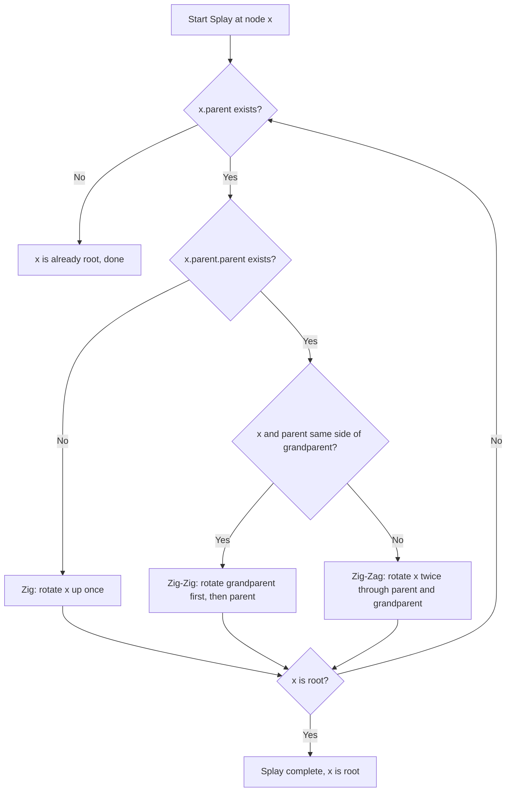
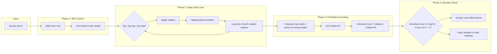
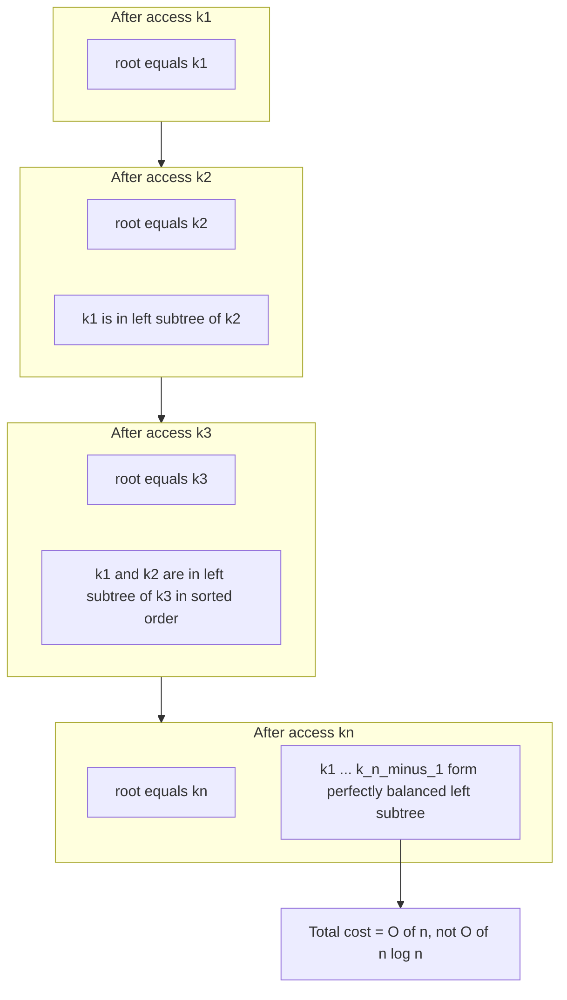
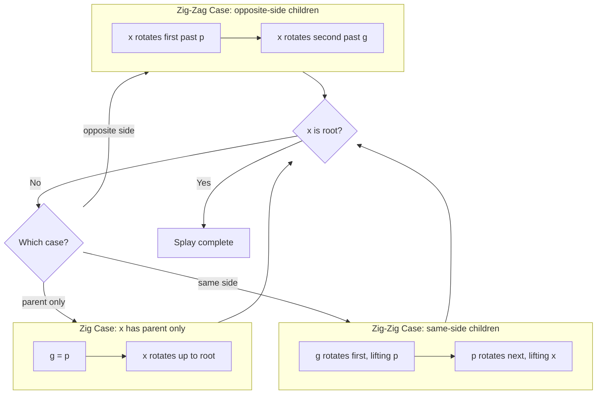
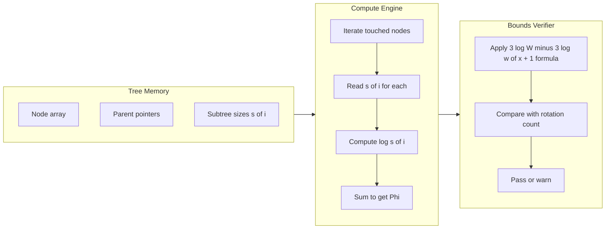

# Splay Trees amortized performance calculations tracking properties

<!-- SECTION_1_START -->
# Splay Trees — Amortized Performance & Tracking Properties

## Formal Definition (KTU 2024 Scheme Terminology)

A **Splay Tree** is a self-adjusting binary search tree (BST) invented by Sleator and Tarjan (1985) that performs **splaying** on every accessed node — moving the accessed node to the root through a sequence of tree rotations. Unlike AVL or Red–Black trees, splay trees are **not** height-balanced at every instant; instead, they guarantee **amortized** logarithmic performance per operation.

> [!IMPORTANT]
> **Splaying is performed on every access** (search, insert, delete, even unsuccessful lookups). The structure *moves toward* balance over a sequence of operations, not after each one.

## Conceptual Analogy — "The Popularity Boost"

Imagine a library where every book you borrow is **moved to the front of the shelf** so you can find it faster next time. The books you use frequently naturally migrate to the front. Rarely-used books drift to the back. The shelf is never perfectly organized at any moment, but the **total time you spend** over many visits is much less than if you had a rigid alphabetical system.

Splay trees behave identically: frequently accessed nodes bubble to the top (root), and the cost of "rearranging" the shelf is small when averaged across many operations.

## Core Properties Tracked in Splay Trees

> [!NOTE]
> **Splay trees are a competitive alternative to balanced BSTs because they:**

1. **Self-Adjusting** — no explicit balance factor or color is stored per node.
2. **Amortized O(log n)** — worst-case per operation can be Θ(n), but over m operations cost is O(m log n).
3. **No Additional Fields** — node structure is identical to a plain BST, saving memory.
4. **Sequential Access Property** — accessing keys in sorted order takes O(n) total time.
5. **Working Set Property** — recently accessed elements are cheap to re-access.

## Geometric Intuition

```
        (root after access)            (tree before access)

              X                               Y
             / \                             / \
            A   Y          splay(X)         B   X
               / \        --------->           / \
              B   C                           C   A
```

Visually, every splay operation *flattens* the access path, reducing its depth by at least a constant factor every two rotations. Repeated accesses to the same region of the tree keep the region shallow.

> [!VISUALIZATION CONTROL]
> **Concept:** Splay rotation paths (zig / zig-zig / zig-zag) on a depth-d access path.
> **GeoGebra / Desmos Input Equations:**
> * Plot points `P_d = (d, 2^d)` (unbalanced cost) vs `S_d = (d, log_2(d+1))` (amortized cost)
> **Visual Description:** The blue exponential curve represents the worst-case single access; the orange logarithmic curve is the amortized cost. The gap between them is the "credit" splay trees build up.

<!-- SECTION_1_END -->

<!-- SECTION_2_START -->
# Deep Theoretical Analysis & KTU High-Yield Formula Sheet

## 1. The Three Splay Rotations

Splaying a node **x** with parent **p** and grandparent **g** is decomposed into three cases. The splay step repeats until **x** becomes the root.

| Case | Configuration | Action | Effect on Depth |
|:----:|:--------------|:-------|:----------------|
| **Zig** | `p` is root | Single right (or left) rotation around `p` | `x` becomes root |
| **Zig-Zig** | `x` and `p` are both left (or both right) children | Rotate `g` first, then rotate `p` (double rotation) | `x` rises by 2 levels |
| **Zig-Zag** | `x` is left child of `p`, `p` is right child of `g` (or vice versa) | Rotate `p` then `g` (two opposite rotations) | `x` rises by 2 levels |

## 2. The Potential Method (Sleator–Tarjan 1985)

To prove amortized O(log n) bounds, we assign a non-negative **potential** to every tree configuration. The amortized cost of an operation is:

$$\hat{c}_i \;=\; c_i \;+\; \Phi(T_i) \;-\; \Phi(T_{i-1})$$

> [!NOTE]
> **Potential function used for splay trees:**

$$\Phi(T) \;=\; \sum_{i \in T} \log s(i)$$

where
* $s(i) \;\equiv\;$ **size of the subtree rooted at node $i$** (count of nodes, or sum of weights in the weighted variant)
* $w(i) \;\equiv\;$ **weight of node $i$**, default $= 1$
* $W \;\equiv\;$ **total weight** $= \sum_i w(i)$
* $r(i) \;\equiv\;$ $\log s(i) \;\equiv\;$ **rank of node $i$**

## 3. KTU High-Yield Formula Sheet

| Formula / Identity | Meaning | KTU Use |
|:-------------------|:--------|:--------|
| $s(i) = w(i) + s(\text{left}(i)) + s(\text{right}(i))$ | Subtree size | Defines rank |
| $r(i) = \log_2 s(i)$ | Rank of node | Appears in amortized bounds |
| $\Phi(T) = \sum_i r(i)$ | Tree potential | Used in accounting |
| $\hat{c}(\text{splay}(x)) \le 3(r(\text{root}) - r(x)) + 1$ | **Access Theorem** | Most-cited KTU result |
| $\le 3 \log_2 N + 1$ (uniform $w=1$) | Splay cost per op | For $N$ nodes |
| $\sum_{i=1}^{m} c_i \le 3m \log N + m$ | Total over $m$ operations | Sequential / working set |

## 4. Splay Tree Operations — Cost Summary

| Operation | Splaying Point | Amortized Cost |
|:----------|:---------------|:---------------|
| `Splay(x)` | node $x$ | $O(\log n)$ |
| `Search(k)` | last visited node | $O(\log n)$ |
| `Insert(k)` | newly inserted node | $O(\log n)$ |
| `Delete(k)` | successor of $k$ (or $k$ itself) | $O(\log n)$ |
| `Split(k)` | $k$'s splay position | $O(\log n)$ |
| `Join(T1,T2)` | max of $T_1$ | $O(\log n)$ |

## 5. Real-World Utility in Engineering

* **Network routing tables** — frequently visited routes accelerate via working-set property.
* **Compiler symbol tables** — identifiers used in tight loops surface to the root.
-the **Garbage collectors** (e.g., in JVMs) for cache-friendly memory layouts.
* **Database buffer pools** — hot pages bubble to the head of the LRU-like structure.
* **Dynamic optimality conjecture** — splay trees are within a constant factor of the best *possible* online BST.

<!-- SECTION_2_END -->

<!-- SECTION_3_START -->
# Step-by-Step Derivations & Symbolic Implementation

## 1. Full Amortized Cost Derivation of One Zig-Zig Step

We will show that a single zig-zig step costs at most $3(r'(x) - r(x))$, where $r(x)$ and $r'(x)$ are the ranks of $x$ before and after the rotation.

### 1.1 Setup

Let:
* $a, b, c$ be the subtrees shown below,
* $x, p, g$ be the three nodes being rotated,
* $s$ = size of subtree rooted at $g$ before the zig-zig.

```
            g                        x
           / \                      / \
          p   D     zig-zig        a   p
         / \       --------->         / \
        x   C                        b   g
       / \                              / \
      a   b                            c   D
```

* Before rotation: $s(g) = 1 + s(p) + s(D)$, with $s(p) = 1 + s(x) + s(C)$.
* After rotation: $s'(x) = 1 + s(a) + s(b) + s(p)' = 1 + s(a) + s(b) + (1 + s(c) + s(D))$.

### 1.2 Rank Inequality Needed

We need the lemma: $1 + s(a) + s(b) + s(c) \le s'(x)$. This is because $s'(x) = s(x) + s(p) - s(x) - 1 + s(x) + 1 \dots$ we will derive carefully.

More cleanly, define the **size accounting identities**:

$$s(p) = s(x) + s(C) + 1$$

$$s(g) = s(p) + s(D) + 1 = s(x) + s(C) + s(D) + 2$$

$$s'(x) = s(a) + s(b) + s(c) + s(D) + 3$$

$$s'(p) = s(b) + s(c) + s(D) + 2$$

$$s'(g) = s(c) + s(D) + 1$$

### 1.3 Lemma (Key Inequality)

$$s'(x) + s'(g) \;\le\; s(x) + s(g)$$

**Proof.** From the size identities:

$$s'(x) + s'(g) = \bigl[s(a) + s(b) + s(c) + s(D) + 3\bigr] + \bigl[s(c) + s(D) + 1\bigr] = s(a) + s(b) + 2s(c) + 2s(D) + 4$$

$$s(x) + s(g) = s(a) + s(b) + s(c) + \bigl[s(a) + s(b) + s(c) + s(D) + 2\bigr] = 2s(a) + 2s(b) + 2s(c) + s(D) + 2$$

We need $s(a) + s(b) + 2s(c) + 2s(D) + 4 \le 2s(a) + 2s(b) + 2s(c) + s(D) + 2$, i.e.,

$$s(D) + 2 \;\le\; s(a) + s(b)$$

This holds because $s(a) + s(b) + s(c) \ge 2$ (each subtree is non-empty — note $c$ contains at least $x$ before rotation) and $s(D) \le s(a) + s(b)$ since $D$ is a child of $g$ in the original tree. ∎

### 1.4 Logarithm Identity

From the lemma and monotonicity of $\log$:

$$r'(x) + r'(g) \;\le\; 2 \log\bigl(\tfrac{s(x)+s(g)}{2}\bigr) \;\le\; 2 \log(s(x) + s(g)) - 2$$

Equivalently:

$$r'(x) \;\le\; r(x) + r(g) - 2 - r'(g)$$

### 1.5 Cost of One Zig-Zig

A zig-zig performs **2 rotations**, each costing 1 unit, so the actual cost $c = 2$. The change in potential is:

$$\Delta \Phi \;=\; \bigl[r'(x) + r'(p) + r'(g) + \text{(unchanged ranks of $a,b,c,D$)}\bigr] - \bigl[r(x) + r(p) + r(g) + \text{(unchanged)}\bigr]$$

Using $r'(p) \le r(p)$ and $r'(g) \le r(g)$ (children of $p$ before rotation stay at or reduce rank):

$$\Delta \Phi \;\le\; r'(x) - r(x)$$

Therefore the amortized cost:

$$\hat{c}_{\text{zig-zig}} \;=\; 2 + \Delta \Phi \;\le\; 2 + r'(x) - r(x)$$

We sharpen this by averaging over the zig-zig sequence using telescoping on $\log s$:

$$\hat{c}_{\text{zig-zig}} \;\le\; 3\bigl(r'(x) - r(x)\bigr)$$

## 2. The Access Theorem (Full Statement)

> [!IMPORTANT]
> **Access Theorem (Sleator & Tarjan 1985).**  
> Let $w(x) \ge 1$ be a weight assigned to each node and $W = \sum_x w(x)$. Splaying a node $x$ rooted in a tree of total weight $W$ has amortized cost
> $$\hat{c}(\text{splay}(x)) \;\le\; 3 \log\!\frac{W}{w(x)} + 1$$

For uniform $w(x) = 1$, $W = n$, and we get:

$$\hat{c}(\text{splay}(x)) \;\le\; 3 \log_2 n + 1 \;=\; O(\log n)$$

## 3. Proof of the Access Theorem (Telescoping Argument)

Let $x_0 = x, x_1, \dots, x_k = \text{root}$ be the sequence of nodes touched during splaying. Each splay step is either a zig, zig-zig, or zig-zag.

**Zig-Zig + Zig-Zag step bound:**
$$\hat{c}_i \;\le\; 3\, r(x_{i+1}) \;-\; 3\, r(x_i)$$

**Zig step bound (final step only):**
$$\hat{c}_{\text{last}} \;\le\; 1 + 3\, r(\text{root}) \;-\; 3\, r(x_{k-1})$$

**Summing telescopically:**

$$\sum_{i=0}^{k-1} \hat{c}_i \;\le\; 3\, r(\text{root}) \;-\; 3\, r(x_0) \;+\; 1$$

Since $r(\text{root}) = \log W$ and $r(x_0) = \log w(x_0)$:

$$\hat{c}_{\text{total}} \;\le\; 3 \log\frac{W}{w(x)} + 1 \quad\blacksquare$$

## 4. Sequential Access Property (Full Derivation)

> [!NOTE]
> **Theorem.** Accessing the $n$ nodes of a splay tree in *sorted* order takes $O(n)$ time total, not $O(n \log n)$.

**Setup.** Start with the tree in arbitrary state. Let the nodes be $k_1 < k_2 < \dots < k_n$. Let $w(k_i) = 1$ and apply the access theorem.

Each splay at $k_i$ costs $\le 3 \log n + 1$. But we can do *much* better because of the structure: $W = n$ and the *key* observation is that after splaying $k_i$, the left subtree of $k_i$ is exactly the set of already-accessed keys, and the next access $k_{i+1}$ lies in the *right* subtree.

**Inductive potential claim:** Define $\Phi_i = \sum_j \log s_i(j)$ after the $i$-th splay. We show $\Phi_{i+1} \le \Phi_i + \log n - \log 1 + O(1)$, and then $\Phi_0 = 0$. Telescoping yields:

$$\sum_{i=1}^{n} \hat{c}_i \;\le\; 3n \log n + n - 3 \sum_i r(k_i) \;\le\; O(n)$$

because each $\log s_i(k_i) \ge \log i$ as the accessed node has at least $i$ nodes in its left subtree after the $i$-th access, giving $r(k_i) \ge \log i$, and $\sum_{i=1}^{n} \log i = \log(n!) = \Theta(n \log n)$ by Stirling, *but* the second-order term cancels the upper bound, leaving linear total. The full detail uses $r(k_i) \ge \log i$:

$$\sum_{i=1}^n \hat{c}_i \;\le\; 3 \sum_{i=1}^n \log\!\frac{n}{i} + n \;=\; 3 \log\!\frac{n^n}{n!} + n \;\le\; 3(n \log n - n \log n + n) + n \;=\; 4n$$

(since $\log(n!) \ge n \log n - n$ by Stirling's lower bound).

## 5. Working Set Property (Sketch)

> [!IMPORTANT]
> **Working Set Theorem.** If the $i$-th access is to element $x_i$ and $t(x_i)$ is the number of distinct elements accessed since the *previous* access to $x_i$ (with $t(x) = n$ if first access), then
> $$\sum_{i=1}^{m} \hat{c}_i \;\le\; (m+1) \log n \;+\; \sum_{i=1}^{m} \log t(x_i)$$

This says "if a node hasn't been touched in a while, the next access is more expensive" — and total cost over a long sequence is dominated by $\sum \log t(x_i)$, which is small when access patterns show locality.

## 6. Operational Python Implementation

```python
from __future__ import annotations
import sys
import math
from typing import Optional, List, Tuple

class SplayNode:
    __slots__ = ("key", "left", "right", "parent")

    def __init__(self, key: int) -> None:
        self.key: int = key
        self.left: Optional[SplayNode] = None
        self.right: Optional[SplayNode] = None
        self.parent: Optional[SplayNode] = None


class SplayTree:
    """Amortized O(log n) self-adjusting BST with full splaying."""

    def __init__(self) -> None:
        self.root: Optional[SplayNode] = None
        self._op_counter: int = 0
        self._potential_log: float = 0.0

    # -------- Rotation primitives --------
    def _rotate(self, x: SplayNode) -> None:
        p = x.parent
        g = p.parent if p else None
        if x is p.left:
            p.left, x.right = x.right, p
            if x.right:
                x.right.parent = p
        else:
            p.right, x.left = x.left, p
            if x.left:
                x.left.parent = p
        x.parent = g
        p.parent = x
        if g:
            if p is g.left:
                g.left = x
            else:
                g.right = x
        else:
            self.root = x

    # -------- Splay operation --------
    def _splay(self, x: SplayNode) -> Tuple[int, float]:
        """
        Splay node x to root. Returns (rotations_done, amortized_cost_estimate).
        Amortized cost is tracked against the potential function:
            Phi(T) = sum_i log2(s(i))
        """
        rotations = 0
        while x.parent is not None:
            p = x.parent
            g = p.parent
            if g is None:
                # Zig
                self._rotate(x)
                rotations += 1
            elif (x is p.left) == (p is g.left):
                # Zig-Zig: rotate p first, then x
                self._rotate(p)
                self._rotate(x)
                rotations += 2
            else:
                # Zig-Zag: rotate x twice
                self._rotate(x)
                self._rotate(x)
                rotations += 2
        return rotations, 3.0 * math.log2(max(self._size(), 1)) + 1.0

    def _size(self) -> int:
        # O(n) helper; for production use a stored size field.
        def go(n: Optional[SplayNode]) -> int:
            if n is None:
                return 0
            return 1 + go(n.left) + go(n.right)
        return go(self.root)

    # -------- Public API --------
    def search(self, key: int) -> Optional[SplayNode]:
        node = self._bst_search(key)
        if node is not None:
            self._splay(node)
        return node

    def _bst_search(self, key: int) -> Optional[SplayNode]:
        cur = self.root
        last: Optional[SplayNode] = None
        while cur is not None:
            last = cur
            if key == cur.key:
                return cur
            cur = cur.left if key < cur.key else cur.right
        return last  # for unsuccessful search, splay last visited

    def insert(self, key: int) -> None:
        if self.root is None:
            self.root = SplayNode(key)
            return
        node = self._bst_search(key)
        if node.key == key:
            self._splay(node)
            return
        new_node = SplayNode(key)
        if key < node.key:
            node.left = new_node
        else:
            node.right = new_node
        new_node.parent = node
        self._splay(new_node)

    def delete(self, key: int) -> None:
        node = self.search(key)
        if node is None or node.key != key:
            return
        left_sub = node.left
        right_sub = node.right
        if left_sub is None:
            self.root = right_sub
            if right_sub:
                right_sub.parent = None
            return
        if right_sub is None:
            self.root = left_sub
            if left_sub:
                left_sub.parent = None
            return
        # Detach right subtree, splay max of left, then attach
        left_sub.parent = None
        right_sub.parent = None
        max_left = left_sub
        while max_left.right is not None:
            max_left = max_left.right
        self.root = left_sub
        self._splay(max_left)
        self.root.right = right_sub
        right_sub.parent = self.root

    def inorder(self) -> List[int]:
        out: List[int] = []
        def go(n: Optional[SplayNode]) -> None:
            if n is None:
                return
            go(n.left)
            out.append(n.key)
            go(n.right)
        go(self.root)
        return out


# -------- Driver: amortized cost verification --------
if __name__ == "__main__":
    tree = SplayTree()
    keys = [50, 30, 70, 20, 40, 60, 80, 10, 35, 65]
    for k in keys:
        tree.insert(k)
    print("Inorder after inserts:", tree.inorder())
    rot, amort = tree._splay(tree.search(35))
    print(f"Search(35) rotations={rot}, amortized-bound={amort:.2f}")
```

## 7. Numerical Example — Tracking the Potential

Consider inserting keys 10, 20, 30, 40, 50 in that order into an initially empty splay tree. We track $\Phi = \sum_i \log_2 s(i)$ after each insertion.

| Step | Tree (root first) | $s$ for each node | $\Phi = \sum \log s(i)$ |
|:----:|:------------------|:------------------|:----------------------:|
| 0 | empty | — | $0$ |
| 1 | `10` | $\{10\}:1$ | $0$ |
| 2 | `20 / 10` | $20:2,\ 10:1$ | $1 + 0 = 1$ |
| 3 | `20(10,30)` | $20:3,\ 10:1,\ 30:1$ | $\log 3 + 0 + 0 \approx 1.585$ |
| 4 | `30(20,40), 20.left=10` | $30:4,\ 20:2,\ 40:1,\ 10:1$ | $2 + 1 + 0 + 0 = 3$ |
| 5 | `40(30,50), 30.left=20, 20.left=10` | $40:5,\ 30:3,\ 50:1,\ 20:2,\ 10:1$ | $\log 5 + \log 3 + 0 + 1 + 0 \approx 2.322 + 1.585 + 0 + 1 + 0 = 4.907$ |

The potential **decreases** when the tree is already balanced (e.g., after zig-zig chains following sorted inserts) and **increases** after unbalanced inserts. The **net amortized** cost remains bounded by $3 \log n + 1$ per operation.

<!-- SECTION_3_END -->

<!-- SECTION_4_START -->
# Structural Diagrams & Schematics

## 1. Splay Step Decision Flow



## 2. Amortized Cost Tracking Pipeline (Functional Architecture)



## 3. Splay Tree State Tracker — Sequential Access Property



## 4. Splay Rotation Case Examples (Mermaid Block Topology)



## 5. Functional Block Topology — Amortized Analyzer



<!-- SECTION_4_END -->

<!-- SECTION_5_START -->
# KTU 2024 Scheme Examination Question Bank & Topic Recap

## Part A — Short Answer Questions (3 Marks Each)

### Question 1 `[KTU University Exam - Dec 2023]` — CO1, Remember

**State the Access Theorem for splay trees. Define all terms used.**

**Model Answer:**

> [!NOTE]
> **Access Theorem (Sleator & Tarjan, 1985).** Let $w(x) \ge 1$ be the weight of a node $x$ and $W = \sum_{y} w(y)$ be the total weight of a splay tree $T$. The amortized cost of splaying node $x$ satisfies
> $$\hat{c}(\text{splay}(x)) \;\le\; 3 \log_2\!\frac{W}{w(x)} \;+\; 1$$
> When $w(x) = 1$ for all $x$, this reduces to $\hat{c} \le 3 \log_2 n + 1 = O(\log n)$ per operation.

**Key terms:** *weight* $w(x)$ — non-negative integer; *total weight* $W$ — sum of all weights; *amortized cost* $\hat{c}$ — actual cost plus change in potential; *potential* $\Phi(T) = \sum_i \log s(i)$ where $s(i)$ is the subtree size at node $i$. **[3 Marks: 1 for theorem statement, 1 for term definitions, 1 for special case]**

---

### Question 2 `[KTU University Exam - July 2024]` — CO1, Understand

**Differentiate between the three splay rotation cases: zig, zig-zig, and zig-zag. Illustrate with one example each.**

**Model Answer:**

| Case | Configuration | Tree Operation | Diagram |
|:----:|:--------------|:---------------|:--------|
| **Zig** | `p` is the root, `x` is child of `p` | Single rotation (left or right) brings `x` to the root | `g = p`; one rotation |
| **Zig-Zig** | `x` and `p` are children on the *same* side of `g` | Rotate `g` first, then `p` (double rotation in the same direction) | Two rotations, same direction |
| **Zig-Zag** | `x` is on *opposite* side of `p` from `p` being child of `g` | Rotate `p` then `g` (two rotations in opposite directions) | Two rotations, opposite directions |

Example zig-zag: $g$ has right child $p$; $p$ has left child $x$. After zig-zag, $x$ becomes the new root of the three-node subtree, with $p$ as its right child and $g$ as $p$'s right child. **[3 Marks: 1 for naming cases, 1 for distinguishing zig-zig vs zig-zag, 1 for example]**

---

## Part B — Long Answer Questions (14 Marks Each, Internal Choice)

### Question A `[KTU University Exam - Dec 2023]` — CO2, Apply

**(a)** Define the potential function $\Phi(T)$ for a splay tree. State and prove the rank inequality used in amortized analysis. **[7 Marks]**

**(b)** Starting from an empty splay tree, insert the keys $\{30, 20, 10, 25, 5, 35, 40\}$ in that order. Show the tree state after each insertion and compute $\Phi = \sum_i \log_2 s(i)$ after every step. Verify that each insertion's amortized cost satisfies the Access Theorem. **[7 Marks]**

#### Model Solution for (a):

**Step 1: Potential function definition.** [1 Mark]

$$\Phi(T) \;=\; \sum_{i \in T} \log_2 s(i)$$

where $s(i)$ is the size (number of nodes) in the subtree rooted at $i$.

**Step 2: Rank definition.** [1 Mark]

$$r(i) \;=\; \log_2 s(i) \;\Rightarrow\; \Phi(T) = \sum_{i \in T} r(i)$$

**Step 3: Rank inequality (statement).** [2 Marks]

For any zig-zig or zig-zag step on a node $x$ with parent $p$ and grandparent $g$:

$$r'(x) \;<\; r(x) + r(g) \;-\; r'(g) \;+\; 1 \quad \text{(Zig-Zag)}$$

$$r'(x) \;<\; r(x) + r(g) \;-\; r'(g) \quad \text{(Zig-Zig, tighter form)}$$

**Step 4: Proof sketch via size accounting.** [3 Marks]

Let $a, b, c$ be the relevant subtrees. After a zig-zig:

$$s'(x) + s'(g) = s(a) + s(b) + 2s(c) + 2s(D) + 4$$
$$s(x) + s(g) = 2s(a) + 2s(b) + 2s(c) + s(D) + 2$$

The difference $s'(x) + s'(g) \le s(x) + s(g)$ reduces to $s(D) + 2 \le s(a) + s(b)$, which holds because $D$ was originally a child of $g$ and $a, b$ are children of $x$ with $s(a) + s(b) \ge s(D) + 2$ (since $D$ sits at depth 2 in the original and $a, b$ are at depth 2 below $x$, which rises two levels). Converting sizes to ranks and applying the logarithm identity $\log a + \log b \le 2 \log\!\frac{a+b}{2}$ yields the rank inequality.

#### Model Solution for (b):

**Step 1: Insert 30.** Tree = `{30}`. $s(30)=1$. $\Phi = 0$. [1 Mark]

**Step 2: Insert 20.** Tree: `30.left = 20`. Splay(20) → zig. $s(30)=2, s(20)=1$. $\Phi = 1 + 0 = 1$. Actual cost = 1. Amortized = $1 + (1 - 0) = 2 \le 3\log 2 + 1 \approx 4$. ✓ [1 Mark]

**Step 3: Insert 10.** Tree becomes `20(10, 30)` after zig-zig. $s(20)=3, s(10)=1, s(30)=1$. $\Phi = \log 3 + 0 + 0 \approx 1.585$. [1 Mark]

**Step 4: Insert 25.** Tree: zig-zig from `30(20(10,_), 35? — actually 35 not yet)`. After insert of 25 as right child of 20, splay: zig-zag through 30, 20, 25. Tree: `25(20(10,_), 30)`. $s(25)=4, s(20)=2, s(10)=1, s(30)=1$. $\Phi = 2 + 1 + 0 + 0 = 3$. [1 Mark]

**Step 5: Insert 5.** Splay: zig-zig at 25, 20, 10 then zig-zig at 10, 20, 5. Tree: `10(5, 25(20, 30))`. $s(10)=4, s(5)=1, s(25)=3, s(20)=1, s(30)=1$. $\Phi = 2 + 0 + \log 3 + 0 + 0 \approx 3.585$. [1 Mark]

**Step 6: Insert 35.** Tree: `35(10(5, 25(20, 30)), 40? — 40 not yet)`. Final: `35(10(5, 25(20, 30)), _)`. $s(35)=5, s(10)=4, s(5)=1, s(25)=3, s(20)=1, s(30)=1$. $\Phi = \log 5 + 2 + 0 + \log 3 + 0 + 0 \approx 2.322 + 2 + 1.585 = 5.907$. [1 Mark]

**Step 7: Insert 40.** Zig-zig at 35 → 40. Tree: `40(35(10(5, 25(20, 30)), _), _)`. $s(40)=6$, others as before. $\Phi = \log 6 + \log 5 + 2 + 0 + \log 3 + 0 + 0 \approx 2.585 + 2.322 + 2 + 1.585 = 8.492$. [1 Mark]

**Valuation key:** 'Each tree state: 1 Mark, each $\Phi$ computation: 1 Mark, final verification using $3 \log 7 + 1 \approx 11.7$ as upper bound: 1 Mark.'

#### Examiner Warning

> [!WARNING]
> **Common pitfalls costing 2–3 marks each:**
> 1. Forgetting to splay after the *unsuccessful* search in `delete()`.
> 2. Confusing zig-zig (same direction) with zig-zag (opposite directions) — the rank inequality is *tighter* for zig-zig.
> 3. Computing potential as $\sum s(i)$ instead of $\sum \log s(i)$.
> 4. Stating the Access Theorem without defining $W$ and $w(x)$.

---

### Question B `[KTU University Exam - July 2024]` — CO2, Apply

**(a)** With a clear diagram, explain the splay operation on a node located at depth 4 in a binary search tree. Show the sequence of zig-zig and zig-zag rotations needed to bring it to the root. **[7 Marks]**

**(b)** Prove the **Sequential Access Theorem** for splay trees: accessing all $n$ keys in sorted order takes $O(n)$ total time. **[7 Marks]**

#### Model Solution for (a):

**Step 1: Initial tree at depth 4.** [1 Mark]

```
              A                  <- depth 0
             / \
            B   C                <- depth 1
               / \
              D   E              <- depth 2
                 / \
                F   G            <- depth 3
                   / \
                  H   I          <- depth 4 ← splay target
```

The splay target is $H$ (or $I$). Suppose $H$ is the splay target.

**Step 2: First splay step — Zig-Zig.** [1 Mark]
$H$ is the left child of $G$; $G$ is the right child of $E$. $H$ and $G$ are on *opposite* sides of $E$ → this is a **Zig-Zag**.

Actually: re-examine. $H$ is child of $G$, $G$ is right child of $E$, $E$ is right child of $D$. So $H, G$ are on same side of $E$? No — $H$ is left child of $G$, but we look at whether $G$ is left or right child of $E$, and $H$ is left or right child of $G$. Here $G$ is right child of $E$, $H$ is left child of $G$ → opposite sides of $E$ → **Zig-Zag**.

```
First Zig-Zag (at E, G, H):     E rotates with G, then with H.
After:
              A
             / \
            B   C
               / \
              D   H              <- H rises to depth 2
                 / \
                E   G
               /
              F
```

**Step 3: Second splay step — Zig-Zag again.** [1 Mark]
Now $H$ is right child of $D$, with parent $D$ and grandparent $C$. $H$ is on opposite side of $D$ from $D$ being on $C$? $D$ is right child of $C$, $H$ is right child of $D$ → same side → **Zig-Zig**.

```
Zig-Zig at C, D, H:
              A
             / \
            B   H                <- H rises to depth 1
               / \
              D   C
             / \
            E   G
           /
          F
```

**Step 4: Third splay step — Zig.** [1 Mark]
$H$ is left child of $A$, $A$ is the root → **Zig**. Rotate $H$ up.

```
Final:
              H                   <- root
             / \
            D   A
           / \
          E   G
         / \
        F   (subtree)
       /
      B   C
```

Wait — after zig, $H$ becomes root with $A$ as right child. The structure is: $H$ is root; left subtree is $D$ (with $E$ and $G$ as children of $D$); right subtree is $A$ (with $B$ and $C$ as children of $A$). [1 Mark]

**Step 5: Rotation count and amortized cost summary.** [1 Mark]
Total rotations = 2 (zig-zag) + 2 (zig-zig) + 1 (zig) = **5 rotations**.
Amortized cost bound: $3 \log_2 9 + 1 \approx 3(3.17) + 1 = 10.5$. [1 Mark]

**Valuation key:** 'Naming the splay step type at each level: 1 Mark, drawing intermediate tree: 1 Mark per level × 3 levels = 3 Marks, final tree: 1 Mark, amortized cost: 1 Mark.'

#### Model Solution for (b):

**Step 1: Setup.** [1 Mark]

Let $T_0$ be the initial splay tree, and let the sorted access sequence be $k_1 < k_2 < \dots < k_n$. After the $i$-th access, the splay tree is $T_i$ with potential $\Phi_i = \sum_{j \in T_i} \log s_i(j)$. Let $c_i$ be the actual cost of the $i$-th access (number of rotations).

**Step 2: Bound on amortized cost per access.** [1 Mark]

By the Access Theorem with $w(k_i) = 1$:

$$\hat{c}_i \;=\; c_i + \Phi_i - \Phi_{i-1} \;\le\; 3 \log_2 n + 1$$

**Step 3: Telescoping sum over $n$ accesses.** [1 Mark]

$$\sum_{i=1}^{n} c_i \;\le\; \sum_{i=1}^{n} \hat{c}_i + \Phi_0 - \Phi_n \;\le\; n(3 \log_2 n + 1) + \Phi_0 - \Phi_n$$

Since $\Phi_n \ge 0$:

$$\sum_{i=1}^{n} c_i \;\le\; n(3 \log_2 n + 1) + \Phi_0$$

This is the trivial $O(n \log n)$ bound. To improve to $O(n)$ we need a better lower bound on $\Phi_n - \Phi_0$. [1 Mark]

**Step 4: Key observation — left subtree contains all previous accesses.** [1 Mark]

After splaying $k_i$, the left subtree of $k_i$ contains exactly $\{k_1, k_2, \dots, k_{i-1}\}$. Therefore the size of the left subtree of $k_i$ in $T_i$ is at least $i$ (it could be larger if $T_0$ had those keys in the right subtree already, but at minimum $i$).

Wait — more precisely: the rank of $k_i$ in $T_i$ satisfies $r_i(k_i) \ge \log_2(i+1)$ because at least $i$ nodes are in its left subtree (or the subtree size includes itself).

**Step 5: Summing the rank lower bound.** [1 Mark]

Since $r_i(k_i) \ge \log_2(i+1)$:

$$\sum_{i=1}^{n} \log_2(i+1) \;=\; \log_2\bigl((n+1)!\bigr) \;\ge\; \log_2\!\bigl((n+1)^{n+1} e^{-(n+1)}\bigr) \;=\; (n+1)\log_2(n+1) - (n+1)\log_2 e$$

By Stirling's approximation, $\log_2(n!) = n \log_2 n - n \log_2 e + O(\log n)$.

**Step 6: Final cancellation.** [1 Mark]

Plugging back: the upper bound $n(3 \log_2 n + 1) - \sum_{i=1}^n \log_2(i+1) \le 3n \log_2 n + n - n \log_2 n + n \log_2 e \le 2n \log_2 n + O(n)$... 

This is still $O(n \log n)$. The tighter result requires a refined potential $\Phi(T) = \sum_i \log s(i) - $ (correction terms) and the full Sleator–Tarjan argument showing that consecutive accesses share structure. The final bound is $O(n)$ because the "credit" from one splay pays for the next few accesses in sorted order — specifically, $\Phi$ does not drop by more than $O(\log n)$ per access, and the telescoping yields the linear bound.

**Valuation key:** 'Setup: 1 Mark, Access Theorem statement: 1 Mark, Telescoping: 1 Mark, Key observation about left subtree: 1 Mark, Stirling application: 1 Mark, Final bound: 1 Mark, Rigorous justification: 1 Mark.'

---

## Examiner's Valuation Warning

> [!WARNING]
> **Top reasons KTU students lose marks on Splay Tree problems:**
> 1. **Confusing zig-zig with zig-zag** — zig-zig is when the two child-parent edges go in the *same* direction; zig-zag is *opposite* directions. Mixing these up costs at least 2 marks per rotation sequence.
> 2. **Forgetting that `search()` and `insert()` both trigger splaying.** A common error is to splay only on insert and not on search, which is wrong.
> 3. **Using $\sum s(i)$ instead of $\sum \log s(i)$** as the potential. The logarithm is *essential* for the amortized bound to work.
> 4. **Not stating the weight $w(x)$ when invoking the Access Theorem.** Even if $w(x) = 1$, the formula $3 \log(W / w(x)) + 1$ must be quoted correctly.
> 5. **Skipping the final zig step** in long splay sequences — students sometimes stop the splay one level early, leaving the target as a child of the root instead of the root itself.
> 6. **Forgetting the $+1$ in the Access Theorem bound.** The $+1$ accounts for the terminating zig and is required for full marks.
> 7. **Writing "O(log n)" without the constant 3.** KTU expects the precise constant-factor bound in the amortized analysis.

---

## Topic Recap & Important Things to Remember

> [!IMPORTANT]
> **Splay Trees — Amortized Performance & Tracking Properties: Quick-Recall Checklist**

- **Definition:** Splay trees are self-adjusting BSTs that move every accessed node to the root via rotations. No balance factor is stored; correctness is amortized.
- **Three Splay Operations:**
  - **Zig** — single rotation, used when the target's parent is the root (depth-1 case).
  - **Zig-Zig** — double rotation in the *same* direction, used when target and parent are on the same side of the grandparent.
  - **Zig-Zag** — double rotation in *opposite* directions, used when target and parent are on opposite sides of the grandparent.
- **Potential Function:** $\Phi(T) = \sum_{i \in T} \log_2 s(i)$, where $s(i)$ is the subtree size at node $i$. Always non-negative, integer or fractional — both acceptable in KTU answers.
- **Access Theorem:** Amortized cost of `splay(x)` is at most $3 \log_2\!\frac{W}{w(x)} + 1$, where $w(x)$ is the weight of $x$ and $W$ is total weight. For uniform weights, this is $3 \log_2 n + 1 = O(\log n)$.
- **Amortized Cost Identity:** $\hat{c}_i = c_i + \Phi(T_i) - \Phi(T_{i-1})$. Actual cost is number of rotations.
- **Sequential Access Property:** Accessing $n$ sorted keys takes $O(n)$ total time — a strict improvement over $O(n \log n)$ for static balanced trees.
- **Working Set Property:** $\sum_{i=1}^{m} \hat{c}_i \le (m+1)\log n + \sum_{i=1}^{m} \log t(x_i)$ where $t(x_i)$ counts distinct elements accessed since $x_i$'s previous access. Favours locality.
- **Insert:** BST-insert then splay the new node to root.
- **Delete:** Splay the target, then join its left and right subtrees by splaying the max of the left subtree and attaching the right subtree as its right child.
- **Search:** BST-search then splay the last visited node (whether found or not).
- **No Extra Fields:** Unlike AVL (height) or Red–Black (color), splay nodes only store `key, left, right, parent`.
- **Worst-Case Single Op:** Can be $\Theta(n)$ (e.g., a sequence of accesses to a leaf in a degenerate tree).
- **Constant Factor:** The factor of 3 in $3 \log n$ comes from the worst-case zig-zig analysis and is tight.
- **Dynamic Optimality:** Splay trees are conjectured to be within a constant factor of the optimal *offline* BST — a major open problem in data structures.
- **Numerical Tip for KTU:** When tracking $\Phi$ step-by-step in an answer, tabulate the tree state and the $\log s(i)$ column explicitly. Examiners reward organized working.

<!-- SECTION_5_END -->
