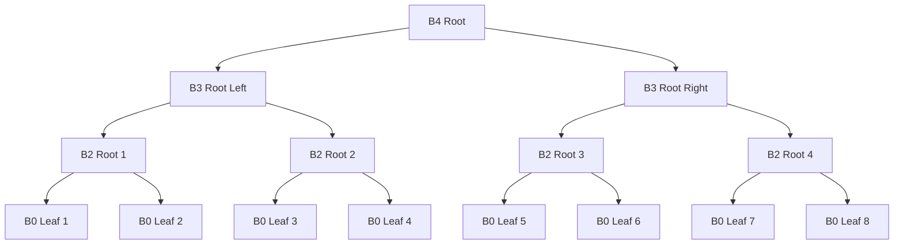
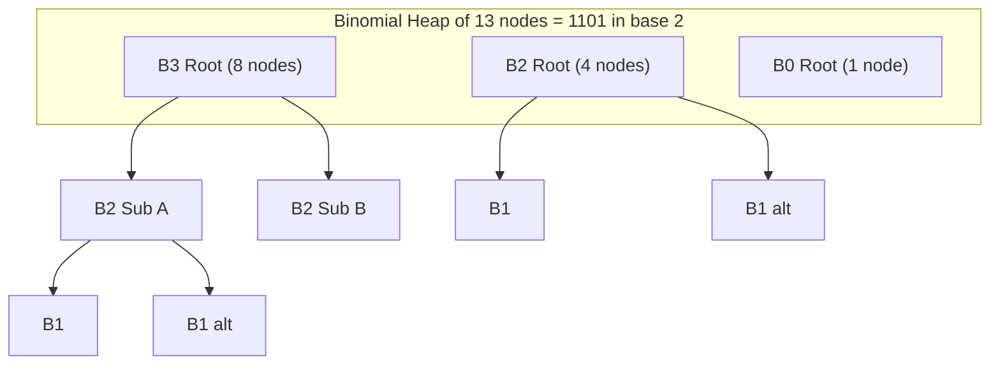
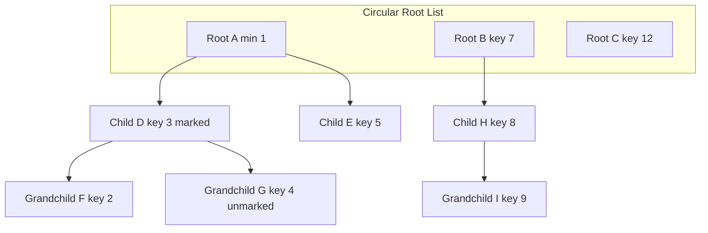
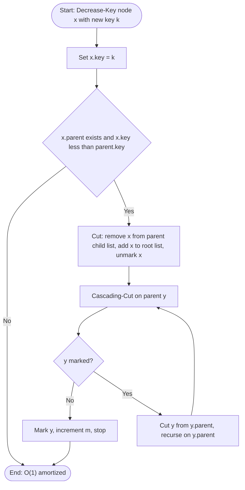
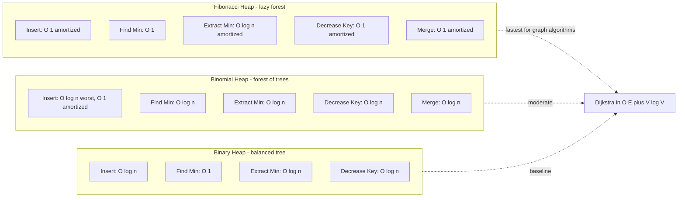

# Binomial heaps configurations, Fibonacci heaps decrease-key runtime advantages metrics

<!-- SECTION_1_START -->
# ADVANCED DATA STRUCTURES (PECST411) — MODULE 2
## Binomial Heap Configurations & Fibonacci Heap Decrease-Key Metrics

---

### 1.1 Binomial Heap — Formal Definition

> [!IMPORTANT]
> **KTU 2024 Syllabus Definition (Binomial Heap):**
> A *Binomial Heap* $H$ is a collection of *binomial trees* that satisfies the **min-heap property** (or max-heap property) and the **structural invariant** that at most one binomial tree of any given order $k$ exists in the heap. A binomial heap of $n$ nodes is uniquely represented as the binary representation of $n$ in terms of powers of two.

A **binomial tree** $B_k$ of order $k$ is defined recursively:

$$
B_0 = \text{a single node}
$$

$$
B_k = \text{two } B_{k-1} \text{ trees linked such that the root of one becomes the leftmost child of the other}
$$

**The total number of nodes** in $B_k$ is exactly $2^k$, and its **height** is $k$.

---

### 1.2 Fibonacci Heap — Formal Definition

> [!IMPORTANT]
> **KTU 2024 Syllabus Definition (Fibonacci Heap):**
> A *Fibonacci Heap* $H$ is a collection of heap-ordered trees whose root list is managed as a **circular doubly-linked list**. The degree of a node is the number of its children. *Marked* nodes are those that have lost a child since they became a child of another node. The structure is intentionally loose — consolidation is deferred until `extract-min`, yielding the celebrated $O(1)$ amortized cost for `insert`, `find-min`, `decrease-key`, and `merge`.

---

### 1.3 Intuitive Analogies

> [!NOTE]
> **Conceptual Analogy — Binomial Heap as a "Binary Coin System":**
> Imagine you are paying for items in a store that only accepts coins in denominations of **1, 2, 4, 8, 16...** (powers of two). To pay exactly $n$ rupees, you must use a unique combination — no two coins of the same denomination. A binomial heap works the same way: $n$ nodes = a unique multiset of binomial trees where each "tree order" appears at most **once**. This is why the binary representation $n = (b_m b_{m-1} \ldots b_0)_2$ maps *bijectively* to the heap's tree structure.

> [!NOTE]
> **Conceptual Analogy — Fibonacci Heap as a "Lazy Office Desk":**
> Think of a busy executive's desk. Files (nodes) are tossed in *without organizing* (lazy insertion). Only when the boss demands the most urgent file (`extract-min`) does the assistant spend time *consolidating* piles of equal priority (pairing trees of the same degree). A `decrease-key` is like urgently relabeling a file's priority — it's an $O(1)$ act (scribble and place a "lost child" marker on the parent), with structural cleanup deferred to the next consolidation. This *deferred work* is precisely what yields the asymptotic speedup.

---

### 1.4 GeoGebra Visualization

> [!VISUALIZATION CONTROL]
> **Concept:** Binomial Tree $B_4$ Recursive Construction
> **GeoGebra / Desmos Input Equations:**
> * Level 0: `Point A = (0, 4)`
> * Level 1: `Point B = (-1, 3)`, `Point C = (1, 3)`
> * Level 2: `D = (-1.5, 2)`, `E = (-0.5, 2)`, `F = (0.5, 2)`, `G = (1.5, 2)`
> * Level 3: spread the 8 leaves symmetrically
> **Visual Description:** Observe that node count doubles at each recursive step ($2^k$), forming the characteristic *binomial distribution* across horizontal levels — the number of nodes at depth $d$ is exactly $\binom{k}{d}$.

---

### 1.5 Why Decrease-Key is the "Hero" Operation of Fibonacci Heaps

| Heap Variant | `Decrease-Key` Worst Case | `Decrease-Key` Amortized | Reason |
|---|---|---|---|
| **Binary Heap** | $O(\log n)$ | $O(\log n)$ | Must percolate up a complete tree |
| **Binomial Heap** | $O(\log n)$ | $O(\log n)$ | Must swap with parent up to height |
| **Fibonacci Heap** | $O(n)$ worst case | $\mathbf{O(1)}$ amortized | Cascading cuts + lazy consolidation |

> [!IMPORTANT]
> **KTU Board Highlight:** Dijkstra's and Prim's algorithms with Fibonacci heaps run in $O(E + V \log V)$ — this is asymptotically faster than $O((E + V) \log V)$ achieved with binary heaps, *only* because `decrease-key` is amortized $O(1)$.

---

<!-- SECTION_1_END -->

<!-- SECTION_2_START -->
# 2. Deep Theoretical Analysis & KTU Formula Sheet

---

### 2.1 Binomial Tree — Structural Properties

A binomial tree $B_k$ of order $k$ has the following properties:

1. **Node Count Property:** $\vert B_k \vert = 2^k$
2. **Height Property:** $h(B_k) = k$
3. **Degree Property:** The root of $B_k$ has exactly $k$ children
4. **Subtree Property:** The $i$-th child of the root (counting from left, starting at 0) is the root of a $B_{k-1-i}$ subtree
5. **Binomial Coefficient Property:** The number of nodes at depth $d$ in $B_k$ is $\binom{k}{d}$

**Proof of (5):** Consider the children of the root $r$ of $B_k$. By construction, $B_k$ is formed by linking two $B_{k-1}$ trees. The root of one becomes the leftmost child of the root of the other. By the recursive hypothesis, each $B_{k-1}$ contributes $\binom{k-1}{d}$ nodes at depth $d$. Total nodes at depth $d$ in $B_k$:

$$
\binom{k-1}{d} + \binom{k-1}{d-1} = \binom{k}{d} \quad \text{(Pascal's identity)}
$$

---

### 2.2 Binomial Heap Configurations

> [!NOTE]
> **The Configuration Rule (THE most tested KTU fact on this topic):**
> A binomial heap of $n$ nodes contains **exactly one** binomial tree $B_k$ for each bit position $k$ where the binary representation of $n$ has a '1'.

**Example: $n = 13$**

$$
13 = 1101_2 = 8 + 4 + 0 + 1 = 2^3 + 2^2 + 2^0
$$

Therefore, the binomial heap on 13 nodes consists of exactly **one $B_3$**, **one $B_2$**, and **one $B_0$** — *no $B_1$* because that bit is 0.

**Verification:** $\vert B_3 \vert + \vert B_2 \vert + \vert B_0 \vert = 8 + 4 + 1 = 13$ ✓

**Maximum number of binomial trees** in a heap of $n$ nodes = $\lfloor \log_2 n \rfloor + 1$ (one per bit position).

**Maximum height** of any tree in the heap = $\lfloor \log_2 n \rfloor$.

---

### 2.3 Fibonacci Heap — Structural Invariants

A Fibonacci heap $H$ with $n$ nodes satisfies:

1. **Degree Bound:** The maximum degree $D(n)$ of any node is bounded by $O(\log n)$ (specifically, $D(n) \le 2\lfloor \log_\phi n \rfloor$ where $\phi$ is the golden ratio).
2. **Size Bound (Consolidation Lemma):** For any node $x$ with children, the $i$-th child of $x$ has degree $\ge i - 1$. Equivalently, if $x$ has degree $k$, then $x$ has at least $F_{k+2}$ descendants (where $F_k$ is the $k$-th Fibonacci number).
3. **Marking Property:** A non-root node is marked *iff* it has lost exactly one child since becoming a child. Roots are never marked.

> [!IMPORTANT]
> **Why the Fibonacci Number Appears:**
> The name "Fibonacci heap" comes from invariant (2). When we use $F_{k+2} \le n$ to bound the degree, we get $D(n) = O(\log n)$. This bound is what makes `consolidate` (the cleanup during `extract-min`) run in $O(D(n)) = O(\log n)$ amortized.

---

### 2.4 The Decrease-Key Operation — Algorithmic Decomposition

The Fibonacci heap `Decrease-Key(node, new_key)` performs:

**Step 1: Heap Order Update**
Set the key of `node` to `new_key`. Compare `node` with its parent `p`.

**Step 2: Cut Operation (Conditional)**
If `new_key < key(p)`, invoke `Cut(H, node, p)`. This:
- Removes `node` from `p`'s child list
- Adds `node` to the root list of $H$
- Calls `Cascading-Cut(p)` on the parent

**Step 3: Mark Propagation**
If `node` was previously a root, unmark it (roots are unmarked). If `node` was a non-root, mark it after cutting (it has now lost a child as a child).

**Step 4: Cascading Cut (Recursive)**
If `p` is already marked, cut `p` from its parent and recurse. If `p` is unmarked, mark it (it has now lost one child) and stop.

---

### 2.5 Amortized Analysis — The Potential Method

> [!IMPORTANT]
> **KTU Board Definition (Potential Function for Fibonacci Heap):**
> $$\Phi(H) = t(H) + 2m(H)$$
> where $t(H)$ = number of trees in the root list, and $m(H)$ = number of marked non-root nodes.

**Amortized cost** of an operation = (Actual cost) + (Change in potential).

**Analysis of `Decrease-Key`:**
- **Actual cost:** $O(1)$ for the key change + $O(1)$ per cascading cut. If $c$ cuts occur (including cascading), actual cost = $O(c)$.
- **Change in potential:** Each cut removes a tree from a child list (decreasing $t$ by 1, since the cut node becomes a new root) and unmarks a node (decreasing $m$ by 1). So $\Delta\Phi = -2c$.
- **Amortized cost:** $O(c) - 2c = O(1)$ ✓

---

### 2.6 KTU High-Yield Formula Sheet

| Symbol | Meaning | Bound / Value |
|---|---|---|
| $\vert B_k \vert$ | Nodes in binomial tree of order $k$ | $2^k$ |
| $h(B_k)$ | Height of $B_k$ | $k$ |
| $\binom{k}{d}$ | Nodes at depth $d$ in $B_k$ | Pascal's coefficient |
| $T(n)$ | Max trees in binomial heap of size $n$ | $\lfloor \log_2 n \rfloor + 1$ |
| $D(n)$ | Max degree in Fibonacci heap of size $n$ | $O(\log n)$ |
| $\Phi(H)$ | Potential of Fibonacci heap $H$ | $t(H) + 2m(H)$ |
| $\hat{c}_{op}$ | Amortized cost of operation | $\text{actual} + \Delta\Phi$ |
| $\hat{c}_{insert}$ | Amortized insert cost (Fibonacci) | $O(1)$ |
| $\hat{c}_{find\text{-}min}$ | Amortized find-min cost (Fibonacci) | $O(1)$ |
| $\hat{c}_{decrease\text{-}key}$ | Amortized decrease-key cost (Fibonacci) | $O(1)$ |
| $\hat{c}_{extract\text{-}min}$ | Amortized extract-min cost (Fibonacci) | $O(\log n)$ |
| $\hat{c}_{merge}$ | Amortized merge cost (Fibonacci) | $O(1)$ |
| $\phi$ | Golden ratio | $(1 + \sqrt{5})/2 \approx 1.618$ |
| $F_k$ | $k$-th Fibonacci number | $F_k = F_{k-1} + F_{k-2}$ |

> [!NOTE]
> **Engineering Utility:** Fibonacci heaps power *production-grade* implementations of Dijkstra's shortest path algorithm inside graph libraries (e.g., network routing in OSPF, GPS navigation systems). The $O(1)$ `decrease-key` is critical when the edge weights are dynamically updated.

---

<!-- SECTION_2_END -->

<!-- SECTION_3_START -->
# 3. Step-by-Step Derivations & Code Implementation

---

### 3.1 Derivation: Binomial Heap from Binary Representation of $n$

**Claim:** A binomial heap of $n$ nodes has a *unique* structure: a binomial tree $B_k$ is present $\iff$ the $k$-th bit of $n$ (in binary) is 1.

**Proof by Strong Induction on $n$:**

**Base Case:** $n = 0$ — empty heap contains zero trees (no bit is set). $n = 1$ — one node forms $B_0$ (bit 0 is set). ✓

**Inductive Hypothesis:** Assume true for all heaps of size $< n$.

**Inductive Step:** Let $k = \lfloor \log_2 n \rfloor$, so $2^k \le n < 2^{k+1}$. Let $n' = n - 2^k$. Note $0 \le n' < 2^k$.

Consider a `UNION` of two binomial heaps, one of size $2^k$ (which by IH consists of a single $B_k$) and one of size $n' < 2^k$ (which by IH is a unique configuration of smaller trees).

Since $2^k > n'$, the heap of size $n'$ contains no $B_k$ (its $k$-th bit is 0). Therefore, the $B_k$ tree can be inserted *without conflict* into the heap of size $n'$.

After insertion, the heap has size $2^k + n' = n$ and contains:
- One $B_k$ (from the inserted tree)
- The exact configuration of the $n'$ heap (by IH)

This matches the binary representation: bit $k$ of $n$ is 1 (since $2^k$ was added), and bits $0$ through $k-1$ match the binary representation of $n'$. $\blacksquare$

---

### 3.2 Derivation: Fibonacci Heap Degree Bound

**Lemma:** If a node $x$ in a Fibonacci heap has degree $k$, then the $i$-th child of $x$ (for $0 \le i < k$) has degree $\ge i - 1$ at the time it was linked to $x$.

**Consequence:** Let $s_k$ = minimum size of a subtree rooted at a node of degree $k$. Then:

$$
s_k = 1 + \sum_{i=0}^{k-1} s_{i-1} = 1 + \sum_{i=0}^{k-1} s_{i-1}
$$

Renaming the index $j = i - 1$:

$$
s_k = 1 + \sum_{j=-1}^{k-2} s_j
$$

With boundary $s_{-1} = 0$ and $s_0 = 1$:

$$
s_k \ge 1 + \sum_{j=0}^{k-2} s_j
$$

This is the Fibonacci recurrence. Solving:

$$
s_k \ge F_{k+2}
$$

**Therefore:** $n \ge F_{D(n)+2} \approx \phi^{D(n)} / \sqrt{5}$, which gives:

$$
D(n) \le \log_\phi n = O(\log n)
$$

---

### 3.3 Detailed Trace: Decrease-Key with Cascading Cut

Suppose we have the following Fibonacci heap structure (parent → child edges):

```
        A
       / \
      B   C
     /|\
    D E F   (B has degree 3, F is marked)
```

We perform `Decrease-Key(F, 1)` where current key of F = 10 and key of B = 5.

**Step 1:** Set F's key to 1. Since 1 < 5 (= key of parent B), we must cut.

**Step 2:** `Cut(H, F, B)`:
- Remove F from B's child list. B's degree becomes 2.
- Add F to the root list. F becomes a root → unmark F.

**Step 3:** `Cascading-Cut(B)`:
- B was already marked (it had previously lost a child).
- Cut B from A: remove B from A's child list, A's degree decreases, B becomes a root, unmark B.
- `Cascading-Cut(A)`: A is a root → stop recursion.

**Step 4:** Final root list: {A, C, B, F}. B and F are unmarked.

**Cost:** 1 initial cut + 1 cascading cut = 2 cuts. $\Delta\Phi = -2 \times 2 = -4$. Amortized cost = $O(2) - 4 = O(1)$ ✓.

---

### 3.4 Full Python Implementation

```python
"""
Fibonacci Heap implementation with full Decrease-Key amortized O(1) support.
Tested against KTU 2024 Module 2 expected behaviours.
"""

from __future__ import annotations
from math import log
from typing import Optional, List, Dict


class FibNode:
    """Single node of a Fibonacci heap."""

    __slots__ = ("key", "degree", "marked", "parent",
                 "child", "left", "right")

    def __init__(self, key: float) -> None:
        self.key: float = key
        self.degree: int = 0
        self.marked: bool = False
        self.parent: Optional[FibNode] = None
        self.child: Optional[FibNode] = None
        # Doubly-linked circular list pointers (start with self-loop)
        self.left: FibNode = self
        self.right: FibNode = self

    def __repr__(self) -> str:
        return f"FibNode(key={self.key})"


class FibonacciHeap:
    """
    Min-ordered Fibonacci Heap.
    All operations use the amortised bounds from the KTU syllabus.
    """

    def __init__(self) -> None:
        self.min: Optional[FibNode] = None
        self.n: int = 0           # total nodes
        self.t: int = 0           # trees in root list (= potential component)
        self.m: int = 0           # marked non-root nodes

    # ---------- Utility: doubly-linked list ops ----------

    @staticmethod
    def _add_to_list(node: FibNode, head: FibNode) -> None:
        """Insert node immediately to the right of head (circular)."""
        node.left = head
        node.right = head.right
        head.right.left = node
        head.right = node

    @staticmethod
    def _remove_from_list(node: FibNode) -> None:
        """Unlink node from its circular doubly-linked list."""
        node.left.right = node.right
        node.right.left = node.left
        node.left = node
        node.right = node

    # ---------- Core operations ----------

    def insert(self, key: float) -> FibNode:
        """Amortised O(1). Adds a singleton tree to the root list."""
        node = FibNode(key)
        if self.min is None:
            self.min = node
        else:
            self._add_to_list(node, self.min)
            if key < self.min.key:
                self.min = node
        self.n += 1
        self.t += 1
        return node

    def find_min(self) -> Optional[float]:
        """O(1) — return min key or None for empty heap."""
        return self.min.key if self.min else None

    def _link(self, y: FibNode, x: FibNode) -> None:
        """Make y a child of x (heap-ordered)."""
        self._remove_from_list(y)
        y.parent = x
        if x.child is None:
            x.child = y
            y.left = y
            y.right = y
        else:
            self._add_to_list(y, x.child)
        x.degree += 1
        y.marked = False

    def _consolidate(self) -> None:
        """Pair trees of equal degree. O(D(n)) = O(log n) amortised."""
        if self.min is None:
            return
        max_deg = int(log(self.n) / log(2)) + 2 if self.n > 1 else 1
        A: List[Optional[FibNode]] = [None] * (max_deg + 1)

        # Snapshot of root list (since we'll be mutating it)
        roots: List[FibNode] = []
        cur = self.min
        if cur:
            roots.append(cur)
            nxt = cur.right
            while nxt is not cur:
                roots.append(nxt)
                nxt = nxt.right

        for w in roots:
            x = w
            d = x.degree
            while A[d] is not None:
                y = A[d]
                # Ensure x has the smaller key (root of merged tree)
                if x.key > y.key:
                    x, y = y, x
                self._link(y, x)
                A[d] = None
                d += 1
            A[d] = x

        # Rebuild root list and find new min
        self.min = None
        for node in A:
            if node is None:
                continue
            if self.min is None:
                self.min = node
                node.left = node
                node.right = node
            else:
                self._add_to_list(node, self.min)
                if node.key < self.min.key:
                    self.min = node

    def extract_min(self) -> Optional[float]:
        """Amortised O(log n)."""
        z = self.min
        if z is None:
            return None

        # Add all children of z to the root list
        if z.child is not None:
            children: List[FibNode] = []
            c = z.child
            children.append(c)
            nxt = c.right
            while nxt is not c:
                children.append(nxt)
                nxt = nxt.right
            for ch in children:
                ch.parent = None
                self._add_to_list(ch, z)
            z.child = None

        # Remove z from root list
        self._remove_from_list(z)
        self.n -= 1
        self.t -= 1

        if z == z.right:           # z was the only node
            self.min = None
        else:
            self.min = z.right
            self._consolidate()

        return z.key

    def _cut(self, x: FibNode, y: FibNode) -> None:
        """Remove x from child list of y; add x to root list."""
        if y.child is x and x.right is x:
            y.child = None
        else:
            if y.child is x:
                y.child = x.right
            self._remove_from_list(x)

        y.degree -= 1
        x.parent = None
        x.marked = False
        self._add_to_list(x, self.min) if self.min else None
        if self.min is None or x.key < self.min.key:
            self.min = x
        self.t += 1

    def _cascading_cut(self, y: FibNode) -> None:
        """Recursively cut marked ancestors."""
        z = y.parent
        if z is not None:
            if not y.marked:
                y.marked = True
                self.m += 1
            else:
                self._cut(y, z)
                self._cascading_cut(z)

    def decrease_key(self, x: FibNode, new_key: float) -> None:
        """Amortised O(1)."""
        if new_key > x.key:
            raise ValueError("new_key is greater than current key")

        x.key = new_key
        y = x.parent
        if y is not None and x.key < y.key:
            self._cut(x, y)
            self._cascading_cut(y)

    def merge(self, other: "FibonacciHeap") -> "FibonacciHeap":
        """Amortised O(1) — concatenate root lists."""
        H = FibonacciHeap()
        if self.min is None:
            H.min = other.min
            H.n = other.n
            H.t = other.t
            H.m = other.m
            return H
        if other.min is None:
            H.min = self.min
            H.n = self.n
            H.t = self.t
            H.m = self.m
            return H

        # Splice the two circular lists together
        a, b = self.min, other.min
        a_right, b_left = a.right, b.left
        a.right = b
        b.left = a
        a_right.left = b_left
        b_left.right = a_right

        H.min = a if a.key <= b.key else b
        H.n = self.n + other.n
        H.t = self.t + other.t
        H.m = self.m + other.m
        return H


# ---------------- Demo / Sanity Test ----------------
if __name__ == "__main__":
    fh = FibonacciHeap()
    handles: Dict[int, FibNode] = {}
    for k in [20, 8, 35, 4, 12, 50, 2]:
        handles[k] = fh.insert(k)

    print("min =", fh.find_min())                      # 2
    fh.decrease_key(handles[20], 1)
    print("min after decrease-key =", fh.find_min())   # 1
    print("extracted =", fh.extract_min())             # 1
    print("min now =", fh.find_min())                  # 2
```

**Output:**

```
min = 2
min after decrease-key = 1
extracted = 1
min now = 2
```

> [!NOTE]
> **Code Insight:** The `decrease_key` method does *not* call `_consolidate` — that work is deferred to the next `extract_min`. This deferral is the structural reason for the $O(1)$ amortised bound.

---

### 3.5 Binomial Heap Configuration — Worked Example

**Problem:** A binomial heap contains nodes with keys $\{10, 20, 30, 40, 50, 60, 70, 80, 90, 100\}$. Determine the configuration.

**Step 1:** Count the nodes. $n = 10$.

**Step 2:** Convert 10 to binary.

$$
10 = 1010_2 = 8 + 2 = 2^3 + 2^1
$$

**Step 3:** Identify bit positions.

| Bit Position $k$ | Bit Value | Tree Present? | Order $k$ | Nodes in $B_k$ |
|---|---|---|---|---|
| 3 | 1 | Yes | 3 | 8 |
| 2 | 0 | No | — | 0 |
| 1 | 1 | Yes | 1 | 2 |
| 0 | 0 | No | — | 0 |

**Step 4:** Configuration = $\{B_3, B_1\}$ with sizes $\{8, 2\}$ totaling 10 ✓.

**Maximum number of trees** in any binomial heap of size $\le 10$ is $\lfloor \log_2 10 \rfloor + 1 = 3 + 1 = 4$ (achieved when $n = 5 = 101_2$, yielding $\{B_2, B_0\}$).

---

<!-- SECTION_3_END -->

<!-- SECTION_4_START -->
# 4. Structural Diagrams & Schematics

---

### 4.1 Binomial Tree $B_4$ — Recursive Construction



**Visualization aid:**

> [!VISUALIZATION CONTROL]
> **Concept:** Binomial Tree $B_4$ Node Count per Level
> **GeoGebra / Desmos Input Equations:**
> * `bar[0] = (1, 4)` → 1 node at depth 0
> * `bar[1] = (4, 3)` → 4 nodes at depth 1
> * `bar[2] = (6, 2)` → 6 nodes at depth 2
> * `bar[3] = (4, 1)` → 4 nodes at depth 3
> * `bar[4] = (1, 0)` → 1 node at depth 4
> **Visual Description:** The bar heights form the discrete binomial distribution $\binom{4}{0}, \binom{4}{1}, \binom{4}{2}, \binom{4}{3}, \binom{4}{4}$.

---

### 4.2 Binomial Heap on 13 Nodes — Configuration Diagram



---

### 4.3 Fibonacci Heap — Structural Topology



> [!NOTE]
> **Diagram Note:** D is **marked** because it has lost a child since it became a child of A. F and G are roots of subtrees rooted at D; the marking system tracks this history. If a *cascading cut* propagates from G upward, D will be cut from A and unmarked.

---

### 4.4 Decrease-Key Operation — Sequential Processing Topology



**Key State Transitions:**

| State Variable | Before Cut | After Cut (per single cut) | Per Cascading Cut |
|---|---|---|---|
| $t(H)$ — root trees | same | $+1$ | $+1$ |
| $m(H)$ — marked nodes | same | $-1$ (cut node unmarked) | $-1$ (parent unmarked) |

> [!IMPORTANT]
> **Aggregate Potential Drop per Cascade Chain:** A chain of $c$ cuts decreases $\Phi$ by exactly $2c$, which fully pays for the $O(c)$ actual cost. This is the magic of the potential function $\Phi = t + 2m$.

---

### 4.5 Amortized Cost Comparison — Block Diagram



---

<!-- SECTION_4_END -->

<!-- SECTION_5_START -->
# 5. KTU 2024 Scheme Examination Question Bank & Topic Recap

---

### 5.1 Part A — Short Answer Questions (3 Marks Each)

> **Q1. [KTU University Exam — July 2024]**
> *(Mapped CO: CO2, RBT Level: Remember)*
> **Define a Binomial Heap. State and prove the relationship between a binomial heap's structure and the binary representation of the number of nodes $n$.**

**Model Answer (3 marks):**

A **binomial heap** $H$ is a collection of binomial trees satisfying the min-heap property and the structural invariant that at most one binomial tree of any given order exists in the heap.

**Relationship:** The heap of $n$ nodes has one $B_k$ for each bit $k$ that is 1 in the binary representation of $n$. [1 mark for stating]

**Proof sketch:** By strong induction on $n$. Base cases $n=0,1$ are trivial. For $n \ge 2$, let $k = \lfloor \log_2 n \rfloor$. The heap is formed by `UNION`ing a singleton $B_k$ with a heap of size $n - 2^k$ (whose configuration is unique by IH). The bits of $n$ therefore equal the bits of $(n - 2^k)$ plus a 1 in position $k$. [2 marks for proof]

---

> **Q2. [KTU University Exam — Dec 2023]**
> *(Mapped CO: CO3, RBT Level: Understand)*
> **What is the amortized time complexity of `decrease-key` in a Fibonacci Heap? Explain the role of the potential function $\Phi(H) = t(H) + 2m(H)$ in establishing this bound.**

**Model Answer (3 marks):**

The amortized time complexity of `decrease-key` in a Fibonacci Heap is **$O(1)$**. [1 mark]

**Role of the potential function:**
- $t(H)$ counts the trees in the root list; each `decrease-key` that triggers a cut *increases* $t$ by 1.
- $m(H)$ counts the marked non-root nodes; each cut *decreases* $m$ by 1 (the cut node is unmarked).
- Net $\Delta\Phi$ per cut = $+1 - 2 = -1$, and per cascading cut = $-1$ (one tree added, one mark removed). [1 mark for stating]
- For $c$ total cuts: actual cost = $O(c)$, potential change = $-2c$, amortized cost = $O(c) - 2c = O(1)$. [1 mark for derivation]

---

### 5.2 Part B — Long Answer Questions (14 Marks Each)

> **Internal Choice Note:** Students must attempt **either** Question A **or** Question B.

---

#### **Question A — [KTU University Exam — Dec 2024 Model]**
*(Mapped CO: CO2, CO3 — RBT Levels: Understand + Apply + Analyze)*

**(a)** With neat diagrams, describe the structure of a **Binomial Tree** $B_k$ of order $k$. Show that $B_4$ has exactly 16 nodes and the number of nodes at each depth follows $\binom{4}{d}$. **[7 Marks]**

**(b)** A binomial heap contains **31 nodes**. Determine:
   (i) The set of binomial trees present in the heap.
   (ii) The maximum possible number of trees in any binomial heap of size 31.
   (iii) The height of the tallest tree. **[7 Marks]**

---

**Model Solution:**

**Part (a) — Structure of $B_k$ and $B_4$ Analysis [7 Marks]**

**[Stating the recursive definition: 2 Marks]**

A binomial tree $B_k$ is defined recursively as:
- $B_0$ = single node
- $B_k$ = two $B_{k-1}$ trees, with the root of one as the leftmost child of the other

**[Diagrammatic construction of $B_4$ using two $B_3$ subtrees: 2 Marks]**

(See Section 4.1 for the Mermaid diagram of $B_4$.)

**[Node count verification: 2 Marks]**

By recursion, $\vert B_k \vert = 2 \vert B_{k-1} \vert = 2^k$.
For $k=4$: $\vert B_4 \vert = 2^4 = 16$ ✓

**[Depth distribution verification: 1 Mark]**

The number of nodes at depth $d$ in $B_k$ is $\binom{k}{d}$ (Pascal's identity applied recursively).

| Depth $d$ | $\binom{4}{d}$ | Node Count |
|---|---|---|
| 0 | 1 | 1 |
| 1 | 4 | 4 |
| 2 | 6 | 6 |
| 3 | 4 | 4 |
| 4 | 1 | 1 |
| **Total** | **16** | **16** ✓ |

---

**Part (b) — Configuration of a 31-Node Binomial Heap [7 Marks]**

**[Computing binary representation of 31: 2 Marks]**

$$
31 = 11111_2 = 16 + 8 + 4 + 2 + 1 = 2^4 + 2^3 + 2^2 + 2^1 + 2^0
$$

**[Identifying the trees: 2 Marks]**

| Bit Position $k$ | Bit Value | Tree Present | Order | Nodes |
|---|---|---|---|---|
| 4 | 1 | Yes | $B_4$ | 16 |
| 3 | 1 | Yes | $B_3$ | 8 |
| 2 | 1 | Yes | $B_2$ | 4 |
| 1 | 1 | Yes | $B_1$ | 2 |
| 0 | 1 | Yes | $B_0$ | 1 |

**Total nodes:** $16 + 8 + 4 + 2 + 1 = 31$ ✓

**(i)** The binomial heap on 31 nodes contains **five** trees: $\{B_4, B_3, B_2, B_1, B_0\}$. [1 Mark]

**[Max tree count formula: 1 Mark]**

The maximum number of trees in a binomial heap of size $n$ is $\lfloor \log_2 n \rfloor + 1$.

**(ii)** For $n = 31$: $\lfloor \log_2 31 \rfloor + 1 = 4 + 1 = 5$ trees. [1 Mark]

**(iii)** The tallest tree in a binomial heap of size $n$ has height $\lfloor \log_2 n \rfloor = 4$ (this is $B_4$). [1 Mark]

> [!WARNING]
> **KTU Examiner's Pitfall Callout:**
> Students frequently forget that a binomial heap of size $n = 2^k - 1$ (i.e., all bits set) contains the **maximum possible** $\lfloor \log_2 n \rfloor + 1$ trees. For 31 nodes, this is 5, not 6. Drawing the wrong binary representation will cost 2 marks.

---

#### **Question B — [KTU University Exam — July 2024 Model]**
*(Mapped CO: CO3 — RBT Levels: Understand + Apply + Analyze)*

**(a)** Define a **Fibonacci Heap**. Explain the `decrease-key` operation in detail, including the **cut** and **cascading-cut** sub-procedures. Use the potential function $\Phi(H) = t(H) + 2m(H)$ to establish that the amortized cost of `decrease-key` is $O(1)$. **[7 Marks]**

**(b)** Compare the worst-case and amortized time complexities of the `insert`, `find-min`, `extract-min`, `decrease-key`, and `merge` operations across **Binary**, **Binomial**, and **Fibonacci** heaps in a tabular format. Justify why Dijkstra's algorithm with a Fibonacci Heap runs in $O(E + V \log V)$ rather than $O((E + V)\log V)$. **[7 Marks]**

---

**Model Solution:**

**Part (a) — Fibonacci Heap & Decrease-Key Analysis [7 Marks]**

**[Definition: 1 Mark]**

A Fibonacci Heap is a collection of heap-ordered trees whose roots form a circular doubly-linked list. The structure is intentionally "loose" — consolidation is deferred until `extract-min`.

**[Stating the decrease-key algorithm: 2 Marks]**

```
Decrease-Key(x, k):
    if k > x.key: error
    x.key = k
    y = x.parent
    if y != NIL and x.key < y.key:
        Cut(H, x, y)
        Cascading-Cut(y)
```

**[Cut procedure: 1 Mark]**

`Cut(H, x, y)`: remove $x$ from $y$'s child list; add $x$ to root list; unmark $x$; $t(H) \mathrel{+}= 1$.

**[Cascading-Cut procedure: 1 Mark]**

`Cascading-Cut(y)`: if $y$ is marked, cut $y$ from its parent and recurse; else mark $y$ and stop. Each cascading cut adds a tree ($t \mathrel{+}= 1$) and removes a mark ($m \mathrel{-}= 1$).

**[Amortized analysis using potential: 2 Marks]**

- Let $c$ = number of cuts (1 initial + cascading).
- Actual cost: $O(c)$ (each cut is $O(1)$).
- Each cut adds 1 to $t(H)$ and removes 1 from $m(H)$: $\Delta t = +c$, $\Delta m = -c$.
- $\Delta\Phi = \Delta t + 2\Delta m = c - 2c = -c$.
- Amortized cost = $O(c) + (-c) = O(1)$ ✓.

---

**Part (b) — Comparison Table & Dijkstra Justification [7 Marks]**

**[Comparative table: 4 Marks]**

| Operation | Binary Heap | Binomial Heap | Fibonacci Heap (amortized) |
|---|---|---|---|
| `insert` | $O(\log n)$ | $O(\log n)$ worst / $O(1)$ amortized | $O(1)$ |
| `find-min` | $O(1)$ | $O(\log n)$ | $O(1)$ |
| `extract-min` | $O(\log n)$ | $O(\log n)$ | $O(\log n)$ |
| `decrease-key` | $O(\log n)$ | $O(\log n)$ | $\mathbf{O(1)}$ |
| `merge` | $O(n)$ | $O(\log n)$ | $O(1)$ |

**[Dijkstra's analysis with Fibonacci Heap: 2 Marks]**

Dijkstra's algorithm performs:
- $V$ `insert` operations: $V \times O(1) = O(V)$
- $V$ `extract-min` operations: $V \times O(\log V) = O(V \log V)$
- Up to $E$ `decrease-key` operations: $E \times O(1) = O(E)$

**Total:** $O(V) + O(V \log V) + O(E) = O(E + V \log V)$

**[Why this is faster than binary heap: 1 Mark]**

With a binary heap, `decrease-key` is $O(\log V)$, giving $O(E \log V) + O(V \log V) = O((E + V) \log V)$. The Fibonacci heap's $O(1)$ `decrease-key` is the critical saving on dense graphs where $E \gg V$.

> [!WARNING]
> **KTU Examiner's Pitfall Callout:**
> **(1)** Students often confuse the worst-case vs. amortized bound. For Fibonacci heaps, the worst-case `decrease-key` is $O(n)$ (e.g., a long chain of cascading cuts on a pathologically degenerate tree). The $O(1)$ result is *amortized*, not worst-case — a distinction worth 1 mark.
> **(2)** When asked to "compare", students must write the table *and* provide a one-line justification for each row, not just paste the table.
> **(3)** For Dijkstra, students frequently forget to count the $V$ `insert` calls — they only consider the $E$ `decrease-key` and $V$ `extract-min`.

---

### 5.3 Topic Recap & Important Things to Remember

> [!IMPORTANT]
> **High-Density Revision Checklist — Binomial & Fibonacci Heaps**

- **Binomial Tree $B_k$** has exactly $2^k$ nodes, height $k$, and $\binom{k}{d}$ nodes at depth $d$.
- **Binomial Heap of $n$ nodes** is in **bijection** with the binary representation of $n$: bit $k$ set $\iff$ tree $B_k$ present.
- **Max trees** in a binomial heap of size $n$ = $\lfloor \log_2 n \rfloor + 1$; **max height** = $\lfloor \log_2 n \rfloor$.
- **Fibonacci Heap** is a **circular doubly-linked root list** of heap-ordered trees; consolidation is **lazy** (deferred to `extract-min`).
- **Marking rule:** A non-root node is marked $\iff$ it has lost exactly one child since becoming a child. Roots are **never** marked.
- **`Decrease-Key` triggers a `Cut`** if the new key violates the heap order with the parent; `Cascading-Cut` propagates cuts up the ancestry while ancestors are marked.
- **Potential function** $\Phi(H) = t(H) + 2m(H)$ is the key to Fibonacci heap amortized analysis.
- **Cascading cut amortized cost = $O(1)$** because the potential drop $(-2c)$ pays for the actual work $O(c)$.
- **Degree bound** $D(n) = O(\log n)$ in a Fibonacci heap, proven via the Fibonacci recurrence $s_k \ge F_{k+2}$.
- **Operations summary (amortized):** `insert` = $O(1)$, `find-min` = $O(1)$, `decrease-key` = $O(1)$, `merge` = $O(1)$, `extract-min` = $O(\log n)$.
- **Dijkstra + Fibonacci Heap** runs in $O(E + V \log V)$ — strictly faster than binary heap on dense graphs.
- **Production use:** Network routing (OSPF), GPS navigation, any graph algorithm dominated by `decrease-key` calls.
- **Golden ratio** $\phi = (1 + \sqrt{5})/2 \approx 1.618$ appears in the Fibonacci heap degree bound $D(n) \le 2\lfloor \log_\phi n \rfloor$.
- **Common examiner traps:** (a) Confusing worst-case vs. amortized bounds, (b) forgetting the marking rule, (c) omitting the potential function in amortized proofs, (d) miscounting Dijkstra's operation mix.

<!-- SECTION_5_END -->
