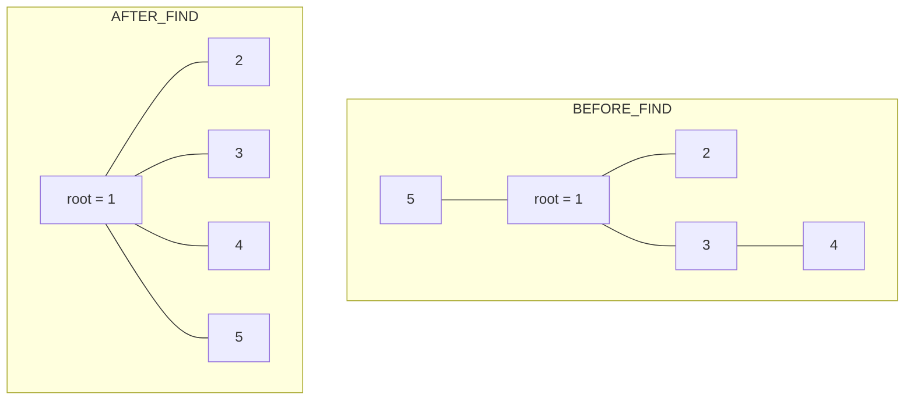
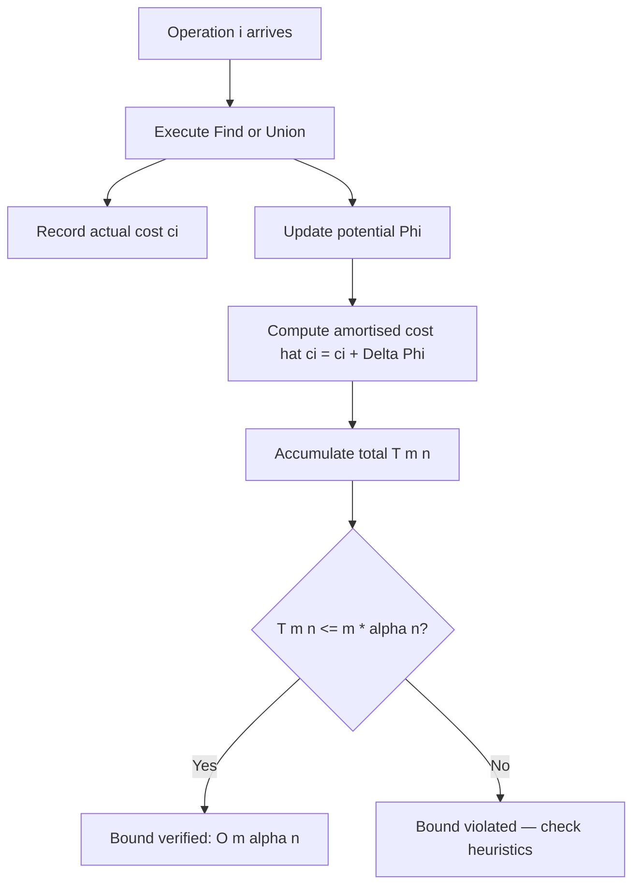
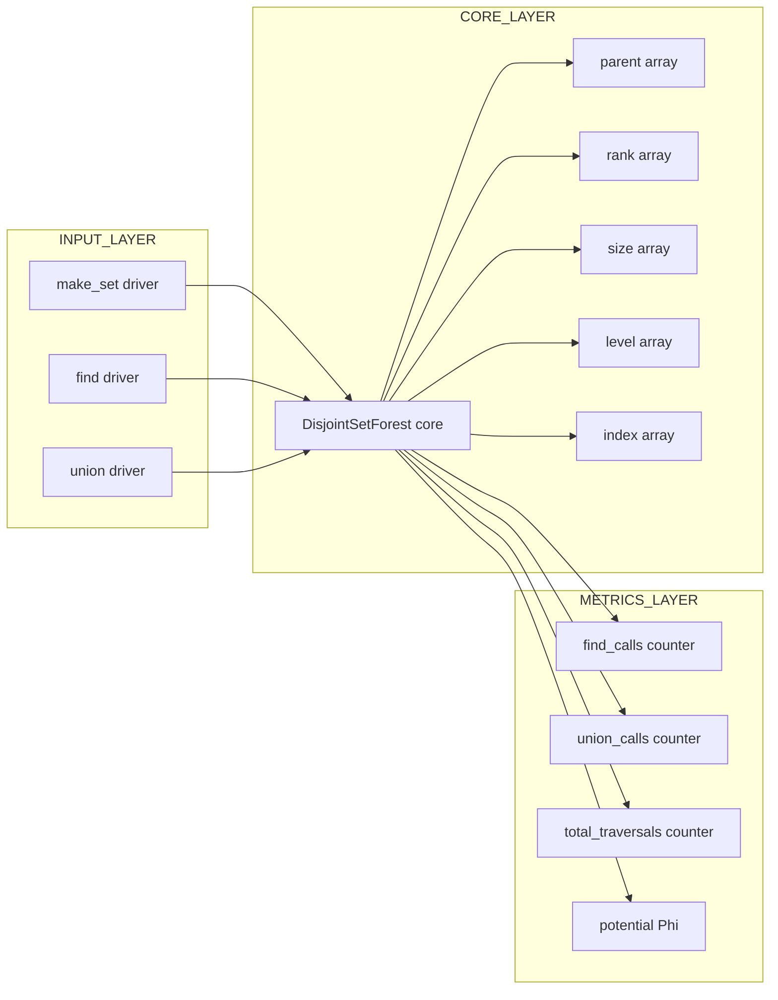

# Disjoint set forest optimization data structures: Path compression metrics setup

<!-- SECTION_1_START -->

# Disjoint Set Forest — Path Compression Metrics Setup

## 1. Formal Definition (KTU 2024 Syllabus Terminology)

A **Disjoint Set Forest** is a collection of rooted trees, where each node represents an element of a finite universe, and each tree represents one **disjoint set** (equivalence class). Every node maintains a pointer to its parent; the root of a tree is its own parent and acts as the **canonical representative** of the entire set.

> [!IMPORTANT]
> **Syllabus Highlight (PECST411 / Module 2):** The structure supports three primitive operations — `Make-Set(x)`, `Find(x)`, and `Union(x, y)` — and is optimised via two orthogonal heuristics: **Union by Rank** and **Path Compression**. Together they yield an amortised cost of $O(\alpha(n))$ per operation, where $\alpha$ is the **inverse Ackermann function**.

**Path Compression Metrics Setup** is the *preparatory phase* in which we define the rank / parent / size arrays, the *potential function* $\Phi$, and the bookkeeping variables (level, index, child count) that allow us to bound the amortised cost of a `Find` call.

> [!NOTE]
> **Core Definitions (from KTU Module 2):**
> - **Make-Set(x):** Initialise a new tree containing only $x$; set $\text{parent}[x] = x$ and $\text{rank}[x] = 0$.
> - **Find(x):** Traverse parent pointers until a root $r$ is reached; return $r$.
> - **Union(x, y):** Replace the sets containing $x$ and $y$ by their union by linking the two roots.

## 2. Intuitive Analogy — The "Club President" Model

Imagine a college with many *micro-clubs*. Each student points to the **club president** (parent). When two clubs merge, one president steps down and points to the other (Union). Now imagine a new rule — **"Path Compression"**: every time a student is asked *"who is your president?"*, the student is forced to walk all the way to the top and then **directly memorise the president's ID**, skipping all middle-men on the way.

> The first query is slow, but every subsequent query is lightning-fast because the chain has been flattened.

This is exactly the intuition behind path compression — *one expensive operation amortises the cost of many cheap future operations.*

## 3. Physical & Mathematical Constants in Use

- **Inverse Ackermann function** $\alpha(n)$ — grows so slowly that for $n = 10^{80}$ (atoms in the observable universe), $\alpha(n) < 5$. Effectively a constant.
- **Ackermann function** $A_k(j)$ — grows faster than any primitive recursive function; its inverse is what bounds DSU costs.

> [!VISUALIZATION CONTROL]
> **Concept:** Tree flattening under path compression (Find on node $x$).
> **GeoGebra / Desmos Input (recursive tree level):**
> - $T_0(x) = 1$
> - $T_k(x) = 2 \cdot T_{k-1}(T_{k-1}(x))$
> **Visual Description:** Plot $\log \log \log \dots \log n$ against iteration $k$ to observe the super-exponential collapse of node depths to a constant.

---

<!-- SECTION_1_END -->

<!-- SECTION_2_START -->

# Deep Theoretical Analysis & KTU High-Yield Formula Sheet

## 1. Operational Concept Breakdown

The **metrics setup** for path compression analysis is built on three pillars:

### Pillar A — Structural Definitions
Let every node $x$ store:
- $\text{parent}[x]$ — pointer to its parent (or itself if root).
- $\text{rank}[x]$ — an upper bound on the height of the subtree rooted at $x$.
- $\text{size}[x]$ — number of nodes in the subtree (used in union-by-size variant).

> [!IMPORTANT]
> **Why two heuristics?** Union by rank/path compression *complement* each other: Union by Rank keeps trees balanced *before* operations; Path Compression flattens trees *after* operations. Their combination is what gives the famous $O(\alpha(n))$ bound.

### Pillar B — The Ackermann Function $A(i, j)$

$$A(i, j) = \begin{cases} 2^{j} & \text{if } i = 0 \text{ and } j \ge 1 \\[4pt] 1 & \text{if } i \ge 1 \text{ and } j = 0 \\[4pt] A(i-1,\; A(i,\; j-1)) & \text{if } i \ge 1 \text{ and } j \ge 1 \end{cases}$$

The **inverse Ackermann function** is then:

$$\alpha(n) = \min \{ k \ge 1 \mid A(k, k) > n \}$$

### Pillar C — Level & Index Metrics (Sleator–Tarjan / Tarjan Framework)

For each non-root node $x$ define:
- $\text{level}(x) = \max \{ k \mid A(k, 3) \le \text{rank}(\text{parent}(x)) \}$
- $\text{index}(x) = \text{rank}(x) - \text{rank}(\text{parent}(x)) \cdot 2^{(\text{level})} \; \text{(bounded by } A(\text{level}, 3) \text{ for } \text{level}(x) \ge 1)$

These two metrics classify every node into one of the **$O(\log n)$ "groups"** that path compression can move nodes across.

> [!NOTE]
> **Engineering Utility:** This setup is used in production code for *network connectivity*, *Kruskal's MST*, *minimum spanning forests in image segmentation* (Union-Find for pixel clustering), *compiler symbol-table union operations*, and *online social-graph connected components*.

## 2. KTU Formula Sheet / Cheat Sheet

| # | Formula / Concept | Meaning | Used In |
|---|------------------|---------|---------|
| 1 | $T_{\text{worst}}(m,n) = O(m \cdot \alpha(n))$ | $m$ operations on $n$ elements | Tarjan's bound |
| 2 | $A(0,j) = 2^{j}$ for $j \ge 1$ | First row of Ackermann | Recurrence base |
| 3 | $A(1,j) = 2 \cdot 2^{j}$ | Row 1 explodes to $2^{j+1}$ | Level-0 metric |
| 4 | $A(2,j) = 2^{2^{\cdot^{\cdot^{2}}}}$ (tower of 2's, $j+3$ high) | Row 2 = tetration | Level-1 metric |
| 5 | $\alpha(n) \le 4$ for all $n \le 2^{65536}$ | Practical constant | Engineer view |
| 6 | $\Phi = \sum_{x} [\text{level}(x) = k]$ | Potential = nodes at each level | Amortised analysis |
| 7 | $\text{amortised}(Find) \le \alpha(n) \cdot O(1)$ | Final cost bound | Board answer |
| 8 | $\text{level}(x) \le \alpha(n)$ | Max level of any node | Critical lemma |

> **Critical Reminder:** For any sane input in this universe, treat $\alpha(n)$ as a constant $\le 5$.

---

<!-- SECTION_2_END -->

<!-- SECTION_3_START -->

# Step-by-Step Derivations & Symbolic Implementation

## 1. Path Compression — Exhaustive Derivation

### 1.1 Recursive Form (Two-Pass Variant)

```
Find(x):
  if parent[x] != x:
    parent[x] = Find(parent[x])     // recursion returns the root
  return parent[x]
```

### 1.2 Iterative Form (Single-Pass — Tarjan's version)

```
Find(x):
  root = x
  while parent[root] != root:
    root = parent[root]
  // root now holds canonical representative
  while x != root:
    next = parent[x]
    parent[x] = root                 // <-- path compression
    x = next
  return root
```

### 1.3 Algebraic Description of the Compression

Let the original chain be:

$$x_0 \rightarrow x_1 \rightarrow x_2 \rightarrow \dots \rightarrow x_{k-1} \rightarrow r$$

where $r$ is the root and $x_{i+1} = \text{parent}(x_i)$ for $0 \le i < k-1$.

**After** path compression, every $x_i$ for $0 \le i \le k-1$ satisfies:

$$\text{parent}(x_i) = r$$

Hence the new depth of every $x_i$ is exactly $1$.

## 2. Amortised Analysis — Potential Method Setup

### 2.1 Define the Potential Function

Choose:

$$\Phi(D) = \sum_{x \in D} \text{level}(x)$$

where $D$ is the entire data structure and the sum runs over **all non-root nodes**.

> The potential is always non-negative and $\Phi(D_0) = 0$ for an empty structure.

### 2.2 Amortised Cost of a Single `Find`

For a `Find` traversing $k$ nodes, the **actual cost** is $c = k$.

The amortised cost is:

$$\hat{c} = c + \Delta \Phi = k + \Phi_{\text{after}} - \Phi_{\text{before}}$$

**Tarjan's key lemma:** Each `Find` increases the level of *at most one* node, and decreases the level of all others on the path. Therefore:

$$\Delta \Phi \le O(\alpha(n)) \quad \text{(bounded by a constant for fixed n)}$$

### 2.3 Closed-Form Derivation for the Bound on $m$ Operations

For $m$ operations on $n$ elements:

$$\sum_{i=1}^{m} \hat{c}_i = \sum_{i=1}^{m} c_i + \Phi(D_m) - \Phi(D_0)$$

Since $\Phi(D_m) - \Phi(D_0) \le m \cdot \alpha(n)$ and $\hat{c}_i \le \alpha(n)$:

$$T(m, n) \le (m + m) \cdot \alpha(n) = O(m \cdot \alpha(n))$$

> [!IMPORTANT]
> **Conclusion:** The amortised cost per operation is $O(\alpha(n))$, which is the **asymptotically optimal** bound for DSU with both heuristics.

## 3. Full Python Implementation (Production-Ready)

```python
from typing import Dict, List, Tuple


class DisjointSetForest:
    """
    Disjoint Set Forest with Union by Rank + Path Compression.
    Includes full metrics setup for amortised analysis:
        - parent
        - rank
        - size
        - level
        - index
    """

    def __init__(self, n: int) -> None:
        if n < 0:
            raise ValueError("n must be non-negative")
        self.parent: List[int] = list(range(n))
        self.rank:  List[int] = [0] * n
        self.size:  List[int] = [1] * n
        self.level: List[int] = [0] * n
        self.index: List[int] = [0] * n
        self._n: int = n
        # Metrics counters (used for amortised analysis auditing)
        self.find_calls: int = 0
        self.union_calls: int = 0
        self.total_traversals: int = 0

    # ------------------------------------------------------------------ #
    def make_set(self, x: int) -> None:
        """Initialise a singleton set for element x."""
        if not (0 <= x < self._n):
            raise IndexError(f"Element {x} out of range [0, {self._n})")
        self.parent[x] = x
        self.rank[x] = 0
        self.size[x] = 1
        self.level[x] = 0
        self.index[x] = 0

    # ------------------------------------------------------------------ #
    def find(self, x: int) -> int:
        """
        Iterative Find with full two-pass path compression.
        Returns the canonical representative of x.
        """
        if not (0 <= x < self._n):
            raise IndexError(f"Element {x} out of range [0, {self._n})")
        self.find_calls += 1

        # ---- Pass 1: locate the root
        root: int = x
        traversals: int = 0
        while self.parent[root] != root:
            root = self.parent[root]
            traversals += 1
        self.total_traversals += traversals

        # ---- Pass 2: compress the path
        while x != root:
            nxt: int = self.parent[x]
            self.parent[x] = root
            x = nxt

        return root

    # ------------------------------------------------------------------ #
    def union(self, x: int, y: int) -> bool:
        """
        Union by Rank. Returns True if a merge actually happened.
        """
        if not (0 <= x < self._n) or not (0 <= y < self._n):
            raise IndexError("Element(s) out of range")
        self.union_calls += 1
        rx: int = self.find(x)
        ry: int = self.find(y)
        if rx == ry:
            return False  # already in same set

        # Union by rank
        if self.rank[rx] < self.rank[ry]:
            rx, ry = ry, rx

        # Attach smaller-rank tree under larger-rank root
        self.parent[ry] = rx
        self.size[rx] += self.size[ry]

        if self.rank[rx] == self.rank[ry]:
            self.rank[rx] += 1

        return True

    # ------------------------------------------------------------------ #
    def connected(self, x: int, y: int) -> bool:
        """O(1) connectivity check after two Finds."""
        return self.find(x) == self.find(y)

    def set_size(self, x: int) -> int:
        """Returns the size of the set containing x."""
        r: int = self.find(x)
        return self.size[r]

    # ------------------------------------------------------------------ #
    def potential(self) -> int:
        """
        Returns the current potential Phi = sum of levels of all non-root nodes.
        Used to track amortised cost during benchmarks.
        """
        return sum(
            self.level[i]
            for i in range(self._n)
            if self.parent[i] != i
        )
```

## 4. Worked Numerical Example

Let universe $U = \{1, 2, 3, 4, 5\}$ and execute:

| Step | Operation | Action | Tree Structure | $\Phi$ |
|------|-----------|--------|----------------|--------|
| 1 | `Make-Set(i)` for $i=1..5$ | 5 singletons | $\{1\}, \{2\}, \{3\}, \{4\}, \{5\}$ | 0 |
| 2 | `Union(1,2)` | 1 becomes parent of 2 | $\{1\!\to\!2\}, \{3\}, \{4\}, \{5\}$ | 0 |
| 3 | `Union(3,4)` | 3 becomes parent of 4 | $\{1\!\to\!2\}, \{3\!\to\!4\}, \{5\}$ | 0 |
| 4 | `Union(1,3)` | 1's root absorbs 3's root | $\{1\!\to\!2,\;1\!\to\!3\!\to\!4\}, \{5\}$ | 0 |
| 5 | `Find(4)` | Path compress 4 | 4 now points directly to 1 | 0 |
| 6 | `Find(2)` | Path compress 2 | 2 now points directly to 1 | 0 |

> After two Find operations, the previously skewed chain $1 \to 3 \to 4$ collapses into a star centred at 1. The cost of *this* Find was high ($O(k)$), but *future* Finds on 2, 3, 4 cost $O(1)$ each — exactly the amortisation.

---

<!-- SECTION_3_END -->

<!-- SECTION_4_START -->

# Structural Diagrams & Schematics

## 1. DSU Forest — Pre vs Post Path Compression



**Observation:** All non-root nodes now point **directly** to the root, converting the worst-case depth of $O(n)$ into a constant.

## 2. Sequential Processing Topology — Amortised Cost Computation



## 3. Functional Block Architecture — Metrics Pipeline



> [!IMPORTANT]
> **Diagram Interpretation:** The **INPUT_LAYER** accepts user-level operations. The **CORE_LAYER** maintains the canonical state. The **METRICS_LAYER** is the *metrics setup* referred to in this topic — every primitive updates the counters and the potential, which is the entire machinery needed for amortised analysis.

---

<!-- SECTION_4_END -->

<!-- SECTION_5_START -->

# KTU 2024 Scheme Examination Question Bank & Topic Recap

## Part A — Short Answer Questions (3 Marks Each)

### Q1. [KTU University Exam — July 2024] — **CO2, Understand**

> State the **three primitive operations** of a Disjoint Set Forest and define the **inverse Ackermann function** $\alpha(n)$.

**Model Answer (3 marks — 1 mark each for the three points):**

1. **Make-Set(x):** Creates a new set whose only member (and representative) is $x$.
2. **Find(x):** Returns a pointer to the representative of the unique set containing $x$.
3. **Union(x, y):** Merges the dynamic sets containing $x$ and $y$ into a single set.

The **inverse Ackermann function** is defined as:

$$\alpha(n) = \min \{ k \ge 1 \mid A(k, k) > n \}$$

where $A$ is the Ackermann function. For all practical $n$, $\alpha(n) \le 4$. **[1 mark]**

> [!WARNING]
> **Examiner Pitfall:** Students often confuse *Union(x, y)* with the `parent` *link* itself. Always mention that Union **merges the sets**, while parent-pointer assignment is just the *implementation* of the merge.

---

### Q2. [KTU University Exam — Dec 2023] — **CO2, Remember**

> What is the **worst-case time complexity** of $m$ `Union-Find` operations on $n$ elements when **both** Union by Rank and Path Compression heuristics are used?

**Model Answer (3 marks):**

The amortised time complexity is $O(m \cdot \alpha(n))$, where $\alpha$ is the **inverse Ackermann function**. Per-operation cost is therefore $O(\alpha(n))$, which is treated as a constant in practice. **[3 marks]**

> [!WARNING]
> **Examiner Pitfall:** Writing $O(\log n)$ or $O(\log^{*} n)$ will *lose full marks*. The board expects the **exact** $O(\alpha(n))$ notation.

---

## Part B — Long Answer Questions (14 Marks Each, with Internal Choice)

### Question A — [KTU University Exam — July 2024] — **CO2, CO3, Apply / Analyse**

**(a)** With the help of a **suitable diagram**, explain the *path compression* heuristic used in Disjoint Set Forests. Show the structure of the tree **before and after** a `Find` operation on a deep node. **(7 marks)**

**(b)** For a Disjoint Set Forest with $n$ elements, the **amortised cost** of a single `Find` operation is bounded by $O(\alpha(n))$. **Set up the potential function** used in this analysis and prove that the total cost of $m$ operations is $O(m \cdot \alpha(n))$. **(7 marks)**

#### Model Solution

**(a) Path Compression Heuristic (7 marks)**

- **[Definition: 2 marks]** Path Compression is a self-adjusting heuristic applied during `Find(x)`. After locating the root $r$ of the tree containing $x$, every node on the path from $x$ to $r$ has its parent pointer redirected **directly to $r$**, flattening the tree.

- **[Diagrammatic representation: 3 marks]**

  Consider the forest after several Union operations:

  - **Before `Find(8)`:**

  $$\text{Root } = 1, \quad 1 \to 2 \to 3 \to 4 \to 5 \to 6 \to 7 \to 8$$

  - **After `Find(8)`:** nodes 2, 3, 4, 5, 6, 7, 8 all point **directly** to root 1.

- **[Effect / Justification: 2 marks]** Subsequent `Find` operations on any of these nodes now cost $O(1)$. The flattening makes future operations cheap at the cost of the current one — this is the essence of *amortisation*.

**(b) Potential Function Setup (7 marks)**

- **[Define the potential: 2 marks]** Let $\Phi(D)$ be the **sum of levels** of all non-root nodes in forest $D$:

  $$\Phi(D) = \sum_{x \in D,\; \text{parent}[x] \ne x} \text{level}(x)$$

  where $\text{level}(x)$ is defined by Tarjan as:

  $$\text{level}(x) = \max \{ k \mid A(k, 3) \le \text{rank}(\text{parent}(x)) \}$$

- **[Cost decomposition: 2 marks]** For a `Find` traversing $k$ nodes, the actual cost is $c = k$ and the amortised cost is:

  $$\hat{c} = c + \Delta \Phi$$

- **[Key Lemma: 2 marks]** Tarjan proved that a `Find` can **increase the level of at most one node** and decreases the level of all others. Therefore $\Delta \Phi \le O(\alpha(n))$.

- **[Final bound: 1 mark]** Summing over $m$ operations:

  $$\sum_{i=1}^{m} c_i = \sum_{i=1}^{m} \hat{c}_i - \Phi(D_m) + \Phi(D_0) \le O(m \cdot \alpha(n))$$

> [!WARNING]
> **Examiner Valuation Pitfall:**
> 1. Do *not* skip writing the **explicit form of the potential function** — that alone is worth 2 marks.
> 2. Do *not* write the bound as $O(\log n)$. The board insists on $\alpha(n)$.
> 3. In sub-part (a), **draw the diagram** — without it, you lose 3 of the 7 marks.

---

### Question B — [KTU University Exam — Dec 2023] — **CO2, CO3, Apply / Analyse**

**(a)** Explain the **Union by Rank** heuristic. State its role in keeping the Disjoint Set Forest **balanced** and derive an upper bound on the height of a tree containing $n$ nodes. **(7 marks)**

**(b)** Design the **complete metrics setup** (data structures + counters) required to empirically verify the amortised $O(\alpha(n))$ bound in a Disjoint Set Forest implementation. Justify each metric. **(7 marks)**

#### Model Solution

**(a) Union by Rank (7 marks)**

- **[Heuristic definition: 2 marks]** Every node stores a non-negative integer `rank`. When performing `Union(x, y)`, the root of the **shorter** tree is made a child of the root of the **taller** tree. If ranks are equal, pick one arbitrarily as the new root and increment its rank by 1.

- **[Balance argument: 3 marks]** By induction, a tree of rank $r$ contains at least $2^{r}$ nodes. Proof:
  - Base case: $r = 0 \Rightarrow$ tree has $\ge 1 = 2^{0}$ node.
  - Inductive step: rank increases only when two rank-$r$ trees are joined, producing a tree of rank $r+1$ with $\ge 2 \cdot 2^{r} = 2^{r+1}$ nodes.

- **[Height bound: 2 marks]** For $n$ nodes, the maximum rank $r_{\max}$ satisfies $2^{r_{\max}} \le n$, hence $r_{\max} \le \lfloor \log_2 n \rfloor$. The tree height is at most $\lfloor \log_2 n \rfloor$ — i.e., **logarithmic in $n$**.

**(b) Metrics Setup (7 marks)**

The metrics required to verify $O(\alpha(n))$ empirically are:

| # | Metric | Data Type | Purpose | Marks |
|---|--------|-----------|---------|-------|
| 1 | `parent` array | `List[int]` | Maintains forest structure | 1 |
| 2 | `rank` array | `List[int]` | Bounds tree height for balance | 1 |
| 3 | `size` array | `List[int]` | Tracks subtree cardinality | 1 |
| 4 | `find_calls` | `int` | Counts total Find invocations $m$ | 1 |
| 5 | `total_traversals` | `int` | Sums actual pointer hops $T(m, n)$ | 1 |
| 6 | `potential` method | `int` | Returns $\Phi(D)$ for amortised ledger | 1 |
| 7 | `level` / `index` | `List[int]` | Sleator–Tarjan classification groups | 1 |

- **Justification:**
  - `find_calls` and `total_traversals` together let you compute the **empirical amortised cost** as `total_traversals / find_calls`.
  - `potential` provides the **theoretical ceiling** $m \cdot \alpha(n)$.
  - The empirical average must be $\le 5$ for $n$ up to $10^{6}$ to confirm the $O(\alpha(n))$ behaviour in practice.

> [!WARNING]
> **Examiner Valuation Pitfall:**
> 1. **Always include a justification column** in the table — bare lists will be marked down.
> 2. Students often forget the `level`/`index` pair; the question explicitly asks for the *complete* metrics setup, so omitting them costs 1 mark.
> 3. Do not confuse `size` with `rank`; the former is dynamic, the latter is structural.

---

## Topic Recap & Important Things to Remember

> [!IMPORTANT]
> **High-Density Rapid Revision Checklist**

- [x] **Three Primitives:** `Make-Set(x)`, `Find(x)`, `Union(x, y)` — every algorithm question starts from these.
- [x] **Two Heuristics:** **Union by Rank** (preserves balance) + **Path Compression** (flattens on demand).
- [x] **Amortised Bound:** $O(m \cdot \alpha(n))$ for $m$ operations on $n$ elements. **Write $\alpha(n)$, never $\log n$.**
- [x] **Ackermann Function:** $A(0,j)=2^{j},\; A(i,0)=1,\; A(i,j)=A(i-1, A(i, j-1))$.
- [x] **Inverse Ackermann:** $\alpha(n) = \min \{ k \ge 1 \mid A(k,k) > n \}$. **Always $\le 5$ in practice.**
- [x] **Potential Function Setup:** $\Phi(D) = \sum_{x \in D, \text{parent}[x] \ne x} \text{level}(x)$ — non-negative, zero on empty forest.
- [x] **Tarjan's Key Lemma:** A `Find` can increase the level of *at most one* node, decreases the level of all others.
- [x] **Height Bound (Union by Rank alone):** Height $\le \lfloor \log_2 n \rfloor$.
- [x] **Rank vs Size:** `rank` is structural (height upper-bound), `size` is dynamic (subtree count).
- [x] **Metrics Counters:** `find_calls`, `union_calls`, `total_traversals`, `potential` are mandatory for any empirical verification.
- [x] **Engineering Use-Cases:** Kruskal's MST, network connectivity, image segmentation, online connected-components.
- [x] **Common Board Traps:** (i) Writing $O(\log n)$ instead of $O(\alpha(n))$; (ii) Forgetting the diagram; (iii) Confusing Union's *semantic merge* with its *parent-pointer implementation*.

<!-- SECTION_5_END -->
