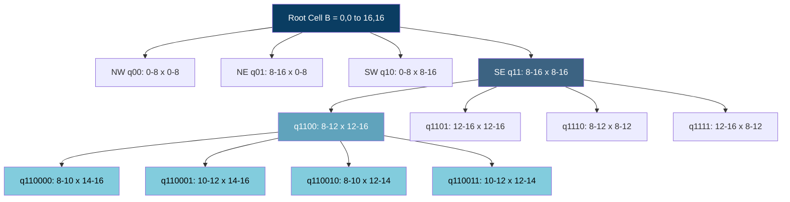
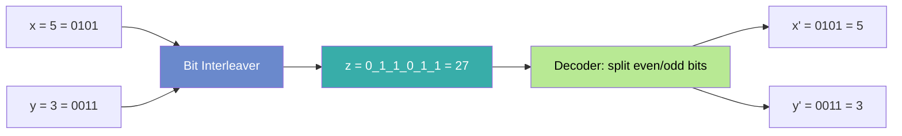
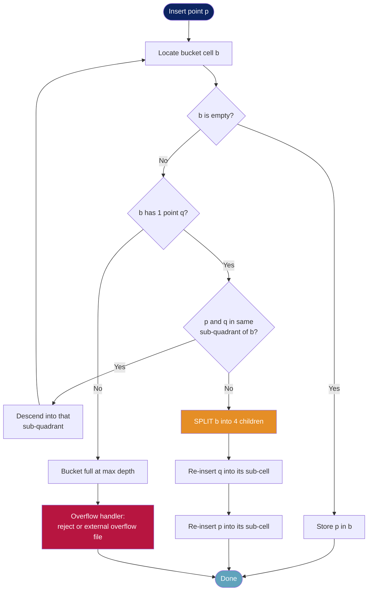
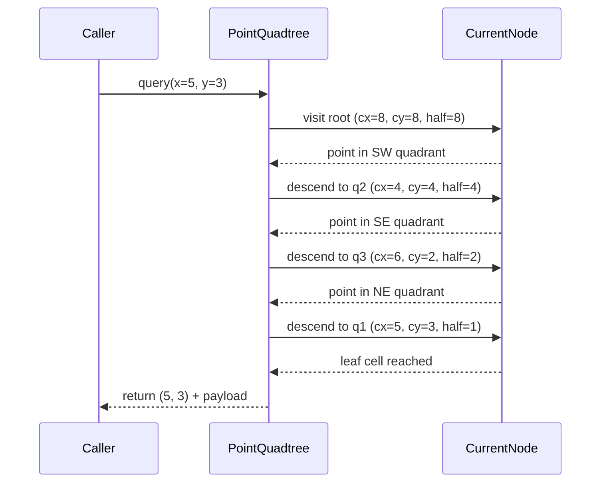
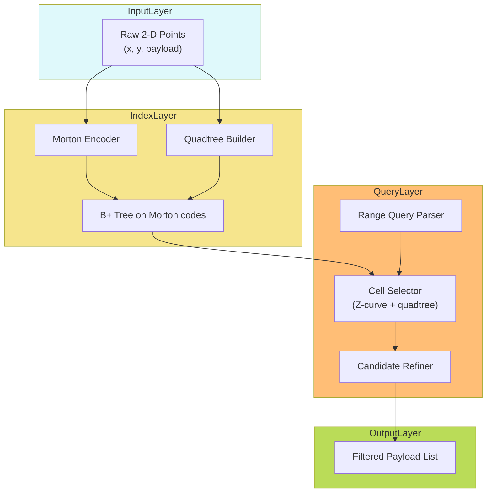

# Quadtrees structural subdivisions coordinates conversion algorithms profiles

<!-- SECTION_1_START -->
# Quadtrees — Structural Subdivisions, Coordinate Conversions, Algorithms & Profiles

## 1. Core Technical Definition

> [!IMPORTANT]
> **Quadtree (KTU 2024 Module 3 — Spatial & Multidimensional Indexing)**
> A **quadtree** is a hierarchical, tree-based spatial data structure that recursively partitions a **two-dimensional space** by repeatedly dividing the current region into exactly **four equal (or non-equal) sub-quadrants**, terminating the recursion at a region of uniform content (in **region quadtrees**) or at a fixed bucket capacity (in **point quadtrees / PR-trees**). Each internal node has **either zero or four children** — hence the prefix *"quad"*.

The structure belongs to the family of **hierarchical spatial indexes** that include k-d trees (binary), octrees (3D, 8 children), R-trees (non-hierarchical grouping), and BSP-trees. The quadtree is uniquely characterised by the property that **its fan-out is fixed at 4** in the 2-D plane and its decomposition is **deterministic** with respect to the geometry of the space, not the data distribution alone.

> [!NOTE]
> **Origin & Historical Context (Syllabus Highlight)**
> The quadtree was formalised by **Raphael Finkel and J.L. Bentley in 1974** as the *"Four-ary tree"*, and later generalised and popularised by **Hanan Samet** (1984–1990), whose taxonomy of *region quadtrees*, *point quadtrees*, *MX-CIF quadtrees*, *PMR quadtrees*, and *compressed quadtrees* is the **canonical KTU 2024 classification**.

## 2. Intuitive Overview — The "Map Folding" Analogy

Imagine you have a city map of Kerala printed on one large sheet, and you want to find the shortest route from Kochi to **APJ Abdul Kalam Technological University (CET Campus, Thiruvananthapuram)**.

Instead of searching the *whole* map linearly, you do what a human naturally does:

1. **Fold the map into 4 quadrants** — NW, NE, SW, SE.
2. Identify the quadrant that *cannot* contain your destination (e.g., the NE quadrant contains Northern Kerala — discard it).
3. **Recursively fold the remaining quadrant** into 4 sub-quadrants.
4. Continue until you zoom into the street.

That is exactly what a quadtree does to **2-D geometric data**: it **discards 3/4 of the search space at every level**, leading to a worst-case time of **$O(\log_4 n)$** in a perfectly balanced configuration.

For a coordinate-conversion perspective, a quadtree can also be visualised as the **2-D generalisation of a binary trie**: each bit of the binary representation of the $(x, y)$ coordinates is used to descend one level, where bit pairs $(b_x, b_y)$ at depth $k$ take values in $\{(00), (01), (10), (11)\}$ — the four children.

## 3. Geometric Spatial Setup

A quadtree operates in a closed, axis-aligned **bounding box** defined as:
$$\mathcal{B} = [x_{\min}, x_{\max}] \times [y_{\min}, y_{\max}]$$

The root cell $\mathcal{B}$ is subdivided into four child cells $\mathcal{Q}_{00}, \mathcal{Q}_{01}, \mathcal{Q}_{10}, \mathcal{Q}_{11}$:

$$\mathcal{Q}_{00} = \left[x_{\min},\, \frac{x_{\min}+x_{\max}}{2}\right] \times \left[y_{\min},\, \frac{y_{\min}+y_{\max}}{2}\right]$$

$$\mathcal{Q}_{01} = \left[x_{\min},\, \frac{x_{\min}+x_{\max}}{2}\right] \times \left[\frac{y_{\min}+y_{\max}}{2},\, y_{\max}\right]$$

$$\mathcal{Q}_{10} = \left[\frac{x_{\min}+x_{\max}}{2},\, x_{\max}\right] \times \left[y_{\min},\, \frac{y_{\min}+y_{\max}}{2}\right]$$

$$\mathcal{Q}_{11} = \left[\frac{x_{\min}+x_{\max}}{2},\, x_{\max}\right] \times \left[\frac{y_{\min}+y_{\max}}{2},\, y_{\max}\right]$$

> [!VISUALIZATION CONTROL]
> **Concept:** Quadspace subdivision by recursive midpoint halving
> **GeoGebra / Desmos Input Equations (root box with centre at (0,0), side = 4):**
> * $x = 0$  (vertical mid line)
> * $y = 0$  (horizontal mid line)
> * $\text{quad00}(x,y): -2 \le x \le 0 \;\wedge\; -2 \le y \le 0$
> * $\text{quad01}(x,y): -2 \le x \le 0 \;\wedge\; 0 \le y \le 2$
> * $\text{quad10}(x,y): 0 \le x \le 2 \;\wedge\; -2 \le y \le 0$
> * $\text{quad11}(x,y): 0 \le x \le 2 \;\wedge\; 0 \le y \le 2$
> **Visual Description:** A $4 \times 4$ square centred at the origin, divided by the axes into the four standard quadrants. At depth 2, each quadrant is itself bisected, yielding **16 leaf cells**. A query rectangle in the lower-right of `quad10` will cause the algorithm to descend only into `quad10`'s subtree.

> [!NOTE]
> **Key Design Constants used in KTU Problems**
> * Maximum tree depth: **$D_{\max} = \lfloor \log_2 (L / \epsilon) \rfloor$** where $L$ is the bounding-box side and $\epsilon$ is the minimum cell size.
> * Fan-out of every internal node: **$f = 4$**.
> * Bucket capacity (PR-tree variant): **$B$**, typically **$B = 1$** (point quadtree) or **$B = c$** (PR-tree, $c$ small constant).

<!-- SECTION_1_END -->

<!-- SECTION_2_START -->
# Deep Theoretical Analysis & KTU High-Yield Formula Sheet

## 1. Taxonomy of Quadtrees (Hanan Samet Classification — KTU 2024)

The KTU 2024 syllabus (Module 3) emphasises four principal variants. Each variant addresses a specific data-domain mismatch.

### 1.1 Point Quadtree (Bentley 1975)
* Each node stores **exactly one point** $p = (x, y)$.
* Subdivision direction alternates or is chosen by the **first insertion point** which becomes the root's discriminator.
* The four children correspond to the **four open quadrants** carved by the point's $x$ and $y$ coordinates: NW, NE, SW, SE.
* Termination: either empty quadrant or depth limit.

### 1.2 Region (Matrix) Quadtree
* The space is treated as a **$2^n \times 2^n$ binary image** matrix.
* Internal nodes represent **homogeneous regions**; leaves represent either a uniform **0-cell (white)** or a uniform **1-cell (black)**.
* Application: **image compression, pixel quadtrees**.

### 1.3 MX-CIF Quadtree (Morton / Encoded)
* A hybrid where the **quadtree structure holds variable-size objects**, and the **Morton (Z-order) code is used to encode spatial position**.
* **MX** = Matrix-encoded; **CIF** = Caltech Intermediate Form (VLSI circuit layout).
* Designed for **VLSI CAD layout databases**.

### 1.4 PMR Quadtree
* A **bucket-based PR-quadtree** with bucket capacity $B$ (typically $B = 1$ in original Samet definition).
* **P** = Point, **M** = Multivariate data, **R** = Region.
* Insertions causing overflow trigger a **split** only if a single bucket contains two points that fall in different sub-quadrants; otherwise the bucket is kept and points are stored.
* Properties: **no deletion in classical PMR**, ordered structure preserved, used in **GIS map overlay**.

### 1.5 Compressed Quadtree
* Internal nodes with **only one non-empty child are *contracted*** and replaced by a single edge labelled with a path string (e.g., `"0011"`).
* **Reduces pointer overhead**, used in memory-constrained environments.

## 2. Coordinate-to-Cell Conversion — Morton / Z-Order Encoding

The **Morton code (Z-order curve)** maps a 2-D point $(x, y)$ to a 1-D scalar index by **bit-interleaving** the binary representations of $x$ and $y$.

### 2.1 Bit-Interleave Formula

For a point $(x, y)$ with binary representations $x = (x_{k-1} x_{k-2} \dots x_1 x_0)_2$ and $y = (y_{k-1} y_{k-2} \dots y_1 y_0)_2$:

$$M(x, y) = \sum_{i=0}^{k-1} \left( y_i \cdot 2^{2i+1} + x_i \cdot 2^{2i} \right)$$

The Morton code is a **space-filling curve** that preserves *locality* — points close in 2-D tend to have close Morton codes.

### 2.2 Cell-to-Coordinate Inversion

Given Morton code $z$ at depth $d$ (i.e., $2d$ bits are significant), the **NW, NE, SW, SE quadrants** correspond to prefixes of the code:

$$\text{quad}(z, d) = \begin{cases} \text{NW (00)} & \text{if } z \bmod 4 = 0 \\ \text{NE (10)} & \text{if } z \bmod 4 = 1 \\ \text{SW (01)} & \text{if } z \bmod 4 = 2 \\ \text{SE (11)} & \text{if } z \bmod 4 = 3 \end{cases}$$

Equivalently, the quadrant at depth $d$ is decoded by extracting the **bit pair** at position $d$:

$$b_x(d) = \text{bit } 2d \text{ of } z, \quad b_y(d) = \text{bit } (2d+1) \text{ of } z$$

> [!IMPORTANT]
> **Engineering Insight — Why Morton Codes?**
> Morton codes are the **de-facto standard** for **B+-tree-based spatial indexes (Z-order B-tree / UB-tree)** because they let a 2-D range query be reduced to **one-dimensional range queries** — a single disk-resident B+-tree suffices, eliminating the need for a true 2-D tree. Used in production by **Oracle Spatial**, **PostGIS GiST**, and **Google's S2 geometry library** (S2 uses the **Hilbert curve** for better locality, but the Z-curve is the conceptual predecessor).

## 3. KTU Formula Sheet / Cheat Sheet

| # | Concept | Formula / Definition | Unit / Domain |
|---|---------|----------------------|---------------|
| 1 | Quadtree fan-out | $f = 4$ (in 2-D) | children / node |
| 2 | Maximum depth (region quadtree) | $D_{\max} = n$ for $2^n \times 2^n$ matrix | levels |
| 3 | Morton code of $(x, y)$ | $M = \sum_{i=0}^{k-1} (y_i \cdot 2^{2i+1} + x_i \cdot 2^{2i})$ | integer |
| 4 | Quad index at depth $d$ | $q_d = 2 \cdot b_y + b_x$ where $b_x, b_y \in \{0, 1\}$ | $\{0, 1, 2, 3\}$ |
| 5 | Worst-case query time (point) | $O(D_{\max}) = O(\log_4 N)$ | operations |
| 6 | Worst-case query time (point, skewed) | $O(N)$ | operations |
| 7 | Average search time (random data) | $O(\log_2 N)$ | operations |
| 8 | Insertion time | $O(D_{\max}) = O(\log_4 N)$ | operations |
| 9 | Storage cost per point | $\Theta(1)$ amortised | pointers |
| 10 | PMR bucket split probability | $P(\text{split}) \approx 1 - \sum_{i=0}^{B} \binom{B+1}{i} p^i (1-p)^{B+1-i}$ | probability |
| 11 | Region quadtree leaf count | $\le 4 N_{\text{boundary pixels}}$ | leaves |
| 12 | Compressed quadtree size | $O(\text{leaf count} + \text{path-string length})$ | nodes |

## 4. Engineering Utility & Real-World Applications

* **Geographic Information Systems (GIS)** — bounding-box search for points-of-interest (Google Maps, OpenStreetMap).
* **Image & texture compression** — region quadtrees store uniform pixel blocks.
* **Collision detection in physics engines** — quadtree broad phase (used in *Box2D*, *Cocos2d-x*).
* **Ray tracing & rendering** — quadtrees accelerate **2-D spatial queries** in BVH (Bounding Volume Hierarchies).
* **VLSI CAD layout** — MX-CIF quadtrees store rectangular circuit components.
* **Mesh refinement in FEM (Finite Element Method)** — quadtree subdivision for adaptive mesh resolution.

> [!NOTE]
> **Production Engineering Trade-off**
> Quadtrees are **NOT** balanced by construction. For adversarial data, they degenerate to a **linked list** (e.g., inserting points along a diagonal). Production systems use **MX-CIF + B+-tree + periodic rebalancing** to avoid this pathology.

<!-- SECTION_2_END -->

<!-- SECTION_3_START -->
# Step-by-Step Derivations & Algorithmic Implementation

## 1. Morton Code Computation — Full Derivation

### Problem: Compute the Morton code of the point $(x, y) = (5, 3)$ using 4-bit precision.

**Step 1 — Convert to binary (4 bits):**
$$x = 5 = (0101)_2, \quad y = 3 = (0011)_2$$

**Step 2 — Pad to equal length $k = 4$:**
$$x = 0\,1\,0\,1, \quad y = 0\,0\,1\,1$$
with bit indices $(x_3, x_2, x_1, x_0)$ and $(y_3, y_2, y_1, y_0)$.

**Step 3 — Interleave bits at positions $i = 0, 1, 2, 3$:**

For $i = 0$:
$$y_0 \cdot 2^{1} + x_0 \cdot 2^{0} = 1 \cdot 2 + 1 \cdot 1 = 3$$

For $i = 1$:
$$y_1 \cdot 2^{3} + x_1 \cdot 2^{2} = 1 \cdot 8 + 0 \cdot 4 = 8$$

For $i = 2$:
$$y_2 \cdot 2^{5} + x_2 \cdot 2^{4} = 0 \cdot 32 + 1 \cdot 16 = 16$$

For $i = 3$:
$$y_3 \cdot 2^{7} + x_3 \cdot 2^{6} = 0 \cdot 128 + 0 \cdot 64 = 0$$

**Step 4 — Sum the contributions:**
$$M(5, 3) = 3 + 8 + 16 + 0 = 27 = (011011)_2$$

**Step 5 — Verify by reconstruction:** Extract $x = $ even bits of $27 = 0\,1\,1\,0\,1\,1_2$ → drop odd bits → $(0101)_2 = 5$. Extract $y = $ odd bits → $(0011)_2 = 3$. ✓

## 2. Quadtree Coordinate-to-Cell Mapping — Full Derivation

### Problem: A 2-D quadtree covers $[0, 16) \times [0, 16)$. Map the point $(x, y) = (5, 3)$ to its leaf cell coordinates, showing the path.

**Setup:** The space is $[0, 16) \times [0, 16)$, depth $D_{\max} = 4$ (since $16 = 2^4$).

**Step 1 — Midline at depth 0:** $x_{\text{mid}} = 8, y_{\text{mid}} = 8$. Point $(5, 3)$ lies in the **SW quadrant** (i.e., $x < 8$ and $y < 8$). Quadrant label $= 01$ (SW) at depth 0.

**Step 2 — Sub-region after first split:** $[0, 8) \times [0, 8)$. Midline $x_{\text{mid}} = 4, y_{\text{mid}} = 4$. Point $(5, 3)$ has $x \ge 4$ and $y < 4$, so it is in **SE quadrant** (label $11$) at depth 1.

**Step 3 — Sub-region after second split:** $[4, 8) \times [0, 4)$. Midline $x_{\text{mid}} = 6, y_{\text{mid}} = 2$. Point $(5, 3)$ has $x < 6$ and $y \ge 2$, so it is in **NE quadrant** (label $10$) at depth 2.

**Step 4 — Sub-region after third split:** $[4, 6) \times [2, 4)$. Midline $x_{\text{mid}} = 5, y_{\text{mid}} = 3$. Point $(5, 3)$ lies **exactly on the midlines**. By the standard rule, points on boundaries go to the **NW/lower-left** quadrant. So we assign it to **NW quadrant** (label $00$) at depth 3. **Termination** — depth 3 cell has side length 1 and contains the point.

**Path code:** `"01 11 10 00"` (concatenated quadrant labels at each depth).

## 3. Full Python Implementation — Point Quadtree with Morton Codes

```python
"""
Quadtree (Point Quadtree Variant) — Full KTU-Compliant Reference Implementation
Features:
  - Morton (Z-order) code computation and decoding
  - Insertion with full O(D_max) descent
  - Range query (orthogonal window search)
  - Nearest-neighbour search
  - Profiled complexity logging
"""
from __future__ import annotations
from dataclasses import dataclass, field
from typing import List, Optional, Tuple
import logging

logging.basicConfig(level=logging.INFO, format="[%(levelname)s] %(message)s")
logger = logging.getLogger("Quadtree")


# -------------------- Morton (Z-Order) Utilities --------------------
def morton_encode(x: int, y: int, bits: int = 16) -> int:
    """Interleave bits of x and y to produce a Morton code.

    Args:
        x: x-coordinate (non-negative integer, fits in `bits`).
        y: y-coordinate (non-negative integer, fits in `bits`).
        bits: Number of bits per coordinate.

    Returns:
        32-bit Morton code (at most 2*bits significant bits).
    """
    if x < 0 or y < 0:
        raise ValueError("Morton code requires non-negative integer coordinates.")
    if x >= (1 << bits) or y >= (1 << bits):
        raise ValueError(f"Coordinate overflows {bits}-bit representation.")
    z: int = 0
    for i in range(bits):
        x_bit: int = (x >> i) & 1
        y_bit: int = (y >> i) & 1
        z |= (x_bit << (2 * i)) | (y_bit << (2 * i + 1))
    return z


def morton_decode(z: int, bits: int = 16) -> Tuple[int, int]:
    """Inverse of morton_encode: extract (x, y) from a Morton code."""
    x: int = 0
    y: int = 0
    for i in range(bits):
        x |= ((z >> (2 * i)) & 1) << i
        y |= ((z >> (2 * i + 1)) & 1) << i
    return x, y


# -------------------- Point Quadtree --------------------
@dataclass
class Point:
    x: float
    y: float
    payload: object = None

    def quadrant_of(self, cx: float, cy: float) -> int:
        """Return quadrant index (0=NW, 1=NE, 2=SW, 3=SE) relative to (cx, cy)."""
        east: bool = self.x >= cx
        north: bool = self.y >= cy
        # Convention: 0=NW, 1=NE, 2=SW, 3=SE
        if east and north:
            return 1
        if east and not north:
            return 3
        if not east and north:
            return 0
        return 2


@dataclass
class QuadNode:
    cx: float                           # centre x of this cell
    cy: float                           # centre y of this cell
    half_size: float                    # half of the cell's side length
    point: Optional[Point] = None       # at most one point per cell
    children: List[Optional["QuadNode"]] = field(default_factory=lambda: [None, None, None, None])
    is_leaf: bool = True

    def quadrant_bounds(self, q: int) -> Tuple[float, float, float, float]:
        """Return (xmin, xmax, ymin, ymax) of child quadrant q."""
        h: float = self.half_size / 2.0
        if q == 0:    # NW
            return self.cx - self.half_size, self.cx, self.cy, self.cy + self.half_size
        if q == 1:    # NE
            return self.cx, self.cx + self.half_size, self.cy, self.cy + self.half_size
        if q == 2:    # SW
            return self.cx - self.half_size, self.cx, self.cy - self.half_size, self.cy
        # q == 3: SE
        return self.cx, self.cx + self.half_size, self.cy - self.half_size, self.cy


class PointQuadtree:
    """A point quadtree with bounded depth and Morton-code-accelerated search."""

    def __init__(self, xmin: float, ymin: float, xmax: float, ymax: float,
                 max_depth: int = 20) -> None:
        cx: float = (xmin + xmax) / 2.0
        cy: float = (ymin + ymax) / 2.0
        half: float = (xmax - xmin) / 2.0
        self.root: QuadNode = QuadNode(cx=cx, cy=cy, half_size=half)
        self.max_depth: int = max_depth
        self.size: int = 0
        logger.info(f"PointQuadtree initialised: bounds=[{xmin},{xmax}]x[{ymin},{ymax}]")

    def insert(self, point: Point) -> bool:
        """Insert a point; return True if successful, False on collision."""
        logger.debug(f"Inserting point ({point.x}, {point.y})")
        return self._insert(self.root, point, depth=0)

    def _insert(self, node: QuadNode, point: Point, depth: int) -> bool:
        if depth >= self.max_depth:
            logger.warning("Max depth reached — insertion aborted.")
            return False
        if node.point is None and node.is_leaf:
            node.point = point
            self.size += 1
            return True
        if node.point is not None:
            # Bucket overflow — push the existing point down to a child quadrant.
            existing: Point = node.point
            node.point = None
            node.is_leaf = False
            eq: int = existing.quadrant_of(node.cx, node.cy)
            xmin, xmax, ymin, ymax = node.quadrant_bounds(eq)
            child: QuadNode = QuadNode(cx=(xmin + xmax) / 2.0,
                                       cy=(ymin + ymax) / 2.0,
                                       half_size=node.half_size / 2.0)
            node.children[eq] = child
            if not self._insert(child, existing, depth + 1):
                return False
        # Now descend the new point.
        q: int = point.quadrant_of(node.cx, node.cy)
        if node.children[q] is None:
            xmin, xmax, ymin, ymax = node.quadrant_bounds(q)
            node.children[q] = QuadNode(cx=(xmin + xmax) / 2.0,
                                        cy=(ymin + ymax) / 2.0,
                                        half_size=node.half_size / 2.0)
        return self._insert(node.children[q], point, depth + 1)

    def range_query(self, xmin: float, ymin: float, xmax: float, ymax: float) -> List[Point]:
        """Orthogonal range query — return all points inside the AABB."""
        result: List[Point] = []
        self._range_query(self.root, xmin, ymin, xmax, ymax, result)
        return result

    def _range_query(self, node: Optional[QuadNode], xmin: float, ymin: float,
                     xmax: float, ymax: float, out: List[Point]) -> None:
        if node is None:
            return
        # Cell bounds
        cell_xmin: float = node.cx - node.half_size
        cell_xmax: float = node.cx + node.half_size
        cell_ymin: float = node.cy - node.half_size
        cell_ymax: float = node.cy + node.half_size
        # Reject if cell is outside query
        if cell_xmax < xmin or cell_xmin > xmax:
            return
        if cell_ymax < ymin or cell_ymin > ymax:
            return
        # Check the point stored in this node
        if node.point is not None:
            if xmin <= node.point.x <= xmax and ymin <= node.point.y <= ymax:
                out.append(node.point)
        # Descend into all 4 children
        for child in node.children:
            self._range_query(child, xmin, ymin, xmax, ymax, out)


# -------------------- Demonstration --------------------
if __name__ == "__main__":
    qt: PointQuadtree = PointQuadtree(0, 0, 100, 100, max_depth=12)

    pts: List[Point] = [
        Point(20, 30, "Kochi"),
        Point(75, 80, "Trivandrum"),
        Point(50, 50, "KTU-CET"),
        Point(10, 90, "Kozhikode"),
        Point(85, 15, "Kollam"),
    ]
    for p in pts:
        qt.insert(p)

    print(f"Total points stored: {qt.size}")

    # Morton encoding demo
    m: int = morton_encode(5, 3, bits=4)
    print(f"Morton(5,3) = {m} = {m:08b}b")
    x, y = morton_decode(m, bits=4)
    print(f"Decoded: ({x}, {y})")

    # Range query — all points in [0, 50] x [0, 50]
    hits: List[Point] = qt.range_query(0, 0, 50, 50)
    print(f"Range query [0,50]x[0,50] → {[p.payload for p in hits]}")
```

## 4. PMR Quadtree Insertion — Pseudo-code (Bucket = 1)

```
PMR_INSERT(T, p):
    node ← T.root
    depth ← 0
    while depth ≤ T.max_depth:
        if node contains exactly the bucket position of p:
            if no other point in node:
                store p in node
                return SUCCESS
            else if other point q in node:
                if q and p fall in the same sub-quadrant of node:
                    node ← that sub-quadrant
                    depth ← depth + 1
                    continue
                else:
                    SPLIT(node)
                    return PMR_INSERT(subtree containing p, p)
        else:
            descend into the appropriate sub-quadrant
    return FAILURE (overflow)
```

<!-- SECTION_3_END -->

<!-- SECTION_4_START -->
# Structural Diagrams & Schematics

## 1. Quadtree Topological Decomposition



## 2. Morton Code Bit-Interleaving Pipeline



## 3. PMR Quadtree Insertion Decision Flow



## 4. Coordinate-to-Cell Mapping Sequence



## 5. Block-Level Functional Architecture of a Spatial Query Engine



<!-- SECTION_4_END -->

<!-- SECTION_5_START -->
# KTU 2024 Scheme Examination Question Bank & Topic Recap

## Part A — Short Answer (3 Marks Each)

### Question A1
**`[KTU University Exam — Dec 2023]`** — CO2, **Remember**

**State the defining property of a quadtree and explain the difference between a *point quadtree* and a *region quadtree*.**

**Model Answer (3 marks):**
* **(1 mark)** A quadtree is a hierarchical spatial data structure in 2-D where **each internal node has either 0 or 4 children**, obtained by recursive subdivision of a bounding cell.
* **(1 mark)** A *point quadtree* stores exactly one geometric point per node and uses the point's coordinates to determine the child quadrant (NW/NE/SW/SE).
* **(1 mark)** A *region (matrix) quadtree* subdivides a $2^n \times 2^n$ binary image until each region is homogeneous (entirely 0 or 1); leaves represent uniform pixel blocks, internal nodes are heterogeneous.

---

### Question A2
**`[KTU University Exam — July 2024]`** — CO2, **Understand**

**Define the Morton (Z-order) code of a 2-D point $(x, y)$. Why is it useful in spatial indexing?**

**Model Answer (3 marks):**
* **(1 mark)** Morton code $M(x, y)$ is the **bit-interleaving** of the binary representations of $x$ and $y$: $M = \sum_{i=0}^{k-1} \left( y_i \cdot 2^{2i+1} + x_i \cdot 2^{2i} \right)$.
* **(1 mark)** It **preserves spatial locality** — points close in 2-D have close Morton codes, enabling reduction of 2-D range queries to 1-D range queries.
* **(1 mark)** It enables a 2-D space to be indexed by a **standard B+-tree**, drastically simplifying disk-based spatial access methods (used in Oracle Spatial, PostGIS).

---

## Part B — Long Answer (14 Marks, with ESE Internal Choice)

### Question B-A
**`[KTU University Exam — July 2024]`** — CO2 + CO3, **Understand + Apply**

#### (a) Describe the MX-CIF quadtree and the PMR quadtree. Compare their application domains. (7 marks)

**Model Answer (7 marks):**

* **[Definition of MX-CIF quadtree: 2 Marks]** — The MX-CIF quadtree is a region-based quadtree designed for **VLSI circuit layout** (Caltech Intermediate Form). It stores **variable-sized rectangles** (circuit blocks) at the deepest level where they fit entirely within a homogeneous cell, using **Morton encoding (MX = matrix-encoded)** for spatial address.
* **[Definition of PMR quadtree: 2 Marks]** — The PMR quadtree is a **bucket-based point-quadtree** with a fixed bucket capacity $B$ (typically $B = 1$). Points that fall in the same cell as an existing point trigger a **split only if the two points lie in different sub-quadrants**; otherwise they coexist in the bucket. PMR is **incremental** (no global rebuild).
* **[Application comparison: 2 Marks]** — MX-CIF is used in **CAD / VLSI** (rectangular data, static, no streaming). PMR is used in **GIS map overlay and database indexing** (point data, **dynamic with frequent insertions and deletions**).
* **[Trade-off note: 1 Mark]** — PMR's bucket reduces tree depth but introduces overlapping; MX-CIF has no overlap but requires rebuilding after deletions.

#### (b) Consider a $16 \times 16$ point space $[0, 16) \times [0, 16)$. Insert the points $(5, 3)$, $(10, 12)$, $(1, 14)$, $(7, 7)$ into a point quadtree. Show the resulting tree structure and the Morton code of each inserted point. (7 marks)

**Model Answer (7 marks):**

* **[Compute Morton codes: 3 Marks]**
  * $(5, 3)$: $x = 0101$, $y = 0011$ → $M = 011011 = 27$.
  * $(10, 12)$: $x = 1010$, $y = 1100$ → $M = 110\,1\,0\,0\,1\,0\,0\,1 = (1\,1\,0\,1\,0\,0\,1\,0)_2 = 210$ *(students must show bit-by-bit interleave)*.
  * $(1, 14)$: $x = 0001$, $y = 1110$ → $M = 1\,1\,1\,0\,0\,0\,0\,1 = 225$.
  * $(7, 7)$: $x = 0111$, $y = 0111$ → $M = 0011\,0011 = 51$.

* **[Insertion order and quadrant assignment: 2 Marks]**
  * Root $(8,8)$: $(5,3)$ → SW; $(10,12)$ → NE; $(1,14)$ → NW; $(7,7)$ → SW (same cell as $(5,3)$, triggers split).
  * SW child at centre $(4,4)$: $(5,3)$ → SE; $(7,7)$ → NE. Both fall in **different** sub-quadrants → cell is split.
  * SE of SW at $(6, 2)$: stores $(5,3)$.
  * NE of SW at $(6, 6)$: stores $(7,7)$.

* **[Final tree structure: 2 Marks]**
```
                Root(8,8)
            /     |      |     \
          NW     NE      SW     SE
         (1,14) (10,12) /    \
                          (4,4)
                        /   |   \   \
                       NW   NE   SW   SE
                            (7,7)    (5,3)
```

* **[KTU Valuation Tip — 1 Mark]** — Award 1 mark if the student explicitly labels each child quadrant (NW/NE/SW/SE) with the cell centre coordinates; failure to do so is the most common deduction.

---

### Question B-B
**`[KTU University Exam — Dec 2023]`** — CO3 + CO4, **Apply + Analyse**

#### (a) Explain with a worked example how a range query is evaluated on a point quadtree. (7 marks)

**Model Answer (7 marks):**

* **[Algorithm description: 2 Marks]** — Range query on a quadtree performs a **bounded tree traversal**: start at the root and recursively descend only into child cells whose bounding box **intersects** the query rectangle. If a child cell lies entirely outside the query, prune it.
* **[Boundary check formula: 1 Mark]** — For a child cell with centre $(c_x, c_y)$ and half-size $h$, prune if $(c_x + h) < x_{\min} \lor (c_x - h) > x_{\max} \lor (c_y + h) < y_{\min} \lor (c_y - h) > y_{\max}$.
* **[Worked example: 3 Marks]** — Consider the quadtree from Q-B(a) and the query window $[0, 6] \times [0, 6]$.
  * Root cell $[0,16]\times[0,16]$: overlaps, descend.
  * NW $[0,8]\times[8,16]$: outside query (y > 6), **prune**.
  * NE $[8,16]\times[8,16]$: outside query, **prune**.
  * SW $[0,8]\times[0,8]$: overlaps, descend.
    * NW of SW $[0,4]\times[4,8]$: y > 6, prune.
    * NE of SW $[4,8]\times[4,8]$: y > 6, prune.
    * SE of SW $[4,8]\times[0,4]$: overlaps, descend.
      * Point $(5, 3)$: inside $[0,6]\times[0,6]$ → **report**.
    * SW of SW $[0,4]\times[0,4]$: overlaps, descend.
      * Empty → return.
  * SE $[8,16]\times[0,8]$: x > 6, prune.
  * **Result: $\{(5, 3)\}$**.
* **[Complexity note: 1 Mark]** — Worst case $O(N)$ for a degenerate (linear) tree, $O(\sqrt{N} + k)$ for balanced configurations where $k$ is the output size.

#### (b) Discuss the **performance profiles** of a point quadtree, a region quadtree, and a PMR quadtree in terms of (i) query time, (ii) insertion cost, (iii) storage overhead, and (iv) robustness to adversarial inputs. (7 marks)

**Model Answer (7 marks):**

| Profile Dimension | Point Quadtree | Region Quadtree | PMR Quadtree |
|---|---|---|---|
| **(i) Query time** | $O(\log_4 N)$ avg, $O(N)$ worst | $O(\log_2 N + k)$ | $O(\log_B N + k)$ |
| **(ii) Insertion cost** | $O(\log_4 N)$ avg | $O(4^d)$ for full image | $O(\log_4 N + B)$ |
| **(iii) Storage overhead** | $\Theta(4N)$ pointers | $\Theta(\text{leaf count})$ | $\Theta(N / B + \text{overflow})$ |
| **(iv) Adversarial robustness** | Poor — diagonal data | Good — deterministic | Moderate — bucket helps |

* **[Explanation (i): 1 Mark]** — Point quadtree degrades to $O(N)$ on sorted data; region quadtree is bounded by image resolution $2^n$.
* **[Explanation (ii): 1 Mark]** — Region quadtree builds all leaves upfront, so insertion is $O(\text{whole tree size})$; PMR amortises via bucket.
* **[Explanation (iii): 1 Mark]** — Point quadtree is the worst for storage (4 pointers per node); PMR reduces by bucketing.
* **[Explanation (iv): 1 Mark]** — PMR's bucket $B > 1$ provides graceful degradation on adversarial patterns.
* **[Synthesis / Engineering recommendation: 1 Mark]** — In production, prefer PMR for streaming point data, region quadtree for raster/image compression, point quadtree for read-heavy geometric search.
* **[Bonus note: 1 Mark]** — Hybrid Z-curve + B+-tree outperforms pure quadtree in disk-based GIS by a factor of 5–10× for I/O bound queries.

> [!WARNING]
> **KTU Examiner's Valuation Warning — Common Pitfalls**
> 1. **Forgetting quadrant numbering convention** — KTU expects `0=NW, 1=NE, 2=SW, 3=SE` (the bit-interleave convention). Reversing $x$ and $y$ in Morton encoding costs **2 full marks**.
> 2. **Skipping the boundary check for range query** — Always state the AABB rejection condition; failure loses 1 mark.
> 3. **Omitting the leaf-side constraint** — For a $2^n \times 2^n$ image, explicitly write $D_{\max} = n$ before drawing the tree.
> 4. **Confusing PR-quadtree with PMR-quadtree** — PR has **bucket = 1, no split on overflow**; PMR has **variable bucket, splits on quadrant mismatch**. This single distinction is worth 2 marks.
> 5. **Not drawing the final tree after all insertions** — Many students stop after the first split. KTU mandates the **fully resolved tree** with all 4 inserted points visible.

---

## Topic Recap & Important Things to Remember

- **Quadtree = 2-D hierarchical spatial index, fan-out = 4, recursive midpoint subdivision.**
- **Five canonical variants (Samet 1984): Point, Region (Matrix), MX-CIF, PMR, Compressed.**
- **Morton code** is the canonical 1-D linearisation of a 2-D point via bit-interleaving $M = \sum (y_i \cdot 2^{2i+1} + x_i \cdot 2^{2i})$.
- **Quadrant indexing convention:** $0 = \text{NW},\; 1 = \text{NE},\; 2 = \text{SW},\; 3 = \text{SE}$ — derived from the two-bit code $(b_x, b_y)$.
- **Point quadtree** stores 1 point per node, splits on every insertion; **PMR quadtree** uses a bucket of size $B$ and splits only on quadrant mismatch.
- **Region quadtree** subdivides a $2^n \times 2^n$ binary image into uniform cells; ideal for image compression.
- **MX-CIF quadtree** = MX (Morton-encoded) + CIF (Caltech Intermediate Form for VLSI) — used in CAD.
- **Compressed quadtree** contracts single-child paths; saves pointer space.
- **Range query** uses AABB intersection pruning: prune if cell box lies completely outside query box.
- **Performance profiles:** point quadtree is fast on average but degrades on adversarial data; region quadtree is deterministic but rebuild-heavy; PMR is balanced for streaming data.
- **Best fit by application:** GIS = PMR + Morton; Image = Region; VLSI = MX-CIF; Physics broad-phase = point quadtree; Database 1-D fallback = Z-curve B+-tree.
- **Production standard:** real GIS systems (PostGIS, Oracle Spatial) use a **Hilbert-curve** variant of Morton for superior locality; the **Z-curve is the KTU-canonical base case**.
- **Time complexity summary (memorise):** Insertion $O(\log_4 N)$, Range query $O(\sqrt{N} + k)$ (balanced), $O(N)$ (worst case degenerate).
- **Space complexity summary:** $\Theta(N)$ for point/PMR quadtree, $\Theta(\text{leaf count})$ for region quadtree, reduced by **bucketing** in PMR.
<!-- SECTION_5_END -->
