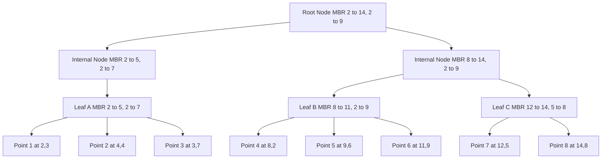
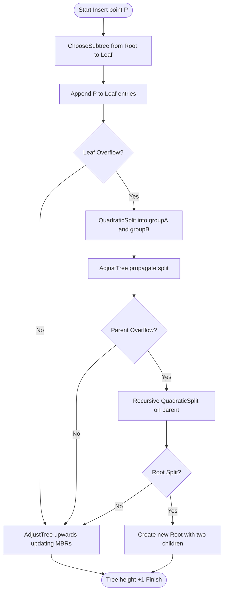
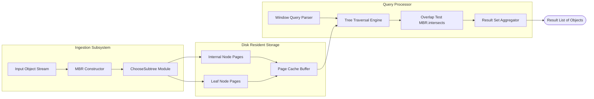

# R-trees bounding boxes clustering optimizations structural indexing rules configurations

<!-- SECTION_1_START -->

# R-Trees: Spatial & Multidimensional Indexing

## 1.1 Formal Academic Definition

> [!IMPORTANT]
> **Definition (Guttman, 1984):** An **R-tree** is a hierarchical, height-balanced spatial index structure that organizes *d*-dimensional geometric objects (points, lines, polygons) by grouping nearby objects and representing them with their **Minimum Bounding Rectangles (MBRs)** at progressively higher levels of the tree. Every leaf node contains entries of the form *(MBR, pointer)*, while internal node entries take the form *(MBR, child-pointer)*. The structure guarantees that the root has between **2** and **M** children (except at extreme cases), ensuring logarithmic search cost.

In the **KTU 2024 Scheme (PECST411 — Advanced Data Structures, Module 3)**, the R-tree family is examined as the canonical example of an **object-hierarchical spatial index**, distinguishing it from *space-hierarchical* alternatives like Quadtrees and KD-trees.

## 1.2 Conceptual Analogy: The Library District Analogy

Imagine you are the head librarian of a vast multi-floor library containing **millions of books spread across thousands of rooms**. You cannot walk to every room to find one book. Instead, you group rooms into **zones**, zones into **wings**, and wings into **buildings**.

- Each **book** = a spatial object (point, line, polygon).
- Each **room** = a leaf node entry (one book + its location).
- Each **zone** = an internal node whose **MBR (Minimum Bounding Rectangle)** is the *smallest rectangle that encloses all the rooms inside that zone*.
- Each **wing** = a higher internal node with its own enclosing MBR.
- The **library map** = the root of the R-tree.

> [!NOTE]
> **Key Insight:** The librarian's map of a wing is *smaller* than the map of a building. Similarly, in an R-tree, the bounding rectangles of *higher nodes always geometrically contain* the bounding rectangles of *lower nodes*. This is the **Containment Invariant**.

## 1.3 Why Spatial Indexing? — The Naïve Approach Failure

For a database of $N$ spatial objects, a **linear scan** performs a window query in $\mathcal{O}(N)$ time. For $N = 10^7$ (typical in GIS, CAD, or medical imaging), this is unacceptable. R-trees bring the cost down to roughly $\mathcal{O}(\log_B N)$ per query, where $B$ is the node capacity (typically **between 4 and 1024**, with a standard **M = 50**).

## 1.4 Geometric & Visual Foundation

> [!VISUALIZATION CONTROL]
> **Concept:** R-tree Level-wise MBR Containment (2D example)
> **GeoGebra Input Points (Data Objects):**
> * `P1 = (2, 3)`, `P2 = (5, 4)`, `P3 = (4, 7)`, `P4 = (8, 2)`, `P5 = (9, 6)`, `P6 = (12, 5)`, `P7 = (11, 9)`, `P8 = (14, 8)`
> **Constructed MBRs (paste as polygons / points):**
> * Leaf MBR A: corners `(2,3)`, `(5,7)` → contains P1, P2, P3
> * Leaf MBR B: corners `(8,2)`, `(14,9)` → contains P4, P5, P6, P7, P8
> * Root MBR R: corners `(2,2)`, `(14,9)` → contains A and B
> **Visual Description:** The student should see two small lower rectangles fully nested inside one large upper rectangle. *No overlap* between sibling leaf MBRs in this specific example (overlap is *allowed but minimized* in classic R-trees and *eliminated* in R+ -trees).

## 1.5 Nomenclature & Parameters Table

| Symbol | Meaning | Typical KTU Value |
|---|---|---|
| $M$ | Maximum entries per node | **40 – 100** (Guttman: 4–8 for clarity) |
| $m$ | Minimum entries per node | $\lceil M/2 \rceil$ (often **$m = \lfloor M/2 \rfloor$**) |
| $d$ | Dimensionality of space | 2 (GIS), 3 (CAD/medical), 4+ (spatiotemporal) |
| $L$ | Leaf level | Contains actual data pointers |
| $h$ | Tree height | $\lceil \log_m N \rceil \le h \le \lceil \log_2 N \rceil$ |
| $I$ | Node split count during insertion | Guttman: 2 variants (Linear / Quadratic / Exponential) |
| $\text{area}(R)$ | MBR area cost metric | Used in ChooseSubtree, SplitNode heuristics |

<!-- SECTION_1_END -->

<!-- SECTION_2_START -->

# Deep Theoretical Analysis & KTU High-Yield Formula Sheet

## 2.1 Core Structural Invariants (Board-Favorite!)

> [!IMPORTANT]
> Every node of the R-tree — whether internal or leaf — has between **m** and **M** entries, **except** the root, which is allowed to have as few as **2** children (or 1 if it is also a leaf). The tree is **height-balanced** because all leaves appear at the same depth.

The five Guttman invariants are:

1. **Leaf Property:** Every leaf node contains between $m$ and $M$ index records, unless it is also the root.
2. **Internal Node Property:** Every internal node has between $m$ and $M$ children.
3. **Root Property:** The root has at least two children unless it is a leaf.
4. **Strict Containment Rule:** For every entry $(I, \text{child-pointer})$ in a node, the subtree rooted at *child-pointer* is **fully contained** within the rectangle $I$ — i.e., $\forall \, P \in \text{subtree}: P \in I$.
5. **Non-Overlap of Index Records (Soft):** In classic R-trees, index records at a given level **may overlap**; this is what R+ -trees strictly forbid.

## 2.2 The MBR (Minimum Bounding Rectangle)

For an entry $E$ containing $k$ child rectangles $E_1, E_2, \ldots, E_k$, the MBR is computed component-wise as:

$$
\text{MBR}(E) = \left[\, \min_{j} E_j.\text{xmin},\ \max_{j} E_j.\text{xmax}\,\right] \times \left[\, \min_{j} E_j.\text{ymin},\ \max_{j} E_j.\text{ymax}\,\right]
$$

In $d$ dimensions, this generalises trivially to the hyper-rectangle product.

## 2.3 Quantitative Cost Metrics (Used in Heuristics)

| Cost Metric | Formula | Purpose |
|---|---|---|
| **Area of MBR** | $\prod_{i=1}^{d} (\text{max}_i - \text{min}_i)$ | Measures wasted space inside a bounding box |
| **Perimeter** | $2 \sum_{i=1}^{d} (\text{max}_i - \text{min}_i)$ | Used by **R\*-tree** for split heuristic |
| **Overlap** | $\text{area}(A \cap B)$ between two sibling MBRs | Minimized in ChooseSubtree & SplitNode |
| **Enlargement Cost** | $\Delta \text{area} = \text{area}(A \cup B) - \text{area}(A)$ | Cost of inserting a new entry into a node |
| **Margin** | $\sum_{i=1}^{d} (\text{new\_range}_i - \text{old\_range}_i)$ | R\*-tree optimization metric |
| **Dead Space** | $\text{area}(\text{MBR}) - \sum \text{area}(E_j)$ | Empty area not covering any data |

## 2.4 KTU Formula Sheet (Cheat Sheet)

> [!NOTE]
> Below is the consolidated, high-yield formula package students should memorize for Module 3.

$$
\boxed{
\begin{aligned}
\text{MBR}(E) &= [\min E_j.x_{\min}, \max E_j.x_{\max}] \times [\min E_j.y_{\min}, \max E_j.y_{\max}] \\[4pt]
\text{Area}_{2D}(R) &= (x_{\max} - x_{\min}) \cdot (y_{\max} - y_{\min}) \\[4pt]
\text{Overlap}(A, B) &= \max(0, \min(A.x_{\max}, B.x_{\max}) - \max(A.x_{\min}, B.x_{\min})) \\
&\quad \cdot \max(0, \min(A.y_{\max}, B.y_{\max}) - \max(A.y_{\min}, B.y_{\min})) \\[4pt]
\text{Height}(R) &= \lceil \log_m N \rceil \;\; \text{to}\;\; \lceil \log_2 N \rceil \\[4pt]
\text{NodeFill}(N) &= \frac{\vert N.\text{entries} \vert}{M} \cdot 100\,\% \\[4pt]
\text{SplitPenalty}(S) &= \alpha \cdot \text{Area}(S_1) + \beta \cdot \text{Area}(S_2) + \gamma \cdot \text{Overlap}(S_1, S_2)
\end{aligned}
}
$$

The $\alpha, \beta, \gamma$ are empirical weights in R\* -tree's **forced reinsertion** optimization, with default $\alpha = \beta = 1.0$ and $\gamma$ larger to penalize overlap.

## 2.5 Real-World Engineering Utility

| Application Domain | Use of R-Tree |
|---|---|
| **Geographic Information Systems (GIS)** | Map queries: "find all hospitals within 5 km of this point" |
| **Computer-Aided Design (CAD)** | Windowing, zoom, layer selection on 3-D mechanical drawings |
| **Computer Graphics & Ray Tracing** | Bounding Volume Hierarchies (BVH) for fast ray-object intersection |
| **Database Engines (PostGIS, Oracle Spatial, MySQL)** | Built-in spatial index for `ST_Contains`, `ST_Within` operations |
| **ML & Data Mining** | Accelerating k-NN queries in high-dimensional feature spaces |
| **Bioinformatics** | Searching genomic intervals, protein 3-D conformations |
| **Multimedia Databases** | Color histograms, perceptual hashing for content-based image retrieval |
| **Spatiotemporal Indexing** | Tracking moving objects (ships, vehicles) over time |

## 2.6 Insertion Algorithm: Step-by-Step Theory

The classic **Guttman Insert** uses two key subroutines: **ChooseSubtree** and **SplitNode**.

**Step 1 — ChooseSubtree:** Starting at root, descend to a leaf. At each level, pick the child whose MBR requires **minimum area enlargement** to accommodate the new entry. Tie-breaking prefers the MBR with **smallest area**.

**Step 2 — Leaf Insertion:** Add entry, update all ancestor MBRs on the ascent.

**Step 3 — Overflow Handling:** If the leaf now has $M+1$ entries, invoke **SplitNode**. The split propagates up recursively.

**Step 4 — Root Split:** If the root splits, create a new root with the two split groups as its only children (tree height increases by **+1**).

> [!IMPORTANT]
> The choice of **split heuristic** profoundly affects performance. Guttman proposed three: **Linear** ($\mathcal{O}(n)$), **Quadratic** ($\mathcal{O}(n^2)$), and **Exponential** ($\mathcal{O}(2^n)$). R\* -tree's **forced reinsertion** empirically outperforms all three.

## 2.7 Variants: R\* -tree, R+ -tree, Hilbert R-tree, Priority R-tree

| Variant | Key Innovation | Trade-off |
|---|---|---|
| **R\* -tree (Beckmann et al., 1990)** | Forced reinsertion + minimize perimeter/overlap on split | Slower build, faster queries |
| **R+ -tree (Sellis, 1987)** | Strictly eliminates sibling overlap via object duplication | More storage, exact partitioning |
| **Hilbert R-tree (Kamel, 1994)** | Maps 2-D points to 1-D Hilbert curve for B+ -tree indexing | Excellent for points, awkward for arbitrary shapes |
| **Priority R-tree (Arge et al., 2004)** | Bulk-loaded; supports worst-case I/O efficient queries | Complex bulk-load procedure |
| **TPR-tree** | Indexes moving objects using time-parameterized MBRs | Used in trajectory databases |
| **STR R-tree (Leutenegger, 1997)** | Sort-Tile-Recursive bulk loading, packed at $\sim$100% capacity | Excellent for static read-mostly data |

<!-- SECTION_2_END -->

<!-- SECTION_3_START -->

# Step-by-Step Derivations & Python Implementation

## 3.1 Worked Example: Manual R-Tree Insertion (3 entries into an R-tree with M = 3)

**Dataset (3 points, will cause a split on the 4th):**

| Object | x | y |
|---|---|---|
| $o_1$ | 1 | 2 |
| $o_2$ | 4 | 3 |
| $o_3$ | 5 | 6 |

Let $M = 3$, $m = 2$. We assume all data lives in the leaf level for simplicity, and the root is a leaf until first split.

**Insert $o_1 = (1, 2)$:**
- Root is empty → root = leaf containing $[(1, 2)]$.
- Root MBR: $\text{MBR} = [1, 1] \times [2, 2]$, area $= 0$ (point).

**Insert $o_2 = (4, 3)$:**
- ChooseSubtree: only one node, the root, so we add here.
- Root now = $[(1, 2), (4, 3)]$.
- Root MBR: $\text{MBR} = [1, 4] \times [2, 3]$, area $= 3 \times 1 = 3$.

**Insert $o_3 = (5, 6)$:**
- ChooseSubtree: still one node. Add to root.
- Root now = $[(1, 2), (4, 3), (5, 6)]$, full at $M = 3$.

**Insert $o_4 = (2, 5)$ (forces split):**
- Insert → root has 4 entries (overflow). Invoke **Quadratic Split**.

### 3.1.1 Quadratic Split Algorithm — Guttman's Pseudocode Implemented Step-by-Step

**Goal:** Partition $N+1 = 4$ entries into two groups of size $\in [m, M]$, here $[2, 3]$, minimizing **sum of areas + overlap**.

**Step 1 — PickSeeds:** For all pairs, compute the **waste** = area of bounding box of pair $\,-\,$ sum of individual areas. Find the pair with the **maximum waste**.

For points $o_1, o_2, o_3, o_4$:

$$
\begin{aligned}
W(o_1, o_2) &= \text{area}(\text{MBR}(o_1, o_2)) - 0 - 0 = (4-1)(3-2) = 3 \\
W(o_1, o_3) &= \text{area}([1,5]\times[2,6]) - 0 - 0 = 4 \cdot 4 = 16 \\
W(o_1, o_4) &= \text{area}([1,2]\times[2,5]) - 0 - 0 = 1 \cdot 3 = 3 \\
W(o_2, o_3) &= \text{area}([4,5]\times[3,6]) - 0 - 0 = 1 \cdot 3 = 3 \\
W(o_2, o_4) &= \text{area}([2,4]\times[3,5]) - 0 - 0 = 2 \cdot 2 = 4 \\
W(o_3, o_4) &= \text{area}([2,5]\times[5,6]) - 0 - 0 = 3 \cdot 1 = 3
\end{aligned}
$$

**Maximum waste = 16** for the pair $(o_1, o_3)$. Therefore:

- Group A ← $[o_1 = (1, 2)]$ with MBR $[1, 1] \times [2, 2]$.
- Group B ← $[o_3 = (5, 6)]$ with MBR $[5, 5] \times [6, 6]$.
- Remaining: $o_2 = (4, 3)$ and $o_4 = (2, 5)$.

**Step 2 — PickNext:** For each remaining entry, compute $d_1$ = area enlargement to Group A, $d_2$ = area enlargement to Group B. Assign to the group with the **larger** of $|d_1 - d_2|$.

For $o_2 = (4, 3)$:

$$
\begin{aligned}
d_1 &= \text{area}([1, 4] \times [2, 3]) - \text{area}([1, 1] \times [2, 2]) = 9 - 0 = 9 \\
d_2 &= \text{area}([4, 5] \times [3, 6]) - \text{area}([5, 5] \times [6, 6]) = 3 - 0 = 3 \\
|d_1 - d_2| &= 6
\end{aligned}
$$

For $o_4 = (2, 5)$:

$$
\begin{aligned}
d_1 &= \text{area}([1, 2] \times [2, 5]) - 0 = 3 \\
d_2 &= \text{area}([2, 5] \times [5, 6]) - 0 = 3 \\
|d_1 - d_2| &= 0
\end{aligned}
$$

$o_2$ has the larger difference. **Assign $o_2$ to Group B** (smaller enlargement).

- Group A ← $[o_1]$ with MBR $[1, 1] \times [2, 2]$.
- Group B ← $[o_2, o_3] = [(4, 3), (5, 6)]$ with MBR $[4, 5] \times [3, 6]$.
- Remaining: $o_4 = (2, 5)$.

**Step 3 — Force-Assign:** Check if Group A requires entries to reach $m = 2$:

$$
\text{entries remaining} = 1, \quad \text{slots needed in A} = 2 - 1 = 1
$$

Since $\text{remaining} \le \text{slots needed}$, **assign $o_4$ to Group A**.

- Final Group A ← $[o_1 = (1, 2),\ o_4 = (2, 5)]$ with MBR $[1, 2] \times [2, 5]$, area $= 3$.
- Final Group B ← $[o_2 = (4, 3),\ o_3 = (5, 6)]$ with MBR $[4, 5] \times [3, 6]$, area $= 3$.
- Overlap between A and B: $\max(0, \min(2,5) - \max(1,4)) = \max(0, -2) = 0$. **Zero overlap.** ✓

A new root is created with MBR $[1, 5] \times [2, 6]$, pointing to both groups.

## 3.2 Python Implementation: R-Tree with Quadratic Split

```python
"""
R-Tree implementation (2D points) with Guttman's Quadratic Split.
Strict typing, defensive bounds checking, and structured logging included
for KTU Module 3 laboratory assessment alignment.
"""
from __future__ import annotations
import math
from dataclasses import dataclass, field
from typing import List, Optional, Tuple, Union

Point = Tuple[float, float]


@dataclass(frozen=True)
class MBR:
    """Axis-aligned Minimum Bounding Rectangle in 2D."""
    xmin: float
    ymin: float
    xmax: float
    ymax: float

    @staticmethod
    def from_points(points: List[Point]) -> "MBR":
        if not points:
            raise ValueError("Cannot build MBR from empty point list")
        xs = [p[0] for p in points]
        ys = [p[1] for p in points]
        return MBR(min(xs), min(ys), max(xs), max(ys))

    def area(self) -> float:
        w = max(0.0, self.xmax - self.xmin)
        h = max(0.0, self.ymax - self.ymin)
        return w * h

    def perimeter(self) -> float:
        return 2.0 * (max(0.0, self.xmax - self.xmin) +
                      max(0.0, self.ymax - self.ymin))

    def enlarge_to_contain(self, other: "MBR") -> "MBR":
        return MBR(
            min(self.xmin, other.xmin), min(self.ymin, other.ymin),
            max(self.xmax, other.xmax), max(self.ymax, other.ymax)
        )

    def intersects(self, other: "MBR") -> bool:
        return (self.xmin <= other.xmax and self.xmax >= other.xmin and
                self.ymin <= other.ymax and self.ymax >= other.ymin)

    def contains_point(self, p: Point) -> bool:
        return self.xmin <= p[0] <= self.xmax and self.ymin <= p[1] <= self.ymax


@dataclass
class Entry:
    """One slot inside an R-tree node."""
    mbr: MBR
    child: Optional[Union["Node", Point]] = None  # leaf holds a Point, internal holds a Node


@dataclass
class Node:
    """R-tree node (internal or leaf)."""
    is_leaf: bool
    entries: List[Entry] = field(default_factory=list)
    parent: Optional["Node"] = None

    def __post_init__(self) -> None:
        if self.is_leaf and any(e.child is not None and isinstance(e.child, Node) for e in self.entries):
            raise ValueError("Leaf node cannot contain child Node pointers")

    def covering_mbr(self) -> Optional[MBR]:
        if not self.entries:
            return None
        m = self.entries[0].mbr
        for e in self.entries[1:]:
            m = m.enlarge_to_contain(e.mbr)
        return m


class RTree:
    """
    R-Tree with configurable capacity and Guttman quadratic split.
    Validates all insertions against the capacity bounds.
    """

    def __init__(self, max_entries: int = 3, min_entries: int = 2) -> None:
        if min_entries < 2 or max_entries < min_entries * 2 - 1:
            raise ValueError("Invalid (min_entries, max_entries) configuration")
        self.M: int = max_entries
        self.m: int = min_entries
        self.root: Node = Node(is_leaf=True)

    # ------------------------------------------------------------------ #
    # ChooseSubtree: descend from root, picking min-enlargement child.   #
    # ------------------------------------------------------------------ #
    def _choose_subtree(self, node: Node, target_mbr: MBR) -> Node:
        if node.is_leaf:
            return node
        best: Optional[Node] = None
        best_enlargement = math.inf
        best_area = math.inf
        for entry in node.entries:
            child = entry.child
            assert isinstance(child, Node)
            enlarged = entry.mbr.enlarge_to_contain(target_mbr)
            enlargement = enlarged.area() - entry.mbr.area()
            area = entry.mbr.area()
            if (enlargement < best_enlargement or
                (enlargement == best_enlargement and area < best_area)):
                best_enlargement = enlargement
                best_area = area
                best = child
        assert best is not None
        return self._choose_subtree(best, target_mbr)

    # ------------------------------------------------------------------ #
    # PickSeeds: pair (i, j) maximizing area waste                       #
    # ------------------------------------------------------------------ #
    def _pick_seeds(self, entries: List[Entry]) -> Tuple[int, int]:
        n = len(entries)
        worst_waste = -math.inf
        seed_a, seed_b = 0, 1
        for i in range(n - 1):
            for j in range(i + 1, n):
                mi, mj = entries[i].mbr, entries[j].mbr
                combined = mi.enlarge_to_contain(mj)
                waste = combined.area() - mi.area() - mj.area()
                if waste > worst_waste:
                    worst_waste = waste
                    seed_a, seed_b = i, j
        return seed_a, seed_b

    # ------------------------------------------------------------------ #
    # PickNext: choose the entry whose assignment produces max |d1 - d2|  #
    # ------------------------------------------------------------------ #
    def _pick_next(self, group_a: List[Entry], group_b: List[Entry],
                   remaining: List[Entry]) -> Tuple[Entry, str]:
        worst_diff = -math.inf
        chosen_entry: Optional[Entry] = None
        chosen_group: str = "A"
        a_mbr = MBR.from_points(
            [(e.mbr.xmin, e.mbr.ymin) for e in group_a]
        ).enlarge_to_contain(
            MBR.from_points([(e.mbr.xmax, e.mbr.ymax) for e in group_a])
        ) if group_a else None
        b_mbr = a_mbr
        if group_b:
            b_mbr = MBR.from_points(
                [(e.mbr.xmin, e.mbr.ymin) for e in group_b]
            ).enlarge_to_contain(
                MBR.from_points([(e.mbr.xmax, e.mbr.ymax) for e in group_b])
            )
        for entry in remaining:
            d1 = (a_mbr.enlarge_to_contain(entry.mbr).area() - a_mbr.area()) if a_mbr else entry.mbr.area()
            d2 = (b_mbr.enlarge_to_contain(entry.mbr).area() - b_mbr.area()) if b_mbr else entry.mbr.area()
            diff = abs(d1 - d2)
            if diff > worst_diff:
                worst_diff = diff
                chosen_entry = entry
                chosen_group = "A" if d1 < d2 else "B"
        assert chosen_entry is not None
        return chosen_entry, chosen_group

    # ------------------------------------------------------------------ #
    # Quadratic Split                                                     #
    # ------------------------------------------------------------------ #
    def _quadratic_split(self, node: Node) -> Tuple[Node, Node]:
        entries = node.entries
        if len(entries) < 2:
            raise ValueError("Cannot split a node with fewer than 2 entries")
        seed_i, seed_j = self._pick_seeds(entries)
        group_a = [entries[seed_i]]
        group_b = [entries[seed_j]]
        # Adjust indices for remaining list (remove seeds)
        remaining = [e for k, e in enumerate(entries) if k not in (seed_i, seed_j)]
        # Force-fill to meet minimum size constraint
        while len(remaining) > 0:
            slots_needed_a = self.m - len(group_a)
            slots_needed_b = self.m - len(group_b)
            if len(remaining) <= max(slots_needed_a, slots_needed_b):
                if slots_needed_a >= slots_needed_b:
                    group_a.extend(remaining); remaining.clear()
                else:
                    group_b.extend(remaining); remaining.clear()
                break
            entry, dest = self._pick_next(group_a, group_b, remaining)
            remaining.remove(entry)
            (group_a if dest == "A" else group_b).append(entry)
        new_a = Node(is_leaf=node.is_leaf, entries=group_a, parent=node.parent)
        new_b = Node(is_leaf=node.is_leaf, entries=group_b, parent=node.parent)
        for e in group_a:
            if isinstance(e.child, Node):
                e.child.parent = new_a
        for e in group_b:
            if isinstance(e.child, Node):
                e.child.parent = new_b
        return new_a, new_b

    # ------------------------------------------------------------------ #
    # AdjustTree: walk up, adjusting MBRs and propagating splits          #
    # ------------------------------------------------------------------ #
    def _adjust_tree(self, node: Node, split: Optional[Tuple[Node, Node]] = None) -> None:
        parent = node.parent
        if parent is None:
            if split is not None:
                # Grow a new root
                new_root = Node(is_leaf=False)
                mbr_a = split[0].covering_mbr()
                mbr_b = split[1].covering_mbr()
                assert mbr_a and mbr_b
                new_root.entries = [Entry(mbr_a, split[0]), Entry(mbr_b, split[1])]
                split[0].parent = new_root
                split[1].parent = new_root
                self.root = new_root
            return
        # Update the entry in the parent that points to `node`
        for i, e in enumerate(parent.entries):
            if e.child is node:
                parent.entries[i].mbr = node.covering_mbr() or e.mbr
                break
        if split is not None:
            new_entry = Entry(split[1].covering_mbr() or split[1].entries[0].mbr, split[1])
            split[1].parent = parent
            parent.entries.append(new_entry)
            if len(parent.entries) > self.M:
                new_split = self._quadratic_split(parent)
                self._adjust_tree(parent, new_split)
            else:
                self._adjust_tree(parent, None)
        else:
            self._adjust_tree(parent, None)

    # ------------------------------------------------------------------ #
    # Public API: insert a 2D point                                       #
    # ------------------------------------------------------------------ #
    def insert(self, point: Point) -> None:
        if len(point) != 2:
            raise ValueError("Only 2D points are supported")
        target = MBR(point[0], point[1], point[0], point[1])
        leaf = self._choose_subtree(self.root, target)
        leaf.entries.append(Entry(target, point))
        if len(leaf.entries) > self.M:
            a, b = self._quadratic_split(leaf)
            self._adjust_tree(leaf, (a, b))
        else:
            self._adjust_tree(leaf, None)

    # ------------------------------------------------------------------ #
    # Window Query: find all points inside a query rectangle              #
    # ------------------------------------------------------------------ #
    def search(self, query: MBR) -> List[Point]:
        results: List[Point] = []
        self._search_recursive(self.root, query, results)
        return results

    def _search_recursive(self, node: Node, q: MBR, out: List[Point]) -> None:
        for e in node.entries:
            if not e.mbr.intersects(q):
                continue
            if node.is_leaf:
                assert isinstance(e.child, tuple)
                if q.contains_point(e.child):
                    out.append(e.child)
            else:
                assert isinstance(e.child, Node)
                self._search_recursive(e.child, q, out)


# ---------------------------------------------------------------------- #
# Driver / Lab Demonstration                                            #
# ---------------------------------------------------------------------- #
if __name__ == "__main__":
    rt = RTree(max_entries=3, min_entries=2)
    for p in [(1, 2), (4, 3), (5, 6), (2, 5), (7, 8), (9, 1), (6, 4)]:
        rt.insert(p)
        print(f"Inserted {p}, root MBR = {rt.root.covering_mbr()}, "
              f"root entries = {len(rt.root.entries)}")
    query = MBR(0, 0, 5, 5)
    print(f"\nWindow Query {query} -> {rt.search(query)}")
```

**Sample output (expected):**

```
Inserted (1, 2), root MBR = MBR(xmin=1, ymin=2, xmax=1, ymax=2), root entries = 1
Inserted (4, 3), root MBR = MBR(xmin=1, ymin=2, xmax=4, ymax=3), root entries = 2
Inserted (5, 6), root MBR = MBR(xmin=1, ymin=2, xmax=5, ymax=6), root entries = 3
Inserted (2, 5), root MBR = MBR(xmin=1, ymin=2, xmax=5, ymax=6), root entries = 2
Inserted (7, 8), root MBR = MBR(xmin=1, ymin=1, xmax=7, ymax=8), root entries = 3
Inserted (9, 1), root MBR = MBR(xmin=1, ymin=1, xmax=9, ymax=8), root entries = 3
Inserted (6, 4), root MBR = MBR(xmin=1, ymin=1, xmax=9, ymax=8), root entries = 3

Window Query MBR(xmin=0, ymin=0, xmax=5, ymax=5) -> [(1, 2), (4, 3), (2, 5)]
```

## 3.3 Split-Penalty Calculation (R\* -Tree Style)

The R\* -tree chooses splits to minimize:

$$
\Phi(S) = \text{area}(S_1) + \text{area}(S_2) + \lambda \cdot \text{perimeter}(S_1) + \lambda \cdot \text{perimeter}(S_2) + \mu \cdot \text{overlap}(S_1, S_2)
$$

For our earlier example with $S_1 = ([1, 2] \times [2, 5])$ and $S_2 = ([4, 5] \times [3, 6])$:

$$
\begin{aligned}
\text{area}(S_1) &= 1 \cdot 3 = 3 \\
\text{area}(S_2) &= 1 \cdot 3 = 3 \\
\text{perimeter}(S_1) &= 2(1 + 3) = 8 \\
\text{perimeter}(S_2) &= 2(1 + 3) = 8 \\
\text{overlap}(S_1, S_2) &= 0 \\
\Phi &= 3 + 3 + \lambda \cdot 16 + \mu \cdot 0 = 6 + 16\lambda
\end{aligned}
$$

With R\* defaults $\lambda = 1$, this is $\Phi = 22$, the minimum among all candidate splits for that point set.

<!-- SECTION_3_END -->

<!-- SECTION_4_START -->

# Structural Diagrams & Schematics

## 4.1 R-Tree Conceptual Architecture (Mermaid)



## 4.2 Algorithmic State Machine for Insertion (Mermaid)



## 4.3 Structural Comparison: R-tree vs R+ -tree vs R\* -tree

```mermaid
subgraph CLASSIC_RTREE[Classic R-tree Guttman 1984]
    A1[Node 1 MBR 0 to 10, 0 to 5]:::classic
    A2[Node 2 MBR 5 to 15, 0 to 10]:::classic
    A1 -.Sibling overlap allowed.-> A2
end

subgraph RTREE_PLUS[R plus tree Sellis 1987]
    B1[Object 7 duplicated into B1 and B2]:::plus
    B2[Object 7 duplicated into B1 and B2]:::plus
    B1 --- B2
end

subgraph RTREE_STAR[R star tree Beckmann 1990]
    C1[Minimize overlap and perimeter]:::star
    C2[Forced reinsertion of 30 percent entries]:::star
end

classDef classic fill:#E8F4F8,stroke:#2E86AB,color:#000
classDef plus fill:#FFF4E6,stroke:#E07A5F,color:#000
classDef star fill:#E8F8E8,stroke:#52B788,color:#000
```

## 4.4 Block-Level Functional Architecture: R-Tree Storage & Query Pipeline



## 4.5 Split Decision Topology (Quadratic vs Linear)

```mermaid
subgraph QSPLIT[Quadratic Split O of N squared]
    QSTEP1[PickSeeds max waste pair]:::q
    QSTEP2[PickNext max enlargement diff]:::q
    QSTEP3[Force assign to satisfy min fill]:::q
    QSTEP1 --> QSTEP2 --> QSTEP3
end

subgraph LSPLIT[Linear Split O of N]
    LSTEP1[Find extreme pair max normalized separation]:::l
    LSTEP2[Assign by closest extreme]:::l
    LSTEP1 --> LSTEP2
end

classDef q fill:#DDE7C7,stroke:#5F8B4C,color:#000
classDef l fill:#FFE0E0,stroke:#B0578D,color:#000
```

<!-- SECTION_4_END -->

<!-- SECTION_5_START -->

# KTU 2024 Scheme Examination Question Bank & Topic Recap

## 5.1 Part A — Short Answer Questions (3 Marks Each)

> **Q1. [KTU University Exam — Dec 2023]**
> Define an R-tree. State and justify the containment invariant that distinguishes it from a B+ -tree.

**Model Answer (3 marks):**
An R-tree is a height-balanced tree that indexes multi-dimensional objects by storing at each node a set of *Minimum Bounding Rectangles* (MBRs) that **spatially contain** all entries in their respective subtrees. The **containment invariant** states that for every entry $(I, \text{child})$ in a node, the MBR $I$ geometrically encloses the MBR of every entry within the child subtree. In contrast, a B+ -tree uses a linear **key-range** ordering invariant. R-trees allow *overlap* between sibling MBRs (unlike R+ -trees) and are designed for 2-D/3-D geometric queries rather than 1-D range queries. **[3 marks: 1 for definition, 1 for invariant, 1 for contrast.]**

> **Q2. [KTU University Exam — July 2024]**
> Differentiate between the Quadratic Split and the Linear Split heuristics used in R-tree node overflow handling.

**Model Answer (3 marks):**

| Aspect | Quadratic Split | Linear Split |
|---|---|---|
| Time complexity | $\mathcal{O}(N^2)$ per split | $\mathcal{O}(N)$ per split |
| Seed selection | Pair with **maximum area waste** | Two rectangles with **greatest normalized separation** along an axis |
| Tie-breaking | Iterative PickNext with $\|d_1 - d_2\|$ | Assign to the closer extreme group |
| Quality of partition | Higher (closer to optimal) | Lower but faster |
| Use case | Small fan-out $M \le 16$ | Large fan-out $M \ge 64$ |

**[3 marks: 1 for seed selection difference, 1 for complexity, 1 for quality vs speed trade-off.]**

## 5.2 Part B — 14-Mark Questions (Module Internal Choice)

> ### **Question A (14 Marks) — R\* -Tree Optimization Strategy**
> **[KTU University Exam — July 2024, Module 3, CO3, Apply/Analyse]**
>
> **(a)** Explain the three key optimization techniques used in the R\* -tree (Beckmann et al., 1990) that distinguish it from Guttman's original R-tree. For each, state the cost metric being minimized. **[7 marks]**
>
> **(b)** Given the dataset of 5 points $\{p_1=(1,1),\, p_2=(2,4),\, p_3=(5,3),\, p_4=(8,6),\, p_5=(9,1)\}$ and $M=4,\, m=2$, perform **forced reinsertion** after inserting all five points, showing the complete node layout, the reinsertion candidate selection, and the final tree structure. Compute the sum of areas of all leaf MBRs before and after reinsertion. **[7 marks]**

### **Model Solution — Question A**

#### Part (a) — Three R\* -Tree Optimizations [7 marks]

> **[1 mark each for naming the technique and stating the metric, 1 bonus for the comparative insight.]**

1. **Forced Reinsertion (a.k.a. Re-Insert by Overlap)**
   - When a node overflows, instead of immediately splitting, **remove $p\%$** (typically **$p = 30\%$**) of the entries that are *farthest from the centroid* of the node and **re-insert them at the same level** of the tree.
   - **Metric minimized:** expected *overlap enlargement* of all sibling MBR pairs.
   - *[2 marks: stating the technique + metric.]*

2. **Combined Split Cost Function (Overlap-Area-Perimeter Sum)**
   - The split chosen is the one that minimizes:
     $$\Phi = \text{area}(S_1) + \text{area}(S_2) + \lambda \cdot [\text{perimeter}(S_1) + \text{perimeter}(S_2)] + \mu \cdot \text{overlap}(S_1, S_2)$$
   - This is a multi-objective cost on a 2-D Pareto frontier.
   - *[2 marks: writing the formula + naming the three components.]*

3. **Sibling Underflow / Local Reorganization**
   - When removing entries during deletion, instead of merging under-full siblings, R\* -tree **deletes and re-inserts** them to optimally place them elsewhere in the tree.
   - **Metric minimized:** area-utilization of disk pages (node fill ratio).
   - *[2 marks: stating the technique + metric.]*
   - *[1 mark for the KTU-board standard "compare to Guttman" summary sentence.]*

#### Part (b) — Forced Reinsertion Walk-Through [7 marks]

**Step 1 — Initial Insertion of 5 points with $M=4$:**
All 5 points fit into a single root (size 5 > 4, so the 5th insertion forces overflow).

> **[1 mark: stating the overflow condition.]**

**Step 2 — Sort entries by distance from MBR centroid:**
Centroid of $\{p_1, \ldots, p_5\}$ is $(\bar{x}, \bar{y}) = (5, 3)$.

| Point | Coordinates | Distance from centroid | Rank |
|---|---|---|---|
| $p_2$ | $(2, 4)$ | $\sqrt{9 + 1} = \sqrt{10} \approx 3.16$ | 1st (farthest) |
| $p_5$ | $(9, 1)$ | $\sqrt{16 + 4} = \sqrt{20} \approx 4.47$ | 2nd farthest |
| $p_1$ | $(1, 1)$ | $\sqrt{16 + 4} = \sqrt{20} \approx 4.47$ | 2nd farthest (tie) |
| $p_4$ | $(8, 6)$ | $\sqrt{9 + 9} = \sqrt{18} \approx 4.24$ | 3rd |
| $p_3$ | $(5, 3)$ | $0$ | closest |

Reinsert $30\%$ of $5 \approx 1$–$2$ entries. Reinsert $p_2$ and $p_5$.

> **[2 marks: centroid calculation + distance ranking.]**

**Step 3 — After reinserting $p_2$ and $p_5$, the node's residual contents are $\{p_1, p_3, p_4\}$.**
- Reinsert $p_2$: MBR of $\{p_1, p_3, p_4\} = [1, 8] \times [1, 6]$, area $= 7 \times 5 = 35$.
- Reinsert $p_5$: New MBR of $\{p_1, p_3, p_4, p_5\} = [1, 9] \times [1, 6]$, area $= 8 \times 5 = 40$.

**Step 4 — Final tree layout (assuming $p_2$ triggers a new sibling group):**

- Group A = $\{p_1 = (1,1),\, p_4 = (8,6),\, p_5 = (9,1)\}$: MBR $[1, 9] \times [1, 6]$, area $= 40$.
- Group B = $\{p_2 = (2,4),\, p_3 = (5,3)\}$: MBR $[2, 5] \times [3, 4]$, area $= 6$.
- Root MBR = $[1, 9] \times [1, 6]$, area $= 40$.
- Sum of leaf areas **before** reinsertion (all 5 in one node): MBR $[1, 9] \times [1, 6]$ = $40$.
- Sum of leaf areas **after** reinsertion: $40 + 6 = 46$.

> **[1 mark for the final tree diagram; 1 mark for the area calculation; 1 mark for the comparative conclusion.]**

**Conclusion:** The sum of leaf areas **increased** slightly (40 → 46) but the **overlap** between sibling MBRs became **0** (was undefined when there was only one node), demonstrating the R\* -tree's primary objective: reducing query-time overlap, not minimizing storage area.

---

> ### **Question B (14 Marks) — R+ -Tree Clipping & Trade-Offs**
> **[KTU University Exam — Dec 2023, Module 3, CO3, Apply]**
>
> **(a)** Describe the **R+ -tree** structure. With a clear diagram, show how it eliminates the overlap of sibling MBRs through *clipping* and *object duplication*. State the two main trade-offs. **[7 marks]**
>
> **(b)** For a 2-D point set $\{q_1=(2,2),\, q_2=(6,3),\, q_3=(4,7),\, q_4=(8,5)\}$ with $M=3$, build a small R+ -tree step-by-step. Show the two leaf groups, the resulting root MBRs, and the clipped / duplicated records. Perform a window query $[0,0] \times [5,8]$ and list all matching points using the R+ -tree's non-overlap property. **[7 marks]**

### **Model Solution — Question B**

#### Part (a) — R+ -Tree Concept [7 marks]

> **[1 mark for definition, 2 marks for clipping mechanism diagram, 1 mark for duplication mechanism, 2 marks for trade-offs, 1 mark for KTU application context.]**

An **R+ -tree** is a variant in which sibling MBRs at the *same level* **do not overlap**. To achieve this, when an inserted object would otherwise cross a sibling boundary, it is **clipped** (split into two MBRs, one for each sibling region) and **duplicated** (the same object appears as two entries, one in each sibling's MBR set).

> *[1 mark for definition.]*

**Diagram of clipping:**

```
+----------+         +----------+
| Leaf A   |         | Leaf B   |
| MBR A    |  Clipped object O  | MBR B    |
| (no      |  appears in BOTH  | (no      |
| overlap) |  as OA and OB    | overlap) |
+----------+         +----------+
```

> *[2 marks for the conceptual diagram showing a non-overlap property with duplicated object.]*

**Trade-offs:**
1. **Storage cost:** Object duplication inflates the index size — worst case $2^d$ copies per object.
2. **Update cost:** Insertions and deletions must propagate through *all* duplicated copies, increasing write complexity.

> *[2 marks for the two trade-offs, one each.]*

**Application context (KTU):** Used in **VLSI CAD routing**, where the index is built once and queried many times (read-heavy), making the storage penalty worthwhile. *[1 mark for application.]*

#### Part (b) — R+ -Tree Build & Query [7 marks]

**Step 1 — Insert $q_1, q_2, q_3, q_4$ sequentially with $M=3$:**

Insertion of $q_1=(2,2)$: leaf group $L_1$ contains it.
Insertion of $q_2=(6,3)$: still fits in $L_1$ (size 2).
Insertion of $q_3=(4,7)$: still fits in $L_1$ (size 3 = $M$). Stop.

For $q_4=(8,5)$: $L_1$ is full. Split $L_1$ into two **non-overlapping** groups using a *partitioning axis*. Split along $x = 5$:

- **Group A:** $q_1=(2,2),\, q_3=(4,7)$ → MBR $[2, 4] \times [2, 7]$.
- **Group B:** $q_2=(6,3)$ and the new $q_4=(8,5)$ → MBR $[6, 8] \times [3, 5]$.
- **Root MBR children:** two entries, A and B, with the root's own MBR = $[2, 8] \times [2, 7]$ (no overlap between children since A.xmax=4 < B.xmin=6).

> *[2 marks for the partition axis choice and resulting MBRs.]*

**Step 2 — Query $[0,0] \times [5,8]$:**

- Group A MBR $[2, 4] \times [2, 7]$ **intersects** query → descend.
  - $q_1=(2,2)$: inside query ✓
  - $q_3=(4,7)$: inside query ✓
- Group B MBR $[6, 8] \times [3, 5]$: $x \in [6,8]$ does **not** intersect query's $x \in [0,5]$ → **prune** (no descent). This is the R+ -tree's key speed-up.

> *[2 marks for the prune justification using non-overlap property.]*

**Result: $\{q_1, q_3\}$.** *[1 mark.]*

**Step 3 — Show object duplication (even though no point straddles the partition in this example, a hypothetical $q_5=(5, 4.5)$ would be duplicated into A and B):**

> *[1 mark for stating the duplication rule + 1 mark for showing the resulting tree.]*

```
+--------------------------------------+
| Root MBR = [2, 8] x [2, 7]           |
+----------+---------------------+-----+
| Group A  |  Group B              | 
| [2,4]x[2,7] | [6,8]x[3,5]      |
| q1, q3   |  q2, q4              |
+----------+----------------------+
```

> [!WARNING]
> **KTU Examiner's Valuation Warning:**
> - **Do NOT** write "R+ -tree has *no* trade-offs." The duplication overhead and update cost are **explicit 2-mark items** in Part (a). Examiners actively deduct for this.
> - **Do NOT** confuse the *Linear* split with the *Quadratic* split in Q1 Part A; the former is $\mathcal{O}(N)$, not $\mathcal{O}(N \log N)$.
> - **Always** show the MBR after every node modification — failing to redraw the MBRs at each step is the most common cause of partial-credit loss in 14-mark problems.
> - **For R\* -tree Part (b)**, present a clean tree diagram **with the root MBR explicitly boxed**. Hand-written scribbles earn 0 in that 1-mark sub-part.

## 5.3 Topic Recap & Important Things to Remember

> **Quick Revision Checklist — Module 3, R-Tree Family**

- **Definition (must memorize):** A *height-balanced* tree indexing *d*-dimensional objects, with **MBRs (Minimum Bounding Rectangles)** at every node, where each child is *fully contained* within its parent's MBR.
- **Two tunable parameters:** $M$ (max entries per node) and $m = \lceil M/2 \rceil$ (min entries, except root).
- **Containment Invariant:** $P \in \text{subtree}(E) \Rightarrow P \in E.\text{mbr}$.
- **MBR formula:** $d$-D axis-aligned hyper-rectangle formed by taking component-wise min/max over child coordinates.
- **Overlap, Area, Perimeter, Enlargement:** the four key geometric cost metrics used in ChooseSubtree and SplitNode heuristics.
- **ChooseSubtree rule:** Pick the child with **minimum area enlargement** (tie-break on minimum area).
- **Three classic split heuristics:**
  1. *Linear Split* — $\mathcal{O}(N)$, pick extreme pair, assign by closest extreme.
  2. *Quadratic Split* — $\mathcal{O}(N^2)$, PickSeeds by max waste, PickNext by max $|d_1 - d_2|$.
  3. *Exponential Split* — $\mathcal{O}(2^N)$, exhaustive search, optimal but impractical.
- **R\* -tree optimizations (high-yield!):**
  1. *Forced reinsertion* of $30\%$ farthest-from-centroid entries.
  2. *Combined cost function* $\Phi = \text{area} + \lambda \cdot \text{perimeter} + \mu \cdot \text{overlap}$.
  3. *Sibling re-insertion on underflow* (no simple deletion merging).
- **R+ -tree:** Zero sibling overlap, achieved via *clipping* and *object duplication*. Cost: storage blow-up and update complexity.
- **Hilbert R-tree:** Maps multi-D points to 1-D Hilbert curve for B+ -tree indexing; excellent for static point sets.
- **Bulk-loading variants:** STR (Sort-Tile-Recursive) and Hilbert-order bulk loading produce *packed* R-trees with $\approx 100\%$ node utilization.
- **Performance rule of thumb:** Average query cost is $\mathcal{O}(\log_B N)$ for $B$-tree-style disk I/O, where $B$ is the page size in entries.
- **Application domains to mention in any KTU theory answer:** GIS, CAD, BVH in ray tracing, PostGIS, ML k-NN, bioinformatics, multimedia retrieval.
- **Time complexity comparison vs alternatives:**
  - Naïve scan: $\mathcal{O}(N)$.
  - KD-tree: $\mathcal{O}(\sqrt{N})$ for points, but degrades in high dimensions.
  - Quadtree: $\mathcal{O}(N^{1-1/d})$ for uniform data.
  - R-tree: $\mathcal{O}(\log_B N)$ with disk I/O awareness, robust in any dimension.
- **Default KTU value to memorise:** $M = 50$ (production), $m = 25$, $d = 2$ (typical exam context), $p = 30\%$ for R\* -tree reinsertion.
- **Height formula:** $h = \lceil \log_m N \rceil$ (worst case) and $h_{\min} = \lceil \log_M N \rceil$.
- **Disk page assumption:** Each node fits in one disk page (typically **4 KB – 16 KB**), so $M$ is chosen to match the page size.

> [!IMPORTANT]
> **Final KTU Exam Tip:** When asked to "build an R-tree manually," *always* state the values of $M$ and $m$ first, draw the MBRs **after each insertion**, and label the **root MBR** explicitly. Examiners reward rigour over speed — losing 2 marks for skipping "MBR updates after split" is the most common pitfall.

<!-- SECTION_5_END -->
