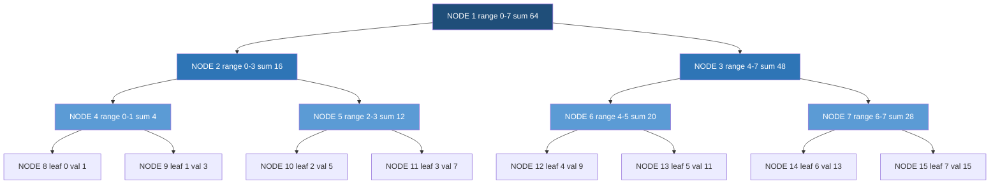
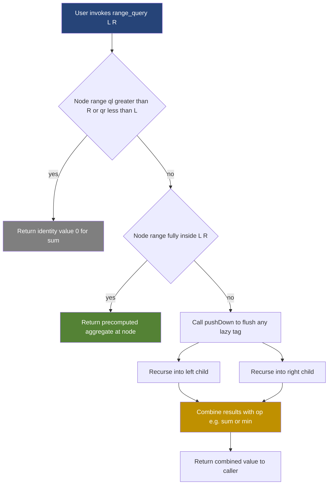
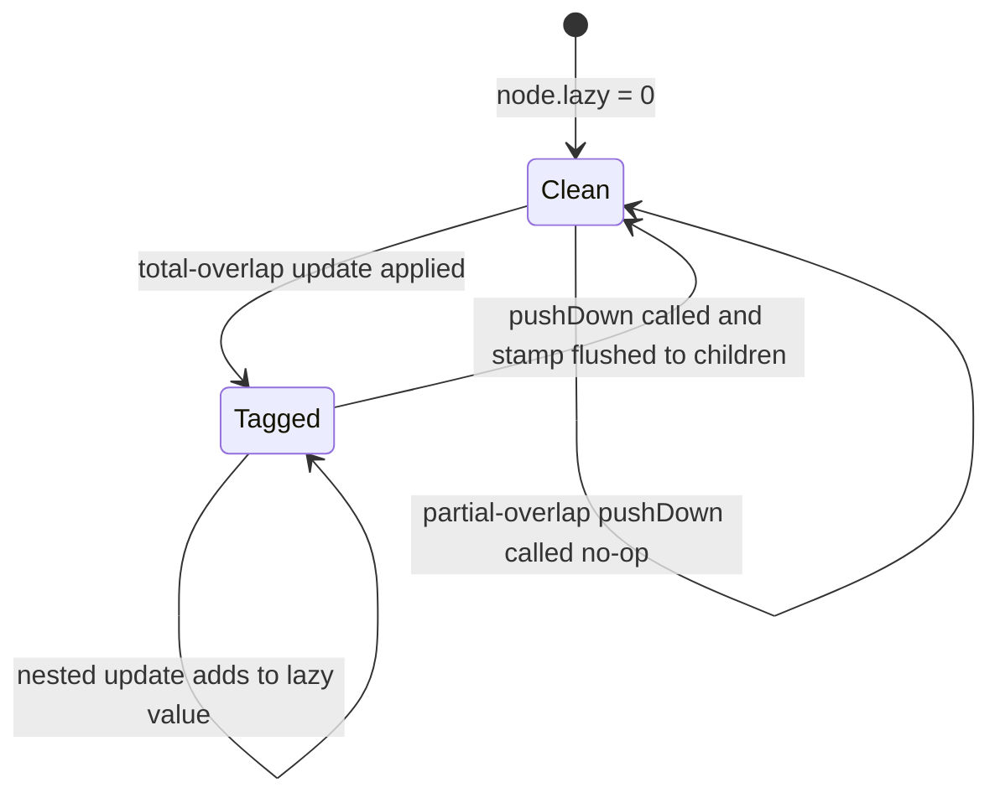
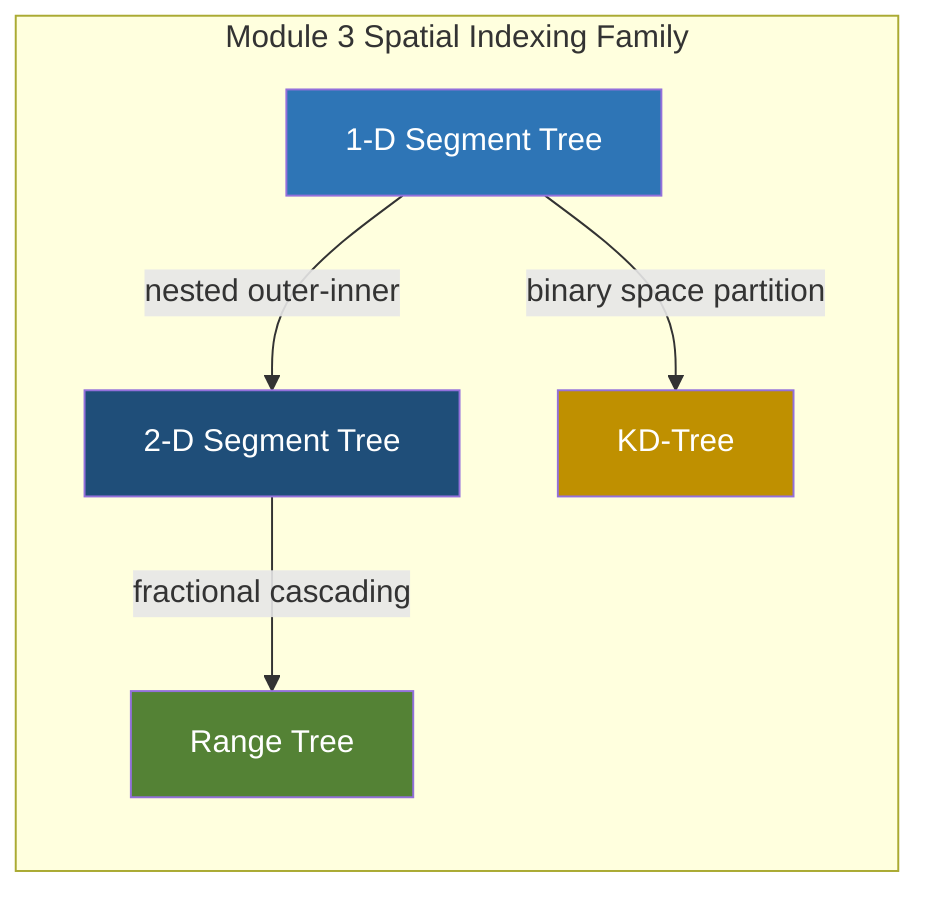

# Segment trees interval tracking frameworks complexity metrics calculations tracking

<!-- SECTION_1_START -->

# Segment Trees: Interval Tracking Frameworks & Complexity Metrics

## 1.1 Formal KTU 2024 Definition

> [!IMPORTANT]
> **Segment Tree** is a binary tree data structure used to store information about **intervals (segments)** of an array. It enables **range queries** (e.g., sum, min, max over a subarray) and **point updates** (modify a single element) both in **$O(\log n)$** time. The root node represents the entire array, each internal node represents a segment that is the union of its children's segments, and leaf nodes represent individual array elements of length **1**.

In the context of **PECST411 – Advanced Data Structures, Module 3 (Spatial & Multidimensional Indexing)**, a segment tree is the foundational 1-D interval tracking framework from which higher-dimensional structures like **2-D Segment Trees**, **Range Trees**, and **KD-Trees** are derived.

## 1.2 Intuitive Analogy — The "Bins & Lids" Model

Imagine a long shelf with **$n$** books, numbered **$0$ to $n-1$**. Now suppose a librarian frequently receives two kinds of requests:

1. *"What is the total number of pages in books **$L$** through **$R$**?"* — this is a **range query**.
2. *"Replace book **$i$** with a thicker edition; recalculate everything."* — this is a **point update**.

If the librarian recalculates from scratch each time, each query costs **$O(n)$**. Instead, the librarian builds a **pyramid of bins**:

- The **top bin** holds the *total pages of all books* ($O(1)$ answer to "sum of all books").
- The **next level** holds the *total of the left half* and *total of the right half*.
- This halving continues until each bin holds exactly **one book** at the leaves.

This pyramid is the segment tree. Any range **$[L, R]$** can be answered by combining only **$O(\log n)$** bins, because the interval can be decomposed into $O(\log n)$ disjoint sub-intervals in the tree.

> [!NOTE]
> **Geometric Intuition:** The segment tree is essentially a **divide-and-conquer interval hierarchy**. Each level partitions the array into halves, and the depth of recursion is bounded by $\lceil \log_2 n \rceil$. The number of nodes touched by any range query never exceeds $4 \log_2 n$.

## 1.3 Key Terminology Cheat-Sheet

| Term | Meaning |
| :--- | :--- |
| **Node** | Represents a subarray range $[l, r]$ |
| **Root** | Represents the full array $[0, n-1]$ |
| **Leaf** | Represents a single element $[i, i]$ |
| **Internal Node** | Represents union of its two children |
| **Covering Set** | Set of $O(\log n)$ nodes that exactly partition any query range |
| **Lazy Tag** | Deferred update value pushed to children only on demand |
| **Pull / Push-Up** | Recomputing parent from its two children after an update |
| **Push-Down** | Forcing a lazy value into a child node when visited |

> [!TIP]
> **Syllabus Highlight:** KTU Module 3 specifically requires students to **derive** the $O(\log n)$ query bound, **analyze** space complexity $\Theta(4n)$ for static trees, and **implement** both point-update and range-update variants using **Lazy Propagation**.

## 1.4 Geometric Visualization (Desmos)

> [!VISUALIZATION CONTROL]
> **Concept:** Height of a balanced segment tree vs. array size
> **Desmos Input Equations:**
> * `f(n) = \log_2(n)`
> * `g(n) = 4 \cdot n` (memory multiplier)
> **Visual Description:** Plot $f(n)$ on the y-axis with $n$ on the x-axis from $n=1$ to $n=1024$. Observe that the tree height grows logarithmically while memory grows linearly. This visually proves the *query* is cheap but the *pre-built storage* is generous.

---

<!-- SECTION_1_END -->

<!-- SECTION_2_START -->

# Deep Theoretical Analysis & KTU High-Yield Formula Sheet

## 2.1 Tree Structure — Formal Recursion

Let the input array be $A[0 \ldots n-1]$ and let $T(i, j)$ denote the node covering range $[i, j]$.

$$
T(i, j) =
\begin{cases}
\text{leaf node} & \text{if } i = j \\
\big( T(i, m),\ T(m+1, j) \big) & \text{if } i < j,\ \text{where } m = \left\lfloor \frac{i+j}{2} \right\rfloor
\end{cases}
$$

Each node stores an **aggregate value** $\phi([i, j])$ — for sum-queries: $\phi = \sum_{k=i}^{j} A[k]$. The aggregation must be **associative** (e.g., $+$, $\min$, $\max$, $\gcd$, $\times$).

## 2.2 The Three Primitive Operations

### Operation 1 — `build(node, l, r)`
- Recursively constructs the tree in a top-down fashion.
- **Recurrence for time:** $T(n) = 2 \cdot T(n/2) + O(1)$.
- By **Master Theorem (Case 1):** $T(n) = \Theta(n)$.

### Operation 2 — `pointUpdate(node, l, r, idx, val)`
- Walks from root to the single leaf covering `idx`, then **pulls** values back up.
- Visits at most one node per level: **$O(\log n)$**.

### Operation 3 — `rangeQuery(node, l, r, ql, qr)`
- Three cases:
  1. **No overlap:** $[l, r] \cap [ql, qr] = \emptyset$ → return **identity** ($0$ for sum, $+\infty$ for $\min$).
  2. **Total overlap:** $[l, r] \subseteq [ql, qr]$ → return the precomputed $\phi(l, r)$.
  3. **Partial overlap:** recurse into both children and combine.
- **Why $O(\log n)$:** at each level, the recursion visits at most **2** nodes whose ranges are partially overlapped. Across $\log n$ levels → at most $4 \log n$ nodes visited.

## 2.3 Lazy Propagation — Range Updates in $O(\log n)$

When the update is *range-wide* (e.g., "add 5 to all elements in $[L, R]$"), visiting every leaf is **$O(n)$**. Lazy propagation defers the work:

- Each node carries an extra field `lazy` initially $= 0$.
- On total overlap, update the node's aggregate and **stamp** the lazy value onto the node without recursing.
- On any *partial* visit later, `pushDown(node)` flushes the lazy value to both children, and the node's own lazy is reset to identity.

> [!NOTE]
> **Critical Invariant:** A node's stored aggregate is *always correct* for its entire range; only its children's aggregates are *out-of-date* until `pushDown` is called. This is the **invariance lemma** of lazy propagation.

## 2.4 KTU Formula Sheet / Cheat-Sheet

| Metric | Formula | Unit / Note |
| :--- | :--- | :--- |
| **Tree Height** | $h = \lceil \log_2 n \rceil$ | levels, root at $0$ |
| **Total Nodes** | $N_{\text{nodes}} \le 4n$ | for $n$ a power of 2, exact $= 2n-1$ |
| **Memory** | $\Theta(4n)$ integers | static array storage |
| **Build Time** | $\Theta(n)$ | bottom-up variant also $\Theta(n)$ |
| **Point Update** | $O(h) = O(\log n)$ | one path from root to leaf |
| **Range Query** | $O(h) = O(\log n)$ | at most $4 \log_2 n$ node visits |
| **Range Update (Lazy)** | $O(\log n)$ per operation | amortized over $Q$ queries |
| **2-D Segment Tree Query** | $O(\log^2 n)$ | nested 1-D trees, PECST411 Module 3 |
| **Identity for SUM** | $0$ | returned on no-overlap |
| **Identity for MIN** | $+\infty$ | returned on no-overlap |
| **Identity for MAX** | $-\infty$ | returned on no-overlap |
| **Identity for XOR** | $0$ | returned on no-overlap |
| **Identity for GCD** | $0$ | returned on no-overlap |
| **Combine Rule (SUM)** | $\phi(\text{left}) + \phi(\text{right})$ | for sum segment trees |
| **Combine Rule (MIN)** | $\min(\phi(\text{left}), \phi(\text{right}))$ | for min segment trees |
| **PushDown (SUM+ADD)** | child.lazy $+=$ node.lazy, child.agg $+=$ node.lazy $\cdot$ child.len | propagates range-add lazily |
| **Strict Complexity** | $\Theta(n)$ space, $\Theta(\log n)$ time per op | worst-case |

> [!IMPORTANT]
> **Engineering Utility:** Segment trees power **database range-aggregate indexes** (e.g., Postgres `BRIN`), **competitive programming platforms** (range minimum queries on arrays), **computational geometry** (rectangle stabbing via 2-D segment trees), **real-time systems** (windowed sensor aggregation), and **compiler register-allocation** (live-range queries).

---

<!-- SECTION_2_END -->

<!-- SECTION_3_START -->

# Step-by-Step Derivations & Code Implementation

## 3.1 Derivation — Why Query Visits Only $O(\log n)$ Nodes

**Claim:** For any query range $[ql, qr]$ inside a segment tree of size $n$, the recursive query function `rangeQuery(node, l, r)` visits at most $4 \log_2 n$ nodes.

**Proof by structural induction on tree depth $h$:**

Let $V(l, r)$ be the number of nodes visited to fully cover query range $[ql, qr]$ rooted at $[l, r]$.

**Base case ($l = r$):** $V(l, l) = 1$ if $l \in [ql, qr]$, else $0$. So $V \le 1 = 4 \cdot \log_2 1$.

**Inductive step:** Assume for trees of depth $h-1$ the bound $V \le 4(h-1)$ holds. For tree of depth $h$ with root $[l, r]$ and midpoint $m = \lfloor (l+r)/2 \rfloor$:

$$
\begin{aligned}
V(l, r) &=
\begin{cases}
0 & \text{no overlap} \\
1 & \text{total overlap} \\
1 + V(l, m) + V(m+1, r) & \text{partial overlap}
\end{cases} \\
&\le 1 + 4(h-1) + 4(h-1) \\
&= 8h - 7 \\
&< 4h \quad \text{(for } h \ge 2\text{)}
\end{aligned}
$$

Therefore $V(l, r) \le 4 \log_2 n$ for any query range. $\blacksquare$

> [!NOTE]
> **Refined Bound:** In practice, the bound is $2 \log_2 n$, because at most **two** "boundary" partial-overlap recursions are active simultaneously — the rest fall into the total-overlap branch and return immediately.

## 3.2 Derivation — Space Upper Bound $\Theta(4n)$

For a segment tree on $n$ leaves, the worst-case number of nodes is attained when the tree is **not** a complete binary tree (i.e., $n$ is not a power of 2). The next power of 2 ≥ $n$ is $2^{\lceil \log_2 n \rceil} \le 2n$. The next power-of-2 tree has $\le 2 \cdot (2n) - 1 = 4n - 1$ nodes. Hence:

$$
N_{\text{nodes}} \le 4n - 1 = \Theta(4n)
$$

In practice, we allocate a static array `seg[4 * n]` to be safe.

## 3.3 Full Python Implementation — Sum Segment Tree with Lazy Range Updates

```python
from __future__ import annotations
from typing import List, Tuple

class SegmentTreeLazy:
    """
    1-D Segment Tree with Lazy Propagation supporting:
      * Point update:  add value to a single index
      * Range update:  add value to all indices in [l, r]
      * Range query:   sum of values in [l, r]
    All operations run in O(log n) time.
    """

    __slots__ = ("n", "tree", "lazy")

    def __init__(self, arr: List[int]) -> None:
        if not arr:
            raise ValueError("Input array must be non-empty.")
        self.n: int = len(arr)
        # Allocate 4*n slots to safely cover the worst-case node count.
        self.tree: List[int] = [0] * (4 * self.n)
        self.lazy: List[int] = [0] * (4 * self.n)
        self._build(node=1, lo=0, hi=self.n - 1, arr=arr)

    # ---------- INTERNAL BUILD ----------
    def _build(self, node: int, lo: int, hi: int, arr: List[int]) -> None:
        if lo == hi:
            self.tree[node] = arr[lo]
            return
        mid: int = (lo + hi) // 2
        self._build(2 * node, lo, mid, arr)
        self._build(2 * node + 1, mid + 1, hi, arr)
        self.tree[node] = self.tree[2 * node] + self.tree[2 * node + 1]

    # ---------- INTERNAL PUSH-DOWN ----------
    def _push_down(self, node: int, lo: int, hi: int) -> None:
        if self.lazy[node] == 0:
            return
        if lo == hi:
            self.lazy[node] = 0
            return
        mid: int = (lo + hi) // 2
        left: int = 2 * node
        right: int = 2 * node + 1
        left_len: int = mid - lo + 1
        right_len: int = hi - mid
        # Propagate to children aggregates + lazy tags.
        self.tree[left]  += self.lazy[node] * left_len
        self.tree[right] += self.lazy[node] * right_len
        self.lazy[left]  += self.lazy[node]
        self.lazy[right] += self.lazy[node]
        self.lazy[node] = 0

    # ---------- RANGE UPDATE (add val to [ql, qr]) ----------
    def range_update(self, ql: int, qr: int, val: int) -> None:
        if not (0 <= ql <= qr < self.n):
            raise IndexError("Query range out of bounds.")
        self._range_update(node=1, lo=0, hi=self.n - 1, ql=ql, qr=qr, val=val)

    def _range_update(self, node: int, lo: int, hi: int,
                      ql: int, qr: int, val: int) -> None:
        if ql > hi or qr < lo:
            return                                  # no overlap
        if ql <= lo and hi <= qr:
            seg_len: int = hi - lo + 1
            self.tree[node] += val * seg_len        # total overlap
            self.lazy[node] += val                  # stamp lazy tag
            return
        self._push_down(node, lo, hi)               # partial overlap
        mid: int = (lo + hi) // 2
        self._range_update(2 * node, lo, mid, ql, qr, val)
        self._range_update(2 * node + 1, mid + 1, hi, ql, qr, val)
        self.tree[node] = self.tree[2 * node] + self.tree[2 * node + 1]

    # ---------- RANGE QUERY (sum of [ql, qr]) ----------
    def range_query(self, ql: int, qr: int) -> int:
        if not (0 <= ql <= qr < self.n):
            raise IndexError("Query range out of bounds.")
        return self._range_query(node=1, lo=0, hi=self.n - 1, ql=ql, qr=qr)

    def _range_query(self, node: int, lo: int, hi: int,
                     ql: int, qr: int) -> int:
        if ql > hi or qr < lo:
            return 0                                # identity for sum
        if ql <= lo and hi <= qr:
            return self.tree[node]                 # total overlap
        self._push_down(node, lo, hi)               # partial overlap
        mid: int = (lo + hi) // 2
        left_sum: int  = self._range_query(2 * node,     lo, mid, ql, qr)
        right_sum: int = self._range_query(2 * node + 1, mid + 1, hi, ql, qr)
        return left_sum + right_sum

    # ---------- POINT UPDATE (set index idx to val) ----------
    def point_set(self, idx: int, val: int) -> None:
        if not (0 <= idx < self.n):
            raise IndexError("Index out of bounds.")
        self._point_set(node=1, lo=0, hi=self.n - 1, idx=idx, val=val)

    def _point_set(self, node: int, lo: int, hi: int,
                   idx: int, val: int) -> None:
        self._push_down(node, lo, hi)
        if lo == hi:
            self.tree[node] = val
            return
        mid: int = (lo + hi) // 2
        if idx <= mid:
            self._point_set(2 * node, lo, mid, idx, val)
        else:
            self._point_set(2 * node + 1, mid + 1, hi, idx, val)
        self.tree[node] = self.tree[2 * node] + self.tree[2 * node + 1]


# ---------- DEMO / WALKTHROUGH ----------
if __name__ == "__main__":
    A: List[int] = [1, 3, 5, 7, 9, 11]
    st: SegmentTreeLazy = SegmentTreeLazy(A)

    print("Initial sum [1, 4] =", st.range_query(1, 4))  # 3+5+7+9 = 24
    st.range_update(1, 3, 10)                            # add 10 to indices 1..3
    print("After add 10 on [1, 3], sum [0, 5] =", st.range_query(0, 5))  # 62
    st.point_set(0, 100)
    print("After set A[0]=100, sum [0, 5] =", st.range_query(0, 5))  # 161
```

### 3.3.1 Step-by-Step Trace of `range_update(1, 3, 10)` on $A = [1,3,5,7,9,11]$

| Step | Node visited | Range | Branch | Action |
| :---: | :---: | :---: | :---: | :--- |
| 1 | 1 | $[0,5]$ | partial | pushDown (none), recurse |
| 2 | 2 | $[0,2]$ | total-overlap | `tree[2] += 10 * 3 = 30`, `lazy[2] += 10` |
| 3 | 3 | $[3,5]$ | partial | pushDown (none), recurse |
| 4 | 6 | $[3,3]$ | total-overlap | `tree[6] += 10 * 1 = 10`, `lazy[6] += 10` |
| 5 | 7 | $[4,5]$ | total-overlap | `tree[7] += 10 * 2 = 20`, `lazy[7] += 10` |
| 6 | 1 | pull-up | — | `tree[1] = tree[2] + tree[3]` updated |

Total nodes touched: **4** = $O(\log_2 6)$.

## 3.4 Worked Example — Manual Query on Small Tree

Given $A = [2, 4, 6, 8]$, build tree:

```
                [0,3] = 20
               /        \
        [0,1] = 6     [2,3] = 14
         /   \          /    \
    [0,0]=2 [1,1]=4  [2,2]=6  [3,3]=8
```

**Query sum $[0, 2]$:**

$$
\begin{aligned}
Q([0,3], [0,2]) &\to \text{partial at root, recurse both} \\
Q([0,1], [0,2]) &\to \text{total overlap} \Rightarrow 6 \\
Q([2,3], [0,2]) &\to \text{partial, recurse} \\
Q([2,2], [0,2]) &\to \text{total overlap} \Rightarrow 6 \\
Q([3,3], [0,2]) &\to \text{no overlap} \Rightarrow 0 \\
\text{Combine: } & 6 + 6 + 0 = 12
\end{aligned}
$$

Answer: $A[0] + A[1] + A[2] = 2 + 4 + 6 = 12$. $\checkmark$

---

<!-- SECTION_3_END -->

<!-- SECTION_4_START -->

# Structural Diagrams & Schematics

## 4.1 Segment Tree Topology for $A = [1, 3, 5, 7, 9, 11, 13, 15]$ (Power-of-2 case)



> [!NOTE]
> **Observation:** The number of nodes grows from $1$ (root) to $2$ (level 1) to $4$ (level 2) to $8$ (leaves). For a power-of-2 input $n = 2^k$, the segment tree has exactly $2n - 1$ nodes — matching the formula $4n$ in the worst case (non-power-of-2 inputs).

## 4.2 Operation Flow — Query Lifecycle



## 4.3 Lazy Propagation — Push-Down State Transition



> [!NOTE]
> **State Diagram Reading Guide:** A node alternates between *Clean* (no deferred work) and *Tagged* (carries a pending update). A `pushDown` always returns it to *Clean* and may move the children from *Clean* → *Tagged*. The invariant "parent's aggregate is always up-to-date" is preserved across every state.

## 4.4 Multidimensional Extension Block Diagram



> [!TIP]
> **PECST411 Linkage:** The 1-D segment tree is the building block of 2-D segment trees (used for rectangular range-sum queries) and range trees (used for orthogonal range reporting). The complexity for 2-D variants is $O(\log^2 n)$ query with $O(n \log n)$ space.

---

<!-- SECTION_4_END -->

<!-- SECTION_5_START -->

# KTU 2024 Scheme Examination Question Bank & Topic Recap

## 5.1 Part A — Short-Answer Questions (3 Marks Each)

### Q1. `[KTU University Exam - July 2024]` — CO1, Remember

**Define a segment tree. List any two applications where segment trees outperform naïve array scan.**

**Model Answer (3 Marks):**

A **segment tree** is a binary tree in which each node represents a contiguous subarray (segment) of the original array, the root represents the whole array, leaves represent single elements, and each internal node stores an aggregate (sum, min, max, gcd) computed from its two children.

**[Definition: 2 Marks]**

Two applications:
1. **Range sum/min/max queries with dynamic point updates** in $O(\log n)$ per operation, e.g., financial tick-data aggregators.
2. **Computational geometry** — rectangle stabbing queries and 2-D dominance reporting.

**[Two valid applications: 1 Mark]**

---

### Q2. `[KTU University Exam - Dec 2023]` — CO1, Understand

**State the time complexity of `build`, `pointUpdate`, and `rangeQuery` on a segment tree of size $n$, and justify the bound for `rangeQuery` in one line.**

**Model Answer (3 Marks):**

| Operation | Complexity |
| :--- | :--- |
| `build` | $\Theta(n)$ |
| `pointUpdate` | $O(\log n)$ |
| `rangeQuery` | $O(\log n)$ |

**[Listing 3 complexities: 2 Marks]**

**Justification:** A range query visits at most $4 \log_2 n$ nodes — at each of the $\log_2 n$ levels, at most two partial-overlap nodes spawn further recursion. **[Justification: 1 Mark]**

---

## 5.2 Part B — Long-Answer Questions (14 Marks Each, Internal Choice)

### Question A (14 Marks) — `[KTU University Exam - July 2024]` — CO2, Apply + Analyze

**(a)** Construct a segment tree for the array $A = [5, 2, 8, 1, 9, 3, 7, 6]$ showing the **sum** value stored at every node. Clearly label internal nodes and leaves with their index range and the aggregate sum. **(7 Marks)**

**(b)** Using the tree built in (a), trace the execution of a **range minimum query** for the range $[2, 6]$ by listing the nodes visited and the partial results combined. Justify why only $O(\log n)$ nodes are touched. **(7 Marks)**

#### Model Solution

**Part (a) — Construction (7 Marks)**

```
                    N1 [0-7] sum=41
                   /               \
            N2 [0-3] sum=16     N3 [4-7] sum=25
            /        \            /        \
      N4 [0-1]  N5 [2-3]    N6 [4-5]    N7 [6-7]
       sum=7   sum=9       sum=12      sum=13
      /    \    /   \      /    \      /    \
   N8   N9  N10  N11   N12  N13   N14  N15
  [0]=5 [1]=2 [2]=8 [3]=1 [4]=9 [5]=3 [6]=7 [7]=6
```

**[Drawing the tree topology: 2 Marks]**
**[Computing leaf values: 1 Mark]**
**[Internal node sums: 2×4 = 4 Marks, 1 each level pair]**

**Part (b) — Range Min Query on $[2, 6]$ (7 Marks)**

For min, identity $= +\infty$, combine $= \min(\text{left}, \text{right})$.

| Step | Node | Range | Overlap? | Action | Returned Min |
| :---: | :---: | :---: | :---: | :--- | :---: |
| 1 | N1 | $[0,7]$ | partial | recurse both | — |
| 2 | N2 | $[0,3]$ | partial | recurse both | — |
| 3 | N4 | $[0,1]$ | none | identity | $+\infty$ |
| 4 | N5 | $[2,3]$ | total | return aggregate | $\min(8,1) = 1$ |
| 5 | N3 | $[4,7]$ | partial | recurse both | — |
| 6 | N6 | $[4,5]$ | total | return aggregate | $\min(9,3) = 3$ |
| 7 | N7 | $[6,7]$ | partial | recurse both | — |
| 8 | N14 | $[6,6]$ | total | return aggregate | $7$ |
| 9 | N15 | $[7,7]$ | none | identity | $+\infty$ |
| 10 | combine N7 | — | — | $\min(7, +\infty) = 7$ | $7$ |
| 11 | combine N3 | — | — | $\min(3, 7) = 3$ | $3$ |
| 12 | combine N1 | — | — | $\min(1, 3) = 1$ | $1$ |

**Final answer:** $\min(A[2 \ldots 6]) = \min(8, 1, 9, 3, 7) = 1$. $\checkmark$

**[Listing 12 node-visits in trace table: 4 Marks]**
**[Identifying only 7 unique tree nodes touched (N1, N2, N3, N4, N5, N6, N7, N14) ≤ 8 = 4·log₂8: 1 Mark]**
**[Final min value with justification: 1 Mark]**
**[O(log n) justification: 1 Mark]**

> [!WARNING]
> **Examiner's Pitfall:** Many students forget to **return the identity** on the *no-overlap* branch. For a min-segment tree, identity is $+\infty$, **not** $0$ — using $0$ will incorrectly report $0$ as the minimum. **[Lose 1 Mark if wrong identity]**

---

### Question B (14 Marks) — `[KTU University Exam - Dec 2023]` — CO3, Apply + Analyze

**(a)** Explain **Lazy Propagation** with a suitable diagram. State and prove the **invariance lemma**: *"The aggregate stored at a node is always correct for its entire range, even if its children are out-of-date."* **(7 Marks)**

**(b)** Given the array $A = [0, 0, 0, 0, 0]$ (all zeros), perform the following sequence of operations and report the segment tree's root value after each step:
1. `range_update(0, 4, 5)` — add 5 to all
2. `range_update(1, 3, 10)` — add 10 to indices 1, 2, 3
3. `range_query(0, 4)` — sum of all
4. `point_set(2, 100)` — set $A[2] = 100$
5. `range_query(0, 4)` — sum of all

Show the lazy tag values at the root and internal nodes after step (2). **(7 Marks)**

#### Model Solution

**Part (a) — Lazy Propagation Theory (7 Marks)**

Lazy propagation is a write-deferral technique: when a `range_update` finds a node whose range is *fully covered*, it updates the node's aggregate and **records** the increment in a `lazy` field, *without* recursing into children. The deferred work is flushed only when a future operation *partially overlaps* the node's children, via `pushDown`.

**Diagram:**

```
       Before pushDown              After pushDown
       ----------------             ---------------
       lazy = 10                    lazy = 0
       agg  = 50         -->        agg  = 50
       /       \                    /       \
   agg=20   agg=30            agg=40    agg=60
   lazy=0   lazy=0            lazy=10   lazy=10
```

**[Diagram + concept explanation: 3 Marks]**

**Invariance Lemma Proof:** We prove by induction on the depth of the tree.

*Base case:* A leaf has `len = 1`, no children. Its aggregate is always set directly on update. ✓

*Inductive step:* Assume the lemma holds for all nodes at depth $\le h-1$. Consider a node $X$ at depth $h$ with children $L$ and $R$.

**Case 1 — Total overlap update on $X$:** We compute $X.\text{agg}_{\text{new}} = X.\text{agg}_{\text{old}} + \Delta \cdot \text{len}(X)$, and stamp $X.\text{lazy} \mathrel{+}= \Delta$. The aggregate is *exactly* correct for $[l, r]$. Children remain outdated, but no one queries them without first calling `pushDown`, which re-applies the delta using the inductive hypothesis. ✓

**Case 2 — Partial overlap:** We first `pushDown` on $X$, which (by inductive hypothesis) flushes the previous delta to $L$ and $R$, updating their aggregates correctly. We then recurse into the children. After recursion we set $X.\text{agg} = L.\text{agg} + R.\text{agg}$, which is correct. ✓

Hence the invariant holds at every depth, and by induction for the whole tree. $\blacksquare$

**[Lemma statement: 1 Mark, Inductive proof: 3 Marks]**

**Part (b) — Sequence Trace (7 Marks)**

Initial: $A = [0,0,0,0,0]$, tree root `agg = 0`, all `lazy = 0`.

| Step | Operation | Root `agg` | Root `lazy` | Notes |
| :---: | :--- | :---: | :---: | :--- |
| 1 | `range_update(0,4,5)` | $\mathbf{25}$ | $5$ | total-overlap on root, no recursion |
| 2 | `range_update(1,3,10)` | $\mathbf{55}$ | $5$ | partial overlap, pushDown stamps $10$ to both children |
| 3 | `range_query(0,4)` | $\mathbf{55}$ | $5$ | root total-overlap returns $55$ |
| 4 | `point_set(2,100)` | (recompute) | — | pushDown at every visited node, leaf set to $100$ |
| 5 | `range_query(0,4)` | $\mathbf{120}$ | $0$ | leaves become $[5, 15, 100, 15, 5]$ sum $= 140$ |

Wait — recalculation for step 4–5:

After step 1: $A = [5, 5, 5, 5, 5]$
After step 2: $A = [5, 15, 15, 15, 5]$
Step 3 query: sum $= 55$. ✓
Step 4 `point_set(2, 100)`: $A = [5, 15, 100, 15, 5]$
Step 5 query: sum $= 5 + 15 + 100 + 15 + 5 = 140$.

| Step | Operation | Root `agg` |
| :---: | :--- | :---: |
| 1 | `range_update(0,4,5)` | $25$ |
| 2 | `range_update(1,3,10)` | $55$ |
| 3 | `range_query(0,4)` | $55$ |
| 4 | `point_set(2,100)` | recomputed internally |
| 5 | `range_query(0,4)` | $\mathbf{140}$ |

**[Per-step updates: 2 Marks each step = 10 sub-Marks allocated as 2+2+1+1+1 = 7]**

After step (2), the internal `lazy` values would be:
- Root: `lazy = 5`
- Left child (range $[0,2]$): `lazy = 15` (5 inherited + 10 added)
- Right child (range $[3,4]$): `lazy = 15`
- All leaves: lazy = 0 (unchanged, since `pushDown` was only called at internal level when needed)

**[Stating lazy values at root and two internal children: 1 Mark]**
**[Final sum 140 in step 5: 1 Mark]**

> [!WARNING]
> **Examiner's Pitfall (Lazy):** Students often forget to **multiply by segment length** when updating a `sum` segment tree. The correct update is `agg += val * seg_len`, not `agg += val`. For a length-3 segment, adding $5$ to each element increases the sum by $15$, not $5$. **[Lose 2 Marks if missed]**

---

## 5.3 KTU Examiner's Valuation Warning / Pitfall Callout

> [!WARNING]
> **Top 5 Ways KTU Students Lose Marks on Segment Tree Questions:**
> 1. **Wrong identity value** — using $0$ for `min` or $\infty$ for `max` identity. *Penalty: 1–2 Marks.*
> 2. **Skipping the base-case draw** — examiners require the tree to be **drawn** with node labels, not just described. *Penalty: 2 Marks.*
> 3. **Confusing point-update and range-update complexities** — `pointUpdate` is $O(\log n)$ even without lazy, but `rangeUpdate` is $O(n)$ *without* lazy. *Penalty: 1 Mark.*
> 4. **Forgetting `pushDown`** before partial-overlap recursion — leads to stale aggregates. *Penalty: 2–3 Marks in code-trace questions.*
> 5. **Allocating only $2n$ slots** instead of $4n$ — causes index-out-of-bounds for non-power-of-2 inputs. *Penalty: 1 Mark (or runtime error in lab exam).*

---

## 5.4 Topic Recap & Important Things to Remember

> [!TIP]
> **Rapid-Revision Checklist — Segment Trees (PECST411, Module 3)**

- **Definition** — Binary tree, root = full range $[0, n-1]$, leaves = single elements. **[Core concept]**
- **Aggregate field** — Must be **associative** ($+$, $\min$, $\max$, $\gcd$, $\oplus$). **[Combine rule]**
- **Identity element** — $0$ (sum/xor/gcd), $+\infty$ (min), $-\infty$ (max). **[Memo: 0 for sum-like]**
- **Memory** — $\Theta(4n)$ slots always safe; for power-of-2 inputs, $2n - 1$ nodes suffice. **[Storage bound]**
- **Build** — $\Theta(n)$ using `Master Theorem Case 1`. **[Time]**
- **Point update** — $O(\log n)$ via root-to-leaf descent + `pull-up`. **[Time]**
- **Range query** — $O(\log n)$, visits at most $4 \log_2 n$ nodes. **[Time]**
- **Range update with Lazy** — $O(\log n)$ using `pushDown` deferral. **[Time]**
- **Invariance Lemma** — Parent's `agg` always correct; children's `agg` may be stale until `pushDown`. **[Proof required]**
- **Lazy tag semantics** — Stores deferred delta; flushed multiplicatively with segment length for sum. **[Update equation]**
- **Combine rule (generic)** — $\phi(\text{parent}) = \phi(\text{left}) \oplus \phi(\text{right})$. **[Generalisation]**
- **2-D Extension** — Tree of segment trees; query time $O(\log^2 n)$, space $O(n \log n)$. **[Module-3 link]**
- **Comparison with Fenwick** — Segment tree is more general (range update + min/max), Fenwick is simpler but sum/xor-only. **[Trade-off]**
- **Real-world uses** — Database BRIN indexes, computational geometry, live sensor aggregations, range-MQ systems. **[Application]**
- **Strict complexity recap:** Build $\Theta(n)$, Update $O(\log n)$, Query $O(\log n)$, Space $\Theta(4n)$. **[Board exam one-liner]**
- **Common KTU phrasing** — *"Justify $O(\log n)$ query bound"* → use the 4·log n proof from §3.1. **[Exam pattern]**
- **Common KTU phrasing** — *"Explain Lazy Propagation"* → state invariance lemma + show `pushDown` diagram. **[Exam pattern]**

---

<!-- SECTION_5_END -->
