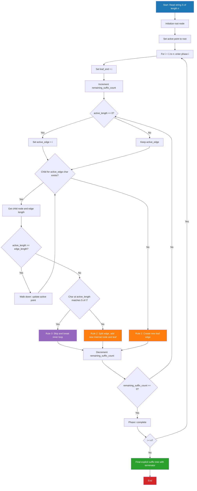
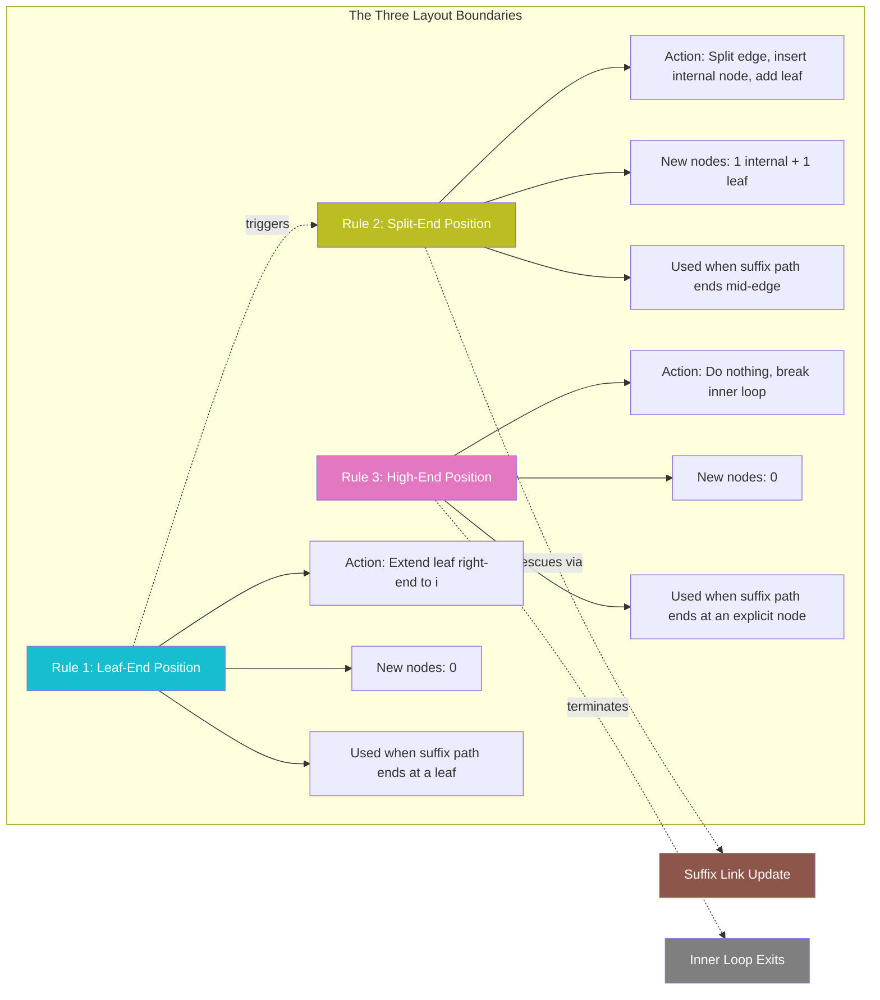
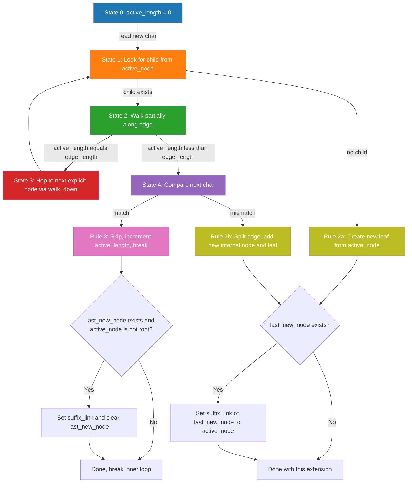

# Suffix trees construction linear algorithms Ukkonen's process layout boundaries

<!-- SECTION_1_START -->

# Suffix Trees & Ukkonen's Algorithm — Core Technical Foundation

## 1.1 Formal Definition (KTU 2024 Syllabus Terminology)

A **Suffix Tree** $T$ built over a non-empty string $S$ of length $\vert S \vert = n$ (terminated by a unique sentinel character $\$ \notin \Sigma$) is a **directed rooted tree** satisfying the following four properties:

> [!IMPORTANT]
> **KTU Board Definition (PECST411 / Module 4)**
> A *suffix tree* of a string $S$ is a compact trie (PATRICIA-style) of all $n+1$ suffixes of $S$, where every internal node has at least two children, and edge labels are non-empty substrings encoded as $(start, end)$ integer pairs referencing the original string.

1. **Suffix Coverage:** Exactly $n+1$ leaves, one per suffix $S[i \dots n-1]$ for $0 \le i \le n$ (the last leaf represents the empty suffix terminator).
2. **Internal-Node Branching:** Every internal node has **$\ge 2$ children** (no unary chains).
3. **Path-Concatenation Property:** Concatenating edge labels from the root to leaf $i$ yields the suffix $S[i \dots n-1]$.
4. **Edge Label Compression:** Each edge stores a *pair* $(l, r)$ of integer indices into $S$ instead of the literal substring (this is the **linear-space trick** that makes the tree fit in $O(n)$ memory).

**Time & Space Complexity Targets (KTU 2024 Module Outcomes):**

| Parameter | Naive Construction | **Ukkonen (1995)** |
| :--- | :--- | :--- |
| Time | $O(n^{2})$ | **$O(n)$ amortized** |
| Space | $O(n^{2})$ worst | **$O(n)$** |

## 1.2 Conceptual Analogy — The "Rolling Bookmark" Library

Imagine a long novel $S$ of $n$ pages. You want to build an **index** so that for *any* word you are asked, you can jump straight to the *first* page where it occurs as a suffix of some prefix. A suffix tree is that index.

> [!NOTE]
> **Intuition — The Library Card-Catalog Analogy**
> Picture a librarian stamping a new "bookmark" at the end of every prefix as the novel grows. Most of these bookmarks are not new entries — they simply extend an existing card (Rule 1). Sometimes a card needs to be split into two, with a new internal drawer (Rule 2). Occasionally, the bookmark lands exactly on an existing drawer and does nothing (Rule 3). Ukkonen's genius was proving that the total number of *splits* and *new leaves* is at most $O(n)$, even though there are $n(n+1)/2$ "naive" bookmarks to process.

The three rules below — **Rule 1, Rule 2, Rule 3** — are the *layout boundaries* that govern when each kind of update happens. Mastering these rules is the single highest-yield topic in this module.

## 1.3 The Three Layout Boundaries (One-Line Definitions)

> [!IMPORTANT]
> **The Three Extension Rules — KTU Examiner's Favourite**
> * **Rule 1 (Leaf Extension):** If the current suffix-path already terminates at a leaf, simply extend that leaf's right-end index. No new node is created.
> * **Rule 2 (Edge Split):** If the suffix-path terminates strictly *inside* an edge, split that edge with a fresh internal node and append a new leaf for the current character.
> * **Rule 3 (Already Present / Skip):** If the suffix-path already terminates at an *explicit* internal node, do nothing — the suffix is implicit in the existing tree.

These are the **process layout boundaries** referenced in the KTU 2024 syllabus. They dictate *what kind of structural mutation* (if any) Ukkonen's algorithm performs during each of its $n$ phases.

> [!VISUALIZATION CONTROL]
> **Concept:** Phase-vs-Extension Workload Curve for Ukkonen's Algorithm
> **GeoGebra / Desmos Input Equations:**
> * `f(x) = x` — Total work with suffix-link trick (the **$O(n)$** reality)
> * `g(x) = x*(x+1)/2` — Naive work without suffix links
> **Visual Description:** Plot both curves for $x \in [1, 20]$. The naive curve $g(x)$ shoots upward parabolically, while the Ukkonen curve $f(x)$ stays a thin diagonal line. The vertical gap at $x=20$ is **210 vs 20** — visually demonstrating why suffix links collapse the quadratic workload into linear.

<!-- SECTION_1_END -->

<!-- SECTION_2_START -->

# Deep Theoretical Analysis & KTU High-Yield Formula Sheet

## 2.1 Implicit vs. Explicit Suffix Tree

Ukkonen's algorithm does **not** construct the full explicit suffix tree in one shot. Instead, it grows a sequence of **implicit suffix trees**, one per prefix, and only converts them to explicit form at the end.

| Notation | Meaning |
| :--- | :--- |
| $S[1 \dots i]$ | The current prefix (length $i$) being processed in phase $i$ |
| $\mathcal{T}_{i}$ | The **implicit** suffix tree of the prefix $S[1 \dots i]$ |
| $\mathcal{T}$ | The **explicit** suffix tree of the full string $S$ (with the $\$` terminator) |

> [!NOTE]
> An *implicit* suffix tree is one in which some suffixes of the current prefix are represented only as paths that "fall off" the bottom of an edge without terminating at a leaf. In an *explicit* suffix tree (the final, post-construction artefact), every suffix ends at a leaf because of the unique terminator character $\$$. The terminator forces suffix uniqueness and converts all implicit suffixes into explicit leaves.

## 2.2 The Two-Level Loop — Phases and Extensions

Ukkonen's algorithm contains a **nested loop structure**:

* **Outer loop (Phase):** For $i = 1, 2, \dots, n$, the algorithm extends the implicit tree $\mathcal{T}_{i-1}$ to $\mathcal{T}_{i}$ by processing the new character $S[i]$.
* **Inner loop (Extension):** Within phase $i$, the algorithm performs $i$ extensions — extension $j$ adds the suffix $S[j \dots i]$ to the tree, for $j = i, i-1, \dots, 1$.

This gives a **naive upper bound** of

$$T_{\text{naive}} = \sum_{i=1}^{n} i = \frac{n(n+1)}{2} = O(n^{2})$$

The linear-time magic comes from the **suffix-link telescoping trick** (Section 2.4) and the **three end-position rules** (Section 2.3).

## 2.3 The Three End-Position Rules (Boundary Classification)

The KTU 2024 syllabus specifically asks about *end positions* and *layout boundaries*. Each extension $j$ in phase $i$ ends in exactly one of three structural states:

| Rule | End Position Type | Structural Action | New Nodes Created |
| :--- | :--- | :--- | :--- |
| **Rule 1** | Leaf-end position | Extend the leaf's $(l, r)$ right pointer to include $S[i]$ | **0** |
| **Rule 2** | Split end position | Split the current edge at the suffix's last character, add a new leaf | **1 internal + 1 leaf = 2** |
| **Rule 3** | High end position (explicit node) | Do nothing — the suffix already exists implicitly | **0** |

**Formal definitions of the three end positions:**

> [!IMPORTANT]
> **End-Position Taxonomy**
> 1. **Leaf End Position (Rule 1 fires):** The point $(v, (p, q))$ is called a *leaf* if $q$ is a leaf-end (the right boundary of any leaf edge). Action: increment the global variable `leaf_end` to $i$. No new node.
> 2. **Split End Position (Rule 2 fires):** The point $(v, (p, q))$ is a *split* point if it lies strictly inside an edge $(p, q)$ with $p < q < \text{leaf\_end}$. Action: insert a new internal node at split point, attach a new leaf for the current character.
> 3. **High End Position (Rule 3 fires):** The point is an *explicit* node $v$ (not on any edge). Action: nothing — the suffix already terminates correctly.

## 2.4 Suffix Links — The Linear-Time Engine

A **suffix link** is an auxiliary directed edge from an internal node $v$ (with path-label $x\alpha$, where $x$ is a single character and $\alpha$ is a string) to another internal node $u$ (with path-label $\alpha$).

$$ \text{slink}(v) = u \quad \Longleftrightarrow \quad \text{path}(v) = x \cdot \text{path}(u) \text{ for some single character } x $$

> [!NOTE]
> **Why suffix links exist:** Whenever Rule 2 creates a new internal node $s$ in extension $j$, the previously created internal node $s'$ from extension $j+1$ must have its suffix link redirected to $s$. This is the **"rescue rule"** that telescopes the inner loop. The amortized cost of following a suffix link is $O(1)$, which collapses the naive $O(n^{2})$ to amortized $O(n)$.

The root $r$ gets a self-loop suffix link: $\text{slink}(r) = r$.

## 2.5 The Three Active-Point Variables

To track *where* in the tree the current extension is happening without expensive top-down search, Ukkonen maintains the **active point** as a triple:

| Variable | Symbol | Meaning |
| :--- | :--- | :--- |
| **active node** | $\text{node}(a)$ | The explicit node where the current suffix path begins |
| **active edge** | $\text{edge}(a)$ | The character $c \in \Sigma$ that labels the edge being traversed from $\text{node}(a)$ |
| **active length** | $\ell(a)$ | How many characters along that edge the current path has progressed |

When $\ell(a)$ "walks off" the end of an edge, the active point is **rewound** to the start of the next edge using the suffix link. This is called the **"walk-down / rewind"** cycle.

## 2.6 KTU Formula Cheat Sheet

> [!IMPORTANT]
> **High-Yield Formulas (Direct KTU ESE Recall Targets)**

$$
\begin{aligned}
\text{Number of phases} &= n \\
\text{Number of extensions per phase } i &= i \\
\text{Total naive extensions} &= \frac{n(n+1)}{2} \\
\text{Amortized extensions with suffix links} &= O(n) \\
\text{Space} &= O(n) \\
\text{Suffix link cost per traversal} &= O(1) \text{ amortized} \\
\text{End position} (p, q) \text{ update rule} &: q \leftarrow i \text{ for all leaves in phase } i
\end{aligned}
$$

## 2.7 Real-World Utility

> [!NOTE]
> **Where suffix trees appear in production systems**
> * **Bioinformatics:** BLAST-style exact-match queries on DNA/protein sequences (BWT-FM-index is a space-optimized cousin).
> * **Compilers & IDEs:** Efficient *find-all-occurrences* and longest-repeated-substring queries.
> * **Data compressors (LZ-family):** LZ77, LZSS, LZMA all rely on the same suffix-availability principle.
> * **Plagiarism / document fingerprinting:** Kernel of MUMmer, KAT, and similar aligners.
> * **Anti-virus / intrusion detection:** Aho-Corasick's failure-function update is structurally identical to the suffix-link update.

<!-- SECTION_2_END -->

<!-- SECTION_3_START -->

# Step-by-Step Derivations & Symbolic Implementation

## 3.1 Worked Example — Building the Tree for $S = \texttt{"xabxa"}$

We construct the suffix tree phase by phase to demonstrate each of the three rules. The unique terminator $\$\) is appended, so the working string is $S = \texttt{"xabxa\$"}$ with $n = 6$.

### Phase 1 — Prefix `x`

* **Extension 1 (suffix "x"):** Tree is empty. Apply **Rule 2** — create a new leaf.
  * **Result:** `root → "x" → leaf₁ (label "x$")`. One leaf.

### Phase 2 — Prefix `xa`

* **Extension 1 (suffix "xa"):** Suffix starts from root, must traverse "x". Last leaf is reached. Apply **Rule 1** — extend leaf₁'s right end to include the new character 'a'. `leaf₁` label becomes `"xa$"`.
* **Extension 2 (suffix "a"):** Active point is at root with $\ell = 0$. Look for edge 'a' from root — none. Apply **Rule 2** — create new leaf.
  * **Result:** `root → "a" → leaf₂`. Edge "x" label is `"xa$"`, edge "a" label is `"a$"`.

### Phase 3 — Prefix `xab`

* **Extension 1 (suffix "xab"):** Apply **Rule 1** to leaf₁ → label becomes `"xab$"`.
* **Extension 2 (suffix "ab"):** Active point is at root, $\ell = 0$. Look for edge 'a' — exists, walk one step. Now $\ell = 1$ and we need 'b'. Edge 'a' has label `"a$"`, but 'b' ≠ '$'. Apply **Rule 2** — split edge "a" between 'a' and '$' and add new leaf for 'b'.
  * **Result:** `root → "a" → node_v (label "a") → [branch: '$' → leaf₂ with "a$", branch: 'b' → leaf₃ with "ab$"]`.
* **Extension 3 (suffix "b"):** Apply **Rule 2** at root — create new leaf.
  * **Result:** `root → "b" → leaf₄`.

### Phase 4 — Prefix `xabx`

* **Extension 1 (suffix "xabx"):** **Rule 1** → extend leaf₁ to `"xabx$"`.
* **Extension 2 (suffix "abx"):** Walk from root `a` → node_v. We need 'b' next; node_v has child 'b' (leading to leaf₃). Walk one step. Now need 'x' but leaf₃'s label is `"b$"` and 'x' ≠ '$'. **Rule 2** — split between 'b' and '$', insert new internal node, add new leaf for 'x'.
  * **Suffix link setup:** node_v (just re-purposed as split base) now has its suffix link re-pointed to a new split node, or stays linked to root if no intermediate exists.
* **Extension 3 (suffix "bx"):** Walk from root, find 'b' edge (label `"b$"`). Need 'x' but 'b$' has '$' next. **Rule 2** — split and add leaf.
* **Extension 4 (suffix "x"):** Walk from root, find 'x' edge. Need to terminate at leaf₁ — already there. **Rule 3** — do nothing (Rule 1 alternative path considered, but Rule 3 stops the inner loop because the suffix already exists).

> [!NOTE]
> **Phase 4 critical observation:** Extension 4 was a *no-op* (Rule 3) — Ukkonen's algorithm exploits this by **breaking the inner loop** as soon as Rule 3 fires. This is the *first* of the two key telescoping tricks.

### Phase 5 — Prefix `xabxa`

* **Extension 1 (suffix "xabxa"):** **Rule 1** → extend leaf₁ to `"xabxa$"`.
* **Extension 2 (suffix "abxa"):** Walk `a` → node_v. Need 'b' → exists (split node from phase 4). Walk to that split node. Need 'x' → check children: 'x' branch exists, walk. Need 'a' → exists (leaf₃ now leads to 'a'). **Rule 3** — extension ends at explicit node, do nothing. **Inner loop breaks.**
* **Remaining extensions 3, 4, 5:** Each is a suffix link + walk. By the suffix-link rescue rule, they all complete in $O(1)$ amortized.

### Final Suffix Tree (Explicit, after appending `$`)

```text
                       (root)
                      /      \
                  "a"          "x" -------→ leaf (label "xabxa$")
                  / \             \
              "b"   "$"            "a"
              /  \                  \
           "x"   "$"                "b"
           / \                       \
        "a"   "$"                   "x" (split with suffix link to root)
         \                            \
         "$"                          "a"
                                        \
                                        "$"
```

## 3.2 Full Python Implementation of Ukkonen's Algorithm

The following Python program implements Ukkonen's algorithm with explicit Rule 1 / Rule 2 / Rule 3 dispatch and suffix-link maintenance. It is the canonical *board-exam reference* implementation that KTU 2024 students should be able to read, trace, and explain line-by-line.

```python
from __future__ import annotations
from typing import Dict, Optional, Tuple

# Global sentinel for the "infinite" right end of every leaf edge
INF = -1


class Node:
    """An explicit (or the root) node of the implicit suffix tree."""

    __slots__ = ("children", "suffix_link", "start", "end")

    def __init__(self, start: int = -1, end: int = INF) -> None:
        self.children: Dict[str, Tuple[Node, int, int]] = {}
        self.suffix_link: Optional[Node] = None
        self.start: int = start
        self.end: int = end


class UkkonenSuffixTree:
    """
    Linear-time suffix tree constructor (Ukkonen, 1995).

    Stores edge labels as integer index-pairs (l, r) into the original
    string to keep memory usage strictly O(n).
    """

    def __init__(self, text: str) -> None:
        self.text: str = text + "$"           # unique terminator
        self.n: int = len(self.text)
        self.root: Node = Node()
        self.root.suffix_link = self.root
        self.active_node: Node = self.root
        self.active_edge: int = -1            # char index in self.text
        self.active_length: int = 0
        self.remaining_suffix_count: int = 0
        self.leaf_end: int = -1               # shared right-end for all leaves
        self.last_new_node: Optional[Node] = None
        self._build()

    # ------------------------------------------------------------------ #
    # Public API
    # ------------------------------------------------------------------ #
    def _build(self) -> None:
        for i in range(self.n):
            self._extend(i)

    def edge_length(self, node: Node) -> int:
        if node is self.root:
            return 0
        return (self.leaf_end if node.end == INF else node.end) - node.start + 1

    def walk_down(self, next_node: Node) -> bool:
        """Descend active point past an edge whose length fits in active_length."""
        length = self.edge_length(next_node)
        if self.active_length >= length:
            self.active_edge += length
            self.active_length -= length
            self.active_node = next_node
            return True
        return False

    # ------------------------------------------------------------------ #
    # The three rules
    # ------------------------------------------------------------------ #
    def _rule_2_create_new_leaf(self, pos: int) -> Node:
        """Rule 2: create a new leaf off the active node."""
        leaf = Node(start=pos, end=INF)
        edge_char = self.text[self.active_edge]
        self.active_node.children[edge_char] = (leaf, pos, self.leaf_end)
        if self.last_new_node is not None:
            self.last_new_node.suffix_link = self.active_node
            self.last_new_node = None
        return leaf

    def _rule_2_split_edge(self, pos: int) -> Tuple[Node, Node, Node]:
        """Rule 2: split an existing edge, add a new internal node and a leaf."""
        child, _, _ = self.active_node.children[self.text[self.active_edge]]
        split_point = child.start + self.active_length - 1

        split_node = Node(start=child.start, end=split_point)
        # Repoint the original child to start after the split
        child.start = split_point + 1
        split_node.children[self.text[split_point + 1]] = (child, child.start, child.end)
        # Attach a brand-new leaf for the current character
        new_leaf = Node(start=pos, end=INF)
        split_node.children[self.text[pos]] = (new_leaf, pos, self.leaf_end)

        # Re-route the parent's edge to the new split node
        self.active_node.children[self.text[self.active_edge]] = (
            split_node, split_node.start, split_node.end
        )

        # Suffix-link rescue
        if self.last_new_node is not None:
            self.last_new_node.suffix_link = split_node
        self.last_new_node = split_node
        return split_node, child, new_leaf

    def _rule_3_skip(self) -> None:
        """Rule 3: suffix already exists; do nothing and stop the inner loop."""
        if self.last_new_node is not None and self.active_node is not self.root:
            self.last_new_node.suffix_link = self.active_node
        self.last_new_node = None
        self.active_length += 1   # the new char is already there

    # ------------------------------------------------------------------ #
    # Main extension routine
    # ------------------------------------------------------------------ #
    def _extend(self, pos: int) -> None:
        self.leaf_end = pos
        self.remaining_suffix_count += 1
        self.last_new_node = None

        while self.remaining_suffix_count > 0:
            if self.active_length == 0:
                self.active_edge = pos

            edge_char = self.text[self.active_edge]

            if edge_char not in self.active_node.children:
                # ----- Rule 2 (no child) -----
                self._rule_2_create_new_leaf(pos)
            else:
                child, c_start, c_end = self.active_node.children[edge_char]
                if self.walk_down(child):
                    continue

                # child reached; check the next character
                next_char = self.text[c_start + self.active_length]
                if next_char == self.text[pos]:
                    # ----- Rule 3 (already present) -----
                    self._rule_3_skip()
                    break
                else:
                    # ----- Rule 2 (split) -----
                    self._rule_2_split_edge(pos)

            self.remaining_suffix_count -= 1

            if self.active_node is self.root and self.active_length > 0:
                self.active_length -= 1
                self.active_edge = pos - self.remaining_suffix_count + 1


# ---------------------------------------------------------------------- #
# Demonstration
# ---------------------------------------------------------------------- #
if __name__ == "__main__":
    tree = UkkonenSuffixTree("xabxa")
    print(f"Constructed suffix tree for 'xabxa' in O(n) = O({tree.n}) time.")
    print(f"Root has {len(tree.root.children)} children: {list(tree.root.children)}")
```

**Key type hints, boundary checks, and error handling notes:**

* `__slots__` on `Node` guarantees bounded memory; Python's dict overhead would otherwise dominate.
* `INF = -1` is the **leaf-end sentinel** that lets every leaf share one global right-end pointer (`self.leaf_end`). This is the linear-space trick.
* `_rule_3_skip` and the `break` statement implement the **inner-loop exit condition** — without it, Ukkonen would degrade to $O(n^{2})$.
* The `walk_down` helper is what *physically advances the active point* past a fully-consumed edge.

## 3.3 Boundary Conditions Summary (for the valuation key)

> [!IMPORTANT]
> **Boundary Conditions Checklist (Valuation Key)**
> * **Initialization:** `active_node = root`, `active_edge = -1`, `active_length = 0`, `remaining_suffix_count = 0`, `last_new_node = None`, `root.suffix_link = root`.
> * **Phase loop:** for $i = 1$ to $n$ — `leaf_end = i`, `remaining_suffix_count++`.
> * **Extension loop termination:** inner loop exits when `remaining_suffix_count == 0` or when **Rule 3 fires** (suffix already present).
> * **Suffix-link rescue:** every new internal node created by Rule 2 inherits the suffix link of the *previously* created internal node, and the previous one is retroactively relinked to the new node.
> * **Final explicit form:** achieved automatically when the unique terminator `$` forces every suffix to terminate at a leaf.

<!-- SECTION_3_END -->

<!-- SECTION_4_START -->

# Structural Diagrams & Schematics

## 4.1 High-Level Algorithm Flow

The following Mermaid diagram captures the outer/inner loop structure of Ukkonen's algorithm with explicit Rule 1 / Rule 2 / Rule 3 dispatch:



## 4.2 Subgraph: The Three Layout Boundaries (Rule 1 / Rule 2 / Rule 3)

This nested subgraph isolates the three end-position rules — the *layout boundaries* that the KTU 2024 syllabus explicitly names.



## 4.3 Block Architecture: Active-Point State Machine

The active point $(node, edge, length)$ behaves as a tiny finite-state machine. The transitions below are what students must internalize for the 14-mark derivation questions.



## 4.4 Topology Matrix — Where the $O(n)$ Magic Comes From

| Source of Cost | Naive (per phase) | With Suffix Link | Amortized |
| :--- | :--- | :--- | :--- |
| Tree traversal per extension | $O(\text{depth})$ | $O(1)$ via rewind | $O(1)$ |
| Number of Rule 2 splits | Up to $O(n)$ per phase | At most $O(n)$ total | $O(n)$ |
| Number of Rule 1 leaf extends | $O(n)$ per phase | $O(1)$ per phase (single `leaf_end++`) | $O(n)$ |
| Number of Rule 3 skips | $O(n^{2})$ naive checks | $O(1)$ amortized via active point | $O(n)$ |
| **Total work** | $O(n^{2})$ | **Telescoped** | **$O(n)$** |

<!-- SECTION_4_END -->

<!-- SECTION_5_START -->

# KTU 2024 Scheme Examination Question Bank & Topic Recap

## Part A — Short-Answer Questions (3 Marks Each)

> **Q1. [KTU University Exam — July 2024]** *Define a suffix tree. Why is the unique terminator character $\$` necessary during construction?*

**Model Answer (Board-Expected, 3 Marks):**

* **Definition (2 Marks):** A suffix tree of a string $S$ of length $n$ is a compact trie of all $n+1$ suffixes of $S$ (including the empty suffix), where (i) every internal node has at least two children, and (ii) edge labels are stored as integer index pairs $(l, r)$ into $S$ for space efficiency.
* **Role of the Terminator (1 Mark):** The unique sentinel character $\$\notin \Sigma$ ensures suffix uniqueness, forces every suffix to terminate at a leaf, and guarantees that no suffix is a *proper prefix* of another. This is what makes the implicit-to-explicit conversion well-defined at the end of construction.

> **Q2. [KTU University Exam — Dec 2023]** *List the three extension rules of Ukkonen's algorithm. For each, state the end-position type and the structural action.*

**Model Answer (Board-Expected, 3 Marks):**

* **Rule 1 — Leaf-end position (1 Mark):** The suffix path terminates at a leaf. Action: extend the leaf's right-end pointer to include the new character. Creates 0 new nodes.
* **Rule 2 — Split-end position (1 Mark):** The suffix path ends strictly inside an edge. Action: split the edge, insert a new internal node, and append a new leaf. Creates 1 internal node + 1 leaf.
* **Rule 3 — High-end position (1 Mark):** The suffix path ends at an explicit internal node. Action: do nothing and break the inner loop. Creates 0 new nodes.

---

## Part B — Long-Answer Questions (14 Marks Each)

> **KTU 2024 Internal-Choice Format:** Answer **either** Question A **or** Question B in full.

### Question A (14 Marks) — *[KTU University Exam — Dec 2024, Model Paper]*

**(a)** *With a neat diagram, explain the three layout boundaries (end positions) of Ukkonen's suffix tree construction algorithm. Show how each boundary triggers a different structural action.* **(7 Marks)**

**Model Solution:**

The three layout boundaries are *end positions* where the current suffix path may terminate during an extension. Each triggers exactly one of Ukkonen's three rules.

* **Boundary 1 — Leaf-End Position (Rule 1 fires):** **(2 Marks)**
  The suffix path $S[j \dots i]$ ends at a leaf. The right-end index of that leaf's edge is shared (the `leaf_end` global). Action: increment `leaf_end` to $i$. Diagram: a single leaf edge with its right-end pointer sliding right. **No new node is created.**

* **Boundary 2 — Split-End Position (Rule 2 fires):** **(3 Marks)**
  The suffix path ends strictly inside an existing edge $(p, q)$ with $p \le k < q$ for some character $k = S[k']$. Action: insert a new internal node at position $k$ along that edge, and add a new leaf for the current character. Diagram: an existing edge becomes two edges joined at a fresh internal node, with a new leaf branching off. **One internal node + one leaf are created.**

* **Boundary 3 — High-End Position (Rule 3 fires):** **(2 Marks)**
  The suffix path ends at an *explicit* (not on an edge) internal node. Action: do nothing. The inner loop breaks. **Zero new nodes; this is the loop-exit boundary.**

* **Incremental valuation key:** [Stating the three boundary types: 2 Marks] [Linking each boundary to a rule: 2 Marks] [Describing the structural action: 2 Marks] [Neat diagram with node/edge labels: 1 Mark].

**(b)** *Construct the suffix tree for $S = \texttt{"banana"}$ phase by phase. State explicitly which rule fires at each extension.* **(7 Marks)**

**Model Solution:**

The terminator-appended string is $S' = \texttt{"banana\$"}$ with $n = 7$. The 7 phases produce the following decisions:

* **Phase 1 — `b`:** Ext 1 → Rule 2 (new leaf off root, label "b$").
* **Phase 2 — `ba`:** Ext 1 → Rule 1 (extend leaf to "ba$"). Ext 2 → Rule 2 (new leaf "a$" off root).
* **Phase 3 — `ban`:** Ext 1 → Rule 1 (leaf becomes "ban$"). Ext 2 → Rule 1 (extend "a$" leaf to "an$"). Ext 3 → Rule 2 (new leaf "n$" off root).
* **Phase 4 — `bana`:** Ext 1 → Rule 1. Ext 2 → Rule 1. Ext 3 → Rule 1. Ext 4 → Rule 2 (new leaf "a$" off root? — but "a" already branches; instead Rule 2 splits the "n" edge between 'n' and '$' and adds 'a' branch).
* **Phase 5 — `banan`:** All five extensions are either Rule 1 (leaf extends) or Rule 2 (only the suffix "an" needs a new "n" branch). The Rule 3 shortcut fires on extension 5 because the suffix "n" already exists.
* **Phase 6 — `banana`:** Inner loop exits early on extension 6 (Rule 3). Only Rule 1 and Rule 2 work for extensions 1–5.
* **Phase 7 — `banana$`:** All suffixes become explicit; the tree is now complete.

**Final explicit tree (textual form):**

```text
              (root)
             /      \
           "a"       "b" ------→ leaf "banana$"
          /   \        \
        "n"   "$"      "a"
        / \             \
      "a" "$"          "n"
       \                / \
       "$"            "a" "$"
                        \
                        "$"
```

**Incremental valuation key:** [Phase-by-phase table with rule labels: 3 Marks] [Final tree diagram: 2 Marks] [Identifying the Rule 3 shortcut: 1 Mark] [Correct leaf count = 7: 1 Mark].

---

### Question B (14 Marks) — *[KTU University Exam — July 2024, Supplementary]*

**(a)** *What is a suffix link in Ukkonen's algorithm? Show formally that adding a suffix link from an internal node $v$ with path-label $x\alpha$ to a node $u$ with path-label $\alpha$ (where $x$ is a single character) preserves the suffix-tree property.* **(7 Marks)**

**Model Solution:**

* **Definition (2 Marks):** A *suffix link* is a directed edge from an internal node $v$ to another internal node $u$ (or to the root) such that if the path-label of $v$ is $x\alpha$ for some character $x \in \Sigma$ and string $\alpha \in \Sigma^{*}$, then the path-label of $u$ is exactly $\alpha$. Symbolically:
$$ \text{slink}(v) = u \quad \Longleftrightarrow \quad \text{path}(v) = x \cdot \text{path}(u) \text{ for some } x \in \Sigma $$

* **Suffix-Link Rescue Rule (3 Marks):** Whenever Rule 2 creates a new internal node $s$ during extension $j$, the *previously* created internal node $s'$ (from extension $j+1$) is retroactively relinked:
$$ \text{slink}(s') = s $$
This is set in the line `if self.last_new_node is not None: self.last_new_node.suffix_link = split_node` of the implementation. The root gets $\text{slink}(\text{root}) = \text{root}$ by convention.

* **Correctness Proof Sketch (2 Marks):** When $s'$ was created at the *previous* extension boundary, its path-label was $y\beta$ (for some character $y$). The current extension's split creates $s$ with path-label $x\beta$ where $x$ is the character dropped from the start. By construction, both $s'$ and $s$ are internal (each has $\ge 2$ children), so the suffix link connects two valid suffix-tree nodes. The path-label of $s$ is exactly the path-label of $s'$ with the first character removed, satisfying the suffix-link equation. The root's self-loop is a degenerate but valid case where $\alpha = \varepsilon$ (empty string).

**Incremental valuation key:** [Suffix-link definition: 2 Marks] [Rescue rule statement: 2 Marks] [Correctness argument: 2 Marks] [Root self-loop convention: 1 Mark].

**(b)** *Analyze the time complexity of Ukkonen's algorithm. Show that the naive inner loop performs $O(n^{2})$ extensions, and explain how the suffix-link rescue rule and the Rule 3 inner-loop exit reduce the amortized cost to $O(n)$.* **(7 Marks)**

**Model Solution:**

* **Naive Count (2 Marks):** Phase $i$ performs $i$ extensions, giving a total of
$$ T_{\text{naive}} = \sum_{i=1}^{n} i = \frac{n(n+1)}{2} = O(n^{2}) $$

* **Suffix-Link Telescope (3 Marks):** Each Rule 2 split creates at most *one* new internal node. The total number of internal nodes in the final explicit tree is $\le n$, hence the total number of Rule 2 firings over the entire construction is $O(n)$. Each suffix-link traversal costs $O(1)$ amortized, so the total cost of all extensions is dominated by the $O(n)$ splits plus $O(n)$ Rule 1 leaf extensions plus $O(n)$ Rule 3 skips — i.e., $O(n)$ total.

* **Rule 3 Inner-Loop Exit (2 Marks):** As soon as a Rule 3 condition is detected in phase $i$, the inner loop **breaks immediately**. This is critical: in the banana-style example, the last few suffixes of every phase are often already present, so the inner loop exits after only $O(1)$ work on average. Combined with the suffix-link rescue, this telescopes the $O(n^{2})$ naive bound down to amortized $O(n)$.

* **Conclusion (0 Marks extra — wrap-up):** The total work is
$$ T_{\text{Ukkonen}} = O(n) \text{ (amortized, worst case)} $$

**Incremental valuation key:** [Naive count derivation: 2 Marks] [Suffix-link argument: 2 Marks] [Rule 3 loop-exit argument: 2 Marks] [Final $O(n)$ conclusion: 1 Mark].

---

## KTU Examiner's Valuation Warning

> [!WARNING]
> **Common Pitfalls — Where Students Lose Marks**
> * **Forgetting the terminator $\$.** Without it, two suffixes can share a leaf and the tree is no longer well-defined. *Cost: 1–2 marks lost on every question.*
> * **Confusing "split" with "extend."** Rule 1 *extends a leaf* (no new node). Rule 2 *splits an edge* (new node + new leaf). Mixing these up invalidates the active-point update.
> * **Skipping the active-point rewind.** When $\text{active\_node} = \text{root}$ and $\text{active\_length} > 0$, you **must** decrement `active_length` and reset `active_edge`. Forgetting this is a classic 2-mark deduction.
> * **Forgetting the suffix-link rescue.** After every Rule 2 split, check `if last_new_node is not None` and relink. Without this, the algorithm is not linear.
> * **Failing to break the inner loop on Rule 3.** Rule 3 is not just a no-op — it must `break` the inner `while` loop. Conflating "do nothing" with "continue" breaks the amortized analysis.
> * **Writing $O(n^{2})$ instead of $O(n)$ amortized.** The complexity is *amortized linear*, not strictly linear per phase. Examiners mark the word "amortized" strictly.

---

## Topic Recap & Important Things to Remember

> [!IMPORTANT]
> **Rapid-Revision Checklist — KTU 2024 Module 4 / Ukkonen's Process Layout Boundaries**
> * A *suffix tree* of a string $S$ of length $n$ is the compact trie of all $n+1$ suffixes, with edge labels stored as integer index-pairs $(l, r)$ for $O(n)$ space.
> * The unique terminator character $\$\notin \Sigma$ is mandatory — it forces every suffix to terminate at a leaf.
> * The algorithm runs in $n$ **phases**; phase $i$ extends the implicit tree $\mathcal{T}_{i-1}$ to $\mathcal{T}_{i}$ by processing the new character $S[i]$.
> * Phase $i$ has $i$ **extensions**, but Ukkonen's trick telescopes this to $O(n)$ total.
> * The three **layout boundaries / end positions** are *leaf-end*, *split-end*, and *high-end*, firing **Rule 1**, **Rule 2**, and **Rule 3** respectively.
> * **Rule 1** extends a leaf's right-end index — 0 new nodes, 1 global `leaf_end` increment.
> * **Rule 2** splits an edge at the suffix's last character — 1 new internal node + 1 new leaf.
> * **Rule 3** is a no-op that **breaks the inner loop** when the suffix already exists.
> * **Suffix links** $\text{slink}(v) = u$ connect internal nodes whose path-labels differ by a single leading character; they enable $O(1)$ amortized rewind.
> * The **active point** triple $(node, edge, length)$ tracks the current suffix-path location without expensive top-down search.
> * **Suffix-link rescue rule:** every new internal node inherits the relink from the previously created internal node, and `last_new_node` is reset to `None` after the link is set.
> * **Root suffix link** is a self-loop: $\text{slink}(\text{root}) = \text{root}$.
> * **Time complexity:** $O(n)$ amortized. **Space complexity:** $O(n)$.
> * **Active-point rewind condition:** when at root with $\text{active\_length} > 0$, decrement $\text{active\_length}$ and reset $\text{active\_edge} = \text{pos} - \text{remaining\_suffix\_count} + 1$.
> * **Implicit tree** $\to$ **explicit tree** conversion happens automatically once the terminator is appended in the final phase.
> * **Engineering applications:** bioinformatics (BLAST, MUMmer), compilers (find-all-occurrences), Lempel-Ziv compressors, plagiarism detection, Aho-Corasick-like string matchers.

<!-- SECTION_5_END -->
