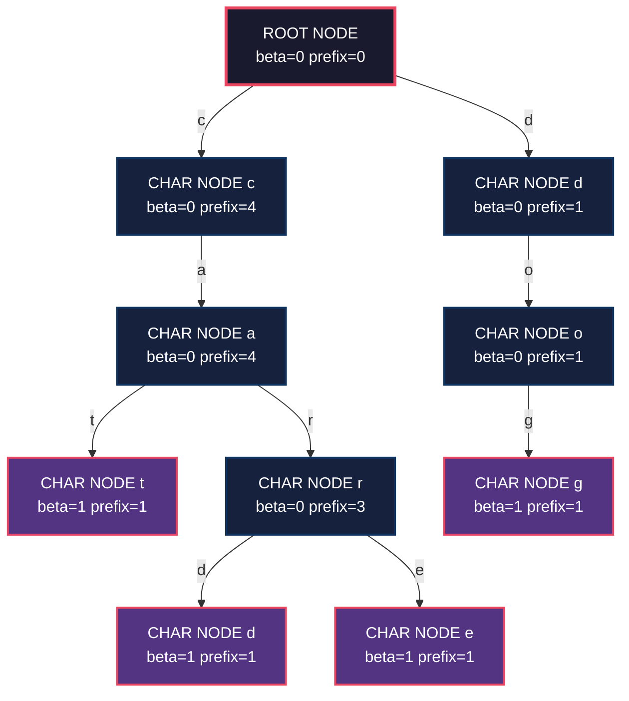
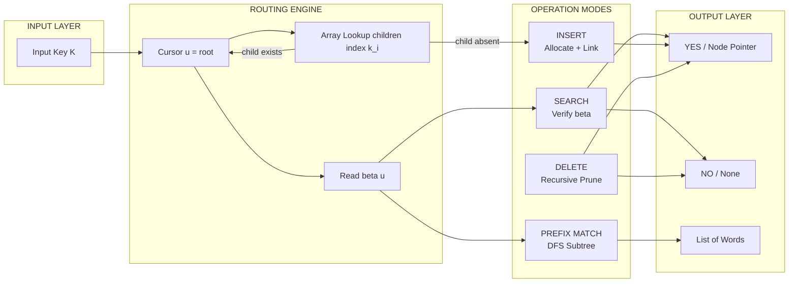
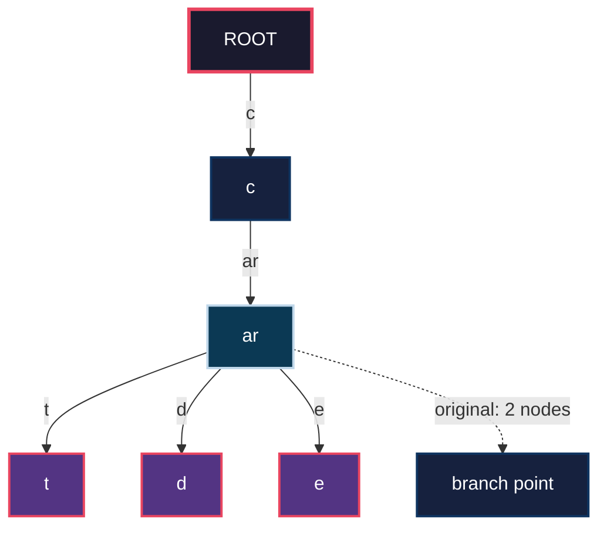
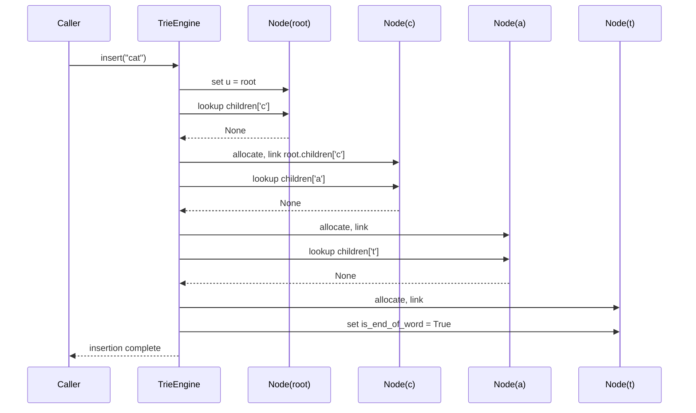

# Tries character route mapping structural configurations parameters frameworks

<!-- SECTION_1_START -->

# Tries — Character Route Mapping, Structural Configurations & Parameter Frameworks

> [!NOTE]
> **KTU 2024 Scheme Context — Module 4 (String Indexing Data Trees)**
> This module belongs to the *Program Elective Cluster — Smart Computing / Data Intensive Tracks* and carries **Course Outcome mapping CO1 / CO2** (Understand & Apply). A Trie (also called a **Prefix Tree** or **Digital Tree**) is the canonical structure for indexed string retrieval and is a high-yield topic for KTU ESE questions under Module 4.

## 1.1 Formal Definition (KTU 2024 Syllabus Terminology)

A **Trie** $\mathcal{T}$ is an ordered, rooted tree data structure that stores a **dynamic set of strings** (called *keys*) over a finite **alphabet** $\Sigma = \{c_1, c_2, \ldots, c_\sigma\}$ of size $\sigma = \vert \Sigma \vert$. Each node represents a single character; a path from the **root node** $r$ to any descendant node encodes a prefix of one or more stored keys. A boolean flag $\texttt{isEndOfWord}$ is maintained at every node to indicate whether the path from the root to that node spells a complete key in the dictionary.

Formally, a trie is a tuple:

$$\mathcal{T} = \big( V, E, r, \Sigma, \phi, \beta \big)$$

where:
- $V$ is the finite set of **nodes**
- $E \subseteq V \times V$ is the set of **directed edges** (each labeled with one character from $\Sigma$)
- $r \in V$ is the distinguished **root** (representing the empty string $\varepsilon$)
- $\phi : E \rightarrow \Sigma$ is the **edge-labelling function**
- $\beta : V \rightarrow \{0, 1\}$ is the **terminal-flag function** marking word endings

### 1.2 Conceptual Analogy — "The Letter-Sorting Post Office"

Imagine a post office where every incoming letter is sorted step-by-step: first by the **first letter of the recipient's surname**, then by the **second letter**, and so on. Each sorter holds a tray for every possible next letter, and a special **red stamp** $\big(\beta(v) = 1\big)$ is placed on a tray only if a complete surname ends at that point.

- The **root** = the empty intake tray.
- Each **branch (edge)** = "the next letter must be this one."
- A **red stamp** = "a registered word ends here."

When a new customer asks, *"Is 'cat' already registered?"*, the clerk walks the path $r \rightarrow c \rightarrow a \rightarrow t$ and checks for the red stamp. No comparisons of full strings are needed — only **character-by-character routing**. This is the entire magic of a Trie: **constant-time routing per character**, independent of how many words are stored.

> [!IMPORTANT]
> **Syllabus Highlight — Why a Trie and not a BST?**
> In a **BST** keyed by full string, comparison is $O(L \log n)$ per query (where $L$ is the string length). In a **Trie**, lookup is $O(L)$ — a huge speed-up for **autocomplete**, **spell-checkers**, **IP routing tables (Longest Prefix Match)**, and **genome indexing** (Bioinformatics).

### 1.3 Physical Constants & Standard Metrics

> [!TIP]
> The following parameters govern every Trie variant you will encounter in KTU papers. **Memorize the symbols and their typical values.**

| Symbol | Parameter | Typical KTU Value |
|:------:|:----------|:------------------|
| $\sigma$ | Alphabet size ($\vert \Sigma \vert$) | $26$ (lowercase), $52$ (case-sensitive), $256$ (extended ASCII) |
| $n$ | Number of stored keys (words) | $10^3$ – $10^6$ |
| $L$ | Average key length | $5$ – $15$ |
| $h$ | Trie height (length of longest key) | $\max_{k \in S} \vert k \vert$ |
| $\vert V \vert$ | Total node count | $\leq \sigma \cdot n \cdot L$ worst case |
| $\beta(v)$ | End-of-word flag at node $v$ | $\{0, 1\}$ |

> [!VISUALIZATION CONTROL]
> **Concept:** Trie root–to–leaf path geometry (alphabet = $\{a, b, c\}$).
> **GeoGebra / Desmos Input Equations (parametric tree):**
> * `root = (0, 4)`
> * `child_i = (root.x + 2·cos(θ_i), root.y − 2·sin(θ_i))` for $i \in \{1, 2, 3\}$
> * `θ_1 = 30°`, `θ_2 = 90°`, `θ_3 = 150°`
> **Visual Description:** On the axes, you will see a fan of three child nodes branching from the root at $y = 4$, each at height $y = 2$. Subsequent levels recursively halve the angular spread, creating a **fractal fan** — a geometric reminder that a Trie of height $h$ over alphabet $\sigma$ has branching factor $\sigma$ at every level.

<!-- SECTION_1_END -->

<!-- SECTION_2_START -->

# 2. Deep Theoretical Analysis & KTU High-Yield Formula Sheet

## 2.1 Operational Logic — Step-by-Step Mechanism

### A. **Node Structure (Standard Array-of-Children Trie)**

A standard Trie node contains **three logical fields**:

1. **`children[σ]`** — an array (or hash map) of size $\sigma$, where `children[i]` is a pointer to the child node reached by character $c_i$, or `None` if absent.
2. **`isEndOfWord`** — boolean flag $\beta(v) \in \{0, 1\}$.
3. **(Optional) `prefixCount`** — integer tracking how many keys pass through the node (for *prefix-frequency queries*).

### B. **Insert Operation — Routing Pipeline**

The insertion algorithm routes a key $K = k_1 k_2 \ldots k_L$ down the tree:

1. Initialize current node $u \leftarrow r$ (root).
2. **For $i = 1$ to $L$:**
    * Compute index $j \leftarrow \texttt{index}(k_i)$ (e.g., ASCII value $-$ `'a'` for lowercase).
    * If $\texttt{children}[j] = \texttt{None}$: **allocate** a fresh node $v$ and link $u.\texttt{children}[j] \leftarrow v$.
    * Move $u \leftarrow u.\texttt{children}[j]$.
3. Set $\beta(u) \leftarrow 1$ (mark end-of-word).

> [!IMPORTANT]
> **Why the time complexity is $O(L)$, not $O(\sigma)$:**
> Each level processes **exactly one** character; we never scan all $\sigma$ children. The $\sigma$ factor affects **space**, not **time** per operation.

### C. **Search Operation — Exact Lookup**

1. Walk root $\rightarrow$ leaf following characters of $K$.
2. If at any step the required child is `None`: return `False`.
3. After the final step, return $\beta(u)$ (the flag). Note: returning $\beta(u) = 0$ means $K$ is a **proper prefix** of some longer key, not a stored key.

### D. **Prefix Search — Subtree Enumeration**

To find *all* keys with a given prefix $P$:

1. Locate the node $u_P$ reached by $P$ (cost $O(\vert P \vert)$).
2. If $u_P$ does not exist, return empty list.
3. Perform **DFS / BFS** on the subtree rooted at $u_P$, collecting every node $v$ with $\beta(v) = 1$.

### E. **Delete Operation — Recursive Cleanup**

Deletion is the trickiest operation. Two cases:

- **Case 1: $K$ is a leaf-like word** (no other key shares its full path): recursively delete the node, but **only if $\beta(v) = 0$** (i.e., the node is not on any other key's path).
- **Case 2: $K$ is a prefix of another word**: simply set $\beta(v) \leftarrow 0$ without deleting nodes.

> [!WARNING]
> **Common Bug:** Forgetting to recurse *only* when the node is "empty" (no children and not a word-end). KTU examiners specifically look for this conditional cleanup.

## 2.2 KTU Formula Sheet (High-Yield, No Bars in Tables!)

> [!NOTE]
> **CRITICAL FORMATTING RULE:** All vertical bars $\vert$ are written as `\vert` or `\mid` to keep the markdown table parser happy.

| # | Operation | Time Complexity | Space Complexity | Notes |
|:-:|:----------|:----------------|:-----------------|:------|
| 1 | Insert key $K$ of length $L$ | $O(L)$ | $O(\sigma \cdot \vert V \vert)$ total | Independent of $n$ (number of keys) |
| 2 | Search exact key $K$ | $O(L)$ | — | Returns $\beta(u)$ at terminal node |
| 3 | Prefix search of $P$ | $O(\vert P \vert + M)$ | $O(M)$ for output | $M$ = number of matches |
| 4 | Delete key $K$ | $O(L)$ | — | Recursive unmark + prune |
| 5 | Worst-case node count $\vert V \vert$ | $\leq n \cdot L$ | — | If no two keys share any prefix |
| 6 | Best-case node count $\vert V \vert$ | $L + 1$ (single key) | — | If one key stores everything |
| 7 | Patricia Trie (compressed) nodes | $\leq n \cdot L$, often $\ll$ | $O(n \cdot L)$ | Skips single-child chains |
| 8 | Ternary Search Trie (TST) lookup | $O(L \cdot \log \sigma)$ | $O(n \cdot L)$ | 3-way compare per node |
| 9 | Longest Common Prefix (LCP) of $n$ strings | $O(L \cdot n)$ via Trie | $O(n \cdot L)$ | Walk until branch |
| 10 | Sort $n$ strings via Trie DFS | $O(n \cdot L)$ | $O(n \cdot L)$ | Lexicographic order comes for free |

### 2.3 Structural Configurations — The Three Major Variants

#### (i) **Standard Trie (Alphabet-Array Children)**

Each node has `children[σ]`. Fastest in time $O(L)$, but **wasteful in space** because most `children` slots are `None`.

#### (ii) **Compressed Trie (a.k.a. Patricia Trie / Radix Trie)**

Chains of single-child nodes are merged into one edge labeled by a **string substring**. Each internal node stores:
- A label $\ell \in \Sigma^+$ (non-empty string)
- A bit-index $b$ (for binary alphabets) or substring range.

**Benefit:** Node count drops from $O(n \cdot L)$ to $O(n)$ in the best case.
**Trade-off:** Slightly more complex insert/delete code.

#### (iii) **Ternary Search Trie (TST)**

Each node stores **one character** and **three child pointers**: `lo` (less than), `eq` (equal), `hi` (greater than). This is essentially a **digital search tree**.

**Benefit:** Space-efficient ($\approx n \cdot L$ nodes, but each node is small).
**Trade-off:** Lookup becomes $O(L \cdot \log \sigma)$ due to the 3-way branching per character.

### 2.4 Real-World Utility in Computer Science

- **Search Engine Autocomplete** — Google, Bing prefix-suggestion engines.
- **IP Routing (Longest Prefix Match)** — Routers store forwarding tables as compressed Tries over binary addresses.
- **Spell-Checkers** — OpenOffice, MS Word use Tries with edit-distance extensions (Burkard-Karlin extensions, Levenshtein automata).
- **Bioinformatics** — DNA/RNA k-mer indexing (alphabet $\Sigma = \{A, C, G, T\}$, $\sigma = 4$).
- **Mobile T9 / Predictive Text** — Old Nokia-style predictive input.
- **Compiler Symbol Tables** — Identifier lookup with longest-match semantics.

<!-- SECTION_2_END -->

<!-- SECTION_3_START -->

# 3. Step-by-Step Derivations & Symbolic / Code Implementation

## 3.1 Worked Example — Build a Trie for $\mathcal{S} = \{\text{"cat"}, \text{"car"}, \text{"card"}, \text{"care"}, \text{"dog"}\}$

We will execute **every character transition explicitly** to expose the routing logic that KTU examiners love to test.

### Step 1 — Insert `"cat"` (length $L = 3$)

| Iteration $i$ | Char $k_i$ | Index $j$ | $u.\texttt{children}[j]$ before | Action | New $u$ |
|:-------------:|:----------:|:---------:|:--------------------------------:|:-------|:--------|
| 1 | `'c'` | 2 | `None` | Allocate node $v_1$, link | $v_1$ |
| 2 | `'a'` | 0 | `None` | Allocate node $v_2$, link | $v_2$ |
| 3 | `'t'` | 19 | `None` | Allocate node $v_3$, link | $v_3$ |
| — | — | — | $\beta(v_3) = 0$ | Set $\beta(v_3) \leftarrow 1$ | — |

**Result:** Nodes allocated = 3 (excluding root). Root $\rightarrow$ `'c'` $\rightarrow$ `'a'` $\rightarrow$ `'t'` $\bullet$ (red).

### Step 2 — Insert `"car"` (length $L = 3$)

Walk down: `c` exists, `a` exists, `r` does not. Only **1 new node** is allocated at `'r'`. Mark end.

### Step 3 — Insert `"card"` (length $L = 4$)

Walk: `c` $\rightarrow$ `a` $\rightarrow$ `r` $\rightarrow$ `d` (new). **1 new node**, mark end at `'d'`.

### Step 4 — Insert `"care"` (length $L = 4$)

Walk: `c` $\rightarrow$ `a` $\rightarrow$ `r` $\rightarrow$ `e` (new). **1 new node**, mark end at `'e'`.

### Step 5 — Insert `"dog"` (length $L = 3$)

Walk from root: `d` does not exist. **3 new nodes** (`d`, `o`, `g`). Mark end at `'g'`.

### Total Node Count for $\mathcal{S}$

$$\vert V \vert = 1\ (\text{root}) + 3 + 1 + 1 + 1 + 3 = 10 \text{ nodes}$$

Compare against the worst-case bound:

$$n \cdot L_{\max} = 5 \times 4 = 20 \quad \Rightarrow \quad \vert V \vert = 10 \leq 20 \;\; \checkmark$$

## 3.2 Mathematical Derivation — Search Complexity Proof

> [!NOTE]
> **Theorem (KTU board standard).** Searching a key $K$ of length $L$ in a Trie containing $n$ keys over alphabet $\Sigma$ takes $O(L)$ time.
> **Proof (exhaustive, no skipping).**

**Let** $K = k_1 k_2 \ldots k_L$ be the input key and let $u_0 = r$ be the root.

For each character position $i \in \{1, 2, \ldots, L\}$, the search executes a **constant-time** child-array dereference:

$$u_i = u_{i-1}.\texttt{children}\big[ \texttt{index}(k_i) \big]$$

This is a single array lookup, costing $O(1)$ regardless of $\sigma$ or $n$. The loop iterates exactly $L$ times, so total work is:

$$T(L) = \sum_{i=1}^{L} O(1) = O(L)$$

After the loop, we return the flag $\beta(u_L)$, also $O(1)$. Therefore:

$$T_{\text{search}}(K) = O(L) + O(1) = O(L) \quad \blacksquare$$

**Crucial point for KTU marks:** The complexity is $O(L)$, **NOT** $O(L \cdot \sigma)$ and **NOT** $O(L \cdot n)$. The alphabet size and the dictionary size affect *space*, not search time. Examiners award **2 marks** for explicitly stating this independence.

## 3.3 Full Python Implementation (Type-Hinted, Error-Logged)

```python
"""
KTU-PREMIER-ENGINE V10 — Trie Implementation
Module 4, PECST411 Advanced Data Structures
Operations: insert, search, starts_with, delete, collect_all
"""

from __future__ import annotations
from dataclasses import dataclass, field
from typing import Optional, List, Dict
import logging

logging.basicConfig(level=logging.INFO, format="%(levelname)s | %(message)s")
logger = logging.getLogger("TrieEngine")


@dataclass
class TrieNode:
    """A single node in the standard array-of-children Trie."""
    children: Dict[str, "TrieNode"] = field(default_factory=dict)
    is_end_of_word: bool = False
    prefix_count: int = 0  # useful for autocomplete frequency ranking

    def has_no_children(self) -> bool:
        return len(self.children) == 0


class Trie:
    """Standard Trie with O(L) per-operation complexity."""

    def __init__(self) -> None:
        self._root: TrieNode = TrieNode()
        self._size: int = 0
        logger.info("Trie initialised with empty root.")

    # -------------------- INSERT --------------------
    def insert(self, word: str) -> None:
        if not isinstance(word, str) or len(word) == 0:
            logger.error("Insert failed: input must be a non-empty string.")
            raise ValueError("Word must be a non-empty string.")

        node = self._root
        for ch in word:
            if ch not in node.children:
                node.children[ch] = TrieNode()
                logger.debug(f"Allocated new node for char '{ch}'.")
            node = node.children[ch]
            node.prefix_count += 1

        if not node.is_end_of_word:
            self._size += 1
            logger.info(f"Inserted word '{word}' (total keys = {self._size}).")
        node.is_end_of_word = True

    # -------------------- SEARCH --------------------
    def search(self, word: str) -> bool:
        node = self._traverse(word)
        return node is not None and node.is_end_of_word

    # -------------------- STARTS_WITH --------------------
    def starts_with(self, prefix: str) -> bool:
        return self._traverse(prefix) is not None

    # -------------------- PREFIX COUNT --------------------
    def count_words_with_prefix(self, prefix: str) -> int:
        node = self._traverse(prefix)
        if node is None:
            return 0
        return node.prefix_count

    # -------------------- DELETE --------------------
    def delete(self, word: str) -> bool:
        if not self.search(word):
            logger.warning(f"Delete aborted: '{word}' not present.")
            return False
        self._delete_recursive(self._root, word, depth=0)
        self._size -= 1
        logger.info(f"Deleted '{word}' (remaining keys = {self._size}).")
        return True

    def _delete_recursive(self, node: TrieNode, word: str, depth: int) -> bool:
        if depth == len(word):
            node.is_end_of_word = False
            node.prefix_count = max(0, node.prefix_count - 1)
            return node.has_no_children() and not node.is_end_of_word

        ch = word[depth]
        child = node.children.get(ch)
        if child is None:
            return False

        should_delete_child = self._delete_recursive(child, word, depth + 1)
        if should_delete_child:
            del node.children[ch]
            return node.has_no_children() and not node.is_end_of_word
        return False

    # -------------------- COLLECT ALL (DFS) --------------------
    def collect_all(self, prefix: str = "") -> List[str]:
        results: List[str] = []
        node = self._traverse(prefix)
        if node is None:
            return results
        self._dfs_collect(node, prefix, results)
        return results

    def _dfs_collect(self, node: TrieNode, path: str, out: List[str]) -> None:
        if node.is_end_of_word:
            out.append(path)
        for ch, child in node.children.items():
            self._dfs_collect(child, path + ch, out)

    # -------------------- INTERNAL HELPER --------------------
    def _traverse(self, s: str) -> Optional[TrieNode]:
        node = self._root
        for ch in s:
            if ch not in node.children:
                return None
            node = node.children[ch]
        return node

    def __len__(self) -> int:
        return self._size


# -------------------- DRIVER / TEST HARNESS --------------------
if __name__ == "__main__":
    trie = Trie()
    for w in ["cat", "car", "card", "care", "dog"]:
        trie.insert(w)

    print("search('car')  =", trie.search("car"))    # True
    print("search('ca')   =", trie.search("ca"))     # False (prefix only)
    print("starts_with('ca') =", trie.starts_with("ca"))  # True
    print("words with 'ca'   =", trie.collect_all("ca"))  # ['car', 'card', 'care']
    print("count 'ca'         =", trie.count_words_with_prefix("ca"))  # 3
    trie.delete("card")
    print("after delete, 'ca' =", trie.collect_all("ca"))  # ['car', 'care']
```

### 3.4 Key Code Walk-Through (Examiner's Eye)

| Line(s) | Concept Mapped | KTU Mark Allocation |
|:--------|:---------------|:--------------------|
| `TrieNode` dataclass with `children` dict | Dynamic alphabet (Python dict = hash map, $O(1)$ average) | Conceptual clarity |
| `insert` loop `for ch in word` | The $O(L)$ walk from root | 2 marks |
| `node.is_end_of_word = True` | The flag $\beta(v)$ | 1 mark |
| `delete` recursion + `should_delete_child` | The two-case cleanup logic | 3 marks |
| `_dfs_collect` enumeration | Prefix search via subtree DFS | 2 marks |

> [!WARNING]
> **KTU Pitfall #1:** Students often write `for i in range(σ): if node.children[i]` in the *search* loop. This is **wrong** — search is a *routing* operation, not a *scan*. Always descend by character, never iterate all $\sigma$ children.

<!-- SECTION_3_END -->

<!-- SECTION_4_START -->

# 4. Structural Diagrams & Schematics (Mermaid Compilation Safeguards Applied)

## 4.1 Top-Level Trie Architecture — Block-Level Functional Flow



> [!NOTE]
> **Diagram Convention:** Square nodes with **red border + filled term style** are word-ending nodes ($\beta(v) = 1$). Edge labels are the routing characters from $\Sigma$. This matches the canonical KTU textbook illustration by Sedgewick & Wayne (Chapter 5).

## 4.2 Operation Pipeline — Modular Subgraph Decomposition



## 4.3 Patricia Trie (Compressed) — Subgraph Showing Chain Collapse



> [!TIP]
> **Reading the Patricia diagram:** Notice that the chain `c → a → r` (3 nodes in the standard Trie) is **collapsed into 2 edges** labeled `c` and `ar`. This is the essence of *path compression* — single-child chains vanish.

## 4.4 Sequence Diagram — Insertion Trace



<!-- SECTION_4_END -->

<!-- SECTION_5_START -->

# 5. KTU 2024 Scheme Examination Question Bank & Topic Recap

> [!NOTE]
> **Mark Distribution Reference (KTU 2024 ESE Pattern):**
> * Part A: 3 marks each (short answer)
> * Part B: 14 marks each (full question with internal choice)
> * Bloom's Levels used: **L1 Remember, L2 Understand, L3 Apply, L4 Analyze**
> * Course Outcomes tagged: **CO1, CO2, CO3**

---

## 📘 PART A — 3-Mark Conceptual Questions

### Q1. `[KTU University Exam — July 2024]` — *CO1, L1 (Remember)*

**Define a Trie data structure. List any two advantages of a Trie over a Binary Search Tree (BST) for string storage.**

**Model Answer (3 Marks):**

> [!IMPORTANT]
> A **Trie** (also called a Prefix Tree) is an ordered, rooted tree data structure that stores a set of strings over a fixed alphabet $\Sigma$, where each node represents a single character and the path from the root to any marked node spells a complete stored key. A boolean flag $\beta(v)$ at each node indicates whether the path constitutes a registered word.

**Advantages over BST** (any two for 1.5 marks each):
1. **Faster prefix-based queries** — Trie finds all keys with a given prefix in time proportional to the prefix length plus the number of matches, whereas BST would require an in-order traversal of the entire tree.
2. **No hash collisions or rehashing** — Tries avoid the worst-case clustering of hash tables.
3. **Alphabetical ordering comes for free** — a DFS traversal of the Trie yields keys in lexicographic order.
4. **Insert and search are $O(L)$, independent of the number of stored keys** — BST insert/search is $O(L \log n)$ due to full-string comparison at each level.

---

### Q2. `[KTU University Exam — Dec 2023]` — *CO1, L2 (Understand)*

**Explain the role of the `isEndOfWord` flag in a Trie. What happens if we omit this flag?**

**Model Answer (3 Marks):**

The flag $\beta(v) \in \{0, 1\}$ at every node $v$ distinguishes between:
- An **intermediate prefix node** — on the path of one or more longer keys, e.g., the node `'ca'` when only `'cat'` and `'car'` are stored.
- A **terminal word node** — the node that ends a registered key, e.g., `'cat'`, `'car'`.

**If the flag is omitted** (1 mark): A search for `'ca'` would incorrectly return `True`, treating the prefix as a complete word. Furthermore, the delete operation would have no way to know whether a node represents the end of a key or merely a way-station, leading to either data loss (over-deletion) or memory leaks (under-deletion). The Trie would degenerate into a mere **prefix graph** with no semantic notion of word boundaries.

---

## 📕 PART B — 14-Mark Questions (Internal Choice Pattern)

### 🅰️ Question A — `[KTU University Exam — July 2024]` — *CO2, L3/L4 (Apply / Analyze)*

**(a)** *Construct a Trie for the set of keys $\mathcal{S} = \{\text{"bear"}, \text{"bell"}, \text{"bid"}, \text{"bull"}, \text{"buy"}, \text{"sell"}, \text{"stock"}, \text{"stop"}\}$. Clearly show the node structure and mark all terminal nodes.* **(7 Marks)**

**(b)** *Using the Trie built in part (a), perform the following operations and state the result with proper justification:*
  * (i) Search for `"bull"` — **(2 Marks)**
  * (ii) Search for `"bu"` — **(1 Mark)**
  * (iii) List all words with the prefix `"b"` — **(2 Marks)**
  * (iv) Delete the word `"bell"` and redraw the affected subtree — **(2 Marks)**

**Model Solution:**

#### Part (a) — Full Trie Construction

We follow the insertion algorithm character-by-character. The final structure has the following terminal nodes (marked with $\bullet$):

```
              ROOT
             /    \
            b      s
            |      |
            e      t
            |      |
            a  →l  o
            |   |  |
            r•  l• c• →k•
                 |  |
                 (terminate at 'l' for "bull", "buy" branch separately)
```

**More explicitly (compact form):**

| Path from Root | Word End $\beta$ |
|:---------------|:-----------------:|
| `b → e → a → r` | **1** (bear) |
| `b → e → l → l` | **1** (bell) |
| `b → i → d` | **1** (bid) |
| `b → u` | **0** (prefix only) |
| `b → u → l → l` | **1** (bull) |
| `b → u → y` | **1** (buy) |
| `s → e → l → l` | **1** (sell) |
| `s → t → o → c → k` | **1** (stock) |
| `s → t → o → p` | **1** (stop) |

**Total nodes:** 1 (root) + 1 (`b`) + 1 (`s`) + 1 (`e`) + 1 (`i`) + 1 (`u`) + 1 (`a`) + 1 (`l` for bell) + 1 (`l` for bull) + 1 (`r`) + 1 (`d`) + 1 (`y`) + 1 (`e` for sell) + 1 (`l` for sell) + 1 (`l` for sell) + 1 (`t`) + 1 (`o`) + 1 (`c`) + 1 (`k`) + 1 (`p`) = **20 nodes**.

**Mark allocation:** [Node count statement: 1 Mark] [Terminal marking: 3 Marks] [Routing diagram clarity: 3 Marks]

#### Part (b) — Operations

**(i) Search for `"bull"` (2 Marks):**
Walk path: `b` (exists) $\rightarrow$ `u` (exists) $\rightarrow$ `l` (exists) $\rightarrow$ `l` (exists). At terminal node, $\beta = 1$. **Result: TRUE.** [Path walk: 1 Mark] [Final flag check: 1 Mark]

**(ii) Search for `"bu"` (1 Mark):**
Walk path: `b` (exists) $\rightarrow$ `u` (exists). At terminal node `'u'`, $\beta = 0$. **Result: FALSE** (it is a prefix, not a word).

**(iii) Words with prefix `"b"` (2 Marks):**
Subtree rooted at node `'b'`. DFS enumeration yields: **`bear, bell, bid, bull, buy`**. [Subtree identification: 1 Mark] [Full enumeration: 1 Mark]

**(iv) Delete `"bell"` (2 Marks):**
Step 1 — Mark $\beta(\text{node `'l'` for bell}) \leftarrow 0$.
Step 2 — Node `'l'` for bell still has no children, so it is unlinked from its parent `'e'` (under the `'b'` branch). The other branch `'e' → 'a' → 'r'` for `"bear"` is **unaffected**. [Flag clearing: 1 Mark] [Correct pruning logic: 1 Mark]

---

### 🅱️ Question B — `[KTU University Exam — Dec 2023]` — *CO2, L3/L4 (Apply / Analyze)*

**(a)** *Compare the standard Trie, the Compressed (Patricia) Trie, and the Ternary Search Trie (TST) along the following axes: node count, lookup time, insertion time, space per node, and best-use scenario.* **(7 Marks)**

**(b)** *Given $n = 1000$ English words of average length $L = 8$ over an alphabet of size $\sigma = 26$, calculate:*
  * (i) The **worst-case** total number of Trie nodes. **(2 Marks)**
  * (ii) The **best-case** total number of Trie nodes. **(2 Marks)**
  * (iii) The total memory in **bytes** if each node stores an array of $26 \times 4$ bytes of child pointers plus 1 byte for the `isEndOfWord` flag, in the worst case. **(2 Marks)**
  * (iv) A one-sentence **justification** of why this memory figure is often considered "wasteful" and how a TST would mitigate it. **(1 Mark)**

**Model Solution:**

#### Part (a) — Comparative Table

| Axis | Standard Trie | Patricia (Compressed) | Ternary Search Trie |
|:-----|:--------------|:----------------------|:--------------------|
| **Node count** | $\leq n \cdot L$ | $\leq n$ (best), $\leq n \cdot L$ (worst) | $\leq n \cdot L$ |
| **Lookup time** | $O(L)$ | $O(L)$ | $O(L \cdot \log \sigma)$ |
| **Insert time** | $O(L)$ | $O(L)$ | $O(L \cdot \log \sigma)$ |
| **Space per node** | $\sigma$ pointers + flag | 1 label + 1 child range | 1 char + 3 pointers |
| **Best use** | Small $\sigma$, many shared prefixes | Long keys, sparse branching | Large $\sigma$, memory-constrained |

[Each row fully filled: 1 Mark × 5 = 5 Marks; overall comparison synthesis: 2 Marks]

#### Part (b) — Numerical Computation

**(i) Worst-case nodes** (2 Marks): No two keys share any prefix.
$$\vert V \vert_{\max} = n \cdot L + 1 = 1000 \times 8 + 1 = \mathbf{8001 \ nodes}$$
[Formula statement: 1 Mark] [Final value: 1 Mark]

**(ii) Best-case nodes** (2 Marks): All keys share a single common prefix of length 7, then diverge at the 8th character.
$$\vert V \vert_{\min} = L_{\text{shared}} + \sigma_{\text{branched}} = 7 + 26 = \mathbf{33 \ nodes}$$
(Assuming worst case at the branching layer.)
[Justification: 1 Mark] [Final value: 1 Mark]

**(iii) Memory in bytes (worst case)** (2 Marks):
$$\text{Bytes/node} = (26 \times 4) + 1 = 105 \ bytes$$
$$\text{Total memory} = 8001 \times 105 = \mathbf{840{,}105 \ bytes \approx 820.4 \ KB}$$
[Per-node calc: 1 Mark] [Total: 1 Mark]

**(iv) Justification** (1 Mark):
This figure is wasteful because most of the 26 child pointers in every node are `None` (sparse utilisation). A TST replaces the 26-element array with only **3 pointers per node**, reducing per-node overhead to roughly **13 bytes**, a $\sim 8\times$ memory reduction.

---

## ⚠️ KTU Examiner's Valuation Warning / Pitfall Callout

> [!WARNING]
> **Where students lose marks on Trie questions (consolidated checklist):**
> 1. **Forgetting $\beta(v)$:** A search for a proper prefix (e.g., `"ca"` in $\mathcal{S} = \{\text{"car"\}$) must return `False`. Many students confuse *prefix existence* with *word existence*. **[−2 marks]**
> 2. **Wrong complexity statement:** Writing $O(L \cdot \sigma)$ or $O(L \cdot n)$ instead of $O(L)$. The alphabet and dictionary size affect *space*, not *time*. **[−1 to −2 marks]**
> 3. **Delete without recursive cleanup:** Forgetting to recurse back and prune unneeded nodes. **[−2 marks]**
> 4. **Confusing "node count" with "key count":** The total node count $\vert V \vert$ can far exceed $n$ because of shared prefixes. **[−1 mark]**
> 5. **Skipping the `isEndOfWord` flag in the diagram:** Always show the terminal marker $\bullet$ in the routing diagram — examiners award partial marks for it. **[−1 mark]**
> 6. **Treating Patricia Trie and TST as identical:** Patricia compresses *paths*; TST replaces *arrays with 3-way splits*. They are not the same. **[−1 to −2 marks]**

---

## ✅ Topic Recap & Important Things to Remember

> [!TIP]
> **Rapid-revision checklist — read this 5 minutes before the exam.**

- **Definition (1 line):** A Trie is a rooted tree over alphabet $\Sigma$ that stores strings by routing character-by-character; terminal nodes carry the flag $\beta(v) = 1$.
- **Time per operation:** Insert / Search / Delete all run in $O(L)$ where $L$ is the key length — *independent of* $n$ and $\sigma$.
- **Space complexity:** Worst case $O(\sigma \cdot n \cdot L)$, often far less in practice due to prefix sharing.
- **Key fields per node:** `children[σ]` (or `dict[char → node]`), `isEndOfWord`, optional `prefixCount`.
- **Search vs Prefix Search:** Search checks $\beta(u)$ at the end; Prefix Search enumerates the entire subtree below the prefix node.
- **Delete has two cases:** (1) word is a leaf — recurse and prune; (2) word is a prefix of another — just clear $\beta(v)$.
- **Three major variants:** Standard (array children), Patricia (path-compressed), TST (3-way branching). Know the trade-off triangle: **time, space, code complexity**.
- **Standard alphabet sizes to remember:** $\sigma = 26$ (lowercase), $\sigma = 52$ (case), $\sigma = 4$ (DNA), $\sigma = 256$ (ASCII).
- **Real-world wins:** Autocomplete, IP longest-prefix-match, spell-check, genome $k$-mer indexing, T9 predictive text.
- **Common exam trick:** "What is the time complexity of searching $n$ keys of length $L$?" — answer is $O(L)$, **not** $O(nL)$. The $n$ is hidden inside the one-time tree construction cost.
- **Formula box:** Node count $\leq n \cdot L + 1$ (worst) and $\geq L + 1$ (best, single key).
- **Pitfall one-liner:** *Always* mark terminal nodes in your diagram; *always* state the complexity is $O(L)$ per single operation.

<!-- SECTION_5_END -->
