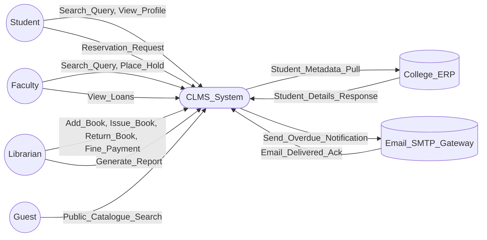
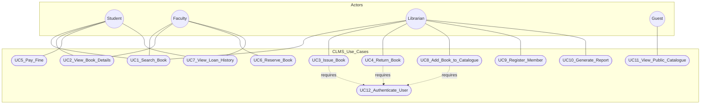
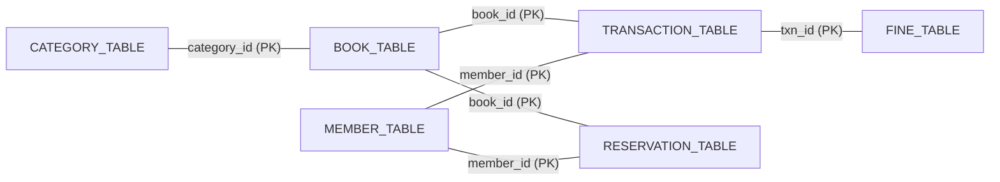
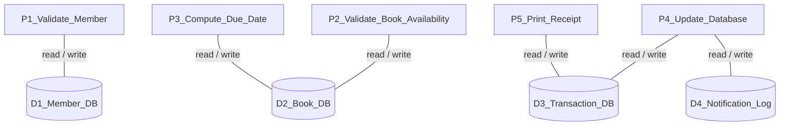
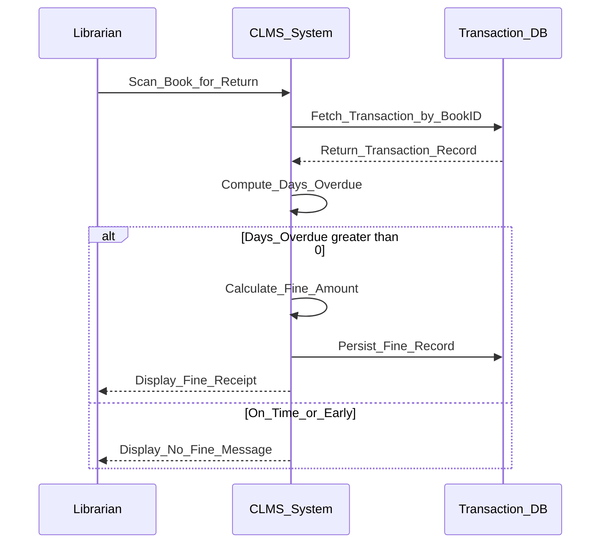

# Case study:  SRS for College Library Management Software

<!-- SECTION_1_START -->
# Software Requirements Specification (SRS) & College Library Management Software

## 1.1 Formal Academic Definition (KTU 2024 Terminology)

> [!IMPORTANT]
> **Software Requirements Specification (SRS)** is a formal document that completely describes the **external behaviour** of the software system, the **constraints** under which it must operate, and all the **functional** and **non-functional requirements** that the proposed software must satisfy. It serves as the **contract** between the developer and the customer.

According to the **IEEE Standard 830-1998**, an SRS is established as the official statement of what the system developers must implement. It is the result of the **Requirements Engineering** phase, which comprises four sub-activities: *Elicitation*, *Analysis*, *Specification*, and *Validation*.

> [!NOTE]
> **Syllabus Highlight (PECS-CST 411, Module 1):** The College Library Management Software (CLMS) is a classic pedagogical case study used to demonstrate how abstract requirement-gathering principles translate into a concrete, structured, and traceable specification document.

## 1.2 The Intuitive Analogy — "The Architectural Blueprint"

Imagine you are commissioning the construction of a new house for your family. Before the first brick is laid, you sign a **Legal Contract** with the architect. This contract lists every room, the number of power sockets, the load-bearing capacity of the walls, the paint colour, and the safety codes.

* The **SRS** is exactly that **Legal Contract** between the *client* and the *software engineer*.
* If the client later says, *"I wanted a swimming pool!"*, the engineer can point to the SRS and say, *"It is not in the contract"*.
* If the engineer delivers a house without a kitchen, the client can say, *"You violated Section 4.2.1 of our contract"*.

> [!TIP]
> **Golden Rule of Software Engineering:** *If it is not in the SRS, do not build it. If you build it, it is not in the scope.* The SRS is the single source of truth that eliminates **ambiguity**, **scope creep**, and **legal disputes**.

## 1.3 Why CLMS as a Case Study?

A College Library Management Software is used in KTU board examinations because it is a **familiar domain** to every engineering student. Almost every student has personally used a library card, an OPAC (Online Public Access Catalogue), and a digital check-out counter. This familiarity allows examiners to test:

* **Functional requirements** (issuing a book, calculating a fine).
* **Data requirements** (storing student, book, and transaction records).
* **Constraints** (maximum loan period, concurrent user limits).
* **External interfaces** (barcode scanner integration, printer for receipts).

> [!VISUALIZATION CONTROL]
> **Concept:** Hierarchical decomposition of an SRS document
> **Logical Tree Representation:**
> * `Root: SRS_Document`
> * `Child_1: Introduction_Purpose_Scope`
> * `Child_2: Overall_Description_Product_Perspective`
> * `Child_3: Specific_Requirements_Functional_NonFunctional`
> * `Child_4: Appendices_Glossary_Index`
> **Visual Description:** Observe how the SRS is decomposed into four primary sections, with *Specific Requirements* being the deepest and most detailed branch, reflecting the engineering complexity of the system.
<!-- SECTION_1_END -->

<!-- SECTION_2_START -->
# Deep Theoretical Analysis & KTU High-Yield Formula Sheet

## 2.1 The IEEE 830 Standard Structure

The IEEE 830 standard prescribes a **five-part canonical structure** for an SRS. The examiner expects you to write at least the *purpose*, *scope*, and *specific requirements* for full marks.

> [!NOTE]
> **Section 1 — Introduction**
> 1.1 Purpose
> 1.2 Scope of the Project (Product Perspective, Functions, Operating Environment, User Characteristics)
> 1.3 Definitions, Acronyms, Abbreviations
> 1.4 References
> 1.5 Overview of the Document

> [!NOTE]
> **Section 2 — Overall Description**
> 2.1 Product Perspective (interfaces, system interfaces, constraints, memory, operations)
> 2.2 Product Functions (summary of major functions)
> 2.3 User Characteristics
> 2.4 Constraints
> 2.5 Assumptions and Dependencies

> [!NOTE]
> **Section 3 — Specific Requirements** *(The Heart of the SRS)*
> 3.1 Functional Requirements
> 3.2 Non-Functional Requirements (Performance, Reliability, Security, Maintainability, Portability)
> 3.3 External Interface Requirements (User, Hardware, Software, Communication)
> 3.4 Design Constraints

## 2.2 The Eight Pillars of a Good SRS

| # | Quality Attribute | Definition | Real-World Engineering Implication |
|---|---|---|---|
| 1 | **Correct** | Every requirement accurately represents a real stakeholder need. | Prevents expensive post-deployment patches. |
| 2 | **Unambiguous** | Each requirement has only one possible interpretation. | Eliminates disputes during validation. |
| 3 | **Complete** | All significant requirements are included. | No *To Be Decided* placeholders in the final draft. |
| 4 | **Consistent** | No requirement conflicts with another. | The system behaves predictably. |
| 5 | **Ranked** | Requirements are prioritized (e.g., MoSCoW). | Helps in Agile sprint planning. |
| 6 | **Verifiable** | A test case can be written for every requirement. | Enables formal V&V (Verification & Validation). |
| 7 | **Modifiable** | Changes can be made consistently and traceably. | Supports change management. |
| 8 | **Traceable** | Origin and downstream impact of each requirement is tracked. | Backward and forward traceability matrices. |

## 2.3 The Two Pillars: Functional vs. Non-Functional Requirements

> [!IMPORTANT]
> **Functional Requirements (FR):** Define *what the system does*. They describe specific behaviours, functions, or services the system must perform. They are typically expressed as **"The system shall..."** statements.
> Examples for CLMS: *"The system shall allow the librarian to add a new book record."*

> [!IMPORTANT]
> **Non-Functional Requirements (NFR):** Define *how well the system does it*. They are quality attributes, constraints, and performance metrics. They are often quantified.
> Examples for CLMS: *"The search query shall return results within 2 seconds for a database of up to 50,000 records."*

## 2.4 KTU Formula Cheat Sheet — Key Specification Patterns

| Notation / Pattern | Use Case | Example for CLMS |
|---|---|---|
| **EARS Pattern** | Easy Approach to Requirements Syntax | *When* the student scans a barcode, *the system shall* validate the membership status. |
| **MoSCoW** | Prioritization | **M**ust have, **S**hould have, **C**ould have, **W**on't have. |
| **SMART** | Quality of requirement statement | **S**pecific, **M**easurable, **A**chievable, **R**elevant, **T**ime-bound. |
| **DFD Level 0** | Context Diagram | Shows system as a single bubble with external entities. |
| **Use Case** | Behavioural spec | `Actor: Librarian`, `Action: Issue Book`, `Pre: Book is available`. |
| **ER Cardinality** | Data model | `One Student can borrow Many Books (1:N)`. |

## 2.5 Engineering Utility of an SRS

In the software industry, an SRS is a **legally binding document** in many jurisdictions. It forms the basis for:
* **Project Estimation** (Cost, Schedule, Effort using COCOMO).
* **Test Plan Generation** (each "shall" statement becomes a test case).
* **User Acceptance Testing (UAT)** sign-off criteria.
* **Change Request Management** (any deviation must be formally logged).
* **Contractual Disputes** in case of delivery failure.

$$ \text{Cost of Fix} = f(\text{Phase of Detection}) $$

The cost of fixing a defect detected in the *requirements phase* is roughly **$\mathbf{50\times}$** cheaper than fixing it after deployment. This is the central economic justification for investing time in a high-quality SRS.
<!-- SECTION_2_END -->

<!-- SECTION_3_START -->
# Step-by-Step Construction of the SRS for College Library Management Software (CLMS)

> [!IMPORTANT]
> This section is a **complete, exam-ready SRS case study**. Memorize the structure, but adapt the content if the examiner specifies a different domain (Hospital, ATM, etc.). The blue-shaded headers correspond to IEEE 830 sections.

## 3.1 Step 1 — Section 1: Introduction

### 1.1 Purpose
The purpose of this document is to describe the **functional and non-functional requirements** of the *College Library Management Software (CLMS)*. It is intended for the developers, the testing team, and the college administration. It will serve as the **baseline reference** for validation, verification, and acceptance testing.

### 1.2 Scope of the Project

* **Product Perspective:** The CLMS is a **standalone, web-based application** that will replace the current manual register-based system. It will integrate with the existing **college ERP** to pull student metadata.
* **Product Functions:** Book acquisition, cataloguing, circulation (issue/return), fine calculation, member management, OPAC search, and report generation.
* **User Class & Characteristics:** The system serves four primary actor classes — *Student*, *Faculty*, *Librarian* (admin), and *Guest* (unauthenticated visitor).
* **Operating Environment:** A **Client-Server architecture** running on **Windows 11 / Ubuntu 22.04 LTS** servers. The web client is compatible with modern browsers (Chrome, Firefox, Edge).
* **Design & Implementation Constraints:** The backend shall be developed in **Python (Django)**, the database shall be **PostgreSQL 15**, and the system must comply with the college's *IT Security Policy v3.2*.

### 1.3 Definitions, Acronyms, Abbreviations

| Term | Expansion |
|---|---|
| CLMS | College Library Management Software |
| OPAC | Online Public Access Catalogue |
| ISBN | International Standard Book Number |
| RFID | Radio-Frequency Identification |
| ERP | Enterprise Resource Planning |
| SRS | Software Requirements Specification |

## 3.2 Step 2 — Section 2: Overall Description

### 2.1 Product Perspective (System Architecture)

The CLMS is a **self-contained module** but depends on three external interfaces:

| Interface ID | External System | Data Exchanged |
|---|---|---|
| `INT-01` | College ERP | Student ID, Name, Department, Email. |
| `INT-02` | Barcode Scanner Hardware | ISBN-13, Student Roll Number. |
| `INT-03` | Email Gateway (SMTP) | Overdue notifications, receipts. |

### 2.2 User Characteristics

| User Class | Technical Proficiency | Frequency of Use |
|---|---|---|
| Student | Low to Medium | 2-3 times/week |
| Faculty | Medium | 1-2 times/week |
| Librarian | High | Daily, full working day |
| Guest | Low | Rare |

### 2.3 Assumptions and Dependencies
1. Every student is pre-registered in the college ERP.
2. RFID tags are pre-affixed on all books.
3. The college has a stable **10 Mbps** internet connection.
4. The PostgreSQL database server has a minimum of **$\mathbf{50 \text{ GB}}$** of storage.

## 3.3 Step 3 — Section 3: Specific Requirements

### 3.1 Functional Requirements (FR)

> [!TIP]
> **Examiner Tip:** Use the *passive voice* and the *shall* keyword. "The system shall..." earns more marks than "The system can..." or "We want the system to...".

| FR-ID | Requirement Description |
|---|---|
| **FR-01** | The system shall allow the **Librarian** to add a new book record to the catalogue by entering the ISBN, title, author, and category. |
| **FR-02** | The system shall allow the **Librarian** to register a new member by linking the student ERP ID to a unique library card number. |
| **FR-03** | The system shall allow the **Librarian** to issue a book to a member by scanning the book's RFID and the member's card. |
| **FR-04** | The system shall **validate** that the book is not already issued before completing the issue transaction. |
| **FR-05** | The system shall calculate a **fine of $\mathbf{\text{₹} 5.00 \text{ per day}}$** for any book returned after the due date. |
| **FR-06** | The system shall allow the **Student** to search the OPAC by title, author, ISBN, or category using a **full-text search**. |
| **FR-07** | The system shall send an **email notification** to a member 2 days before a book's due date. |
| **FR-08** | The system shall generate a **daily report** of issued and returned books for the Librarian. |
| **FR-09** | The system shall allow the **Faculty** to place a *hold* on a currently issued book. |
| **FR-10** | The system shall allow the **Guest** to view only the public catalogue (titles and availability status). |

### 3.2 Non-Functional Requirements (NFR)

| NFR-ID | Category | Requirement Specification |
|---|---|---|
| **NFR-01** | Performance | The OPAC search shall return results in $\le \mathbf{2 \text{ seconds}}$ for a catalogue of up to $\mathbf{100{,}000}$ records. |
| **NFR-02** | Availability | The system shall have a minimum uptime of $\mathbf{99.9\%}$ during college working hours (Mon-Sat, 8 AM - 8 PM). |
| **NFR-03** | Security | All passwords shall be hashed using **bcrypt** with a salt. All SQL queries shall use **parameterized statements** to prevent SQL injection. |
| **NFR-04** | Usability | A new Student shall be able to perform a book search within **$\mathbf{3 \text{ minutes}}$** of first login, without training. |
| **NFR-05** | Maintainability | Any future code change shall be deployable to production within **$\mathbf{4 \text{ hours}}$** of a successful unit test. |
| **NFR-06** | Scalability | The system shall support a concurrent user load of **$\mathbf{500 \text{ users}}$** with no degradation in response time. |
| **NFR-07** | Data Integrity | The database shall enforce **ACID properties** for all transaction records. |

### 3.3 Use Case Specification — *Issue Book*

* **Use Case ID:** UC-01
* **Use Case Name:** Issue Book to Member
* **Primary Actor:** Librarian
* **Supporting Actor:** Member (Student/Faculty)
* **Pre-conditions:**
  1. The Member is registered in the system.
  2. The Member has no overdue books.
  3. The Member's borrowed count is less than the limit (**Students: 3, Faculty: 10**).
* **Post-conditions:**
  1. A transaction record is created with status `ISSUED`.
  2. The book's status changes to `NOT_AVAILABLE`.
  3. A receipt is printed.

* **Main Flow:**

  | Step | Actor Action | System Response |
  |---|---|---|
  | 1 | Librarian scans the Member's library card. | System displays Member profile. |
  | 2 | Librarian scans the book's RFID tag. | System fetches book details. |
  | 3 | | System validates pre-conditions (FR-04, UC-01). |
  | 4 | | System calculates the **due date** = `Issue Date + 14 days` (Students) or `Issue Date + 90 days` (Faculty). |
  | 5 | | System updates the database. |
  | 6 | | System prints the receipt. |
  | 7 | Librarian hands the book to the Member. | |

* **Alternative Flow — Book Not Available:**
  At Step 2, if the book is already issued, the system shall display the message *"Book already issued. Expected return date: YYYY-MM-DD"* and terminate the use case.

* **Alternative Flow — Member Has Overdue:**
  At Step 3, if the Member has overdue books, the system shall display the message *"Member has overdue fines of ₹X. Please clear fines first."* and terminate the use case.

### 3.4 Data Model — Entities and Attributes

| Entity | Key Attributes | Notes |
|---|---|---|
| **Book** | `book_id` (PK), `isbn` (Unique), `title`, `author`, `category`, `rfid_tag` (Unique), `status` | Status: `AVAILABLE`, `ISSUED`, `RESERVED`, `LOST`. |
| **Member** | `member_id` (PK), `erp_id` (Unique, FK), `name`, `email`, `member_type` | Member type: `STUDENT`, `FACULTY`. |
| **Transaction** | `txn_id` (PK), `book_id` (FK), `member_id` (FK), `issue_date`, `due_date`, `return_date`, `fine_amount` | Records every issue/return event. |
| **Fine** | `fine_id` (PK), `txn_id` (FK), `amount`, `payment_status`, `payment_date` | Tracks financial penalties. |
| **Reservation** | `reserve_id` (PK), `book_id` (FK), `member_id` (FK), `reserve_date` | For holds placed by Faculty. |

### 3.5 Algorithm — Fine Calculation

$$ \text{Fine} = \max \left( 0, \; (\text{Return Date} - \text{Due Date}) \right) \times \text{Rate} $$

```python
from datetime import date
from typing import Final

class FineCalculator:
    """
    Calculates overdue fine for the College Library Management Software.
    Rate: Rs. 5.00 per day for Students, Rs. 2.00 per day for Faculty.
    """
    STUDENT_RATE: Final[float] = 5.00
    FACULTY_RATE: Final[float] = 2.00

    def calculate_fine(self, due_date: date, return_date: date, member_type: str) -> float:
        # Boundary check: return before or on the due date -> no fine
        if return_date <= due_date:
            return 0.0

        days_overdue = (return_date - due_date).days

        if member_type.upper() == "STUDENT":
            rate = self.STUDENT_RATE
        elif member_type.upper() == "FACULTY":
            rate = self.FACULTY_RATE
        else:
            raise ValueError(f"Unknown member type: {member_type}")

        fine = days_overdue * rate
        return fine


# --- Validation / Test Demonstration ---
if __name__ == "__main__":
    calc = FineCalculator()
    # A book was due on 2024-11-01 and was returned on 2024-11-10
    test_due = date(2024, 11, 1)
    test_return = date(2024, 11, 10)
    student_fine = calc.calculate_fine(test_due, test_return, "STUDENT")
    print(f"Student fine for 9 overdue days: Rs. {student_fine}")
    # Expected output: Rs. 45.0

    early_return = date(2024, 10, 30)
    print(f"Student fine for early return: Rs. {calc.calculate_fine(test_due, early_return, 'STUDENT')}")
    # Expected output: Rs. 0.0
```

### 3.6 Data Dictionary (Excerpt)

| Data Element | Type | Size | Constraint |
|---|---|---|---|
| `book.isbn` | `VARCHAR` | 13 | Unique, Not Null, Regex: `^\d{13}$` |
| `member.erp_id` | `VARCHAR` | 10 | Unique, Not Null, FK to ERP |
| `txn.due_date` | `DATE` | — | Not Null, must be $\ge$ `issue_date` |
| `txn.fine_amount` | `DECIMAL` | (8, 2) | Default 0.00, $\ge 0$ |
<!-- SECTION_3_END -->

<!-- SECTION_4_START -->
# Structural Diagrams & Schematics for CLMS

## 4.1 Context Diagram (DFD Level 0)

The Context Diagram shows the entire CLMS as a **single process bubble** and its interactions with the four external entities.



## 4.2 Use Case Diagram (Functional Overview)



## 4.3 Entity-Relationship (ER) Diagram



## 4.4 DFD Level 1 — Decomposition of the Issue-Book Process



## 4.5 Process Flow — Fine Calculation Sequence


<!-- SECTION_4_END -->

<!-- SECTION_5_START -->
# KTU 2024 Scheme Examination Question Bank & Topic Recap

## Part A — Short Answer Questions (3 Marks Each)

### Question 1
**[KTU University Exam — July 2024]**
**CO1 | RBT Level: Remember**
*List any **four characteristics** of a good Software Requirements Specification (SRS) as per the IEEE 830 standard.*

**Model Answer (Valuation Key):**
1. **Correct** — Each requirement accurately reflects a stakeholder need. [1 Mark]
2. **Unambiguous** — Each requirement has exactly one interpretation. [0.5 Mark]
3. **Complete** — All significant requirements, including non-functional ones, are included. [0.5 Mark]
4. **Verifiable** — A concrete test case can be written to check compliance. [0.5 Mark]
5. *(Any one of: Consistent, Modifiable, Traceable, Ranked)* [0.5 Mark]

---

### Question 2
**[KTU University Exam — Dec 2023]**
**CO1 | RBT Level: Understand**
*Differentiate between **Functional Requirements** and **Non-Functional Requirements** with one example each from a Library Management System.*

**Model Answer (Valuation Key):**

| Aspect | Functional Requirement | Non-Functional Requirement |
|---|---|---|
| **Focus** | *What* the system does. | *How well* the system does it. |
| **Nature** | Specific features/behaviours. | Quality attributes/constraints. |
| **Measurability** | Often binary (works/doesn't). | Quantified with metrics. |
| **Example** | *"The system shall allow the librarian to issue a book."* | *"The OPAC search shall return results within 2 seconds for 100,000 records."* |

[1 Mark for definition, 1 Mark for difference, 1 Mark for valid example] = 3 Marks

---

## Part B — Long Answer Questions (14 Marks Each — ESE Module Choice)

> [!NOTE]
> In the KTU End Semester Examination (ESE), Module 1 questions carry a **maximum of 14 marks** with a typical split of **(a) 7 Marks** and **(b) 7 Marks**. You are expected to answer **either** Question A **or** Question B in full.

### Question A (14 Marks)
**[KTU University Exam — Model Paper, 2024 Scheme]**
**CO1, CO2 | RBT Levels: Understand, Apply**

**(a)** Explain the **IEEE 830 standard structure** of an SRS. Describe any **four sections** of this structure in detail. *(7 Marks)*

**(b)** For a **College Library Management Software (CLMS)**, prepare the following sections of the SRS:
* (i) **Purpose and Scope** of the product
* (ii) **Four Functional Requirements** using the *"The system shall..."* format
* (iii) **Three Non-Functional Requirements** with quantified metrics *(7 Marks)*

---

#### Model Answer — Question A

**(a) IEEE 830 Standard Structure of an SRS** [Stating the 5 main parts: 2 Marks]

The IEEE 830-1998 standard prescribes the following canonical five-part structure:

1. **Introduction** — defines purpose, scope, definitions, references. [0.5 Mark]
2. **Overall Description** — product perspective, functions, user characteristics, constraints, assumptions. [0.5 Mark]
3. **Specific Requirements** — functional, non-functional, external interfaces, design constraints. [0.5 Mark]
4. **Verification & Validation Criteria** *(optional but recommended)*. [0.5 Mark]
5. **Appendices** — data dictionary, use case details, traceability matrix, glossary. [0.5 Mark]

*Detailed explanation of any 2 sections:* [2 Marks]
*For example, the* ***Specific Requirements*** *section is the core of the SRS. It must list every functional requirement, every performance constraint, every interface, and every design limitation. Requirements should be testable, traceable, and prioritized.*

**(b) CLMS SRS Excerpt** [Identifying correct section headers: 1 Mark]

* **(i) Purpose and Scope** [Purpose: 1 Mark, Scope: 1 Mark]

> **Purpose:** This document specifies the requirements for the *College Library Management Software (CLMS)*, a web-based application to automate the circulation, cataloguing, and member management functions of the college central library. It will serve as a reference for design, development, testing, and acceptance.

> **Scope:** The CLMS will support the *Librarian* in book acquisition, the *Member* in searching and reserving, and the *Faculty* in bulk borrowing. It will integrate with the existing *College ERP* for student data. The system will be deployed on the college intranet and will be accessible only to authenticated users, except for the public OPAC search.

* **(ii) Functional Requirements** [Each requirement: 0.5 Mark × 4 = 2 Marks]

| FR-ID | Requirement |
|---|---|
| **FR-01** | The system shall allow the Librarian to add a new book record by entering the ISBN-13, title, author, and category. |
| **FR-02** | The system shall allow the Librarian to issue a book by scanning the book RFID and the member's library card. |
| **FR-03** | The system shall calculate a fine of **₹ 5.00 per day** for overdue books belonging to Students. |
| **FR-04** | The system shall allow the Student to search the OPAC catalogue by title, author, ISBN, or category. |

* **(iii) Non-Functional Requirements** [Each requirement: 0.5 Mark × 3 = 1.5 Marks; Quantification: 0.5 Mark = 2 Marks total]

| NFR-ID | Category | Quantified Metric |
|---|---|---|
| **NFR-01** | Performance | OPAC search shall return results in $\le 2$ seconds for 100,000 records. |
| **NFR-02** | Availability | The system shall maintain 99.9% uptime during college working hours. |
| **NFR-03** | Security | All passwords shall be hashed with bcrypt; all data in transit shall use TLS 1.3. |

---

### Question B (14 Marks) — Alternative Choice
**[KTU University Exam — Model Paper, 2024 Scheme]**
**CO1, CO2 | RBT Levels: Understand, Apply**

**(a)** With a neat **Use Case diagram**, describe the process of **book issue and return** in a Library Management System. Your answer must include **two alternative flows**. *(7 Marks)*

**(b)** Identify and explain any **five functional requirements** and **four non-functional requirements** of a Library Management System. For each non-functional requirement, provide a **specific metric**. *(7 Marks)*

---

#### Model Answer — Question B

**(a) Use Case Diagram — Book Issue and Return** [Diagram: 3 Marks, Main flow: 2 Marks, Alternative flows: 2 Marks]

*(Refer to the **Use Case Diagram** in **Section 4.2** of these notes for the full Mermaid rendering.)*

**Main Flow (Book Issue):**
1. The Librarian logs into the CLMS using valid credentials.
2. The Librarian scans the member's library card.
3. The system validates the member's status (no overdue books, within borrow limit).
4. The Librarian scans the book's RFID.
5. The system checks that the book status is `AVAILABLE`.
6. The system computes the due date and persists the transaction.
7. The system prints a receipt and updates the book status to `ISSUED`.

**Alternative Flow 1 — Book Already Issued:**
At Step 5, if the book status is `ISSUED`, the system displays *"This book is currently issued. Expected return: YYYY-MM-DD"*, and the use case terminates.

**Alternative Flow 2 — Member Has Overdue Fines:**
At Step 3, if the member has outstanding fines, the system displays *"Please clear pending fines of ₹X before borrowing"*, and the use case terminates.

**(b) Five Functional Requirements** [Each FR: 0.5 Mark × 5 = 2.5 Marks]

1. **FR-01:** The system shall allow the librarian to add a new book record to the catalogue.
2. **FR-02:** The system shall allow the librarian to issue a book to a registered member.
3. **FR-03:** The system shall allow the librarian to process the return of an issued book.
4. **FR-04:** The system shall allow the student to search for a book by title, author, or ISBN.
5. **FR-05:** The system shall generate a daily transaction report for the librarian.

**Four Non-Functional Requirements** [Each NFR: 0.5 Mark, Metric: 0.5 Mark × 4 = 4 Marks]

| NFR-ID | Category | Requirement with Specific Metric |
|---|---|---|
| **NFR-01** | Performance | The book search shall return results within $\mathbf{2 \text{ seconds}}$ for up to $\mathbf{100{,}000}$ records. |
| **NFR-02** | Security | All user passwords shall be stored using **bcrypt hashing**; sessions shall expire after $\mathbf{15 \text{ minutes}}$ of inactivity. |
| **NFR-03** | Usability | A new user shall be able to perform a book search within $\mathbf{3 \text{ minutes}}$ without prior training. |
| **NFR-04** | Availability | The system shall provide $\mathbf{99.9\%}$ uptime during college working hours (Mon–Sat, 8 AM to 8 PM). |

---

## KTU Examiner's Valuation Warning / Pitfall Callout

> [!WARNING]
> **Common Mistakes that Cost Marks in the KTU Board Exam:**
> 1. **Forgetting the "shall" keyword:** Writing *"The system can issue books"* instead of *"The system shall issue books"* is considered an *optional* requirement and will lose at least **1 mark** per requirement.
> 2. **Vague Non-Functional Requirements:** Writing *"The system should be fast"* is worth **0 marks**. You **MUST** quantify it: *"The search shall complete within 2 seconds for 100,000 records."*
> 3. **Missing the Diagram:** In a 14-mark question on use cases, a *missing diagram* costs a minimum of **3 marks**. Always draw the actor stick figures, system boundary, and connect with labelled arrows.
> 4. **Confusing FR with NFR:** *"The system shall send an email on overdue"* is a **Functional Requirement** (behaviour). *"The email shall be delivered within 5 minutes"* is the **NFR** (performance).
> 5. **No IEEE 830 Section Numbering:** Always structure your answer with **1.1, 1.2, 2.1, 3.1** headings to mirror the IEEE standard. The examiner uses these as anchor points for valuation.
> 6. **Skipping the Validation Step:** Every requirement should ideally be **testable**. State the verification method: *"This can be verified by a unit test of the `calculate_fine()` function with a mocked date object."*

---

## Topic Recap & Important Things to Remember

* **SRS (IEEE 830)** is a formal specification document serving as a **contract** between stakeholders and developers. It eliminates ambiguity, scope creep, and contractual disputes.
* The **five canonical sections** of an SRS are: **Introduction, Overall Description, Specific Requirements, Verification (optional), and Appendices**.
* **Functional Requirements (FR)** describe *what* the system does. Use the **"The system shall..."** passive construction.
* **Non-Functional Requirements (NFR)** describe *how well*. Always provide a **quantified metric** (latency, uptime, concurrent users, etc.).
* The **eight quality attributes** of a good SRS are: **Correct, Unambiguous, Complete, Consistent, Ranked, Verifiable, Modifiable, and Traceable**.
* **Use Cases** must specify: *Actor, Pre-conditions, Main Flow, Post-conditions, and Alternative Flows*.
* **DFD Level 0 (Context Diagram)** shows the system as one bubble. **Level 1** decomposes it into sub-processes. **Level 2** further decomposes each sub-process.
* **ER Diagrams** model the data: **Entities (tables), Attributes (columns), Relationships (1:1, 1:N, M:N)**, with primary keys (PK) and foreign keys (FK).
* **MoSCoW Prioritization**: Must have, Should have, Could have, Won't have (for Agile release planning).
* **EARS Pattern**: Easy Approach to Requirements Syntax — uses *When/While/If/Where* triggers followed by *the system shall*.
* The **cost of fixing a defect** in the requirements phase is roughly **$50\times$ cheaper** than fixing it post-deployment — this is the economic justification for rigorous SRS.
* The **CLMS Case Study** is a KTU favourite because it touches all major concepts: FRs (issue/return/search), NFRs (2-second response), Use Cases (UC-01 Issue Book), and Data Models (Book, Member, Transaction, Fine).
* **Fine Calculation Formula** (memorize):

  $$ \text{Fine} = \max\left(0, \, (\text{Return Date} - \text{Due Date})_{\text{days}}\right) \times \text{Rate} $$

* **Student Loan Limit**: typically 3 books, **14 days**. **Faculty Loan Limit**: typically 10 books, **90 days**. These are the *default* KTU examiner values.
* **Passwords must be hashed** (bcrypt/argon2), **SQL must be parameterized** (prevent injection), **Data in transit must be TLS-encrypted** (NFR security triad).
<!-- SECTION_5_END -->
