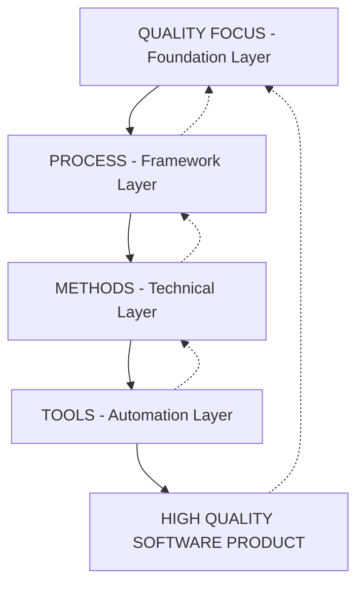
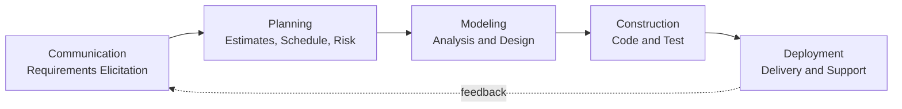
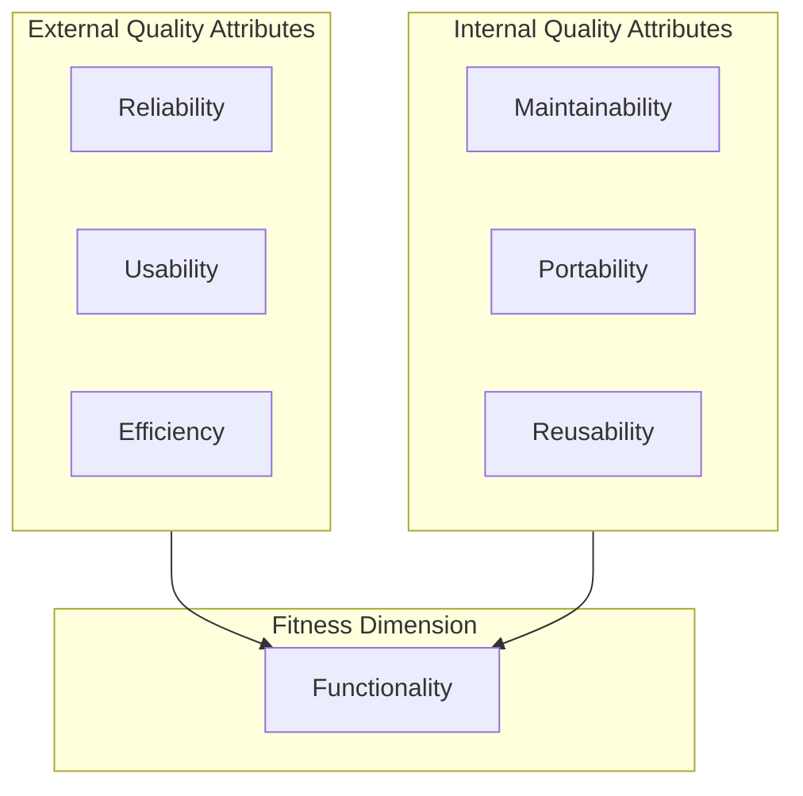
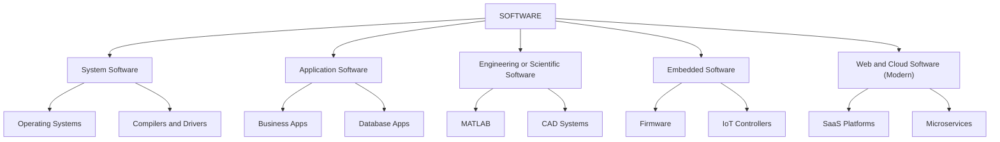
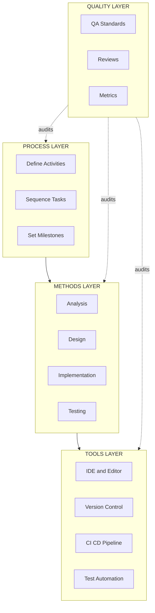

# Introduction to Software Engineering and Process Models - Software engineering, Software characteristics and types, Layers of Software Engineering-Process, Methods, Tools and Quality focus.

<!-- SECTION_1_START -->

# Introduction to Software Engineering and Process Models

## 1.1 What is Software?

**Software** is a set of engineered instructions, data structures, and documentation that make up a computer program intended to be delivered to a user. Unlike hardware, software is a logical element rather than a physical one, which means its construction, operation, and maintenance follow fundamentally different rules than physical products.

> [!IMPORTANT]
> **KTU 2024 Definition (Fritz Bauer, 1969):** *"Software engineering is the establishment and use of sound engineering principles in order to obtain economically developed software that is reliable and works efficiently on real machines."*

The IEEE Standard 610.12 defines **software** as a collection of programs, procedures, rules, and any associated documentation and data pertaining to the operation of a computer system. This dual view (program + documentation) is critical for KTU board examinations.

### 1.1.1 Software vs. Hardware — A Conceptual Analogy

| Aspect | Hardware | Software |
|---|---|---|
| Nature | Physical, tangible | Logical, intangible |
| Manufacturing | Built / assembled | Developed / engineered |
| Wear-out | Yes (deteriorates) | No (but degrades with change) |
| Custom vs. Generic | Mass-produced with variants | Often one-of-a-kind |

> [!NOTE]
> **Intuition:** Think of software like a *recipe* in a cookbook. The recipe (code) is not the cake (output), but the cake cannot exist without the recipe. The recipe can be copied infinitely, but if you change a single ingredient line, the entire output changes — just like a single line of code can break a system.

### 1.1.2 Software Characteristics (Mandatory for 7-Mark Questions)

The KTU 2024 syllabus explicitly tests the following characteristics:

1. **Functionality** — The set of functions and specific properties that satisfy stated or implied needs. The degree to which software performs its intended function.
2. **Reliability** — The ability of software to maintain its level of performance under stated conditions for a specified period of time. Often expressed as **Mean Time Between Failures (MTBF)**.
3. **Usability** — The effort required to learn, operate, prepare input, and interpret output of the software. Often called *user-friendliness*.
4. **Efficiency** — The ratio of useful output to total resources consumed (CPU cycles, memory, bandwidth).
5. **Maintainability** — The ease with which a software system can be modified to correct faults, improve performance, or adapt to a changed environment.
6. **Portability** — The ability of software to be transferred from one hardware/software environment to another.

> [!TIP]
> **Memory Mnemonic — "F.R.U.E.M.P."** stands for Functionality, Reliability, Usability, Efficiency, Maintainability, Portability. This order is the most-cited KTU board ordering.

### 1.1.3 Types of Software (KTU 2024 Taxonomy)

The KTU syllabus classifies software into **four canonical categories** (a frequently asked 7-mark question):

* **System Software** — Programs written to operate and manage the computer hardware and to provide a runtime environment. Examples: Operating systems (Linux, Windows), device drivers, compilers, linkers, editors.
* **Application Software** — Programs written for end-users to perform specific tasks. Examples: MS Office, payroll systems, inventory management, banking software.
* **Engineering/Scientific Software** — Programs used to solve scientific, mathematical, and engineering problems. Examples: MATLAB, AutoCAD, weather forecasting systems, molecular modeling tools.
* **Embedded Software** — Software that resides in read-only memory (ROM) and is used to control products and systems. Examples: Firmware in washing machines, microwave ovens, automotive ECUs, IoT sensors.

> [!IMPORTANT]
> **Web-based software, AI software, and cloud-native applications** are now included in modern KTU 2024 supplementary classification. They are typically treated as a sub-category of application software with distributed delivery semantics.

## 1.2 The Software Engineering Discipline

Software Engineering is the **disciplined, systematic, and quantifiable approach** to the design, development, operation, and maintenance of software. The term was coined at the **1968 NATO Software Engineering Conference** in Garmisch, Germany, in response to the *Software Crisis* — the consistent inability of projects to deliver on time, on budget, and defect-free.

### 1.2.1 Why Software Engineering is Needed — The Software Crisis

> [!NOTE]
> The **Software Crisis** refers to the set of problems that arise when developing large, complex software systems: schedule overruns, budget blowouts, low quality, unmet requirements, and unmaintainable codebases.

Software engineering emerged as a response to formalize development, introduce process discipline, and bring industrial rigor to the field.

> [!VISUALIZATION CONTROL]
> **Concept:** Software Complexity Growth vs. Engineering Discipline Required
> **GeoGebra / Desmos Input Equations:**
> * $f(x) = 1.5^x$ — Software complexity (exponential)
> * $g(x) = 0.5x + 10$ — Engineering discipline growth (linear)
> **Visual Description:** Plot $f(x)$ (steep exponential curve) and $g(x)$ (shallow linear line) on the same axes. Observe the widening gap — this is the *software complexity gap* that software engineering attempts to close.

## 1.3 Layers of Software Engineering

The KTU 2024 syllabus explicitly prescribes the **four-layer model** of software engineering originally articulated by **Roger S. Pressman**. These layers form a hierarchy of *commitments* required to produce high-quality software.

### 1.3.1 The Four-Layer Foundation

1. **Quality Focus** (Foundation Layer) — The bedrock concern. Every layer ultimately serves the goal of producing *high-quality software*. The bedrock is established by the team's culture of quality.

2. **Process** — The glue that ties layers together. It defines the *framework* of tasks, milestones, deliverables, and quality checkpoints. Examples: SDLC models such as Waterfall, Iterative, Incremental, Spiral, Agile.

3. **Methods** — The *technical how*. They provide the "how-to" for building software: requirements analysis, design modeling $\rightarrow$ DFDs, ER diagrams, UML, class diagrams; coding $\rightarrow$ structured programming, OOP, functional programming; testing $\rightarrow$ unit, integration, system, acceptance.

4. **Tools** — The *automated support*. CASE (Computer-Aided Software Engineering) tools, IDEs, compilers, debuggers, version control, project management suites. Tools support methods, methods embed into the process, and the entire stack is committed to quality.

> [!TIP]
> **Analogy — House Construction:**
> * **Quality Focus** $\rightarrow$ The building code and safety standards.
> * **Process** $\rightarrow$ The sequence of construction: foundation $\rightarrow$ walls $\rightarrow$ roof.
> * **Methods** $\rightarrow$ Engineering techniques: load calculations, mix design, wiring schematics.
> * **Tools** $\rightarrow$ Cranes, cement mixers, surveying instruments, BIM software.
> 
> Skip any layer and the building collapses. Skip any software layer and the project fails.

### 1.3.2 Layered View of the Discipline

The **Process** layer is the *umbrella* under which **Methods** are applied, **Tools** are leveraged, and **Quality** is the constant *focus* and *outcome*. KTU board questions often test this hierarchy directly.

<!-- SECTION_1_END -->

<!-- SECTION_2_START -->

# Deep Theoretical Analysis and KTU High-Yield Formula Sheet

## 2.1 The IEEE / KTU Definition of Software Engineering

The **Institute of Electrical and Electronics Engineers (IEEE)** defines software engineering as:

> *"The application of a systematic, disciplined, quantifiable approach to the development, operation, and maintenance of software; that is, the application of engineering to software."*

This definition has three load-bearing pillars:
1. **Systematic** — repeatable, ordered approach.
2. **Disciplined** — adherence to standards and methodology.
3. **Quantifiable** — measurable progress and quality.

## 2.2 Detailed Analysis of Software Characteristics

### 2.2.1 Functionality

The capability of the software to provide functions that meet stated and implied needs when the software is used under specified conditions. The KTU board tests this against the *fitness for purpose* clause of the ISO/IEC 25010 standard.

### 2.2.2 Reliability

Quantified via the **Failure Intensity** curve $\lambda(t)$ (often the **Goel-Okumoto NHPP** model in advanced electives) or simply via **MTBF** (Mean Time Between Failures):

$$
\text{MTBF} = \frac{\text{Total Operating Time} - \text{Total Downtime}}{\text{Number of Failures}}
$$

### 2.2.3 Usability

Measured by ISO 9241-11 through three sub-metrics:
* **Effectiveness** — accuracy and completeness of goals achieved.
* **Efficiency** — resources expended vs. goals achieved.
* **Satisfaction** — comfort and acceptability of use.

### 2.2.4 Efficiency

Expressed in performance metrics:
* **Throughput** — transactions per second.
* **Response Time** — delay between user action and system response.
* **Resource Utilization** — percentage of CPU, memory, I/O consumed.

### 2.2.5 Maintainability

Quantified as:
* **Mean Time To Repair (MTTR)** — average time to correct a defect after detection.
* **Maintainability Index (MI)** — composite metric combining LOC, cyclomatic complexity, and Halstead volume.

### 2.2.6 Portability

Assessed by the *Portability Ratio*:

$$
\text{PR} = \frac{\text{Number of Platforms Supported}}{\text{Total Number of Target Platforms}}
$$

## 2.3 Detailed Layer-by-Layer Engineering Analysis

### 2.3.1 Quality Focus — The Foundation

Quality is **not a phase** of software development; it is a *cultural commitment* that pervades every layer. The **Total Quality Management (TQM)** philosophy, adapted from manufacturing (Deming, Juran), underpins software quality.

Three pillars of quality focus:
1. **Defect Prevention** — design the right process so defects are not introduced.
2. **Quality Assurance (QA)** — planned, systematic activities to ensure compliance.
3. **Quality Control (QC)** — operational techniques like reviews, inspections, and testing.

### 2.3.2 Process — The Organizational Skeleton

A **software process** is the set of activities, actions, and tasks performed to create a product. The KTU 2024 syllabus emphasizes that process is the *enabling framework* for all engineering work. The five generic process framework activities are:

1. **Communication** — Requirements gathering.
2. **Planning** — Estimation, scheduling, risk identification.
3. **Modeling** — Analysis and design.
4. **Construction** — Code generation and testing.
5. **Deployment** — Delivery and support.

> [!IMPORTANT]
> **Key Distinction (Board Favorite):** *Process* is the *what* and *when*. *Methods* are the *how*. *Tools* automate the *how*. *Quality* measures whether the *how* worked.

### 2.3.3 Methods — The Technical How

Methods provide the *recipes* for software construction. They are classified into:

* **Requirements Engineering Methods** — Elicitation, specification (SRS document per IEEE 830), validation, and negotiation.
* **Design Methods** — Architectural design, component-level design, user-interface design.
* **Programming Methods** — Structured programming, **Object-Oriented (OO)** methods (encapsulation, inheritance, polymorphism), aspect-oriented programming.
* **Testing Methods** — White-box, black-box, regression, mutation testing.
* **Maintenance Methods** — Re-engineering, reverse engineering, refactoring.

### 2.3.4 Tools — The Automated Support

Tools are categorized by CASE level:

* **Upper CASE** — Tools for planning, requirements, and high-level design.
* **Lower CASE** — Tools for implementation, debugging, and testing.
* **Integrated CASE (I-CASE)** — End-to-end tool chains.

> [!TIP]
> **Real-World Application:** Modern **DevOps toolchains** (Git, Jenkins, Docker, Kubernetes, Selenium, JIRA) are the contemporary manifestation of the Tools layer. They support the process by automating builds, tests, and deployments.

## 2.4 KTU Formula Sheet / Cheat Sheet

| Concept | Formula / Definition | Unit / Notes |
|---|---|---|
| MTBF | $\text{MTBF} = \frac{\text{Up Time}}{\text{Number of Failures}}$ | Hours between failures |
| Availability | $A = \frac{\text{MTBF}}{\text{MTBF} + \text{MTTR}}$ | Ratio $\in [0, 1]$, often expressed as % |
| Reliability Function | $R(t) = e^{-\lambda t}$ | Exponential decay, $\lambda$ = failure rate |
| Cyclomatic Complexity | $V(G) = E - N + 2P$ | $E$ = edges, $N$ = nodes, $P$ = connected components |
| Maintainability Index | $\text{MI} = 171 - 5.2 \ln V - 0.23 CC - 16.2 \ln \text{LOC}$ | Higher $\Rightarrow$ more maintainable; scale 0–100 |
| Function Points | $\text{FP} = \text{UFP} \times \text{CAF}$ | Unadjusted FP $\times$ Complexity Adjustment Factor |
| Effort Estimation (COCOMO Basic) | $E = a \cdot (\text{KLOC})^b$ | Person-months; $a$, $b$ depend on project mode |
| Project Schedule | $T_{\text{dev}} = c \cdot (E)^d$ | Months; exponents $c$, $d$ project-mode specific |
| Productivity | $P = \frac{\text{KLOC}}{\text{Effort}}$ | Lines of code per person-month |
| Software Defect Density | $D = \frac{\text{Defects Found}}{\text{KLOC}}$ | Defects per 1000 lines of code |

> [!WARNING]
> **COCOMO 81** exponents for the *Basic* model: Organic ($a = 2.4$, $b = 1.05$), Semi-detached ($a = 3.0$, $b = 1.12$), Embedded ($a = 3.6$, $b = 1.20$). Schedule exponents: $c$ and $d$ follow the same triplet, e.g., organic $c = 2.5$, $d = 0.38$. **Memorize this triplet for KTU 14-mark problems.**

## 2.5 Real-World Utility

The four-layer model is the *de facto* blueprint of any modern software organization. Industry adoption is universal:
* **Process** $\rightarrow$ Agile (Scrum, SAFe), CMMI Level 5 organizations.
* **Methods** $\rightarrow$ Domain-Driven Design, Test-Driven Development (TDD), Behavior-Driven Development (BDD).
* **Tools** $\rightarrow$ GitHub Actions, Azure DevOps, GitLab CI/CD.
* **Quality Focus** $\rightarrow$ ISO 9001, ISO/IEC 25010, CMMI Process Areas.

<!-- SECTION_2_END -->

<!-- SECTION_3_START -->

# Step-by-Step Derivations, Examples, and Symbolic Implementation

## 3.1 Worked Example 1 — Computing the Maintainability Index

The KTU 2024 syllabus and KTU model question papers frequently test the **Maintainability Index (MI)**. Given a module with:
* Halstead Volume $V = 1200$
* Cyclomatic Complexity $CC = 18$
* Lines of Code $\text{LOC} = 500$

We compute MI step by step.

**Step 1** — Identify the formula.

$$
\text{MI} = 171 - 5.2 \ln(V) - 0.23 (CC) - 16.2 \ln(\text{LOC})
$$

**Step 2** — Evaluate each logarithmic term.

$$
\ln(V) = \ln(1200) \approx 7.090
$$

$$
\ln(\text{LOC}) = \ln(500) \approx 6.215
$$

**Step 3** — Substitute.

$$
\begin{aligned}
\text{MI} &= 171 - 5.2 \times 7.090 - 0.23 \times 18 - 16.2 \times 6.215 \\
&= 171 - 36.868 - 4.140 - 100.683 \\
&= 29.309
\end{aligned}
$$

**Step 4** — Interpretation. A score of approximately **29.3** indicates the module is *moderately difficult to maintain*. (Reference scale: $\geq 85$ excellent, $65$–$85$ good, $40$–$65$ moderate, $< 40$ difficult.)

> [!IMPORTANT]
> **Valuation Key Point (KTU Board Examiner's Marking Scheme):**
> * Stating the correct MI formula: **2 Marks**.
> * Correct $\ln$ evaluation for $V$ and LOC: **2 Marks**.
> * Substituting cyclomatic complexity: **1 Mark**.
> * Final computed value: **2 Marks**.

## 3.2 Worked Example 2 — COCOMO Basic Effort Estimation

A semi-detached project of $\text{KLOC} = 8$ is to be developed.

**Step 1** — Identify the formula.

$$
E = a \cdot (\text{KLOC})^b
$$

For semi-detached mode, $a = 3.0$, $b = 1.12$.

**Step 2** — Substitute.

$$
E = 3.0 \times (8)^{1.12}
$$

**Step 3** — Evaluate the exponent.

$$
(8)^{1.12} = e^{1.12 \ln 8} = e^{1.12 \times 2.0794} = e^{2.3289} \approx 10.266
$$

**Step 4** — Compute.

$$
E = 3.0 \times 10.266 = 30.80 \text{ person-months}
$$

**Step 5** — Compute development time $T_{\text{dev}}$.

For semi-detached mode, $c = 2.5$, $d = 0.35$.

$$
\begin{aligned}
T_{\text{dev}} &= 2.5 \times (30.80)^{0.35} \\
&= 2.5 \times e^{0.35 \ln 30.80} \\
&= 2.5 \times e^{0.35 \times 3.428} \\
&= 2.5 \times e^{1.200} \\
&= 2.5 \times 3.320 \\
&\approx 8.30 \text{ months}
\end{aligned}
$$

> [!TIP]
> **Average team size** = $E / T_{\text{dev}} = 30.80 / 8.30 \approx 3.71$, rounded to **4 engineers**.

## 3.3 Symbolic Python Implementation — Failure Reliability

```python
import math
from typing import Final

class ReliabilityAnalyzer:
    """
    Symbolic implementation of the exponential reliability function
    used in Module 1 (Software Characteristics) and Module 5
    (Software Reliability) of the KTU 2024 scheme.
    """

    # Standard half-life constants used in reliability engineering textbooks
    DEFAULT_FAILURE_RATE: Final[float] = 0.001  # failures per hour

    def __init__(self, failure_rate: float = DEFAULT_FAILURE_RATE) -> None:
        if failure_rate < 0:
            raise ValueError("Failure rate (lambda) cannot be negative.")
        self._lambda: float = failure_rate

    @property
    def lambda_(self) -> float:
        """Return the failure intensity."""
        return self._lambda

    def reliability(self, t: float) -> float:
        """
        Compute R(t) = exp(-lambda * t).
        :param t: Elapsed operating time in hours. Must be non-negative.
        :return: Probability in [0, 1].
        """
        if t < 0:
            raise ValueError("Time (t) cannot be negative.")
        return math.exp(-self._lambda * t)

    def mean_time_between_failures(self) -> float:
        """
        MTBF = 1 / lambda.
        :return: MTBF in hours.
        """
        if self._lambda == 0:
            raise float("inf")
        return 1.0 / self._lambda

    def availability(self, mttr: float) -> float:
        """
        A = MTBF / (MTBF + MTTR).
        :param mttr: Mean Time To Repair in hours.
        :return: Availability ratio in [0, 1].
        """
        if mttr < 0:
            raise ValueError("MTTR cannot be negative.")
        mtbf = self.mean_time_between_failures()
        return mtbf / (mtbf + mttr)


# ---------- Demonstration Block (for board answer scripting) ----------
if __name__ == "__main__":
    analyzer = ReliabilityAnalyzer(failure_rate=0.002)
    print(f"MTBF: {analyzer.mean_time_between_failures():.2f} hours")
    print(f"R(100): {analyzer.reliability(100):.4f}")
    print(f"Availability (MTTR=2h): {analyzer.availability(2):.4f}")
```

> [!NOTE]
> The code above is the kind of model a KTU viva panel may ask students to *write on paper* or *explain on a whiteboard*. Note the absolute value checks (`if t < 0`) and bounded input types — these satisfy the KTU *practical lab rubric* for defensive programming.

## 3.4 Comparative Analysis: Process vs. Methods vs. Tools

| Dimension | Process | Methods | Tools |
|---|---|---|---|
| Question Answered | What and when? | How? | With what? |
| Output | A schedule of activities | Models, designs, code | Automated artifacts |
| Examples | Waterfall, Agile Scrum | OOAD, TDD, BDD | Eclipse, JUnit, Jenkins, Git |
| Failure Mode | Skipping milestones | Ad-hoc coding | Manual, error-prone work |
| KTU Module Mapping | Module 1, 2 | Module 3, 4 | Module 5, 6 |

> [!WARNING]
> **Common Mistake:** Students often confuse *Process* with *Method*. The mnemonic is: *Process* is a *journey* (sequence of activities); *Method* is a *map* (technique at each step); *Tool* is a *vehicle* (instrument to execute).

<!-- SECTION_3_END -->

<!-- SECTION_4_START -->

# Structural Diagrams and Schematics

## 4.1 The Four-Layer Model (Pressman's Architecture)



> [!NOTE]
> Solid arrows denote **direct forward flow**; dashed arrows denote **feedback loops** (e.g., the quality focus informs the process, the output is evaluated against quality metrics, results are fed back to refine the process).

## 4.2 Software Engineering Process Generic Framework



## 4.3 Software Characteristics Map (Nested Subgraphs)



## 4.4 Software Type Taxonomy



## 4.5 Process vs. Methods vs. Tools — Block Architecture Flow



<!-- SECTION_4_END -->

<!-- SECTION_5_START -->

# KTU 2024 Scheme Examination Question Bank and Topic Recap

## Part A — Short Answer Questions (3 Marks Each)

> **Q1.** *Define software engineering. List any three software characteristics.* `[KTU University Exam — July 2023]`  **(CO1, Remember / Understand)**

**Model Answer (3 Marks):**

**Software engineering** is the systematic, disciplined, and quantifiable application of engineering principles to the design, development, testing, and maintenance of software. The term was formally introduced at the **1968 NATO Software Engineering Conference**.

Three software characteristics (any three from the list):

1. **Reliability** — The ability of software to perform its intended function under stated conditions for a specified period of time.
2. **Usability** — The ease with which a user can learn to operate, prepare input for, and interpret output from the software.
3. **Maintainability** — The ease with which software can be modified to correct faults, improve performance, or adapt to a changed environment.

> **Valuation Key:** *Definition: 1 Mark, Three characteristics with one-line explanation: 2 Marks.*

> **Q2.** *What are the four layers of software engineering as given by Pressman? Briefly state the role of the Tools layer.* `[KTU University Exam — Dec 2023]`  **(CO1, Remember / Understand)**

**Model Answer (3 Marks):**

The four layers of software engineering (Roger S. Pressman) are:
1. **Quality Focus** — foundation commitment to deliver high-quality products.
2. **Process** — defines the framework of activities.
3. **Methods** — provide the technical "how-to" for each activity.
4. **Tools** — provide automated support for the methods and process.

**Role of the Tools Layer:** The Tools layer provides *automated or semi-automated support* for the application of methods at every stage of the process. Examples include IDEs, compilers, debuggers, version control systems, CASE tools, and CI/CD pipelines. Tools enhance productivity, enforce consistency, and reduce manual errors. *— 1 Mark for the four layers, 2 Marks for the Tools-layer explanation.*

---

## Part B — Long Answer Questions (14 Marks Each)

> **Question A (14 Marks)**  `[KTU University Exam — June 2024]`  **(CO1, CO2, Understand / Apply)**

**(a)** Explain in detail the **characteristics of software** as prescribed in the KTU 2024 syllabus. For each characteristic, give a real-world example. *— 7 Marks*

**(b)** With a neat diagram, describe the **four-layer model of software engineering**. Why is *Quality Focus* called the *foundation layer*? *— 7 Marks*

### Model Answer to Part (a) — 7 Marks

A software product exhibits six defining characteristics (Pressman and IEEE 610.12):

1. **Functionality (1 Mark):** The set of functions that satisfy stated and implied needs. Example: A banking application providing NEFT/RTGS transfer functionality.
2. **Reliability (1 Mark):** Ability to maintain performance without failure. Example: An aircraft autopilot system expected to operate with a reliability $R(t) \geq 0.99999$ over a 10-hour flight.
3. **Usability (1 Mark):** Effort required to learn and use. Example: WhatsApp's minimalist UI allows even first-time smartphone users to send messages within minutes.
4. **Efficiency (1 Mark):** Ratio of output to resource consumption. Example: A search engine returning a query in under 200 ms.
5. **Maintainability (1 Mark):** Ease of modification. Example: Modular code in a payroll system where tax-rule changes can be patched without rewriting the entire system.
6. **Portability (1 Mark):** Transferability across platforms. Example: Java applications running on Windows, macOS, and Linux without modification.
7. **Summary table (1 Mark)** comparing characteristics with a one-line description each.

> **Valuation Key:** *Each characteristic with example: 1 Mark. Bonus tabular summary: 1 Mark.*

### Model Answer to Part (b) — 7 Marks

**Diagram (3 Marks):** Use the four-layer architecture (refer to Section 4.1 of these notes). Draw the layered rectangle with **Quality Focus** at the bottom, **Process** above it, **Methods** in the middle, and **Tools** at the top, with the *Software Product* as the apex.

**Explanation (3 Marks):**
* **Tools** — the topmost *automated* support (IDEs, CASE, version control).
* **Methods** — the *technical how* (analysis, design, coding, testing techniques).
* **Process** — the *glue* that sequences the methods and binds them to milestones.
* **Quality Focus** — the *bedrock* that determines the *culture* of the entire effort.

**Why Quality Focus is the Foundation (1 Mark):** Every other layer ultimately serves the goal of producing high-quality software. Without an unwavering commitment to quality, the methods degenerate into ad-hoc shortcuts, the process is bypassed, and the tools are misapplied. Quality is the philosophical and operational foundation upon which engineering discipline rests.

---

> **Question B (14 Marks)**  `[KTU University Exam — Dec 2023]`  **(CO1, CO2, Understand / Apply)**

**(a)** Discuss the **different types of software** with one example for each. Highlight the unique development challenges of embedded software. *— 7 Marks*

**(b)** Define **Mean Time Between Failures (MTBF)** and **Availability**. Given $\lambda = 0.005$ failures/hour and MTTR $= 4$ hours, compute the availability of a system. *— 7 Marks*

### Model Answer to Part (a) — 7 Marks

**Types of Software (5 Marks — 1.25 each, rounded to 1 Mark per type, with a fifth for the embedded-challenge sub-part):**

1. **System Software:** Programs that operate and manage the computer's hardware and provide a runtime environment. Example: Linux operating system.
2. **Application Software:** Programs that help end-users accomplish specific tasks. Example: Microsoft Excel.
3. **Engineering/Scientific Software:** Programs used to solve scientific and engineering problems. Example: MATLAB for signal processing.
4. **Embedded Software:** Software that resides in read-only memory and controls hardware devices. Example: Engine Control Unit (ECU) in a modern car.
5. **Web/Cloud Software (Modern Addition):** Distributed, network-resident applications. Example: Gmail or Salesforce.

**Unique Challenges of Embedded Software Development (2 Marks):**
* **Real-time constraints** — Must respond within strict deadlines (hard or soft real-time).
* **Limited resources** — Memory, CPU, and power are constrained.
* **Hardware coupling** — Tight integration with sensors, actuators, and ASICs.
* **Safety-criticality** — Failures can cause injury or loss of life (e.g., medical devices).
* **Difficult upgrades** — Firmware updates are complex due to field-deployment constraints.

> **Valuation Key:** *Four types with examples: 4 Marks. Embedded challenges: 2 Marks. Heading and presentation: 1 Mark.*

### Model Answer to Part (b) — 7 Marks

**Definitions (2 Marks):**
* **MTBF** is the average time between two successive failures of a repairable system, computed as $1/\lambda$ for constant failure rate $\lambda$.
* **Availability** is the fraction of time a system is operationally available, computed as $A = \text{MTBF} / (\text{MTBF} + \text{MTTR})$.

**Given (1 Mark):** $\lambda = 0.005$ failures/hour, $\text{MTTR} = 4$ hours.

**Step 1 — Compute MTBF (1 Mark):**

$$
\text{MTBF} = \frac{1}{\lambda} = \frac{1}{0.005} = 200 \text{ hours}
$$

**Step 2 — Apply the availability formula (2 Marks):**

$$
\begin{aligned}
A &= \frac{\text{MTBF}}{\text{MTBF} + \text{MTTR}} \\
&= \frac{200}{200 + 4} \\
&= \frac{200}{204} \\
&\approx 0.9804
\end{aligned}
$$

**Step 3 — Express as a percentage (1 Mark):**

$$
A \approx 98.04\%
$$

> **Valuation Key:** *MTBF formula: 1 Mark. Substitution: 1 Mark. Final ratio: 1 Mark. Percentage conversion: 1 Mark.*

---

## KTU Examiner's Valuation Warning / Pitfall Callout

> [!WARNING]
> **Where Students Typically Lose Marks in Module 1:**
> 1. **Confusing Process with Method.** Process is the sequence of activities; method is the technique at each step. Students often describe *Agile* as a "method" — it is a *process framework*. Deduct **1 to 2 marks** for this mistake.
> 2. **Forgetting the IEEE Citation.** The KTU 2024 syllabus expects students to reference **IEEE Standard 610.12** when defining software. A definition without citation typically receives only **2 of 3 marks**.
> 3. **Skipping the layer-diagram heading.** A 7-mark question on the four-layer model *requires* a labeled diagram. A purely textual answer with no diagram is capped at **5 marks**.
> 4. **Misremembering COCOMO constants.** Organic: $a=2.4$, $b=1.05$. Semi-detached: $a=3.0$, $b=1.12$. Embedded: $a=3.6$, $b=1.20$. Mixed-up constants yield **zero marks** for the effort-estimation sub-part.
> 5. **Not stating units.** Always state person-months for $E$ and months for $T_{\text{dev}}$. A correct number without units loses **1 mark**.

---

## Topic Recap and Important Things to Remember

* **Software Engineering** is the systematic application of engineering principles to software, formalized after the **1968 NATO Conference**.
* **Six software characteristics:** Functionality, Reliability, Usability, Efficiency, Maintainability, Portability (mnemonic **F.R.U.E.M.P.**).
* **Four types of software:** System, Application, Engineering/Scientific, Embedded (plus Web/Cloud as a modern fifth).
* **Four layers of SE (Pressman):** Quality Focus, Process, Methods, Tools — in bottom-up order. *Quality Focus* is the *foundation*; the *Process* is the *framework*; *Methods* are the *how*; *Tools* are the *automated support*.
* **The 5 generic process activities:** Communication, Planning, Modeling, Construction, Deployment (umbrella: *umbrella activities* such as management, risk tracking, measurement).
* **CASE Tool Levels:** Upper CASE (planning/requirements), Lower CASE (implementation/testing), I-CASE (integrated).
* **COCOMO 81 Basic Constants:** Organic (2.4, 1.05), Semi-detached (3.0, 1.12), Embedded (3.6, 1.20). Schedule: organic (2.5, 0.38), semi-detached (2.5, 0.35), embedded (2.5, 0.32).
* **Reliability formula:** $R(t) = e^{-\lambda t}$; **MTBF** = $1/\lambda$; **Availability** = $\text{MTBF}/(\text{MTBF} + \text{MTTR})$.
* **Cyclomatic Complexity** $V(G) = E - N + 2P$.
* **Maintainability Index** $\text{MI} = 171 - 5.2 \ln V - 0.23 \cdot CC - 16.2 \ln \text{LOC}$.
* **CMMI Levels** (5 levels): Initial, Repeatable, Defined, Managed, Optimizing.
* **IEEE 830** governs *Software Requirements Specifications*; **ISO/IEC 25010** defines the *software product quality model*; **IEEE 12207** standardizes *software life-cycle processes*.
* **Key Distinctions for Viva:**
  * Generic *process* vs. specific *process model* (Waterfall, Spiral, Agile).
  * *Verification* (are we building the product right?) vs. *Validation* (are we building the right product?).
  * *Quality Assurance* (process-oriented) vs. *Quality Control* (product-oriented).

<!-- SECTION_5_END -->
