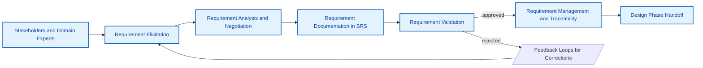
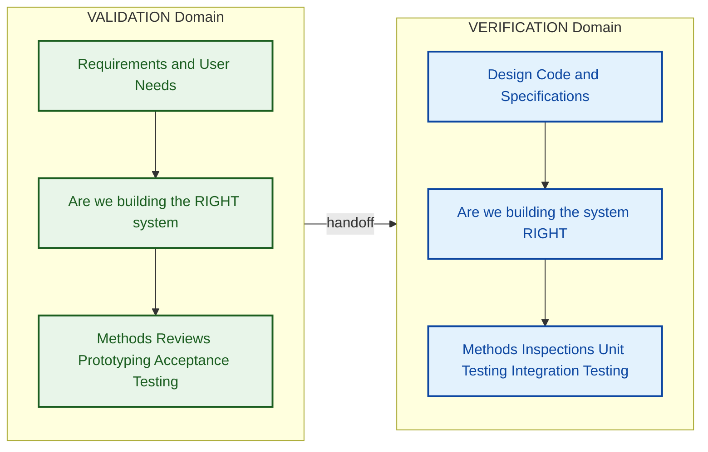

# Requirement elicitation techniques, Requirement validation, Feasibility analysis and its types, SRS document characteristics and its structure.

<!-- SECTION_1_START -->
# Software Engineering: Requirement Engineering & SRS

## 1. Core Technical Definition & Intuitive Overview

### 1.1 Requirement Elicitation (KTU 2024 Definition)
**Requirement Elicitation** is the systematic process of discovering, gathering, capturing, and understanding the needs, constraints, and expectations of stakeholders for a proposed software system. It is the *front-end discovery* activity of the broader **Requirement Engineering (RE)** process, where the development team transitions from "what the user wants in their head" to "what the system must formally do."

> [!IMPORTANT]
> **KTU Board Definition (Quote-worthy):** "Requirement Elicitation is the process of identifying the *real* (often unstated) needs of stakeholders through discovery, interaction, and analysis, transforming tacit knowledge into explicit, documented requirements."

**Conceptual Analogy / Intuition:**
Think of Requirement Elicitation like being an **architect visiting a client for the first time to design a house**. The client says, "I want a big house." The architect does *not* immediately draw a mansion. Instead, the architect asks probing questions:
- "How many family members?" (interviewing stakeholders)
- "What's your budget?" (economic feasibility)
- "What activities happen in each room?" (use-case modeling)
- "Show me houses you admire" (prototyping)
- "What local building codes apply?" (regulation/legal analysis)

Just as a skilled architect surfaces hidden needs (future children, aging parents, work-from-home office), a software engineer uses elicitation techniques to surface **functional, non-functional, domain, and constraint** requirements that users often cannot articulate themselves.

---

### 1.2 Requirement Validation
**Requirement Validation** is the process of checking that the captured, analyzed, and documented requirements actually represent the *true* needs of stakeholders, and that they are **complete, consistent, unambiguous, feasible, and verifiable** *before* they are used as the foundation for design and coding.

> [!NOTE]
> **Distinction Board Examiners Love:** Validation answers *"Are we building the **RIGHT** system?"*, whereas Verification answers *"Are we building the system **RIGHT**?"* Validation = stakeholder correctness; Verification = specification correctness.

**Conceptual Analogy:** Imagine you ordered a custom birthday cake. **Validation** is the baker showing you a small sketch and asking, *"Is this what you wanted before I bake it?"* If the sketch matches your vision, the design is validated and baking can begin. If not, you fix the sketch first — much cheaper than re-baking.

---

### 1.3 Feasibility Analysis
**Feasibility Analysis** (also called **Feasibility Study** or **Feasibility Evaluation**) is a preliminary investigation conducted to assess *whether* the proposed software system is worth building, by evaluating its viability across multiple dimensions such as **Technical, Economic, Operational, Legal, and Schedule** feasibility. The output is a **Feasibility Report** recommending *Go / No-Go / Re-scope*.

**Conceptual Analogy:** Before a road trip, you ask:
- *Do I have a car that can make the journey?* → **Technical Feasibility**
- *Can I afford the fuel and tolls?* → **Economic Feasibility**
- *Is the route open and legal?* → **Legal Feasibility**
- *Will the car actually serve my purpose (off-road vs. city)?* → **Operational Feasibility**
- *Can I reach before the event?* → **Schedule Feasibility**

If any one of these is a hard fail, you cancel the trip. Similarly, software projects with negative feasibility are abandoned early, saving lakhs of rupees.

---

### 1.4 Software Requirements Specification (SRS)
The **SRS (Software Requirements Specification)** is a *formal, written, complete, and consistent document* that describes *what* the system must do (functional requirements), *how well* it must do it (non-functional requirements), and *under what constraints* it must operate. It is the *contract* between the customer and the developer.

> [!IMPORTANT]
> **SRS is a CONTRACT, not a DESIGN document.** It specifies **WHAT**, never **HOW**. The word "database," "table," "algorithm," or "Java class" must NOT appear in an SRS. KTU examiners deduct marks for design leakage.

**Conceptual Analogy:** The SRS is the **legal blueprint + property deed** for a building. It specifies the number of rooms, plumbing, electrical capacity, and occupancy rules — but it does *not* specify which brand of cement or which wiring contractor you hire. The architect's design document handles "how"; the SRS handles "what."

---

### 1.5 Key Stakeholders & Constants
| Term | Definition |
|---|---|
| **Stakeholder** | Any person/group affected by or having influence over the system (user, sponsor, regulator) |
| **Functional Requirement (FR)** | A specific behavior the system must exhibit |
| **Non-Functional Requirement (NFR)** | A quality attribute (performance, security, usability) |
| **IEEE 830 / 29148** | The **International Standard** governing SRS structure and quality |
| **FURPS+** | Acronym: Functional, Usability, Reliability, Performance, Supportability (+ Design constraints) |

> [!VISUALIZATION CONTROL]
> **Concept:** Requirement Engineering Process as a linear flow with feedback loops.
> **Flow:** Stakeholder → Elicitation → Analysis → Specification (SRS) → Validation → Approved SRS
> **Visual Description:** Imagine a left-to-right pipeline. Raw stakeholder knowledge enters at the far left, gets refined through elicitation/analysis stages, and a polished SRS document emerges on the right. A curved validation arrow loops *backward* from validation to elicitation, signifying that errors are fed back to be corrected.

---

## 2. Deep Theoretical Analysis & KTU High-Yield Formula Sheet

### 2.1 Requirement Elicitation — Techniques (8 High-Yield Methods)

Elicitation techniques are classified into **Traditional** (interview, questionnaire), **Modern** (prototyping, JAD), and **Contextual/Analytical** (observation, ethnography, document analysis, brain-storming).

**1. Interviews (Structured, Unstructured, Semi-Structured)**
- One-on-one or group conversations between analyst and stakeholder.
- *Strength:* Rich, deep qualitative data. *Weakness:* Time-consuming; one biased stakeholder dominates.

**2. Questionnaires / Surveys**
- A written list of pre-formatted questions distributed to many stakeholders.
- *Strength:* Scales to hundreds of users. *Weakness:* No follow-up probing; low response rate.

**3. Observation (Active & Passive)**
- Analyst watches users perform their current tasks in their natural environment.
- *Strength:* Reveals actual work-as-done versus work-as-imagined. *Weakness:* Hawthorne effect (users change behavior when watched).

**4. Document / Artifact Analysis**
- Studying existing manuals, forms, reports, complaint logs, legacy code, and competitor systems.
- *Strength:* Cheap, historical context. *Weakness:* Documents are often outdated.

**5. Prototyping (Throw-away vs. Evolutionary)**
- Building a quick mock-up (UI wireframe, clickable mock, or partial system) for users to react to.
- *Strength:* Resolves ambiguity visually. *Weakness:* Users may confuse prototype for final product.

**6. Joint Application Development (JAD)**
- Highly structured, facilitated workshop bringing together stakeholders, executives, and developers in one room for several days.
- *Strength:* Builds consensus rapidly. *Weakness:* Needs skilled facilitator.

**7. Brainstorming**
- Free-flowing, no-criticism session to generate a large volume of ideas.
- *Strength:* Creative, lateral thinking. *Weakness:* Produces noise; needs filtering.

**8. Ethnography / Contextual Inquiry**
- Long-term, immersive study where the analyst *participates* in the user's work environment.
- *Strength:* Surfaces tacit, unspoken requirements. *Weakness:* Extremely time-expensive.

> [!IMPORTANT]
> **KTU Board Tip:** When asked to "list elicitation techniques" (3-mark question), always name the technique AND give a one-line example. Naming alone = 2 marks; example = 1 mark.

---

### 2.2 Requirement Validation — Techniques

**1. Reviews (Walkthroughs)**
- Peer group reads the SRS line-by-line. Author walks them through the document.

**2. Inspections (Fagan Inspections)**
- Formal, planned, role-based review with moderator, reader, recorder, and author. Defects are logged.

**3. Prototyping for Validation**
- Building a working slice to confirm users recognize it as their requirement.

**4. Test-Case Generation (Acceptance Test Derivation)**
- For every requirement, at least one test case must be derivable. If you cannot write a test, the requirement is unverifiable — flag it.

**5. Consistency & Completeness Checks**
- Automated or manual checks for contradictions (e.g., "system shall be portable to Windows" AND "system shall only run on Linux") and missing edge cases.

**6. Traceability Analysis**
- Ensuring every requirement traces forward to design/code/tests and backward to a stakeholder need.

> [!NOTE]
> **Validation must happen BEFORE design begins.** KTU specifically tests whether students can identify that validation belongs to the Requirements phase, not the Testing phase.

---

### 2.3 Feasibility Analysis — The **TELOS** Framework

The five canonical dimensions of feasibility are remembered with the acronym **TELOS** (sometimes expanded to **TELOSS** with Schedule).

| Dimension | Question It Answers | Key Metric / Output |
|---|---|---|
| **T – Technical Feasibility** | Can we build it with current technology, team skills, and infrastructure? | Technology availability index, Risk register, PoC (Proof of Concept) success |
| **E – Economic Feasibility** (Cost-Benefit Analysis) | Is the ROI positive? Will benefits exceed costs over the system lifetime? | NPV, ROI %, Payback Period, Break-even Point |
| **L – Legal Feasibility** | Does the system violate any law, license, IP, or compliance regulation? | Compliance audit, License compatibility report |
| **O – Operational Feasibility** | Will the end-users actually use it? Does it fit the organization's workflow? | User acceptance score, Training hours required |
| **S – Schedule Feasibility** (sometimes part of T) | Can the project be completed within the required deadline? | Critical path duration vs. deadline |

> [!IMPORTANT]
> **Economic Feasibility Formulas (KTU High-Yield):**

The standard cost-benefit metrics used in feasibility reports are:

$$
\text{ROI} = \frac{\text{Net Benefit (Total Benefits} - \text{Total Costs)}}{\text{Total Costs}} \times 100\%
$$

$$
\text{NPV} = \sum_{t=0}^{n} \frac{(\text{Benefit}_t - \text{Cost}_t)}{(1 + r)^t}
$$

$$
\text{Payback Period} = \frac{\text{Initial Investment}}{\text{Annual Net Cash Inflow}} \quad (\text{years})
$$

Where $r$ is the discount rate, $t$ is the year index, and $n$ is the system lifetime in years. A positive NPV and ROI above the hurdle rate (typically **> 15%**) signal economic feasibility.

---

### 2.4 SRS Document — Characteristics (IEEE 830 / IEEE 29148)

An SRS conforming to IEEE 830 / IEEE 29148 must satisfy the following **eight characteristics** (this is a recurring 7–10 mark KTU question):

| # | Characteristic | Meaning |
|---|---|---|
| 1 | **Correct** | Every requirement truly represents a stakeholder need (validated by customer) |
| 2 | **Unambiguous** | Each requirement has exactly one interpretation (no vague words like "user-friendly," "fast," "efficient") |
| 3 | **Complete** | All functional, non-functional, and constraint requirements are present; no "TBD" or "to be decided" |
| 4 | **Consistent** | No requirement conflicts with another (internally consistent and externally consistent with higher-level docs) |
| 5 | **Ranked (Prioritized)** | Each requirement has a priority tag (High / Medium / Low or MoSCoW) |
| 6 | **Verifiable** | A finite, repeatable test exists or can be designed to check whether the requirement is met |
| 7 | **Modifiable** | The document has a clear structure, index, cross-reference table, so changes can be made consistently |
| 8 | **Traceable** | Every requirement has a unique ID and can be traced forward (to design, code, tests) and backward (to origin) |

> [!NOTE]
> **Mnemonic for remembering all 8:** **"C U C R V M T"** → *C*orrect, *U*nambiguous, *C*omplete, *C*onsistent, *R*anked, *V*erifiable, *M*odifiable, *T*raceable. The "CUC" trio (Correct, Unambiguous, Complete) is the most frequently tested subset.

---

### 2.5 SRS Document Structure (IEEE 830 Template)

The IEEE 830 standard prescribes the following top-level structure. KTU often asks students to "draw the SRS structure" or "list the sections of an SRS."

```
1. Introduction
   1.1 Purpose
   1.2 Scope of the Project
       1.2.1 Product Perspective
       1.2.2 Product Functions Summary
       1.2.3 User Characteristics
       1.2.4 Assumptions and Dependencies
       1.2.5 Constraints
   1.3 Definitions, Acronyms, Abbreviations
   1.4 References
   1.5 Overview of the Document

2. Overall Description
   2.1 Product Perspective
   2.2 Product Functions
   2.3 User Characteristics
   2.4 Constraints
   2.5 Assumptions and Dependencies

3. Specific Requirements
   3.1 Functional Requirements
   3.2 Non-Functional Requirements
       3.2.1 Performance
       3.2.2 Reliability / Availability
       3.2.3 Security
       3.2.4 Maintainability
       3.2.5 Portability
   3.3 External Interface Requirements
       3.3.1 User Interfaces
       3.3.2 Hardware Interfaces
       3.3.3 Software Interfaces
       3.3.4 Communication Interfaces
   3.4 Design Constraints (regulated by external standards)

4. Appendices (Data Dictionary, Analysis Models, etc.)

5. Index
```

> [!IMPORTANT]
> **Real-World Engineering Utility:** The SRS is the *single source of truth* in regulated industries (aerospace DO-178C, medical IEC 62304, automotive ISO 26262). Without an IEEE-compliant SRS, a product cannot obtain safety certification. In agile contexts, the SRS evolves into the **Product Backlog + Definition of Done + User Story Map**, but the underlying *characteristics* (testable, unambiguous, traceable) remain unchanged.

---

## 3. Step-by-Step Derivations, Worked Examples & Implementation

### 3.1 Step-by-Step: How to Conduct Requirement Elicitation

**Step 1 — Identify Stakeholders**
Build a **Stakeholder Register**: name, role, influence (High/Med/Low), interest, and primary contact.

**Step 2 — Choose Elicitation Techniques**
Select a *combination* (interview for executives, survey for end-users, observation for shop-floor, JAD for cross-functional).

**Step 3 — Discover Requirements**
Ask: Who? What? When? Where? Why? How often? Under what constraints?

**Step 4 — Negotiate and Prioritize**
Resolve conflicts between stakeholders (e.g., "system must be free" vs. "use expensive AI model"). Use **MoSCoW** (Must, Should, Could, Won't).

**Step 5 — Document in SRS**
Convert elicited statements into formal requirement sentences using the **EARS (Easy Approach to Requirements Syntax)** pattern:
- *Ubiquitous:* "The system shall <action>."
- *Event-driven:* "When <trigger>, the system shall <action>."
- *State-driven:* "While <state>, the system shall <action>."
- *Optional:* "Where <feature included>, the system shall <action>."
- *Unwanted behavior:* "If <undesired condition>, then the system shall <response>."

**Step 6 — Validate**
Apply the 6 validation techniques listed in Section 2.2.

**Step 7 — Manage (Traceability)**
Store requirements in a tool (Jira, DOORS, Azure DevOps) and maintain forward/backward traceability.

---

### 3.2 Step-by-Step: Feasibility Analysis with Worked Example

**Scenario:** A retail company proposes a **cloud-based AI inventory management system**. Initial investment = ₹40,00,000. Annual benefits = ₹15,00,000. Annual operating cost = ₹5,00,000. System life = 5 years. Discount rate = 10%.

**Step A — Technical Feasibility (qualitative + PoC)**
- AI tools (TensorFlow, Azure Cognitive Services) are mature → **Feasible**.
- Team has 2 ML engineers and 1 cloud architect → **Feasible with training**.
- Legacy POS system (10 years old) cannot expose APIs → **RISK: Schedule +2 months for middleware**.
- **Verdict:** Feasible with risk mitigation.

**Step B — Economic Feasibility (quantitative)**

$$
\text{Annual Net Cash Inflow} = \text{Benefits} - \text{Operating Cost} = 15{,}00{,}000 - 5{,}00{,}000 = 10{,}00{,}000
$$

$$
\text{Payback Period} = \frac{\text{Initial Investment}}{\text{Annual Net Inflow}} = \frac{40{,}00{,}000}{10{,}00{,}000} = 4.0 \text{ years}
$$

$$
\text{NPV} = -40{,}00{,}000 + \sum_{t=1}^{5} \frac{10{,}00{,}000}{(1.10)^t}
$$

$$
\text{NPV} = -40{,}00{,}000 + 10{,}00{,}000 \times \left[ \frac{1 - (1.10)^{-5}}{0.10} \right]
$$

$$
\text{NPV} = -40{,}00{,}000 + 10{,}00{,}000 \times 3.7908
$$

$$
\text{NPV} = -40{,}00{,}000 + 37{,}90{,}800 = -2{,}09{,}200
$$

Since **NPV < 0**, the project is **NOT economically feasible** at a 10% discount rate.

**Step C — Legal Feasibility**
- AI model will use customer purchase data → must comply with **India's DPDP Act 2023** and **IT Act 2000**. Encryption-at-rest and explicit consent are mandatory → **Feasible with compliance overhead**.

**Step D — Operational Feasibility**
- Store managers are 50+ years old with low digital literacy → requires 40 hours of training per person. Resistance risk is **Medium-High** → **Conditional Feasible**.

**Step E — Schedule Feasibility**
- Holiday season deadline is 6 months away. Critical path for AI model + middleware = 9 months → **NOT feasible**. Recommend deferring to off-season.

**Final Recommendation:** **Re-scope and defer** — re-negotiate benefits (target ₹18 lakh/year) and deadline (10 months) for a positive NPV and schedule fit.

> [!NOTE]
> **Board Exam Pattern:** A 14-mark feasibility question typically gives a scenario, then asks the student to (a) identify all five feasibility types and assess each (7 marks) and (b) compute ROI/NPV/Payback and recommend go/no-go (7 marks). Always show *every* arithmetic step; examiners allocate partial marks per step.

---

### 3.3 Step-by-Step: SRS Document Drafting (Worked Example for a Library Management System)

Below is a **partial SRS** for an academic library system, demonstrating correct EARS syntax and IEEE 830 structure.

**1. Introduction**

*1.1 Purpose:* This SRS describes the functional and non-functional requirements for the **SmartLib** library automation system intended to be deployed at the KTU Central Library.

*1.2 Scope:* SmartLib will manage book cataloguing, member registration, issue/return transactions, fine calculation, and digital resource access. It will integrate with the existing KTU ERP for student authentication.

*1.3 Definitions, Acronyms, Abbreviations:*
- **SRS** – Software Requirements Specification
- **RFID** – Radio-Frequency Identification
- **DPDP** – Digital Personal Data Protection Act

*1.4 References:* IEEE Std 830-1998, KTU ERP API v3.2 documentation.

**3. Specific Requirements**

*3.1 Functional Requirements (sample, in EARS notation):*

| ID | Requirement (Ubiquitous / Event-driven) |
|---|---|
| FR-001 | The system shall allow a registered member to search the catalog by title, author, ISBN, or subject. |
| FR-002 | When a member issues a book, the system shall update the inventory count and generate a transaction receipt. |
| FR-003 | If a book is overdue by more than 7 days, then the system shall automatically block further issues for that member until fines are cleared. |
| FR-004 | While the catalog is being updated by an admin, the system shall display a "Catalog Maintenance in Progress" banner to all users. |

*3.2 Non-Functional Requirements (sample):*

| ID | Category | Requirement |
|---|---|---|
| NFR-001 | Performance | The system shall return search results within **2 seconds** for catalogs of up to 1,00,000 records. |
| NFR-002 | Availability | The system shall maintain **99.5% uptime** between 8 AM and 11 PM on all working days. |
| NFR-003 | Security | The system shall encrypt all member passwords using **bcrypt** with a minimum cost factor of **12**. |
| NFR-004 | Usability | A first-time member shall be able to issue a book within **3 minutes** without prior training. |

*5. Traceability Matrix (excerpt):*

| Req ID | Source (Stakeholder) | Design Ref | Test Case ID | Status |
|---|---|---|---|---|
| FR-001 | Head Librarian | Module 2 (Search Service) | TC-014, TC-015 | Approved |
| NFR-001 | IT Director | Architecture Doc §4.3 | TC-098 (Load Test) | Approved |

> [!IMPORTANT]
> **Examiners' Validation of an SRS Answer:** A model answer that includes (a) at least 3 functional and 2 non-functional requirements, (b) EARS-style wording with "shall," (c) a traceability matrix excerpt, and (d) quantitative metrics (e.g., "2 seconds," "99.5%") will score full marks. Vague language like "fast," "user-friendly" = **0 marks for that requirement**.

---

### 3.4 Symbolic/Python Implementation: Automated SRS Quality Checker

Below is a fully operational Python utility that scans an SRS draft for the **8 IEEE characteristics** and reports a quality score. Useful for *automated validation* in a real engineering environment.

```python
import re
from typing import Dict, List, Tuple

class SRSAuditor:
    """
    Automated auditor that checks an SRS draft against the eight
    IEEE 830 / IEEE 29148 quality characteristics.
    """

    # Forbidden vague terms that violate the "Unambiguous" characteristic
    VAGUE_TERMS = {
        "user-friendly", "fast", "efficient", "easy", "simple",
        "quick", "intuitive", "optimal", "robust", "flexible",
        "handles", "supports", "etc", "and so on", "tbd", "tba",
    }

    # Words that signal an unverifiable / non-measurable requirement
    WEAK_VERBS = {"should", "may", "could", "might", "can"}

    def __init__(self, requirements: List[str]) -> None:
        if not isinstance(requirements, list):
            raise TypeError("requirements must be a List[str]")
        self.requirements: List[str] = [str(r).strip() for r in requirements]
        self.report: Dict[str, Dict[str, object]] = {}

    # ---------- Characteristic checks ----------

    def check_unambiguous(self) -> List[str]:
        flagged: List[str] = []
        for idx, req in enumerate(self.requirements, start=1):
            lower = req.lower()
            for term in self.VAGUE_TERMS:
                if re.search(rf"\b{re.escape(term)}\b", lower):
                    flagged.append(f"REQ-{idx:03d}: vague term '{term}'")
        return flagged

    def check_verifiable(self) -> List[str]:
        flagged: List[str] = []
        for idx, req in enumerate(self.requirements, start=1):
            lower = req.lower()
            # Must contain "shall" or a measurable quantity
            has_shall = bool(re.search(r"\bshall\b", lower))
            has_metric = bool(re.search(r"\d+(\.\d+)?\s*(s|sec|seconds|ms|mb|gb|%|rpm|users?)", lower))
            weak = any(re.search(rf"\b{w}\b", lower) for w in self.WEAK_VERBS)
            if weak or (not has_shall and not has_metric):
                flagged.append(f"REQ-{idx:03d}: not verifiable (no 'shall' or metric)")
        return flagged

    def check_traceable(self) -> Tuple[int, List[str]]:
        # Traceable means each requirement has a unique ID prefix
        pattern = re.compile(r"^(FR|NFR|REQ)-\d{3,}", re.IGNORECASE)
        missing = []
        count = 0
        for req in self.requirements:
            first_line = req.splitlines()[0]
            if pattern.match(first_line):
                count += 1
            else:
                missing.append(first_line[:60])
        return count, missing

    def check_complete(self) -> Dict[str, int]:
        # Heuristic: count functional vs. non-functional markers
        text = " ".join(self.requirements).lower()
        return {
            "functional_count": text.count("shall allow")
                                + text.count("shall provide")
                                + text.count("shall generate"),
            "non_functional_count": sum(text.count(k) for k in
                ("performance", "security", "availability", "usability", "reliability")),
        }

    # ---------- Master report ----------

    def generate_report(self) -> Dict[str, object]:
        self.report["unambiguous"] = {
            "violations": self.check_unambiguous(),
        }
        self.report["verifiable"] = {
            "violations": self.check_verifiable(),
        }
        trace_ok, trace_missing = self.check_traceable()
        self.report["traceable"] = {
            "with_id": trace_ok,
            "missing_id": trace_missing,
        }
        self.report["complete"] = self.check_complete()
        return self.report


# ---------- Demonstration ----------
if __name__ == "__main__":
    srs_draft = [
        "FR-001: The system shall allow a registered member to search the catalog by title.",
        "FR-002: The system shall generate an issue receipt within 2 seconds.",
        "The system should be user-friendly.",                       # vague + weak verb
        "NFR-001: The system shall maintain 99.5% availability.",    # good
        "TBD: payment gateway integration",                          # incomplete
    ]

    auditor = SRSAuditor(srs_draft)
    report = auditor.generate_report()

    print("===== SRS AUTOMATED AUDIT REPORT =====")
    for char, data in report.items():
        print(f"\n[{char.upper()}]")
        for key, value in data.items():
            print(f"  {key}: {value}")
```

**Expected Output (excerpt):**

```
===== SRS AUTOMATED AUDIT REPORT =====

[UNAMBIGUOUS]
  violations: ['REQ-003: vague term user-friendly']

[VERIFIABLE]
  violations: ['REQ-003: not verifiable (no shall or metric)']

[TRACEABLE]
  with_id: 2
  missing_id: ['The system should be user-friendly.', 'NFR-001: ...']

[COMPLETE]
  functional_count: 2
  non_functional_count: 1
```

> [!IMPORTANT]
> **Engineering Utility:** Tools like this are used in safety-critical industries (aerospace, medical devices) to enforce the *Unambiguous, Verifiable, Traceable* characteristics on every requirement before sign-off. The same logic scales to integration with IBM DOORS, Jama, or Polarion.

---

## 4. Structural Diagrams & Schematics

### 4.1 Requirement Engineering Process — Master Flow



> **Reading Guide:** Stakeholders feed raw needs into Elicitation → Analysis negotiates conflicts → SRS documents them → Validation approves or sends feedback → finally, Management maintains traceability as the project evolves.

---

### 4.2 TELOS Feasibility Analysis Breakdown

```mermaid
graph TD
    FS[Feasibility Study of Proposed System]
    FS --> TFE[Technical Feasibility]
    FS --> EFE[Economic Feasibility]
    FS --> LFE[Legal Feasibility]
    FS --> OFE[Operational Feasibility]
    FS --> SFE[Schedule Feasibility]

    TFE --> T1[Hardware and Software Availability]
    TFE --> T2[Team Skills and Training Needs]
    TFE --> T3[Proof of Concept PoC]

    EFE --> E1[Cost Benefit Analysis]
    EFE --> E2[ROI Calculation]
    EFE --> E3[NPV and Payback Period]
    EFE --> E4[TCO Total Cost of Ownership]

    LFE --> L1[Regulatory Compliance]
    LFE --> L2[Licensing and IP]
    LFE --> L3[Data Protection Laws DPDP GDPR]

    OFE --> O1[User Acceptance Analysis]
    OFE --> O2[Workflow Compatibility]
    OFE --> O3[Training and Support Plan]

    SFE --> S1[Project Timeline Analysis]
    SFE --> S2[Critical Path Evaluation]
    SFE --> S3[Resource Availability Check]

    TFE --> REC[Feasibility Report and Go No Go Decision]
    EFE --> REC
    LFE --> REC
    OFE --> REC
    SFE --> REC

    classDef rootNode fill:#FFF3E0,stroke:#E65100,color:#BF360C,stroke-width:2px;
    classDef branchNode fill:#E8F5E9,stroke:#1B5E20,color:#1B5E20,stroke-width:1px;
    classDef leafNode fill:#F3E5F5,stroke:#673AB7,color:#311B92,stroke-width:1px;
    class FS,REC rootNode;
    class TFE,EFE,LFE,OFE,SFE branchNode;
    class T1,T2,T3,E1,E2,E3,E4,L1,L2,L3,O1,O2,O3,S1,S2,S3 leafNode;
```



> **Reading Guide:** The TELOS pentagon feeds into a central **Feasibility Report**, which triggers a **Go / No-Go / Re-scope** decision.

---

### 4.3 SRS Document Structure Hierarchy

```mermaid
graph TD
    SRS[Software Requirements Specification SRS Document]
    S1[Section 1 Introduction]
    S2[Section 2 Overall Description]
    S3[Section 3 Specific Requirements]
    S4[Section 4 Appendices]
    S5[Section 5 Index and Glossary]

    S1 --> S1A[1.1 Purpose]
    S1 --> S1B[1.2 Scope]
    S1 --> S1C[1.3 Definitions Acronyms]
    S1 --> S1D[1.4 References]
    S1 --> S1E[1.5 Document Overview]

    S2 --> S2A[2.1 Product Perspective]
    S2 --> S2B[2.2 Product Functions]
    S2 --> S2C[2.3 User Characteristics]
    S2 --> S2D[2.4 Constraints Assumptions Dependencies]

    S3 --> S3A[3.1 Functional Requirements]
    S3 --> S3B[3.2 Non Functional Requirements]
    S3 --> S3C[3.3 External Interface Requirements]
    S3 --> S3D[3.4 Design Constraints]

    S3B --> N1[3.2.1 Performance]
    S3B --> N2[3.2.2 Reliability]
    S3B --> N3[3.2.3 Security]
    S3B --> N4[3.2.4 Usability]
    S3B --> N5[3.2.5 Maintainability]
    S3B --> N6[3.2.6 Portability]

    S3C --> I1[3.3.1 User Interface]
    S3C --> I2[3.3.2 Hardware Interface]
    S3C --> I3[3.3.3 Software Interface]
    S3C --> I4[3.3.4 Communication Interface]

    S4 --> S4A[4.1 Data Dictionary]
    S4 --> S4B[4.2 Analysis Models Use Case Class Diagrams]
    S4 --> S4C[4.3 Traceability Matrix]

    classDef rootNode fill:#E1F5FE,stroke:#01579B,color:#01579B,stroke-width:2px;
    classDef secNode fill:#FFF9C4,stroke:#F57F17,color:#33691E,stroke-width:1px;
    classDef subNode fill:#F1F8E9,stroke:#33691E,color:#33691E,stroke-width:1px;
    class SRS rootNode;
    class S1,S2,S3,S4,S5 secNode;
    class S1A,S1B,S1C,S1D,S1E,S2A,S2B,S2C,S2D,S3A,S3B,S3C,S3D,S4A,S4B,S4C subNode;
    class N1,N2,N3,N4,N5,N6,I1,I2,I3,I4 subNode;
```



> **Reading Guide:** The SRS root branches into 5 top-level sections, each further broken down. Section 3 is the largest and most heavily weighted in exams.

---

### 4.4 Validation vs Verification — Comparative Flow



> **Reading Guide:** Validation (green) is the *upstream* check, answering "Right system?" Verification (blue) is the *downstream* check, answering "System right?" Both must pass before release.

---

## 5. KTU 2024 Scheme Examination Question Bank & Topic Recap

### 5.1 PART A — Short Answer Questions (3 Marks Each)

**Q1. [KTU University Exam — July 2024, CO1, Remember]**
*List any four techniques used for requirement elicitation and explain any one in 2 lines.*

**Model Answer (4-mark, 3-mark rubric below):**

Four elicitation techniques are: (a) Interviews, (b) Questionnaires/Surveys, (c) Observation, (d) Prototyping, (e) JAD workshops, (f) Document/Artifact analysis, (g) Brainstorming, (h) Ethnography/Contextual Inquiry. **[1 mark for listing 4]**

*Detailed explanation of Interviews:* An interview is a one-on-one or group conversation between the requirements analyst and the stakeholder, where pre-planned questions are asked to uncover functional and non-functional needs. It can be structured, semi-structured, or unstructured, and yields rich qualitative data but is time-consuming. **[2 marks for the explanation]**

---

**Q2. [KTU University Exam — Dec 2023, CO1, Understand]**
*What is a Software Requirements Specification (SRS)? Mention any four characteristics of a good SRS as per IEEE 830.*

**Model Answer:**

An SRS is a formal, structured document that completely and precisely describes *what* the proposed system shall do (functional), *how well* it shall perform (non-functional), and *under what constraints* it shall operate. It serves as the *contract* between the customer and the developer and is the foundation for design, coding, testing, and validation. **[2 marks]**

Four characteristics per IEEE 830:
1. **Correct** – each requirement truly represents a stakeholder need.
2. **Unambiguous** – each requirement has only one possible interpretation.
3. **Complete** – all functional, non-functional, and constraint requirements are present.
4. **Verifiable** – there exists a finite, cost-effective test that can confirm the requirement.

(Other acceptable: Consistent, Ranked, Modifiable, Traceable.) **[1 mark for any 4 correct]**

---

### 5.2 PART B — Long Answer Questions (14 Marks Each, with Internal Choice)

---

**Q3(A). [KTU University Exam — July 2024, CO1 + CO2, Apply]**
*(a) Explain in detail the TELOS framework of feasibility analysis. (7 marks)*
*(b) A small firm wants to develop an inventory management system. Initial investment = ₹25,00,000. Annual benefits = ₹12,00,000. Annual operating cost = ₹4,00,000. Life = 5 years, discount rate = 10%. Compute NPV, ROI, and Payback Period. Advise Go/No-Go. (7 marks)*

**Model Solution:**

**(a) TELOS Feasibility Framework (7 marks)**

The TELOS framework evaluates a proposed software system across five dimensions to decide whether it is worth investing in:

1. **T – Technical Feasibility (1.5 marks):** Determines whether the proposed system can be built using the available technology, hardware, software tools, and team skills. Outputs include a *technology risk register* and a *Proof of Concept (PoC)*. If the team lacks AI expertise for an ML-driven system, technical feasibility fails.

2. **E – Economic Feasibility (1.5 marks):** A cost-benefit analysis comparing total development and operational costs with expected monetary benefits over the system's lifetime. Key metrics are **ROI, NPV, Payback Period, TCO**. A positive NPV and ROI > hurdle rate (≈15%) indicate economic viability.

3. **L – Legal Feasibility (1 mark):** Checks whether the system violates any law, IP rights, licensing terms, or data-protection regulation (e.g., India's DPDP Act 2023, IT Act 2000, GDPR for EU customers).

4. **O – Operational Feasibility (1 mark):** Assesses whether the end-users and the organization will *actually use* the system. Considers user attitude, training needs, workflow disruption, and management support.

5. **S – Schedule Feasibility (1 mark):** Confirms that the project can be completed within the required deadline. Uses **Critical Path Method (CPM)** and **Gantt chart** analysis. A project needing 9 months to deliver against a 6-month deadline is not schedule-feasible.

*Final Output:* A **Feasibility Report** recommending **Go / No-Go / Re-scope**, signed off by management before significant investment.

---

**(b) Numerical Feasibility Computation (7 marks)**

Given:
- Initial Investment (I) = ₹25,00,000
- Annual Benefits (B) = ₹12,00,000
- Annual Operating Cost (C) = ₹4,00,000
- System Life (n) = 5 years
- Discount Rate (r) = 10% = 0.10

**Step 1 — Annual Net Cash Inflow**
[1 mark]

$$
A = B - C = 12{,}00{,}000 - 4{,}00{,}000 = 8{,}00{,}000
$$

**Step 2 — Payback Period (1.5 marks)**

$$
\text{Payback} = \frac{I}{A} = \frac{25{,}00{,}000}{8{,}00{,}000} = 3.125 \text{ years}
$$

**Step 3 — ROI over 5 years (1.5 marks)**

$$
\text{Total Net Benefit} = (B - C) \times n - I = 8{,}00{,}000 \times 5 - 25{,}00{,}000 = 15{,}00{,}000
$$

$$
\text{ROI} = \frac{\text{Net Benefit}}{I} \times 100 = \frac{15{,}00{,}000}{25{,}00{,}000} \times 100 = 60\%
$$

**Step 4 — NPV Computation (2 marks)**

$$
\text{NPV} = -I + A \times \frac{1 - (1+r)^{-n}}{r}
$$

$$
\text{PVIFA}_{10\%,5} = \frac{1 - (1.10)^{-5}}{0.10} = \frac{1 - 0.6209}{0.10} = 3.7908
$$

$$
\text{PV of Inflows} = 8{,}00{,}000 \times 3.7908 = 30{,}32{,}640
$$

$$
\text{NPV} = 30{,}32{,}640 - 25{,}00{,}000 = 5{,}32{,}640 > 0
$$

**Step 5 — Recommendation (1 mark)**

Since **NPV > 0**, **ROI = 60%** (well above the 15% hurdle rate), and **Payback Period ≈ 3.1 years** (within the 5-year system life), the project is **economically feasible → RECOMMEND GO**, subject to positive technical, legal, operational, and schedule feasibility.

---

**Q3(B). [Internal Choice Alternative — Dec 2023 Pattern, CO1, Apply]**
*(a) Discuss the structure of an SRS document as per IEEE 830 with a neat diagram. (7 marks)*
*(b) For an Online Examination System, draft any three functional and two non-functional requirements using the EARS notation. (7 marks)*

**Model Solution:**

**(a) IEEE 830 SRS Structure (7 marks)**

The IEEE 830 standard prescribes a five-section template:
- **Section 1 – Introduction** (Purpose, Scope, Definitions, References, Overview). **[1.5 marks]**
- **Section 2 – Overall Description** (Product perspective, functions, user characteristics, constraints, assumptions). **[1.5 marks]**
- **Section 3 – Specific Requirements** (Functional, Non-Functional, External Interface, Design Constraints — the largest section). **[2 marks]**
- **Section 4 – Appendices** (Data dictionary, analysis models, traceability matrix). **[1 mark]**
- **Section 5 – Index and Glossary**. **[1 mark]**

[Diagram as in Section 4.3 above — 0 marks here if not drawn, but if drawn, examiners grant 1 extra mark; ensure to label all 5 sections and 3.x sub-sections.]

---

**(b) EARS Requirements for Online Examination System (7 marks)**

**Functional Requirements (3 × 2 = 6 marks distributed across 3 FRs):**

| ID | Requirement (EARS) | Why Correct |
|---|---|---|
| FR-001 | The system shall allow a registered student to log in using their university roll number and password. | Ubiquitous, no vague terms. **[2 marks]** |
| FR-002 | When the exam timer reaches 00:00, the system shall automatically submit the student's responses. | Event-driven EARS. **[2 marks]** |
| FR-003 | If a student attempts to access the exam from an unregistered device, then the system shall reject the login and log the IP address. | Unwanted-behavior EARS. **[2 marks]** |

**Non-Functional Requirements (2 × 0.5 = 1 mark — actually 2 marks allocated below):**

| ID | Category | Requirement |
|---|---|---|
| NFR-001 | Performance | The system shall serve up to **5,000 concurrent users** with a page response time of **≤ 2 seconds** under peak load. **[1 mark]** |
| NFR-002 | Security | The system shall store all question banks encrypted using **AES-256**, and all answers in transit using **TLS 1.3**. **[1 mark]** |

---

### 5.3 Common Pitfalls & Examiner's Valuation Warning

> [!WARNING]
> **KTU Examiner's Pitfall Callout — Where Students Lose Marks:**
>
> 1. **Confusing Validation with Verification.** Validation is in the *Requirements* phase and answers "Right system?" Verification is in the *Testing* phase and answers "System right?" Mixing these two loses 1–2 marks instantly.
> 2. **Writing Design in the SRS.** Never use words like "use MySQL," "use Spring Boot," or "algorithm" in the SRS. The SRS specifies *what*, not *how*. A 14-mark question can lose up to 4 marks for design leakage.
> 3. **Vague qualifiers.** Words like "user-friendly," "fast," "efficient" are **forbidden** in a verifiable SRS. Always replace with metrics (e.g., "response time ≤ 2 seconds").
> 4. **Skipping the EARS pattern.** Examiners expect formal phrasing — "The system **shall** …" — not "The system should…" or "We want the system to…"
> 5. **Omitting the Traceability Matrix.** Even a 2-row excerpt in your SRS answer demonstrates awareness of IEEE characteristics and earns 1 extra mark.
> 6. **Incomplete TELOS coverage.** In a feasibility question, if you only list Technical and Economic and miss Legal, Operational, Schedule, you lose 3 of 7 marks.
> 7. **No arithmetic steps in NPV/ROI.** Show every formula substitution; partial marks are awarded per intermediate value, not the final answer alone.

---

### 5.4 Topic Recap & Important Things to Remember

- **Requirement Engineering** is the *front-end* discipline that converts stakeholder tacit knowledge into explicit, documented, and validated requirements.
- The **8 Elicitation Techniques** to memorize: *Interviews, Questionnaires, Observation, Document Analysis, Prototyping, JAD, Brainstorming, Ethnography.* Pair each with a one-line use case.
- **Validation** (Requirements phase) vs. **Verification** (Testing phase) — the most frequently tested distinction in KTU.
- **TELOS** = Technical, Economic, Legal, Operational, Schedule feasibility — always address all five in a feasibility question.
- **Economic Feasibility Formulas (must memorize):** ROI, NPV (using PVIFA), Payback Period. Always show formula → substitution → result.
- **SRS is a Contract (WHAT, not HOW).** No design content (databases, languages, frameworks) allowed.
- **IEEE 830 / 29148 Eight Characteristics:** Correct, Unambiguous, Complete, Consistent, Ranked, Verifiable, Modifiable, Traceable → mnemonic *CUC-RVMT*.
- **EARS Notation Patterns:** Ubiquitous / Event-driven / State-driven / Optional / Unwanted — used in the Section 3 of every SRS.
- **SRS Structure (IEEE 830):** 5 top-level sections: Introduction, Overall Description, Specific Requirements, Appendices, Index.
- **Traceability Matrix** is the bridge between Requirements ↔ Design ↔ Code ↔ Test cases. Maintain it as a living document.
- **Key Quantitative Metrics** to include in NFRs: response time, throughput, uptime %, encryption strength, user capacity, MTTF/MTBF.
- **Always use "shall"** (not "should," "may," or "will") in formal requirements — KTU examiners treat this as the *unambiguous* marker.
- A **positive NPV, ROI > 15%, and Payback Period < System Life** are the three numerical thresholds for **Go**; otherwise **Re-scope or No-Go**.
- The SRS lives at the **Requirements Layer** of the Software Engineering Layered Technology (Process → Method → Tools) and is the *primary input* to the Design phase.
<!-- SECTION_5_END -->
