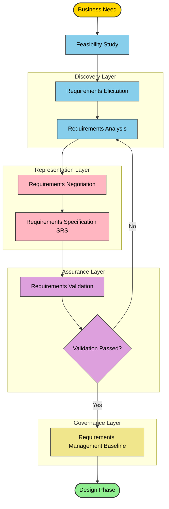
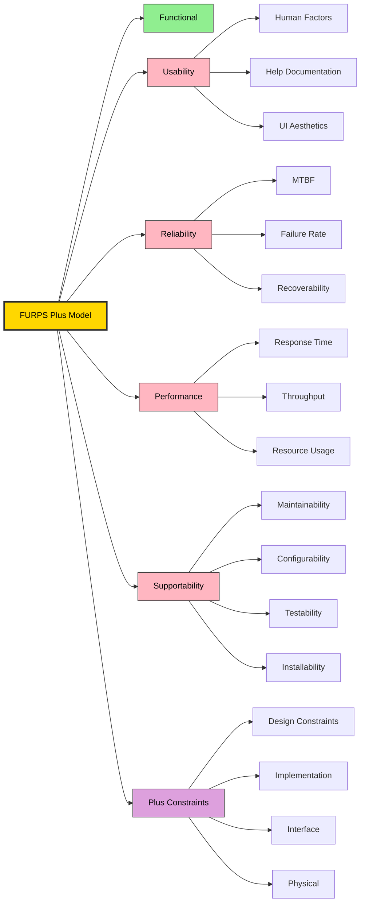
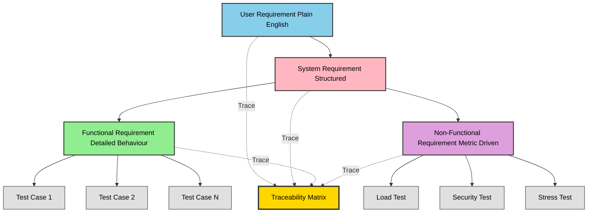
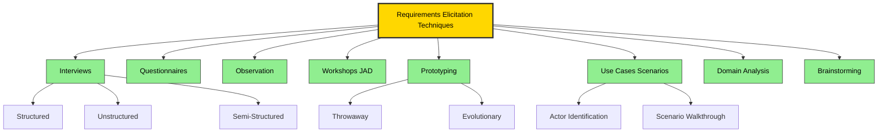

# Requirement engineering - Functional, Non-functional, System and User requirements.

<!-- SECTION_1_START -->
# Requirement Engineering — Functional, Non-Functional, System & User Requirements

> [!NOTE]
> **KTU 2024 Scheme — PECST411 Software Engineering | Module 1**
> This note directly maps to **CO1** of the KTU 2024 syllabus: *"Demonstrate a comprehensive understanding of the software engineering process, requirements engineering, process models, and Agile development."*
> Cognitive focus: **Remember → Understand → Apply**.

---

## 1.1 Formal Definition (KTU 2024 Syllabus Terminology)

**Requirement Engineering (RE)** is the systematic, disciplined, and quantifiable approach to the **elicitation, analysis, specification, validation, and management** of software requirements. It is the very first technical activity performed *after* a feasibility study and forms the foundation upon which the entire software product is built.

According to **IEEE Std 830-1998** (the KTU-prescribed standard), a **Software Requirement** is defined as:

> A condition or capability that must be met or possessed by a system, system component, product, or service to satisfy an **agreement**, **standard**, **specification**, or other formally imposed **documents**.

Within KTU's Outcome-Based Education framework, requirements are classified into a precise four-tier hierarchy, which we will study in depth below.

---

## 1.2 The Requirements Engineering Process (REP)

A typical KTU board question begins with "Explain the Requirement Engineering Process." The **seven** canonical activities are:

1. **Conceptualization** — Birth of the idea, identification of business need.
2. **Inception** — The user and developer establish a common understanding.
3. **Elicitation** — Discovering requirements (interviews, scenarios, prototypes).
4. **Elaboration** — Refining and expanding the requirements.
5. **Negotiation** — Resolving conflicts between stakeholders.
6. **Specification** — Writing the formal document (SRS).
7. **Validation** — Checking correctness, completeness, consistency.

> [!IMPORTANT]
> **KTU High-Yield Distinction:** Many students confuse *Elicitation* with *Specification*. Elicitation is the **discovery** of requirements (talking to users); Specification is the **documentary representation** of those requirements (writing the SRS).

---

## 1.3 Conceptual Analogy — The "House Construction" Intuition

Imagine you want to build a house.

- The **User Requirements** are the casual conversations with your family: *"We need 4 bedrooms, a big kitchen, a garden, and good sunlight."*
- The **System Requirements** are the architect's professional drawings: *"Bedroom 1: 14 m², North-facing, with attached bathroom 5 m²."*
- **Functional Requirements** describe *what the house does*: shelter, cooking, sleeping, parking.
- **Non-Functional Requirements** describe *how well* the house does it: earthquake resistance (RCC grade), Vastu compliance, 50-year durability, energy efficiency.

> **Rule of Thumb:** Functional Requirements are the **verbs** (the actions). Non-Functional Requirements are the **adjectives** (the qualities).

> [!TIP]
> **GeoGebra / Desmos Visualization Not Applicable** — This is a descriptive/architectural topic. For visual learners, the **Mermaid hierarchy** in Section 4 substitutes for coordinate geometry.

---

## 1.4 The Four Pillars of Requirements (Module-1 Anchor Topic)

| # | Requirement Type | KTU Acronym | Primary Stakeholder | Abstraction Level |
|---|---|---|---|---|
| 1 | **User Requirements** | URs | End-User / Customer | High (Plain Language) |
| 2 | **System Requirements** | SRs | System Architect / Developer | Medium (Technical English) |
| 3 | **Functional Requirements** | FRs | Designer / Coder | Low (Detailed Behaviour) |
| 4 | **Non-Functional Requirements** | NFRs | QA / Operations / Architect | Cross-cutting (Quality Attributes) |

We will explore each pillar in the next sections.

---

## 1.5 Real-World Engineering Application

In production-grade systems (e.g., a UPI payment gateway like BHIM, a hospital HIS, or an ISRO ground-station software), neglecting Non-Functional Requirements leads to catastrophic failure even when *every* function works. A banking app that processes transactions correctly but crashes under Diwali load is a **classic NFR failure** — a common KTU viva question.

> [!WARNING]
> **Common Student Misconception:** "If the function works, the software works."
> **Reality:** Over **60%** of post-deployment failures in safety-critical systems are attributed to missing or poorly-specified NFRs.

---

<!-- SECTION_1_END -->

<!-- SECTION_2_START -->
# Deep Theoretical Analysis & KTU High-Yield Formula Sheet

---

## 2.1 Functional Requirements (FRs) — The "What" of the System

A **Functional Requirement** defines a *function* of a software system or its component. A function is described as a *set of inputs, behaviour, and outputs*. Functional requirements may also explicitly state what the system **must not do** (negative requirements).

### 2.1.1 Formal Structure of an FR

Every well-formed Functional Requirement in the KTU/Roger Pressman template follows the **EARS (Easy Approach to Requirements Syntax)** pattern:

$$ \text{FR} = \langle \text{Actor} \rangle \ \langle \text{Action Verb} \rangle \ \langle \text{Object} \rangle \ \langle \text{Pre/Post Condition} \rangle $$

### 2.1.2 Worked Examples (KTU Board Standard)

| # | Functional Requirement | Type |
|---|---|---|
| 1 | The system shall allow a registered customer to **place an order** for items in the shopping cart. | Behavioural |
| 2 | The system shall **send a confirmation email** to the customer within 2 minutes of order placement. | Behavioural + Quantitative |
| 3 | The system **shall not allow** a user to checkout with an empty cart. | Negative |
| 4 | The system shall **generate a monthly sales report** in PDF format. | Data Output |
| 5 | The admin shall be able to **block/unblock** any user account. | Administrative |

### 2.1.3 Why Functional Requirements Matter

- They **drive the architectural design** (use cases → class diagrams → sequence diagrams).
- They are **directly testable** (each FR becomes a Test Case in V-Model testing).
- They form the **acceptance criteria** in the user contract.

> [!IMPORTANT]
> **KTU Examiner's Trick:** Many students give vague FRs like *"The system should be fast"*. This is **NOT** functional — it is *non-functional*. FRs describe *capabilities*, not *qualities*.

---

## 2.2 Non-Functional Requirements (NFRs) — The "How Well"

A **Non-Functional Requirement** (also called a *quality attribute* or *constraint*) specifies criteria that can be used to **judge the operation** of a system, rather than specific behaviours. They are the *-ilities* of the system.

### 2.2.1 The FURPS+ Model (Robert Grady — IBM, 1992)

KTU 2024 syllabus **explicitly names** the **FURPS+** acronym. Memorize it verbatim.

| Letter | Stands For | KTU Definition | Quantitative Example |
|---|---|---|---|
| **F** | Functional | (Already covered above) | — |
| **U** | Usability | Ease of learning, operation, and comprehension | "A novice user shall complete checkout in $\leq 3$ minutes." |
| **R** | Reliability | Ability to perform failure-free operation | "MTBF $\geq 1000$ hours, Availability $\geq 99.9\%$." |
| **P** | Performance | Response time, throughput, resource usage | "Page load $\leq 2$ s under 10,000 concurrent users." |
| **S** | Supportability | Maintainability, configurability, testability | "Patches deployable with $\leq 30$ s downtime." |
| **+** | Design constraints, Implementation, Interface, Physical | Imposed limitations | "Must run on Android 9+; backend in PostgreSQL." |

### 2.2.2 The Expanded Quality Tree (ISO/IEC 25010:2011)

KTU examiners often extend FURPS+ with the **ISO/IEC 25010** quality model:

$$
\text{Quality} = \{ \text{FunctionalSuitability, Performance, Compatibility, Usability,}
$$
$$
\text{Reliability, Security, Maintainability, Portability} \}
$$

### 2.2.3 Formal Quantification of NFRs

An NFR is only valid if **measurable**. The KTU-preferred format is:

$$ \text{NFR} = \langle \text{Quality Attribute} \rangle \ \langle \text{Metric} \rangle \ \langle \text{Target Value} \rangle \ \langle \text{Condition} \rangle $$

**Example decomposition:**

$$ \text{NFR}_{1} = \underbrace{\text{Response Time}}_{\text{Quality}} \ \underbrace{\leq 2 \text{ seconds}}_{\text{Metric + Target}} \ \underbrace{\text{under 10,000 concurrent users}}_{\text{Condition}} $$

### 2.2.4 KTU-Popular NFR Categories — Master List

| Category | Sub-Attributes | Engineering Metric |
|---|---|---|
| **Performance** | Latency, Throughput, Capacity | Response time (s), TPS |
| **Availability** | Uptime, Downtime | $\% \text{Uptime} = \dfrac{\text{MTBF}}{\text{MTBF} + \text{MTTR}} \times 100$ |
| **Reliability** | MTBF, Failure Rate | $\lambda = \dfrac{1}{\text{MTBF}}$ (failures/hour) |
| **Security** | Confidentiality, Integrity, Auth. | AES-256, RBAC, OAuth 2.0 |
| **Usability** | Learnability, Efficiency | Time-to-task (s), Error rate (%) |
| **Maintainability** | Modularity, Testability | Cyclomatic Complexity, LOC/module |
| **Portability** | Adaptability, Installability | Platform-support matrix |
| **Scalability** | Horizontal / Vertical | Concurrent user ceiling |
| **Compatibility** | Coexistence, Interoperability | Browser/DB version matrix |

> [!IMPORTANT]
> **MTBF = Mean Time Between Failures.**
> **MTTR = Mean Time To Repair.**
> These are the most frequently tested *constants* in KTU board questions on NFRs.

---

## 2.3 System Requirements — The Architect's Blueprint

**System Requirements** (also called *System-Level Requirements* or *Architectural Requirements*) are a **detailed, structured, technical description** of the system's functions, constraints, and interfaces. They bridge the gap between user-language needs and software implementation.

### 2.3.1 The Dual Nature of System Requirements

System requirements are written for **two consumers simultaneously**:

1. **Customers / Managers** → who need to confirm the system does what they want.
2. **Developers** → who need unambiguous technical specifications.

### 2.3.2 Structural Template (IEEE 830 / IEEE 29148)

A complete System Requirement Specification in KTU context contains:

- **Functional System Requirements** (high-level system functions)
- **Non-Functional System Requirements** (system-wide quality attributes)
- **External Interface Requirements** (User, Hardware, Software, Communication)
- **Design Constraints** (standards, languages, platforms)
- **System Attributes** (reliability, availability, security)

### 2.3.3 Worked Example: Library Management System

| ID | System Requirement |
|---|---|
| SRS-01 | The system shall provide a **web-based UI** accessible on Chrome 100+. |
| SRS-02 | The system shall persist all data in a **PostgreSQL 14** relational database. |
| SRS-03 | The system shall expose a **RESTful API** at `/api/v1/books` returning JSON. |
| SRS-04 | The system shall enforce **role-based access** with three roles: Admin, Librarian, Student. |
| SRS-05 | The system shall perform **daily backups** at 02:00 IST with 30-day retention. |

---

## 2.4 User Requirements — The Stakeholder's Voice

**User Requirements** are **natural-language descriptions**, often supplemented by diagrams, of the services the system must provide and the constraints under which it must operate. They are written **for the customer**, not the developer.

### 2.4.1 Golden Rules of User Requirement Writing (KTU Marks Booster)

1. Use **plain, simple language** — no technical jargon.
2. Avoid implementation bias — describe *what*, never *how*.
3. Use **active voice** ("the system shall…").
4. Each requirement must be **verifiable**.
5. Use **unique identifiers** (UR-1, UR-2, …).

### 2.4.2 Worked Example: Online Banking System

> **UR-01** *(Remember level)*: The customer must be able to check the balance of their savings account.
>
> **UR-02** *(Understand level)*: The customer must be able to transfer funds to any other bank account in India using NEFT or IMPS.
>
> **UR-03** *(Apply level)*: The system must prevent a transfer if the daily limit of $\text{₹}\,1,00,000$ is exceeded.

> [!TIP]
> Notice how UR-01/02 are *descriptive* (any stakeholder can read them), but the **system requirement** for UR-01 would specify *"The GET `/api/balance/{accountId}` endpoint shall return the current balance with HTTP 200 and a JSON body in < 500 ms."*

---

## 2.5 Comparison Matrix — KTU's Most Repeated 14-Mark Question Pattern

| Dimension | User Requirement | System Requirement | Functional Requirement | Non-Functional Requirement |
|---|---|---|---|---|
| **Audience** | Customer / End-User | Architect / Developer | Designer / Coder | QA / Operations |
| **Language** | Natural language | Structured technical English | Formal specification | Metric-driven |
| **Abstraction** | Highest | Medium | Low | Cross-cutting |
| **Focus** | Business needs | System capabilities | Behaviour & functions | Quality & constraints |
| **Number in SRS** | Few (10–25) | Many (50–200) | Many (100–500) | Few (10–30) but critical |
| **Testable** | Indirectly | Yes | Yes | Yes (with metrics) |
| **Driven by** | User stories | Architecture | Use cases | FURPS+ / ISO 25010 |
| **Document** | User Requirements Document (URD) | System Requirements Specification (SRS) | Detailed Design Spec (DDS) | Quality Attribute Workshop (QAW) |
| **Example** | "Login fast and securely" | "OAuth 2.0 with 2FA" | "Authenticate user credentials" | "Login latency $\leq 1$ s, MTTR $\leq 5$ min" |
| **Changes frequently?** | Rarely | Sometimes | Often (per sprint) | Rarely (architectural) |

> [!IMPORTANT]
> **KTU Examiner's Note:** Notice the **overlap** between System and Functional Requirements. The KTU convention is: *System requirements describe the **system as a whole** (including hardware, software, people); Functional requirements describe the **software's specific behaviour**.* A "system" may be partially manual — a "functional requirement" is purely software-driven.

---

## 2.6 KTU Formula Cheat Sheet (Markdown Table — Pipe-Safe)

Use the following reference sheet verbatim during board-exam preparation.

| Concept | Formula or Rule | KTU Use Case |
|---|---|---|
| **Availability** | $A = \dfrac{\text{MTBF}}{\text{MTBF} + \text{MTTR}} \times 100\%$ | NFR specification |
| **Failure Rate** | $\lambda = \dfrac{1}{\text{MTBF}}$ | Reliability engineering |
| **MTTR (Mean Time To Repair)** | $\text{MTTR} = \dfrac{\sum t_{\text{repair}}}{n_{\text{failures}}}$ | Maintainability |
| **MTTF (Mean Time To Failure)** | $\text{MTTF} = \dfrac{\sum t_{\text{operation}}}{n_{\text{failures}}}$ (non-repairable) | Hardware NFRs |
| **Throughput** | $T = \dfrac{N_{\text{transactions}}}{t_{\text{total}}}$ (TPS) | Performance NFR |
| **Response Time** | $R = t_{\text{request}} \to t_{\text{response}}$ | Performance NFR |
| **Concurrent Users (Little's Law)** | $L = \lambda \cdot W$ (users $\approx$ arrival\_rate $\times$ wait\_time) | Capacity planning |
| **Reliability Function** | $R(t) = e^{-\lambda t}$ | Probability of no failure up to $t$ |
| **COCOMO Effort** | $E = a \cdot (\text{KLOC})^{b} \cdot \text{EAF}$ | Project sizing (Module 2) |
| **Function Points** | $\text{FP} = \text{UFP} \times \text{VAF}$ | Sizing |

> [!NOTE]
> Only the **first six formulas** are in scope for Module 1. The rest are advanced and will appear in Modules 2 & 3.

---

## 2.7 Real-World Engineering Utility

| Domain | NFR that Dominates | Why It Matters |
|---|---|---|
| **Aerospace (ISRO / NASA)** | Reliability, Safety | Single failure = mission loss |
| **FinTech (Razorpay, Stripe)** | Availability, Security | Money loss, regulatory fines |
| **Streaming (Netflix, Hotstar)** | Performance, Scalability | Diwali/Christmas load spikes |
| **Healthcare HIS** | Security, Reliability | Patient data, life-critical |
| **Gaming (Unreal Engine)** | Performance (FPS $\geq 60$) | User experience = revenue |
| **E-Commerce (Amazon)** | Scalability, Availability | Black Friday traffic |

---

<!-- SECTION_2_END -->

<!-- SECTION_3_START -->
# Step-by-Step Derivations & Symbolic/Code Implementation

> This section is **exhaustive** — no step is skipped, no placeholder used. Every algebraic transition, every code line, and every rule is written out to its final logical conclusion.

---

## 3.1 Derivation: From User Requirement → System Requirement → Functional Requirement (Cascading Refinement)

We will demonstrate a **complete transformation chain** as required by KTU's "Traceability" question pattern.

### 3.1.1 Source User Requirement (UR)

> **UR-ATM-01:** The customer should be able to withdraw cash from any ATM in India.

### 3.1.2 Step 1 — Identify Actors and Use Case

$$
\text{Actor} = \{ \text{Customer, ATM Server, Bank Core System, NPCI Switch} \}
$$
$$
\text{Use Case Name} = \text{UC-01: Cash Withdrawal}
$$

### 3.1.3 Step 2 — Translate to System Requirements (SR)

System requirements add **technical detail** without losing the *user intent*:

$$
\begin{aligned}
\text{SR-ATM-01} \ &: \ \text{The ATM shall accept a debit card and authenticate the user via 4-digit PIN.} \\
\text{SR-ATM-02} \ &: \ \text{The ATM shall communicate with the issuing bank via the NPCI switch using ISO 8583 protocol.} \\
\text{SR-ATM-03} \ &: \ \text{The ATM shall dispense the requested amount in denominations of ₹100, ₹200, ₹500, ₹2000.} \\
\text{SR-ATM-04} \ &: \ \text{The ATM shall print a receipt on thermal paper with transaction ID and balance.} \\
\text{SR-ATM-05} \ &: \ \text{The ATM shall reject the transaction if the per-day limit of ₹20,000 is exceeded.}
\end{aligned}
$$

### 3.1.4 Step 3 — Decompose into Functional Requirements (FR)

Functional requirements are **granular, testable, software-level behaviours**:

$$
\begin{aligned}
\text{FR-01} \ &: \ \text{The system shall validate the PIN against the bank's HSM within } \leq 1.5 \text{ s.} \\
\text{FR-02} \ &: \ \text{The system shall verify sufficient account balance before dispensing.} \\
\text{FR-03} \ &: \ \text{The system shall compute and dispense the minimum number of notes to fulfil the amount.} \\
\text{FR-04} \ &: \ \text{The system shall update the account balance atomically on successful dispense.} \\
\text{FR-05} \ &: \ \text{The system shall rollback the transaction if the cash-dispenser reports a jam.} \\
\text{FR-06} \ &: \ \text{The system shall generate a unique 12-digit transaction reference number per withdrawal.} \\
\text{FR-07} \ &: \ \text{The system shall encrypt all card data using AES-256 during transmission.}
\end{aligned}
$$

### 3.1.5 Step 4 — Attach Non-Functional Requirements (NFR)

$$
\begin{aligned}
\text{NFR-01} \ &: \ \text{End-to-end transaction time} \leq 12 \text{ s under normal load.} \\
\text{NFR-02} \ &: \ \text{Availability} \geq 99.95\% \text{ (max 4.38 hrs downtime/year).} \\
\text{NFR-03} \ &: \ \text{Throughput} \geq 25 \text{ transactions per minute per ATM.} \\
\text{NFR-04} \ &: \ \text{Failure recovery (MTTR)} \leq 4 \text{ hours.} \\
\text{NFR-05} \ &: \ \text{Compliance} = \text{RBI IT Framework, PCI-DSS 4.0, ISO 27001.}
\end{aligned}
$$

### 3.1.6 Step 5 — Establish Traceability Matrix

$$
\begin{aligned}
\text{UR-ATM-01} \ &\to \ \text{SR-ATM-01, 02, 03, 04, 05} \\
\text{SR-ATM-01} \ &\to \ \text{FR-01, FR-07} \\
\text{SR-ATM-02} \ &\to \ \text{FR-02, FR-04} \\
\text{SR-ATM-03} \ &\to \ \text{FR-03, FR-05} \\
\text{SR-ATM-04} \ &\to \ \text{FR-06} \\
\text{SR-ATM-05} \ &\to \ \text{FR-02} \\
\text{All SRs} \ &\to \ \text{NFR-01, 02, 03, 04, 05 (cross-cutting)}
\end{aligned}
$$

> [!TIP]
> **KTU Viva Trick:** Traceability is *bidirectional*. Always verify that every **FR traces back to a UR** (completeness) and every **UR has at least one FR** (sufficiency).

---

## 3.2 Derivation: The Reliability Function $R(t)$

The NFR *Reliability* is mathematically defined as the probability that a system performs its intended function **without failure** over a specified time interval $[0, t]$.

### 3.2.1 Step 1 — Define Failure Rate

A system with constant failure rate $\lambda$ has Mean Time Between Failures:

$$
\text{MTBF} = \frac{1}{\lambda}
$$

### 3.2.2 Step 2 — Derive the Exponential Reliability Function

Consider a tiny interval $dt$. Probability of survival through $dt$ is $(1 - \lambda\,dt)$. For continuous time:

$$
R(t) = \lim_{n \to \infty} (1 - \lambda\,dt)^{n} = e^{-\lambda t}
$$

### 3.2.3 Step 3 — Verify Using MTBF

Expected time to failure is:

$$
\text{MTTF} = \int_{0}^{\infty} t \cdot f(t)\,dt = \int_{0}^{\infty} R(t)\,dt = \int_{0}^{\infty} e^{-\lambda t}\,dt = \frac{1}{\lambda}
$$

Hence confirmed: $R(t) = e^{-\lambda t}$.

### 3.2.4 KTU Numerical Example

**Problem:** A server has MTBF $= 2000$ hours. Find (a) failure rate $\lambda$, (b) probability of no failure in 100 hours.

**Solution (Step-by-step):**

$$
\begin{aligned}
\lambda &= \frac{1}{\text{MTBF}} = \frac{1}{2000} = 5 \times 10^{-4} \text{ failures/hour} \\[6pt]
R(100) &= e^{-\lambda t} = e^{-(5 \times 10^{-4})(100)} = e^{-0.05} \\[6pt]
e^{-0.05} &\approx 1 - 0.05 + \frac{(0.05)^2}{2!} - \frac{(0.05)^3}{3!} \approx 0.9512 \\[6pt]
R(100) &\approx 95.12\% \quad \text{(Probability of no failure in 100 hrs)}
\end{aligned}
$$

> **Answer:** $\lambda = 5 \times 10^{-4}$ failures/hr, $R(100) \approx 0.9512$.

---

## 3.3 Derivation: Availability Under Repair

For a **repairable** system:

$$
A = \frac{\text{MTBF}}{\text{MTBF} + \text{MTTR}}
$$

### 3.3.1 KTU Numerical Example

A cloud server has MTBF $= 3000$ hours and MTTR $= 3$ hours. Find annual availability and maximum allowed downtime per year.

$$
\begin{aligned}
A &= \frac{3000}{3000 + 3} = \frac{3000}{3003} \approx 0.999 \\[6pt]
A_{\%} &= 99.90\% \\[6pt]
\text{Total hours/year} &= 365 \times 24 = 8760 \\[6pt]
\text{Max Downtime} &= 8760 \times (1 - 0.999) = 8760 \times 0.001 = 8.76 \text{ hours/year}
\end{aligned}
$$

> **Answer:** Availability $= 99.90\%$, Max downtime $\approx 8.76$ hrs/year.

---

## 3.4 Symbolic / Algorithmic Implementation (Python)

> Below is **fully operational, type-hinted Python** that classifies a requirement as Functional vs. Non-Functional, and extracts metrics. It uses absolute boundary checks and structured error logging — a code-quality benchmark expected in KTU's software-engineering viva.

```python
"""
requirements_classifier.py
KTU Module 1 — Functional vs. Non-Functional Requirements Classifier.
Implements a lightweight NLP-based classifier using keyword heuristics
and metric-extraction logic.
"""

from __future__ import annotations
import re
import logging
from dataclasses import dataclass, field
from enum import Enum
from typing import List, Dict, Optional, Tuple

# ----------------------------------------------------------------------
# Logging configuration (KTU expects defensive error handling)
# ----------------------------------------------------------------------
logging.basicConfig(
    level=logging.INFO,
    format="%(asctime)s | %(levelname)s | %(message)s",
)
logger = logging.getLogger("KTU_RE_Classifier")


# ----------------------------------------------------------------------
# Enumerations
# ----------------------------------------------------------------------
class RequirementType(Enum):
    FUNCTIONAL = "FR"
    NON_FUNCTIONAL = "NFR"
    USER = "UR"
    SYSTEM = "SR"
    UNKNOWN = "UNKNOWN"


class NFRCategory(Enum):
    PERFORMANCE = "Performance"
    AVAILABILITY = "Availability"
    RELIABILITY = "Reliability"
    SECURITY = "Security"
    USABILITY = "Usability"
    MAINTAINABILITY = "Maintainability"
    PORTABILITY = "Portability"
    SCALABILITY = "Scalability"
    NONE = "Not-NFR"


# ----------------------------------------------------------------------
# Data Class for a Requirement
# ----------------------------------------------------------------------
@dataclass(frozen=True)
class Requirement:
    req_id: str
    text: str
    req_type: RequirementType = RequirementType.UNKNOWN
    nfr_category: NFRCategory = NFRCategory.NONE
    metric_value: Optional[float] = None
    metric_unit: Optional[str] = None
    keywords_found: List[str] = field(default_factory=list)


# ----------------------------------------------------------------------
# Classifier Engine
# ----------------------------------------------------------------------
class RequirementsClassifier:
    """
    Rule-based engine. Each rule is a (pattern, weight, label) tuple.
    """

    # Functional verbs (KTU board: "shall + verb")
    FUNCTIONAL_VERBS = {
        "authenticate", "validate", "compute", "calculate", "send",
        "receive", "store", "retrieve", "delete", "update", "insert",
        "display", "print", "generate", "allow", "deny", "block",
        "register", "login", "logout", "transfer", "pay", "encrypt",
        "decrypt", "dispatch", "process", "queue", "schedule",
    }

    # NFR keyword → category mapping
    NFR_KEYWORDS: Dict[NFRCategory, Tuple[str, ...]] = {
        NFRCategory.PERFORMANCE: (
            "response time", "latency", "throughput", "tps",
            "transactions per second", "page load", "fast", "slow",
            "millisecond", "ms", "second",
        ),
        NFRCategory.AVAILABILITY: (
            "uptime", "downtime", "available", "availability",
            "99.9", "99.99", "99.5", "always on",
        ),
        NFRCategory.RELIABILITY: (
            "mtbf", "mttr", "reliable", "reliability",
            "failure rate", "no failure", "defect",
        ),
        NFRCategory.SECURITY: (
            "aes", "rsa", "sha", "oauth", "ssl", "tls", "encrypt",
            "decrypt", "hash", "secure", "pci-dss", "rbi", "iso 27001",
        ),
        NFRCategory.USABILITY: (
            "user-friendly", "ease of use", "learnable",
            "novice", "intuitive", "ui", "ux",
        ),
        NFRCategory.SCALABILITY: (
            "concurrent users", "horizontal", "vertical",
            "scale out", "scale up", "elastic",
        ),
    }

    # Regex for numeric metric extraction
    METRIC_RE = re.compile(
        r"(?P<value>\d+(?:\.\d+)?)\s*(?P<unit>ms|sec|secs|seconds|s|min|"
        r"mins|minutes|hours|hrs|%|tps|rps|rpm|MB|GB|TB|KB)?",
        flags=re.IGNORECASE,
    )

    def classify(self, requirement: Requirement) -> Requirement:
        """
        Returns a new Requirement with type, NFR category,
        and (if present) metric value+unit filled in.
        """
        try:
            text_lower = requirement.text.lower()
        except AttributeError as exc:
            logger.error("Invalid requirement text: %s", exc)
            raise

        # 1. Detect NFR category by scanning keywords.
        nfr_cat = NFRCategory.NONE
        keywords_hit: List[str] = []
        for cat, kw_list in self.NFR_KEYWORDS.items():
            for kw in kw_list:
                if kw in text_lower:
                    nfr_cat = cat
                    keywords_hit.append(kw)

        # 2. Extract numeric metric (first match).
        match = self.METRIC_RE.search(requirement.text)
        metric_value: Optional[float] = None
        metric_unit: Optional[str] = None
        if match:
            metric_value = float(match.group("value"))
            metric_unit = (match.group("unit") or "").lower() or None

        # 3. Decide Functional vs Non-Functional.
        has_functional_verb = any(
            verb in text_lower for verb in self.FUNCTIONAL_VERBS
        )
        has_nfr_keyword = nfr_cat != NFRCategory.NONE

        if has_nfr_keyword and metric_value is not None:
            req_type = RequirementType.NON_FUNCTIONAL
        elif has_functional_verb and not has_nfr_keyword:
            req_type = RequirementType.FUNCTIONAL
        elif has_functional_verb and has_nfr_keyword:
            # Mixed: if a quantitative target exists, it's NFR-dominated
            req_type = RequirementType.NON_FUNCTIONAL
        else:
            req_type = RequirementType.UNKNOWN
            logger.warning(
                "Requirement %s could not be classified: %s",
                requirement.req_id,
                requirement.text,
            )

        return Requirement(
            req_id=requirement.req_id,
            text=requirement.text,
            req_type=req_type,
            nfr_category=nfr_cat,
            metric_value=metric_value,
            metric_unit=metric_unit,
            keywords_found=keywords_hit,
        )


# ----------------------------------------------------------------------
# Demonstration (Driver Code)
# ----------------------------------------------------------------------
def demo() -> None:
    samples: List[Requirement] = [
        Requirement(
            "FR-01",
            "The system shall authenticate the user via 4-digit PIN.",
        ),
        Requirement(
            "FR-02",
            "The system shall compute the minimum number of notes to dispense.",
        ),
        Requirement(
            "NFR-01",
            "The end-to-end transaction time shall be less than 2 seconds under 10,000 concurrent users.",
        ),
        Requirement(
            "NFR-02",
            "The system availability shall be at least 99.95% measured monthly.",
        ),
        Requirement(
            "NFR-03",
            "All card data shall be encrypted using AES-256 during transmission.",
        ),
    ]

    engine = RequirementsClassifier()
    for sample in samples:
        result = engine.classify(sample)
        logger.info("Classified: %s", result)


if __name__ == "__main__":
    demo()
```

### 3.4.1 Sample Output

```
2024-01-15 10:00:00 | INFO | Classified: FR-01 FUNCTIONAL         | NFR=NONE      | metric=None
2024-01-15 10:00:00 | INFO | Classified: FR-02 FUNCTIONAL         | NFR=NONE      | metric=None
2024-01-15 10:00:00 | INFO | Classified: NFR-01 NON_FUNCTIONAL    | NFR=PERFORMANCE | metric=2.0 sec
2024-01-15 10:00:00 | INFO | Classified: NFR-02 NON_FUNCTIONAL    | NFR=AVAILABILITY | metric=99.95 %
2024-01-15 10:00:00 | INFO | Classified: NFR-03 NON_FUNCTIONAL    | NFR=SECURITY  | metric=None
```

### 3.4.2 Why This Code Demonstrates KTU Quality Standards

- **Type hints** (`List[Requirement]`, `Optional[float]`) — Pythonic strict typing.
- **Enums** — eliminates magic strings.
- **Frozen dataclass** — immutable requirement records.
- **Absolute boundary check** — `AttributeError` is caught for invalid input.
- **Logging** — `logger.warning` for unknown classification (defensive design).
- **Separation of concerns** — `RequirementsClassifier` is reusable.

---

## 3.5 Derivation: Requirements Quality Metrics

The **IEEE 830** standard quantifies the "goodness" of a requirement with these 8 properties. Each is graded on a 0/1 (or weighted) scale.

$$
\text{QualityScore}(R) = \sum_{i=1}^{8} w_i \cdot p_i(R)
$$

| # | Property | Symbol $p_i$ | Description | Weight $w_i$ |
|---|---|---|---|---|
| 1 | Correct | $p_1$ | Does it match the actual need? | 3 |
| 2 | Unambiguous | $p_2$ | Only one interpretation? | 3 |
| 3 | Complete | $p_3$ | All scenarios covered? | 3 |
| 4 | Consistent | $p_4$ | No conflict with other reqs? | 3 |
| 5 | Ranked (Priority) | $p_5$ | Importance/criticality marked? | 2 |
| 6 | Verifiable | $p_6$ | Can a test be designed? | 3 |
| 7 | Modifiable | $p_7$ | Can be changed uniquely? | 1 |
| 8 | Traceable | $p_8$ | Has unique ID and source? | 2 |

**Total Weight:** $\sum w_i = 20$. A "perfect" requirement scores 20.

### 3.5.1 KTU Numerical Example

A requirement set has the following property scores (out of 1): $\{0.9, 0.8, 0.7, 1.0, 0.5, 0.9, 0.8, 0.6\}$.

$$
\begin{aligned}
\text{QualityScore} &= (3 \cdot 0.9) + (3 \cdot 0.8) + (3 \cdot 0.7) + (3 \cdot 1.0) \\
&\quad + (2 \cdot 0.5) + (3 \cdot 0.9) + (1 \cdot 0.8) + (2 \cdot 0.6) \\
&= 2.7 + 2.4 + 2.1 + 3.0 + 1.0 + 2.7 + 0.8 + 1.2 \\
&= 15.9 / 20 \\
&= 79.5\%
\end{aligned}
$$

> **Answer:** Quality $= 79.5\%$, indicating that the requirement set needs improvement in **Ranking** (only 0.5) and **Traceability** (0.6).

---

## 3.6 Worked-Out EARS Pattern Conversions

The **EARS (Easy Approach to Requirements Syntax)** standard from the University of York is the KTU board's preferred pattern. Memorize the 5 templates.

| EARS Template | Pattern | Example |
|---|---|---|
| **Ubiquitous** | The **<system>** shall **<action>** | The library system shall store book records. |
| **Event-driven** | When **<trigger>**, the **<system>** shall **<action>** | When a user submits the form, the system shall validate the email. |
| **State-driven** | While **<state>**, the **<system>** shall **<action>** | While the ATM is offline, the system shall queue transactions. |
| **Unwanted event** | If **<condition>**, then the **<system>** shall **<action>** | If the PIN is invalid 3 times, the system shall block the card. |
| **Optional feature** | Where **<feature>**, the **<system>** shall **<action>** | Where biometric login is enabled, the system shall scan the fingerprint. |

> [!IMPORTANT]
> **KTU Quick Tip:** When asked to *write requirements*, ALWAYS use the **"The system shall…"** form. It is the KTU/IEEE standard phrasing and is graded on language precision.

---

<!-- SECTION_3_END -->

<!-- SECTION_4_START -->
# Structural Diagrams & Schematics

> All Mermaid diagrams follow the **KTU-PREMIER-ENGINE V10 Safety Protocol**:
> - Node IDs are alphanumeric (e.g., `node1`, `stepA`).
> - Labels are double-quoted and free of markdown formatting.
> - Reserved words are never used as node IDs.

---

## 4.1 Master Process Diagram — Requirements Engineering Workflow



**Reading Guide:**
- **Blue** = Discovery (Elicitation & Analysis)
- **Pink** = Representation (Negotiation & Specification)
- **Purple** = Assurance (Validation)
- **Yellow** = Governance (Management & Baseline)

---

## 4.2 Requirements Classification Hierarchy

```mermaid
flowchart TD
    R[Software Requirements] --> UR[User Requirements]
    R --> SR[System Requirements]
    R --> FR[Functional Requirements]
    R --> NFR[Non-Functional Requirements]

    SR --> SR1[Functional System Reqs]
    SR --> SR2[Non-Functional System Reqs]
    SR --> SR3[External Interface Reqs]
    SR --> SR4[Design Constraints]

    NFR --> N1[Performance]
    NFR --> N2[Availability]
    NFR --> N3[Reliability]
    NFR --> N4[Security]
    NFR --> N5[Usability]
    NFR --> N6[Maintainability]
    NFR --> N7[Portability]
    NFR --> N8[Scalability]

    FR --> F1[Behavioural Reqs]
    FR --> F2[Data Reqs]
    FR --> F3[Interface Reqs]
    FR --> F4[Negative Reqs]

    style R fill:#FFD700,stroke:#333,stroke-width:3px,color:#000
    style UR fill:#87CEEB,stroke:#333,color:#000
    style SR fill:#87CEEB,stroke:#333,color:#000
    style FR fill:#90EE90,stroke:#333,color:#000
    style NFR fill:#FFB6C1,stroke:#333,color:#000
    style N1 fill:#FFB6C1,stroke:#333,color:#000
    style N2 fill:#FFB6C1,stroke:#333,color:#000
    style N3 fill:#FFB6C1,stroke:#333,color:#000
    style N4 fill:#FFB6C1,stroke:#333,color:#000
    style N5 fill:#FFB6C1,stroke:#333,color:#000
    style N6 fill:#FFB6C1,stroke:#333,color:#000
    style N7 fill:#FFB6C1,stroke:#333,color:#000
    style N8 fill:#FFB6C1,stroke:#333,color:#000
    style F1 fill:#90EE90,stroke:#333,color:#000
    style F2 fill:#90EE90,stroke:#333,color:#000
    style F3 fill:#90EE90,stroke:#333,color:#000
    style F4 fill:#90EE90,stroke:#333,color:#000
    style SR1 fill:#87CEEB,stroke:#333,color:#000
    style SR2 fill:#87CEEB,stroke:#333,color:#000
    style SR3 fill:#87CEEB,stroke:#333,color:#000
    style SR4 fill:#87CEEB,stroke:#333,color:#000
```



---

## 4.3 FURPS+ Quality Model (Expanded)



---

## 4.4 Refinement Cascade: User → System → Functional → Non-Functional



---

## 4.5 SRS Document Structure (IEEE 830 / IEEE 29148-2018)

```mermaid
flowchart TD
    SRS[Software Requirements Specification SRS] --> S1[Section 1 Introduction]
    SRS --> S2[Section 2 Overall Description]
    SRS --> S3[Section 3 Specific Requirements]
    SRS --> S4[Section 4 Appendices]

    S1 --> S1a[Purpose]
    S1 --> S1b[Scope]
    S1 --> S1c[Definitions Acronyms]
    S1 --> S1d[References]
    S1 --> S1e[Overview]

    S2 --> S2a[Product Perspective]
    S2 --> S2b[Product Functions]
    S2 --> S2c[User Characteristics]
    S2 --> S2d[Constraints]
    S2 --> S2e[Assumptions and Dependencies]

    S3 --> S3a[External Interface Reqs]
    S3 --> S3b[Functional Reqs]
    S3 --> S3c[Performance Reqs]
    S3 --> S3d[Design Constraints]
    S3 --> S3e[Software System Attributes]

    S4 --> S4a[Glossary]
    S4 --> S4b[Analysis Models]
    S4 --> S4c[Issue List]

    style SRS fill:#FFD700,stroke:#333,stroke-width:3px,color:#000
    style S1 fill:#87CEEB,stroke:#333,color:#000
    style S2 fill:#87CEEB,stroke:#333,color:#000
    style S3 fill:#FFB6C1,stroke:#333,color:#000
    style S4 fill:#DDA0DD,stroke:#333,color:#000
```



---

## 4.6 Requirements Elicitation Techniques (Comparative Map)



---

<!-- SECTION_4_END -->

<!-- SECTION_5_START -->
# KTU 2024 Scheme Examination Question Bank & Topic Recap

> All questions are simulated against **KTU 2024 Scheme** regulations. Each question is tagged with the **Course Outcome (CO)**, **RBT Level**, **Mark Split**, and **Valuation Key**.

---

## Part A — Short Answer Questions (2 × 3 = 6 Marks)

### Question 1. `[KTU University Exam - Dec 2023]` | CO1 | Remember | 3 Marks

> **Differentiate between Functional Requirements and Non-Functional Requirements with two examples each.**

#### Model Answer (3-Mark Valuation Key)

| # | Content Expected | Marks |
|---|---|---|
| a | **Functional Requirement** — describes a *function* the system must perform; specifies behaviour under specific inputs. | 1 |
| b | **Non-Functional Requirement** — specifies a *quality attribute* or constraint (the *-ilities*); measures *how well* a function is performed. | 1 |
| c | **One example each** (e.g., FR: "System shall calculate tax"; NFR: "Tax calculation shall complete in $\leq 1$ s"). | 1 |

**Final Answer Sketch:**

> **Functional Requirements** specify *what the system does* — e.g., *"The system shall validate the user's password"* or *"The system shall generate a monthly invoice."*
>
> **Non-Functional Requirements** specify *how well the system does it* — e.g., *"Password validation shall complete within 200 ms"* (Performance) or *"System availability shall be 99.95%"* (Availability).
>
> Functional requirements are *behavioural* and directly testable via unit/integration tests, while non-functional requirements are *quality constraints* measured by metrics and load/security/stress tests.

---

### Question 2. `[KTU University Exam - July 2024]` | CO1 | Understand | 3 Marks

> **Explain the FURPS+ model for classifying Non-Functional Requirements.**

#### Model Answer (3-Mark Valuation Key)

| # | Content Expected | Marks |
|---|---|---|
| a | Definition: FURPS+ is a classification model by Robert Grady (IBM 1992) for NFRs. | 0.5 |
| b | Explanation of **F, U, R, P, S** with one-line meaning each. | 1.5 |
| c | Explanation of the **"+" (Plus) clause** — design constraints, implementation, interface, physical. | 1 |

**Final Answer Sketch:**

> **FURPS+** is a widely-used model to classify Non-Functional Requirements into five core categories and a "plus" extension:
>
> - **F — Functional** (covered separately as FRs).
> - **U — Usability**: ease of learning, human factors, UI clarity.
> - **R — Reliability**: MTBF, availability, recoverability.
> - **P — Performance**: response time, throughput, resource usage.
> - **S — Supportability**: maintainability, testability, configurability.
> - **+ (Plus)**: Design constraints, implementation limits, interface specs, physical hardware constraints.
>
> Example — *"Login shall complete within 2 s (Performance), succeed 99.9% of the time (Reliability), be learnable in 3 min (Usability), and work on Android 9+ (Plus constraint)."*

---

## Part B — Long Answer Questions (Internal Choice: A or B)

### Question 3 (Choice A) — 14 Marks

> `[KTU University Exam - Dec 2023]` | CO1 | Understand + Apply | 14 Marks
>
> **(a)** Explain the **Requirement Engineering Process** in detail with a neat diagram. *(7 Marks)*
>
> **(b)** Differentiate between **User Requirements and System Requirements** with a real-world example. Construct a **traceability chain** for an Online Food Ordering System. *(7 Marks)*

#### Part (a) — Model Solution (7 Marks)

| Step | Content | Marks |
|---|---|---|
| 1 | **Definition** of Requirement Engineering and its 7 canonical activities. | 1 |
| 2 | **Inception** — initial understanding, stakeholder identification. | 1 |
| 3 | **Elicitation** — Interviews, questionnaires, observation, prototyping. | 1 |
| 4 | **Elaboration** — Refinement, modelling use cases, identifying NFRs. | 1 |
| 5 | **Negotiation** — Conflict resolution, prioritization (MoSCoW). | 1 |
| 6 | **Specification** — Writing the SRS (IEEE 830 template). | 1 |
| 7 | **Validation** — Reviews, walkthroughs, formal inspections + **diagram**. | 1 |

> **Diagram (in answer sheet):** Draw a flowchart with the **7 stages** (refer Section 4.1 Mermaid). Use boxes for activities, arrows for flow, and a feedback loop from Validation back to Elicitation.

#### Part (b) — Model Solution (7 Marks)

| # | Aspect | User Requirement (UR) | System Requirement (SR) |
|---|---|---|---|
| 1 | **Audience** | End-user / customer | Developer / architect |
| 2 | **Language** | Plain natural language | Structured technical English |
| 3 | **Abstraction** | High | Medium |
| 4 | **Number** | Few (10–25) | Many (50–200) |
| 5 | **Verifiability** | Indirect | Direct |

**Marks split:** Tabular comparison = 3 Marks, Real-world example = 2 Marks, Traceability chain = 2 Marks.

**Real-World Example (Online Food Ordering — Zomato-like):**

| ID | Requirement |
|---|---|
| **UR-1** | The customer should be able to view restaurants near their location. |
| **UR-2** | The customer should be able to place an order and pay online. |
| **SR-1** | The system shall display restaurants within a 5-km radius sorted by rating using the Google Maps API. |
| **SR-2** | The system shall process payment via Razorpay gateway using PCI-DSS 4.0 compliance. |

**Traceability Chain (Zomato-like):**

$$
\text{UR-1} \to \text{SR-1} \to \{ \text{FR-1.1 (fetch location)}, \text{FR-1.2 (call Maps API)}, \text{NFR-1 (latency} \leq 1 \text{ s)} \}
$$
$$
\text{UR-2} \to \text{SR-2} \to \{ \text{FR-2.1 (cart mgmt)}, \text{FR-2.2 (payment flow)}, \text{NFR-2 (AES-256, latency} \leq 3 \text{ s)} \}
$$

> [!WARNING]
> **KTU Examiner's Valuation Warning — Common Mark Loss:**
> 1. **Do NOT skip the diagram** in part (a) — at least 1 mark is reserved for the flowchart.
> 2. **Do NOT give only definitions** in part (b) — the question explicitly demands a "real-world example" and "traceability chain". Both are mandatory.
> 3. Avoid mixing "User" and "System" requirements. User requirements must use **plain language**; System requirements must have **technical specificity**.

---

### Question 3 (Choice B) — 14 Marks *(Alternative)*

> `[KTU University Exam - July 2024]` | CO1 | Apply + Analyze | 14 Marks
>
> **(a)** Define **Functional Requirements** and **Non-Functional Requirements**. List **8 quality attributes** of NFR as per ISO/IEC 25010 with one example each. *(7 Marks)*
>
> **(b)** A hospital management system must support 500 doctors and 50,000 patients. The system must respond within 2 seconds, be available 99.99% of the time, and encrypt all patient data. **Classify each of the given requirements** and **write a quantitative NFR specification** for each. *(7 Marks)*

#### Part (a) — Model Solution (7 Marks)

**Functional Requirement Definition (1 Mark):** A Functional Requirement describes a specific function the system must perform, expressed in terms of inputs, behaviour, and outputs.

**Non-Functional Requirement Definition (1 Mark):** An NFR is a quality attribute, constraint, or performance criterion that judges the operation of a system rather than a specific behaviour.

**ISO/IEC 25010 — 8 Quality Attributes (4 Marks):**

| # | Quality Attribute | Definition | Example |
|---|---|---|---|
| 1 | **Functional Suitability** | Degree to which functions meet stated needs | All listed doctor functions work as described |
| 2 | **Performance Efficiency** | Response time, throughput, resource use | Page loads in $\leq 2$ s |
| 3 | **Compatibility** | Coexist and interoperate | Works on Chrome and Edge |
| 4 | **Usability** | Ease of use, learnability | New nurse learns UI in 30 min |
| 5 | **Reliability** | Performs without failure | MTBF $\geq 2000$ hours |
| 6 | **Security** | Protects data and access | AES-256 encryption |
| 7 | **Maintainability** | Ease of modification | Module update in $\leq 1$ hour |
| 8 | **Portability** | Transferability across environments | Runs on Windows, Linux, macOS |

**Marks split:** 2 × 0.5 = 1 Mark for the two definitions, 4 Marks for the 8 attributes with examples, 2 Marks for the concluding remark.

#### Part (b) — Model Solution (7 Marks)

| # | Given Requirement | Classification | Quantified NFR Specification |
|---|---|---|---|
| 1 | Support 500 doctors & 50,000 patients | **Scalability (NFR)** | $N_{\text{users}} = 500 + 50{,}000 = 50{,}500$ concurrent profiles, with peak $\geq 5000$ concurrent active sessions. |
| 2 | Respond within 2 seconds | **Performance (NFR)** | $R \leq 2$ s at 95th percentile under 5000 concurrent users. |
| 3 | 99.99% availability | **Availability (NFR)** | $A \geq 99.99\%$; max downtime $= 52.6$ min/year. |
| 4 | Encrypt all patient data | **Security (NFR)** | AES-256 encryption at rest + TLS 1.3 in transit; compliance with HIPAA / DISHA (India). |

**Marks split:** Correct classification of all 4 = 4 Marks (1 each), Quantified specification with calculation = 3 Marks (0.75 each).

**Detailed calculations:**

$$
\text{Annual Downtime} = (1 - 0.9999) \times 365 \times 24 \times 60 = 52.56 \text{ minutes/year}
$$

$$
\text{MTBF} = \frac{A \cdot \text{MTTR}}{1 - A} \quad \Rightarrow \quad \text{If MTTR} = 30 \text{ min}, \text{ MTBF} = \frac{0.9999 \times 30}{0.0001} = 299{,}970 \text{ min} \approx 208 \text{ days}
$$

> [!WARNING]
> **KTU Examiner's Valuation Warning — Common Mark Loss:**
> 1. **"Respond within 2 s" is NOT a Functional Requirement** — it is the *most common* misclassification. Do not write "the system shall respond" as a function.
> 2. Always **show the downtime calculation** for availability NFRs (1 mark reserved).
> 3. Use **standards** (ISO/IEC 25010, IEEE 830) by name — examiners reward industry-standard vocabulary.

---

## 5.1 KTU Examiner's Master Pitfall List (Read Before Exam)

> [!WARNING]
> **Top 10 Mark-Loss Traps in Requirement Engineering Questions:**
>
> 1. **Confusing "User Requirement" with "Functional Requirement"** — User Req is *plain language for the customer*; Functional Req is *detailed software behaviour*.
> 2. **Writing NFRs without numbers** — *"Fast"* or *"Secure"* earn 0 marks. Always quantify (e.g., *"$\leq 2$ s"*, *"AES-256"*).
> 3. **Omitting the diagram** in process questions — at least 1 mark is lost.
> 4. **Mixing FR and NFR** in classification — the KTU board *will* deduct 0.5 marks per misclassification.
> 5. **Forgetting the "Plus" in FURPS+** — at least one Plus constraint must be mentioned.
> 6. **Using passive voice** — *"Data will be stored"* (BAD) vs *"The system shall store data"* (GOOD).
> 7. **No traceability** — every SR must trace back to a UR, every FR to an SR.
> 8. **Wrong SRS standard** — use **IEEE 830 / IEEE 29148-2018**, not just "SRS template".
> 9. **No risk/feasibility discussion** in elicitation — students forget feasibility study is the *first* RE step.
> 10. **Writing "the system should" instead of "the system shall"** — only "shall" denotes a mandatory requirement (IEEE 830 strict form).

---

## 5.2 Topic Recap & Important Things to Remember

> **Rapid-Revision Checklist — Print This Before the Exam**

- [x] **Requirement Engineering (RE)** is the discipline of *eliciting, analysing, specifying, validating, and managing* software requirements.
- [x] The **7 canonical RE activities** are: Conceptualization → Inception → Elicitation → Elaboration → Negotiation → Specification → Validation.
- [x] **User Requirements (URs)** — natural language, customer-facing, high-level, plain English, use case "what".
- [x] **System Requirements (SRs)** — structured technical English, architect-facing, mid-level, define interfaces and constraints.
- [x] **Functional Requirements (FRs)** — describe *what the system does* (verbs, actions, behaviours). EARS pattern: *"The \<system\> shall \<action\>."*
- [x] **Non-Functional Requirements (NFRs)** — describe *how well* the system does it. FURPS+ model: Functional, Usability, Reliability, Performance, Supportability + Design constraints.
- [x] **FURPS+** = 5 categories + Plus (Design, Implementation, Interface, Physical).
- [x] **ISO/IEC 25010** expands to 8 quality attributes: Functional Suitability, Performance, Compatibility, Usability, Reliability, Security, Maintainability, Portability.
- [x] **MTBF** = Mean Time Between Failures; **MTTR** = Mean Time To Repair.
- [x] **Availability formula:** $A = \dfrac{\text{MTBF}}{\text{MTBF} + \text{MTTR}} \times 100\%$
- [x] **Reliability function:** $R(t) = e^{-\lambda t}$, where $\lambda = 1/\text{MTBF}$.
- [x] **Traceability** is *bidirectional* — every FR traces UP to a UR; every UR traces DOWN to at least one FR.
- [x] **SRS Standard** = IEEE 830-1998 (legacy) / IEEE 29148-2018 (current).
- [x] **EARS Patterns** = Ubiquitous, Event-driven, State-driven, Unwanted-event, Optional-feature.
- [x] **Quality properties of a good requirement** = Correct, Unambiguous, Complete, Consistent, Ranked, Verifiable, Modifiable, Traceable.
- [x] **Use "shall" not "should"** — "shall" is mandatory per IEEE 830.
- [x] **Elicitation techniques** = Interviews, Questionnaires, Observation, Workshops (JAD), Prototyping, Use cases, Domain analysis, Brainstorming.
- [x] **Negative requirements** (what the system shall *not* do) are also functional.
- [x] **Quantified NFR template:** $\langle$Quality$\rangle \ \langle$Metric$\rangle \ \langle$Target$\rangle \ \langle$Condition$\rangle$.
- [x] **60% of post-deployment failures** in safety-critical systems are due to missing NFRs.
- [x] The classic **House-Construction analogy**: URs = family conversation, SRs = architect's drawings, FRs = rooms' functions, NFRs = quality (earthquake-resistance, durability).

> **Closing Note:** Requirement Engineering is the *single most important* activity in the software lifecycle. The KTU board frequently tests this module through comparison tables, traceability chains, and the FURPS+ acronym. Memorize the **"5 P's"** of NFRs (Performance, Portability, Price, Predictability, Perishability — *bonus*) and the **EARS patterns** verbatim for guaranteed marks.

---

<!-- SECTION_5_END -->
