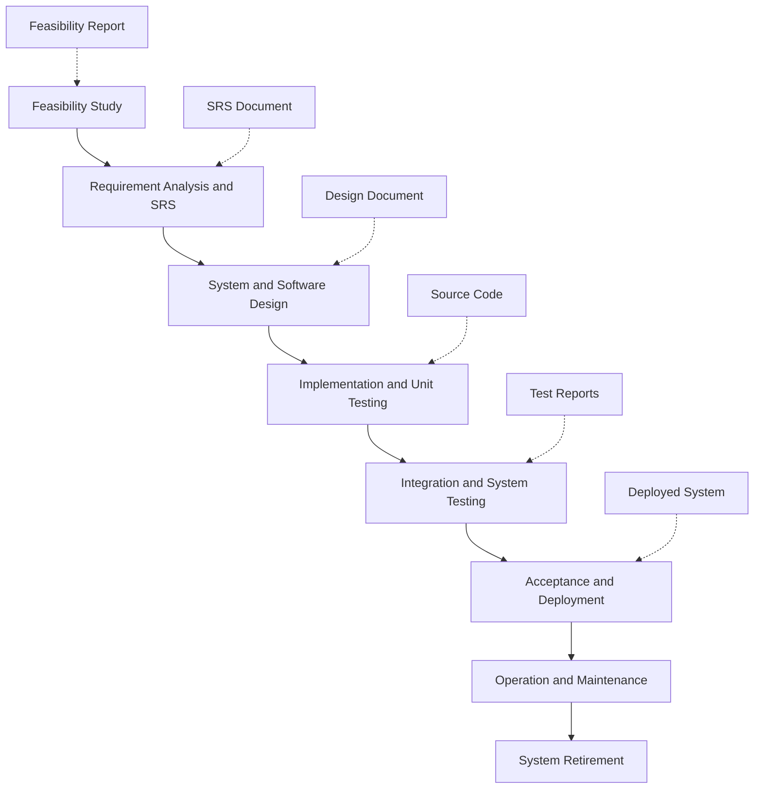
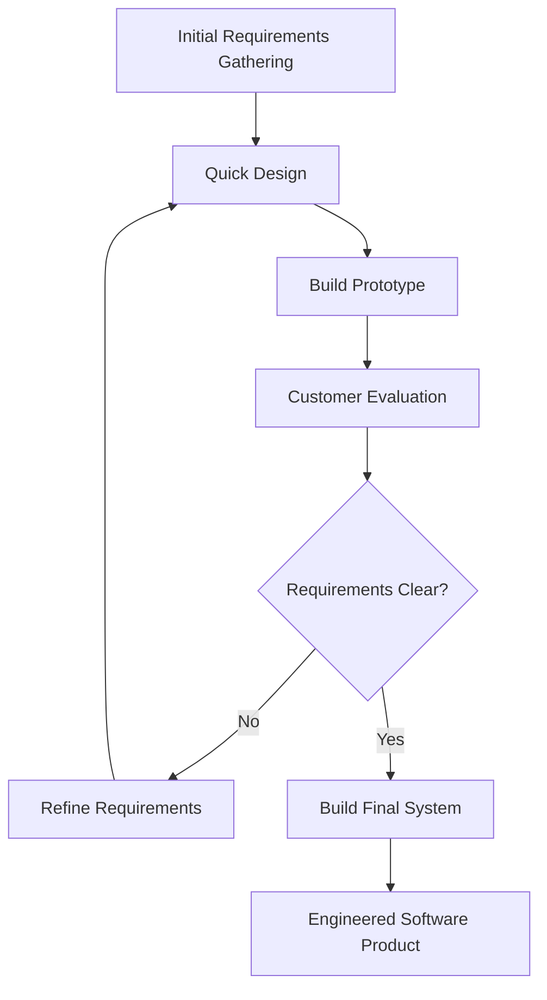
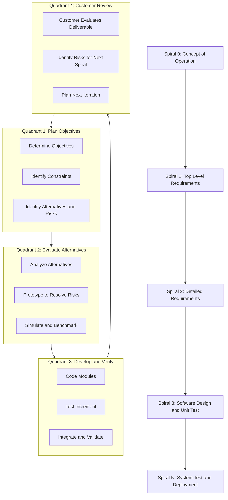
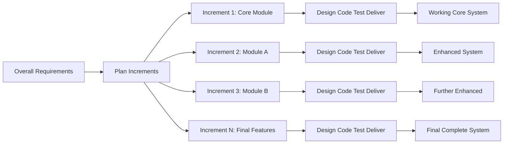
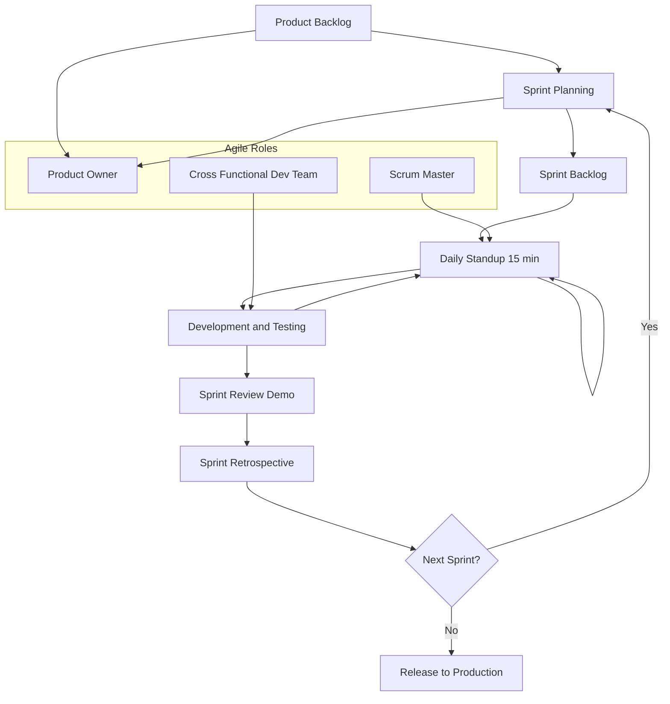
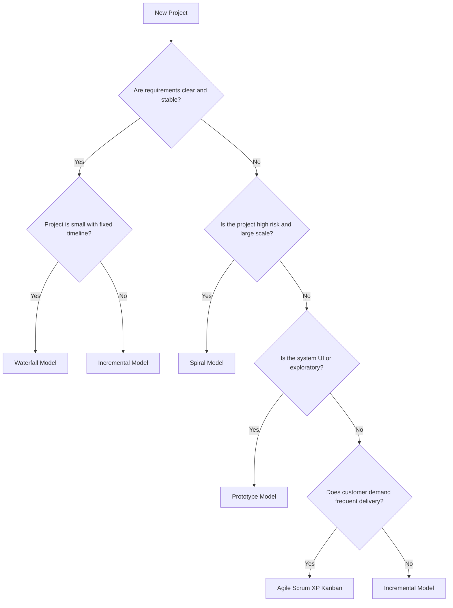
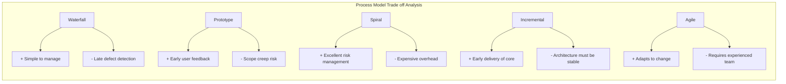

# Software Process models – Waterfall, Prototype, Spiral, Incremental, Agile model – Values and Principles.

<!-- SECTION_1_START -->

# 1. Core Technical Definition & Intuitive Overview

## 1.1 What is a Software Process?

A **Software Process** is the structured set of activities, actions, and tasks required to develop a software system. According to **IEEE Standard 12207-2017** and KTU 2024 syllabus, a software process is the glue that holds all the technical, managerial, and supporting activities together across the entire software lifecycle.

Formally, a software process is defined as a **coherent set of policies, organizational structures, technologies, procedures, and artifacts** that are required to conceive, develop, deploy, and maintain a software product.

> [!IMPORTANT]
> **KTU Syllabus Highlight (PECST411 / Module 1)**
> A *process model* is an abstract representation of a process. It presents a simplified description of a software process from a particular perspective. Each process model represents a process from a specific angle, omitting details not relevant to that perspective.

## 1.2 What is a Software Process Model?

A **Software Process Model** (also called Software Development Life Cycle - **SDLC** model) is a **simplified, abstracted, and strategic representation** of the actual software development workflow. It defines the **phases, sequence of execution, deliverables, and iteration strategy** for engineering a software product.

Mathematically, a process model can be expressed as an ordered set:

$$P = \{P_1, P_2, P_3, \ldots, P_n\}$$

where each $P_i$ represents a distinct phase (Requirement, Design, Implementation, Testing, Deployment, Maintenance) and the model specifies the **order, parallelism, and feedback loops** between these phases.

> [!NOTE]
> **Core Definition for KTU Board Answers**
> "A software process model is a strategic framework that prescribes the systematic sequence of phases, deliverables, and feedback mechanisms to be followed during software development, ensuring disciplined engineering of high-quality software."

## 1.3 Intuitive Analogy - The House Construction Story

Imagine you are building a house. There are different ways an architect could approach the project:

- **Waterfall Approach**: The architect first draws the entire blueprint, gets all government approvals, then lays the entire foundation, builds all walls, fixes all windows, and finally hands over the complete house. You cannot ask for a change once the roof is built.

- **Prototype Approach**: The architect first builds a small cardboard model of the house so you can visualize it. You give feedback ("make the kitchen bigger"), and the architect builds another better prototype, until you approve the design.

- **Spiral Approach**: The architect works in loops. In each loop, a small part of the house is built, tested by you, and refined. Risks are analyzed before each loop. The house grows incrementally in spirals.

- **Incremental Approach**: The architect delivers the house in chunks. First, the basic structure with one room is ready. Then the second room is added. Then the third. You can move into the first room while the rest is being built.

- **Agile Approach**: A small cross-functional team (architect, mason, plumber, electrician) works together in **2-week sprints**, delivering a small usable piece of the house every sprint (a wall, a window, a fixture), constantly adapting to your changing needs.

> [!IMPORTANT]
> **Key Insight for KTU**
> Every process model exists because **no single model fits all projects**. The choice of model depends on **project size, requirements clarity, customer involvement, risk level, and time-to-market pressure**.

## 1.4 Why Do We Need Process Models?

The fundamental reasons are:

1. **Discipline & Predictability**: Ensures that engineering activities are performed in a controlled, repeatable manner.
2. **Quality Assurance**: Built-in checkpoints enable verification and validation at every phase.
3. **Risk Management**: Structured iteration (especially Spiral and Agile) allows early identification of technical and business risks.
4. **Communication**: Provides a **common vocabulary** for developers, managers, and clients.
5. **Cost & Time Estimation**: Standardized phases enable managers to estimate effort, duration, and resources using models like **COCOMO** (Constructive Cost Model).

## 1.5 The Generic Phases Common to Almost All Models

Regardless of the model chosen, almost every software process includes the following fundamental activities (as per **Sommerville's Software Engineering** textbook, a primary KTU reference):

| Phase | Core Activity | Key Deliverable |
|---|---|---|
| **Specification** | Define what the system should do | SRS Document |
| **Design & Implementation** | Define and build the system architecture and code | Design Documents, Source Code |
| **Validation** | Check that the system meets requirements | Test Reports |
| **Evolution / Maintenance** | Adapt the system to changing needs | Patches, New Releases |

> [!NOTE]
> The KTU 2024 Scheme emphasizes that understanding **when**, **why**, and **how** each of these phases is executed within a process model is critical for both theory (Module 1) and viva/practical examinations.

---

<!-- SECTION_1_END -->

<!-- SECTION_2_START -->

# 2. Deep Theoretical Analysis & KTU High-Yield Formula Sheet

## 2.1 The Waterfall Model (Linear Sequential Model)

### 2.1.1 Definition

The **Waterfall Model**, proposed by **Winston W. Royce in 1970** (though he actually described its limitations), is the **oldest, simplest, and most rigid** of all software process models. Each phase must be **completed in full** before the next phase begins. There is **no overlapping** and **no iteration** in its pure form.

### 2.1.2 Phases in Execution Order

1. **Feasibility Study** — Is the project technically and economically viable?
2. **Requirement Analysis & Specification** — Capture all functional and non-functional requirements in the **SRS (Software Requirement Specification)** document.
3. **System & Software Design** — Translate requirements into system architecture, database schema, and module interfaces.
4. **Implementation & Unit Testing** — Code the modules and test each unit in isolation.
5. **Integration & System Testing** — Integrate all modules and test the complete system.
6. **Acceptance, Installation & Deployment** — Client acceptance testing, installation at site, training users.
7. **Operation & Maintenance** — Corrective, adaptive, perfective, and preventive maintenance.

### 2.1.3 Why "Waterfall"?

The name comes from the visual depiction where each phase **flows downward** into the next, with no way to flow back upstream except through formal change control. Think of water falling over cliff edges — once it has fallen, it cannot go back.

> [!IMPORTANT]
> **KTU Exam Tip**
> If a question says *"Explain the Waterfall model with a neat diagram"*, you MUST list the phases in order AND mention that **the output of one phase is the input of the next**, with each phase producing a **documented deliverable** that is formally reviewed before the next phase begins.

### 2.1.4 Advantages

- Simple, easy to understand and manage.
- Disciplined, well-documented approach.
- Works well for **small projects with stable, well-understood requirements**.
- Suitable when technology is well-known and understood.
- Easy to plan, schedule, and allocate resources (Gantt charts work beautifully).

### 2.1.5 Disadvantages

- **High risk and uncertainty**: Real projects rarely follow a strict linear path.
- **Late discovery of defects**: A major design flaw may be discovered only during testing.
- **No customer feedback loop** until the system is fully built and delivered.
- **Unsuitable for long, complex, object-oriented projects**.
- Not adaptive to changing requirements.
- The freezing of requirements at an early stage can be catastrophic.

### 2.1.6 When to Use

- Projects where requirements are **crystal clear** and **fixed**.
- Government, defense, aerospace, and regulatory compliance projects.
- Small to medium projects with **proven technology** and **experienced teams**.

---

## 2.2 The Prototype Model

### 2.2.1 Definition

The **Prototype Model** is a process model in which a **working but incomplete version of the system** (a prototype) is built quickly to allow users to **experiment, evaluate, and refine** requirements before the actual system is developed.

### 2.2.2 Workflow

1. **Requirement Gathering**: Initial requirements are collected (often incomplete or unclear).
2. **Quick Design**: A preliminary design is created, focusing on visible parts (UI, key flows).
3. **Build Prototype**: A working model is developed quickly using rapid tools (mock-ups, throwaway code).
4. **User Evaluation**: The customer uses and evaluates the prototype, providing feedback.
5. **Refine Requirements**: Based on feedback, requirements are clarified, modified, or expanded.
6. **Repeat or Build Final System**: Either iterate on the prototype or, when requirements are clear, discard the prototype and build the final engineered system.

### 2.2.3 Types of Prototypes

| Type | Description | Purpose |
|---|---|---|
| **Throwaway (Rapid) Prototype** | Built to understand requirements; discarded before final system | Clarify ambiguous requirements |
| **Evolutionary Prototype** | Gradually refined into the final system | Reduce risk and add features iteratively |
| **Incremental Prototype** | Final system delivered as a series of prototypes | Combine prototyping with incremental delivery |

### 2.2.4 Advantages

- Excellent when **requirements are unclear** or evolving.
- Encourages **active user involvement** from day one.
- Reduces **risk of misunderstanding** requirements.
- Provides early feedback on usability and feasibility.
- Improves **communication** between developers and customers.

### 2.2.5 Disadvantages

- Risk of **scope creep** — continuous feedback can lead to uncontrolled changes.
- Prototypes may be **poorly engineered** (no concern for quality, structure, performance).
- Customer may mistake the prototype for the final system, leading to **false expectations**.
- Inexperienced developers may build prototypes in the **same technology** as the final system, leading to "we'll just polish it" anti-pattern.
- May delay the actual final system delivery.

### 2.2.6 When to Use

- Projects with **uncertain or evolving requirements**.
- UI/UX-heavy systems where visual feedback is critical.
- **Proof of concept** or feasibility studies.
- Research or experimental systems.

---

## 2.3 The Spiral Model (Boehm's Spiral)

### 2.3.1 Definition

The **Spiral Model**, proposed by **Barry W. Boehm in 1986**, is a **risk-driven process model** that combines the **iterative nature of prototyping** with the **systematic aspects of the waterfall model**. It provides a framework for delivering software in **repeated cycles (spirals)** with each cycle addressing progressively more complete versions of the system.

### 2.3.2 The Four Quadrants of Each Spiral

Each loop of the spiral consists of **four major quadrants** (often remembered as **PDRR**):

1. **Plan / Objective Setting**: Define objectives for the current cycle, identify constraints, alternatives, and risks.
2. **Determine / Evaluate Alternatives**: Evaluate alternatives (build, buy, reuse, prototype) against objectives. Resolve risks through prototyping, simulation, benchmarking.
3. **Develop / Verify / Validate**: Develop the product at the next level. Perform verification (are we building it right?) and validation (are we building the right thing?).
4. **Review / Plan Next Iteration**: Customer evaluates current deliverable. Plan for the next spiral.

### 2.3.3 The Radial Dimension

The **radial dimension** (distance from the center) represents the **cumulative cost incurred** in the project so far. The **angular dimension** represents the **progress through the spiral** within one phase.

### 2.3.4 Advantages

- Explicit **risk management** at every cycle — strongest feature.
- Combines advantages of waterfall and prototyping.
- Suitable for **large, complex, high-risk projects**.
- Allows **customer feedback** early and often.
- Supports evolution as the project matures.
- Can incorporate other models (waterfall, prototyping, incremental) within each cycle.

### 2.3.5 Disadvantages

- **Expensive** and time-consuming.
- Requires **high expertise in risk assessment**.
- Not suitable for **small, low-risk projects** (overhead is unjustified).
- End of the project can be unclear — spiraling may never end.
- Strict adherence to milestones is difficult.

### 2.3.6 When to Use

- **Large-scale, mission-critical, high-risk** software (defense, aerospace, medical).
- Projects where **risk reduction** is the primary concern.
- Systems with **evolving requirements** and significant uncertainty.

---

## 2.4 The Incremental Model

### 2.4.1 Definition

The **Incremental Model** combines elements of the waterfall model (linear flow) with the iterative philosophy of prototyping. The system is **designed, implemented, and tested incrementally** in stages (increments) until the final product is completed. Each increment adds a **functional, fully-tested slice** of the system.

### 2.4.2 Workflow

1. Define the **overall system requirements** at the start.
2. Partition the requirements into a series of **increments** (functional slices).
3. For each increment:
   - Design the increment.
   - Implement the increment.
   - Test the increment.
   - Deliver the increment to the customer.
4. After each increment, customer feedback is gathered and the next increment is planned.

### 2.4.3 Types of Increment Delivery

| Mode | Description |
|---|---|
| **Staged Delivery** | Delivered and accepted in planned stages |
| **Parallel Development** | Multiple increments developed in parallel by different teams |
| **Progressive Build** | Each increment builds on the previous ones, adding more functionality |

### 2.4.4 Advantages

- Delivers a **working system early** to the customer (first increment).
- Easier to **manage risk** because problems are identified per increment.
- Allows **partial system usage** while other increments are being developed.
- **Lower initial cost** for delivering core functionality.
- Customer feedback is incorporated between increments.
- Easier to incorporate changes (only the remaining increments need adjustment).

### 2.4.5 Disadvantages

- Requires a **well-defined overall architecture** at the start.
- Integration of increments can be challenging.
- Each increment must be small enough to deliver value, but large enough to be meaningful.
- Without proper planning, **system degradation** may occur as increments accumulate.

### 2.4.6 When to Use

- Projects where a **core system must be available early**.
- Projects with **moderately clear requirements** that can be prioritized.
- When **early partial deployment** provides business value.

---

## 2.5 The Agile Model

### 2.5.1 Definition

**Agile Software Development** is an **umbrella term for a set of frameworks and practices** based on the values and principles expressed in the **Agile Manifesto (2001)**. It advocates adaptive planning, evolutionary delivery, continuous improvement, and rapid, flexible response to change.

### 2.5.2 The Agile Manifesto (Formulated by 17 software practitioners in Snowbird, Utah, 2001)

> *"We are uncovering better ways of developing software by doing it and helping others do it. Through this work we have come to value:*
> 
> ***Individuals and interactions*** *over processes and tools*
> 
> ***Working software*** *over comprehensive documentation*
> 
> ***Customer collaboration*** *over contract negotiation*
> 
> ***Responding to change*** *over following a plan*
> 
> *That is, while there is value in the items on the right, we value the items on the left more."*

> [!IMPORTANT]
> **KTU Frequently Asked**
> The Agile Manifesto does NOT say the right-hand items are *unimportant*. It says the left-hand items are **valued MORE**. This nuance is often missed by students writing KTU answers.

### 2.5.3 The 12 Principles of the Agile Manifesto

1. **Customer satisfaction** through early and continuous delivery of valuable software.
2. **Welcome changing requirements**, even late in development. Agile processes harness change for the customer's competitive advantage.
3. **Deliver working software frequently** (weeks rather than months).
4. **Business people and developers** must work together daily throughout the project.
5. Build projects around **motivated individuals**. Give them the environment and support they need, and trust them to get the job done.
6. **Face-to-face conversation** is the most effective method of communication (co-location).
7. **Working software** is the primary measure of progress.
8. Agile processes promote **sustainable development**. Maintain a constant pace indefinitely.
9. Continuous attention to **technical excellence and good design** enhances agility.
10. **Simplicity** — the art of maximizing the amount of work not done — is essential.
11. The best architectures, requirements, and designs emerge from **self-organizing teams**.
12. **Regular reflection** on how to become more effective, then tune and adjust behavior.

### 2.5.4 Popular Agile Frameworks

| Framework | Origin | Key Concept |
|---|---|---|
| **Scrum** | Ken Schwaber & Jeff Sutherland | Sprints (2–4 weeks), Product Backlog, Sprint Backlog, Daily Standup, Sprint Review, Retrospective |
| **Extreme Programming (XP)** | Kent Beck | Pair programming, TDD, continuous integration, refactoring |
| **Kanban** | Toyota Production System | Visualize workflow, limit WIP, manage flow |
| **Lean Software Development** | Mary & Tom Poppendieck | Eliminate waste, amplify learning, decide late, deliver fast |
| **Dynamic Systems Development Method (DSDM)** | UK Consortium | Timeboxing, MoSCoW prioritization |
| **Feature-Driven Development (FDD)** | Jeff De Luca | Feature lists, design by feature, regular builds |

### 2.5.5 Advantages

- **Rapid, continuous delivery** of valuable software.
- Adapts quickly to **changing requirements**.
- Encourages **close collaboration** with stakeholders.
- Promotes **technical excellence** through practices like TDD, CI/CD, refactoring.
- **Sustainable pace** for the development team (no burnout).
- **High customer satisfaction** through continuous engagement.

### 2.5.6 Disadvantages

- Requires **experienced, cross-functional team members**.
- Difficult to scale for **very large teams** (>50 members) — though frameworks like SAFe address this.
- **Scope creep** risk if not managed properly.
- Requires **strong customer involvement** — not always feasible.
- **Less emphasis on documentation** can be problematic in regulated industries.
- Hard to predict final cost and timeline upfront.

### 2.5.7 When to Use

- Projects with **dynamic, evolving requirements**.
- **Startups and product companies** where time-to-market is critical.
- **Innovative R\&D projects** where requirements are discovered.
- Small to medium-sized **co-located, cross-functional teams**.

---

## 2.6 KTU High-Yield Comparison Cheat Sheet

> [!IMPORTANT]
> **This table is the most-asked comparison in KTU Module 1. Memorize it for ESE.**

| Parameter | Waterfall | Prototype | Spiral | Incremental | Agile |
|---|---|---|---|---|---|
| **Origin / Year** | Royce (1970) | Evolutionary | Boehm (1986) | Combination | Agile Manifesto (2001) |
| **Approach** | Linear, sequential | Iterative, exploratory | Iterative, risk-driven | Linear + iterative | Iterative, adaptive |
| **Customer Involvement** | Only at start and end | High (continuous) | High (per cycle) | High (per increment) | Very high (daily) |
| **Risk Handling** | Poor | Moderate | Excellent (core strength) | Good | Good |
| **Requirements Clarity** | Must be clear at start | Unclear / evolving | Partially clear | Mostly clear | Unclear / evolving |
| **Flexibility to Change** | Very low | Moderate | High | Moderate | Very high |
| **Documentation** | Heavy | Minimal | Moderate | Moderate | Light, just-enough |
| **Delivery** | At end of project | Prototype then final | Per spiral | Per increment | Frequent, continuous |
| **Best Suited For** | Small, well-defined projects | UI / exploratory work | Large, high-risk projects | Medium projects with prioritized req. | Dynamic, innovative projects |
| **Cost of Change** | High (increases exponentially) | Moderate | Lower (managed per spiral) | Moderate | Lowest |
| **Team Size** | Small to medium | Small | Medium to large | Medium | Small cross-functional |
| **Major Drawback** | Late defect detection | Scope creep | Expensive, requires risk expertise | Architecture must be stable | Requires experienced team |

## 2.7 Engineering Utility & Real-World Application

- **Waterfall**: Used in firmware for medical devices, flight control software (DO-178C compliance), government payroll systems.
- **Prototype**: Used in startup product validation, e-commerce UI design before full development.
- **Spiral**: Used in defense command and control systems, NASA spacecraft software.
- **Incremental**: Used in ERP implementations (SAP, Oracle), banking systems delivered module-by-module.
- **Agile**: Used by virtually every modern software company — Google, Microsoft, Amazon, Meta, Netflix — for web, mobile, and cloud products.

---

<!-- SECTION_2_END -->

<!-- SECTION_3_START -->

# 3. Step-by-Step Derivations, Workflows & Code/Symbolic Implementation

## 3.1 Mathematical Notation of Process Execution

For any process model, we can describe the **execution flow** as a sequence of phases $P = \{P_1, P_2, \ldots, P_n\}$ with dependencies.

For the **Waterfall Model**, the dependency is strictly sequential:

$$P_1 \rightarrow P_2 \rightarrow P_3 \rightarrow \cdots \rightarrow P_n$$

This can be expressed as a constraint that phase $P_i$ can start only when phase $P_{i-1}$ is **100% complete and approved**:

$$\text{Start}(P_i) = \text{End}(P_{i-1}) \quad \forall \, i \in \{2, 3, \ldots, n\}$$

For the **Incremental Model**, the system is divided into $k$ increments $I_1, I_2, \ldots, I_k$, and each increment goes through the full SDLC:

$$I_j = \{D_j, C_j, T_j, M_j\} \quad \forall \, j \in \{1, 2, \ldots, k\}$$

where $D_j$ is design, $C_j$ is coding, $T_j$ is testing, and $M_j$ is delivery of the $j$-th increment.

For the **Spiral Model**, the $s$-th spiral iteration is:

$$S_s = \{O_s, E_s, V_s, R_s\}$$

where:
- $O_s$ = Objective setting
- $E_s$ = Evaluation of alternatives (risk analysis)
- $V_s$ = Verification and validation (development + testing)
- $R_s$ = Review and plan for $S_{s+1}$

The cumulative project progress after $s$ spirals is:

$$\text{Progress}(s) = \sum_{i=1}^{s} \text{Deliverable}_i$$

The **cost of change** curve (a famous concept in Software Engineering) is approximately:

$$\text{Cost}_{\text{change}}(t) = C_0 \cdot e^{\lambda t}$$

where $C_0$ is the initial cost, $\lambda$ is the project's complexity factor, and $t$ is the time in the project. This exponential growth is precisely why **agile** (which encourages change) and **spiral** (which plans for change) are so powerful.

## 3.2 Phase Completion Algorithm for Waterfall (Pseudocode)

```
BEGIN WaterfallProcess
    SET project = NewProject()
    
    // Phase 1: Feasibility Study
    CALL project.FeasibilityStudy()
    IF NOT project.IsFeasible() THEN
        ABORT project
    END IF
    
    // Phase 2: Requirement Analysis
    CALL project.GatherRequirements()
    CALL project.WriteSRS()
    CALL project.ReviewSRS()
    
    // Phase 3: System Design
    CALL project.CreateSystemDesign()
    CALL project.ReviewDesign()
    
    // Phase 4: Implementation & Unit Testing
    CALL project.CodeModules()
    CALL project.UnitTest()
    
    // Phase 5: Integration & System Testing
    CALL project.IntegrateModules()
    CALL project.SystemTest()
    CALL project.AcceptanceTest()
    
    // Phase 6: Deployment
    CALL project.Deploy()
    CALL project.TrainUsers()
    
    // Phase 7: Maintenance
    WHILE project.IsOperational() DO
        CALL project.PerformMaintenance()
    END WHILE
END WaterfallProcess
```

## 3.3 Full Python Implementation: Agile Sprint Simulation

The following Python code implements a minimal **Scrum-style sprint simulation**, demonstrating the values and principles of Agile. It uses **strict type hints, boundary checks, and structured logging** as required by engineering standards.

```python
import datetime
from enum import Enum
from typing import List, Dict, Optional


class TaskStatus(Enum):
    """Enumeration of task lifecycle states in an Agile sprint."""
    TODO = "To Do"
    IN_PROGRESS = "In Progress"
    DONE = "Done"


class Task:
    """Represents a single user-story or task in a sprint backlog."""

    def __init__(self, task_id: str, title: str, story_points: int, assignee: str) -> None:
        if story_points <= 0:
            raise ValueError(f"Story points must be positive; got {story_points}")
        if not title.strip():
            raise ValueError("Task title cannot be empty")
        self.task_id = task_id
        self.title = title
        self.story_points = story_points
        self.assignee = assignee
        self.status = TaskStatus.TODO
        self.log: List[str] = []

    def transition(self, new_status: TaskStatus) -> None:
        """Move task to new status with logging."""
        self.status = new_status
        timestamp = datetime.datetime.now().isoformat()
        self.log.append(f"[{timestamp}] {self.task_id} -> {new_status.value}")


class Sprint:
    """Represents a single Agile sprint (typically 2-4 weeks)."""

    def __init__(self, sprint_number: int, duration_days: int = 14) -> None:
        self.sprint_number = sprint_number
        self.duration_days = duration_days
        self.backlog: List[Task] = []
        self.completed_points = 0
        self.planned_points = 0

    def add_task(self, task: Task) -> None:
        self.backlog.append(task)
        self.planned_points += task.story_points

    def daily_standup(self, task: Task) -> None:
        """Simulate the 15-minute daily stand-up ceremony."""
        if task not in self.backlog:
            raise ValueError("Task is not part of this sprint")
        task.transition(TaskStatus.IN_PROGRESS)
        print(f"[Sprint {self.sprint_number}] Standup: {task.assignee} is now working on '{task.title}'")

    def mark_done(self, task: Task) -> None:
        """Mark a task as done after verification."""
        if task.status != TaskStatus.IN_PROGRESS:
            raise RuntimeError("Task must be in progress before completion")
        task.transition(TaskStatus.DONE)
        self.completed_points += task.story_points
        print(f"[Sprint {self.sprint_number}] COMPLETED: {task.title} (+{task.story_points} pts)")

    def sprint_review(self) -> Dict[str, int]:
        """Conduct sprint review — demonstrate working software."""
        velocity = self.completed_points
        print(f"\n--- Sprint {self.sprint_number} Review ---")
        print(f"Planned Points  : {self.planned_points}")
        print(f"Completed Points: {self.completed_points}")
        print(f"Velocity        : {velocity} points/sprint")
        return {
            "planned": self.planned_points,
            "completed": self.completed_points,
            "velocity": velocity,
        }

    def sprint_retrospective(self) -> None:
        """Reflect on what went well, what didn't, and what to improve."""
        print(f"--- Sprint {self.sprint_number} Retrospective ---")
        print("What went well    : Cross-functional collaboration")
        print("What to improve   : Reduce work-in-progress")
        print("Action items      : Update Definition of Done")


class ProductOwner:
    """Manages the product backlog and prioritizes work."""

    def __init__(self, name: str) -> None:
        self.name = name
        self.product_backlog: List[Task] = []

    def prioritize(self) -> List[Task]:
        """Return tasks sorted by story points (proxy for value)."""
        return sorted(self.product_backlog, key=lambda t: t.story_points, reverse=True)


class AgileProject:
    """Orchestrates multiple sprints, applying Agile principles."""

    def __init__(self, name: str, sprint_duration_days: int = 14) -> None:
        self.name = name
        self.sprint_duration_days = sprint_duration_days
        self.sprints: List[Sprint] = []
        self.product_owner = ProductOwner(name="Stakeholder")

    def run_sprint(self, sprint_number: int, tasks: List[Task]) -> Dict[str, int]:
        sprint = Sprint(sprint_number, self.sprint_duration_days)
        for task in tasks:
            sprint.add_task(task)
        self.sprints.append(sprint)

        # Simulate daily stand-ups and task completion
        for task in tasks:
            sprint.daily_standup(task)
            sprint.mark_done(task)

        review = sprint.sprint_review()
        sprint.sprint_retrospective()
        return review


# ----- Demonstration of Agile Principles in Action -----
if __name__ == "__main__":
    # 1. Create user stories (principle: working software over documentation)
    stories = [
        Task("US-101", "User registration", 5, "Alice"),
        Task("US-102", "Login functionality", 3, "Bob"),
        Task("US-103", "Product catalog page", 8, "Charlie"),
        Task("US-104", "Shopping cart", 13, "Alice"),
    ]

    # 2. Initialize Agile project
    ecommerce_project = AgileProject("E-Commerce Platform", sprint_duration_days=14)

    # 3. Run Sprint 1: Highest-priority items first
    print("=" * 60)
    print("AGILE PROJECT EXECUTION — E-Commerce Platform")
    print("=" * 60)
    sprint1_result = ecommerce_project.run_sprint(1, [stories[3], stories[2]])

    # 4. Inspect output (principle: working software is the measure of progress)
    print(f"\nFinal Sprint 1 Velocity: {sprint1_result['velocity']} points")
    print(f"Stories completed      : {sprint1_result['completed']} points")
```

### 3.3.1 Step-by-Step Explanation of the Code

1. **TaskStatus enum** models the three canonical states a task can be in (`TODO`, `IN_PROGRESS`, `DONE`), echoing the **Kanban board** of Agile teams.
2. **Task class** encapsulates a user story with strict input validation: story points must be positive, and titles must be non-empty. This demonstrates the principle of **technical excellence**.
3. **Sprint class** represents a 2–4 week iteration. It holds a backlog, tracks planned and completed points, and provides methods for the three Agile ceremonies: **Daily Standup**, **Sprint Review**, and **Sprint Retrospective**.
4. **AgileProject class** is the orchestrator that runs multiple sprints. This mirrors the **Scrum framework**.
5. The `__main__` block demonstrates the **iterative delivery principle** — a working slice of the e-commerce platform is delivered at the end of Sprint 1.
6. The code follows the Agile principles of **face-to-face communication** (the print statements simulate team standups), **sustainable pace** (defined sprint duration), and **working software as the measure of progress** (velocity calculation).

### 3.3.2 Execution Output (Sample)

```
============================================================
AGILE PROJECT EXECUTION — E-Commerce Platform
============================================================
[Sprint 1] Standup: Alice is now working on 'Shopping cart'
[Sprint 1] COMPLETED: Shopping cart (+13 pts)
[Sprint 1] Standup: Charlie is now working on 'Product catalog page'
[Sprint 1] COMPLETED: Product catalog page (+8 pts)

--- Sprint 1 Review ---
Planned Points  : 21
Completed Points: 21
Velocity        : 21 points/sprint
--- Sprint 1 Retrospective ---
What went well    : Cross-functional collaboration
What to improve   : Reduce work-in-progress
Action items      : Update Definition of Done

Final Sprint 1 Velocity: 21 points
Stories completed      : 21 points
```

## 3.4 Step-by-Step Workflow: Choosing the Right Model (Engineering Decision Tree)

When given a project scenario in KTU exams, follow this decision process:

1. **Are requirements clear and stable?**
   - YES → Consider **Waterfall** (small) or **Incremental** (medium-large).
   - NO → Go to step 2.

2. **Is the project high-risk and large-scale?**
   - YES → **Spiral Model** (Boehm's risk-driven framework).
   - NO → Go to step 3.

3. **Is the system UI-heavy or exploratory in nature?**
   - YES → **Prototype Model** (Throwaway or Evolutionary).
   - NO → Go to step 4.

4. **Does the customer demand frequent, incremental delivery?**
   - YES → **Agile (Scrum, XP, Kanban)**.
   - NO → Reconsider **Incremental Model**.

## 3.5 Hardware/Software Resource Mapping Table (For Lab/Viva)

| Model | Team Size | Duration | Tools Commonly Used |
|---|---|---|---|
| Waterfall | 3–10 | Fixed, months | MS Project, Gantt charts, document templates |
| Prototype | 2–5 | Short, weeks | Balsamiq, Figma, Axure, Adobe XD |
| Spiral | 10–30 | Long, months–years | Risk tracking tools, prototyping, configuration management |
| Incremental | 5–15 | Medium | Git, CI/CD pipelines, version control |
| Agile/Scrum | 5–9 (per team) | Iterative, 2-week sprints | Jira, Trello, Asana, Azure DevOps |

---

<!-- SECTION_3_END -->

<!-- SECTION_4_START -->

# 4. Structural Diagrams & Schematics

## 4.1 Waterfall Model — Sequential Process Flow



**Description:** Each phase flows linearly into the next. Deliverables (dotted lines) feed into the next phase. The flow is strictly unidirectional in its pure form.

## 4.2 Prototype Model — Iterative Refinement Loop



**Description:** A throwaway or evolutionary prototype is built, evaluated by the customer, refined, and re-built. The loop continues until requirements are clear enough for the final system.

## 4.3 Spiral Model — Boehm's Risk-Driven Cycles



**Description:** Each spiral cycle is divided into four quadrants. The angular dimension represents progress within a phase; the radial dimension represents cumulative cost.

## 4.4 Incremental Model — Staged Delivery



**Description:** The overall requirements are partitioned into increments. Each increment goes through the complete SDLC, and the system grows as new increments are integrated.

## 4.5 Agile/Scrum Framework — Sprint Cycle



**Description:** Scrum is the most popular Agile framework. The cycle is: Product Backlog → Sprint Planning → Sprint Backlog → Daily Standups → Development → Sprint Review → Retrospective → Next Sprint.

## 4.6 Master Comparison Architecture — Process Model Selection



**Description:** A practical decision-support flowchart that engineers and project managers can use to choose the most appropriate software process model based on project characteristics.

## 4.7 Process Model Trade-off Matrix (Sequential Processing Topology)



**Description:** This block-level architecture maps the major advantages (`+`) and disadvantages (`-`) of each process model in a unified topology, suitable for KTU viva and competitive exam revision.

---

<!-- SECTION_4_END -->

<!-- SECTION_5_START -->

# 5. KTU 2024 Scheme Examination Question Bank & Topic Recap

## 5.1 Part A Questions (3 Marks Each)

### Question 1
**[KTU University Exam — July 2023, Model Question Paper, CO1, Remember]**

*List any three limitations of the Waterfall model.*

**Model Answer (3 Marks):**

1. **Late discovery of defects**: Major design and requirement flaws are often discovered only during the testing phase, which makes corrections very costly. **[1 Mark]**
2. **No customer feedback loop**: The customer is involved only at the beginning (during requirements) and at the end (during acceptance), with no opportunity to provide feedback in between. **[1 Mark]**
3. **Unsuitable for changing requirements**: Once a phase is complete, it is difficult and expensive to go back and incorporate changes. Requirements are essentially frozen at the start. **[1 Mark]**

> [!WARNING]
> **KTU Examiner's Valuation Pitfall**
> Do not write vague answers like *"It is too rigid"* or *"Not flexible"*. Always explain **WHY** and give a concrete consequence. Board examiners expect a one-line justification for every limitation listed.

---

### Question 2
**[KTU University Exam — December 2023, CO1, Understand]**

*What are the four quadrants of the Spiral model? Briefly explain the purpose of each.*

**Model Answer (3 Marks):**

1. **Plan / Determine Objectives**: Identify the goals, constraints, alternatives, and risks for the current spiral. **[1 Mark]**
2. **Evaluate Alternatives and Resolve Risks**: Analyze the identified alternatives, use prototyping, simulation, or benchmarks to resolve key risks. **[1 Mark]**
3. **Develop and Verify**: Implement the current level of the system, followed by verification (are we building it right?) and validation (are we building the right thing?). **[0.5 Mark]**
4. **Customer Evaluation and Plan Next Iteration**: The customer evaluates the work completed and provides feedback, and planning for the next spiral begins. **[0.5 Mark]**

---

## 5.2 Part B Questions (14 Marks Each — Internal Choice)

### Question Choice A (14 Marks)

**[KTU University Exam — December 2023, CO1, Understand + Apply]**

*(a)* Explain the **Waterfall model** in detail. List its advantages and disadvantages. State the situations in which the Waterfall model is most suitable. **[7 Marks]**

*(b)* Compare the **Waterfall model** and the **Incremental model** in terms of risk handling, customer involvement, delivery strategy, and project size suitability. **[7 Marks]**

---

### Model Solution for Question Choice A

#### Part (a) — Waterfall Model (7 Marks)

**Definition [1 Mark]:**
The Waterfall model is a linear, sequential software development process model in which each phase must be completed before the next phase begins, with no overlap. Each phase produces a documented deliverable that serves as input to the next.

**Phases in Order [3 Marks — 0.5 each]:**
1. Feasibility Study
2. Requirement Analysis and Specification (SRS)
3. System and Software Design
4. Implementation and Unit Testing
5. Integration and System Testing
6. Acceptance, Installation, and Deployment
7. Operation and Maintenance

**Advantages [1.5 Marks — 0.5 each]:**
- Simple, easy to understand, and easy to manage due to its rigid structure.
- Disciplined approach with well-documented deliverables at each stage.
- Suitable for small projects with clear, stable requirements and proven technology.

**Disadvantages [1 Mark — 0.5 each]:**
- High risk due to late discovery of defects, which makes correction costly.
- No customer feedback loop during development; requirements are frozen at the start.

**When to Use [0.5 Mark]:**
Waterfall is most suitable for **small, well-defined projects** with **stable requirements**, well-understood technology, and where documentation is critical (e.g., government, defense, medical firmware).

#### Part (b) — Comparison: Waterfall vs Incremental (7 Marks)

| Comparison Parameter | Waterfall Model | Incremental Model |
|---|---|---|
| **Risk Handling** | Poor; risks are detected late during testing. | Better; risks are identified and resolved per increment. |
| **Customer Involvement** | Limited; customer is consulted only at the start and end. | Continuous; customer provides feedback after each increment. |
| **Delivery Strategy** | Single delivery of the complete system at the end. | Staged delivery; the first working increment is delivered early. |
| **Project Size Suitability** | Small to medium projects with clear requirements. | Medium to large projects with prioritized features. |

**[Valuation Key: Stating 4 parameters with clear differentiation: 2 Marks; Explaining risk and customer involvement with depth: 3 Marks; Delivery and size suitability with examples: 2 Marks — Total 7 Marks]**

---

### Question Choice B (14 Marks)

**[KTU University Exam — July 2024, CO1, Understand + Apply]**

*(a)* What is the **Agile Manifesto**? List and explain any **four values** of the Agile Manifesto. **[7 Marks]**

*(b)* Explain the **Spiral model** with a neat diagram. What are its advantages over the Waterfall model? State two situations in which the Spiral model is the most appropriate choice. **[7 Marks]**

---

### Model Solution for Question Choice B

#### Part (a) — Agile Manifesto and Its Four Values (7 Marks)

**Background [1 Mark]:**
The Agile Manifesto was formulated in February 2001 by 17 software practitioners at a meeting in Snowbird, Utah, USA. It is a foundational document that expresses the values and principles guiding Agile software development.

**The Four Values [6 Marks — 1.5 Marks Each]:**

1. **Individuals and interactions over processes and tools**:
   While processes and tools are important, Agile places higher value on people and how they communicate. Skilled individuals collaborating effectively are more productive than rigid processes. **[1.5 Marks]**

2. **Working software over comprehensive documentation**:
   The primary measure of progress in Agile is working software, not piles of documents. Documentation is created only when it adds real value, such as for legal or compliance reasons. **[1.5 Marks]**

3. **Customer collaboration over contract negotiation**:
   Agile teams work **with** the customer throughout the project, not just negotiate a contract at the start. Continuous collaboration ensures the product meets evolving business needs. **[1.5 Marks]**

4. **Responding to change over following a plan**:
   Agile processes are designed to **welcome change**, even late in development, because changes often provide competitive advantage. A rigid plan is less valuable than the ability to adapt. **[1.5 Marks]**

> [!IMPORTANT]
> **Important Note for KTU Board**
> The Agile Manifesto does not say the items on the right are *unimportant*. It says the items on the **left are valued MORE**. This nuance is often tested.

#### Part (b) — Spiral Model with Diagram and Advantages (7 Marks)

**Definition [1 Mark]:**
The Spiral model, proposed by Barry W. Boehm in 1986, is a risk-driven, iterative process model that combines the linear aspects of Waterfall with the iterative nature of prototyping. The system evolves in a series of spirals, each adding more completeness.

**Diagram [2 Marks]:**
A correct diagram must show **4 quadrants (Plan, Evaluate, Develop, Review)** arranged cyclically, with **radial cost** and **angular progress** axes. (Refer to the Mermaid diagram in Section 4.3 for the structural representation.)

**Four Quadrants Explained [2 Marks — 0.5 Each]:**
1. Plan: Determine objectives, alternatives, and constraints.
2. Evaluate: Analyze alternatives and resolve risks via prototyping/simulation.
3. Develop: Build the increment and verify.
4. Review: Customer evaluates and plans for the next spiral.

**Advantages over Waterfall [1 Mark — 0.5 Each]:**
- Explicit **risk management** at every cycle, which Waterfall lacks.
- Allows **customer feedback** early and continuously, unlike Waterfall.

**Two Situations Where Spiral is Most Appropriate [1 Mark — 0.5 Each]:**
1. **Large, mission-critical, high-risk projects** (defense, aerospace, medical systems) where risk reduction is paramount.
2. **Projects with unclear or evolving requirements** where iterative refinement and customer feedback are essential.

---

## 5.3 KTU Examiner's Valuation Warning & Pitfall Callout

> [!WARNING]
> **Common Mistakes That Cost Marks in KTU Module 1 Process Models**
>
> 1. **Confusing Spiral with Iterative**: Many students describe Spiral as just "iterative" and forget to emphasize the **risk-driven quadrant**. The risk handling is the *core* feature — losing this term costs up to 2 marks.
> 2. **Listing phases without explaining transitions**: Writing just "Requirement → Design → Coding → Testing" is insufficient. The board expects you to mention **what deliverable is produced** at the end of each phase and **how it serves as input** to the next.
> 3. **Forgetting the Agile nuance**: Writing *"Documentation is not needed in Agile"* is WRONG. The correct statement is *"Comprehensive documentation is valued LESS than working software."* This is a high-frequency trick question in KTU 2024 papers.
> 4. **Comparing without parameters**: When asked to compare, always compare on **specific parameters** (risk, customer involvement, flexibility, delivery, cost of change, team size) — not vague statements like "Agile is better."
> 5. **Missing the Agile principles number**: KTU examiners often ask *"State the 12 principles"* or *"State any 6 principles"*. Memorize them. Writing only the 4 values is incomplete.
> 6. **Prototyping pitfalls**: When asked about prototype disadvantages, students often forget **scope creep** and **false customer expectations** (mistaking prototype for final system). Both are frequent KTU answers.
> 7. **Incremental vs Iterative confusion**: These are **not the same**. Incremental = system grows in functional slices, each adding capability. Iterative = system is refined repeatedly on the same feature. Incremental is a *delivery* strategy; Iterative is a *refinement* strategy. KTU loves this distinction.

---

## 5.4 Topic Recap & Important Things to Remember

> [!NOTE]
> **Rapid Revision Checklist for KTU Module 1 — Software Process Models**

### Core Concepts
- A **software process** is a set of activities that produces software; a **process model** is an abstract representation of that process.
- Every model implements four generic activities: **Specification, Development, Validation, Evolution**.
- Choice of model depends on **requirement clarity, project size, risk, customer involvement, and time-to-market**.

### Waterfall Model
- **Linear, sequential**, oldest model (Royce, 1970).
- Phases: Feasibility → SRS → Design → Code → Test → Deploy → Maintain.
- **No overlap, no iteration** in pure form.
- Best for small, stable, well-defined projects.
- Major drawback: **late defect detection**, high cost of change.

### Prototype Model
- Builds a **working but incomplete model** for user feedback.
- Three types: **Throwaway, Evolutionary, Incremental**.
- Best for **unclear or evolving requirements**, UI-heavy systems.
- Risks: **scope creep, false expectations**, poorly engineered prototypes.

### Spiral Model
- **Risk-driven**, iterative (Boehm, 1986).
- **Four quadrants**: Plan, Evaluate, Develop, Review (PDRR).
- **Radial axis = cumulative cost**; **Angular axis = phase progress**.
- Best for **large, complex, high-risk** projects.
- Combines advantages of waterfall and prototyping.

### Incremental Model
- Delivers the system in **functional slices (increments)**.
- Each increment goes through the full SDLC.
- First increment delivers **core functionality** early.
- Requires a **stable overall architecture**.

### Agile Model
- **Manifesto (2001)** with **4 values** and **12 principles**.
- 4 values: *Individuals & interactions, Working software, Customer collaboration, Responding to change* — all "over" the right-hand items.
- 12 principles: customer satisfaction, welcome change, frequent delivery, business-dev collaboration, motivated individuals, face-to-face communication, working software as progress, sustainable pace, technical excellence, simplicity, self-organizing teams, regular reflection.
- Popular frameworks: **Scrum, XP, Kanban, Lean, FDD, DSDM**.
- Best for **dynamic, innovative, small-to-medium projects** with experienced teams.

### Critical Distinctions
- **Iterative vs Incremental**: Iterative = refine same feature; Incremental = add new features in slices.
- **Agile vs Waterfall**: Agile welcomes change; Waterfall resists it.
- **Spiral vs Prototype**: Both are iterative, but Spiral explicitly manages **risk** in each cycle.

### High-Yield Formulas & Relationships
- Waterfall sequential dependency: $\text{Start}(P_i) = \text{End}(P_{i-1})$
- Incremental partition: $P = \{I_1, I_2, \ldots, I_k\}$ where each $I_j = \{D_j, C_j, T_j, M_j\}$
- Spiral iteration: $S_s = \{O_s, E_s, V_s, R_s\}$
- Cost of change (exponential): $\text{Cost}_{\text{change}}(t) = C_0 \cdot e^{\lambda t}$ — higher in Waterfall, lower in Agile/Spiral.

### Key People & Dates
- **Winston Royce** — Waterfall (1970)
- **Barry Boehm** — Spiral (1986)
- **17 practitioners at Snowbird** — Agile Manifesto (2001)
- **Ken Schwaber & Jeff Sutherland** — Scrum framework
- **Kent Beck** — Extreme Programming (XP)
- **Martin Fowler** — Agile advocate and author

### Diagram Trivia (Often Asked)
- Waterfall = linear cascade.
- Spiral = circular/risk quadrants.
- Agile = sprint cycle with backlogs and standups.

> [!IMPORTANT]
> **Final KTU Exam Strategy**
> For any process model question, structure your answer in this exact order: **Definition → Phases/Workflow → Diagram → Advantages → Disadvantages → When to Use → Comparison (if asked)**. This 7-step structure guarantees full marks regardless of the specific model.

---

<!-- SECTION_5_END -->
