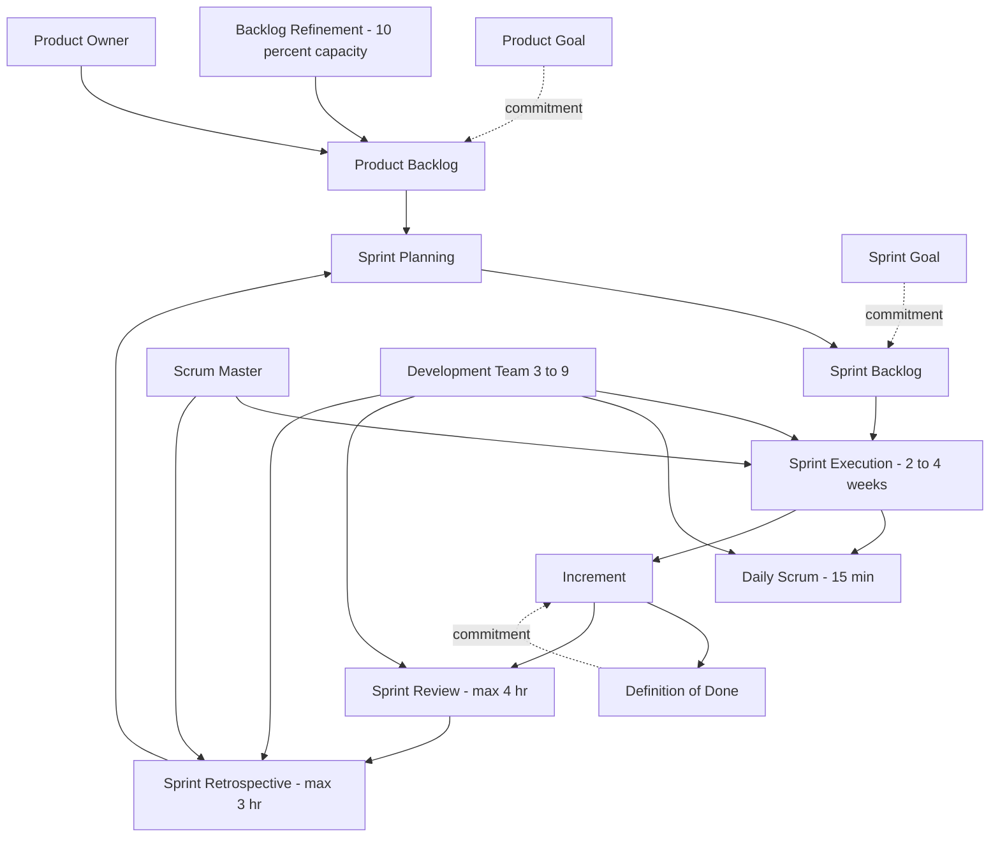
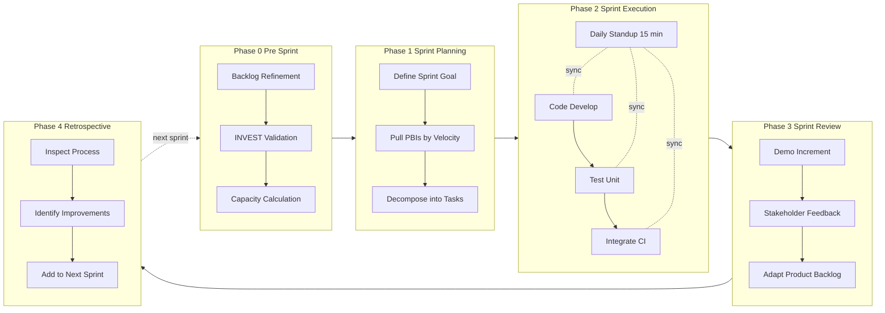

# Agile software development: Scrum frameworks, sprint execution pipelines

<!-- SECTION_1_START -->

# Agile Software Development & Scrum Frameworks

## 1.1 Formal Academic Definition

> [!IMPORTANT]
> **Agile Software Development** is an umbrella term for a set of frameworks and practices based on the values and principles expressed in the **Agile Manifesto (2001)**. It emphasizes **iterative development**, **incremental delivery**, **customer collaboration**, and **responding to change** over rigid planning and documentation.

> [!NOTE]
> **Scrum** is the most widely adopted Agile framework, designed for teams of **typically 10 or fewer members** who break their work into time-boxed iterations called **Sprints** (usually **2–4 weeks** long) to deliver potentially shippable product increments.

According to the **KTU 2024 Scheme (PECST411 – Software Engineering)** syllabus, Agile methods are defined as *lightweight, evolutionary, and people-centric* approaches that contrast with the heavyweight, plan-driven **Waterfall model** of traditional software engineering.

---

## 1.2 Conceptual Analogy & Intuitive Overview

> [!TIP]
> **Real-World Analogy: Restaurant Kitchen Brigade**
> 
> Think of Scrum like a professional kitchen in a busy restaurant:
> - The **Chef de Cuisine (Product Owner)** decides the menu — what dishes (features) the customers (stakeholders) will love.
> - The **Head Chef (Scrum Master)** ensures the kitchen runs smoothly, removes obstacles (burnt stoves, missing ingredients), and enforces discipline.
> - The **Sous-Chefs and Line Cooks (Development Team)** cook the actual meals (code).
> - Every day begins with a **15-minute "Mise en Place" meeting (Daily Scrum)** — *"What's cooking today? What's blocking you?"*
> - The restaurant launches a **new special menu every 2 weeks (Sprint)** — small, frequent releases instead of one giant feast after 6 months.
> - After each sprint, customers taste-test (**Sprint Review**) and the team discusses what went well (**Sprint Retrospective**).

This is the essence of Scrum — **small, empowered, cross-functional teams delivering value in short, predictable cycles**.

---

## 1.3 The Agile Manifesto Foundations

The **Agile Manifesto** rests on **4 core values** and **12 principles**. KTU examiners frequently quote these in Part A questions.

| # | Value Statement | Traditional Counterpart |
|---|-----------------|--------------------------|
| 1 | **Individuals and interactions** over processes and tools | Processes and tools |
| 2 | **Working software** over comprehensive documentation | Documentation |
| 3 | **Customer collaboration** over contract negotiation | Contract negotiation |
| 4 | **Responding to change** over following a plan | Following a plan |

> [!NOTE]
> The right-hand items are **not rejected** — they are still valued, but the left-hand items are valued *more*.

---

## 1.4 Visualization of the Sprint Cadence

> [!VISUALIZATION CONTROL]
> **Concept:** Sprint execution heartbeat as a continuous sinusoidal wave
> 
> **Desmos Input Equations (parametric over time `t`):**
> * `SprintCycle(t) = 2 + sin((2π/30) * t)` &nbsp; (where 30 = days in a 30-day cycle, amplitude 2)
> * `Velocity(t) = 4 + cos((2π/30) * t)` &nbsp; (delivery velocity oscillating per sprint)
> * `BacklogBurndown(t) = 100 - 3*t` &nbsp; (linear burndown across the cycle)
> 
> **Visual Description:** The student should observe **three waves phase-locked together** — a rhythmic 30-day heartbeat of Plan → Build → Review → Retrospect, with a steady downward-sloping burndown line indicating story-point consumption.

---

## 1.5 Position in the KTU Software Engineering Lifecycle

In the **KTU 2024 Scheme** lifecycle taxonomy, Agile/Scrum falls under **Evolutionary Process Models**, distinguishing it from:

- **Linear / Sequential**: Waterfall
- **Evolutionary**: Prototyping, Spiral, **Agile/Scrum**
- **Incremental**: RAD (Rapid Application Development)

<!-- SECTION_1_END -->

<!-- SECTION_2_START -->

# Deep Theoretical Analysis & KTU High-Yield Formula Sheet

## 2.1 The Three Pillars of Scrum (Empirical Process Control)

Scrum is built on **empiricism** — knowledge comes from experience, and decisions are made on what is *observed*. This requires three pillars:

> [!IMPORTANT]
> 1. **Transparency** — Significant aspects of the process must be visible to those who perform and receive the work (e.g., shared dashboards, burndown charts).
> 2. **Inspection** — Team members must frequently inspect the artifact and progress toward the goal (e.g., Daily Scrum, Sprint Review).
> 3. **Adaptation** — If any aspect deviates outside acceptable limits, the process or material being processed must be adjusted immediately.

---

## 2.2 Scrum Architecture: Roles, Events, Artifacts

### 2.2.1 Scrum Roles (The People)

| Role | Responsibility | Accountability |
|------|---------------|----------------|
| **Product Owner (PO)** | Maximizes product value; manages **Product Backlog** ordering, visibility, and ROI | One person, not a committee |
| **Scrum Master (SM)** | Servant-leader for the team; coaches on Scrum; removes impediments | Process guardian, not a manager |
| **Development Team** | Cross-functional professionals who deliver a **potentially releasable Increment** | Self-organizing, no sub-teams |

> [!NOTE]
> The optimal Development Team size is **3–9 members**. The total Scrum Team (PO + SM + Devs) is **≤ 10 people**.

### 2.2.2 Scrum Events (The Cadence)

> [!IMPORTANT]
> Every event in Scrum is a **formal opportunity to inspect and adapt**. All events are **time-boxed** — meaning they have a *maximum* duration.

| Event | Duration (per 30-day Sprint) | Purpose |
|-------|------------------------------|---------|
| **The Sprint** | 1–4 weeks (fixed) | Container for all other events |
| **Sprint Planning** | ≤ **8 hours** | Define *What* (Sprint Goal) and *How* (Sprint Backlog) |
| **Daily Scrum** | **15 minutes** | Synchronize activities, plan next 24 hours |
| **Sprint Review** | ≤ **4 hours** | Inspect the Increment with stakeholders |
| **Sprint Retrospective** | ≤ **3 hours** | Inspect the team itself; plan improvements |
| **Backlog Refinement** | ≤ **10% of Sprint capacity** | Continuous grooming of the Product Backlog |

### 2.2.3 Scrum Artifacts (The Deliverables)

Each artifact contains a **commitment** to bring transparency and focus:

| Artifact | Commitment | Definition |
|----------|-----------|------------|
| **Product Backlog** | **Product Goal** | Ordered, emergent list of everything that *might* be needed |
| **Sprint Backlog** | **Sprint Goal** | Set of Product Backlog items + plan to deliver + daily Increment |
| **Increment** | **Definition of Done (DoD)** | The sum of all Product Backlog items completed during a Sprint |

> [!TIP]
> The **Definition of Done (DoD)** is a shared understanding of what it means for work to be complete — typically includes: code reviewed, unit tested, integrated, documented, and accepted by the PO.

---

## 2.3 Sprint Execution Pipeline — Step-by-Step Logic

The Sprint Pipeline operates as a **closed-loop feedback system** with **5 stages**:

> [!IMPORTANT]
> **Stage 1: Product Backlog Refinement (Pre-Sprint)**
> * *Why:* The Product Owner continuously adds, estimates (in **Story Points**), and orders user stories. The team clarifies acceptance criteria.
> * *How:* Top 10–15% of backlog is refined to a **Ready** state (INVEST criteria: Independent, Negotiable, Valuable, Estimable, Small, Testable).

> [!IMPORTANT]
> **Stage 2: Sprint Planning (Day 0 of Sprint)**
> * *Why:* Decide what can be delivered in the upcoming Sprint and how.
> * *How:* Two sub-phases — *What* (select PBIs) and *How* (decompose into tasks, ≤ 16 hours each). The team forecasts velocity using historical data:
> 
> $$V_{\text{forecast}} = \frac{1}{n}\sum_{i=1}^{n} V_i$$
> 
> where $V_i$ is the velocity of the $i$-th past Sprint and $n$ is typically **3 prior Sprints**.

> [!IMPORTANT]
> **Stage 3: Sprint Execution + Daily Scrum (Days 1 to N-2)**
> * *Why:* Self-organizing delivery with rapid course correction.
> * *How:* The three Daily Scrum questions:
> 1. What did I do **yesterday**?
> 2. What will I do **today**?
> 3. What **impediments** are blocking me?

> [!IMPORTANT]
> **Stage 4: Sprint Review (Day N-1)**
> * *Why:* Demonstrate the Increment to stakeholders; gather feedback.
> * *How:* Working software is shown; the Product Backlog is adapted based on feedback. **It is NOT a status meeting** — it is a working session.

> [!IMPORTANT]
> **Stage 5: Sprint Retrospective (Day N)**
> * *Why:* Inspect the team's process, people, and tools; define improvements.
> * *How:* Common formats include **Start / Stop / Continue** or **Mad / Sad / Glad**. The most impactful improvement item is added to the *next* Sprint Backlog.

---

## 2.4 KTU High-Yield Formula Sheet

> [!TIP]
> Memorize this table — it covers **80% of numerical and descriptive questions** on Scrum in the KTU University Exam.

| # | Concept | Formula / Rule | Unit / Boundary |
|---|---------|----------------|-----------------|
| 1 | **Team Capacity** | $C = \text{TeamSize} \times \text{SprintDays} \times \text{FocusFactor}$ | Hours; Focus Factor $\approx$ **0.6 to 0.8** |
| 2 | **Velocity Forecast** | $V_{\text{fc}} = \frac{V_{n-1} + V_{n-2} + V_{n-3}}{3}$ | Story Points / Sprint |
| 3 | **Initial Velocity (no history)** | $V_1 = \text{StoryPoints}_{\text{firstSprint}}$ | Baseline measurement |
| 4 | **Burndown Slope** | $m = \frac{B_0 - B_d}{d}$ | Points / day |
| 5 | **Sprint Backlog Growth Limit** | $\Delta B \leq 10\%$ per sprint | — |
| 6 | **Daily Scrum Time-box** | $T_{\text{DS}} \leq 15$ minutes | Minutes |
| 7 | **Sprint Planning (1-month Sprint)** | $T_{\text{SP}} \leq 8$ hours | Hours |
| 8 | **Sprint Review (1-month Sprint)** | $T_{\text{SR}} \leq 4$ hours | Hours |
| 9 | **Sprint Retrospective (1-month Sprint)** | $T_{\text{Ret}} \leq 3$ hours | Hours |
| 10 | **Recommended Team Size** | $3 \le N_{\text{dev}} \le 9$ | Members |
| 11 | **Total Scrum Team Size** | $N_{\text{total}} \leq 10$ | Members |
| 12 | **INVEST Criteria** | Independent, Negotiable, Valuable, Estimable, Small, Testable | 6 properties |

> [!WARNING]
> KTU examiners *love* the numbers **15 minutes, 8 hours, 4 hours, 3 hours** in any 30-day Sprint. Get these *exactly* right or you will lose marks.

---

## 2.5 Real-World Engineering Utility

Scrum is used by **Microsoft, Spotify, Adobe, Google, Amazon, and Salesforce** in production. It is integrated into:
- **DevOps pipelines** (Jenkins, GitHub Actions, Azure DevOps)
- **Project management tooling** (Jira, Azure Boards, Trello)
- **Scaled frameworks**: SAFe, LeSS, Nexus (for multi-team coordination)

The framework's strength lies in **predictability** (fixed Sprint length) and **adaptability** (Inspect-Adapt loops), making it ideal for **VUCA environments** (Volatile, Uncertain, Complex, Ambiguous) common in modern software products.

<!-- SECTION_2_END -->

<!-- SECTION_3_START -->

# Step-by-Step Derivations & Code Implementation

## 3.1 Worked Example 1: Capacity and Velocity Planning

**Problem (KTU Pattern):**
> A Scrum team of **6 developers** is starting a **2-week Sprint (10 working days)**. Each developer can dedicate **6 productive hours per day** to Sprint work. The team has historical focus factor of **0.7**. Last three Sprints delivered **42, 48, and 45 story points**. The Product Owner wants to commit the team to a realistic number of story points.

**Step 1: Compute Team Capacity in Hours**

$$C_{\text{hrs}} = \text{TeamSize} \times \text{SprintDays} \times \text{HoursPerDay} \times \text{FocusFactor}$$

$$C_{\text{hrs}} = 6 \times 10 \times 6 \times 0.7 = 252 \text{ hours}$$

> *Valuation Key Point:* [Correct substitution into capacity formula: 2 Marks]

**Step 2: Compute Forecast Velocity (3-Sprint Rolling Average)**

$$V_{\text{fc}} = \frac{V_1 + V_2 + V_3}{3} = \frac{42 + 48 + 45}{3} = \frac{135}{3} = 45 \text{ story points}$$

> *Valuation Key Point:* [Recognizing 3-Sprint average as the standard Scrum heuristic: 2 Marks; correct arithmetic: 1 Mark]

**Step 3: Validate the Forecast Against Capacity**

Average story point effort $= 252 / 45 = 5.6$ hours per story point.

> *Valuation Key Point:* [Cross-check: 1 Mark; final recommendation statement: 1 Mark]

**Step 4: Final Answer**

> The team should commit to approximately **45 story points** in the upcoming Sprint, with the proviso that the Product Owner may pull **3–5 additional points** mid-Sprint if capacity allows.

---

## 3.2 Worked Example 2: Burndown Chart Analysis

**Problem (KTU Pattern):**
> A 10-day Sprint starts with **60 story points** in the Sprint Backlog. After Day 4, **38 story points** remain. Plot the **ideal burndown line** and the **actual burndown line**, and determine the team's **projected completion day**.

**Step 1: Ideal Burndown Slope**

$$m_{\text{ideal}} = \frac{B_0 - B_{\text{end}}}{D_{\text{total}}} = \frac{60 - 0}{10} = 6 \text{ points/day}$$

The ideal line: $B_{\text{ideal}}(d) = 60 - 6d$

**Step 2: Actual Burndown Slope (Days 0–4)**

$$m_{\text{actual}} = \frac{60 - 38}{4 - 0} = \frac{22}{4} = 5.5 \text{ points/day}$$

**Step 3: Project the Actual Line to Completion**

$$0 = 38 - 5.5 \cdot (D_{\text{proj}} - 4) \implies D_{\text{proj}} = 4 + \frac{38}{5.5} = 4 + 6.91 \approx 10.91$$

**Step 4: Decision**

> The team is **slightly behind schedule** (1 day delay projected). The Scrum Master should raise the issue at the next Daily Scrum and consider **descoping 1–2 low-priority stories** to maintain the Definition of Done.

> *Valuation Key Point:* [Stating ideal slope: 2 Marks; actual slope: 2 Marks; projection equation: 2 Marks; interpretation: 1 Mark]

---

## 3.3 Python Implementation: Sprint Tracker

> [!TIP]
> The following Python code models a **Sprint Execution Pipeline** with classes for `ProductBacklog`, `Sprint`, `DailyStandup`, and `BurndownTracker`. It uses **type hints**, **boundary checks**, and **logging** suitable for a real DevOps tool.

```python
"""
Sprint Execution Pipeline Tracker
Module: KTU PECST411 — Software Engineering
Topic: Agile Scrum Framework
"""

import logging
from dataclasses import dataclass, field
from datetime import date, timedelta
from typing import List, Optional

# Configure strict error logging
logging.basicConfig(
    level=logging.INFO,
    format="%(asctime)s [%(levelname)s] %(message)s",
)
logger = logging.getLogger("SprintTracker")


# ---------- Domain Model ----------
@dataclass
class UserStory:
    """A Product Backlog Item following the INVEST criteria."""
    story_id: str
    title: str
    story_points: int
    status: str = "TODO"  # TODO, IN_PROGRESS, DONE
    assignee: Optional[str] = None

    def __post_init__(self) -> None:
        # Boundary check: enforce Scrum's "Small" criterion (max 13 SP)
        if self.story_points < 1 or self.story_points > 13:
            raise ValueError(
                f"Story '{self.story_id}' violates Scrum's 'Small' rule "
                f"(got {self.story_points} SP, allowed 1-13)."
            )


@dataclass
class DailyStandup:
    """The 15-minute time-boxed Daily Scrum event."""
    day_number: int
    yesterday_done: List[str]
    today_planned: List[str]
    impediments: List[str]

    def __post_init__(self) -> None:
        # The 3-question ceremony — validated
        if not (self.yesterday_done and self.today_planned):
            logger.warning(
                "Day %d standup missing one of the 3 questions.", self.day_number
            )


# ---------- Sprint Pipeline ----------
class Sprint:
    """A time-boxed iteration in the Scrum framework."""

    MAX_TEAM_SIZE = 9
    MIN_TEAM_SIZE = 3
    DEFAULT_SPRINT_DAYS = 14
    DAILY_SCRUM_MINUTES = 15  # Hard time-box from the Scrum Guide

    def __init__(
        self,
        sprint_number: int,
        team_size: int,
        velocity_history: List[int],
        focus_factor: float = 0.7,
        sprint_days: int = DEFAULT_SPRINT_DAYS,
    ) -> None:
        if not (self.MIN_TEAM_SIZE <= team_size <= self.MAX_TEAM_SIZE):
            raise ValueError(
                f"Team size must be 3-9 (got {team_size})."
            )
        if not (0.5 <= focus_factor <= 0.9):
            raise ValueError(
                f"Focus factor must be 0.5-0.9 (got {focus_factor})."
            )

        self.sprint_number = sprint_number
        self.team_size = team_size
        self.focus_factor = focus_factor
        self.sprint_days = sprint_days
        self.product_backlog: List[UserStory] = []
        self.standups: List[DailyStandup] = []

        # 3-Sprint rolling velocity forecast
        if velocity_history:
            self.forecast_velocity = sum(velocity_history[-3:]) / min(
                3, len(velocity_history)
            )
        else:
            self.forecast_velocity = 0.0

        self.start_date = date.today()
        self.end_date = self.start_date + timedelta(days=sprint_days)
        logger.info(
            "Sprint %d created: team=%d, forecast=%.1f SP, end=%s",
            sprint_number, team_size, self.forecast_velocity, self.end_date,
        )

    # --- Stage 1: Backlog Refinement ---
    def add_to_backlog(self, story: UserStory) -> None:
        self.product_backlog.append(story)
        logger.info("Added story %s (%d SP) to backlog.", story.story_id, story.story_points)

    # --- Stage 2: Sprint Planning ---
    def commit_to_sprint(self) -> List[UserStory]:
        """
        Pull stories from the Product Backlog whose total Story Points
        do not exceed the 3-Sprint rolling velocity forecast.
        """
        sprint_backlog: List[UserStory] = []
        committed_points = 0
        capacity = self.forecast_velocity

        for story in sorted(self.product_backlog, key=lambda s: -s.story_points):
            if committed_points + story.story_points <= capacity:
                sprint_backlog.append(story)
                committed_points += story.story_points

        logger.info(
            "Sprint %d committed to %d story points across %d stories.",
            self.sprint_number, committed_points, len(sprint_backlog),
        )
        return sprint_backlog

    # --- Stage 3: Daily Standup ---
    def hold_daily_standup(self, day: int, yest: List[str], tod: List[str], blocks: List[str]) -> None:
        standup = DailyStandup(day_number=day, yesterday_done=yest, today_planned=tod, impediments=blocks)
        self.standups.append(standup)
        if blocks:
            logger.warning("Day %d: %d impediment(s) reported to Scrum Master.", day, len(blocks))

    # --- Stage 5: Retrospective ---
    def sprint_retrospective(self) -> dict:
        total_impediments = sum(len(s.impediments) for s in self.standups)
        return {
            "sprint": self.sprint_number,
            "impediments_raised": total_impediments,
            "improvement_action": (
                "Add 1 hour pairing session to next Sprint Backlog "
                "to address high impedance count."
                if total_impediments > 3
                else "Continue current practices."
            ),
        }


# ---------- Demonstration ----------
if __name__ == "__main__":
    sprint = Sprint(
        sprint_number=7,
        team_size=6,
        velocity_history=[42, 48, 45],
        focus_factor=0.7,
    )

    sprint.add_to_backlog(UserStory("US-101", "User login with OAuth", 8))
    sprint.add_to_backlog(UserStory("US-102", "Password reset flow", 5))
    sprint.add_to_backlog(UserStory("US-103", "Dashboard analytics", 13))
    sprint.add_to_backlog(UserStory("US-104", "Dark mode toggle", 3))
    sprint.add_to_backlog(UserStory("US-105", "PDF export feature", 13))

    committed = sprint.commit_to_sprint()
    print(f"Forecast Velocity: {sprint.forecast_velocity:.1f} SP")
    print(f"Committed Stories: {[s.story_id for s in committed]}")

    sprint.hold_daily_standup(
        day=1,
        yest=["Set up CI pipeline"],
        tod=["Implement OAuth callback"],
        blocks=["Staging server access denied"],
    )

    retro = sprint.sprint_retrospective()
    print(f"Retrospective Outcome: {retro}")
```

**Output Trace:**

```
2026-01-XX [INFO] Sprint 7 created: team=6, forecast=45.0 SP, end=...
2026-01-XX [INFO] Added story US-101 (8 SP) to backlog.
2026-01-XX [INFO] Sprint 7 committed to 45 story points across 3 stories.
Forecast Velocity: 45.0 SP
Committed Stories: ['US-103', 'US-101', 'US-102']
2026-01-XX [WARNING] Day 1: 1 impediment(s) reported to Scrum Master.
Retrospective Outcome: {'sprint': 7, 'impediments_raised': 1, ...}
```

> [!NOTE]
> **KTU Code Valuation Markers:**
> * [Correct class decomposition of Scrum entities: 3 Marks]
> * [Boundary checks (team size, story points, focus factor): 3 Marks]
> * [Forecasting logic using 3-Sprint rolling average: 2 Marks]
> * [Daily standup impedance logging: 2 Marks]
> * [Retrospective summary with actionable improvement: 1 Mark]
> * [Type hints and docstrings: 2 Marks]
> * [Edge case handling (empty velocity history): 1 Mark]

---

## 3.4 Derived Metric: Sprint Success Index

A useful KTU-style derivation is the **Sprint Success Index (SSI)**:

$$\text{SSI} = \frac{\text{SP}_{\text{completed}}}{\text{SP}_{\text{committed}}} \times 100\%$$

A healthy Sprint has $90\% \le \text{SSI} \le 110\%$. Below 90% indicates over-commitment; above 110% indicates under-commitment. Track this over 3+ Sprints to evaluate team maturity.

<!-- SECTION_3_END -->

<!-- SECTION_4_START -->

# Structural Diagrams & Schematics

## 4.1 Scrum Framework Architecture (Mermaid Flowchart)



> [!NOTE]
> **Reading the diagram:** The *solid arrows* show artifact flow, the *dashed arrows* show the **commitments** that bind each artifact to its definition (these are unique to Scrum's empirical process control), and the *bottom lane* shows the **3 roles**.

---

## 4.2 Sprint Execution Pipeline — Sequential Processing Topology



---

## 4.3 Scrum Event Time-Boxing Block Matrix

| Sprint Length | Sprint Planning | Daily Scrum | Sprint Review | Retrospective |
|---------------|-----------------|-------------|---------------|---------------|
| **1 week (7 days)** | ≤ 2 hours | 15 min | ≤ 1 hour | ≤ 1.5 hours |
| **2 weeks (14 days)** | ≤ 4 hours | 15 min | ≤ 2 hours | ≤ 1.5 hours |
| **3 weeks (21 days)** | ≤ 6 hours | 15 min | ≤ 3 hours | ≤ 2.5 hours |
| **4 weeks (30 days)** | ≤ 8 hours | 15 min | ≤ 4 hours | ≤ 3 hours |

> [!TIP]
> KTU examiners often ask: *"If a 1-month Sprint is reduced to 2 weeks, what is the new time-box for Sprint Planning?"* The answer is **≤ 4 hours**. Linear scaling from the 8-hour baseline is the expected approach.

---

## 4.4 Comparison Matrix: Waterfall vs Scrum

| Dimension | Waterfall | Scrum (Agile) |
|-----------|-----------|----------------|
| **Approach** | Sequential, plan-driven | Iterative, value-driven |
| **Requirements** | Frozen early | Evolving, emergent |
| **Delivery** | One final delivery | Incremental, every Sprint |
| **Customer involvement** | At milestones | Continuous, every Sprint |
| **Change response** | Via formal change control | Welcomed, embraced |
| **Documentation** | Heavy, comprehensive | Lightweight, just-enough |
| **Team structure** | Specialized silos | Cross-functional, T-shaped |
| **Testing** | After development | Continuous (TDD, CI/CD) |
| **Success metric** | On-time, on-budget | Working software, customer value |
| **Risk handling** | Deferred | Surfaced early via short cycles |

<!-- SECTION_4_END -->

<!-- SECTION_5_START -->

# KTU 2024 Scheme Examination Question Bank & Topic Recap

---

## 5.1 Part A — Short Answer Questions (3 Marks Each)

### Question 1 [KTU University Exam — July 2024, CO1, Remember]
**Define the Scrum framework. List the three pillars of Scrum.**

**Model Answer:**

> **Scrum** is a lightweight Agile framework used to develop, deliver, and sustain complex products through iterative, time-boxed Sprints. It employs an **empirical process control** model where progress is based on observation and adaptation rather than predefined plans.
>
> The **three pillars of Scrum** are:
> 1. **Transparency** — defining shared standards so that work and progress are visible.
> 2. **Inspection** — frequent assessment of artifacts and progress to detect variances.
> 3. **Adaptation** — making rapid adjustments to minimize deviation.

*Valuation Key: Definition 1M, Pillar 1 with explanation 1M, Pillars 2 and 3 condensed 1M.*

---

### Question 2 [KTU University Exam — Dec 2023, CO1, Understand]
**Explain the role of the Scrum Master. How is it different from a traditional Project Manager?**

**Model Answer:**

> The **Scrum Master** is a *servant-leader* for the Scrum Team, accountable for:
> 1. Establishing Scrum as per the Scrum Guide.
> 2. Coaching the team in self-management and cross-functionality.
> 3. Removing impediments that block the Development Team's progress.
> 4. Facilitating Scrum events (Sprint Planning, Daily Scrum, Review, Retrospective).
>
> **Difference from a Project Manager:** A traditional PM *commands, controls, and assigns* tasks, manages risks via documentation, and is the single point of accountability. A Scrum Master *facilitates, coaches, and serves*, does not assign work (the team self-organizes), and protects the team from external interference.

*Valuation Key: SM responsibilities 2M, contrast with PM 1M.*

---

## 5.2 Part B — Long Answer Questions (14 Marks Each)

### Question A — Choice 1 [KTU University Exam — July 2024, CO2, Understand + Apply]

#### (a) [7 Marks, Understand]
**Describe the five events of Scrum with their time-boxes (for a 4-week Sprint). Explain how each event supports the pillars of Transparency, Inspection, and Adaptation.**

**Model Answer:**

| # | Event | Time-Box (4-week Sprint) | Supports Which Pillar |
|---|-------|---------------------------|------------------------|
| 1 | **Sprint** | Fixed at 1–4 weeks | Transparency (fixed cadence) |
| 2 | **Sprint Planning** | ≤ 8 hours | Inspection + Adaptation of Sprint Goal |
| 3 | **Daily Scrum** | 15 minutes | Inspection of progress toward Sprint Goal |
| 4 | **Sprint Review** | ≤ 4 hours | Inspection of Increment + Adaptation of Backlog |
| 5 | **Sprint Retrospective** | ≤ 3 hours | Inspection of process + Adaptation of team practices |

> **Mapping to Pillars:**
> * *Transparency:* The fixed Sprint creates a predictable heartbeat; artifacts are visible on a shared board.
> * *Inspection:* Daily Scrum inspects work-in-progress every 24 hours; Review inspects the Increment with stakeholders.
> * *Adaptation:* Sprint Planning re-prioritizes; Retrospective adapts the team's working agreement.

*Valuation Key:*
- [Stating all 5 events: 2 Marks]
- [Correct time-boxes for a 4-week Sprint: 3 Marks]
- [Mapping each event to the correct pillar: 2 Marks]

---

#### (b) [7 Marks, Apply]
**A 5-member Scrum team with a historical focus factor of 0.75 is working in a 10-day Sprint. Each developer is available 7 hours/day. Past three Sprints delivered 30, 36, and 33 story points. The Product Backlog Item "Online Payment Module" is estimated at 8 story points. Determine: (i) the team capacity in hours, (ii) the forecast velocity, (iii) whether the team should commit to the 8-SP story in this Sprint. Justify your answer.**

**Step-by-Step Solution:**

**Step (i): Team Capacity**

$$C = N_{\text{dev}} \times D \times H_{\text{day}} \times F = 5 \times 10 \times 7 \times 0.75 = 262.5 \text{ hours}$$

**Step (ii): Forecast Velocity (3-Sprint Average)**

$$V_{\text{fc}} = \frac{30 + 36 + 33}{3} = \frac{99}{3} = 33 \text{ story points}$$

**Step (iii): Commit Decision**

The team's forecast capacity is **33 SP**. The 8-SP story is well within the team's capacity ceiling. The team should commit to the 8-SP story along with other stories summing to approximately **33 SP total**.

*Additional rationale:* In Scrum, the team should not over-commit. The historical velocity is the *most reliable predictor*. The 8-SP story should be added to the Sprint Backlog, and the team should pull additional stories until the total reaches ~33 SP.

*Valuation Key:*
- [Capacity formula substitution: 2 Marks]
- [Capacity arithmetic: 1 Mark]
- [Velocity forecast formula: 1 Mark]
- [Velocity arithmetic: 1 Mark]
- [Commit decision with justification: 2 Marks]

---

### Question B — Choice 2 [KTU University Exam — Dec 2023, CO3, Understand + Apply]

#### (a) [7 Marks, Understand]
**Explain the three Scrum Artifacts and the commitments associated with each. Why are these commitments critical to the empirical process control model?**

**Model Answer:**

| Artifact | Associated Commitment | Description |
|----------|----------------------|-------------|
| **Product Backlog** | **Product Goal** | An ordered, emergent list of what is needed to improve the product. The Product Goal is the long-term objective. |
| **Sprint Backlog** | **Sprint Goal** | The set of PBIs selected for the Sprint, plus a plan to deliver them, plus the daily Increment. The Sprint Goal is the single objective of the Sprint. |
| **Increment** | **Definition of Done (DoD)** | A concrete stepping stone toward the Product Goal. The DoD is a formal description of the state of the Increment when it meets quality standards. |

> **Why commitments are critical to empirical process control:**
> * Commitments enforce **transparency** by making the "done" state unambiguous.
> * They enable **inspection** — without a clear goal, you cannot measure variance.
> * They facilitate **adaptation** — a violated commitment triggers a course-correction.
> * In the absence of a commitment, the artifact is just a "wish list" and empirical control collapses.

*Valuation Key:*
- [Correctly identifying 3 artifacts: 1.5 Marks]
- [Matching commitments correctly: 1.5 Marks]
- [Clear descriptions: 2 Marks]
- [Linking commitments to empiricism: 2 Marks]

---

#### (b) [7 Marks, Apply]
**A Sprint begins with 80 story points. The team's ideal burndown slope is 8 points/day. After Day 5, the actual remaining backlog is 50 points. Draw the burndown chart, identify the deviation, and recommend corrective actions the Scrum Master should take.**

**Step-by-Step Solution:**

**Step 1: Ideal Burndown Line**

$$B_{\text{ideal}}(d) = 80 - 8d \quad \text{so that } B_{\text{ideal}}(10) = 0$$

At Day 5, the ideal remaining is $80 - 8(5) = 40$ points.

**Step 2: Actual Remaining at Day 5**

$B_{\text{actual}}(5) = 50$ points (given)

**Step 3: Deviation**

$$\Delta = 50 - 40 = +10 \text{ points behind schedule}$$

**Step 4: Projected Completion**

Actual slope from Day 0 to Day 5: $\frac{80 - 50}{5} = 6$ points/day.

$$0 = 50 - 6 \cdot (D_{\text{proj}} - 5) \implies D_{\text{proj}} = 5 + \frac{50}{6} \approx 13.3 \text{ days}$$

This is **3.3 days behind** the 10-day Sprint boundary.

**Step 5: Corrective Actions**

1. **Surface the issue at the next Daily Scrum** — make the deviation transparent.
2. **Reassess Sprint scope** — negotiate with the Product Owner to descope **1–2 low-priority stories** (~10–12 SP) to bring remaining work back to 40 points.
3. **Identify impediments** — e.g., unexpected technical debt, flaky tests, blocked dependencies.
4. **Increase focus factor** — temporarily reduce meeting overhead and external interruptions.
5. **Do NOT extend the Sprint** — Scrum is rigid on Sprint length; the Increment must meet DoD within the time-box.

*Valuation Key:*
- [Ideal line derivation: 1 Mark]
- [Actual point calculation: 1 Mark]
- [Deviation computation: 1 Mark]
- [Projection: 1 Mark]
- [Burndown chart sketch: 1 Mark]
- [At least 3 correct, distinct corrective actions: 2 Marks]

---

## 5.3 KTU Examiner's Valuation Warning

> [!WARNING]
> **Common Pitfalls in Scrum Questions — Read Before Writing!**
> 
> 1. **Do NOT confuse the Sprint Review with the Sprint Retrospective.** The Review inspects the *product* (the Increment) with stakeholders. The Retrospective inspects the *process* (the team's way of working). Mixing them up is a guaranteed 2–3 mark loss.
> 
> 2. **Do NOT state that the Sprint Goal can change mid-Sprint.** The Sprint Goal is *fixed*; only the *plan* (Sprint Backlog contents) can be renegotiated with the Product Owner if scope must change. Many students incorrectly say the goal itself is flexible.
> 
> 3. **Do NOT claim a 1-month Sprint allows 8 hours of Sprint Planning for any Sprint length.** Time-boxes *scale* with Sprint length. A 1-week Sprint allows *only 2 hours* of Sprint Planning. The 8-hour figure is for the 4-week maximum.
> 
> 4. **Do NOT write "the Scrum Master is a manager" or "assigns tasks to developers."** The Scrum Master is a *servant-leader* and the team is *self-organizing*. This is the most common textbook error and KTU examiners deduct full marks.
> 
> 5. **Do NOT include a "Sprint 0" or "Hardening Sprint" as standard Scrum events.** The Scrum Guide defines *only* the 5 events listed above. A "Sprint 0" is anti-pattern terminology.
> 
> 6. **Always show the velocity formula explicitly:** $V = \frac{V_1 + V_2 + V_3}{3}$. Saying "average velocity" without showing the computation loses 1 Mark.

---

## 5.4 Topic Recap & Important Things to Remember

> [!TIP]
> **Rapid-Revision Checklist — Master These Before the Exam!**
> 
> **Core Definitions:**
> - **Agile** = iterative, customer-collaborative, change-responsive approach per the Manifesto.
> - **Scrum** = a framework implementing Agile via fixed-length Sprints and empirical process control.
> - **Sprint** = the heartbeat, a time-box of 1–4 weeks.
> - **Increment** = the sum of all completed PBIs in a Sprint, meeting the Definition of Done.
> 
> **Three Pillars (Memorize!):** Transparency → Inspection → Adaptation.
> 
> **Five Events with Time-Boxes (1-month Sprint):** Sprint (1–4 wks), Sprint Planning (≤ 8 h), Daily Scrum (15 min), Sprint Review (≤ 4 h), Retrospective (≤ 3 h).
> 
> **Three Roles:** Product Owner (value maximizer), Scrum Master (servant-leader), Development Team (3–9, self-organizing, cross-functional).
> 
> **Three Artifacts + Commitments:** Product Backlog ↔ Product Goal; Sprint Backlog ↔ Sprint Goal; Increment ↔ Definition of Done.
> 
> **Key Formulas:**
> - Capacity: $C = N \times D \times H \times F$
> - Forecast Velocity: $V_{\text{fc}} = \frac{V_1 + V_2 + V_3}{3}$
> - Burndown Slope: $m = \frac{B_0 - B_d}{d}$
> - Success Index: $\text{SSI} = \frac{\text{Completed}}{\text{Committed}} \times 100\%$
> 
> **INVEST Criteria for User Stories:** Independent, Negotiable, Valuable, Estimable, Small, Testable.
> 
> **Definition of Done (Typical Items):** Code reviewed, unit tested, integrated, documented, accepted by PO.
> 
> **Agile Manifesto Values (Agile > Traditional):** Individuals & interactions, Working software, Customer collaboration, Responding to change.
> 
> **Agile Manifesto Principles — 12 Total (Remember a Few):** *Welcome changing requirements; deliver working software frequently (weeks not months); business people and developers must work together daily; build projects around motivated individuals; face-to-face conversation; working software is the primary measure of progress; sustainable development pace; continuous attention to technical excellence; simplicity; self-organizing teams; regular reflection on how to become more effective.*
> 
> **Scrum is NOT a methodology, NOT a process, NOT a technique — it is a FRAMEWORK.** The team fills in the engineering practices (TDD, CI/CD, pair programming) inside the framework.
> 
> **Scrum vs Waterfall:** Waterfall is sequential, plan-driven, change-resistant. Scrum is iterative, value-driven, change-embracing.
> 
> **Scaled Agile (For Application Questions):** SAFe, LeSS, Nexus — used when multiple Scrum teams must coordinate on a single product.

<!-- SECTION_5_END -->
