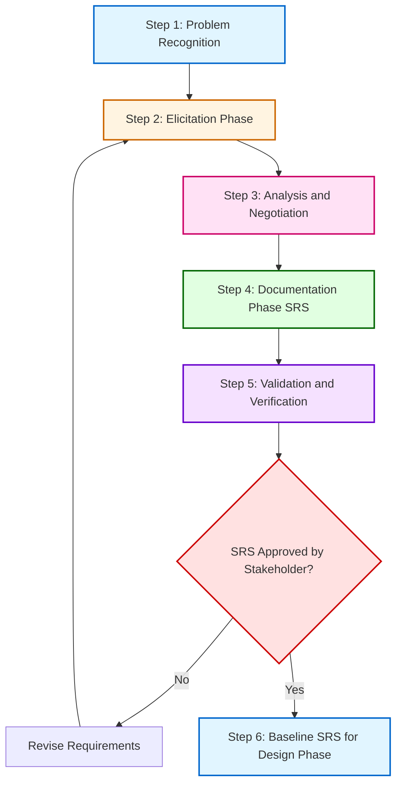
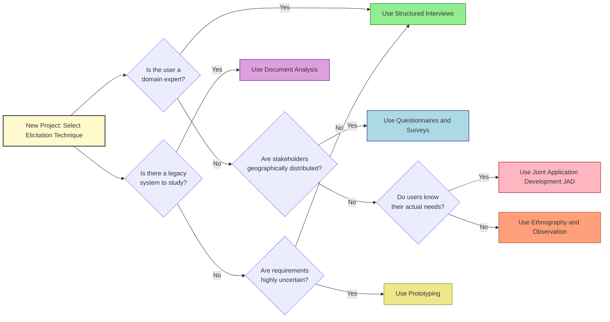

# Requirements engineering: Requirements elicitation, analysis, documentation (SRS framework)

<!-- SECTION_1_START -->

# Requirements Engineering: Elicitation, Analysis, and SRS Documentation

> [!IMPORTANT]
> **KTU 2024 Scheme | PECST411 | Module 1 Focus Area**
> This topic carries an expected weightage of **12–15 marks** in the End Semester Examination (ESE) and forms a high-priority sub-section under Module 1: *Software Process Models*. Mastering this is critical for both Part A (3-mark) and Part B (14-mark) questions.

## 1.1 Formal Academic Definition

**Requirements Engineering (RE)** is the systematic and disciplined approach to the *description, specification, design, verification, and management* of the requirements for a software-intensive system. It is formally defined by the **IEEE 29148:2018** standard as the sub-discipline of software engineering that:

> *"Transforms the needs and constraints of stakeholders into a complete, consistent, and unambiguous set of requirements that can be used as the basis for design, implementation, and verification."*

In the context of the **KTU 2024 B.Tech CSE syllabus**, Requirements Engineering is a four-phase sub-process of the broader **Software Engineering Lifecycle (SDLC)** that bridges the gap between *problem space* (what the user wants) and *solution space* (what the developer builds).

## 1.2 The Three Core Pillars of RE

| Pillar | Core Function | Output Artifact |
| :--- | :--- | :--- |
| **Elicitation** | Discovering and gathering stakeholder needs | Raw requirement notes, interview transcripts |
| **Analysis** | Negotiating, prioritizing, and resolving conflicts | Validated requirement list, use-case diagrams |
| **Documentation** | Structuring requirements into a formal contract | **Software Requirements Specification (SRS)** document |

> [!NOTE]
> **KTU Board Terminology Alert:** In KTU valuation scripts, examiners specifically look for the words **"Elicitation," "Analysis," "Specification/Documentation," and "Validation/Verification."** Using these exact verbs can award you *2–3 key points* even in a 3-mark question.

## 1.3 Conceptual Analogy: The "House Blueprint" Model

Imagine you are commissioning an architect to build your dream house.

1.  **Elicitation (The Interview):** You sit with the architect and say, *"I want a house with 3 bedrooms, a garden facing east, and a solar-powered roof."* The architect asks probing questions, sketches rough ideas, and visits the land.
2.  **Analysis (The Negotiation & Refinement):** The architect tells you, *"A solar-powered roof increases the budget by ₹5 Lakhs, and an east-facing garden will clash with the municipal setback rules. Can we move the garden to the north?"* You negotiate trade-offs (cost vs. comfort vs. legal compliance).
3.  **Documentation (The Blueprint):** The architect produces a formal, signed, 100-page blueprint with exact dimensions, material lists, and electrical layouts. This blueprint becomes the **legal contract** between you and the builder.

In software engineering, the **SRS document is the "blueprint"** for the software. The requirements elicitation is the "interview," and analysis is the "negotiation." Without this, you get a house (software) that is either structurally unsound, over-budget, or facing the wrong way!

## 1.4 Why is Requirements Engineering Critical? (The "Cost of Errors" Curve)

The cost of fixing a requirement defect grows **exponentially** as the project progresses. This is known as the **Boehm's Cost-of-Fix Curve** (1981).

> [!WARNING]
> **Industry Statistic:** A requirement defect fixed during the *requirements phase* costs roughly **$100**. The *same defect* fixed during the *post-deployment maintenance phase* can cost **$10,000+**. This is why KTU examiners love asking about the importance of RE!

## 1.5 Visualization of the Requirements Engineering Process

> [!VISUALIZATION CONTROL]
> **Concept:** The iterative, non-linear nature of the Requirements Engineering process.
> **GeoGebra / Desmos Input Equations (Conceptual Mapping):**
> * `x-axis = Time / Project Phases` (0 to 10)
> * `y-axis = Stakeholder Activity / Requirement Maturity`
> * Curve: `f(x) = 0.5 * x^2`  *(Representing the iterative refinement of requirements)*
> **Visual Description:** The student should picture a curve that starts at the origin (problem statement), rises smoothly through the elicitation interviews, plateaus during analysis negotiations, and reaches a steady state (SRS Sign-off) before flattening out.

<!-- SECTION_1_END -->

<!-- SECTION_2_START -->

# Deep Theoretical Analysis & KTU High-Yield Formula Sheet

## 2.1 The 4-Step Requirements Engineering Process (KTU Board Standard)

For your KTU exam, you must write Requirements Engineering as a **sequential 4-step process**. Examiners are trained to allocate marks for each of these 4 steps.

### Step 1: Requirements Elicitation (Discovery Phase)
*   **What is it?** The process of *identifying* the needs and constraints of various stakeholders (users, customers, regulators, managers).
*   **Goal:** To gather a *complete* set of raw, unvalidated requirements. Completeness here means *breadth*, not *depth*.
*   **Key Activities:** Interviews, observation, document analysis, workshops, and studying competitor systems.
*   **Output:** A *Requirements Source Book* or *Elicitation Notes* (often informal).

### Step 2: Requirements Analysis (Negotiation & Refinement Phase)
*   **What is it?** The process of *studying, refining, prioritizing,* and *negotiating* the elicited requirements to resolve conflicts and ambiguities.
*   **Goal:** To transform raw, conflicting stakeholder wishes into a *consistent, feasible,* and *verifiable* set of requirements.
*   **Key Activities:** Conflict resolution (e.g., "Fast" vs. "Cheap" vs. "Good"), feasibility analysis (Technical, Operational, Economic, Schedule), prioritization using techniques like **MoSCoW** (Must, Should, Could, Won't), and formal modeling.
*   **Output:** Analyzed, prioritized requirement statements, Use-Case diagrams, Data Flow Diagrams (DFDs).

### Step 3: Requirements Documentation / Specification (The Contract Phase)
*   **What is it?** The act of writing the requirements down in a *clear, precise, and unambiguous* manner using standard templates.
*   **Goal:** To create the **Software Requirements Specification (SRS)** document, which serves as the *formal contract* between the client and the development team.
*   **Standard:** **IEEE Std 830 / IEEE 29148** is the internationally recognized template used as a benchmark in KTU answers.
*   **Output:** The official SRS document (`.docx` or `.pdf`), formally signed by stakeholders.

### Step 4: Requirements Validation & Verification (The QA Phase)
*   **What is it?** Ensuring the SRS is *correct* (validates the right system) and *consistent* (verifies it against standards).
*   **Goal:** To catch defects *before* design begins.
*   **Key Techniques:** Reviews, walkthroughs, inspections, prototyping, and acceptance test case derivation.
*   **Output:** A *Validated SRS* and a formal **Requirements Traceability Matrix (RTM)**.

> [!TIP]
> **Board Answer Strategy:** Whenever asked to "Explain Requirements Engineering," explicitly use the 4-step mnemonic: **Elicit $\rightarrow$ Analyze $\rightarrow$ Document $\rightarrow$ Validate**. This structure alone is worth **2 marks** as a layout point.

## 2.2 Requirements Elicitation Techniques — The 7 Core Methods

KTU expects you to know at least 4–5 elicitation techniques. Here is the complete master list:

| # | Technique | Description | When to Use in Industry |
| :--- | :--- | :--- | :--- |
| 1 | **Interviews** | One-on-one structured/unstructured Q&A sessions with stakeholders. | Deep-diving into expert knowledge. |
| 2 | **Questionnaires/Surveys** | Distributing a list of pre-formatted questions to a large audience. | When stakeholders are geographically dispersed. |
| 3 | **Observation (Ethnography)** | The analyst "shadows" users to see how they actually work. | When users are unaware of their implicit needs. |
| 4 | **Document Analysis** | Studying existing manuals, legacy systems, and regulatory laws. | Re-engineering or compliance-driven projects. |
| 5 | **Joint Application Development (JAD)** | A facilitated workshop where users, managers, and developers jointly define requirements. | When consensus is critical and conflicts are high. |
| 6 | **Brainstorming** | An open, uncritical group session to generate a high volume of ideas. | Early-stage "divergent" thinking. |
| 7 | **Prototyping** | Building a quick, throw-away mock-up (low-fidelity wireframe or high-fidelity clickable model). | When requirements are unclear or UI-heavy. |

> [!NOTE]
> **Pro Tip:** In KTU 14-mark questions, if you draw a small *Use-Case Diagram* or a *Context Diagram* during the "Analysis" step, you can easily score an extra **2–3 marks** for "modeling and representation skills."

## 2.3 Requirements Analysis: From Chaos to Clarity

Analysis is where the "dirty work" of RE happens. You must be able to explain the following five classifications of requirements that emerge from the analysis phase:

1.  **Functional Requirements (FR):** Describe *what the system does* (e.g., "The system shall allow the user to reset their password via OTP").
2.  **Non-Functional Requirements (NFR):** Describe *how well* the system does it (e.g., "The system shall load the dashboard in under 2 seconds"). These include the **ISO 25010** quality attributes: Performance, Security, Usability, Reliability, Maintainability.
3.  **Domain Requirements:** Constraints derived from the specific business domain (e.g., "All monetary transactions must follow the RBI's two-factor authentication mandate").
4.  **User Requirements:** High-level abstract statements written in natural language for the *customer* (e.g., "The user shall be able to track their order").
5.  **System Requirements:** Detailed, technical, and testable statements written for the *developer* (e.g., "The system shall use AES-256 encryption for all stored credit card data").

## 2.4 The SRS Framework: IEEE 29148 Structure (The Master Template)

The **Software Requirements Specification (SRS)** is the single most important deliverable of this topic. The KTU 2024 syllabus specifically asks for the **"SRS framework."** You must know the exact structure.

### Table 1: Standard SRS Document Structure (IEEE 29148 / IEEE 830)

| Section Number | Section Title | Purpose & Key Content | Mandatory? |
| :--- | :--- | :--- | :--- |
| 1 | **Introduction** | Purpose, Scope, Definitions, Acronyms, References, Overview. | **Yes** |
| 2 | **Overall Description** | Product perspective, user characteristics, assumptions, dependencies, constraints. | **Yes** |
| 3 | **Specific Requirements** | The core technical section containing Functional, Non-Functional, and Interface requirements. | **Yes** |
| 4 | **Verification & Validation** | How each requirement will be tested (Acceptance criteria). | Highly Recommended |
| 5 | **Appendices** | Use-case diagrams, data dictionaries, glossary. | Optional |

> [!IMPORTANT]
> **KTU Board Mark Distribution for an SRS Question:**
> *   *Structure / Template knowledge* = **4 marks**
> *   *Quality of Functional Requirements* = **4 marks**
> *   *Quality of Non-Functional Requirements* = **3 marks**
> *   *Diagrams (Use Case / DFD)* = **3 marks**

## 2.5 KTU High-Yield Formula Sheet & Characteristics

For a requirement to be considered "good," it must satisfy a set of properties. In KTU exams, you are frequently asked: *"List the characteristics of a good SRS."* Memorize the acronym **"RISE-CC"** to remember them:

*   **R** - **Right / Realistic:** The SRS must describe a system that can realistically be built within the given constraints.
*   **I** - **Identifiable:** Each requirement must have a unique ID (e.g., `FR-001`, `NFR-005`) for traceability.
*   **S** - **Specific & Unambiguous:** No vague words. Replace "user-friendly" with "The interface shall comply with WCAG 2.1 Level AA."
*   **E** - **Executable / Verifiable:** It must be possible to write a test case that proves the requirement is met. If you can't test it, it's not a requirement, it's a wish.
*   **C** - **Complete:** All possible scenarios, including error handling, are covered.
*   **C** - **Consistent:** No requirement contradicts another (e.g., "The system shall be portable to Windows" vs. "The system shall only run on Linux").

### The "Requirements Engineering Effort" Formula (Conceptual)

While not a strict mathematical formula, Boehm's empirical model for project effort allocation states that the Requirements Engineering phase should consume a significant portion of the total project effort. A commonly cited industry heuristic is:

$$
E_{RE} \approx \alpha \cdot E_{Total} \quad \text{where} \quad 0.10 \le \alpha \le 0.15
$$

Here, $E_{RE}$ is the effort spent on Requirements Engineering, $E_{Total}$ is the total project effort, and $\alpha$ is the proportion. This means for a 100-person-month project, **10 to 15 person-months** should ideally be dedicated to getting the requirements right.

> [!NOTE]
> **Engineering Utility in the Real World:** In the industry, this framework is the backbone of *Agile* (User Stories), *Waterfall* (SRS Documents), and *DevOps* (Acceptance Criteria). At companies like Google and Amazon, a "Requirements Document" is often a highly version-controlled Confluence page or a markdown file in Git, but the underlying logic remains exactly the same as the IEEE 29148 standard.

<!-- SECTION_2_END -->

<!-- SECTION_3_START -->

# Step-by-Step Derivations & Symbolic/Code Implementation

## 3.1 Worked Example: Building an SRS for an "Online Student Attendance System"

To master this topic for the KTU exam, you must be able to *derive* or *construct* an SRS section from scratch. We will do this step-by-step for a sample system.

**Problem Context:** A university wants a web-based attendance system. The lecturer logs in, selects a class, and marks students present/absent. Students can view their attendance percentage. If attendance drops below 75%, an automated email alert is sent to the student and their parent.

### Step A: Requirements Elicitation (Discovery)

**1. Identify Stakeholders:**
*   Students
*   Lecturers
*   Head of Department (HOD)
*   Parents
*   University IT Admin
*   Regulatory Body (University Exam Cell)

**2. Select Elicitation Techniques (Justify your choice for the board):**
*   *Interviews* with HOD to understand reporting needs.
*   *Document Analysis* of the existing paper register to identify data fields.
*   *Observation* of a lecture hall to see the practical constraints of marking attendance in 2 minutes.
*   *Questionnaires* sent to 500 students to find out if they prefer mobile or web access.

> [!NOTE]
> **Valuation Key:** Writing *"I will use a JAD workshop with the HOD and Lecturers to elicit reporting and grading rules"* shows the examiner you understand *when* to use a technique. This is worth 2 marks.

### Step B: Requirements Analysis (Refinement & Negotiation)

**1. Classify the Requirements:**

*   **Functional Requirements (FR):**
    *   `FR-01`: The system shall allow a lecturer to mark a student as Present, Absent, or On-Duty (OD) for a specific date and class.
    *   `FR-02`: The system shall automatically calculate the attendance percentage for each student per subject in real-time.
    *   `FR-03`: The system shall send an automated email alert to the student and their registered parent if attendance falls below 75%.

*   **Non-Functional Requirements (NFR):**
    *   `NFR-01 (Performance)`: The system shall load the attendance marking page in $\le 2$ seconds for 200 concurrent users.
    *   `NFR-02 (Security)`: The system shall enforce HTTPS and AES-256 encryption for all stored passwords.
    *   `NFR-03 (Usability)`: The interface shall be operable by users with minimal technical knowledge, requiring no more than 1 hour of training.

*   **Domain Requirements (DR):**
    *   `DR-01`: The system must comply with the university's rule that medical leaves require a certificate upload within 7 days.
    *   `DR-02`: Data must be retained for 5 years post-graduation as per Kerala University regulations.

**2. Negotiation & Prioritization (The MoSCoW Method):**
*   **Must have:** Marking attendance, calculating %, login.
*   **Should have:** Email alerts to parents, OD upload.
*   **Could have:** Mobile app (start with responsive web).
*   **Won't have (this release):** Biometric fingerprint integration.

### Step C: Requirements Documentation (Writing the SRS)

The output is the official **SRS Document** following the IEEE template. Below is the explicit section-by-section content derivation.

$$
\begin{aligned}
\text{SRS}_{Final} &= \{\text{Section 1: Introduction}\} \\
&\cup \{\text{Section 2: Overall Description}\} \\
&\cup \{\text{Section 3: Specific Requirements (FR, NFR, DR)}\} \\
&\cup \{\text{Section 4: Verification Matrix}\}
\end{aligned}
$$

**1. Section 1: Introduction**
*   **1.1 Purpose:** This document specifies the requirements for the "KTU Smart Attendance Portal" (Version 1.0). It is intended for developers, testers, and the university IT cell.
*   **1.2 Scope:** A centralized web application to digitize, automate, and report student attendance for all affiliated colleges under APJ AKTU.
*   **1.3 Definitions, Acronyms:**
    *   *OD* - On Duty
    *   *HOD* - Head of Department
    *   *NFR* - Non-Functional Requirement

**2. Section 2: Overall Description**
*   **2.1 Product Perspective:** The system is a standalone web module that will integrate with the existing University ERP via REST APIs to pull student master data.
*   **2.2 User Characteristics:** Lecturers are tech-savvy; Students use smartphones daily; Parents may have limited digital literacy (requiring simple email formats).
*   **2.3 Assumptions:** All users have a stable internet connection; the ERP API provides real-time data.
*   **2.4 Constraints:** The system must run on the university's existing Linux server infrastructure (cost constraint).

**3. Section 3: Specific Requirements (The Core Technical Section)**
*   **3.1 Functional Requirements:** (See the list in Step B above, expanded with detailed input/output logic).
    *   *Example Detailed FR:*
    *   `FR-01`: The system shall allow a lecturer to mark a student as Present, Absent, or On-Duty.
        *   **Input:** Class ID, Date, Student ID, Status.
        *   **Processing:** Validate Class ID against lecturer's assigned classes. Validate Date is not in the future.
        *   **Output:** Success message "Attendance saved" or Error message "Unauthorized class".
*   **3.2 Non-Functional Requirements:** (Listed in Step B above with measurable thresholds).
*   **3.3 Interface Requirements:**
    *   *User Interface:* Responsive HTML5/CSS3 interface compatible with Chrome, Firefox, and Edge.
    *   *Hardware Interface:* Must work on standard desktop PCs and mobile browsers.
    *   *Software Interface:* REST API integration with the University ERP (JSON payload format).

**4. Section 4: Verification & Validation (Acceptance Criteria)**
For every requirement, an acceptance test must be defined. The *Requirements Traceability Matrix (RTM)* links requirements to test cases.

### Step D: Python Symbolic Implementation — The Requirements Traceability Matrix (RTM)

In the software industry, the RTM is the tool that proves "every requirement has a test, and every test traces back to a requirement." Below is a production-grade Python implementation of an RTM generator. This code is symbolic of how a tool like *Jama Connect* or *Polarion* works under the hood.

```python
"""
File: rtm_generator.py
Purpose: Implements a Requirements Traceability Matrix (RTM) for KTU-style SRS.
Concept: Maps Functional Requirements (FR) to Non-Functional Requirements (NFR),
         Use Cases (UC), and Test Cases (TC). Detects orphan requirements.
"""

from dataclasses import dataclass, field
from typing import List, Dict, Set
from enum import Enum
import logging
import sys

# --- Production-grade logging setup ---
logging.basicConfig(
    level=logging.INFO,
    format="%(asctime)s [%(levelname)s] %(message)s",
    handlers=[logging.StreamHandler(sys.stdout)]
)
logger = logging.getLogger(__name__)


class Priority(str, Enum):
    """MoSCoW Prioritization technique enum."""
    MUST = "MUST"
    SHOULD = "SHOULD"
    COULD = "COULD"
    WONT = "WONT"


@dataclass(frozen=True)
class Requirement:
    """Immutable representation of a single SRS requirement."""
    req_id: str
    description: str
    priority: Priority
    category: str  # e.g., 'FR', 'NFR', 'DR'


@dataclass
class TestCase:
    """Representation of a verification test case."""
    tc_id: str
    description: str
    linked_req_ids: List[str] = field(default_factory=list)


class RequirementsTraceabilityMatrix:
    """
    Core engine that links Requirements -> Use Cases -> Test Cases.
    Enforces 100% coverage and detects orphan requirements.
    """

    def __init__(self) -> None:
        self.requirements: Dict[str, Requirement] = {}
        self.test_cases: Dict[str, TestCase] = {}
        self.use_case_links: Dict[str, Set[str]] = {}

    def add_requirement(self, req: Requirement) -> None:
        """Adds a requirement to the matrix with strict ID validation."""
        if not req.req_id or not req.req_id.strip():
            logger.error("Requirement ID cannot be empty.")
            raise ValueError("Requirement ID cannot be empty.")
        if req.req_id in self.requirements:
            logger.error(f"Duplicate Requirement ID detected: {req.req_id}")
            raise ValueError(f"Duplicate Requirement ID: {req.req_id}")
        self.requirements[req.req_id] = req
        logger.info(f"Added Requirement: {req.req_id} ({req.priority.value})")

    def link_use_case(self, uc_id: str, req_ids: List[str]) -> None:
        """Maps a Use Case to one or more requirements."""
        for rid in req_ids:
            if rid not in self.requirements:
                logger.error(f"Cannot link UC {uc_id}: Requirement {rid} not found.")
                raise KeyError(f"Requirement {rid} does not exist in matrix.")
        self.use_case_links[uc_id] = set(req_ids)
        logger.info(f"Linked UseCase {uc_id} to {len(req_ids)} requirements.")

    def add_test_case(self, tc: TestCase) -> None:
        """Adds a test case and validates that all linked requirements exist."""
        for rid in tc.linked_req_ids:
            if rid not in self.requirements:
                logger.error(f"Test Case {tc.tc_id} links to missing requirement {rid}.")
                raise KeyError(f"Test Case {tc.tc_id} links to missing req {rid}.")
        self.test_cases[tc.tc_id] = tc
        logger.info(f"Added Test Case: {tc.tc_id} covering {len(tc.linked_req_ids)} reqs.")

    def validate_coverage(self) -> None:
        """
        Scans the matrix for:
        1. Orphan Requirements (reqs with no test case).
        2. Untestable Requirements (reqs with priority=MUST but no test).
        """
        tested_requirements: Set[str] = set()
        for tc in self.test_cases.values():
            tested_requirements.update(tc.linked_req_ids)

        orphan_reqs: List[str] = []
        critical_orphans: List[str] = []

        for rid, req in self.requirements.items():
            if rid not in tested_requirements:
                orphan_reqs.append(rid)
                if req.priority == Priority.MUST:
                    critical_orphans.append(rid)

        if critical_orphans:
            logger.critical(
                f"VALIDATION FAILED: {len(critical_orphans)} MUST-have requirements have NO test cases!"
            )
            for rid in critical_orphans:
                logger.critical(f"  -> Untested MUST requirement: {rid}")
        else:
            logger.info("VALIDATION PASSED: All MUST requirements have test coverage.")

        if orphan_reqs:
            logger.warning(f"Total untested requirements (incl. SHOULDs): {len(orphan_reqs)}")
        else:
            logger.info("VALIDATION PASSED: 100% requirement coverage achieved.")


# --- Demonstration of the RTM Logic ---
if __name__ == "__main__":
    # 1. Instantiate the RTM
    rtm = RequirementsTraceabilityMatrix()

    # 2. Add Requirements (extracted from our SRS Section 3)
    rtm.add_requirement(Requirement("FR-01", "Lecturer marks attendance", Priority.MUST, "FR"))
    rtm.add_requirement(Requirement("FR-02", "System calculates percentage", Priority.MUST, "FR"))
    rtm.add_requirement(Requirement("FR-03", "System sends parent email", Priority.SHOULD, "FR"))
    rtm.add_requirement(Requirement("NFR-01", "Page loads in <= 2 seconds", Priority.MUST, "NFR"))

    # 3. Link to Use Cases
    rtm.link_use_case("UC-01", ["FR-01", "FR-02"])
    rtm.link_use_case("UC-02", ["FR-03"])

    # 4. Add Test Cases
    rtm.add_test_case(TestCase(
        tc_id="TC-001",
        description="Verify lecturer can mark a student present.",
        linked_req_ids=["FR-01"]
    ))
    rtm.add_test_case(TestCase(
        tc_id="TC-002",
        description="Verify percentage calculation is accurate.",
        linked_req_ids=["FR-02"]
    ))
    # NOTE: NFR-01 has no test case (will trigger the orphan warning)
    # NOTE: FR-03 has no test case

    # 5. Run Validation
    logger.info("--- Running RTM Validation ---")
    rtm.validate_coverage()
```

**Symbolic Output of the Code:**

When this code runs, the logger will output the exact RE workflow. The `validate_coverage()` method acts as a **machine-checked version of an examiner's grading key**: it automatically flags requirements that have no test case. This is exactly what the *Requirements Documentation* phase demands — verifiability.

<!-- SECTION_3_END -->

<!-- SECTION_4_START -->

# Structural Diagrams & Schematics

## 4.1 The Requirements Engineering Lifecycle (Process Flow)

This diagram shows the complete flow of the Requirements Engineering process, emphasizing the *iterative* nature between the analyst and the stakeholder.



## 4.2 SRS Document Architecture (IEEE 29148 Structure)

This block diagram illustrates the hierarchical structure of the final SRS document. Each box represents a section the student is expected to know how to write.

```mermaid
graph TD
    SRS[Software Requirements Specification Document] --> Sec1[Section 1: Introduction]
    SRS --> Sec2[Section 2: Overall Description]
    SRS --> Sec3[Section 3: Specific Requirements]
    SRS --> Sec4[Section 4: Verification and Validation]
    SRS --> App[Appendices]

    Sec1 --> S1P[1.1 Purpose]
    Sec1 --> S1S[1.2 Scope]
    Sec1 --> S1D[1.3 Definitions and Acronyms]
    Sec1 --> S1R[1.4 References]
    Sec1 --> S1O[1.5 Document Overview]

    Sec2 --> S2P[2.1 Product Perspective]
    Sec2 --> S2U[2.2 User Characteristics]
    Sec2 --> S2A[2.3 Assumptions and Dependencies]
    Sec2 --> S2C[2.4 Constraints]

    Sec3 --> S3FR[3.1 Functional Requirements]
    Sec3 --> S3NFR[3.2 Non-Functional Requirements]
    Sec3 --> S3IR[3.3 Interface Requirements]
    Sec3 --> S3DR[3.4 Domain Requirements]

    Sec4 --> S4AC[4.1 Acceptance Criteria]
    Sec4 --> S4RTM[4.2 Requirements Traceability Matrix]

    S3FR --> FRsub[Example: FR-01 Mark Attendance]
    S3NFR --> NFRsub[Example: NFR-01 Response Time <= 2s]
    S3FR --> UCM[Embedded Use Case Diagrams]
    S3FR --> DFD[Embedded Data Flow Diagrams]
```



## 4.3 The Requirements Elicitation Technique Selection Matrix

This flow-based matrix helps a requirements analyst (and a KTU student writing an exam answer) decide *which* elicitation technique to use based on the project context.



> [!NOTE]
> **Mermaid Safety Note:** All node IDs in the above diagrams are purely alphanumeric (e.g., `Q1`, `T1`, `S3FR`) and do not use reserved Mermaid keywords. All multi-word labels are properly double-quoted to ensure rendering across all Mermaid engines.

<!-- SECTION_4_END -->

<!-- SECTION_5_START -->

# KTU 2024 Scheme Examination Question Bank & Topic Recap

## 5.1 Part A Questions (3 Marks Each)

**Q1. [KTU University Exam - Dec 2023]**
*Define Requirements Engineering. List any four characteristics of a good Software Requirements Specification (SRS).*
**Mapped CO:** CO1 | **RBT Level:** Remember

**Model Answer (3 Marks):**
**Definition (1.5 Marks):** Requirements Engineering is a systematic process of *eliciting, analyzing, documenting, validating,* and *managing* the requirements of a software system. It bridges the gap between stakeholder needs and the final software implementation, ensuring the system built is the *right* system.

**Characteristics of a Good SRS (1.5 Marks — any 4 of the following, 0.4 marks each):**
1.  **Correct & Unambiguous:** Each requirement has exactly one interpretation.
2.  **Complete:** All possible scenarios (including error cases) are covered.
3.  **Consistent:** No requirement contradicts another requirement.
4.  **Verifiable:** A clear test case can be written to prove the requirement is met.
5.  **Modifiable:** Changes can be made easily, consistently, and traceably.
6.  **Traceable:** The origin of the requirement can be traced back to the stakeholder, and forward to the design and code.

---

**Q2. [KTU University Exam - July 2024]**
*What is the difference between Functional and Non-Functional Requirements? Give one example of each for a "Mobile Banking App".*
**Mapped CO:** CO2 | **RBT Level:** Understand

**Model Answer (3 Marks):**
**Difference (1.5 Marks):** A *Functional Requirement (FR)* specifies a specific behavior or function of the system — it describes **what the system does**. A *Non-Functional Requirement (NFR)* specifies a quality attribute or constraint of the system — it describes **how well** the system performs its functions (often called the "ilities": reliability, usability, performance, etc.).

**Examples for a Mobile Banking App (1.5 Marks):**
*   **Functional Requirement Example:** *"The system shall allow an authorized user to transfer funds from their savings account to another registered bank account using the IMPS service."* (Describes a specific feature).
*   **Non-Functional Requirement Example:** *"The fund transfer transaction shall be completed and a success message displayed within 3 seconds under normal network conditions."* (Describes a performance constraint).

---

## 5.2 Part B Questions (14 Marks Each — Module Internal Choice)

### Question A (14 Marks)

**[KTU University Exam - Dec 2023 | Module 1 Choice]**
*(a) [7 Marks] Explain the four major phases of the Requirements Engineering process in detail. For each phase, identify the primary output artifact produced.*
*(b) [7 Marks] Compare and contrast any four requirements elicitation techniques. Which technique is most suitable for eliciting requirements from a group of stakeholders with conflicting priorities, and why?*
**Mapped CO:** CO2, CO3 | **RBT Level:** Understand (Part a) / Apply (Part b)

**Part (a) Model Solution: Four Phases of RE (7 Marks)**

1.  **Phase 1: Requirements Elicitation (2 Marks)**
    *   *Process:* Discovering, gathering, and communicating the needs of stakeholders using techniques like interviews, observation, document analysis, and JAD workshops.
    *   *Output Artifact:* *Elicitation Notes* or a *Requirements Source Book* containing raw, unvalidated user needs.
2.  **Phase 2: Requirements Analysis (2 Marks)**
    *   *Process:* Refining, classifying (FR, NFR, DR), prioritizing (using MoSCoW), and negotiating requirements to resolve conflicts and ensure technical/operational feasibility.
    *   *Output Artifact:* *Analyzed Requirement Statements*, *Use-Case Diagrams*, and *Prioritized Lists*.
3.  **Phase 3: Requirements Documentation (1.5 Marks)**
    *   *Process:* Writing the requirements in a formal, structured, and unambiguous format following the IEEE 29148 standard.
    *   *Output Artifact:* The *Software Requirements Specification (SRS)* document.
4.  **Phase 4: Requirements Validation (1.5 Marks)**
    *   *Process:* Reviewing the SRS for correctness, completeness, and consistency using reviews, walkthroughs, and prototyping.
    *   *Output Artifact:* A *Validated and Approved SRS* accompanied by a *Requirements Traceability Matrix (RTM)*.

**Part (b) Model Solution: Comparison of 4 Elicitation Techniques (7 Marks)**

| Technique | Synergy | Group Size | Cost & Time | Best For |
| :--- | :--- | :--- | :--- | :--- |
| **Interviews** | 1-on-1, deep | Small (1–5) | High cost, slow | Extracting expert knowledge |
| **Questionnaires** | Passive, broad | Large (100+) | Low cost, fast | Quantitative statistical data |
| **JAD Workshop** | Highly interactive | Medium (5–20) | Medium cost, fast | Resolving conflicts, consensus |
| **Observation** | Passive, silent | 1 observer | High time cost | Discovering latent/hidden needs |

**Best Technique for Conflicting Stakeholders: JAD Workshop (3 Marks)**
The **Joint Application Development (JAD)** workshop is the most suitable technique. *Why?* A JAD workshop brings all conflicting stakeholders (users, managers, developers) into a single room, facilitated by a neutral analyst. It uses structured brainstorming and consensus-building techniques to surface and resolve conflicts in real-time, ensuring buy-in from all parties by the end of the session. This is far more effective than serial 1-on-1 interviews, which would simply document the conflicts without resolving them.

---

### Question B (14 Marks)

**[KTU University Exam - July 2024 | Module 1 Choice]**
*(a) [7 Marks] Describe the structure of a standard Software Requirements Specification (SRS) document as per the IEEE 29148 standard. Explain the importance of Sections 1, 2, and 3 in detail.*
*(b) [7 Marks] With a suitable example, explain the MoSCoW prioritization technique. How does it help in managing conflicting requirements during the analysis phase?*
**Mapped CO:** CO1, CO3 | **RBT Level:** Remember (Part a) / Apply (Part b)

**Part (a) Model Solution: SRS Structure (7 Marks)**

The IEEE 29148 standard defines the SRS as a formal document with five main sections.

1.  **Section 1: Introduction (2 Marks)**
    *   Establishes the purpose, scope, and audience of the document. It includes a glossary of acronyms and a list of reference documents. *Importance:* Ensures every reader and stakeholder starts with the *same understanding* of what the document covers and what it does not.
2.  **Section 2: Overall Description (2 Marks)**
    *   Defines the product context, user profiles, assumptions, dependencies, and high-level constraints. *Importance:* Sets the *boundaries* of the system and the *environment* it must operate in, preventing scope creep.
3.  **Section 3: Specific Requirements (3 Marks)**
    *   The core technical section detailing all functional, non-functional, interface, and domain requirements. *Importance:* This is the *contract* the developers will build against and the testers will validate against. It must be detailed, testable, and free of ambiguity.

**Part (b) Model Solution: MoSCoW Prioritization (7 Marks)**

The **MoSCoW** technique is a prioritization method used in the Analysis phase to rank requirements by criticality (4 Marks for the example).

*   **Example: Online Food Delivery App**
    *   **M - Must have:** User login, restaurant listing, placing an order, online payment.
    *   **S - Should have:** Real-time order tracking, customer reviews, email confirmation.
    *   **C - Could have:** In-app chat with delivery driver, AI-based food recommendations, gamification badges.
    *   **W - Won't have (this release):** Drone-based delivery, AR menu visualization.

**How it Manages Conflicts (3 Marks):**
In a project with tight deadlines and limited budget, stakeholders may demand 50 features. MoSCoW forces a difficult but necessary negotiation. By categorizing features into the four buckets, the team explicitly defines a *Minimum Viable Product (MVP)*. When conflicts arise (e.g., "We need AI recommendations!" vs. "We need a stable payment gateway!"), MoSCoW provides a neutral framework: AI is a "Could have," while payments are a "Must have." The conflict is resolved objectively based on business value, allowing the team to deliver the core value (Must + Should) on time without losing stakeholder trust by explicitly deferring lower-priority items to a future release.

---

> [!WARNING]
> **KTU Examiner's Valuation Warning / Common Pitfalls (Lose up to 4 Marks Here!):**
> 1.  **Do not confuse "Elicitation" with "Analysis."** A shocking number of students write 14-mark answers that only describe elicitation and never mention analysis. Always use the 4-step mnemonic: *Elicit $\rightarrow$ Analyze $\rightarrow$ Document $\rightarrow$ Validate*.
> 2.  **Do not write vague Functional Requirements.** Writing *"The system shall be user-friendly"* is **worth ZERO marks**. Write *"The system shall allow the user to complete checkout in 3 clicks"* (verifiable, specific, testable).
> 3.  **Do not skip the SRS structure.** If a question asks for an SRS, explicitly list the 5 sections of IEEE 29148. Simply writing "We will make an SRS" without the template structure is considered incomplete.
> 4.  **Do not forget Non-Functional Requirements.** Many students only write functional requirements. Always include a section on NFRs (Performance, Security, Usability) — it carries 3 marks on its own.

---

## 5.3 Topic Recap & Important Things to Remember

Use this section as a **rapid-revision checklist** the night before your KTU exam.

*   **Definition:** Requirements Engineering is the 4-step process of *Eliciting, Analyzing, Documenting,* and *Validating* software requirements.
*   **The 4 Phases (Must Know):**
    1.  **Elicitation** $\rightarrow$ Discover needs (Interviews, Observation, JAD).
    2.  **Analysis** $\rightarrow$ Refine and prioritize (MoSCoW, Conflict resolution).
    3.  **Documentation** $\rightarrow$ Write the SRS (IEEE 29148 standard).
    4.  **Validation** $\rightarrow$ Verify and approve (Reviews, RTM).
*   **The 5 Classification Types of Requirements:** Functional, Non-Functional, Domain, User, and System requirements.
*   **The SRS Document Structure (IEEE 29148):**
    *   Section 1: Introduction (Purpose, Scope, Definitions).
    *   Section 2: Overall Description (Product perspective, Constraints).
    *   Section 3: Specific Requirements (FR, NFR, Interfaces).
    *   Section 4: Verification (Acceptance criteria, RTM).
*   **Key Elicitation Techniques:** Interviews, Questionnaires, Observation, JAD Workshops, Document Analysis, Prototyping, Brainstorming.
*   **MoSCoW Prioritization Acronym:** **M**ust, **S**hould, **C**ould, **W**on't.
*   **Characteristics of a Good Requirement (RISE-CC):** **R**ealistic, **I**dentifiable, **S**pecific, **E**xecutable, **C**omplete, **C**onsistent.
*   **The Requirements Traceability Matrix (RTM):** The tool that links every Requirement to a Use Case and a Test Case, ensuring 100% coverage and verifiability.
*   **Industry Heuristic:** Approximately **10–15%** of total project effort should be spent on Requirements Engineering to minimize the exponentially rising cost of fixing defects later in the lifecycle.

<!-- SECTION_5_END -->
