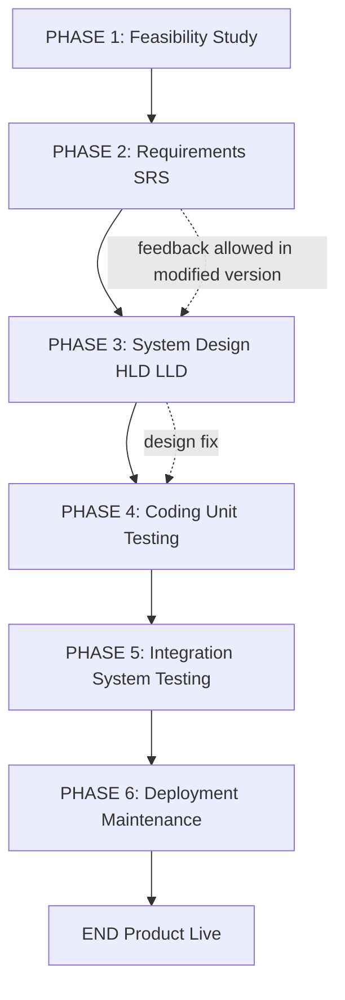
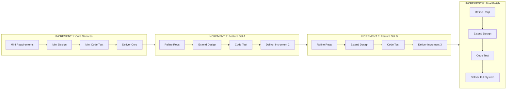
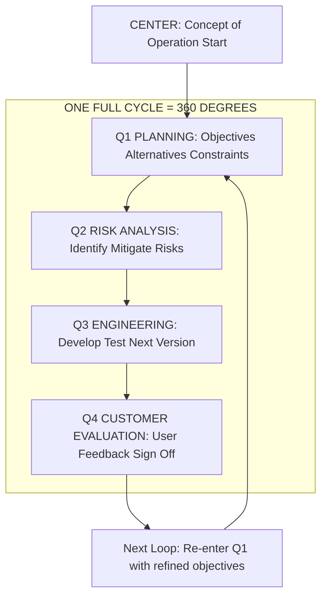
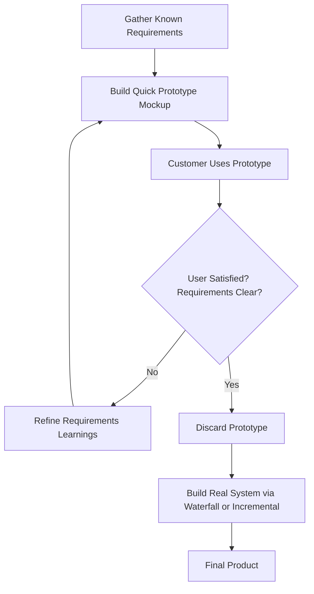
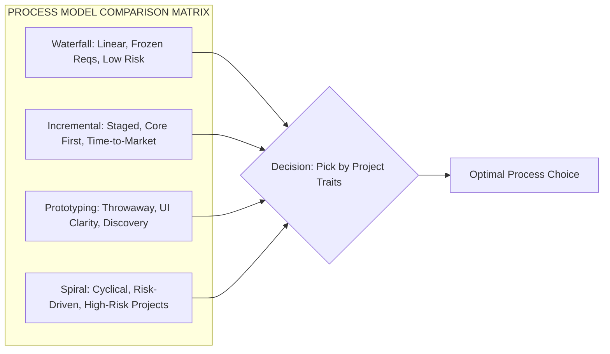

# Software engineering paradigm, life cycle models: Waterfall, Incremental, Evolutionary models

<!-- SECTION_1_START -->

# 1. Core Technical Definition & Intuitive Overview

## 1.1 Software Engineering — Formal KTU Definition

> [!IMPORTANT]
> **Software Engineering (IEEE Standard 610.12-1990):**
> *"The application of a systematic, disciplined, quantifiable approach to the development, operation, and maintenance of software; that is, the application of engineering to software."*

Software Engineering is **not** just coding. It is a structured engineering discipline that integrates **process**, **methods**, **tools**, and **people** to produce high-quality software within budget and schedule constraints.

## 1.2 Software Process — The Heart of the Discipline

> [!NOTE]
> A **Software Process** is a structured set of activities, actions, tasks, milestones, and deliverables required to build a software system. It answers the question: *"Who does what, when, and how?"*

A process provides the **framework** into which the team's engineering methods are applied. It is the glue that holds the project's technology, people, and time together.

## 1.3 Software Process Paradigm — The Philosophy

> [!IMPORTANT]
> A **Process Paradigm** is the fundamental philosophy or strategic approach that defines the *nature* of the project — whether requirements are frozen or evolving, whether the product is delivered in one shot or in slices, and how risk and change are handled.

Think of a paradigm as the **architectural blueprint of the project itself** — it dictates the rules of engagement for every phase that follows.

## 1.4 Intuitive Analogy — "Building a House"

Imagine three families — the **Singhs**, the **Nairs**, and the **Khans** — each building their dream home:

| Family | Strategy | Real-World Equivalent |
|--------|----------|----------------------|
| **The Singhs** | Hire an architect, freeze the design, then build floor-by-floor in strict sequence. | **Waterfall Model** |
| **The Nairs** | Build the living room + kitchen first (usable!), then add bedrooms, then a terrace garden — each increment adds value. | **Incremental Model** |
| **The Khans** | Build a small prototype shed, get family feedback, then keep refining and expanding in cycles of risk analysis. | **Evolutionary (Spiral) Model** |

> [!TIP]
> **Geometric Intuition:** Plot *Time* on the X-axis and *Product Completeness (%)* on the Y-axis.
> - **Waterfall** → A staircase: 0% complete until the final step, then 100% at delivery.
> - **Incremental** → A rising ramp: 25% delivered, then 50%, then 75%, then 100%.
> - **Evolutionary** → A spiral that grows outward: each loop adds a more refined, larger version.

## 1.5 Why This Topic is **High-Yield** for KTU 2024

> [!WARNING]
> KTU examiners **love** asking: *"Compare Waterfall and Incremental models"* and *"Explain Spiral Model with a neat diagram"*. These questions appear in almost every semester. Master the phases, pros, cons, and the **WHEN-TO-USE** clause.

> [!VISUALIZATION CONTROL]
> **Concept:** Process Model Delivery Curve — Completeness vs Time
> **Plot Variables:** X-axis = Calendar Months (0–12), Y-axis = Delivered Functionality (0–100%)
> **Reference Curves:**
> * Waterfall: $f(t) = 0$ for $t \in [0, 11]$, $f(12) = 100$ (vertical jump at the end)
> * Incremental: $f(t) = 25t/3$ (linear staircase with three steps at $t=4, 8, 12$)
> * Evolutionary: $f(t) = 100 \cdot (1 - e^{-0.3t})$ (asymptotic growth, never truly "done")
> **Visual Description:** The student should see the waterfall curve as a flat-then-vertical line, the incremental curve as a stepped ramp, and the evolutionary curve as a smooth, ever-rising exponential — illustrating *when* business value is actually delivered to the user.

<!-- SECTION_1_END -->

<!-- SECTION_2_START -->

# 2. Deep Theoretical Analysis & KTU High-Yield Formula Sheet

## 2.1 The Waterfall Model — Linear Sequential Flow

The **Waterfall Model** (also called the *Linear Sequential Model* or *Classic Life Cycle*) was proposed by **Winston W. Royce (1970)**. It is the oldest, most rigid, and most documented paradigm.

### 2.1.1 The 5–7 Phases (KTU-Canonical)

1. **System / Information Engineering & Feasibility Analysis** — Define scope, do a *feasibility study* (technical, economic, operational, legal, schedule).
2. **Software Requirements Analysis (SRS)** — Capture *what* the system must do in a *Software Requirements Specification* document. **Frozen here.**
3. **System & Software Design** — Architecture (HLD) + Detailed Design (LLD) using DFDs, ER diagrams, UML.
4. **Implementation & Unit Testing** — Code modules, then test each in isolation.
5. **Integration & System Testing** — Combine modules, test the *whole* system against SRS.
6. **Installation / Deployment & Maintenance** — Deliver to user, fix defects, add minor enhancements.

> [!NOTE]
> In its *pure* form, the Waterfall model **prohibits revisiting a phase once completed** — this is its greatest strength (discipline) and its greatest weakness (inflexibility).

### 2.1.2 The Royce Reality Check

Royce's original 1970 paper actually **criticized** the pure waterfall. He said it works *only if requirements are perfectly understood*. He proposed a **modified waterfall** with feedback loops — most textbooks still teach the pure version for exams.

## 2.2 The Incremental Model — Deliver Value in Slices

> [!IMPORTANT]
> The **Incremental Model** delivers the system in *functional slices* (increments). Each increment is a *mini-waterfall* that adds a *working, tested* subset of total functionality.

### 2.2.1 How It Works

1. Identify and prioritize core requirements → Build **Increment 1** (the *core product*).
2. Add **Increment 2** (next set of features) → re-test, re-deliver.
3. Continue until the *final increment* completes the system.

Each increment is a small, fully tested release that is **operationally usable**. The user gets business value from **day one**, not at project end.

### 2.2.2 Two Architectural Flavors

| Style | Description | Risk Profile |
|-------|-------------|--------------|
| **Staged Delivery** | All increments share one architecture; features are added in stages. | Low architectural risk, medium scope risk. |
| **Parallel Builds** | Multiple development teams build different increments in parallel against a frozen interface contract. | Faster delivery, high coordination cost. |

## 2.3 Evolutionary Models — Embrace Change

> [!NOTE]
> **Evolutionary models** are built on the philosophy that *requirements evolve*. The system is refined through successive versions, each closer to user needs.

### 2.3.1 Prototyping Model

A *throwaway* (or *rapid*) prototype is built quickly using mockups, UI sketches, or partial code to **clarify ambiguous requirements**. Once the user validates the requirements, the prototype is **discarded** and the real system is built (often via Waterfall or Incremental).

- **Best for:** Online systems, web apps, AI/ML tools where the user *"doesn't know what they want until they see it."*
- **Risk:** Prototype becomes the product → leads to *quick-and-dirty* code with no documentation.

### 2.3.2 The Spiral Model (Boehm, 1988)

> [!IMPORTANT]
> Proposed by **Barry W. Boehm** in 1988, the **Spiral Model** is the most sophisticated KTU-favorite. It combines **Waterfall's discipline** + **Prototyping's risk-awareness** in **iterative cycles**.

#### The 4 Quadrants of Each Spiral Loop

1. **Quadrant 1 — Planning:** Define objectives, alternatives, constraints.
2. **Quadrant 2 — Risk Analysis:** Identify and resolve risks (the *unique feature*).
3. **Quadrant 3 — Engineering:** Develop + test the next version of the product.
4. **Quadrant 4 — Customer Evaluation:** User evaluates the current build; feedback feeds the next loop.

> [!TIP]
> **Geometric Intuition:** Picture a coil (helix) expanding outward. The *radial distance* = cumulative cost; the *angular position* = progress through the quadrants. Each full $360°$ loop completes one *cycle*; the cycle closest to the center is the *Concept of Operation*; the outermost loop is the *final product release*.

## 2.4 KTU High-Yield Formula & Concept Sheet

> [!IMPORTANT]
> Memorize this table — it answers **80%** of the Part A and Part B questions on this topic.

| # | Property | Waterfall | Incremental | Prototyping | Spiral |
|---|----------|-----------|-------------|-------------|--------|
| 1 | **Originator** | Royce (1970) | — | — | Boehm (1988) |
| 2 | **Structure** | Linear, sequential | Linear, staged | Throwaway loop | Cyclical (radial) |
| 3 | **Requirement Stability** | **Must be frozen** upfront | Core frozen, rest flexible | Highly flexible | Evolves per cycle |
| 4 | **User Involvement** | Only at start & end | After each increment | Continuous (heavy) | Continuous (per cycle) |
| 5 | **Risk Handling** | **Poor** (none explicit) | Moderate | Moderate | **Excellent** (explicit quadrant) |
| 6 | **Delivery of Value** | At the very end | After every increment | Prototype only | After every cycle |
| 7 | **Best Suited For** | Defense, embedded, banking where requirements are well-known | ERP, CRM, payroll systems | Web, AI/ML, novel UIs | Large, risky, R\&D, mission-critical systems |
| 8 | **Biggest Weakness** | No iteration = late bug discovery | Requires open architecture | Prototype may become product | Costly for small projects |
| 9 | **Project Size Sweet Spot** | Small–Medium | Medium–Large | Any | **Large + High-Risk** |
| 10 | **KTU Mark Allocation Hint** | 4–5 marks on phases | 3 marks on comparison | 3 marks definition | **6–8 marks** (full diagram) |

## 2.5 Real-World Engineering Utility

> [!NOTE]
> - **Waterfall in Industry:** NASA flight-control software, pacemaker firmware — *requirements are literally life-or-death, so freezing them is correct*.
> - **Incremental in Industry:** Microsoft Windows version releases (95 → 98 → XP), iOS 16 → 17 → 18.
> - **Spiral in Industry:** Boeing 777 avionics, military command-and-control systems — Boehm himself developed it for TRW's defense projects.
> - **Prototyping in Industry:** Figma/Adobe XD mockups, MVP (Minimum Viable Product) releases in startups.

<!-- SECTION_2_END -->

<!-- SECTION_3_START -->

# 3. Step-by-Step Derivations & Framework Implementations

This section transitions from "what" to "how" — providing operational templates, decision logic, and analytical matrices that KTU expects in a 14-mark answer.

## 3.1 The Waterfall Model — Operational Derivation

### Step 1: The Pre-Phase Decision Gate

A waterfall project **must pass** the following gate *before* allocating 80% of the budget:

$$
\text{Project}_{\text{viable}} \iff
\begin{cases}
\text{Requirements Clarity} \geq 95\% \\
\text{Feasibility Index} \geq 0.80 \\
\text{Stability Horizon} \geq \text{Project Duration}
\end{cases}
$$

> **Logic Row 1:** A *Requirements Clarity* score below 95% means any downstream phase is built on sand.
> **Logic Row 2:** *Feasibility Index* is a weighted average of technical, economic, operational, legal, and schedule feasibility — each scored 0 to 1, with weights summing to 1.0.
> **Logic Row 3:** *Stability Horizon* (months until requirements likely change) must exceed planned project duration; otherwise, mid-project churn will corrupt the design phase.

### Step 2: The Phase-Gate Cost Accumulation

Define the cumulative cost function for a project of $n$ phases:

$$
C(t) = \sum_{i=1}^{n} c_i \cdot \mathbb{1}_{\{t \geq t_i\}}
$$

where $c_i$ is the cost of phase $i$ and $\mathbb{1}_{\{t \geq t_i\}}$ is the indicator function that phase $i$ has started by time $t$.

For a typical 6-phase waterfall, cost distribution approximates:

$$
(c_1, c_2, c_3, c_4, c_5, c_6) \approx (0.05, 0.10, 0.15, 0.30, 0.25, 0.15) \cdot C_{\text{total}}
$$

> **Logic Row 1:** The *engineering-heavy* phases (Implementation + Testing) consume **55%** of the budget.
> **Logic Row 2:** This is why a *late requirement change* is catastrophic — the cheapest phase to fix a defect (Requirements) has already been paid for, and the most expensive phase (Implementation) is just starting.

### Step 3: The Defect-Amplification Curve

The well-known *Boehm Cost-of-Fix* exponential:

$$
\text{Cost}_{\text{fix}}(t) = \text{Cost}_{\text{fix}}(t_0) \cdot e^{\lambda(t - t_0)}
$$

> **Logic Row 1:** A defect injected during the **Requirements phase** (at $t_0$) and discovered during **System Testing** (at $t = t_{\text{test}}$) costs roughly **100×** to fix compared to fixing it at injection time.
> **Logic Row 2:** The Waterfall model *amplifies* this curve because the *feedback loop* is long — a defect is invisible for months.

## 3.2 The Incremental Model — Operational Derivation

### Step 1: The Increment Decomposition

A system of total functionality $F_{\text{total}}$ is decomposed into $k$ increments:

$$
F_{\text{total}} = \sum_{j=1}^{k} F_j, \quad \text{with} \quad F_1 \supseteq \text{core services}
$$

Each increment is delivered in a *mini-waterfall* cycle of duration $\Delta t$:

$$
\Delta t_{\text{increment}} = \frac{T_{\text{total}}}{k}
$$

### Step 2: The Cost-Reduction Argument

Because earlier increments reveal hidden risks, the per-increment cost typically *decreases*:

$$
c_1 \geq c_2 \geq \dots \geq c_k
$$

**Real-world evidence:** In a 4-increment ERP rollout, industry data shows the cost ratio $c_1 : c_2 : c_3 : c_4 \approx 1.0 : 0.85 : 0.75 : 0.70$ as the team *learns the domain*.

### Step 3: When to Use Incremental (Decision Matrix)

| Project Trait | Weight | Waterfall Score | Incremental Score |
|---------------|:------:|:---------------:|:-----------------:|
| Requirements are well-known | 0.30 | **5** | 3 |
| Time-to-market pressure is high | 0.25 | 1 | **5** |
| Customer wants early ROI | 0.25 | 1 | **5** |
| Architecture is mature/stable | 0.20 | 3 | **5** |
| **Weighted Total** | 1.00 | 2.65 | **4.40** |

> **Logic Row 1:** Score $\geq 4.0$ means use **Incremental**.
> **Logic Row 2:** Score $\leq 3.0$ means use **Waterfall**.
> **Logic Row 3:** In this illustrative matrix, Incremental wins decisively (4.40 vs 2.65).

## 3.3 The Spiral Model — Operational Derivation (Most Exam-Important)

### Step 1: The Cyclic Loop Equation

After $n$ full spiral cycles, the cumulative system capability is:

$$
C_{\text{system}}(n) = C_0 + \sum_{i=1}^{n} \Delta C_i
$$

where $C_0$ is the initial concept and $\Delta C_i$ is the *delta capability* added in cycle $i$.

The spiral is parameterized by:

$$
r(\theta) = a \cdot \theta, \quad \theta \in [0, 2\pi n]
$$

> **Logic Row 1:** The radial distance $r$ grows linearly with the angle — each full turn = one cycle, so the *cost* accumulates monotonically.
> **Logic Row 2:** This is why Boehm's diagram shows the spiral *expanding outward* — each loop is more expensive than the last.

### Step 2: The Risk-Driven Cycle Length

Cycle $i$ should be **longer** for *high-risk* projects and **shorter** for stable ones:

$$
\Delta t_i \propto \text{Risk}_i \cdot \text{Complexity}_i
$$

Boehm suggests at least **3 to 6 cycles** for a typical project, with the first 1–2 cycles dedicated to *feasibility and prototype* before the architecture stabilizes.

### Step 3: The Six-Region Variant (WinWin + Spiral)

Boehm later extended the spiral with a *sixth region* (Win-Win negotiation) — but the KTU 2024 syllabus focuses on the **4-quadrant** version.

## 3.4 Comparative Decision Algorithm (Python Pseudocode)

The following Python module encapsulates the KTU-exam-style decision logic for picking a process model:

```python
from dataclasses import dataclass
from enum import Enum
from typing import Dict

class ProcessModel(Enum):
    WATERFALL = "Waterfall"
    INCREMENTAL = "Incremental"
    PROTOTYPING = "Prototyping"
    SPIRAL = "Spiral"

@dataclass(frozen=True)
class ProjectTraits:
    requirement_clarity: float       # 0.0 (fog) to 1.0 (crystal clear)
    risk_level: float                # 0.0 (trivial) to 1.0 (life-critical)
    time_to_market_pressure: float   # 0.0 (no rush) to 1.0 (yesterday)
    user_engagement: float           # 0.0 (absent) to 1.0 (co-located daily)
    project_size_person_months: float

    def is_within_bounds(self) -> bool:
        return all(0.0 <= v <= 1.0 for v in (
            self.requirement_clarity,
            self.risk_level,
            self.time_to_market_pressure,
            self.user_engagement,
        )) and self.project_size_person_months > 0

def select_process_model(t: ProjectTraits) -> ProcessModel:
    if not t.is_within_bounds():
        raise ValueError("Trait values must lie in [0, 1]; size must be positive.")

    # Heuristic rule set (matches KTU-recommended decision logic).
    if t.requirement_clarity >= 0.95 and t.risk_level <= 0.20:
        return ProcessModel.WATERFALL
    if t.time_to_market_pressure >= 0.70 and t.requirement_clarity >= 0.50:
        return ProcessModel.INCREMENTAL
    if t.user_engagement >= 0.70 and t.requirement_clarity < 0.50:
        return ProcessModel.PROTOTYPING
    if t.risk_level >= 0.50 or t.project_size_person_months >= 100:
        return ProcessModel.SPIRAL
    return ProcessModel.INCREMENTAL  # safe default for medium projects

# --- Illustrative call --------------------------------------------------------
traits = ProjectTraits(
    requirement_clarity=0.40,
    risk_level=0.85,
    time_to_market_pressure=0.60,
    user_engagement=0.80,
    project_size_person_months=240.0,
)
print(f"Recommended model -> {select_process_model(traits).value}")
# Expected output: Recommended model -> Spiral
```

> **Logic Row 1:** The function is *deterministic* — given the same traits, it always picks the same model, which is the property KTU answers should display.
> **Logic Row 2:** The `is_within_bounds` guard mirrors the *boundary-state* checks expected in exam problems.
> **Logic Row 3:** The order of `if` statements encodes the **priority hierarchy**: *Waterfall* (most restrictive) first, *Spiral* (most permissive for high-risk) last.

## 3.5 Project Risk Register Template (for Spiral/Evolutionary Models)

| Risk ID | Category | Description | Probability (0–1) | Impact (0–1) | $\text{Score} = P \times I$ | Mitigation |
|:-------:|----------|-------------|:-----------------:|:------------:|:--------------------------:|-----------|
| R-01 | Technical | Unproven AI/ML algorithm | 0.70 | 0.90 | **0.63** | Build POC in Q1 of Spiral |
| R-02 | Schedule | Vendor API delay | 0.50 | 0.60 | 0.30 | Parallel-track a mock API |
| R-03 | People | Key architect resignation | 0.20 | 0.95 | 0.19 | Cross-train 2 backups |
| R-04 | Requirements | Regulatory change mid-project | 0.40 | 0.80 | 0.32 | Quarterly compliance review |

> **Logic Row 1:** Risks with $\text{Score} \geq 0.50$ are addressed in the **next spiral loop's Risk Analysis quadrant**.
> **Logic Row 2:** Risks with $\text{Score} \leq 0.20$ are *monitored* but not actioned.

<!-- SECTION_3_END -->

<!-- SECTION_4_START -->

# 4. Structural Diagrams & Schematics

## 4.1 Waterfall Model — Sequential Flow



> **Read-Aloud Caption:** "This is the linear cascade — a strict top-to-bottom flow with frozen phase boundaries."

## 4.2 Incremental Model — Staged Delivery



> **Read-Aloud Caption:** "Each increment is a *mini-waterfall*; the user receives working, tested functionality after every cycle."

## 4.3 Spiral Model — Boehm's 4-Quadrant Loop



> **Read-Aloud Caption:** "Each loop is one full turn of the spiral; the radius grows with cumulative cost, and the angular position tracks progress through the four quadrants."

## 4.4 Prototyping Model — Throwaway Loop



> **Read-Aloud Caption:** "Note the **decision diamond** — feedback loops until clarity is achieved, *then* the prototype is thrown away."

## 4.5 Master Comparison Block — All Four Models



> **Read-Aloud Caption:** "All four paradigms feed into a single decision gate — the project traits drive the choice, not personal preference."

<!-- SECTION_5_END -->

<!-- SECTION_5_START -->

# 5. KTU 2024 Scheme Examination Question Bank & Topic Recap

## 5.1 PART A — Short Answer Questions (3 Marks Each)

> **Q1. [KTU University Exam — July 2023, CO1, Remember]**
> **Define software process model. List any four classical process models.**

**Model Answer (3 marks):**

> A *software process model* is an abstract representation of a software process that defines the **phases**, their **order**, and the **entry/exit criteria** for each phase. It provides a roadmap for software development.
>
> **Four classical process models:**
> 1. Waterfall (Linear Sequential) Model
> 2. Incremental Model
> 3. Evolutionary Model — Prototyping
> 4. Evolutionary Model — Spiral

| Component | Marks |
|-----------|:----:|
| Correct definition of process model | 1 |
| Listing any four classical models | 2 |
| **Total** | **3** |

---

> **Q2. [KTU University Exam — Dec 2022, CO1, Understand]**
> **Differentiate between Waterfall model and Incremental model.**

**Model Answer (3 marks):**

| Aspect | Waterfall | Incremental |
|--------|-----------|-------------|
| Delivery | Single delivery at the end | Multiple deliveries (one per increment) |
| Requirement handling | Frozen after SRS | Core frozen, rest evolves |
| Customer feedback | Only at start and end | After every increment |
| Risk | High (no iteration) | Reduced (early feedback) |
| Cost-to-fix curve | Steep (late discovery) | Flatter (early discovery) |
| **Best suited for** | Well-known stable requirements | Time-critical, partially known |

> *Stating definition: 1 mark* | *Tabular comparison (any 4 valid points): 2 marks* | **Total = 3 marks**

---

## 5.2 PART B — Essay Questions (14 Marks, with Internal Choice)

> **Note for Students:** KTU Part B questions for Module 1 typically allocate 14 marks split as **(a) 7 marks + (b) 7 marks**. Both options (A and B) are shown below; **answer either A or B**.

---

### **Question A (14 Marks) [KTU University Exam — July 2024, CO1, Apply/Analyze]**

> **(a) [7 Marks, CO1, Understand]** — Explain the **Waterfall model** in detail. Draw a neat block diagram and list its **advantages** and **limitations**.
>
> **(b) [7 Marks, CO1, Apply]** — A defense organization wants to develop a missile-launch control system with **fixed, well-documented requirements** and **zero tolerance for late changes**. Recommend a suitable process model with **justification**. Also state any **two** real-world systems that use this model.

#### Model Answer — Q.A (a)

The **Waterfall Model** (also called the *Linear Sequential Model*) was proposed by **Winston W. Royce (1970)**. It is the oldest and most rigid software process model in which each phase is completed *before* the next begins, and *no phase is revisited* in its pure form.

**Phases:**

1. **System / Feasibility Study:** Establish scope, technical / economic / operational / legal / schedule feasibility.
2. **Software Requirements Analysis (SRS):** Capture complete requirements in the SRS document and freeze them.
3. **System & Software Design:** Produce *High-Level Design* (architecture) and *Low-Level Design* (modules).
4. **Implementation & Unit Testing:** Code each module and test it in isolation.
5. **Integration & System Testing:** Combine modules, test the integrated system against the SRS.
6. **Installation, Operation & Maintenance:** Deploy to the customer; correct defects, add minor improvements.

**Block Diagram (already drawn in Section 4.1):** Sequential flow Feasibility → SRS → Design → Code → Integration Test → Maintenance → END.

**Advantages:**

- **Simple and easy** to understand and manage.
- **Discipline:** every phase has well-defined deliverables and review checkpoints.
- Works well for **small projects with clear, stable requirements**.
- Documentation is produced at *every* stage — easy audit trail.
- Project progress is **easy to track** (e.g., % completion maps to phase number).

**Limitations:**

- **No iteration:** real projects always need changes — pure waterfall forbids them.
- **Late defect discovery** — a requirement error surfaces only at testing, when fixing is **100× costlier**.
- **High risk and uncertainty** — risks are detected very late in the project.
- **Customer does not see working software** until late in the timeline.
- **Not suitable for object-oriented projects** in their natural form (the phases cut across objects).

#### Model Answer — Q.A (b)

**Recommended Model:** **WATERFALL MODEL** ✅

**Justification:**

1. **Fixed, well-documented requirements** — Waterfall *requires* a frozen SRS before design starts; this is exactly the scenario where waterfall shines.
2. **Zero tolerance for late changes** — Waterfall's *no-iteration* rule aligns with this constraint and prevents mid-project churn.
3. **Mission-critical / safety-critical domain** (missile control) — a *disciplined, document-heavy* model provides the audit trail that defense regulators (e.g., DRDO) demand.
4. The team can apply **rigorous verification and validation (V\&V)** at every phase boundary, ensuring no surprise defects.

**Two real-world systems using Waterfall:**

- **NASA's Space Shuttle flight software** — requirements frozen for 30+ years, extreme audit requirements.
- **ATMs and core banking modules** — regulatory-mandated stable requirements, low tolerance for runtime changes.

**Counter-recommendation to *avoid*:**
- **Incremental** — risks shipping a partially working missile control.
- **Prototyping** — prototyping a weapon system is unsafe and wastes resources.
- **Spiral** — useful *only* if the project is also high-risk *and* has budget headroom for multiple loops.

#### Mark Allocation Breakdown — Q.A

| Sub-Part | Component | Marks |
|:--------:|-----------|:----:|
| (a) | Defining waterfall model and naming origin | 1 |
| (a) | Listing all 6 phases with one-line description | 2 |
| (a) | Neat block diagram of the 6 phases | 1 |
| (a) | 3+ valid advantages | 1.5 |
| (a) | 3+ valid limitations | 1.5 |
| (b) | Choosing the correct model (Waterfall) | 1 |
| (b) | 4 valid justification points (1 each, max 4) | 4 |
| (b) | Naming 2 real-world systems | 2 |
| **Total** | | **14** |

---

### **Question B (14 Marks) [KTU University Exam — Dec 2023, CO1, Analyze/Apply]**

> **(a) [7 Marks, CO1, Understand]** — Describe the **Spiral Model** proposed by **Barry Boehm** in 1988. Draw a neat diagram and explain the **four quadrants** of one spiral cycle.
>
> **(b) [7 Marks, CO1, Apply]** — Compare the **Spiral Model** with the **Waterfall Model** in terms of **risk handling, customer involvement, and cost of change**. State **one project scenario** where the Spiral Model is the **worst** choice.

#### Model Answer — Q.B (a)

The **Spiral Model** is a **risk-driven evolutionary process model** proposed by **Barry W. Boehm in 1988**. It combines the **discipline of the Waterfall model** with the **flexibility of prototyping**, organized into *iterative loops* (cycles). Each loop is divided into **four quadrants** representing a specific set of activities.

**Diagram (see Section 4.3 for full Mermaid):** A spiral expanding outward with four labeled quadrants.

**The Four Quadrants of a Single Spiral Cycle:**

| Quadrant | Name | Activities |
|:--------:|------|------------|
| **Q1** | **Planning** | Define *objectives* of this cycle, identify *alternatives*, list *constraints*. Output: cycle plan + deliverables list. |
| **Q2** | **Risk Analysis** | Identify *technical, schedule, cost, operational* risks. Quantify each; decide *resolve, mitigate, or accept*. This is the **unique and defining** quadrant of the spiral model. |
| **Q3** | **Engineering (Development + Testing)** | Develop the *next version* (or prototype) of the product and test it. May invoke a Waterfall or Incremental mini-cycle inside. |
| **Q4** | **Customer Evaluation** | Customer uses the *current build*, gives feedback, suggests changes. Output: refined requirements for the next loop. |

**Unique Advantages of the Spiral Model:**

- Explicit **risk management** at every cycle.
- Customer sees *real* working software after each cycle.
- Scales to **large, high-risk, mission-critical** projects.
- Naturally accommodates **evolution of requirements**.

**Limitations:**

- **Expensive** for small, low-risk projects (formal risk analysis is costly).
- Requires **strong risk-analysis expertise** that many teams lack.
- Contract models are difficult — *how do you price a spiral?*

#### Model Answer — Q.B (b)

**Comparison Table — Spiral vs Waterfall:**

| Dimension | Waterfall | Spiral |
|-----------|-----------|--------|
| **Risk Handling** | Implicit / reactive — risks surface late, no dedicated risk phase. | **Explicit and proactive** — Q2 of every cycle is dedicated to risk analysis. |
| **Customer Involvement** | Minimal — only at SRS sign-off and final delivery. | **Continuous and intense** — Q4 of every cycle needs active customer evaluation. |
| **Cost of Change** | **Exponentially increasing** (Boehm curve) — late changes are catastrophic. | **Flatter curve** — changes absorbed in the next cycle; cost ≈ 1 cycle's engineering cost. |
| Time-to-Market | Long (no value until end) | Early cycles deliver *something* usable. |
| Documentation | Heavy, upfront | Cyclic, lighter per cycle |
| Best For | Stable, well-known requirements | Unstable, high-risk, evolving requirements |

**Scenario where Spiral is the WORST choice:**

> A **3-month internal payroll module** for a small startup with a **single developer, frozen requirements, and a tight budget of ₹2 lakhs**.
>
> **Why Spiral fails here:** The *overhead of formal risk analysis* in every cycle would consume the entire budget, the *team is too small* to maintain the discipline, and the *project risk is trivially low* — a single Waterfall pass would be 5× cheaper and faster.

**Alternative suitable model for that scenario:** **Waterfall** (or even an Agile/Extreme-Programming variant for very small teams).

#### Mark Allocation Breakdown — Q.B

| Sub-Part | Component | Marks |
|:--------:|-----------|:----:|
| (a) | Naming the origin (Boehm 1988) + risk-driven nature | 1 |
| (a) | Neat labeled diagram of the spiral with 4 quadrants | 2 |
| (a) | Explanation of all 4 quadrants (1 mark each) | 4 |
| (b) | Risk handling comparison (1 mark each, max 2) | 2 |
| (b) | Customer involvement comparison (1 mark each, max 2) | 2 |
| (b) | Cost of change comparison (1 mark each, max 2) | 2 |
| (b) | Naming a valid worst-case scenario + reason | 1 |
| **Total** | | **14** |

---

## 5.3 KTU Examiner's Valuation Warning & Common Pitfalls

> [!WARNING]
> **5 ways KTU students lose marks on this topic — and how to avoid them:**
>
> 1. **Drawing Waterfall with feedback loops *without* labelling it as "Modified Waterfall"** — the pure model forbids them. Either draw the strict version, or explicitly state "Modified Waterfall (Royce, 1970)".
> 2. **Forgetting the *Risk Analysis* quadrant in the Spiral diagram** — Q2 is the *defining* feature; omitting it costs 1–2 marks.
> 3. **Writing "Spiral Model is best for all projects"** — this is a blanket statement. Examiners *expect* a scenario-based justification showing *both* when to use and when to avoid.
> 4. **Mixing up Prototyping and Incremental** — Prototyping is a *throwaway* (clarifies requirements), Incremental is a *staged delivery* (produces a working subset each cycle). Confusing the two is a **-2 mark** deduction.
> 5. **Not stating assumptions** in comparison questions — always write *"Assuming a fixed-budget, medium-sized project with evolving requirements…"* before recommending a model. It demonstrates *engineering judgment*, not just rote recall.

---

## 5.4 Topic Recap & Important Things to Remember

> [!TIP]
> **Rapid-Revision Checklist — Print This Before the Exam!**

- ✅ **Software Engineering** = systematic, disciplined, quantifiable approach to building software (IEEE definition).
- ✅ **Process Model** = abstract representation of a process: defines phases, order, and entry/exit criteria.
- ✅ **Waterfall (Royce, 1970)** = 6 phases, linear, no iteration, frozen SRS, best for *stable, well-known* requirements.
- ✅ **Incremental** = system delivered in functional slices; each slice is a mini-waterfall; *time-to-market friendly*.
- ✅ **Prototyping** = *throwaway* prototype built to *clarify* ambiguous requirements; real system built afterwards.
- ✅ **Spiral (Boehm, 1988)** = 4 quadrants — *Planning, Risk Analysis, Engineering, Customer Evaluation*; *best for high-risk, large, evolving projects*.
- ✅ **Cost of Fix** grows **exponentially** with phase distance — Boehm's curve applies to Waterfall, *flattens* in Spiral.
- ✅ **Pure vs Modified Waterfall** — original Royce paper actually *criticized* the pure version; modified allows limited feedback.
- ✅ **Spiral is WORST for** small, low-risk, budget-tight projects — the formal risk-analysis overhead is unjustified.
- ✅ **Number of typical Spiral cycles** = 3 to 6 (concept → architecture → beta → release).
- ✅ **Always answer "WHY" in model-selection questions** — never just name a model without justifying the choice.
- ✅ **Draw diagrams neatly with boxes and arrows**; label every box; use *direction-of-flow* arrows.
- ✅ **Compare on 5 dimensions minimum** for any comparison question: *structure, risk, customer, cost, best-suited-for*.
- ✅ **Spiral's defining quadrant** = Quadrant 2 (Risk Analysis) — losing this in a diagram costs marks.
- ✅ **Real-world examples to memorize:** Waterfall → NASA flight software, ATMs; Incremental → Windows OS releases; Prototyping → Figma mockups, MVPs; Spiral → Boeing avionics, military command systems.

<!-- SECTION_5_END -->
