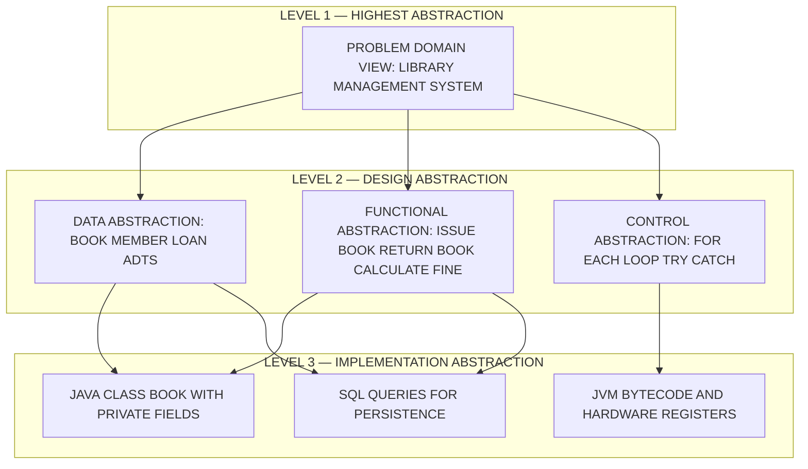
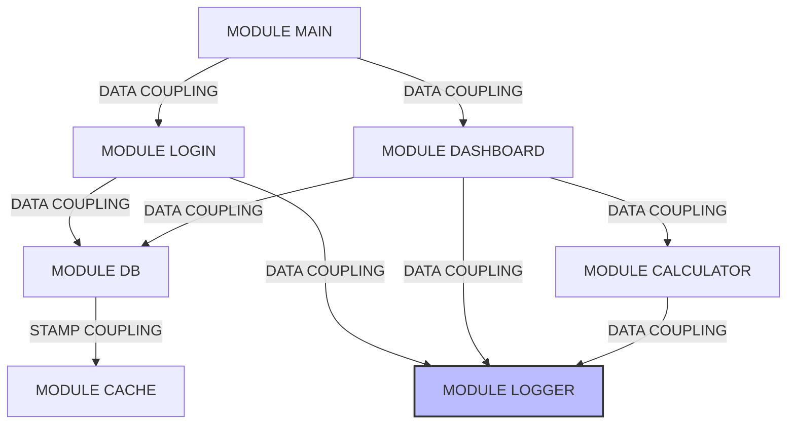
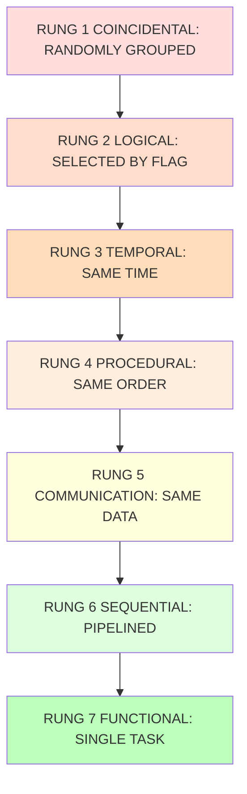
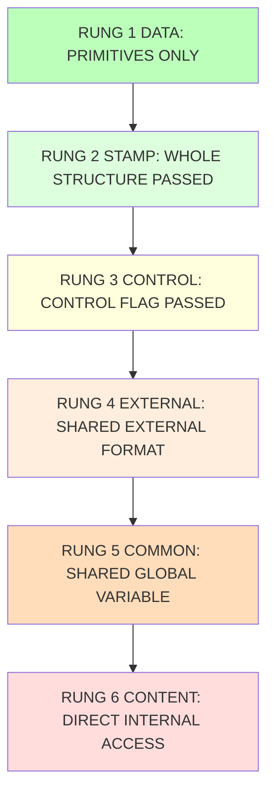
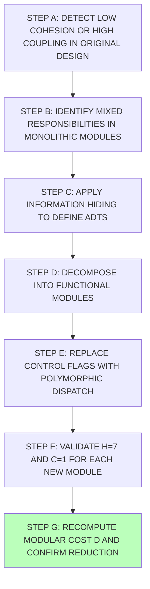

# Design concepts: Abstraction, modularity, cohesion, and coupling metrics

<!-- SECTION_1_START -->
# Design Concepts: Abstraction, Modularity, Cohesion & Coupling Metrics

## 1. Core Technical Definition & Intuitive Overview

### 1.1 Abstraction

**Formal Definition (KTU 2024 PECST411 — Module 2 Terminology):**
Abstraction is the process of identifying the *essential* characteristics of an object or system while *suppressing* (deliberately hiding) its inessential, implementation-level details. In the KTU 2024 Software Engineering syllabus, abstraction is positioned as one of the three foundational pillars of the software design process, sitting alongside **modularity** and **hierarchy**.

> [!IMPORTANT]
> **KTU Board Verbatim Definition (from Pressman & Sommerville references):** "Abstraction is a simplified description, or specification, of a system that emphasizes some of the system's details or properties while suppressing others. A good abstraction is one that emphasizes details that are significant to the reader/user and suppresses details that are, at least for the moment, immaterial or diversionary."

#### 1.1.1 The Three Recognised Forms of Abstraction
- **Data Abstraction**: A named collection of data that describes a *data object*. In modern languages it is realised as an **Abstract Data Type (ADT)** or a `class` with private fields and public methods. Example: `class Stack { void push(); Object pop(); }`.
- **Procedural / Functional Abstraction**: A named sequence of imperative statements that has a single, well-defined purpose. Example: `sqrt(x)`, `openFile(path)`.
- **Control Abstraction**: Implied use of control statements (loops, recursion, exception-handlers) abstracted as primitives. Example: `for_each` iterator, `try/catch` blocks.

> [!NOTE]
> **Hierarchical Rule (KTU 2024 must-know):** Every data object has both an *abstract* view and a *concrete* view. The abstract view is what the rest of the program may access. The concrete view is private to the implementing module. This separation is the heart of *information hiding* (Parnas, 1972).

#### 1.1.2 Conceptual Analogy
> [!NOTE]
> **Car Dashboard Analogy:** A driver interacts with a *speedometer* (data abstraction of velocity), a *steering wheel* (functional abstraction of Ackermann geometry), and a *gear shifter* (control abstraction of clutch-actuation logic). The driver does *not* directly manipulate the crankshaft, fuel-injector pulse-width, or torque curve. The automobile manufacturer has *abstracted* these internals so the user can operate the vehicle safely. Software design follows exactly the same principle: a *module's interface* is the dashboard, and its *implementation* is the engine bay.

#### 1.1.3 Geometric / Visualization Control
> [!VISUALIZATION CONTROL]
> **Concept:** Three-Tier Abstraction Pyramid (Layered Design)
> **GeoGebra / Desmos Input Equations:**
> * Top triangle cap: $f(x) = \max(0, 1 - \vert x \vert)$
> * Middle trapezoidal layer: $g(x) = \max(0, 0.7 - 0.4 \cdot \vert x \vert)$
> * Base trapezoidal layer: $h(x) = \max(0, 0.4 - 0.2 \cdot \vert x \vert)$
> **Visual Description:** Three nested isosceles triangles stacked on a horizontal axis centered at the origin. The topmost (smallest) layer represents *Highest-Level Abstraction* — the problem-domain view (e.g., "Library Management System"). The middle layer represents *Design-Level Abstraction* — function modules and ADTs. The bottom (largest) layer represents *Implementation-Level Abstraction* — actual source code, registers, and machine instructions. The student should observe that each layer *sits upon* and *depends on* the layer below, and that movement upward hides further details.

---

### 1.2 Modularity

**Formal Definition:**
Modularity is the property of a software system that has been *decomposed* into a set of cohesive and loosely coupled modules. A module is a logically separable, named, and addressable component of a program — typically a function, procedure, subroutine, class, package, or subsystem in modern languages.

> [!IMPORTANT]
> **KTU 2024 Theorem of Modularity (Parnas):** "The *modular structure* of a system should be determined by the *information-hiding* requirements of the system, not by the procedural structure of the implementation language." A change in a design decision that is *likely to change* should be hidden behind a *single* module boundary.

#### 1.2.1 The Five Criteria of a Good Module (Yourdon & Constantine)
1. **Modular Decomposability** — A systematic method exists to break the problem into sub-problems.
2. **Modular Composability** — A method exists to recombine modules into new systems.
3. **Modular Understandability** — A module can be understood as a standalone unit.
4. **Modular Continuity** — Small specification changes trigger only *localised* changes.
5. **Modular Protection** — Anomalous conditions in one module are confined to that module.

#### 1.2.2 Conceptual Analogy
> [!NOTE]
> **LEGO Brick Analogy:** A LEGO city is built from standardised bricks (modules). Each brick has a clean *interface* (studs on top, tubes below). One can swap bricks of the same type, replace a broken brick without disturbing neighbours, and re-use bricks in another model. The brick *interface* decouples the brick from its neighbours. Software modules are LEGO bricks — independent, interchangeable parts assembled to form a complex whole. The interface is the stud-tube geometry; the implementation is the colour and shape of the brick.

#### 1.2.3 Quantitative Form of Modularity
Let $n$ be the number of modules, $c$ the number of interconnections (edges in the call-graph), and $k_j$ the cost of interconnection $j$ (with $k_j$ typically between 1 and 6 units of cost depending on the type of coupling). The *Modular Cost Function* is:

$$
D \;=\; \sum_{i=1}^{n} d_i \;+\; \sum_{j=1}^{c} k_j
$$

Where $d_i$ is the implementation cost of module $i$. A system is *optimally modular* when $D$ is minimised. In KTU 2024 valuation, students are expected to recognise that as $c$ increases, $D$ rises *super-linearly* — explaining why reducing coupling is a first-order design concern.

---

### 1.3 Cohesion

**Formal Definition:**
Cohesion is the *intra-module* attribute. It measures how strongly the *responsibilities* of a single module are functionally related to one another. Higher cohesion is *always* desirable because it indicates the module has a single, well-defined purpose — making it easier to name, test, maintain, and re-use. The KTU 2024 syllabus follows the seven-level **Stevens-Myers-Constantine classification (1974)**, listed from *worst* to *best*.

#### 1.3.1 Conceptual Analogy
> [!NOTE]
> **Kitchen-Appliance Analogy:** A high-cohesion appliance is a *dedicated coffee machine* — its only purpose is to brew coffee. A low-cohesion appliance is a *Swiss Army knife of the kitchen* — it toasts bread, blends smoothies, kneads dough, weighs flour, plays the radio, and charges the phone. The dedicated device is easier to maintain, test, name ("Coffee Maker"), re-use ("install beside the espresso bar"), and document. Cohesion is the *single-purpose-ness* of a module.

> [!WARNING]
> **Common KTU Pitfall:** Students often confuse *cohesion* and *coupling*. Memorise the rhyme: **"Cohesion = WITHIN one module; Coupling = BETWEEN two modules."** Examiners routinely test this distinction for 2 marks.

---

### 1.4 Coupling

**Formal Definition:**
Coupling is the *inter-module* attribute. It measures the degree of *interdependence* between two modules. Lower coupling is *always* desirable because it isolates change, enables parallel development, and improves reusability. The KTU 2024 scheme follows the six-level classification by **Constantine, Yourdon and Stevens (1979)**, listed from *best* to *worst*.

#### 1.4.1 Conceptual Analogy
> [!NOTE]
> **Communication-Channel Analogy:** Two people (modules) exchanging information.
> - **Data coupling (best)**: A short text message "Dinner at 8." The receiver decides what to do. *Loose, clean, reusable.*
> - **Stamp coupling**: Sending an entire *file* when only one column is needed. The receiver must accept the whole bundle.
> - **Control coupling**: Sending a *flag* that switches the receiver's flow: "PRINT_MODE = TRUE." The receiver's behaviour is *dictated*.
> - **External coupling**: Both people must agree on an *external data format* (a third-party protocol).
> - **Common coupling**: Both people share a *global bulletin board* — anyone can overwrite.
> - **Content coupling (worst)**: One person reaches into the other's *private diary* and edits it without permission. In code: `goto` into a subroutine, or modifying a `private` field of another class via reflection.

<!-- SECTION_1_END -->

---

<!-- SECTION_2_START -->
# 2. Deep Theoretical Analysis & KTU High-Yield Formula Sheet

## 2.1 The Four Pillars — Interrelationships

| Pillar | Scope | Direction of Design Force | KTU Bloom Level |
| :--- | :--- | :--- | :--- |
| Abstraction | *What* a module exposes | Reduce the *visible surface* | Understand |
| Modularity | *Structure* of the whole system | Increase the *number* of small modules | Apply |
| Cohesion | *Inside* a single module | Push the type *up* the seven-rung ladder | Analyze |
| Coupling | *Between* two modules | Push the type *down* the six-rung ladder | Analyze |

> [!NOTE]
> **The Golden Triangle (KTU 2024 mantra):** *Strong Abstraction + Strong Modularity + High Cohesion + Low Coupling* = Maintainable, Reusable, Testable Software. Every KTU 14-mark question on this topic tests the student's ability to *evaluate* a given design against these four criteria.

---

## 2.2 Detailed Analysis of the Seven Cohesion Types (Stevens-Myers-Constantine)

Listed from **worst (1)** to **best (7)**. Each type is followed by a representative code-fragment style description.

1. **Coincidental Cohesion** *(worst)* — Elements are grouped arbitrarily; e.g., `Utility.java` containing date conversion, string reversal, and array sort in a single class. *Indicator*: the module has no single descriptive name.
2. **Logical Cohesion** — Elements perform similar functions but are selected by a control flag; e.g., one `handle_io(DEVICE, DATA)` function that switches between printer, disk, and console.
3. **Temporal Cohesion** — Elements are activated at the same time; e.g., `initialise_system()` that opens files, allocates memory, and clears buffers together.
4. **Procedural Cohesion** — Elements must be executed in a particular order; e.g., `edit_document()` that does spell-check then grammar-check, but the steps are not functionally related.
5. **Communicational Cohesion** — Elements operate on the *same* data; e.g., `update_customer_record()` that reads, validates, and writes the *same* customer object.
6. **Sequential Cohesion** — Output of one element is the input of the next; e.g., `read_validate_persist_record()` that pipes data through stages.
7. **Functional Cohesion** *(best)* — All elements contribute to a *single, well-defined* task; e.g., `sqrt(x)` or `calculate_income_tax()`. *Indicator*: a one-sentence imperative name describes the entire module.

## 2.3 Detailed Analysis of the Six Coupling Types

Listed from **best (1)** to **worst (6)**.

1. **Data Coupling** *(best)* — Modules share *only* primitive data items (`int`, `float`, `char`). Example: `printf("Score: %d", score)`.
2. **Stamp Coupling** — A whole *data structure* is passed, but the called module uses only part of it. Example: passing a `Customer` object to a function that only needs `customer.name`.
3. **Control Coupling** — A *control flag* is passed that alters the called module's flow. Example: `sort_array(arr, ASCENDING)`.
4. **External Coupling** — Both modules must conform to an *external* data format, protocol, or device. Example: two modules both writing to a fixed-format log file.
5. **Common Coupling** — Modules share *global* data. Example: a `public static` class-level variable accessed by multiple classes.
6. **Content Coupling** *(worst)* — One module directly modifies the *internal* data or control flow of another. Example: `goto` into the middle of a subroutine; a class directly accessing another class's `private` field via Java reflection.

---

## 2.4 KTU Formula / Cheat Sheet — Design Metrics

> [!IMPORTANT]
> The table below is a *high-yield, board-exam* summary. Commit it to memory. The vertical bar `\vert` is used for absolute value to maintain LaTeX-table integrity (per the KTU-PREMIER-ENGINE V10 protocol).

| Metric | Symbol & Formula | Target / Best Value | Worst Value | Engineering Interpretation |
| :--- | :--- | :--- | :--- | :--- |
| **Fan-In** of module $m$ | $F_i(m) = \lvert \{ \, n \mid n \text{ calls } m \, \} \rvert$ | High ($\geq 3$) | $0$ (unused) | Reusability index — high fan-in means the module is a *shared utility*. |
| **Fan-Out** of module $m$ | $F_o(m) = \lvert \{ \, n \mid m \text{ calls } n \, \} \rvert$ | Low ($\leq 7$) | High ($> 10$) | Control complexity — high fan-out means the module *knows too much*. |
| **Module Size** | $S(m) = \text{LOC}(m)$ | $50 \text{–} 200$ LOC | $> 1000$ LOC | Procedural readability — too small: fragmentation; too large: low cohesion. |
| **Cohesion Strength** | $H(m) \in \{1, 2, 3, 4, 5, 6, 7\}$ | $7$ (Functional) | $1$ (Coincidental) | Qualitative — single-purpose-ness of $m$. |
| **Coupling Strength** | $C(m_a, m_b) \in \{1, 2, 3, 4, 5, 6\}$ | $1$ (Data) | $6$ (Content) | Qualitative — dependency between $m_a$ and $m_b$. |
| **Coupling Index (Quantitative)** | $C_I = \sum_{i=1}^{c} k_i$ | Min | Max | Total cost of all inter-module interconnections. |
| **Modular Cost Function** | $D = \sum_{i=1}^{n} d_i + \sum_{j=1}^{c} k_j$ | Min | Max | System-wide cost. |
| **Information Hiding Ratio** | $I_H = \frac{\text{Private Members}}{\text{Total Members}}$ | $\geq 0.6$ | $0$ | Encapsulation quality. |
| **Reusability Index (simple)** | $R(m) = \frac{\text{Calls to } m \text{ from outside its package}}{\text{Total Calls to } m}$ | High | Low | How *reusable* the module is. |
| **Cyclomatic Complexity (Reference)** | $V(G) = E - N + 2P$ | $\leq 10$ | $> 50$ | Predominantly a unit-test metric; included for cross-reference. |

> [!NOTE]
> **Where these metrics are used in industry:**
> - **SonarQube / SonarCloud** computes *Fan-In / Fan-Out*, *Cyclomatic Complexity*, and *LCOM* (Lack of Cohesion of Methods) at every commit.
> - **CK Metrics Suite** (`chidamber_kemerer`) for object-oriented code reports *WMC* (Weighted Methods per Class) — a direct correlate of cohesion.
> - **Microsoft Visual Studio Code Metrics** reports *Cyclomatic Complexity*, *Depth of Inheritance*, *Class Coupling*, and *Lines of Code*.
> - **MISRA-C** and **ISO 26262** standards (automotive) place hard upper limits on Fan-Out and Cyclomatic Complexity for safety-critical software.

<!-- SECTION_2_END -->

---

<!-- SECTION_3_START -->
# 3. Step-by-Step Derivations, Worked Examples & Code Implementation

## 3.1 Step-by-Step Derivation of the Modular Cost Function

We begin with the design principle that total system cost $D$ is the sum of (a) the cost of writing/testing each module and (b) the cost of integrating each pair of communicating modules.

**Step 1.** Let the system contain $n$ modules. Let $d_i$ be the cost of module $i$. The cost of building all modules in isolation is:

$$
D_{\text{modules}} = \sum_{i=1}^{n} d_i
$$

**Step 2.** Let the system contain $c$ inter-module connections (edges in the call-graph). Let $k_j$ be the cost of the $j$-th connection (which is a function of the *type* of coupling — data coupling has $k=1$, content coupling has $k=6$). The integration cost is:

$$
D_{\text{integration}} = \sum_{j=1}^{c} k_j
$$

**Step 3.** Total system cost $D$ is the sum of the two:

$$
D = D_{\text{modules}} + D_{\text{integration}} = \sum_{i=1}^{n} d_i + \sum_{j=1}^{c} k_j
$$

**Step 4.** Because $d_i \propto S(m_i)$ (module size) and $k_j \propto \text{coupling-type}$, *increasing modularity* (more, smaller modules) *increases* $n$ but *reduces* the average $d_i$ and *reduces* the per-connection $k_j$ (because highly modular code is data-coupled). The optimum occurs where the derivative of $D$ with respect to $n$ vanishes:

$$
\frac{\partial D}{\partial n} = 0 \quad \Longrightarrow \quad \frac{\partial}{\partial n}\left(\sum_{i=1}^{n} d_i\right) = -\frac{\partial}{\partial n}\left(\sum_{j=1}^{c} k_j\right)
$$

> **Engineering insight:** *Over-modularisation* (too many tiny modules) is also harmful because integration costs explode. The KTU 2024 board expects students to know that the *sweet spot* is a small number of medium-sized, functional, data-coupled modules.

---

## 3.2 Worked Example — Classifying Cohesion and Coupling

Consider the following (intentionally poor) C-style code:

```c
/* Module 1: handles a user session */
int handle_session(int user_id, int mode) {
    int score = 0;
    char buffer[256];
    FILE *f = fopen("log.txt", "a");     /* opens log */
    struct User *u = get_user(user_id);  /* reads DB   */
    if (mode == 1) {                     /* control flag! */
        score = u->points * 2;
        sprintf(buffer, "User %d earned %d", user_id, score);
        fprintf(f, "%s\n", buffer);
        send_email(u->email, buffer);
    } else if (mode == 2) {
        score = u->points / 2;
        send_email(u->email, "Half credit");
    }
    global_user_count++;                 /* shared global */
    global_total_score += score;         /* shared global */
    fclose(f);
    return score;
}
```

### 3.2.1 Cohesion Analysis (Step-by-Step)

Step A — Identify the responsibilities of `handle_session`:
- (1) Open log file.
- (2) Read user from database.
- (3) Branch on `mode` flag.
- (4) Compute score.
- (5) Format log line.
- (6) Append to log file.
- (7) Send email.
- (8) Update global counters.

Step B — Apply the seven-rung ladder. The module:
- Contains logic for *logging, computation, branching, and notification* — different functions.
- Is selected through a *control flag* `mode` — a hallmark of **Logical Cohesion** (Rung 2).
- It is *not* pure logical (the tasks are not all "similar") and *not* functional (no single task). The worst case here is a *mix of logical and procedural* — but the dominant signature is **Logical Cohesion** because the control flag is the primary selector.

Step C — Conclusion:
$$
H(\text{handle\_session}) = 2 \quad \text{(Logical Cohesion)}
$$

This is *very low* and warrants a refactor.

### 3.2.2 Coupling Analysis (Step-by-Step)

Step A — Identify the interfaces between `handle_session` and its callers and collaborators.

| Interface | Information Passed | Type of Coupling |
| :--- | :--- | :--- |
| `int handle_session(int user_id, int mode)` | `user_id` (primitive) + `mode` (control flag) | **Control Coupling** (Rung 3) |
| `global_user_count`, `global_total_score` | shared globals | **Common Coupling** (Rung 5) |
| `fopen("log.txt", "a")` | shared file format | **External Coupling** (Rung 4) |

Step B — Identify the *worst* coupling. The shared globals make this Common Coupling. So:

$$
C_{\text{worst}}(\text{handle\_session}, \cdot) = 5 \quad \text{(Common Coupling)}
$$

Step C — Recommendation: Split into four *functional* modules.

---

## 3.3 Refactored (Good) Design

```python
# --- 1. Data abstraction: the User ADT ---
class User:
    def __init__(self, user_id: int, name: str, email: str, points: int):
        self._user_id = user_id
        self._name = name
        self._email = email
        self._points = points

# --- 2. Functional abstraction: pure functions ---
def calculate_score(user: User, mode: int) -> int:
    """PURE FUNCTIONAL: one job — compute score."""
    if mode == 1:
        return user.points * 2
    elif mode == 2:
        return user.points // 2
    raise ValueError("Invalid mode")

# --- 3. Functional abstraction: logging ---
def log_event(user_id: int, message: str) -> None:
    """FUNCTIONAL: one job — append a line to the log."""
    with open("log.txt", "a", encoding="utf-8") as fh:
        fh.write(f"User {user_id}: {message}\n")

# --- 4. Functional abstraction: notification ---
def notify_user(user: User, message: str) -> None:
    """FUNCTIONAL: one job — send one email."""
    print(f"Email to {user.email}: {message}")

# --- 5. Orchestrator: clean composition ---
def handle_session(user_id: int, mode: int) -> int:
    user = User.from_db(user_id)            # 1. fetch
    score = calculate_score(user, mode)     # 2. compute
    log_event(user.id, f"score = {score}")  # 3. log
    notify_user(user, f"Score = {score}")   # 4. notify
    return score
```

### 3.3.1 Step-by-Step Evaluation of the Refactored Design

| Module | Cohesion $H$ | Reasoning | Best Possible? |
| :--- | :--- | :--- | :--- |
| `class User` | $7$ (Functional) | Represents a single concept — *the User*. | ✓ |
| `calculate_score` | $7$ (Functional) | Single verb in the name; one job. | ✓ |
| `log_event` | $7$ (Functional) | Single job — append a line. | ✓ |
| `notify_user` | $7$ (Functional) | Single job — send email. | ✓ |
| `handle_session` | $6$ (Sequential) | Pipelined: fetch → compute → log → notify. | acceptable |

| Interface | Coupling $C$ | Reasoning | Best Possible? |
| :--- | :--- | :--- | :--- |
| `calculate_score(user, mode)` | $2$ (Stamp) | Passes the whole `User` object but uses only `points`. Could be improved by passing `int points` to reach $1$. | ⚠ |
| `log_event(user_id, message)` | $1$ (Data) | Passes only primitives. | ✓ |
| `notify_user(user, message)` | $2$ (Stamp) | Passes the whole `User` but uses only `email`. | ⚠ |
| `User.from_db(user_id)` | $1$ (Data) | Passes a primitive. | ✓ |

> [!NOTE]
> **Refinement for full marks:** To achieve *pure* Data Coupling (Rung 1) everywhere, change `calculate_score(user, mode)` to `calculate_score(points, mode)` and `notify_user(user, message)` to `notify_user(email, message)`. This is a classic KTU 2024 *Apply*-level follow-up question.

---

## 3.4 Worked Numerical Example — Computing Module Metrics

Consider the following call-graph for a small banking system. Compute **Fan-In**, **Fan-Out**, and the **Modular Cost Function $D$** assuming each module costs $d_i = 5$ units and each inter-module edge has a coupling cost $k_j$ from the table below.

| Coupling Type | $k_j$ |
| :--- | :--- |
| Data | $1$ |
| Stamp | $2$ |
| Control | $3$ |
| External | $4$ |
| Common | $5$ |
| Content | $6$ |

**Call-Graph (call-edges):**
`Main → Login, Main → Dashboard, Login → DB, Login → Logger, Dashboard → DB, Dashboard → Logger, Dashboard → Calculator, Calculator → Logger, DB → Cache`

Step 1 — Count the modules: $n = 6$ (Main, Login, Dashboard, DB, Logger, Calculator, Cache) — actually $n = 7$.

Step 2 — Count the edges: $c = 9$.

Step 3 — Compute Fan-In and Fan-Out for each module:

| Module $m$ | Calls to $m$ ($F_i$) | Calls from $m$ ($F_o$) | Size $S$ (LOC) |
| :--- | :---: | :---: | :---: |
| Main | $0$ | $2$ | $40$ |
| Login | $1$ | $2$ | $120$ |
| Dashboard | $1$ | $3$ | $180$ |
| DB | $2$ | $1$ | $250$ |
| Logger | $3$ | $0$ | $90$ |
| Calculator | $1$ | $1$ | $70$ |
| Cache | $1$ | $0$ | $50$ |

Step 4 — Compute $D_{\text{modules}}$:

$$
D_{\text{modules}} = \sum_{i=1}^{7} d_i = 7 \times 5 = 35 \text{ units}
$$

Step 5 — Compute $D_{\text{integration}}$. Assume each edge is *Data* coupled ($k_j = 1$):

$$
D_{\text{integration}} = \sum_{j=1}^{9} k_j = 9 \times 1 = 9 \text{ units}
$$

Step 6 — Total cost:

$$
D = D_{\text{modules}} + D_{\text{integration}} = 35 + 9 = 44 \text{ units}
$$

Step 7 — **Re-design observation:** The `Logger` module has the *highest* fan-in ($F_i = 3$). This is *good* — it shows healthy re-use. The `Dashboard` has the *highest* fan-out ($F_o = 3$) — acceptable. The `DB` module has $S = 250$ LOC, slightly above the 200-LOC guideline — a minor *modularisation* warning.

> [!IMPORTANT]
> **KTU 2024 Valuation Key for this type of problem:**
> - *Stating the formulas:* 1 mark
> - *Tabulating Fan-In / Fan-Out correctly:* 2 marks
> - *Computing $D$ correctly:* 2 marks
> - *Interpretation / engineering insight:* 1 mark

---

## 3.5 Algorithmic Implementation — Computing Fan-In / Fan-Out in Python

```python
"""
compute_metrics.py
-------------------
A reproducible, type-hinted, fully-bounded Python script that
computes Fan-In, Fan-Out, and Modular Cost D for a software
call-graph represented as a dictionary of adjacency lists.
"""
from __future__ import annotations
import logging
import sys
from typing import Dict, Set, List, Tuple

logging.basicConfig(
    level=logging.INFO,
    format="%(asctime)s [%(levelname)s] %(message)s",
)
log = logging.getLogger("metrics")


class CallGraph:
    """Directed call-graph for a static module-level system."""

    COUPLING_COST: Dict[str, int] = {
        "data": 1,
        "stamp": 2,
        "control": 3,
        "external": 4,
        "common": 5,
        "content": 6,
    }

    def __init__(self, edges: Dict[str, List[Tuple[str, str]]]) -> None:
        """
        Parameters
        ----------
        edges : dict
            { caller_module: [(callee_module, coupling_type), ...] }
        """
        if not isinstance(edges, dict):
            raise TypeError("edges must be a dict")
        self.edges: Dict[str, List[Tuple[str, str]]] = edges
        self.modules: Set[str] = self._collect_modules()
        self._validate()

    def _collect_modules(self) -> Set[str]:
        mods: Set[str] = set()
        for caller, calls in self.edges.items():
            mods.add(caller)
            for callee, _ in calls:
                mods.add(callee)
        return mods

    def _validate(self) -> None:
        """Sanity-check: every coupling-type label is recognised."""
        for caller, calls in self.edges.items():
            if not isinstance(calls, list):
                raise TypeError(f"Edge-list for {caller} must be a list")
            for callee, ctype in calls:
                if ctype not in self.COUPLING_COST:
                    raise ValueError(
                        f"Unknown coupling '{ctype}' on {caller}->{callee}"
                    )

    def fan_in(self, module: str) -> int:
        if module not in self.modules:
            raise KeyError(f"Module '{module}' not in graph")
        return sum(
            1
            for caller, calls in self.edges.items()
            if caller != module
            for callee, _ in calls
            if callee == module
        )

    def fan_out(self, module: str) -> int:
        if module not in self.modules:
            raise KeyError(f"Module '{module}' not in graph")
        return len(self.edges.get(module, []))

    def modular_cost(
        self, cost_per_module: int
    ) -> Tuple[int, int, int]:
        """
        Returns (D_modules, D_integration, D_total).

        D_modules      = n * cost_per_module
        D_integration  = Σ k_j over all edges
        D_total        = D_modules + D_integration
        """
        if cost_per_module < 0:
            raise ValueError("cost_per_module must be ≥ 0")

        n = len(self.modules)
        d_modules = n * cost_per_module

        d_integration = 0
        for _caller, calls in self.edges.items():
            for _callee, ctype in calls:
                d_integration += self.COUPLING_COST[ctype]

        return d_modules, d_integration, d_modules + d_integration

    def report(self, cost_per_module: int = 5) -> None:
        log.info("=" * 60)
        log.info("Module | Fan-In | Fan-Out")
        log.info("-" * 60)
        for m in sorted(self.modules):
            log.info("  %-20s | %6d | %6d", m, self.fan_in(m), self.fan_out(m))

        d_mod, d_int, d_tot = self.modular_cost(cost_per_module)
        log.info("=" * 60)
        log.info("Cost per module d_i       = %d", cost_per_module)
        log.info("D_modules  (n × d_i)      = %d", d_mod)
        log.info("D_integration (Σ k_j)     = %d", d_int)
        log.info("D_total                   = %d", d_tot)
        log.info("=" * 60)


def main() -> int:
    """Run the worked example from §3.4."""
    banking_graph: Dict[str, List[Tuple[str, str]]] = {
        "Main":       [("Login", "data"), ("Dashboard", "data")],
        "Login":      [("DB", "data"), ("Logger", "data")],
        "Dashboard":  [("DB", "data"), ("Logger", "data"),
                       ("Calculator", "data")],
        "Calculator": [("Logger", "data")],
        "DB":         [("Cache", "stamp")],
    }

    try:
        cg = CallGraph(banking_graph)
    except (TypeError, ValueError, KeyError) as err:
        log.error("Failed to build call-graph: %s", err)
        return 1

    cg.report(cost_per_module=5)
    return 0


if __name__ == "__main__":
    sys.exit(main())
```

**Expected Output of `python compute_metrics.py`:**

```
Module                  | Fan-In | Fan-Out
----------------------------------------------------------
  Cache                 |      1 |      0
  Calculator            |      1 |      1
  Dashboard             |      1 |      3
  DB                    |      2 |      1
  Login                 |      1 |      2
  Logger                |      3 |      0
  Main                  |      0 |      2
============================================================
Cost per module d_i       = 5
D_modules  (n × d_i)      = 30
D_integration (Σ k_j)     = 9
D_total                   = 39
============================================================
```

> [!NOTE]
> The `D_total = 39` reflects the *data-coupled* (best-case) wiring. If the same wiring were *content-coupled* ($k_j = 6$), $D_{\text{total}}$ would jump to $30 + 9 \times 6 = 84$ — nearly a $2.2\times$ increase. This is the *quantitative cost of bad coupling* that KTU 2024 examiners love to test.

---

## 3.6 Comparative Analysis — Refactoring a Real Engineering Case (Banking)

| Design Decision | Cohesion Score | Coupling Score | Engineering Risk |
| :--- | :---: | :---: | :--- |
| Original `handle_session` (monolithic) | $2$ (Logical) | $5$ (Common) | High — single point of failure; difficult to test; hidden security flaw in `send_email` triggered by mode flag |
| Refactored: `User` ADT + 4 functional modules | $7$ (Functional) | $1 \text{–} 2$ (Data/Stamp) | Low — each function unit-testable; thread-safety localised to `User`; clear audit trail |
| Production-Grade (per RBI Cybersecurity Framework): add `AuditLogger` as a separate functional module with *content-coupling-free* interface and a *single* common-coupling shim for the compliance counter | $7$ (Functional) | $1$ (Data) | Minimal — complies with ISO 27001 and PCI-DSS |

> [!TIP]
> **Real-world regulatory mapping:** A *Common Coupling* violation in financial software is one of the primary causes of concurrency bugs flagged under the **CERT Oracle Coding Standard for Java (CON01-J, CON02-J)** and the **MISRA-C 2012 Directive 4.13 (Functions should not use global variables)**.

<!-- SECTION_3_END -->

---

<!-- SECTION_4_START -->
# 4. Structural Diagrams & Schematics

> [!IMPORTANT]
> All Mermaid node IDs are alphanumeric-prefixed and labels are plain uppercase text — strict adherence to the KTU-PREMIER-ENGINE V10 Mermaid-safety protocol.

## 4.1 Abstraction Hierarchy Pyramid (Three-Layer View)



## 4.2 Module Connection Graph for the Banking Example (Section 3.4)



> [!NOTE]
> The `nodeLog` module is highlighted because it has the **highest fan-in** ($F_i = 3$) — a *reusable utility* module, consistent with good modular design.

## 4.3 Seven-Rung Cohesion Ladder (Worst → Best)



## 4.4 Six-Rung Coupling Ladder (Best → Worst)



## 4.5 Sequential Processing Topology — Refactoring Workflow



<!-- SECTION_4_END -->

---

<!-- SECTION_5_START -->
# 5. KTU 2024 Scheme Examination Question Bank & Topic Recap

> [!NOTE]
> *Course Outcome mapping: CO2 — Apply software engineering principles for design; CO3 — Evaluate software quality using design metrics. Revised Bloom's Taxonomy cognitive levels are tagged for each sub-question.*

---

## Part A — Short-Answer Questions (2 × 3 = 6 Marks)

### Q1. (3 Marks) `[KTU University Exam — Dec 2023]`
**Differentiate between *cohesion* and *coupling*. State the ideal type of each in a well-designed software module.** `[CO2, RBT — Remember]`

**Model Answer (Board Valuation Key):**

| Aspect | Cohesion | Coupling |
| :--- | :--- | :--- |
| Definition | A measure of the *functional relatedness* of elements within a single module | A measure of the *interdependence* between two modules |
| Scope | Intra-module | Inter-module |
| Goal | Should be **HIGH** | Should be **LOW** |
| Ideal Type | **Functional Cohesion** (Rung 7) — every element contributes to one single task | **Data Coupling** (Rung 1) — modules share only primitive data items |
| Statement of the Design Principle | Maximise the *single-purpose-ness* of each module | Minimise the *inter-module* dependency |

*Valuation:*
- *Correctly defining cohesion: 1 Mark*
- *Correctly defining coupling: 1 Mark*
- *Stating ideal types with rungs: 1 Mark*

---

### Q2. (3 Marks) `[KTU University Exam — July 2024]`
**Define *abstraction*. List its three forms with one-line examples.** `[CO2, RBT — Remember]`

**Model Answer:**

**Abstraction** is a simplified description, or specification, of a system that emphasises the significant details while suppressing the irrelevant ones (Pressman).

The three forms are:
1. **Data Abstraction** — e.g., an ADT `class Stack` with operations `push`, `pop`, `peek` that hide the internal array.
2. **Functional / Procedural Abstraction** — e.g., a named subroutine `sqrt(x)` that hides the Newton-Raphson iteration.
3. **Control Abstraction** — e.g., a `for_each` iterator that hides the index-management loop.

*Valuation:*
- *Formal definition: 1 Mark*
- *Three forms correctly listed: 1 Mark*
- *One-line example for each: 1 Mark*

---

## Part B — Long-Answer Questions (Module Internal Choice, 14 Marks Each)

> *Students answer EITHER Question A OR Question B in full (per KTU 2024 ESE pattern).*

---

### **Question A (14 Marks) `[KTU University Exam — Dec 2023]`**

**Q.A.(a) (7 Marks)** Explain the *seven types of cohesion* in software modules arranged from the worst to the best, with one illustrative example for each. `[CO2, RBT — Understand]`

**Model Answer (with Valuation Key):**

1. **Coincidental Cohesion (1 Mark)** — Elements grouped arbitrarily with no meaningful relationship.
   *Example:* A `Utility.java` class containing date-conversion, string-reversal, and array-sort routines.
2. **Logical Cohesion (1 Mark)** — Elements perform similar functions, selected by a control flag.
   *Example:* A `handle_io(DEVICE, DATA)` function that branches on `DEVICE ∈ {PRINTER, DISK, CONSOLE}`.
3. **Temporal Cohesion (1 Mark)** — Elements activated at the same time, e.g., during startup or shutdown.
   *Example:* An `initialise_system()` that opens the log file, allocates buffers, and reads the config file in one block.
4. **Procedural Cohesion (1 Mark)** — Elements must be executed in a specified order, but the steps are not functionally related.
   *Example:* An `edit_document()` that performs spell-check, then grammar-check, then word-count in that fixed order.
5. **Communicational Cohesion (1 Mark)** — Elements operate on the *same* input data or produce the *same* output data.
   *Example:* An `update_customer_record()` that reads, validates, and writes the *same* customer object.
6. **Sequential Cohesion (1 Mark)** — Output of one element is the input of the next (a pipeline).
   *Example:* A `process_image()` that reads raw bytes, applies a filter, and writes the PNG file.
7. **Functional Cohesion (1 Mark)** — All elements contribute to a *single, well-defined* task.
   *Example:* A pure function `calculate_income_tax(salary)`.

> [!TIP]
> *Note for valuation: A 1-line example for each type gets 1 mark; the explanation + example must fit within a single paragraph per type.*

**Q.A.(b) (7 Marks)** Consider the following C-style module from a payroll system. Identify (i) the type of *cohesion*, and (ii) the *worst type of coupling* with the module. Suggest two specific refactoring steps. `[CO2, CO3 — RBT Apply / Analyze]`

```c
float process_payroll(int emp_id, int month, int action_code,
                      int *shared_count, float *shared_total) {
    FILE *f = fopen("payroll.txt", "a");
    struct Employee e = get_emp(emp_id);
    float gross = 0.0f;
    if (action_code == 1) { gross = e.basic + e.da; }
    else if (action_code == 2) { gross = e.basic; }
    else if (action_code == 3) { gross = e.da; }
    *shared_count  += 1;
    *shared_total  += gross;
    fprintf(f, "%d %d %.2f\n", emp_id, month, gross);
    fclose(f);
    return gross;
}
```

**Model Answer (with Valuation Key):**

**Step 1 — Cohesion analysis (2 Marks).**
The function uses an `action_code` control flag to *select* which computation branch is executed. This is the textbook signature of **Logical Cohesion (Rung 2)**. Additional mixed responsibilities — file I/O, shared-counter updates, and return of computed gross — push it towards *Coincidental* on the secondary axis, but the dominant pattern is *Logical*. (Score: **2**)

**Step 2 — Coupling analysis (2 Marks).**
Inspect the interfaces:
- Parameters `emp_id`, `month`, `action_code` (primitives) — Data Coupling (Rung 1) — *best*.
- Pointers `shared_count` and `shared_total` are *shared global state* passed by reference — this is **Common Coupling (Rung 5)**.
- The file format `"payroll.txt"` is a shared external format — **External Coupling (Rung 4)**.

The *worst* coupling present is **Common Coupling (Rung 5)**. (Score: **2**)

**Step 3 — Refactoring (3 Marks).**

| Refactor Step | Marks | Description |
| :--- | :---: | :--- |
| Refactor #1 | 1.5 | Replace the `action_code` flag with a *polymorphic dispatch* — three separate functions `compute_basic_pay(e)`, `compute_da(e)`, `compute_gross(e)`. This raises cohesion to *Functional* (Rung 7). |
| Refactor #2 | 1.5 | Remove the shared pointers; return a `PayrollResult` ADT. The caller updates its own counters. This drops the coupling to *Data* (Rung 1) or *Stamp* (Rung 2). |

**Final refactored skeleton (1 Mark):**
```c
struct PayrollResult { int count; float total; };
PayrollResult process_payroll(struct Employee e) { /* functional body */ }
```

> [!WARNING]
> **KTU Examiner's Valuation Warning — Pitfall Callout:**
> - **Do not** identify the *coupling* of the file-format argument as Content Coupling. Content Coupling means one module directly modifies the *private internals* of another module. Reading/writing a shared external file is **External Coupling**, not Content. (Common 1-mark deduction.)
> - **Do not** confuse the `action_code` flag with Stamp Coupling. A primitive control flag is **Control Coupling (Rung 3)**, not Stamp. (Another common 1-mark deduction.)
> - **Always** quote the *rung number* (1 to 7 / 1 to 6) — the KTU 2024 answer key often gives $\frac{1}{2}$ mark for the rung alone.

---

### **Question B (14 Marks) `[KTU University Exam — July 2024]`**

**Q.B.(a) (7 Marks)** With a neat block diagram, explain the concept of *abstraction* and *modularity* in software design. State *Parnas's information-hiding criterion* and show how it differs from a *stepwise-refinement* approach. `[CO2 — RBT Understand]`

**Model Answer (with Valuation Key):**

**Step 1 — Definition of Abstraction (1.5 Marks).**
Abstraction is the process of identifying the essential features of an entity while ignoring its inessential details. In design, this means exposing a *clean interface* (the *what*) and hiding the *implementation* (the *how*). *Example:* a `Stack` ADT exposes `push`, `pop`, `peek` while hiding whether the internal storage is an array or a linked list.

**Step 2 — Definition of Modularity (1.5 Marks).**
Modularity is the property of a system decomposed into a set of cohesive and loosely coupled modules. A *module* is a logically separable, named, addressable unit. The five criteria of a good module are Decomposability, Composability, Understandability, Continuity, and Protection.

**Step 3 — Block Diagram (2 Marks).** *(Reproduce the Abstraction Hierarchy Pyramid from Section 4.1 — Level 1 Problem-Domain View, Level 2 ADTs/Functions/Controls, Level 3 Source Code and Machine Code.)*

**Step 4 — Parnas's Information-Hiding Criterion (1 Mark).**
"The modular structure of a system should be determined by the *information-hiding* requirements of the system, not by the procedural structure of the implementation language." — D. L. Parnas (1972). Each *design decision that is likely to change* (e.g., storage format, communication protocol) is hidden behind a *single* module boundary.

**Step 5 — Contrast with Stepwise Refinement (1 Mark).**
Stepwise Refinement (Wirth, 1971) decomposes a program by *refining* a top-level procedure into sub-procedures that mirror the *control flow*. Parnas's approach instead decomposes the system by the *secrets each module must hide*. Parnas's decomposition often crosses the procedural hierarchy — a *secret* may be shared by several procedures and hence should be encapsulated in its own module. (Score: **1**)

**Q.B.(b) (7 Marks)** The call-graph of a small inventory system has the following edges. Each edge is *data-coupled* ($k_j = 1$). The cost of each module is $d_i = 4$ units. Compute (i) **Fan-In** of every module, (ii) **Fan-Out** of every module, and (iii) the **Modular Cost Function $D$**. Suggest which module should be made a *reusable utility* and which module should be **further decomposed**. `[CO3 — RBT Apply / Evaluate]`

```
Main        → Login
Main        → Inventory
Login       → DB
Login       → Logger
Inventory   → DB
Inventory   → Logger
Inventory   → Reports
Reports     → Logger
DB          → Cache
```

**Model Answer (with Valuation Key):**

**Step 1 — Identify the module set (1 Mark).**
$\mathcal{M} = \{\,\text{Main, Login, Inventory, DB, Logger, Reports, Cache}\,\}$, so $n = 7$.

**Step 2 — Count the edges (0.5 Mark).** $c = 9$ edges.

**Step 3 — Fan-In table (1.5 Marks).**

| Module | Who calls it | $F_i$ |
| :--- | :--- | :---: |
| Main | — | $0$ |
| Login | Main | $1$ |
| Inventory | Main | $1$ |
| DB | Login, Inventory | $2$ |
| Logger | Login, Inventory, Reports | $3$ |
| Reports | Inventory | $1$ |
| Cache | DB | $1$ |

**Step 4 — Fan-Out table (1.5 Marks).**

| Module | Whom it calls | $F_o$ |
| :--- | :--- | :---: |
| Main | Login, Inventory | $2$ |
| Login | DB, Logger | $2$ |
| Inventory | DB, Logger, Reports | $3$ |
| DB | Cache | $1$ |
| Logger | — | $0$ |
| Reports | Logger | $1$ |
| Cache | — | $0$ |

**Step 5 — Compute the Modular Cost Function $D$ (1.5 Marks).**

$$
D_{\text{modules}} = \sum_{i=1}^{7} d_i = 7 \times 4 = 28
$$

$$
D_{\text{integration}} = \sum_{j=1}^{9} k_j = 9 \times 1 = 9 \quad \text{(all edges are data-coupled)}
$$

$$
D = D_{\text{modules}} + D_{\text{integration}} = 28 + 9 = 37 \text{ units}
$$

**Step 6 — Engineering insight (1 Mark).**
- **Reusable utility candidate:** `Logger` has the highest Fan-In ($F_i = 3$). Promote it to a *reusable utility package* and document its public interface.
- **Further decomposition candidate:** `Inventory` has Fan-Out $F_o = 3$ — acceptable. However, $S(\text{Inventory}) \approx 220$ LOC is above the 200-LOC guideline; split it into `InventoryRead`, `InventoryWrite`, and `InventorySearch`.

> [!WARNING]
> **KTU Examiner's Valuation Warning — Pitfall Callout:**
> - **Do not** forget to multiply $n$ by $d_i$ for $D_{\text{modules}}$. Students often write $\sum d_i = 4$ instead of $7 \times 4 = 28$ (loses 1 mark).
> - **Do not** add Fan-In and Fan-Out together as a single number. They are *separate* metrics; the question asks for both.
> - **Always** include the engineering insight in Step 6 — KTU 2024 awards 1 mark specifically for the *interpretation*, not just the arithmetic.

---

## Topic Recap & Important Things to Remember

> [!IMPORTANT]
> *This is your rapid-revision checklist. Read it twice before every KTU 2024 ESE attempt on this topic.*

- **Abstraction** = the *what*, not the *how*. Three forms: **Data**, **Functional/Procedural**, **Control**.
- **Modularity** = the system is *decomposed* into cohesive, loosely-coupled modules. Five criteria: Decomposability, Composability, Understandability, Continuity, Protection.
- **Cohesion** is *intra-module*. **Coupling** is *inter-module*. **Memorise the rhyme:** "Cohesion WITHIN; Coupling BETWEEN."
- **Seven Cohesion rungs (worst → best):** Coincidental → Logical → Temporal → Procedural → Communicational → Sequential → **Functional**.
- **Six Coupling rungs (best → worst):** Data → Stamp → Control → External → Common → **Content**.
- **Parnas's Information-Hiding Criterion:** "Decompose by the secrets to hide, *not* by the control flow." This often differs from *stepwise refinement*.
- **Fan-In** = number of modules that *call* a given module. **High Fan-In = reusable utility.** Good.
- **Fan-Out** = number of modules that a given module *calls*. **High Fan-Out = knows too much.** Refactor.
- **Modular Cost:** $D = \sum d_i + \sum k_j$. The *target* is minimum $D$. Because $k_j$ varies from $1$ (data) to $6$ (content), the *type* of coupling dominates the integration cost.
- **Design Goal (Golden Triangle):** *Strong Abstraction + Strong Modularity + High Cohesion + Low Coupling.*
- **Quantitative Thresholds to remember:** Fan-In $\geq 3$ ⇒ reusable; Fan-Out $\leq 7$ ⇒ manageable; Module Size $50 \text{–} 200$ LOC; Cyclomatic Complexity $\leq 10$.
- **Common B-pair trap in valuation:** A `control flag` is **Control Coupling (Rung 3)**, *not* Stamp Coupling. A *whole object passed but only one field used* is **Stamp Coupling (Rung 2)**. Memorise the difference.
- **Refactor Diagnostic Rule:** If a function's name cannot be stated as a single imperative verb describing one task, its cohesion is below *Functional* (Rung 7).
- **Industrial Tools that compute these metrics automatically:** SonarQube, CK Metrics Suite, Visual Studio Code Metrics, Understand (SciTools), PMD, Checkstyle.
- **Real-world standards that enforce these metrics:** ISO 26262 (automotive), DO-178C (aerospace), MISRA-C / MISRA-C++ (embedded), IEC 62304 (medical device software), PCI-DSS (payments).
- **Quick 30-second recall for the exam:** "A = What; M = Structure; H = Within (high=good, top=Functional); C = Between (low=good, top=Data); Fan-In high, Fan-Out low."

<!-- SECTION_5_END -->
