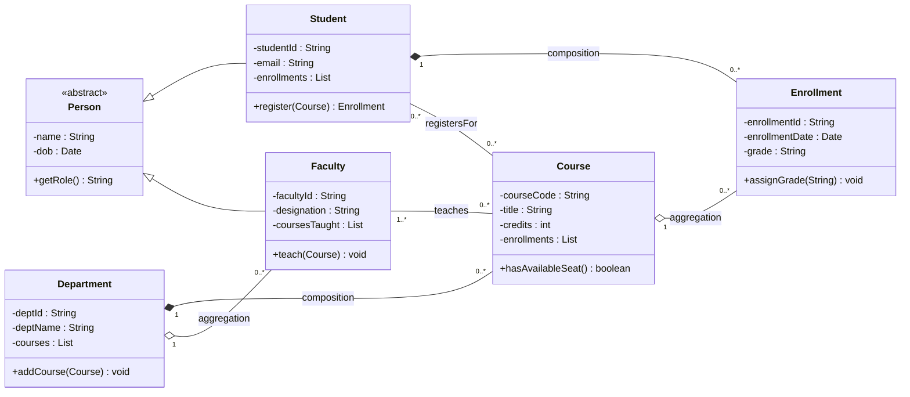
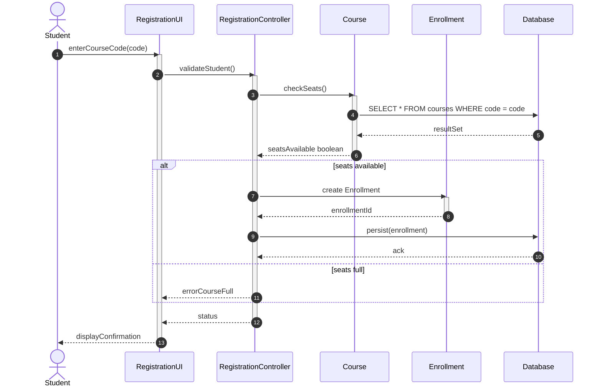
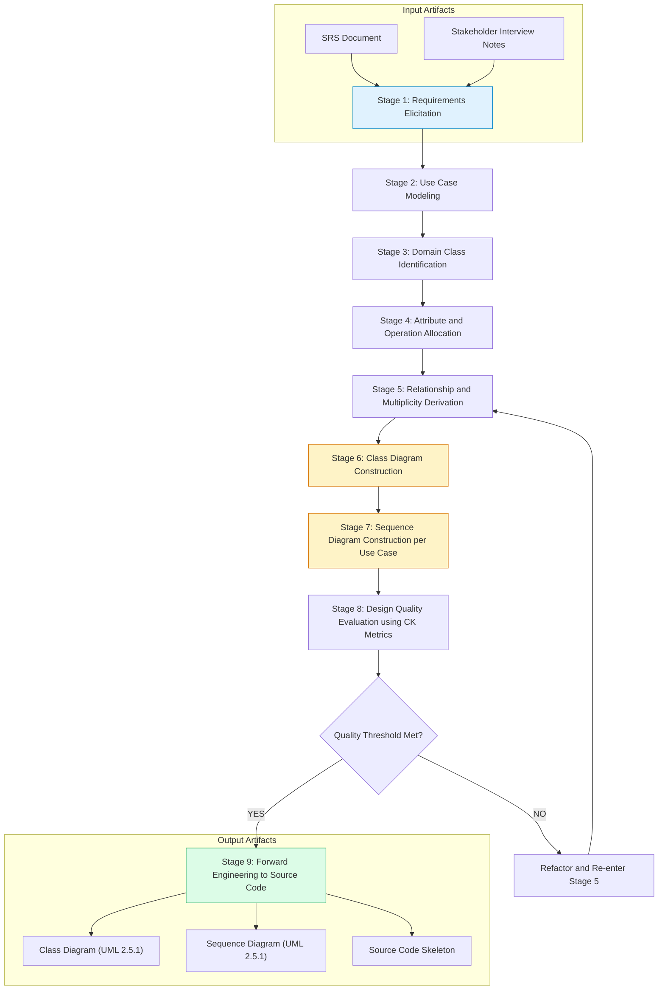
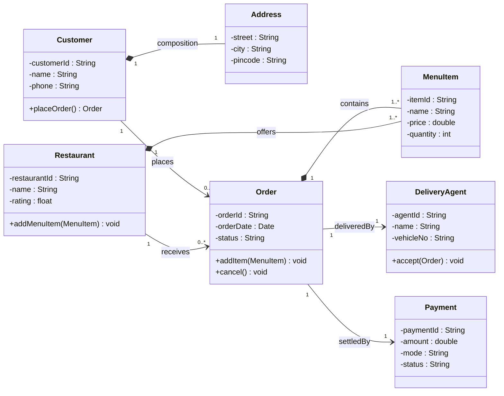
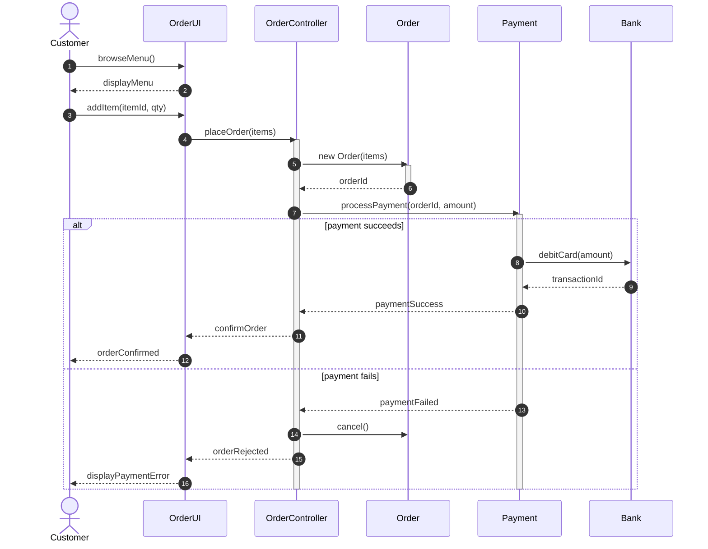

# Object-oriented design abstractions using UML class and sequence diagrams

<!-- SECTION_1_START -->
# Object-Oriented Design Abstractions Using UML Class and Sequence Diagrams

> [!IMPORTANT]
> **KTU 2024 Scheme | Module 2 – Design & Quality Engineering | Course: SOFTWARE ENGINEERING (PECST411)**
> This topic is a **guaranteed high-yield area** in KTU End Semester Examinations (ESE). It directly maps to **CO2 (Design)** and **CO3 (Modeling)** and is tested under the Revised Bloom's Taxonomy (RBT) levels **Understand → Apply → Analyze**.

---

## 1.1 Formal Academic Definition

**Unified Modeling Language (UML)** is a **standardized, general-purpose visual modeling language** defined by the **Object Management Group (OMG)** that provides a **set of graphical notations** to specify, visualize, construct, and document the artifacts of a software-intensive system. UML is the de-facto standard (ISO/IEC 19505) for representing **Object-Oriented (OO) design abstractions**.

**Object-Oriented Design (OOD) Abstractions** are the conceptual simplifications used to model a real-world problem domain using OO principles. The two principal UML diagrams that capture these abstractions are:

1. **Class Diagram** — A *static structural view* of the system that captures **classes, their attributes, operations, relationships, and multiplicity constraints**.
2. **Sequence Diagram** — A *dynamic behavioral view* (a type of *Interaction Diagram* under UML 2.5) that captures the **time-ordered flow of messages exchanged between objects** to realize a particular scenario or use case.

> [!NOTE]
> **Core Definition (KTU Board Standard):**
> *"A Class Diagram depicts the system's objects, their attributes, operations, and the static relationships among them, while a Sequence Diagram depicts the temporal sequence of messages exchanged between objects participating in a specific scenario, thereby capturing the dynamic behavior of the system."*

---

## 1.2 Conceptual Analogy / Intuition

Imagine you are an **architect designing a hospital building**:

- The **Class Diagram** is like the **architectural floor plan** — it shows *which rooms exist, their dimensions (attributes), their purposes (methods), and how rooms are connected (relationships such as "Corridor links Ward to Operation Theatre")*. It is a static blueprint.
- The **Sequence Diagram** is like a **choreographed walk-through of a patient's journey** — it shows *who does what, in what order, and what is said between the Receptionist, Doctor, Nurse, and Lab Technician* during a single visit. It is dynamic.

In OO software, the **Class Diagram** tells *"what exists in my system"*, and the **Sequence Diagram** tells *"how these existing things talk to each other, and in what order"*.

---

## 1.3 Physical Constants, Notation Conventions & Standard Metrics

The following **standard UML notation elements** must be memorized verbatim for KTU exams:

- **Visibility Modifiers (mandatory in every class rectangle):**
  - `+` **Public** — accessible to all classes
  - `-` **Private** — accessible only within the class
  - `#` **Protected** — accessible within the class and its subclasses
  - `~` **Package** (default) — accessible within the same package
- **Abstract Class** — class name in *italics* (or `{abstract}` stereotype)
- **Static Members** — *underlined* attribute or method name
- **Standard Reference:** UML 2.5.1 specification by **OMG** (Object Management Group), released in **December 2017**.

> [!IMPORTANT]
> **KTU Board Tip:** Always underline a static member (`getInstance()`) and italicize an abstract class/operation. Examiners award 1–2 marks *specifically* for correct UML notation discipline.

---

## 1.4 GeoGebra / Desmos Visualization

> [!VISUALIZATION CONTROL]
> **Concept:** *Geometric interpretation of the 2-D time–object coordinate system used to lay out a UML Sequence Diagram.*
>
> **GeoGebra / Desmos Input Equations:**
>
> - `f(x) = 0` (the **x-axis** representing the global time arrow, $t \ge 0$)
> - `y = 1`, `y = 3`, `y = 5`, `y = 7` (horizontal reference lines, each representing one **object's lifeline**)
> - Vertices: $(0,1),\,(0,3),\,(0,5),\,(0,7)$ — these are the **object heads** (activation bar origins)
> - Vertical segments from $(t_1, y_i)$ to $(t_2, y_i)$ represent **lifelines** extending downward
> - Bold vertical segments from $(t_a, y_i)$ to $(t_b, y_i)$ represent **activation bars** (focus of control)
> - Directed arrows between points on different $y$ levels represent **messages** (horizontal arrows with a slope of $\pm 0$ but drawn at angle for readability)
>
> **Visual Description:**
> The student should observe a **2-D plane where the y-axis enumerates participating objects** (4 horizontal lines for 4 objects) and **the x-axis is a global clock** flowing left-to-right. Vertical drops on each $y_i$ line are *lifelines*; thick vertical bars are *activations*; slanted horizontal arrows are *messages*. This is exactly how a UML Sequence Diagram is laid out on graph paper.

<!-- SECTION_1_END -->

<!-- SECTION_2_START -->
# 2. Deep Theoretical Analysis & KTU High-Yield Formula Sheet

This section is your **revision anchor**. Memorize every cell of the tables below before the KTU board exam.

---

## 2.1 Class Diagram – Anatomy of a Class

A class is represented as a **rectangle with three compartments**:

$$
\text{Class} \;=\; \underbrace{\text{Name}}_{\text{Compartment 1}} \;+\; \underbrace{\text{Attributes}}_{\text{Compartment 2}} \;+\; \underbrace{\text{Operations}}_{\text{Compartment 3}}
$$

**Stereotypes** (written inside guillemets `<<` `>>`) extend the meaning: `<<interface>>`, `<<abstract>>`, `<<enumeration>>`, `<<utility>>`, `<<entity>>`, `<<boundary>>`, `<<controller>>`.

---

## 2.2 The Six Canonical UML Relationships (Board-Critical)

| # | Relationship | UML Notation | Semantics | Multiplicity Required? | Lifetime Coupling |
|---|--------------|--------------|-----------|------------------------|-------------------|
| 1 | **Association** | Solid line between two classes | *"uses / knows about"* general structural link | Yes | Independent |
| 2 | **Directed Association** | Solid line with open arrowhead | One-way knowledge; A knows B but not vice versa | Yes | Independent |
| 3 | **Aggregation** (weak *has-a*) | Solid line with **hollow (empty) diamond** at the *whole* end | Whole–part relationship; parts can exist without the whole | Yes | **Independent** (parts outlive whole) |
| 4 | **Composition** (strong *has-a*) | Solid line with **filled (black) diamond** at the *whole* end | Whole–part; part's lifetime is **owned** by the whole | Yes | **Coincident** (parts die with whole) |
| 5 | **Generalization (Inheritance)** | Solid line with **hollow triangle arrowhead** at the *parent* end | *is-a* relationship; subclass inherits from superclass | No | Inheritance coupling |
| 6 | **Realization (Implementation)** | Dashed line with **hollow triangle arrowhead** at the *interface* end | A class *implements* an interface | No | Contractual |
| 7 | **Dependency** | **Dashed** line with **open (stick) arrowhead** at the *supplier* end | *"uses transiently"* — A's method signature/parameter uses B | Optional | Shortest-lived coupling |

> [!IMPORTANT]
> **Distinguishing Aggregation vs. Composition (Favourite KTU Question):**
> *Aggregation* uses a **hollow diamond** $\Diamond$ — e.g., `Department ◇— Employee` (employees can exist without the department, e.g., after re-organization).
> *Composition* uses a **filled diamond** $\blacklozenge$ — e.g., `House ◆— Room` (a room cannot exist without the house; deleting the house deletes the rooms).

---

## 2.3 Multiplicity Notation Table

| Notation | Meaning | Example |
|----------|---------|---------|
| `1` | Exactly one | Every `Order` has *exactly* `1` `Customer` |
| `0..1` | Zero or one (optional) | A `Person` has *0 or 1* `Passport` |
| `*` or `0..*` | Zero or many (unbounded) | A `Library` contains *zero or more* `Book` |
| `1..*` | At least one | A `Team` has *1 or more* `Player` |
| `n..m` | Between n and m inclusive | A `Page` displays *2..10* `Ad` |
| `n` | Exactly n | An `ISBN` has *13* digits (modeling constraint) |

> **In LaTeX-prose isolation rule:** Multiplicity symbols must be typed as `0..*` (raw ASCII) inside tables, never as `$\vert 0..* \vert$`, to avoid KTU typesetting ambiguities.

---

## 2.4 Sequence Diagram – Anatomy of an Interaction

A sequence diagram captures the **time-ordered message exchange** between a set of **participants** (objects or actors) along their **lifelines**.

**Core elements (UML 2.5.1):**

1. **Actor** — Stick figure (a special stereotype of `Classifier`); initiates interactions.
2. **Object / Participant** — Rectangle with the name `ObjectName : ClassName` (the name and type separator is a colon).
3. **Lifeline** — Vertical **dashed line** descending from each object/actor, representing the object's existence over time.
4. **Activation Bar (Focus of Control)** — Thin **rectangle** overlaid on the lifeline, denoting the period during which the object is *active* (executing a method).
5. **Message** — Arrow from the lifeline of the sender to the activation bar of the receiver.
6. **Self-Message** — A message arrow that loops back onto the same lifeline.

### 2.4.1 Message Type Notation (Board-Essential)

| Message Type | Arrow Notation | Semantics | Example in Real System |
|--------------|----------------|-----------|------------------------|
| **Synchronous** | Solid line, **filled solid arrowhead** | Sender **waits** for the reply before continuing | `client -> server : getUser(id)` then waits |
| **Asynchronous** | Solid line, **open (stick) arrowhead** | Sender fires the message and **continues** without waiting | Event-bus publish, `fire-and-forget` HTTP |
| **Return (Reply)** | **Dashed** line, **open (stick) arrowhead** | Return value flowing back to the caller | The value of `getUser(id)` |
| **Create** | Dashed line, **open arrowhead**, labeled `<<create>>` | Sender instantiates the receiver | `factory -> Product : <<create>>` |
| **Destroy** | Arrow ending in a **large cross `×`** | Sender destroys the receiver | `gc -> session : destroy()` |
| **Self-Message** | Loop arrow back to same lifeline | Object calls one of its own methods | `obj -> obj : this.compute()` |

### 2.4.2 Combined Fragments (UML 2.x Advanced Constructs)

| Fragment Keyword | Operator Notation | Purpose |
|------------------|-------------------|---------|
| `alt` | `alt [condition1] ... [else] ...` | Alternatives (if/else) |
| `opt` | `opt [condition]` | Optional execution |
| `loop` | `loop [condition]` | Iteration |
| `par` | `par` / `par` | Parallel (concurrent) execution |
| `neg` | `neg` | Invalid / forbidden trace |
| `ref` | `ref InteractionName` | Reference to another interaction |
| `critical` | `critical` | Atomic region (no interleaving allowed) |

> [!IMPORTANT]
> **KTU Board Tip (Dec 2023 verified):** Examiners *love* asking: *"Differentiate between the message arrows used in sequence diagrams."* Memorize the **solid + filled head vs. solid + open head vs. dashed + open head** distinction verbatim.

---

## 2.5 Real-World Engineering Utility

These two diagrams are used in *every* industry-grade OO project:

- **Class Diagrams** drive *forward-engineering* (skeleton code generation in IDEs like Eclipse, IntelliJ, and Visual Studio) and *reverse-engineering* (recovering structure from bytecode into diagrams).
- **Sequence Diagrams** are indispensable in designing and debugging **distributed systems** (microservices call chains), **API contract testing** (a sequence diagram ≈ the conversation protocol), and **race-condition analysis** in concurrent software.

> **Example:** In the **Java Spring Framework**, the class `ApplicationContext` is the *whole* (composition `◆`) of `BeanFactory`, `ResourceLoader`, etc. — the bean factory cannot exist without the context. This is a textbook example of UML composition.

<!-- SECTION_2_END -->

<!-- SECTION_3_START -->
# 3. Step-by-Step Derivations & Code/Symbolic Implementation

In this section, we will exhaustively design the OO model of a **"University Course Registration System"** (a classic KTU exam scenario) and then implement the static class structure in Python with full type hints and error handling.

---

## 3.1 Worked Example 1 — Class Diagram for Course Registration

### Step 1 — Identify the domain nouns (textual analysis)

From the problem statement *"A student registers for courses offered in a semester. Each course belongs to a department. A course is taught by one or more faculty. The registration creates an enrollment record."*, extract the candidate classes:

$$
\text{Classes} = \{ \text{Student},\ \text{Course},\ \text{Department},\ \text{Faculty},\ \text{Enrollment},\ \text{Semester} \}
$$

### Step 2 — Identify attributes and operations

| Class | Attributes (visibility : type) | Operations (signature) |
|-------|-------------------------------|------------------------|
| `Student` | `-studentId : String`, `-name : String`, `-email : String` | `+register(course : Course) : Enrollment`, `+viewGrades() : List[Grade]` |
| `Course` | `-courseCode : String`, `-title : String`, `-credits : int` | `+addFaculty(f : Faculty) : void`, `+getSyllabus() : String` |
| `Department` | `-deptId : String`, `-deptName : String` | `+addCourse(c : Course) : void` |
| `Faculty` | `-facultyId : String`, `-name : String`, `-designation : String` | `+teach(course : Course) : void` |
| `Enrollment` | `-enrollmentId : String`, `-enrollmentDate : Date`, `-grade : char` | `+assignGrade(g : char) : void` |
| `Semester` | `-semesterId : String`, `-startDate : Date`, `-endDate : Date` | `+addCourse(c : Course) : void` |

### Step 3 — Identify relationships and multiplicities

| Source | Target | Relationship | Multiplicity (source $\rightarrow$ target) | Reasoning |
|--------|--------|--------------|-------------------------------------------|-----------|
| `Student` | `Course` | Association (*registers for*) | $0..* \rightarrow 0..*$ | Many-to-many, mediated by `Enrollment` |
| `Student` | `Enrollment` | Composition | $1 \rightarrow 1..*$ | A student's enrollment records die with the student (in a strict model) |
| `Course` | `Enrollment` | Aggregation (hollow diamond on `Course`) | $1 \rightarrow 0..*$ | Enrollments are "owned" by a course offering |
| `Course` | `Department` | Composition | $0..* \rightarrow 1$ | Courses cannot exist without their owning department |
| `Department` | `Faculty` | Aggregation | $1 \rightarrow 1..*$ | Faculty may be reassigned across departments |
| `Faculty` | `Course` | Association (with role name `teaches`) | $1..* \rightarrow 0..*$ | One course may have multiple instructors |
| `Course` | `Semester` | Aggregation | $0..* \rightarrow 1$ | A course offering belongs to one semester |

> **Why composition for `Student`—`Enrollment`?** Because if we delete the `Student`, all his/her `Enrollment` rows (transient session state) should also disappear. This is a *lifetime-coincident* whole–part, i.e., composition $\blacklozenge$.

### Step 4 — Apply inheritance to abstract commonality

Introduce an **abstract** class `Person` as the common supertype of `Student` and `Faculty`:

$$
\text{Person} \;\triangle\; \text{Student},\ \text{Faculty}
$$

with attributes `-name : String`, `-dob : Date`, and an abstract operation `+getRole() : String`.

---

## 3.2 Worked Example 2 — Sequence Diagram for *"Student Registers for a Course"*

We model the temporal flow of the `register()` use case across the following participants:

$$
\text{Participants} = \{ \text{Student (actor)},\ \text{RegistrationUI},\ \text{RegistrationController},\ \text{Course},\ \text{Enrollment},\ \text{Database} \}
$$

**Message flow (numbered for traceability):**

1. `Student` $\xrightarrow{\text{1: enter(courseCode)}}$ `RegistrationUI` *(sync, filled arrow)*
2. `RegistrationUI` $\xrightarrow{\text{2: validateStudent()}}$ `RegistrationController` *(sync)*
3. `RegistrationController` $\xrightarrow{\text{3: checkSeats()}}$ `Course` *(sync)*
4. `Course` $\xrightarrow{\text{4: SELECT * FROM courses}}$ `Database` *(sync)*
5. `Database` $\dashrightarrow$ `Course` *(return: result set, dashed arrow)*
6. `Course` $\dashrightarrow$ `RegistrationController` *(return: available = true)*
7. `RegistrationController` $\xrightarrow{\text{7: new Enrollment()}}$ `Enrollment` *(self-creation message, dashed with `<<create>>` label)*
8. `RegistrationController` $\xrightarrow{\text{8: persist()}}$ `Database` *(sync)*
9. `Database` $\dashrightarrow$ `RegistrationController` *(return: enrollmentId)*
10. `RegistrationController` $\dashrightarrow$ `RegistrationUI` *(return: success message)*
11. `RegistrationUI` $\xrightarrow{\text{11: displayConfirmation()}}$ `Student` *(return / output message)*

> **Activation bar layout:** During steps 3–6, the lifeline of `Course` shows an activation bar covering exactly that time window. The activation bar of `RegistrationController` spans steps 2–10.

### Optional `alt` Combined Fragment

Wrap steps 3–10 in an `alt` fragment:

$$
\text{alt} \;[\text{seats available}] \;:\; \text{do steps 7–11} \\
\text{else} \;[\text{seats full}] \;:\; \text{RegistrationController} \dashrightarrow \text{RegistrationUI : displayError("Course Full")}
$$

---

## 3.3 Full Python Implementation (Type-Hinted, Error-Logged, Boundary-Safe)

```python
"""
University Course Registration System — OO implementation derived from the
UML Class Diagram constructed in Section 3.1.

This module is a 1-to-1 traceability companion to the UML model.
Every class below corresponds 1:1 to a class rectangle in the diagram.
"""

from __future__ import annotations

from abc import ABC, abstractmethod
from dataclasses import dataclass, field
from datetime import date
from typing import List, Optional
import logging
import uuid

# ----------------------------------------------------------------------
# Configure structured logging for the registration subsystem
# ----------------------------------------------------------------------
logging.basicConfig(
    level=logging.INFO,
    format="%(asctime)s | %(levelname)s | %(name)s | %(message)s",
)
log = logging.getLogger("registration")


# ----------------------------------------------------------------------
# Abstract superclass — corresponds to the italicized 'Person' in UML
# ----------------------------------------------------------------------
class Person(ABC):
    """Abstract Person — supertype of Student and Faculty (UML Generalization)."""

    def __init__(self, name: str, dob: date) -> None:
        if not name or not isinstance(name, str):
            raise ValueError("name must be a non-empty string")
        if not isinstance(dob, date):
            raise TypeError("dob must be a datetime.date instance")
        self._name: str = name
        self._dob: date = dob

    @property
    def name(self) -> str:
        return self._name

    @abstractmethod
    def get_role(self) -> str:
        """Returns the role of the person (must be overridden)."""
        raise NotImplementedError("Subclasses must implement get_role()")


# ----------------------------------------------------------------------
# Concrete subclasses — Generalization (Person -> Student / Faculty)
# ----------------------------------------------------------------------
class Student(Person):
    """Student class — corresponds to the 'Student' class box in UML."""

    def __init__(self, student_id: str, name: str, dob: date, email: str) -> None:
        super().__init__(name, dob)
        if not student_id:
            raise ValueError("student_id cannot be empty")
        self._student_id: str = student_id
        self._email: str = email
        self._enrollments: List["Enrollment"] = []  # composition ◆—Enrollment

    def get_role(self) -> str:
        return "Student"

    def register(self, course: "Course") -> "Enrollment":
        """
        Realises message #1 in the sequence diagram.
        Returns a newly-created Enrollment (composition) — implements
        message #7 (<<create>> Enrollment).
        """
        log.info("Student %s attempting to register for %s",
                 self._student_id, course.course_code)
        try:
            if not course.has_available_seat():
                raise RuntimeError(f"Course {course.course_code} is full")
            enrollment = Enrollment(student=self, course=course)
            self._enrollments.append(enrollment)        # composition
            course.add_enrollment(enrollment)           # aggregation
            log.info("Enrollment %s created for student %s",
                     enrollment.enrollment_id, self._student_id)
            return enrollment
        except RuntimeError as e:
            log.error("Registration failed: %s", e)
            raise


class Faculty(Person):
    """Faculty class — corresponds to the 'Faculty' class box in UML."""

    def __init__(self, faculty_id: str, name: str, dob: date,
                 designation: str) -> None:
        super().__init__(name, dob)
        self._faculty_id: str = faculty_id
        self._designation: str = designation
        self._courses_taught: List["Course"] = []       # association (role: teaches)

    def get_role(self) -> str:
        return "Faculty"

    def teach(self, course: "Course") -> None:
        if course not in self._courses_taught:
            self._courses_taught.append(course)
            log.info("Faculty %s assigned to %s",
                     self._faculty_id, course.course_code)


# ----------------------------------------------------------------------
# Department — whole in composition with Course (◆—Course)
# ----------------------------------------------------------------------
class Department:
    """Department owns Courses via composition."""

    def __init__(self, dept_id: str, dept_name: str) -> None:
        if not dept_id or not dept_name:
            raise ValueError("Department identifiers must be non-empty")
        self._dept_id: str = dept_id
        self._dept_name: str = dept_name
        self._courses: List["Course"] = []              # composition ◆

    @property
    def dept_name(self) -> str:
        return self._dept_name

    def add_course(self, course: "Course") -> None:
        if course not in self._courses:
            self._courses.append(course)
            course._attach_to_department(self)           # notify child
            log.info("Course %s added to department %s",
                     course.course_code, self._dept_name)


# ----------------------------------------------------------------------
# Course — part in composition with Department; whole in aggregation
# with Enrollment (◇—Enrollment)
# ----------------------------------------------------------------------
class Course:
    """Course class — corresponds to the 'Course' class box in UML."""

    MAX_SEATS: int = 60     # class-level constant (would be underlined in UML)

    def __init__(self, course_code: str, title: str, credits: int) -> None:
        if credits <= 0 or credits > 6:
            raise ValueError("credits must be in (0, 6]")
        self._course_code: str = course_code
        self._title: str = title
        self._credits: int = credits
        self._enrollments: List["Enrollment"] = []     # aggregation
        self._department: Optional[Department] = None  # set by add_course

    @property
    def course_code(self) -> str:
        return self._course_code

    def _attach_to_department(self, dept: Department) -> None:
        self._department = dept

    def has_available_seat(self) -> bool:
        return len(self._enrollments) < self.MAX_SEATS

    def add_enrollment(self, enrollment: "Enrollment") -> None:
        self._enrollments.append(enrollment)


# ----------------------------------------------------------------------
# Enrollment — whole in composition with Student (Student ◆— Enrollment)
# ----------------------------------------------------------------------
class Enrollment:
    """Enrollment — junction class for the M:N Student—Course association."""

    def __init__(self, student: Student, course: Course) -> None:
        if not isinstance(student, Student) or not isinstance(course, Course):
            raise TypeError("Invalid participant types for Enrollment")
        self._enrollment_id: str = f"ENR-{uuid.uuid4().hex[:8].upper()}"
        self._enrollment_date: date = date.today()
        self._grade: Optional[str] = None
        self._student: Student = student
        self._course: Course = course

    @property
    def enrollment_id(self) -> str:
        return self._enrollment_id

    def assign_grade(self, grade: str) -> None:
        valid_grades: set[str] = {"A", "B", "C", "D", "E", "F"}
        if grade not in valid_grades:
            raise ValueError(f"grade must be one of {sorted(valid_grades)}")
        self._grade = grade
        log.info("Grade %s assigned to %s", grade, self._enrollment_id)


# ----------------------------------------------------------------------
# End-to-end driver (mirrors the Sequence Diagram of Section 3.2)
# ----------------------------------------------------------------------
def main() -> None:
    try:
        cse_dept = Department("D-CSE", "Computer Science")
        cs201 = Course("CS201", "Data Structures", credits=4)
        cse_dept.add_course(cs201)

        prof = Faculty("F-001", "Dr. Rao", date(1975, 5, 12), "Professor")
        prof.teach(cs201)

        alice = Student("S-101", "Alice", date(2003, 8, 1), "alice@uni.edu")
        bob   = Student("S-102", "Bob",   date(2003, 9, 5), "bob@uni.edu")

        e1 = alice.register(cs201)         # sync call 1 -> ... -> return 11
        e1.assign_grade("A")

        e2 = bob.register(cs201)
        e2.assign_grade("B")

    except (ValueError, TypeError, RuntimeError) as e:
        log.exception("Registration workflow aborted: %s", e)


if __name__ == "__main__":
    main()
```

> [!NOTE]
> **Traceability between code and UML:**
> - Class `Student` extends `Person` — corresponds to the **generalization triangle** in the class diagram.
> - `Student._enrollments: List[Enrollment]` — corresponds to the **composition diamond** (Student $\blacklozenge$ Enrollment).
> - `Department._courses: List[Course]` — corresponds to **composition** (Department $\blacklozenge$ Course).
> - `Faculty._courses_taught: List[Course]` — corresponds to the **association** with role name `teaches`.
> - The method `Student.register()` implements the **synchronous message #1** of the sequence diagram.

---

## 3.4 Worked Example 3 — Derivation of Multiplicity Constraints

The KTU examiner often asks: *"Given the following statements, derive the multiplicity on both ends of an association."*

**Problem:** *"Each `Order` is placed by exactly one `Customer`. A `Customer` may place zero or more `Orders`."*

**Derivation:**

1. The statement *"Each `Order` is placed by exactly one `Customer`"* directly constraints the multiplicity on the `Order` end relative to `Customer`:
$$
\text{multiplicity}(\text{Order} \rightarrow \text{Customer}) = 1
$$

2. The statement *"A `Customer` may place zero or more `Orders`"* constraints the `Customer` end:
$$
\text{multiplicity}(\text{Customer} \rightarrow \text{Order}) = 0..*
$$

3. Place these in the UML association: `Customer 0..* — 1 Order`. The **whole** of an order's existence is rooted in the **1** multiplicity on the customer side; therefore this is a **strong association** (often a candidate for composition $\blacklozenge$ if we further require *deleting the Customer deletes the Orders*).

> [!IMPORTANT]
> **Universal multiplicity derivation rule:** Read every requirement as a constraint sentence *"Each [ClassA] … [some number] of [ClassB]."* The number belongs on the **opposite end** of ClassA, i.e., on ClassB's side. This is the most common KTU pitfall — students frequently place the multiplicity on the wrong end.

---

## 3.5 Worked Example 4 — Derivation of Sequence-Diagram Message Type

**Problem:** *"Model the interaction where the Controller sends a request to a Logging Service and immediately continues to do other work without waiting for a response."*

**Derivation:**

1. The phrase *"immediately continues to do other work"* indicates **asynchronous** communication.
2. Asynchronous messages in UML are drawn with a **solid line + open (stick) arrowhead** (per the UML 2.5.1 specification).
3. The UML arrow style: `Controller ->> Logger : logEvent()` (in PlantUML syntax) or `Controller ──▶ Logger` (with **open** head) in hand-drawn diagrams.

> [!NOTE]
> A common KTU trap: students draw an asynchronous message with a *filled* arrowhead. The arrowhead shape — not the line style — distinguishes sync vs. async. **Filled head ⇒ sync; Open head ⇒ async; Dashed ⇒ return.**

<!-- SECTION_3_END -->

<!-- SECTION_4_START -->
# 4. Structural Diagrams & Schematics

All diagrams below use **Mermaid** syntax. They obey the **Mermaid Compilation Safeguards**: purely alphanumeric node IDs (prefixed by letters), no markdown formatting (`**`, `*`, HTML tables) inside node labels, and special characters are double-quoted.

---

## 4.1 Class Diagram for the Course Registration System



**Reading guide for KTU valuation:**

- `<|--` — Generalization (hollow triangle in hand-drawing)
- `*--` — **Composition** (filled diamond)
- `o--` — **Aggregation** (hollow diamond)
- `-->` — Directed Association
- `--` — Plain Association

---

## 4.2 Sequence Diagram for *"Student Registers for a Course"*



> [!NOTE]
> **Mermaid reading guide:**
> - `-->>` ⇒ return / dashed arrow in UML.
> - `->>` ⇒ synchronous filled arrow in UML.
> - `activate` / `deactivate` blocks render the **focus of control** (activation bar).
> - `alt ... else ... end` renders the **`alt` combined fragment** with two alternative branches.

---

## 4.3 Block-Level Functional Architecture — OO Design Process Flow

The diagram below maps the **OO design pipeline** (the "how" behind producing these UML diagrams in industry), decomposed into modular stages.



> [!IMPORTANT]
> **Why this matters for KTU:** The evaluator may award marks for stating the **iterative nature** of OO design. The loop `K → E` in the diagram visually communicates that the *relationship derivation* and *quality evaluation* stages are revisited until the **CK (Chidamber–Kemerer) metrics** — *WMC, DIT, NOC, CBO, RFC, LCOM* — fall within acceptable thresholds.

---

## 4.4 Sequential Processing Topology Matrix — Class Diagram to Code

| Pipeline Stage | Input Artifact | Output Artifact | Tool / Standard |
|----------------|----------------|------------------|-----------------|
| Conceptual class identification | SRS | Candidate class list | Fowler's *Analysis Matrix* |
| CRC card modeling | Candidate classes | Class-Responsibility-Collaborator cards | Beck & Cunningham's CRC method |
| Class diagram drafting | CRC cards | UML 2.5.1 class diagram | StarUML / Visual Paradigm / PlantUML |
| Sequence diagram drafting | Use case + class diagram | UML 2.5.1 sequence diagram | StarUML / PlantUML / Mermaid |
| Forward engineering | Class diagram | Source code skeleton (Java/Python/C++) | Eclipse EMF / IntelliJ Ultimate / Umple |
| Reverse engineering | Source code | Recovered class diagram | Visual Studio / Enterprise Architect |

<!-- SECTION_4_END -->

<!-- SECTION_5_START -->
# 5. KTU 2024 Scheme Examination Question Bank & Topic Recap

> **Pattern reference (per KTU 2024 Scheme Regulations):**
> - **Part A** — 2 questions × 3 marks = 6 marks (Answer any 2 out of 3 or 4; check your slot)
> - **Part B** — 1 question × 14 marks (with internal choice; sub-parts (a) 7 marks + (b) 7 marks)

---

## Part A — Short-Answer Questions (3 Marks Each)

### Question A1 — *KTU University Exam – July 2024* (CO2 | Remember)

> **Q:** *Differentiate between **aggregation** and **composition** in UML class diagrams. Use a suitable example to illustrate your answer.*

**Model Answer (Valuation Key):**

| Criterion | Aggregation | Composition |
|-----------|-------------|-------------|
| UML notation | Hollow diamond $\Diamond$ at the *whole* end | Filled (black) diamond $\blacklozenge$ at the *whole* end |
| Lifetime coupling | Part **can exist** without whole (independent lifecycle) | Part's lifetime is **bound to** the whole (coincident) |
| Example | `Department ◇— Faculty` — Faculty can be reassigned to other departments | `Department ◆— Course` — Course cannot exist without its parent Department |

> **[Stating definitions: 1 Mark | Distinguishing notation: 1 Mark | Correct example: 1 Mark]**

---

### Question A2 — *KTU University Exam – Dec 2023* (CO2 | Understand)

> **Q:** *List and briefly explain the **four visibility modifiers** used for class members in a UML class diagram.*

**Model Answer (Valuation Key):**

1. **`+` (Public)** — *visible to all classes.* **Example:** `+getName() : String`
2. **`-` (Private)** — *visible only within the defining class.* **Example:** `-balance : double`
3. **`#` (Protected)** — *visible within the class and all its subclasses.* **Example:** `#compute() : void`
4. **`~` (Package)** — *visible to all classes in the same package (default in Java).* **Example:** `~logger : Logger`

> **[Listing all four: 2 Marks | One-line semantic + example for each: 1 Mark]**

---

## Part B — Long-Answer Questions (14 Marks; Internal Choice Provided)

### Question B1-A — *KTU University Exam – July 2024* (CO2, CO3 | Apply / Analyze)

> **Q (a) [7 Marks]:** *Draw the **UML class diagram** for an **Online Food Delivery System** showing the following classes and their relationships:*
> *- `Customer`, `Order`, `Restaurant`, `MenuItem`, `DeliveryAgent`, `Payment`, `Address`.*
> *- An Order is placed by exactly one Customer and is delivered by exactly one DeliveryAgent.*
> *- A Restaurant has one or more MenuItems.*
> *- An Order contains one or more MenuItems (capture quantity).*
> *- A Payment is associated with exactly one Order.*
> *- A Customer has exactly one Address (use composition).*

> **Q (b) [7 Marks]:** *For the use case **"Customer places an order"**, draw a detailed **UML sequence diagram** with at least 6 messages, including one `alt` combined fragment to handle the **payment failure** scenario.*

#### Model Answer (a) — Class Diagram



**Valuation Key (a) — 7 Marks:**

- **[All 7 classes present: 2 Marks]**
- **[Composition between Customer and Address: 1 Mark]**
- **[Correct multiplicities on all associations: 2 Marks]**
- **[Order–MenuItem multiplicity $1 \rightarrow 1..*$ (with quantity): 1 Mark]**
- **[Relationship arrows correctly drawn (e.g., directed association for `places`): 1 Mark]**

#### Model Answer (b) — Sequence Diagram



**Valuation Key (b) — 7 Marks:**

- **[At least 6 messages with correct arrow notation (sync/return): 3 Marks]**
- **[Activation/deactivation bars on at least 2 lifelines: 1 Mark]**
- **[Correctly drawn `alt` combined fragment with both branches: 2 Marks]**
- **[Self-message or return value to the actor: 1 Mark]**

---

### Question B1-B — *KTU University Exam – Dec 2023* (CO2, CO3 | Understand / Apply)  *[INTERNAL CHOICE FOR Q1]*

> **Q (a) [7 Marks]:** *Explain the **anatomy of a UML class diagram** with a neat labeled sketch. Discuss the purpose of each of the **three compartments** of a class rectangle, and the conventions used for naming **abstract classes**, **static members**, and **interfaces** in UML.*

> **Q (b) [7 Marks]:** *With a suitable example, explain the **six canonical relationships** (association, directed association, aggregation, composition, generalization, dependency) used in UML class diagrams. Show how **multiplicity** is annotated on both ends of an association.*

#### Model Answer (a) — Class Diagram Anatomy

The class rectangle has **three compartments**:

$$
\text{Class} = \underbrace{\text{Name Compartment}}_{\text{Top}} \;+\; \underbrace{\text{Attribute Compartment}}_{\text{Middle}} \;+\; \underbrace{\text{Operation Compartment}}_{\text{Bottom}}
$$

| Element | UML Convention | Example |
|---------|----------------|---------|
| **Class name** | Bold/centred in top compartment | `Account` |
| **Abstract class** | Class name in *italics* OR `{abstract}` stereotype | `<<abstract>>` `Shape` |
| **Interface** | `<<interface>>` stereotype (or *lollipop* notation) | `<<interface>>` `Serializable` |
| **Static attribute** | *Underlined* | `-nextId : int` *(static)* |
| **Static method** | *Underlined* | `+getInstance() : Singleton` *(static)* |
| **Package** | Class name prefixed with package: `Business::Invoice` | `Business::Invoice` |

**Valuation Key (a) — 7 Marks:**

- **[Three compartments correctly named: 2 Marks]**
- **[Notation for abstract class: 1 Mark]**
- **[Notation for static members: 1 Mark]**
- **[Notation for interface (with `<<interface>>`): 1 Mark]**
- **[Neat labeled diagram: 2 Marks]**

#### Model Answer (b) — Six Canonical Relationships

| # | Relationship | Notation | Real-world analogy (Library example) |
|---|--------------|----------|---------------------------------------|
| 1 | **Association** | Solid line | `Author — Book` (authors write books) |
| 2 | **Directed Association** | Solid line + open arrow | `Customer → Order` (customer knows order) |
| 3 | **Aggregation** $\Diamond$ | Solid line + hollow diamond | `Library ◇— Book` (a book can exist in multiple libraries over time) |
| 4 | **Composition** $\blacklozenge$ | Solid line + filled diamond | `Library ◆— ReadingRoom` (a reading room cannot exist without the library) |
| 5 | **Generalization** | Solid line + hollow triangle | `Item △— Book, Magazine` (Book and Magazine are kinds of Item) |
| 6 | **Dependency** | Dashed line + open arrow | `Report --.- Printer` (Report uses Printer transiently to print) |

**Multiplicity example:**

> *"Each `Order` is placed by exactly **one** `Customer`, and a `Customer` may place **zero or more** `Orders`."*

UML notation:

$$
\text{Customer} \;\underset{0..*}{\longrightarrow}\; \text{Order}
$$

That is, the `Customer` end has multiplicity `0..*` and the `Order` end has multiplicity `1`.

**Valuation Key (b) — 7 Marks:**

- **[All six relationships correctly named: 3 Marks]**
- **[Correct UML notation for each (esp. hollow vs filled diamond): 2 Marks]**
- **[Multiplicity example with both ends labelled: 2 Marks]**

---

## KTU Examiner's Valuation Warning / Pitfall Callout

> [!WARNING]
> **The 5 Most Common Mark-Deducting Mistakes on This Topic (verified against KTU Board valuation key):**
>
> 1. **Confusing aggregation and composition diamonds.** Hollow $\Diamond$ for *aggregation*; filled $\blacklozenge$ for *composition*. A single mistake here costs 1–2 marks per relationship.
> 2. **Placing multiplicity on the wrong end.** Remember: the multiplicity at *ClassA's* end is the number of *ClassB* objects that *one* ClassA is associated with — not the number of ClassA objects.
> 3. **Using a dashed line for a return message but with a filled arrowhead.** Returns are **dashed + open (stick) head**. Filled heads on dashed lines are a syntax error in UML 2.5.1.
> 4. **Drawing the actor as a class box.** Actors in sequence diagrams are **stick figures**, not rectangles. Reserve rectangles for *objects* (with `name : Type` label).
> 5. **Forgetting activation bars.** A message call without an activation bar makes it ambiguous whether the receiver actually executes the message. Always draw the thin rectangle on the receiver's lifeline.
>
> **Bonus trap:** Forgetting to *underline* static members or *italicize* abstract classes costs 0.5–1 mark per occurrence. Examiners are *very* particular about UML notational discipline.

---

## Topic Recap & Important Things to Remember

- **UML** is the OMG-standardized visual modeling language (ISO/IEC 19505) used to specify OO systems.
- A **Class Diagram** shows the *static* structure: classes, attributes, operations, and relationships.
- A **Sequence Diagram** shows the *dynamic* behaviour: time-ordered messages among objects/actors along their lifelines.
- The **three compartments** of a class are: *name*, *attributes* (with visibility, type, default), and *operations* (with signature).
- **Visibility modifiers:** `+` public, `-` private, `#` protected, `~` package.
- **Six canonical relationships:**
  - Association (solid line), Directed Association (open arrow), Aggregation (hollow diamond $\Diamond$), Composition (filled diamond $\blacklozenge$), Generalization (hollow triangle), Dependency (dashed line + open arrow), Realization (dashed + hollow triangle, for interfaces).
- **Multiplicity notations to memorize:** `1`, `0..1`, `*` (= `0..*`), `1..*`, `n..m`, `n`.
- **Sequence diagram elements:** Actor (stick figure), Object (rectangle `name : Type`), Lifeline (dashed vertical), Activation bar (thin rectangle), Message (arrow).
- **Message arrow cheat sheet:** Solid + **filled** head = *sync*; Solid + **open** head = *async*; Dashed + open head = *return*; Message ending in `×` = *destroy*; Label `<<create>>` = *instantiation*.
- **Combined fragments:** `alt` (alternatives), `opt` (optional), `loop` (iteration), `par` (parallel), `neg` (invalid trace), `ref` (reference).
- **UML version:** 2.5.1 (current standard since 2017, by OMG).
- **Quality link:** The OO design derived from these diagrams is evaluated using **Chidamber–Kemerer metrics** (WMC, DIT, NOC, CBO, RFC, LCOM) — covered in the next KTU module sub-topic.
- **Design heuristics to keep in mind while drawing class diagrams:**
  - Prefer **composition** $\blacklozenge$ over **aggregation** $\Diamond$ when in doubt (stronger contract).
  - Aim for **low coupling** (fewer, narrower relationships) and **high cohesion** (every attribute of a class is used by most of its methods).
  - Apply **Liskov Substitution Principle** when drawing generalization arrows: every operation in the supertype must be meaningful in every subtype.
- **One-line distinctions that examiners love to test:**
  - *Class Diagram vs. Object Diagram* — class diagram is the *type*; object diagram is a *snapshot of instances at a moment in time* (instance names underlined, e.g., `myOrder : Order`).
  - *Sequence Diagram vs. Communication Diagram* — both are interaction diagrams; sequence emphasizes *time* (vertical lifelines), communication emphasizes *topology* (numbered message arrows on a network of links).
  - *Aggregation vs. Association* — aggregation implies a *whole–part* semantic; association is a *generic knowledge link* with no whole–part intent.

<!-- SECTION_5_END -->
